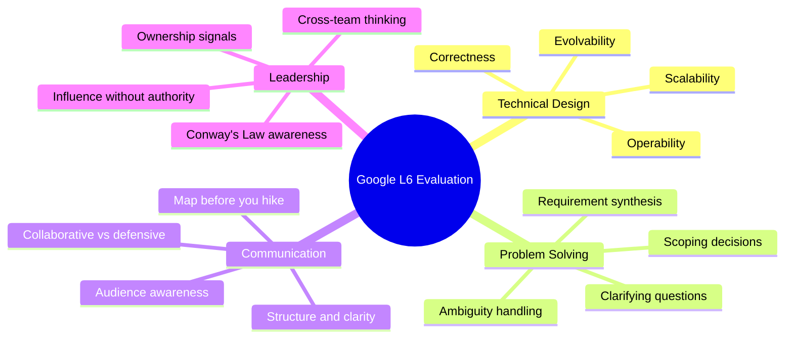
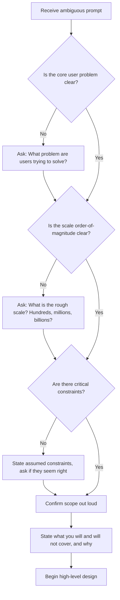
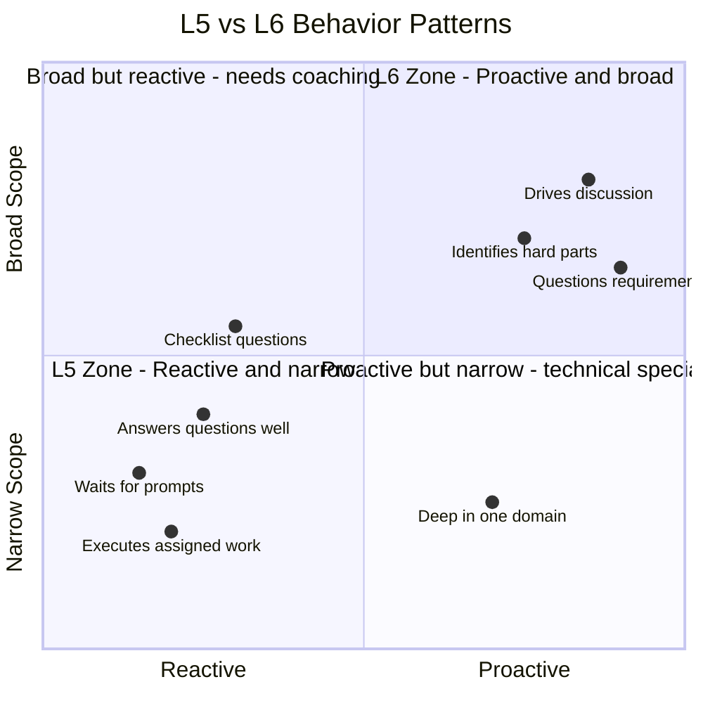
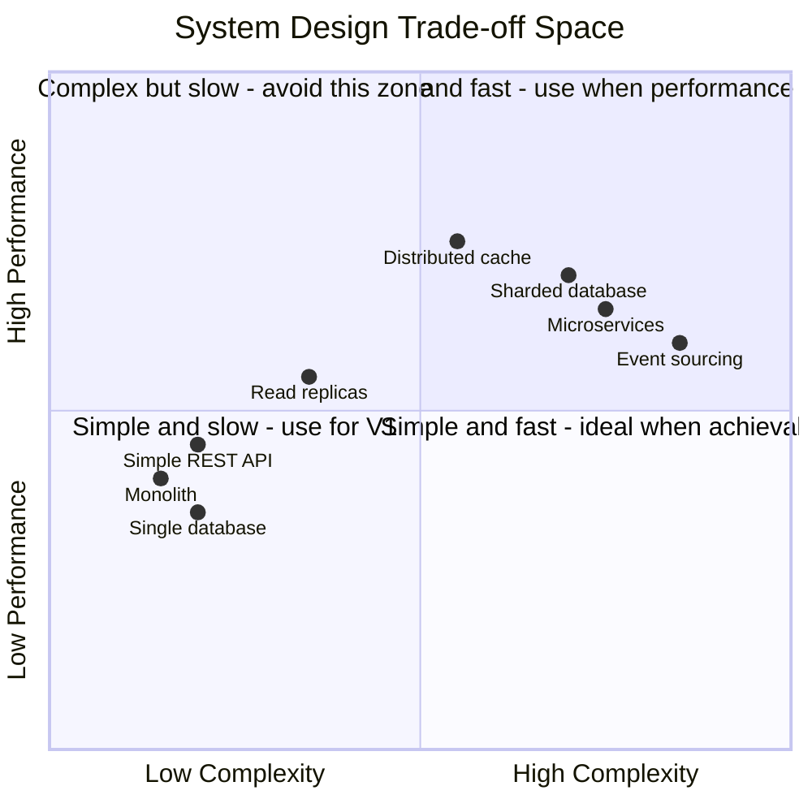
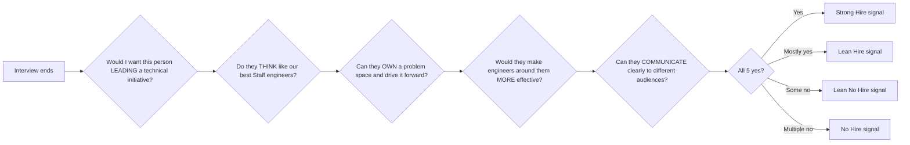
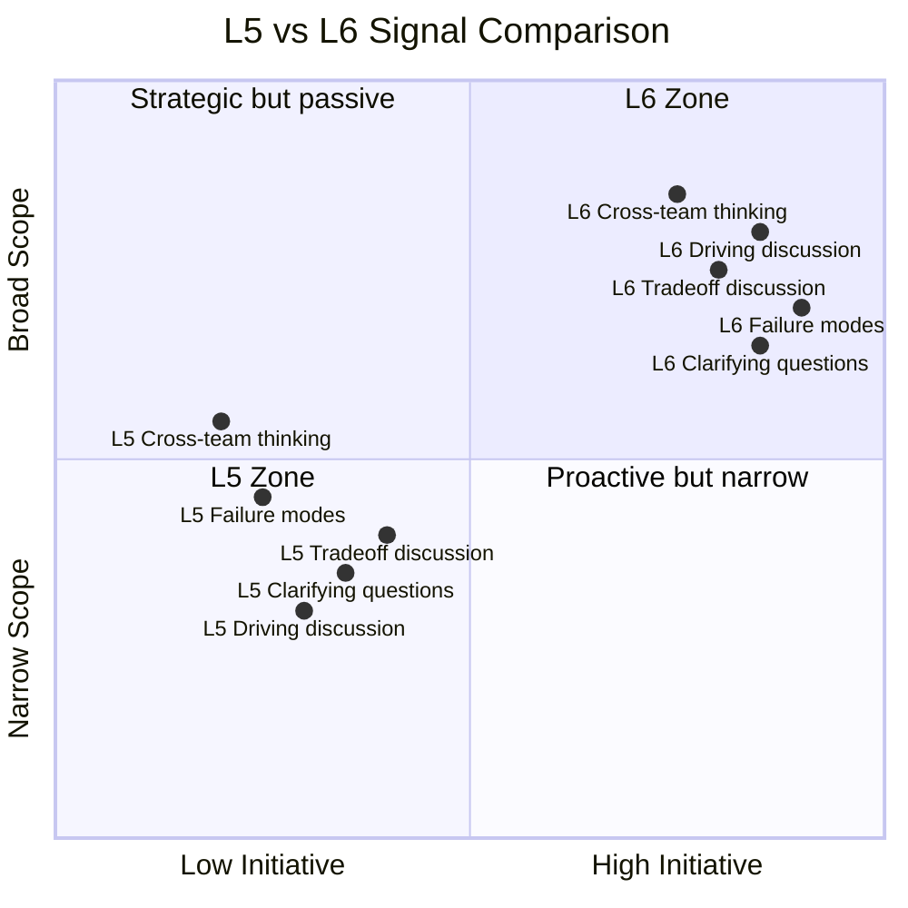
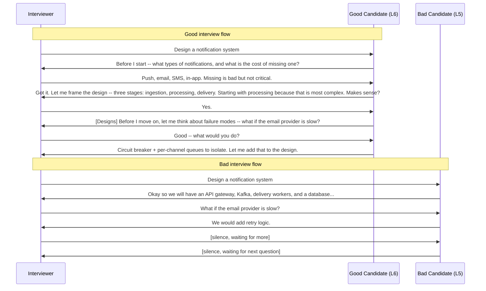
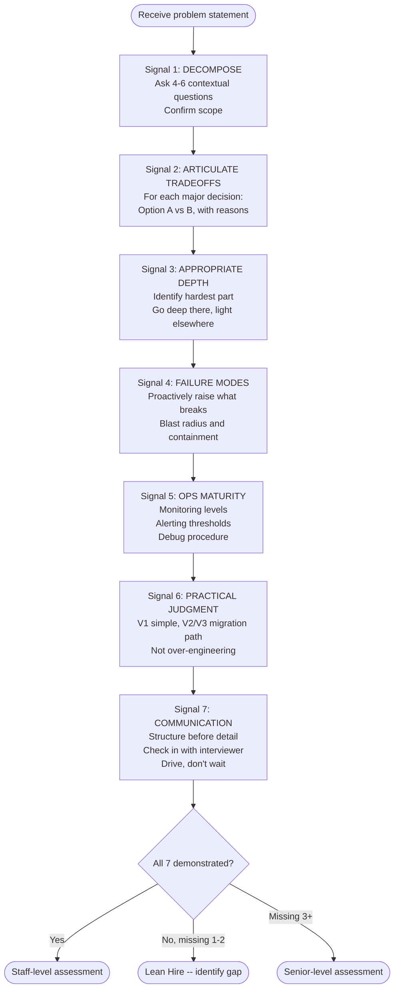
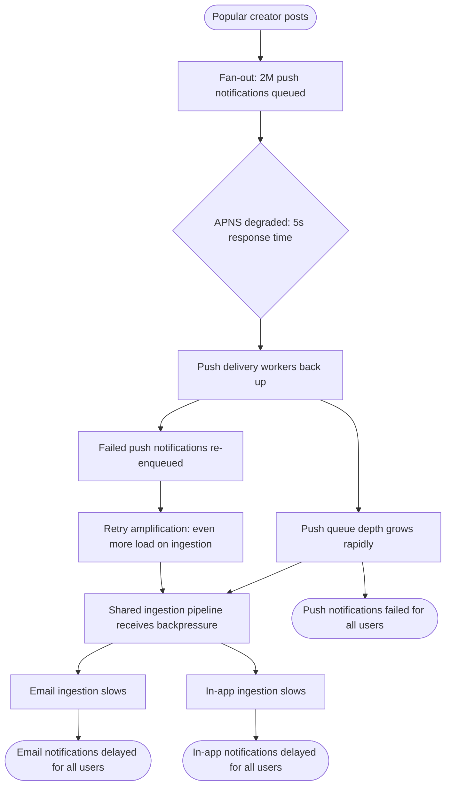

# Chapter 1: How Google Evaluates Staff Engineers in System Design Interviews

---

## Section 1: Learning Goal

By the end of this chapter you will be able to:

1. Explain what the Google Staff Engineer (L6) level actually means -- not as a title, but as a way of thinking and working.
2. Describe the four main axes Google uses to evaluate system design interviews.
3. Recognize the difference between L5 (Senior) behavior and L6 (Staff) behavior, using concrete examples and dialogue.
4. Identify the eight most common failure patterns that cause strong Senior engineers to fail Staff interviews -- and know how to fix each one.
5. Use the seven signals framework to self-assess your own interview performance.
6. Walk through a 45-minute Staff interview with the right time allocation, structure, and language.
7. Practice the five opening moves that immediately signal Staff-level thinking.
8. Self-assess your own readiness honestly, and build a personal practice plan.

This chapter is about preparation, not memorization. You cannot memorize your way to a Staff interview pass. You must change how you think, and this chapter gives you the map.

---

## Section 2: Why This Matters -- Google's Evaluation Framework Is Different

### Most technical interviews test the wrong things

If you have prepared for software engineering interviews at typical companies, you have practiced:
- Solving algorithm problems (Leetcode-style)
- Describing what components belong in a system
- Explaining what technologies you have used

These tests have one thing in common. They test **what you know**. They check whether information is stored in your head.

Google's Staff Engineer interview tests something entirely different. It tests **how you think under uncertainty**. It tests whether you have the judgment, leadership instinct, and communication clarity of someone who should be trusted to make technical decisions that affect dozens of engineers and millions of users.

This is a fundamental difference, and it is why many very smart, very experienced engineers fail Staff interviews even after years of preparation.

### Why Google evaluates this way

Google builds systems at a scale that very few companies reach. When a Google Staff Engineer makes a bad architectural decision, the cost is not one team's wasted sprint. The cost can be thousands of engineer-hours, degraded products used by hundreds of millions of people, and technical debt that takes years to pay off.

At this level, the person needs to be trustworthy. Not just technically correct -- trustworthy. This means:

- They ask the right questions before building
- They see failure modes before they happen
- They communicate clearly to engineers and non-engineers alike
- They know when to go deep and when to stay high-level
- They drive a discussion rather than waiting to be told what to do

The interview is designed to surface evidence of these qualities in 45 minutes. Every question, every silence, every challenge from the interviewer is a probe for one of these signals.

### Why the bar jumps sharply from L5 to L6

Most engineers experience a smooth progression from L3 to L5. Each step is "more of the same, done better." Better code. Faster delivery. Harder problems.

The step from L5 to L6 is not more of the same. It is a **qualitative change** in what the job actually is.

An L5 Senior Engineer is the best executor on the team. They receive a well-defined problem, build an excellent solution, and deliver it reliably. This is genuinely valuable and hard to do well.

An L6 Staff Engineer does not wait to receive a well-defined problem. They identify what problem needs to be solved. They define it, scope it, rally the team around it, and guide it to completion. Then they repeat this for the next problem -- often before anyone else has realized there is a problem.

This is why the jump is hard. You cannot practice your way to L6 by doing more Senior-level things. You must actually change how you approach engineering.

### What the hiring committee (HC) actually does

At Google, interview decisions are not made by the hiring manager alone. They go through a Hiring Committee -- a group of senior engineers who review the interview feedback independently. The HC reads the written feedback from each interviewer and makes a recommendation: **Hire**, **Lean Hire**, **Lean No Hire**, or **No Hire**.

The HC has seen thousands of candidates. They look for consistency across interviewers, clear evidence of the expected level, and absence of veto-level red flags.

A common pattern that fails candidates: three interviewers write "Lean Hire" and one writes "Lean No Hire." The HC often does not approve this. A single interviewer who saw a fundamental gap can block the hire.

This is why demonstrating Staff-level thinking consistently across all interviews matters so much. You cannot afford to coast in one round because you had a good conversation in another.

---

## Section 3: Core Concepts -- Every Evaluation Dimension, Greatly Expanded

### 3.1 The Four Main Evaluation Axes

Google's system design interviews are evaluated on four main axes. These are not official Google documentation -- they reflect what experienced interviewers consistently report looking for when evaluating Staff candidates.



**Axis 1: Technical Design** -- Does the design actually work? Does it work at scale? Can you run it in production? Can it grow over time?

**Axis 2: Problem Solving** -- Can you handle an ambiguous prompt? Do you ask the right questions? Can you scope without avoiding complexity?

**Axis 3: Communication** -- Is your explanation easy to follow? Do you check in with your interviewer? Are you collaborative or defensive?

**Axis 4: Leadership and Influence** -- Do you show ownership of hard parts? Do you think about teams, not just code? Do you surface the right problems without being asked?

Each axis is evaluated independently. A candidate can score strongly on Technical Design but weakly on Leadership, and this imbalance will show up in the feedback and affect the leveling decision.

---

### 3.2 Technical Design -- What Examiners Actually Look For

#### Why Google evaluates technical design this way

It is tempting to think that a system design interview is checking whether you know what Kafka is, or whether you can name the right database for a given use case. This is wrong.

The interviewer has used Kafka. They know what it does. They are not impressed by the word "Kafka." They are interested in whether you can reason about whether Kafka is the right choice for *this specific problem*, with *these specific constraints*, given *this team's capabilities*, with *these failure modes in mind*.

The difference is between a catalog of knowledge and genuine engineering judgment. A Senior engineer might have the catalog. A Staff engineer has the judgment.

#### Correctness: Does the design actually work?

Correctness is the baseline. Your design must actually solve the stated problem. It must handle the basic use cases. It must not have obvious logic errors.

Many candidates fail on correctness not because they do not know enough, but because they did not understand the problem before designing. They built a solution for a different problem than the one asked.

**Why this happens**: Jumping into solution mode too fast. The candidate starts drawing components before they understand what they are building. This is Failure Pattern 1 (we will cover all eight failure patterns in Section 3.7).

**What correct looks like**: After clarifying requirements, your design must demonstrably handle:
- The primary use cases at the stated scale
- The key edge cases you surfaced during clarification
- The failure modes you proactively identified

**L5 vs L6 on correctness**:

L5 builds a correct solution for the problem as stated.

L6 builds a correct solution *and* notices when the problem as stated may be wrong or incomplete. They say things like: "The problem says we need 10 million push notifications per day, but I want to check -- are all of these user-opt-in, or are some system-triggered? That changes the architecture significantly because the failure tolerance is different."

#### Scalability: Does it work at 10x and 100x?

Scalability is not about knowing which database is fastest. It is about reasoning clearly about where your design breaks as load increases, and having a credible plan for what to do when it breaks.

**The wrong way to show scalability**: Mentioning horizontal scaling as a solution to everything. "We'll just add more servers." This is not scalable thinking -- it is deferring the thinking.

**The right way**: Use back-of-envelope estimation to identify the actual bottleneck at each scale tier, then reason about the specific design change needed to move past that bottleneck.

**Example -- "Design a URL shortener"**:

Back-of-envelope: 100M URLs shortened per day = ~1,200 writes per second. 10 billion redirects per day = ~115,000 reads per second.

Read/write ratio is about 100:1. This shapes the entire architecture. Reads vastly dominate writes, so caching is highly effective. The bottleneck is read throughput, not write throughput. A single-primary database with aggressive read caching and CDN layer handles this for years.

An L5 might say: "We'll need to scale the database." An L6 says: "The read/write ratio is 100:1, so caching is extremely effective here. A single database node handles our write volume for years. The scaling challenge is read latency at geographic distribution, not raw throughput. I'd address that with a CDN for the most popular URLs and regional replicas for the rest."

#### Operability: Can you run this in production?

This is where many technically strong candidates reveal they have not owned production systems. A design is not done when it works in theory. It is done when a human being can run it at 3 AM when something is wrong and figure out what is happening.

Operability covers:
- Monitoring: What metrics do you track? What does healthy look like?
- Alerting: What triggers a page? What is the threshold?
- Debugging: How does on-call trace a user complaint to a root cause?
- Rollback: If you deploy a bad version, how do you undo it?
- Capacity planning: How do you know when you need more resources before you run out?

**The L5 answer**: "We'll add monitoring and alerting."

This tells the interviewer nothing. What monitoring? Alerting on what? What is the dashboard? Who gets paged and when?

**The L6 answer**:

"For monitoring this notification pipeline, I'd track metrics at three levels. First, end-to-end health: what percentage of notifications are delivered within our SLA? Second, per-stage health: for each stage (ingestion, processing, delivery), what is the p50 and p99 latency and error rate? Third, per-channel health: email delivery rate, push delivery rate, and SMS delivery rate tracked independently so a problem with one channel does not hide behind a healthy aggregate.

For alerting: a p99 latency spike above our SLA threshold pages the on-call. A channel delivery rate dropping below 95% for 5 minutes pages the on-call. I would not alert on the average -- averages hide tail latency problems. I would alert on percentiles.

For debugging: every notification gets a trace ID that follows it through the entire pipeline. If a user calls support saying they did not get a notification, the support engineer types in the notification ID and sees exactly where in the pipeline the notification stopped and why."

This answer shows production experience. It shows the candidate has been paged at 3 AM and knows what they needed in that moment.

#### Evolvability: Can this design grow over time?

A design that works today but forces a complete rewrite in 18 months is not a good design at Staff level. L6 engineers think about how the system will need to change and make decisions today that do not trap them later.

This does not mean over-engineering. It means:
- Schema decisions that support future columns without migration
- API contracts that are versioned from day one
- Service boundaries drawn so teams can evolve independently
- Sharding key choices made before you need to shard

**The test question**: "How does this design change when you have 10x the users?"

An L5 says: "We'd add more servers and maybe shard the database."

An L6 says: "I've designed V1 with V3 in mind. The sharding key is already in the schema even though we don't shard yet. The API versioning is in place so we can add channels without breaking existing clients. The service boundaries are drawn so the team that owns user preferences can deploy independently from the team that owns delivery. When we hit 10x, the changes are mechanical migrations, not rewrites."

---

### 3.3 Problem Solving -- Why Google Gives Ambiguous Prompts on Purpose

#### Why ambiguity is deliberate

"Design YouTube." That is the entire problem statement. No requirements. No scale. No constraints. No clarification.

This feels like a trap. It is not a trap. It is the test.

Google does this on purpose because the real job of a Staff Engineer is to start with ambiguity and create clarity. Every major technical initiative at Google starts with a vague concern or opportunity, not a precise specification. The person who can take "we're worried about reliability" and turn it into "here is the specific problem, here are the three possible approaches, here is why I recommend approach two" -- that is the person Google wants at L6.

If you ask for a complete specification before you will design anything, you are demonstrating that you need someone else to do the Staff Engineer part before you can do the Senior Engineer part.

#### The clarifying questions framework

There is a right way and a wrong way to ask clarifying questions.

**Wrong way**: Checklist questions. Going through a list of things you are "supposed to ask" in system design. The interviewer can tell when you are reciting a script.

Examples of checklist questions:
- "How many users do we have?"
- "Do we need mobile support?"
- "What is the read/write ratio?"

These are not bad questions. But asked robotically, they do not signal Staff-level thinking.

**Right way**: Contextual questions that reveal you understand *why* the answer matters for the design. Every question you ask should change something about the design if answered differently.

Examples of contextual questions:
- "You mentioned reliability is important. Can you help me understand the cost of failure? Is a missed notification a minor UX issue, or is this 2FA codes where missing one locks the user out? That changes whether I design for at-least-once delivery or exactly-once, which changes the whole processing architecture."
- "Is this replacing an existing system or greenfield? If there's an existing system with existing clients, my API design is constrained by backward compatibility."
- "What is the team context? Are we a single team owning this end-to-end, or does the notification system depend on other teams for the delivery infrastructure? That changes where I draw service boundaries."

See the difference? Each question shows that you know why the answer matters.

#### How many questions to ask -- and in what order

Ask 4 to 6 clarifying questions. Not 2 (too few -- you seem incurious or hasty). Not 12 (too many -- you seem unable to proceed without perfect information, which is the opposite of Staff-level).

Order matters:

1. **Start with the "why"** -- What is the user problem? What does success look like? This shows you care about building the right thing, not just any thing.
2. **Then scale** -- What is the order-of-magnitude scale? Hundreds, millions, billions of users? This determines whether you need distributed systems or a single machine.
3. **Then constraints** -- Are there latency, consistency, or regulatory requirements? These shape specific design choices.
4. **Then integration** -- What existing systems does this connect to? This reveals organizational and technical constraints you cannot ignore.

#### Scoping -- how to narrow without avoiding complexity

A common fear: "If I narrow the scope, the interviewer will think I'm avoiding hard parts."

This fear is backwards. Narrowing scope well is a Staff-level skill. Refusing to narrow scope and trying to design everything leads to a shallow, generic, unfocused answer that demonstrates nothing.

How to scope correctly:
- Explicitly state what you are in and out of scope. "I'll focus on the core notification delivery pipeline. I'll treat user preference management as an existing service we integrate with, since building that from scratch would be a separate project."
- Give a reason based on the clarified requirements. "Given the 45-minute time box and the scale numbers you mentioned, I want to focus on the parts that are technically interesting and differentiating."
- Offer to expand. "I can go into preference management if you'd like, but I'd rather make sure we cover the core pipeline well first."

This is how a real Staff Engineer scopes a project. They do not try to solve everything. They identify what matters most and focus there.



#### L5 vs L6 dialogue -- same ambiguous prompt

**Prompt**: "Design a ride-sharing system."

---

**L5 Candidate -- opening**:

> Interviewer: "Design a ride-sharing system."
>
> Candidate: "Okay. So for a ride-sharing system, we'll need an API to match riders and drivers. How many users should I design for?"
>
> Interviewer: "Let's say millions of users."
>
> Candidate: "Okay. And should I handle payments?"
>
> Interviewer: "You can scope that out."
>
> Candidate: "Got it. So the system needs an API gateway, driver location tracking, matching service, database..."

What is wrong: The candidate jumped to components immediately. They collected a few parameters but did not understand the problem. Their clarifying questions were checklist items, not context-setting questions. They never asked about the core hard problem.

---

**L6 Candidate -- opening**:

> Interviewer: "Design a ride-sharing system."
>
> Candidate: "Before I start drawing, I want to make sure I'm solving the right problem. Ride-sharing has a few different core challenges depending on what we're optimizing for. Can you help me understand what aspect is most important? For example -- is the hard part matching riders to nearby drivers in real-time? Is it the driver location tracking at massive scale? Is it surge pricing and dynamic dispatch? Each one leads to a pretty different design focus."
>
> Interviewer: "Let's focus on the matching and dispatch."
>
> Candidate: "Good. A few more clarifying questions. First, what's the geographic scope -- single city, multi-city globally? Because if it's global with different city markets, the dispatch logic probably needs to be region-local to keep latency low. Second, what's the latency requirement for matching -- is waiting 5 seconds acceptable, or does matching need to be under 1 second? And third, what's the failure expectation -- if matching fails for a few seconds, do drivers and riders retry automatically, or is that an unacceptable customer experience?"
>
> Interviewer: "Global, under 2 seconds preferred, and retry is acceptable."
>
> Candidate: "Perfect. So with that, let me state my design scope: I'll focus on the real-time matching and dispatch pipeline for a globally distributed system at millions of rides per day. I'll treat payments and identity as existing services we integrate with, not design from scratch. Does that scope make sense?"
>
> Interviewer: "Yes, go ahead."

What is different: The L6 candidate asked questions that changed the design. They identified the core hard problem (matching vs. pricing vs. tracking) before choosing a direction. They set explicit scope with the interviewer's agreement. The design that follows will be specific to this problem, not a generic ride-sharing template.

---

### 3.4 Communication -- Why It Is an Explicit Evaluation Axis

#### Why communication is evaluated separately from technical design

You might wonder: if my design is technically excellent, why does communication matter?

Here is why. A Staff Engineer's job is not to have good ideas. Their job is to make good ideas happen. To make ideas happen, you need other engineers to understand them, product managers to trust them, and leadership to fund them. None of this happens unless you communicate clearly.

In the interview, communication is how the interviewer knows what you are thinking. If you cannot explain your design clearly to one experienced engineer in 45 minutes with a whiteboard, how will you explain it to 10 engineers in a design review, or 3 product managers in a quarterly planning session?

The interview is a communication test as much as a technical test.

#### The "map before you hike" principle

Before you go deep on any component, tell the interviewer where you are going and why. This is called "map before you hike."

Think of a hiking tour guide. Before they start the trail, they show you the map. "We'll go up this valley, past the waterfall, and summit from the north side. The interesting parts are the scramble at the top and the views at the ridge. I'll explain things as we go."

This serves two purposes: it tells you what to expect, and it lets you disagree before you are halfway up the wrong mountain.

In a system design interview, the equivalent is:

"Let me give you the high-level structure before I go into detail. The system has three main parts: ingestion, which handles incoming events; processing, which decides what notifications to send and to whom; and delivery, which handles the actual sending to email, push, or SMS. I'll start with ingestion because that's where the interesting scaling challenge is. Then processing because the preference and deduplication logic is the most complex part. Then delivery more briefly, because the patterns there are fairly standard."

Now the interviewer knows:
- Where you are going
- What you think is most important
- What you plan to skip or cover lightly

They can redirect you if they disagree. This is good -- it shows you are collaborative, not locked into a script.

#### How to structure your answer so the interviewer can follow

The structure that works best for Staff design interviews:

**Phase 1 -- Requirements (5 minutes)**
: Clarify, scope, state assumptions back out loud.

**Phase 2 -- High-level design (7 minutes)**
: Draw the main components. Name them for what they do in this domain, not generic infrastructure names. Explain why the design has this shape.

**Phase 3 -- Deep dives (20 minutes)**
: Pick the 2-3 most interesting or challenging components. Go deep with reasoning. State tradeoffs. Address failure modes.

**Phase 4 -- Scale and operations (7 minutes)**
: Use back-of-envelope math to validate architecture choices. Address monitoring, alerting, and debugging strategy. Discuss scaling evolution.

**Phase 5 -- Wrap-up (3-6 minutes)**
: Summarize the key decisions and their rationale. Acknowledge limitations. Reflect on what you would explore further.

#### How to handle interruptions without losing your train of thought

Interviewers interrupt. They ask questions mid-explanation, challenge your choices, or redirect the conversation. This is not hostility -- it is collaboration. But it can throw you off if you are not prepared.

When interrupted:
1. **Acknowledge the question**. "Good question -- let me address that."
2. **Answer it directly**. Do not evade.
3. **Anchor back to your structure**. "Okay, so to answer your question about caching, I'd use a write-through strategy because... Now, coming back to the delivery pipeline..."

The "anchor back" step is what most candidates miss. They answer the interruption, then pause, waiting for direction. The L6 candidate resumes driving.

If you lose your train of thought completely, it is okay to say: "Let me take 15 seconds to collect my thoughts." This is much better than rambling or freezing. Interviewers respect candidates who can admit momentary uncertainty without panicking.

#### Collaborative vs defensive responses

When an interviewer challenges your design, there are two possible responses:

**Defensive response (L5 signal)**:
> Interviewer: "Have you considered using a graph database for the social relationships?"
>
> Candidate: "No, SQL handles this fine with proper indexing."

This is closed. It shuts down exploration. It signals that the candidate cannot incorporate feedback.

**Collaborative response (L6 signal)**:
> Interviewer: "Have you considered using a graph database for the social relationships?"
>
> Candidate: "That's a good question. Let me think about that. The graph query patterns -- finding a user's friends-of-friends, or recommending new connections -- are genuinely better suited to a graph traversal than SQL joins with multiple hops. My concern with a graph database has been operational complexity and team familiarity. But if the social graph queries are truly the performance bottleneck, a graph database might be worth the operational cost. What query patterns are you imagining being most common? That would help me decide whether the traversal depth justifies the database choice."

The L6 response does four things: it acknowledges merit in the challenge, it explores the tradeoff honestly, it states the concern with the alternative, and it asks a follow-up question that deepens the conversation. This is what collaborative technical discussion looks like.

#### Bad answer vs good answer -- the full contrast

**Problem**: "Design a notification system."

---

**Bad answer (monologue, no check-ins)**:

> "Okay so for a notification system we'll have an API gateway that receives notification requests. These get put into a Kafka queue because Kafka is good for high throughput. Then we have consumers that pull from Kafka and process the notifications. The database will use PostgreSQL to store notification history. For delivery, we use third-party providers like SendGrid for email and APNS for push. The cache can be Redis for user preferences. Monitoring can be done with Prometheus and Grafana. For scaling, we can add more Kafka partitions and more consumer instances."

Problems with this answer:
- No clarifying questions. The design is generic.
- No tradeoffs explained. "Kafka is good for high throughput" is not a tradeoff.
- No failure modes discussed.
- No check-ins with the interviewer. It is a monologue, not a conversation.
- No framing. The interviewer does not know where the answer is going.
- No depth on any specific component. Everything is at the same shallow level.

---

**Good answer (structured, collaborative)**:

> "Before I design anything, I want to understand the problem space. What kinds of notifications -- push, email, SMS, in-app, or all of them? And what's the cost of failure -- is a missed notification a minor inconvenience, or is this something like a security alert where missing it is a serious problem? That'll shape the delivery guarantees I design for."
>
> Interviewer: "All four channels. Reliability matters -- missing a notification is bad, but losing a few is acceptable. Not 2FA codes."
>
> "Perfect. So at-least-once delivery, with idempotency to handle duplicates. And rough scale?"
>
> Interviewer: "100 million notifications per day, maybe 10x in two years."
>
> "Okay. Let me give you the shape of the system before going into detail. I see three main stages: ingestion, which normalizes incoming notification requests from any source; processing, which resolves user preferences, deduplicates, and queues per channel; and delivery, which manages sending to each channel's external provider. I'll go deepest on processing because that's where the interesting complexity is. Does that framing make sense?"
>
> Interviewer: "Yes, proceed."
>
> "Great. Starting with ingestion. [Draws component] Notifications come in from multiple services -- product teams calling the notification API directly, or events from an internal event bus. Ingestion normalizes them to a canonical format and assigns a trace ID that follows the notification through the entire pipeline. The trace ID is important for debugging -- if a user calls support saying they didn't get a notification, we can look up the trace and see exactly where and why it stopped..."

This answer is better because:
- Clarifying questions reveal the design will be specific to this context
- Framing tells the interviewer what to expect
- The "trace ID for debugging" comment shows operational maturity
- The candidate checks in with the interviewer ("Does that framing make sense?")
- The design reasoning is explicit

---

### 3.5 Leadership, Influence, and Cross-Team Thinking

#### Why Staff engineers are evaluated on influence

At L5, your impact is measured by what you personally build. At L6, your impact is measured by what gets better because of your involvement -- including things you did not personally build.

This is a large mental shift. A Staff Engineer might spend half their time on work that makes other engineers more effective: better tooling, clearer design standards, cross-team alignment, code reviews that teach rather than just approve. None of this shows up as lines of code written or features shipped, but it creates outsized impact.

Google evaluates this in interviews because they want to know whether the person they hire will naturally think and operate at this level.

#### How to show org-level thinking in a 45-minute interview

You cannot demonstrate three years of cross-team influence in 45 minutes. But you can show the *instinct* for it by how you discuss your design.

Org-level thinking shows up in phrases like:

- "This service crosses a team boundary here. I'd think carefully about the API contract, because once we expose this to another team, changing it later has organizational cost."
- "The way I've drawn this, the preferences service and the delivery service can evolve independently. That means the Preferences team can ship new features without coordinating a release with the Delivery team. This is a deliberately low-coordination design."
- "If we build this, we should also think about whether other teams have similar problems. Three teams building their own notification wrappers is waste. I'd propose this as a shared platform."

These statements do not require any special knowledge. They require the habit of thinking about teams as first-class actors in a system, not just technical components.

#### Ownership signals -- the "I would" vs "We would" distinction

The language you use signals how much you own versus how much you defer.

Consider these two sentences:
- "The team would need to decide whether to use Spanner or Bigtable."
- "I'd recommend Spanner here because of the consistency requirements. I'd want to validate that with the team, but that's my recommendation."

The second sentence signals ownership. The candidate has a point of view. They are willing to be wrong, but they are not avoiding the responsibility of having a recommendation.

A Staff Engineer is expected to have opinions and make recommendations. Not to be rigid -- but to lead. You can hold a recommendation loosely (ready to update with new information) while still holding it firmly (ready to defend it with reasoning).

The "I would" language in an interview does not mean you are arrogant or ignoring your team. It means you are demonstrating the judgment and ownership that defines the Staff level.

#### Red flag: designing only for the happy path

A common signal that separates Junior and Mid-level thinking from Staff thinking: designing only for when everything goes right.

A design that works perfectly when every service is available, every network call succeeds, every user behaves as expected, and traffic is steady -- that design is incomplete. It is a drawing of a best case, not a system.

Real systems spend a surprising amount of time in non-happy states:
- A dependency is slow but not down
- A traffic spike is 3x the usual volume
- A user is doing something unexpected but not malicious
- A third-party provider is rate limiting
- A deployment is partially rolled out (some servers on old version, some on new)

L6 candidates design for these states proactively. They say "let me think about failure modes" before the interviewer asks. They say "during a rolling deployment, there will be a window where the API has both old and new behavior -- here's how I handle that."

This is not pessimism. It is operational maturity. It shows you have run systems in production and know that the happy path is not where most of the work happens.

#### Conway's Law -- when and how to mention it naturally

Conway's Law says: "Organizations which design systems are constrained to produce designs which are a copy of the communication structure of those organizations."

In plain English: the way teams are organized shapes the systems they build. If Team A and Team B don't talk to each other, the systems they build will have a hard boundary exactly where they stopped talking.

Mentioning Conway's Law in an interview is a strong L6 signal -- but only if it is natural, not forced.

**Forced and bad**: "We should consider Conway's Law here."

This says nothing. It is a vocabulary display, not a thought.

**Natural and good**: "The way I've drawn this boundary -- putting user preferences in a separate service -- also maps to how I'd expect the team to be organized. The Preferences team owns the preference logic and the data, and they can deploy independently. If we had drawn the boundary differently, we'd need constant coordination between two teams every time preferences changed. The team structure and the technical architecture should reinforce each other, not fight each other."

You have now communicated the insight of Conway's Law without using the jargon. You can mention the term after, as a footnote: "This is what Conway's Law is about, essentially."

---

### 3.6 Behavioral and Track Record Signals in System Design Interviews

#### How past experience surfaces in design interviews

A system design interview is not a behavioral interview. You will not be asked "tell me about a time you...". But your past experience surfaces anyway, in how you reason.

When you have actually run a system in production that experienced a cascading failure, you reason about failure propagation differently than someone who has only read about it. The difference is in the specificity and confidence of your reasoning. You say things like "I've seen this pattern fail in a specific way -- here's what happens and why" instead of "theoretically, if this fails..."

Google interviewers have done enough interviews to detect the difference. Candidates with genuine production experience at scale have a texture to their reasoning that candidates who have only studied system design do not.

You cannot fake this. But you can make sure your genuine experience comes through clearly.

#### The implicit "have you done this before?" test

In every system design interview, there is an implicit test running in the background. The interviewer is asking themselves: "Does this person know what they are talking about from experience, or are they reciting concepts they've studied?"

Indicators of genuine experience:
- Specific failure modes mentioned naturally ("the tricky part is when the Redis client runs out of connections -- this doesn't cause an error, it causes blocking, which is much worse")
- Operational concerns raised proactively ("we'd want to alert on queue depth, not just delivery rate, because queue depth gives you early warning before delivery degrades")
- Pragmatic rather than textbook reasoning ("in theory you'd use a saga pattern here, but in practice the coordination overhead made us choose a simpler two-phase approach that was easier to debug")

Indicators of studied-but-not-done:
- Textbook answers without texture ("we'd use the saga pattern for distributed transactions")
- Failure modes mentioned only when asked directly
- No operational concerns without prompting
- Perfect systems with no acknowledged limitations

#### How to weave your production experience in naturally

You do not need to tell war stories. You do not need to say "at my previous company." You just need to reason with the confidence and specificity of someone who has been there.

When discussing a failure mode, instead of: "If the cache fails, we'd have to fall back to the database."

Say: "If the cache fails -- and this happens more often than people expect, usually due to memory pressure rather than the node dying -- the fallback to the database works but the latency jump is significant. I'd instrument the fallback rate separately so we know when it's happening. A sustained fallback rate above 5% usually means the cache is undersized."

The second version contains:
- A common failure mode from reality (memory pressure)
- A practical caveat (the node rarely dies)
- A concrete threshold for action (5% fallback rate)
- An operational response (resize the cache)

This is how you sound like someone who has actually run caches in production.

#### What to do if you haven't built at this scale -- and what NOT to do

If you are early in your career or have worked at companies with smaller scale, you may face a question about something you have not personally built at the scale being discussed. This is normal. You are not expected to have built every type of system.

**What NOT to do**: Pretend you have. Experienced interviewers will probe, and the gap between stated experience and actual knowledge becomes visible quickly. This damages credibility more than honestly saying you haven't done something.

**What to do**: Be honest about your direct experience, and demonstrate that you can reason correctly about the problem from first principles. "I haven't built a globally distributed system at billion-user scale personally, but let me reason through what would be different compared to the regional-scale systems I have operated..."

Then actually reason through it. Use principles you understand: latency from speed of light across continents, data sovereignty requirements, eventual consistency across regions. If your reasoning is sound, the interviewer will assess you on the reasoning, not on whether you've personally managed a hundred data centers.

---

### 3.7 The Eight Failure Patterns -- Why Strong L5 Engineers Fail L6 Interviews

This is the most practically important section. These are the patterns that cause technically excellent engineers to fail Staff interviews.



#### Failure Pattern 1: Execution Excellence Without Strategic Framing

**What it looks like**: You are so good at building things that you dive straight into building. Given a problem, you immediately see a solution and start describing how to implement it.

**Concrete example**:
> Interviewer: "Design a system for scheduling rides."
> Candidate: "Okay, so we'll have an API that takes origin and destination, then we calculate the route, match with available drivers in the area..."

The candidate has already constrained the problem to one interpretation before asking a single question. They have decided what "scheduling rides" means, what the important parts are, and how to solve them -- all before understanding the actual requirements.

**Why it fails at L6**: Staff engineers do not just build. They make sure they are building the right thing. Jumping into implementation signals that you are an excellent executor -- which is L5. L6 means you also identify *what to execute*.

**The fix**: Force yourself to spend the first 5-10 minutes understanding the problem. Practice this as a reflex: when given a problem, take a breath, pick up the pen, and put it back down. Then ask your first clarifying question. Only after you have the shape of the problem should you touch the whiteboard.

The words to say: "Before I start designing, I want to make sure I understand the problem space. Can I ask a few questions?"

---

#### Failure Pattern 2: Technical Depth Without Breadth

**What it looks like**: You are an expert in one domain -- perhaps databases, or distributed systems, or front-end architecture. In interviews, you gravitate toward your area and treat everything else superficially.

**Concrete example**:

Candidate spends 30 minutes designing an elaborate caching strategy with cache eviction policies, cache warming, and multi-tier caching. When asked about API design: "We'll have standard REST endpoints." When asked about operational concerns: "We'll add monitoring." When asked about security: "Standard auth."

The depth disparity reveals exactly where the candidate is comfortable -- and where they are not.

**Why it fails at L6**: Staff engineers reason across the entire system. A system is not just a database or just an API -- it is an integrated whole. Over-indexing on one area while hand-waving others signals narrow thinking.

**The fix**: Before your next practice, identify your weakest area and design one complete system from that area's perspective. If you are a backend engineer, practice articulating front-end and mobile implications. If you are a database expert, practice the networking and service mesh details. You do not need to become an expert everywhere. You need to reason competently everywhere.

A useful test: after describing any component, ask yourself: "Could I say two more true, specific, non-trivial things about this component if the interviewer asked?" If the answer is no for multiple components, those are your preparation gaps.

---

#### Failure Pattern 3: Solving the Stated Problem Without Questioning It

**What it looks like**: You take the problem as given and optimize your solution for it. You do not consider whether the problem is well-framed.

**Concrete example**:
> Interviewer: "Design a system to send 10 million push notifications per day."
> Candidate: "Okay, let me calculate the throughput requirements. 10 million per day is about 115 per second at steady state, with peaks perhaps 3x that around 350 per second. So we need a system that can handle 350 push notifications per second reliably..."

The candidate has accepted the premise entirely. They never asked: Why 10 million? What user behavior triggers these notifications? Are users opting in to receive them? Would 10 million notifications actually be delivered and opened, or would most users have them muted? What is the business goal -- engagement, or just sending volume?

An L6 candidate would ask: "Before we get into the throughput design, help me understand the purpose. 10 million notifications per day to how many users -- is this one notification each to 10 million users, or 10 notifications each to 1 million users? The ratio matters because if it's 10 per user per day, we might be designing a spam system, and the design should include rate limiting and preference management prominently."

**Why it fails at L6**: Staff engineers are expected to push back, reframe, and clarify. Accepting a problem statement without examination suggests you will build exactly what you are told rather than what is actually needed.

**The fix**: Before solving any problem, ask yourself: "Why does this problem exist? What is the actual user need? What would happen if we did not build this? Is there a simpler solution that accomplishes the same goal?"

---

#### Failure Pattern 4: Local Optimization Without Global Awareness

**What it looks like**: You optimize each component in isolation, but do not consider how they interact. Each component is well-designed, but together they create problems.

**Concrete example**:

- Candidate designs a highly normalized relational database for strong consistency
- Then adds aggressive read-through caching for performance
- Then describes a feature where users can update their profile and immediately see the update ("read-after-write")

These three choices conflict. With aggressive read-through caching, a write to the database is not immediately visible in the cache. A read-after-write use case will return stale data from the cache. The candidate has three locally-correct decisions that create a globally-broken experience.

**Why it fails at L6**: Staff engineers think in systems, not components. They understand that a system's behavior emerges from how components interact, not from each component in isolation.

**The fix**: After designing any component, explicitly ask: "How does this interact with what I've already designed? What invariants does this depend on? What invariants does it expose that other components depend on? Are there conflicts?"

Make the cross-component relationships explicit on your whiteboard. Draw not just the components, but the consistency guarantees that flow between them.

---

#### Failure Pattern 5: Answering Questions Instead of Driving Discussion

**What it looks like**: You treat the interview as a Q&A session. The interviewer asks, you answer correctly, then you wait for the next question. Reactive, not proactive.

**Concrete example**:

> Interviewer: "How would you handle the case where the message queue backs up?"
> Candidate: "We'd add more consumers to increase throughput."
> [Silence. Waiting.]
> Interviewer: "What about cascading failures?"
> Candidate: "We'd add circuit breakers."
> [Silence. Waiting.]

The answers are technically correct. But the candidate is letting the interviewer drive the entire technical discussion. The interviewer's next thought is: "This person gives good answers, but would they lead a design review? Or would they wait for someone else to ask all the questions?"

**Why it fails at L6**: Staff engineers drive technical discussions. They identify the important questions themselves and bring them up proactively. Waiting for prompts signals that you need someone else to structure the conversation.

**The fix**: After answering any question, extend the discussion. Say what happens after you answer. "We'd add more consumers -- that's the immediate fix. But let me think about this more broadly. Queue backpressure usually indicates one of three things: a traffic spike, slow consumers, or a slow downstream dependency. Each has a different response. I'd want to instrument the queue to distinguish these cases so on-call has targeted responses rather than always 'add more servers'..."

The L6 candidate has turned a simple question-and-answer into a demonstration of systems thinking and proactive problem identification.

---

#### Failure Pattern 6: Overconfidence in One Solution

**What it looks like**: You propose a design and defend it vigorously. When challenged, you double down rather than exploring.

**Concrete example**:

> Interviewer: "Have you considered using a graph database instead of SQL for the social relationships?"
> Candidate: "No, SQL is the right choice here."
> Interviewer: "But the query patterns seem heavily relational--"
> Candidate: "SQL can handle relational queries fine with proper indexing."

The candidate may be technically correct. But they are missing the signal the interviewer was sending. The question "have you considered X?" from an interviewer almost always means "I want to see how you think about alternatives and tradeoffs." The correct response is to explore the alternative genuinely, not to dismiss it.

**Why it fails at L6**: Staff engineers hold designs loosely. They know that good ideas come from anywhere, and that early designs are always incomplete. Rigidity signals ego rather than expertise. More practically, it signals that this person will be difficult to collaborate with when their designs have gaps.

**The fix**: Treat every challenge as a gift. When the interviewer challenges your design, say: "That's interesting -- let me think about that." Then actually think about it. Either update your position with clear reasoning, or explore the alternative and explain why you prefer your original choice with specific tradeoffs. Never just dismiss.

---

#### Failure Pattern 7: Ignoring the Human Element

**What it looks like**: You design technically elegant systems without considering who will build, maintain, and operate them. You treat engineering as pure technical problem-solving rather than sociotechnical work.

**Concrete example**:

> "We'll build a custom distributed coordination layer optimized for our specific consistency requirements."

This might be technically superior to using an existing solution. But it requires expertise that may not exist on the team, creates a system that only the designer fully understands, and adds years of maintenance burden. An L6 candidate acknowledges this: "We *could* build a custom layer, but given that the team doesn't have deep experience in distributed consensus, I'd prefer to use an existing battle-tested solution like etcd or Zookeeper. The performance ceiling we'd be giving up is unlikely to matter for this use case, and the operational simplicity is significant."

**Why it fails at L6**: Staff engineers understand that systems live in organizational contexts. The best technical solution might be wrong if the team cannot build it, lacks expertise to maintain it, or if it requires cross-team coordination that does not exist.

**The fix**: Include organizational awareness naturally in your reasoning. Say things like: "This assumes the team has expertise in X -- is that a safe assumption?" Or: "This approach requires tight coordination between Teams A and B on every release. That's a real operational cost I'd want to be explicit about."

---

#### Failure Pattern 8: Perfectionism Over Pragmatism

**What it looks like**: You want to design the perfect system -- scalable to billions, resilient to any failure, extensible for every future feature. You spend so much time perfecting the design that you cannot complete it.

**Concrete example**:

Candidate spends 25 minutes designing an elaborate multi-region, multi-tier caching strategy for a system that the requirements say will start with 1,000 users. When asked about the core business logic, they say "I'm getting to that." The interview ends before a working system has been described.

**Why it fails at L6**: Staff engineers are pragmatic. They know that perfect is the enemy of good, that systems evolve, and that shipping something imperfect almost always beats waiting for perfection. The ability to make a "good enough" decision, ship it, learn from it, and improve it is more valuable than the ability to design the theoretically perfect system.

**The fix**: Start simple. Design for today's requirements first, explicitly. Then add scale and resilience. Say out loud: "For v1, I'd keep this simple -- here's why. Here's what we'd add when we reach these growth milestones." This demonstrates both pragmatism and forward thinking -- a combination that strongly signals Staff-level judgment.

---

### 3.8 The Holistic Evaluation -- How Interviewers Write Feedback

#### The four feedback ratings and what they mean

After each interview, the interviewer writes feedback and gives a rating:

- **Hire**: Strong evidence of Staff-level thinking. Recommend hiring.
- **Lean Hire**: More evidence for than against, but not strongly convinced. Recommend hiring with some hesitation.
- **Lean No Hire**: More evidence against than for. Concerns exist, but not a definitive veto.
- **No Hire**: Clear evidence below the expected level. Do not recommend hiring.

The hiring committee looks at the distribution of ratings across all interviewers. A unanimous "Hire" or "Lean Hire" is the clearest path to an offer. A single "No Hire" can block a hire even if all others are positive. A mix of "Lean Hire" and "Lean No Hire" is often inconclusive and can go either way.

#### What tips a "Lean Hire" to "Hire"

- One moment that is clearly and unmistakably Staff-level. Not just competent -- impressive.
- Demonstrated comfort leading the conversation, not just responding to it.
- A proactive observation about the design space that the interviewer had not raised, showing initiative.
- Graceful handling of a challenging redirect or pushback.

#### What kills a "Lean Hire" (even with otherwise strong performance)

- One clear and serious technical mistake that goes uncorrected. Candidates who make a mistake and catch it themselves are fine. Candidates who make a mistake, are pointed to it, and still cannot resolve it create concern.
- Defensiveness or dismissiveness when challenged. This is a veto-level signal because it predicts difficult collaboration.
- Failure to understand the core problem throughout the interview. If after 45 minutes the candidate still does not understand what they were asked to design, that is a fundamental problem.
- Claiming experience or expertise that is revealed to not exist when probed.

#### How to recover from a bad start in an interview

You can recover. The interview is 45 minutes and your first 10 minutes do not determine the outcome.

If you realize you jumped to solution mode too fast, stop and correct. Say: "Actually, let me take a step back -- I've started designing before I fully understood the constraints. Can I ask a few clarifying questions first?" This is better than continuing on the wrong path. It also demonstrates meta-awareness -- you caught your own failure mode, which is a positive signal.

If you made a wrong technical decision early that the interviewer has now pointed out, do not defend it reflexively. Say: "You're right -- that's a problem. Let me think about how to fix it." Then fix it or describe how you would.

What does not recover is time spent completely off-topic. If you spend 20 minutes designing the wrong system, pivoting with 10 minutes left rarely produces enough quality signal for a "Hire" rating. The lesson: spend the first 5 minutes understanding the problem very carefully, so the remaining 40 minutes are well-directed.

#### What interviewers remember most after the interview

Interviewers remember moments. They remember the sharpest insight you offered, the most impressive recovery, or the most disappointing mistake.

They do not remember the middle. If you had a competent but unremarkable 45 minutes, the interviewer will struggle to write strong positive feedback. "Solid candidate, no major issues" is a "Lean Hire" at best.

The implication: aim for at least one or two moments that are clearly Staff-level. A proactive failure mode analysis that the interviewer had not raised. A sharp reframing of the problem. An organizational insight about team boundaries. A specific comparison to real production behavior that shows genuine experience.

These moments are what the interviewer leads with when they write their feedback.

---

## Section 4: Mental Models -- Analogies for Staff-Level Thinking

### 4.1 The City Planner vs the Architect

A building architect designs one building at a time. They work within a given plot of land and a given program. Their job is to make that one building excellent.

A city planner thinks about how all the buildings relate. They worry about roads, water systems, zoning, and how this building affects the neighborhood. They see constraints that the architect does not need to see.

L5 Senior Engineers are excellent building architects. L6 Staff Engineers are city planners.

The city planner does not replace the architect. They work at a different level. But in a Staff interview, you are being tested on city planner instincts -- even though much of your daily work involves actual building design.

### 4.2 The Expedition Leader vs the Expert Mountaineer

An expert mountaineer knows everything about climbing. They are technically superior to almost anyone they lead.

But an expedition leader does something different. Before the climb, they study the route for the entire team. They identify which section is most dangerous. They decide the pacing, the weather window, and the turnaround time. During the climb, they watch the whole team, not just their own footing. If a team member is struggling, they notice before the person falls.

L5 is the expert mountaineer. L6 is the expedition leader. The leader may not be the strongest technical climber. But they see the whole picture and make decisions that protect the team.

In an interview, you are being tested on whether you think like an expedition leader -- even on a problem that only requires one person.

### 4.3 The Navigator vs the Driver

A driver looks at the road immediately ahead and steers.

A navigator holds the map, tracks position, watches for turns ahead, and says "in 3 kilometers we need to take the exit on the right."

L5 is the driver. L6 is the navigator. Both are in the same car. Both are necessary. But the navigator operates at a different time horizon and a different level of abstraction.

In system design, the driver asks: "What do we build for this sprint?" The navigator asks: "What do we build now so that in a year we have the system we actually need?"

### 4.4 The Emergency Room Doctor vs the General Practitioner

When you bring a patient to the ER, the doctor's job is diagnosis and stabilization. They work fast, make decisions with incomplete information, and address the immediate threat.

The GP's job is different. They know the patient's history. They see patterns over time. They prevent problems before they become emergencies. When the patient comes in with a minor complaint, the GP thinks: "Is this a symptom of something larger?"

L5 engineers are excellent ER doctors -- fast, capable, good under pressure. L6 engineers develop GP instincts -- they see patterns across systems and time, and they address root causes rather than just symptoms.

In an interview, the question is whether you treat the prompt like an ER case (solve this immediate problem) or like a GP visit (understand the larger system this problem lives in).

---

## Section 5: Real-World Examples -- L5 vs L6 Behavior in Concrete Scenarios

### 5.1 Scenario: "The checkout page is slow"

This is a classic scenario. A product manager reports that the checkout page is slow. The question is what you do.

| Level | Response |
|-------|----------|
| **L4** | "I'll profile the page and fix the slow queries." |
| **L5** | "I'll investigate, identify the bottleneck as N+1 queries in the order summary, fix it, and add a query performance monitor to catch this class of issue earlier." |
| **L6** | "I investigated. The immediate cause is N+1 queries in the order summary component. But the root cause is our data access layer encourages this pattern -- any developer writing a new component faces the same trap. I'll fix checkout now. But I'm also proposing we discuss repository patterns as a team. I want to introduce a code review checklist item for N+1 queries, and update our internal tooling to detect this in CI. That way we fix checkout and prevent the next ten checkouts from having the same problem." |

The L6 response does three things the L5 does not: identifies the systemic cause, proposes a broader solution, and takes ownership of preventing the class of problem -- not just this instance.

### 5.2 Scenario: "Design a rate limiter"

This is a popular interview problem. Let's see how different levels approach it.

**L5 opening**:

> "A rate limiter tracks requests per time window and rejects requests that exceed the limit. We can use a fixed window counter in Redis, where we store the count with a key like 'user:123:window:1710000000'. On each request, we increment and check if it's over the limit. If Redis goes down, we fail open."

This is correct and clear. But it is a textbook answer. It demonstrates knowledge of the common solution.

**L6 opening**:

> "Before I design, help me understand the context. Is this rate limiting per user, per IP, per API key, or some combination? And what is the consequence if we over-limit or under-limit? If this is protecting a payment API, accidentally blocking a legitimate user is very bad. If this is protecting a free-tier API, letting through a few extra requests is fine. That determines whether I should design fail-open or fail-closed.
>
> Also -- is this for a single data center, or distributed across regions? Because the consistency requirements are very different. Distributed rate limiting with strong consistency is technically interesting but expensive. Approximate distributed rate limiting is simpler and usually sufficient."

The L6 candidate immediately surfaced the questions that actually matter for the design: what is the cost of false positives vs false negatives, and what are the distribution requirements? The design that follows will be qualitatively different based on the answers.

**L6 failure mode reasoning** (after basic design):

> "Let me think through the failure modes for this rate limiter. The most important principle is that the rate limiter should not be more dangerous than the thing it is protecting against.
>
> If Redis becomes completely unavailable: I'd fail open by default -- it is better to risk brief abuse than to block all legitimate users. But I'd add a local fallback on each API server: an approximate in-memory token bucket. During a Redis outage, each server rate limits independently based on local counters. The accuracy drops -- in a worst case, a user could hit N servers and get N times their limit -- but we have some protection rather than none.
>
> If Redis is slow but not down -- say p99 latency goes from 2ms to 50ms: I'd configure the rate limiter client to bypass Redis after a 10ms timeout and fall back to local limiting. The 50ms wait before every API call is unacceptable, and the local fallback handles the brief window.
>
> If we have a network partition and some servers cannot reach Redis: those servers use local limiting independently. After the partition heals, counters are not merged -- we accept that a user might have exceeded their limit during the partition window without being caught. The invariant is approximate, not strict. For most use cases, this is fine.
>
> I'd monitor the Redis bypass rate as a leading indicator. If bypass rate goes above 1%, that is a warning that Redis is struggling and we should investigate before it becomes an outage."

This level of failure mode reasoning -- specific scenarios, specific behaviors, specific monitoring -- is what distinguishes a Staff candidate from a Senior candidate on this problem.

### 5.3 Scenario: Design a notification system -- full interview dialogue

This is the full example walked through at Staff level, with commentary.

---

**Interviewer**: "Design a notification system."

**Candidate**: "Before I start, I want to understand the problem space so my design is specific, not generic. A few questions.

First -- what kinds of notifications? Push to mobile, email, SMS, in-app, or some combination? Each channel has very different latency, cost, and reliability characteristics.

Second -- what is the cost of a missed or delayed notification? Is this something like a purchase confirmation where missing it is annoying, or something like a 2FA code where missing it locks the user out?

Third -- scale. Rough order of magnitude -- hundreds of thousands of notifications per day, or hundreds of millions?

And fourth -- is there an existing system we are replacing or extending, or is this greenfield?"

*Commentary: Four specific questions. Each one will change the design if answered differently. The questions reveal the candidate understands the problem space, not just the technology.*

**Interviewer**: "All four channels. Reliability matters -- missing a notification is bad but not catastrophic, no 2FA. Roughly 100 million notifications per day today, potentially 10x in two years. Greenfield."

**Candidate**: "Perfect. So at-least-once delivery semantics, with idempotency to handle duplicates safely.

Let me frame the system before going into detail. I see three main stages:

First, ingestion -- this accepts notification requests from any internal service, normalizes them to a canonical format, and assigns a trace ID for end-to-end tracking.

Second, processing -- this is the most interesting part. It resolves user preferences, deduplicates across channels, applies rate limiting to prevent notification spam, and routes to the right delivery queue.

Third, delivery -- one delivery worker per channel, each with its own queue and independent circuit breaker to the external provider.

I'll spend the most time on processing because that is where the interesting complexity is. I'll go lighter on delivery because the patterns there are standard. Does that framing make sense before I go into detail?"

**Interviewer**: "Yes, proceed."

**Candidate**: "[Draws ingestion component] Ingestion is an API service. Any team that wants to send a notification calls this API with a notification payload: who to notify, what type of event, and the relevant context data -- like order ID for a purchase notification. We do not include the message text here. The processing stage renders the message text for each channel from the context, because the right message for email versus push is different.

Ingestion assigns a unique notification ID and trace ID, writes the notification to a durable queue -- I'd use a message queue with at-least-once delivery semantics -- and returns the notification ID to the caller immediately. This keeps the ingestion API fast and non-blocking.

A key design decision here: the caller does not wait for delivery. They get back a notification ID and can poll for status if needed. This is important because delivery to some channels, especially email, can take minutes."

*Commentary: The candidate explains not just what they built, but why it is shaped that way. The async return of notification ID is a real design decision with real tradeoffs.*

**Candidate**: "[Draws processing stage] Processing is where things get interesting. A processing worker pulls from the ingestion queue. First, it looks up user preferences -- does the user want notifications on this channel? Have they muted this notification type? We read preferences from the primary database, not a replica, because the preference invariant is strong: if a user opted out of email, we must never send them email even during a brief replication lag.

Second, deduplication. We check if we have sent this exact notification recently -- using a bloom filter for fast approximate checking, with exact-match fallback for positives. This handles the case where the ingestion API was called twice for the same event due to a retry.

Third, per-user rate limiting. We enforce a maximum of N notifications per user per day, per channel. If a user would exceed the limit, we drop lower-priority notifications rather than the current one, using a priority field in the notification payload.

Fourth, routing. For each channel the user has enabled and preferences permit, we create a delivery job and push it to the channel-specific queue."

*Commentary: The processing stage shows the candidate understands the actual hard problems -- preference consistency, deduplication, spam prevention -- not just the generic "process notifications" hand-wave.*

**Interviewer**: "What happens if the user preference service is slow?"

**Candidate**: "Good question. Preference lookups are on the critical path of notification processing. If the preference service is slow, all processing backs up.

I have a few options. First, I could add a preference cache -- Redis with a short TTL, say 5 minutes. This significantly reduces load on the preference service and handles most latency cases. The tradeoff: a user who opts out today might receive up to 5 more minutes of notifications before the cache invalidates. For most notification types this is acceptable.

Second, for channels where the preference invariant is strict -- like the legal requirement to honor email unsubscribes promptly -- I'd use a write-through cache that is invalidated immediately on preference change, and fall back to reading the primary for misses.

Third, if the preference service is not just slow but down: I'd fail closed, meaning if I cannot verify preferences, I do not send. This is correct for strong invariants. For weaker invariants like push notifications, I might fail open -- send based on last-known preferences -- but log it for later reconciliation.

Let me add preference service latency to my monitoring: I'd alert if the p99 preference lookup exceeds 50ms, because that is the threshold above which it starts affecting notification throughput."

*Commentary: The candidate answered the question directly, then extended the discussion to cover the failure spectrum and the monitoring implication. This is the L6 pattern for handling interruptions.*

**Candidate**: "[Draws delivery stage] Now delivery. Each channel gets its own queue and its own pool of workers.

The channel isolation is important. [Draws blast radius boundary] I want to make sure a problem with one provider -- say, the email provider is slow -- does not back up and starve push notifications. With separate queues, each channel's performance is independent.

Each delivery worker has a circuit breaker on its external provider call. If the email provider error rate exceeds 30% in a 60-second window, the circuit breaker trips. Delivery workers stop calling the provider and fail fast, sending notifications to a dead-letter queue. They retry after 2 minutes.

For retry logic: maximum 3 retries with exponential backoff -- 1 minute, 5 minutes, 30 minutes. After 3 failures, the notification moves to the dead-letter queue and is counted as undelivered. We alert on dead-letter queue depth so on-call can investigate systematic delivery failures.

One more thing on delivery: idempotency at the provider level. We include the notification ID in every provider call. Most providers support this -- if we accidentally call APNS twice with the same notification ID, they deduplicate it."

*Commentary: The candidate proactively discussed blast radius isolation, circuit breakers, retry strategy, dead-letter queues, and idempotency -- all without being asked. This is operational maturity demonstrated through a design, not just claimed.*

**Candidate**: "Let me quickly do some back-of-envelope on scale. 100 million notifications per day is about 1,200 per second steady state, with peaks perhaps 3x that -- say 3,600 per second. For ingestion: a single API service behind a load balancer handles this easily, and we can scale horizontally. For processing: assuming 5ms per notification, 3,600 per second requires about 18 processing workers. Very manageable. For delivery: depends heavily on provider rate limits. APNS supports roughly 50,000 messages per second per connection. Email providers vary. At our scale, we are well within standard limits.

At 10x -- 1.2 billion notifications per day -- we are at 14,000 per second. The architecture scales horizontally without changes. The database is the concern at this scale: we need to shard the notifications table. I'd shard by user ID, since every query includes user ID. The schema I've described supports this -- user ID is the partition key in every table."

*Commentary: Estimation used to validate architecture decisions and identify the future sharding need, not as a standalone exercise.*

**Candidate**: "To wrap up: the main strengths of this design are channel isolation for resilience, strong preference consistency on the critical path, and end-to-end traceability via the trace ID.

The main risks: the preference cache adds a brief window where preference changes may not be honored -- we have mitigated this for strict invariants but accepted it for soft ones. The dead-letter queue requires human attention for systematic failures, which is operational toil.

If I had more time, I would explore: whether the deduplication bloom filter has acceptable false positive rates at our scale, and what the operational story is for draining the dead-letter queue safely after a provider outage.

Any questions or areas you'd like to go deeper on?"

*Commentary: The wrap-up acknowledges real risks, does not pretend the design is perfect, and ends with an invitation to explore further. This is the Staff-level close.*

---

## Section 6: Design Trade-offs -- How to Demonstrate Trade-off Thinking

### 6.1 Why trade-off thinking is the single most important L6 signal

Every real engineering decision involves tradeoffs. There is no choice with only upsides. If someone offers you a design choice with no downsides, they have not thought about it long enough.

Interviewers know this. When a candidate presents a design choice without acknowledging the tradeoff, the interviewer thinks one of two things: "They don't know the tradeoff" or "They know it but can't explain it." Neither is good.

When a candidate presents both sides of every significant decision, the interviewer thinks: "This person has thought carefully and made an informed choice. I can trust their judgment."

### 6.2 The trade-off formula

For every significant design decision, use this pattern:

> "We could use **[Option A]**, which gives us **[Benefit A]** but costs us **[Cost A]**. We could alternatively use **[Option B]**, which gives us **[Benefit B]** but costs us **[Cost B]**. Given **[specific constraint or requirement from earlier]**, I'd lean toward **[chosen option]** -- but I want to check: is **[assumption]** correct?"

Let's see this in practice.

**Design decision: Message queue choice**

> "We need a message queue for the notification pipeline. We could use Kafka, which gives us high throughput, persistent storage, and replay capability, but requires more operational expertise to tune and run reliably. We could use a simpler queue like Cloud Pub/Sub, which is managed and easier to operate, but we lose some of the low-level control over consumer group management that Kafka provides.
>
> Given that we said operational simplicity matters and we do not need replay capability for this use case -- notifications are not idempotently replayable once the user has received them -- I'd lean toward the managed option. But if the team has strong Kafka expertise and we anticipate needing replay for analytics, Kafka might be worth the complexity."

This is the formula in action. Both options are explained. The choice is grounded in specific requirements stated earlier. A check-in question is offered.

### 6.3 The most important tradeoff categories at L6



**Consistency vs availability**: In a distributed system during a network partition, you can keep the system available but potentially return stale data, or you can refuse to serve until consistency is restored. The classic CAP theorem tradeoff. Neither is always right -- the choice depends on the domain.

**Latency vs throughput**: Optimizing for the fastest possible single request often conflicts with maximizing the total number of requests handled per second. Batching improves throughput but adds latency.

**Cost vs performance**: More performance almost always costs more. Caching reduces latency but costs memory. Dedicated hardware is faster but costs more than shared. The question is whether the performance gain is worth the cost.

**Simplicity vs scalability**: The simplest possible design -- a single machine, a monolith, no queues -- often does not scale. The most scalable design -- distributed services, sharding, event-driven -- is often complex. The right answer depends on current and projected scale.

**Flexibility vs correctness**: Flexible systems that can be configured in many ways are harder to reason about and more likely to be misconfigured. Opinionated systems that enforce one right way are easier to reason about but less adaptable.

### 6.4 How to disagree with the interviewer about a tradeoff

Sometimes the interviewer will challenge a choice you have made and suggest an alternative. This is a crucial moment. How you handle it signals your intellectual character.

The wrong response is to immediately defer. "You're right, let me change that." This looks like weakness, not flexibility. You never agreed with a reason -- you just changed because authority spoke.

The right response is to engage. Treat the challenge as a new piece of information. Genuinely ask: "Does this new information change my recommendation?"

**Example**:

> Interviewer: "Wouldn't an event sourcing approach give us better auditability here?"
>
> Candidate: "That's worth considering. Event sourcing does give better auditability -- you have a complete log of every state transition. My concern was that event sourcing adds significant complexity: the projection layer, snapshot management, and the discipline required to never directly mutate state. For this team and this use case, I thought that complexity was not justified.
>
> But if auditability is a stronger requirement than I understood -- maybe for regulatory compliance -- that changes the equation. Can you tell me more about what the auditability requirement actually is? If it's 'audit trail of what notifications were sent and why,' we can get that with our trace ID approach without full event sourcing. If it's 'ability to replay the entire notification history to reconstruct state,' then event sourcing starts to make more sense."

This response:
1. Acknowledges the merit of the challenge
2. States your original reasoning clearly
3. Identifies what new information would change your recommendation
4. Asks a clarifying question to get that information

This is collaborative intellectual engagement. It is exactly what a Staff Engineer should do in a design review -- and in an interview.

---

## Section 7: Common Interview Questions -- 15 Questions with L6 Model Answers

### Format note

For each question below, you will see:
- The question
- Why it is asked (what dimension it is probing)
- An L5-level answer (correct but not Staff-level)
- An L6-level answer (demonstrates Staff-level thinking)
- What to notice (the key differences)

---

### Question 1: "Design a rate limiter."

**Why asked**: Tests problem decomposition, tradeoff thinking, and failure mode awareness.

**L5 answer**: "A rate limiter tracks requests per time window and blocks when the limit is exceeded. I'd use Redis with a counter per user per time window. On each request, increment the counter and check if it exceeds the limit. If Redis fails, fail open."

**L6 answer**:
> "A few clarifying questions first. Is this rate limiting per user, per IP, per API key, or some combination? Different keys have different attack surfaces. And what is the consequence of false positives -- blocking a legitimate user -- versus false negatives -- allowing an abusive request through? That determines the failure semantics.
>
> Also, is this distributed across multiple regions? Because a centralized Redis counter gives accurate rate limiting but adds a network hop on every request and has a single point of failure. Approximate distributed rate limiting -- each server maintains local counters with periodic sync -- reduces accuracy but eliminates the centralized bottleneck.
>
> For the design: [basic design using Redis counters] ...
>
> Now failure modes. If Redis is completely unavailable: I fail open by default, with a local per-server token bucket as fallback. This means during a Redis outage, we have approximate rate limiting -- each server enforces its share of the limit independently. A user could potentially hit multiple servers and get 2-3x their limit. I consider this acceptable because the rate limiter failing open is safer than blocking all legitimate traffic.
>
> If Redis is slow but not dead: I configure an aggressive timeout -- 10ms. If the limit check takes more than 10ms, I use the local fallback. This keeps API latency predictable even during Redis slowness.
>
> For monitoring: I track Redis round-trip latency, local fallback rate, and the percentage of requests blocked. If fallback rate goes above 2%, that indicates Redis is struggling and I want to investigate before it becomes an outage."

**What to notice**: The L6 answer starts with questions that change the design. It makes the failure semantics explicit ("false positives vs false negatives"). It covers the full failure spectrum -- not just "Redis goes down" but "Redis is slow." It ends with specific monitoring thresholds.

---

### Question 2: "How would you design Twitter's tweet feed?"

**Why asked**: Tests scalability thinking, tradeoff articulation, and design for different user segments (regular users vs. celebrities with millions of followers).

**L5 answer**: "I'd store tweets in a database and when a user requests their feed, I'd query for tweets from all users they follow. For scale, I'd add caching and potentially pre-compute feeds."

**L6 answer**:
> "The core challenge in a Twitter-like feed is the fan-out problem -- specifically, the famous asymmetry between accounts. Most users follow a few hundred people and are followed by a few hundred people. But some accounts -- celebrities, politicians -- are followed by tens of millions. Those two populations require different fan-out strategies.
>
> For the majority of users, push fan-out works well: when a user tweets, immediately push the tweet to the feed of every follower. This makes reads fast -- the feed is pre-computed. The cost is high write amplification for large followings.
>
> For accounts with very large followings -- say, over 100,000 followers -- push fan-out becomes prohibitively expensive. A celebrity tweeting triggers 100 million write operations. I'd use pull fan-out for these accounts: the tweet is stored once, and when followers request their feed, the system pulls recent tweets from celebrity accounts they follow and merges with the pre-computed feed.
>
> The tradeoff: pull fan-out makes reads slightly more expensive and adds latency for celebrity tweets to appear in feeds. The win is avoiding a write storm every time a celebrity tweets.
>
> The hybrid approach is common in production: push for normal accounts, pull for high-follower accounts above a threshold. The system needs to detect and handle the transition -- when an account's follower count crosses the threshold, migrate them to pull-based delivery.
>
> A few failure mode concerns: if the pre-computed feed is unavailable, fall back to pull for all accounts temporarily. If the celebrity tweet service is slow, serve the pre-computed portion of the feed without celebrity tweets and hydrate asynchronously."

**What to notice**: The L6 answer immediately surfaces the core interesting problem (fan-out asymmetry) that the vague question hides. It explains the two strategies and their tradeoffs. It discusses the hybrid approach. It mentions the operational concern of transitioning accounts between strategies.

---

### Question 3: "What happens when your service's database becomes unavailable?"

**Why asked**: Tests operational maturity and failure mode thinking. It is a targeted probe for whether you design beyond the happy path.

**L5 answer**: "We'd fail over to a read replica. If the primary is down, the replica becomes primary. Requests that need strong consistency would fail during the failover window -- maybe 30 seconds."

**L6 answer**:
> "Let me think about the spectrum of database unavailability rather than just the binary case, because partial failure is much more common than complete failure.
>
> If the primary database is completely down: yes, failover to replica. During the failover window -- typically 30 to 60 seconds for automated failover -- write operations fail. Read operations can continue from the replica if we've designed our application to direct reads there. The application should have retry logic with exponential backoff for write failures during this window, since the operation will succeed once the failover completes.
>
> If the primary is responding slowly -- high latency but not down: this is more dangerous and more insidious than complete failure. Automatic failover may not trigger. But slow queries cascade -- downstream services waiting on slow database calls accumulate open connections, and eventually connection pools exhaust. I'd configure aggressive client-side timeouts and circuit breakers. If the database p99 latency exceeds 500ms for 60 seconds, trip the circuit breaker and fail fast rather than queuing requests. This is counterintuitive -- you are explicitly failing faster -- but it prevents cascade failure.
>
> If one replica is lagging -- replication lag: reads from that replica return stale data. For consistency-sensitive operations, I'd route reads to the primary. For eventual-consistency-acceptable operations, reads from replicas are fine with the understanding that results might be up to a few seconds stale.
>
> Monitoring: I'd alert on replication lag above 30 seconds, database connection pool utilization above 80%, and query p99 above our SLA threshold. The replication lag alert gives us early warning before staleness becomes user-visible."

**What to notice**: The L6 answer covers three different failure modes, not just one. It explains the cascade failure risk of slow-but-not-down databases, which is a production insight. It mentions circuit breakers as a protection mechanism. It ends with specific monitoring thresholds.

---

### Question 4: "Why would you use eventual consistency instead of strong consistency?"

**Why asked**: Tests understanding of the consistency model tradeoff, and whether the candidate can articulate when each is appropriate.

**L5 answer**: "Eventual consistency is better for performance because you do not need to wait for all nodes to agree. Strong consistency is safer but slower."

**L6 answer**:
> "The right consistency model depends on the invariants the system must maintain. I start by asking: what are the invariants? What must always be true?
>
> For operations that protect invariants -- account balance never going negative, a booking not being double-sold, a unique username not being assigned twice -- I need strong consistency. Temporary inconsistency would violate the invariant and cause real harm.
>
> For operations where temporary inconsistency is acceptable and invisible -- a read count on a video, a user's 'last seen' timestamp, a recommendation score, an unread notification badge count -- eventual consistency is fine. A read count that is a few seconds stale does not harm anyone.
>
> The key insight: most operations in most systems tolerate eventual consistency. We tend to over-engineer toward strong consistency because it is easier to reason about, not because we actually need it. Strong consistency is significantly more expensive -- it requires coordination across replicas on every write, and it limits availability during network partitions.
>
> The question I ask for each operation: what is the window of inconsistency, what does the user experience during that window, and is that experience acceptable? For a notification badge count, a badge that says 3 when there are actually 4 unread notifications -- visible for at most a few seconds -- is fine. For a payment, a balance that shows $100 when it is actually $0 -- even for a millisecond -- is not fine."

**What to notice**: The L6 answer reframes the question around invariants, not around performance. It gives concrete examples of operations that need strong consistency versus those that tolerate eventual. It provides a decision framework: what is the window, what is the experience, is it acceptable.

---

### Question 5: "How do you design for a system that needs to handle 10x more traffic than today?"

**Why asked**: Tests scalability thinking and pragmatic judgment about when to optimize.

**L5 answer**: "I'd design for the higher traffic from the start -- add horizontal scaling, distributed caching, load balancing, and database read replicas. Design for the future capacity."

**L6 answer**:
> "Designing for 10x traffic immediately is usually wrong, unless the 10x growth is expected within a year and the migration cost would be high. Here is why: at the beginning, you do not know your actual access patterns, bottlenecks, or usage behavior. Any design you make for 10x is based on assumptions that are likely wrong.
>
> My approach: design V1 for today's load with clear decision points for when to scale. Here is what I mean concretely.
>
> For V1, I'd design a simple system that works for current load. I'd choose schema, API contracts, and service boundaries that do not trap me later -- these are cheap to get right early and expensive to fix later. But I would not add sharding, distributed caching, or async processing if they are not needed yet.
>
> I would identify the likely bottleneck at 10x through estimation. If the bottleneck is database write throughput, I make sure the schema supports a sharding key. If the bottleneck is geographic latency, I make sure the API has no assumption of a single region. I am not building the scale machinery, but I am not closing doors either.
>
> Then I would decide the trigger conditions: at what usage level do we add read replicas, at what level do we add caching, at what level do we need to shard. These are documented decisions, not surprises.
>
> The exception: if the migration to a more scalable architecture is a complete rewrite, I might build more scalability in from the start even if I do not need it today. The question is whether growth is fast enough that the migration cost during growth is unacceptable."

**What to notice**: The L6 answer pushes back on the premise of designing for 10x immediately. It explains why this is usually wrong. It introduces the concept of trigger conditions -- decision points for when to scale. It acknowledges the exception case.

---

### Question 6: "How do you think about monitoring and alerting for a new system?"

**Why asked**: Tests operational maturity. Many candidates treat this as an afterthought.

**L5 answer**: "I'd add logging for errors and track metrics like request count, error rate, and latency. Alerts when error rate or latency exceeds a threshold."

**L6 answer**:
> "I think about monitoring in four layers.
>
> Layer 1: health. Is the system working? This is the aggregate health signal -- success rate, p50 and p99 latency, error rate. These go on the main dashboard and define my SLOs. If the system is below 99.9% success rate, something is wrong.
>
> Layer 2: symptoms. What is wrong, specifically? If the aggregate health drops, I need to know which component or operation is causing it. Per-endpoint latency, per-channel delivery rate for a notification system, per-operation error rate. This gets me from 'something is wrong' to 'email delivery is failing.'
>
> Layer 3: causes. Why is it wrong? This requires distributed tracing -- the ability to follow a single request through every service it touches and see where time was spent. If email delivery is failing, a trace shows me: was it the preference lookup? The queue consumer? The provider call? This gets me to root cause in minutes instead of hours.
>
> Layer 4: prediction. What will break next? Capacity metrics -- database connection utilization, queue depth trending, disk usage growth rate. If I can see that the database connection pool will be exhausted in 3 hours at current growth, I can act before users are impacted.
>
> For alerting: I alert on the symptom level and above, not the cause level. I do not want an alert for every individual trace that shows a slow database query -- I want an alert that says 'email delivery rate dropped below 95% for 5 minutes.' The alert should be actionable: something I can actually investigate and resolve. If I cannot describe the investigation procedure for an alert, the alert is not ready to ship.
>
> One operational principle I'd add: the alert should give me enough context to start the investigation. 'Error rate exceeded threshold' tells me something is wrong. 'Email delivery rate 82%, down from 99.8%, beginning 14 minutes ago, Provider X error logs show connection refused' tells me where to start."

**What to notice**: The four-layer observability framework is a concrete, memorable structure. The principle about alerting at the symptom level rather than the cause level is an insight from production experience. The format-of-a-good-alert example shows what this looks like in practice.

---

### Question 7: "What is the main risk in your design?"

**Why asked**: Tests intellectual honesty and the ability to reason about your own work critically. Many candidates struggle with this because they want to seem confident.

**L5 answer**: "The main risk is that the database could become a bottleneck at very high scale. We would need to add sharding."

**L6 answer**:
> "I'd identify two main risks in this design.
>
> The first is the preference service on the critical path. I chose to read preferences synchronously before delivery to maintain the strong preference invariant -- a user who opts out should never receive a notification, even briefly. But this means every notification delivery depends on the preference service being fast and available. If the preference service has a latency spike, the entire notification pipeline slows. I've mitigated this with caching and timeouts, but the dependency is still there. The mitigation is a preference event stream -- when users change preferences, we propagate the change proactively to a local copy that each delivery worker maintains. This removes the runtime dependency. But it adds eventual consistency, which I chose not to accept earlier in the design. This is a genuine tradeoff I would want to revisit with the team.
>
> The second risk is the dead-letter queue. When a provider is down and notifications are not delivered, they accumulate in the dead-letter queue. When the provider recovers, we need to drain the queue safely -- but draining 10 million queued notifications at once can overwhelm the provider and the system. The safe drain strategy requires rate limiting and back-pressure. I've sketched this in the design but not detailed it. If a major provider outage happens, the dead-letter drain becomes a significant operational event."

**What to notice**: The L6 candidate identified real risks in their own design, not generic risks. They explained why each risk exists given specific design choices. They acknowledged the tradeoff they made and expressed openness to revisiting it. This is intellectual honesty that signals maturity.

---

### Question 8: "How would you communicate this design to a product manager?"

**Why asked**: Tests communication breadth -- whether the candidate can adapt their explanation to a non-technical audience.

**L5 answer**: "I'd describe the main components and how data flows through them, avoiding too much technical detail."

**L6 answer**:
> "The product manager cares about different things than an engineer does. They care about: what user problems does this design solve and which ones does it not, what are the risks to the user experience, what is the timeline and tradeoff, and what can we change later versus what is hard to change.
>
> I would not describe the architecture. I would describe the user experience and the constraints.
>
> Something like: 'This design handles all four notification channels -- push, email, SMS, and in-app. Users who opt out of any channel will not receive notifications on that channel within seconds of opting out -- we read their preferences in real time before every notification. The system can handle our current load and is designed to scale to 10x without any architectural changes, just adding more servers.
>
> The main limitation to be aware of: a single severe outage at our email provider could cause up to 30 minutes of email delay while we detect the outage and route around it. We have mitigated this with automatic fallback, but some delay is possible. If email reliability is critical for a specific use case -- like order confirmations -- we should discuss adding SMS as a backup channel for those specific notifications.'
>
> I frame risks in terms of user impact, not technical risk. 'Redis may become unavailable' does not mean anything to a product manager. '30 minutes of notification delay in a severe provider outage' does."

**What to notice**: The L6 answer reframes the entire communication style for the audience. Risks are described in terms of user impact. The answer ends with a specific discussion point (backup channels for critical notifications) that leads to a productive product conversation.

---

### Question 9: "A user says they're not receiving notifications. How do you debug this?"

**Why asked**: Tests operational maturity and whether the candidate has designed for debuggability, not just functionality.

**L5 answer**: "I'd check the server logs for errors and see if there are any failed delivery attempts."

**L6 answer**:
> "If I've designed the system correctly, this should take under 5 minutes to debug. Here is the procedure.
>
> First, I look up the user's notification history by user ID. This shows every notification that was attempted for this user in the last 7 days, with status: delivered, failed, or filtered.
>
> If the notification is in the history but status is 'filtered': the user's preferences blocked it. I check which preference setting filtered it and surface that to the support agent.
>
> If the notification is in the history and status is 'failed': I look at the trace for this notification -- the trace ID gives me a complete log of every stage it went through. I can see whether the failure was in ingestion, processing, or delivery, and what error was returned at each stage.
>
> If the notification is not in the history at all: the notification was never received by our system. The problem is upstream -- either the service that was supposed to trigger the notification did not call our API, or the call was made but failed. I check the ingestion service logs for the user ID and event type.
>
> The key point: if I cannot do this in under 5 minutes, the system is not adequately instrumented for production support. That is a design failure. Good observability is not about having all the data -- it is about having the right data organized for the questions you need to answer."

**What to notice**: The L6 answer walks through a concrete debugging procedure rather than a generic "check the logs." It shows that the system has been designed for this exact debugging scenario. It ends with a principle about what good observability means.

---

### Question 10: "How do you decide when to split a service into microservices?"

**Why asked**: Tests judgment about architectural evolution and the tradeoffs of service decomposition.

**L5 answer**: "When a service becomes too large to deploy independently or a team's ownership boundaries change."

**L6 answer**:
> "The question I ask first is: what problem are we trying to solve by splitting? The answer to that question determines whether splitting is the right solution and how to split.
>
> If the problem is independent deployment velocity -- Team A and Team B cannot ship independently because they share a service -- splitting allows them to deploy without coordinating. But the split should follow the team boundary exactly, not some arbitrary technical line. Conway's Law: the architecture should match the org structure.
>
> If the problem is scale -- one component needs to scale independently because it handles far more load than the others -- splitting that component lets you scale it without scaling the whole monolith. Only split the bottleneck, not everything.
>
> If the problem is technology isolation -- one component needs a different language or runtime -- a service boundary lets it evolve independently.
>
> What I would not do: split for its own sake. Microservices add real costs: network latency between services, distributed tracing complexity, operational overhead of running more services, the need for clear API contracts and versioning. These costs are worth paying for the benefits above, but not worth paying speculatively.
>
> The practical signal that splitting is worth it: when the overhead of coordination (release coordination, shared codebase, shared deployment) exceeds the overhead of independent services. Before that point, stay monolithic or modular monolith.
>
> I'd also note: splitting is much easier if you have good integration test coverage. If you don't, a split that changes a service boundary often breaks things that were never explicitly tested. Invest in test infrastructure before aggressively splitting."

**What to notice**: The L6 answer starts with "what problem are we solving" rather than accepting the premise. It gives three distinct reasons for splitting, each with different implications for how to split. It names the costs explicitly. It ends with a practical prerequisite (test coverage) that shows production experience.

---

### Question 11: "What is technical debt, and when do you pay it down?"

**Why asked**: Tests maturity around engineering tradeoffs and long-term system health.

**L5 answer**: "Technical debt is shortcuts that make the code harder to maintain. You pay it down when the maintenance cost becomes too high."

**L6 answer**:
> "Technical debt is not inherently bad. It is a tradeoff: you borrow velocity now and pay it back with interest later. The skill is knowing when the interest is worth paying.
>
> I think about three states of debt.
>
> Conscious debt: you make a shortcut deliberately, document why, and set a condition for when you will fix it. For example: 'This API design is not ideal, but we're not sure about the right design yet. Once we add a third channel and understand the pattern better, we'll redesign.' This is fine. You've taken out a loan with a repayment plan.
>
> Unconscious debt: shortcuts made without realizing they are shortcuts. Nobody knows the code is a mess until someone tries to change it. This is dangerous and hard to manage because it is invisible until it bites you.
>
> Compound debt: debt that makes adding new debt easier. A messy service that encourages more messy integrations. This is the most dangerous kind because the problem grows exponentially.
>
> When to pay it down: when the debt is compounding -- you are building on top of it and making it worse; when the debt is causing incidents -- production problems traceable to the original shortcut; when the team is slowing down because of it -- the debt is creating friction on every change in that area; or when you are about to build a major feature on top of it -- this is the cheapest time to clean it up, before you double down.
>
> When to live with it: when the area is stable and rarely changes; when the fix would require a massive migration with high risk; when the 'debt' is actually someone else's opinion about style rather than a real technical constraint.
>
> One practical approach I use: the 'campsite rule' for incremental debt reduction. Leave the code slightly better than you found it on every change. Over time, this compounds -- the messiest areas get cleaned up naturally as they are touched most."

**What to notice**: The L6 answer distinguishes three types of debt, not just one. The "when to live with it" section shows maturity -- not everything needs to be fixed. The campsite rule is a practical, memorable approach.

---

### Question 12: "How do you design an API that can evolve without breaking clients?"

**Why asked**: Tests forward thinking in API design and understanding of the costs of change.

**L5 answer**: "Use semantic versioning. When you make breaking changes, release a new version. Keep the old version running for a transition period."

**L6 answer**:
> "Versioning helps when breaking changes are unavoidable, but the goal is to design APIs that rarely need breaking changes in the first place.
>
> Principles I follow to avoid breaking changes:
>
> First, additive evolution. Adding new fields to responses is non-breaking if clients ignore unknown fields. This is the JSON rule: if clients parse only what they understand and ignore the rest, I can add fields without breaking them. I enforce this in my client SDK by default -- clients are built to be tolerant of extra fields.
>
> Second, deprecate before removing. Never remove a field immediately. Mark it deprecated, keep it returning data for a defined period (usually 12-18 months), and monitor whether any clients are still using it before removing.
>
> Third, avoid required fields in request bodies for updates. If I add a new required field to a request body, all existing clients break. New required fields should only appear in new endpoints or should have sensible defaults.
>
> Fourth, use enums carefully. Adding a new enum value to a response is technically non-breaking but practically breaking -- clients that have exhaustive switch statements on enum values will fail on the new value. Document this as a contract and build clients with default handling for unknown enum values.
>
> When a breaking change is unavoidable: versioning in the URL path (v1, v2) or in a header. Run both versions simultaneously during the transition. Monitor usage on v1 to know when it is safe to deprecate. Set a deprecation timeline in advance.
>
> The organizational side of API evolution: have a deprecation policy, not just a technical approach. Who decides when a version is deprecated? How do we communicate to client teams? What is the minimum deprecation notice? These questions have organizational answers, not just technical ones."

**What to notice**: The L6 answer focuses on designing for evolution rather than just handling breaking changes after they happen. The enum caution is a specific, non-obvious insight. The final paragraph about organizational policy shows awareness that this is not purely a technical problem.

---

### Question 13: "What are the top three things you look for in a code review?"

**Why asked**: Tests how the candidate thinks about code quality and how they develop other engineers.

**L5 answer**: "Correctness, readability, and performance. I check whether the code does what it claims, whether it is easy to understand, and whether it has any obvious performance issues."

**L6 answer**:
> "My top three, in priority order:
>
> First: correctness under failure. Does the code handle errors, edge cases, and failure modes correctly? This is more than 'does it return the right result in the happy path.' A function that returns the right result 99% of the time but silently does the wrong thing in the 1% failure case can be very dangerous in production. I look especially at: error handling (are errors propagated, logged, or silently ignored?), null/empty handling (what happens with unexpected inputs?), and concurrency (if this code runs concurrently, are there race conditions?).
>
> Second: observability. When this code behaves unexpectedly in production, can we understand why? Are errors logged with enough context to diagnose the issue? Are important state transitions observable? A beautiful, correct function that produces no observability is a maintenance problem waiting to happen.
>
> Third: abstraction boundaries. Does this code respect the existing abstractions, or does it reach through layers and create hidden dependencies? A function that reaches into a private field of a class to avoid a method call creates coupling that will cause problems later. The abstraction boundaries are the most important invariants in a codebase -- once they start leaking, entropy accelerates.
>
> I consciously do not prioritize style or formatting in code review -- that is what automated tools are for. I save my attention for the things automated tools cannot catch: judgment calls about failure handling, observability, and architectural coherence."

**What to notice**: The L6 answer prioritizes failure handling first, not correctness in the happy path. The observability point shows production experience. The deliberate exclusion of style shows mature prioritization.

---

### Question 14: "How do you balance new features with reliability work?"

**Why asked**: Tests judgment about competing priorities and stakeholder management.

**L5 answer**: "I advocate for reliability work with product management and try to get dedicated time for it in each sprint."

**L6 answer**:
> "The framing of 'balance' implies they are opposites. I try to reframe: reliability enables features. An unreliable system with frequent outages cannot ship features safely because every change is high-risk. Reliability investment is not competing with features -- it is making future features possible.
>
> Practically, I use error budgets to make reliability work concrete. An error budget is defined by your SLO: if you promise 99.9% availability, your error budget is 0.1% -- about 43 minutes of downtime per month. When you are burning your error budget through incidents, reliability investment is justified as debt repayment. When you are inside your budget, feature work takes priority.
>
> This framing works with product management because it is quantitative. 'We need to do reliability work' is an abstract argument. 'We burned 70% of our monthly error budget in the last two weeks, which means we're on track to miss our SLO and cannot ship safely without addressing the underlying issues' is a concrete, data-driven argument.
>
> For structural balance: I push for a percentage of team capacity dedicated to operational health -- typically 20-30% for a system in steady state. This is negotiated explicitly, not stolen from feature work. In periods of high incident volume, that percentage goes up.
>
> One more lever: make reliability improvements deliver feature value when possible. Better observability makes it easier to debug customer issues, which is a support-facing feature. Faster deployments make it easier to ship, which benefits the whole team. Framing reliability work with its feature value helps get buy-in."

**What to notice**: The L6 answer reframes the false dichotomy. It introduces error budgets as a concrete tool for the conversation. It gives a structural answer (20-30% capacity) that is negotiated explicitly. It shows awareness of how to communicate this to non-technical stakeholders.

---

### Question 15: "Tell me about a time you identified a problem before anyone else did and solved it."

**Why asked**: This is a behavioral question that surfaces in staff interviews. It probes for the Staff Engineer's defining characteristic: finding problems rather than waiting to be given problems.

**L5 answer**: "I noticed our query performance was degrading and investigated before it became a user-facing issue. I found some missing indexes and added them."

**L6 answer**:
> "I'll give you one example and explain how it demonstrates the instinct I try to bring consistently.
>
> About 18 months ago, I was reviewing metrics during our quarterly planning and noticed that our API response latency had drifted upward by about 15% over six months. Not dramatically -- nothing had alarmed -- but consistently upward. I dug into it and found no single cause. It was accumulation: three teams had added features that each added a few milliseconds, and nobody had looked at the trend.
>
> What made this interesting: nobody had asked me to investigate this. There were no user complaints. There was no incident. The gradual drift was invisible in any individual change.
>
> I wrote up a 1-page analysis: here is the trend, here are the contributing factors, here is the cost if it continues for another 6 months. I took it to the three teams informally, not in a formal review. I framed it as 'here's a pattern I'm seeing that will become a problem, and I'd like to understand what we could collectively do about it.'
>
> The outcome: one team had a change that had accidentally introduced a synchronous call in a hot path -- easy to fix. The other two teams made intentional tradeoffs but chose differently after seeing the aggregate picture. We reduced the drift by 80% without a big project.
>
> The skill I was trying to demonstrate: finding the problem by looking at system-level trends, not waiting for an incident. Connecting it to multiple teams and making it a collaborative fix, not a blame exercise. And quantifying the cost of inaction so the conversation was concrete."

**What to notice**: The L6 answer demonstrates the Staff-level instinct of finding problems before they are assigned. It shows cross-team influence without authority. It shows quantitative framing. The reflection at the end explicitly names the skill being demonstrated, which is actually useful in an interview -- it shows the candidate knows why this story matters.

---

## Section 8: Key Takeaways and How to Practice

### 8.1 The five questions interviewers ask themselves



Everything you do in the interview is evidence for or against these five questions. The design itself is not the output. The evidence of Staff-level thinking is the output.

### 8.2 The five opening moves that signal Staff Level immediately

These are the moves that, in the first five minutes, tell an experienced interviewer that you are thinking at Staff level.

**Opening Move 1: Ask about the "why" before the "what"**

Before asking about scale or features, ask: "What is the user problem we are solving?" or "What does success look like for this system?"

Why it signals Staff level: L5 engineers optimize the solution. L6 engineers first validate that the right problem is being solved.

Words to use: "Before I start, I want to make sure I'm optimizing for the right thing. Can you help me understand the core user problem?"

What it sounds like when done well:
> "Before I draw anything -- what's the core user problem this is solving? I want to make sure my design choices optimize for the right thing. For example, if this is about reliability, I'll make different trade-offs than if it's about latency."

What it sounds like when done poorly:
> "What's the user problem here?" [asked mechanically with no follow-up, just waiting for the answer]

---

**Opening Move 2: Name the hardest part before solving it**

After your initial clarifying questions, identify which aspect of the problem is technically hard before starting to solve it.

Why it signals Staff level: It shows you understand the problem well enough to recognize where the difficulty is. L5 engineers treat all components equally. L6 engineers identify leverage points.

Words to use: "The interesting part of this problem is X. Most of the other components are fairly standard. I'll spend the most time on X."

What it sounds like when done well:
> "Looking at this problem, the interesting technical challenge is the fan-out -- specifically, how to handle accounts with very large followings without creating a write storm. That's where I want to spend most of our time. The API design, storage layer, and most delivery logic are fairly standard."

What it sounds like when done poorly:
> "There are many challenges in this problem..." [followed by a generic list without prioritization]

---

**Opening Move 3: State your design direction before drawing**

Before touching the whiteboard, say what you are going to design and why.

Why it signals Staff level: It shows structured thinking and allows the interviewer to redirect you before you spend 15 minutes going the wrong direction. Passive candidates start drawing immediately. Active candidates narrate.

Words to use: "My initial direction is X because Y. Does that make sense, or should I consider a different approach?"

What it sounds like when done well:
> "Based on what you've told me, my initial direction is a three-stage pipeline: ingestion, processing, and delivery. The reason for this decomposition is that each stage has different scaling characteristics and I want to be able to scale them independently. Does that direction make sense before I go into detail?"

What it sounds like when done poorly:
> [Immediately starts drawing boxes on the whiteboard without narrating]

---

**Opening Move 4: Offer choices rather than one solution**

When describing your design, present it as one option from several, with reasons for the choice.

Why it signals Staff level: It demonstrates that you have considered the design space, not just arrived at one answer. L6 engineers know there are always alternatives. They choose one and explain why.

Words to use: "I'm choosing X over Y here because Z. If [different constraint], Y would be the better choice."

What it sounds like when done well:
> "For the data store, I have two main options: a relational database or a wide-column store. The relational database gives us better query flexibility and strong consistency, which I think matters here given the preference lookup requirements. The wide-column store would be better for write throughput at very high scale, but we're not there yet and I'd rather start with the simpler option."

What it sounds like when done poorly:
> "I'll use a relational database."

---

**Opening Move 5: Check in before going deep**

Before spending 15 minutes on a component, ask whether the interviewer wants you to go deep there or move on.

Why it signals Staff level: It shows you are aware that 45 minutes is limited and you are managing the interviewer's time, not just your own. It also invites collaboration -- the interviewer may redirect you to something more interesting.

Words to use: "I could go deeper on X, or I could move to Y -- which would be more useful to cover?"

What it sounds like when done well:
> "I've covered the ingestion layer at a reasonable level of detail. I could go deeper on the deduplication logic here, which is genuinely interesting, or I could move to the processing stage which has more complexity. Which would you prefer?"

What it sounds like when done poorly:
> [Spends 20 minutes on one component without checking in, then rushes through everything else]

---

### 8.3 The self-assessment framework -- five questions after every practice session

After every practice session, ask yourself these five questions honestly.

**Question 1: Did I understand the problem before I started solving it?**

Could you have explained the requirements to someone who had not heard the interview prompt, before you started designing? If not, you moved to solution mode too fast.

**Question 2: Did I explain my reasoning, or just my answer?**

For every major design decision, did you explain why you made that choice, what the alternatives were, and what the tradeoff was? Or did you just describe the thing you chose?

**Question 3: Did I drive the discussion, or respond to it?**

What percentage of the time were you the one introducing new topics, surfacing new questions, and moving the conversation forward? If you spent most of the time waiting for the interviewer to ask the next question, you were reactive.

**Question 4: Did I address failure modes before being asked?**

Did you bring up "what happens when X fails" yourself, or did you only address it when the interviewer raised it? Proactive failure thinking is a strong L6 signal.

**Question 5: Did I communicate for my audience?**

Would someone who had never heard of your design approach understand your explanation? Did you check in with the interviewer to make sure they were following? Did you summarize before going deep?

### 8.4 The L5 vs L6 comparison summary -- every dimension



| Dimension | L5 Signal | L6 Signal |
|-----------|-----------|-----------|
| **Opening** | Asks a few standard clarifying questions | Asks contextual questions that reveal the design will be specific to this context |
| **Problem framing** | Accepts the problem as given | Questions whether the problem is correctly framed |
| **Architecture** | Correct, standard design | Correct design with explicit reasoning for why it has this shape |
| **Tradeoffs** | Mentioned when asked | Presented with every significant decision, unprompted |
| **Failure modes** | Handled when asked "what if X fails?" | Proactively raised before the interviewer asks |
| **Operational concerns** | "We'll add monitoring" | Specific metrics, thresholds, and debugging procedures |
| **Scaling** | "We'll add more servers" | Identifies specific bottleneck and names the specific design change at each scale tier |
| **Communication** | Explains their design | Narrates their reasoning; checks in; adjusts to interviewer signals |
| **Cross-team thinking** | Focuses on own component | Names team boundaries and coordination costs |
| **Handling pushback** | Defends or immediately defers | Explores the alternative genuinely, updates or defends with reasoning |
| **Wrap-up** | "Any questions?" | Summarizes key decisions, names risks, offers what they would explore further |
| **Interview leadership** | Answers questions | Drives the discussion; surfaces topics without being asked |

### 8.5 How to practice -- the right way

**Wrong way to practice**: Study solutions. Read "how to design URL shortener" and memorize the approach. In your interview, recite what you read.

Why this is wrong: interviewers have seen every design. They will probe beyond the surface, and a memorized answer collapses when pushed even slightly off-script.

**Right way to practice**: Practice the process, not the answer. Pick a problem you have never studied. Set a 45-minute timer. Go through the full structure: clarify, high-level design, deep dives, scale, wrap-up. Record yourself if possible.

After the session, assess yourself against the five questions above. What did you do well? What would you do differently?

Then, and only then, look at how others have solved this problem. Not to copy their answer, but to identify what considerations you missed and why.

**Practice problems that develop different skills**:

For *clarifying questions practice*: choose problems where the prompt is very ambiguous. "Design a system to recommend music." "Design an analytics platform." The ambiguity forces you to get good at surfacing requirements.

For *failure modes practice*: after designing any system, spend 15 minutes writing down every component and asking "what fails here, and how does the failure propagate?" Then identify which failures you would proactively mention in an interview.

For *cross-team thinking practice*: for any system you design, draw a hypothetical org chart of the teams that would own each component. Then ask: what are the coordination points? Where would teams need to agree on contracts? Where could you design to reduce coordination?

For *communication practice*: record yourself explaining a design, then watch it back. Count how many times you said "um" or "uh." Count how many times you checked in with the interviewer. Assess whether a first-time listener could follow your explanation.

### 8.6 Building each L6 skill -- practical exercises



**Skill: Clarifying questions**
Practice: Take any system design problem and spend 5 minutes asking nothing but clarifying questions into a recording. Review: did each question change the design if answered differently? Did you ask about "why" not just "what"?

**Skill: Tradeoff articulation**
Practice: After every design decision you make -- in practice interviews, in real work design documents -- write down: "Alternative: [X]. Why I chose [Y]: [reason]. The cost of [Y] vs [X]: [tradeoff]." Do this for 30 days. It will become natural.

**Skill: Driving discussion**
Practice: Do a 45-minute practice interview where you set a rule: you may not be silent for more than 10 seconds. If you cannot think of anything to say, you must say what you are thinking out loud ("I'm trying to decide between X and Y -- let me think through the tradeoffs..."). This forces active narration.

**Skill: Failure mode awareness**
Practice: For every system you interact with or read about, ask yourself: what are the five most likely failure modes? What would the blast radius be? This builds the instinct to think about failures before you are asked.

**Skill: Communication structure**
Practice: Give yourself 30 seconds before every system explanation to say what you are about to explain and in what order. "I'm going to cover A, then B, then C. I'll spend the most time on B because that's most interesting." This is the "map before you hike" reflex.

### 8.7 One-liners to internalize

These are the mental shortcuts that signal Staff-level thinking when used naturally. Do not drop them artificially -- let them come out when they reflect genuine reasoning.

| One-Liner | When to use it |
|-----------|----------------|
| "Staff engineers build the right thing; Senior engineers build the thing right." | When explaining the L6 mindset to yourself or others |
| "Scope isn't given -- it's created." | When scoping a problem in an interview |
| "Shared fate is the default. Isolation is designed." | When discussing failure domains |
| "The messy middle is where systems actually live." | When discussing partial failure scenarios |
| "Design V1 so V3 is a migration, not a rewrite." | When discussing scale evolution |
| "Technical debt is a tradeoff, not a mistake." | When acknowledging conscious debt |
| "The cheapest component is the one you don't build." | When discussing design simplification |
| "Cost is a design constraint, not an afterthought." | When discussing cost-aware design |
| "Don't pay for strong consistency where eventual is fine." | When discussing consistency models |
| "Security is a constraint you design within, not a feature you add." | When raising security concerns |
| "If you can't debug it from outside, you didn't design it." | When discussing observability |
| "Retries are a multiplier, not a fix." | When discussing retry strategies |
| "Answers are L5. Questions are L6." | When you catch yourself being reactive |

### 8.8 The pre-interview mindset checklist

Before every practice session and every real interview, review this:

- I will spend 5-10 minutes understanding the problem before touching the whiteboard.
- I will state tradeoffs explicitly for every significant decision.
- I will raise failure modes proactively -- not wait to be asked.
- I will check in with the interviewer before going deep on any component.
- I will drive the discussion forward after answering every question.
- I will use estimation to make decisions, not as a standalone exercise.
- I will acknowledge limitations and risks honestly in my wrap-up.
- I will treat every challenge as an invitation to explore, not an attack to defend against.

If you do these eight things consistently, you are demonstrating Staff-level thinking. The design itself matters less than how you approach it.

---

## Appendix: Reference Tables and Quick Checklists

### L6 Self-Assessment Checklist (use after every practice)

| Behavior | Did I do this? |
|----------|---------------|
| Asked clarifying questions before designing | Yes / No |
| Asked about "why" not just "what" | Yes / No |
| Stated my understanding back before designing | Yes / No |
| Said the high-level structure before going into detail | Yes / No |
| Presented alternatives with tradeoffs for major decisions | Yes / No |
| Identified the hardest part before solving it | Yes / No |
| Raised failure modes before being asked | Yes / No |
| Discussed operational concerns (monitoring, debugging) | Yes / No |
| Used estimation to inform decisions | Yes / No |
| Discussed how the design scales at 10x | Yes / No |
| Checked in with the interviewer before going deep | Yes / No |
| Extended discussion after answering questions | Yes / No |
| Treated pushback as exploration, not attack | Yes / No |
| Wrapped up with key decisions, risks, and future work | Yes / No |

Score 11+ out of 14: Strong L6 performance.
Score 8-10: Borderline -- focus on what you missed.
Score below 8: Identify your top 3 gaps and practice specifically on those.

### Common Mistakes and Their Fixes

| Mistake | What it signals | The fix |
|---------|----------------|---------|
| Jumping to components before clarifying | L4-L5 execution instinct | Pause. Ask 4-6 questions first. Every time. |
| "We'll use Kafka" without explanation | Knowledge without judgment | Always follow "We'll use X" with "because..." and "alternatively..." |
| 25 minutes on one component | Depth without breadth | Set a 12-minute timer per deep dive. Move on regardless. |
| "We'll add monitoring" | Never operated a system | Name specific metrics and alert thresholds |
| Defending design when challenged | Ego over collaboration | Default response to any challenge: "Good point -- let me think about that." |
| Waiting for next question after answering | Reactive not proactive | After every answer, add: "And actually, thinking about this more..." |
| Designing for billions when asked for thousands | Over-engineering | State the scale you are designing for. Design for that. Discuss evolution separately. |
| Ignoring failure modes entirely | Happy path thinking | After every component: "What breaks here?" |
| Generic designs that could be for any problem | Not listening to requirements | Reference the specific requirements from your clarifications in every design choice. |

### Phrases That Signal Staff Level (Use Naturally)

**For problem understanding**:
- "Before I start -- help me understand the core user problem."
- "What's the cost of getting this wrong? That shapes my priorities."
- "Is this greenfield or replacing something existing?"
- "What organizational context should I know about?"

**For tradeoff articulation**:
- "We have a few options here. Option A gives us X but costs Y. Option B gives us..."
- "This is a classic tension between [consistency/availability, latency/throughput, simplicity/scalability]. For this use case..."
- "I'm choosing X consciously. The tradeoff is Y. If Z changes, I'd revisit."

**For failure mode discussion**:
- "Before I move on, let me think about what breaks here."
- "What's the blast radius if this component fails?"
- "Let me think about the spectrum of failure -- not just completely down, but slow or partially degraded."

**For showing flexibility**:
- "That's a good point. Let me think about whether that changes my recommendation."
- "I hadn't considered that constraint. Here's how it changes things."
- "You're right that there's a problem there. Let me think about how to address it."

**For demonstrating depth**:
- "The most interesting part of this is X -- let me go deeper there."
- "This looks standard, but there's a subtle issue with Y that I'd want to address."
- "I've seen this pattern fail in a specific way in production. Here's the mechanism and the fix."

**For wrapping up**:
- "Let me summarize the key decisions and their rationale."
- "The main risks in this design are X and Y. Here's how I'd mitigate them."
- "If I had more time, I'd want to explore Z."
- "What aspects would you like to go deeper on?"

---

## Section 9: Advanced L6 Deep Dives -- Nine Critical Dimensions

The previous sections covered the fundamentals. This section goes deeper into nine specific dimensions where L6 candidates consistently outperform L5 candidates. Each dimension comes with:
- Why it matters at L6 specifically
- What it looks like when done wrong
- What it looks like when done right
- Exact phrases to use in interviews
- A concrete worked example

---

### Deep Dive 1: Blast Radius and Failure Containment

#### Why this matters at L6

Senior engineers think about whether a component can fail. Staff engineers think about *what else breaks when it fails*.

Blast radius is the scope of impact when a failure occurs. It is not just "does this component fail gracefully?" -- it is "how many users, features, and dependent systems are affected, and can we contain the damage?"

This is a core L6 concept because Staff engineers own systems, not components. When you own a system, you are responsible for understanding how failures propagate across component boundaries.

#### What failure looks like when this is ignored

Consider a notification system where the email delivery service shares a database connection pool with the push notification service. An L5 engineer might design each service to handle its own failures -- retry logic, circuit breakers, graceful degradation.

But if email delivery experiences a traffic spike that exhausts the shared connection pool, push notifications also fail. The blast radius extends beyond the failing component. Users do not just miss emails -- they miss push notifications, which might be the most reliable delivery channel.

This is how outages cascade. An L5 engineer designs resilient components. An L6 engineer designs *contained failure domains*.

#### How a Staff engineer reasons differently

| L5 Thinking | L6 Thinking |
|-------------|-------------|
| "If email fails, we retry" | "If email fails, what else shares resources with email?" |
| "We have circuit breakers" | "Where are the blast radius boundaries in this design?" |
| "Each service handles its own failures" | "Which failures are contained vs. which can cascade?" |
| "We'll monitor each component" | "We'll monitor cross-component interactions, not just nodes" |

#### The containment strategy -- concrete example

**Problem**: Design a rate limiter for an API gateway serving 100K QPS across multiple services.

The key question is: what happens if the centralized Redis rate limit store becomes unavailable?

Option A -- Fail closed: All API traffic is rejected. Blast radius = entire API gateway, all downstream services, all users. This is catastrophic for availability.

Option B -- Fail open: All rate limits are bypassed. Blast radius = potentially overwhelmed downstream services. A single bad actor could DDoS the payment service.

Neither option is acceptable. The L6 answer is a containment strategy:

"Each API gateway node maintains a local approximate rate limit using a token bucket. If Redis is unavailable, we degrade to local limiting. Accuracy drops -- we might allow 2-3x the intended rate across nodes -- but we do not fail completely.

I also shard rate limit data by service. If the shard for Service A fails, Services B and C continue with accurate rate limiting. The blast radius of any single shard failure is bounded to one service.

I monitor Redis latency and alert when p99 exceeds 5ms, not when Redis is down. By the time Redis is dead, the cascade has already started. Early warning gives us time to act."

The tradeoff is explicit: local fallback adds memory overhead and reduces accuracy. But the blast radius of Redis failure shrinks from "entire platform" to "slightly elevated traffic to some services for the duration of the outage."

#### What to say in the interview

- "Let me think about blast radius here. If this component fails, what is the scope of impact? Is the failure contained, or does it cascade?"
- "I want to design explicit containment boundaries -- what failure domains do I have, and where do they intersect?"
- "Before finalizing this design, let me map the failure propagation paths and identify the largest blast radius."

---

### Deep Dive 2: Partial Failure and Graceful Degradation

#### Why this matters at L6

Systems rarely fail completely. They *partially* fail -- one replica is slow, one datacenter is degraded, one dependency is returning errors for 5% of requests.

Senior engineers design for binary states: working or broken. Staff engineers design for the messy middle: *partially working*.

This distinction matters enormously in production. Most of the hard incidents you will face are not "the service is down." They are "the service is behaving strangely for some users under some conditions." The systems that handle these well are designed explicitly for partial failure.

#### What failure looks like when this is ignored

A news feed service depends on three backend services: user graph (who you follow), content ranking (what to show), and ads (monetization). An L5 engineer designs each integration to timeout after 500ms and return errors.

In production, the ranking service experiences a partial degradation -- it is slow for 20% of requests. What happens?

- 20% of feed loads take 500ms+ and timeout
- Those users see an error page
- User complaints spike, on-call gets paged
- The fix is to "restart the ranking service" even though it is not actually down

An L6 engineer would have designed for this:
- If ranking is slow, serve unranked content (chronological) rather than error
- If the ads service is slow, serve the feed without ads rather than blocking on a response
- If the user graph is slow, serve a cached follow list rather than error

The system degrades gracefully rather than failing gracefully. The difference is important: graceful failure means failing without crashing. Graceful degradation means reducing functionality while maintaining the core experience.

#### The partial failure spectrum

| Binary Failure (L5 focus) | Partial Failure (L6 focus) |
|--------------------------|---------------------------|
| Service up or down | Service slow for 10% of requests |
| Database available or not | One of three replicas lagging |
| Network working or broken | Packet loss at 2%, latency +50ms |
| Cache hit or miss | Cache hit rate drops from 95% to 80% |
| Request succeeds or fails | Request succeeds but returns stale data |

The messy middle is where systems actually live. Design for it explicitly.

#### Designing for degradation -- the chat messaging example

**Scenario**: The message delivery confirmation service (read receipts) is slow but not down. Users send messages, but read receipts do not appear. What do users experience?

**L5 Design**: Read receipt service has a timeout. If it does not respond in 200ms, log an error and move on. The message sends but the sender does not know if it was delivered.

**L6 Design (Partial Failure Aware)**:

"Read receipts are a nice-to-have, not a must-have. If the confirmation service is degraded, I want to preserve the core experience -- message sending and receiving -- while gracefully degrading the secondary experience -- read receipts. Here is how:

First, async confirmation: do not block message send on receipt confirmation. Send returns immediately. Receipt populates asynchronously when confirmation arrives.

Second, client-side optimistic UI: show 'sent' immediately on client. Update to 'delivered' when confirmation arrives. If it never arrives, show 'sent' indefinitely -- not an error state. Users are accustomed to 'sent' versus 'delivered' as separate states from SMS.

Third, background retry with exponential backoff: if confirmation service is slow, queue confirmations and retry. Eventually consistent is fine for receipts.

Fourth, degradation indicator: if confirmation service is degraded for more than 5 minutes, proactively hide receipt indicators in UI rather than showing stale or missing states. Users are more forgiving of 'feature temporarily unavailable' than 'feature randomly broken.'"

The key insight: when a secondary feature degrades, remove it cleanly rather than showing partial or broken state.

#### What to say in the interview

- "Let me think about partial failures -- not just when this is completely down, but when it is slow or returning errors for some requests."
- "What does the user experience during degradation, and how do I design for that specifically?"
- "I want to distinguish must-have behavior from nice-to-have behavior. Degradation should reduce the nice-to-have, not the must-have."

---

### Deep Dive 3: Scale Evolution -- From V1 to 100x

#### Why this matters at L6

Staff engineers do not just design for today's requirements. They design systems that can *evolve* as scale increases, without requiring rewrites.

This is not about premature optimization. It is about three things:
1. Understanding where scale breaks your design
2. Knowing the migration path before you need it
3. Making V1 decisions that do not trap you later

The failure mode to avoid: designing a V1 that requires a complete rewrite to handle 10x. This happens when V1 data decisions (wrong sharding key, wrong schema, wrong data format) are too expensive to migrate without downtime.

#### The evolution mindset -- three tiers

**V1 (1,000 users)**
Ship fast, learn fast. Single database, synchronous processing, monolith or minimal services. The goal is to get to production and learn what users actually do. Do not add complexity you have not earned.

**V2 (100,000 users)**
Handle growth, reduce latency. Read replicas, basic caching, async processing for non-critical paths. The first service split if a clear boundary has emerged from V1 learnings.

**V3 (10,000,000 users)**
Scale horizontally, maintain reliability. Sharded database, distributed caching, event-driven architecture, multiple services with clear contracts.

The L6 skill is designing V1 so V2 and V3 are migrations, not rewrites. The specific decisions that matter:

- **Sharding key**: choose it before you need to shard. A notification table without user_id as the partition key is very expensive to migrate later.
- **API versioning**: version your API from day one. Adding versioning to an existing API breaks clients.
- **Schema flexibility**: include the columns you will need in 18 months even if you do not populate them yet. Adding columns to a large table with zero downtime is complex.
- **Service interface abstraction**: if you might split a monolith, write internal module interfaces as if they were service contracts. The actual split becomes a mechanical extraction.

#### Concrete walk-through -- notification system V1 to V3

**V1 (10K users, 100K notifications/day)**

"For V1, I keep this simple: single PostgreSQL database for notification records and user preferences, synchronous processing where the API immediately calls email and push providers, and simple polling for in-app notifications.

At 100K notifications per day -- about 1 per second -- a single database handles this trivially. Synchronous processing means simpler debugging and guaranteed delivery order. The complexity of queues and async processing is not justified yet.

But I am making V1 decisions with V2 in mind:
- Schema includes a `channel` column even if we only do email now. Adding channels later requires no schema migration.
- Notification creation returns a notification_id immediately. This API contract works for async delivery later without breaking clients.
- Provider calls are abstracted behind a `DeliveryProvider` interface. Swapping providers or adding new ones requires no changes to notification logic."

**V2 (500K users, 5M notifications/day)**

"At 5M per day -- about 60 per second -- synchronous delivery is a bottleneck. Provider latency blocks the API. Evolution:

Add a message queue. The API writes to the database and enqueues a delivery job, then returns immediately. Workers pull from the queue and call providers.

Add a read replica for the in-app notification polling queries. Write traffic stays on primary.

Add basic per-user rate limiting at the queue level to prevent notification spam.

This evolution is additive. No changes to the notification table schema or the API contract. Existing clients continue working. We are adding infrastructure, not rewriting."

**V3 (10M users, 100M notifications/day)**

"At 100M per day -- about 1,200 per second -- we hit new constraints. Single database write throughput and provider rate limits become binding.

Evolution: Shard the notification database by user_id. Because we chose user_id as the partition key in V1, this migration is mechanical -- each shard handles a range of user IDs independently.

Add provider-specific queues with adaptive rate limiting. Email queue respects SendGrid's per-second limits. Push queue respects APNS limits. Backpressure signals slow down notification ingestion rather than dropping notifications.

Fanout optimization for high-activity users: accounts with large audiences get their notifications queued separately with batched processing to prevent write storms."

#### What to say in the interview

- "For V1, I would keep this simple -- here is why. But I want to make sure my V1 decisions do not trap us. Let me walk through how this evolves at 10x and 100x."
- "I am making this decision in V1 with V3 in mind. This column is empty now but it makes the V3 migration mechanical rather than expensive."
- "Let me validate my scale assumptions with some back-of-envelope math before I decide how much complexity to introduce."

---

### Deep Dive 4: Technical Debt -- Strategic Management

#### Why this matters at L6

Every system accumulates technical debt. Senior engineers complain about it or ignore it. Staff engineers manage it strategically.

Technical debt is not inherently bad. It is a tradeoff: velocity now versus maintenance cost later. The L6 skill is knowing when to incur debt, when to pay it down, and when to live with it permanently.

Unmanaged debt compounds. Conscious debt is a tool.

#### Three types of technical debt

**Conscious debt**: You make a shortcut deliberately, document why, and set a condition for when you will fix it. "This API design is not ideal but we are not sure about the right design yet. Trigger for redesign: when we add a third channel and understand the pattern." This is legitimate engineering.

**Unconscious debt**: Shortcuts made without realizing they are shortcuts. Nobody knows the code is a mess until someone tries to change it. This is dangerous because it is invisible.

**Compound debt**: Debt that makes adding new debt easier. A messy service that encourages more messy integrations. This grows exponentially and is the most dangerous kind.

#### The decision framework

**Incur debt when**:
- Time-to-market pressure is real and the payoff is measurable
- Requirements are uncertain and debt lets you learn faster before committing
- The debt is isolated and does not compound into other areas

**Pay debt down when**:
- Debt is slowing every change in an area -- it is taxing team velocity constantly
- Debt is causing production incidents
- You are about to build a major feature on top of the debt -- now is the cheapest time to clean up

**Live with debt when**:
- The area is stable and rarely changes
- Cost of fixing exceeds cost of carrying
- The debt is well-documented and contained to a bounded area

#### Concrete example -- API versioning debt

**Situation**: Your notification API was designed for email only. Now you are adding push notifications, but the payload structure assumes email semantics (subject line, HTML body).

**Option A -- Clean API v2**: 2-3 sprints of API design, client migrations, deprecation period. Clean architecture going forward.

**Option B -- Extend v1 with optional fields**: A few days to add `push_title` and `push_body` fields alongside email fields. Ships this week. Schema gets messier.

**Option C -- Polymorphic payloads in v1**: 1 sprint to restructure payload to be channel-agnostic. Cleaner than B, does not require full v2 migration.

**L6 Recommendation -- Option B now, with a documented plan for Option A**:

"We have uncertainty about push notification requirements. If we design v2 now, we will probably get it wrong. Let us ship B, learn how push is actually used, and design v2 informed by real usage patterns.

I am incurring debt consciously. Here is how I contain it:
- Document the debt with the planned paydown trigger: 'When we add a third channel or when push volume exceeds email volume, redesign the API.'
- Add tests that will break if we try to extend this pattern further, forcing the conversation at the right time.
- Do not build features that depend on the current structure -- this debt is terminal, not foundational."

This is explicit debt management. You are not cleaning up later because you ran out of time. You are deferring consciously because it is the right engineering decision given uncertainty.

#### What to say in the interview

- "This introduces some technical debt, and I want to be explicit about that. Here is why I would accept it now, and here is the trigger for when we would pay it down."
- "I want to distinguish conscious debt -- which is fine -- from unconscious debt, which is dangerous. Let me name this explicitly."
- "The risk with this shortcut is that it compounds if we build on top of it. I would want to document it clearly so the team knows not to depend on this structure."

---

### Deep Dive 5: Cross-Team Influence in Design

#### Why this matters at L6

Staff engineers influence beyond their team. In system design interviews, this manifests as recognizing when your design depends on other teams, designing for smooth organizational boundaries, and anticipating coordination costs.

This is not about politics or management. It is about engineering. The architecture you choose determines how much coordination is required between teams. A poorly drawn service boundary might require two teams to coordinate on every release. A well-drawn boundary lets them deploy independently.

Conway's Law is the principle here: the systems organizations build tend to mirror their communication structure. The reverse is also true: you can design systems that shape how teams interact.

#### The organizational awareness test

For every service boundary you draw in your design, ask:
1. Does this cross a team boundary?
2. What coordination does this boundary require?
3. Can I redesign to reduce coordination, or is it inherent?

#### Concrete example -- notification system with cross-team dependencies

**Situation**: Design a notification system that sends alerts when users are mentioned in comments. The comment service is owned by Team A. The notification service is owned by Team B.

**L5 Design (pure technical)**:
- Comment service calls notification service when a mention is detected
- Clean API, clear contract
- Works technically

**L6 Design (organizationally aware)**:

"Before I finalize this, let me think about the organizational context.

The comment service is owned by Team Social. The notification service is owned by Team Communications. This design creates a runtime dependency: Comment Service calls Notification Service synchronously.

What coordination does this require? Team Social needs to understand our API and handle our errors. If we have an outage, Team Social's comments degrade -- mention notifications fail alongside the actual comment posting. Any API changes require cross-team communication and coordinated releases.

Can I reduce this coordination?

Option 1 -- Tight coupling: simple, low latency, but high coordination cost and shared fate on outages.

Option 2 -- Event-driven decoupling: comment service publishes a 'mention detected' event to a shared event bus. Notification service subscribes and processes asynchronously.

With event-driven decoupling: teams evolve independently. Our outage does not break Team Social's comments. Team Social's deployment does not require coordination with us. The cost is notification latency -- mentions appear a few seconds after the comment, not instantly.

For this use case, I would choose Option 2. Mentions are not latency-critical. The reduced coordination cost is worth more than the latency cost. And the event model allows other teams -- analytics, abuse detection -- to consume mention events without additional coordination.

Before finalizing: I would validate this with Team Social. 'We are proposing an async model for mentions. Are there use cases where you need synchronous confirmation that the notification will be sent?' This question surfaces requirements I might not be aware of."

The key L6 insight: the design decision between synchronous and asynchronous is not just a technical choice -- it is an organizational choice. Make it explicitly with the organizational costs in mind.

#### What to say in the interview

- "This design crosses team boundaries here. Let me think about the coordination cost -- what does each team need to know about the other, and how often does that knowledge change?"
- "I would choose event-driven decoupling here because it reduces coordination between teams, not just because it reduces coupling between services."
- "Before committing to this interface, I would want to validate it with the team that owns the other side."

---

### Deep Dive 6: Cost-Aware Design

#### Why this matters at L6

Senior engineers optimize for correctness and performance. Staff engineers add a third dimension: cost.

In a system design interview, proactively surfacing cost tradeoffs is one of the clearest L6 signals because it shows you have operated real systems where the cloud bill matters. Every system at scale has a cost model. Compute, storage, network egress, external API calls -- these scale with usage. An L6 candidate who designs without considering cost is designing in a vacuum.

#### What cost-unaware design looks like

A candidate designs a notification system with:
- A separate Spanner table per notification channel (redundant storage)
- Real-time delivery confirmation polling every 500ms (unnecessary compute)
- Full notification history retained forever (unbounded storage growth)

At 10 million users, this design costs 5x what a cost-aware alternative would. The interviewer thinks: "This person has never owned a system budget."

#### The cost-aware design principles

| L5 Thinking | L6 Thinking |
|-------------|-------------|
| "Store everything, query later" | "What is the retention policy? Hot/warm/cold tiers?" |
| "Use the most reliable option" | "What reliability do we actually need vs. pay for?" |
| "Scale horizontally" | "What is the cost curve? Is vertical scaling cheaper here?" |
| "Cache everything for speed" | "Is this cache paying for itself in reduced compute?" |

The key insight: the cheapest component is the one you do not build.

#### Concrete cost analysis -- notification system at 100M notifications per day

"Let me think about cost drivers before finalizing the data layer.

Storage is the dominant cost at this scale. 100 million notifications per day, 1KB average, 365 days = roughly 36TB per year. Storing this in Spanner -- a globally consistent relational database -- is expensive. My tiered approach:

- Hot tier (7 days): Spanner for active notifications. User inbox queries need low latency and recent data.
- Warm tier (90 days): cheaper column store for recent history. Slower queries acceptable for this data age.
- Cold tier (1+ year): object storage for compliance and analytics. Very cheap, query via batch jobs.

Compute cost scales with polling. If 50 million users poll for new notifications every 30 seconds, that is 1.6 million QPS just for polling. Instead: push via WebSocket for active users. Batch poll only for reconnecting users. This reduces polling compute by roughly 90%.

What I intentionally do not build: a real-time analytics dashboard on notification data. Batch processing daily is 10x cheaper and meets actual business needs. The cost of real-time analytics does not justify the value.

The tradeoff: tiered storage adds complexity -- background migration jobs, different query paths. But the cost savings at this scale, roughly 60% reduction in storage costs -- justify the operational overhead."

#### What to say in the interview

- "Let me think about the dominant cost driver before finalizing this architecture."
- "This design works, but the cost curve is steep at scale. Here is how I would flatten it."
- "I am intentionally not building X because the cost does not justify the benefit."
- "The cheapest component here is the one I am proposing we do not build."

---

### Deep Dive 7: Data Consistency and Correctness Reasoning

#### Why this matters at L6

Consistency is where Senior candidates most often hand-wave. "We will use eventual consistency" or "We will use a consistent database" are L5-level statements. An L6 candidate states *what invariants the system must maintain*, chooses a consistency model based on the domain, and explains *what happens when consistency is violated*.

This is not about knowing CAP theorem. It is about reasoning from first principles: what must be true in this system, and which operations require which consistency guarantees?

#### What failure looks like when this is ignored

A candidate designs a payment system and says "we will use eventual consistency for the ledger." The interviewer's concern: eventual consistency in a payment ledger means money can appear or disappear temporarily. The candidate did not reason about which operations require strong consistency and which can tolerate eventual.

#### The consistency reasoning framework

**Step 1: State the invariants**
"What must ALWAYS be true in this system?"
- "Account balance must never go negative."
- "A notification must be delivered at-least-once."
- "A booking must not be double-sold."

**Step 2: Classify operations by consistency need**
- Strong consistency: money transfer, inventory decrement, unique username assignment
- Eventual consistency: read counts, recommendation scores, notification badge counts
- Causal consistency: chat message ordering within a conversation

**Step 3: Choose the cheapest consistency model that preserves each invariant**
Do not pay for strong consistency where eventual is fine. Strong consistency has real costs: higher latency, lower availability during partitions, more complex implementation.

**Step 4: Describe behavior during the consistency window**
"What does the user see during the window of inconsistency?"

For a notification badge count that is eventually consistent: the badge says 3 when there are actually 4 unread notifications, for at most a few seconds. This is acceptable.

For a payment balance: any window of inconsistency has real financial consequences. Not acceptable.

#### Concrete example -- notification system consistency

"Let me state the invariants for this notification system.

First, delivery invariant: every notification must be delivered at-least-once. Missing a notification is worse than duplicating one. I choose at-least-once semantics and make the consumer idempotent using notification IDs.

Second, preference invariant: if a user opts out of email, we must never send them email -- even during a race condition between the preference update and a queued notification. This operation needs strong consistency on the preference read path. Before delivering, I read preferences from the primary database, not a replica, to avoid delivering to an opted-out user during replication lag.

Third, ordering invariant: notifications within a conversation should appear in causal order. Global ordering across all notifications is not required. I use a per-conversation sequence number for causal consistency.

What does the user see during inconsistency? Worst case: a duplicate notification -- acceptable, the client deduplicates by notification ID. Or a brief delay in badge count update -- acceptable. They never see a missing notification or a notification that violates their stated preferences."

#### What to say in the interview

- "Let me state the invariants this system must maintain before I choose a consistency model."
- "This operation needs strong consistency because of the [invariant]. This one tolerates eventual because [reasoning]."
- "During the consistency window, here is what the user actually experiences. Let me assess whether that is acceptable."
- "I am choosing at-least-once over exactly-once here because [specific tradeoff reasoning]."

---

### Deep Dive 8: Security and Compliance Awareness

#### Why this matters at L6

You do not need to be a security expert to demonstrate L6 thinking. But you need to show awareness that security is part of reliability, not a separate concern. An L6 candidate who designs a user-facing system without mentioning authentication, data sensitivity, or trust boundaries is missing a dimension that real Staff engineers consider naturally.

The key shift: security considerations should appear early and naturally, not at the end when the interviewer asks "what about security?"

#### Three minimum things to surface in any user-facing system design

**1. Data sensitivity**: "This system handles PII -- email addresses, phone numbers, notification content that might include order details. That constrains where we store data, who can access it, and how long we retain it."

**2. Trust boundaries**: "The API gateway is the trust boundary. Everything behind it assumes authenticated, authorized requests. I would not expose the delivery workers directly -- they trust that ingestion has already validated the request."

**3. Compliance constraints**: "Notification history retention is subject to data retention policies. GDPR requires the right to deletion -- if a user deletes their account, we need to delete their notification history. This means we cannot just archive everything forever."

#### Concrete example -- notification system security considerations

"A few security considerations for this design that I want to surface early.

PII in notifications: notification content may contain user data -- names, order details, account information. This means our notification storage is a PII store. This constrains retention -- GDPR right-to-deletion means when a user deletes their account, we delete their notification history, not just archive it. It constrains access controls -- only the notification service reads and writes notification data, not analytics jobs directly, because we do not want PII spreading to more systems than necessary. And it requires encryption at rest.

Trust boundary: the notification API should only accept requests from authenticated internal services, not directly from clients. A compromised client should not be able to send arbitrary notifications. I would authenticate internal services using service-to-service auth, not just network controls.

Rate limiting as security: our rate limiter is not just for resource protection -- it is also abuse prevention. A bad actor should not be able to trigger 10,000 notifications to a single user as a harassment mechanism. User-level rate limits serve both purposes.

Audit trail: for compliance, I log who triggered each notification and when, separate from the notification content itself. This audit log has a longer retention than the notification data -- it is evidence, not operational data."

#### What to say in the interview

- "This system handles PII, which constrains our storage and retention design. Let me address that now, not as an afterthought."
- "Let me identify the trust boundaries in this architecture -- what can call what, and who decides whether a request is legitimate?"
- "Rate limiting here serves double duty -- resource protection and abuse prevention. I'd design it with both in mind."

---

### Deep Dive 9: Observability and Debuggability

#### Why this matters at L6

Observability is not "add monitoring." It is the ability to answer the question: "The system is misbehaving. How do I figure out why?" from outside the system.

Senior engineers add dashboards and log statements. Staff engineers design systems that are *inherently debuggable* -- where the instrumentation tells you not just *that* something is wrong, but *where* and *why*.

The test: if your system breaks at 3 AM, can the on-call engineer diagnose the root cause in under 10 minutes without waking up anyone else?

#### The four levels of observability

**Level 1 -- Health**: Is the system working?
- Success rate, error rate, latency percentiles
- "The system is 99.9% healthy" -- necessary but not sufficient

**Level 2 -- Symptoms**: What is wrong?
- Per-endpoint latency, per-channel delivery rate
- "Email delivery dropped 40%" -- now we know where

**Level 3 -- Causes**: Why is it wrong?
- Distributed traces, per-dependency latency breakdown
- "Email provider timeout increased from 200ms to 2s" -- root cause

**Level 4 -- Prediction**: What will break next?
- Capacity trending, error budget burn rate, saturation metrics
- "At current growth, we exhaust database connections in 3 weeks"

L5 designs for Level 1-2. L6 designs for all four.

#### Concrete example -- notification system observability design

"Here is my observability design for the notification pipeline.

End-to-end trace ID: every notification gets a trace ID at ingestion. The trace follows it through processing, preference lookup, and delivery. If a notification is lost or delayed, I can trace exactly where. More practically: when a user calls support saying they did not get a notification, the support engineer enters the notification ID and sees the full lifecycle -- ingested at time X, processed at time X+2ms, queued for email delivery at time X+5ms, delivery attempted at time X+2s, email provider responded with 'address invalid' at time X+2.1s.

Per-stage latency breakdown: not just 'total delivery time,' but ingestion-to-processing (should be under 100ms), processing-to-queue (should be under 50ms), queue-to-delivery (channel-dependent). If total latency spikes, I immediately know which stage without digging through logs.

Channel-specific health: email delivery rate, push delivery rate, and SMS delivery rate tracked independently. If email drops to 0%, I alert immediately. I do not average it with healthy push delivery -- that would hide the problem.

Predictive signals: queue depth trending. If the processing queue is growing faster than consumers are draining it, I know I need to scale before users notice delays. I alert when queue depth has been growing for more than 5 minutes -- not when it is already backed up.

Debug affordance: a notification_id lookup tool that shows the full lifecycle of any specific notification. On-call should not have to grep logs across 50 machines to debug a user complaint. This tool is a product requirement, not a nice-to-have."

#### What to say in the interview

- "How would we know this system is healthy? Let me design the observability layer explicitly."
- "I would trace each request end-to-end so we can pinpoint failures to a specific stage."
- "The alert should not just say 'something is wrong' -- it should point to the likely cause and give the on-call enough context to start investigating immediately."
- "On-call should be able to debug a specific user complaint in under 5 minutes with the right tooling."

---

### Real Incident Deep Dive: The Cascading Notification Storm

This real-world incident demonstrates how L6 engineers reason about production failures -- and how to reference incidents naturally in an interview.

| Component | Detail |
|-----------|--------|
| **Platform** | Large-scale social platform, ~200M notifications per day across push, email, and in-app channels |
| **Architecture** | Shared ingestion pipeline feeding per-channel delivery queues |
| **Trigger** | Popular content creator posted, generating ~2M push notifications via fan-out. Simultaneously, the push provider (APNS) experienced partial degradation -- responding in 5 seconds instead of the normal 100ms |
| **Propagation** | Slow APNS responses caused push delivery workers to back up. Push queue grew rapidly. Because all channels shared a single ingestion pipeline, backpressure from the push queue slowed ingestion for all channels. Email and in-app -- whose providers were healthy -- were also delayed. Retry logic amplified the problem: failed push deliveries were re-enqueued, competing with new notifications for ingestion capacity |
| **User impact** | All notifications (push, email, in-app) stopped for ~45 minutes. Real-time engagement metrics dropped 30% |
| **Initial response** | On-call scaled push workers -- made it worse. Tried restarting ingestion -- caused duplicate notification burst. Finally manually disabled push delivery, which unblocked email and in-app within minutes |
| **Root cause** | Shared ingestion pipeline with no per-channel isolation. Retry amplification without rate limiting. No circuit breaker between ingestion layer and delivery channels |
| **Design change** | (1) Per-channel delivery queues with independent ingestion paths. A sick channel cannot starve healthy channels. (2) Circuit breaker on each provider: if error rate exceeds 30% for 60 seconds, stop sending and queue silently. (3) Retry budget per notification -- max 3 retries, exponential backoff -- to prevent retry storms. (4) Provider health dashboard with automatic alerting on latency p99 |
| **Core lesson** | Shared fate is the default. Isolation is designed. When channels share infrastructure, a single provider degradation becomes a platform-wide outage |

#### How to reference this naturally in an interview

> "I've seen this pattern in production -- a single slow external dependency stalling an entire pipeline because channels shared infrastructure. The fix was per-channel isolation with circuit breakers. The lesson I took away is that shared fate is the default. You have to explicitly design isolation boundaries, especially around external dependencies. That's why I'm drawing the channels with separate queues and separate ingestion paths in this design."

You do not need to have personally experienced this incident. You can reference it as a known pattern. What matters is the specific causal reasoning -- why the circuit breaker was needed, why retry amplification made things worse, why channel isolation solves the blast radius problem.

---

## Section 10: How to Compare Yourself Across Companies

### Google L6 vs. the rest of the industry

If you are coming from another company with a "Staff Engineer" title, it is worth calibrating your expectations carefully. The title means very different things at different companies.

| Company | Rough Google Equivalent |
|---------|------------------------|
| Google L6 (Staff SWE) | Google L6 |
| Meta E6 (Staff Engineer) | Google L6 -- similar expectations |
| Amazon L7 (Principal SDE) | Google L6 -- close match |
| Amazon L6 (Senior SDE) | Google L5 -- step up needed |
| Microsoft Principal Engineer | Google L6 -- rough match |
| Startup "Staff Engineer" | Varies widely by company size and rigor |

The key differences in culture that affect interview performance:

**Google's emphasis on technical depth**: Google interviewers will probe for understanding. You cannot bluff with high-level architecture speak. They will ask follow-up questions until they hit the bottom of your actual knowledge.

**Google's collaborative culture**: Being technically brilliant but arrogant or dismissive will hurt you more at Google than at some other companies. The "Googleyness" component evaluates intellectual humility and collaborative orientation.

**Google's data-driven culture**: "I think this approach is better" is weaker than "I ran an experiment that showed 15% improvement." Incorporate measurement and experimentation into your reasoning.

**Google's design document culture**: Google engineers communicate through long-form written design documents. The habit of clear, structured written thinking -- which the verbal interview tests -- is embedded in how Google works. Practice articulating your designs in structured form.

### What to do if you are over-titling

If you have a "Staff Engineer" title but your scope has been more like a Senior Engineer, be honest with yourself. The way to succeed in the interview is not to claim more than you have done. It is to demonstrate the Staff-level instincts clearly in your reasoning.

Even if you have not built at billion-user scale, you can show:
- You ask the right questions before building
- You reason about failure modes proactively
- You think about organizational context
- You communicate clearly and drive discussions

These instincts can be demonstrated on any problem, at any scale. The interview is testing your thinking, not your resume.

---

## Section 11: Next Steps -- Building Your Personal Practice Plan

### Week 1: Baseline assessment

- Do two 45-minute practice interviews with someone who can give calibrated feedback, ideally someone with Staff or higher experience at a top tech company
- After each, self-assess against the 14-item checklist in Section 8.2
- Identify your top three gaps -- be honest

### Week 2-3: Targeted practice

- Spend two sessions per week on your identified gaps
- If the gap is clarifying questions: practice only the first 5 minutes of each problem, asking clarifying questions, until it feels natural
- If the gap is failure modes: after every design, force a 15-minute failure mode analysis before moving on
- If the gap is driving discussion: do interviews with the constraint that you cannot be silent for more than 10 seconds

### Week 4: Integration practice

- Do two complete 45-minute interviews per week
- Target a score of 11+ on the 14-item checklist consistently
- Have a partner challenge your designs and practice the Acknowledge-Explore-Respond pattern until pushback feels collaborative

### Week 5+: Maintenance and real problems

- Continue one practice session per week
- Study real system postmortems -- Google's engineering blog, AWS architecture blog, Stripe's engineering blog, Netflix tech blog -- to build production instincts
- For every system you read about, ask: what failure modes existed? What design decisions caused them? What would you do differently?

### The final mindset

The Staff Engineer interview is not a test of what you know. It is a test of who you are as an engineer -- how you approach problems, how you communicate, how you lead a technical discussion, how you handle uncertainty.

You cannot memorize your way to L6. But you can build the instincts, and the instincts can be built through deliberate practice.

The road to Staff is not about becoming a better version of a Senior Engineer. It is about becoming a different kind of engineer -- one who leads, shapes, and elevates. The interview is your chance to show that you are already there.

---

*End of Chapter 7*

---

## Appendix A: What L6 Actually Means in Practice

This appendix expands the core concept of the L6 level into five concrete subsections. Use this as a reference when you want to check whether a decision or behavior is genuinely Staff-level.

### A.1 Owning Technical Direction

At L5, you execute on problems that someone hands you. At L6, you decide which problems are worth solving.

A Staff engineer working on a recommendation system does not wait for the product manager to say "the recommendations are slow." They are already watching the latency trends, already noticing the growth in the candidate set size, already modeling what happens to recall and precision at 10x the current data volume. They bring a proposal before anyone else has articulated the problem.

This is what "owning technical direction" means. It is not about being the loudest voice in a room. It is about having a clear view of the technical landscape around your problem space and consistently being one step ahead.

**Why it signals Staff level**: An engineer who waits to be pointed at problems needs a manager to do the Staff-level thinking for them. An engineer who finds problems independently creates leverage -- they multiply the impact of every manager and product partner they work with.

### A.2 Influence Beyond Your Team

L5 engineers are deeply effective within their team. L6 engineers extend that effectiveness to adjacent teams, to shared infrastructure, to org-wide patterns.

An L6 engineer notices that three teams are independently building authentication wrappers because the existing auth library is poorly documented and hard to extend. They do not just fix their own team's wrapper. They investigate the root cause, talk to the other two teams to understand their specific needs, and either propose a consolidation or write the documentation that makes the existing solution usable. Now one solution exists where three were growing.

This is influence without authority. You did not have a mandate to fix this. You saw the problem, assessed the impact, and drove the solution.

**Why it signals Staff level**: The multiplier effect. An L6 engineer who solves a problem once for three teams is delivering 3x the impact of the same effort spent on a single team's version of the solution.

### A.3 Making Ambiguous Problems Concrete

"We're worried about reliability" is not a technical problem. It is a concern. An L5 engineer might ask "which service should I look at?" and wait for direction.

An L6 engineer takes the concern and builds a concrete picture: pulls current reliability metrics across the top 10 services, identifies that 3 services account for 80% of incidents, traces those incidents to two underlying patterns, and presents a prioritized plan with estimated effort and expected improvement.

That is turning ambiguity into clarity. The vague worry becomes an actionable proposal.

**Why it signals Staff level**: Organizations can only act on concrete proposals. The engineer who consistently produces clarity from ambiguity becomes the person leadership trusts with their most uncertain problems.

### A.4 Balancing Short-term and Long-term Thinking

L5 engineers often optimize for the immediate problem. L6 engineers hold both the present and the future simultaneously.

The L6 answer is not "let's fix this now and figure out the future later." It is "here is the fix for today, here is the technical debt it creates, here is the trigger condition for when we address that debt, and here is the two-year architecture we should be migrating toward."

This does not mean every short-term fix needs a full migration plan. It means you are aware of the tradeoffs and you make them explicit.

**Why it signals Staff level**: Systems that are optimized only for the present become increasingly difficult to evolve. A Staff engineer's job is to ensure that each short-term decision opens doors rather than closing them.

### A.5 Mentoring and Elevating Other Engineers

Staff engineers make the people around them more capable. This is not only about formal one-on-ones or structured mentorship. It shows up in:

- A code review that explains why a pattern is problematic, not just that it is
- A design document that teaches the reader how to think about the problem, not just what the solution is
- A difficult production incident that becomes a learning opportunity for the whole team, documented in a postmortem with genuine root causes and honest recommendations
- An engineering discussion where you ask questions that help a junior engineer find the answer themselves rather than just giving the answer

**Why it signals Staff level**: An L6 engineer who makes five engineers around them 10% more effective over a year has created as much value as shipping several major features. This is what "organizational multiplier" means in practice.

---

### The Scope Question: Scope Is Created, Not Assigned

The most common misconception about Staff Engineers is that you need to be working on a big project to be eligible.

This gets it backwards.

An L6 engineer on a "small" team creates scope. They build tools the rest of the org adopts. They establish patterns that spread. They identify a class of problem that keeps reappearing across teams and solve it once, well.

The question interviewers ask themselves is not "Has this person worked on a large project?" It is "Does this person think and act in ways that naturally produce outsized impact?"

Scope is a function of how you work, not of what project you are assigned to.

---

### The L4 vs L5 vs L6 Comparison: "The Checkout Page Is Slow"

This is the same problem given to three engineers at different levels. Notice how each response reflects a different scope of thinking.

| Level | Response |
|-------|----------|
| **L4** | "I'll profile the page and fix the slow queries." Executes the task as given. Correct, limited. |
| **L5** | "I'll investigate. The bottleneck is N+1 queries in the order summary. I'll fix it and add a query performance monitor so we catch this earlier next time." Fixes the problem and adds a safeguard. |
| **L6** | "The immediate cause is N+1 queries in the order summary. The root cause is that our data access layer makes this pattern easy to write accidentally. I'll fix checkout now. I'm also proposing a team discussion on repository patterns -- I want to introduce a CI check for N+1 queries and update the internal developer guide. That prevents this class of problem across all pages, not just checkout." Fixes the instance, identifies the systemic cause, proposes a broader solution that prevents recurrence. |

The L6 response treats the slow checkout not as a task to complete but as a signal about a systemic gap. This is the "scope creation" instinct in action.

---

## Appendix B: L5 vs L6 on Every Axis -- Detailed Comparisons

### B.1 Ownership Model

**L5 (Senior)**: Owns components, features, or well-defined projects. Takes technical specifications and delivers excellent solutions. May push back on requirements or propose alternatives, but generally works within a defined problem space.

**L6 (Staff)**: Owns problem spaces, not just solutions. Defines what should be built, not just how to build it. Shapes the technical roadmap. Creates clarity from ambiguity.

**Example -- Recommendation System**:

An L5 engineer is asked to "improve the recommendation system's latency." They profile the system, identify bottlenecks, implement optimizations, and achieve a measurable improvement. Excellent work. Done.

An L6 engineer, noticing user complaints about recommendations, investigates whether latency is actually the core problem. (Maybe the issue is relevance -- users are getting fast recommendations they do not want.) They understand the business impact of different improvements, propose a prioritized roadmap, align stakeholders on the approach, and execute or delegate while staying accountable for outcomes.

The L5 engineer solved the assigned problem well. The L6 engineer solved the right problem.

### B.2 Influence Model

**L5**: Influences through individual contribution and team collaboration. Respected within their team and by immediate collaborators.

**L6**: Influences across team and organizational boundaries. Establishes technical credibility that lets them shape decisions on teams they do not directly work with.

**Example**:

A Senior engineer writes excellent code reviews for their team and occasionally helps a neighboring team with a tricky problem. Impact: one team, one problem at a time.

A Staff engineer notices that code review quality varies widely across the organization. They propose standards, document them clearly, run workshops with tech leads from multiple teams, and help establish a culture of thorough review over the following quarter.

They had no authority to mandate anything. They made it happen through credibility, communication, and persistence.

### B.3 Risk and Uncertainty

**L5**: Executes confidently when requirements are clear. May escalate or struggle when facing significant ambiguity.

**L6**: Thrives in ambiguity. Takes vague directives and creates structure. Makes decisions with incomplete information and adjusts course as new information arrives.

**Example**:

Leadership says: "We're worried about reliability."

An L5 engineer asks: "Which service should I focus on? What's the target SLA?" and waits for answers.

An L6 engineer investigates current reliability metrics across all services, identifies the highest-impact areas, proposes a phased improvement plan, and presents this analysis back to leadership -- turning a vague concern into an actionable proposal.

### B.4 Communication and Alignment

**L5**: Communicates well within team contexts. Writes clear technical documents for their immediate audience.

**L6**: Communicates effectively across audiences -- from fellow engineers to product managers to directors. Adapts message and detail level. Creates alignment across groups with different priorities and vocabularies.

The same L6 engineer can explain a consistency tradeoff to a senior engineer in precise technical terms, and explain the same tradeoff to a VP as "we can get the faster option now and pay more to fix it later, or invest more now and avoid the cost." Both explanations are accurate. Neither talks down to or confuses the audience.

### B.5 Technical Depth vs Breadth

**L5**: Deep expertise in their domain, with broad awareness of adjacent areas.

**L6**: Deep expertise in multiple areas, combined with broad architectural understanding. Can reason competently about systems they have not personally built. Understands organizational context and constraints, not just technical ones.

### B.6 What This Means for L6 Candidates

Understanding the L6-L7 distinction helps you calibrate your interview performance. You should demonstrate:

- Clear Staff-level thinking (clearly differentiated from L5)
- Strong execution orientation -- you are still hands-on, you still own the technical details
- Appropriate scope awareness -- you do not need to boil the ocean

**Calibration warning**: Overreaching toward L7 -- being too abstract, too strategic, too hands-off -- can hurt you. Interviewers want to see that you can own and execute at Staff level. If you spend the whole interview talking about organizational strategy and never get to the technical design, the interviewer cannot assess whether you are technically capable.

The sweet spot is: "I drive the direction AND I can implement the details." Both halves matter.

### B.7 L6 vs L7 Comparison Table

| Dimension | L6 (Staff) | L7 (Senior Staff) |
|-----------|-----------|-------------------|
| **Scope of Impact** | Team or a few closely related teams. Owns a significant service or subsystem. | An organization (collection of teams) or company-wide concern. Owns an entire product area's architecture or a cross-cutting initiative. |
| **Strategic vs Tactical** | Balances strategy with hands-on execution. Writes significant code, directly contributes technically. | Primarily strategic. Impact comes through influence, direction-setting, and enabling others. May write code but it is not the primary mechanism of impact. |
| **Organizational Leadership** | Leads through technical contribution and local influence. May be the technical leader for their team. | Shapes organizational direction. Works closely with senior management. Represents engineering perspective in cross-functional leadership discussions. |

---

## Appendix C: The Seven Signals -- Full Detail

This appendix expands each of the seven signals that interviewers are trained to identify, with full detail on what weak and strong candidates do, and exact language to use.

### Signal 1: Problem Decomposition

**What it is**: Before diving into components, the candidate clarifies the problem space. They ask about use cases, scale, constraints, and priorities. They identify what is actually hard about the problem.

**What WEAK candidates do**: Jump immediately into drawing boxes and arrows. "We'll need a load balancer and some web servers..." -- before understanding what is being built or why.

This signals that the candidate treats design as a solution-finding exercise rather than a problem-understanding exercise. They have already decided what they are building before understanding if it is the right thing to build.

**What STRONG candidates do**: Spend the first 5-8 minutes asking questions that would genuinely change the design if answered differently.

For "design a notification system":
> "What types of notifications -- push, email, SMS, in-app, or some combination? What is the expected scale in terms of users and notifications per day? What is the cost of a missed notification -- minor UX issue or critical failure like a 2FA code? Are we building this greenfield or integrating with existing systems? What is the team's current infrastructure -- do we have a message queue in place or are we adding one?"

Each question changes the architecture. 2FA codes require exactly-once delivery and a very different error handling strategy than marketing notifications. Existing message queue infrastructure changes the build vs. integrate decision.

**Exact words to use**:
- "Before I start designing, I want to make sure I'm solving the right problem. Can I ask a few questions?"
- "I want to understand what changes about the design based on your answers. The most important thing to clarify for me is..."
- "Let me make sure I have the requirements right before I touch the whiteboard."

---

**Quick Reference: Good Clarifying Questions by Problem Type**

| Problem Type | What to Ask |
|-------------|-------------|
| **Messaging system** | 1:1 or group chats? Message history required? Delivery guarantees (at-least-once, exactly-once)? Presence and typing indicators? Offline message delivery? |
| **News feed / timeline** | Fan-out on write or read? How do you handle celebrity accounts with millions of followers? Real-time or eventual consistency? Which matters more -- latency or freshness? |
| **Rate limiter** | Per-user, per-IP, or per-API-key? What is the consequence of false positives vs false negatives? Single region or distributed across data centers? Fixed window or sliding window? |
| **Search system** | Full-text or keyword? Real-time index updates or eventual? What does ranking need to optimize for? Typo tolerance? Geographic filtering? |
| **Notification system** | Which channels (push, email, SMS, in-app)? What is the cost of a missed notification? User-preference management needed? Delivery guarantees? Rate limits per user? |

---

### Signal 2: Tradeoff Articulation

**What it is**: Every design decision is presented with explicit alternatives and a stated reason for the choice. "We could use X, which gives us Y but costs us Z. Given our constraints, I'd lean toward X because..."

**What WEAK candidates do**: Present design decisions as obvious or optimal without acknowledging alternatives. "We'll use Kafka for the message queue." Full stop. No explanation of why Kafka over alternatives, or why a message queue at all.

This signals that the candidate is reciting known solutions rather than reasoning from the problem. It also signals that they may not actually know the tradeoffs -- they have learned the answer without understanding why it is the answer.

**What STRONG candidates do**: Present every significant choice as a decision with explicit reasoning.

**Spanner vs Bigtable trade-off example**:

> "For the data store, I have two main candidates. Spanner gives us strong consistency and SQL query flexibility, which I think matters for the preference lookup requirement you mentioned -- we need to enforce the preference invariant strictly. Bigtable scales better for write-heavy workloads and has lower per-write latency, but puts consistency responsibility in the application layer, which adds complexity. Given that preferences must be strongly consistent and our write volume at this scale is manageable, I'd lean toward Spanner. But I want to check: is there a write volume concern I'm missing that would change this?"

Notice the structure: option A, benefit A, cost A. Option B, benefit B, cost B. Choice based on specific requirement. Check-in question.

**Exact words to use**:
- "I have a few options here. Let me walk through the tradeoffs."
- "I'm choosing X over Y because [specific reason from requirements]. The cost of X is [cost]. If [requirement] were different, I'd reconsider."
- "This is a classic tension between [consistency / availability, latency / throughput, simplicity / scale]. For this use case, I'd optimize for [choice] because [reason]."

---

### Signal 3: Appropriate Depth

**What it is**: The candidate knows when to go deep and when to stay high-level. They can zoom into any component and discuss implementation details, but they do not waste time on components that are not interesting or differentiating for this specific problem.

**What WEAK candidates do**: Either stay too shallow everywhere (just drawing boxes without substance), or go too deep on the wrong component (spending 15 minutes on a caching algorithm for an unimportant side table).

Both failures leave the interviewer unable to assess the candidate's real capability on the dimensions that matter.

**What STRONG candidates do**: Explicitly state which components are interesting and which are standard, and allocate depth accordingly.

**Notification delivery service caching example**:

> "The notification delivery service is the interesting part here -- that's where the scale and reliability challenges live. I'll go deep on that. For user preference storage, we're using a standard key-value store with a caching layer. There's nothing unusual about that pattern -- the access is read-heavy, the values are small, TTL-based invalidation is fine. I'll keep that simple unless you want me to elaborate. Let me focus on the delivery pipeline..."

This is a Staff-level move. It signals that you can identify what matters and that you will not waste the interviewer's time (or your own) going deep on standard patterns.

**Exact words to use**:
- "This is the most interesting part of the design. Let me go deep here."
- "This component is fairly standard -- [brief description]. I won't go deep there unless you'd like me to."
- "Before I go deeper, which area would you like me to focus on -- [X] or [Y]?"

---

### Signal 4: Failure Mode Awareness

**What it is**: The candidate proactively considers what can go wrong. They discuss failure modes, degradation strategies, and operational concerns without being asked. They think about the system when it is partially broken, not just when it is working.

**What WEAK candidates do**: Design only for the happy path. When asked "what happens if this component fails?" they are surprised by the question and give a generic answer.

This signals that the candidate has not thought about production reality. It is a strong signal that they have not run systems in production or have not been on-call for them.

**What STRONG candidates do**: Proactively surface failure modes as they design each component.

> "Before I move on from this component, let me think about what breaks here. The most likely failure is Redis latency spiking due to memory pressure -- not the node dying, but getting slow. I'd handle that with an aggressive client timeout and a local fallback token bucket on each API server. The most dangerous failure is a split-brain during a Redis cluster partition -- some nodes think the counter is X, others think it is Y. I'd accept that we might allow 2x the rate limit during a partition rather than block all traffic. The monitoring signal: I'd alert on Redis p99 latency above 5ms, not just on node failure, because by the time a node fails the cascade has usually already started."

This shows the candidate has thought through the failure spectrum: most likely, most dangerous, and the monitoring that gives early warning.

---

**Rate Limiter Failure Mode Analysis Table**

| Failure Scenario | Behavior | Mitigation |
|-----------------|----------|------------|
| Redis completely down | All rate limit checks fail | Fail open with local per-node fallback limiting. Accept 2-3x rate limit during outage. Better than blocking all legitimate traffic. |
| Redis slow (p99 > 20ms) | API latency impacts all requests | Aggressive client-side timeout (10ms). After timeout, use local fallback. Log every bypass for analysis. |
| Network partition (split-brain) | Inconsistent counter state across shards | Accept inconsistency during partition. Each partition rate limits independently. May allow 2x total rate. Counts do not merge post-recovery -- they reset on TTL expiry. |
| Counter overflow / stale counter | Request incorrectly blocked or allowed | TTL on all counters. If counter age > window duration, reset to 0 and treat as fresh. Never block based on a counter older than the window. |
| Client connection pool exhaustion | All API calls block waiting for Redis connection | Connection pool with timeout. If waiting more than 10ms for a connection, use local fallback. Alert on pool utilization > 80%. |

**Key principle**: The rate limiter should not cause more damage than the abuse it is preventing. Its failure modes should degrade gracefully -- allow more traffic than intended -- rather than block all traffic.

---

### Signal 5: Operational Maturity

**What it is**: The candidate thinks about day-2 operations: monitoring, alerting, debugging, rollback, capacity planning. They know a system is not complete when it ships -- it is complete when it can be safely operated.

**What WEAK candidates do**: Stop at the architecture diagram. When asked about monitoring, say "we'll add monitoring and alerting." This tells the interviewer nothing about what to monitor, what thresholds matter, or how you would debug a problem at 3 AM.

**What STRONG candidates do**: Design observability as a first-class requirement, specifying metrics, thresholds, and debugging procedures.

**Notification pipeline monitoring -- three levels**:

**Aggregate level** (is anything broken?):
- `notifications_sent_total` -- counter of successfully delivered notifications, by channel
- `notification_delivery_latency_p99` -- end-to-end latency from API receipt to provider confirmation
- `notification_delivery_error_rate` -- errors per minute, by channel

**Per-stage level** (where is it broken?):
- `notifications_queued` -- queue depth per channel (growing queue = processing backlog)
- `notifications_processed` -- processing throughput (drop here = processing bottleneck)
- `notifications_delivered` -- delivery throughput per channel (drop here = provider issue)
- `notifications_failed` -- per-stage failure counts with error types

**Per-channel level** (which channel?):
- Same metrics split by email, push, and SMS
- Alert if any single channel's delivery rate drops below 95% for 5 minutes -- do not average across channels, because a dead email channel hidden behind healthy push delivery is an alert you need

**Per-partner level** (which provider?):
- FCM delivery rate and latency
- SendGrid bounce rate and delivery rate
- APNS delivery rate and failure codes

Without this hierarchy, you cannot tell if a delivery failure is in your code, your queue, or the third-party provider. With it, the on-call engineer can reach the right level of the hierarchy within 2 minutes of receiving an alert.

**Exact words to use**:
- "Let me design the observability for this. I think about it in three levels: aggregate health, per-stage symptoms, and per-dependency causes."
- "The alert should tell the on-call engineer where to look, not just that something is wrong."
- "I would instrument each stage with counters and latency histograms. For the queue specifically, I would track consumer lag as a leading indicator -- when lag grows, delivery latency follows in 2-5 minutes."

---

### Signal 6: Practical Judgment

**What it is**: The candidate demonstrates pragmatic decision-making. They do not over-engineer for hypothetical scale or under-engineer for real constraints. They show awareness of the cost of complexity.

**What WEAK candidates do**: Either design a system that is wildly over-engineered for the stated requirements ("we'll need a globally distributed active-active configuration for a service that starts with 1,000 users"), or propose something so simple it clearly will not work ("a single SQLite file should be fine").

**What STRONG candidates do**: Start simple, identify the specific trigger conditions for adding complexity, and explain their reasoning.

**Starting with 10K users, scaling to 10M example**:

> "You mentioned 10,000 users today with potential growth to 10 million. Let me be explicit about what I would build now versus what I would add later, and why.
>
> For V1 at 10,000 users: a single PostgreSQL database on a reasonably-sized instance handles this without any sharding or read replicas. Synchronous processing is fine. A simple background job for async delivery. The goal is to ship and learn.
>
> At 100,000 users, I would expect to add a read replica for notification history queries and a proper message queue for async delivery. This is additive -- no changes to the schema or API contract.
>
> At 1,000,000 users, database write throughput and provider rate limits become binding. I would need to shard the notifications table. The sharding key is user_id -- I've designed the schema to support this from V1 even though we don't shard yet. The migration is mechanical, not a rewrite.
>
> At 10,000,000 users: multi-region becomes a concern for latency. This is a much larger change. I would not design for this in V1 -- the risk of getting multi-region architecture wrong is high, and we'll understand our actual access patterns much better after reaching 1M.
>
> This phased approach is not avoiding hard problems. It is a deliberate decision to not pay for complexity you don't need yet, while ensuring you do not trap yourself by making the wrong early choices."

**Exact words to use**:
- "For V1, I'd keep this simple. Here is why, and here is what the migration path looks like when we need to scale."
- "I'm consciously not solving [X] now because the cost of the solution exceeds the cost of the problem at our current scale. The trigger for when to address it is [Y]."
- "This is premature optimization -- the problem it solves does not exist at our scale and the complexity it adds is real. I'd add it when [specific trigger]."

---

### Signal 7: Communication Clarity

**What it is**: The candidate's explanation is structured and easy to follow. They summarize before diving deep. They check for alignment. They use the whiteboard effectively to convey information, not just record it.

**What WEAK candidates do**: Ramble. Jump between topics. Draw diagrams that only they can follow. Leave the interviewer confused about the overall structure or unsure what the candidate is trying to say.

**What STRONG candidates do**: State the structure before filling it in.

> "Let me give you the high-level shape before I go into detail. The system has three main components: ingestion, processing, and delivery. Ingestion handles incoming events from any source and normalizes them. Processing decides what to send and to whom, applying user preferences and deduplication. Delivery handles the actual sending across channels. I will start with ingestion because that is where the interesting scaling challenge is. Then processing, which is the most complex part. Then delivery more briefly because those patterns are fairly standard. Does that structure make sense before I dive in?"

Now the interviewer knows:
- The three components
- The data flow direction
- What you think is important (processing)
- What you are going to cover lightly (delivery)
- That you are checking for their input before spending 20 minutes going the wrong direction

**Exact words to use**:
- "Let me give you the shape of the design before I go into detail."
- "I'll spend most time on [X] because that's the hardest part. I'll be lighter on [Y] because that's fairly standard."
- "Does that framing make sense before I dive in?"
- "To summarize what we've covered so far: [summary]. Now let me go deeper on [next area]."

---

### The 7 Signals Decision Tree



---

### What Interviewers Are NOT Looking For

**Misconception 1: Perfect recall of technology details**
You do not need to know Kafka's exact replication configuration or Bigtable's precise consistency guarantees. "I'd use a distributed log here -- I don't remember the exact retention defaults but I'd configure based on our throughput and recovery requirements" is a completely acceptable answer. What matters is knowing what tools exist, roughly what they are good for, and how to reason about applying them to this specific problem.

**Misconception 2: A single correct answer**
There are many valid designs for any problem. Two candidates can propose entirely different architectures and both receive strong feedback -- if both demonstrated clear reasoning, appropriate tradeoffs, and Staff-level judgment. The design itself is almost incidental. The thinking is what is being evaluated.

**Misconception 3: Covering every possible feature**
You will not have time to fully design every aspect of a complex system in 45 minutes. That is by design. Interviewers want to see how you prioritize. What do you focus on? What do you explicitly defer? Do you acknowledge what you are leaving out? This is a judgment test, not a completeness test.

**Misconception 4: Fancy technical vocabulary**
Using buzzwords does not impress experienced interviewers. "We'll use CQRS with event sourcing and a saga orchestrator" is meaningless unless you can explain why each choice makes sense for this specific problem. The vocabulary is not the knowledge. An interviewer who hears "CQRS" will immediately probe whether you actually understand it, and if the explanation reveals you do not, the vocabulary hurt you.

**Misconception 5: Demonstrating the most sophisticated solution**
The most sophisticated solution is often the wrong solution. Staff engineers are pragmatic. They find the simplest approach that actually works for the requirements. An interviewer who sees a candidate proposing a globally distributed active-active multi-region architecture for a system with 10,000 users thinks: "This person does not understand cost, complexity, or pragmatism." That is not a Staff-level assessment.

---

## Appendix D: Four Interview Anecdotes

These four anecdotes illustrate how Staff-level interviews succeed and fail. Study the pattern in each, not just the outcome.

### Anecdote 1: "The Expert Who Couldn't Zoom Out"

A candidate with deep expertise in distributed databases was asked to design a user analytics system. From the first few minutes, it was clear they knew databases -- every nuance of partitioning strategy, replication topology, consistency levels, and index optimization.

They spent 35 minutes designing an elaborate distributed data store. The interviewer asked about how data would be ingested. "That's straightforward -- we'll have an API." The interviewer asked about access patterns and query optimization. "We'll add indexes as needed." The interviewer asked about what happens when the analytics system is under heavy load from a reporting job. "We'd need to handle that."

The answers were not wrong. They were thin. For everything outside databases, the candidate had nothing substantial to say.

After the interview, the feedback read: "Strong L5 in the database domain. Did not demonstrate L6 scope."

The candidate was genuinely expert. The interviewer knew it. But Staff engineers need to reason across the whole system -- not just own their area of depth. The depth disparity -- 35 minutes of intricate database discussion followed by one-liners on everything else -- revealed exactly where the thinking stopped.

**The lesson**: Depth is necessary but not sufficient. A Staff interview is not a test of your deepest expertise. It is a test of your ability to reason across domains. Spend time before your interview practicing the parts you find least interesting.

---

### Anecdote 2: "The Big Company Architect"

A candidate came in with a Principal Architect title from a large FAANG company. They were clearly experienced and confident. Asked to design a notification system, they produced a beautiful diagram with clean separation of concerns and well-labeled components.

Then the questions started. "How would you handle the case where a user unsubscribes from notifications mid-delivery?" The candidate said: "We'd have the delivery team handle that."

"What's the consistency model between the preference store and the delivery pipeline?" "We'd need to align with the platform team on that."

Every question about implementation specifics was answered with a reference to a hypothetical team. The candidate was thinking at the organizational level -- they were used to designing at the architecture level and delegating the implementation questions to engineers on their team.

In a Staff interview, this is not acceptable. The question "how would you handle X?" requires a direct technical answer. You can acknowledge that in practice you would delegate implementation, but you need to demonstrate that you understand the technical details well enough to have delegated them correctly.

The feedback: "Candidate has organizational thinking but could not demonstrate technical ownership of implementation details. Unclear if they could lead the technical work or only the organizational work."

**The lesson**: In a Staff interview, you need to demonstrate that you are both the technical leader and the technical expert. "The team would handle that" is not an answer. "Here is how I would design it, and here is how I would validate that the team's implementation is correct" is an answer.

---

### Anecdote 3: "The Perfect Interviewer"

A candidate gave a technically flawless performance. Every component was correct. Every tradeoff was real. Every answer to every question was accurate. Their diagram was clear, their explanation was articulate, and they never said anything wrong.

But there was no dialogue. The candidate drew, explained, answered questions, and waited for the next question. When the interviewer suggested an alternative approach, the candidate said "that would work too" and moved on. When asked to discuss tradeoffs, the candidate listed pros and cons without committing to a recommendation.

After 45 minutes, the interviewer could not tell whether the candidate had opinions. They had demonstrated technical knowledge. They had not demonstrated that they could lead a design review, push back on a bad idea, or drive a technical discussion to a conclusion.

The feedback: "Strong technical skills. Did not demonstrate L6 judgment or leadership. Would recommend at L5."

The candidate scored a "Lean No Hire" for Staff despite answering every question correctly. Correctness is L5. Driving is L6.

**The lesson**: The interview is not a presentation. It is a simulation of how you would participate in a real design discussion. Have opinions. Drive the conversation. Treat the interviewer as a collaborator, not an examiner. When you are right, say why. When you are challenged, engage with the challenge rather than deferring.

---

### Anecdote 4: "The Over-Communicator"

A candidate wanted to be thorough. They spent 15 minutes on clarifying questions, exploring every possible interpretation of the problem. They spent 12 minutes drawing a high-level architecture, explaining every arrow and every component relationship in detail. When they started the first deep dive, they backed up three times to add context from the requirements phase.

The interviewer realized at the 30-minute mark that they had covered one-third of the system. The candidate's thinking was good -- excellent, actually. But the pace was so slow that the interviewer could not assess whether they could design a complete system.

With 15 minutes left, the candidate rushed through the remaining two-thirds. The rushing showed. The design choices were correct but unexplained.

The feedback: "Candidate appeared strong in the areas covered but ran out of time significantly. Unable to assess depth or breadth on the full system. Time management was the key gap."

The lesson from the interviewer: "I think this person was probably solid, but I couldn't tell. I couldn't hire someone based on one-third of a design."

**The lesson**: Time management is a skill that needs deliberate practice. Spending 15 minutes on requirements is too long unless the problem is genuinely ambiguous. Practice giving yourself a hard stop at 8 minutes for clarification and moving on, even if you feel you need more information. You can always say "I'll assume X; let me know if that's wrong" and keep moving.

---

### "The Staff Candidate" -- A Complete Positive Walk-Through

A candidate was asked to design a location-sharing service. Here is how the interview went, minute by minute, with commentary on which signals each move demonstrates.

**Minutes 0-7: Clarification (Signal 1 -- Problem Decomposition)**

"Before I start, help me understand the use case. Is this real-time tracking like Find My Friends, where I can see my friend's location continuously? Or periodic check-ins, like 'I'm at the coffee shop'? And what's the expected precision -- city-level or GPS-accurate?

Also, scale -- are we talking about millions of users sharing with a small circle of friends each, or something with a broader visibility model? And what's the latency expectation -- does location need to appear within 1 second of changing, or is a 10-second delay acceptable?"

Each question changes the design. Real-time tracking requires a very different architecture than check-ins. GPS precision at scale requires different storage than city-level. The latency question determines whether WebSockets are required or polling suffices.

**Minutes 7-14: High-Level Design (Signal 7 -- Communication Clarity)**

"Let me give you the shape of the system before I go into detail. I see four main components.

First, location ingestion -- mobile clients push location updates. Second, location storage -- the current location of every user, optimized for fast reads by user ID. Third, friend-graph service -- for any user, who can see their location. Fourth, delivery -- when my location updates, push that update to everyone who should see it.

The interesting part is delivery -- specifically, the fan-out. When I move, I need to notify potentially hundreds of friends. That is where the scale challenge lives. I'll spend the most time there.

Does that structure make sense before I go into detail?"

**Minutes 14-28: Deep Dive -- Fan-Out (Signals 2, 3, 4 -- Tradeoffs, Depth, Failure Modes)**

"For the fan-out, I have two main strategies.

Push fan-out: when my location changes, immediately push to all my friends. Reads are instant -- when my friend opens the app, the update is already waiting. Cost: high write amplification for users with many friends.

Pull fan-out: store my location update once. When my friend opens the app, they pull my latest location. Reads are slightly more expensive. Write cost is low.

For a friend-sharing service where the typical user has 50-200 friends, push fan-out is manageable. The fan-out cost at 200 friends is acceptable.

But -- what about users with thousands of friends? A social influencer who accepts all friend requests might have 50,000 connections. Push fan-out for them would trigger 50,000 writes on every location update. I'd use a hybrid: push for users with under 500 friends, pull for above 500.

[Failure mode -- proactively raised] Before I move on, let me think about what breaks in the fan-out. If the delivery service is slow during a high-traffic moment -- say, everyone opening the app at the same time at a concert -- the fan-out queue backs up. I'd design explicit backpressure: if the queue is above a certain depth, I start dropping non-critical location updates rather than queuing them. A location update that is 30 seconds stale is fine. A location update queue that is 5 minutes deep is not fine."

**Minutes 28-35: Scale and Operations (Signals 5, 6 -- Ops Maturity, Practical Judgment)**

"Let me do some back-of-envelope. If we have 10 million active users each updating location every 10 seconds, that is 1 million location writes per second. That is significant write throughput. A single database cannot handle this.

I'd use a time-series optimized store for location data -- something like a column-family store sharded by user ID. Each user's location history is in their shard. The current location is in a separate cache -- a Redis layer -- that serves fast reads and is updated on every write.

For monitoring: I would track fan-out queue depth as a leading indicator. When it grows, delivery latency will follow in 2-5 minutes. I'd alert on queue depth growth rate, not just absolute queue size, so we have time to respond before users notice delays.

At 10x scale -- 100 million active users -- the write throughput becomes 10 million per second. This requires horizontal sharding of the ingest tier, not just the storage tier. I've designed the ingest API to be stateless, so horizontal scaling is adding instances without coordination."

**Minutes 35-42: Wrap-Up (Signal 7 -- Communication Clarity)**

"To summarize: the key design decisions were the hybrid fan-out strategy for managing users with many connections, the time-series store sharded by user ID for write throughput, and the Redis layer for fast current-location reads.

The main risk I would want to investigate further: the hybrid fan-out threshold. I've set 500 friends as the cutoff, but I should validate this with actual data on the friend count distribution. If 20% of users have over 500 friends, the pull-based path handles a lot of traffic and its performance matters more than I estimated.

If I had more time, I'd want to design the privacy model in more detail -- specifically, the granularity of location sharing. Can a user share with all friends or subsets? Does someone know when their location is being viewed? These have significant UX and architectural implications.

Any areas you'd like me to go deeper on?"

**Why this performance works**: Every signal is present. The clarification questions changed the design. The high-level structure was previewed before the detail. Tradeoffs were explicit. A failure mode was raised proactively. Estimation was used to validate architecture decisions. The wrap-up acknowledged real risks and invited further exploration. The candidate drove the entire conversation.

---

## Appendix E: Eight Failure Patterns -- Full Detail

Each pattern below includes what it looks like in an interview, why it fails to demonstrate L6 level, how to fix it, and an example dialogue showing the failure and the correction.

### Pattern 1: Execution Excellence Without Strategic Framing

**What it looks like**: Given a problem, the candidate immediately starts describing how to implement it. "Design a ride-sharing system" becomes "We'll have an API that takes origin and destination, then match with nearby drivers..." within 30 seconds.

**Why it fails**: L6 is about ensuring you are building the right thing, not just building things well. Jumping to implementation before understanding the problem signals L5 execution instinct.

**The fix**: Force a pause. Pick up the pen and put it back down. Ask your first clarifying question. Practice this as a reflex until it is automatic.

**Example dialogue**:

*Failure version*:
> Interviewer: "Design a system for scheduling rides."
> Candidate: "Okay, so we'll have an API that takes origin and destination, then we calculate the route using our mapping service, then match with available drivers in the area..."

*Fixed version*:
> Interviewer: "Design a system for scheduling rides."
> Candidate: "Before I start drawing, I want to understand what we're optimizing for. 'Scheduling rides' could mean a few different things -- real-time dispatch like Uber, or pre-scheduled rides like a medical transport service. Those have fundamentally different architectures. Which one are we solving? Also, what's the core hard problem from your perspective -- is it the real-time matching, the driver supply-demand balance, or something else?"

---

### Pattern 2: Technical Depth Without Breadth

**What it looks like**: The candidate goes 30 minutes deep on their area of expertise and is thin on everything else. A database expert designs an elaborate storage layer and says "standard REST API" for the API layer.

**Why it fails**: Staff engineers reason across the whole system. A system is not just a database or just an API -- it is an integrated whole. The depth disparity reveals where the thinking stops.

**The fix**: Before your interview, identify your weakest area. Practice describing it with two non-trivial true statements. Build the minimum viable mental model of every domain.

**Example dialogue**:

*Failure version*:
> [After 30 minutes on the data model] Interviewer: "How would you design the API?"
> Candidate: "We'd have standard REST endpoints. POST to create, GET to retrieve."
> Interviewer: "What about pagination on the list endpoint?"
> Candidate: "We'd add pagination parameters."

*Fixed version*:
> Interviewer: "How would you design the API?"
> Candidate: "For the list endpoint -- which is the interesting one -- I'd use cursor-based pagination rather than offset-based. Offset pagination has a classic problem: if items are inserted or deleted between pages, you get duplicates or skipped items. Cursor-based pagination is stable because the cursor is a pointer to a position in the data, not a count. The cursor would encode the last seen timestamp and notification ID, so the next page query says 'give me notifications after this specific notification.' This works reliably even as new notifications arrive."

---

### Pattern 3: Solving the Stated Problem Without Questioning It

**What it looks like**: The candidate takes the problem statement as given and optimizes for it without questioning whether it is the right problem.

**Why it fails**: Staff engineers are expected to push back and reframe. Accepting a problem statement without examination signals you will build exactly what you are told rather than what is needed.

**The fix**: Before solving any problem, ask: "Why does this problem exist? What user need does it serve? Is this the right thing to build?"

**Example dialogue**:

*Failure version*:
> Interviewer: "Design a system to send 10 million push notifications per day."
> Candidate: "Okay, 10 million per day is about 115 per second at steady state. With peaks at maybe 3x that, I need to handle 350 per second..."

*Fixed version*:
> Interviewer: "Design a system to send 10 million push notifications per day."
> Candidate: "Before I get into throughput design, help me understand the context. 10 million notifications to how many users? If this is 1 notification each to 10 million users, that's a very different architecture than 100 notifications each to 100,000 users. Also -- are users opting in to receive these? The reason I ask is that 10 notifications per user per day starts to look like spam, and if users are muting or uninstalling because of notification volume, the right design might include rate limiting and preference management as prominent features, not afterthoughts."

---

### Pattern 4: Local Optimization Without Global Awareness

**What it looks like**: Each component is well-designed individually but the components create conflicts when combined.

**Why it fails**: Systems thinking means understanding how components interact. A system's behavior emerges from interactions, not from individual components.

**The fix**: After designing each component, explicitly ask: "How does this interact with what I've already designed? What invariants does this component depend on? What does it expose that other components depend on?"

**Example dialogue**:

*Failure version*:
> Candidate: [Designs normalized relational database, then aggressive read-through caching, then describes user profile update feature]
> "After the user updates their profile, they should immediately see the updated version."
> Interviewer: "Would they? With your caching layer?"
> Candidate: "Oh... right. The cache would have the old version."
> Interviewer: "How would you fix this?"
> Candidate: [Pause] "We'd need to invalidate the cache on update."
> Interviewer: "How?"
> Candidate: "We'd... write to the database and then delete the cache entry."
> Interviewer: "What if the delete fails after the write succeeds?"
> [Candidate realizes they have not designed for this]

*Fixed version* (proactive, not reactive):
> Candidate: "I'm adding caching, but I want to check this against the read-after-write use case I mentioned earlier. With write-through caching, I write to the cache and database simultaneously, so a read immediately after a write sees the new value. The cost: higher write latency because I'm waiting for both writes to succeed. For the profile update use case, this is the right tradeoff -- users expect to see their changes immediately. For the notification history read use case, eventual consistency is fine -- showing a notification 200ms late is acceptable. So I'd use write-through for profile data and standard read-through for notification data."

---

### Pattern 5: Answering Questions Instead of Driving Discussion

**What it looks like**: The candidate gives correct answers to every question but never introduces topics themselves. The interviewer has to ask every question. The candidate waits after each answer.

**Why it fails**: Staff engineers drive technical discussions. Waiting for prompts signals you need someone else to structure the conversation -- that is a senior behavior, not a Staff behavior.

**The fix**: After every answer, extend the discussion. Ask yourself: "What would a thoughtful interviewer ask next?" Then say that thing yourself.

**Extended dialogue -- wrong approach vs right approach**:

*Wrong approach*:
> Interviewer: "How would you handle the case where the message queue backs up?"
> Candidate: "We'd add more consumers to increase throughput."
> [Silence. Waiting.]
> Interviewer: "What about cascading failures?"
> Candidate: "We'd add circuit breakers."
> [Silence. Waiting.]
> Interviewer: "What triggers the circuit breaker?"
> Candidate: "Error rate above a threshold."
> [Silence. Waiting.]
> Interviewer: "What threshold?"
> Candidate: "Maybe 30%?"
> [Silence. Waiting.]

The candidate is technically not wrong. But the interviewer is doing all the work. The candidate is passing a knowledge quiz, not demonstrating leadership.

*Right approach*:
> Interviewer: "How would you handle the case where the message queue backs up?"
> Candidate: "We'd add more consumers -- that's the immediate fix. But let me think about this more carefully, because queue backpressure can indicate a few different root causes with different appropriate responses.
>
> If it's a traffic spike, more consumers helps. But if it's slow consumers -- maybe a database query is locking, or a downstream dependency is slow -- adding more consumers might not help and could make things worse by putting more load on the struggling dependency. And if the backpressure is from the downstream service being overloaded, adding consumers definitely makes it worse.
>
> So the actual fix depends on the cause. I'd instrument the queue to distinguish these: consumer processing time tells me if consumers are slow, downstream latency tells me if the dependency is slow, and arrival rate tells me if it's a traffic spike. I'd want the alert to say 'queue is backing up due to slow consumers' rather than just 'queue is backing up,' so on-call can respond correctly.
>
> Let me add this monitoring to my design -- it's actually a good example of why per-stage instrumentation matters..."

The right-approach candidate has just demonstrated systems thinking, operational maturity, and proactive design improvement -- all from a single question about queue backpressure. They drove the conversation forward.

---

### Pattern 6: Overconfidence in One Solution

**What it looks like**: The candidate proposes a design and vigorously defends it against any challenge. They interpret interviewer questions as tests to pass rather than exploration to engage with.

**Why it fails**: Staff engineers hold designs loosely. They know that early designs are always incomplete and that good ideas can come from anywhere. Rigidity signals ego, not expertise.

**The fix**: Default response to any challenge: "That's interesting -- let me think about that." Then actually think about it. Update your position or defend it with reasoning. Never dismiss.

**Example dialogue**:

*Failure version*:
> Interviewer: "Have you considered using a graph database instead of SQL for the social relationships?"
> Candidate: "No, SQL is the right choice here."
> Interviewer: "But the query patterns seem heavily relational -- friends of friends, recommendation graphs..."
> Candidate: "SQL can handle relational queries fine with proper indexing."
> Interviewer: "What about multi-hop traversals at scale?"
> Candidate: "We'd add better indexes."

The candidate may be technically correct, but they are demonstrating that they cannot engage with a challenge. This is a collaboration failure.

*Right version*:
> Interviewer: "Have you considered using a graph database instead of SQL for the social relationships?"
> Candidate: "That's worth thinking about. The main case for a graph database here is the multi-hop traversal patterns -- finding friends-of-friends, or computing influence scores that require traversing several hops. Those are genuinely better in a graph model where traversal is the primary operation, rather than SQL where you're doing repeated joins.
>
> My concern has been operational complexity and team familiarity. Graph databases have a smaller ecosystem of expertise and tooling.
>
> The question is: how important are the multi-hop queries in practice? If they're in the critical path and at high frequency, the graph database might be worth the operational cost. If they're only for background batch jobs, SQL works fine even if the queries are more complex. Can you tell me more about the query patterns you're imagining -- specifically, whether they're synchronous user-facing queries or background analytics?"

---

### Pattern 7: Ignoring the Human Element

**What it looks like**: The candidate designs technically optimal systems without considering who will build, maintain, and operate them.

**Why it fails**: Systems live in organizational contexts. The best technical solution is wrong if the team cannot build it, lacks expertise to maintain it, or if it requires coordination that does not exist.

**The fix**: Include organizational awareness naturally. Ask "does the team have expertise in X?" Consider the maintenance burden. Think about whether the solution requires cross-team coordination and whether that coordination is realistic.

**Example dialogue**:

*Failure version*:
> Candidate: "We should build a custom distributed coordination layer optimized for our specific consistency requirements. Standard solutions like etcd are too general-purpose."

*Fixed version*:
> Candidate: "We could build a custom coordination layer optimized for our exact requirements. The technical case is real -- we'd get better performance for our specific access patterns. But I'd want to check: does the team have deep expertise in distributed consensus algorithms? Because building and operating a correct consensus system is genuinely hard, and operational mistakes in this layer are catastrophic. If we don't have that expertise, the performance gain from a custom solution is likely outweighed by the operational risk. I'd lean toward etcd or Zookeeper -- battle-tested, widely understood, good tooling. We'd give up some performance ceiling but gain significant operational predictability."

---

### Pattern 8: Perfectionism Over Pragmatism

**What it looks like**: The candidate wants to design the perfect system and spends so much time perfecting it that they never complete it.

**Why it fails**: Staff engineers are pragmatic. Perfect is the enemy of good. Shipping something imperfect and iterating beats waiting for perfection.

**The fix**: Start simple. Design for today's requirements first, explicitly. Then layer on scale and resilience. Say out loud: "For v1, I'd keep this simple -- here's why. Here's what we'd add at each growth milestone." This shows pragmatism and forward thinking together.

**Example dialogue**:

*Failure version*:
> [25 minutes in]
> Candidate: "...and then for the globally distributed active-active configuration, we'd need to handle split-brain scenarios..."
> Interviewer: "Can you walk me through the core business logic of the notification pipeline?"
> Candidate: "I'm getting to that -- let me finish the global distribution design first."
> [Interview ends before the core logic is described]

*Fixed version*:
> Candidate: "Let me state my design philosophy upfront: I'm going to start with the simplest thing that works for today's scale, and I'll explicitly describe the migration path for each growth tier.
>
> For V1 at 10,000 users: [simple design]. This is intentionally not globally distributed. Single region is fine, operational simplicity is worth more than theoretical resilience at this scale.
>
> The path to global distribution: when we reach 1 million users in multiple geographies, latency becomes user-visible and we need regional distribution. At that point, I'd add [specific change]. But that is a significant architectural change that we should not build speculatively.
>
> Now let me walk through the core business logic..."

---

### Interview Calibration: Failure Pattern Recognition

Interviewers recognize patterns. These are the signals that trigger each pattern assessment:

| Pattern | Interviewer Recognition Signal |
|---------|-------------------------------|
| 1. Execution without strategy | Candidate starts drawing within 60 seconds of hearing the problem |
| 2. Depth without breadth | One area gets 30+ minutes; other areas get one-liners |
| 3. Solving without questioning | Candidate never asks "why" or challenges the framing |
| 4. Local without global | Candidate is surprised when interviewer points out component interactions |
| 5. Answering not driving | Silence after every answer; interviewer is asking all the questions |
| 6. Overconfidence | Any challenge is met with "no, my approach is correct" |
| 7. Ignoring human element | No mention of team, expertise, or organizational constraints |
| 8. Perfectionism | 25+ minutes on one area; interview ends before complete design |

The single most common failure pattern in L5->L6 transitions is Pattern 5: answering instead of driving. Strong L5 engineers have been rewarded their entire career for giving good answers. The interview feels like it is going well. But they are not demonstrating leadership -- which is precisely what the L6 interview is evaluating.

---

## Appendix F: All 9 Deep Dives -- Complete Reference

This appendix consolidates the complete reference for all nine deep dives. Each entry is a reference card covering why it matters, what failure looks like, how Staff engineers reason differently, a concrete example, and what to say.

### Deep Dive 1: Blast Radius and Failure Containment

**Why it matters**: Senior engineers think about whether a component can fail. Staff engineers think about what else breaks when it fails. Blast radius is the scope of impact when a failure occurs.

**What failure looks like**: An email delivery service and a push notification service share a database connection pool. When email delivery gets a traffic spike, the connection pool exhausts, and push notifications also fail. Nobody designed this -- they designed each service to handle its own failures. But they did not design failure domains.

**How Staff engineers reason differently**: They draw explicit failure containment boundaries before finalizing a design. They ask: "If this component fails, what is the scope of impact? Is the blast radius contained to this component, or does it propagate?" Then they design to minimize propagation.

**Concrete example -- Rate Limiter**:

If Redis (the rate limit store) becomes unavailable:
- Fail closed (block all traffic): blast radius = entire API gateway. Catastrophic for availability.
- Fail open (allow all traffic): blast radius = overwhelmed downstream services. A bad actor could DDoS the payment service.
- L6 answer: local per-node fallback with token buckets. Accuracy degrades (2-3x rate limit possible), but neither extreme failure occurs. Blast radius: "slightly elevated traffic to some services for the duration of the outage."

Additionally, shard rate limit data by service. If the shard for Service A fails, Services B and C continue with accurate rate limiting. Failure domain is bounded.

**How to draw blast radius in an interview**: For each component, draw concentric circles. Inner circle: components that fail if this component fails (direct dependencies). Outer circle: components that might fail due to backpressure or resource sharing. Identify which circles you want to constrain with circuit breakers or isolated resource pools.

**Five blast radius questions to ask about every component**:
1. What components share resources with this component (connection pools, queues, CPU)?
2. What components have direct runtime dependencies on this component?
3. What components will experience backpressure if this component is slow?
4. What is the user-facing impact if this component fails?
5. Can we bound the blast radius with isolation boundaries (separate resource pools, circuit breakers)?

**What to say**: "Let me think about blast radius here. If this component fails, what is the scope of impact? I want to design explicit containment boundaries so that a single component failure does not cascade to an unacceptably large blast radius."

---

### Deep Dive 2: Partial Failure and Degradation Behavior

**Why it matters**: Systems rarely fail completely. They partially fail -- one replica is slow, one provider is returning errors for 5% of requests, one datacenter is degraded. Senior engineers design for binary states (working/broken). Staff engineers design for the messy middle.

**What failure looks like**: A news feed depends on user graph, content ranking, and ads. The ranking service is slow for 20% of requests. Users on those requests see an error page. The problem is not that anything is "down" -- it is that the system has no degraded mode.

**How Staff engineers reason differently**: They design degradation strategies for every dependency. For each dependency, they ask: "If this is slow or partially unavailable, what is the acceptable degraded experience, and how do I implement it?"

**News feed degradation matrix**:

| Dependency | Degraded Experience | Implementation |
|-----------|---------------------|----------------|
| Ranking service slow | Show chronological feed instead of ranked feed | Timeout on ranking after 100ms, fall back to chronological query |
| Engagement counts slow | Show posts without like/share counts | Engagement counts are optional; render post without them if timeout |
| Post service slow | Show nothing (this is the must-have) | If primary content unavailable, show error -- this is not degradable |
| Ads service slow | Show feed without ads | Ads are nice-to-have; render without if timeout |

**Messaging example**: If presence service (online status) is down, do not fail messages. Just show "last seen: unknown" instead of "last seen: 2 minutes ago." Messages still send. The secondary feature (presence) is degraded. The primary feature (messaging) is not.

**How to design degraded experiences in an interview**:

1. For each external dependency, label it as must-have or nice-to-have.
2. For nice-to-have dependencies, design an explicit fallback mode that removes the feature gracefully rather than showing a broken state.
3. For must-have dependencies, design the highest-availability architecture possible -- replication, caching, circuit breakers.

**What to say**: "Let me think about partial failures -- not just when this is completely down, but when it is slow or returning errors for some requests. For each dependency, I want to define what the degraded experience looks like so the system handles partial failure gracefully rather than failing hard."

---

### Deep Dive 3: Scale Evolution V1 to 100x

**Why it matters**: Staff engineers design systems that can evolve as scale increases, without requiring rewrites. This is not about premature optimization -- it is about not trapping yourself with V1 decisions that are expensive to undo.

**What failure looks like**: V1 notification table uses `auto_increment` integer IDs and has no `user_id` as partition key. At V3 scale, sharding by user_id requires a schema migration under load -- a notoriously expensive and risky operation. The V1 decision made the V3 migration much harder than it needed to be.

**Complete Notification System Evolution**:

**V1 (10K users, 100K notifications/day)**:
Single PostgreSQL database. Synchronous email sending. Simple polling for in-app notifications.
V1 decisions made with V3 in mind:
- Schema includes `channel` column even though we only send email now
- API returns `notification_id` immediately and delivers asynchronously (contract works for V2)
- Provider calls abstracted behind interface (easy to swap or add providers)
- `user_id` included as a natural partition key in every query

**V2 (500K users, 5M notifications/day)**:
Synchronous delivery is now a bottleneck (60/second, provider latency blocks API).
Changes: Add message queue for async delivery. Add read replica for polling queries. Add basic per-user rate limiting.
This is additive -- no schema changes, no API contract changes. Existing clients work.
Already thinking about V3: identify that `user_id` will be the sharding key.

**V3 (1M users, 10M notifications/day)**:
Multiple delivery channels now (push added). Fan-out on write for push. Separate per-channel workers.
Changes: Per-channel queues. Channel-specific delivery workers. Provider-specific rate limiting.

**V4 (10M users, 100M notifications/day)**:
Single database write throughput is now limiting.
Changes: Shard notification database by `user_id` (this migration is mechanical because the key was in the schema from V1). Circuit breakers on delivery providers. Retry with exponential backoff and dead-letter queue. Priority queues for critical notifications.

**V5 (100M users, 1B notifications/day)**:
Geographic distribution needed.
Changes: Multi-region deployment. Per-region user preference stores. Eventually consistent fan-out for non-critical notifications.

**How to present evolution in an interview**: "Let me describe V1, then explain what breaks first and how V2 fixes it, then continue to V3. Each version should handle the scale of that tier and not require a rewrite to reach the next tier."

**What each version demonstrates**:
- V1 choice to include `user_id` in schema: evolvability thinking (Signal 3)
- V2 addition of queue: practical judgment -- adding complexity only when needed (Signal 6)
- V4 sharding execution: the V1 schema decision pays off -- the migration is mechanical
- V5 multi-region: this is deferred until required -- not premature

---

### Deep Dive 4: Technical Debt Reasoning

**What technical debt is and is not**: Technical debt is the cost of rework you will eventually need to do because you chose a faster, simpler approach now. Not all debt is bad -- sometimes it is a deliberate, rational investment.

**The interest rate metaphor**: Every piece of technical debt has an effective interest rate -- the cost you pay each time you work in that area because of the suboptimal design. At 3 consumers, the interest rate on unversioned APIs is low. At 300 consumers, each breaking change requires coordinating 300 teams. The interest rate has grown to catastrophic levels.

**The framework -- three questions**:
1. What is the interest rate on this debt? How much does it slow us down on every change in this area?
2. When will it compound? Is the debt isolated (interest stays low) or foundational (everything builds on it)?
3. What is the trigger for paying it down? "Someday" is not a plan. "When we add a third channel" is a plan.

**API versioning example in detail**:

"If we don't version our API now, we pay interest every time we need to change it. Currently we have 3 internal consumers. At 3 consumers, the interest rate is low -- coordinating 3 teams on a breaking change is manageable. At 300 consumers, the interest is catastrophic -- a single breaking change requires coordinating 300 teams, communicating a deprecation timeline, maintaining two versions simultaneously for the transition period, and monitoring which consumers have migrated.

The cost of implementing versioning now: 1-2 days. The cost of retrofitting versioning at 300 consumers: weeks of migration work plus 6+ months of maintaining dual versions.

I'm not saying we need full semantic versioning from day one. I'm saying the API path should include a version prefix from day one -- `/v1/notifications/` -- so that when we need to break something, we have a mechanism."

**How to raise technical debt in a design review without sounding negative**: Frame it as a trade-off with a plan. "I'm proposing this shortcut deliberately. The benefit is [time/velocity]. The debt it creates is [specific cost]. I'm committing to address it when [specific trigger]. Here's what I'm doing now to contain the debt so it doesn't compound."

**The L6 question for every design decision**: "What assumptions are we baking in that will be painful to change?" This is the debt identification question. Ask it out loud in interviews -- it signals the right kind of thinking.

**What to say**: "This introduces technical debt, and I want to name it explicitly. Here's why I'd accept it now, what the interest rate is, and what the trigger for paying it down would be."

---

### Deep Dive 5: Cross-Team Influence in Design

**Why this matters**: Most Staff-level systems touch multiple teams. The design choices you make determine how much coordination is required between teams. Some coordination is inherent; much of it can be designed away.

**The key insight**: An architecture decision is also an organizational decision. When you draw a synchronous dependency between Service A and Service B, you are also creating an organizational coupling between Team A and Team B.

**The comment-notification example in detail**:

When Comment Service wants to send notifications for mentions:

Option 1 -- Direct synchronous call:
- Technical: Comment Service calls Notification Service API
- Organizational: Team Social (owns comments) must coordinate deployments with Team Communications (owns notifications). Any notification API change requires a joint release. A notification service outage degrades commenting. Two teams share fate.

Option 2 -- Event-driven:
- Technical: Comment Service publishes `mention_detected` event to shared event bus. Notification Service subscribes.
- Organizational: Teams are decoupled. Team Social deploys independently. Team Communications deploys independently. A notification outage does not degrade commenting -- mentions queue up and are delivered when the notification service recovers.
- Cost: Notification latency is now async (seconds, not milliseconds). This is acceptable for mentions.

L6 engineers choose event-driven here not just because it is a better technical pattern, but because it creates organizational independence -- teams can ship faster and fail independently.

**How to show cross-team thinking in an interview without avoiding implementation**: You are not avoiding the technical design. You are adding an organizational dimension to it. The conversation sounds like: "I'm choosing event-driven here for two reasons: the technical reason is resilience and blast radius isolation. The organizational reason is that this lets the two teams evolve and deploy independently, which reduces coordination cost over time."

**The question to ask in every design**: "Which team owns each component? Where do the boundaries need to be hard?" If a boundary requires constant cross-team coordination, the design has an organizational tax that should be explicit.

**What to say**: "This design crosses a team boundary here. I want to think about the coordination cost -- what does each team need to know about the other, and can I design to reduce that? Event-driven decoupling lets teams evolve independently, which is usually worth the added latency for non-real-time use cases."

---

### Deep Dive 6: Cost-Aware Thinking

**Why cost matters at Staff level**: You own the infrastructure bill, not just the code. Every architectural decision has a cost profile. An L6 engineer who designs a system without considering cost is designing in a vacuum -- in production, every major architectural choice will need to be justified economically.

**Tiered storage example**:

For a notification system storing 100M notifications/day:

| Storage Tier | Use Case | Cost (approximate) | Access Pattern |
|-------------|---------|------|---------|
| Hot (0-7 days) | User inbox, active queries | $$$$ | Multiple reads per day |
| Warm (7-90 days) | Recent history, support queries | $$ | A few reads per week |
| Cold (90+ days) | Compliance, analytics | $ | < 1 read per month |
| Archive (2+ years) | Long-term compliance | $ (very cheap) | Rare, batch access |

Moving data from hot to warm to cold as it ages is called data lifecycle management. The engineering cost is real (background migration jobs, multiple query paths). The cost savings at 100M notifications/day can be 60-80% of storage costs.

**Cost-benefit analysis example**:

"Storing all notifications in the hot tier costs approximately $X per TB per month. The warm tier costs approximately 60% less. Our analysis shows that 80% of notifications are never read after 30 days. Moving that 80% to warm tier saves 48% of total storage cost. The tradeoff: slightly higher latency for historical notification queries (acceptable) and additional operational complexity (manageable)."

**How to mention cost in an interview without derailing the design**: One sentence is enough. "Let me flag the cost dimension here -- this approach has an unbounded storage growth profile, and I'd want to design a lifecycle policy before finalizing it." Then keep moving. You do not need to build a full financial model. You need to demonstrate awareness that cost is a design constraint.

**The rule**: Have a rough cost estimate for every major architectural choice. Not precise numbers -- rough order of magnitude. "Storing 36TB in Spanner costs roughly $X thousand per month. That is a meaningful cost and should be a factor in the retention design."

**What to say**: "Let me think about the cost drivers before finalizing this architecture." "This design works but the cost curve is steep at scale -- here's how I'd flatten it." "I'm intentionally not building X because the cost doesn't justify the value at our current scale."

---

### Deep Dive 7: Data Consistency and Correctness Reasoning

**The consistency spectrum**: Strong consistency -> Sequential consistency -> Causal consistency -> Eventual consistency. Moving right: cheaper, more available, more scalable. Moving left: more correct, more expensive, less available.

**The framework -- three questions for every data operation**:

1. **What breaks if we read stale data?** If a user sees a notification badge count that is 2 seconds out of date, nothing breaks. If a user makes a payment and the balance check reads stale data, they might overdraft.

2. **What breaks if we write concurrently?** If two users simultaneously write their location, the last write wins and both locations are accurate at different moments. Fine. If two users simultaneously book the last seat on a flight, both see success, and we have double-booked. Not fine.

3. **What is the recovery path if we get it wrong?** If we accidentally deliver a notification twice, the user sees a duplicate -- annoying but recoverable. If we accidentally charge a user twice, recovery requires a refund process, customer support, and possible legal exposure.

**Payment example** (strong consistency required):

"For the payment ledger, I need strong consistency. The invariant is: account balance must never go negative. Two concurrent transactions that both check the balance and both see sufficient funds must be serialized -- only one can succeed.

This requires either serializable transactions (full ACID) or optimistic concurrency control with conflict detection. Eventual consistency is not acceptable here. A window of inconsistency, even milliseconds, allows two concurrent withdrawals to both succeed against the same balance."

**Feed example** (eventual consistency acceptable):

"For the news feed, I'm fine with eventual consistency. Seeing a post 200ms late is undetectable to users. Replication lag of up to a few seconds is acceptable. I'll use eventual consistency here and save the cost of strong consistency for operations that actually need it."

**Counter example** (eventual consistency for display, idempotency for writes):

"For like counts, I'll display eventual consistency -- a like count that is 1 second stale is fine. But I do not want to count the same like twice. I'll use idempotent writes: each like is keyed by (user_id, post_id). If the same user likes the same post twice (due to retry), the second write is a no-op. Display is eventual; correctness of the count is eventually consistent but idempotent."

**How to state your consistency choice explicitly**:

"I'm choosing eventual consistency here because the invariant I need to protect -- notification delivery -- is at-least-once, not exactly-once. A duplicate notification is acceptable; a missing notification is not. If the requirement were to guarantee exactly-once delivery, I would need distributed transactions, which significantly increase complexity and latency."

**What to say**: "Let me state the invariants this system must maintain. For each invariant, I'll choose the cheapest consistency model that protects it." "During the consistency window for this operation, here is what the user experiences -- let me assess whether that is acceptable."

---

### Deep Dive 8: Security and Compliance Awareness

**Why Staff engineers think about security at design time**: Retrofitting security is expensive, error-prone, and sometimes architecturally impossible. A system designed without data residency in mind cannot comply with GDPR data residency requirements without a significant re-architecture. A system designed without trust boundaries needs extensive security review when it is exposed to external users.

Security is not a feature that can be added later. It is a set of design constraints that must be baked in from the beginning.

**PII and data residency**:

"This notification system stores notification content, which may include user-sensitive data -- order details, account information, personally identifiable information. If our users are in Europe, we may be subject to GDPR, which means:
- User data must be stored in approved jurisdictions (data residency requirement)
- Users have the right to deletion -- when a user deletes their account, we must delete their notification history, not just archive it
- Data access must be logged for compliance audit

I need to design the storage layer with these constraints from the beginning. If I store notification data in a US-only database and later add European users, the remediation is extremely expensive."

**Trust boundaries**:

"Let me identify the trust boundaries in this architecture. The API gateway is the external trust boundary -- everything behind it is trusted. But I should not assume that any request reaching the internal notification API is automatically trusted. I'd authenticate internal service-to-service calls using service accounts, so a compromised client-side component cannot forge internal requests.

A specific risk: if a client can directly call the notification API and specify an arbitrary recipient user_id, a malicious client could spam any user with notifications. The notification API should only accept requests from authenticated internal services."

**Audit trails**:

"For compliance, I'd log every notification send event: who triggered it (which service), what notification ID was sent, what recipient user_id, what channel, and at what time. Separately from the notification content. This audit log is not operational data -- it does not need to be queryable at low latency. It needs to be append-only, tamper-resistant, and retained longer than the notification data itself.

Separating audit logs from operational data is important: operational data has retention policies (delete after 90 days). Audit logs have compliance retention (keep for 7 years per some regulations). Mixing them means either over-retaining operational data or under-retaining audit records."

**The four questions to ask about every data store**:
1. Who can read this data?
2. Who can write this data?
3. Is it encrypted at rest?
4. Is it encrypted in transit?

**What to say**: "This system handles PII -- that constrains our storage and retention design. Let me raise this now." "Let me identify the trust boundaries -- what calls what, and how do we validate that each call is authorized?" "I'd design the audit trail from day one, separate from the operational data."

---

### Deep Dive 9: Observability and Debuggability

**The four-level hierarchy**:

**Logs**: What happened? Individual events, errors, state transitions. Answer the question: "What did this specific request do?"

**Metrics**: How much and how fast? Counters, gauges, histograms. Answer: "Is the system healthy in aggregate?"

**Traces**: Where did the latency go? End-to-end request tracking across services. Answer: "Why was this specific request slow?"

**Alerts**: When should someone wake up? Rules on top of metrics. Answer: "Is there something that requires human attention right now?"

L5 engineers add logs. L6 engineers design the observability stack so that every type of question has an answer.

**Concrete instrumentation example -- notification pipeline**:

**Level 1 -- Aggregate health**:
- `notifications_sent_total{channel="email"}` -- rate of successful email deliveries
- `notification_delivery_latency_p99` -- end-to-end time from API call to provider confirmation
- `notification_error_rate` -- fraction of notifications that failed or were undeliverable

**Level 2 -- Per-stage symptoms**:
- `notifications_ingested_total` -- rate of new notifications entering the pipeline
- `ingestion_queue_depth` -- if growing, ingestion is faster than processing
- `notifications_processed_total` -- rate of notifications being processed
- `processing_latency_p99` -- how long preference lookup + deduplication takes
- `delivery_queue_depth{channel}` -- per-channel queue depth

**Level 3 -- Per-channel causes**:
- Same metrics split by `channel="email"`, `channel="push"`, `channel="sms"`
- `provider_response_latency_p99{provider="sendgrid"}` -- provider-specific latency
- `provider_error_rate{provider="apns"}` -- are failures coming from a specific provider?

**Level 4 -- Per-partner**:
- FCM delivery rate and response latency
- SendGrid bounce rate, delivery rate, and error codes
- APNS delivery rate and failure codes (token invalid, too many requests, etc.)

Without this hierarchy, when a user calls support saying they did not receive an email notification, you cannot tell whether the failure is in your ingestion code, your queue, your processing logic, the email delivery worker, or SendGrid. With it, you can trace a specific notification ID through every stage and identify the exact failure point within minutes.

**What to say in an interview**:

"Let me design the observability for this pipeline. I think about it in four levels. Level 1 tells me if anything is broken. Level 2 tells me what is broken. Level 3 tells me why it is broken. Level 4 tells me which specific partner is the cause.

For the queue specifically, I would track consumer lag as a leading indicator. When consumer lag grows, delivery latency will follow in 2-5 minutes. This gives the on-call engineer a head start -- they get alerted while there is still time to respond before users notice."

---

## Appendix G: Complete Notification System Design Interview Dialogue

This is a full end-to-end Staff-level interview dialogue for "Design a notification system." Use this as a reference for pacing, structure, language, and which signals each move activates.

---

**Interviewer**: "Design a notification system."

**Candidate**: "Before I start drawing, I want to understand the problem space so my design is specific, not generic.

First -- what kinds of notifications? Push to mobile, email, SMS, in-app, or some combination? Each channel has very different latency, cost, and reliability characteristics.

Second -- what is the cost of failure? Is a missed notification a minor UX inconvenience, or is this something like a security alert where missing it is serious?

Third -- scale. Rough order of magnitude -- hundreds of thousands of notifications per day, or hundreds of millions?

And fourth -- is there an existing system we are replacing, or is this greenfield? Existing systems constrain my API design."

*[Signal 1 -- Problem Decomposition: Four contextual questions, each would change the design if answered differently.]*

**Interviewer**: "All four channels. Reliability matters -- missing a notification is bad but not catastrophic. Not 2FA codes. Around 100 million per day today, potentially 10x in two years. Greenfield."

**Candidate**: "Perfect. So at-least-once delivery semantics, with idempotency in the consumer to handle any duplicate deliveries safely.

Let me give you the shape of the system before I go into detail. I see three main stages.

First, ingestion -- this accepts notification requests from any internal service, normalizes them to a canonical format, and assigns a trace ID.

Second, processing -- this resolves user preferences, deduplicates, applies rate limiting, and routes to the right delivery queue. This is the most interesting part -- that is where I will spend the most time.

Third, delivery -- one delivery worker per channel, each with its own queue and circuit breaker. I want channel isolation so a problem with email does not back up push notifications.

Does that framing make sense before I go into detail?"

*[Signal 7 -- Communication Clarity: Map before you hike. Structure stated upfront. Check-in with interviewer.]*

**Interviewer**: "Yes, proceed."

**Candidate**: "[Draws ingestion component]

Ingestion is an API service. Any internal team that wants to send a notification calls this API with a notification request: recipient user ID, event type, and context data. Not the message text -- the processing stage renders the message for each channel from the context, because the right message for email versus push is different in length and tone.

Ingestion validates the request, assigns a unique notification ID and trace ID, writes to a durable queue with at-least-once delivery semantics, and returns the notification ID to the caller immediately. The caller does not wait for delivery -- they get an ID and can poll for status.

Key design decision: the API returns immediately. This keeps ingestion fast even when delivery is slow. Email delivery can take minutes. We cannot block the API caller for that long."

*[Signal 2 -- Tradeoff Articulation: The async design is explained with explicit reasoning, not just stated.]*

**Candidate**: "[Draws processing stage]

Processing is where the interesting logic is.

A processing worker pulls from the ingestion queue. Step one: preference lookup. Does this user want notifications on this channel? Have they muted this notification type? I read preferences from the primary database, not a replica. This is a strong invariant: if a user opted out of email, we must never send them email even during a brief replication lag. The preference read is on the critical path and needs to be consistent.

Step two: deduplication. I check whether this exact notification has been sent recently, using the notification ID as the idempotency key. If we receive the same notification ID twice -- due to a retry upstream -- the second one is a no-op.

Step three: per-user rate limiting. A user should not receive more than N notifications per day per channel. If sending would exceed the limit, I drop lower-priority notifications rather than the current one.

Step four: routing. For each channel the user has enabled, create a delivery job and push to the channel-specific queue."

*[Signal 3 -- Appropriate Depth: Processing is the hardest part, so it gets the most detail. The candidate identifies each step precisely.]*

**Interviewer**: "What happens if the user preference service is slow?"

**Candidate**: "Good question. Preference lookups are on the critical path. If the preference service is slow, all processing backs up.

I have a few options.

First, a preference cache with a short TTL -- say 5 minutes in Redis. This handles most latency cases. The cost: a user who opts out today might receive up to 5 more minutes of notifications before the cache invalidates. For most notification types, this is acceptable.

Second, for strict invariants -- like legal email opt-out requirements -- I'd use write-through cache invalidation: when preferences change, immediately invalidate the cache entry, and fall back to reading the primary for cache misses.

Third, if the preference service is completely down: fail closed -- if I cannot verify preferences, I do not send. This protects the opt-out invariant at the cost of delayed delivery.

I'd add monitoring: alert if preference lookup p99 exceeds 50ms. That is the threshold above which it starts affecting notification throughput."

*[Signals 4 and 5 -- Failure Mode Awareness and Operational Maturity: The candidate covers the failure spectrum, differentiates between strict and soft invariants, and ends with a specific monitoring threshold.]*

**Candidate**: "[Draws delivery stage]

Each channel gets its own queue and its own worker pool. [Draws explicit separation]

This channel isolation is important. If the email provider is slow, the email queue backs up. But the push queue continues draining normally. Without this isolation, backpressure from the email queue would slow ingestion for all channels.

Each delivery worker has a circuit breaker on its external provider call. If the email provider error rate exceeds 30% in a 60-second window, the circuit breaker trips. Workers stop calling the provider and fail fast. Notifications go to a dead-letter queue. Workers retry after 2 minutes.

Retry policy: maximum 3 retries with exponential backoff -- 1 minute, 5 minutes, 30 minutes. After 3 failures, the notification is marked undelivered. We alert on dead-letter queue depth so on-call can investigate systematic delivery failures.

Provider-level idempotency: we include the notification ID in every provider API call. If we accidentally call the same provider twice with the same notification ID, they deduplicate it on their side."

*[Signals 4 and 5 -- Failure Mode Awareness and Operational Maturity: Blast radius isolation, circuit breakers, retry strategy, dead-letter queue, and idempotency -- all proactively raised.]*

**Candidate**: "Let me do some back-of-envelope validation. 100 million notifications per day is about 1,200 per second steady state. Peaks at 3x -- roughly 3,600 per second.

Ingestion: stateless API service, scales horizontally. 3,600 per second is trivial for a pool of API servers.

Processing: assume 10ms per notification including preference lookup. 3,600 per second requires about 36 processing workers. Very manageable.

Delivery: depends on provider rate limits. APNS supports high throughput per connection. SendGrid supports high volume with paid plans. At 1,200 email per second, we are well within paid-tier limits.

At 10x -- 1.2 billion per day, 14,000 per second -- the architecture scales horizontally. The one change needed: the notifications database will need sharding. I have designed the schema with user_id as the natural partition key, so this migration is mechanical when we need it."

*[Signal 6 -- Practical Judgment: Estimation used to validate architecture and identify the future scaling trigger.]*

**Candidate**: "Let me address observability before I wrap up.

For the notification pipeline, I would instrument three levels:

Aggregate: delivery rate by channel, end-to-end latency p99, and error rate. These go on the main dashboard.

Per-stage: queue depth and processing throughput for each stage. If the aggregate metrics are healthy but one stage's queue is growing, I know where the backlog is forming before it becomes user-visible.

Per-channel: email delivery rate, push delivery rate, SMS delivery rate tracked independently. If email drops to 0%, I alert immediately -- I do not average it with healthy push and miss the signal.

Key debug affordance: a notification_id lookup tool that shows the full lifecycle of any notification. Support engineers should be able to trace any user complaint to an exact failure point in under 5 minutes."

*[Signal 5 -- Operational Maturity: Explicit monitoring levels with specific thresholds and a concrete debugging procedure.]*

**Candidate**: "To wrap up: the main strengths of this design are channel isolation for blast radius containment, strong preference consistency on the critical path, and end-to-end traceability via trace IDs.

The main risks: the preference cache creates a brief window where recent preference changes may not be honored -- I have mitigated this for strict invariants but accepted it for soft ones. The dead-letter queue requires human attention for systematic failures.

If I had more time, I would want to explore the deduplication bloom filter false-positive rate at our scale, and the operational procedure for draining the dead-letter queue safely after a major provider outage -- that process needs careful rate limiting to avoid overwhelming the recovering provider.

Any questions or areas you would like to go deeper on?"

*[Signal 7 -- Communication Clarity: Wrap-up acknowledges real risks, does not pretend the design is perfect, and ends with invitation for further exploration.]*

---

**Commentary on the full dialogue**:

This performance activates all seven signals. Every major design decision includes explicit reasoning (Signal 2). Processing gets the most time because it is the most interesting (Signal 3). Failure modes are raised proactively at every stage (Signal 4). Monitoring levels, thresholds, and debugging procedures are specified (Signal 5). Estimation is used to validate architecture choices and identify the future scaling trigger (Signal 6). The structure is previewed upfront, check-ins happen before deep dives, and the wrap-up is substantive (Signal 7). All of this flows from understanding the specific requirements established in the clarification phase (Signal 1).

---

## Appendix H: Cascading Notification Storm -- Full Incident Analysis

This incident illustrates how design failures at the architecture level cause production disasters, and how Staff-level engineers reason about it.

### The Eight-Part Breakdown

| Part | Detail |
|------|--------|
| **Context** | Large-scale social platform, approximately 200 million notifications per day across push, email, and in-app channels. The notification pipeline was designed by strong Senior engineers with standard retry logic and per-channel delivery queues -- but with a shared ingestion pipeline. |
| **Trigger** | A popular content creator posted, generating approximately 2 million push notifications via fan-out. Simultaneously, the push notification provider (APNS) experienced partial degradation, responding in approximately 5 seconds instead of the normal 100ms. |
| **Propagation** | Slow APNS responses caused push delivery workers to back up. The push queue depth grew rapidly. Because all channels shared a single ingestion pipeline, backpressure from the growing push queue slowed ingestion for all channels. Email and in-app notifications -- whose providers were healthy -- were also delayed. Retry logic amplified the problem: failed push deliveries were re-enqueued, competing with new notifications for ingestion capacity. Within 15 minutes, the entire notification pipeline was effectively stalled. |
| **User Impact** | Users stopped receiving all notifications -- push, email, and in-app -- for approximately 45 minutes. User reports surged. Platform real-time engagement metrics dropped 30%. |
| **Engineer Response** | On-call initially scaled push workers, which made the problem worse -- more workers hammering slow APNS, more failures, more re-enqueues. They then tried restarting the ingestion pipeline, which caused a burst of duplicate notifications when the backed-up queue drained. Finally, they manually disabled push delivery, which unblocked email and in-app within minutes. |
| **Root Cause** | Shared ingestion pipeline with no per-channel isolation. Retry amplification without backoff or retry budget. No circuit breaker between the ingestion layer and individual delivery channels. |
| **Design Change** | (1) Per-channel delivery queues with independent ingestion paths -- a sick channel cannot starve healthy channels. (2) Circuit breaker on each provider: if error rate exceeds 30% for 60 seconds, stop sending and queue silently. (3) Retry budget per notification -- maximum 3 retries, exponential backoff -- to prevent retry storms. (4) Provider health dashboard with automatic alerting on latency p99, separate from pipeline health. |
| **Lesson Learned** | **Shared fate is the default. Isolation is designed.** When channels share infrastructure, a single provider degradation becomes a platform-wide outage. The retry logic that "ensures reliability" became the amplifier that ensured cascading failure. Retries are a multiplier, not a fix. |

---

### Failure Propagation Diagram



---

### Interview Calibration: Common L5 Mistake in This Area

**The mistake**: Binary failure reasoning.

When asked "what happens if your push provider fails?", an L5 engineer answers:
> "We'd detect the failure and route to a backup provider."

This is correct for the binary failure case (provider completely down). But the incident above was caused by *partial* failure -- the provider was slow, not down. Automatic failover typically does not trigger for slowness. The retry logic kept sending to the degraded provider, amplifying the problem.

**The L6 answer**:
> "Let me think about the spectrum of provider failure modes. If the provider is completely down, that is the easy case -- we detect it quickly and can fail over. The harder case is partial degradation: the provider is responding, but slowly. In that case, my workers keep trying, the queue backs up, and if I have a shared ingestion pipeline, the backpressure cascades to other channels.
>
> My containment strategy: circuit breaker that trips not just on errors but on latency. If provider p99 response time exceeds 3 seconds for 30 seconds, the circuit breaker trips -- even if the provider is technically responding. Workers fail fast and queue the notifications. Per-channel queues ensure that push queue backpressure does not affect email or in-app. Retry budget per notification -- maximum 3 retries with exponential backoff -- prevents amplification.
>
> I'd also monitor provider latency p99 as a leading indicator and alert before the circuit breaker trips. By the time the circuit breaker is active, there's already some backlog. Early warning lets me get ahead of it."

**What a Staff engineer would have designed differently from the start**:

1. Per-channel ingestion paths with separate queues -- the fundamental isolation that was missing
2. Circuit breaker on each provider based on latency, not just error rate
3. Retry budget with exponential backoff and a hard maximum retry count
4. Provider health monitoring as a separate signal from pipeline health

---

## Appendix I: Pre-Interview Checklist and Reference Tables

### Example Phrases a Staff Engineer Uses Naturally

These phrases are not scripts to memorize. They are language patterns that reflect Staff-level thinking. Use them when they reflect genuine reasoning.

| Situation | Phrase | Why It Signals Staff Level |
|-----------|--------|---------------------------|
| Starting any design | "Before I start drawing, help me understand the core user problem." | Shows you optimize for building the right thing, not just building |
| Asking about failure cost | "What's the cost of getting this wrong? That shapes my priorities." | Shows you understand that design priorities depend on failure consequences |
| Understanding context | "Is this replacing something existing, or greenfield?" | Shows awareness that existing constraints shape design choices |
| Understanding team context | "What organizational context should I know about? Who owns what?" | Shows Conway's Law awareness |
| Making a tradeoff | "We have two options. Option A gives us X but costs Y. Given our constraint of Z, I'd lean toward A because..." | Explicit tradeoff reasoning with connection to requirements |
| Addressing consistency | "This is a classic tension between consistency and availability. For this use case, I'd optimize for..." | Shows you understand CAP tradeoffs |
| Scoping complexity | "I'm choosing this design consciously. The tradeoff is X. If Y changes, I'd revisit." | Shows conscious decision-making with awareness of assumptions |
| Surfacing failure modes | "Before I move on, let me think about what breaks here." | Shows proactive failure thinking |
| Asking about blast radius | "What's the blast radius if this component fails? Let me trace the propagation." | Shows system-level thinking about failure |
| Discussing partial failure | "Let me think about the spectrum of failure -- not just completely down, but slow or partially degraded." | Shows production experience with partial failures |
| Acknowledging technical debt | "This introduces some technical debt, and I want to name that explicitly. Here is why I'd accept it now..." | Shows mature, conscious decision-making |
| Discussing cross-team effects | "This design crosses a team boundary here. Let me think about the coordination cost." | Shows organizational awareness |
| Discussing cost | "The dominant cost at this scale is [X]. Here's how I'd design to manage it." | Shows cost-aware thinking |
| Wrapping up | "The main risks in this design are X and Y. Here's how I'd mitigate them." | Shows critical assessment of your own work |
| Inviting challenge | "What aspects would you like to go deeper on?" | Shows collaborative, not defensive, orientation |

---

### Google Staff Engineer Calibration Table

| Signal | Meets Bar (Strong L6) | Exceeds Bar (L7 potential) |
|--------|----------------------|--------------------------|
| **Problem Decomposition** | Asks 4-6 contextual questions that would change the design. Confirms scope explicitly. | Identifies a flaw or unstated assumption in the problem framing itself before designing. |
| **Tradeoff Articulation** | States alternatives and reasons for every major decision, consistently. | Tradeoffs are novel -- surfaces a non-obvious consideration the interviewer had not anticipated. |
| **Appropriate Depth** | Correctly identifies the hardest component and goes deep there; stays light on standard components. | Goes deep on an unexpected dimension that reveals a level of system knowledge that surprises the interviewer. |
| **Failure Mode Awareness** | Proactively raises failure modes at each stage without being asked. Covers partial failure. | Describes a failure mode from personal production experience with specific, non-generic detail. |
| **Operational Maturity** | Names specific metrics, thresholds, and debugging procedures. Discusses capacity planning. | Describes an incident they personally responded to and the specific observability gap it revealed. |
| **Practical Judgment** | Starts simple, names specific trigger conditions for adding complexity, discusses evolution path. | Makes a counterintuitive simplification that the interviewer had not considered, with clear reasoning. |
| **Communication Clarity** | Previews structure before details. Checks in before deep dives. Summarizes with risks and future work. | Adapts explanation in real-time based on interviewer signals, without being asked. |
| **Leadership Signals** | Drives the conversation forward. Has opinions. Treats challenges as exploration. | Redirects the interviewer toward a more interesting design space than the one initially proposed. |

---

### Pre-Interview Mindset Checklist

**The night before -- review these**:

- [ ] The 7 signals: problem decomposition, tradeoff articulation, appropriate depth, failure modes, ops maturity, practical judgment, communication clarity
- [ ] The 8 failure patterns: execution without strategy, depth without breadth, solving without questioning, local without global, answering not driving, overconfidence, ignoring humans, perfectionism
- [ ] 3 phrases for each signal (do not memorize -- just remind yourself of the instinct)
- [ ] Your 2-3 "Staff moment" anecdotes from your real experience
- [ ] The 45-minute time allocation: 8 minutes clarifying, 7 minutes high-level, 20 minutes deep dives, 7 minutes scale/ops, 3 minutes wrap-up

**The morning of -- remind yourself**:

- The design itself is almost incidental. The thinking is what is being evaluated.
- Drive the conversation. Do not wait for the next question.
- Start with the "why" before the "what."
- Raise failure modes proactively -- not just when asked.
- Treat every challenge as an invitation to explore, not an attack to defend against.
- Time management: hard stop on clarification at 8 minutes. Hard stop on any single deep dive at 12 minutes.

---

### Signals of Strong Staff Thinking -- Eight Key Patterns

1. **Leads the conversation** -- Drives forward, does not wait for the next question. After answering, extends the discussion.

2. **Frames before solving** -- Spends the first 5-8 minutes on "what to build" before touching "how to build it."

3. **States tradeoffs in every significant decision** -- Not "we'll use X" but "we could use X or Y. X gives us A but costs B. Given constraint C, I'd lean toward X."

4. **Surfaces failure modes unprompted** -- "Before I move on, let me think about what breaks here."

5. **Reasons about cost naturally** -- "The dominant cost at this scale is storage. Here's how I'd manage it."

6. **States invariants** -- "The key invariant is X. This operation needs strong consistency to protect it."

7. **Designs for debuggability** -- "If this fails at 3 AM, here's how on-call figures out why in under 5 minutes."

8. **Considers organizational context** -- "This design crosses team boundaries. Let me think about the coordination cost and whether I can reduce it."

---

### How to Explain Trade-offs to Leadership

Staff engineers communicate across audiences. Here is how to reframe technical tradeoffs for non-technical stakeholders.

**Consistency vs availability**:
- Technical: "Strong consistency blocks writes during network partitions; eventual consistency allows stale reads."
- Leadership: "We can design this so the system is always available, but users might briefly see data that is slightly out of date -- usually by less than a second. Or we can design it so data is always perfectly up-to-date, but the system might become temporarily unavailable during network issues. For this use case, I'd recommend [choice] because [user impact reason]."

**Sharding decision**:
- Technical: "Single-node write throughput will saturate at projected QPS; need to shard by user_id."
- Leadership: "As we grow, our current database will hit a wall. We have two options: a more expensive database that handles the load -- faster to build, higher ongoing cost -- or splitting the data across multiple databases -- more engineering work now, significantly cheaper long-term. Our growth projections make the first option unsustainably expensive within 18 months. I recommend the second."

**The pattern**: State the problem in business terms -> present options with cost and benefit -> recommend with reasoning tied to business goals.

---

### Pre-Interview Reflection Prompts

Use these in the week before your interview. Spend 15-20 minutes on each.

**Reflection 1 -- Your L5 to L6 gap**: Review the eight failure patterns. Which two or three are most likely to apply to you? For each: what specific behavior would you change? What would you do in the first 5 minutes of an interview that would address this pattern?

**Reflection 2 -- Your interview presence**: Think about your last technical presentation or design review. Did you lead it or follow it? How did you handle challenges? Was there a moment where you were defensive? Was there a moment where you were unclear? What would you do differently?

**Reflection 3 -- Your Staff moments**: Identify three moments from your work history where you demonstrated Staff-level thinking. Not just "I built something hard" -- moments where you found a problem before it was assigned, influenced a decision beyond your team, or turned ambiguity into clarity. Practice describing each in 2 minutes.

**Reflection 4 -- Your readiness assessment**: Rate yourself 1-10 on each of the seven signals. For any below 7, write one specific practice exercise you will do before the interview.

---

## Appendix J: 7 Homework Exercises

### Exercise 1: The Opening Drill

**Prompt**: Pick any system design problem. Set a 10-minute timer. Record yourself doing only the opening: receive the problem, ask clarifying questions, state your understanding back, describe your intended design direction.

**Skill it builds**: Problem decomposition (Signal 1), communication clarity (Signal 7). The opening is where Staff-level signals are most clearly demonstrated and most commonly missed.

**How to evaluate your own answer**: Watch the recording. Ask:
- Did each clarifying question change the design if answered differently?
- Did you ask about "why" and not just "what"?
- Did you state your design direction before drawing anything?
- Did you check in with the interviewer before proceeding?

**Key elements to include**: At minimum -- one "why does this problem exist?" question, one scale question, one failure cost question, and a clear statement of what you will focus on and why.

---

### Exercise 2: The Failure Pattern Audit

**Prompt**: Review the eight failure patterns in Appendix E. For each pattern, rate yourself 1-5 on how likely you are to exhibit it (1 = rarely, 5 = frequently). For your top three highest-rated patterns, write out a specific behavior change for each.

**Skill it builds**: Self-awareness. You cannot fix a failure pattern you have not admitted to. This exercise forces honest self-assessment.

**How to evaluate**: Your answers are honest if they are uncomfortable. If you rated every pattern a 1 or 2, either you are genuinely exceptional (possible) or you are not being honest with yourself (more likely). Most engineers preparing for Staff interviews have a clear 2-3 patterns they consistently exhibit.

**Model answer elements**: Each behavior change should be specific enough to act on. Not "I'll be more proactive" but "After answering any question, I will immediately ask myself: what would a thoughtful interviewer ask next? Then I'll say that thing myself."

---

### Exercise 3: The Full Design Practice

**Prompt**: Do a complete 45-minute practice interview with a partner. The partner's role: ask the initial question, stay mostly quiet, ask one challenge question in the middle, and give honest feedback at the end. Your role: drive the entire interview. Use the 14-item self-assessment checklist after.

**Skill it builds**: Integration. All seven signals must be active simultaneously. This exercise reveals which signals fall away under time pressure.

**How to evaluate**: Use the 14-item checklist from Section 8. Score honestly. Anything below 11 has specific actionable gaps.

**Key elements to include**: The partner should specifically assess: Did the candidate drive, or wait? Did they raise failure modes before being asked? Did they manage time well?

---

### Exercise 4: The Failure Mode Deep Dive

**Prompt**: Take any system you have worked on or designed recently. Spend 30 minutes writing down every component and for each component, answering: (1) What are the three most likely failure modes? (2) What is the blast radius of each? (3) What is the user-visible impact? (4) What is the containment strategy?

**Skill it builds**: Failure mode awareness (Signal 4). This is a practiced skill, not an instinct you are born with. The more systems you analyze this way, the more naturally you will do it in interviews.

**How to evaluate**: Check: did you cover partial failures (slow, not down) or just binary failures? Did you consider cross-component blast radius, not just the component in isolation? Did you have a specific containment strategy for each, not just "we'd add retries"?

---

### Exercise 5: The L5-to-L6 Translation

**Prompt**: Take a design document or design presentation you have done in the last year. Review it and add explicit L6 dimensions to each section:
- For each component: add one failure mode analysis
- For each major decision: add explicit tradeoff reasoning (options considered, why this choice)
- Add a "scale evolution" section: V1, V2, V3
- Add a "what I would explore further" section with real open questions

**Skill it builds**: Depth across all signals. This exercise makes you see how much L6-level thinking was implicit (you knew it but did not say it) vs. missing (you had not considered it).

**Model answer elements**: The translated document should have tradeoff reasoning for every major decision, explicit failure modes for every component, a scale evolution path, and acknowledged risks.

---

### Exercise 6: The Cross-Audience Translation

**Prompt**: Take any complex system design. Prepare three versions of the explanation:
1. For a senior engineer colleague (full technical detail)
2. For a product manager (user impact, risks, timeline)
3. For a VP (business justification, resource requirements, risk)

**Skill it builds**: Communication clarity (Signal 7) across audiences. Staff engineers communicate effectively to all three audiences regularly.

**How to evaluate**: Have someone in each role read the relevant version. Did they find it clear? Were there things they needed that were missing? Were there things included that were unnecessary for their audience?

**Key elements**: The VP version should never mention specific technology names unless absolutely necessary. The PM version should frame every technical decision as a user impact decision. The engineer version should include all technical details.

---

### Exercise 7: The Challenge Response Drill

**Prompt**: Do a practice interview with a partner whose job is to challenge every decision. For every design choice you make, the partner challenges it: "Why not X instead?" "That seems over-engineered." "What about this edge case?" "I don't think that will scale."

**Skill it builds**: Handling pushback gracefully. This is one of the most common failure modes (Pattern 6) and one of the most trainable.

**How to evaluate**: Count the instances where your default response was "you're right" with no reasoning, or "no, I'm right" with no exploration. Your goal is for every challenge to receive the Acknowledge-Explore-Respond pattern: "Good point. Let me think about that. [Genuine consideration.] I think [X] because [Y], but if [Z] were true, I'd reconsider."

**Key elements**: Pushback should feel collaborative, not adversarial. The goal is not to win the argument -- it is to find the best answer together.

---

## Appendix K: 5-Week Practice Plan

This plan builds from foundations to full simulation. Follow it in sequence -- each week builds on the last.

### Week 1: Foundations -- Scope and Requirements

**Focus**: Getting the opening right. This is where Staff-level thinking is first demonstrated and most often lost.

**Daily practice**:
- Each day, pick one system design problem and spend 10 minutes on the opening only: clarifying questions, scope statement, design direction
- Do not proceed to the architecture. Stop at 10 minutes.
- Review: did each question change the design? Did you ask about "why"? Did you state your direction before drawing?

**Weekly goal**: The opening should feel natural and automatic. You should be able to ask 5 contextual clarifying questions in 7 minutes for any problem without feeling like you are following a script.

**Practice problems for this week**: Choose ambiguous prompts where the scope is genuinely unclear. "Design a music recommendation system." "Design a collaborative document editor." "Design a content moderation system." The ambiguity forces good clarifying question practice.

---

### Week 2: Design Skills -- Components and Trade-offs

**Focus**: Building complete high-level designs with explicit tradeoff reasoning for every decision.

**Daily practice**:
- Design a complete system (45 minutes)
- After the design, review every major decision. For each: did you state alternatives? Did you give a reason for your choice? Did you connect the choice to specific requirements?
- Add explicit tradeoff language to every decision that was missing it

**Weekly goal**: No major design decision should be stated without "we could also do X, but I'd prefer Y because..."

**Practice dimension**: Cross-audience communication. After your technical design, spend 5 minutes writing a 3-sentence summary for a product manager: what does this system do for users, what are the key risks, what are the timeline tradeoffs.

---

### Week 3: Depth -- Failure Modes, Operations, and Scale

**Focus**: Adding the L6 dimensions that Senior candidates typically miss.

**Daily practice**:
- Take a design you did in Week 2 and add three dimensions: (1) failure mode analysis for every major component, (2) monitoring and alerting design, (3) scale evolution from V1 to V3
- Practice saying these out loud, not just writing them

**Weekly goal**: Failure modes should be raised proactively in every component discussion. Monitoring should be specific (named metrics, specific thresholds). Scale evolution should be explicit (V1 is simple, V2 adds X when triggered by Y).

**Practice dimension**: The failure mode audit (Exercise 4 from Appendix J). Pick a real system you have worked on and do the full blast radius analysis.

---

### Week 4: Communication -- Structure, Time Management, and Driving

**Focus**: The interview as a conversation, not a presentation.

**Daily practice**:
- Record one complete 45-minute practice interview
- Count: how many times did you check in with the interviewer? How many times did you extend the discussion after answering a question? How many minutes per phase?
- Target: 8 minutes clarifying, 7 minutes high-level, 20 minutes deep dives (2-3 components), 7 minutes scale/ops, 3 minutes wrap-up

**Weekly goal**: Time is managed explicitly. You do not run out before covering the full system. After every answer, you extend the discussion rather than waiting.

**Practice dimension**: The driving practice from Exercise 3. The partner stays quiet. You must fill the conversation.

---

### Week 5+: Full Simulations -- Mock Interviews with Time Pressure

**Focus**: Integration under realistic conditions.

**Structure**:
- 2 complete mock interviews per week with a partner who can give calibrated feedback
- Use the 14-item checklist after each
- Target 11+ on the checklist consistently before considering yourself ready

**Feedback quality**: Generic feedback ("that was good!") is not useful. You need feedback on specific signals. Share the 7 signals and 8 failure patterns with your practice partner so they can give targeted feedback.

**Between mock interviews**:
- Study one real-world system postmortem per week (Google Engineering blog, AWS Architecture blog, Netflix Tech blog, Stripe Engineering blog)
- For each postmortem: what was the blast radius? What was the root cause? What would you have designed differently at the architecture level?
- This builds the production instincts that make your failure mode reasoning specific and credible, not textbook

**Readiness signal**: When you score 11+ on the 14-item checklist in two consecutive mock interviews with different partners giving challenging feedback, you are ready for the real interview.

---

### Appendix L: Signals 3-7 -- Weak vs Strong Candidate Detail

For each of Signals 3, 4, 5, 6, 7, write a full structured breakdown with:
- What the signal is
- What a WEAK (L5) candidate does -- with specific dialogue
- What a STRONG (L6) candidate does -- with specific dialogue
- Key insight for why it matters

**Signal 3 -- Appropriate Depth and Breadth**
Weak: Goes deep on the first component and runs out of time. "Let me spend time on the database schema -- we'll use PostgreSQL with these tables..." (20 minutes later, never discussed caching, scaling, or failure modes)
Strong: Covers the system at the right altitude first, then dives on the most important component. "Let me sketch the full system in 5 minutes -- I'll cover the critical path, the data flow, and the main components. Then I'll go deep on the [hardest part], which is [specific component], because that's where the interesting design decisions are."
Key insight: An interviewer cannot evaluate your Staff-level thinking if you spend 35 of 45 minutes on one component. The breadth-first sketch tells the interviewer you can see the whole system. Then the depth shows you can solve hard problems.

**Signal 4 -- Failure Mode Awareness**
Full Rate Limiter Failure Mode Analysis table (5 rows):
| Failure Mode | What breaks | L5 response | L6 response |
| Redis is down | Rate limiter cannot read/write counters | "We'll retry until Redis recovers" | "Fail open: allow all traffic. Rationale: 100% of traffic blocked is worse than some excess traffic during a Redis outage. Add alerting so we know immediately." |
| Redis is slow (p99 = 2s) | Every request waits 2s for rate limit check | "Add a timeout" | "Circuit breaker: after 50% of rate limit checks take > 200ms, skip the check (fail open) for 30 seconds. Log all skipped checks." |
| Rate limit store has stale data | Counter shows 0 requests when 999 already happened | "Consistency issue -- use strong consistency" | "Accept eventual consistency for non-critical limits. For payment APIs where strict limits matter, use a stronger store (single Redis node, not cluster) and accept higher latency." |
| Distributed counter race condition | Two requests both see "999/1000" and both succeed -> 1001 requests | "Use distributed locks" | "Use Redis atomic INCR command -- it's atomic. No locking needed. For multi-region, accept that each region has its own counter; global limit is approximate." |
| Rate limit config deployed incorrectly | Wrong limits in production | "Rollback" | "Never deploy rate limit config directly to prod. Feature flag gate + canary: deploy to 1% of traffic, monitor error rates for 10 minutes, then roll out. A limit of 0 requests/minute would block all traffic." |

**Signal 5 -- Operational Maturity**
Notification pipeline monitoring example with three levels:
Weak: "We'll add monitoring after launch."
Strong: "I'd instrument three levels before we go live:
Level 1 -- Aggregate health: notifications_sent_total, delivery_latency_p99, delivery_failure_rate. If any crosses threshold, we know something is wrong.
Level 2 -- Per-stage: messages_enqueued, messages_processed, messages_delivered, messages_failed_permanent. These tell us WHERE in the pipeline the problem is.
Level 3 -- Per-channel: same metrics split by email/push/SMS. So we know if the problem is email-specific (SendGrid issue) vs push-specific (FCM issue) vs all channels (our pipeline issue).
Without level 3, a SendGrid outage looks identical to a pipeline outage from level 1. Diagnosis time goes from 2 minutes to 20 minutes."
Key insight: The cost of adding these metrics before launch is 2 hours. The cost of adding them after the first incident is 2 hours PLUS the damage from the slow diagnosis.

**Signal 6 -- Practical Judgment**
Scale evolution example:
Weak: "I'll design for 100M users from day one using Kafka, DynamoDB, global replication..."
Strong: "Let me be explicit about my assumptions. You said 10K users today. I'll design V1 for 100K users -- that's the 10x horizon. At that scale, one database with read replicas is sufficient. I'll design the data model and API contracts so V2 (1M users) is a change to the infrastructure layer only, not the API. The things I'll NOT do today: sharding (not needed at 100K), Kafka (SQS is simpler and sufficient), multi-region (adds 3x operational complexity for a use case with no global requirement yet)."
Key insight: Over-engineering signals you don't understand the actual problem. Under-engineering signals you can't plan ahead. The right answer is 10x design with documented migration path to 100x.

**Signal 7 -- Communication Clarity**
Framing example:
Weak: Starts with the database, then realizes they need to talk about the API, then goes back to the database, then mentions the queue, then says "actually let me restart..."
Strong: "Let me give you a map of where I'm going. I'll cover four things: (1) the data model and why it shapes everything else, (2) the read path and how we cache, (3) the write path and how we handle concurrency, (4) the failure modes I'm most worried about. I'll do them in order. Stop me if you want to go deeper anywhere."
Key insight: The interviewer is trying to evaluate your thinking. If they cannot follow your structure, they cannot evaluate it accurately. A clear roadmap at the start is not overhead -- it is the evaluation signal itself.

---

### Appendix M: The 7 Signals Decision Tree

A Mermaid flowchart showing how the 7 signals connect and how interviewers evaluate them:

```mermaid
flowchart TD
    Start([Candidate receives prompt]) --> S1{Signal 1:\nProblem Decomposition}
    S1 -->|Clarifies constraints,\nscopes appropriately| S1P[[Y] Strong]
    S1 -->|Jumps to solution\nimmediately| S1F[[N] Weak: no L6 signal]
    S1P --> S2{Signal 2:\nTrade-off Articulation}
    S2 -->|Names options,\nchooses with reasoning| S2P[[Y] Strong]
    S2 -->|Picks one approach\nwithout comparing| S2F[[N] Weak: no trade-off signal]
    S2P --> S3{Signal 3:\nAppropriate Depth}
    S3 -->|Breadth first,\nthen deep on hardest| S3P[[Y] Strong]
    S3 -->|Deep on first\ncomponent, runs out of time| S3F[[N] Weak: tunnel vision]
    S3P --> S4{Signal 4:\nFailure Mode Awareness}
    S4 -->|Names failure modes\nnobody asked about| S4P[[Y] Strong]
    S4 -->|Only designs\nhappy path| S4F[[N] Weak: no production awareness]
    S4P --> S5{Signal 5:\nOperational Maturity}
    S5 -->|Discusses monitoring,\nrunbooks, on-call| S5P[[Y] Strong]
    S5 -->|"We'll add monitoring\nlater"| S5F[[N] Weak: no operational ownership]
    S5P --> S6{Signal 6:\nPractical Judgment}
    S6 -->|Designs for 10x,\ndocuments 100x path| S6P[[Y] Strong]
    S6 -->|Designs for 1000x\nfrom day one| S6F[[N] Weak: over-engineering]
    S6P --> S7{Signal 7:\nCommunication Clarity}
    S7 -->|Maps the journey\nbefore hiking| S7P[[Y] Strong -> Hire signal]
    S7 -->|Monologue without\nstructure or check-ins| S7F[[N] Weak: unclear thinking]
```

---

### Appendix N: Unified Reference Phrase Table

Phrases that signal Staff-level thinking, organized by situation. Use these naturally in interviews:

**When starting a problem (Problem Understanding):**
- "Before I design, let me make sure I understand the constraints..."
- "The stated problem is X -- let me check if that's the actual problem we're solving..."
- "Who are the users of this system, and what does success look like for them?"
- "Let me define our system boundary first -- what's inside our scope and what's external?"

**When presenting trade-offs (Trade-off Articulation):**
- "I see three approaches here: [A], [B], [C]. Let me compare them on [dimension]..."
- "I'm going to choose [X] because [reason], and I'm accepting the trade-off that [Y]..."
- "The right answer depends on whether we prioritize [X] or [Y]. I'll assume [X] for now -- correct me if that's wrong."

**When showing flexibility (Demonstrating Flexibility):**
- "If the requirement changes to [X], I'd change this component by..."
- "This design makes the assumption that [X] -- if that changes, here's the migration path..."
- "I'm not committed to [technology] -- I chose it because [reason]. If [constraint], I'd reconsider."

**When going deep (Demonstrating Depth):**
- "The hardest part of this design is [X]. Let me explain why..."
- "The failure mode I'm most worried about is [X], and here's how I'd handle it..."
- "Let me trace through the request lifecycle for the worst-case scenario..."

**When wrapping up (Signaling Awareness):**
- "If I had more time, I'd dig into [X] and [Y]..."
- "The biggest risk in this design is [X] -- here's what I'd want to validate first..."
- "What I'd do differently with 6 months of hindsight: [X]..."

---

### Appendix O: Minute-by-Minute Interview Timeline with Dialogue

Full 45-minute breakdown with example dialogue at each stage:

**Minutes 0-5: Requirements and Scoping**
Goal: Understand the actual problem, not just the stated one. Establish constraints.

Example dialogue (prompt: "Design a notification system"):
Candidate: "Before I start designing, let me ask a few questions. First -- what types of notifications? I'm thinking transactional (order confirmation, password reset) vs marketing (promotions, newsletters). They have very different scale and compliance requirements."
Interviewer: "Both."
Candidate: "Okay. Second -- what scale? Daily active users, and rough notification volume per user per day?"
Interviewer: "50 million DAU, maybe 5 notifications per user per day on average."
Candidate: "So 250 million notifications per day -- about 3,000 per second average, maybe 10-15K at peak. Third -- what's the delivery guarantee? At-least-once, or exactly-once?"
Interviewer: "At-least-once is fine -- duplicates are better than missed."
Candidate: "Great. Last question -- who are the producers? Just one team, or multiple teams sending notifications?"
Interviewer: "Multiple teams -- checkout, support, marketing, at least."
Candidate: "Perfect. Let me now state my assumptions and sketch the high-level design."

Signal demonstrated: Problem decomposition (Signal 1). Candidate asked 4 targeted questions, got enough to design. Did NOT ask 15 questions.

**Minutes 5-15: High-Level Design**
Goal: Show you can see the whole system. Cover the critical path end-to-end.

Example dialogue (continuing):
Candidate: "Let me sketch the full system -- I'll do breadth first, then go deep on the hardest part. [draws on whiteboard]
Five components: (1) Producer API -- a simple REST endpoint that any team can call to send a notification. (2) Routing Service -- decides which channel (email, push, SMS) to use based on user preferences. (3) Channel Workers -- one per channel, handles delivery to providers. (4) Delivery Providers -- SendGrid for email, FCM for push, Twilio for SMS. (5) Delivery Status DB -- tracks whether each notification was delivered.
The critical path: producer calls API -> routing service looks up user preferences -> enqueues to correct channel queue -> channel worker picks up -> calls provider -> records status.
The hardest design decision is the fan-out: if a marketing notification goes to 50M users, the routing service needs to fan out to 50M queue entries. I want to go deep on that. Does that sound right to focus on?"

Signal demonstrated: Appropriate depth (Signal 3) -- breadth first, then asks permission to go deep.

**Minutes 15-30: Deep Dive on Critical Component**
Goal: Show technical depth. Solve a hard problem. Make trade-offs explicit.

Example dialogue (fan-out deep dive):
Candidate: "The fan-out problem: 50M notifications at once. Two approaches:
Option A -- Fan-out on write: when marketing sends a campaign, we immediately create 50M queue entries. Pro: each worker just reads from queue, no fan-out logic. Con: 50M queue writes = 50M x [message size] bytes. At 200 bytes each: 10GB just to enqueue one campaign.
Option B -- Fan-out on read: store the campaign once, let workers pull user IDs from a separate user list. Pro: minimal storage for the campaign itself. Con: workers must join campaign data + user list on every delivery -- complex.
I'll choose Option A for simplicity, but cap campaign fan-out at 10M/hour using a rate limiter. A 50M campaign takes 5 hours to fully enqueue -- that's acceptable for marketing. For transactional notifications, there's no fan-out, so they're immediate."

Signal demonstrated: Trade-off articulation (Signal 2), Practical judgment (Signal 6).

**Minutes 30-40: Failure Modes and Scale**
Goal: Prove you think about production. Name failure modes nobody asked about.

Example dialogue:
Candidate: "Let me walk through the failure modes I'm most worried about.
First: SendGrid goes down. Our email workers will start failing. We need: (1) circuit breaker -- after 50% failure rate, stop calling SendGrid, queue emails in a dead-letter queue. (2) Alert -- page on-call immediately. (3) Retry backoff -- when SendGrid recovers, process the DLQ with exponential backoff.
Second: Our routing service is slow. Every notification is blocked on preference lookup. Fix: cache user preferences in Redis with 15-minute TTL. 50M users x 200 bytes = 10GB cache -- affordable.
Third: A producer sends 10M notifications at once (accidental bulk send). Fix: per-producer rate limit at the Producer API. Return 429 if exceeded.
The failure I'm most worried about: silent delivery failure. Provider returns 200, but message never delivered. Fix: end-to-end delivery receipt -- provider sends webhook when actually delivered. We track 'sent' vs 'delivered' separately."

Signal demonstrated: Failure mode awareness (Signal 4), Operational maturity (Signal 5).

**Minutes 40-45: Wrap-Up and Self-Reflection**
Goal: Show awareness of what you didn't cover. Signal intellectual honesty.

Example dialogue:
Candidate: "Let me recap what I've designed and what I'd focus on next.
I covered: the producer API, routing with user preferences, channel workers, delivery providers, and the main failure modes.
What I didn't cover that I'd want to design next: (1) Notification preferences UI -- users need to opt out. (2) Analytics -- delivery rates per channel, per producer. Critical for marketing team. (3) Multi-region -- I designed single-region; for global users we'd need regional routing to reduce latency.
The biggest risk in my design: the fan-out. 50M queue writes for a marketing campaign will spike our queue infrastructure. I'd want to load-test this specifically before launch."

Signal demonstrated: Communication clarity (Signal 7), Practical judgment.

---

### Appendix P: Failure Pattern Before/After Comparison Tables

For each of the 8 failure patterns, a structured table showing before vs after:

| Pattern | Before (L5 behavior) | After (L6 corrected behavior) | What changes |
|---------|---------------------|-------------------------------|--------------|
| 1. Execution without strategic framing | "I'll implement the cache with Redis, here's the data model..." | "Before I design the cache, let me confirm: is the problem slow reads or expensive DB queries? Cache solves slow reads but not expensive queries." | Validates the problem before the solution |
| 2. Technical depth without breadth | Spends 30 minutes on the database schema | Spends 5 minutes on sketch, 15 minutes on hardest component, 5 on failure modes | Covers the full system, goes deep where it matters |
| 3. Solving stated problem without questioning | Designs "a cache" immediately | "A cache is one solution -- is there a reason we're not fixing the slow query first?" | Questions whether the stated solution is the right one |
| 4. Local optimization without global awareness | "This makes our service 2x faster" | "This makes our service 2x faster, but it pushes more load to the auth service -- let's make sure they can handle it" | Traces the impact beyond own service |
| 5. Answering instead of driving | Waits for each question; responds to each in isolation | "Good question -- that connects to the fan-out problem I was about to discuss. Let me address both together." | Controls the narrative, connects topics |
| 6. Overconfidence in one solution | "We'll use Kafka for this" | "I see three options: Kafka, SQS, or a simple DB-backed queue. For this use case, SQS is simpler and sufficient -- I'd only add Kafka if we needed replay capability." | Shows awareness of options, chooses deliberately |
| 7. Ignoring the human element | Designs a technically correct solution with no mention of team ownership | "This component will be owned by the Platform team -- I'd design the API to be self-service so product teams don't need to coordinate with Platform for every change" | Considers organizational reality |
| 8. Perfectionism over pragmatism | "We can't launch until we have exactly-once delivery guaranteed" | "At-least-once with idempotent consumers is sufficient and 10x simpler. Let's ship that and add exactly-once if we see real duplicate problems in production" | Chooses pragmatic over perfect |

---

### Appendix Q: Section Verification Checklist

Use this before any mock interview to confirm you can demonstrate each signal:

**Problem Decomposition (Signal 1)**
- [ ] I can ask 3-5 clarifying questions that reveal hidden constraints
- [ ] I can scope a problem without the interviewer telling me to
- [ ] I know when to stop asking and start designing

**Trade-off Articulation (Signal 2)**
- [ ] I can name at least 2 alternatives for any major design decision
- [ ] I can explain what I'm giving up with my chosen approach
- [ ] I can change my approach if new information is revealed

**Appropriate Depth (Signal 3)**
- [ ] I can sketch a full system in under 5 minutes
- [ ] I can identify the hardest component and explain why
- [ ] I can manage my time to cover breadth + depth in 45 minutes

**Failure Mode Awareness (Signal 4)**
- [ ] I name at least 3 failure modes in every design
- [ ] I have a response for "what if [component] goes down?"
- [ ] I distinguish between fail-open and fail-closed decisions

**Operational Maturity (Signal 5)**
- [ ] I mention monitoring, alerting, and runbooks before being asked
- [ ] I can describe what I'd instrument at launch
- [ ] I know the answer to "how would you debug this at 3am?"

**Practical Judgment (Signal 6)**
- [ ] I design for 10x scale, not 1000x
- [ ] I can name assumptions I'd want to validate before committing
- [ ] I avoid both under-engineering and over-engineering

**Communication Clarity (Signal 7)**
- [ ] I give a roadmap at the start of my answer
- [ ] I check in with the interviewer every 5-10 minutes
- [ ] I can explain my reasoning to a non-technical stakeholder

---

---

## Appendix R: Cost-Aware Thinking -- The Numbers That Matter

### "If you own the system, you own the bill."

Deep Dive 6 explains *why* cost matters at L6. This appendix gives you the specific dollar-level reasoning that makes cost arguments concrete in an interview.

Interviewers are not impressed by "we should think about cost." They are impressed when you say "moving 40TB from S3 Standard to Glacier saves $9,120 per year and takes 2 days of engineering work -- that's a clear decision." That level of specificity shows you have operated systems where the bill was real.

---

### The Tiered Storage Math -- S3 Example

**Scenario:** Your team's notification history is stored in S3. You have 50TB total. After auditing access patterns you find:
- 10TB: data from the last 90 days, accessed regularly for user inbox queries
- 40TB: data older than 90 days, accessed fewer than once per year (compliance audits only)

**Current cost (everything in S3 Standard):**

| Storage | Tier | Cost per TB/month | Monthly cost |
|---------|------|-------------------|--------------|
| 10 TB | S3 Standard | $23 | $230 |
| 40 TB | S3 Standard | $23 | $920 |
| **Total** | | | **$1,150/month** |

**After tiering (move old data to S3 Glacier):**

| Storage | Tier | Cost per TB/month | Monthly cost |
|---------|------|-------------------|--------------|
| 10 TB | S3 Standard | $23 | $230 |
| 40 TB | S3 Glacier | $4 | $160 |
| **Total** | | | **$390/month** |

**Savings:** $760/month -> $9,120/year.

**Migration cost:** Approximately 2 days of engineering work to write and run a lifecycle policy. Break-even is under 2 months.

**S3 Glacier retrieval time:** 3-5 hours for standard retrieval (Expedited: 1-5 minutes, costs more). Compliance audits are scheduled in advance, so 3-5 hour retrieval is completely acceptable.

**How to say this in an interview:**

> "Let me look at the cost here. We have 50TB of notification history. Roughly 80% of that is older than 90 days and accessed less than once per year -- for compliance audits. I'd move that to Glacier at $4/TB versus $23/TB in Standard. That's $760 a month in savings, or about $9K a year, for 2 days of engineering work writing a lifecycle policy. Retrieval takes a few hours in Glacier, which is fine for compliance audits that are scheduled in advance. This is a straightforward win."

The signal this sends: you know the actual cost of your storage choices and can do the math on the fly. You treat cost as a first-class design dimension.

---

### The Cost Conversation -- When and How to Raise It

**When to raise cost naturally:**

You do not need to calculate exact figures for every design decision. The moments that matter:

1. **Unbounded growth designs.** Any time you say "we store X forever" -- cost is the next sentence. "We store notification history indefinitely -- at 100M notifications/day and 1KB each, that is 36TB/year. I'd want a retention policy before launch."

2. **High-frequency operations at scale.** Polling 50M active users every 30 seconds = 1.6M QPS. That compute cost at cloud prices is real. Show you see it.

3. **Redundant storage patterns.** Storing the same data in multiple places for different access patterns adds up fast. Acknowledge it and explain why it is or is not worth it.

4. **External API calls.** SMS via Twilio costs roughly $0.0079 per message. At 10M SMS messages/month: $79,000/month. Routing users to push or email first (cheaper/free) is not just a design preference -- it is a cost decision with a dollar sign attached.

**A quick formula to use in interviews:**

```
Volume x Unit cost = Monthly spend
Monthly spend x 12 = Annual spend
Compare to: engineering cost to optimize
```

If annual savings exceed engineering cost in under 6 months, it is almost always worth doing.

---

### Cost Red Flags to Name in Interviews

These patterns signal cost-unawareness to an experienced interviewer. Naming them proactively signals that you know better:

| Anti-pattern | What it signals | What to say instead |
|---|---|---|
| "Store all logs forever" | Never owned a cloud bill | "Store 90 days hot, archive to cold storage, auto-delete after 2 years per retention policy" |
| "Poll every second for updates" | Never seen the compute invoice for 50M users x 86,400 seconds | "Push via WebSocket for active users; only poll on reconnect" |
| "Cache everything for maximum speed" | Does not know that cache memory costs money | "Cache the hot 20% -- that covers 80% of reads. The long tail does not justify the memory cost." |
| "Replicate to 3 regions for safety" | Does not know multi-region replication costs 3x storage + egress | "Replicate only the user-facing read path. Archive data stays in primary region." |
| "Use Spanner for all data" | Does not know Spanner costs 5-10x PostgreSQL | "Use Spanner for the consistency-critical path (preferences, invariants). Use cheaper storage for bulk history." |

---

### The One-Liner

**"The cheapest component is the one you don't build. The second cheapest is the one you build once and run in the cheapest tier that meets your SLA."**

Use this to frame any cost conversation in an interview. It is memorable, it is true, and it signals that you think about cost as a first-class design dimension.

---

*End of Appendices*

---

### SECTION A: How Your Thinking Evolves: Intern to Staff Engineer

*Same problem at four levels: your team's service is slow. The VP asks you to fix it.*

#### Intern Level: "Fix the slow service"

The intern takes the problem literally. They profile the service, find a slow database query, add an index, and the service is 20% faster. Done.

Think of this like a doctor who is told "my back hurts" and prescribes painkillers without asking what caused the pain. The immediate symptom is treated. The root cause (a herniated disc, bad posture, a tumor) goes untreated.

The intern solved one query. They did not ask: is this the right service to optimize? Is there a bigger win elsewhere? Is "slow" the right framing of the problem, or is the real problem "users are churning"?

#### Mid-Level (L4): "Find and fix all the slow queries"

L4 runs a systematic audit. They find 10 slow queries, fix 7 of them, write a doc. The service p99 goes from 800ms to 200ms.

Better. But L4 stayed inside the assigned scope ("fix the service") without questioning whether the service itself was the right boundary. If the service is slow because it makes 30 API calls to a downstream service and each call takes 20ms, fixing queries won't help. The bottleneck is the design, not the implementation.

L4 also delivered a point solution: the 10 fixed queries. No process change to prevent new slow queries from appearing next month.

#### Senior (L5): "Define the problem before solving it"

L5 starts by asking: what does "slow" mean to users? They look at: p50 vs p99, which endpoints are slow (not all equally), which user segments experience it (mobile users? users in EU?), and what the business impact is (churn? support tickets?).

L5 finds: p50 is 100ms (fine), p99 is 800ms (bad), and p99 is caused entirely by 3 endpoints used by 5% of users. Fixing those 3 endpoints delivers 90% of the impact with 20% of the work.

L5 also addresses process: "We have no query performance budgets. I'm adding a CI check that fails if a new query has no index. I'm adding p99 alerting per endpoint. Future slow queries will be caught before they reach users."

#### Staff (L6): "The VP's question is not the question"

L6 asks before writing a single line of code: "Why is the VP asking about this now? What changed?" They find: the VP just came from a board meeting where a competitor was mentioned as 3x faster. The VP's real concern is competitive positioning, not database queries.

L6 reframes: "The P99 problem is real, but it's not why we're losing users. Our retention data shows users churn because the onboarding flow requires 5 steps where competitors require 2. A faster slow flow is still a slow flow. I'm going to fix the P99 queries AND propose a 3-step onboarding redesign. The queries I can fix in 2 weeks. The onboarding is a Q3 project. Let me show you both plans."

This is what L6 looks like at Google. The eval asks: "Did this engineer define the right problem, not just the assigned problem?"

```
LEVEL      | SCOPE TAKEN                     | WHAT WAS MISSED
-----------+---------------------------------+------------------------------------
Intern     | Fix one slow query              | Is this the right problem?
L4         | Fix all slow queries            | Is queries even the bottleneck?
L5         | Fix the right 3 queries         | Is "slow" the real user problem?
L6         | Fix queries + reframe the VP's  | (catches everything)
           | real concern (competitive pos.) |
```

#### The Pattern

- Intern: solves the assigned task literally
- L4: solves the assigned task completely
- L5: solves the highest-leverage version of the assigned task, adds process
- L6: questions whether the assigned task is the right task, addresses root cause

---

### SECTION B: L5 vs L6 Calibration: Google Staff Engineer Evaluation

| Dimension | L5 (Senior) | L6 (Staff) |
|-----------|-------------|------------|
| Scope definition | Takes the assigned scope | Questions whether the assigned scope is the right scope |
| Problem framing | Solves the stated problem well | Reframes the stated problem to the underlying business need |
| Ambiguity handling | Asks clarifying questions | Drives the team to alignment without needing all questions answered |
| Technical judgment | Makes correct technical decisions | Makes correct decisions AND articulates trade-offs to non-technical stakeholders |
| Cross-team influence | Coordinates with adjacent teams | Sets technical direction for multiple teams |
| Leadership | Leads a project | Leads a program (multiple projects with dependencies) |
| Process improvement | Fixes the problem | Fixes the problem and the process that allowed it to occur |
| Communication | Clear status updates | Shapes how leadership frames the problem |
| Failure mode | Ships working features that don't solve the real problem | (rarely; usually catches misaligned work before it ships) |
| Metrics | Measures feature success | Defines what metrics matter for the team's charter |
| Escalation | Knows when to escalate | Knows what to escalate vs. what to absorb and resolve |
| Impact horizon | 6-month project impact | 18-24 month org impact |

---

### SECTION C: Named Production Incidents

#### Incident 1: Google 2012 -- Datacenter Routing Misconfiguration

**What happened:** A network configuration change in one Google datacenter caused a routing loop. Traffic destined for production services circled between two routers instead of reaching servers. About 0.1% of global Google search traffic was affected for 18 minutes.

**Root cause:** The config change was reviewed and approved, but the reviewer did not account for an interaction with an existing asymmetric routing rule. The change was correct in isolation; incorrect in the context of the existing config.

**ASCII diagram:**
```
  [Client] -> [Router A] -> [Router B] -> [Router A] -> loop
                                    |
                              [Server] <- never reached
```

**Fix applied:** Google introduced automated consistency checks for routing config changes that simulate the full routing table before deployment. Changes must pass simulation before being applied.

**Staff lesson:** L6 engineers own the review process, not just the review. "Approved" is not the same as "correct in context." The process must catch what individual reviewers miss.

---

#### Incident 2: Facebook 2019 -- Server Config Change Causes 14-Hour Outage for Internal Tools

**What happened:** A routine server configuration update was pushed to Facebook's internal infrastructure. The update had a bug that caused one class of internal servers to fail health checks and be removed from the load balancer pool. Over 14 hours, engineers could not access internal tools to diagnose and fix the problem because the tools themselves ran on the affected servers.

**Root cause:** No staged rollout for internal infrastructure. The change was pushed globally in one shot. The internal tooling had a single-region dependency that was not documented.

**ASCII diagram:**
```
  Config push -> all internal servers simultaneously
       |
  Health check fails -> LB removes servers from pool
       |
  Internal tools go down
       |
  Engineers cannot access tools to roll back config
       |
  Manual recovery: physical access to servers required
```

**Fix applied:** All infrastructure config changes now require a staged rollout: 1% -> 5% -> 25% -> 100% with a 30-minute bake time at each stage. Internal tooling was replicated to a second region.

**Staff lesson:** Staged rollout is not optional for infrastructure changes. The blast radius of "all at once" is the entire system. Always ask: "what is the smallest unit of rollout that proves this change is safe?"

---

#### Incident 3: Amazon 2013 -- DynamoDB Availability Event from Metadata Servers

**What happened:** An error in DynamoDB's metadata server cluster caused storage servers to make frequent membership queries. The increased query volume overwhelmed the metadata servers. DynamoDB became unavailable for some customers in us-east-1 for several hours.

**Root cause:** A software bug caused storage servers to poll metadata more aggressively when they detected membership uncertainty. The increased polling made the uncertainty worse (a positive feedback loop). This is a metastable failure: the system's own recovery behavior worsened the problem.

**ASCII diagram:**
```
  Bug triggers membership uncertainty in storage nodes
       |
  Storage nodes poll metadata more frequently
       |
  Metadata servers overwhelmed by polling
       |
  More membership uncertainty -> more polling -> worse
       |
  [Positive feedback loop until manual intervention]
```

**Fix applied:** Added rate limiting on metadata polling. Storage nodes now back off exponentially when metadata servers are slow, instead of polling faster.

**Staff lesson:** Recovery behaviors must be analyzed for positive feedback loops. "If X fails, do more of Y" is a common recovery pattern that causes metastable failures when Y is what X depends on.

---

#### Incident 4: Twitter 2022 -- Engineer Departure Causes Knowledge Loss Leading to Outage

**What happened:** After significant workforce reduction, Twitter experienced multiple outages in late 2022. Several were attributed to institutional knowledge loss: engineers who understood the interactions between systems were no longer at the company. A change that appeared safe to the remaining team had a non-obvious dependency on a system the departing engineers had built.

**Root cause:** Critical system knowledge was in people's heads, not in documentation or runbooks. The systems were too complex for new teams to understand from code alone.

**ASCII diagram:**
```
  [System A] --[hidden dependency]--> [System B]
                                          |
                               documented: no
                               engineer who knew: departed
                               result: change to A breaks B
```

**Fix applied:** (ongoing) Runbook documentation mandates, architecture decision records (ADRs), dependency mapping tools.

**Staff lesson:** L6 engineers are responsible for institutional knowledge, not just their own systems. If the team cannot operate your system without you, you have not done your job. Runbooks, ADRs, and dependency docs are deliverables, not nice-to-haves.

---

#### Incident 5: Shopify 2021 -- Black Friday Deploy Causes Checkout Outage

**What happened:** Shopify pushed a code change 48 hours before Black Friday. The change introduced a memory leak in the checkout service. Under Black Friday load, the leak caused memory exhaustion and process crashes. Checkout was unavailable for 40 minutes at peak load.

**Root cause:** Code changes were frozen 24 hours before Black Friday, but this change was pushed at the 48-hour mark (before the freeze). Load testing was not run at Black Friday-scale before the push. The memory leak only manifested at 10x normal load.

**ASCII diagram:**
```
  Code push (T-48h) -> memory leak introduced
  Black Friday peak (T=0) -> 10x normal load
       |
  Memory grows 100MB/hour at normal load
  Memory grows 1GB/hour at 10x load
       |
  Process OOM -> crash -> restart -> OOM again (still leaking)
  Checkout unavailable for 40 minutes
```

**Fix applied:** Shopify extended the code freeze to 72 hours before major sale events. All changes after the freeze require VP approval. Load testing at 2x-3x expected peak is now a pre-freeze requirement.

**Staff lesson:** Load testing at normal-load scale does not catch load-sensitive bugs (memory leaks, connection pool exhaustion, lock contention). Test at 2-3x peak. And respect code freezes: the cost of a deploy 48 hours before Black Friday is higher than the cost of the bug you were trying to fix.

---

## Brainstorming Questions

### Section 2 — Why Google's Evaluation Framework Is Different

1. If a friend asked "what makes Google L6 different from L5 in one sentence?", what would you say? How does your answer change if the friend is an intern vs. a Staff engineer?
2. Google evaluates on ambiguity handling, not just correctness. Name a time you turned an ambiguous requirement into a concrete design decision. What made it hard?
3. The chapter says Google cares about "signal density" — how much L6-level thinking shows up per minute. Where in your current design conversations is your signal density lowest?
4. Why might an L5 engineer who is brilliant at coding still fail a Google Staff system design interview? What's the gap?

### Section 3 — Core Concepts: Every Evaluation Dimension

1. You have 5 minutes left in an interview and haven't discussed failure modes. Do you rush through them or skip and clean up what you have? Why? What does each choice signal to the interviewer?
2. A candidate says "I'd use Kafka here because it's reliable." An L6 would say something different. What would they say, and why does the difference matter?
3. Of the four evaluation axes, which one is hardest to demonstrate in a 45-minute interview? What's your plan to ensure you hit it?
4. How do you show "clarity of thought" when you genuinely don't know the right answer? What does the L6 response look like vs. the L4 response?

### Section 4 — Mental Models and Analogies

1. The chapter uses the "ER doctor" analogy for Staff engineers. What's another analogy for the Staff → L6 jump that feels true to your experience?
2. Mental models help you reason under pressure. What mental model do you currently use when evaluating whether a design will scale? Is it explicit or implicit?
3. Why does having a mental model matter more in an interview than on the job? What's different about the constraints?

### Section 5 — Real-World L5 vs L6 Behavior

1. The L5 answer to "how do you handle a cache miss storm?" is usually "add more cache." What's the L6 answer and what additional dimensions does it cover?
2. Think of a design decision you made in the last year. Now evaluate it as if you were a Google L6 interviewer. What would you probe? What gap would you find?
3. The chapter shows L6 candidates raising failure modes before being asked. Why is proactivity on failure modes a signal, not just a nice-to-have?

### Section 6 — Design Trade-offs

1. "Trade-off thinking" is easy to say and hard to demonstrate. What does it look like in practice to show genuine trade-off thinking vs. just listing two options?
2. In a 45-minute interview, you can't explore every trade-off. How do you decide which trade-offs to discuss and which to defer? What's your selection criterion?
3. An interviewer challenges your database choice: "Why not Cassandra instead of Postgres?" Walk through how an L6 candidate handles this vs. an L5 candidate.

### Section 7 — Common Interview Questions

1. Pick any of the 15 interview questions in this section. Give yourself 2 minutes to answer it silently. Now: what signals did you hit? What did you miss?
2. The chapter gives model L6 answers. Take one model answer and find the specific phrases that signal L6 thinking. What makes those phrases different from what you would have said?
3. Why do certain interview questions (e.g., "design a notification system") appear so frequently in Staff-level interviews? What range of signals do they test?

### Section 8 — Key Takeaways and Practice

1. The chapter says consistency across all rounds matters more than one brilliant round. Why? What does an inconsistent signal pattern look like to a hiring committee?
2. You have 4 weeks before your Google interview. What's the one thing from this chapter you would drill every single day? Why that thing specifically?
3. What's the difference between practicing system design and practicing *Staff-level* system design? What would you add to make your practice target L6 signals?

### Sections 9–11 — Advanced Deep Dives and Next Steps

1. The chapter covers nine critical dimensions for L6. Which dimension is most underrepresented in your current interview preparation? What does targeted practice on it look like?
2. "Institutional knowledge transfer" is listed as an L6 signal. How do you demonstrate this in an interview context where you haven't built the system yet?
3. You compare yourself across companies (Section 10) and find your experience is weaker in multi-region systems. How do you close that gap in 6 weeks without a full system to build?
4. What's the one behavior change from this chapter that you will implement in your *next* design conversation at work, not just in interviews?

---

## Exercises

> Note: Seven fully worked exercises appear in Appendix J. The six below are quick-drill format for timed practice.

**Exercise 1 — The 3-minute opening drill.** Pick any system design prompt. Set a 3-minute timer. Record yourself asking only clarifying questions — no design yet. Evaluate: did every question change the design if answered differently? Did you ask about failure cost, scale, and "why this problem exists"?

**Exercise 2 — Signal mapping.** Take the last system design you did (interview or work). Map each thing you said to one of Google's four evaluation axes. What axis was underrepresented? What would you add if you could go back?

**Exercise 3 — Failure mode stress test.** Pick any system (URL shortener, rate limiter, message queue). Spend 10 minutes listing every failure mode you can think of. Then: classify each as partial vs. total failure, user-visible vs. not, recoverable vs. not.

**Exercise 4 — The L5→L6 rewrite.** Find a design decision you made recently. Write the L5 explanation (2 sentences). Now write the L6 explanation (explain trade-offs considered, options rejected, failure modes mitigated). Compare the two — what's different?

**Exercise 5 — Challenge response drill.** Have a partner (or talk to yourself) challenge three design decisions in a row: "Why not X?", "That won't scale", "That's over-engineered." Practice the Acknowledge-Explore-Respond pattern for each without getting defensive.

**Exercise 6 — Cross-audience translation.** Take one complex system design. Write a 3-sentence summary for: (a) a senior engineer colleague, (b) a product manager, (c) a VP. Each version should be accurate but pitched correctly for the audience.

---

## Homework

**Assignment 1 — Full mock interview (week 1 priority).** Schedule a 45-minute mock interview with a peer. The interviewer's job: ask the opening question, stay quiet, ask one challenge in the middle, give honest feedback at the end. Use the 14-item checklist from Section 8 to score yourself. Anything below 11 has a specific gap to fix.

**Assignment 2 — Failure pattern self-audit.** Read Appendix E's eight failure patterns. Rate yourself 1-5 on each. For your top two highest scores, write one specific behavior change you will practice. Share it with a peer for accountability.

**Assignment 3 — Design three systems end-to-end.** Over the next two weeks, design one system per topic: (a) a feed ranking system, (b) a distributed rate limiter, (c) a real-time analytics pipeline. For each, hit all four evaluation axes explicitly and write out the failure modes before moving to the design.

**Assignment 4 — Read three real post-mortems.** Find three public incident post-mortems (Google SRE book, Stripe engineering blog, AWS status history). For each: what was the failure mode? What was the blast radius? What was the containment? How would you design to prevent it?
