# Chapter 2: Scope, Impact, and Ownership at Google Staff Engineer Level
## A Complete Learning Guide for Recent Graduates Targeting L6

---

## Section 1: Learning Goal

By the end of this chapter, you will be able to:

1. Explain in plain English what "scope," "impact," and "ownership" actually mean at the Staff Engineer level -- not the dictionary definitions, but how Google uses these words when evaluating you.
2. Tell the difference between L5 (Senior) thinking and L6 (Staff) thinking across all three dimensions, using exact words and real examples.
3. Recognize these signals in a system design interview and deliberately produce them.
4. Know the exact phrases to say -- and the exact phrases to avoid -- when discussing scope, impact, and ownership with interviewers.

### Who this chapter is for

You just graduated from college or have a few years of industry experience. You have never worked at a big tech company. You have heard words like "scope" and "ownership" but they feel abstract. This chapter makes them concrete.

The goal is L6 at Google: Staff Engineer. That is two levels above a new grad (L3). Most engineers take 8-12 years to reach L6. You are trying to compress that by deeply understanding what the level actually requires.

### What "Staff Engineer" means at Google

At Google, engineers are numbered. L3 is a new grad. L4 is a typical mid-level. L5 is Senior -- someone who can own a feature or service independently. L6 is Staff -- someone who can own a *problem space* that spans multiple teams.

The jump from L5 to L6 is not about writing harder code. It is about thinking at a larger scale and taking responsibility for outcomes that nobody explicitly assigned to you.

---

## Section 2: Why This Matters -- Why Scope, Impact, and Ownership Separate L5 from L6

Before we define these terms, you need to understand why they exist as evaluation criteria in the first place.

### The problem Google is solving

Google has thousands of engineers. They are organized into teams. Each team owns specific services and features. But the real world does not organize itself neatly into team boundaries.

Problems appear in the gaps between teams. A slow database query in Team A causes a timeout in Team B's service, which causes a poor user experience that Team C gets blamed for. Nobody owns the gap. Nothing gets fixed.

Reliability suffers. Users get hurt. Engineers spend weeks in blame-shifting conversations.

Google needs people who will *own the gaps*. Who will look beyond their assigned boundaries and say "this is my problem to solve." Those people are Staff Engineers.

**This is why scope, impact, and ownership are the defining criteria of L6.**

### Why this matters in a 45-minute interview

In a Staff Engineer interview, the interviewer is not just checking if you can design a distributed system. They are checking if you *think like someone who owns problems instead of components*.

Every question you ask, every tradeoff you discuss, every boundary you draw -- all of these reveal whether you think at L5 or L6.

An L5 candidate hears "design a notification system" and thinks: how do I build a service that sends notifications?

An L6 candidate hears the same prompt and thinks: what is the problem we are actually solving? Who depends on this? What breaks if I get it wrong? What patterns will other teams need? How does this look in 2 years?

The technical knowledge is similar. The *thinking frame* is completely different.

### The uncomfortable truth

Most engineers reading this chapter are currently L5 thinkers. That is not an insult. L5 thinking is good, disciplined, and necessary. But it is not sufficient for L6.

The shift to L6 thinking requires you to:
- Actively look for problems outside your assigned area
- Feel uncomfortable when you see gaps that nobody owns
- Take action on things nobody asked you to address
- Describe your work in terms of outcomes, not features

This chapter gives you the mental models to make that shift.

---

## Section 3: Core Concepts

### 3.1 Scope -- What It Actually Means

#### The wrong definition people use

Most engineers think scope = project size. "I need a bigger project to show bigger scope." This is wrong.

Scope is not the size of what you work on. Scope is *how broadly you think and how widely your influence reaches*.

A Staff Engineer on a small project can have enormous scope -- if they look beyond their component, connect to adjacent teams, identify patterns, and build reusable solutions.

A Senior Engineer on a massive project can have narrow scope -- if they only execute their assigned tasks without looking sideways.

#### The right definition

Scope is the breadth of territory your thinking covers. It has three dimensions:

**Dimension 1: Technical Scope -- How much of the system do you reason about?**

An L5 engineer reasons deeply about their component and its direct neighbors. They know their service inside and out. They understand the APIs they consume and the APIs they expose.

An L6 engineer reasons about entire systems. They ask: how do these components interact in ways that cause problems? How does a change in one area ripple into five others? What patterns repeat across teams that could be unified?

**Dimension 2: Temporal Scope -- How far into the future do you think?**

An L5 engineer plans for this quarter and maybe next quarter. They deliver committed work.

An L6 engineer holds multiple time horizons at once:
- This week: what needs unblocking right now?
- This quarter: are we on track?
- This year: are we building the right foundation?
- Two-plus years: what will break when we grow 10x? What bets are we making?

**Dimension 3: Organizational Scope -- How broadly does your influence reach?**

An L5 engineer is respected and consulted within their team. They are the expert their teammates come to.

An L6 engineer is consulted across team boundaries. Engineers on other teams seek their review. Their patterns spread beyond their direct codebase. Their opinions shape decisions they are not part of.

#### The scope ladder: from component to organization

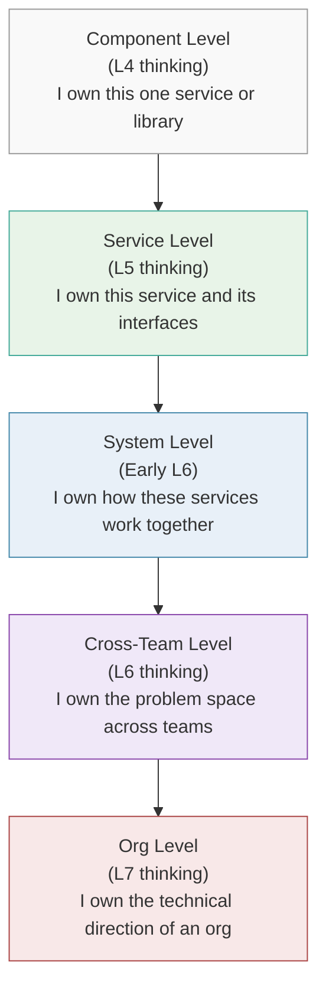
```mermaid
graph TD
    A["Component Level<br/>(L4 thinking)<br/>I own this one service or library"] --> B["Service Level<br/>(L5 thinking)<br/>I own this service and its interfaces"]
    B --> C["System Level<br/>(Early L6)<br/>I own how these services work together"]
    C --> D["Cross-Team Level<br/>(L6 thinking)<br/>I own the problem space across teams"]
    D --> E["Org Level<br/>(L7 thinking)<br/>I own the technical direction of an org"]
    
    style A fill:#f9f9f9,stroke:#999
    style B fill:#e8f4e8,stroke:#4a9
    style C fill:#e8f0f8,stroke:#48a
    style D fill:#f0e8f8,stroke:#84a
    style E fill:#f8e8e8,stroke:#a44
```

Each level does not replace the level below -- it adds to it. An L6 engineer still writes and owns code (component level). But they also reason at the system and cross-team levels simultaneously.

#### Scope is given vs. scope is created

This is the most important concept in this section. Write it down.

**L5 scope is given.** A manager assigns you to a project. The project defines your scope. You do excellent work within that scope.

**L6 scope is created.** You identify a problem that nobody assigned you to, take ownership of it, and drive it to resolution. Your scope expands because of your initiative, not because of your assignment.

In an interview, this shows up immediately. An L5 candidate waits for the interviewer to define the scope. An L6 candidate defines the scope themselves -- by asking scoping questions, questioning assumptions, and expanding the problem space before diving into solutions.

**The 5 scoping questions every L6 candidate should ask before designing anything:**

1. "Is this a new system, or replacing something existing?"
2. "Are other teams building something similar that we should learn from or integrate with?"
3. "Is this a one-off need or something multiple teams will want?"
4. "What's the 18-month vision? How should I think about evolution?"
5. "What existing infrastructure should we build on rather than replicate?"

These five questions take 3-4 minutes. They signal immediately that you think at L6. They also get you critical information that changes your design.

#### When to stop scoping and start designing

A common mistake: candidates spend so long asking scoping questions that they never get to design. The interviewer gets frustrated.

The rule: ask your scoping questions in the first 5-7 minutes. Then say explicitly: "Based on what I've heard, I'm going to scope this as X. Let me proceed with that assumption -- please stop me if I've misunderstood." Then design.

If new information emerges during design, you can revisit scope. But you need to show you can build things, not just ask questions.

#### L5 vs L6 scope -- a direct comparison table

| Dimension | L5 (Senior) | L6 (Staff) |
|-----------|-------------|------------|
| What they own | A component, a service, a defined project | A problem space that spans components and teams |
| Planning horizon | This quarter, maybe next | 1-2 years, with explicit evolution thinking |
| Sphere of influence | My team and direct collaborators | Multiple teams, sometimes whole org |
| Problem sourcing | Problems are assigned to me | I identify which problems need solving |
| Decision scope | Decisions within my component | Decisions with cross-team implications |
| Failure accountability | Responsible for my component's failures | Responsible for outcomes in my problem space |
| Technical reasoning | Deep in my service and its interfaces | Entire systems, cross-team patterns |
| How scope expands | Scope is given by manager | Scope is created through initiative and credibility |

#### Common beginner mistake: confusing scope with project size

**Mistake:** "I need to get onto a bigger project to show L6 scope."

**Why it's wrong:** Scope is about how you think, not what you're assigned to. A Staff Engineer on a "small" project shows scope by connecting it to adjacent teams, building reusable solutions, and thinking 2 years ahead.

**The fix:** In your current project, ask: What does this affect beyond my immediate service? What patterns here could help other teams? What will break at 10x scale? Who should know about this decision?

Answering those questions *is* expanding your scope -- regardless of project size.

---

### 3.2 Impact -- Connecting Technical Work to Real Outcomes

#### What "impact" means in a Google context

Impact is not what you built. Impact is what changed because of what you built.

"I built a new caching layer" -- that is output. That is not impact.

"I built a new caching layer that reduced API latency from 400ms to 50ms, which improved our checkout conversion rate by 2%, adding $1.2M in annual revenue" -- that is impact.

The difference is the connection between technical work and real outcomes. L6 engineers make this connection explicit. L5 engineers often leave it implicit or do not make it at all.

#### The "so what?" test

Before describing any technical achievement in an interview, ask yourself: "So what? Why does this matter to users, to the business, to other engineers?"

If you cannot answer "so what?" -- you are describing output, not impact.

Practice this until it becomes automatic. Every technical claim should have an answer to "so what?"

| Technical Claim | "So What?" Answer | Full Impact Statement |
|-----------------|-------------------|----------------------|
| "I optimized the database query" | Users get results faster | "I reduced query time from 800ms to 80ms, dropping page load time below 200ms, which increased user engagement by 15%" |
| "I built a shared library" | Other teams don't have to build it themselves | "I built an auth library that 4 teams adopted, saving ~8 engineering-weeks of duplicate work per year and eliminating 3 classes of auth bugs" |
| "I refactored the deployment pipeline" | Deploys are faster and safer | "I cut deploy time from 40 minutes to 8 minutes and added canary analysis, reducing deployment-related incidents by 70%" |

#### The impact pyramid

Think of impact in levels. Higher levels have more value, but they require understanding the levels below.

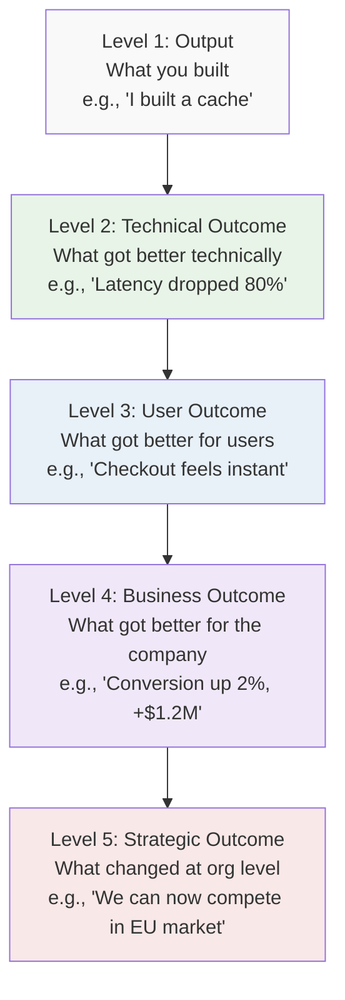
```mermaid
graph TD
    A["Level 1: Output<br/>What you built<br/>e.g., 'I built a cache'"] --> B["Level 2: Technical Outcome<br/>What got better technically<br/>e.g., 'Latency dropped 80%'"]
    B --> C["Level 3: User Outcome<br/>What got better for users<br/>e.g., 'Checkout feels instant'"]
    C --> D["Level 4: Business Outcome<br/>What got better for the company<br/>e.g., 'Conversion up 2%, +$1.2M'"]
    D --> E["Level 5: Strategic Outcome<br/>What changed at org level<br/>e.g., 'We can now compete in EU market'"]
    
    style A fill:#f9f9f9
    style B fill:#e8f4e8
    style C fill:#e8f0f8
    style D fill:#f0e8f8
    style E fill:#f8e8e8
```

L5 engineers typically speak at Levels 1-2. They describe what they built and how it performs technically.

L6 engineers speak at Levels 2-4. They connect technical changes to user and business outcomes.

You do not always have the data to speak at Level 4. But you should always try to reason toward it. "I don't have the exact revenue number, but reduced checkout latency historically correlates with higher conversion, so I'd estimate a meaningful positive business impact."

Showing you *think* about business outcomes -- even when you cannot prove them -- is an L6 signal.

#### Team-level, multi-team, and org-level impact -- the definitions

**Team-level impact** is when your work improves your team's outcomes. You shipped features, reduced bugs, improved your team's velocity. This is excellent L5 work.

What team-level impact looks like:
- "I reduced our build time by 50%, saving each engineer 20 minutes per day"
- "I mentored two junior engineers who are now self-sufficient"
- "I paid down the tech debt that caused weekly on-call escalations"

What team-level impact does *not* look like:
- Work that extends beyond your team
- Systems or patterns adopted by other teams
- Influence on technical direction outside your team's roadmap

**Multi-team impact** is the core of L6. Your work extends beyond your immediate team. You are improving outcomes for multiple teams, creating tools others adopt, or solving problems that would otherwise be solved separately by multiple teams.

What multi-team impact looks like:
- "I built a shared auth library that four teams now use"
- "I identified an architectural problem affecting three services and drove a coordinated fix"
- "I established a design review process that improved quality across the product area"
- "I mentored the tech leads of two other teams on scaling challenges"

The critical insight: multi-team impact is not just about working on a project that *touches* multiple teams. It is about having *influence and effect* on teams beyond your own -- often without direct authority or formal assignment.

**Org-level impact** shapes the direction or capability of an entire organization (typically a collection of teams sharing a mission). This is expected for L7 (Senior Staff), but strong L6 candidates often demonstrate some.

What org-level impact looks like:
- "I defined the technical roadmap for the payments organization"
- "I drove the decision to migrate from monolith to microservices, affecting 15 teams"
- "I established the org's approach to observability"

#### Quantifying impact -- the numbers that matter in interviews

When you say "I improved performance," interviewers hear vague claims. When you say specific numbers, they hear evidence.

Numbers that carry weight in Staff-level interviews:
- Latency improvements: before/after in milliseconds or percentages
- Throughput changes: requests per second, before and after
- Cost savings: dollar amounts or percentage reduction
- Reliability improvements: uptime percentages, MTTR reductions
- Engineering leverage: hours saved per engineer per week, team-weeks of work eliminated
- Adoption: number of teams using a shared library or tool
- Scale: peak traffic handled, data volume managed

You will not always have exact numbers. Estimate. Say "approximately." Show that you think in numbers.

**Words to say in an interview:**
"I don't have the exact figure, but based on our traffic at the time, I estimate this saved roughly..."
"The business metric connection I made was: faster latency -> lower bounce rate -> higher conversion. I'd need the product data to quantify exactly."

These phrases show L6 thinking even without hard data.

#### The impact multiplier -- 1x, 10x, 100x leverage

This is a powerful mental model for understanding impact at scale.

**1x leverage:** Your impact equals your effort. You work 10 hours, you get 10 hours of output. Most task execution falls here.

**10x leverage:** Your impact multiplies through others. You spend 10 hours building a tool or writing a document, and it saves 5 engineers 2 hours each -- that's 10 hours of work creating 10+ hours of value for others.

**100x leverage:** Your impact shapes how a group operates at a fundamental level. You establish a standard, create a platform, or change a process that affects how 50+ engineers work every day.

L6 engineers consistently look for 10x+ leverage opportunities. They ask: "Could I build this once and share it with everyone? Could this document replace 50 ad-hoc conversations? Could this tool eliminate the class of problem entirely?"

In interviews, you can demonstrate this thinking by saying: "Rather than solving this for just our team, I'd design the API to be general enough for other teams to use. That turns a one-team win into a potential org-wide win."

---

### 3.3 Ownership -- The Most Important Concept

#### Why ownership is the hardest concept to internalize

Scope and impact are intellectually understandable. Ownership requires an emotional shift.

Ownership means you feel *responsible* for outcomes that nobody explicitly assigned to you. It means you cannot look at a broken user experience and say "not my code, not my problem." It means you feel discomfort when something in your problem space is broken, even if the root cause is in someone else's service.

This feeling of responsibility -- this *discomfort with broken things in your area* -- is the core of Staff-level ownership. It cannot be faked in an interview for long. The way you talk about your past work reveals whether you actually own things or merely execute tasks.

#### Ownership vs responsibility vs accountability -- the precise definitions

These words are often confused. Here is what they mean in practice:

**Responsibility** = you are expected to do a task. You were assigned this work. "I'm responsible for the caching layer."

**Accountability** = you answer for outcomes. When it goes wrong, you are the person asked "what happened?" "I'm accountable for our API reliability."

**Ownership** = you *proactively ensure* outcomes without being asked. You do not wait for the pager to fire. You do not wait for someone to point out the problem. You look for problems in your area before they cause incidents. "I own user notification delivery" means you wake up at 3am caring about whether notifications got through, even if the failure is in someone else's service.

Ownership > accountability > responsibility. Staff Engineers operate at the ownership level.

#### The 5 dimensions of Staff-level ownership

Real ownership at L6 has five distinct dimensions. A Staff Engineer owns all five for their problem space. An L5 engineer typically owns one or two for their component.

**Dimension 1: Correctness**

You own the invariants -- the things that must always be true. Not just "my code is correct" but "the outcomes of the system are correct across all edge cases, failure modes, and interactions with other services."

Example: If you own a payment processing problem space, your correctness invariant might be: "Every payment attempt generates exactly one charge -- no double charges, no missed charges." You own that invariant even when it requires validating the behavior of 6 different services that touch the payment flow.

**Dimension 2: Reliability**

You own uptime and degradation behavior. Not just "my service is up" but "users can accomplish their goals even when parts of the system are degraded."

An L5 engineer owns the reliability SLA for their service. An L6 engineer owns the end-to-end reliability of the user experience that depends on their problem space -- including designing graceful degradation for dependencies they do not control.

**Dimension 3: Performance**

You own the performance budget across the entire user-facing path. Not just "my service is fast" but "the total latency experienced by the user is within our targets."

This means noticing when a slow dependency is causing your problem space to underperform -- and driving the fix, even when the root cause is in another team's service.

**Dimension 4: Cost**

You own the cost profile of your problem space. If you own notification delivery, you own the cloud bill for notification delivery. You know the top cost drivers, you have a cost reduction roadmap, and you can answer "is this new feature worth its incremental cost?"

An L5 engineer builds features as designed. An L6 engineer builds features *and* tracks their cost impact, making explicit tradeoffs between cost and quality.

**Dimension 5: Evolution**

You own the long-term trajectory. You think about what the system needs to look like in 18 months and 3 years. You identify where the current architecture will fail as scale increases. You propose migration paths and get buy-in for them before they become emergencies.

An L5 engineer solves today's problems. An L6 engineer solves today's problems while setting up tomorrow's solutions.

#### The 3am test -- the simplest ownership check

Here is the simplest test for whether you have Staff-level ownership of something:

*If your monitoring paged you at 3am with a problem in your area -- would you wake up and fix it, or would you send a message saying "this is actually Team X's problem"?*

Staff-level ownership means you feel personally responsible for outcomes. You do not do a hand-off and go back to sleep. You stay engaged until users are not affected.

This does not mean you personally fix everything. You might coordinate, help another team debug, design a mitigation, or just ensure the right people are engaged. But you do not disengage until the outcome is resolved.

In interviews, you can demonstrate this mindset by saying things like:
- "Even though the root cause is in the user preference service, which I don't own, the user experience is my problem to coordinate."
- "I would not consider this resolved until the user-facing symptoms are gone -- not just until my service is healthy."

#### Ownership signals in interviews -- what they sound like

**Weak ownership signals (L5):**
- "I built the notification service"
- "I worked on the caching layer"
- "My team was responsible for authentication"
- "When something breaks in my service, I investigate and fix it"

**Strong ownership signals (L6):**
- "I own notification delivery outcomes -- regardless of which service causes the failure"
- "When users can't receive notifications, that is my problem to coordinate -- even when the root cause is a dependency I don't control"
- "I've mapped my blast radius: if my service fails, here's what breaks for users, and I've designed degradation paths for each critical case"
- "I own the invariant that every transaction generates exactly one charge. I test that invariant across all the services that touch the payment flow, not just my own code"

Notice the difference. L5 signals describe work done. L6 signals describe *responsibility for outcomes*.

#### The ownership-credibility-influence cycle

Ownership builds credibility. Credibility enables influence. Influence enables wider ownership. This cycle is how Staff Engineers expand their scope over time.

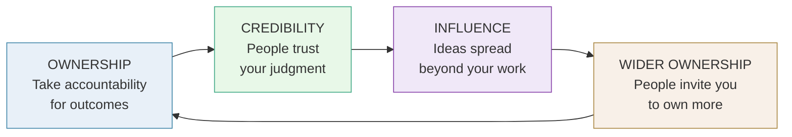
```mermaid
flowchart LR
    A["OWNERSHIP<br/>Take accountability<br/>for outcomes"] --> B["CREDIBILITY<br/>People trust<br/>your judgment"]
    B --> C["INFLUENCE<br/>Ideas spread<br/>beyond your work"]
    C --> D["WIDER OWNERSHIP<br/>People invite you<br/>to own more"]
    D --> A
    
    style A fill:#e8f0f8,stroke:#48a
    style B fill:#e8f8e8,stroke:#4a8
    style C fill:#f0e8f8,stroke:#84a
    style D fill:#f8f0e8,stroke:#a84
```

This is why ownership is the foundation. You cannot shortcut to influence. You have to earn it through demonstrated ownership over time.

In an interview context: you demonstrate this cycle by describing your past work in terms of this progression. "I took ownership of X, which built credibility in Y, which allowed me to influence Z."

---

### 3.4 The Scope-Impact-Ownership Triangle

These three concepts are not independent. They reinforce each other. You cannot have maximum impact without broad scope. You cannot have broad scope without deep ownership. You cannot have sustained ownership without driving impact.

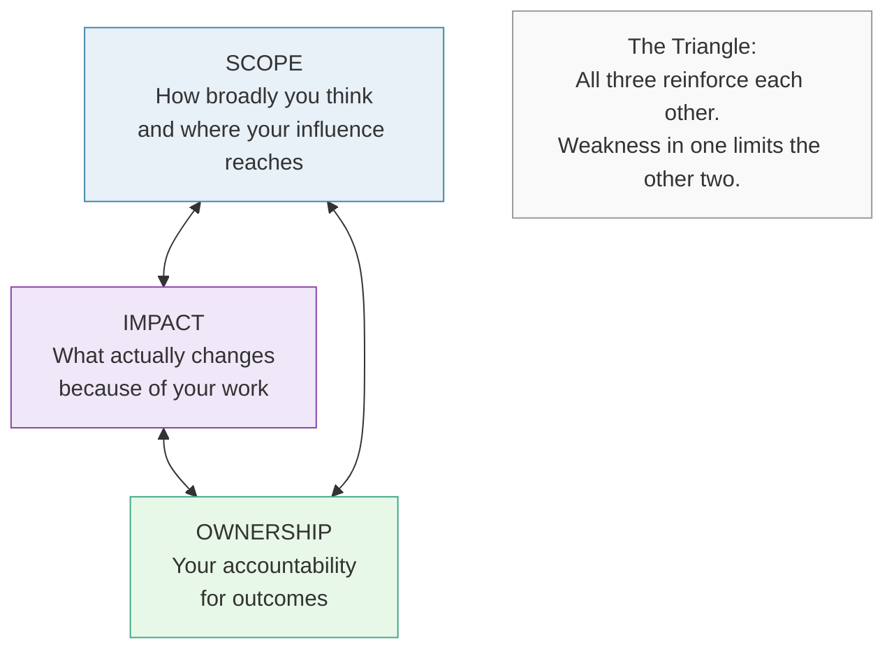
```mermaid
flowchart TD
    S["SCOPE<br/>How broadly you think<br/>and where your influence reaches"] <--> I["IMPACT<br/>What actually changes<br/>because of your work"]
    I <--> O["OWNERSHIP<br/>Your accountability<br/>for outcomes"]
    O <--> S
    
    SIO["The Triangle:<br/>All three reinforce each other.<br/>Weakness in one limits the other two."]
    
    style S fill:#e8f0f8,stroke:#48a
    style I fill:#f0e8f8,stroke:#84a
    style O fill:#e8f8e8,stroke:#4a8
    style SIO fill:#f9f9f9,stroke:#999
```

**Scope without ownership:** You think broadly but do not take responsibility for outcomes. You identify problems but leave them for others to fix. Result: influence without follow-through -- people stop trusting you.

**Ownership without scope:** You are deeply accountable for your component but do not look beyond it. You are a reliable executor. Result: strong L5, ceiling on L6 progression.

**Impact without scope or ownership:** You get lucky with a high-impact project but do not have the habits to repeat it. Result: one-time contributor, not a Staff Engineer.

The full triangle -- broad scope, demonstrated impact, and deep ownership -- is the L6 profile.

---

### 3.5 Cross-Team Ownership and Conway's Law

#### What Conway's Law is and why it matters for ownership

Conway's Law says: "Organizations design systems that mirror their communication structures."

In plain English: your software architecture tends to look like your team structure.

If you have a team that owns the user service and a separate team that owns the notification service, you will tend to build a hard boundary between them -- even when a softer integration would serve users better.

This matters for ownership because: **the most important problems often exist at team boundaries, not inside teams.**

Conway's Law creates blind spots. Each team is incentivized to optimize within their boundary. Nobody is incentivized to optimize across boundaries. This is where L6 ownership is most valuable -- and most rare.

#### How to apply Conway's Law in interviews

When an interviewer gives you a system design problem, ask yourself: where are the team boundaries in this system? What happens at those boundaries? Who owns the interaction?

Then deliberately discuss ownership of those boundaries. This signals L6 thinking immediately.

**Example: Design a ride-sharing dispatch system**

L5 candidate: designs the dispatch service cleanly, discusses the algorithm, handles scale.

L6 candidate: designs the dispatch service, then says -- "I want to spend a moment on the team boundary here. Dispatch depends on real-time location data from the Driver service, and on pricing data from the Pricing service. Each of those is probably owned by a different team. At the boundary between Dispatch and Location, the question is: who owns the SLA for location freshness? I'd propose that Dispatch defines its location freshness requirement -- say, location data under 5 seconds old -- and the Driver team guarantees it. I'd want explicit contract tests at this boundary."

That last paragraph took 30 seconds. It shows L6 ownership thinking.

#### The blast radius of ownership

When you own a problem space, you own its blast radius. Blast radius means: what breaks downstream if your area fails?

An L6 engineer knows their blast radius explicitly. They can say: "If my rate limiting service fails, here is what happens to each of the 15 services that depend on it. For critical services like payment fraud detection, I have a fallback design. For lower-priority services, I accept temporary degradation."

Mapping your blast radius is a form of ownership. It forces you to understand your dependencies, your consumers, and your failure modes in a system-wide context.

In interviews, you can demonstrate blast radius ownership by proactively saying: "Let me think about who depends on this service and what happens if it fails. [Pause to think.] Service A would see X behavior, Service B would fall back to Y, and Service C would hard-fail. I'd design circuit breakers for the critical paths and accept degradation for the non-critical ones."

---

### 3.6 Owning Failure Modes -- What Nobody Asks About

One of the clearest L6 signals in a system design interview is discussing failure modes before you are asked.

L5 candidates design the happy path well. L6 candidates design the happy path, then proactively explore what happens when things go wrong.

#### The failure ownership matrix

For any system, there are four quadrants of failure:

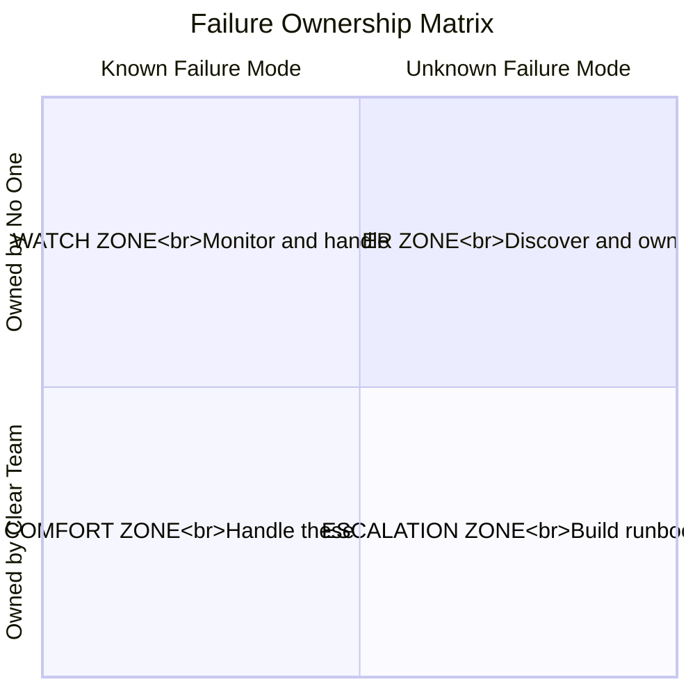
```mermaid
quadrantChart
    title Failure Ownership Matrix
    x-axis "Known Failure Mode" --> "Unknown Failure Mode"
    y-axis "Owned by Clear Team" --> "Owned by No One"
    quadrant-1 "DANGER ZONE<br/>Discover and own these"
    quadrant-2 "WATCH ZONE<br/>Monitor and handle"
    quadrant-3 "COMFORT ZONE<br/>Handle these well"
    quadrant-4 "ESCALATION ZONE<br/>Build runbooks"
```

In plain text:
- **Bottom-left (Known, owned):** Failures your team expects and has runbooks for. You handle these well.
- **Bottom-right (Known, unowned):** Failures that cross team boundaries. These are the L6 opportunity. Someone needs to own them. That person is you.
- **Top-left (Unknown, owned):** Surprises within your area. Good monitoring and chaos engineering catch these.
- **Top-right (Unknown, unowned):** The danger zone. These cause the worst incidents. A Staff Engineer proactively explores this quadrant.

**In interviews, naming failures in the bottom-right and top-right quadrants is an L6 signal.**

"One failure mode I want to discuss that might be easy to overlook is the case where Service A is partially degraded -- responding but slowly. That is harder to detect than an outage and can cause subtle cascade failures. I would add timeout-plus-circuit-breaker on this interface, not just timeouts."

#### Failure ownership phrases to use in interviews

- "I want to proactively discuss some failure modes that might not be obvious."
- "This is a cross-service failure mode -- neither team fully owns it, so I'd want to define ownership explicitly."
- "The scariest failure mode here is not an outage but a slow degradation that is hard to detect."
- "I'd design this so failures in this dependency are isolated and cannot cascade to affect users in completely unrelated flows."

---

### 3.7 Long-Term Ownership vs Short-Term Solutions -- Technical Debt as Deferred Ownership

#### The connection between technical debt and ownership

Technical debt is not just messy code. Technical debt is deferred ownership.

When a team takes a shortcut -- using a brittle data model, skipping observability, hard-coding a configuration -- they are deferring ownership. The problem will return. Someone will have to own it then. Usually it will be harder, more expensive, and more urgent.

An L6 engineer sees technical debt as an ownership problem. They ask: who is going to own the consequences of this decision in 18 months? Are we being fair to future-us?

#### How to discuss technical debt at L6 level

L5 discussion of tech debt: "We have some tech debt in the caching layer that we should clean up someday."

L6 discussion: "The current caching layer has two issues that will become acute in the next 6-12 months. First, the key structure does not support sharding, which we'll need at 3x current traffic. Second, cache invalidation is done inline with writes, which will cause latency spikes at high load. I've scoped the migration: we can do it incrementally over two quarters without stopping feature work. The cost of doing it now is 6 engineer-weeks. The cost of doing it as an emergency in 12 months is probably 20 engineer-weeks plus an incident response."

The second version:
- Quantifies the timeline with specifics
- Explains the technical risk clearly
- Proposes an incremental solution
- Estimates cost now vs cost later

This is ownership of the long-term trajectory.

#### The 12-18 month ownership horizon

L6 engineers actively maintain a 12-18 month view of their problem space. They can answer:
- What will break when traffic doubles?
- What architectural decisions are we making today that we'll regret in 18 months?
- What cleanup work needs to happen before we can add the next major feature?
- What dependencies are becoming a liability?

In interviews, demonstrate this by saying: "This design works for our stated requirements. Let me also discuss what I'd be watching for in the next 12-18 months..." Then name 2-3 specific things that would require architectural evolution.

---

### 3.8 Sizing Scope Correctly -- Over-Scoping vs Under-Scoping

#### The two failure modes

In an interview, you can fail at scope in two directions:

**Under-scoping:** You take the problem exactly as stated, solve only what was asked, and never question whether the stated problem is the right problem. You miss the L6 signals entirely.

**Over-scoping:** You spend 15 minutes exploring scope, question everything, and never actually design anything. The interviewer gets frustrated because they need to see that you can build systems, not just philosophize about them.

The sweet spot: spend 5-7 minutes on focused scoping questions, state your assumptions explicitly, then design with confidence.

#### The scoping rule of thumb

In a 45-minute interview:
- 5-7 minutes: scoping and clarification
- 3-5 minutes: state your design approach and check with interviewer
- 25-30 minutes: deep design with tradeoff discussion
- 5-8 minutes: failure modes, scaling, evolution discussion

If you are still asking scoping questions at the 10-minute mark, you have over-scoped.
If you have not asked any scoping questions by the 5-minute mark, you have under-scoped.

#### Questions that are always worth asking

These questions are always valuable in any Staff-level system design interview. They take 30-60 seconds each and signal L6 thinking:

1. "What scale are we designing for -- ballpark QPS or daily active users?"
2. "Is this greenfield or replacing an existing system? If replacing, what's the migration strategy?"
3. "What are the most critical failure scenarios we need to defend against?"
4. "Are there other teams who have similar needs that we should design for, or is this specific to our use case?"
5. "What's the org's investment horizon? Are we building something that needs to last 5 years or something we'd migrate off in 18 months?"

---

## Section 4: Mental Models

These analogies make the abstract concepts stick. Use them when explaining L6 thinking to yourself or others.

### Mental Model 1: The Ripple Effect (for Scope)

Drop a stone into a pond. The ripples spread outward.

An L5 engineer's stone creates ripples that reach the edge of their pond (their team). Occasionally a ripple crosses to an adjacent pond.

An L6 engineer's stone regularly creates ripples that cross multiple ponds. Other teams feel the effects of what this person does.

An L7 engineer is not dropping stones -- they are affecting the water table that feeds all the ponds.

When you think about your scope: how far do your ripples travel?

### Mental Model 2: Problem Ownership vs Solution Ownership (for Ownership)

An L5 engineer owns solutions. Give them a problem, they produce an excellent solution. They are evaluated on solution quality.

An L6 engineer owns problems. They identify *which problems are worth solving*, not just how to solve them. They are evaluated on whether the right problems got solved well.

The question is: do you wait for problems to be handed to you, or do you identify problems worth solving?

### Mental Model 3: The Camera Zoom (for Scope)

Imagine a camera that can zoom in and out.

Zoomed in (L5): You see your code, your component, your immediate context. You excel at this level of detail.

Zoomed out (L6): You see the system, the organization, the multi-year trajectory. You can operate at this level effectively.

All zoom levels (L6+): You move fluidly between zoom levels, understanding how decisions at one level affect others. You do not get lost in the details when thinking broadly, and you do not lose sight of the big picture when diving into details.

The L6 skill is the *fluid movement* between zoom levels. You can zoom in to debug a specific system problem, then zoom out to explain how it fits into the broader architecture -- in the same conversation.

### Mental Model 4: Architect vs Builder (for Ownership Balance)

This is a spectrum, not a binary.

A pure builder executes blueprints. They do not question them. A pure architect designs but does not build. They are disconnected from reality.

A Staff Engineer lives in the middle. They architect when needed, build when needed, and understand how each informs the other. They do not just design -- they ensure designs become reality. They do not just build -- they ensure what they build solves the right problem.

### Mental Model 5: The Leverage Multiplier (for Impact)

Some work has 1x leverage: your impact equals your effort.

Some work has 10x leverage: you build something once that saves 10 engineers one hour a week.

Some work has 100x leverage: you establish a process or create a platform that changes how your entire organization operates.

Staff Engineers search for 10x+ leverage constantly. The question they ask is: "What is the highest-leverage thing I could be doing right now?"

Often the highest-leverage work is not writing code. It is writing a design document that prevents 50 engineers from reinventing a wheel. It is establishing a standard that makes an entire class of problems go away. It is having a conversation that unblocks a team for a month.

### Mental Model 6: The GPS Driver (for Long-Term Ownership)

An L5 engineer navigates like someone following turn-by-turn GPS directions. "Turn left in 100 feet." They are excellent at following the current route.

An L6 engineer navigates like a driver who also knows the whole city. They follow the GPS but also notice when there is construction ahead, know an alternate route, and understand when the GPS is wrong. They recalculate and adapt.

The "city knowledge" is the long-term view. You know where things are going, you notice when the current route is suboptimal, and you proactively suggest better paths.

### Mental Model 7: The Town Doctor (for Ownership of Problems You Did Not Cause)

In a small town, the doctor is accountable for the town's health. When there is an outbreak, the doctor does not say "I didn't give them the infection -- that's not my responsibility." The doctor treats the patients, investigates the source, and takes measures to prevent spread.

A Staff Engineer is the doctor of their problem space. When something in their area is broken -- even if they did not cause it -- they treat it, investigate the source, and prevent recurrence. The "it's not my code" response is the equivalent of the doctor saying "I didn't give them the infection."

---

## Section 5: Real-World Examples

These examples show how scope, impact, and ownership manifested at real tech companies at scale.

### Example 1: Google -- Site Reliability Engineering Origin

**Background:** In the early 2000s, Google's operations were fragmented. Each team ran their own infrastructure. There was no unified approach to reliability. Services failed, users experienced outages, and fixing them required coordinating across many teams who had never spoken.

**The L6 ownership moment:** Ben Treynor (a Staff-level engineer at the time) looked at this situation and asked: "Who owns the reliability of Google services as a whole?" Nobody did. Each team owned their individual service's reliability. The *inter-service reliability* -- the user-facing reliability -- had no owner.

He proposed and built what became Google's Site Reliability Engineering function. Instead of each team solving reliability independently, he created a shared model, shared tools, and shared responsibilities.

**Scope, impact, and ownership demonstrated:**
- Scope: expanded from "my team's reliability" to "reliability as an engineering discipline"
- Impact: from individual team SLAs to consistent user-facing reliability across thousands of services
- Ownership: took accountability for an outcome (reliable user experience) that no single team owned

**The lesson:** The biggest impact comes from owning the gaps -- the spaces between teams, the problems nobody explicitly assigned anyone.

**Numbers:** Google's SRE approach, later publicized in the "SRE Book," influenced how reliability is done across the industry. Thousands of companies now use Google's on-call and SLO models.

### Example 2: Amazon -- The API Mandate (Bezos's Memo, 2002)

**Background:** Amazon in 2002 had a mess of internal services that communicated in ad-hoc ways -- direct database calls, custom protocols, tightly coupled integrations. This made it impossible to build new services on top of existing ones without massive effort.

**The L6 ownership moment:** Jeff Bezos (as CEO, but demonstrating engineering leadership) issued a mandate: all internal services must communicate through service APIs. No direct database access between teams. This was not a feature request -- it was an architectural ownership decision about how the entire company's software would be structured.

**Scope, impact, and ownership demonstrated:**
- Scope: org-wide technical architecture
- Impact: enabled the AWS business -- because Amazon had disciplined service APIs internally, they could offer those services to the world. AWS revenue in 2022: $80 billion.
- Ownership: took accountability for a systemic problem (service coupling) that every individual team felt but nobody owned collectively

**The lesson:** Sometimes the most impactful ownership decisions are architectural constraints -- saying "this is how we will build things" and holding the line.

**For interview purposes:** When you propose standards or shared approaches in a design, you are demonstrating this same pattern.

### Example 3: Netflix -- Chaos Engineering

**Background:** Netflix moved to AWS and microservices around 2010. As their systems grew more distributed, reliability became harder to reason about. Individual services were reliable, but the whole system had emergent failure modes that nobody fully understood.

**The L6 ownership moment:** A team of engineers (later called the Chaos Monkey team) looked at this problem and asked: "Who owns our understanding of how the system fails?" Nobody did. Each team knew their service's failure modes. The system-level failure behavior was unknown.

They built Chaos Monkey -- a tool that randomly terminated production services to force engineers to build resilient systems. This was not a feature. This was taking ownership of the entire system's failure behavior.

**Scope, impact, and ownership demonstrated:**
- Scope: from individual service reliability to system-level resilience
- Impact: Netflix moved from "system that we hoped was reliable" to "system whose failure modes we understood and had tested"
- Ownership: took accountability for failure behavior that was a collective blind spot

**Numbers:** Netflix has published that their chaos engineering work, combined with their global expansion, allows them to maintain 99.99%+ streaming availability across 190 countries.

**The interview lesson:** When discussing reliability in an interview, mentioning chaos engineering and testing failure modes is an L6 signal. It shows you think about *understanding* failure, not just *hoping* systems are reliable.

### Example 4: Uber -- The Cross-Team Data Pipeline Incident

**Background:** Uber grew very quickly. Different teams built their own data pipelines. By 2015, there were dozens of overlapping pipelines, each slightly different, with no consistent ownership of data quality.

**The symptom:** An engineer on the Surge Pricing team noticed that their pricing decisions were sometimes based on stale data. They traced it back to multiple upstream pipelines with inconsistent freshness guarantees. No single team owned the data quality of the inputs.

**The L6 ownership response:** A Staff Engineer looked at this cross-team problem and proposed: a unified data pipeline with explicit freshness SLAs per data type, owned by a new team with cross-functional scope.

**What they owned:**
- The correctness invariant: "Surge pricing decisions are based on data no older than X seconds"
- The interstitial failure zone: the pipeline connections between teams
- The long-term evolution: a data quality standard that would scale with the org

**The lesson:** The most impactful ownership often requires creating a new team or role to own a problem space that current teams cannot address.

**Numbers:** Uber's unified data platform eventually processed petabytes per day and served thousands of internal data consumers. The original ownership decision by those Staff Engineers enabled that scale.

### Example 5: Google -- The Shared Infrastructure Decision at Scale

**Background:** In the early days of Google's growth, each product team built its own infrastructure: their own RPC frameworks, their own logging systems, their own configuration management. This worked when there were 5 teams. With 50 teams, it was chaos.

**The L6 ownership moment:** Engineers across infrastructure teams looked at this duplication and asked: "Who owns the fact that we are building the same thing 50 times?" Nobody did -- each team owned their own stack.

They built what became internal Google platforms: Stubby (RPC), Chubby (distributed lock service), Bigtable (storage) -- all designed as platforms for internal use before they became academic papers and eventually inspired external systems (gRPC, ZooKeeper, HBase).

**Scope, impact, and ownership demonstrated:**
- Scope: from "my team's infrastructure" to "Google's engineering infrastructure"
- Impact: Bigtable and MapReduce enabled Google to process web-scale data in ways competitors could not. These are not just engineering efficiencies -- they are fundamental business advantages.
- Ownership: took accountability for the duplication problem that no individual team could solve

**The lesson for interviews:** When you say "I'd design this as a shared platform rather than a team-specific solution," you are demonstrating this same pattern. This is always an L6 signal.

---

## Section 6: Design Trade-offs

Every Staff-level design decision involves tradeoffs. The L6 difference is not which tradeoff you choose -- it is *how you reason about* tradeoffs across all five ownership dimensions.

### Trade-off Framework: The Five Ownership Dimensions

For any significant design decision, an L6 engineer explicitly considers:

| Dimension | Question to Ask |
|-----------|----------------|
| Correctness | Does this maintain the invariants that must always be true? |
| Reliability | Does this degrade gracefully? Does it make failure modes better or worse? |
| Performance | What is the latency and throughput impact? Does it meet the user-facing requirements? |
| Cost | Is the cost justified? What is the long-term cost curve? |
| Evolution | Does this make the system easier or harder to evolve? What does the migration path look like? |

An L5 engineer typically discusses correctness and reliability. An L6 engineer considers all five.

### Trade-off 1: Consistency vs Availability

This is the classic trade-off in distributed systems (formalized by the CAP theorem, but you experience it in practice constantly).

**The choice:** When a network partition happens, do you sacrifice consistency (serve stale data) or availability (refuse to serve data)?

**How L5 discusses it:** "We need to decide between strong consistency and eventual consistency. Strong consistency is safer but slower. Eventual consistency is faster but has race conditions."

**How L6 discusses it:**

"This consistency-vs-availability trade-off is not binary -- it is per-operation. Let me reason through it for each key operation:

- Reading a user's profile: eventual consistency is fine. A 10-second staleness is invisible to users.
- Reading a user's balance: strong consistency is required. Serving stale balance data could allow overdrafts or deny valid transactions.
- Posting a message: eventual consistency for delivery (message appears within 500ms), but strong consistency for ordering (message order must be causal).

Rather than choosing one consistency level for the whole system, I'd partition the data by consistency requirement and apply different storage strategies per partition. This costs more to build but avoids the 'one size fits all' antipattern that causes subtle bugs."

**What makes this L6:** It shows ownership of the correctness invariant (per operation), reasoning about business impact (overdrafts vs profile staleness), and avoiding over-simplification.

### Trade-off 2: Build vs Buy vs Reuse

Every system requires many components. Building from scratch gives you control. Buying a third-party solution is fast. Reusing an existing internal solution is often best -- but requires coordination.

**How L5 discusses it:** "We could use Kafka for the message queue since it's proven at scale."

**How L6 discusses it:**

"For the message queue, let me consider three options:

Option A: Use the org's internal event bus platform. Pros: no operational overhead, consistent with other teams' patterns, built-in monitoring. Cons: limited to features the platform offers, dependency on another team's roadmap. This is my default preference unless we have specific requirements the platform cannot meet.

Option B: Deploy our own Kafka cluster. Pros: full control, can tune for our access patterns. Cons: significant operational overhead (sizing, patching, monitoring), duplicates what Platform team already maintains, sets a precedent for other teams to do the same.

Option C: Use a managed Kafka service (e.g., Confluent). Pros: managed operational overhead, quick to start. Cons: vendor dependency, cost at scale, potential data sovereignty issues.

My recommendation is Option A, with Option C as a fallback if we need features the internal platform lacks. I'd reject Option B unless we've explicitly identified a requirement the internal platform cannot meet -- the operational overhead and organizational fragmentation are not worth the control."

**What makes this L6:** It considers organizational impact (fragmentation risk), not just technical merits. It defaults to shared solutions. It articulates clear criteria for each option.

### Trade-off 3: Simple Now vs Flexible Later

Every system has a tension between keeping it simple for current requirements and making it flexible for future requirements you cannot fully predict.

**How L5 discusses it:** "I'd keep it simple now and refactor when we need the flexibility."

**How L6 discusses it:**

"This is the classic YAGNI vs extensibility tension. Let me be explicit about how I'm thinking about it:

Things I'll over-engineer today:
- The storage key structure, because changing it after launch requires data migration. I'll design for future sharding even though we don't need it yet.
- The API contract, because breaking API changes require coordinating with consumers. I'll invest in a versioning strategy from day one.

Things I'll keep simple today:
- The processing logic, because it's internal and can be changed without consumers noticing.
- The admin tooling, because it's used by our own team and we can migrate ourselves.

The rule I'm using: over-engineer things that are hard to change later (storage schemas, public APIs, data formats). Keep simple things that are easy to change (internal logic, private implementation details, configuration)."

**What makes this L6:** It shows that "keep it simple" and "design for evolution" are not opposite choices -- they apply to different parts of the system. It demonstrates ownership of the evolution dimension.

### Trade-off 4: Operational Simplicity vs Feature Richness

Every additional feature adds operational complexity. An L6 engineer explicitly weighs the operational cost of features.

**How L5 discusses it:** Adds features based on requirements. Operational complexity is implicit.

**How L6 discusses it:**

"I want to be explicit about the operational tradeoff here. Adding per-user rate limit tiers (rather than a single global rate limit) is a 3x increase in operational complexity:
- 3x more configurations to maintain
- 3x more dashboards to monitor
- More complex on-call runbooks
- More edge cases for the support team

Is the feature value worth that operational cost? In this case, yes -- because per-user limits are a safety requirement for our largest enterprise customers. But I'd want to design it so the additional complexity is isolated to the rate limiter service itself and doesn't propagate to callers."

### Trade-off 5: Blast Radius vs Performance

Isolation reduces blast radius but adds latency. A monolithic service is fast but one bug can affect everything. A distributed system is isolated but has network overhead.

**The L6 question:** What is the right blast radius for each type of failure?

**Example:**

"I'm choosing to isolate the fraud detection service from the payment processing path. This adds 15ms of network overhead to every payment. That's a real cost. But it prevents a fraud detection bug from blocking all payments.

For the payment confirmation email, I'm making the opposite choice -- keeping it in-process with payment completion. The email is part of the user's success confirmation, so 15ms overhead is acceptable. And if emails fail, they fail silently without affecting the payment itself."

The L6 insight: do not apply one isolation pattern everywhere. Size the blast radius to the failure risk and acceptable user impact.

---

## Section 7: Common Interview Questions -- L6 Model Answers

### How to use this section

For each question, I show:
1. The question as an interviewer would ask it
2. An L5 response that is competent but limited
3. An L6 response that demonstrates scope, impact, and ownership
4. Analysis of what makes the L6 response stronger

---

### Q1: "Design a notification system for a social media platform."

**L5 response:**
"Sure. I'll design a service that sends notifications via push, email, and SMS. We'll need a notification service that receives events from other services, formats the notifications, and routes them to the appropriate channel. For push notifications we'd use Firebase/APNs. For email we'd use SendGrid. The service will have a queue to handle traffic spikes..."

**L6 response:**
"Before I dive in, a few scoping questions. Is this replacing an existing system or greenfield? Are we building this for one team's use or as a platform for multiple teams? Who are the most critical notification types -- I'm guessing things like 2FA codes and transaction alerts are more critical than social notifications?

[After getting answers]

Based on what I've heard, I want to design this as a platform -- not a service. The difference is that a platform has explicit contracts with its producers, documented SLAs, and self-service tooling. This matters because if 8 teams all send notifications through one system, they need clear boundaries about what the platform guarantees and what they are responsible for.

Let me start with the most critical design decision: priority tiers. Not all notifications are equal. A 2FA code that takes 30 seconds to arrive will cause login failures. A 'friend liked your post' notification that takes 5 minutes is invisible to users. I'd design four tiers: Critical (2FA, fraud alerts -- guaranteed delivery in under 10 seconds), High (transactional -- under 60 seconds), Normal (social -- best effort, under 5 minutes), and Low (marketing -- batch). These tiers get separate processing queues with dedicated capacity. This way a bulk marketing campaign cannot delay a 2FA code.

For the storage layer: I need to store notification state -- what was sent, what was delivered, what was clicked. But I also need to respect user preferences -- which channels they want, when they want to receive notifications, which types they've opted out of. I'd separate these into two stores: delivery state in a high-throughput write-optimized store, and user preferences in a strongly consistent store. The preference store needs strong consistency because an opt-out that takes an hour to propagate could result in sending notifications to users who have explicitly said no -- that's both a user trust issue and a legal compliance issue.

Let me discuss failure modes. The scariest failure is not my service going down -- that's detectable and I'd have an alert in under 2 minutes. The scariest failure is a partial failure: my service is up, but the user preference service is returning stale opt-out data. I'd prevent this by caching preferences locally with a short TTL (15 minutes for most types, but immediately reflecting opt-outs), and by having a separate 'preference freshness' monitor that alerts if preference sync lags.

For the API design, I'd build it so producers declare intent, not implementation. A producer says 'send a password reset notification to user 12345' -- they do not say 'send an email to user@example.com.' The platform decides the best channel based on the user's preferences and the notification's priority tier. This gives the platform flexibility to evolve channel strategies without requiring producer changes."

**Analysis:** The L6 response:
- Starts with scoping questions (platform vs service is a critical distinction)
- Immediately addresses priority tiers -- a multi-team ownership decision
- Explicitly reasons about the correctness invariant (opt-out propagation is a legal risk)
- Proactively discusses a subtle failure mode (partial failure vs outage)
- Discusses API design in terms of producer boundaries and ownership

---

### Q2: "Tell me about a time you had impact beyond your immediate team."

**L5 response:**
"I built a caching library that my team used. A few engineers from other teams heard about it and started using it too. It saved them time because they didn't have to build their own caching logic."

**L6 response:**
"I want to describe a situation that illustrates how multi-team impact works in practice -- including the parts that were uncomfortable.

I noticed that three teams in our org were independently building similar retry logic for their service-to-service calls. Each implementation was slightly different. One team's implementation had an exponential backoff bug that was causing retry storms during incidents -- making outages worse. The other two implementations were correct but incompatible with each other.

The natural L5 move would have been to fix the bug in our team's implementation and move on. Instead, I asked: what's the cost of three teams solving this separately, badly, for the next 5 years?

I proposed building a shared retry library with the following constraints: it had to handle the four most common scenarios (transient errors, rate limiting, service overload, and complete unavailability) correctly. It had to be configurable enough for different teams' needs but opinionated enough that the defaults were correct.

The uncomfortable part: two of the three teams had already invested time in their own implementations. Telling them their code would be deprecated was not a popular conversation. I spent three weeks in 1:1 conversations understanding their specific requirements, showing where the shared library met them, and in two cases building features specifically because those teams needed them.

The outcome: all three teams migrated to the shared library over the following quarter. The retry storm that had caused a major incident the previous year did not recur. I estimated the library saved about 6 engineering-weeks of duplicate work per year across the teams.

What I'd highlight about this story for the scope and ownership angle: I did not have authority to tell any of these teams to migrate. I built the library, made the case, and helped with the migration. That's driving direction without authority."

**Analysis:** The L6 response:
- Identifies a cross-team pattern, not just a team-level problem
- Shows the uncomfortable parts of cross-team ownership (the difficult conversations)
- Demonstrates driving direction without authority
- Quantifies impact
- Shows ownership of the outcome (preventing recurring incidents) not just building a tool

---

### Q3: "How do you scope a project at the Staff level?"

**L5 response:**
"I'd talk to stakeholders, understand the requirements, and then define what's in scope and out of scope based on what we can deliver in the time available."

**L6 response:**
"Scoping at Staff level starts with a question that L5 engineers often skip: is this the right problem to solve?

I find that the stated problem is often a symptom of a deeper problem. Someone asks me to 'optimize the recommendation service.' If I scope that immediately, I'll optimize the recommendation service. But if I spend 30 minutes understanding the context, I might discover that the recommendation service is already fast enough -- the actual problem is that the data pipeline feeding it has a 20-minute delay, making recommendations stale by the time they're served. Optimizing the service doesn't fix the user experience. I've scoped myself into solving the wrong problem.

So the first step in my scoping process is what I call the problem-behind-the-problem investigation. I ask: what user pain is driving this? What would success look like? Have we tried to solve this before? What stopped us?

The second step is breadth assessment. I ask: who else cares about this? Are there adjacent teams who would benefit from a shared solution? Is this a one-off problem or a pattern we should address systematically?

The third step is constraint identification. What are the hard constraints -- regulatory, architectural, timeline, team capacity? What are the soft constraints that we could negotiate?

The fourth step is explicit scope decisions. For every boundary I draw, I ask: why am I including this and excluding that? I make the exclusions explicit and justified, not implicit. If I'm excluding multi-region support, I write down that decision and why -- because six months later someone will ask why we didn't design for multiple regions.

The fifth step is the evolution question. For everything in scope, I ask: what happens in 18 months? Does this scope still make sense? Am I boxing myself in or leaving appropriate flexibility?

In practice, this process takes 2-3 days for a significant project. The output is a design document that starts with 'What problem are we solving and why this approach?' before it says anything about technical implementation."

---

### Q4: "Design a rate limiting service for a large API platform."

**L5 response:**
"I'd use a token bucket algorithm with Redis to track counts. We'd have a REST API that callers use to check and consume tokens. Rate limits would be configured per API key. For high availability, we'd run multiple Redis replicas..."

**L6 response:**
"Let me start with scoping. Is this a central rate limiting service used by many teams, or a rate limiter for one specific API? That changes the design significantly -- a platform service needs much stronger reliability guarantees and a clear ownership model.

Assuming this is a platform service, the first design decision is about the failure mode when the rate limiter is unavailable. If the rate limiter is down, do we fail open (allow all traffic) or fail closed (deny all traffic)? This is not a technical question -- it is a business question. For most APIs, fail-open is correct: a few minutes of unrate-limited traffic is less bad than denying all requests. But for APIs that are rate-limited for security reasons (authentication endpoints, for example), fail-open is dangerous.

I'd resolve this by making fail-open the default but allowing producers to configure fail-closed for their critical endpoints. This means the rate limiter needs to store the fail mode per endpoint in its own config store, not rely on clients knowing their own criticality.

For the algorithm: token bucket is correct for burst protection. But there is a subtlety when you run multiple rate limiter instances. Token buckets tracked locally are cheap and fast but inconsistent -- each instance sees a different token count, so the effective rate limit is (number of instances x per-instance limit). I'd accept this inconsistency for normal traffic since the aggregate limit is still bounded, but I'd use a centralized store (Redis) for critical endpoints where precise limiting matters.

Now, the cross-team ownership question. If 20 teams use this rate limiter, they all have different requirements: different rate limits, different granularities (per user vs per API key vs per IP), different failure modes. I'd design a self-service configuration interface where teams can define their own rate limit policies. But I'd also define mandatory fields -- every registered API must declare its fail-open vs fail-closed preference. I'm the platform owner, so I define the rules; teams choose the values.

For monitoring: I need two types of visibility. My own service health (latency, error rate, Redis connectivity) -- that's standard. And per-consumer visibility: is Team A's API currently rate-limiting traffic? When did it last hit its limit? I'd expose these as separate dashboards. Teams should be able to see their own rate limiting behavior without asking me."

**Analysis:** The L6 response:
- Immediately expands scope (platform vs single-API is a critical distinction)
- Addresses the fail-mode question as a business decision, not a technical one
- Shows ownership of the cross-team coordination aspect (per-consumer config)
- Distinguishes between technical correctness and operational requirements

---

### Q5: "What's the difference between owning a component and owning a problem space?"

**L5 response:**
"Owning a component means you're responsible for a specific service or piece of code. Owning a problem space means you're responsible for a broader area that might span multiple components."

**L6 response:**
"This is actually one of the most important distinctions in thinking about Staff-level work, so let me give you a concrete example.

If I own the payment processing service -- that is component ownership. I'm accountable for the code running in that service. When it has a bug, I fix it. When it needs a new feature, I build it. When it's slow, I profile and optimize it. My accountability ends at the service boundary.

If I own payment reliability -- that is problem space ownership. Payment reliability means: when a user tries to pay for something, does it work? That outcome depends on five different services: the payment form (frontend team), the cart service (commerce team), the payment processing service (my team), the fraud detection service (risk team), and the external payment provider integration (my team). Four of those five are not my code.

Component ownership means I feel responsible when my service breaks. Problem space ownership means I feel responsible when a user's payment fails -- regardless of which of those five services caused it. If the cart service is sending malformed requests to my payment service and causing failures, that's my problem to coordinate even though I did not write the cart code.

The practical consequence: a component owner monitors their service's health metrics. A problem space owner monitors end-to-end payment success rate -- a metric that requires instrumentation across all five services. If that metric degrades, the problem space owner investigates regardless of where the root cause lies.

In my experience, the shift from component ownership to problem space ownership is the hardest part of becoming a Staff Engineer. It requires giving up the comfort of 'that's not my code' as a safe harbor. But it also gives you a much larger impact -- because you're solving problems that nobody else would own."

---

### Q6: "How do you drive technical direction when you have no authority?"

**L5 response:**
"I share my proposals with the team, gather feedback, and refine based on input. If there's disagreement, I escalate to the team lead or manager."

**L6 response:**
"Authority-based direction fails at Staff level for a structural reason: you have no authority over the engineers you need to influence. Escalation to a manager is often worse -- it signals that you could not resolve a technical disagreement yourself, which is exactly what a Staff Engineer should be able to do.

The toolkit I use for driving direction has seven elements, and I use different combinations depending on the situation.

The most important is credibility. People follow the judgment of people they trust. Trust is built slowly through consistent good decisions, honest acknowledgment of uncertainty, and following through on commitments. When I want to drive a technical direction, the first question I ask is: do the relevant people already trust my judgment on this topic? If not, I need to build that trust before I push for a specific direction.

The second is data. Arguments backed by evidence are more compelling than arguments backed by opinion. Before proposing any significant technical change, I gather evidence: benchmarks, incident post-mortems, cost analyses, user impact data. This transforms 'I think we should do X' into 'the data shows we should do X, here's why.'

The third is problem framing. How you frame a problem shapes what solutions seem reasonable. If I frame it as 'should we use Kafka or RabbitMQ?' I get a technology debate. If I frame it as 'we need reliable at-least-once delivery with ordering guarantees at 50K messages/second with 99.99% availability' -- the requirements narrow the options significantly. Good framing often makes my preferred direction obvious without me having to push for it explicitly.

The fourth is early alignment. I try to discuss significant proposals with key stakeholders before the formal decision moment. When the team discussion happens, I want people to have already thought about it and arrived at their own conclusions -- which often align with mine because I've helped them understand the problem correctly.

The fifth is acknowledging tradeoffs honestly. If I pretend my proposal has no downsides, technical people will find the downsides and use them to discredit the whole proposal. If I acknowledge tradeoffs upfront and explain why the benefits outweigh them, I demonstrate the kind of nuanced judgment that makes people trust my recommendations.

The sixth is coalition building. For significant changes, getting buy-in from 2-3 respected engineers before a broader discussion accelerates alignment dramatically. Those engineers then advocate for the direction themselves, which is more persuasive than just me advocating.

The seventh is patience. Direction takes time to build. I plant seeds in conversations months before I need decisions. Ideas need time to marinate. I have to be comfortable with the fact that my best ideas sometimes take six to twelve months to gain traction."

---

### Q7: "How do you handle a production incident when the root cause is in another team's service?"

**L5 response:**
"I'd identify that it's their issue and notify them. I'd help diagnose if I can, but ultimately it's their problem to fix."

**L6 response:**
"The answer depends on what I own. Let me be specific.

If the incident is affecting users in my problem space, it is my incident to coordinate -- regardless of where the root cause lies.

Here's what that coordination looks like in practice:

First, within the first five minutes: I join the incident. I don't wait for the other team to page me. If I'm monitoring end-to-end user experience metrics (which I should be), I see the problem at the same time they do, sometimes before.

Second, I establish communication. I create an incident channel if one doesn't exist. I make sure all the right people -- from my team, from the team with the root cause, from any other teams in the blast radius -- are in that channel. Incident response coordination is a Staff Engineer responsibility.

Third, I work in parallel. While the team that owns the root-cause service is debugging, I'm asking: is there anything I can do to mitigate user impact right now? Can I enable a fallback? Can I shed non-critical load to protect the critical path? Can I add a retry with exponential backoff to absorb transient errors? Often the answer is yes, and mitigating user impact is more urgent than debugging root cause.

Fourth, I stay for the post-mortem. Not just to observe -- to contribute to the systemic fixes. If the root cause was in another team's service, but my system had no circuit breaker that would have contained the blast radius, that's something I need to fix. The post-mortem is where the systemic failures -- the failure of the whole system, not just the immediate bug -- get addressed. I own the systemic failures in my problem space.

What I don't do: I don't do the other team's debugging for them unless they explicitly need help. I don't override their decisions about how to fix their service. My role is coordination, mitigation, and ensuring the incident gets resolved -- not telling other teams how to do their jobs."

---

### Q8: "Design a system that handles 1 million requests per second."

**L5 response:**
"We'll need to horizontally scale our services, use load balancers, shard the database, add caching layers. For 1M RPS we'd need approximately..."

**L6 response:**
"Let me first question whether 1M RPS as a raw number is the right requirement to design for.

1M RPS is a unit of load -- it does not tell me what kind of load. A system serving simple static content at 1M RPS looks completely different from a system doing complex database queries at 1M RPS. Before I design for a number, I need to understand the workload:

What is the ratio of reads to writes? Mostly reads can be heavily cached. Write-heavy at 1M RPS is an entirely different problem.

What is the latency requirement at this load? SLA at p99? Can I achieve 1M RPS with 5-second p99 latency, or does the user expectation require 100ms p99?

What is the distribution of load? Is it steady-state at 1M, or is 1M the peak with significant variability? Peak loads require different capacity planning than steady-state loads.

What is the data access pattern? Are all requests accessing the same small set of hot keys, or is access uniformly distributed across a large dataset?

Assuming we clarify these and I have the right requirements, here is how I would approach the design:

First, I would identify the bottlenecks in a straightforward implementation and address them specifically -- not add complexity everywhere speculatively. A write-heavy workload at 1M RPS might have a database write throughput bottleneck. The solution might be CQRS with an event-sourced write path, which solves that specific bottleneck. A read-heavy workload might need only aggressive caching.

Second, I would design for the failure modes that appear at this scale. At 1M RPS, a thundering herd problem -- where a cache miss causes a flood of requests to the database -- can take down the entire system. I would design explicit protection: request coalescing (multiple requests for the same uncached key wait for one database query), circuit breakers on the database path, and explicit backpressure signals from the database to upstream callers.

Third, I would discuss the operational model. A system at 1M RPS needs specific monitoring: percentile latency metrics (not averages), error budgets with automated alerts, capacity headroom calculations, and a clear playbook for when we hit capacity limits. Designing the system without designing the operational model is incomplete at L6."

---

### Q9: "What's the most important thing you've learned about system design at scale?"

**L6 answer:**
"The most important thing I've learned is that scale problems are almost always people problems before they are technology problems.

By this I mean: when a system fails at scale, the root cause is rarely a technology that cannot handle the load. It is almost always one of four people problems:

First, lack of shared ownership at the boundaries. Services are owned by individual teams, but the interactions between services -- the timeouts, the retry policies, the backpressure signals -- are owned by no one. Those interactions are where scale failures occur.

Second, optimizing for local correctness instead of global correctness. Each team makes their service correct and fast in isolation. Nobody optimizes for what happens when all the correct services interact under load. Thundering herds, retry storms, and cascading failures come from this.

Third, invisible dependencies. A team builds a feature that calls three services. Nobody notices that one of those services is a critical path dependency and has no SLA or circuit breaker. At 10x load, that invisible dependency becomes a single point of failure.

Fourth, deferred operational ownership. Teams ship features without shipping the monitoring, alerting, and runbooks that make those features operable. At scale, operating the system is harder than building it. Teams that defer operational work create technical debt that accrues interest in the form of incidents.

The design implication is that designing for scale is not just about algorithms and data structures. It is about designing the organizational structures of ownership, the explicit contracts between services, the monitoring that makes the whole system's health visible, and the runbooks that make incidents manageable.

When I design a system, I try to think about: who owns each interaction? Is there explicit monitoring of the end-to-end user experience, not just individual service health? What happens when traffic doubles unexpectedly? Who is on call for the problem space, not just the component?"

---

### Q10: "How do you know when to take ownership of something outside your official scope?"

**L6 answer:**
"I use three tests.

The first test: is anyone else going to own this? I look at a problem and ask: if I don't step in, is there a clear owner who will? If yes -- someone else with the right scope and context will handle it -- I note the problem and move on. If no -- this problem will fall through the cracks -- I consider stepping in.

The second test: can I create meaningful impact by owning this? Even if no one else will own it, I have limited time. I ask: is this problem worth my time relative to other things I could be doing? I look for problems where my specific skills and context give me disproportionate ability to make progress. A problem that requires my unique knowledge of how three systems interact, that would take someone without that context three times as long -- that is worth owning.

The third test: am I the right person even if not the obvious person? Sometimes the right owner is not the person with the most formal authority over the area but the person with the best combination of technical depth, cross-team relationships, and organizational trust. If that is me, I should step up.

When all three tests say yes -- nobody else will own this, I can create meaningful impact, I am the right person -- I take ownership proactively. I do not wait to be asked.

The practical version of this in a Staff Engineer interview: when you see a cross-team problem, a reliability gap, or a systemic inefficiency in the problem you are discussing, name it. Say 'I notice that this is an ownership gap -- nobody explicitly owns this interaction. In my role, I would take that on.' That signals L6 thinking."

---

### Q11: "Describe a situation where you identified a problem before it became an incident."

**L6 answer:**
"I'll describe the situation concretely, including the signals that I acted on.

We had a payment retry system that had been running fine for two years. I was reviewing the metrics dashboard one afternoon -- not for any specific reason, just the weekly review I do of systems in my ownership scope -- and I noticed something subtle: the p99 latency of successful payment retries had been climbing slowly over four weeks. Not enough to trigger our alerts (which were set conservatively to avoid false positives), but a clear upward trend.

My first reaction was: 'This is fine, it's within SLA.' My second reaction was: 'Why is it climbing?'

I traced it to a change the storage team had made three weeks prior. They had changed their default connection pool settings to reduce memory consumption. That was correct for their use case -- they had too many open connections. But our retry system made thousands of small, bursty requests -- the worst possible pattern for the new connection pool settings. Under load, requests were queuing for a connection before they could execute. The p99 was climbing because the tail of the distribution was being hit by connection wait time.

The system was not broken. We had not missed our SLA once. But I extrapolated: at our current growth rate, we would miss our retry SLA within six weeks.

I had three options. Fix the retry system to use different connection pooling. Negotiate with the storage team to revert their change. Or add retry-specific connection pools separate from the shared pool.

I chose option three -- isolated connection pools for the retry path -- because it was the only option that did not create a conflict with another team's legitimate optimization. I implemented it in a week. The p99 latency trend reversed.

What I want to highlight: this would have become an incident in six weeks. The impact would have been payment failures during our seasonal peak. By catching it in a routine review, I converted a future incident into a quiet fix. That is the return on investment of actually owning your problem space -- knowing it well enough to see the slow-moving problems before they become fast-moving ones."

---

### Q12: "How do you think about cost when designing systems?"

**L6 answer:**
"Cost is a dimension of ownership that is often treated as someone else's problem. I think about it explicitly.

There are three layers to cost thinking in system design.

The first layer is unit economics: what does it cost to serve one request, one user, or one GB of data? When I design a system, I try to understand the cost structure at the unit level before reasoning about what the total cost will be at scale. A system that costs $0.001 per request sounds cheap, but at 1M RPD it is $30K per month.

The second layer is cost drivers and concentration: what are the top three cost drivers, and can I reduce them without sacrificing quality? Often 80% of the cost is in 20% of the design decisions. In a notification system I worked on, external SMS providers were 60% of the total cost even though SMS was only 5% of notification volume -- because SMS is expensive per message. The high-leverage optimization was channel preference routing: prefer push or email when available, use SMS only when necessary. That single change reduced costs by 35% with zero impact on notification quality.

The third layer is cost-quality tradeoffs: where is it worth spending more for better quality, and where is spending more not justified? Storing notification logs in a high-availability multi-region store costs 5x more than a single-region store. But the compliance requirement for audit logs is met by either option. I'd use the single-region store for most notification history and reserve the expensive option for the compliance-critical audit trail.

In interviews, I bring up cost when it is a significant design driver. For a system that processes billions of events per day, the cost of storage format matters -- storing JSON versus binary protocol could be a 3x cost difference. For a system serving thousands of QPS, the cost difference between SQL and NoSQL might be irrelevant at current scale. Context determines when cost deserves attention versus when it is a premature optimization."

---

### Q13: "How do you handle technical debt in systems you own?"

**L6 answer:**
"I want to reframe the question slightly: I think about technical debt as deferred ownership, not just messy code.

When a team takes a shortcut -- an undocumented magic constant, a data model that doesn't support the access pattern it's being used for, a synchronous call where an async call is needed -- they are deferring the cost of owning that decision. The cost does not go away. It accumulates interest. Usually it becomes someone's urgent problem at the worst possible moment.

My approach to technical debt has three parts.

First, I try to make the debt visible. Most teams have a vague sense that there is technical debt, but it is not categorized, not quantified, and not prioritized. I keep an explicit debt registry for my problem space, where each item has: what is the debt, what is the cost of carrying it (slowed velocity, increased incident risk, higher maintenance burden), and what is the estimated cost to pay it off.

Second, I treat debt as a risk with a timeline. A data model that does not support sharding is not a problem today, but it will become urgent when we hit 3x current traffic. I estimate when each debt item will become acute based on growth projections, and I schedule remediation before the urgency hits. Paying down debt as a planned project is 3-4x cheaper than paying it down as an emergency.

Third, I advocate for debt repayment as a business case, not a hygiene argument. Telling leadership 'we should clean up our code' is a weak argument. Telling them 'this data model will require a production migration during our peak season in Q4 unless we fix it in Q2, and that migration will cost 3 weeks of downtime if done poorly' is a business case. Staff Engineers translate technical debt into business impact."

---

### Q14: "Walk me through how you'd scope an ambiguous problem."

**L6 answer:**
"I'll walk through the actual process I use, because 'ambiguous problem' is where L5 and L6 most clearly diverge.

Step one: resist the urge to immediately propose solutions. This is harder than it sounds. When someone describes a problem, my brain starts generating solutions. I've learned to hold those solutions and first ask: do I understand the problem correctly?

Step two: the problem-behind-the-problem investigation. I ask: what user or business pain is driving this request? What would success look like if we solved it perfectly? What has already been tried? This often reveals that the stated problem is a symptom, not the root cause. 'Our recommendation service is slow' might really be 'users are abandoning the app before seeing recommendations' -- which might be solvable by prefetching, not optimization.

Step three: breadth mapping. I ask: who else is affected by this problem? Who else has tried to solve this? What related systems or teams are involved? This prevents me from designing a solution that solves the problem for my team while making it worse for three other teams.

Step four: constraint gathering. What cannot change? What must change? What is negotiable? Constraints are not obstacles -- they are the shape of the solution space. A tight deadline might mean I need a simple solution that can be improved later. A data residency requirement eliminates a whole class of architectural choices.

Step five: time horizon clarity. I ask: what does success look like in three months? In eighteen months? In three years? These are often different answers, and the three-year view is what determines whether I'm building something extensible or something I'll need to rebuild.

Step six: explicit scope decisions. I write down what is in scope and what is out of scope, with reasoning for each exclusion. This document becomes the foundation for the design. When someone asks 'why didn't you design for X?' I can answer because I explicitly excluded X for reason Y.

In a 45-minute interview, I run this process in 5-7 minutes through questions and a quick verbal framing of my scope decisions. The interviewers often tell me things during this process that change my entire design approach. That is the value of scoping."

---

### Q15: "What makes a system design 'Staff-level' versus 'Senior-level'?"

**L6 answer:**
"A Staff-level design answers a different set of questions than a Senior-level design.

A Senior-level design answers: how do I build this system correctly at the required scale? It answers this well -- with appropriate data structures, correct algorithms, good tradeoff reasoning between consistency and availability.

A Staff-level design answers all of that, plus: why are we building this instead of something else? Who else needs this, and how should I design for reuse? What do I own in this design that goes beyond the component I'm building? How does this system fail, and how do those failures propagate? How does this system evolve over the next two years? What patterns am I establishing that other teams will follow?

The technical depth can be similar. The scope of questions being answered is different.

Practically, in an interview, Staff-level design signals show up in:

Problem exploration before solution generation. A Staff engineer spends the first 5-7 minutes understanding what problem is really being solved and why. A Senior engineer starts generating solutions immediately.

Cross-team awareness. A Staff engineer asks how this system integrates with, affects, or replaces what other teams are building. A Senior engineer designs within the given scope.

Failure mode ownership. A Staff engineer proactively discusses how the system behaves when it fails, including failures in dependencies they do not control. A Senior engineer typically discusses their system's failure behavior and treats dependency failures as someone else's concern.

Time horizon. A Staff engineer explicitly discusses how the system needs to evolve as requirements change. A Senior engineer designs for the current requirements.

Cost and operational burden. A Staff engineer thinks about the ongoing cost of running the system and the operational load it creates. A Senior engineer focuses on building it.

Impact framing. A Staff engineer connects technical decisions to user and business outcomes. A Senior engineer discusses technical tradeoffs in technical terms.

The key insight is that these are not harder technical questions -- they are *broader* questions. The L6 difference is not smarter but wider."

---

## Section 8: Key Takeaways -- L5 vs L6 Thinking for Every Dimension

### Scope: L5 vs L6

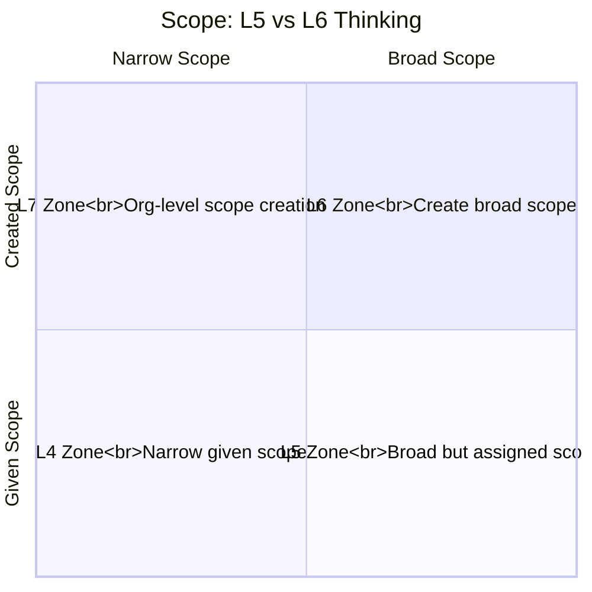
```mermaid
quadrantChart
    title Scope: L5 vs L6 Thinking
    x-axis "Narrow Scope" --> "Broad Scope"
    y-axis "Given Scope" --> "Created Scope"
    quadrant-1 "L6 Zone<br/>Create broad scope"
    quadrant-2 "L7 Zone<br/>Org-level scope creation"
    quadrant-3 "L4 Zone<br/>Narrow given scope"
    quadrant-4 "L5 Zone<br/>Broad but assigned scope"
```

| Dimension | L5 (Senior) Thinking | L6 (Staff) Thinking |
|-----------|---------------------|---------------------|
| Technical scope | I reason deeply about my service and its direct interfaces | I reason about entire systems and cross-team patterns |
| Temporal scope | I plan for this quarter; maybe next quarter | I hold 1-2 year horizons while executing today's work |
| Org scope | I influence my team and direct collaborators | I influence multiple teams and shape org-level decisions |
| Scope source | My manager or project assignment defines my scope | I create scope through initiative, credibility, and initiative |
| Problem definition | I solve the problems given to me | I identify which problems are worth solving |
| Boundary behavior | I work within stated boundaries | I question stated boundaries and expand them when appropriate |

**The L6 scope mantra:** "Scope is not assigned -- it is created."

### Impact: L5 vs L6

| Dimension | L5 (Senior) Thinking | L6 (Staff) Thinking |
|-----------|---------------------|---------------------|
| Impact level | Team-level: I improve my team's outcomes | Multi-team: my work improves outcomes for multiple teams |
| Impact description | "I built X" -- output focus | "I enabled outcome Y" -- outcome focus |
| Impact measurement | Features shipped, performance improved | Teams unblocked, dollars saved, reliability improved |
| Impact time horizon | This quarter's wins | Multi-year compounding impact |
| Impact leverage | 1x: my output equals my effort | 10x+: my work multiplies through others |
| Business connection | Technical metrics | User and business outcomes |

**The L6 impact mantra:** "The question is not what I built -- it is what changed because of what I built."

### Ownership: L5 vs L6

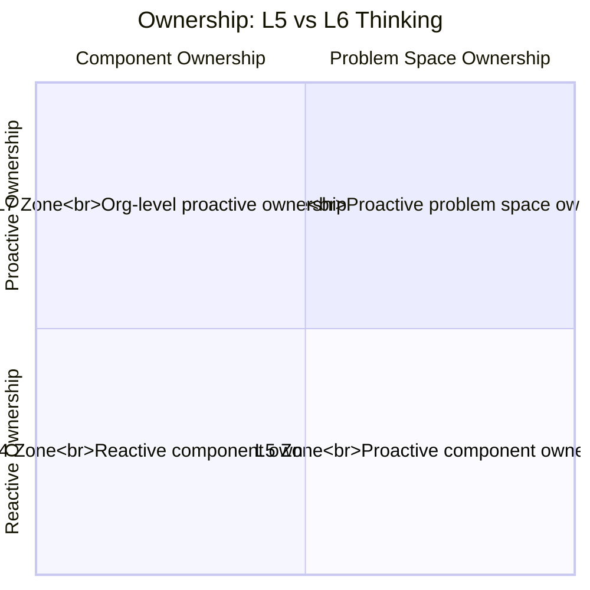
```mermaid
quadrantChart
    title Ownership: L5 vs L6 Thinking
    x-axis "Component Ownership" --> "Problem Space Ownership"
    y-axis "Reactive Ownership" --> "Proactive Ownership"
    quadrant-1 "L6 Zone<br/>Proactive problem space ownership"
    quadrant-2 "L7 Zone<br/>Org-level proactive ownership"
    quadrant-3 "L4 Zone<br/>Reactive component ownership"
    quadrant-4 "L5 Zone<br/>Proactive component ownership"
```

| Dimension | L5 (Senior) Thinking | L6 (Staff) Thinking |
|-----------|---------------------|---------------------|
| Ownership object | My component: "I own the payment service" | My problem space: "I own payment reliability" |
| Failure response | Investigate if it's my code; escalate if not | Coordinate resolution regardless of root cause |
| Ownership scope | What I was assigned | What needs owning in my area, whether assigned or not |
| Blast radius | "My service's failure behavior" | "What breaks for users across all dependent services" |
| Cost awareness | Features built as designed | Cost profile of problem space explicitly tracked |
| Long-term | Solve today's problems | Solve today's problems while setting up tomorrow's solutions |
| Invariants | My service is internally correct | Cross-service invariants are defined and enforced |

**The L6 ownership mantra:** "Ownership means you feel responsible for outcomes in your problem space -- not just for code you wrote."

### Driving Direction Without Authority: L5 vs L6

| Dimension | L5 Approach | L6 Approach |
|-----------|------------|------------|
| When facing pushback | Defend or abandon position | Explore concern, integrate valid points, maintain or adjust position with reasoning |
| When proposing a change | "Here's what I think we should do" | Build evidence -> align key stakeholders -> propose with data and early support |
| When teams disagree | Escalate to manager | Facilitate, find common ground, make a recommendation, drive resolution |
| When influence is needed | Make argument in a meeting | Build credibility over months, then make argument from position of trust |
| Cross-team coordination | Works with adjacent teams when asked | Proactively identifies and bridges cross-team gaps |

**The L6 direction mantra:** "Authority is rare; credibility is earned. Drive direction through evidence, relationships, and patience."

### The Pre-Interview Self-Check

Before your next Staff Engineer interview, verify you can answer yes to all of these:

- [ ] I can describe my scope in terms of problem space, not component
- [ ] I can articulate multi-team impact, not just team-level output
- [ ] I can explain how I'd handle a failure in a dependency I don't own
- [ ] I know the blast radius of systems I work on
- [ ] I can describe ownership of interstitial failures (the gaps between teams)
- [ ] I have examples of driving direction without authority
- [ ] I can discuss 1-2 year evolution of systems I've worked on
- [ ] I describe outcomes enabled, not just features built
- [ ] I can quantify my impact in numbers, not just describe it qualitatively
- [ ] I ask scoping questions before diving into solutions

If you can check 8 or more, you are demonstrating Staff-level scope, impact, and ownership.

---

### The One-Page Summary: Senior vs Staff Across All Dimensions

```
SENIOR (L5) MINDSET              STAFF (L6) MINDSET
-----------------------           -----------------------

"What component do I own?"    ->   "What problem space do I own?"
"Is this in my service?"      ->   "Is this affecting my users?"
"I built feature X"           ->   "I enabled outcome Y"
"My service is reliable"      ->   "The user experience is reliable"
"That's another team's code"  ->   "That affects my problem space"
"I'll escalate to manager"    ->   "I'll facilitate resolution"
"This quarter's roadmap"      ->   "This quarter + 18-month view"
"I need more scope assigned"  ->   "I'll create more scope"
"I improved latency 50%"      ->   "I improved latency 50%, which drove X% conversion gain"
"I'll design for current needs" -> "I'll design for current needs and plan for 10x"
```

---

### The Three Tests for Staff-Level Contribution

These three tests tell you whether someone is thinking at Staff level. Use them on yourself before interviews.

**Test 1 -- The Ownership Test:**
If something breaks in your area, do you feel responsible even if you didn't directly cause it?

L5 answer: "I feel responsible for things I directly worked on."
L6 answer: "I feel responsible for outcomes in my problem space, regardless of who wrote the code."

**Test 2 -- The Ripple Test:**
Do your ideas spread beyond conversations you're directly part of?

L5 answer: "My ideas are implemented in my direct work."
L6 answer: "My patterns and practices are adopted by others, even when I'm not involved."

**Test 3 -- The Direction Test:**
If you left tomorrow, would the initiative lose direction?

L5 answer: "My tasks wouldn't get done, but the direction would continue."
L6 answer: "The initiative would need a new driver, or it would drift without clear direction."

All three yes = Staff-level contribution.
One or two yes = Strong Senior.
Zero yes = Earlier career stage.

---

### The Ownership Dimensions Mindmap

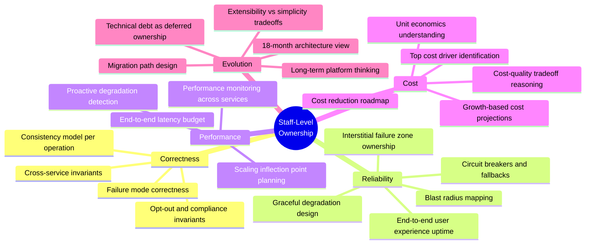
```mermaid
mindmap
  root((Staff-Level<br/>Ownership))
    Correctness
      Cross-service invariants
      Failure mode correctness
      Consistency model per operation
      Opt-out and compliance invariants
    Reliability
      End-to-end user experience uptime
      Blast radius mapping
      Graceful degradation design
      Circuit breakers and fallbacks
      Interstitial failure zone ownership
    Performance
      End-to-end latency budget
      Performance monitoring across services
      Proactive degradation detection
      Scaling inflection point planning
    Cost
      Unit economics understanding
      Top cost driver identification
      Cost-quality tradeoff reasoning
      Growth-based cost projections
      Cost reduction roadmap
    Evolution
      18-month architecture view
      Migration path design
      Technical debt as deferred ownership
      Extensibility vs simplicity tradeoffs
      Long-term platform thinking
```

---

### The Scoping Conversation -- What It Sounds Like

Here is what a Staff-level scoping conversation looks like in a real interview. This is a sequence diagram showing the flow of questions and answers.

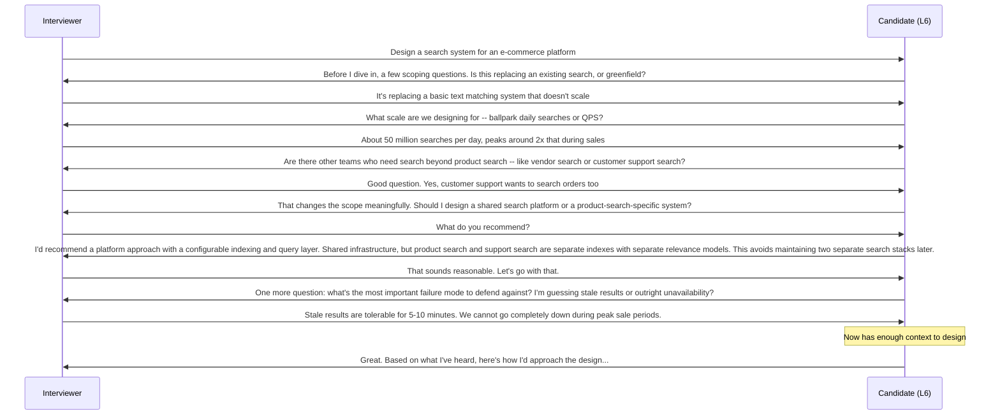
```mermaid
sequenceDiagram
    participant I as Interviewer
    participant C as Candidate (L6)
    
    I->>C: Design a search system for an e-commerce platform
    
    C->>I: Before I dive in, a few scoping questions. Is this replacing an existing search, or greenfield?
    I->>C: It's replacing a basic text matching system that doesn't scale
    
    C->>I: What scale are we designing for -- ballpark daily searches or QPS?
    I->>C: About 50 million searches per day, peaks around 2x that during sales
    
    C->>I: Are there other teams who need search beyond product search -- like vendor search or customer support search?
    I->>C: Good question. Yes, customer support wants to search orders too
    
    C->>I: That changes the scope meaningfully. Should I design a shared search platform or a product-search-specific system?
    I->>C: What do you recommend?
    
    C->>I: I'd recommend a platform approach with a configurable indexing and query layer. Shared infrastructure, but product search and support search are separate indexes with separate relevance models. This avoids maintaining two separate search stacks later.
    I->>C: That sounds reasonable. Let's go with that.
    
    C->>I: One more question: what's the most important failure mode to defend against? I'm guessing stale results or outright unavailability?
    I->>C: Stale results are tolerable for 5-10 minutes. We cannot go completely down during peak sale periods.
    
    Note over C: Now has enough context to design
    C->>I: Great. Based on what I've heard, here's how I'd approach the design...
```

Notice:
- The candidate asked only 5 questions -- focused and purposeful
- Each question had a clear reason behind it
- The candidate made a recommendation rather than asking "what do you want?"
- The candidate explicitly stated when they had enough to design
- Total scoping time: approximately 5 minutes

This is the rhythm of L6 scoping behavior.

---

### The Scope Expansion Path -- From Component to Org

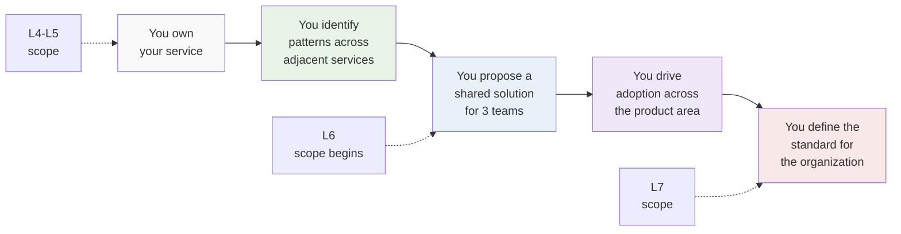
```mermaid
graph LR
    A["You own<br/>your service"] --> B["You identify<br/>patterns across<br/>adjacent services"]
    B --> C["You propose a<br/>shared solution<br/>for 3 teams"]
    C --> D["You drive<br/>adoption across<br/>the product area"]
    D --> E["You define the<br/>standard for<br/>the organization"]
    
    A2["L4-L5<br/>scope"] -.-> A
    C2["L6<br/>scope begins"] -.-> C
    E2["L7<br/>scope"] -.-> E
    
    style A fill:#f9f9f9
    style B fill:#e8f4e8
    style C fill:#e8f0f8
    style D fill:#f0e8f8
    style E fill:#f8e8e8
```

Scope expands by: doing excellent work at the current level -> earning credibility -> using that credibility to take on the next level of scope.

You cannot shortcut this progression in real life. But in interviews, you can demonstrate that you *understand* and have *operated at* higher levels by describing your past work and current thinking in those terms.

---

### Common Mistakes and Exact Fixes

| Mistake | Why It Signals L5 | Exact Fix |
|---------|------------------|-----------|
| "I own the notification service" | Component ownership | Say: "I own notification delivery outcomes -- whether users receive the right notifications reliably" |
| "That's another team's problem" | Scope boundary rigidity | Say: "That affects my users, so let me think about how I'd coordinate with that team" |
| "I'll design it for current requirements" | No temporal scope | Say: "This works for current scale. Let me also discuss what changes at 10x and design an evolution path" |
| Jumping to solutions immediately | No scoping discipline | Ask 3-5 focused scoping questions before proposing any design |
| "I improved latency by 50%" | Output, not impact | Say: "I improved latency by 50%, which reduced checkout abandonment rate because users were waiting for the page" |
| "I escalated to my manager when teams disagreed" | No cross-team leadership | Say: "I facilitated a discussion between both teams, understood each team's constraints, and proposed a solution that addressed both" |
| Describing a feature in isolation | No multi-team thinking | Always ask: "Who else would benefit from this being designed as a shared solution?" |
| Not mentioning failure modes | No ownership thinking | Proactively say: "Let me also discuss how this system behaves when it fails and what I'd do to contain blast radius" |

---

### Phrases That Signal L5 vs L6

**L5 phrases (competent but limited -- avoid these in Staff interviews):**
- "I built the notification service"
- "That's handled by another team"
- "I'll optimize this and add some monitoring"
- "We need to decide whether to use Kafka or RabbitMQ"
- "This design works for our current scale"
- "I escalated when I wasn't sure"

**L6 phrases (signal Staff-level thinking -- use these deliberately):**
- "I own notification delivery outcomes -- regardless of which service causes a failure"
- "That affects my problem space, so let me think about how I'd coordinate"
- "Before I design, let me understand whether this is the right problem to solve"
- "Given our requirements, the technology choice clarifies -- here's why"
- "This design works for current scale. At 10x, we'd need to change X. Here's the migration path I'd plan."
- "I drove resolution by facilitating alignment between both teams"
- "Let me map the blast radius -- who depends on this and what breaks if it fails?"

---

### Final Self-Assessment Questions

Use these to stress-test your readiness for a Staff Engineer interview.

**On Scope:**
1. What is the largest blast radius of a technical decision you have made?
2. When did you last identify a problem nobody assigned to you and drive its resolution?
3. What systems do people outside your team come to you for advice about?
4. How far into the future does your technical planning extend?

**On Impact:**
5. What work have you done that affected teams other than your own?
6. What patterns or tools have you built that others adopted?
7. Can you quantify the multiplier effect of your work?
8. What business outcome can you connect to a technical decision you made?

**On Ownership:**
9. What do you own that you weren't explicitly assigned?
10. When did you last feel responsible for something that broke, even though you didn't cause it?
11. What would you do if you found a critical problem adjacent to your official responsibility?
12. What is your blast radius and have you designed for it?

If you can answer all twelve with specific, concrete examples from your work history -- you are ready to interview for Staff Engineer at Google.

---

*This chapter is part of a complete L6 interview preparation guide. The concepts covered here -- scope, impact, and ownership -- underlie every subsequent chapter on technical depth, system design, and behavioral interviews. Return to this chapter when you feel your answers are drifting toward L5 thinking. The shift from "I built X" to "I own the outcome of Y" is the core of what makes a Staff Engineer.*

---

## Appendix A: Three Named Tests for Ownership

These three tests have formal names. Use them to check whether you or your design actually demonstrate ownership.

---

### Test 1: The Accountability Test

When you describe a system, can you name the person or team accountable for each component?

If a component has no named owner, it is a gap. Staff engineers find those gaps and either fill them or make them explicit.

The test in table form:

| Component | Owner (Team / Person) | What Happens if it Fails | Who Gets Paged |
|---|---|---|---|
| API Gateway | Platform Team | External requests fail or time out | Platform on-call |
| Rate Limiter | Platform Team | Traffic floods through uncontrolled | Platform on-call + affected service teams |
| User Preference Store | Identity Team | Stale opt-out data -- users get unwanted notifications | Identity on-call |
| Notification Router | Notification Team (you) | Messages don't get dispatched to channels | Notification on-call |
| FCM / APNs Integration | Notification Team (you) | Push notifications fail silently | Notification on-call |
| **Event Bus contract between Catalog and Inventory** | **Nobody (gap!)** | **Silent data corruption -- orders for out-of-stock items** | **Nobody gets paged -- this is how incidents happen** |

The gap in the last row is the L6 opportunity. A Staff engineer sees the empty "Owner" cell and either claims it or escalates to assign it before the incident happens.

**Why this signals Staff level:** L5 engineers can list the components they own. L6 engineers look for the components nobody owns.

---

### Test 2: The Direction Test

Are you setting technical direction, or following it?

L5 engineers implement the direction others set. L6 engineers create the direction for their area, negotiate it with peers, and then implement it.

The clearest way to see this is to watch how the same problem gets framed:

**Situation:** The team's database is slow under peak load.

L5 framing:
> "The database is slow. I should look into adding a caching layer. I'll check with the tech lead about which approach to take."

L6 framing:
> "The database is slow under peak load. I've looked at the query patterns -- 80% of reads are for the same 50K product records. I'm proposing we add a read-through cache with a 5-minute TTL on that record set. I've modeled the cache hit rate at about 94% which would reduce database load by roughly 75%. I've talked with the infrastructure team -- they can give us a Redis cluster by next sprint. I'll write the RFC this week and want to align with you and Team B before we commit, since they use the same database."

The difference is not the idea. Both people thought of caching. The difference is:
- L6 already analyzed the data before proposing
- L6 already checked with the infrastructure dependency
- L6 is setting direction and seeking alignment, not asking for permission
- L6 frames it as a recommendation with evidence, not a question

**Why this signals Staff level:** In a system design interview, you show the Direction Test by making recommendations with reasoning rather than asking "what do you want?" You can say: "Based on this requirement, I'd recommend X because Y. Does that match your thinking?"

---

### Test 3: The Ripple Test

When you make a design decision, can you trace its ripples outward?

Every local decision creates ripples. A Staff engineer traces at least two rings of ripple before committing to a decision.

**Example: You decide to switch your team's database from PostgreSQL to MySQL.**

Ring 1 (direct impact -- your team):
- Your team's ORM queries need review for MySQL-specific syntax
- Your team's connection pool config changes
- Your team's backup and restore procedures change

Ring 2 (teams that depend on you):
- Teams that query your database directly need to update their connection strings
- The database monitoring team may need to update their MySQL dashboard config (vs Postgres)
- The on-call runbooks for your service reference Postgres-specific diagnostic queries -- all those runbooks need updating
- Any shared tooling that reads your database (e.g., a data warehouse export job) needs updating

Ring 3 (organizational patterns):
- If your team switches to MySQL, are other teams going to ask why you are using a different database than the org standard?
- Does this create a support burden for the DBA team who now has to support two database engines?
- Does this set a precedent that makes the codebase harder to maintain long-term?

L5 engineers think about Ring 1. L6 engineers trace to Ring 2 and ask about Ring 3.

**The ripple tracing question to ask yourself:** "Who else will need to change something because of this decision -- and have I talked to them?"

---

## Appendix B: Five Detailed Trade-off Frameworks

These are the five core trade-offs every Staff engineer reasons through at system design interviews. The difference between L5 and L6 is not which side of the trade-off you pick -- it is how many dimensions you reason across.

---

### Trade-off 1: Consistency vs Availability

The CAP theorem says you cannot have perfect consistency AND perfect availability during a network partition. You have to choose.

L5 applies this at system level:

L5: "We'll use strong consistency" or "We'll use eventual consistency for this service."

L6 applies this at operation level. The key L6 move is: **reason per operation, not per system.**

L6: "Let me think through each key operation and what consistency it actually needs."

| Operation | Acceptable Staleness | Consistency Model | Why |
|---|---|---|---|
| Charge a payment | None -- 0ms | Strong consistency | Wrong charge = real money lost |
| Display news feed | 200-500ms | Eventual consistency | Post visible 200ms late = user won't notice |
| Show user's own profile update | 0ms (read-your-writes) | Read-your-writes | User just clicked Save -- they expect to see their change |
| Show another user's profile | 5-10 seconds | Eventual consistency | 5-second lag is invisible in normal usage |
| Fraud detection decision | None | Strong consistency | Approving a fraudulent transaction = financial loss |
| Product inventory count in browse view | Up to 60 seconds | Eventual consistency | Showing 102 items vs 98 is acceptable; exact count at checkout uses strong consistency |

**Why this signals Staff level:** L5 says "we use eventual consistency." L6 says "we use eventual consistency for low-stakes reads, strong consistency for money and security, and read-your-writes for user-visible mutations." This shows you understand that consistency is a per-operation design choice, not a per-system switch.

---

### Trade-off 2: Build vs Buy vs Reuse

For every major component, you have three options: build it yourself, buy a third-party service, or reuse an internal platform.

L5 considers two options: build or buy.

L5: "We'll use Kafka for the message queue" or "We'll build our own queue."

L6 considers three options and brings a new insight: **reuse is often the best answer, and junior engineers miss it because they don't know what internal platforms exist.**

L6 walks through it:

> "Let me evaluate three options for the message queue:
>
> Option 1 -- Build our own: We get full control and can tune it for our exact access pattern. Cost: 6 weeks of engineering work, and we own the maintenance, scaling, and on-call forever. This creates an org fragmentation problem -- now we have a fourth message queue technology in the company.
>
> Option 2 -- Buy a managed service (AWS SQS, Confluent): Faster to start. Ongoing monetary cost. Vendor dependency -- we can't easily switch if SQS has an outage or changes pricing. Data sovereignty might be an issue if messages contain PII.
>
> Option 3 -- Reuse the internal event platform that Team X already maintains: Faster than building from scratch. We add a dependency on Platform Team's roadmap. But the Platform Team already has an SLA, already has monitoring, already has on-call, and we get all of that for free.
>
> I'd choose Option 3 unless we have a specific requirement that the platform cannot meet. My default is to use shared internal infrastructure first. It's the only option where we contribute back to the org's leverage instead of creating more fragmentation."

Decision matrix:

| Option | Time to Implement | Ongoing Cost | Control | Dependency Risk |
|---|---|---|---|---|
| Build own | 6 weeks | High (maintenance forever) | Full | None |
| Buy managed service | 1-2 days | Medium ($$/month) | Low | Vendor reliability |
| Reuse internal platform | 2-3 days | Low (shared) | Medium | Platform Team roadmap |

**Why this signals Staff level:** The insight "reuse internal platforms first" only comes when you know what internal platforms exist. L6 engineers map internal infrastructure and default to reuse. L5 engineers evaluate build vs buy because those are the options they know.

---

### Trade-off 3: Simple Now vs Flexible Later

Every system design has this tension: build the simplest thing that works today, or invest in flexibility for requirements you don't have yet.

The over-engineering trap: you build for 100 million users when you have 10,000. You spend 10 engineer-weeks on a sharding layer you won't need for 3 years.

The under-engineering trap: you hardcode assumptions that are painful to undo. A schema that works at 1 million rows causes a multi-day migration at 1 billion rows.

The L6 rule: **design for 10x current scale, document the migration path to 100x, do not build for 100x today.**

Worked example: URL shortener.

You use 6-character alphanumeric codes: 36^6 = approximately 2.2 billion possible short codes. At 1 million shortens per day, you run out in about 6 years.

L5: "2.2 billion codes is fine for now. We'll deal with it when we get there."

L6: "At our current growth rate, 6-character codes last about 6 years. That's fine. But code exhaustion is the kind of problem that sneaks up on you -- it's not a gradual degradation, it's a sudden failure where you can no longer create new short links. I'd use 6 characters today and add a migration plan to 8 characters once we hit 500 million codes. The migration is a background job that adds a 'code_version' field and switches new codes to 8 characters. Existing 6-character codes keep working forever. Total migration cost: about 2 days of engineering work, done in advance, not in a crisis."

The one-liner for this trade-off: "Simple now, migration path documented. Not simple forever."

**Why this signals Staff level:** L5 designs for today. L6 designs for today but writes down the evolution path so the future team is not blindsided. The document becomes the gift to your future self.

---

### Trade-off 4: Operational Simplicity vs Feature Richness

Every feature you add to a system adds operational complexity. More configuration options. More edge cases. More scenarios for the on-call engineer to debug at 3am. More support team questions.

L5 adds features because the product asks for them.

L6 asks: "What is the operational cost of this feature before we add it?"

Worked example: adding per-user rate limits to a rate limiter.

The feature sounds small. Users can have individual limits (some premium users get 1000 req/min, free users get 100 req/min). That is a reasonable product requirement.

But the operational cost:

| What changes | Operational cost |
|---|---|
| Per-user storage | Now you need a data store that scales with user count, not just request count |
| Per-user reset logic | When a user's limit resets, it's not a global clock anymore -- it's per-user timer logic |
| Per-user debugging | When a support ticket says "User 12345 is being rate limited unfairly," you need per-user introspection tooling |
| Per-user quota management | Support teams need a UI to view and override individual user limits |
| Per-user monitoring | Your dashboard now needs to show not just total rate limit events but "who is being limited and why" |

Total cost: roughly 3 times the implementation cost in operational overhead. The feature itself takes 1 week. Making it operable takes 3 weeks.

The L6 question: "If this breaks at 3am, how long does it take an on-call engineer who has never seen this system before to diagnose the problem and apply a fix? Can we redesign it to make that time shorter?"

Sometimes the answer is: "Yes, this feature is worth the operational cost, and here's how we make it operable." Sometimes the answer is: "No, the operational cost exceeds the feature value."

**Why this signals Staff level:** L5 engineers think about building features. L6 engineers think about operating features for the next 3 years with a rotating on-call team. Operational cost is a first-class design consideration.

---

### Trade-off 5: Blast Radius vs Performance

When you isolate failure domains, you contain failures. But isolation costs you: more network hops, more latency, more operational complexity.

L5 thinks about this in binary terms: monolith (fast, simple, everything fails together) or microservices (isolated, complex, network overhead).

L6 sizes the blast radius for each component and decides isolation level based on failure risk, not organizational convenience.

L5: "We'll put everything in one service for simplicity" or "We'll split everything into microservices for isolation."

L6:
> "Let me size the blast radius for each component and decide isolation level based on actual failure risk.
>
> Payments: a payment processing bug should never crash search. These must be separate services. The blast radius of a payments failure should be payments only.
>
> Search and user profiles: both are owned by the same team, both serve browse traffic, and a bug in one is unlikely to cause a bug in the other because they use separate databases. I'd keep them in the same service for now -- the operational simplicity benefit outweighs the blast radius risk. If the search indexing logic ever gets complex enough to have its own failure modes, I'd extract it then."

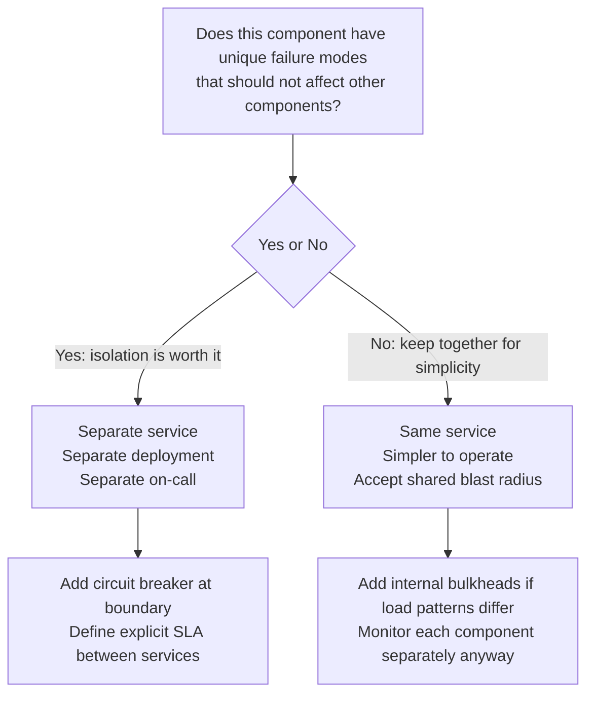
```mermaid
flowchart TD
    A["Does this component have unique failure modes<br/>that should not affect other components?"] --> B{Yes or No}
    B -- "Yes: isolation is worth it" --> C["Separate service<br/>Separate deployment<br/>Separate on-call"]
    B -- "No: keep together for simplicity" --> D["Same service<br/>Simpler to operate<br/>Accept shared blast radius"]
    C --> E["Add circuit breaker at boundary<br/>Define explicit SLA between services"]
    D --> F["Add internal bulkheads if load patterns differ<br/>Monitor each component separately anyway"]
```

**Why this signals Staff level:** L6 engineers know that isolation is not free. They size the blast radius first, then decide whether the isolation cost is justified. They do not blindly split everything (microservice fever) or blindly keep everything together (monolith inertia).

---

## Appendix C: All Nine Interview Q&A Pairs

For each question: the L5 response, the L6 response, and what the difference signals to the interviewer.

---

### Q1: "Tell me about a system you designed where you had to think beyond your team's scope."

L5: Describes a technical achievement. Talks about the architecture, the interesting technical challenges, the scale. Stays within their component's scope.

> "I designed a recommendation engine that handled 50K requests per second. I used a two-stage pipeline: candidate generation in Faiss, then a reranking model. The main challenge was keeping latency under 100ms. I solved it by pre-computing candidates offline and only doing online reranking."

L6: Names the other teams involved, what was negotiated, what the constraint was, and what would have happened without cross-team coordination. Shows the system impact, not just the technical decision.

> "I designed the recommendation engine, but the interesting part was the cross-team work. The recommendations depended on real-time user activity data owned by the Analytics team. Their Kafka lag was 2 minutes -- fine for dashboards, not fine for recommendations where 2-minute-old data made suggestions stale. I negotiated a new dedicated Kafka topic with the Analytics team, funded out of my team's infrastructure budget, with a guaranteed p99 lag of under 5 seconds. Without that conversation, I could have built a technically perfect recommendation system that gave users suggestions based on what they were interested in 2 minutes ago. The technical design was the easy part. The cross-team dependency was the hard part."

**What the difference signals:** The L5 answer shows technical depth. The L6 answer shows that the candidate understands systems involve multiple teams and that the interesting problems live at the boundaries. Interviewers are asking this question specifically to see if you think beyond your component.

---

### Q2: "How do you decide how much to own vs delegate?"

L5: "I delegate what I'm not good at" or "I delegate to more junior engineers so they can grow."

L6: "I own the decision-making for anything with cross-team blast radius. I delegate implementation. I never delegate accountability -- I remain accountable for the outcome even when someone else does the work."

> "I own the decision. I delegate the implementation. And I stay accountable for the outcome even after I've delegated. Here's what that looks like in practice: I'll own the architectural decision -- which database, what consistency model, how we handle failure. I'll delegate the implementation of the caching layer to a senior engineer on my team. But when the caching layer has a production incident at 2am, I'm still accountable for the user experience being restored. I don't delegate accountability -- I can only delegate work."

**What the difference signals:** L5 delegates to free up their time or develop others. L6 delegates to scale their impact while keeping accountability. The distinction -- "I can delegate work, not accountability" -- is a core Staff-level concept.

---

### Q3: "How do you scope a project at the Staff level?"

L5: Starts with the stated problem, scopes to fit their team's capacity and timeline.

L6: Starts by questioning whether the stated problem is the right problem. Investigates the problem behind the problem first.

> "My first step is to ask: is this actually the problem we should be solving? The stated problem is often a solution in disguise. A request to 'add a cache' is already a proposed solution -- I want to understand what user pain or metric is driving that request first. The actual problem might be a slow database, but it also might be a suboptimal query that a cache would mask rather than fix. If I scope to 'add a cache,' I'll build a cache. If I scope to 'reduce p99 checkout latency by 200ms,' I might find that adding an index is faster, cheaper, and more maintainable than a cache. So the first 30 minutes of scoping any project is: what is the actual problem, and is this the right intervention?"

**What the difference signals:** L6 engineers do not accept problem statements at face value. They investigate the problem behind the problem. This is a critical differentiator -- it shows you're thinking about outcomes (faster checkout) not outputs (a cache).

---

### Q4: "Design a rate limiting service."

L5: Immediately starts designing the technical solution.

> "I'd use a sliding window algorithm with Redis. Each client gets a key in Redis with a count and a TTL. When they exceed the limit, we return 429. For high availability, I'd use Redis Cluster with 3 replicas..."

L6: First establishes the business context, then addresses the key design question that has business implications.

> "Before I design the algorithm, I need to understand the failure mode. What happens when the rate limiter itself is unavailable -- do we fail open or fail closed?
>
> Fail open means: if the rate limiter is down, we allow all traffic through. Upside: users are never blocked by the rate limiter's own failure. Downside: a rate limiter outage becomes a load-shedding gap -- we might get hammered during an incident.
>
> Fail closed means: if the rate limiter is down, we deny all traffic. Upside: we never accidentally allow excess traffic. Downside: a rate limiter outage takes down the entire API.
>
> For an internal rate limiter protecting a shared service like a database or a notification system, fail open is almost always the right answer. Blocking 100% of legitimate traffic because the rate limiter is degraded is worse than temporarily allowing some excess traffic.
>
> For an external API protecting against abuse -- a public API where the rate limiter is the primary security control -- fail closed might be right.
>
> This is a business decision, not a technical one. I need an answer from the product team before I commit to a design. Now, assuming fail-open for an internal service, here's how I'd design the algorithm..."

**What the difference signals:** L5 engineers design systems. L6 engineers identify the decisions with business consequences first and get clarity on those before committing to technical choices. Showing that "fail open vs fail closed" is a business decision, not a technical one, is a clear Staff-level signal.

---

### Q5: "What's the difference between owning a component and owning a problem space?"

L5: "Owning a component means you're responsible for a service. Owning a problem space means you're responsible for a broader area."

L6 gives the full answer with concrete consequence:

> "Owning a component means being accountable for its correctness, reliability, performance, and cost. I own the code, the SLA, the on-call runbook.
>
> Owning a problem space means being accountable for the user or business outcome -- which might span 5 components owned by 3 teams. I own the payment experience. That includes my payment service, the fraud service owned by the Risk team, the bank integration layer owned by a third team, and the user notification flow owned by the Notifications team. I do not manage those teams. I cannot tell them what to build. But I am accountable for the end-to-end user experience of completing a payment.
>
> The practical difference: if fraud detection starts returning false positives and blocking valid payments, a component owner says 'that's the Risk team's bug.' A problem space owner says 'valid payments are failing -- I'm going to coordinate with Risk to fix this and implement a fallback while they do.' The span of accountability is larger than the span of control."

**What the difference signals:** This is the single most important distinction for Staff level. "Span of accountability larger than span of control" is the core of L6 ownership. If a candidate can articulate this cleanly with a concrete example, they are demonstrating Staff-level thinking.

---

### Q6: "How do you drive technical direction when you have no authority?"

L5: "I make my case in design reviews and escalate to my manager if there's disagreement."

L6: Seven-element toolkit.

> "Authority-based direction is fragile and rare at Staff level. Escalating to a manager signals that you couldn't resolve a technical disagreement yourself -- which is exactly what Staff engineers are expected to do.
>
> The toolkit I use:
>
> 1. Build the data first. Not 'I think we should do X' but 'the data shows Y, which means X is the right call.' I instrument what matters before I propose a change. Data is more persuasive than opinion.
>
> 2. Find allies. Who else cares about this problem? A proposal from one engineer is easy to dismiss. A proposal from three respected engineers who independently reached the same conclusion is much harder to ignore.
>
> 3. Make it concrete. Write the RFC. Show the prototype. If you want people to make a decision, give them something to react to. A complaint without a proposal is just venting.
>
> 4. Reduce the ask. What is the smallest experiment that demonstrates the value? A full rewrite is a hard sell. A 2-week pilot on one service is an easy yes. Get the small win first.
>
> 5. Create a demo. Show don't tell. A working prototype changes the conversation from 'could this work' to 'is this better than what we have.'
>
> 6. Frame for each audience. Engineers care about technical elegance and reduced maintenance. PMs care about velocity. VPs care about risk and competitive position. The same proposal needs different framing for each audience.
>
> 7. Accept partial wins. Getting 50% of what you proposed this quarter is better than 0% while you wait for perfect alignment. Partial wins build credibility for the full ask later."

**What the difference signals:** L6 engineers have a systematic approach to influence. The seven-element toolkit shows the candidate has thought deeply about how organizations actually make technical decisions. "Accept partial wins" shows maturity -- not every hill is worth dying on.

---

### Q7: "How do you handle it when a system you own is failing and it's not your fault?"

L5: "I'd notify the other team and wait for them to fix it. I'd help debug if they need it."

L6: "The failure is in my system's output, even if the root cause is elsewhere. I own the user experience."

> "The moment I say 'not my fault' I've stopped owning the user experience. Users don't care whose fault it is. They care whether the product works.
>
> So my response to a failure in my problem space is the same regardless of root cause. Immediately: activate the degradation plan. Serve cached data if possible. Return a partial response with a clear error message if cached data isn't available. Never show users a raw 500 error -- that's the blast radius I've designed for.
>
> Simultaneously: work with the team that owns the root cause. Share what I'm seeing, share my traces. Help them diagnose. Not take over their work -- help them.
>
> After recovery: participate in the post-mortem. If the root cause was in their service, that's in the post-mortem. But so is the question: why did my system not have a better fallback? Why did the failure in their service cascade to my users? Both of those are my action items, not theirs.
>
> Ownership means the user does not suffer while we figure out whose fault it is."

**What the difference signals:** The L5 answer puts the problem in someone else's hands. The L6 answer shows that the candidate keeps the user experience as their responsibility regardless of technical root cause. This is the 3am test.

---

### Q8: "Design a system that will still be maintainable in three years."

L5: Describes good engineering practices. Modularity, documentation, tests, clean code.

L6: Focuses on the four specific things that determine long-term maintainability and names the biggest killer of maintainability.

> "Good coding practices are necessary but not sufficient. The systems I've seen become unmaintainable in 3 years usually fail on one of four things:
>
> First, API contracts that were never versioned. Every time the API changes, all consumers break. In year 3, you're afraid to touch the API because you don't know what will break. Fix: version your APIs from day one. It's one additional field in every response.
>
> Second, data models that can't evolve. Computed data baked into columns that should be derived. JSON blobs in SQL columns that become implicit schemas nobody documents. Fix: store facts, derive computations. Use a flexible type for the things you know will vary by tenant or user segment.
>
> Third, no runbooks at launch. The team that built the system is gone in year 3. The on-call engineer has never seen this service before. Fix: write the runbook before you deploy to production. If you can't write the runbook, the system is not ready to deploy. The runbook forces you to think through failure modes.
>
> Fourth, observability added as an afterthought. You cannot debug what you cannot measure. Fix: logs, metrics, and traces from day one. Especially: add business-level metrics (successful payments per minute, notifications delivered per minute) not just technical metrics (CPU, memory).
>
> But the biggest maintainability killer is undocumented assumptions. Every system has 5-10 assumptions baked in that, if they change, require a redesign. I'd write those down explicitly. 'This design assumes that product catalog updates are less than 100MB per day.' When that assumption breaks in year 2, the next engineer knows why the system needs rethinking."

**What the difference signals:** L5 answers describe coding hygiene. L6 answers focus on the organizational and operational dimensions of maintainability -- versioned APIs, explicit assumptions, runbooks before launch. These are the things that actually determine whether a system is maintainable in 3 years.

---

### Q9: "How do you know when a system is too complex?"

L5: "When it's hard to understand" or "when there are too many moving parts."

L6: Uses three operational tests.

> "Complexity is not inherently bad. Complex problems sometimes require complex systems. The question is whether the complexity is justified by the value the system delivers.
>
> I use three tests:
>
> The new-engineer test: can a new team member be productive with this system within a week without pairing with someone who built it? If the answer is no, the system's documentation and design are not sustainable. Every engineer who leaves takes irreplaceable knowledge with them.
>
> The 3am test: when this system fails at 3am, can an on-call engineer who has never touched it before diagnose and mitigate the incident using only the runbook and the monitoring dashboards? If the answer is no, the system will cause long, painful incidents that demoralize the on-call rotation.
>
> The change cost test: when we add a new feature, how many teams do we need to coordinate with? If the answer is more than 2, the system has too many dependencies for its current value. Adding a feature that requires coordinating with 5 teams means 4 weeks of calendar time for what might be 3 days of coding.
>
> If any test fails, the system is too complex for its current value. The right move is to simplify -- not because complexity is bad, but because the operational cost of the complexity exceeds what the system is delivering."

**What the difference signals:** The three-test framework shows L6 analytical thinking. Rather than an intuitive answer about complexity, the candidate provides concrete, measurable tests. The change cost test -- "more than 2 teams to add a feature" -- is a particularly insightful Staff-level observation.

---

## Appendix D: Part 9 -- Scope and Ownership in Failure Scenarios

This section goes deeper on the operational dimension of ownership. Ownership is easy when the system is healthy. The test is what you do when things break.

---

### Failure Ownership Matrix

There are four categories of failure. Your goal as a Staff engineer is to make sure every failure scenario lives in the top-left cell, and to find and fix everything that lives in the right column.

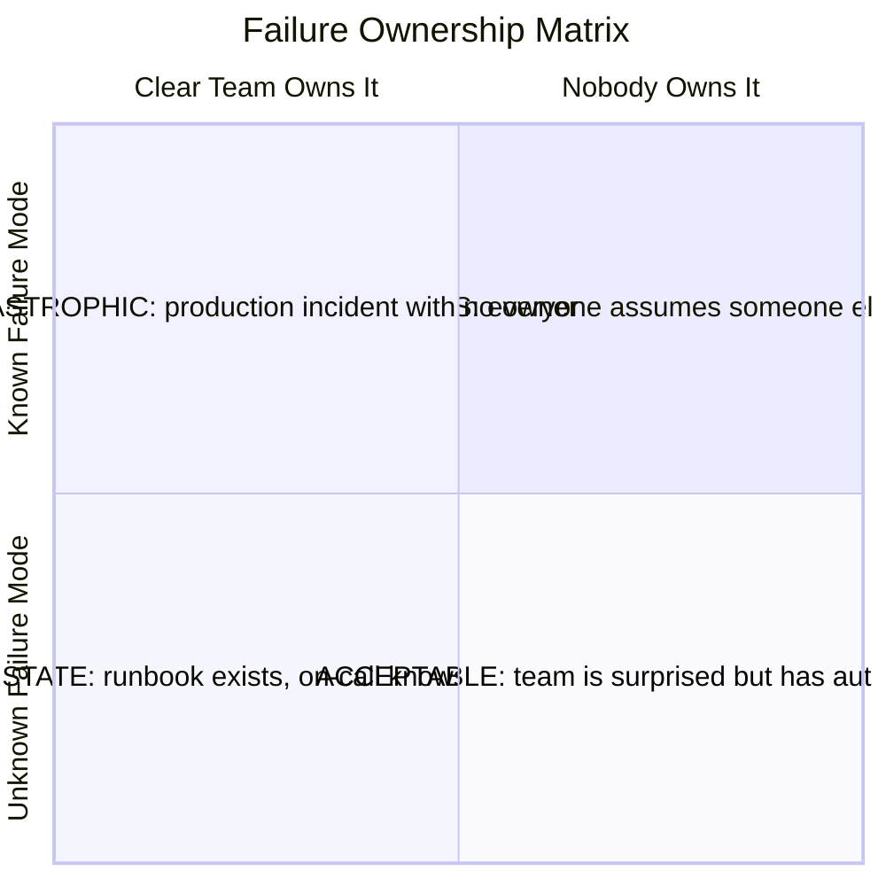
```mermaid
quadrantChart
    title Failure Ownership Matrix
    x-axis "Clear Team Owns It" --> "Nobody Owns It"
    y-axis "Unknown Failure Mode" --> "Known Failure Mode"
    quadrant-1 "DANGEROUS: everyone assumes someone else handles it"
    quadrant-2 "CATASTROPHIC: production incident with no owner"
    quadrant-3 "GOOD STATE: runbook exists, on-call knows what to do"
    quadrant-4 "ACCEPTABLE: team is surprised but has authority to fix"
```

In plain English:

- **Known + Owned (good state):** Your team has seen this failure before. There is a runbook. The on-call engineer knows what to do. This is the state you want for every failure scenario.
- **Known + Nobody owns (dangerous):** Everyone knows this failure can happen. Everyone assumes someone else will handle it when it does. This is how incidents become 2-hour outages instead of 20-minute ones. Example: the schema compatibility failure in the catalog-inventory incident.
- **Unknown + Owned (acceptable):** Your team will be surprised by this failure mode, but you have the authority, the context, and the incentive to fix it. Monitoring and chaos engineering are how you move failures from "unknown" to "known."
- **Unknown + Nobody owns (catastrophic):** Nobody saw it coming and nobody knows whose job it is to fix it. This is how a 47-minute payment outage happens -- three teams each saying "not our service."

Staff engineers map every failure scenario they can think of into this matrix. Any scenario in the right column is a gap to fill before the incident happens.

---

### Interstitial Failure Zones

The most dangerous failures happen in the gaps between services. Not inside Service A. Not inside Service B. In the interaction between them.

Classic interstitial failure: Service A calls Service B which calls Service C. Service B starts running slowly -- not failing, just slow. Service A times out waiting for B. A's timeout is 5 seconds. B is responding in 6 seconds under load. Meanwhile, A is retrying on timeout. Each retry hits B again. B, already under load from real traffic plus A's retries, gets slower. C, receiving A's retried requests through B, gets overwhelmed. The whole system degrades even though not a single service has a bug.

Nobody owns "the interaction between A and B." That's the interstitial failure zone.

How Staff engineers handle this:

1. **Define an SLA for every service boundary.** "Service B promises to Service A: p99 response time under 100ms for the request types A sends." Not a verbal agreement. A written SLA with a monitoring alert that fires when it's at risk of being violated.

2. **Add circuit breakers at every cross-team boundary.** When B starts being slow, A's circuit breaker trips and A stops sending requests to B. A fails gracefully with a fallback instead of hammering B with retries. B gets breathing room to recover.

3. **Write cross-team runbooks for the failure scenarios that span teams.** The runbook is not "if B is down, page Team B." The runbook is "if the A->B->C request chain is degraded, here are the symptoms you'll see, here is the diagnostic sequence, here is the mitigation, here are the teams to loop in." This runbook lives in Team A's on-call documentation because Team A owns the user experience of that request chain.

---

### Cross-Team Failure Ownership: Worked Example

Scenario: push notification delivery failure.

The notification service (Team A) sends to FCM (Firebase Cloud Messaging, Google's service). FCM delivers to Android devices (Google's infrastructure). When a push notification fails, who owns it?

Ownership boundaries:

- Team A owns: did we enqueue the message correctly? Did we call FCM's API? Did FCM's API return a 200 OK response?
- FCM owns: did they actually deliver the notification to the device?
- Google's device infrastructure owns: did the device receive and display it?

Team A does NOT own FCM's reliability. But Team A DOES own the user experience -- which means:

1. Team A monitors end-to-end delivery rate (not just "FCM returned 200"). If FCM is returning 200 but notifications are not being displayed, that gap is Team A's problem to detect and escalate.
2. Team A implements retry logic with exponential backoff for FCM failures.
3. Team A shows the user "notification delivered" only when there is actual evidence of delivery, not just "we sent the API call."
4. If FCM has an extended outage, Team A activates the fallback channel (email or SMS) for critical notification types.

This is the distinction between "I own the API call to FCM" (component ownership) and "I own whether users receive critical notifications" (problem space ownership).

---

### Degradation Ownership Matrix

| System State | What L5 Does | What L6 Does |
|---|---|---|
| Partial failure (one component degraded) | Alerts the team, waits for the root cause to be fixed | Immediately activates the fallback for the degraded component, updates the status page with accurate information for users, investigates root cause in parallel so users are not blocked while the investigation continues |
| Full failure (system down) | Rolls back the latest deployment | Checks whether rollback is safe before doing it (if a database migration already ran, rollback might lose data or create inconsistency). Implements forward recovery first if rollback would worsen the situation. Has a decision tree: "is rollback safe? if yes, rollback. if not, what is the forward fix?" |
| Data inconsistency | Stops the system and escalates to the tech lead or manager | Immediately characterizes blast radius: how many records are affected? Since when? Which users? Implements read-only mode to stop additional inconsistency from accumulating while the investigation runs. Designs the repair script before escalating so the escalation comes with a proposed solution, not just a problem. |

The common thread: L6 acts immediately to contain user impact while simultaneously investigating root cause. L5 investigates first and acts after understanding the problem. At scale, users experience that difference as minutes of downtime vs seconds.

---

## Appendix E: Part 10 -- Five Real System Examples with Technical Depth

---

### Example 1: API Gateway Ownership Scope

Scenario: you own the API gateway. An upstream service starts returning HTTP 500 errors. Your gateway is correctly forwarding those 500s to external clients. Is this your problem?

L5: "The upstream service is broken. That's not my problem -- I'm correctly passing through whatever they send me."

L6 ownership response:

> "My users are experiencing 500 errors. That's my problem, even though the root cause is upstream.
>
> Immediate action: implement circuit breaking. When the upstream error rate exceeds 50%, I stop forwarding requests to it. Instead, I return a clean error with a Retry-After header and a human-readable message. This prevents retry storms where clients hammer a broken service.
>
> Simultaneously: I check whether I have a cached fallback response for this endpoint. If the upstream is a product catalog service and I have a 60-second cache, I can serve slightly stale data instead of an error. Stale product data for 60 seconds is better than a 500 error.
>
> I notify the upstream team with evidence: error rate, error codes, example request/response pairs. I do not just say 'you're broken' -- I give them diagnostic information.
>
> I update our status page to reflect the degraded state for the affected endpoints.
>
> When the upstream recovers, I do a gradual re-enable: let 5% of traffic through for 2 minutes, check error rate, increase to 25%, check, then 100%. This prevents a second incident if the upstream is not fully stable.
>
> Ownership means my users see a graceful degradation, not a raw upstream error."

---

### Example 2: Notification System Multi-Team Impact

Design a notification system that sends email, push, and SMS. Three downstream providers (SendGrid for email, FCM for push, Twilio for SMS). Three producer teams (checkout, support, marketing).

The Staff-level scope question:

> "I own the routing and delivery pipeline. I do NOT own what gets sent or when -- that's each producer team's responsibility. My SLA is: messages enqueued by producers are delivered within X minutes with Y% delivery rate. Producer teams' SLA is: they send well-formed messages with correct recipient IDs and valid content."

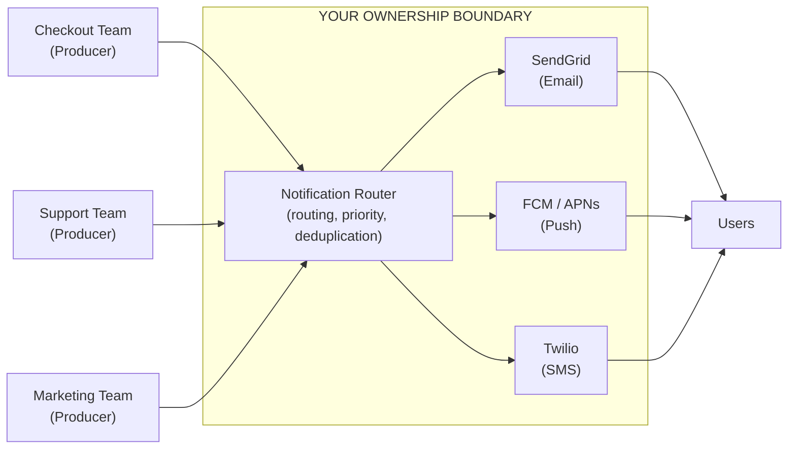
```mermaid
flowchart LR
    Checkout["Checkout Team<br/>(Producer)"] --> Router
    Support["Support Team<br/>(Producer)"] --> Router
    Marketing["Marketing Team<br/>(Producer)"] --> Router

    subgraph "YOUR OWNERSHIP BOUNDARY"
        Router["Notification Router<br/>(routing, priority, deduplication)"]
        Router --> Email["SendGrid<br/>(Email)"]
        Router --> Push["FCM / APNs<br/>(Push)"]
        Router --> SMS["Twilio<br/>(SMS)"]
    end

    Email --> Users["Users"]
    Push --> Users
    SMS --> Users
```

The explicit ownership boundary:
- Left of the boundary: producer teams own message content, trigger logic, recipient selection
- Right of the boundary (your scope): routing decisions, channel selection, delivery SLA, provider integrations, retry logic, delivery tracking

The reason this boundary matters: if the Checkout team sends a notification to the wrong user, that is their bug. If the notification is sent to the right user but delivered 10 minutes late, that is your bug. Clear boundaries prevent the "who owns this?" conversation during incidents.

---

### Example 3: Messaging System V1 to V3 Evolution

This example shows how ownership evolves as a system scales, and what the Staff engineer owns at each stage.

**V1: Monolith, 10,000 daily active users**

Architecture: single service handling message send and receive, single PostgreSQL database.

One team owns everything. The system is simple. Ownership is clear and complete within one team. There are no cross-team dependencies to manage.

What to watch for at V1: you are making data model decisions now that are very expensive to change later. Key decision: store messages as rows or as events? If you store as rows, migrating to event sourcing at V2 is a painful data migration. If you store as events from day one, adding features later is additive.

**V2: Extracted message storage, 500,000 daily active users**

Architecture: message service (your team) + message storage service (new team) + mobile SDK (mobile team).

Now there are two teams. The moment you extract the storage service, you need:
- An explicit API contract between message service and storage service
- An SLA from storage service to message service ("storage service promises p99 < 50ms")
- Monitoring at the boundary (not just inside each service)
- A decision about who owns the database schema: the team that reads it, the team that writes it, or a jointly-owned contract

What the Staff engineer owns at V2: the API contract between the two teams. Without an explicit owner for that contract, you will get silent incompatibilities.

**V3: Fan-out service, 10 million daily active users**

Architecture: message service + message storage service + fan-out service (for group messages) + mobile team + notification team.

Now there are three services in the critical path for sending a message: message service calls storage service calls fan-out service.

**The composite availability problem.** If each service is 99.9% available, the end-to-end availability is:

0.999 x 0.999 x 0.999 = 0.997 = 99.7% availability

That is 26 hours of downtime per year in the message send path -- even though each individual service has excellent availability.

L5 accepts this: "Each service meets its SLA individually."

L6 identifies this: "The serial dependency chain multiplies failure probability. I need to break the serial dependency."

The L6 fix: make fan-out async. When a message is sent, the message service writes it to storage synchronously (the user needs to know the message was saved), then publishes an event. The fan-out service consumes that event asynchronously. Fan-out failures do not block the user's send operation.

New composite availability: message service x storage service only = 0.999 x 0.999 = 99.8%. Fan-out can fail independently without affecting the user's send success rate.

**What the Staff engineer owns at V3:** the end-to-end message delivery SLA across three teams' services. They do not manage those teams. They own the measurement, the composite SLA definition, and the escalation path when the composite SLA is at risk.

---

### Example 4: Cost Ownership

Scenario: your team's service uses 50TB of S3 storage at a total cost of about $1,150 per month. A cost review shows that 40TB of that data is older than 90 days and accessed less than once per year.

L5: "Storage is cheap. It's fine. We can deal with it if it becomes a problem."

L6:

> "This is a cost ownership gap. Let me quantify it:
>
> - 40TB in S3 Standard: $23 per TB per month = $920 per month
> - 40TB in S3 Glacier (archival tier): $4 per TB per month = $160 per month
> - Monthly savings from migration: $760
> - Annual savings: $9,120
>
> Migration cost: approximately 2 days of engineering work to write and run the lifecycle policy. Break-even: less than 2 months.
>
> Access pattern: data older than 90 days is accessed less than once per year, typically for compliance audits. S3 Glacier retrieval time is 3-5 hours, which is completely acceptable for compliance audits that are scheduled in advance.
>
> I'll propose this in the next planning cycle. This is not just cost hygiene -- it's a signal that we should establish a data retention policy and a tiering policy for all data we generate. Without a policy, this problem will recur as we grow."

**Why this signals Staff level:** L6 engineers own the cost profile of their systems, not just the technical correctness. Treating a $9,120/year saving as "not my job" is a component-level mindset. Owning the cost curve is a problem-space mindset.

---

### Example 5: Data Consistency Ownership

A distributed system with three services each maintaining a copy of user profile data. User updates their email in Service A. 200ms later, Service B still shows the old email. 1 second later, Service C still shows the old email.

Who owns the consistency of user data across services?

L5: "Each service owns its own copy. They'll eventually sync."

L6:

> "The problem here is not eventual consistency -- that's a normal and acceptable state for most reads. The problem is that nobody owns the consistency model. When users see their own email displayed incorrectly in different parts of the product, they report it as a bug. The bug report goes to whichever team owns the surface showing the wrong email. That team says 'we just show what Service A tells us.' Service A says 'we updated our record.' Round and round.
>
> The fix is to make the consistency model explicit and owned:
>
> Service A is the source of truth for user profile data. Services B and C subscribe to profile change events from Service A. They accept eventual consistency -- up to 5 seconds. This is the SLA they commit to.
>
> If a service needs read-your-writes guarantee -- the user just updated their email and expects to see the new email immediately -- that service calls Service A directly instead of using its local cached copy. The local cache is for read-heavy browse scenarios, not for post-update confirmation.
>
> Who owns this? I'd propose that Service A owns the consistency SLA: 'profile changes are propagated to all consumers within 5 seconds.' Service A monitors the propagation lag and alerts if it exceeds 5 seconds. Services B and C are responsible for subscribing to the events and updating their local state promptly.
>
> The alternative -- letting each service figure it out independently -- creates the situation we're in now: inconsistency with no clear owner."

**Why this signals Staff level:** The ownership question "who owns consistency across services" is a cross-team question that nobody on any individual team can answer. A Staff engineer sees this as their job to define and assign.

---

## Appendix F: Real Incident -- The Ownership Gap That Became an Outage

This incident is worth studying in detail because it illustrates every key concept from this chapter in one scenario.

| Part | Detail |
|---|---|
| **Context** | Payment processing system with three services owned by three different teams: Order Service (Team A), Payment Service (Team B), Fraud Service (Team C). Each team had strong engineering practices, high code quality, and met their individual service SLAs. |
| **Trigger** | Team C (Fraud Service) deployed a new fraud detection model. The new model was more accurate -- it caught more fraud -- but it was also more computationally expensive. Fraud Service p99 latency increased from 50ms to 800ms within 30 minutes of deployment. Team C's monitoring showed the latency spike but not its downstream consequences. Their SLA was 1000ms p99, so no alert fired. |
| **Propagation** | Order Service called Payment Service synchronously. Payment Service called Fraud Service synchronously. Payment Service timeout was configured at 600ms. With Fraud Service at 800ms p99, approximately 40% of payment requests timed out. Order Service surfaced these timeouts to users as checkout failures. |
| **User impact** | 40% of checkouts failed for 47 minutes. No team's individual SLA was violated. Fraud Service was under its 1000ms SLA. Payment Service was up and processing the 60% of requests that didn't time out. Order Service was functioning correctly. The failure was in the interaction. Estimated revenue impact: approximately $2.1M. |
| **Engineer response** | Team A said: "Payment Service is timing out. Not our service." Team B said: "Fraud Service is slow. Not our service." Team C said: "We're within our SLA. Our service is working." All three teams were technically correct. Forty-seven minutes passed before anyone accepted ownership of the end-to-end checkout reliability. |
| **Root cause** | No circuit breaker at the Payment Service -> Fraud Service boundary. No owner of the end-to-end checkout reliability SLA. Team C's deployment process did not include downstream latency impact testing. Each team monitored their own service; nobody monitored the checkout completion rate. |
| **Design changes** | (1) Added circuit breaker: if Fraud Service p99 exceeds 300ms, Payment Service trips the circuit and falls back to optimistic approval with async fraud verification. (2) Made Fraud Service async: Payment Service approves the transaction optimistically, Fraud Service verifies in the background, any detected fraud triggers an immediate reversal. (3) Created a "Checkout Reliability" cross-team ownership area with a Staff engineer explicitly accountable for the end-to-end checkout success rate. (4) Added end-to-end checkout monitoring: the system now alerts on checkout completion rate, not just individual service health. |
| **Lesson** | Systems fail in the gaps between teams. Each team's individual ownership was strong. The failure happened in the interaction between teams -- in the space nobody owned. Staff-level ownership means owning the interstitial zones: the cross-service contracts, the end-to-end SLAs, the failure modes that span team boundaries. |

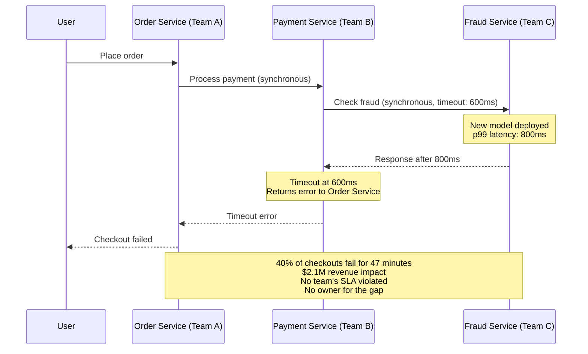
```mermaid
sequenceDiagram
    participant User
    participant OrderSvc as Order Service (Team A)
    participant PaySvc as Payment Service (Team B)
    participant FraudSvc as Fraud Service (Team C)

    User->>OrderSvc: Place order
    OrderSvc->>PaySvc: Process payment (synchronous)
    PaySvc->>FraudSvc: Check fraud (synchronous, timeout: 600ms)
    Note over FraudSvc: New model deployed<br/>p99 latency: 800ms
    FraudSvc-->>PaySvc: Response after 800ms
    Note over PaySvc: Timeout at 600ms<br/>Returns error to Order Service
    PaySvc-->>OrderSvc: Timeout error
    OrderSvc-->>User: Checkout failed
    Note over OrderSvc,FraudSvc: 40% of checkouts fail for 47 minutes<br/>$2.1M revenue impact<br/>No team's SLA violated<br/>No owner for the gap
```

---

## Appendix G: Six Homework Exercises

---

### Exercise 1: The Scope Map

**Prompt:** Draw a diagram of a system you worked on. Mark: what you owned, what adjacent teams owned, and where the boundaries were unclear. Then identify one "ownership gap" -- a component or interaction that nobody clearly owned.

**What to produce:** A diagram with three zones: "I own this," "Adjacent team owns this," "Unclear / nobody owns this." For the unclear zone, answer: what would happen if it failed at 2am? Who would get paged? What would they do?

**Skill built:** Recognizing ownership gaps before they become incidents. Staff engineers proactively map the gaps in their systems and either fill them or make them explicit before an incident forces the question.

**Self-evaluation criteria:**
- Can you name at least one ownership gap in a system you've worked on?
- For that gap, can you describe a plausible failure scenario?
- Can you propose who should own it and what that ownership would require?

---

### Exercise 2: The Impact Journal

**Prompt:** For two weeks, before implementing any technical decision, write one sentence: "This decision will [reduce/increase] X by Y% because Z." After two weeks, review your predictions.

**What to produce:** A journal with one prediction per decision. After two weeks: a review of which predictions were right, which were wrong, and where you didn't even try to quantify.

**Skill built:** Impact framing. Most engineers make technical decisions without connecting them to measurable outcomes. This exercise forces the connection. You will discover that some decisions you thought were important had no measurable impact, and some decisions you treated as trivial had significant ripple effects.

**Self-evaluation criteria:**
- Did you make a prediction for every decision, or only the easy ones?
- What percentage of your predictions had a quantifiable outcome vs "we can't measure this"?
- For the ones where you were wrong: why were you wrong? Was the model wrong, or was the data unavailable?

---

### Exercise 3: The Ownership Audit

**Prompt:** Pick one system you own. For each component, answer four questions: Who is on-call? What is the runbook? What is the SLA? What is the blast radius if it fails?

**What to produce:** A table with one row per component and four columns: on-call owner, runbook link, SLA definition, blast radius description.

**Skill built:** Ownership completeness. If you cannot answer all four questions for a component, you have an ownership gap. The audit makes the gaps explicit. Most engineers who do this exercise discover they cannot fully answer all four questions for at least one component they thought they owned completely.

**Self-evaluation criteria:**
- Which components do you own completely (all four questions answered)?
- Which have gaps?
- What is the most dangerous gap -- the one most likely to cause a bad incident?

---

### Exercise 4: The Influence Campaign

**Prompt:** Identify one technical decision in your organization that you believe is wrong or suboptimal. Write a one-page document making the case for change -- with data, with an alternative, and with a specific ask. Share it. Track what happens.

**What to produce:** A one-page document with: (1) what the current state is, (2) why it is suboptimal with data, (3) what you propose instead, (4) the expected improvement, (5) the specific ask ("I'd like Team X to try this on one service for one sprint").

**Skill built:** Driving direction without authority. The document forces you to make your argument concrete and data-driven rather than opinionated. Sharing it forces you to practice influencing without escalating. Tracking what happens teaches you about organizational dynamics.

**Self-evaluation criteria:**
- Did people read it and respond?
- What objections came up?
- Did you make any progress, even partial?
- What would you do differently next time?

---

### Exercise 5: The Staff-Level Redesign

**Prompt:** Take a design you created as an L4 or L5 engineer. Redesign it explicitly thinking about: cross-team impact, failure modes, long-term evolution, and operational cost. What is different?

**What to produce:** Two design documents side by side: the original and the Staff-level version. A section at the end: "What would I have done differently if I had thought at this level originally?"

**Skill built:** Developing the Staff-level thinking muscle. The gap between the two designs is your personal L5-to-L6 delta. Understanding your specific gap -- "I always under-invest in failure modes" or "I never think about cross-team blast radius" -- lets you target your improvement.

**Self-evaluation criteria:**
- What dimension of Staff-level thinking was most absent from your original design?
- What decision in the original design would you make differently?
- What is the most important thing you would have built in advance vs retroactively?

---

### Exercise 6: The Mentorship Scaling Exercise

**Prompt:** Identify a technical problem your team faces repeatedly. Write a guide that would allow a more junior engineer to solve it without your help.

**What to produce:** A guide that covers: what the problem is, how to diagnose it, what the options are, what the decision criteria are, and what the common mistakes are. The test: give it to a junior engineer who has never solved this problem and see if they can use it without asking you questions.

**Skill built:** Scaling your expertise. L6 engineers do not just solve problems -- they transfer their problem-solving ability to others. A guide that enables 5 engineers to solve a problem independently is more leverage than personally solving that problem 5 times. This is the 10x leverage pattern in practice.

**Self-evaluation criteria:**
- Can a junior engineer use the guide without asking you questions?
- What did you learn about your own knowledge by having to write it down explicitly?
- How could you extend this guide to cover more scenarios?

---

## Appendix H: Four Reflection Prompts

Set aside 15-20 minutes for each prompt. These are not interview prep -- they are tools for understanding your own trajectory.

---

### Reflection 1: Your Scope Evolution

Draw a timeline of the last 2-3 years of your career.

For each major project or role, mark: what was your technical scope? What was your organizational scope? What was your temporal scope (how far ahead were you thinking)?

Look at the trend:
- Has your scope grown, shrunk, or stayed flat?
- What events expanded it? (A new manager, a new project, a cross-team initiative you joined?)
- What events contracted it? (A difficult project that pulled you inward, a team reorg that narrowed your domain?)

Then: name three concrete actions that would expand your scope in the next 12 months. Not vague intentions ("I should be more cross-team") but specific actions ("I will join the weekly API standards meeting and contribute a proposal by end of Q3").

---

### Reflection 2: Your Influence Inventory

Make a list of who you influence and who influences you.

Who do you influence?
- Who comes to you for technical advice?
- Which teams use patterns or tools you built?
- Which decisions have you shaped even when you weren't in the room?

Who influences you?
- Whose technical judgment do you defer to?
- Which engineers' design documents do you read and learn from?

Where are you influential that you do not realize? (Ask a trusted colleague -- they often see influence you don't notice.)

Where should you be influential but aren't? (What decisions are being made in your area that you're not part of?)

Design one concrete action to expand your influence in one area you identified. Example: "The Auth team is redesigning the session token format and I have relevant experience from my previous role. I'll ask to be included in their design review and prepare a one-pager on the trade-offs I'm aware of."

---

### Reflection 3: Ownership Gaps

In your current systems, where are the ownership gaps?

Name three failure scenarios that exist between teams. For each:
- What is the failure?
- Which team would get paged?
- What would they discover when they investigated?
- Who is actually responsible for fixing it?

For at least one gap, propose a specific owner and a specific ownership commitment (an SLA, a runbook, a circuit breaker, a monitoring alert).

The act of naming the gaps and proposing owners is itself a Staff-level contribution. Most engineers see the gaps and feel vaguely uncomfortable. Staff engineers name them and take action.

---

### Reflection 4: Your Staff Readiness

Rate yourself 1-5 on four dimensions:

| Dimension | Rating (1-5) |
|---|---|
| Scope of thinking (do you reason about cross-team systems, or mainly your component?) | |
| Impact framing (do you connect technical work to user and business outcomes, or mainly technical metrics?) | |
| Ownership breadth (do you feel responsible for outcomes beyond your code, or mainly for your service?) | |
| Influence without authority (do you drive technical direction through evidence and relationships, or mainly through escalation?) | |

For the dimension where you gave yourself the lowest score: what is one thing you would do differently this week to improve it?

Not "I'll try to be more aware of impact" but "I'll add a 'so what?' check to every technical decision I make this week and write the business consequence in my design doc."

Small, specific, immediately actionable.

---

## Appendix I: 15 Brainstorming Questions

These questions are for interview preparation and self-assessment. A good answer is shown for each. The good answer is not the only answer -- it is a model for the kind of thinking the question is looking for.

---

### Scope Understanding (Questions 1-5)

**Question 1: When you hear "design a cache," what is the first question you ask?**

Good answer: "What problem is the cache solving?"

Not: "Redis or Memcached?" The choice of technology comes after you understand the problem. Jumping to technology selection before understanding the problem is the most common L5 anti-pattern in system design interviews. The cache might be the wrong solution entirely -- maybe the database query just needs an index.

**Question 2: How do you know when you've scoped a problem correctly?**

Good answer: You can draw the system, name the users, describe a success criterion that a non-engineer could verify -- and you did all three before starting to design.

If you cannot describe a success criterion that a non-engineer could verify, you have not scoped the problem correctly. "The system is fast" is not a success criterion. "The p99 checkout latency is under 200ms during peak load" is a success criterion.

**Question 3: What is the difference between the stated problem and the actual problem?**

Good answer: The stated problem is symptoms. The actual problem is root cause.

"The cache is slow" is a stated problem. It is a symptom. The actual problem might be: the cache is slow because the cache keys are too broad, causing cache misses on every request. Or the actual problem is: the database queries that the cache is trying to avoid are themselves unoptimized, so even the cache misses go to a slow database. Addressing the symptom builds a faster cache. Addressing the root cause might mean you don't need a cache at all.

**Question 4: How do you scope a problem that spans three teams without getting organizational?**

Good answer: Focus on the user outcome, not on the team ownership.

"The user should be able to complete checkout in under 3 seconds end-to-end" is a scope statement. It does not assign blame or ownership to any team. It defines success in terms of what the user experiences. From that scope statement, you can work backward: what does each team need to contribute to make that outcome true? This approach gets cross-team alignment without triggering territorial behavior.

**Question 5: What do you do when the interviewer gives you an ambiguous prompt on purpose?**

Good answer: Ask 3-4 clarifying questions that reveal the constraints, then state your assumptions explicitly and proceed.

The interviewer is often testing whether you can handle ambiguity productively. The wrong response: "I can't design this without more information." The right response: ask targeted questions that uncover the most important constraints, then say "based on what I've heard, I'm going to assume X, Y, and Z and proceed with that scope -- stop me if I've misunderstood." The interview continues with a design that may have assumptions baked in, which the interviewer can challenge.

---

### Impact Understanding (Questions 6-10)

**Question 6: How do you connect "we added a cache" to business value?**

Good answer: "Cache reduced p99 latency from 400ms to 80ms. A 100ms reduction in page load historically correlates with a 1% increase in conversion. At our scale, 1% conversion improvement is approximately $X per month."

The chain is: technical change -> technical metric improvement -> user behavior change -> business metric change. L6 engineers trace the full chain. If you cannot trace it, you may still be right that the cache is valuable -- but you cannot justify it in terms that a PM or VP cares about.

**Question 7: What is the "so what?" test?**

Good answer: After every design decision, ask: "so what does this mean for the user or the business?" If you cannot answer, the decision may not matter.

Example: "I chose PostgreSQL over MySQL." So what? If your answer is "PostgreSQL has better support for JSON fields and our data model uses a lot of JSON" -- that's a technical so-what. If your answer is "PostgreSQL's JSONB indexing means our product search queries are 3x faster, which reduces the bounce rate on search results pages" -- that's a business so-what. The business so-what is more valuable in a Staff-level interview.

**Question 8: How do you quantify reliability improvements?**

Good answer: "Moving from 99.9% to 99.99% availability reduces annual downtime from 8.7 hours to 52 minutes. At our revenue rate of $X per hour, this improvement is worth $Y per year in prevented revenue loss -- plus reduced on-call burden and improved user trust."

Reliability is not just uptime numbers. Reliability has a dollar value. L6 engineers know this value for their systems. If your system handles $10M in transactions per hour, 8.7 hours of downtime per year at 99.9% SLA represents $87M in potential revenue at risk. Moving to 99.99% reduces that risk to $8.7M.

**Question 9: What is the difference between output and outcome?**

Good answer: Output is what you built. Outcome is what changed as a result.

Output: "I built a shared authentication library used by 4 teams."
Outcome: "4 teams no longer maintain their own auth implementations. Auth-related security incidents dropped from 3 per quarter to 0. Engineering velocity for those teams improved because they don't need to reason about auth edge cases anymore."

Staff engineers own outcomes, not just outputs. The library is the output. The improvement in security posture and team velocity is the outcome. In a performance review or an interview, always lead with outcomes.

**Question 10: How do you frame a technical decision for a non-technical audience?**

Good answer: Skip the technical details. Lead with the user impact and the business consequence of not doing the work.

Wrong framing for a VP: "We need to migrate from a monolith to a microservices architecture."

Right framing for a VP: "Our deployment process currently takes 45 minutes and requires deploying the entire application together, which means a bug in the payment code can delay a fix to the search code. This has caused 3 incidents this year where a minor bug in one area required a full application rollback. The architectural change I'm proposing separates these deployments -- payment code deploys independently from search code. The risk of a single bug causing a company-wide deployment rollback goes from 100% to near 0%."

---

### Ownership Understanding (Questions 11-15)

**Question 11: What does it mean to own a system at 3am?**

Good answer: You know how to diagnose it, you have the runbook, you can restore service -- and you can do this even for failure modes that have never happened before.

Owning a system at 3am means: when your pager fires, you do not start from zero. You know the system's topology. You know where the logs are. You know the most likely failure modes and have runbooks for them. For novel failure modes, you have enough mental model of the system to reason about what might be wrong without a runbook.

The sign that you don't own a system at 3am: when an incident happens, you find yourself saying "I've never seen this before -- I have no idea where to start."

**Question 12: What is the difference between being accountable and being responsible?**

Good answer: Responsible means you do the work. Accountable means you own the outcome even if someone else does the work.

A Staff engineer can be accountable for a system they did not personally implement. They defined the architecture, approved the design, and are accountable for the outcomes -- even though 3 engineers did the implementation. If the system has a production incident, the Staff engineer is accountable for the response and the post-incident improvements, even if they were not on-call and were not the one who wrote the buggy code.

The practical implication: you cannot delegate accountability by delegating work. If you are accountable, you are accountable until the outcome is good -- regardless of who is doing the implementation.

**Question 13: How do you own a system that depends on a team you don't manage?**

Good answer: SLA agreements, monitoring at the boundary, circuit breakers, fallback strategies. You cannot control the other team, but you can design your system to be resilient to their failures.

You negotiate an SLA with the other team ("your service will respond in under 100ms p99"). You add monitoring at the boundary so you know when the SLA is at risk (not just when it is violated). You add a circuit breaker so your system degrades gracefully when their service is slow. You have a fallback strategy for when their service is unavailable.

This is the difference between component ownership ("my service is healthy") and problem space ownership ("my users have a good experience, which requires their service to be healthy -- and I've designed for the case when it isn't").

**Question 14: What happens when you own a failure that wasn't your fault?**

Good answer: User impact is your responsibility regardless of root cause. Mitigate first, investigate second, attribute blame never.

"Not my fault" is irrelevant to users. They do not care whose fault it is. They care whether the product works. A Staff engineer who owns the user experience does not wait for the responsible party to fix things -- they activate their fallback immediately, communicate the degradation state to users, and coordinate the investigation simultaneously.

After recovery, post-mortems attribute root cause. They do not attribute blame. Root cause is a technical fact. Blame is a social judgment that slows incident response and damages relationships.

**Question 15: How do you pass ownership to another team without losing quality?**

Good answer: Write runbooks, create monitoring dashboards, run a joint on-call rotation for two sprints, do a chaos engineering exercise together. Transfer knowledge, not just code.

A code handoff is not an ownership handoff. The new team has the code but not the mental model, the operational history, the undocumented edge cases, or the relationships with dependencies.

A proper ownership transfer includes:
- All runbooks reviewed and updated by the new team (not just sent to them -- they have to engage with them)
- Monitoring dashboards that the new team built (not inherited -- building them forces understanding)
- A joint on-call rotation for 4-6 weeks where both teams respond to incidents together (the old team transfers institutional knowledge in real incidents)
- A chaos engineering exercise where you deliberately break things together so the new team has seen failure modes before they happen in production

The ownership is transferred when the new team can respond to a novel incident without consulting the old team. Until then, the old team has transferred code, not ownership.

---

## Appendix J: Visual Summary -- Chapter 8 in One Picture

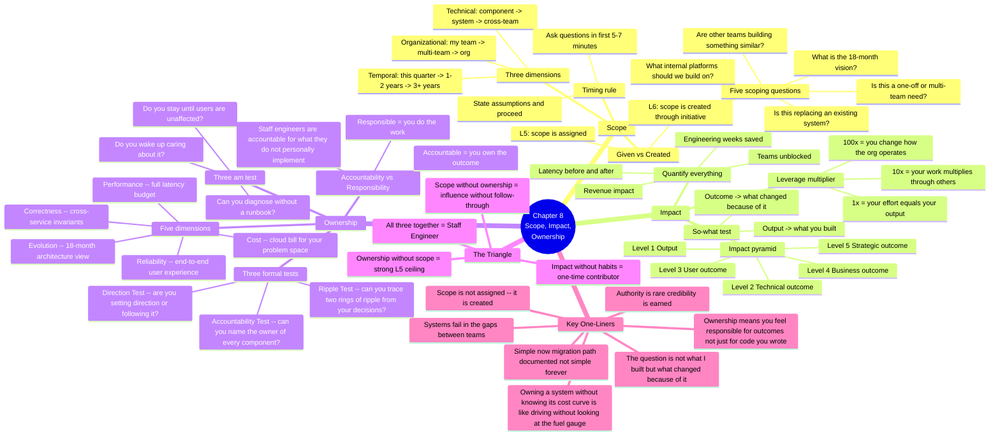
```mermaid
mindmap
  root((Chapter 8<br/>Scope, Impact,<br/>Ownership))
    Scope
      Three dimensions
        Technical: component -> system -> cross-team
        Temporal: this quarter -> 1-2 years -> 3+ years
        Organizational: my team -> multi-team -> org
      Given vs Created
        L5: scope is assigned
        L6: scope is created through initiative
      Five scoping questions
        Is this replacing an existing system?
        Are other teams building something similar?
        Is this a one-off or multi-team need?
        What is the 18-month vision?
        What internal platforms should we build on?
      Timing rule
        Ask questions in first 5-7 minutes
        State assumptions and proceed
    Impact
      So-what test
        Output -> what you built
        Outcome -> what changed because of it
      Impact pyramid
        Level 1 Output
        Level 2 Technical outcome
        Level 3 User outcome
        Level 4 Business outcome
        Level 5 Strategic outcome
      Quantify everything
        Latency before and after
        Teams unblocked
        Engineering weeks saved
        Revenue impact
      Leverage multiplier
        1x = your effort equals your output
        10x = your work multiplies through others
        100x = you change how the org operates
    Ownership
      Five dimensions
        Correctness -- cross-service invariants
        Reliability -- end-to-end user experience
        Performance -- full latency budget
        Cost -- cloud bill for your problem space
        Evolution -- 18-month architecture view
      Three am test
        Do you wake up caring about it?
        Can you diagnose without a runbook?
        Do you stay until users are unaffected?
      Accountability vs Responsibility
        Responsible = you do the work
        Accountable = you own the outcome
        Staff engineers are accountable for what they do not personally implement
      Three formal tests
        Accountability Test -- can you name the owner of every component?
        Direction Test -- are you setting direction or following it?
        Ripple Test -- can you trace two rings of ripple from your decisions?
    The Triangle
      Scope without ownership = influence without follow-through
      Ownership without scope = strong L5 ceiling
      Impact without habits = one-time contributor
      All three together = Staff Engineer
    Key One-Liners
      Scope is not assigned -- it is created
      The question is not what I built but what changed because of it
      Ownership means you feel responsible for outcomes not just for code you wrote
      Systems fail in the gaps between teams
      Simple now migration path documented not simple forever
      Owning a system without knowing its cost curve is like driving without looking at the fuel gauge
      Authority is rare credibility is earned
```

**The one-sentence summary of Chapter 2:**

Staff Engineers create scope by looking beyond their assigned boundaries, demonstrate impact by connecting technical work to outcomes that non-engineers care about, and own problem spaces by accepting responsibility for user experience even when the root cause is in someone else's code.

---

## Appendix K: Part 5 -- Five Real-World Ownership Examples (Staff Level)

---

### Example 1: The Cross-Service Reliability Problem

**Scenario:** Three services -- Order, Payment, Inventory -- each owned by different teams. Orders occasionally fail because Inventory is slow (p99 = 800ms instead of normal 50ms). The Order team blames Inventory. The Inventory team says their p99 is within their SLA.

The question: who owns the user experiencing a failed checkout?

**L5 response:** "Not our problem -- Inventory is within their SLA."

This is technically correct and organizationally useless. The user still gets a failed checkout.

**L6 response -- four steps:**

Step 1: Immediately add a circuit breaker on the Order->Inventory call. If Inventory does not respond within 200ms, return "inventory check pending" instead of blocking the order. The user's checkout completes; inventory is verified in the background.

Step 2: Add end-to-end checkout latency as a metric owned by the Order team -- even though the root cause is in Inventory. This metric tells you when the user is suffering, regardless of which downstream service is slow.

Step 3: Work with the Inventory team to tighten their SLA on the checkout-critical path. The current SLA is 1000ms p99. Negotiate a new SLA of p99 < 200ms specifically for the calls that come from the checkout flow. Other Inventory calls can keep the looser SLA.

Step 4: Design a fallback -- optimistic inventory reservation. Allow checkout to proceed, verify inventory asynchronously, cancel and refund if the item is actually unavailable. Most of the time this never triggers. When it does, the user experience of "we're sorry, this item sold out" is better than a failed checkout.

**Key insight:** Owning the user outcome means owning the cross-service interaction, not just your own service's SLA. The Inventory team is not wrong -- they met their SLA. But if nobody owns the cross-service interaction, users keep suffering.

---

### Example 2: The Undifferentiated Heavy Lifting

**Scenario:** Four product teams each build their own notification sending logic -- email templates, retry logic, bounce handling, unsubscribe management. Each team spends 20% of their time maintaining this.

**L5 response:** "Each team owns their notifications -- makes sense."

**L6 response:** "This is undifferentiated heavy lifting -- work that does not differentiate any product but every team must do. Four teams x 20% = 0.8 full-time engineers spent on commodity work that creates no product value.

The Staff-level move: propose a shared Notification Platform owned by one team. Product teams send a message with a template ID and a recipient; the platform handles delivery, retries, bounces, and unsubscribes. 80% of the work done once. Each product team gets 20% of their time back."

Before (four teams each building their own notification logic):

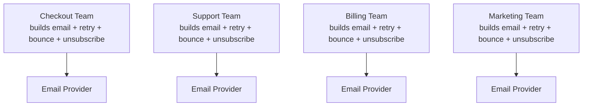
```mermaid
flowchart TD
    Checkout["Checkout Team<br/>builds email + retry + bounce + unsubscribe"] --> Email1["Email Provider"]
    Support["Support Team<br/>builds email + retry + bounce + unsubscribe"] --> Email2["Email Provider"]
    Billing["Billing Team<br/>builds email + retry + bounce + unsubscribe"] --> Email3["Email Provider"]
    Marketing["Marketing Team<br/>builds email + retry + bounce + unsubscribe"] --> Email4["Email Provider"]
```

After (one shared Notification Platform):

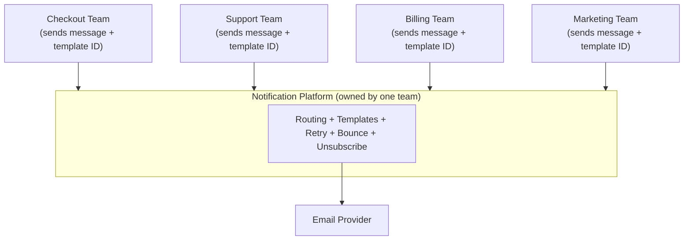
```mermaid
flowchart TD
    Checkout["Checkout Team<br/>(sends message + template ID)"] --> Platform
    Support["Support Team<br/>(sends message + template ID)"] --> Platform
    Billing["Billing Team<br/>(sends message + template ID)"] --> Platform
    Marketing["Marketing Team<br/>(sends message + template ID)"] --> Platform

    subgraph Platform["Notification Platform (owned by one team)"]
        Router["Routing + Templates + Retry + Bounce + Unsubscribe"]
    end

    Router --> EmailProvider["Email Provider"]
```

The difference: four teams doing redundant work versus one team doing it once and the other three teams getting their time back.

---

### Example 3: The Long-Term Sustainability Problem

**Scenario:** A service was built quickly 18 months ago with shortcuts: no pagination on list endpoints (returns all records), synchronous fan-out to 50 downstream services, session state stored in local memory.

**L5 response:** "It works, we'll refactor when we have time."

Time never materializes. The problem grows. It becomes an emergency.

**L6 response:** "I'd run a sustainability audit. Three questions:

Question 1 -- What breaks first as we scale 10x? No pagination means a single list endpoint request returns all records. At 10x traffic with 10x data, a single request returns 10 million records. The service runs out of memory. This is not a gradual degradation -- it is a sudden cliff.

Question 2 -- What is the hardest thing to change? Local session state. Running a single instance works fine. The moment we try to run two instances for redundancy or scale, sessions break because Instance A does not know about sessions from Instance B. Local session state is the scaling blocker.

Question 3 -- What are we paying interest on? Synchronous fan-out to 50 downstream services. Every user request blocks until all 50 downstream calls complete. The p99 latency of our service is the maximum of the p99 latency of all 50 downstream services. If one of those 50 services has a bad day, we have a bad day.

Priority order:
1. Pagination first -- customer-facing risk, could cause an outage
2. Async fan-out second -- latency impact affecting every user
3. Session externalization third -- scaling blocker but we can survive on one instance longer"

The L6 move is not "we'll fix it eventually." It is "here is the order of priority, here is why, here is the plan."

---

### Example 4: The Operational Excellence Ownership

**Scenario:** A service has been running for 2 years. The team that built it has mostly moved on. The current team inherited it. It has no runbooks, inconsistent monitoring, and 3 on-call procedures that exist only in one engineer's head.

**L5 response:** "We'll document it eventually."

**L6 response:** "Documentation debt is operational risk. Every on-call procedure that exists only in one person's head is a single point of failure -- organizational, not technical.

I'd treat this as a 2-sprint project with three deliverables:

Deliverable 1: Write runbooks for the top 5 on-call scenarios. Where do I find the top 5? The incident log. Sort by frequency. The most common incidents get runbooks first.

Deliverable 2: Add dashboards for the top 3 metrics we check during every incident. If we check something manually every incident, automate the check and make it always-on. The act of building the dashboard forces clarity: what are we actually measuring? Why does it matter?

Deliverable 3: Run a chaos day. Intentionally break the top failure mode in staging. Walk the whole team through the runbook -- including people who have never seen the runbook before. Find the gaps. Fix them.

Operational excellence is not nice-to-have. It is the difference between a 3am outage that takes 4 hours to resolve versus 15 minutes. The 3-hour, 45-minute difference is paid by whoever is on-call."

---

### Example 5: The Mentorship and Capability Building

**Scenario:** You are the only engineer on your team who understands the distributed transaction protocol your service uses. You are frequently interrupted for questions, required for every incident, and cannot go on vacation without the team being at risk.

**L5 response:** "I'm the expert, I help when asked."

This sounds responsible. It is actually a failure of ownership. You have become a bottleneck. The team's ability to operate is fragile and depends on your availability.

**L6 response:** "This is a single point of failure -- organizational, not technical. My expertise is not scaled. I'm not making the team stronger; I'm making myself indispensable, which is not the same thing.

Three actions I'd take:

Action 1: Write the definitive internal guide on our distributed transaction pattern. Not a high-level overview -- 10 pages with worked examples, common failure modes, and what to do about each. This document becomes the thing I point to instead of answering every question myself.

Action 2: Run two lunch-and-learns using real incidents. Walk through actual past incidents using the guide. Concrete examples are better than abstract explanations. When someone later encounters a similar incident, they remember the lunch-and-learn.

Action 3: Pair on the next three incidents. But flip the dynamic: the other engineer leads the diagnosis. I support. I do not answer questions unprompted -- I watch them think, and ask guiding questions if they're stuck. The goal is for them to build the mental model, not to observe me using mine.

Goal: within 3 months, at least two other engineers can handle incidents without me. My job is not to be irreplaceable -- it's to make the team stronger so I'm free to work on the next hard problem."

---

## Appendix L: Part 6 -- How Scope Shows Up Implicitly in Interviews

In a Staff Engineer interview, you do not explicitly announce "I am now demonstrating L6 scope." Scope shows up in the words you choose, the questions you ask, and the boundaries you draw. Interviewers read these signals constantly.

Six concrete signals and what they mean:

---

### Signal 1: How You Frame the Problem

When an interviewer says "Design a notification system," the first words out of your mouth reveal your scope.

**L5 framing:** "I'll design a service that sends emails and push notifications. Let me start with the data model..."

This is correct. This answers the question. It is also a component-level response -- you accepted the problem as stated and started solving it.

**L6 framing:** "Before I design, let me clarify: are we talking about transactional notifications -- order confirmations, password resets -- or marketing notifications like promotions and newsletters? They have very different scale characteristics, compliance requirements, and user expectations. Also, who are the producers? Just checkout, or every team?"

The L6 frame reveals three things:
- They know the problem has multiple variants with different design implications
- They consider organizational context (every team as a producer changes the design fundamentally)
- They prioritize the right design constraints before drawing any boxes

You cannot design a good notification system without knowing if it is transactional or marketing. The L6 candidate asks before assuming. The L5 candidate assumes and designs.

---

### Signal 2: Where You Draw Boundaries

When you draw the system boundary on the whiteboard, you reveal how you think about ownership.

**L5 boundary:** notification service -> email provider -> user. Clean. Simple. Correct for the component being designed.

**L6 boundary:** producer teams (checkout, support, marketing) -> routing layer -> channel services (email, push, SMS) -> external providers -> user -> delivery receipts -> analytics. AND explicitly marks "our system owns everything except external providers."

The L6 boundary shows:
- Awareness that there are multiple producers (Conway's Law: the system looks like the org)
- Explicit demarcation of what is owned vs what is external
- The return path (delivery receipts) -- notifications are not fire-and-forget, you need to know if they landed

Drawing producers on the left side of your diagram takes 10 extra seconds. It signals that you understand this is a platform with multiple consumers, not a service with one caller.

---

### Signal 3: What Future States You Consider

**L5 designs for today.** This is not wrong -- you should always design for today's requirements. But L5 stops there.

**L6 designs for today AND names the migration path to 10x.**

L5: "We'll use a single Kafka topic for all notifications."

L6: "We'll use a single topic today. When we hit 10 million notifications per day, we'll need to shard by notification type to allow independent scaling of email versus push. Our topic naming convention -- notifications.email, notifications.push -- makes that split straightforward when we need it. Today it's one topic. The naming convention is the forward migration path."

The L6 answer designs for today but leaves the door open for tomorrow without over-engineering it now. The naming convention costs nothing. The migration path is documented. When the need arises, the split is clear.

---

### Signal 4: What Stakeholders You Consider

**L5 thinks about the system's users.** End users. The people who receive the notifications.

**L6 thinks about users AND operators AND producers.**

L5: "Users need to receive notifications quickly and not miss any."

L6: "Three stakeholders shape this design:

Stakeholder 1 -- End users. They need timely, relevant notifications and an easy way to opt out. If they can't opt out easily, they unsubscribe entirely, which is worse for everyone.

Stakeholder 2 -- Producer teams. They need a simple API that does not require them to know about delivery channels. If the Checkout team has to reason about whether to use push versus email, we've given them our problem to solve. They should send a message; we should route it.

Stakeholder 3 -- Platform operators (our team). We need observability into delivery rates per channel, per producer, per user segment. When something goes wrong, we need to diagnose in minutes, not hours. We also need to prove SLA compliance to the producer teams -- they need to know their notifications are being delivered."

All three stakeholders shape design decisions. The end user shapes what gets built. The producer teams shape the API contract. The operators shape the observability requirements.

---

### Signal 5: How You Handle Adjacent Problems

**L5 solves the stated problem.** If the problem is "design a notification system," they design the notification system.

**L6 solves the stated problem AND names adjacent problems without necessarily solving them.**

L5: designs the notification delivery pipeline.

L6: designs the delivery pipeline AND says: "Adjacent problem we're not solving today but should plan for: notification preference management. Users will want to control which notification types they receive via which channel. This should probably be a separate service -- we would integrate with it as a gate before routing to channels. I'm not designing it now, but our routing layer should leave a clean hook for it. Specifically: the routing decision step is where preference data would be applied. If we design that step as a function call today, adding the preference service as an input to that function is straightforward later."

The L6 candidate is not gold-plating the design. They are naming what is out of scope AND explaining how the current design stays compatible with the future extension. This is evolutionary thinking.

---

### Narrow vs Broad Scope -- Side by Side

| Dimension | L5 Answer | L6 Answer |
|---|---|---|
| Problem framing | "Send notifications to users" | "Route the right message to the right user via the right channel at the right time" |
| System boundary | Notification service only | Producer teams + routing + channel services + external providers + delivery receipts + analytics |
| Future state | Not mentioned | "At 10M/day we shard topics by channel; naming convention is the migration path" |
| Stakeholders | End users | End users + producer teams + platform operators |
| Adjacent problems | Not mentioned | "Preference management is a future dependency; routing layer has a hook for it" |

The difference is not volume of words. It is the territory the candidate's thinking covers. The L6 candidate thinks about the problem as a system and an organization, not just as a service to build.

---

## Appendix M: Part 8 -- Full L5 vs L6 Comparison Table

### Ten Dimensions of L5 vs L6 Thinking

| Dimension | L5 (Senior) | L6 (Staff) |
|---|---|---|
| 1. Scope definition | "What I'm asked to build" | "What problem needs to be solved -- and is this the right problem?" |
| 2. Impact framing | "This is correct and technically sound" | "This reduces checkout abandonment by 12%, which is worth approximately $X per month" |
| 3. Ownership breadth | "My service and its direct interfaces" | "The user outcome across all services that contribute to it" |
| 4. Time horizon | "Next sprint, maybe next quarter" | "Next 18 months -- and here is the migration path from today to then" |
| 5. Failure thinking | "My service has retries and circuit breakers" | "What fails and who owns it across all dependencies -- including the gaps between services" |
| 6. Cross-team thinking | "Other teams use my API" | "My API design determines how other teams can evolve independently -- Conway's Law applies" |
| 7. Cost awareness | "Storage is cheap, we'll deal with cost later" | "This costs $9,120/year; Glacier saves $7,600 with acceptable trade-off; break-even in 2 months" |
| 8. Operational thinking | "We'll add monitoring and runbooks after launch" | "SLO, runbook, and dashboards are designed before first production deploy" |
| 9. Influence | "I'll escalate to my manager when teams disagree" | "I build the data, find allies, write the RFC, run the demo, accept partial wins" |
| 10. Mentorship | "I answer questions when asked" | "I make my expertise unnecessary by transferring it to at least two other engineers" |

---

### Four Concrete Comparison Examples

**Example 1: Production Issue Response**

Situation: a service in your problem space has elevated error rates. Root cause is in a dependency you don't own.

L5 response: "I've identified that the errors are coming from Service B. I've notified Team B. Waiting for them to fix it."

L6 response: "Service B is degraded, causing 15% error rate on our user-facing checkout endpoint. I've activated the circuit breaker on our Service B integration -- we're now serving from cache for the 90% of requests where cached data is acceptable. For the 10% that require real-time data, we're returning a clean error with a clear message and a retry-after header. I've looped in Team B with full diagnostic context -- timestamps, error codes, sample request IDs. I'm staying on the incident until user impact is under 1%. Estimated recovery: 20-30 minutes if Team B rolls back their recent deploy."

The difference: L5 passes the problem. L6 contains the user impact while the root cause is being fixed.

---

**Example 2: New Project Design Kickoff**

Situation: your team has been asked to build a new internal analytics pipeline.

L5 response: "I'll start with the requirements doc. What tables do we need? What queries do we need to support?"

L6 response: "Before we write a line of code, three questions. First: is there an existing internal data platform we should build on instead of building our own? Last thing we want is to be the third team maintaining a separate Kafka cluster. Second: who else will want this data in 12 months? If we design only for our team's needs today, we'll spend six months rebuilding the pipeline when two other teams need the same data. Third: what is the on-call model? If this pipeline has a 3am failure, is it us? The infrastructure team? I want that decided before launch, not during an incident."

The difference: L5 starts executing. L6 identifies the decisions that change the design before any code is written.

---

**Example 3: Conflicting Technical Approaches Between Teams**

Situation: your team and an adjacent team have different designs for how service-to-service authentication should work. Both are in-flight.

L5 response: "We'll proceed with our approach. If they want to integrate with us, they'll need to support our auth model."

L6 response: "Two different auth models in the same org is a long-term maintenance problem. I'd spend two weeks doing a joint design review with the other team's tech lead -- not to argue for our approach, but to understand what constraints drove their choices. There's usually a legitimate reason behind each design. After that review, one of three things will be true: (1) one approach is clearly better and the other team is willing to adopt it, (2) both approaches are correct but for different use cases -- we should formalize when to use each, or (3) we should design a unified approach together. I'll write the comparison doc with explicit trade-offs before we meet. Walking in with data is more productive than walking in with opinions."

The difference: L5 protects their turf. L6 solves the organizational fragmentation problem.

---

**Example 4: Technology Choice (SQL vs NoSQL for a New Service)**

Situation: your team is starting a new service and needs to decide on a data store.

L5 response: "I'd use PostgreSQL -- it's what we know, it has strong consistency, and it's well-supported. Unless we expect very high write throughput, which would push us toward Cassandra."

L6 response: "Three questions before I recommend anything. First: what is the read-to-write ratio and what are the access patterns? A service that writes once and reads 1000 times from the same key has very different needs from a service that writes constantly and reads by range. Second: what is the org's existing operational expertise? Using Cassandra when nobody on the team has operated it before is a risk -- the first production incident at 3am will be painful. Third: does another team in the org already operate something that would work? Reinventing the stack has organizational costs beyond just engineering time.

Assuming high-read, low-write, key-value access with existing PostgreSQL expertise in the org: PostgreSQL with a Redis cache layer. Assuming high-write, time-series access: check whether the platform team operates an InfluxDB or TimescaleDB cluster we can use.

The technology choice is less important than making sure whoever operates this at 3am has the expertise to do it."

The difference: L5 evaluates technologies. L6 evaluates technologies in the context of organizational expertise and existing infrastructure.

---

## Appendix N: Failure Scenarios -- Remaining Detail

### The Timeout Mismatch Incident

**Full scenario:** Service A calls Service B with a 5-second timeout. Service B calls Service C with a 10-second timeout. Service C starts responding slowly -- p99 of 8 seconds.

**What happens:**

Service B waits up to 10 seconds for C. Service A waits up to 5 seconds for B. Service A times out at 5 seconds and returns an error to the user. Meanwhile, Service B is still waiting for C -- B's request is still in-flight, consuming a thread.

After 10 seconds, B gets a response from C and returns a result -- but A already timed out and returned an error to the user at 5 seconds. The result from B is discarded.

Now multiply this by 100 concurrent users. Each user triggers a B->C call. Each call occupies a thread in B for 10 seconds even though the user received an error at 5 seconds. 100 users x 10-second thread hold = 1,000 thread-seconds of wasted work.

As traffic increases, Service B runs out of threads. It stops accepting new requests. A now gets "connection refused" instead of "timeout." The failure cascades upward.

**L5 response:** "Set better timeouts."

This addresses the symptom. It does not address the structural problem.

**L6 response:** Three things:

Thing 1 -- Timeout budget propagation. My outgoing timeout to B must be shorter than the user's timeout to me. If the user allows 3 seconds, I give B 2 seconds. B gives C 1.5 seconds. The chain must be strictly shorter at each hop. This ensures that if C is slow, the failure is detected at the outermost level first, not detected in the middle while the outer caller has already given up.

Thing 2 -- Circuit breaker at the B->C boundary. After 50% of B->C calls timeout over a 30-second window, B stops calling C. B returns a degraded response (cached data, default value, or clean error) instead of waiting for C. This prevents thread exhaustion in B.

Thing 3 -- Deadline propagation headers. Service A attaches a header to its call to B: "you have 2 seconds remaining of my budget." B reads this header and respects it -- if B's processing plus the C call cannot complete in 2 seconds, B fails fast and returns an error immediately. This requires each service to be aware of the remaining deadline, not just its own configured timeout.

**Failure sequence (broken):**

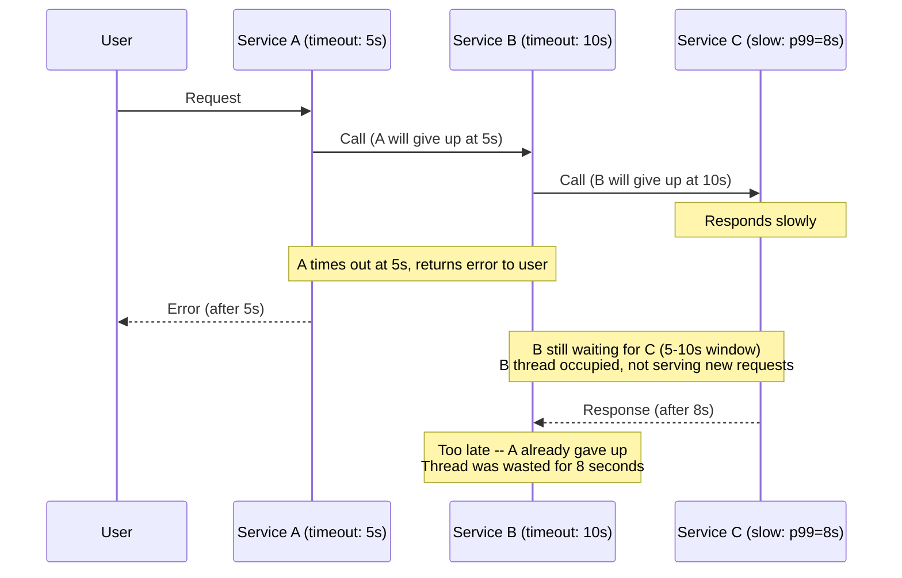
```mermaid
sequenceDiagram
    participant User
    participant A as Service A (timeout: 5s)
    participant B as Service B (timeout: 10s)
    participant C as Service C (slow: p99=8s)

    User->>A: Request
    A->>B: Call (A will give up at 5s)
    B->>C: Call (B will give up at 10s)
    Note over C: Responds slowly
    Note over A,B: A times out at 5s, returns error to user
    A-->>User: Error (after 5s)
    Note over B,C: B still waiting for C (5-10s window)<br/>B thread occupied, not serving new requests
    C-->>B: Response (after 8s)
    Note over B: Too late -- A already gave up<br/>Thread was wasted for 8 seconds
```

**Fixed sequence (with deadline propagation + circuit breaker):**

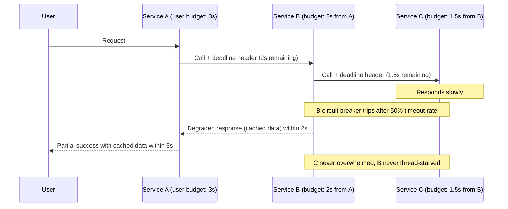
```mermaid
sequenceDiagram
    participant User
    participant A as Service A (user budget: 3s)
    participant B as Service B (budget: 2s from A)
    participant C as Service C (budget: 1.5s from B)

    User->>A: Request
    A->>B: Call + deadline header (2s remaining)
    B->>C: Call + deadline header (1.5s remaining)
    Note over C: Responds slowly
    Note over B,C: B circuit breaker trips after 50% timeout rate
    B-->>A: Degraded response (cached data) within 2s
    A-->>User: Partial success with cached data within 3s
    Note over B,C: C never overwhelmed, B never thread-starved
```

---

### Failure Pattern Recognition Table

| Observed Failure | Pattern Name | Why It Happens | Systemic Fix |
|---|---|---|---|
| Service A times out; Service B is still running, occupying threads | Timeout mismatch / deadline leak | Each service configures its own timeout independently; outgoing timeout is longer than incoming budget | Deadline propagation headers + circuit breaker at each boundary |
| Cache is invalidated; database is immediately overwhelmed with requests | Thundering herd | Many cache misses happen simultaneously (cache expiry, restart, deploy) causing a flood of DB requests | Staggered TTL (add random jitter to expiry) + request coalescing (multiple requesters for same key share one DB query) |
| Deploy causes a spike in errors that impacts users | Missing canary / no gradual rollout | New version deployed to all instances simultaneously; bugs affect 100% of traffic immediately | Blue/green deploy or percentage-based rollout; validate error rate at 1%, 5%, 20% before going to 100% |
| Incident spans 3 teams; nobody takes action because each team says it's another team's problem | Ownership gap in incident response | No cross-team runbook; no defined incident commander for cross-team failures | Cross-team failure runbooks that define who leads for each class of failure + incident commander role assigned before incidents happen |
| Service works perfectly in isolation; fails when combined with other services in production | Integration gap | Each service is unit-tested but interactions between services are not tested | Contract tests at every API boundary; integration tests in staging that exercise real service combinations |

---

## Appendix O: Data Consistency and Security Ownership

### Data Consistency and Correctness Ownership

When your system stores or transforms data, you own its correctness -- not just its delivery.

A service can be "up" and "fast" while producing wrong data. Wrong data is often harder to detect and more damaging than downtime. An outage is obvious. Silently corrupted data can go undetected for days.

Three consistency ownership questions every Staff engineer asks about any system that writes data:

**Question 1: If my service crashes mid-write, what is the state of the data?**

This is the partial write problem. You start a write operation. You crash halfway through. What did the storage layer receive? A partial row? Half of a transaction? A charge with no corresponding record?

Example: you charge a credit card (success) and then write to the database (crash). The card is charged but no order record exists. The user sees a charge and no order. This is a data consistency failure.

Fix: write to the database first (idempotently, so retries are safe), then charge the card. If the database write succeeds and the card charge fails, you can retry the charge. If the card charge succeeds and then the database write fails, you have the harder problem -- so order matters.

**Question 2: If two requests arrive simultaneously, can both succeed when only one should?**

This is the race condition problem. Two users simultaneously try to buy the last item in stock. Both read "1 in stock." Both proceed to purchase. Both succeed. You now have -1 inventory.

Fix: optimistic locking -- add a version field to the inventory record. The purchase reads the current version. The update only succeeds if the version in the database still matches what was read. If another request updated it first, the version has changed and the second request fails and must retry. Only one write wins.

Alternative: pessimistic locking -- a database transaction locks the row for the duration of the read-and-update operation. More reliable but slower and holds locks.

**Question 3: If I read data written 100ms ago, is it safe to act on it?**

This is the stale read problem. You read from a database replica. The primary wrote new data 100ms ago. Replication lag means the replica has not received the update yet. You act on data that is 100ms stale.

For most reads this is fine. For purchases, payments, and security-critical operations, it is not.

Fix: read from the primary (source of truth) for all operations where correctness is critical. Read from replicas for display-only operations where slight staleness is acceptable. The rule: if the result of a read is used to make a financial or security decision, it reads from the primary.

**Worked example -- payment processing, all three problems:**

```
1. Partial write problem:
   Wrong order: charge card -> save to DB
   If DB write crashes: card charged, no record, user confused, potential double-charge on retry
   
   Right order: save to DB (idempotently) -> charge card
   If card charge crashes: retry is safe (DB record exists, idempotency key prevents double-write)

2. Race condition problem:
   Two sessions, one item in stock
   Both read: "quantity = 1, version = 42"
   Both execute: UPDATE inventory SET quantity=0 WHERE id=X AND version=42
   First update: succeeds, sets version to 43
   Second update: fails (version is now 43, not 42), retries, reads quantity=0, returns "sold out"
   Result: exactly one purchase succeeds

3. Stale read problem:
   User adds to cart -> inventory decremented (written to primary)
   50ms later -> another user reads inventory from replica (replication lag: replica still shows old count)
   Fix: read inventory from primary during checkout path
         read inventory from replica during browse-only path (slight staleness acceptable)
```

---

### Security and Compliance Ownership

Staff engineers treat security as a design dimension, not a security-team review that happens after the design is complete.

This does not mean you need to be a security expert. It means you ask security questions during design, the same way you ask reliability and cost questions.

**Four questions for every new data store:**

1. Who can read this data? (authentication and authorization -- not just "authenticated users" but which users, which services, with what permissions)
2. Who can write this data? (write access control -- writes should be even more restricted than reads)
3. Is it encrypted at rest? (data protection at storage layer -- if the disk is stolen or a storage provider is breached, is the data readable?)
4. Is it encrypted in transit? (data protection in network -- if someone intercepts traffic between services, is the data readable?)

These four questions take 5 minutes to answer. Not answering them takes much longer when you are responding to a security incident.

**PII handling ownership:**

If your service processes names, email addresses, physical addresses, phone numbers, or location data -- you own GDPR and CCPA compliance for that data. This is not optional and it is not the security team's job to enforce it on your data.

Three compliance obligations that affect your design:

Right to deletion: a user can request that all of their data be deleted. Can your system do this? If you store user IDs in 15 different tables across 3 databases, can you find and delete all of them? Design the deletion path before deployment. It is significantly harder to design it after you have 10 million users.

Data residency: EU users' data must stay in EU data centers. If your system stores data globally without region tagging, you cannot enforce this. Add region metadata to user records at creation time, before it is difficult to retroactively assign.

Audit trail: for regulated industries (finance, healthcare), you may be required to answer "who accessed user X's data, when, and from what service?" If your access logs do not capture service identity alongside user identity, you cannot answer this question. Design audit logging into the data access layer from the beginning.

**Trust boundary ownership:**

Every service-to-service call crosses a trust boundary. The rule is: validate at entry, trust internally.

The API gateway receives a JWT token from the user's browser. The gateway validates the JWT -- checks the signature, checks expiry, checks that the user exists. The gateway extracts the user_id and passes it to downstream services as a trusted internal header.

Downstream services trust the user_id header from the gateway. They do not re-validate the JWT. They do not re-check the database. They trust the gateway's authentication.

What they must not do: accept a user_id directly from the client request without the gateway. A malicious client can send any user_id they want in a request. If downstream services trust the user_id in the request directly, any user can impersonate any other user.

The design implication: downstream services should only accept user context through internal channels (the gateway's trusted header), never from external-facing parameters. The gateway is the trust boundary. Everything inside is trusted. Everything outside is validated.

---

## Appendix P: Interview Calibration Summary

### The Interviewer's Internal Checklist

When an interviewer evaluates a Staff Engineer candidate, they are not just taking notes on technical answers. They are asking themselves a set of implicit questions. Knowing these questions lets you deliberately answer them.

The questions interviewers ask themselves during a Staff Engineer system design interview:

- Did the candidate scope the problem before solving it, or did they start designing immediately?
- Did they name stakeholders beyond the immediate end user?
- Did they connect their design choices to business outcomes, or only technical outcomes?
- Did they name failure modes that nobody asked about?
- Did they show awareness of how their design affects other teams?
- Did they take ownership of the parts they proposed -- would this person actually drive this to completion?
- Did they demonstrate that they can drive direction without authority, or would they need a manager to make every cross-team decision?

Every question you ask, every boundary you draw, every failure mode you name is answering one or more of these questions. The candidate who answers all seven -- implicitly, through the design conversation -- is demonstrating Staff-level thinking.

---

### Common L5 Mistake: Scope Boundary Rigidity

One of the most consistent L5 patterns in Staff interviews: when a dependency or adjacent system fails, the candidate treats it as someone else's problem.

**Full worked example:** Interviewer asks "What if the preference service goes down?"

L5 response: "That's the preference team's problem. We'd wait for them to fix it."

This is the correct answer for a component owner. It is the wrong answer for a problem space owner.

L6 response: "Three things I'd design for:

First: our service should have a local cache of user preferences with a 15-minute TTL. If the preference service is down, we serve from cache. A 15-minute staleness for notification preferences is acceptable -- if a user changed their preference in the last 15 minutes and gets one unexpected notification, that is inconvenient but not a serious harm.

Second: we define a default preference set. If we have no preference data for a user -- either because they never set preferences or because the cache has expired -- we default to email only, no push, no SMS. This is the most conservative default that respects user expectations without requiring them to have explicitly configured anything.

Third: we alert when preference service has been unavailable for more than 2 minutes. Here is why 2 minutes specifically: our cache TTL is 15 minutes. We have a 13-minute window between the preference service going down and our cache starting to serve data we do not know is stale. We need to know about the outage within the first 2 minutes so we have enough lead time to take action if needed."

What this answer shows:
- Proactive fallback design (cache with TTL)
- Explicit default behavior definition (what we do without data)
- Awareness of when the fallback itself becomes a problem (the 2-minute alert window is specifically because of the 15-minute TTL math)

The third point is the most L6 signal. Not just "we have a fallback" but "we know exactly when the fallback becomes unsafe and we alert before that point."

---

### Interview Calibration Summary Table

| Signal | L5 Indicator | L6 Indicator |
|---|---|---|
| Problem framing | "Let me start designing" -- accepts the stated problem and begins | "Let me make sure I understand what problem we're solving before I design anything" |
| Boundary drawing | Draws only their service and its immediate interfaces | Draws producers, consumers, external dependencies, and explicitly marks ownership lines |
| Failure modes | Names technical failures within their service | Names technical failures + organizational failures (ownership gaps) + boundary failures (cross-service interactions) |
| Stakeholders | Mentions end users | Mentions end users + producer teams + platform operators + adjacent teams affected by the design |
| Time horizon | Designs for current stated requirements | Designs for current requirements and names the migration path when scale changes (10x rule) |

---

*End of Chapter 8 appendices. Return to the core chapter sections for the foundational concepts, or use the appendices as reference when practicing specific interview question types.*

---

### SECTION A: How Your Thinking Evolves: Intern to Staff Engineer

*Same problem at four levels: you discover that 3 teams are each building their own notification service.*

#### Intern Level: "That seems duplicated, but it's not my problem"

The intern notices the duplication during a code review. They mention it in a Slack message and move on. They're focused on their own sprint tasks. "Someone else will figure it out."

Think of this like a hospital where 3 departments each bought their own MRI machine because nobody talked to each other. An intern who notices this in their first week mentions it to their supervisor. That's appropriate for an intern.

#### Mid-Level (L4): "I'll fix the duplication on my team"

L4 creates a shared library for their team's notification code. Their team no longer has duplicated code. The other 2 teams still have their own implementations.

Better within their team's scope. But L4 didn't fix the organizational problem. The 3 teams will now diverge: one team adds SMS support, another adds push notifications, the third adds email. 18 months later, the duplication is worse and now there are 3 divergent feature sets.

#### Senior (L5): "Coordinate across teams to build one shared service"

L5 calls a meeting with the 3 teams. They propose a shared notification service. They design it, get buy-in, and lead the migration. All 3 teams adopt it.

This is good Senior/L5 work. But L5 may have missed the question: why did 3 teams independently build notification services? Was there a shared service that was too hard to use (poor API, slow response, no SLA)? If yes, the shared service L5 built will have the same problems and teams will work around it again.

#### Staff (L6): "Fix the root cause of why duplication happened, not just the duplication"

L6 starts with: "Why did 3 teams each build this?" They find: there was an existing notification service 2 years ago, but it had no SLA, was slow (p99 = 3 seconds), and had an API that required 12 fields to send a simple email. Teams gave up and built their own.

L6's plan:
1. Interview each team to understand their requirements (they are different: one needs transactional email, one needs real-time push, one needs bulk SMS).
2. Design a notification service that has separate SLAs per channel, simple APIs (3 fields to send an email), and a clear ownership model.
3. Get VP buy-in before starting (this is a cross-team program, not a project).
4. Define success metrics: "notification service adoption rate > 90% within 6 months."
5. Publish the org-wide notification strategy so future teams default to the shared service.

```
L6 ROOT CAUSE ANALYSIS:
  Symptom: 3 teams built notification services
  Root cause: existing service was unusable (slow, bad API, no SLA)
  L6 fix: new service with SLA + simple API + adoption metrics
  L5 fix: consolidate into one service (will be abandoned again if root cause not fixed)
```

#### The Pattern

- Intern: notices the problem but doesn't act
- L4: fixes their team's scope, ignores the org problem
- L5: coordinates across teams to consolidate (right solution, may miss root cause)
- L6: finds why duplication happened, fixes root cause, defines org-wide strategy

---

### SECTION B: L5 vs L6 Calibration: Scope, Impact, and Ownership

| Dimension | L5 (Senior) | L6 (Staff) |
|-----------|-------------|------------|
| Scope of ownership | One service or team | Cross-team platform or org-wide standard |
| Problem detection | Finds problems in their service | Finds cross-team problems before they become incidents |
| Root cause | Fixes the symptom and the immediate cause | Traces to organizational root cause (incentives, processes, tooling) |
| Impact definition | Ships features, measures adoption | Defines what the team should be building and why |
| Technical debt | Prioritizes and addresses debt in their service | Develops tech debt strategy for multiple teams |
| Ownership culture | Takes responsibility for their deliverables | Builds culture of ownership on the team |
| Program management | Leads multi-sprint projects | Leads multi-team programs with dependencies |
| Saying no | Pushes back on bad technical decisions | Pushes back on misaligned business decisions |
| Success metrics | Defines metrics for their features | Defines metrics for the team's charter |
| Organizational influence | Influences one team | Influences how 3-5 teams make decisions |
| Documentation | Documents their systems | Documents org-wide architecture decisions (ADRs) |
| Long-term thinking | Plans 6 months ahead | Plans 18 months ahead and shapes the roadmap |

---

### SECTION C: Named Production Incidents

#### Incident 1: Google Stadia 2021 -- Unclear Ownership Leads to Unpatched Critical Bug

**What happened:** A critical performance bug in Google Stadia's streaming pipeline went unpatched for 3 months. The bug caused frame drops for users on specific network topologies. Multiple teams each believed another team owned the fix.

**Root cause:** The bug crossed two team boundaries: Team A (streaming) said it was a network issue, Team B (networking) said it was a streaming issue. No team had explicit ownership of the interface between them.

**ASCII diagram:**
```
  [Streaming Team] ---> boundary ---> [Network Team]
         |                                  |
  "Not our bug"                      "Not our bug"
         |                                  |
  [Bug sits at boundary, unowned, for 3 months]
```

**Fix applied:** Google Stadia created a "system boundary ownership" policy: every interface between two systems must have an explicitly designated owning team. The owning team owns the performance SLA of the interface, not either system independently.

**Staff lesson:** At the boundaries between systems is where bugs live. L6 engineers explicitly own the interfaces, not just the systems. If you can't name who owns each interface your system exposes or consumes, you have undefined ownership.

---

#### Incident 2: Microsoft Azure 2014 -- SSL Certificate Expiry Across Multiple Services

**What happened:** Microsoft Azure experienced an outage affecting Storage, Service Bus, and several other services due to SSL certificate expiry. The certificates expired simultaneously because they had been issued at the same time during a service launch and had the same 1-year validity.

**Root cause:** No central ownership of certificate lifecycle management. Each service team managed their own certificates manually. Certificate expiry was a known problem for each team, but no team owned the reminder/renewal process end-to-end.

**Fix applied:** Microsoft created a centralized certificate management service that automatically tracks all SSL certificate expiry dates and sends alerts 90, 30, and 7 days before expiry. Certificates are now renewed by an automated pipeline, not by individual teams.

**Staff lesson:** Infrastructure ownership gaps (who owns SSL cert renewal?) cause outages. L6 engineers map their systems' dependencies on shared infrastructure and ensure explicit ownership for every dependency. Shared responsibility = no responsibility.

---

#### Incident 3: Uber 2016 -- Data Breach Due to Scope Creep in Credentials Sharing

**What happened:** Uber suffered a data breach exposing 57 million user records. An attacker found Uber's AWS credentials in a private GitHub repository. The credentials had been placed there by engineers for a side project that had "temporary" access to production data -- access that was never revoked.

**Root cause:** A small team was given production data access for a limited purpose. Ownership of revoking that access was unclear. The side project ended but the credentials were never revoked. Scope creep in permissions + no ownership of cleanup = breach.

**Fix applied:** Uber implemented a credentials lifecycle management system. All production credentials are now time-limited (max 30 days) and require explicit renewal with justification. Credentials found in git repos trigger an automated immediate revocation.

**Staff lesson:** L6 engineers are responsible for access scope, not just technical scope. "Who owns revoking this access when the project ends?" must be answered before granting access, not after.

---

#### Incident 4: GitHub 2018 -- 24-Second Database Replication Lag Causes Inconsistency

**What happened:** GitHub's primary database in US-East experienced hardware issues. Engineers began a failover to the secondary replica. The replica had 24 seconds of replication lag. GitHub chose to complete the failover, accepting that 24 seconds of data might be lost or inconsistent. This decision was made under pressure with incomplete information.

**Root cause:** No documented policy on acceptable replication lag for a failover. The decision was made ad-hoc by whoever was on-call, without escalation to the appropriate decision-maker.

**Fix applied:** GitHub wrote a failover policy: if replication lag > 5 seconds, the failover requires VP approval. The on-call engineer is responsible for flagging and waiting for approval, not making the call unilaterally.

**Staff lesson:** High-stakes decisions made under pressure without a pre-established policy are how data gets lost. L6 engineers write the policy before the incident, so the on-call engineer never has to decide unilaterally on a 24-second data loss under pressure.

---

#### Incident 5: Dropbox 2014 -- Cascading Delete Bug Owned By No One

**What happened:** A Dropbox engineering team introduced a bug that deleted user files under specific conditions. The bug existed for 11 months before discovery. During that time, an unknown number of users lost files permanently.

**Root cause:** The deletion code path was shared between multiple features but owned by no specific team. Each team that touched it added new conditions without understanding the full scope of what they were modifying.

**Fix applied:** Dropbox designated a Data Integrity team that owns all file deletion code paths, regardless of which product feature triggers them. Any change to deletion logic requires Data Integrity team review.

**Staff lesson:** "Shared code" means no code if no team owns it. L6 engineers identify shared code that is central to data integrity and ensure it has a designated owner with review authority over all modifications.

---

## Exercises

**Exercise 1 — Scope map your current project.** Draw every team your work touches (directly or indirectly). For each: do you have a clear agreement on what you own vs. what they own? Identify the one boundary that is most ambiguous and write a one-paragraph proposal to clarify it.

**Exercise 2 — Impact framing practice.** Take your last three significant technical decisions. For each, write one sentence connecting it to a user or business outcome (not a technical outcome). If you can't, the decision may have been pure implementation detail — or you haven't found the right framing yet.

**Exercise 3 — Ownership depth test.** Pick a system you own. Answer: (a) Who can modify it without your review? (b) What happens if it goes down at 2am — who gets paged? (c) What's the current debt and when does it get paid? (d) What's the 12-month roadmap? If you can't answer all four fluently, you have an ownership gap.

**Exercise 4 — Influence audit.** Identify the last time you changed a team's technical direction without having authority over them. What did you use — data, demo, narrative, relationship, timing? What would you do differently next time?

**Exercise 5 — The 3-level scope expansion.** Take any feature you are building. Write the scope at three levels: (a) this feature, (b) this feature + its effect on adjacent systems, (c) this feature + adjacent systems + organizational implications. Practice presenting each level in 60 seconds.

**Exercise 6 — Ownership handoff simulation.** Imagine you are leaving your current team in 4 weeks. Write the handoff document: what someone needs to know to own your systems independently. What gaps do you discover? Those gaps are your current ownership debt.

---

## Homework

**Assignment 1 — Scope statement.** Write a one-paragraph scope statement for your current role: what you own, what you influence but don't own, what you deliberately don't own. Share it with your manager. Does it match their view?

**Assignment 2 — Impact measurement.** For each major project you own, identify one metric that would tell you the project is working as intended. If no metric exists, create one and share it with stakeholders.

**Assignment 3 — Interview practice: scope question.** Practice answering "tell me about a system you designed that affected multiple teams" out loud, targeting 4 minutes. Hit: what you owned, how you managed dependencies, what you learned about scope at scale.

**Assignment 4 — Observe an L6 engineer.** Find someone operating at Staff level or above. Spend two weeks deliberately observing how they scope work. What do they take on vs. defer? What do they insist on owning vs. delegate? Write down three specific behaviors you want to adopt.
