# Chapter 5: Numbers Every Engineer Must Know — Estimation, QPS, Scale, and Availability

---

## 1. Learning Goal

After reading this chapter, you will be able to:

- Convert between DAU (daily active users), requests per day, and QPS (queries per second) — with full arithmetic shown
- Understand the intuition behind orders of magnitude: why 1K, 1M, 1B, and 1T feel completely different architecturally
- Estimate storage requirements for any system from first principles
- Derive peak QPS from average QPS and explain *why* peak is 3–5× average
- Read and apply Jeff Dean's latency numbers — and understand what each tier means for your design
- Explain tail latency amplification with actual math
- Compose availability percentages across serial and parallel dependencies
- Know what an error budget is and how engineering teams use it
- Produce back-of-envelope calculations for Twitter, YouTube, WhatsApp, Uber, and Google Search
- Distinguish L5 and L6 thinking at every stage of a capacity estimation

This is not a chapter to memorize. It is a chapter to internalize until these calculations feel as natural as mental arithmetic. The goal is fluency: you hear "200M DAU" and instantly think "roughly 46K QPS average, 185K peak — that's a caching problem, not just a database problem."

---

## 2. Why This Matters

### The Architecture-Defining Moment

Every system design interview contains a critical fork in the road, usually within the first five minutes: either you do the math and your design follows from numbers, or you draw boxes based on intuition and hope the interviewer does not push back.

Here is what that fork looks like in practice:

**Candidate A (L5 thinking)**:
> "We'll have a lot of users, so we'll need a cache, load balancer, and probably some database replicas."

**Candidate B (L6 thinking)**:
> "With 50 million DAU and roughly 30 requests per user per day, that's 1.5 billion requests per day. Dividing by 86,400 seconds gives us about 17,400 QPS average. At 4× peak factor, we're looking at roughly 70,000 QPS. A single database server handles about 5,000–50,000 QPS depending on query complexity, so with any non-trivial queries, we need read replicas — and at 70K peak, we absolutely need a cache layer. Let me size that cache..."

Candidate B has already shown they can be trusted with real systems. Their design will be grounded in numbers, defensible under questioning, and appropriate for the actual scale. Candidate A may have the right instincts but gives the interviewer nothing to evaluate.

### Why Real Design Reviews Require Numbers

At Google, Facebook, Amazon, and similar companies, design documents that propose architectural changes must include capacity estimates. A proposal that says "we need to add caching" without answering "how much cache, handling how many requests per second, storing how much data" will be sent back for revision. Staff Engineers are expected to validate designs quantitatively before they get built.

Numbers also make trade-off discussions precise. "This adds 10 ms of latency" is more actionable than "this might be a bit slower." "This will cost $5,000 per month at current scale, reaching $50,000 at 10× growth" is more useful than "this could get expensive."

### The 10-Minute Rule in Interviews

In a 45-minute system design interview, the first 10 minutes of estimation directly constrain every decision that follows. If you estimate 100 QPS when the real answer is 100,000 QPS, you will design a system that collapses under real load. The interviewer will not stop you mid-design — they will let you finish and then ask, "Does that design scale to the load we discussed?" If you cannot answer confidently, the interview has not gone well.

Conversely, if your estimates are solid, you can answer every subsequent question about adding replicas, cache sizing, shard count, and server provisioning with numbers to back you up. That is L6 behavior.

---

## 3. Core Concepts

---

### 3.1 The Estimation Mindset: Precision Is the Enemy

Before touching any specific numbers, internalize this principle:

**The goal of back-of-envelope estimation is to determine the correct order of magnitude, not the exact value.**

An estimate that is off by 2× is completely fine. Being off by 10× is usually still workable — it affects server count but rarely changes the fundamental architecture. Being off by 1,000× (i.e., confusing thousands with millions) will completely break the design.

**What does "order of magnitude" mean?**

An order of magnitude is a factor of 10. So:
- 100 and 1,000 are one order of magnitude apart (10×)
- 100 and 10,000 are two orders of magnitude apart (100×)
- 100 and 1,000,000 are four orders of magnitude apart (10,000×)

In system design, the important thresholds are:
- 1K (10³) — small, single-server territory
- 10K (10⁴) — starting to think about caching
- 100K (10⁵) — definitely need distributed reads
- 1M (10⁶) — need sharding considerations
- 10M (10⁷) — multi-region starts making sense
- 100M (10⁸) — hyperscale infrastructure

If your estimate says "about 50,000 QPS" and the real number is "about 70,000 QPS," you are in the same order of magnitude. Your architecture will be the same. If your estimate says "about 500 QPS" and reality is "50,000 QPS," you have missed by two orders of magnitude — your design is wrong.

**The rounding rule**: In back-of-envelope calculations, round aggressively. 86,400 becomes "roughly 100,000" or "roughly 10^5" to simplify arithmetic. 1,048,576 bytes becomes "roughly 1 million" or 1 MB. You are not writing a billing system — you are deriving architecture.

---

### 3.2 Powers of 10 — The Anchor Points

These four magnitudes are your vocabulary for describing scale:

| Magnitude | Numeric | Scientific | How It Feels |
|-----------|---------|-----------|--------------|
| **1 Thousand (1K)** | 1,000 | 10³ | A small apartment building's residents. A startup's database rows. Trivial. |
| **1 Million (1M)** | 1,000,000 | 10⁶ | A medium city's population. A startup that has launched. Requires care. |
| **1 Billion (1B)** | 1,000,000,000 | 10⁹ | Earth has ~8 billion people. Facebook-scale users. Requires serious engineering. |
| **1 Trillion (1T)** | 1,000,000,000,000 | 10¹² | Google-scale. The number of bytes in a terabyte. Hyperscale. |

**Conversion intuition you need in your head:**

- 1M = 1,000 × 1K (a million is a thousand thousands)
- 1B = 1,000 × 1M = 1,000,000 × 1K (a billion is a thousand millions)
- 1T = 1,000 × 1B (a trillion is a thousand billions)

**Worked conversion drill** — practice until automatic:

1. "300 million users" → 0.3 billion → 3 × 10⁸
2. "5 billion requests per day" → 5B/day ÷ 86,400 ≈ 5B ÷ 100K = 50,000 QPS average
3. "2 trillion bytes of data" → 2 TB
4. "10 million daily active users at 25 actions/day" → 250M requests/day → 250M ÷ 86,400 ≈ 2,900 QPS

**When hearing a number, immediately ask:**
- Is this K, M, B, or T?
- What is this divided by 86,400 if it is a daily figure?
- Does this fit on one server, in one datacenter, or need a planet-scale system?

---

### 3.3 Data Sizes — From Bytes to Petabytes

Understanding data sizes is essential because storage estimates come up in every design question. Here are the units with real-world anchors:

| Unit | Bytes (exact) | Bytes (approx) | Real-World Analogy |
|------|--------------|----------------|--------------------|
| **1 Byte (B)** | 1 | 1 | One ASCII character: the letter 'A' |
| **1 Kilobyte (KB)** | 1,024 | ~1,000 | A short text message. 250 words of plain text. A tiny config file. |
| **1 Megabyte (MB)** | 1,048,576 | ~1,000,000 | One high-resolution Instagram photo. One minute of low-quality MP3 audio. A small JavaScript bundle. |
| **1 Gigabyte (GB)** | 1,073,741,824 | ~1,000,000,000 | One HD movie (compressed). One hour of high-quality audio. A small relational database. |
| **1 Terabyte (TB)** | ~1.1 × 10¹² | ~1 trillion | A small data warehouse. 1,000 HD movies. The hard drive on a decent laptop. |
| **1 Petabyte (PB)** | ~1.1 × 10¹⁵ | ~1 quadrillion | A large company's analytics data. YouTube stores petabytes of video. |
| **1 Exabyte (EB)** | ~1.1 × 10¹⁸ | ~1 quintillion | Estimated total internet traffic in a few months. Google-scale storage. |

**Critical conversions to memorize:**
- 1 KB ≈ 1,000 B
- 1 MB ≈ 1,000 KB = 10⁶ B
- 1 GB ≈ 1,000 MB = 10⁹ B
- 1 TB ≈ 1,000 GB = 10¹² B
- 1 PB ≈ 1,000 TB = 10¹⁵ B

**Worked Example: Does 100 million user profiles fit in RAM?**

Step 1: How big is one user profile?
- user_id: 8 bytes (int64)
- username: 30 bytes (average)
- email: 40 bytes (average)
- profile_photo_url: 100 bytes (URL string)
- created_at: 8 bytes (timestamp)
- Total: roughly 200 bytes per user

Step 2: Multiply by user count:
- 100M users × 200 bytes = 20,000,000,000 bytes = 20 GB

Step 3: Does 20 GB fit in RAM?
- A typical cloud instance has 32–64 GB RAM. 20 GB fits, but with very little room for the OS, application heap, and other data. You would not want to load this in a single server.
- A 128 GB RAM instance holds it comfortably.
- Conclusion: 100M user profiles in RAM is possible but requires a large instance. For pure caching, you would cache the most active 1–10% (i.e., 2–20 GB), which fits easily.

**Worked Example: Storage for one year of Twitter-scale tweets**

Step 1: How many tweets per day?
- 400M MAU, 25% DAU = 100M DAU
- 3 tweets posted per user per day
- 100M × 3 = 300M tweets/day

Step 2: How large is one tweet?
- tweet_id: 8 bytes
- user_id: 8 bytes
- text: 280 characters × 2 bytes (UTF-16) = 560 bytes, but avg is ~140 chars → 280 bytes
- timestamp: 8 bytes
- metadata (likes, RT count, etc.): 50 bytes
- Total: roughly 354 bytes ≈ 400 bytes (round up for overhead)

Step 3: Storage for one year:
- 300M tweets/day × 365 days = 109.5B tweets/year
- 109.5B × 400 bytes = 43.8 TB/year

Step 4: Interpretation:
- 44 TB/year is substantial. Over 5 years: ~220 TB. This requires a distributed storage solution, data lifecycle policies, and likely tiered storage (hot/warm/cold).

---

### 3.4 Common Object Sizes — The Cheat Sheet

Every system design involves estimating the size of the core entity. Here are common objects and their approximate sizes:

| Object | Typical Size | Notes |
|--------|--------------|-------|
| **Tweet (text only)** | 280 bytes | 280 chars × 1 byte (ASCII) or ×2 (UTF-16) |
| **Social media post with metadata** | 500 B – 2 KB | Text + user_id + timestamp + engagement counters |
| **Profile photo (thumbnail)** | 20–50 KB | Small JPEG/WebP |
| **Profile photo (full res)** | 200 KB – 2 MB | Full resolution JPEG |
| **Average web API response (JSON)** | 1–10 KB | User object, feed item, search result |
| **Database row (simple)** | 100 B – 1 KB | User record, order record, session |
| **Database row (rich)** | 1–10 KB | Document with nested JSON, large text fields |
| **Log line (structured)** | 100–500 B | Timestamp + service + level + message + metadata |
| **Session cookie / token** | 100–500 B | Session ID + user_id + expiry |
| **JWT token** | 200 B – 2 KB | Header + payload + signature; more claims = larger |
| **Video file (10 min, 1080p compressed)** | 300–800 MB | Depends on codec (H.264 vs H.265) |
| **Audio file (1 min, high quality)** | 1–5 MB | MP3 at 320kbps ≈ 2.4 MB/min |
| **Photo (from smartphone camera)** | 3–8 MB | Uncompressed RAW is 20–50 MB |
| **Compressed photo (app-resized)** | 200 KB – 1 MB | After server-side compression |

**Why these matter:** When you say "estimate the storage for a photo-sharing app with 100M users uploading 3 photos/day," you need a number for "size of one photo." The table above gives you the starting point. Adjust based on whether the app compresses on upload (likely: 200 KB after compression is reasonable).

---

### 3.5 Powers of 2 — Why Computers Think in These Numbers

Computers represent data in binary (base 2). Storage sizes, cache sizes, hash table sizes, and many system limits are defined in powers of 2. Understanding this avoids confusion and makes you a more credible designer.

| Power | Exact Value | Approximate | Common Use |
|-------|-------------|-------------|------------|
| 2^8 | 256 | ~256 | Maximum value of 1 byte; IPv4 octet range (0–255) |
| 2^10 | 1,024 | ~1K | Kilobyte; small lookup tables; cache line counts |
| 2^16 | 65,536 | ~64K | Number of TCP ports (0–65535) |
| 2^20 | 1,048,576 | ~1M | Megabyte; in-memory hash maps |
| 2^24 | 16,777,216 | ~16M | MySQL int(8) max; file system block counts |
| 2^30 | 1,073,741,824 | ~1B | Gigabyte; cache sizes in GB |
| 2^32 | 4,294,967,296 | ~4.3B | Max int32; entire IPv4 address space (4.29B addresses) |
| 2^40 | ~1.1 trillion | ~1T | Terabyte |
| 2^64 | ~1.8 × 10^19 | ~18 quintillion | Max int64; effectively unlimited for most ID spaces |

**Why 2^32 matters for system design:**

IPv4 has 2^32 ≈ 4.3 billion addresses. Earth has ~8 billion people. This is why IPv4 exhaustion happened and why IPv6 (2^128 addresses) was needed. When you hear "we cannot use IPv4 for unique addressing," this is why.

**Why 2^64 matters for ID generation:**

If you generate user IDs with a 64-bit integer, you have 2^64 ≈ 18 quintillion possible values. At 1 million new users per day, you would run out in: 18 × 10^18 ÷ (10^6 × 365) ≈ 49 billion years. No need to worry about 64-bit IDs being exhausted.

**Practical drill: Can we fit N items in memory?**

- 100M user IDs in memory (as int64): 100M × 8 bytes = 800 MB. Yes, one server.
- 1B user IDs: 1B × 8 bytes = 8 GB. One large server with 32+ GB RAM.
- 10B user IDs: 10B × 8 bytes = 80 GB. Requires a server with 128+ GB RAM, or multiple servers.
- 100B user IDs: 800 GB. Needs distributed storage.

The pattern: multiply count × bytes per item → compare against server RAM size (typically 32–256 GB for cloud instances).

---

### 3.6 Scale Mental Map — Users to Architecture

This is one of the most important tables to internalize. Given a user count, what architecture do you need?

| User Count | Rough Daily QPS | Rough Peak QPS | Architecture Tier |
|-----------|----------------|----------------|-------------------|
| 1,000 (1K) | ~10 | ~30–50 | Single server, single DB. No special infrastructure needed. |
| 10,000 (10K) | ~100 | ~400 | Add simple caching (in-process or Redis). DB is fine. |
| 100,000 (100K) | ~1,200 | ~5,000 | Cache layer critical. Add read replica. Consider CDN for static. |
| 1,000,000 (1M) | ~12,000 | ~50,000 | Load balancer required. Connection pooling. Multiple app servers. Cache essential. |
| 10,000,000 (10M) | ~120,000 | ~500,000 | DB sharding on the horizon. Queue for async work. CDN mandatory. |
| 100,000,000 (100M) | ~1,200,000 | ~5,000,000 | Multi-region. Specialized storage (columnar, graph, time-series). Custom infrastructure. |
| 1,000,000,000 (1B) | ~12,000,000 | ~50,000,000 | Google/Facebook tier. Distributed everything. |

**Note on the QPS column:** This uses the formula: DAU × 20 actions/day ÷ 86,400 ≈ DAU × 0.00023. Adjust "actions per day" for your specific system. Social media feeds have higher action counts (30–50); payment systems have lower (1–5).

**The architecture decision thresholds explained:**

- **Below 1K QPS**: A single modern server can handle this. PostgreSQL on a good cloud instance can handle 5,000–50,000 simple queries per second. You have headroom.
- **1K–10K QPS**: A read replica and cache gives you 10× headroom. Still manageable by a two-person team without heroics.
- **10K–100K QPS**: This is where you start making architectural decisions that matter. A cache cluster, horizontal application servers, read replicas — these become necessary, not optional.
- **100K–1M QPS**: Sharding the database (or switching to a distributed database), multiple data centers, event-driven architectures, and specialized caches become required.
- **Above 1M QPS**: You are operating hyperscale infrastructure. Proprietary solutions, custom hardware, and teams of hundreds of engineers maintaining the infrastructure.

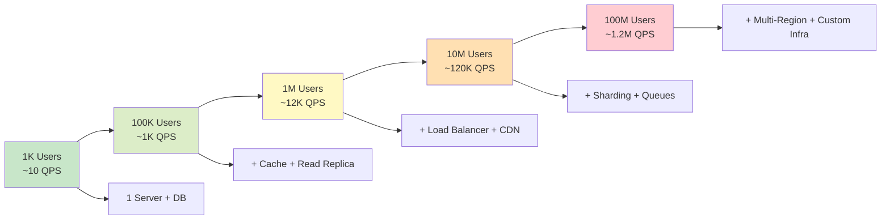

---

### 3.7 Vertical vs Horizontal Scaling

When your system needs more capacity, you have two fundamental options: make one machine bigger (vertical), or add more machines (horizontal). Understanding the limits of each is essential for Staff-level design.

**Vertical Scaling (Scale Up)**

You replace the current server with a more powerful one: more CPU cores, more RAM, faster SSD, faster network card.

| Advantage | Limitation |
|-----------|-----------|
| No code changes needed | There is a ceiling — the biggest cloud instance has fixed limits |
| No distributed systems complexity | Single point of failure — the big machine goes down, everything goes down |
| Transactions work naturally | Expensive — the cost per unit of capacity increases at the high end |
| Easy to reason about | Deployment downtime unless you have live migration |

**When it works**: For databases, vertical scaling is often the first and second move. A PostgreSQL instance going from 8 to 32 to 128 GB RAM is a vertical scaling journey that can handle many startups' entire growth.

**When it breaks down**: You hit the limit of available instance sizes. Or you cannot afford single points of failure at that scale. Or you need independent scaling of different components.

**Horizontal Scaling (Scale Out)**

You add more machines of the same size and distribute the work across them.

| Advantage | Limitation |
|-----------|-----------|
| Theoretically unlimited scale | Requires distributed systems knowledge |
| No single point of failure (with redundancy) | State is hard: how do you share session, cache, DB writes? |
| Can scale individual components independently | Adds coordination overhead (service discovery, load balancing) |
| Cost-efficient (use commodity hardware) | Debugging is harder across many machines |

**When it works best**: Stateless services (API servers that read from DB) scale horizontally almost trivially. Add more servers behind a load balancer and you are done.

**When it is painful**: Databases with writes are hard to scale horizontally because of consistency requirements. Every machine writing to every other machine's data requires coordination. This is why databases remained vertically scaled long after application servers went horizontal.

**The hybrid reality**: In production systems at scale, both are used. Application servers: horizontal scaling behind a load balancer. Databases: vertically scaled until it hurts, then horizontally scaled via sharding.

---

### 3.8 What Breaks at Different Scales — Detailed Table

| Scale | QPS Range | Component Under Stress | Why It Breaks | Typical Solution |
|-------|-----------|------------------------|---------------|-----------------|
| **Tiny (1–100 users)** | < 1 QPS | Nothing yet | Nothing breaks; enjoy it | Monolith with single DB |
| **Small (100–10K users)** | 1–100 QPS | Nothing major | Occasional slow queries | Add basic indexes, query optimization |
| **Medium (10K–100K users)** | 100–1K QPS | Database connection pool | Too many concurrent connections (default PG max: 100) | Connection pooler (PgBouncer), read replica |
| **Growing (100K–1M users)** | 1K–10K QPS | Database read capacity | Every page load hits DB; read latency grows | Redis cache layer, CDN for static assets |
| **Large (1M–10M users)** | 10K–100K QPS | Single DB write node | All writes serialize through one machine | Read replicas absorb reads; consider sharding |
| **Very Large (10M–100M users)** | 100K–1M QPS | Network I/O, DB shard count | Data volume and QPS exceed what sharding handles simply | Multi-region, eventual consistency, NoSQL for some data |
| **Hyperscale (100M+ users)** | 1M+ QPS | Everything: network, storage, compute | Custom hardware territory; commodity solutions break | Custom infrastructure, distributed tracing, chaos engineering |

**The inflection points in practice:**

At ~100K users you start feeling the database. Your DBA (or you) starts talking about indexes, query plans, and connection limits. This is normal.

At ~1M users you feel the need for caching. Without a cache, every user page load is a database query. With 12,000 QPS hitting your DB, queries start queuing up and latency spikes. Redis changes everything here.

At ~10M users the architecture has to be designed deliberately. You are adding components — message queues, dedicated caches, CDNs, multiple database replicas — not because it is fun, but because without them the system falls over.

---

### 3.9 Geographic Scale — Single Region vs Multi-Region

| Scope | Typical Latency Within | Engineering Complexity | When to Use |
|-------|------------------------|------------------------|-------------|
| **Single datacenter (1 AZ)** | < 0.5 ms | Very low | Development, small startups |
| **Single region (multiple AZs)** | 1–5 ms | Low | Most products at startup/growth stage |
| **Multi-region (same continent)** | 20–50 ms | Medium | Broader national or continental user base |
| **Multi-region (global)** | 50–300 ms depending on pair | High | Global products, data residency requirements |

**The case for staying single-region:**

Multi-region introduces a cascade of hard problems:
- Replication lag: Data written in US-East may not be visible in EU-West for 50–150 ms. During that window, users in EU see stale data.
- Conflict resolution: If a user updates their profile in US-East and EU-West simultaneously, which write wins?
- Data residency (GDPR): EU user data must stay in EU. This requires region-aware routing and partitioning.
- Cost: Running two (or more) full stacks doubles infrastructure cost.

The rule: go multi-region when your users or your business require it, not before. Design your schema to support it (partition keys that allow regional sharding), so the migration is possible when needed.

---

### 3.10 Latency Numbers — The Jeff Dean List

Jeff Dean, one of Google's most prominent engineers, published a set of approximate latency numbers that became canonical in the industry. These are approximate and hardware-dependent, but the *ratios* are what matter:

| Operation | Latency | Notes |
|-----------|---------|-------|
| L1 cache reference | 0.5 ns | Same CPU core; fastest possible access |
| L2 cache reference | 7 ns | Shared on-chip cache; 14× slower than L1 |
| Main memory (RAM) access | 100 ns | Off-chip; 200× slower than L1 |
| Compress 1 KB with Snappy | 3 μs (3,000 ns) | CPU-bound |
| Read 1 MB sequentially from RAM | 9 μs | Sequential access is fast |
| SSD random read (4 KB) | 16 μs (16,000 ns) | Much faster than HDD; still 32,000× slower than L1 |
| Read 1 MB sequentially from SSD | 49 μs | Fast sequential I/O |
| Round trip within same datacenter | 0.5 ms (500,000 ns) | Network in same AZ |
| HDD seek (random) | 2 ms (2,000,000 ns) | Mechanical head movement; 4,000,000× slower than L1 |
| Read 1 MB sequentially from HDD | 6 ms | Fast sequential even on HDD |
| Round trip US coast to coast | 40 ms | Physical speed-of-light constraint |
| Packet: US → Europe → US | 150 ms | Cross-Atlantic round trip |
| Packet: US → Australia → US | 300 ms | Cross-Pacific round trip |

**The key insight from this table:** There are three dramatic gaps:

1. RAM vs SSD: **~1,000× slower** (100 ns vs 16 μs → 160× actually, but for sustained I/O the gap is larger)
2. SSD vs HDD: **~125× slower** for random reads (16 μs vs 2 ms)
3. Local vs cross-continental network: **200,000× slower** than RAM (100 ns vs 150 ms)

**Practical design rule:** Every layer you move down in storage hierarchy costs you 100–10,000×. Design to keep hot data in RAM. Every database hit that could be a cache hit is hundreds of microseconds wasted. Every cross-region call that could be local is 100 ms wasted.

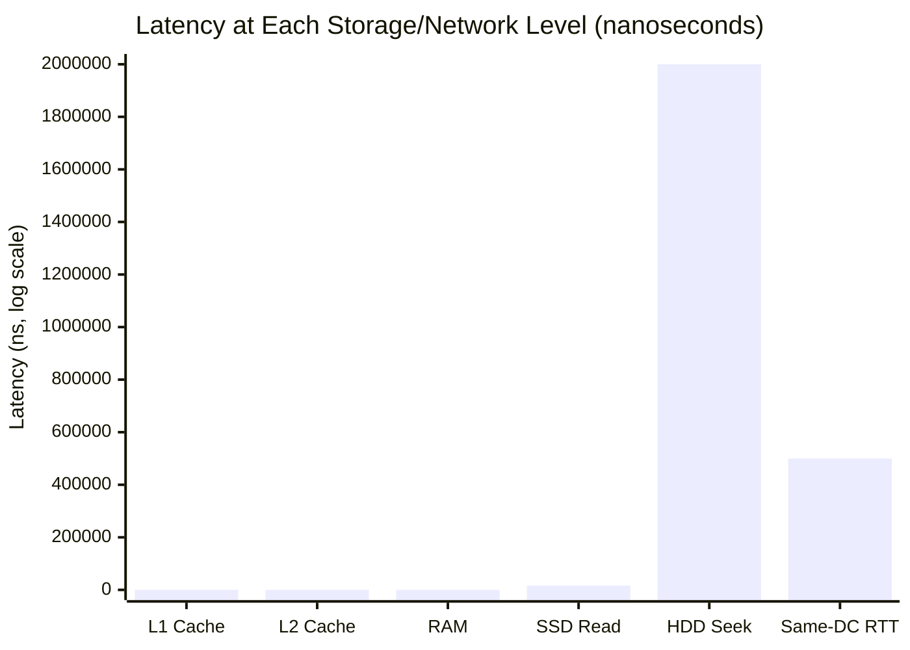

---

### 3.11 The Human Scale Comparison — If L1 Were 1 Second

Numbers like "0.5 ns" and "2 ms" are impossible to feel intuitively. Here is a scale comparison that makes the gaps visceral:

**Assume L1 cache access takes 1 second. Everything else scales proportionally:**

| Operation | Latency | Human-Scale Equivalent |
|-----------|---------|------------------------|
| L1 cache reference | 0.5 ns → 1 second | You blink |
| L2 cache reference | 7 ns → 14 seconds | You stretch and sit back down |
| Main memory (RAM) | 100 ns → 3.3 minutes | You make a cup of coffee |
| SSD random read | 16 μs → 9 hours | A full work day |
| HDD seek | 2 ms → **46 days** | Almost two months of waiting |
| Same-datacenter RTT | 0.5 ms → **11.5 days** | One and a half weeks |
| Cross-US round trip | 40 ms → **2.6 years** | Graduate school |
| Cross-Atlantic round trip | 150 ms → **9.5 years** | A child's entire elementary school career |

**What this makes viscerally clear:**

When your application code does a database query on a spinning hard drive (HDD), you are — in human terms — waiting 46 days for a response. When your microservice makes a synchronous call to a partner service in another region, you wait nearly 10 years.

This is why:
- Hot data belongs in RAM (Redis, in-process cache)
- SSDs replaced HDDs for database storage
- Services should be co-located in the same region when they need to communicate frequently
- Avoiding unnecessary network hops is not premature optimization — it is basic design hygiene

---

### 3.12 p50 vs p99 — Why Averages Lie and Tail Latency Kills User Experience

**The problem with averages:**

Suppose your API has the following latency distribution across 1,000 requests:
- 990 requests complete in 20 ms
- 9 requests complete in 200 ms
- 1 request completes in 5,000 ms (5 seconds)

Average latency: (990 × 20) + (9 × 200) + (1 × 5000) / 1000 = (19,800 + 1,800 + 5,000) / 1000 = 26.6 ms

The average looks great: 26.6 ms. But 1 in 100 users (1%) experienced 200+ ms. 1 in 1,000 experienced 5 full seconds.

At 10,000 QPS, "1 in 1,000" means 10 users per second hitting 5-second latency. Per minute: 600 users. Per hour: 36,000 users. That is a serious user experience problem hiding behind a 26.6 ms average.

**Percentile metrics:**

| Metric | Meaning | When to Use |
|--------|---------|------------|
| **p50 (median)** | 50% of requests are faster | Typical experience; what most users feel |
| **p75** | 75% of requests are faster | Starting to see slower requests |
| **p90** | 90% of requests are faster | Near-tail; where users start noticing |
| **p95** | 95% of requests are faster | Covers most user experiences |
| **p99** | 99% of requests are faster | The "worst 1%"; at scale, millions of users |
| **p99.9** | 99.9% of requests are faster | Very rare but extreme cases |
| **p100 (max)** | All requests are faster | A single worst-case event; often not meaningful |

**Why L6 engineers care about p99, not p50:**

At 100,000 QPS, the "worst 1%" (p99 violations) means 1,000 users per second are experiencing worse than your p99. Over one minute, that is 60,000 users. Even your "worst 0.1%" (p99.9 violations) means 100 users per second.

SLOs are almost always defined at p95 or p99. "Our SLO is that 99% of requests complete within 200 ms" means you track p99 latency and alert when it exceeds 200 ms.

**Worked Example: SLO at scale**

- System: 50,000 QPS
- SLO: p99 latency ≤ 150 ms
- Current p99: 180 ms (SLO violated)
- Users experiencing > 150 ms: 50,000 × 1% = 500 users/second = 30,000 users/minute

That 500 users/second is not a rounding error — it is 1.8 million users per hour experiencing unacceptably slow responses. This is why p99 gets dashboarded, alerted, and treated as a first-class metric.

---

### 3.13 Tail Latency Amplification — The Hidden Multiplier

**The problem:** Every time you add a service-to-service call, the tail of your overall latency distribution gets worse — even if each individual service looks healthy.

**Why it happens:** If you need responses from N services, the overall latency is bounded by the *slowest* response. And the more services you call, the higher the chance that at least one is in its slow tail.

**The math for parallel calls:**

Suppose Service A calls B, C, and D in parallel and waits for all three. Each service has p99 of 100 ms. What is the p99 of the combined operation?

For the combined operation to complete in ≤ 100 ms, all three services must complete in ≤ 100 ms.

- P(B completes ≤ 100 ms) = 0.99
- P(C completes ≤ 100 ms) = 0.99
- P(D completes ≤ 100 ms) = 0.99
- P(all three ≤ 100 ms) = 0.99 × 0.99 × 0.99 = 0.970

So 3% of requests — not 1% — will exceed 100 ms. The p97 of the combined call is approximately 100 ms, but the p99 is higher. With correlated slowdowns (e.g., all three services share a database that goes slow), the amplification is even worse.

**The math for sequential calls:**

If Service A calls B → C → D in sequence, latencies add:
- p50(total) ≈ p50(B) + p50(C) + p50(D)
- p99(total) ≈ p99(B) + p99(C) + p99(D) (rough approximation)

With 3 services each having p99 = 100 ms: p99(total) ≈ 300 ms. If each has p99 = 50 ms, combined p99 ≈ 150 ms. This is why deep call chains destroy latency budgets.

**Real-world tail latency numbers from production:**

In large distributed systems at companies like Google and Amazon, it is common for:
- p50: 5 ms
- p99: 100 ms (20× worse than p50)
- p99.9: 500 ms (100× worse than p50)

The ratio of p99 to p50 grows wider as systems become more complex. Tail latency is a fundamental property of distributed systems, not a bug to be fixed — it must be designed around.

**Mitigation strategies:**

1. **Hedged requests**: Send the same request to two replicas; use the first response that arrives. Cancel the other. This cuts tail latency at the cost of doubling requests.
2. **Timeout budgets**: Each downstream call gets a strict timeout. If it exceeds the budget, fail fast and return a degraded response rather than waiting.
3. **Circuit breakers**: If a downstream service is returning slow responses, stop calling it for a period and return a cached or default value.
4. **Reduce fan-out**: Fewer downstream calls = less amplification. Batch calls where possible.

---

### 3.14 Latency Budgets — Allocating the 200 ms

**What is a latency budget?**

A latency budget is the total latency allowance for a user-visible operation, distributed across each step in the call chain. If your SLO says "p99 ≤ 200 ms," you must ensure that the sum of all sequential steps in the critical path fits within 200 ms at p99.

**Typical breakdown of a 200 ms p99 budget:**

```
┌──────────────────────────────────────────────────────────────────────┐
│              TYPICAL 200 ms p99 LATENCY BUDGET BREAKDOWN              │
├────────────────────────────────────┬─────────────────────────────────┤
│ Component                          │ Allocated Time                   │
├────────────────────────────────────┼─────────────────────────────────┤
│ DNS resolution                     │ 0–20 ms (often 0 if cached)     │
│ TCP connection + TLS handshake     │ 30–80 ms (1–2 RTTs)             │
│ Load balancer processing           │ 1–2 ms                          │
│ API gateway (auth, rate limiting)  │ 5–10 ms                         │
│ Application server logic           │ 20–50 ms                        │
│ Cache lookup (Redis)               │ 1–5 ms                          │
│ Database query                     │ 10–50 ms                        │
│ Serialization + response send      │ 5–10 ms                         │
├────────────────────────────────────┼─────────────────────────────────┤
│ Total (approximate)                │ 72–227 ms                       │
└──────────────────────────────────────────────────────────────────────┘
```

**How to use latency budgets:**

1. Define the SLO: "p99 ≤ 200 ms for the product page API"
2. Map the critical path: DNS → TCP/TLS → LB → API gateway → app server → cache + DB → response
3. Allocate a budget to each step
4. Instrument each step (distributed tracing with Jaeger, Zipkin, or Cloud Trace)
5. Alert when any step exceeds its budget
6. When p99 degrades, the trace tells you which step consumed the budget

**The most common budget-buster:** An un-cached database query that is supposed to take 10 ms but sometimes takes 200 ms under load (connection pool exhaustion, lock contention, cold page cache). One such query blows the entire budget.

---

### 3.15 Latency vs Throughput — Four Quadrant Analysis

Latency and throughput are different metrics and can be optimized independently. Understanding the four quadrants helps you choose the right architecture:

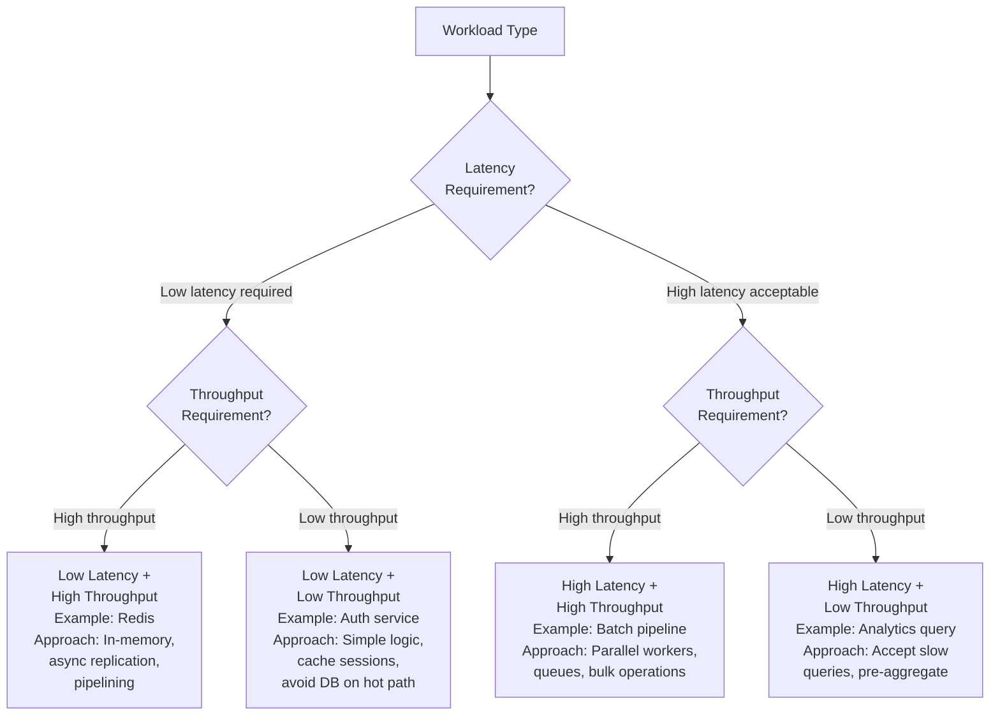

**When you optimize, know your quadrant:**
- User-facing APIs: target low latency (p99 budget matters)
- Background jobs / ETL: target throughput (how much data processed per hour)
- Reporting dashboards: can often accept higher latency (5–10 seconds) if throughput is high enough to refresh frequently

---

### 3.16 Queuing and Little's Law

**Little's Law**: A fundamental result from queuing theory:

```
L = λ × W
```

Where:
- L = average number of requests in the system (in queue + being processed)
- λ (lambda) = arrival rate (requests per second = QPS)
- W = average time spent in system (latency)

**Example:** Your service processes requests at an average latency of 20 ms and receives 500 QPS:
- L = 500 × 0.020 = 10 requests in-flight on average
- If your server has 10 concurrent request slots (threads/goroutines), it is exactly at capacity.

**When QPS exceeds capacity:**

If the system can handle 500 QPS at 20 ms each, that implies 10 concurrent slots. When QPS rises to 600:
- The queue starts building: 100 requests/second more arriving than being processed
- Queue depth grows linearly over time
- Each additional queued request adds its wait time to all subsequent requests
- Latency starts rising, which means more requests are in-flight at any given moment, which means the queue grows faster — a vicious cycle

**The key insight:** Latency under overload is not linear — it can explode exponentially once the queue starts filling. This is why systems need capacity headroom (typical: run at 50–70% utilization under normal load) and load shedding (reject requests at the edge once a threshold is exceeded).

---

## 4. Mental Models

---

### 4.1 The "Show Your Work" Model

The single most important habit in a system design interview is to show your arithmetic. Do not just announce a conclusion — narrate the derivation.

**Template:**

```
"I'll assume [assumption]. That gives us [intermediate number]. 
Multiplying by [factor], we get [next number]. 
Dividing by 86,400, that's [QPS]. 
Peak is typically 4× average, so [peak QPS]. 
At [per-server capacity] QPS per server, we need [server count] servers.
With redundancy, that's [final number]."
```

**This template works for every estimation.** The numbers change, the template does not. Interviewers want to see the reasoning, not just the answer.

### 4.2 Order-of-Magnitude First, Then Precision

Start by establishing the order of magnitude:
- "Is this 100 QPS or 100K QPS?" — does the answer fit on one server or require a cluster?
- "Is this 1 GB or 1 TB?" — does this fit in RAM or does it require a distributed store?

Once the order of magnitude is right, then refine. Getting the order of magnitude wrong early leads to architectures that are wrong by 1,000×. Precision within the right order of magnitude is a rounding error.

### 4.3 The Scaling Staircase

Think of scale as a staircase, not a slope. Systems are stable at a given rung, then hit a threshold that requires a step-function change in architecture:

- Rung 1: One server. Works until ~1K QPS.
- Rung 2: Add cache + read replica. Works until ~10K QPS.
- Rung 3: Add load balancer + multiple app servers + CDN. Works until ~100K QPS.
- Rung 4: Shard the database + add queues. Works until ~1M QPS.
- Rung 5: Multi-region + distributed storage. Works until ~10M QPS.

Each rung costs time, money, and engineering effort to climb. Good architecture designs to the next rung, not just the current one. Staff Engineers say: "We are currently on Rung 2. At our growth rate, we will hit Rung 3 in 18 months. We should design the database schema now to support sharding so the migration is feasible."

### 4.4 The 86,400 Constant

Memorize this: there are **86,400 seconds in one day**.

```
24 hours × 60 minutes × 60 seconds = 86,400 seconds
```

Every "daily" figure in system design needs to be divided by 86,400 to get QPS. A trick for mental math:

- "Daily volume ÷ 86,400" ≈ "Daily volume ÷ 100,000" (round 86,400 up to 100,000)
- This gives a conservative (slightly low) estimate, which is fine for approximation

**Example:**
- 1 billion requests per day ÷ 86,400 = 11,574 QPS (exact)
- 1 billion ÷ 100,000 = 10,000 QPS (approximation — off by 16%, completely fine)

---

## 5. Real-World Examples

---

### 5.1 Twitter: QPS for Tweet Reads and Writes

**Given:** 400M MAU. Assume 25% of MAU are DAU → 100M DAU.

**Writes (Tweets posted):**
- Each user posts 3 tweets/day on average
- Daily volume: 100M × 3 = 300M tweets/day
- Average QPS: 300M ÷ 86,400 = 3,472 QPS
- Peak QPS (4×): 3,472 × 4 = **13,889 QPS ≈ 14K write QPS**

**Reads (Tweet views):**
- Each user reads approximately 80 tweets/day (scrolling the feed)
- Daily volume: 100M × 80 = 8B reads/day
- Average QPS: 8B ÷ 86,400 = 92,593 QPS
- Peak QPS (4×): 92,593 × 4 = **370,370 QPS ≈ 370K read QPS**

**Read:write ratio:** 370K ÷ 14K ≈ **26:1**

**What 370K read QPS implies architecturally:**
- A single PostgreSQL instance can handle ~5K–50K read QPS for typical queries. At 370K QPS, you need a cache.
- Redis can handle 100K–500K ops/second per node. You need a Redis cluster (multiple nodes) to handle 370K QPS.
- With 90% cache hit rate: 37K QPS miss to DB. DB sees manageable load with read replicas.

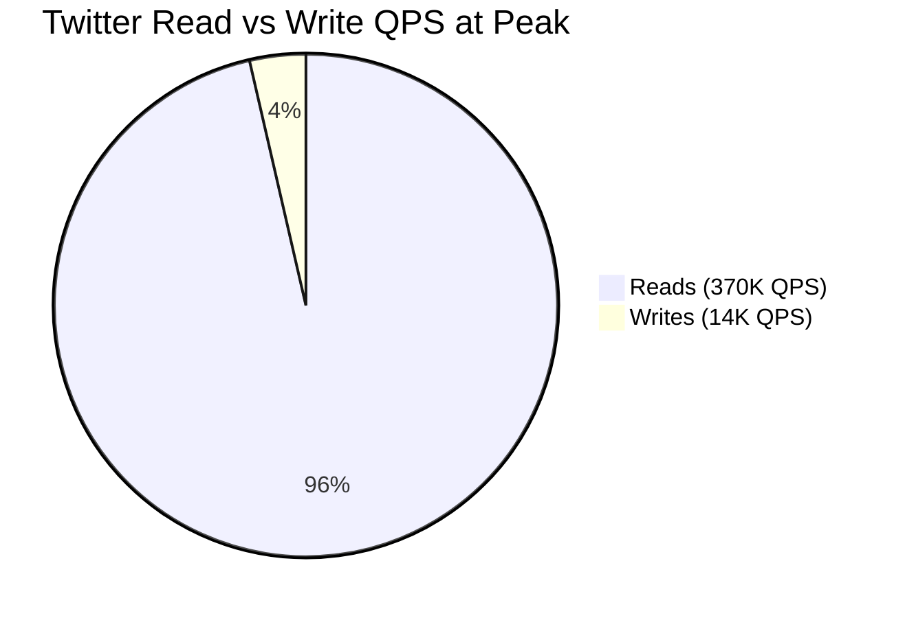

**Storage for tweet archive:**
- 300M tweets/day × 400 bytes/tweet = 120 GB/day
- Per year: 120 GB × 365 = **43.8 TB/year**
- 5-year archive: ~219 TB → requires sharded database or distributed object storage

---

### 5.2 YouTube: Storage for Video Uploads

**Given:** 500M DAU. 1% of DAU upload videos daily = 5M uploads/day.

**Video size calculation:**
- Average video: 10 minutes of content
- Bitrate at original quality: 5 Mbps (high quality smartphone recording)
- Size: 10 min × 60 sec/min × 5 Mbps × (1/8) bytes/bit = 10 × 60 × 5/8 MB = 375 MB per video

**Transcoding multiplier:**
- YouTube transcodes to multiple resolutions: 4K, 1080p, 720p, 480p, 360p, 240p
- Each resolution is roughly proportional to pixel count; total storage for all resolutions ≈ 2–3× the original
- Assume 2.5× factor: 375 MB × 2.5 = **937.5 MB ≈ 1 GB per video**

**Annual storage:**
- 5M uploads/day × 1 GB/upload = 5 PB/day
- Per year: 5 PB × 365 = **1,825 PB = 1.825 EB/year**

**Reality check:** This is clearly enormous. YouTube manages this with:
- Tiered storage: recently uploaded videos on hot SSDs; older/rarely watched videos on cheaper HDDs or tape
- Compression advances: H.265/HEVC cuts size by ~40–50% vs H.264
- Deduplication: many uploads are duplicates of existing content
- Lifecycle policies: move videos with < 10 views/month to cold storage

**Serving bandwidth:**
- 5B video plays/day (estimated)
- Average watch: 10 minutes at 2 Mbps (1080p compressed streaming)
- Daily data served: 5B × 10 min × 60 sec × 2 Mbps / 8 bytes = 75 × 10^15 bytes = 75 PB/day
- Average bandwidth: 75 PB ÷ 86,400 seconds = **868 GB/s = 6.9 Tbps**

This is why YouTube runs one of the world's largest CDNs (Google's own global network). Without edge caching, 6.9 Tbps from origin servers would be impossible and prohibitively expensive.

---

### 5.3 WhatsApp: Message Throughput

**Given:** 2B MAU. 50% DAU = 1B DAU. 50 messages sent per user per day.

**Message volume:**
- Write QPS: 1B × 50 = 50B messages/day ÷ 86,400 = **578,703 messages/second average**
- Peak (5× because evenings are very concentrated): 578,703 × 5 = **2.9M messages/second**

**Fan-out (delivery operations):**
- Average group/conversation size: 2.5 recipients per message (mix of 1:1 and group chats)
- Delivery operations: 2.9M × 2.5 = **7.25M delivery operations/second at peak**

**What 7.25M delivery operations/second means:**
- This is the throughput requirement for the delivery layer, not just the write layer
- Each delivery operation: look up recipient's device list → push notification or hold for connection
- At this scale, you need: distributed message queues (Kafka), many worker pools, WebSocket connection servers, and aggressive sharding of user routing tables

**Storage (1 year, text messages only):**
- 50B messages/day × 365 = 18.25T messages/year
- At 100 bytes/message: 18.25T × 100 = 1.825 PB/year
- WhatsApp stores messages on device (end-to-end encryption), so server-side metadata only — much less
- Server-side metadata per message: ~50 bytes → ~912 TB/year

**Connection management:**
- 1B DAU, assume 10% concurrent at peak = 100M simultaneous connections
- Each WebSocket connection requires a file descriptor and ~10 KB of kernel memory
- 100M connections × 10 KB = 1 TB of RAM just for connection state → requires thousands of servers dedicated to connection management

This is why WhatsApp famously scaled to 1 million concurrent connections per server in 2012 using Erlang/OTP — the efficiency of connection handling was an engineering achievement in itself.

---

### 5.4 Google Search: Query Throughput

**Given:** 5B searches/day globally (public estimate).

**QPS:**
- Average: 5B ÷ 86,400 = **57,870 QPS**
- Peak (2× because Google's traffic is more geographically spread than single-product apps): 57,870 × 2 = **115,740 QPS ≈ 116K QPS**

**Per-query internal fan-out:**
- Query parsing and spell correction: 1 internal call
- Query understanding (entity recognition, intent classification): 1–2 calls
- Distributed index lookup: 1 query → potentially hundreds of index shard reads (Google's index has thousands of shards)
- Ranking: 1 call with hundreds of index results as input
- Ads lookup: parallel to ranking
- Snippet generation: per-result post-processing
- Approximate total internal operations per query: 50–100+

**Total internal QPS:** 116K × 75 (median fan-out) = **8.7M internal operations/second at peak**

**Caching impact:** Many queries are repeated. "Weather in New York" is searched millions of times per day. Cache hit rates on common queries are very high (>80%), meaning the search index only processes truly unique or rarely-searched queries on the critical path. This dramatically reduces effective load on the index layer.

---

### 5.5 Uber: Ride Request QPS and Driver Location Updates

**Ride requests:**
- 130M MAU, 20% DAU = 26M DAU
- Each user takes 0.5 rides/day on average
- Daily ride requests: 26M × 0.5 = 13M/day
- Average QPS: 13M ÷ 86,400 = **150 QPS**
- Peak (3× — rush hour): 150 × 3 = **450 QPS**

**Key insight:** 450 ride request QPS is tiny. This is not where the scale challenge is.

**Driver location updates (the real scale challenge):**
- Active drivers at peak: ~1M worldwide
- Each driver sends GPS update every 4–5 seconds
- Location updates per second: 1M ÷ 5 = **200,000 location updates/second**

200,000 location updates/second dwarfs the 450 ride requests/second by 440×. The hard systems problem at Uber is not handling ride requests — it is maintaining real-time geospatial state for 1 million moving vehicles.

**Storage for location history:**
- 200,000 updates/sec × 50 bytes/update (lat, lng, timestamp, driver_id) = 10 MB/sec
- Per day: 10 MB × 86,400 = 864 GB/day of raw GPS data
- With 2× replication: 1.7 TB/day

**Architecture implications from the numbers:**
- Ride requests (450 QPS): Simple REST API, stateless app servers, standard DB
- Driver location (200K updates/sec): Requires specialized geospatial indexing, in-memory grid cells (H3, S2), Redis for real-time state, stream processing for ETA recalculation

The lesson: always find the actual bottleneck by estimating *all* the workloads, not just the primary user action.

---

### 5.6 Trending Hashtags — An In-Depth Sizing Example

**Requirement:** Show trending hashtags on a social app, updated every 5 minutes. 50M DAU, global.

**Step 1 — Define the computation:**
- Input: all posts in the last 1 hour, scan hashtag occurrences, count per hashtag, sort by count, emit top 100
- Frequency: once every 5 minutes → 12 jobs/hour

**Step 2 — Input volume:**
- 1% of DAU posts each hour: 50M × 1% = 500,000 posts/hour
- Each post: ~200 bytes of metadata + hashtag list
- Input data per job: ~100 MB (500K posts × 200 bytes)

**Step 3 — Output volume:**
- Top 100 hashtags + counts: 100 × (20 bytes hashtag + 8 bytes count) ≈ 2.8 KB per output
- Per region (5 regions): 5 × 2.8 KB = 14 KB every 5 minutes → trivial

**Step 4 — Read path (serving trending):**
- At any 5-minute window, assume 30% of DAU are active: 50M × 30% = 15M users
- Each active user checks trending: 15M requests / 300 seconds = **50,000 read QPS**
- These are reads for a single small key ("trending:global" or "trending:us")
- Redis handles 100K–500K simple GET operations per second per node
- **Conclusion:** One Redis node (with replica for HA) handles 50K read QPS easily

**Step 5 — Write path:**
- One batch job every 5 minutes writes 14 KB
- DB: trivial write volume
- Redis SET: one operation per job run per key

**Step 6 — Availability:**
- Is trending critical path? If the trending service is down, the app still works (users see empty trending section)
- Acceptable: best-effort 99.9%, no multi-region needed for the compute job
- Add 5-minute TTL on the Redis key: if the job fails, the cache expires and the UI shows "trending unavailable" rather than stale data

**Takeaway:** Starting from "50M DAU" and "5-minute updates," we derived a read QPS of 50K, determined one Redis node is sufficient, and reasoned about availability in under 5 minutes. That is the chain of thinking a Staff Engineer demonstrates.

---

## 6. Design Trade-offs

---

### 6.1 Over-Provisioning vs Under-Provisioning

Every capacity decision involves a trade-off between having too much capacity and too little.

| Scenario | Risk | Cost |
|----------|------|------|
| **Under-provisioned** | System falls over under load. p99 latency spikes. Users experience slowness or errors. Incidents. | Low infrastructure cost; high incident/reputation cost |
| **Right-provisioned** | System handles expected load with headroom for spikes. | Moderate cost |
| **Over-provisioned** | Wasteful; paying for unused capacity. Money that could go to features or engineering. | High infrastructure cost; no incident risk |

**The Staff Engineer perspective:** At most companies, the cost of an outage (lost revenue, user trust, engineering time spent on incident response) far exceeds the cost of 50–100% over-provisioning. The right answer depends on:
- How peak-sensitive is the traffic? (Social apps: high. Enterprise SaaS: lower)
- What does the architecture support? (Auto-scaling can move toward right-provisioning)
- What is the cost of downtime? (Payment processing: very high. Internal analytics dashboard: lower)

**Practical rule:** Design for 2× expected peak. Use auto-scaling to right-size for valleys. Keep 50% headroom above sustained peak for burst absorption.

### 6.2 Availability vs Cost

Getting from 99.9% to 99.99% availability is not twice as hard — it is 10× harder and typically costs 5–10× more infrastructure.

| Availability Target | What It Requires | Approximate Cost Multiplier |
|--------------------|-----------------|----------------------------|
| 99% | Basic setup, single-AZ | 1× |
| 99.9% | Multi-AZ deployment, health checks, runbooks | 2–3× |
| 99.99% | Multi-region active-active, auto-failover, chaos testing, 24/7 oncall | 5–10× |
| 99.999% | Custom hardware, custom software, full-time reliability team, zero-downtime deployments for everything | 20–50× |

**The error budget framework** makes this a business conversation rather than a purely technical one:
- 99.9% error budget = 8.76 hours/year of acceptable downtime
- If the business cannot tolerate even 1 hour of downtime per year, the SLA should be 99.999% — but the business must fund the infrastructure and engineering effort that requires

---

### 6.3 The "Nines" Availability Table

| Availability | Downtime per Year | Downtime per Month | Downtime per Week | Downtime per Day |
|-------------|-------------------|--------------------|-------------------|------------------|
| 90% (one nine) | 36.5 days | 73 hours | 16.8 hours | 2.4 hours |
| 99% (two nines) | 3.65 days | 7.3 hours | 1.68 hours | 14.4 minutes |
| 99.5% | 1.83 days | 3.65 hours | 50.4 minutes | 7.2 minutes |
| 99.9% (three nines) | 8.76 hours | 43.8 minutes | 10.1 minutes | 1.44 minutes |
| 99.95% | 4.38 hours | 21.9 minutes | 5 minutes | 43.2 seconds |
| 99.99% (four nines) | 52.6 minutes | 4.38 minutes | 1.01 minutes | 8.64 seconds |
| 99.999% (five nines) | 5.26 minutes | 26.3 seconds | 6.05 seconds | 0.864 seconds |

**Insight:** The jump from 99.9% to 99.99% represents going from 8.76 hours of downtime per year to 52.6 minutes — a reduction of 10×. But the engineering and operational effort does not scale linearly. It requires:
- Moving from multi-AZ to multi-region
- Implementing automated failover (not manual)
- Zero-downtime deployments for every release
- 24/7 on-call rotation with practiced runbooks
- Chaos engineering to prove failover works

Most product companies target 99.9%–99.95% for user-facing services. Core infrastructure (auth, payments) may target 99.99%.

---

### 6.4 Composite Availability for Serial Dependencies

**The fundamental problem with microservices:**

When a user request must pass through multiple services, and each service has its own availability, the combined availability is the *product* of all individual availabilities:

```
A_total = A₁ × A₂ × A₃ × ... × Aₙ
```

**Worked Example 1 — Checkout flow:**

A user completes an e-commerce checkout. The request flows through:
1. API gateway: 99.9% available
2. Authentication service: 99.9%
3. Cart service: 99.9%
4. Inventory service: 99.95%
5. Payment service: 99.95%
6. Order service: 99.9%

Combined availability:
```
A_total = 0.999 × 0.999 × 0.999 × 0.9995 × 0.9995 × 0.999
A_total = 0.999³ × 0.9995²
A_total ≈ 0.997 × 0.999 = 0.996 ≈ 99.6%
```

Starting with six services at 99.9%–99.95%, you end up with 99.6% combined. That is 1.75 days of downtime per year for your checkout flow.

**Worked Example 2 — Deeper chain:**

A recommendation engine calls: user_service → item_service → ml_inference → ranking_service → feature_store (5 services in sequence, all 99.9%):

```
A_total = 0.999^5 = 0.995
```

99.5% — 1.83 days of downtime per year. Even though every individual service has three nines.

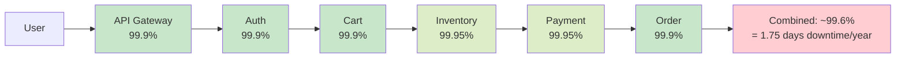

**The lesson:** Long service chains destroy availability. Solutions:
- Make optional dependencies non-blocking (fire and forget, with defaults)
- Eliminate unnecessary dependencies from the critical path
- Ensure each individual service is as highly available as possible
- Cache responses from dependencies so failures degrade gracefully rather than causing errors

---

### 6.5 Redundancy Increases Availability — The Parallel Formula

If you have two independent instances of a service, and the system works as long as at least one is available:

```
A_redundant = 1 - (1 - A)^n
```

Where n is the number of independent instances.

**Worked Example — Two servers:**
- Each server: 99.9% available (0.001 = 0.1% chance of failure)
- Combined: 1 - (0.001)² = 1 - 0.000001 = 99.9999%

**Worked Example — Three servers (N=3):**
- 1 - (0.001)³ = 1 - 0.000000001 = 99.9999999%

The math looks great — but there is a critical caveat:

**Independence assumption.** The formula assumes failures are completely independent. In practice:
- Same datacenter → shared power, networking, cooling. A datacenter failure takes all instances down simultaneously.
- Same software version → a bug in the code takes all instances down simultaneously.
- Same database backend → database failure takes all services down simultaneously.

True redundancy requires different failure domains: different availability zones, different regions, different code versions during rolling deployments.

**Worked Example — Multi-AZ deployment:**
- Us-east-1a: 99.95% (rare AZ failure)
- Us-east-1b: 99.95% (independent)
- System works if either is up: 1 - (0.0005)² = 1 - 0.00000025 ≈ 99.99997%

This is why "multi-AZ" is one of the first steps toward four nines.

---

### 6.6 Error Budgets — Availability as a Consumable Resource

**Concept:** Instead of treating "zero downtime" as a goal, treat your error budget (1 - SLO) as a resource to be managed.

For a 99.9% SLO:
- Annual error budget: 0.1% × 525,600 minutes = **525.6 minutes per year**
- Monthly budget: 525.6 ÷ 12 = **43.8 minutes per month**

**How engineering teams use error budgets:**

| Budget Remaining | Action |
|-----------------|--------|
| > 50% remaining | Normal operations; deploy freely; experiment |
| 25–50% remaining | Heightened awareness; prioritize reliability fixes |
| < 25% remaining | Slow down risky deployments; focus on reliability |
| 0% (budget exhausted) | Feature freeze; deploy only reliability improvements |

**Why error budgets change incentives:**

Without an error budget, "reliability" and "velocity" are in constant tension. With an error budget:
- The reliability team does not have to say "you can't deploy that"
- Instead: "We have 15 minutes of error budget left this month. Your deployment carries a risk of 30 minutes of downtime. We should wait until next month, or improve the deployment to be safer."
- This is a data-driven conversation, not a political one.

**Tracking error budget consumption:**

```
Week 1: Incident A — 12 min downtime. Budget remaining: 43.8 - 12 = 31.8 min
Week 2: Incident B — 8 min. Budget remaining: 31.8 - 8 = 23.8 min
Week 3: No incidents. Budget remaining: 23.8 min
Week 4: Incident C — 20 min. Budget remaining: 23.8 - 20 = 3.8 min
→ Action: freeze risky changes for rest of month
```

---

## 7. Common Interview Questions

---

### Question 1: Estimate QPS and storage for a social media platform with 200M DAU

**Setup assumptions (state these first):**
- 200M DAU
- Each user: 30 content views per day (read), 2 posts per day (write)
- Each post: 500 bytes
- Each view response: 2 KB
- Peak factor: 4×

**Step 1: Read QPS**
- Daily reads: 200M × 30 = 6B reads/day
- Average QPS: 6B ÷ 86,400 = **69,444 QPS ≈ 70K QPS**
- Peak QPS: 70K × 4 = **280K QPS**

**Step 2: Write QPS**
- Daily writes: 200M × 2 = 400M writes/day
- Average QPS: 400M ÷ 86,400 = **4,629 QPS ≈ 4.6K QPS**
- Peak QPS: 4.6K × 4 = **18.5K QPS**

**Step 3: Read:write ratio**
- 280K : 18.5K ≈ **15:1** (heavily read-dominated)
- Architecture implication: cache layer is essential; read replicas needed

**Step 4: Storage (1 year)**
- Posts per year: 400M posts/day × 365 = 146B posts/year
- Storage: 146B × 500 bytes = **73 TB/year**

**Step 5: Bandwidth**
- Read bandwidth: 70K QPS × 2 KB = **140 MB/s average**
- Peak read bandwidth: 280K × 2 KB = **560 MB/s**

**Architecture conclusions from numbers:**
- 280K read QPS → Redis cache cluster (multiple nodes, each handling 100K+ ops/sec)
- 18.5K write QPS → Primary DB with at least 2 write nodes or write sharding
- 73 TB/year posts → Distributed storage with sharding by user_id or post_id
- 560 MB/s peak bandwidth → CDN for static assets; multiple app servers with load balancer

---

### Question 2: How many servers do you need for the above platform?

**App servers (handling API logic):**
- A modern app server (stateless, Go or Java): ~10K–50K QPS
- Assume 20K QPS per server for this workload
- Peak load: 280K (reads) + 18.5K (writes) ≈ 300K QPS
- Servers for peak: 300K ÷ 20K = 15 servers
- With 2× redundancy: **30 app servers**

**Cache servers (Redis):**
- Redis: ~100K–200K ops/sec per node
- Cache reads: 95% of 280K = 266K QPS from cache
- Nodes needed: 266K ÷ 150K = 1.8 → 2 nodes
- With replication (1 primary + 1 replica per shard): **4 Redis nodes**

**Database servers:**
- Cache handles 95% of reads → DB sees: 5% × 280K = 14K read QPS
- Plus 18.5K write QPS
- Total DB QPS: ~32K
- A good Postgres instance: ~10K–20K QPS for typical queries
- DB nodes needed: 32K ÷ 15K = 2.1 → 3 nodes (1 primary for writes + 2 read replicas)

**Summary:**
```
30 app servers + 4 Redis nodes + 3 DB nodes (1 primary + 2 replicas)
+ 1 load balancer (for HA: 2 LBs)
= ~40 server-equivalents
```

---

### Question 3: Design a URL shortener for 100M users — estimate QPS, storage, and server count

**Assumptions:**
- 100M DAU
- Each user creates 5 short URLs/day (write)
- Each user clicks 20 short URLs/day (read)
- Short URL: 6 character code → base62 → 62^6 ≈ 56 billion possibilities
- URL record: 6 B (short code) + 100 B (long URL) + 20 B (metadata) ≈ 130 bytes

**Writes:**
- 100M × 5 = 500M short URLs created/day
- Write QPS: 500M ÷ 86,400 = **5,787 QPS avg**
- Peak write QPS: 5,787 × 4 = **23,148 ≈ 23K QPS**

**Reads (redirects):**
- 100M × 20 = 2B redirects/day
- Read QPS: 2B ÷ 86,400 = **23,148 QPS avg**
- Peak read QPS: 23,148 × 4 = **92,592 ≈ 93K QPS**

**Read:write ratio:** 93K : 23K ≈ **4:1**

**Storage (5 years):**
- 500M × 365 × 5 = 912.5B short URLs
- Storage: 912.5B × 130 bytes = **118.6 TB** over 5 years
- Per year: ~24 TB → DB sharding needed by year 3–4

**Servers:**
- Read: 93K QPS. Cache hit 90% → 9.3K DB reads. 2–3 DB read replicas.
- Write: 23K QPS. 3–5 DB write nodes.
- App servers: ~10K–20K QPS each → (93K + 23K) ÷ 15K ≈ 8 servers, round to 15–20 with headroom
- Redis for hot URL cache: 84K read QPS from cache → 1 Redis node (84K < 150K) plus replica

---

### Question 4: What does "four nines" availability actually require?

**The math:**
- 99.99% availability = 0.01% downtime per year
- 0.01% × 525,600 minutes = **52.6 minutes/year** of allowed downtime
- Per month: 52.6 ÷ 12 = **4.38 minutes/month**

**What achieving 52 minutes of annual downtime requires:**

1. **Multi-region deployment**: A single region has ~99.95% availability (hardware failures, network issues, datacenter events). To get to 99.99%, you need at least two independent regions with automatic failover.

2. **Zero-downtime deployments**: If each deployment takes 5 minutes of downtime, and you deploy twice a week, that is 5 × 2 × 52 = 520 minutes of planned downtime/year. You have blown your error budget in the first deployment. You need blue-green or canary deployments with no user-visible downtime.

3. **Automated failover in < 1 minute**: Manual failover takes 15–30 minutes minimum. Four nines requires automatic failover with full health checks, tested regularly through chaos engineering.

4. **On-call with < 5-minute response time**: If an incident takes 10 minutes to acknowledge and 20 minutes to mitigate, that single incident exhausts the monthly budget.

5. **Dependency management**: All critical dependencies must also be at 99.99% or you must have fallbacks. One 99.9% dependency in the critical path limits you to 99.9%.

**Cost estimate:** Achieving 99.99% for a medium-sized system typically requires:
- 2× infrastructure (two regions)
- 2× operational overhead (runbooks for two regions, chaos testing, more complex deployments)
- Dedicated reliability engineering team
- Roughly 5–10× the engineering effort compared to 99.9%

---

### Question 5: Estimate the storage needed for a chat system with 50M DAU

**Assumptions:**
- 50M DAU
- 40 messages sent per user per day (mix of 1:1 and group)
- Average message: 100 bytes (text-only; assume no media for this calc)
- Retention: 2 years
- 3 copies (primary + 2 replicas)

**Step 1: Message volume:**
- 50M × 40 = 2B messages/day
- Write QPS: 2B ÷ 86,400 = **23,148 QPS avg**
- Peak (5×): **115,740 QPS**

**Step 2: Storage per year:**
- 2B messages/day × 365 = 730B messages/year
- Storage: 730B × 100 bytes = **73 TB/year**

**Step 3: 2-year archive:**
- 73 TB × 2 = **146 TB** (before replication)
- With 3× replication: 146 × 3 = **438 TB**

**Step 4: Media messages (now add media):**
- Assume 15% of messages include photos (50 KB average)
- Photo messages: 2B/day × 15% = 300M/day × 50 KB = **15 TB/day** of media
- Per year: 15 TB × 365 = 5,475 TB = **5.5 PB/year** for media alone

**Observation:** Media storage dominates. Text metadata is negligible compared to photos. This is why WhatsApp chose end-to-end encryption with media stored locally (on device) — it avoids storing petabytes of media on servers.

---

### Question 6: How does tail latency amplification affect a microservices checkout flow?

**Setup:** Checkout makes 6 sequential service calls. Each service has p99 = 50 ms.

**Naive estimate:** p99(checkout) ≈ 6 × 50 ms = 300 ms

**Is 300 ms within a 500 ms SLO?** Yes — with 200 ms of headroom.

**But wait — at peak load, p99 rises:**
- Under load, database connection pools fill up. Queries that normally take 10 ms start taking 30–50 ms.
- P99 of each service rises to 100 ms.
- P99(checkout) = 6 × 100 ms = 600 ms → **SLO violated.**

**The cascading problem:**
- Checkout takes longer → more concurrent checkouts in-flight → more load on each service
- Each service's p99 rises further → checkout takes even longer → even more concurrent
- This is a feedback loop that can cause cascading failure.

**Mitigation in the design:**
- Timeout each service call at 80 ms (under your p99 target for that service)
- Circuit break if > 5% of calls timeout
- Parallelize calls that do not have data dependencies (e.g., inventory check and fraud check can run simultaneously)
- Pre-warm connection pools; use connection pooling at every layer
- Set a global checkout timeout of 3 seconds; return a clear error if exceeded rather than hanging

---

### Question 7: Estimate QPS for Uber driver location updates and explain why it dominates

Already covered in detail in Section 5.5. Summary:

- Ride requests: **450 QPS peak** — simple workload
- Driver location updates: **200,000 updates/second** — 440× larger

**Why this matters architecturally:**
- 450 QPS: single stateless API service handles this
- 200K/sec location writes: requires specialized in-memory geospatial store, time-series approach, write-optimized storage

This is a great example of the "estimation reveals the real problem" principle. You might naively focus on "matching riders and drivers" as the hard problem, but the numbers reveal that maintaining real-time state for 1M mobile devices is the infrastructure challenge.

---

### Question 8: Calculate the combined availability of a system with 5 serial dependencies at 99.9% each

```
A_total = 0.999^5
       = 0.999 × 0.999 × 0.999 × 0.999 × 0.999
       = 0.995 (exactly: 0.99500499...)
       ≈ 99.5%
```

**Downtime per year at 99.5%:**
- 0.5% × 525,600 minutes = 2,628 minutes = **43.8 hours/year**

**Compared to 99.9% target:**
- You started wanting 99.9% (8.76 hours/year)
- Five services at 99.9% each give you 99.5% (43.8 hours/year)
- You have 5× more downtime than you targeted

**To achieve 99.9% combined with 5 services:**
- Each service must be ≥ 0.999^(1/5) = 0.9998 = **99.98% individual availability**

This is why staff engineers think carefully about which service calls are on the critical path and which can be made asynchronous or optional.

---

### Question 9: How do you estimate the number of shards for a database?

**Context:** You have a database that is growing to 10 TB, and your target shard size is 100 GB.

**Number of shards:** 10 TB ÷ 100 GB = **100 shards**

**Why 100 GB per shard?** This is a rule of thumb for relational databases:
- Large enough to be efficient (fewer shards = simpler routing logic)
- Small enough to allow a full restore in a reasonable time (100 GB at 100 MB/s = ~17 minutes)
- Small enough that a shard migration (rebalancing) is fast

**Number of physical nodes:**
- Assume 3 shards per physical node (for reasonable I/O balance)
- Nodes: 100 ÷ 3 = 34 nodes for storage
- With 1 replica per shard (for HA): 34 × 2 = **68 nodes total**

**QPS implication:**
- 1M total read QPS with 100 shards: each shard handles ~10K read QPS on average
- With a good DB instance: 10K QPS is manageable
- Hot shards (uneven key distribution): might see 30–50K QPS. Need to plan for re-sharding hot shards.

---

### Question 10: Estimate the cost of the social media platform from Question 1

**Infrastructure components:**
- 30 app servers: $100/month each (4 vCPU, 16 GB) = $3,000/month
- 4 Redis nodes: $150/month each (8 GB cache) = $600/month
- 3 DB nodes: $400/month each (16 vCPU, 64 GB, NVMe SSD) = $1,200/month
- Load balancers: 2 × $25/month = $50/month
- CDN bandwidth: At 560 MB/s peak, assume average 200 MB/s sustained = 200 MB/s × 86,400 × 30 = 518 TB/month. CDN at $0.02/GB: 518,000 GB × $0.02 = $10,360/month
- Storage: 73 TB/year = 6 TB/month new storage. At $0.023/GB (S3): 6,000 × $0.023 = $138/month new + existing storage

**Rough total:** $3,000 + $600 + $1,200 + $50 + $10,360 + storage ≈ **$15,000–$20,000/month**

**CDN dominates.** At scale, bandwidth cost is often larger than compute cost. This is why CDN optimization, image compression, and serving smaller payloads matters — each KB saved × millions of requests = real money.

**At 10× scale (2B DAU equivalent):** Roughly $150K–200K/month. At this level, negotiating CDN contracts, building proprietary CDN infrastructure, and optimizing protocols (HTTP/3, Brotli compression) saves millions per year.

---

### Question 11: Walk through the QPS formula from first principles

**The question it answers:** "If I know how many users my system has and how often they use it, how many requests per second does that generate?"

**Step 1: What is a "daily active user" (DAU)?**
- A DAU is one unique user who performs at least one meaningful action in a 24-hour period
- For this formula, we care about DAU because traffic patterns reset roughly every 24 hours

**Step 2: What is an "action"?**
- One API request (or equivalent) from a client to the server
- Page load = multiple requests (HTML, JS, CSS, API calls)
- Count the meaningful backend operations, not browser page loads

**Step 3: Why 86,400?**
- 24 hours × 60 minutes × 60 seconds = 86,400 seconds per day
- This converts "requests per day" into "requests per second"

**Step 4: Why is this just an average?**
- The formula assumes requests are distributed uniformly across all 86,400 seconds
- Reality: traffic concentrates in daytime hours, with peaks during commute times, lunch, and evening
- The distribution looks like a bell curve, not a flat line

**Step 5: Why multiply by 3–5 for peak?**
- Traffic peaks are typically 3–5× the daily average
- For a 24-hour period with a bell-shaped distribution:
  - Average is computed across all hours including quiet nighttime hours
  - Peak hour might be 4–8× the overnight minimum
  - The "peak to average" ratio for many web products is 3–5×
- For event-driven systems (news event, celebrity tweet, flash sale), peak can be 10–100×
- The standard assumption of 4× is a safe starting point unless you have reason to believe otherwise

**Full derivation:**
```
Average QPS = DAU × actions_per_user_per_day ÷ 86,400 seconds/day
Peak QPS = Average QPS × peak_factor (default: 4)
```

**Example: 10M DAU, 20 actions per user per day:**
```
Average QPS = 10,000,000 × 20 ÷ 86,400
            = 200,000,000 ÷ 86,400
            = 2,314.8 QPS
            ≈ 2,315 QPS

Peak QPS = 2,315 × 4 = 9,260 QPS ≈ 9.3K QPS
```

---

### Question 12: Design the capacity for a real-time analytics dashboard ingesting 100K events/sec

**Given:**
- Write rate: 100,000 events/second (steady state)
- Each event: 200 bytes
- Query rate: 5,000 QPS (dashboard loads, user queries)
- Data retention: 90 days hot, 2 years warm, indefinite cold

**Step 1: Write throughput:**
- 100K events/sec × 200 bytes = **20 MB/sec ingestion rate**
- Per day: 20 MB × 86,400 = 1,728 GB = **1.73 TB/day**
- Per 90 days (hot tier): 1.73 × 90 = **155.7 TB**

**Step 2: Query requirements:**
- 5,000 QPS of analytical queries (aggregations, filters, time-series)
- These are expensive queries — assume each takes 50–200 ms
- Concurrency: 5,000 × 0.1 sec average = 500 concurrent queries in-flight
- This is OLAP workload → use a columnar store (ClickHouse, BigQuery, Redshift)

**Step 3: Architecture implication:**
- Write path: Kafka → stream processor (Flink/Spark Streaming) → columnar DB
- Read path: Pre-aggregated tables for common queries (daily/hourly rollups) + on-demand raw queries
- Hot tier (90 days): Columnar DB with NVMe SSDs — ~155 TB → 20–30 nodes at 5–8 TB each
- Warm tier (2 years minus 90 days): Compressed columnar parquet on S3/GCS
- Cold tier: S3 Glacier or equivalent — cheap, slow, acceptable for rare historical queries

**Step 4: Cost estimate:**
- 100K events/sec is high ingest. Kafka: 5–10 brokers to handle 20 MB/sec with replication
- ClickHouse cluster: 30 nodes at $200/month = $6,000/month for hot storage
- S3 for warm/cold: ~1 TB/day × 90 days = 90 TB at $0.023/GB = $2,070/month
- Total: roughly $8,000–$15,000/month

---

## 8. Key Takeaways

---

### 8.1 The Five-Step Estimation Framework

Every back-of-envelope estimation follows this pattern:

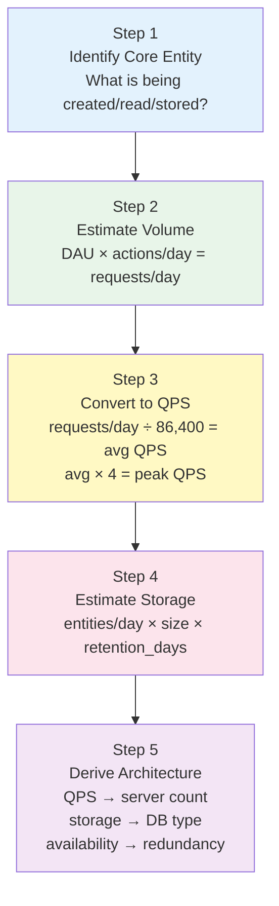

### 8.2 The Core Formula — Memorize This

```
Average QPS = DAU × actions_per_day ÷ 86,400
Peak QPS = Average QPS × 4  (3–5 depending on traffic pattern)
Storage = daily_entities × entity_size_bytes × retention_days
Servers = Peak_QPS ÷ QPS_per_server × 2 (redundancy factor)
Availability (serial) = A₁ × A₂ × A₃ × ...
Availability (redundant) = 1 - (1 - A)^n
```

### 8.3 The Scale Decision Tree

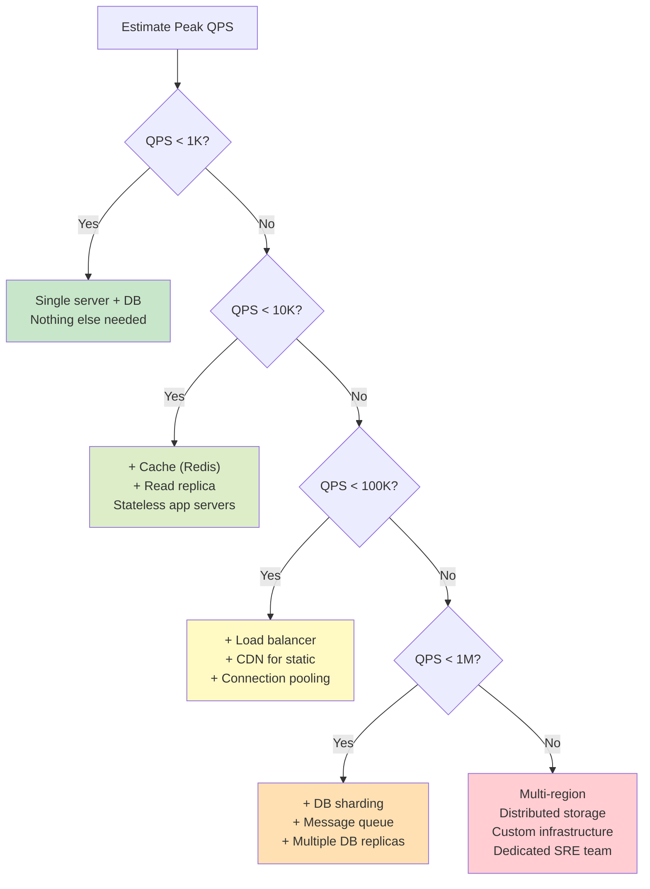

### 8.4 Storage Tier Selection

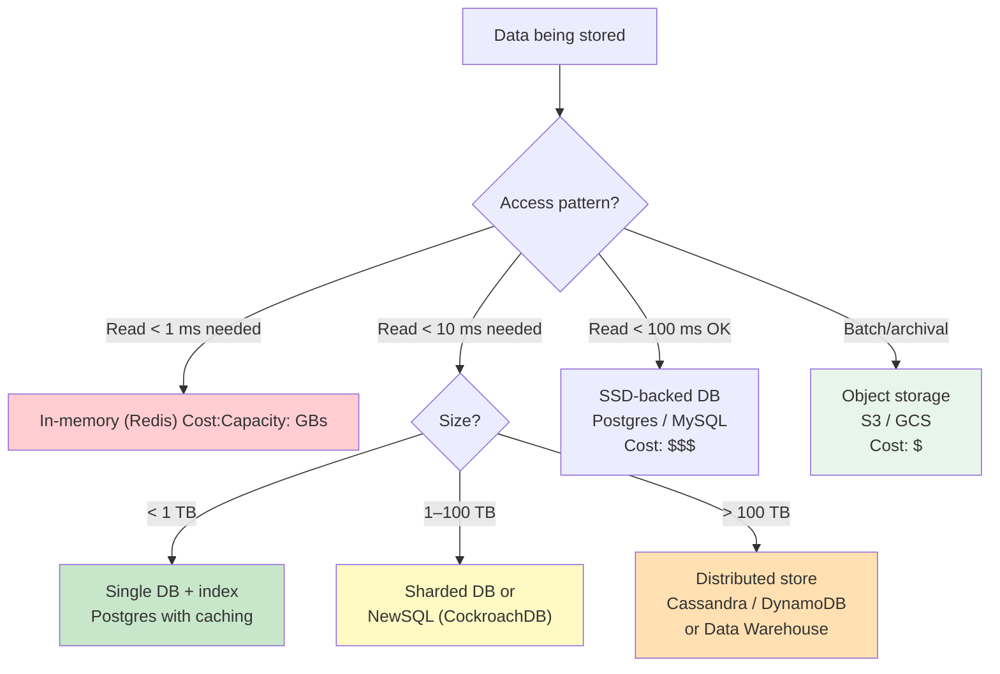

### 8.5 Common Estimation Mistakes

| Mistake | What Goes Wrong | The Fix |
|---------|----------------|---------|
| **Forgetting peak factor** | System sized for 10K average; 40K peak crashes it | Always multiply by 3–5× for peak |
| **Ignoring fan-out** | "10K QPS" becomes 100K internal QPS with 10× amplification | Map the full call graph; size every node |
| **Treating all QPS as equal** | 10K write QPS and 10K read QPS need completely different architectures | Always split read vs write QPS early |
| **Assuming linear scaling** | "10 servers = 10× capacity" — but overhead, coordination, and uneven distribution make it 7–8× | Apply efficiency factor; plan for rebalancing |
| **Confusing MB and MB/s** | "1 MB object" vs "1 MB/s throughput" — completely different | Always include units; double-check conversions |
| **Ignoring growth** | Sized for today; growing by 3× in 18 months → re-architect under load | Size for 2–3 years of growth |
| **Forgetting replication factor** | "100 TB storage" → actually 200–300 TB with 2–3× replication | Multiply storage estimates by replication factor |
| **Averages hiding tails** | p50 latency looks fine; p99 is 10× worse → SLO violated | Always instrument and alert on p95/p99 |

### 8.6 The Key Constants to Internalize

| Constant | Value | Use |
|---------|-------|-----|
| Seconds per day | 86,400 | DAU → QPS conversion |
| 1 Thousand | 10³ | Small scale |
| 1 Million | 10⁶ | Medium scale |
| 1 Billion | 10⁹ | Large scale |
| 2^10 | ≈ 1K | Memory math |
| 2^20 | ≈ 1M | Memory math |
| 2^30 | ≈ 1B | Memory math (GB) |
| 2^32 | ≈ 4.3B | int32 max, IPv4 addresses |
| L1 cache | 0.5 ns | Fastest access |
| RAM | 100 ns | In-memory data |
| SSD random read | 16 μs | DB index lookup |
| HDD seek | 2 ms | Avoid on hot path |
| Same-DC RTT | 0.5 ms | Intra-service calls |
| Cross-US RTT | 40 ms | Multi-region cost |

### 8.7 L5 vs L6 Thinking — The Complete Picture

| Dimension | L5 Response | L6 Response |
|-----------|-------------|-------------|
| **Scale assessment** | "We have millions of users, we'll need caching" | "At 50M DAU and 20 actions/day, that's 11,574 QPS average, 46K peak — here's what the cache needs to handle" |
| **Storage estimate** | "We'll need a big database" | "At 2B writes/day at 500 bytes each, we accumulate 1 TB/day. In 2 years that's 730 TB — we need a sharding strategy now, before the migration is painful" |
| **Availability target** | "We need high availability" | "99.9% gives us 8.76 hours/year. With 6 services in the checkout chain, each at 99.9%, combined availability is 99.4% — we need each service at 99.98% or we need to make some calls non-blocking" |
| **Peak traffic** | "We'll add servers if traffic spikes" | "Our traffic pattern shows 4× peak. We provision for peak plus 50% headroom. Auto-scaling handles the valleys and reduces cost by 30–40% compared to constant peak provisioning" |
| **Server count** | "We'll need a lot of servers" | "46K peak QPS, 20K per server → 3 servers minimum. With 2× redundancy: 6 app servers. Cache absorbs 90% of reads, so DB sees 4.6K QPS — 2 read replicas handle it" |
| **Latency** | "The system should be fast" | "Our p99 SLO is 200 ms. Current p99 is 230 ms. The DB query is consuming 80 ms of the budget — we'll add a cache layer for the most common queries to bring DB time to < 20 ms" |
| **Cost** | "It might be expensive" | "At current scale: $15K/month. CDN dominates at $10K. Compressing images from 200 KB to 80 KB saves 60% of CDN cost — that's $6K/month saved" |

### 8.8 The Single Most Important Habit

When you hear any number about a system's scale, convert it. Immediately. Automatically.

- "We have 10 million users" → 10M × 20 actions ÷ 86,400 ≈ 2,300 QPS average. Peak ~9K. Two-tier architecture needed.
- "We process 5 billion events per day" → 5B ÷ 86,400 ≈ 57,870 QPS. At 100 bytes each, that's 5.8 MB/sec. Queue-based architecture.
- "Our database is 500 GB" → Half a terabyte. Single instance handles it. At current growth of 50 GB/month, we hit 1 TB in 10 months and 10 TB in ~10 years. Monitor growth; plan sharding.
- "We need 99.99% availability" → 52 minutes/year of downtime. Multi-region, automated failover, zero-downtime deployments, 24/7 on-call. Budget the infrastructure accordingly.

This instantaneous conversion — from a raw number to its architectural implications — is what separates a Staff Engineer from a Senior Engineer in a system design context. The numbers are not ends in themselves. They are inputs to architectural decisions. Master the conversions, and every architectural discussion becomes grounded, credible, and defensible.

---

## Practice Problems

### Problem 1: Twitter-Scale Feed
**Setup:** 500M MAU, 30% DAU. Each user views 50 tweets per day, each tweet 1 KB. Estimate daily read QPS and 1-year storage.

**Solution:**
- DAU: 500M × 30% = 150M DAU
- Daily reads: 150M × 50 = 7.5B reads/day
- Average QPS: 7.5B ÷ 86,400 = **86,806 QPS ≈ 87K QPS**
- Peak QPS (4×): 87K × 4 = **348K QPS**
- Annual storage: 7.5B reads/day × 1 KB/tweet × 365 (if we store each impression) = **2.74 PB/year**
  - Note: tweets themselves are stored once; feed impressions are ephemeral. Tweet storage: 150M DAU × 3 tweets/day × 365 × 1 KB = 164 TB/year (much smaller)

### Problem 2: Video Upload Storage
**Setup:** 10M video uploads per day, 100 MB average. Estimate storage for 90-day retention.

**Solution:**
- Daily storage: 10M × 100 MB = 1,000,000,000 MB = 1,000 TB = **1 PB/day**
- 90-day storage: 1 PB × 90 = **90 PB**
- With transcoding (2.5× for multiple resolutions): 90 × 2.5 = **225 PB**
- This requires distributed object storage (S3/GCS) with lifecycle policies

### Problem 3: Payment System Write QPS
**Setup:** 1M transactions per day, peak 5×. Each transaction does 3 DB writes.

**Solution:**
- Average QPS: 1M ÷ 86,400 = **11.6 QPS**
- Peak QPS (5×): 11.6 × 5 = **58 QPS**
- DB write operations: 58 × 3 = **174 write ops/sec at peak**
- A single PostgreSQL primary handles 174 ops/sec easily (can handle 1,000–10,000 writes/sec)
- No sharding needed at this scale; just a primary with replicas for read redundancy

### Problem 4: Multi-Region Availability
**Setup:** 99.99% target. Two regions, each at 99.95%. Both must be up for the system to work.

**Solution:**
- Serial availability (both must work): 0.9995 × 0.9995 = 0.999 = **99.9%**
- This does not achieve 99.99% — serial dependencies hurt availability
- To achieve 99.99%, you need active-active: at least one region must work (not both)
- Availability with active-active (either works): 1 - (1 - 0.9995)² = 1 - (0.0005)² = 1 - 0.00000025 = **99.99997%** ✓
- Key insight: 99.99% across a multi-region system requires active-active routing, not active-passive where both must be healthy

### Problem 5: Google Drive — Estimate Storage Requirements
**Setup:** 1B MAU, 20% DAU. Average user stores 5 GB of files. 100K new users per day uploading 2 GB each on first day.

**Solution:**
- Total stored data (1B users × 5 GB average): 5 × 10^9 GB = **5 × 10^9 GB = 5 EB** (exabytes)
- New user uploads: 100K/day × 2 GB = 200 TB/day of net new data
- Existing user new uploads: assume 200M DAU × 10 MB/day new uploads = 2 PB/day
- Total new data per day: 200 TB + 2 PB ≈ **2.2 PB/day**
- With deduplication (assume 30% of uploads are duplicates): effective new storage = 1.54 PB/day
- This requires a globally distributed object storage system with aggressive deduplication and compression

---

## Appendix A: Server Capacity Reference Table

This table gives you starting points for back-of-envelope server provisioning. Values are rough approximations for a modern cloud instance (4–8 vCPU, 16–32 GB RAM). Real numbers vary by workload, hardware, and query complexity.

| Workload Type | QPS per Server | Latency Expectation | Notes |
|---------------|----------------|---------------------|-------|
| **Static file serving (nginx)** | 50K–200K | < 1 ms | Memory-mapped files; minimal logic |
| **Simple JSON API (Go/Node, no DB)** | 20K–100K | 1–5 ms | Stateless; in-memory logic only |
| **JSON API with Redis cache hit** | 10K–50K | 2–10 ms | Cache lookup per request |
| **JSON API with DB per request** | 1K–5K | 10–50 ms | DB round-trip is the bottleneck |
| **JSON API with complex DB query** | 100–500 | 50–200 ms | Joins, aggregations; DB is heavily loaded |
| **Redis (simple GET/SET)** | 100K–500K | < 1 ms | In-memory; single-threaded but very fast |
| **Redis (complex ops, Lua scripts)** | 20K–100K | 1–5 ms | Script execution overhead |
| **PostgreSQL (simple primary key reads)** | 10K–50K | 1–10 ms | With good indexing and cache warm |
| **PostgreSQL (complex joins)** | 500–2K | 20–200 ms | Query planner + disk I/O |
| **MySQL (typical OLTP)** | 5K–30K | 1–20 ms | InnoDB, good hardware |
| **Cassandra (simple reads/writes)** | 20K–100K | 2–15 ms | With appropriate partition key design |
| **Elasticsearch (search query)** | 1K–10K | 10–100 ms | Depends on index size and query complexity |
| **Kafka (producer, ack=1)** | 100K–1M | < 5 ms | Batch writes; throughput-optimized |
| **gRPC service (CPU-bound logic)** | 5K–20K | 5–30 ms | Serialization is fast; CPU does the work |
| **Image resize/transcode worker** | 10–100 | 100 ms–5 s | CPU-intensive; scales via worker count |
| **ML inference (CPU)** | 50–500 | 10–200 ms | Depends on model size |
| **ML inference (GPU)** | 1K–10K batched | varies | Batch efficiency critical |

**How to use this table:**

1. Identify your workload type (or the closest match)
2. Take the QPS per server value
3. Divide Peak QPS by that value to get server count
4. Multiply by 2 for redundancy (or N+1 for active-active pools)

**Example:** You have a JSON API + DB service at peak 30K QPS.
- Workload matches: "JSON API with DB per request" → 1K–5K QPS per server
- Use 2K QPS/server as a conservative estimate
- Servers needed: 30K ÷ 2K = 15 servers
- With 2× redundancy: 30 servers

**Example 2:** Redis cache serving 200K read QPS.
- Redis simple GET/SET: 100K–500K QPS/node
- Use 200K/node as safe estimate
- Nodes needed: 200K ÷ 200K = 1 node
- With replica for HA: 2 nodes (1 primary + 1 replica)

---

## Appendix B: Cost Estimation — Rough Cloud Pricing

Staff Engineers need to validate that their architecture is economically viable. Here are rough AWS/GCP/Azure pricing for back-of-envelope calculations (2024 estimates; actual prices vary by region, commitment, and negotiated discounts):

### Compute (On-Demand Pricing)

| Instance Type | vCPU | RAM | Cost/Month | Use Case |
|--------------|------|-----|------------|----------|
| t3.medium | 2 | 4 GB | ~$30 | Dev/test |
| c6i.xlarge | 4 | 8 GB | ~$120 | CPU-bound app servers |
| m6i.xlarge | 4 | 16 GB | ~$140 | Balanced workloads |
| m6i.4xlarge | 16 | 64 GB | ~$560 | DB, cache, heavier apps |
| r6i.4xlarge | 16 | 128 GB | ~$760 | Memory-heavy workloads |
| c6i.32xlarge | 128 | 256 GB | ~$4,300 | Large compute nodes |

**Reserved instances (1-year commitment): ~40% cheaper**
**Spot instances (interruptible): 60–90% cheaper for batch workloads**

### Managed Databases

| Service | Spec | Cost/Month |
|---------|------|------------|
| RDS PostgreSQL (db.m6g.xlarge) | 4 vCPU, 16 GB | ~$200 + storage |
| RDS PostgreSQL (db.r6g.4xlarge) | 16 vCPU, 128 GB | ~$800 + storage |
| RDS Multi-AZ (adds standby) | 2× compute cost | 2× above pricing |
| Aurora PostgreSQL (serverless v2) | Variable | ~$0.12/ACU-hour; 1 ACU ≈ 2 GB RAM |
| ElastiCache Redis (cache.m6g.xlarge) | 4 vCPU, 13 GB | ~$150/month |
| DynamoDB | On-demand | ~$1.25/million read units, $1.25/million write units |

### Storage

| Type | Price |
|------|-------|
| EBS (gp3 SSD) | ~$0.08/GB/month |
| S3 Standard | ~$0.023/GB/month |
| S3 Infrequent Access | ~$0.0125/GB/month |
| S3 Glacier | ~$0.004/GB/month |
| EFS (NFS) | ~$0.30/GB/month |

### Network

| Type | Price |
|------|-------|
| Data transfer OUT to internet | $0.09/GB (first 10 TB/month) |
| CloudFront CDN | $0.0085–$0.02/GB (varies by region) |
| Data transfer between regions | $0.02/GB |
| Data transfer within same region (cross-AZ) | $0.01/GB |
| Data transfer within same AZ | Free |

### Cost Estimation Worked Example: Social Feed Platform

**Scenario:** 50M DAU, 70K read QPS average, 4.6K write QPS average, 73 TB/year data.

**Monthly infrastructure:**
- App servers: 20 instances (m6i.xlarge at $140) = $2,800
- Redis cluster: 3 nodes (cache.m6g.xlarge at $150) = $450
- RDS primary: 1 (db.r6g.4xlarge Multi-AZ at $1,600) = $1,600
- RDS read replicas: 2 (db.r6g.xlarge at $400 each) = $800
- Load balancers: 2 (ALB at $25/month + $0.008/LCU) = ~$100
- CDN (CloudFront): 560 MB/s peak, ~200 MB/s average = 200 MB/s × 86,400 × 30 ÷ 1000 = 518 TB/month × $0.0085/GB = ~$4,400
- S3 storage: 73 TB/year = 6 TB/month new + accumulated = say 50 TB total × $0.023 = $1,150

**Total: ~$11,300/month**

**Insight:** CDN and storage dominate. Compute is only ~$5,200 of the ~$11,300. Reducing payload size (compress API responses, use WebP images) directly reduces CDN cost.

**At 10× scale (500M DAU):** CDN scales linearly → ~$44,000/month CDN alone. At this scale, companies negotiate enterprise CDN contracts (can reduce to $0.004–$0.007/GB) and invest in custom CDN infrastructure. The business case: at $44K/month vs $25K/month for a custom solution, it pays for itself within months.

---

## Appendix C: The Availability Deep Dive

### How to Measure Availability in Practice

Availability is not as simple as "uptime / total time." The details matter for honest measurement:

**Definition 1: Request-based availability**
```
Availability = successful_requests / total_requests
```
This is what most modern systems use. A "successful" request is one that returns a valid response (2xx or 3xx HTTP status) within the SLO latency budget. A slow response that technically succeeds but takes 10 seconds may count as failure if the SLO defines latency.

**Definition 2: Time-based availability**
```
Availability = (total_time - downtime) / total_time
```
Used in SLAs, uptime monitoring tools. "Downtime" is defined as any period where the service returns errors above a threshold (e.g., > 1% error rate for > 1 minute).

**Which to use?** Request-based is more accurate for distributed systems where partial outages are common. Time-based is simpler and more easily understood by business stakeholders. Most companies use both.

### Planned vs Unplanned Downtime

Not all downtime is equal:

| Type | Examples | SLO Impact |
|------|----------|-----------|
| **Planned maintenance** | Deployments, schema migrations, dependency upgrades | Usually excluded from SLO if customers are notified |
| **Unplanned outages** | Bugs, hardware failure, network partition, DDoS | Always counts against SLO |
| **Partial degradation** | Some requests fail; core functionality works | Counts against SLO proportionally |

**The zero-downtime deployment requirement:** At four nines (99.99%), even planned maintenance must be zero-downtime. A 5-minute maintenance window would consume 10% of the annual error budget. This forces organizations to invest in:
- Blue-green deployments (run old and new version simultaneously; switch traffic; rollback if needed)
- Canary deployments (route 1–5% of traffic to new version; watch metrics; gradually shift to 100%)
- Feature flags (ship code dark; turn on feature without deployment)
- Database migrations that are backward-compatible (add columns, not rename; multi-phase schema changes)

### Compound Availability — More Examples

**Example: API + Database + Cache (Serial)**

A typical API request flow:
- Load balancer: 99.99%
- API server pool (5 servers, need any 1): 1 - (0.001)^5 ≈ 99.9999%
- Redis cache: 99.95%
- Primary database: 99.95%

Combined:
```
A_total = 0.9999 × 0.999999 × 0.9995 × 0.9995
        = 0.9999 × 0.999999 × 0.999 (approx: 0.9995²)
        ≈ 0.9989
        ≈ 99.89%
```

The database and cache are the weak links. Improving them from 99.95% to 99.99% each:
```
A_improved = 0.9999 × 0.999999 × 0.9999 × 0.9999 ≈ 0.9997 ≈ 99.97%
```

**Example: Maximizing availability by making calls non-critical**

What if the cache is optional — if it fails, the API server falls through to the database?
```
A_system = A_lb × A_api_pool × (A_cache + A_db - A_cache × A_db) ... 
```
Actually simpler to reason: if cache misses just mean DB hits, the DB handles all traffic. The system works as long as LB + API pool + DB are all up:
```
A_system = 0.9999 × 0.999999 × 0.9995 ≈ 0.9994 ≈ 99.94%
```
Making the cache non-critical (graceful degradation) improved availability because it removed one serial dependency from the critical path.

**This is a design principle: critical path availability is determined by the weakest mandatory component. Make every non-essential component optional.**

### Service Dependencies — Dependency Mapping for Availability

Before you can calculate composite availability, you need to map dependencies:

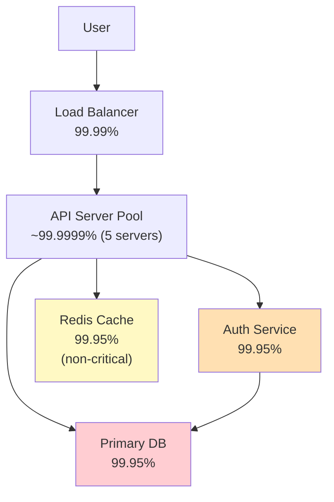

In this diagram:
- Auth service is **mandatory** (cannot serve requests without authentication)
- Redis cache is **optional** (cache miss falls through to DB)
- DB is **mandatory** (source of truth)

Critical path: LB → API pool → Auth → DB

```
A_critical = 0.9999 × 0.999999 × 0.9995 × 0.9995 ≈ 0.9989 ≈ 99.89%
```

To improve to 99.99%, you need each mandatory component to be at ~99.9975% or better. That requires:
- LB: already at 99.99% (cloud-managed, highly reliable)
- API pool: already near 99.9999% with 5 servers
- Auth: upgrade from 99.95% to 99.99% (add replica, multi-AZ)
- DB: upgrade from 99.95% to 99.99% (RDS Multi-AZ, or active-active setup)

---

## Appendix D: Additional Worked Examples

### Example: Designing a Notification System

**Scenario:** 200M DAU. 1 push notification sent per user per day on average. Users have an average of 2 devices.

**Write (sending notifications):**
- Notifications per day: 200M × 1 = 200M notifications/day
- Average QPS: 200M ÷ 86,400 = 2,315 QPS
- Peak (3×): 6,944 QPS ≈ **7K notification sends/sec**

**Fan-out to devices:**
- Each user has 2 devices average: 7K × 2 = **14K device pushes/sec**
- Each push requires: look up device token + call APNS/FCM API + handle delivery receipt
- APNS/FCM: these are external services; plan for ~5–10% delivery failure rate (rate limiting, unreachable devices)

**Storage:**
- Notification record: 50 bytes (user_id, message_id, timestamp, status)
- 200M × 365 × 50 bytes = **3.65 TB/year**
- Delivery receipts: 200M × 2 devices × 365 = 146B records/year × 30 bytes = **4.38 TB/year**
- Total: ~8 TB/year — manageable with a single sharded PostgreSQL cluster

**Architecture:**
- Ingestion: REST API → Kafka topic (absorb spikes at 14K pushes/sec)
- Workers: consume from Kafka, call APNS/FCM HTTP APIs (async, batched)
- Worker count: FCM supports up to 1000 messages/request batch. At 14K/sec, need 14 parallel batch senders minimum
- DB: notification log + delivery status. Shard by user_id.
- Rate limiting: prevent spam (max 5 notifications per user per hour)

### Example: E-Commerce Order System (Black Friday Scale)

**Normal load:**
- 1M orders/day average
- Write QPS: 1M ÷ 86,400 ≈ 12 QPS
- Read QPS (product pages, cart): 500M page views/day = 5,787 QPS average

**Black Friday peak:**
- Orders: 10× normal = 10M orders/day = 120 QPS peak orders (but concentrated in 4 hours)
- In 4 hours: 10M ÷ (4 × 3,600) = 694 orders/second at peak
- Product page traffic: 50× normal = 50 × 5,787 = 289K QPS
- Cart operations: 100× normal

**The spike is the challenge:**
- Normal: 12 QPS for orders → trivially handled by a single DB
- Black Friday peak: 694 QPS for orders → 58× normal, still manageable by a good DB with write optimization
- Product pages: 289K QPS at peak → 50× normal → cache is essential, CDN for static assets

**Auto-scaling plan:**
- 48 hours before Black Friday: pre-scale to 3× normal capacity (known spike)
- During event: auto-scale up to 10× based on CPU/QPS metrics
- Post-event: scale down over 12 hours to avoid cold-start latency from sudden scale-in

**Key numbers to design around:**
- 694 orders/second × 5 DB writes per order = 3,470 DB writes/second at order peak
- PostgreSQL can handle this on a large instance (r6g.4xlarge or similar)
- Risk: payment gateway may rate-limit or have its own capacity limits → queue orders, process at payment gateway's rate

### Example: Real-Time Leaderboard System

**Scenario:** Gaming platform with 5M concurrent users during a tournament. Score updates 1 per second per active user. Top 1000 leaderboard refreshed every second.

**Write QPS:**
- 5M users × 1 score update/sec = **5M writes/second**

**Read QPS:**
- 5M users checking leaderboard every 5 seconds = 5M ÷ 5 = **1M reads/second**

**This is primarily a write problem.** 5M writes/second is enormous.

**Why traditional SQL fails here:**
- PostgreSQL can handle ~10K–50K writes/second on good hardware
- 5M ÷ 50K = 100 nodes just for writes — too complex for a simple leaderboard

**Why Redis sorted sets are the answer:**
- Redis ZADD: O(log N) per operation — score update
- Redis ZRANGE: O(log N + M) where M is number of results — top 1000 query
- Redis: 100K–500K ops/second per node
- For 5M writes/second: 5M ÷ 200K = 25 Redis nodes (in parallel, each handling different users/score ranges)

**Sharding strategy:**
- Shard by player_id % 25 for writes (each player's score goes to one shard)
- Global leaderboard: merge top 1000 from each shard → global top 1000 (trivial compute, runs once/second)

**Storage:**
- 5M user scores × 16 bytes (int64 user_id + int64 score) = 80 MB — tiny
- Each Redis node holds 80 MB ÷ 25 = 3.2 MB — trivially fits in memory

**Conclusion:** This is a throughput problem solved by in-memory sorted data structures, not a storage or latency problem. The estimation reveals that Redis sharding is the natural solution.

---

## Appendix E: Estimation Anti-Patterns and How to Avoid Them

### Anti-Pattern 1: Starting with Solution, Not Numbers

**Wrong approach:**
> "We should use Kafka and Redis and then Cassandra for storage."

**Right approach:**
> "Let me calculate the write QPS first... 23K QPS at peak. That's too high for synchronous DB writes, and we need to handle spikes. That points toward a queue like Kafka between the API and the storage layer. Now let me size Kafka..."

The numbers tell you which solution is appropriate. Starting with a solution and then calculating to justify it produces designs that may be over-engineered (Redis when a simple cache would do) or under-engineered (missing that 23K QPS requires a queue).

### Anti-Pattern 2: Ignoring the Internal Fan-Out

**The problem:** A request that appears to be "1 QPS" may generate 50 internal operations.

**Example:** A social feed load triggers:
- 1 request to the feed service
- Feed service fetches 30 posts (30 reads to post DB)
- For each post, fetches the author profile (30 reads to user DB)
- For each post, fetches like count (30 reads to metrics service, or 1 batch call)
- Total: 1 user-facing QPS → 61 internal operations

**At 10K user-facing QPS:** 610K internal operations/second. If you sized all services for 10K QPS, they are all under-provisioned by 61×.

**Fix:** For each service in your design, ask "how many internal operations does each user-facing request generate?" Sum them up. Size for the internal QPS, not the user-facing QPS.

### Anti-Pattern 3: Linear Scaling Assumptions

**The assumption:** "We have 10 servers handling 10K QPS. For 100K QPS, we need 100 servers."

**Why this is wrong:**
- Horizontal scaling has overhead: coordination, load balancing, distributed cache invalidation
- Effective capacity scaling is typically 7–8× per 10× server increase (not 10×)
- Hot spots: 10% of keys get 50% of traffic; those keys become bottlenecks regardless of total server count
- Coordination costs: distributed transactions, leader election, and consensus algorithms get worse with more nodes

**Better approach:** When estimating server counts, apply a 70–80% efficiency factor.
- Need 100K QPS. 10K per server. Naive: 10 servers.
- Efficiency factor: 10 ÷ 0.75 = 13.3 → **14 servers** (round up)
- Add redundancy: 14 × 2 = **28 servers**

### Anti-Pattern 4: Missing the Replication Multiplier on Storage

**The mistake:** "We need 100 TB of storage."

**Reality:** Every production system replicates data for durability and availability:
- Databases: typically 3 replicas (1 primary + 2 replicas)
- Object storage (S3): 3 copies across availability zones, minimum
- Kafka: 3 replicas per partition

**Correct estimate:** "We need 100 TB of logical storage. With 3× replication, that is 300 TB of physical storage."

At $0.023/GB for S3, the difference:
- 100 TB: $2,300/month
- 300 TB (replicated): $6,900/month

A $4,600/month difference that surprises teams who did not account for replication.

### Anti-Pattern 5: Confusing QPS and Concurrent Connections

**The confusion:** "We have 1M concurrent users. We need to handle 1M QPS."

**Why it is wrong:** Concurrent users and QPS are related but not the same:
- A "concurrent user" is actively engaged with the app in a given second
- Each concurrent user makes requests at some rate: maybe 1 request every 5 seconds, or 1 every 30 seconds
- 1M concurrent users × 1 request per 5 seconds = **200K QPS** (not 1M)

**For connection-based services (WebSockets, long-polling):** The question is "how many simultaneous connections," not QPS. 1M concurrent connections ≠ 1M QPS. Each connection is idle most of the time; the connection server handles IO multiplexing.

**Fix:** Be explicit:
- "QPS" = requests per second (for stateless HTTP)
- "Concurrent connections" = number of open connections simultaneously (for WebSockets)
- Convert as needed: concurrent_connections × requests_per_connection_per_second = QPS

### Anti-Pattern 6: Ignoring Write Amplification

**Definition:** Write amplification is the ratio of data actually written to storage vs data logically written.

**Examples:**
- **LSM tree (Cassandra, RocksDB):** Writes go to memtable first, then get compacted to SSTable levels. A logical write of 1 KB can result in 5–10 KB written to disk over the compaction lifecycle. Write amplification factor: 5–10×.
- **Replication:** Writing 1 record that must be replicated to 3 nodes → 3 physical writes.
- **WAL (Write-Ahead Log):** Databases write to WAL before the actual data file. Effective write amplification ≈ 2×.
- **Combined:** Cassandra with 3 replicas and 5× compaction amplification: 15× actual writes per logical write.

**Impact on QPS calculation:**
- If you need 10K logical write QPS with Cassandra (3 replicas, 5× compaction): storage layer sees 150K IOPS
- Sizing storage IOPS for 10K and finding the limit is 50K feels fine — but you are about to hit the actual limit of 50K ÷ 15 = 3,333 logical write QPS

**Fix:** When sizing storage I/O, account for write amplification. Ask "what is the storage system's effective write amplification?" and multiply logical write QPS accordingly.

---

*The numbers in this chapter are design inputs. Every architecture decision — single DB vs sharded, sync vs async, cache or not, one region vs many — depends on numbers. Get them wrong and the architecture collapses. Get them right and your design stands on solid ground that every stakeholder can evaluate. Master these calculations until they are as automatic as breathing, and your system design interviews will reflect the confidence and rigor of an engineer who has internalized how systems actually scale.*

---

## Appendix F: Production Incident Deep Dives

---

### F.1 p99 Production Incident — Payments API Story

This is a real pattern that plays out at companies of every size. Learn to recognize it before it happens to you.

**The incident**

A Payments API had the following metrics on its dashboard:

- p50 latency: 80 ms
- p99 latency: 2,500 ms (2.5 seconds)

The on-call engineer looked at the dashboard and thought: "p50 is 80 ms — that looks fine." No alert fired because the alert threshold was set on average latency, not p99.

Meanwhile, support tickets started arriving:

- "Payment timed out."
- "Checkout hung for 30 seconds then failed."
- "I tried to pay three times and nothing worked."

**Root cause**

1% of requests hit a code path that made 6 sequential database calls. This was an N+1 query bug in disguise: a loop that fetched each related record one at a time instead of batching.

Each DB call in that code path had a p99 of 200 ms. Why so high? Connection pool exhaustion and a cold page cache at that time of night. Not every call was slow — but the worst ones were.

Math: 6 × 200 ms = 1,200 ms from DB alone. Add network overhead, serialization, and middleware: total p99 hit 2,500 ms.

**Impact math**

At 10,000 QPS:

- 1% of 10,000 = 100 requests per second hitting the slow code path
- 100 requests/sec × 60 seconds = 6,000 users per minute experiencing a timeout
- Per hour: 360,000 affected users

p50 was 80 ms. Everything looked fine on the surface. The problem was buried in the tail.

**Fix**

The team identified the N+1 code path. They batched the 6 sequential queries into a single query with a JOIN. p99 dropped from 2,500 ms to 150 ms. The support tickets stopped immediately.

**Lesson**

Always instrument AND alert on p95 and p99. p50 can look healthy while millions of users experience timeouts. A dashboard that only shows averages or medians is a liability at scale.

```mermaid
gantt
    title Payments API Latency: What p50 Hides
    dateFormat X
    axisFormat %s ms

    section p50 Request (most users)
    DNS + TCP       :0, 10
    API Gateway     :10, 20
    App Logic       :20, 40
    DB Query (fast) :40, 80

    section p99 Request (1 in 100 users)
    DNS + TCP       :0, 10
    API Gateway     :10, 20
    App Logic       :20, 40
    DB Call 1 (slow):40, 240
    DB Call 2 (slow):240, 440
    DB Call 3 (slow):440, 640
    DB Call 4 (slow):640, 840
    DB Call 5 (slow):840, 1040
    DB Call 6 (slow):1040, 1240
    Serialization   :1240, 2500
```

The bar at the top (p50) looks clean. The bar at the bottom (p99) is a disaster. Both show up as "80 ms average" if you are not watching percentiles.

---

### F.2 Tail Latency Amplification — Full Math

**Setup**

Service A calls services B, C, and D in parallel. It waits for all three before responding to the user. Each of B, C, D has an individual p99 latency of 100 ms.

**The naive hope**

"All three have p99 = 100 ms. So the combined p99 is 100 ms, because they run in parallel."

This is wrong.

**The reality — independent case**

For the combined operation to complete within 100 ms, ALL THREE services must complete within 100 ms. Each service independently has a 1% chance of exceeding 100 ms.

```
P(B finishes ≤ 100 ms) = 0.99
P(C finishes ≤ 100 ms) = 0.99
P(D finishes ≤ 100 ms) = 0.99

P(all three finish ≤ 100 ms) = 0.99 × 0.99 × 0.99 = 0.99³ ≈ 0.970
```

So 3% of requests will exceed 100 ms — not 1%. The combined p97 is 100 ms. The combined p99 is higher than any individual service's p99.

**The worse case — correlated slowdowns**

Services B, C, D all share the same database. When that database gets slow (connection pool fills up, GC pause, hot replica), all three services slow down simultaneously. Their failures are correlated, not independent.

When failures are correlated, the math is even worse than the 0.99³ calculation above. The tail amplification compounds.

This is why separating dependencies across different failure domains matters. Shared infrastructure means shared failure modes.

**The sequential case**

If Service A calls B, then C, then D in sequence (not parallel), latencies add directly:

```
p99(total) = p99(B) + p99(C) + p99(D)
           = 100 ms + 100 ms + 100 ms
           = 300 ms
```

Latencies in a serial chain add. A 5-service serial chain where each has p99 = 50 ms produces a combined p99 of 250 ms.

**Mitigation**

Set per-dependency timeout budgets. If your total SLO is 200 ms and you have 5 dependencies in the critical path, each dependency gets a 40 ms p99 budget. If a dependency exceeds its budget, fail fast and return a degraded response rather than waiting.

Rules:
- Use strict timeouts on every downstream call
- Parallelize independent calls where possible
- Circuit break when a downstream service is consistently slow
- Prefer fewer dependencies on the critical path

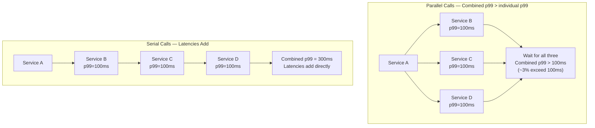

---

## Appendix G: Uber Driver Location Dominance — Full Insight

**Naive calculation for ride requests**

Start with what most people would estimate first:

```
130M MAU × 20% DAU = 26M DAU
26M DAU × 0.5 rides per day = 13M ride requests per day
13M ÷ 86,400 = ~150 QPS average
Peak (3× for rush hour): 150 × 3 = 450 ride request QPS
```

This feels small. And it is. 450 QPS is trivial.

**Secondary amplification from ride operations**

Each ride request triggers several internal operations: matchmaking, ETA calculation, pricing, push notifications. Roughly 10× internal fan-out.

```
450 QPS × 10 = 4,500 internal QPS at peak
```

Still manageable.

**The twist: driver location updates dominate everything**

At peak, Uber has roughly 1 million active drivers. Each driver's app sends a GPS location update every 4–10 seconds.

Using 10 seconds per update:

```
1,000,000 drivers ÷ 10 seconds = 100,000 location updates per second
```

Using 4 seconds per update:

```
1,000,000 drivers ÷ 4 seconds = 250,000 location updates per second
```

Call it 100,000–250,000 location writes per second. Compare to 450 ride request QPS.

Driver location updates are **220× to 550× larger** than the primary user action.

**Why this is the counterintuitive insight**

The "primary" user action — requesting a ride — generates tiny load. The "background" continuous stream — GPS pings from every active driver — generates the overwhelming majority of writes to the system.

If you designed the system only thinking about ride requests, you would massively under-provision the write layer.

**Architecture implications**

This is not a ride-matching problem. It is a 100,000+ QPS geospatial write workload.

Uber's real engineering challenges:
- Storing and querying real-time locations of 1M vehicles with sub-second freshness
- Efficiently answering "find all drivers within 2 km of this location" at 100K+ QPS
- Updating ETAs as driver positions change continuously

Their solutions:
- Redis with geospatial indexes (GEOADD, GEORADIUS commands) for real-time driver positions
- WebSocket connections for live driver position streaming to riders
- H3 or S2 spatial indexing libraries for efficient proximity queries
- Specialized time-series stores for historical GPS data

**Staff-level lesson**

Always check for secondary continuous workloads that may dwarf the primary action. Do not just ask "how many users make requests?" Ask also: "What else is happening constantly in this system, even when no users are actively requesting anything?"

Examples:
- Driver GPS pings (Uber) — dwarfs ride requests
- Heartbeat/presence updates (chat apps) — often 10–100× message volume
- Analytics event streams — often 50–100× API request volume
- Health check calls — can be surprisingly large at scale

---

## Appendix H: Error Budget Weekly Tracking

**The setup**

SLO: 99.9% availability. This translates to:

```
Annual downtime budget = 0.1% × 525,600 minutes = 525.6 minutes/year
Monthly downtime budget = 525.6 ÷ 12 = 43.8 minutes/month
```

You have 43.8 minutes of allowed downtime per month. Every minute of service interruption is a withdrawal from that budget.

**Weekly tracking example**

| Week | Incident | Downtime | Budget Consumed | Budget Remaining |
|------|----------|----------|-----------------|-----------------|
| 1 | DB replica lag caused 5xx errors | 12 min | 12 min | 31.8 min |
| 2 | Bad deployment rollout, rolled back | 8 min | 8 min | 23.8 min |
| 3 | No incidents | 0 min | 0 min | 23.8 min |
| 4 | Cache stampede after deploy | 20 min | 20 min | 3.8 min |

After Week 4: 3.8 minutes of budget remains for the rest of the month.

**Action after the budget is nearly exhausted**

The team freezes risky deployments for the rest of the month. All engineering effort shifts to:
- Post-mortems on the three incidents
- Fixing root causes (DB replica promotion, safer deployment process, cache warming strategy)
- Avoiding any new changes that could trigger another incident

Next month: fresh 43.8-minute budget. If the team consistently consumes 100% of budget every month, the choices are:
1. Improve reliability (fix the root causes consuming the budget)
2. Relax the SLO (acknowledge the system cannot actually deliver 99.9% at current state)

**Error budget as shared language**

Without error budgets, reliability conversations are political. Engineering says "we need to slow down." Product says "we need to ship faster." Nobody wins.

With error budgets, the conversation becomes data-driven:

> "We have used 91% of our monthly downtime budget after Week 4. Deploying the new payment feature this week carries a 15-minute rollback risk based on our last three similar deployments. That would exhaust our budget and put us in violation of SLO. We should wait until next month or invest the next two days making the deployment safer (feature flag, staged rollout)."

This is a concrete tradeoff that both engineering and product can evaluate.

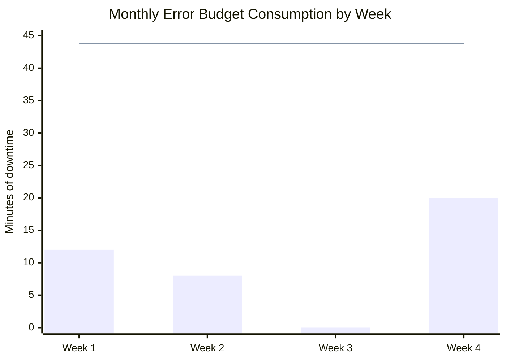

The bar chart shows downtime consumed each week. The line shows the total monthly budget (43.8 min). After Week 4, cumulative consumption (40 min) nearly reaches the budget line.

---

## Appendix I: Composite Availability — Three Complete Examples

---

### I.1 Example 1: E-Commerce Checkout Chain (serial)

**Setup**

A checkout request must pass through all 6 services successfully:

```
API Gateway → Auth → Cart → Payment → Order → Inventory
```

Individual availabilities:
- API Gateway: 99.9% (0.999)
- Auth: 99.9% (0.999)
- Cart: 99.9% (0.999)
- Payment: 99.95% (0.9995)
- Order: 99.9% (0.999)
- Inventory: 99.9% (0.999)

**Calculation**

```
A_total = 0.999 × 0.999 × 0.999 × 0.9995 × 0.999 × 0.999

Step 1: 0.999^5 = 0.999 × 0.999 × 0.999 × 0.999 × 0.999
       = 0.995009... ≈ 0.9950

Step 2: 0.9950 × 0.9995 = 0.9945
```

Combined availability: **99.45%**

**Interpretation**

You started with 6 services, each at 99.9% or better. The chain delivers only 99.45%.

At 99.45%, your annual downtime is:

```
(1 - 0.9945) × 525,600 minutes = 0.0055 × 525,600 = 2,890 minutes ≈ 48 hours/year
```

You have lost half a nine. Your checkout flow is down for 2 days a year, even though every individual service meets its 99.9% target.

**Staff-level insight: what happens with 10 services?**

```
0.999^10 = 0.990 ≈ 99.0%
```

Ten services at 99.9% each give you a combined 99.0% — you lost a full nine. The checkout flow is now down for 87 hours per year.

This is why microservices architectures must make non-essential dependencies asynchronous or optional. Every mandatory service you add to the critical path multiplies your downtime.

---

### I.2 Example 2: Redundancy Helps (parallel)

**Setup**

The Payment service has 2 independent instances. The service fails only if both instances fail simultaneously.

Each instance: 99.9% available (0.1% failure rate).

**Calculation**

```
P(instance 1 fails) = 1 - 0.999 = 0.001
P(instance 2 fails) = 1 - 0.999 = 0.001

P(both fail simultaneously) = 0.001 × 0.001 = 0.000001

A(payment service with redundancy) = 1 - 0.000001 = 0.999999 = 99.9999%
```

Two instances at 99.9% each gives 99.9999% combined — you gained 3 extra nines.

**Critical caveat: independence matters**

The formula P(both fail) = P(A fails) × P(B fails) only holds when the two failures are **independent**. In practice, this requires different failure domains:

- Different availability zones (different power supplies, different network switches)
- Different physical hardware (not virtual machines on the same host)
- No shared database or cache that can take both down simultaneously

If both instances share the same database and that database has an outage, both instances fail at exactly the same time. The failures are perfectly correlated. Redundancy provides zero benefit.

Real independence means: if someone cuts the power to one rack, does the other instance survive? If the answer is no, they are not truly independent.

---

### I.3 Example 3: Mixed Serial and Parallel

**Setup**

Request flow:

```
API → (Auth AND UserService in parallel, both must succeed) → DB
```

- API: 99.95%
- Auth: 99.9%
- UserService: 99.9%
- DB: 99.95%

**Calculation**

Step 1: Auth and UserService run in parallel, but both must succeed (the request needs both authentication and user data).

```
A(parallel but both required) = A_auth × A_userservice
                               = 0.999 × 0.999
                               = 0.998 = 99.8%
```

Running in parallel does not help availability here. Both must succeed, so the probability of success is still the product.

Step 2: Serial combination:

```
A_total = A_api × A_parallel × A_db
        = 0.9995 × 0.998 × 0.9995
        = 0.997 ≈ 99.7%
```

**Key lesson**

Parallel calls help **latency** (total time = max of the two, not sum). They do NOT help availability when both must succeed.

Availability only improves with parallel calls when the system works if **at least one** succeeds (for example, a read that can be served by either of two replica caches).

| Parallel pattern | Latency effect | Availability effect |
|-----------------|---------------|-------------------|
| Both must succeed | Better (max, not sum) | Worse (product of both) |
| Either can succeed | Better | Better (1 - both fail) |

---

## Appendix J: Cost Estimation for Architecture Proposals

Staff Engineers attach dollar figures to every architecture they propose. "We need 100 servers" means nothing to a VP. "We need 100 servers at $140/month each = $14,000/month = $168,000/year" is a business decision.

**Rough cloud pricing for back-of-envelope (2024 on-demand prices)**

| Resource | Spec | Monthly Cost |
|----------|------|-------------|
| App server | 4 vCPU, 16 GB (m5.xlarge equivalent) | $50–$150 |
| App server (reserved 1-year) | Same | $70–$90 |
| Redis cache | 8 GB (ElastiCache) | $50–$200 |
| Database primary | db.r5.large, 16 GB | $150–$500 |
| Database read replica | Same spec as primary | $150–$500 |
| Load balancer (ALB) | Base cost | $20–$50 |
| S3 storage | Per GB | $0.023/GB |
| Outbound bandwidth | Per GB | $0.09/GB |

**Worked example: medium-scale service**

Architecture:
- 20 app servers × $140/month = $2,800
- 2 Redis nodes × $150/month = $300
- 1 DB primary × $400/month = $400
- 2 DB replicas × $400/month = $800
- 1 load balancer × $30/month = $30
- Bandwidth and storage ≈ $500/month

Total: approximately **$4,830/month ≈ $5,000/month**

At 100K QPS: $5,000 ÷ 100,000 QPS ÷ (30 days × 86,400 sec/day) ≈ **$0.02 per 1,000 requests**

**Why this math matters in interviews and design reviews**

Three scenarios where cost estimation changes the conversation:

1. **Justifying architectural investment**: "Adding a Redis cache costs $300/month and saves us from needing 5 additional DB read replicas at $400 each = $2,000/month. Net saving: $1,700/month."

2. **Flagging unsustainable designs**: "This design requires 500 DB nodes at $400 each = $200,000/month. That is $2.4M/year. We need to revisit the sharding strategy."

3. **Projecting growth costs**: "We are at $5,000/month now. At 10× growth (which our product team targets in 18 months), we will be at $50,000/month. We should negotiate reserved instances now to reduce that to $30,000/month."

**Rule for every design review**: Attach a rough monthly cost to every architecture you propose. Business stakeholders respond to dollar numbers, not server counts.

---

## Appendix K: Extended Practice Exercises with Full Arithmetic

---

### Exercise 1: Twitter-like Feed

**Setup:** 500M MAU, 30% DAU. Each user views 50 tweets per day, each tweet 1 KB. What are the daily read QPS and annual storage requirements?

**Solution**

Step 1: DAU
```
500M × 0.30 = 150M DAU
```

Step 2: Daily reads
```
150M × 50 tweets/day = 7,500,000,000 = 7.5B reads/day
```

Step 3: Average read QPS
```
7.5B ÷ 86,400 = 86,805 QPS ≈ 87K QPS average
```

Step 4: Peak read QPS (4× factor for social apps)
```
87K × 4 = 348K QPS at peak
```

Step 5: Storage — tweet impressions logged (if you log every view)
```
7.5B reads/day × 1 KB × 365 days = 2.74 PB/year of impression logs
```

This is enormous. In practice, most feeds do not log every impression. You log aggregated metrics (impression counts per tweet) rather than individual events.

Step 6: Storage — tweets written (much smaller)
```
5% of 150M DAU post each day = 7.5M tweets/day
7.5M × 1 KB × 365 = 2.74 TB/year of tweet text
```

Tweet text storage is only 2.74 TB/year — completely manageable. The impression log is the storage problem if you choose to store it.

**Architecture conclusion**: The read QPS (348K peak) is the design driver. You need a large Redis cache cluster. Tweet writes are trivial in QPS and storage.

---

### Exercise 2: Video Upload System

**Setup:** 10M video uploads per day, 100 MB average size, 90-day retention.

**Solution**

Step 1: Daily raw storage
```
10M uploads × 100 MB = 1,000,000,000 MB = 1,000 TB = 1 PB per day
```

Step 2: 90-day storage before compression
```
1 PB/day × 90 days = 90 PB
```

Step 3: After transcoding/compression (typical 4:1 reduction for video encoding)
```
90 PB ÷ 4 = 22.5 PB
```

22.5 PB still requires a distributed object storage system (S3, GCS) with tiered storage and lifecycle policies. This is YouTube/TikTok scale infrastructure.

Step 4: Write QPS (uploads per second)
```
10M ÷ 86,400 = 115 uploads/second
```

But each 100 MB upload takes approximately 10 seconds to transfer (at typical upload speeds):
```
115 uploads/sec × 10 seconds/upload = 1,150 concurrent in-flight uploads
```

This means your upload ingestion layer must handle 1,150 simultaneous multipart upload sessions at steady state.

**Architecture conclusion**: Storage is the dominant challenge at 22.5 PB. Compute for transcoding is also significant (115 uploads/sec each requiring video encoding). Use object storage with lifecycle policies, and a dedicated transcoding worker pool.

---

### Exercise 3: Payment System Write Sizing

**Setup:** 1M transactions per day, peak 5×, each transaction requires 3 DB writes.

**Solution**

Step 1: Average transactions per second
```
1M ÷ 86,400 = 11.6 TPS average
```

Step 2: Peak TPS
```
11.6 × 5 = 58 TPS at peak
```

Step 3: DB write operations at peak
```
58 TPS × 3 writes/transaction = 174 write QPS
```

A single well-tuned PostgreSQL primary can handle 1,000–10,000 write QPS. 174 write QPS is well within that range.

Step 4: Storage for 1 year
```
1M transactions/day × 365 days = 365M transactions/year
365M × 500 bytes/transaction = 182.5 GB/year
```

182 GB fits comfortably on a single server. No sharding needed for this scale.

**Architecture conclusion**: This is a small system. Single PostgreSQL primary with 1–2 read replicas for redundancy. No queues, no sharding, no distributed complexity needed. The 58 TPS peak is manageable by standard hardware.

Beware of over-engineering: teams sometimes add Kafka and distributed systems complexity to payment flows at this scale when it is entirely unnecessary.

---

### Exercise 4: Multi-Region Availability Target

**Setup:** Target 99.99% availability. Two regions, each at 99.95%. What is the combined availability, and does it meet the target?

**Solution**

Step 1: Define the failure model. This is active-active: either region can serve the request. The system is down only if BOTH regions are simultaneously unavailable.

```
P(region 1 fails) = 1 - 0.9995 = 0.0005
P(region 2 fails) = 1 - 0.9995 = 0.0005

P(both fail simultaneously) = 0.0005 × 0.0005 = 0.00000025

Combined availability = 1 - 0.00000025 = 0.99999975 ≈ 99.99997%
```

This exceeds the 99.99% target. The two-region active-active setup provides approximately 5 nines.

Step 2: However, consider the failover window.

Active-passive (one primary region, one standby) is different from active-active. If the primary region fails and failover to the standby takes 30 seconds, those 30 seconds count as downtime.

Annual failover cost: if failover happens 4 times per year, each taking 30 seconds:
```
4 × 30 seconds = 120 seconds = 2 minutes of failover downtime
```

At 99.99%, your annual budget is 52.6 minutes. 2 minutes of failover from 4 incidents is acceptable.

But if failover takes 5 minutes and happens 12 times per year:
```
12 × 5 minutes = 60 minutes > 52.6 minutes (budget exceeded)
```

**Key lesson**: The math on paper can show 99.999% combined availability, but your actual SLA depends on your failover speed and frequency. Factor in the failover window when computing effective availability for active-passive setups.

**Architecture conclusion**: Active-active multi-region with smart traffic routing (geo-based) achieves the 99.99% target mathematically and operationally. Active-passive achieves it only if failover is fast (sub-60-second automated failover) and rare.

