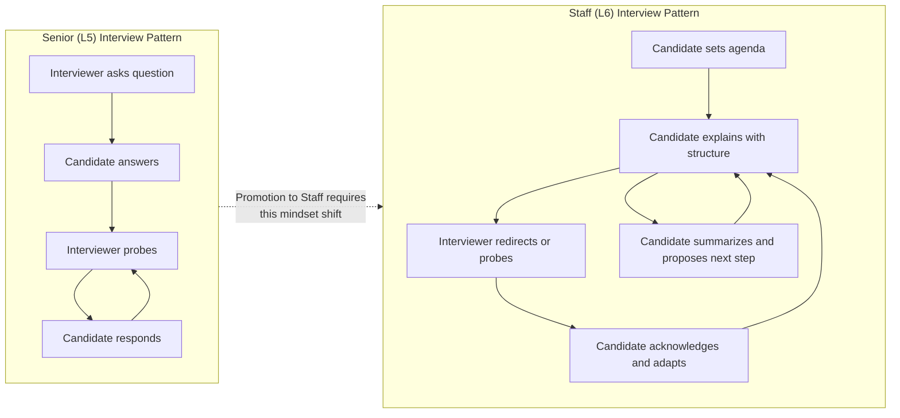
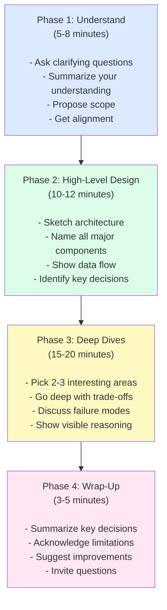
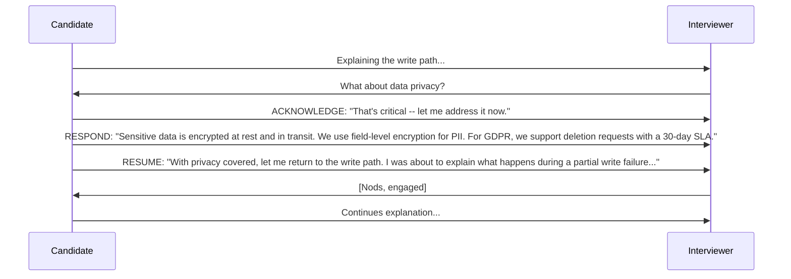
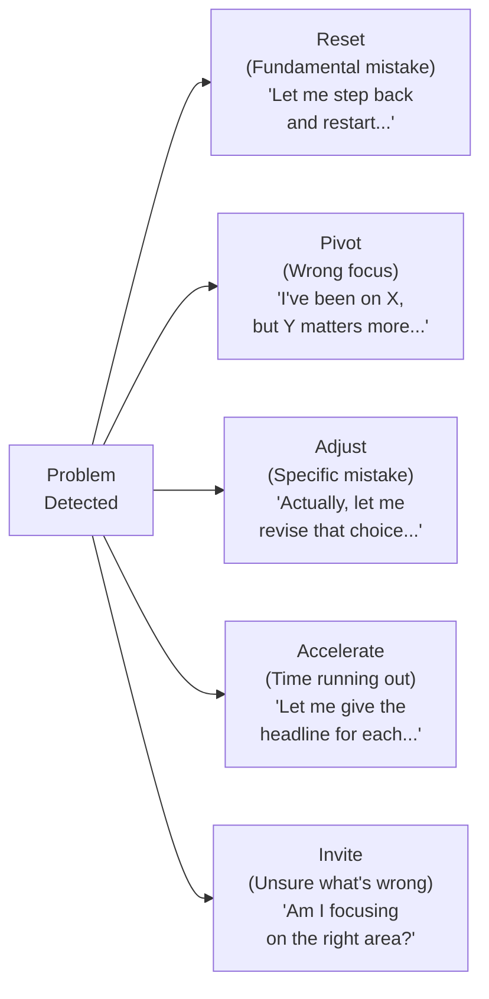
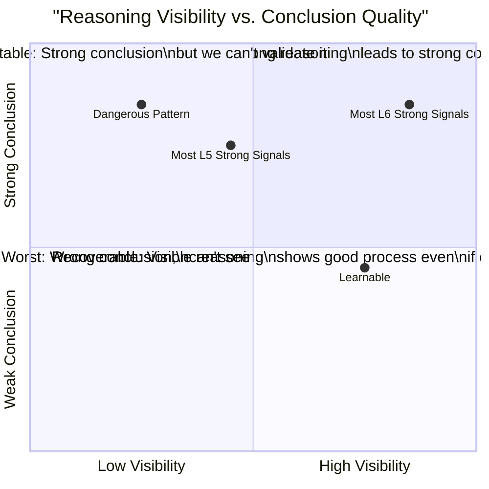
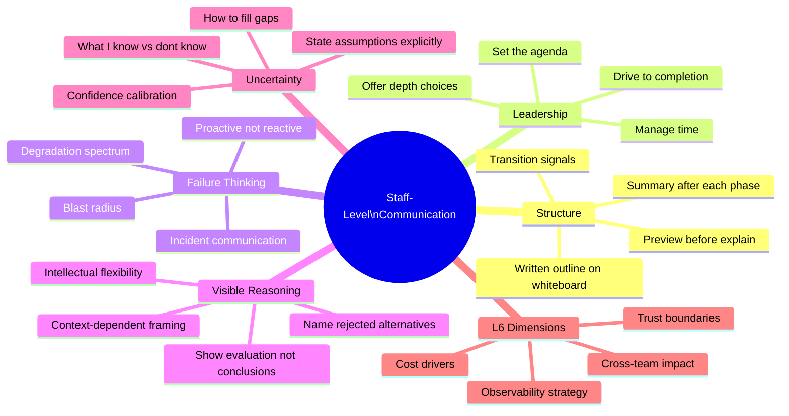
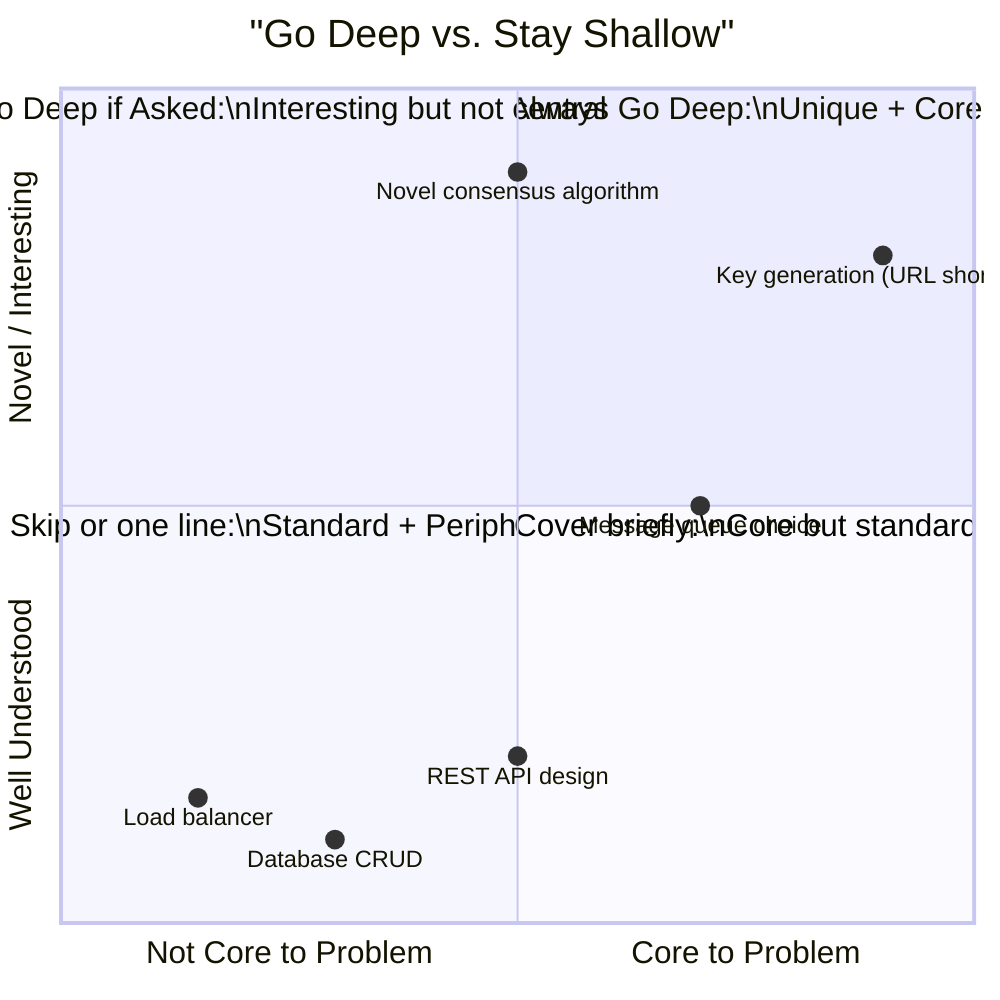
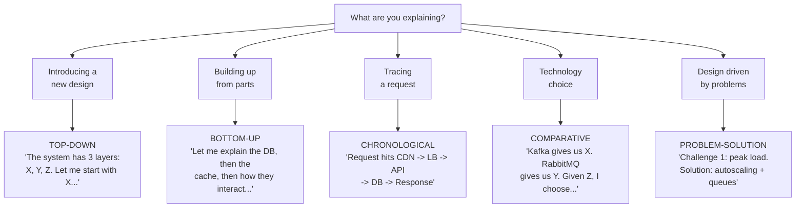
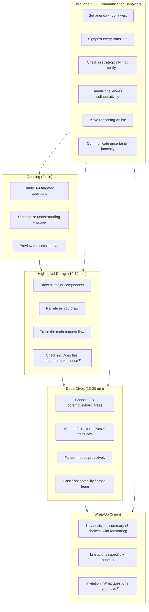

# Chapter 6: Communication and Interview Leadership for Google Staff Engineers

> **Who this is for**: A recent college graduate who is technically strong but has never led a high-stakes system design discussion. You know your data structures. You can code. Now you need to learn how to *communicate like an owner* in a 45-minute Google Staff Engineer interview -- and understand exactly why it matters, what interviewers are measuring, and how to practice.

---

## Section 1: Learning Goal

By the end of this chapter you will be able to:

1. Explain why communication is scored as a first-class dimension in Staff-level interviews -- not as a "soft skill" but as direct evidence of whether you can lead a team.
2. Walk into a 45-minute system design interview, take ownership of the session from minute zero, and drive it through all four phases without waiting for the interviewer to steer you.
3. Structure any explanation -- no matter how complex -- using one of five proven patterns so your listener always knows where they are.
4. Handle interruptions, redirections, challenges, and mistakes without losing your composure or your thread.
5. Communicate failure modes, cost trade-offs, observability strategy, and cross-team impact as naturally as you communicate the happy path.
6. Recognize the signals that separate a strong L5 (Senior) answer from a strong L6 (Staff) answer on every communication dimension.

This is not a soft-skills chapter. Communication, at the Staff level, is a technical skill you build through deliberate practice -- just like you built your coding skills.

---

## Section 2: Why This Matters

### The Fundamental Asymmetry of Interviews

Here is a fact that surprises most new engineers: **the interviewer cannot see inside your head**.

You might be running the most sophisticated mental model of a distributed system anyone has ever constructed. You might be evaluating seventeen different consistency models simultaneously. You might already know the answer. But if none of that is verbalized -- if it stays in your head -- the interviewer evaluates it as if it doesn't exist.

This asymmetry is not a flaw in the interview process. It is the entire point. In real engineering work, your value to your team is not the quality of your private thoughts. It is the quality of what you communicate: in design documents, in technical reviews, in incident war rooms, in conversations with product managers who don't have your technical background.

The Staff Engineer interview is evaluating exactly that capability.

### Why Communication Is an Explicit Scoring Dimension

At Google, system design interviews are scored across multiple dimensions. Communication is one of them -- explicitly. This means the interviewer is not just evaluating whether you arrived at a good design. They are evaluating:

- Could you structure the discussion so I could follow your thinking?
- Did you lead, or did you need me to pull information out of you?
- When I redirected you, did you adapt gracefully or get flustered?
- Could I imagine this person running a design review with fifteen engineers in the room?
- Would this person communicate clearly in a production incident at 3am with three teams on the line?

That last question is important. Google Staff Engineers do not work alone. They make technical decisions that affect multiple teams, communicate trade-offs to product leadership, and lead incident responses in high-pressure situations. The interview is a proxy for all of that.

### The B+ Design / A+ Communication Principle

Here is a principle that holds true across many years of interview calibration data: **a candidate with a B+ design and A+ communication will regularly outperform a candidate with an A+ design and B+ communication**.

This is not because interviewers don't care about technical quality. They do. But:

- An A+ design that is explained poorly leaves the interviewer uncertain about whether you actually understand what you've proposed.
- A B+ design that is explained brilliantly -- with clear structure, visible reasoning, proactive failure analysis, and graceful handling of challenges -- gives the interviewer strong evidence of judgment.
- Interviewers are humans. They will advocate more strongly in calibration for a candidate who communicated clearly because they have more evidence of that candidate's thinking.

This is worth internalizing: **clarity of communication is itself evidence of clarity of thought**. The two are not separable.

### The Shift from Senior to Staff

Here is what changes when you go from Senior to Staff level:

**At Senior (L5)**:
The interviewer often co-pilots the session. They ask questions. You answer. They probe. You respond. The dynamic is conversational and reactive. This is fine at L5 -- it still lets them evaluate your technical depth.

**At Staff (L6)**:
You are expected to drive. The interviewer gives you a problem and then *observes*. They will intervene to probe or redirect, but the default expectation is that you are running the session: setting the agenda, managing time, choosing where to go deep, building toward a coherent conclusion. If you are passive -- if you wait for the interviewer to ask questions -- that is itself a signal that you are not operating at L6.

This shift feels uncomfortable at first. Most engineers are trained to answer questions, not to lead discussions. But it is learnable, and this chapter will teach you exactly how.



---

### What Interviewers Actually Write in Their Feedback

When interviewers write up their post-interview feedback for Staff candidates, here are the exact kinds of statements that appear in weak vs. strong communication assessments:

**Weak communication feedback (often leads to "No Hire")**:
- "Had to ask many follow-up questions to draw out their thinking."
- "Candidate jumped between topics without clear structure."
- "Strong technical knowledge but hard to follow their explanation."
- "Got defensive when I challenged the database choice."
- "Never proactively discussed failure modes."
- "Spent 25 minutes on authentication, didn't cover scaling at all."

**Strong communication feedback (signals Staff-level)**:
- "Drove the entire session without prompting -- set agenda, managed time, signaled transitions."
- "Made reasoning visible at every step -- could explain why, not just what."
- "Handled my challenges gracefully -- engaged with the concern, adjusted where valid."
- "Proactively discussed failure modes, blast radius, and degradation before I asked."
- "Clear structure throughout -- previewed, explained, summarized. Easy to follow."

The gap between these is almost entirely communication, not technical depth.

---

## Section 3: Core Concepts

### Concept 1: The "Map Before You Hike" Principle

#### What It Is

Before you start explaining your design, you tell the interviewer exactly how you plan to use the next 45 minutes. You describe the map before you start hiking.

This sounds simple, almost trivially obvious. Most candidates skip it because they are eager to start designing. This is a mistake.

#### Why It Exists

Imagine going on a hike with a guide who says "follow me" and starts walking. You have no idea where you're going, how long it will take, what terrain you'll encounter. You can't plan your energy. You can't know if you're falling behind.

Now imagine a guide who says: "We're going to summit that peak. The route has four sections -- a flat valley, a steep climb, a ridge walk, and the final push. Total time is four hours. The hardest part is the steep climb, which takes about 90 minutes. I'll narrate as we go." Now you can orient yourself. You know what to expect. You can ask better questions.

In an interview, the interviewer is on the hike with you. If you just start talking about databases, they have no context for why, where you're going, or what matters. If you first say "Here is my plan for the next 40 minutes," they can follow along, ask targeted questions, and give you useful redirections.

#### What a Strong Opening Looks Like

"Before I start designing, let me clarify a few things to make sure we're solving the right problem. Then I'll sketch a high-level architecture, identify the key design decisions, and go deep on the two or three most interesting parts. I'll leave a few minutes at the end to wrap up and discuss limitations. Does that structure work for you?"

This opening accomplishes several things simultaneously:
- It signals that you are in charge.
- It gives the interviewer a shared mental model of the session.
- It shows you think about time management.
- It invites the interviewer to redirect if they have different priorities.
- It starts building the impression of an organized, confident engineer.

#### Common Mistake and Fix

**Mistake**: Starting immediately. "So for this design, I'd have a load balancer in front of some API servers, and those would talk to a database..."

**Why it fails**: The interviewer has no frame. They don't know if you plan to cover failure modes, scaling, security, or anything else. They can't evaluate your choices without knowing your priorities.

**Fix**: Spend 30-60 seconds on the map before hiking. It costs almost nothing in time and buys enormous clarity.

---

### Concept 2: How to Structure a 45-Minute Design Answer

#### The Four Phases

A well-run Staff-level system design interview has four distinct phases. You drive all four.



#### Phase 1: Problem Understanding (5-8 minutes)

**What you are doing**: Establishing that you are solving the right problem before you start designing.

**Why this phase matters**: Every hour spent designing the wrong system is wasted. Staff engineers who skip clarification often end up 15 minutes into an explanation before they realize they've been designing a batch pipeline when the problem requires real-time processing. The clarification phase is not a delay -- it is an investment.

**What to ask**:
- Scale: "Are we designing for thousands of users or millions? What's the expected traffic at peak?"
- Priorities: "Are we optimizing for latency, throughput, consistency, or availability? If we have to trade one for another, what's the priority?"
- Scope: "Are there existing systems I should integrate with, or are we designing from scratch?"
- Context: "Is this a greenfield project, or is there legacy infrastructure I should know about?"

**What not to ask**: Endless clarifying questions. Ask four or five targeted questions, then summarize and propose scope. Don't spend ten minutes in clarification -- the interviewer wants to see you design.

**How to end this phase**: "Let me summarize my understanding. We're building [X] for [Y] scale, prioritizing [Z]. I'll focus on [A, B, C] and acknowledge but not detail [D, E]. Does that scope make sense?"

The summary is critical. It creates a shared contract between you and the interviewer. If you've misunderstood something, this is where they'll correct it -- before you spend twenty minutes on the wrong design.

**Example phrases**:
- "Before I start, I have a few clarifying questions to make sure we're aligned..."
- "Let me make sure I understand the core requirements..."
- "Let me summarize what I think we're building and get your confirmation..."
- "I'll treat [this] as in scope and [that] as out of scope for now..."

#### Phase 2: High-Level Design (10-12 minutes)

**What you are doing**: Establishing the architecture -- the components, their relationships, and the data flow.

**Why this phase matters**: The high-level design is the skeleton. Without it, deep dives have no context. With it, deep dives are specific and targeted. You need to give the interviewer a shared mental model of the system before you go into detail on any part of it.

**What to cover**:
- Draw the major components (don't omit the obvious ones -- load balancers, databases, caches all deserve to be on the diagram).
- Label each component with its purpose.
- Trace the request flow for the main use case.
- Identify the most important design decisions -- the places where your choices actually matter.

**Pacing**: This phase should move at a moderate pace. Don't rush through it, but don't get deep yet. When you catch yourself going deep on one component while three others haven't been introduced, that's a signal to zoom back out.

**What to say as you draw**: Narrate everything. "I'm adding a message queue here because we need to decouple the ingestion rate from the processing rate. The ingestion layer can spike without overwhelming the processors." The interviewer should never be watching you draw in silence -- every line on the whiteboard should come with an explanation.

**How to end this phase**: "Let me quickly recap the architecture before I go deeper. We have [X] for ingestion, [Y] for processing, [Z] for storage, and [W] for delivery. The data flows from [A] through [B] to [C]. Before I dive into details, does this high-level structure make sense?"

#### Phase 3: Deep Dives (15-20 minutes)

**What you are doing**: Going deep on the two or three most interesting, difficult, or important parts of your design.

**Why this phase matters**: This is where Staff-level thinking becomes visible. Anyone can draw boxes. The question is: can you reason carefully about the hard parts? Can you explain trade-offs? Can you anticipate failure modes? Can you defend your choices under questioning?

**How to choose what to go deep on**:
- Go deep on what is *core* to the problem's unique challenges. A URL shortener's interesting problem is key generation -- not the web server.
- Go deep on what is *novel* or unusual about your approach. If you're using an approach that's not the obvious default, explain why.
- Go deep on what is *hard* -- where failure modes live, where consistency gets tricky, where scaling gets expensive.
- Let the interviewer's behavior guide you. If they ask follow-up questions about a specific component, that's a signal to go deeper there.

**What to cover in each deep dive**:
- Your approach and why you chose it.
- What alternatives you considered and why you rejected them.
- The trade-offs of your choice (cost, complexity, latency, consistency, etc.).
- What happens when this component fails (failure modes, blast radius, degradation).
- How you would know it's healthy (observability).

**Transitions within deep dives**: "That covers the write path. Let me now address what happens when it fails, and then move to the read path optimization."

**How to end this phase**: "I've gone deep on the message queue design and the distributed rate limiting. The other components are more standard. Before we wrap up, is there an area you'd like me to go deeper on?"

#### Phase 4: Wrap-Up (3-5 minutes)

**What you are doing**: Creating a clean ending that demonstrates synthesis and self-awareness.

**Why this phase matters**: Interviews that end abruptly -- with the interviewer saying "okay, we're out of time" while you're mid-sentence -- signal poor time management. Interviews that end with a clean summary and acknowledgment of limitations signal that you can synthesize complexity and that you know the difference between a complete design and an approximate one.

**What to cover**:
- A three-sentence summary of the key design decisions and the reasoning behind them.
- An honest acknowledgment of the limitations and what you'd improve with more time.
- An invitation for questions: "What questions do you have?"

**Example closing**:
"To summarize: we've designed a notification system that handles 10 million users with push, email, and SMS delivery. The key decisions were: event-driven fan-out for decoupling, tiered priority queues for critical vs. marketing notifications, and eventual consistency for preference updates. The main limitation is that our current design doesn't handle geographically distributed users well -- we'd need multi-region replication to address that. What questions do you have about any part of this?"

---

### Concept 3: Signposting -- Verbal Navigation for Interviewers

#### What Signposting Is

Signposting means verbally indicating where you are in your explanation and where you are going next. It is the equivalent of chapter headings in a book, or GPS waypoints on a hike.

Without signposting, an explanation feels like a stream of consciousness -- technically correct, but exhausting to follow. With signposting, the interviewer always knows: what phase of the discussion are we in, what did we just cover, and what's coming next.

#### Why Signposting Exists

Consider the difference between these two explanations of the same design:

**Without signposting**:
"So the user sends a request and it hits the API gateway and we do auth there and then it goes to the service mesh and the payment service handles it and we have a database and also a cache and we write to both and then for failures we have circuit breakers..."

**With signposting**:
"Let me walk through three things: authentication, the payment flow, and failure handling. Starting with authentication -- the user's request hits the API gateway, which validates the JWT token. That's the auth layer. Moving to the payment flow -- once authenticated, the request routes to the payment service through our service mesh. The payment service reads from the cache first, then falls back to the database. That covers the happy path. Now for failure handling -- if the payment service is slow..."

The second version has identical technical content. But the signposting makes it dramatically easier to follow. The interviewer can ask targeted questions ("Can you say more about the auth layer?") because they know where things are in the structure.

#### Categories of Signpost Phrases

**Transition signals** (announcing you are moving to the next topic):
- "Now let me move on to..."
- "That covers X. Next, let's discuss Y..."
- "I've explained the write path. Now for the read path..."
- "Stepping back to the big picture before I go deeper..."
- "Let me park that and come back to it after I cover..."

**Depth signals** (announcing how much detail you will go into):
- "Let me go deep on this -- it's the most interesting part..."
- "I'll keep this high-level and go deeper if you want..."
- "This is worth spending a few minutes on..."
- "I'll touch on this briefly and move on unless you want more..."
- "I can say more about this, or I can move on -- your call..."

**Priority signals** (announcing what matters most):
- "The most important thing to get right here is..."
- "This is critical because if we get it wrong..."
- "This is less central, but worth mentioning..."
- "If I had to pick one thing, it would be..."
- "The key insight is..."

**Summary signals** (announcing you are about to recap):
- "To summarize what we've covered so far..."
- "Let me quickly recap before going deeper..."
- "The key points are..."
- "The bottom line is..."

**Question-invitation signals** (checking in with the interviewer):
- "Does this structure make sense before I go deeper?"
- "Any questions on this before I move on?"
- "Should I continue with X or would you prefer I cover Y?"
- "I want to make sure we're aligned -- does this match your mental model?"

#### The Signposting Habit

Signposting is a habit. It doesn't come naturally to most engineers because when we think through problems privately, we don't narrate our navigation. Building the habit requires deliberate practice: record yourself explaining a design, then check whether a listener could follow the structure without seeing your diagram.

---

### Concept 4: Handling Interruptions Without Losing Your Thread

#### Why Interruptions Happen

Interruptions in a Staff-level interview are not rude interruptions. They are the interviewer doing their job. They might:
- Want clarification on a term you used.
- Want to challenge an assumption you're making.
- Want to redirect to a different area.
- Want you to go deeper on something specific.
- Want to see how you handle unexpected questions.

Getting flustered by interruptions, or treating them as adversarial, is a red flag. Staff engineers get interrupted constantly in real meetings. The ability to handle a mid-conversation redirect without losing your composure or your thread is a direct signal of operational maturity.

#### The Acknowledge-Respond-Resume Pattern

For any interruption, use this three-step pattern:

**Step 1 -- Acknowledge**: Show that you heard the question and that you welcome it.
"Good point." / "That's an important consideration." / "Let me address that."

**Step 2 -- Respond**: Answer the question directly and completely.

**Step 3 -- Resume**: Explicitly return to your previous thread (unless the interviewer is redirecting you to a new area).
"Now back to where I was -- I was explaining the write path..."



#### The Five Types of Interruptions

**Type 1: Clarification questions**
"What do you mean by eventual consistency here?"

What they want: An explanation of a term or concept.
How to handle: Briefly explain, then continue where you were.

"By eventual consistency I mean replicas may temporarily diverge but will converge within a bounded time -- let's say a few seconds in normal operation. For this use case, that's acceptable because users can tolerate slightly stale reads. Now back to the write path..."

**Type 2: Challenge questions**
"Won't that approach break at high scale?"

What they want: To see you defend your reasoning -- or acknowledge a valid concern and adapt.
How to handle: Acknowledge the concern. If it's valid, say so and adjust. If you have a good answer, give it. Don't be defensive.

"That's a fair concern. At our current scale of 10K writes/second, this approach works. If we hit 100K writes/second, you're right -- we'd need to shard. Given our 12-month roadmap, I'm not designing for that yet, but I'd build the schema with sharding in mind. Should I go deeper on the sharding strategy?"

**Type 3: Redirection questions**
"Let's talk about failure modes instead."

What they want: To steer to a different area of the design.
How to handle: Acknowledge the redirect, pivot gracefully, and -- if it matters -- note where you were so you can return if needed.

"Sure -- let me put a pin in the caching layer. For failure modes, the main scenarios are..."

**Type 4: Depth-seeking questions**
"Can you go deeper on the distributed lock implementation?"

What they want: More technical detail on a specific component.
How to handle: Go deeper, but bound your answer so you don't lose the broader thread.

"Absolutely. For the distributed lock, I'd use Redis with the Redlock algorithm... [detailed explanation]. Does that level of detail work? I want to make sure we still have time for the scaling discussion."

**Type 5: Devil's advocate questions**
"What if we can't use Kafka? What would you do?"

What they want: To see how you handle constraints and reason about alternatives.
How to handle: Engage genuinely. Don't treat this as an attack on your design -- treat it as an interesting constraint.

"Good constraint. Without Kafka, we lose replay capability and some throughput. I'd consider two alternatives: AWS SQS for simplicity, or RabbitMQ if we need richer routing. Given the trade-offs, I'd probably go with SQS for a first version -- simpler to operate, and we can move to Kafka later if replay becomes critical. Here's how the design would change..."

#### Maintaining Your Thread When Interrupted

One practical technique: **The Bookmark**. Before you respond to an interruption, briefly note where you are.

"Let me bookmark -- I was in the middle of explaining the write path. [Answers question.] Now back to the write path -- I was at the point where the message hits the queue..."

A visual outline on the whiteboard serves the same purpose. If you've written "Write Path / Read Path / Failure Modes" on the board, you can point to where you are at any moment, even after a multi-minute tangent.

#### When to Defer

Sometimes an interruption is best handled later. Deferral is fine -- but you must do it gracefully.

**Good deferral**: "I definitely want to cover monitoring -- it's on my list. Can I finish the data model in about two minutes and then come back to it?"

**Bad deferral**: "I'll get to that later." (This is dismissive and feels like avoidance.)

Defer only when: you are mid-explanation of something complex, the question is about something you planned to cover anyway, or answering now would derail the flow significantly. Address immediately when: the interviewer seems insistent, the question reveals a flaw in your current explanation, or it's a quick answer.

---

### Concept 5: Collaborative vs. Defensive Communication

#### The Difference

**Defensive communication** treats the interviewer's questions and challenges as attacks on your design. It sounds like:
- "No, that's not right. My approach handles that."
- "I think you're misunderstanding what I said."
- "That won't be a problem."
- [Long explanation that doesn't acknowledge the concern at all]

**Collaborative communication** treats the interviewer as a partner helping you build a better design. It sounds like:
- "That's a good point -- let me think about that."
- "You're right that approach has a limitation. Here's how I'd address it..."
- "I hadn't fully considered that angle. Let me revise..."
- "Good catch -- let me update the design."

#### Why Defensive Communication Is Disqualifying

When a Staff engineer is defensive in meetings, it creates a toxic dynamic. People stop giving them feedback. Issues get hidden. The team suffers. Interviewers know this. Defensive communication in an interview is a direct signal of how you will behave in real design reviews.

Collaborative communication, by contrast, signals:
- You can absorb feedback without ego involvement.
- You update your views based on new information.
- You create an environment where people feel safe raising concerns.
- You will be someone other engineers want to work with.

#### The Collaborative Communication Formula

When challenged:

1. Acknowledge the concern with genuine interest ("That's a good point.")
2. Explain your reasoning ("Here's why I made this choice...")
3. Evaluate whether the concern changes your thinking ("You're right that at 100x scale this would be a problem.")
4. Adjust if warranted ("Let me update the design to handle that.")
5. Thank them if it was a good insight ("That's an important edge case I hadn't considered.")

The key is that you are genuinely engaging -- not performing engagement while internally insisting you were right.

#### Dialogue Examples

**Defensive (L5 pattern)**:

Interviewer: "That single database will become a bottleneck."

Candidate: "No, PostgreSQL can handle our load. We're only at 1,000 QPS."

Why this fails: You're dismissing the concern. Even if you're technically correct, the communication reads as brittle and uncooperative.

**Collaborative (L6 pattern)**:

Interviewer: "That single database will become a bottleneck."

Candidate: "You're right to flag that. At 1,000 QPS we're fine, but you're pointing at the growth trajectory. Let me think about the inflection point. If we hit 50K QPS -- which our 18-month projections suggest is plausible -- we'd need to either add read replicas or shard. I'd design the schema today with sharding in mind -- consistent hashing on the user ID -- so the migration is possible without schema changes. Does that address the concern?"

Why this works: You acknowledged the concern, showed you understood the underlying worry, proposed a concrete solution, and invited validation.

---

### Concept 6: The Staff-Level Way to Handle "I Don't Know"

#### Why "I Don't Know" Is Not Disqualifying

Every engineer has knowledge gaps. Pretending you know things you don't is dangerous -- experienced interviewers will probe, and a facade will crumble badly. An honest "I don't know, but here's how I'd approach it" is dramatically better than a confidently wrong answer.

More importantly: Staff engineers model intellectual honesty for their teams. An interviewer who sees you handle uncertainty gracefully will update toward "this person is trustworthy" -- which is exactly the attribute that defines great Staff engineers.

#### The Wrong Responses to "I Don't Know"

**Wrong response 1 -- Fake it**: "Yes, I know exactly how that works. It's..." [proceeds to make things up]
This is worse than saying "I don't know" because it destroys credibility the moment it unravels.

**Wrong response 2 -- Freeze**: "I... um... I'm not sure... I might have heard about this..."
This signals lack of confidence even about your own knowledge.

**Wrong response 3 -- Dismiss**: "That's not relevant to the design."
This is defensive and potentially wrong.

#### The Right Response: Structure Around Uncertainty

When you don't know something, structure your answer around what you *do* know and how you'd find out what you don't:

1. Acknowledge: "I'm not certain about [specific thing]."
2. State what you do know: "What I know is [adjacent knowledge]..."
3. Reason forward: "Given that, my best guess is [X]..."
4. Acknowledge risk: "I'd want to validate this before committing to it."
5. Describe how: "I'd look at [benchmarks / documentation / run a prototype / talk to someone who knows this area]."

**Example**:
Interviewer: "What's the maximum throughput of a single Kafka partition?"

Candidate: "I don't have that number memorized. What I know is that Kafka partitions are append-only log segments and throughput depends heavily on message size, hardware, and batch configuration. In practice I've seen hundreds of megabytes per second per partition for large messages. For very high throughput needs I'd partition heavily regardless of per-partition limits. I'd validate the exact number before making a capacity decision -- I'd look at the Confluent benchmarks or run a load test."

This answer demonstrates reasoning ability, honesty about the knowledge gap, and the judgment to know how to fill gaps in real work -- all Staff-level signals.

#### The "What I Know / What I Don't Know" Framing

For complex uncertainties, explicitly separate the two:

"For the distributed transaction handling, let me separate what I know from what I'm uncertain about.

**What I know**: We need atomic operations across the order and inventory services. Eventual consistency is acceptable -- we can tolerate a few seconds of inconsistency. We need to handle partial failures.

**What I'm uncertain about**: Whether saga pattern or two-phase commit is better depends on latency requirements I don't have yet. The right timeout threshold for detecting failed transactions needs load testing data.

Given these uncertainties, I'll design with sagas for flexibility. We can tighten the implementation once we have production data."

---

### Concept 7: Strategic Check-Ins vs. Constant Validation-Seeking

#### The Difference

There are two kinds of check-ins in a system design interview:

**Validation-seeking** (L5 pattern): "Is this right? Should I do this? Does that make sense? Am I on the right track? Is this okay?" -- asked constantly, after every sentence, signaling that you need external validation to feel confident.

**Strategic check-ins** (L6 pattern): Deliberately pausing at natural transition points to confirm alignment before moving to the next phase. Asked 3-4 times in a 45-minute session, at moments that genuinely benefit from confirmation.

#### Why Constant Validation-Seeking Is a Red Flag

When a Staff engineer constantly asks "is this right?" in real meetings, it signals:
- They lack confidence in their own judgment.
- They are seeking approval rather than alignment.
- They cannot distinguish between situations that need confirmation and those that don't.
- Working with them will be exhausting -- every decision will require external validation.

#### When Strategic Check-Ins Are Right

Check in at exactly these moments:

1. **After the requirements summary**: "I'll focus on [A, B, C] and acknowledge but not detail [D, E]. Does that scope make sense?" -- This is critical. Wrong scope wastes everyone's time.

2. **After high-level design**: "Before I go deeper, does this high-level structure make sense?" -- Confirms the architecture is sound before you invest 15+ minutes of detail on it.

3. **After a deep dive**: "Does that level of detail work, or should I adjust?" -- Lets the interviewer steer depth.

4. **After course-correcting**: "Does this updated direction make more sense?" -- Confirms you've actually addressed the concern.

That's four check-ins in 45 minutes. Any more than that starts to feel needy.

#### What to Do Instead of Checking In

Between these strategic moments, the signal that things are going well is: the interviewer is following along, asking engaged questions, and not interrupting with "wait, what?" or redirecting you away from what you're explaining. Trust these signals instead of asking for constant validation.

If you genuinely need to know if the interviewer is tracking: say "Let me pause here. Any questions before I continue?" This is a natural invitation, not a plea for reassurance.

---

### Concept 8: Thinking Out Loud vs. Rambling

#### Why Thinking Out Loud Is Valuable

In system design interviews, interviewers want to see your thinking process, not just your conclusions. A candidate who says "I'd use PostgreSQL" tells the interviewer nothing about their judgment. A candidate who says "I'm deciding between PostgreSQL and DynamoDB. PostgreSQL gives us ACID transactions and SQL flexibility -- the team knows it well. DynamoDB scales horizontally but forces a key-value access pattern that doesn't match our query needs. For our scale and query complexity, PostgreSQL is the better fit" demonstrates reasoning, trade-off awareness, and contextual judgment.

Thinking out loud is a deliberate skill. It means verbally narrating your decision-making process as you work through a problem.

#### The Difference Between Thinking Out Loud and Rambling

**Thinking out loud** is structured. It has a beginning (the question), a middle (evaluation), and an end (a decision with justification). Each sentence moves you forward.

**Rambling** is unstructured. Sentences don't connect. You repeat yourself. You go in circles. You don't arrive anywhere. It wastes time and signals that you can't organize your thinking under pressure.

**Thinking out loud** example:
"For message delivery, I'm weighing at-least-once vs. exactly-once semantics. At-least-once is simpler -- we retry on failure and accept duplicates. Exactly-once requires more machinery: idempotency keys, deduplication storage. For a notification system, I'd choose at-least-once with idempotency at the consumer -- sending a push notification twice is less bad than missing it entirely."

**Rambling** example:
"So for delivery... we need to deliver messages... and there are different approaches... like we could retry things... or not retry... and there's idempotency which is about not doing things twice... but sometimes you want to do it twice maybe... anyway we need to pick something for delivery..."

The technical content is similar. The presentation is the difference between Staff and not-Staff.

#### How to Think Out Loud Without Rambling

The key is to structure your thinking out loud the way you would structure any other explanation:

1. **State the question**: "I'm deciding between X and Y..."
2. **Evaluate systematically**: "X gives us [pro] but costs us [con]. Y gives us [different pro] but costs us [different con]..."
3. **Identify the deciding factor**: "Given our priority of [Z]..."
4. **State the decision**: "I'd choose X."
5. **Note the trade-off**: "The main risk is [con of X], which we mitigate by..."

If you find yourself running in circles, it's okay to pause and say "Let me think for a moment." Silence is better than rambling.

---

### Concept 9: Communicating Trade-Offs to Different Audiences

#### Why Audience Matters

A trade-off explanation that works for a senior engineer in your org often fails completely when delivered to a product manager or an executive. Staff engineers need to operate across all three audiences. The technical content of the trade-off is the same -- the framing changes.

#### The Three Audiences

**Technical audience** (fellow engineers):
They want the details. Specific numbers. CAP theorem. Consistency models. They want to know you've thought through the edge cases.

Example: "We're choosing eventual consistency with a maximum staleness window of 3 seconds. This is implemented via asynchronous replication with conflict resolution using a last-writer-wins strategy on the user ID + timestamp key. The main risk is lost updates during concurrent writes, which we handle with optimistic locking."

**Product audience** (product managers, designers):
They want to understand the user impact and the trade-offs between features and quality.

Example: "We can guarantee users always see the latest data, but during outages that means showing an error instead of stale data. Or we can always show something -- even if it's a few seconds out of date. For a social feed, I'd recommend showing stale data over an error -- users expect slight delays in feed updates."

**Executive audience** (VPs, directors):
They want the bottom line: risk, cost, and strategic implication.

Example: "Our current approach handles 10x growth without infrastructure changes. Beyond that, we'd need a database migration -- roughly three months of engineering time and $X/month additional infrastructure cost. This buys us 18-24 months of headroom, which aligns with our product roadmap."

#### The Framework: Lead with Impact, Follow with Mechanism

For any audience that isn't deeply technical, lead with what the trade-off *means* before you explain what it *is*.

**Wrong order**: "We're using eventual consistency, which means our replicas may temporarily diverge... [technical explanation]... and this means users might see stale data."

**Right order**: "Users might occasionally see feed data that's a few seconds out of date. The reason we're accepting that is it allows us to keep the system available during server failures. The technical mechanism is eventual consistency with async replication."

Lead with impact. The technical explanation is the justification for the decision the audience already understands.

---

### Concept 10: Non-Verbal Communication in Interviews

#### What "Non-Verbal" Means in an Interview Context

In a system design interview, non-verbal communication includes:
- Your pacing -- how fast you talk, how often you pause
- How you draw while talking (simultaneous vs. sequential)
- Your use of silence to think
- Your engagement signals toward the interviewer (eye contact, body language where applicable)
- The legibility and organization of your diagram

These signals matter because they shape the interviewer's overall impression of your confidence and composure.

#### Pacing

Speaking too fast is the most common non-verbal error in technical interviews. Fast speech often signals anxiety -- you're worried about running out of time, so you accelerate, which makes everything harder to follow, which makes you more anxious. A negative loop.

The fix is counterintuitive: **slow down when you feel like you need to speed up**. Slow, clear speech communicates confidence. It gives the interviewer time to process each idea. It gives you time to think before you speak.

Practice: record yourself, then listen at 0.75x speed. If it sounds comfortable at 0.75x, your actual pace is probably right.

#### Pausing

Pauses are not dead air. They are communication signals. A well-placed pause before stating an important decision communicates: "I have thought about this carefully." A pause after a complex explanation invites the interviewer to absorb what they heard before you move on.

The enemy of pausing is filler words: "um," "uh," "like," "so," "you know." Filler words fill the space that should be a pause. They make the speaker sound uncertain and make the listener's job harder.

The fix: practice embracing silence. When you don't know what to say next, stop talking for two to three seconds. It feels much longer to you than it does to the listener. The listener experiences it as confidence.

#### Drawing While Talking

The best approach: draw and talk simultaneously. Narrate every line you add. "I'm adding a message queue here because..." The diagram and the explanation build together, which is much clearer than drawing in silence and then explaining.

Avoid: drawing for two minutes in silence while the interviewer watches. They can't evaluate your thinking during that time, and the silence becomes uncomfortable.

Also avoid: talking without drawing when the topic is spatial or structural. If you're describing which components communicate with which, draw it. Diagrams anchor explanations.

#### The Diagram as Navigation Aid

A well-structured whiteboard diagram serves as a navigation tool for the whole interview. Write the main components. Draw arrows for data flow. Label everything. When you say "now I'm going to discuss the caching layer," point to it on the diagram. When the interviewer asks about a component, point to it. The diagram is a shared map that both you and the interviewer can reference.

---

### Concept 11: Language That Demonstrates Leadership

#### The "We" vs. "I" Question

This is a common confusion for engineers preparing for Staff interviews. When should you say "I" and when should you say "we"?

**Say "I" when**:
- Describing your design decisions: "I'm choosing Kafka here because..."
- Taking ownership of choices: "My recommendation is..."
- Describing your reasoning: "My concern with that approach is..."

**Say "we" when**:
- Describing what the team would do: "We'd deploy this in three stages..."
- Describing a real past experience at your company: "When we built this at [company], we discovered..."
- Describing collaborative work: "We'd need to align with the Platform team on the schema..."

**The trap**: Using "we" for everything because it feels more collaborative, but coming across as if you're hiding behind the team and not owning your decisions. In an interview, you are being evaluated on your judgment. Use "I" for your design choices.

**The other trap**: Using "I" in a way that sounds arrogant or excluding. "I would never use a monolith" sounds brittle. "For this use case, I'd choose microservices because of the team size and deployment independence" sounds measured.

#### Language That Shows Ownership

Staff engineers use language that signals they are taking responsibility for the design, not just describing it:

**Weak (describing)**:
"One approach is to use a cache in front of the database."

**Strong (owning)**:
"I'd add a read-through cache in front of the database. The reason is our read-to-write ratio is 100:1, so caching will dramatically reduce database load. The trade-off is eventual consistency on reads, which is acceptable for our use case."

The second version:
- Uses first person ("I'd add")
- States the reason
- Names the trade-off
- Justifies the trade-off in context

That is the pattern of an engineer who owns their design.

#### Language That Shows Systems Thinking

Staff engineers think beyond the immediate component to the broader system:

"This decision affects not just our service -- the downstream notification team depends on our event schema. If I change the schema, they'll need to update their consumer. I'd coordinate that with them before shipping."

"The long-term cost here isn't just infrastructure -- it's operational complexity. As the team grows, this approach becomes harder to reason about. I'd want to plan a simplification within 18 months."

These statements signal that you think at the Staff level: your design decisions have consequences beyond your immediate scope, and you are accountable for those consequences.

---

### Concept 12: How to Recover from a Wrong Answer or Bad Start

#### The Core Principle: Self-Awareness Is a Staff-Level Skill

At Staff level, the ability to recognize that you're off track and recover gracefully is *more valuable* than never going off track. Nobody designs perfectly under pressure. The question is: when things go wrong, do you adapt or do you dig in?

Digging in -- insisting on a flawed design, missing the interviewer's signals, continuing down a wrong path -- signals that you can't update your views based on new information. That is disqualifying for Staff.

Adapting -- recognizing the problem, naming it explicitly, and changing course -- signals exactly the kind of judgment that Staff engineers need.

#### The Five Recovery Techniques



**Technique 1: The Reset**

Use when: You've made a fundamental mistake in your framing or approach -- not just a specific choice, but the whole direction.

"I realize I've been designing for batch processing, but this is a real-time problem. Let me start over. The core requirement is sub-second latency, which changes the architecture significantly. Let me redraw..."

Why it works: It demonstrates that you can recognize and abandon sunk costs. Staff engineers do this in real design reviews when they realize the whole framing is wrong.

**Technique 2: The Pivot**

Use when: You've been going deep on the wrong thing -- the direction is okay but your depth allocation is wrong.

"I've spent too much time on the storage layer. The more important challenge is the real-time processing. Let me pivot to that -- I'll keep storage simple and invest our remaining time in the interesting part."

Why it works: Shows prioritization and time awareness.

**Technique 3: The Adjustment**

Use when: You made a specific technical mistake but the overall design is sound.

"Actually, I realize a relational database won't work here -- our access patterns are all key lookups, not complex joins. Let me switch to DynamoDB. That changes the data model like this..."

Why it works: Shows you're evaluating your own choices in real time.

**Technique 4: Accelerate**

Use when: You've spent too long on early phases and need to cover more ground quickly.

"I want to make sure we cover the key areas before we run out of time. Let me summarize what we have, then give you the headline for each remaining topic. We've covered ingestion and processing. For delivery: we'd use a tiered priority queue, handling critical vs. bulk separately. For failure modes: circuit breakers between services, with fallback to queued retry. For observability: key metrics are queue depth, delivery latency, and error rate. Is there anything here you want me to go deeper on?"

Why it works: Shows that you're managing the interview with awareness of both time and coverage.

**Technique 5: Invite**

Use when: You notice the interviewer seems unengaged or confused but you can't figure out exactly why.

"I'm sensing I might be focusing on the wrong things. Is there an area you'd particularly like me to address, or a concern about the current direction?"

Why it works: Shows awareness of the interviewer's signals and willingness to adapt. Much better than continuing confidently in the wrong direction.

#### Recovery Phrases to Memorize

For resetting: "Let me step back and reconsider the approach." / "I think I've been going down the wrong path -- let me start over."

For pivoting: "I've been focusing on [X], but [Y] is more important. Let me shift." / "In the interest of our remaining time, let me prioritize the most interesting part."

For adjusting: "Actually, let me revise that." / "I realize [X] doesn't work here. A better approach is..."

For time management: "Let me give you the headlines for the remaining areas." / "In the interest of time, let me summarize and flag what we'd need to address next."

For seeking guidance: "Am I focusing on the right areas?" / "Is there something I'm missing that you'd like me to address?"

#### What Not to Do

**Don't pretend everything is fine** when your design has an obvious flaw. "So that's the complete design -- it handles all the requirements." An experienced interviewer who can see the flaw will lose trust in your self-assessment.

**Don't get flustered**. If you realize you've made a mistake, pause, take a breath, and say "Let me reconsider this." Calm recovery reads as maturity.

**Don't blame the problem**. "This is an ambiguous problem, it's hard to design without clearer requirements." This is deflection. Real problems are ambiguous. Staff engineers make explicit assumptions and proceed.

**Don't rush when stuck**. When people are lost, their instinct is to talk faster. This always makes things worse. Slow down, pause, and reorient.

---

### Concept 13: Time Management -- Recognizing Imbalance

#### The Time Budget

A 45-minute interview has approximately:
- 5-8 minutes for clarification and scoping
- 10-12 minutes for high-level design
- 15-20 minutes for deep dives (the most valuable part)
- 3-5 minutes for wrap-up

The most common time management mistake: **spending too long on clarification and high-level design, leaving insufficient time for deep dives**.

Deep dives are where Staff-level thinking becomes visible. If you spend 30 minutes on clarification and high-level design, you've essentially given the interviewer an L5-level interview, even if your technical depth would have supported L6.

#### The 20-Minute Check

At the 20-minute mark, check: "Have I covered the high-level design?" If the answer is no, you need to accelerate. Either compress the remaining high-level elements (surface level, not skip them) or skip to the most important ones.

At the 30-minute mark, check: "Have I done at least one meaningful deep dive?" If the answer is no, immediately pivot. "I want to make sure I demonstrate depth on the interesting parts. Let me move to [most interesting component] and go deep there."

#### How to Communicate Time Awareness

Staff engineers narrate their time awareness. This is not just useful for managing time -- it signals to the interviewer that you think about time as a resource:

"We're about 15 minutes in. I want to make sure we cover scaling in depth. Let me wrap up the high-level and move there."

"I've spent more time on the write path than I intended. Let me quickly summarize it and move to the read path, which is equally important."

"We have about 10 minutes left. I'm going to spend 5 on failure modes and 3 on wrap-up. Let me start."

These statements show a navigator, not a passenger.

---

### Concept 14: The Closing -- Ending a 45-Minute Design Answer

#### Why the Closing Matters

Interviews that end abruptly -- with the interviewer saying "okay, we're out of time" -- leave a weak final impression. The last few minutes are your opportunity to demonstrate synthesis: can you distill 40 minutes of design into a clear, honest summary?

The closing also demonstrates self-awareness: do you know what's incomplete? Do you know what the limitations are? Do you have a sense of what you'd build next?

#### The Three-Part Closing

**Part 1: The key decisions**
"To summarize: the three key decisions in this design are..."

Name the two or three choices that defined the design, and briefly restate the reasoning. This confirms to the interviewer that you know what mattered.

**Part 2: The limitations**
"The main limitations are..."

Every design has limitations. Naming them honestly signals self-awareness and intellectual honesty. You're not claiming your design is perfect -- you're acknowledging where the tradeoffs land. This is far more credible than pretending everything is solved.

**Part 3: The invitation**
"What questions do you have?"

Open it up. This shows confidence -- you're not afraid of questions -- and it gives the interviewer a chance to probe areas they were curious about.

#### Example Closing

"To summarize the design: we've built a real-time notification system for 10 million users with push, email, and SMS channels. The three key decisions were: first, event-driven fan-out for loose coupling between the event source and delivery channels; second, tiered priority queues to ensure 2FA and security notifications are never delayed by marketing bulk sends; third, eventual consistency for user preference updates, which simplifies the architecture at the cost of occasionally using a slightly stale preference.

The main limitations: we haven't designed for geographic distribution -- all our infrastructure is in a single region. For EU users, we'd need to address GDPR data residency. Also, our fan-out design would need to be revisited if we need to support groups larger than 10,000 members.

What questions do you have?"

---

### Concept 15: Communicating Failure Modes -- The Staff-Level Pattern

#### Why Failure Communication Is a Staff Signal

Senior engineers (L5) mention failures when asked. Staff engineers (L6) proactively integrate failure thinking into their design explanation. They discuss what happens when each component fails *as they explain the component* -- not at the end, as an afterthought.

This distinction is significant. It signals that failure modes are part of how a Staff engineer thinks about every design decision, not an optional consideration they add on request.

#### The L5 vs. L6 Pattern

**L5 Pattern**:
[30 minutes of design explanation]
Interviewer: "What about failures?"
Candidate: "Oh yes -- we'd add retry logic and circuit breakers."

This is technically fine, but it reads as reactive. Failures are not part of the core design thinking -- they're an add-on.

**L6 Pattern**:
[Mid component explanation]
Candidate: "...and that's the write path. Before I move on, let me discuss what happens when the message queue fails. The primary failure mode is the queue becoming unavailable. During this failure, ingestion requests would pile up at the API layer. We handle this with a fallback write to a local buffer -- accepting a bounded amount of data directly to disk at the API server -- with a circuit breaker that limits how much we buffer before we start dropping. The user experience is: non-critical writes might be delayed by up to 30 seconds during a queue outage. Critical writes -- like payment confirmations -- would be retried with exponential backoff. The residual risk is data loss if the API server crashes while holding buffered messages -- we'd accept that for non-critical data and use synchronous replication for critical data.

Now let me move to the read path, and I'll similarly discuss its failure modes as we go."

#### The Failure Communication Framework

For each component, structure failure discussion as:

1. **Identify the failure**: "The primary failure scenario for this component is..."
2. **Describe the mechanism**: "When this happens, the system behaves as follows..."
3. **Explain the user impact**: "The user experience during this failure is..."
4. **State the mitigation**: "We handle this by..."
5. **Acknowledge residual risk**: "The remaining risk we accept is... because..."

#### Blast Radius Communication

Staff engineers don't just say "this component can fail." They trace how a failure propagates:

"If the cache fails, let me trace the blast radius. Direct impact: cache-dependent reads slow from 10ms to 200ms as they fall through to the database. Secondary impact: database load spikes, potentially affecting other services sharing the database. Tertiary impact: if the database gets saturated, writes also slow, affecting the write path.

Containment: we prevent this cascade with per-service connection pool limits. Even if our cache-miss traffic is high, it can only consume X% of database capacity -- other services are protected."

The phrase "let me trace the blast radius" is itself a strong signal. It tells the interviewer you think about failure scope, not just failure occurrence.

---

### Concept 16: Communicating Uncertainty -- Confidence Calibration

#### The Confidence Calibration Principle

Interviewers distrust candidates who seem certain about everything. Real systems have unknowns. Staff engineers acknowledge uncertainty explicitly -- and paradoxically, this increases the interviewer's confidence in their judgment.

Over-confidence: "Kafka will definitely handle our throughput." -- Real systems have unexpected bottlenecks. This sounds naive.

Under-confidence: "I'm not sure if any of this will work." -- This is too hedged. You need to make decisions under uncertainty.

Well-calibrated: "Based on our estimates, Kafka should handle our throughput. The main uncertainty is peak-to-average ratio -- I'd validate with a load test before committing to this at production scale." -- This is honest about the uncertainty while still committing to a direction.

#### Phrases for Communicating Uncertainty Well

For assumptions:
- "I'm making an assumption here that [X]. This matters because [Y]. If the assumption is wrong, the design changes like this..."
- "My design depends on [X] being true. Does that hold for your use case?"

For estimates:
- "My rough estimate is [X], but I'd validate that with actual data before committing."
- "Back-of-envelope: [calculation]. The main uncertainty is [Y], which could swing this by a factor of 3x."

For knowledge gaps:
- "I don't know the exact [thing] off the top of my head, but here's how I'd reason about it..."
- "I'm less familiar with [technology] than I'd like -- my understanding is [X]. Is that roughly accurate?"

For design uncertainty:
- "This is the part I'm least confident about. Here's my best thinking, and here's what I'd want to prototype before committing..."
- "There are a few approaches here. I'm leaning toward [X] but I'm not certain -- it depends on [Y] which I don't have data for."

---

### Concept 17: Making Technical Reasoning Visible

#### Why Conclusions Alone Are Not Enough

Two candidates can arrive at the same database choice through completely different reasoning processes -- one through careful analysis of the access patterns and consistency requirements, one through "that's what I've used before." From the conclusion alone, the interviewer can't tell the difference.

But when you verbalize your reasoning process, the interviewer can evaluate it. They can see whether you considered the right factors. They can probe whether your reasoning holds up. They get evidence of your judgment -- the thing they're actually measuring.



#### Techniques for Making Reasoning Visible

**The "Let Me Think Through This" technique**:

"Let me think through the options. We could use [A], which gives us [benefit A] but costs us [drawback A]. We could use [B], which gives us [benefit B] but costs us [drawback B]. Given our priority of [X], I'd lean toward [A]. The main risk is [drawback A], which we'd address by..."

**The "Why Not" technique**:

"I'm choosing [X]. I also considered [Y] -- the reason I'm not using [Y] is [reason]. At a different scale or with a different team, [Y] might be the right choice."

**The "Context-Dependent" technique**:

"In this specific context, I'd choose [X]. If our requirements were [different], I'd choose [Y] instead. The deciding factor is [Z]."

**The "Changed My Mind" technique**:

"My initial instinct was [X]. But thinking about it more, [reason to reconsider]. Actually, I think [Y] is the better choice here because..."

This last technique is especially powerful. It shows intellectual flexibility -- you can update your position based on new reasoning, which is exactly what Staff engineers need to do in real design reviews.

---

### Concept 18: Communicating the L6 Dimensions (Cost, Observability, Security, Cross-Team)

#### Why These Dimensions Matter at Staff Level

L5 engineers design systems that work. L6 engineers design systems that work, can be operated, can be secured, can be afforded, and can be maintained by teams they haven't even met yet.

The difference shows in communication. A candidate who covers only the happy-path architecture is demonstrating L5 thinking. A candidate who also discusses operational cost, observability strategy, security trust boundaries, and downstream team impact is demonstrating L6 thinking.

And here is the key insight: **the interviewer cannot know you've thought about these things unless you verbalize them**. If you privately thought about cost but didn't mention it, you get no credit. Make these dimensions explicit.

#### Cost as a First-Class Design Constraint

At Staff level, cost is not an afterthought -- it is a constraint that shapes design decisions from the beginning.

When discussing a component, add:
"The main cost driver here is [X]. At our scale, that's roughly [Y] per month. We could reduce that by [Z], but that would cost us [tradeoff]. Given the budget constraints, I'd choose [approach]."

Example:
"For the notification delivery layer, the main cost driver is outbound API calls -- SendGrid for email costs roughly $0.001 per email. At 100M emails/day, that's $100K/day. We'd need to negotiate enterprise pricing and batch aggressively. The trade-off: batching increases latency for non-critical emails by up to 5 minutes. For 2FA codes and security alerts, we'd bypass batching and pay the premium for real-time delivery."

#### Observability as a Design Choice

Every component should have an observability story. When you explain a component, add:

"For observability, the key metric is [X] -- if that spikes, it tells us [what's wrong]. We'd also log [Y] at [decision point] -- in production, when we get user reports of [problem], we'd grep for [pattern] to diagnose. For the distributed parts, we'd need distributed tracing across [A] -> [B] -> [C] to measure the critical path."

This signals that you've thought about how you'll operate this system in production, not just how you'll build it.

#### Security and Trust Boundaries

Every design has a trust boundary -- the line between what you trust and what you don't. Staff engineers make this explicit:

"The trust boundary here is between the client and the API gateway. Everything inside the gateway is trusted -- services communicate on an internal network without re-authentication. Everything from the client is untrusted -- we validate every request at the boundary.

The sensitive data in this design is [X]. It never leaves the trusted perimeter unencrypted. At rest: AES-256 encryption with keys managed in KMS. In transit: TLS everywhere, including internal service calls."

#### Cross-Team and Org Impact

Staff engineers' designs affect teams they aren't on. Name this explicitly:

"This event schema is consumed by five downstream teams. If I change the schema in a backward-incompatible way, I create incidents for all of them. I'd address this by using a schema registry with compatibility enforcement -- any schema change that fails the backward-compatibility check is blocked.

I'd also document the failure semantics clearly: at-least-once delivery, ordered per partition. Downstream teams need to build idempotency into their consumers, and I'd make sure they know that before they build."

---

## Section 4: Mental Models

### Mental Model 1: The GPS, Not the Car

Think of your communication as GPS, not as the car itself. The GPS is not the vehicle -- it's the system that tells the driver where they are, what's ahead, and what turns to make. Without GPS, a skilled driver can still reach the destination, but they'll take wrong turns, waste time backtracking, and arrive later than they should.

Your explanation is the GPS for the interviewer. The design content is the car (it gets you there). The communication structure is the GPS (it makes sure everyone knows where you are at all times).

A broken GPS doesn't mean the car can't drive -- it means the journey is confusing and inefficient. Similarly, poor communication doesn't mean your design is bad -- it means the interviewer can't follow it, which means they can't evaluate it, which means you don't get credit for it.

### Mental Model 2: The Tour Guide vs. The Wanderer

A tour guide shows you a city deliberately. They know where they're going. They tell you what you're about to see before you see it. They give you context for why things matter. They pace the tour for the group. They invite questions at natural pauses. They summarize what you've seen at the end.

A wanderer walks the same streets but with no plan. They notice interesting things, but the group doesn't know if what they're seeing is significant. There's no through-line. There's no sense of completion at the end.

Your job in a system design interview is to be the tour guide, not the wanderer.

### Mental Model 3: The Trial Lawyer's Opening Statement

A skilled trial lawyer doesn't start by presenting evidence. They start with an opening statement: "This is what happened, this is what we're going to prove, and this is the conclusion we're going to reach." Then the evidence comes. Then the closing argument recalls the opening statement and shows how the evidence delivered on the promise.

Your system design interview follows the same structure:
- **Opening** (first 2 minutes): "Here's my plan, here's what we're designing, here's how I'll structure this."
- **Evidence** (middle 35 minutes): The design itself.
- **Closing** (last 5 minutes): "Here are the key decisions, here are the limitations, here's what I'd do next."

Openings and closings are not extra work -- they are what make the evidence coherent.

### Mental Model 4: Writing With Structure (The Outline)

When you write a strong technical document, you start with an outline before you write the prose. The outline ensures that the structure is sound before you invest in the details.

In a system design interview, you don't have time to write an outline before you speak. So you create the outline verbally, in real time, at the start of each phase.

"I'll cover three areas: [X], [Y], [Z]. Starting with [X]..."

This verbal outline does the same work as a written outline -- it gives your explanation a skeleton that both you and the listener can follow.



---

## Section 5: Real-World Examples

### Example 1: Google Docs -- The Collaboration Engine

This is a classic Staff-level interview question. The interesting parts are not the CRUD storage or the API layer -- those are trivial. The interesting parts are: how do you handle simultaneous edits from two users without corrupting the document?

**The poorly structured explanation** (L5 pattern):
"So we'd have a web server and a database and clients would connect and send edits and we'd store them and... there's this thing called operational transformation, and... you can also use CRDTs which are conflict-free replicated data types and they handle merges automatically..."

This is technically in the right direction but it's not structured. The interviewer can't follow where you are, where you're going, or why the technical choices are being made.

**The well-structured explanation** (L6 pattern):
"The core challenge in collaborative editing is concurrency -- two users editing the same document at the same time. Let me explain the problem and then two approaches.

The problem: if Alice inserts 'hello' at position 5 while Bob deletes position 3, the na ve approach gives them different documents. We need a way to reconcile concurrent edits so both end up with the same document.

Approach 1 -- Operational Transformation: we transform each operation to account for concurrent operations. When Bob's delete arrives at the server, we transform it relative to Alice's insert that came in first. This gives us convergence. The complexity is in the transformation function -- it must be correct for all possible pairs of operations.

Approach 2 -- CRDTs: we design the data structure so operations commute -- the order doesn't matter. Edits always converge without requiring a server to decide the order.

For a production system at Google Docs scale, OT has been the approach historically, with significant engineering investment in the transformation logic. CRDTs are simpler in theory but have practical challenges around character-level editing. For a new system starting today, I'd seriously evaluate CRDTs given the recent progress.

My recommendation: OT for an established system, CRDTs for a greenfield. The deciding factor is team familiarity with the complexity in each approach.

Before I move on -- when this fails: if the server crashes mid-session, we lose any unacknowledged client operations. We'd handle this with client-side buffering and server-side operation log persistence. The recovery protocol: client reconnects, sends its buffered operations, server replays them from the last acknowledged state. User experience: a brief reconnect spinner, then the document is up to date."

This explanation:
- States the problem before the solution
- Names the options and explains both
- Makes a recommendation with reasoning
- Proactively addresses failure before being asked

### Example 2: Twitter's Trending Topics -- The Fan-Out Problem

The interesting engineering problem in Twitter's design is fan-out: when a celebrity with 50 million followers posts a tweet, what happens?

**The L5 explanation**:
"We'd have the celebrity post the tweet, store it in the database, and when followers want to see it, query the database."

This is technically correct but misses the whole challenge. 50 million followers querying the database for the same tweet simultaneously is catastrophic.

**The L6 explanation, with communication structure**:

"The fundamental challenge here is write fan-out. When a user with 50 million followers posts, we have three options. Let me evaluate each.

Option A -- Fan-out on read: Store the tweet once. When each follower loads their feed, query all the accounts they follow and merge. Pros: simple writes. Cons: O(following_count) queries per feed load at read time. For a user following 1,000 accounts, that's 1,000 database queries just to load their feed. Doesn't scale.

Option B -- Fan-out on write: When a tweet is posted, immediately write to every follower's feed inbox. Pros: O(1) feed load (just read your inbox). Cons: 50 million writes when a celebrity posts. If they post 10 times per day, that's 500 million writes per day just from this one user.

Option C -- Hybrid: Fan-out on write for ordinary users. Fan-out on read for celebrities (accounts with follower count above a threshold). Most users have few followers -- fan-out on write is fast. Celebrities would overwhelm the system with fan-out on write. For celebrities, each follower's feed query merges their inbox with a real-time query for celebrity tweets they follow.

This hybrid is what Twitter actually implemented. The threshold is roughly around 1 million followers.

Before I move to the storage layer -- failure mode: if the fan-out service falls behind during a traffic spike, follower inboxes get stale. We use a queue with backpressure. The user experience during a spike: celebrity tweets might take a few extra seconds to appear in follower feeds. Acceptable -- users are not expecting realtime delivery for tweets."

This explanation demonstrates: structured evaluation of options, awareness of the actual challenge (not just the happy path), knowledge of how the real system works, and proactive failure discussion.

### Example 3: A Real Incident -- Communication Failure During an Outage

This incident is not about a technical design failure -- it's about a communication structure failure during an incident.

A large-scale notification system had three teams: ingestion (Team A), processing (Team B), and delivery (Team C). A schema change in the event stream broke the processing pipeline. Invalid events began flowing. The processing layer logged errors but continued without failing fast -- it silently dropped malformed events.

Here's what happened from a communication standpoint:

**Timeline of communication failures**:
- T+0: Schema change deployed by Team A, with no announcement to Team B or Team C.
- T+15 min: Delivery team notices missing notifications. Files an internal ticket. Assumes it's a downstream issue.
- T+20 min: Processing team sees error logs but doesn't correlate them with user impact. Keeps debugging in their own Slack channel.
- T+30 min: Ingestion team is unaware anything is wrong.
- T+45 min: Support tickets spike. Engineering manager escalates.
- T+60 min: Each team is debugging in isolation. No shared war room. Three different theories about the root cause.
- T+75 min: Staff engineer joins remotely. Immediately creates a single incident channel. Says: "What's the blast radius? Who's affected? What's our current best theory for root cause? What's the mitigation?" -- clear communication structure in three questions.
- T+90 min: Root cause identified (schema change). Mitigation deployed (schema rollback).

The outage was 2 hours. The root cause took only 15 minutes to find once someone created a communication structure. The other 1 hour 45 minutes was wasted because three teams were debugging in isolation.

**What this teaches about Staff-level communication**:
1. Staff engineers design for incident communication, not just technical correctness.
2. When a Staff engineer joins an incident, one of the first things they do is establish communication structure: single channel, clear roles, regular status updates.
3. In a system design interview, when you discuss failure modes, add: "For incident response, we'd need a clear communication protocol -- incident commander, single channel, 15-minute status updates to stakeholders. The technical fix is half the work; coordinating the response is the other half."

---

## Section 6: Design Trade-Offs

### Trade-Off 1: Interview Depth vs. Breadth

Every minute you spend going deep on one component is a minute you're not spending on another. This is the fundamental trade-off of interview time management.

**When to go deep**: Core challenges, novel approaches, interesting failure modes, areas the interviewer shows interest in.

**When to stay shallow**: Standard infrastructure (load balancers, CDNs), well-understood patterns, components that are not specific to the problem's unique challenges.

**The mistake**: Going deep on what you know well rather than on what's important. If you know Kafka inside out, you'll be tempted to go deep on the message queue even when it's not the core challenge. Resist this.



### Trade-Off 2: Structure vs. Flexibility

High structure (previewing every section, following a strict format) makes explanations easy to follow but can feel rigid and robotic. Low structure (conversational, flowing) feels natural but can become hard to follow.

The right balance: structure the meta-level (phases, transitions, summaries) while keeping the content-level more flexible. Tell the interviewer where you're going, but don't read from a mental script once you get there.

### Trade-Off 3: Confidence vs. Calibration

Overclaiming (sounding more certain than you are) makes you seem decisive but destroys credibility when the interviewer probes and finds the foundation is shaky. Underclaiming (hedging everything) makes you seem thorough but signals lack of confidence and can be exhausting.

The right balance: be confident about what you know, honest about what you're uncertain about, and explicit about the difference.

### Trade-Off 4: Check-Ins vs. Forward Progress

Too many check-ins ("Is this right? Am I on track?") signals insecurity and slows the interview down. Too few check-ins risks going in the wrong direction for 20 minutes before anyone notices.

The right balance: check in strategically (after scoping, after high-level design) and trust the interviewer's signals between check-ins.

---

## Section 7: Common Interview Questions -- 15+ with Full L6 Model Answers

### Question 1: "Walk me through how you would lead a 45-minute system design interview."

**Why they ask it**: This question rarely appears explicitly, but when it does, it's directly testing whether you understand the structure of Staff-level communication.

**L5 answer**: "I'd start by understanding the requirements, then design the system, then go into detail on specific parts."

**L6 model answer**: "I drive the interview as a four-phase process. First, I spend 5-8 minutes on clarification and scoping -- asking targeted questions, then summarizing my understanding and getting alignment before I design anything. This avoids spending 20 minutes on the wrong problem.

Second, I spend 10-12 minutes on the high-level design -- drawing the major components, explaining their roles, and tracing the main data flow. I narrate as I draw so the interviewer can follow my reasoning.

Third, I spend 15-20 minutes on deep dives -- 2 or 3 of the most interesting or difficult areas. I choose based on what's core to the problem's unique challenges, what's novel about my approach, and what the interviewer seems most interested in. In each deep dive, I cover my approach, the alternatives I considered, the trade-offs, and the failure modes proactively.

Fourth, I spend 3-5 minutes on wrap-up -- summarizing the key decisions, acknowledging the limitations, and inviting questions.

Throughout, I signal transitions explicitly, manage time actively, and treat the interviewer as a collaborator rather than a judge."

---

### Question 2: "How do you handle it when you don't know something?"

**Why they ask it**: Tests for intellectual honesty and handling of uncertainty under pressure.

**L5 answer**: "I'd try to work through it from first principles and give my best guess."

**L6 model answer**: "I acknowledge the gap directly -- I don't pretend to know things I don't, because experienced interviewers will probe and a facade crumbles badly. My approach is: state what I do know, reason from that to my best estimate, flag the uncertainty explicitly, and describe how I'd resolve it in a real project.

For example, if asked about a specific throughput limit for a technology I don't have memorized, I'd say: 'I don't have that exact number memorized. What I know is the relevant factors: hardware, batch size, network. My best estimate based on similar systems I've worked with is [X]. I'd validate with a load test or by checking the vendor benchmarks before making a production decision.'

The reason this works: I'm demonstrating reasoning ability and engineering judgment even without the specific fact. And I'm being honest about what I know vs. what I'm estimating -- which is actually more trustworthy than false certainty."

---

### Question 3: "An interviewer challenges your database choice. How do you respond?"

**Why they ask it**: Tests for collaborative vs. defensive communication patterns.

**L5 answer**: "I'd explain why my choice is correct."

**L6 model answer**: "First, I distinguish between a legitimate technical concern and a stylistic preference. Most interviewer challenges are legitimate -- they've seen a real problem with my approach, even if they're not stating it as a fact.

My response: acknowledge the concern genuinely ('That's worth examining'), then evaluate it explicitly against my requirements. If they're right, I adapt -- 'You're correct that at 100x scale that would be a bottleneck. Let me revise.' If I think my choice is still correct for the stated constraints, I explain why clearly without dismissing their concern: 'At our current scale of 10K writes/second, PostgreSQL works well. You're identifying a real boundary -- if we scale to 100K writes, we'd need to revisit. Given our 18-month roadmap, I'm not designing for that yet, but I'd build with sharding in mind so the migration is possible.'

The goal is never to 'win' the debate -- it's to reason together toward the best design for the stated constraints. That's what Staff engineers do in real design reviews."

---

### Question 4: "You've been talking for 15 minutes about the authentication layer. The interviewer looks disengaged. What do you do?"

**Why they ask it**: Tests time management and interviewer signal reading.

**L6 model answer**: "I read that signal immediately. If the interviewer is disengaged, one of three things is true: I've covered authentication to their satisfaction, I've been going too deep on a less important area, or I've missed what they actually care about.

My action: pause. 'I've gone fairly deep on the authentication layer. Before I continue, is there an aspect here you'd like me to go deeper on, or would you prefer I move to a different area?' This invites them to redirect and signals that I'm aware of the dynamic and responsive to it.

If they redirect me: I pivot gracefully with a bookmark -- 'Let me park authentication and address that. I'll come back if needed.' If they say 'please continue': I realize they want to see more depth here, so I continue with more focused detail.

The broader lesson: I actively monitor the interviewer's engagement throughout, not just when I notice disengagement. Nods, follow-up questions, leaning in -- these are all 'go deeper' signals. Checking the clock, flat expression, lack of questions -- these are 'move on' signals. I respond to them dynamically rather than following a rigid script."

---

### Question 5: "How do you discuss trade-offs with a non-technical executive?"

**Why they ask it**: Tests ability to adapt communication to audience.

**L6 model answer**: "I lead with business impact, not technical mechanism. Executives care about risk, cost, and strategic implications -- not the difference between eventual and strong consistency.

For example, if I'm explaining a consistency trade-off, I'd say: 'We have two options. Option A guarantees every user always sees the latest data -- but during a server outage, users see an error instead of stale data. Option B always shows something -- even if it's a few seconds out of date -- but during outages, the service stays up and users see a slightly stale view. For our use case, I recommend Option B because our users are more frustrated by errors than by data that's a few seconds old. The technical implementation is straightforward and doesn't add cost.'

The structure is: [the trade-off in user-understandable terms] -> [business impact of each option] -> [recommendation with business justification]. The technical implementation is the last thing I mention, or I skip it entirely.

I also learn to read whether an executive wants more or less depth. A question like 'what does that actually mean technically?' is an invitation to go deeper. A nod and 'okay, makes sense' means proceed."

---

### Question 6: "Your design has a flaw you didn't catch until 20 minutes in. How do you handle it?"

**Why they ask it**: Tests self-awareness and recovery under pressure.

**L6 model answer**: "I name it directly and correct it. 'I realize there's a problem with what I just described -- if two users write simultaneously with this approach, we'd have a race condition. Let me revise.'

This is better than the alternative -- which is hoping the interviewer doesn't notice, or hand-waving over the problem, or continuing confidently as if the flaw doesn't exist. Experienced interviewers will notice, and when they do, pretending the flaw isn't there is far more damaging than acknowledging it.

More fundamentally: this is what Staff engineers do in real design reviews. Nobody's first design is perfect. The ability to catch your own mistakes, name them clearly, and fix them gracefully is a direct signal of good engineering judgment.

After correcting the flaw, I'd briefly explain what I changed and why the new approach avoids the problem. Then I'd continue as if the correction was simply part of the design process -- which it is."

---

### Question 7: "Walk me through the failure modes for a distributed cache."

**Why they ask it**: Tests whether you think about failure proactively and at the right level of depth.

**L6 model answer**: "Let me walk through the failure spectrum from degraded to complete failure.

**Scenario 1 -- Redis slow** (p99 latency exceeds 50ms): We can't wait 50ms for every cache check on a read-heavy system. I'd set an aggressive client timeout of 10-15ms. If Redis doesn't respond within that window, we fail through to the database and log it as a 'cache timeout' event. The user experience: slightly slower read (database latency instead of cache latency). The operational signal: cache timeout rate spiking tells us Redis is under pressure.

**Scenario 2 -- Redis partially unavailable** (some nodes down, cluster degraded): With Redis Cluster, we'd have partial availability -- some key ranges are available, others aren't. We'd route requests for unavailable ranges to the database. User experience: some requests are slower; no user-facing errors. The tricky part: if the unavailable portion is a hot key range (like user IDs starting with 1-3), the database could be overwhelmed by the traffic for that range. I'd address this with a client-side circuit breaker per key range.

**Scenario 3 -- Redis completely unavailable**: Every cache miss falls through to the database. This is a thundering herd problem -- all traffic that was cached suddenly hits the database simultaneously. I'd protect against this with two mechanisms: connection pool limits (the database can't be overwhelmed by more than X connections from the cache tier) and request coalescing (if ten simultaneous requests miss the cache for the same key, only one goes to the database; the other nine wait for the first to return and then all get the result).

**Scenario 4 -- Cache poisoning** (invalid data in cache): If a bug writes invalid data to cache, every read returns corrupt data until the TTL expires. I'd address this with two things: a 'cache buster' endpoint that allows emergency invalidation of specific keys, and a maximum TTL policy (even for data we'd normally cache indefinitely) so poison has a bounded lifetime.

The key principle across all these: the cache failing should never cause an outage -- it should degrade performance, not availability."

---

### Question 8: "How do you decide what to go deep on in a 45-minute interview?"

**Why they ask it**: Tests whether you have a principled framework for depth decisions.

**L6 model answer**: "I use four criteria, in roughly this priority order.

First: is this core to the problem's unique challenge? A URL shortener's interesting problem is key generation -- not the load balancer. I go deep on what's specific to this problem, not on standard infrastructure I'd use in any system.

Second: is my approach novel or non-obvious? If I'm doing something different from the textbook approach, I go deep to explain my reasoning. If I'm using a well-understood pattern, I can go shallow -- the interviewer knows it already.

Third: is this where hard problems live? Scaling challenges, consistency trade-offs, failure modes -- these are worth depth because they show Systems thinking. Standard CRUD operations: not worth depth.

Fourth: is the interviewer interested? I actively read their engagement signals. If they ask follow-up questions about a component, that's a 'go deeper' signal. If they nod and seem ready to move on, that's a 'move on' signal. I adjust dynamically.

The anti-pattern: going deep on what I know best, not on what's most important. If I know Kafka deeply, I'll be tempted to spend 15 minutes on the message queue even if it's not the core challenge. I deliberately counter this by asking myself: 'Is this deep dive serving the interview, or is it serving my confidence?'"

---

### Question 9: "How do you structure your opening to a system design problem?"

**Why they ask it**: Tests whether you understand the 'map before you hike' principle.

**L6 model answer**: "My opening has three parts.

Part one: signal that I'm going to clarify before designing. 'Before I start, let me ask a few clarifying questions to make sure we're solving the right problem.' I ask 3-5 targeted questions covering scale, priorities, and scope. Then I summarize: 'Here's my understanding: we're building [X] for [Y] scale, optimizing for [Z]. I'll focus on [A, B, C] and acknowledge but not detail [D, E]. Does that match your understanding?'

Part two: tell them my plan for the session. 'Here's how I'll approach this: I'll start with a high-level architecture, then go deep on the two or three most interesting parts, then wrap up with limitations. I'll check in at each phase to make sure I'm covering what you care about.'

Part three: start the design. Now I actually begin.

The reason for parts one and two: the interviewer needs a shared mental model of the session before I start talking. Without it, every explanation lands in a vacuum -- they don't know if what I'm saying is important, or if I'm planning to come back to something, or if I've already decided to skip something. With the opening, they have context for everything that follows.

The whole opening takes about 60-90 seconds. It is some of the highest-value time in the interview."

---

### Question 10: "How do you handle it when the interviewer redirects you to a different area?"

**Why they ask it**: Tests graceful adaptation vs. rigidity.

**L6 model answer**: "I welcome it. Redirections are information -- the interviewer is telling me what they care about. My job is not to stick to my script; it's to have the most useful conversation possible.

My pattern is: acknowledge, pivot, bookmark. 'Sure -- let me address [new area]. I'll put a pin in [current area] and come back if we have time.' Then I address the redirection genuinely, not as a quick aside before rushing back to my script.

After I've addressed it: 'Does that cover what you were asking? I can go deeper, or return to the [previous area] -- what would be most useful?' I let the interviewer decide whether to continue in the new direction or return.

The mistake I avoid: treating redirections as interruptions to power through, or giving a brief answer to the new question and immediately returning to where I was without checking if the interviewer got what they needed. That signals I'm following a mental script, not having a conversation."

---

### Question 11: "What's the difference between signposting and just talking a lot?"

**Why they ask it**: Tests whether you understand the purpose of structure, not just the mechanics.

**L6 model answer**: "Signposting is navigation -- it tells the listener where they are in the explanation. Talking a lot is just more content. They're completely different.

A signpost says: 'I've covered the write path. Now let me move to the read path.' This gives the listener:
- Confirmation that the write path section is complete (they can stop trying to remember everything I said)
- Preparation for what's coming next
- A mental bookmark if they want to ask a question about the write path

Without signposting: 'So the write path works like this... and reads are similar but different because of caching... which affects how writes interact with reads... and the failure mode for writes is...' The listener has no idea what chapter they're in. They're working hard just to keep up with the structure, not the content.

The test for whether you're signposting vs. talking a lot: if I paused mid-explanation and asked 'where are we in the structure right now?', could both I and the interviewer answer immediately and agree? If yes, I'm signposting. If not, I'm just talking."

---

### Question 12: "How do you communicate cost in a design interview?"

**Why they ask it**: Tests whether you treat cost as a first-class design concern (L6) or an afterthought (L5).

**L6 model answer**: "Cost is a design constraint, not an afterthought. I integrate it into each component explanation.

The structure: identify the cost driver, quantify it roughly, name the trade-off, state the decision.

For example, explaining a notification system: 'The main cost driver is outbound API calls -- email delivery at scale costs roughly [order of magnitude]. At 100M emails per day, we're talking significant infrastructure cost. We could reduce that by batching -- sending emails in groups of 1,000 instead of one at a time -- which reduces API calls by 1,000x. The trade-off is delivery latency: a batch might take 5-10 minutes to process, so non-critical emails arrive later. For 2FA codes, we never batch. For marketing emails, batching is fine and saves significant cost.'

I also communicate cost efficiency across design choices: 'Option A costs $X/month but handles [Y] scale. Option B costs 2X/month but handles 10Y scale. Given our roadmap, Option A is appropriate for the next 18 months, with a known migration path to Option B if needed.'

The signal this sends: I've thought about whether this design can actually ship within real-world constraints. That's a Staff-level concern."

---

### Question 13: "An interviewer says 'this seems over-engineered.' How do you respond?"

**Why they ask it**: Tests ability to handle criticism without becoming defensive, and to evaluate your own work honestly.

**L6 model answer**: "I take that feedback seriously rather than dismissing it. Over-engineering is a real failure mode -- building complexity that the requirements don't justify.

My response: 'That's fair feedback. Let me re-examine the requirements we established.' I literally go back to the scale and complexity we agreed on in the clarification phase. If we established 10,000 transactions per day, and I've designed a 5-service saga pattern with distributed coordination, that's almost certainly over-engineered.

I'd say: 'You're right. At 10K transactions per day, a single service with a good relational database and ACID transactions handles all our consistency needs without distributed coordination. Let me simplify.' Then I'd redraw.

The principle behind this: Staff engineers are expected to right-size solutions. More complex is not better -- simpler is better, if it meets the requirements. When I hear 'over-engineered,' I ask myself: was I solving for the problem in front of me, or solving for a different problem (perhaps the one at my last job, or a more impressive-sounding problem)? If the answer is the latter, I correct it."

---

### Question 14: "How do you end a 45-minute design interview effectively?"

**Why they ask it**: Tests wrap-up skills and whether you can synthesize a long discussion.

**L6 model answer**: "I structure the closing in three parts, taking about 3-5 minutes total.

First, the key decisions: 'To summarize the design, the three most important decisions were [X], [Y], [Z].' I name the choices that actually defined the architecture -- not a technology list, but the meaningful trade-offs. And I restate the one-sentence justification for each.

Second, the limitations: 'The main limitations are [A] and [B]. With more time, I'd address [A] by [approach]. [B] is a known trade-off we're accepting because [reason].' This signals self-awareness and intellectual honesty. Every design has limitations -- naming them is more credible than pretending they don't exist.

Third, the invitation: 'What questions do you have?' Not 'any questions?' -- the phrasing 'what questions' presupposes there are questions and invites them more naturally. Then I stop talking. Many candidates can't resist filling the silence -- I let it be.

The closing is the last impression. A clean, crisp closing that demonstrates synthesis is worth investing in."

---

### Question 15: "How do you communicate that a design decision affects another team?"

**Why they ask it**: Tests cross-team awareness and stakeholder communication.

**L6 model answer**: "I make the dependency explicit and describe how I'd address it before committing to the choice.

For example: 'Choosing this event schema affects the five teams consuming this stream. If I change the schema in a backward-incompatible way after they've integrated, I create incidents for all of them. Before committing to this design, I'd work with those teams to agree on the schema and establish a compatibility policy -- any schema change goes through review and must pass backward-compatibility checks.

I'd also document the contract: the delivery guarantee (at-least-once, ordered per partition), the expected throughput, the SLA. Downstream teams need this to build their consumers correctly.

This is the kind of thing that seems like overhead but prevents a class of production incidents. Schema incompatibilities between teams are one of the most common sources of distributed system failures, and they almost always happen because teams didn't communicate before building.'

The broader signal: Staff engineers are responsible for how their design affects the broader system, not just their component. Explicitly discussing downstream teams shows that awareness."

---

### Question 16: "How do you stay on track when the interviewer goes deep on something for a long time?"

**Why they ask it**: Tests whether you can maintain the session structure even when the interviewer diverges.

**L6 model answer**: "I follow the interviewer's depth questions genuinely -- they're asking for a reason -- but I track time and remaining coverage in parallel. When the deep dive on one area has run its course, I say: 'That was a great discussion on [X]. We've spent about [N] minutes on it. I want to make sure we also cover [Y and Z] before we run out of time. Let me summarize where we are on [X] and then move to [Y] -- does that sound right?'

This does a few things: it respects that the interviewer clearly wanted depth on [X], it gives a clean summary of that section, and it re-establishes coverage expectations without being rude or abrupt.

The mistake: either following the interviewer so deeply that you run out of time and never cover the other important areas, or cutting off the interviewer's line of questioning too early because you're worried about your script. The right balance is to follow their interest while remaining aware of the overall session and gently steering back when needed."

---

### Question 17: "What is 'blast radius' and how do you communicate it in an interview?"

**Why they ask it**: Tests whether you think about failure scope and can verbalize it.

**L6 model answer**: "Blast radius refers to how far a failure propagates -- which components fail, which users are affected, and which other systems are disrupted when a specific component fails.

In an interview, I communicate blast radius by tracing the failure cascade explicitly: 'If [component X] fails, let me trace the blast radius. Direct impact: [Y happens]. Secondary impact: [Z happens because Y is now failing]. Tertiary impact: [W could happen if Z spreads]. Containment: we prevent the tertiary impact with [mechanism].'

For example, for a cache failure: 'If Redis becomes unavailable, the direct impact is that all reads fall through to the database, increasing latency from 5ms to 200ms. Secondary impact: the increased load on the database could cause query timeouts, which would affect services sharing the database -- not just ours. Tertiary impact: if the database becomes saturated, writes could also slow, affecting our write path. Containment: per-service connection pool limits ensure our cache-miss traffic can consume at most X% of database capacity, protecting other services.'

The phrase 'let me trace the blast radius' is itself a strong signal -- it tells the interviewer that you think about failure scope, not just failure occurrence. Most L5 candidates stop at 'we'd fall back to the database.' Staff candidates trace what that means for the whole system."

---

## Section 8: Key Takeaways -- L5 vs. L6 on Every Dimension

### The Master Comparison Table

| Dimension | L5 (Senior) Pattern | L6 (Staff) Pattern | Why It Matters |
|-----------|---------------------|-------------------|----------------|
| **Interview ownership** | Waits for interviewer to ask questions; answers reactively | Sets agenda at the start; drives all four phases; manages time proactively | Staff engineers lead design discussions in real work -- the interview tests that directly |
| **Structural communication** | Explains content without previewing structure; transitions are unclear | Previews structure before explaining; signals transitions explicitly; summarizes at checkpoints | Structure is what makes complexity followable for your audience |
| **Depth decisions** | Goes deep wherever the interviewer steers; doesn't signal intent | Chooses depth based on core/novel/hard; signals whether going deep or staying shallow; offers choices | Shows judgment about what matters, not just ability to elaborate |
| **Check-ins** | Asks "is this right?" constantly; seeking validation | Checks in strategically at 3-4 natural transition points | Constant validation-seeking signals insecurity; strategic check-ins signal alignment-seeking |
| **Handling interruptions** | Gets flustered or defensive; loses thread | Acknowledge-Respond-Resume pattern; welcomes interruptions as collaboration | Real meetings have interruptions; how you handle them reveals real-world behavior |
| **Handling challenges** | Defends choices; dismisses concerns | Acknowledges concern; evaluates it; adapts if valid; explains reasoning if not | Engineers who can't handle challenges create toxic design review cultures |
| **Handling "I don't know"** | Fakes certainty or freezes | States what they know; reasons forward; names the uncertainty; describes how to resolve it | Intellectual honesty is a Staff-level attribute; facades crumble under probing |
| **Failure communication** | Mentions failures when asked; reactive | Proactively integrates failure modes into each component explanation | Failure thinking as an afterthought signals it's not truly part of the design process |
| **Blast radius** | "We'd fall back to the database" | "Let me trace the blast radius -- direct impact, secondary impact, containment strategy" | Shows systems thinking, not just component thinking |
| **Cost communication** | Not mentioned unless asked | Names cost driver, quantifies roughly, presents the trade-off, makes a decision | Cost is a real design constraint; ignoring it signals inexperience with production systems |
| **Observability communication** | Not mentioned unless asked | "For observability, the key metric is X because it tells us Y when Z is wrong" | Shows you've thought about operating this system, not just building it |
| **Security and trust boundaries** | Adds encryption as an afterthought | Explicitly names trust boundaries, sensitive data, and compliance requirements as part of the design | Security decisions made late are expensive; Staff engineers bake them in from the start |
| **Cross-team impact** | Focuses on own component | "This affects Team X downstream -- I'd coordinate schema changes with them before shipping" | Staff engineers are responsible for org-level impact, not just their service |
| **Visible reasoning** | States conclusions ("I'd use PostgreSQL") | Shows evaluation process ("I considered X and Y; chose X because...") | Conclusions reveal what; reasoning reveals judgment quality |
| **Confidence calibration** | Either over-confident or under-confident | "I'm confident about X. I'm less certain about Y -- I'd validate with Z" | Well-calibrated uncertainty is more trustworthy than false certainty |
| **Recovery under pressure** | Gets flustered; may blame the problem | Calm reset; names what went wrong; corrects without drama | The ability to recognize and recover is more valuable than never going off track |
| **Summarization** | Summarizes at the end, if at all | Summarizes after each phase; creates shared checkpoints | Periodic summaries confirm alignment and prevent 20 minutes of wasted direction |
| **The closing** | Trails off or gets cut off by the interviewer | Clean 3-part close: key decisions + limitations + invitation | The closing creates the final impression; it reflects whether you can synthesize complexity |
| **Thinking out loud vs. rambling** | Rambles or stays silent while thinking | Structured thinking out loud: state the question, evaluate options, state the decision, name the trade-off | Thinking out loud gives the interviewer evidence of your process; rambling obscures it |
| **Drawing while talking** | Draws in silence, then explains | Narrates every line on the whiteboard as it's drawn | Silent drawing is invisible reasoning; narrated drawing is evidence |
| **"We" vs. "I"** | Uses "we" for everything (hides behind team) | "I'd design X because Y" for decisions; "we'd need to coordinate with Team Z" for org-level | Design decisions should be owned; using "I" for choices signals accountability |
| **Audience adaptation** | Uses same explanation for all audiences | Technical: full depth. Product: user impact first. Executive: risk/cost/strategy | Staff engineers communicate across levels; an explanation that only works for engineers is incomplete |
| **Time management** | Doesn't track time; gets cut off | Checks time proactively; adjusts pace; narrates time awareness ("we're 20 min in, let me move to...") | Time management signals you respect the interviewer's time and can manage high-stakes discussions |

---

### Dialogue Gallery: Before and After

Here are side-by-side dialogue examples for every major communication dimension. These are the exact kinds of exchanges that distinguish L5 from L6 in interview feedback.

#### Opening the Interview

**L5**:
"Okay, so for this design, I'd start with a load balancer in front of some API servers, and they'd talk to a database..."

**L6**:
"Before I start designing, let me ask a few clarifying questions. First: what's the expected scale? Second: what are the core functional requirements -- is it read-heavy or write-heavy? Third: what's the availability requirement -- is this mission-critical or best-effort?

[After questions]

Let me summarize my understanding. We're building a notification system for a consumer app with 10 million users, handling push, email, and SMS. Latency matters for push -- users expect near-instant delivery. Reliability matters for all channels -- we can't lose notifications. I'll scope to the core fan-out and delivery logic, not the upstream triggering system.

Here's my plan: high-level architecture for about 10 minutes, then deep dives on fan-out design and delivery reliability. I'll leave 5 minutes for wrap-up. Does that structure work for you?"

---

#### Handling a Challenge

**L5**:
Interviewer: "That database won't scale."
Candidate: "Actually, PostgreSQL can handle a lot of traffic. We're only expecting 1,000 QPS."

**L6**:
Interviewer: "That database won't scale."
Candidate: "That's worth examining. At 1,000 QPS, PostgreSQL works well -- modern instances handle 10-20K transactions per second with proper indexing. The question is our growth trajectory. You're pointing at the 18-month picture: if we hit 50K QPS, you're right -- we'd need read replicas and potentially sharding. I'd design the schema today with sharding in mind -- consistent hashing on the user ID -- so when we need to shard, we don't need a schema migration. Does that address the concern, or are you expecting a faster growth rate than I'm assuming?"

---

#### Proactive Failure Discussion

**L5**:
[25 minutes of design explanation, no failure discussion until asked]
Interviewer: "What about failure modes?"
Candidate: "Oh right -- we'd add retries and circuit breakers."

**L6**:
[During component explanation]
Candidate: "...and that's the write path under normal conditions. Before I move on, let me walk through what happens when this fails.

The primary failure mode is the message queue becoming unavailable. When that happens, ingestion requests would back up at the API layer. We handle this with a circuit breaker: after [threshold] failures, we stop trying to enqueue and instead write to a local buffer with a 30-second TTL. During this buffer period, the user sees their request succeed -- we'll deliver it shortly. If the queue is still down after 30 seconds, we'd page on-call.

The blast radius: if the queue is down for more than 30 seconds, buffered data at the API servers is at risk. We protect against this by persisting the buffer to local disk, not just memory.

Now let me move to the read path, and I'll similarly discuss its failure modes as I go."

---

#### Handling "I Don't Know"

**L5**:
Interviewer: "What's the p99 latency budget for Kafka?"
Candidate: [Confidently stating an incorrect number]

**L6**:
Interviewer: "What's the p99 latency budget for Kafka?"
Candidate: "I don't have that exact number memorized. What I know: Kafka latency is driven by batch.size and linger.ms configuration, hardware, and network. For small messages with minimal batching, I've seen sub-10ms p99. For high-throughput batch configurations, p99 can be 50-100ms. For latency-sensitive applications, you tune toward smaller batches at the cost of throughput.

I wouldn't commit to a specific number without running a load test with our actual message sizes and throughput. If this is a critical path, I'd set a latency budget, benchmark, and tune the Kafka configuration to hit it."

---

#### The Closing

**L5**:
"So yeah, that's pretty much the design. We have all the components and it handles all the requirements."

**L6**:
"Let me close with a summary. The three key decisions in this design were: first, event-driven fan-out for loose coupling between event sources and delivery channels -- this gives us independent scaling; second, tiered priority queues so 2FA codes are never delayed by marketing bulk sends; third, eventual consistency for user preference updates, which simplifies the architecture at the cost of using a slightly stale preference during high load.

The main limitations: we've designed for single-region. For EU users, we'd need to address GDPR data residency, which would require multi-region infrastructure. Also, our fan-out design starts to break down for groups larger than 100,000 recipients -- we'd need a different approach for that scale.

What questions do you have?"

---

### Self-Check Before Your Interview

Use this checklist the day before an interview:

- I can drive the interview from minute zero without waiting to be asked questions.
- I have an opening script: clarify, summarize, state plan, get alignment.
- I know which components of the system I'll go deep on and which I'll stay shallow on.
- I can handle a redirection without losing my thread (Acknowledge-Respond-Resume).
- I can handle a challenge without getting defensive.
- I know what "blast radius" means and can trace it for a cache failure, a database failure, and a queue failure.
- I integrate failure discussion into each component, not at the end.
- I have phrases ready for uncertainty: "I'm not certain, but here's how I'd reason about it..."
- I can end the interview cleanly: key decisions, limitations, invitation.
- I've recorded myself explaining a design and listened back.

If all ten are true, your communication is at L6 standard.

---

### The "Would I Want This Person in My Design Review?" Test

Here is the ultimate frame for evaluating your own communication:

Imagine you are an experienced Staff or Principal engineer. You've been pulled into a design review that this interview candidate is leading. There are fifteen engineers in the room, some deeply technical, some from product and leadership. The candidate is presenting their design.

Would you want to be in that room?

Would you be able to follow the explanation?
Would the candidate handle your questions gracefully?
Would you trust their judgment on the trade-offs?
Would you feel like they were thinking about the whole system, not just their component?
Would you come out of that meeting with a clear picture of what they're proposing and confidence in their judgment?

If the answer to all of these is yes -- that is L6 communication.

Every technique in this chapter is in service of that answer.

---

*This chapter prepares you to communicate as an owner: someone who leads design discussions, handles challenges with grace, makes uncertainty explicit, and communicates failure as naturally as they communicate the happy path. These are skills you build through deliberate practice. Record yourself. Get feedback. Practice interruptions. Practice recoveries. Do it until the structure is automatic and the techniques feel like your natural voice.*

*Then walk into the interview and lead.*

---

## Extended Deep Dives: Every Topic Fully Expanded

### Deep Dive: Why Communication Is Scored as a First-Class Evaluation Dimension

Most engineering candidates treat communication as the wrapping paper around their technical ideas. They think: "If my design is good, the communication doesn't need to be great." This is exactly backwards.

Communication is scored explicitly in Google Staff Engineer interviews because the role requires communicating technical decisions to audiences that include people who are not as technical as you. Staff engineers run design reviews. They write proposals that go to VPs. They guide cross-functional discussions where product, engineering, and operations have to agree on a path forward. They speak in public forums like tech talks and design summits.

An engineer who has perfect technical insight but cannot communicate it clearly creates a ceiling on their impact. Their ideas stay in their head, or they are understood only by the two people sitting next to them, or they are misunderstood and cause problems downstream.

The interview is measuring something very specific: given a hard problem, can this person take charge of the technical discussion, build shared understanding with a mixed audience, and bring people along to a well-reasoned conclusion? That is a Staff Engineer competency.

The way the interviewer assesses this is by watching how you lead the 45-minute interview. They are not watching whether you "pass" or "fail" -- they are watching you demonstrate the skill under pressure.

Here are the specific behaviors they watch for, and why each one signals the competency:

**Setting the agenda at the start**: A Staff engineer in a design review doesn't wait for the facilitator to ask questions. They take ownership of the discussion. Setting the agenda at the start of an interview demonstrates the same ownership reflex.

**Using transitions and signposts**: In real meetings, when a Staff engineer jumps from topic to topic without transitions, people get confused, start talking over each other, or go back to re-litigate earlier points. Clear transitions prevent this. An interviewer who sees clear transitions knows this person will run structured meetings.

**Offering depth choices to the interviewer**: In a real design review, a Staff engineer who goes deep for 20 minutes on a component nobody cares about has wasted the room's time. Asking "should I go deeper here or move on?" is the interview proxy for reading a room and adjusting depth to what the audience needs.

**Handling challenges without defensiveness**: In real meetings, stakeholders push back. Product managers say "that's too complex." Security teams say "that's not safe." If a Staff engineer responds to these pushbacks defensively, they create an adversarial dynamic that makes the organization less effective. An interviewer who sees graceful challenge handling knows this person can survive a contentious design review.

**Proactively discussing failure**: In real design reviews, an engineer who only talks about the happy path and waits for others to raise failure scenarios is implicitly putting the burden of failure thinking on everyone else in the room. Staff engineers are expected to come to a review having already thought through what can go wrong. Doing this proactively in an interview demonstrates that reflex.

Each communication behavior in the interview is a proxy for a real-world Staff Engineer behavior. That is why it is scored explicitly.

---

### Deep Dive: The "Map Before You Hike" Principle -- Full Explanation

The name of this principle comes from hiking. Before you start a trail you've never hiked, experienced hikers study the map. They understand the terrain: where the elevation gain is, where the water sources are, where the easy parts and hard parts are. With this mental model established, every step on the trail has context. When you hit a steep section, you know it's coming. When you reach a ridge, you know you're halfway.

Without the map, the trail is just a series of surprises. You don't know if you're making good progress or bad progress. You can't estimate how much energy to spend. You can't anticipate difficulties.

In a system design interview, the "map" is your opening statement of structure. The "hike" is the design itself. Without the map, the interviewer is on the trail with you but has no idea where you're going, how far along you are, or what's coming next. Every explanation lands without context. Every design decision feels like a surprise.

Here is a line-by-line breakdown of an excellent opening, with the purpose of each part:

---

**"Before I start designing, let me clarify a few things."**

Purpose: signals that you are not going to just start talking. You are going to invest in shared understanding first. This immediately distinguishes you from candidates who start designing before understanding the problem.

Why it matters: interviewers have seen candidates spend 20 minutes designing the wrong thing because they skipped clarification. This sentence immediately signals that you are not going to make that mistake.

---

**[3-5 targeted clarifying questions]**

Purpose: these questions should be specific and consequential -- questions whose answers would actually change your design. "What scale?" changes whether you use a single database or a distributed one. "What's the read-to-write ratio?" changes whether you invest in caching. "What's the latency requirement?" changes whether you use synchronous or asynchronous processing.

Questions to avoid: questions whose answers you should already assume ("Do we need a load balancer?"), questions that are so vague they don't help ("Tell me more about the requirements?"), or too many questions (more than five starts to feel like stalling).

---

**"Let me summarize my understanding: we're building [X] for [Y] scale, optimizing for [Z]. I'll focus on [A, B, C] and acknowledge but not detail [D, E]. Does that scope make sense?"**

Purpose: this summary accomplishes three things simultaneously. First, it confirms alignment -- if you've misunderstood something, the interviewer will correct it now, before you waste 20 minutes. Second, it proposes scope boundaries -- you're telling the interviewer what you will and won't cover, which manages their expectations. Third, it invites a response -- you're checking that the scope is acceptable before committing to it.

The scope boundaries are especially important. Every system design problem has adjacent concerns that you could address but probably shouldn't in 45 minutes. Naming what you're scoping out (and why) is far better than just never mentioning it and hoping the interviewer doesn't notice.

---

**"Here's my plan: I'll start with a high-level architecture, then go deep on the two or three most interesting parts, then wrap up with limitations. I'll check in at each phase. Does that structure work for you?"**

Purpose: this is the map itself. You're telling the interviewer exactly what the next 40 minutes look like. They can now mentally prepare for each phase, know what to expect next, and redirect if they have different priorities.

The phrase "does that structure work for you?" is an invitation for the interviewer to adjust before you begin. Maybe they want to spend more time on deep dives and less on high-level. Maybe they have a specific component they want you to focus on. By asking now, you get that information before you start, not 20 minutes in.

---

**How long should the opening take?**

About 90 seconds to 2 minutes. This is not wasted time -- it is the highest-value time in the interview. It costs you almost nothing in design time, and it buys:
- Confirmed alignment on scope and requirements
- The interviewer's trust that you are going to run this session well
- A shared mental model for everything that follows

Candidates who skip the opening often end up needing to re-clarify mid-interview, which takes more time and looks less organized than having done it up front.

---

### Deep Dive: How to Structure a 45-Minute Answer -- The Full Timing Breakdown

Let's be concrete about timing, because time management is one of the most common failure modes.

**Minutes 0-2: Opening**
- Opening statement
- 3-4 clarifying questions
- Summary and scope confirmation
- Structure preview

**Minutes 2-8: Requirements deep dive**
- Functional requirements: what does the system do?
- Non-functional requirements: scale, latency, availability, consistency
- Scope boundaries: what's in, what's out
- Brief mention of constraints: existing systems, team expertise, cost

**Minutes 8-20: High-level design**
- Draw the high-level architecture (all major components)
- Explain each component's role in one or two sentences
- Trace the main request flow (the happy path)
- Identify the 2-3 most important design decisions
- End with: "Does this structure make sense?"

**Minutes 20-38: Deep dives**
- Deep dive 1 (about 8 minutes): The most interesting/challenging component
  - Your approach
  - Alternatives considered
  - Trade-offs
  - Failure modes
  - Observability
- Deep dive 2 (about 8 minutes): Second most interesting component
  - Same structure

**Minutes 38-42: Wrap-up**
- Summary of key decisions
- Limitations
- Invitation: "What questions do you have?"

**Minutes 42-45: Q&A**
- Answer remaining questions from the interviewer

**The most common timing failure**: arriving at minute 30 still in the high-level design phase, with no time for deep dives. The interviewer then has only seen L5-level communication (anyone can draw boxes) and no L6-level communication (reasoning about hard problems in depth).

**How to prevent it**: set a hard internal deadline. "By minute 20, I must have the high-level architecture on the board." If you're behind, compress -- don't skip, but don't elaborate. You can always go back to a component if the interviewer asks.

---

### Deep Dive: The Five Structural Patterns -- When and Why to Use Each

The five patterns are tools. Like all tools, the right one depends on what you're doing. Let's go deep on each, including when it fails.



#### Pattern 1: Top-Down -- When to Use and When It Fails

**Use when**: You are introducing a new system the interviewer hasn't heard you describe yet. You want to establish the high-level structure before the details.

**The right approach**: Start with the biggest level of abstraction. Name the major subsystems or layers. Then drill down into each. Never skip a level -- going directly from "distributed system" to "B-tree index internals" leaves the listener without context.

**When it fails**: Top-down fails when you use it for a component the interviewer already understands. If the interviewer asks "how does the caching layer work?" and you start with "well, caching in general is about storing frequently accessed data in faster storage...", you're introducing a top that's too high. Start from where their question is, not from first principles.

**The anti-pattern to avoid**: Top-down as a way to stall. "At the highest level, we have a client, a server, and a database. At the next level down, the client is a web browser or mobile app. At the server level, we have an API layer..." -- this is drilling down on things that don't need drilling down. Move quickly through levels that are obvious to arrive at the level where the interesting work is.

#### Pattern 2: Bottom-Up -- When to Use and When It Fails

**Use when**: You are answering a specific question that starts at the component level. You've been asked to explain a specific component, and that component's behavior depends on lower-level choices.

**The right approach**: Start with the most fundamental piece, explain it, then add the next layer on top, explaining how it builds on what you just covered. Each layer should be grounded in the layer below it.

**Example**: "For the storage architecture: the fundamental choice is a write-ahead log for durability -- every write goes to the WAL before the in-memory structure is updated. On top of that, we build an in-memory LSM tree for fast writes. On top of that, we add SSTables for the immutable on-disk segments. The merge process happens in the background, compacting SSTables to reclaim space."

**When it fails**: Bottom-up fails when the listener doesn't have enough context to know what they're building toward. If you spend five minutes explaining a B-tree without establishing that you're building toward an explanation of why your database choice supports your access patterns, the listener is confused about the point of what they're hearing.

**Fix**: When using bottom-up, occasionally zoom out: "I'm building this foundation to explain why [higher-level conclusion]..." This prevents the listener from feeling lost.

#### Pattern 3: Chronological -- When to Use and When It Fails

**Use when**: You are tracing a request's journey through a system, explaining a sequence of events, or debugging a specific scenario. Chronological is perfect for "walk me through what happens when a user clicks X."

**The right approach**: Follow the request at a constant level of abstraction. Don't suddenly go deep on the database while staying shallow on everything else. Either stay high-level throughout, or go deep consistently.

**Example**: "A user clicks 'post tweet.' The request hits our CDN, which checks for a cached response -- misses, since this is a write. Routes to the load balancer, which hashes on user ID to select a consistent API server. The API server validates the JWT token, rate-checks the user, then enqueues the tweet to the fan-out service via Kafka. The fan-out service picks up the event and writes to the follower inboxes. The API server returns 200 to the client without waiting for fan-out to complete."

**When it fails**: Chronological fails when the system has many parallel paths and the strict left-to-right chronology doesn't reflect reality. "While A is happening, B and C are also happening..." -- at this point, a diagram with parallel paths is better than a chronological narrative.

**Also fails when**: The interviewer asked a structural question ("how is the system designed?") but you answer with a chronological one ("a request comes in and then..."). The interviewer wanted a map of the territory, not a story about walking through it.

#### Pattern 4: Comparative -- When to Use and When It Fails

**Use when**: You are making a technology choice or deciding between design approaches. The comparative pattern forces you to evaluate both options against the same criteria, which demonstrates analytical rigor.

**The right approach**: Choose the evaluation criteria before you evaluate. "I'm comparing these options on three criteria: throughput, operational complexity, and replay capability." Then evaluate both on each criterion. Then state your choice and the deciding factor.

**Why it works**: The criteria make your reasoning transparent. If the interviewer disagrees with your choice, they can either dispute one of your criteria ("I'd rank throughput lower") or dispute one of your evaluations ("I think Kafka's operational complexity is lower than you're implying"). Either way, the disagreement is productive and specific.

**When it fails**: Comparative fails when you compare on the wrong criteria -- criteria that aren't actually relevant to the problem at hand. If you're choosing between databases for a read-heavy system and you spend three minutes comparing write throughput, you're comparing on a dimension that doesn't decide the question.

**Also fails when**: You only show one side of the comparison -- all the benefits of your chosen option and all the drawbacks of the rejected one. Experienced interviewers will notice that you're not actually evaluating, you're advocating.

#### Pattern 5: Problem-Solution -- When to Use and When It Fails

**Use when**: Your design is shaped by specific challenges that the problem presents. This pattern shows that you started from the requirements, not from a template.

**The right approach**: Name the challenge clearly and specifically before presenting the solution. A vague challenge ("the system is complex") doesn't justify any particular solution. A specific challenge ("we need to handle 100x spikes in traffic without provisioning for peak capacity permanently") justifies a specific solution ("queue-based load leveling").

**Why it works**: It makes your reasoning visible. The interviewer can evaluate whether your challenge is real and whether your solution actually addresses it.

**When it fails**: Problem-Solution fails when the challenges you name are not actually the hard parts of the problem. If you frame a URL shortener as having "challenge: handling user traffic" and "solution: load balancers," you've identified the trivially-solvable challenge rather than the interesting one (key generation, collision handling, analytics at scale).

**Fix**: Ask yourself "what would break if I used the naive approach?" The answer is the real challenge.

---

### Deep Dive: Signposting -- The Mechanics of Verbal Navigation

Signposting is a habit that most engineers need to build deliberately. The reason it's unnatural is that when you think through a problem privately, you don't narrate your navigation -- you just navigate. Moving from private thinking to narrated thinking is a specific skill.

Here is a deeper examination of how to build the signposting habit, including the common mistakes and how to fix them.

#### The Signposting Stack

Think of your explanation as having three levels:

**Level 1 -- Session structure**: "I'll cover high-level architecture, then deep dives, then wrap-up."
**Level 2 -- Section structure**: "For the high-level architecture, I'll cover ingestion, processing, and delivery."
**Level 3 -- Component structure**: "For the ingestion layer, I'll cover the input format, the validation step, and the output format."

Each level needs its own signposting. Level 1 happens once, at the start. Level 2 happens at the start of each major section. Level 3 happens as you go deep on each component.

Without level-3 signposting, deep dives become hard to follow even when the content is excellent.

#### Transition Types and Their Purposes

**Continuation transitions** announce that you are continuing in the same direction:
"Building on that..."
"And connected to that..."
"Which leads us to..."

These work when the next topic is a natural extension of the previous one.

**Pivot transitions** announce that you are changing direction:
"Now let me shift to a different aspect of the design..."
"Setting aside the write path, let me talk about reads..."
"Zooming out from this component, let me return to the overall architecture..."

These work when you are genuinely changing topic. Without a pivot transition, the listener doesn't know you've changed directions and tries to connect the new topic to the old one, which is confusing.

**Depth-change transitions** announce that you are changing the level of abstraction:
"Let me zoom into the details here..."
"Stepping back to the 10,000-foot view..."
"Let me get more concrete with an example..."

These are critical when you move between levels of abstraction. Without them, the listener doesn't know if they should be following at the component level or the system level.

**Summary transitions** announce that a section is complete:
"That covers the write path. Before I move on..."
"So to summarize what we've designed for ingestion..."
"With the storage layer established, let me now turn to..."

These create natural pause points where the interviewer can ask questions about what you just covered before you move on.

#### Building the Habit

The most effective practice is to record yourself explaining a design and listen back specifically for transitions. Ask yourself:
- Did I signal when I finished one section and started the next?
- Could a listener know, at any point, what part of the explanation they were hearing?
- Did I summarize after each major section before moving on?
- Did I announce when I was going deep and when I was staying shallow?

A useful drill: explain a design, then have a partner say "pause -- what section were we in? What have you covered? What's coming next?" If both of you can answer those questions, your signposting is working.

---

### Deep Dive: Handling Interruptions -- The Full Playbook

Interruptions in a Staff-level interview are more common and more consequential than in a Senior-level interview. At Staff level, the interviewer is more engaged and more likely to probe, challenge, and redirect. This is a sign they are taking the interview seriously, not a sign they are trying to trip you up.

Here is a complete playbook for each type of interruption.

#### When the Interviewer Clarifies

The interviewer says: "Wait, when you say 'fan-out,' do you mean writing to all followers immediately, or reading from all following accounts on demand?"

This is a clarification request. They want to make sure they understand a term you've used.

**What to do**: Acknowledge that they need clarification, give a clear definition, confirm they have it, and continue.

"Good clarification -- I should have been more specific. By 'fan-out on write' I mean writing to all follower inboxes at write time -- so when a tweet is posted, we immediately push it to each follower's inbox. The alternative is fan-out on read, which I'll contrast when I explain my design choice. Does that definition make sense?"

What you should not do: launch into a full comparison of fan-out approaches when they just asked for a definition. Answer the question that was asked, then continue.

#### When the Interviewer Probes for Depth

The interviewer says: "Can you say more about how you'd handle distributed transactions?"

This is a depth request. They want more detail on a specific area.

**What to do**: Go deeper, but set the context ("I was mid-explanation of the API layer, so after this I'll return there"), give the detailed explanation, then offer to either go further or resume where you were.

"Absolutely. Distributed transactions are one of the hardest parts of this design. Let me go deep on them. [Detailed explanation.] Does that cover what you wanted on distributed transactions? I was in the middle of explaining the API layer -- should I return there, or is there more you want here?"

The key move: bounding the depth conversation so you don't spend ten minutes on it without checking whether the interviewer got what they needed.

#### When the Interviewer Redirects

The interviewer says: "Let's talk about failure modes instead."

This is a redirection. They want you to address a different area.

**What to do**: Pivot gracefully. Acknowledge where you were. Move to the new area without hesitation or visible frustration.

"Absolutely -- let me put a pin in the caching layer and address failure modes. [Continue with failure modes.] I can come back to the caching layer afterward if there's time and you'd like -- but failure modes are important, so let me address them now."

What you should not do: say "I'll get to that after I finish what I was saying." This is dismissive and signals that you are following a script more than you are having a conversation.

Why interviewers redirect: they may have seen a gap in your design that they want you to address. They may be curious about a specific area. They may want to test a different skill. Regardless of the reason, a redirect is information about what they care about, and you should follow it.

#### When the Interviewer Plays Devil's Advocate

The interviewer says: "What if the requirements change so that we need strong consistency instead of eventual consistency?"

This is a constraint change. They are deliberately testing a different scenario to see how you adapt.

**What to do**: Engage genuinely with the new constraint. Don't treat it as an attack on your design -- treat it as an interesting new problem.

"Good constraint. If we need strong consistency, the design changes significantly. Under eventual consistency, I was comfortable with async replication and accepting a few seconds of staleness. For strong consistency, I'd need to use synchronous replication -- every write must be acknowledged by a majority of replicas before the client gets a success response. The trade-off: higher write latency (waiting for replication) and reduced availability during network partitions. The implementation: I'd switch from async to synchronous replication, and use a consensus protocol like Raft for leader election. Let me sketch what that looks like..."

This response shows: you understood the constraint change, you know what it implies technically, you can articulate the trade-offs, and you can adapt the design.

#### When the Interviewer Says "What if You're Wrong?"

The interviewer says: "I think your estimate of 1,000 QPS is too low. What if it's actually 100,000 QPS?"

This is a scale challenge. They are testing whether your design holds at a higher scale.

**What to do**: Take the scale change seriously. Evaluate your design against the new number. Be honest about what breaks.

"100,000 QPS changes things significantly. At 1,000 QPS, a single primary database handles this comfortably -- modern PostgreSQL can do 10-20K transactions/second. At 100,000 QPS, we're beyond a single node. I'd need to add read replicas for the read traffic, and if write traffic is proportional, I'd also need to shard the writes. Let me think about the sharding strategy... [continues]. The architectural change is significant -- we're essentially going from single-node to distributed. Does the 100,000 QPS number change other requirements, like consistency or latency?"

---

### Deep Dive: Collaborative vs. Defensive Communication -- The Psychology

Understanding why defensive communication happens helps you prevent it.

Defensive communication arises from ego involvement. When you've spent time designing something and someone challenges it, the challenge can feel like a personal criticism. The natural response is to defend -- to protect the design as if protecting yourself.

Staff-level communication requires separating yourself from your design. Your design is a hypothesis about the best way to solve a problem given current constraints and knowledge. It is not your identity. When someone challenges it, they are helping you test the hypothesis -- which is exactly what you want.

This mental reframe is the single most important thing you can do to improve your collaborative communication. Instead of "they are challenging my design" (which activates defense), think "they are helping me find the weaknesses before we build it" (which activates curiosity).

Here is a more detailed dialogue gallery showing collaborative vs. defensive patterns across a range of challenges:

#### The "That won't scale" challenge

**Defensive**: "It will scale. PostgreSQL can handle millions of transactions if you tune it properly. We just need to add some indexes."

**Why it's defensive**: You're dismissing the concern with an assertion ("it will scale") and then pivoting to implementation ("just add indexes") rather than engaging with the architectural concern.

**Collaborative**: "You're right to think about scale. Let me be honest about where this design starts to strain. At 10K writes/second, a well-tuned PostgreSQL handles this. At 100K writes/second, we'd start to see bottlenecks, especially on write-heavy workloads. If that's our growth trajectory, I'd want to design for that now. The architectural change would be sharding on the user ID with consistent hashing. I was assuming 10K as our scale -- if the actual number is higher, let me redesign for it."

#### The "That's too complex" challenge

**Defensive**: "It's not that complex once you understand the system. The saga pattern is well-established and there are good libraries for it."

**Why it's defensive**: You're dismissing the concern by attributing it to the interviewer's lack of understanding.

**Collaborative**: "That's fair feedback. Let me re-examine whether I've over-engineered this. For our scale and consistency requirements, let me see if a simpler approach would work. [Reconsiders.] Actually, you're right -- if we're at 10K transactions/day, a single service with a well-designed relational database and ACID transactions handles all our consistency needs without distributed coordination. I was solving for a scale we're not at. Let me simplify."

#### The "What about X?" challenge (X being something you didn't cover)

**Defensive**: "I was getting to that. I was just covering [Y] first."

**Why it's defensive**: Even if true, this sounds like you're annoyed they asked before you got there.

**Collaborative**: "Good point -- let me address X now. [Addresses X.] I had planned to cover this after [Y], but it's worth addressing now because [reason it matters for what we've been discussing]."

#### The "I'd have done it differently" challenge

**Defensive**: "What's the alternative you're thinking of? Because I think my approach is better for these requirements."

**Why it's defensive**: You've started from a defensive position before you even know what they're suggesting.

**Collaborative**: "Interesting -- what alternative were you thinking? I'm always curious to hear different approaches." [After they explain:] "I can see the appeal of that approach. The reason I went with [my choice] is [reasoning]. That said, I think [their approach] would work too, especially if [condition]. The main trade-off between them is [X vs. Y]."

---

### Deep Dive: Time Management -- The Most Underrated Skill

Time management in a system design interview is not just about finishing on time. It is about allocating the limited time you have to the things that matter most, which requires real-time judgment about what's important.

Most candidates fail at time management not because they are slow, but because they don't have a clear sense of what they're optimizing for. They go deep on what they know best, not what matters most. They spend extra time on areas where they feel insecure, trying to convince the interviewer that they know the topic. They give equal depth to all components even though some are trivial and some are the core challenge.

Here is a framework for making real-time time management decisions:

#### The Time Allocation Formula

For each component, ask: "How much of the interview's evaluation depends on this component?"

The answer should drive how much time you invest:
- Core challenge components (where the hard problems are): deserve 5-10 minutes each
- Important but standard components (needed but not novel): deserve 1-2 minutes each
- Peripheral components (required for completeness but not for evaluation): deserve 30 seconds each

Most candidates invert this. They spend the most time on components they know well (standard components) and rush through the core challenges.

#### How to Recover When You're Behind

If you reach minute 25 and you're still explaining the high-level architecture (you should be in deep dives by minute 20), you have two options:

**Option A -- Compress**: quickly cover the remaining high-level components in one-sentence summaries. "The API layer is standard REST. The worker queue is Kafka. I'm not going to detail these further since they're well-understood patterns." Then move immediately to deep dives.

**Option B -- Announce and pivot**: "I realize I've spent more time on the high-level design than I intended. Let me shift to the most important deep dive -- [component X] -- because that's where the interesting engineering is. I'll summarize the remaining high-level components briefly as I go."

Option A is faster. Option B is more transparent about your awareness of the timing issue. Both are acceptable. What's not acceptable: continuing the high-level at the same pace and arriving at minute 38 with nothing deep to show.

#### The "30-Second Rule" for Standard Components

Any component that is well-understood and not specific to the problem's unique challenges should get at most 30 seconds. You acknowledge its existence, state its purpose, and move on.

"Load balancer in front of the API tier -- standard application load balancer, hashes on the session ID for sticky sessions. Nothing special here."

Done in under 10 seconds. Now you have more time for what matters.

---

### Deep Dive: The Closing -- How to End With Authority

The closing is the part of the interview that most candidates underinvest in. After 40 minutes of intense explanation, the natural impulse is to say "and that's pretty much the design" and trail off. This is a mistake.

The closing is your last impression. It is also your opportunity to demonstrate synthesis -- the ability to distill 40 minutes of complexity into a coherent, honest summary. That synthesis is a Staff-level skill.

Here is a detailed breakdown of what makes a closing strong:

#### The Key Decisions Summary

The key decisions summary should name the two or three choices that actually defined the design. Not a technology list. Not a component list. The choices that, if made differently, would produce a fundamentally different system.

**Weak key decisions summary**: "The key components are the ingestion layer, the processing layer, the delivery service, and the message queue."

**Why it's weak**: This is a component list. It doesn't tell the interviewer anything about the reasoning or trade-offs.

**Strong key decisions summary**: "The three decisions that defined this design are: first, using event-driven fan-out instead of request-driven processing -- this gives us loose coupling at the cost of eventual consistency; second, tiered priority queues for critical vs. bulk notifications -- this ensures 2FA codes are never delayed by marketing sends, at the cost of added complexity; third, using eventual consistency for user preferences -- this simplifies the architecture significantly and is appropriate for preferences that change rarely and where a 5-second staleness window is acceptable."

**Why it's strong**: Each decision includes what the choice was, what it gave us, and what it cost us. This is the language of engineering trade-offs, not just engineering description.

#### The Limitations Section

The limitations section is where most candidates either skip entirely (avoiding what looks like admitting failure) or give a vague non-answer ("there are always improvements you could make").

Strong limitations are specific, honest, and framed in terms of what would trigger the need to address them:

"The main limitation is single-region design. Currently, all infrastructure is in us-east-1. For EU users, we have a GDPR data residency obligation -- their data must stay in the EU. If we have significant EU user growth, this becomes a compliance issue, not just a performance one. The fix is a multi-region deployment with data residency routing, which is significant infrastructure work. I'd flag this for the roadmap if EU expansion is planned within 12-18 months.

The secondary limitation is our fan-out design. We're writing to every follower's inbox at publish time. For most users this is fine -- the typical follower count is hundreds to thousands. For celebrity users with 10 million followers, a single tweet creates 10 million writes. At our current scale, this is manageable with auto-scaling. At 100x our current scale, this would need a different approach -- probably a hybrid where high-follower accounts are handled with fan-out on read rather than fan-out on write."

**Why this is strong**:
- Both limitations are specific (not "there might be issues at scale")
- Both include a trigger condition (when does this matter?)
- Both include a sketch of the fix
- Both are framed in business/product terms (compliance, scale) not just technical terms

#### The Invitation

The invitation should be genuine, not a formula. "What questions do you have?" is better than "Any questions?" because "what" presupposes there are questions and invites them more naturally.

After asking, stop talking. Many candidates ask for questions and then immediately fill the silence with more talking. The silence after "what questions do you have?" is the interviewer thinking. Let them think.

If there is silence for 5-7 seconds, that is fine. If there is silence for 15+ seconds, it's okay to gently add: "I'm happy to go deeper on any component, or discuss any trade-offs you're curious about."

---

### Deep Dive: The Full "Thinking Out Loud" Framework

Thinking out loud is a learnable skill, not a personality trait. Here is the complete framework for doing it well.

#### The Four-Step Think-Out-Loud Template

**Step 1: State the question you're answering**
"The question here is: should we use a relational or document database?"

This anchors the listener. They know what problem you're evaluating.

**Step 2: Name the criteria you'll use**
"I'll evaluate based on: access pattern fit, query flexibility, scale, and operational complexity."

This makes your evaluation process transparent and gives the interviewer something to either agree with or challenge.

**Step 3: Evaluate each option against the criteria**
"Relational (PostgreSQL): great fit for our complex join queries, full SQL flexibility, single-node limit around 10M rows for our access pattern, moderate operational complexity.

Document (MongoDB): flexible schema is nice but our schema is stable, queries are simpler but we lose join capability, scales horizontally, slightly simpler operations."

**Step 4: State the decision and the deciding factor**
"Given that our access patterns require complex joins and our schema is stable, the relational advantages outweigh the horizontal scaling benefits of documents. I'd choose PostgreSQL. If we outgrow single-node, we'd add read replicas first, then shard -- a known migration path."

This four-step structure can be used for any design decision: technology choices, architectural patterns, consistency models, deployment strategies.

#### Common Traps in Thinking Out Loud

**Trap 1: Evaluating without criteria**
"PostgreSQL is better because it has ACID transactions and joins." -- You've stated conclusions without the criteria, so the interviewer can't evaluate whether your criteria match the requirements.

**Fix**: Always state the criteria before evaluating.

**Trap 2: Straw-manning the alternative**
"We could use MongoDB, but MongoDB has lots of problems with consistency and it's hard to query." -- You've listed only the weaknesses of the rejected option.

**Fix**: Give a balanced evaluation of both options.

**Trap 3: Circular reasoning**
"I'd use PostgreSQL because it's a relational database and relational databases are good for relational data." -- The conclusion restates the premise.

**Fix**: Ground the decision in the specific requirements. "Our queries require multi-table joins, which is exactly what the relational model is built for."

**Trap 4: Not updating when new information arrives**
[Thirty minutes into the interview]
Interviewer: "Actually, our schema changes frequently -- we add new fields every sprint."

A weak candidate continues defending PostgreSQL. A strong candidate says: "That changes things significantly. Frequent schema changes with zero-downtime deployments is much easier in a document database where you don't need ALTER TABLE migrations. Let me reconsider. Given the schema evolution requirement, MongoDB or DynamoDB might actually be better choices here..."

---

### Deep Dive: Communicating Scale and Growth Over Time

One of the most powerful signals of Staff-level thinking is talking about how your design evolves as the system grows. Junior engineers design for current requirements. Staff engineers design for current requirements *and* establish a clear evolution path.

Here is the structure:

#### The Three-Stage Scale Communication

**Stage 1 -- Current state**: "At our current scale of [X], this design works well. The first constraint we'll hit is [Y], which limits us to [scale threshold]."

**Stage 2 -- First growth**: "When we hit [threshold], we'd address [Y] by [approach]. The implementation is [Z], which requires [migration effort]."

**Stage 3 -- Further growth**: "If we scale another 10x beyond that, [A] becomes the new constraint. At that point, the design would need to change to [B]. The migration from stage 2 to stage 3 is [harder/easier than stage 1 to 2] because [reason]."

**Example for a URL shortener**:

"At our current scale of 10 million redirects per day, a single PostgreSQL database handles the read load comfortably -- that's about 115 reads per second, well within single-node capacity.

The first growth constraint: at 100 million redirects per day, database read throughput becomes the bottleneck. The solution is read replicas -- we add two or three replicas and distribute read traffic across them. Write throughput stays manageable since the main write operation is URL creation, which is infrequent. The migration is straightforward: update the connection pooler to route reads to replicas, writes to primary.

At 1 billion redirects per day, we'd be pushing the limits of vertical scaling even with replicas. At that point, we'd need to shard -- partition the URL data by the first two characters of the short code, distributing across 16-256 shards. This is a more significant migration, but I'd design the schema today to support it -- consistent hashing on the short code -- so we're not painted into a corner."

This kind of staging shows:
- You understand where your design's limits are
- You have a concrete plan for each growth stage
- You've thought about migration paths, not just target states
- You're not over-engineering for a scale you haven't reached yet

---

### Deep Dive: Security and Trust Boundaries -- Full Framework

Security thinking in system design interviews is not about reciting encryption algorithms. It's about demonstrating that you think about where your system's defenses are and whether they're in the right places.

#### The Trust Boundary Framework

Every system has at least one trust boundary -- the line between what you trust and what you don't. Identifying this boundary and explaining what happens at it is the core of security communication in a design interview.

**Common trust boundaries**:
- Between the internet and your API gateway (most common)
- Between your API layer and your service layer (internal trust, but still needs validation)
- Between your service layer and external third-party services
- Between data in transit and data at rest
- Between different user tiers (free vs. paid, regular vs. admin)

For each trust boundary, explain:
- What is on each side?
- What does the system accept from the untrusted side?
- What validation happens at the boundary?
- What would happen if the validation failed?

#### The Data Sensitivity Framework

Not all data is equally sensitive. Staff engineers categorize data by sensitivity and apply appropriate protections:

**Public data**: readable by anyone, no special protection needed (e.g., public tweet content)

**Internal data**: not public but not private (e.g., aggregate statistics, system metadata)

**User-private data**: associated with a specific user and only visible to them (e.g., private messages, account settings)

**Sensitive user data**: high-impact if exposed (e.g., health records, payment information, home addresses)

**Credentials**: passwords, API keys, tokens -- highest risk

For each category, the protections escalate:
- Public: no special protection
- Internal: authentication required
- User-private: authorization required (you can only see your own)
- Sensitive: encryption at rest, audit logs, field-level access control
- Credentials: hashing (for passwords), vault storage, rotation, never logged

#### The Compliance Layer

For certain domains, compliance is a hard requirement, not a design choice:

**GDPR (EU)**: right to access, right to erasure, data portability, explicit consent. Design implications: soft-delete support, anonymization workflow, consent tracking, data export API.

**PCI DSS (payment cards)**: no raw card data in application systems, limited data retention, strong access controls, audit logging. Design implication: tokenization -- use a PCI-compliant payment provider, never touch raw card data.

**HIPAA (health data in the US)**: strict access controls, audit logs for all access, data encryption, breach notification requirements. Design implication: every access to patient data must be logged with who accessed what.

In a system design interview, when the system touches data in these categories, proactively name the compliance requirement and how your design addresses it. This signals that you've built systems with real regulatory requirements, not just systems in a vacuum.

---

### Deep Dive: Cross-Team Communication in Design

One of the clearest differentiators between L5 and L6 thinking is the scope of consideration. L5 engineers design their service. L6 engineers design their service while explicitly considering the effect on every team that touches it.

Here is how this plays out in communication:

#### Before Committing to a Design Choice

An L6 engineer thinks: "Who else will be affected by this choice?"

For an event schema: the teams consuming the events. For an API contract: the teams calling the API. For a shared database: the teams reading or writing the same data. For an infrastructure choice: the platform team that will need to support it.

When you name these effects in an interview, you're showing that you've thought beyond your component.

**Example (event schema)**:
"Before I finalize this event schema, I should think about the consumers. We have five downstream teams reading from this stream. If I change the schema later -- add a field, rename a field, remove a field -- I create work for all of them. I'd mitigate this by using a schema registry with backward-compatibility enforcement from day one. Any schema change goes through a review process and must be backward-compatible. I'd also document the schema contract in our internal wiki so new teams know what they can depend on."

This is a paragraph that many candidates skip entirely. Including it signals that you think about your role in the broader org, not just your service in isolation.

#### Complexity Export

One of the most common Staff-level design anti-patterns is complexity export: solving a problem in your service by pushing the complexity to other teams.

**Example**: You need to handle duplicate events in your notification system. Option A: deduplicate in your system, add an idempotency key to every event. Option B: tell all upstream producers "please don't send duplicates." Option B is complexity export -- you've solved your problem by creating a requirement for every other team.

**How to communicate this**:
"We could avoid deduplication logic in our system by asking upstream producers not to send duplicates. But that's complexity export -- we'd be creating a requirement for every team that sends us events, and each of them would need to implement and maintain deduplication. I'd rather absorb the complexity here, in one place, than spread it across ten producer teams."

This kind of reasoning signals that you think about org-level efficiency, not just your own system's simplicity.

---

### The Complete Practice Curriculum

The skills in this chapter are all learnable through deliberate practice. Here is a complete curriculum, organized by what to practice and how.

#### Week 1: Structure and Signposting

**Practice 1 (30 minutes)**: Pick any system you know well. Explain it out loud using the top-down pattern. Record yourself. Listen back and check:
- Did you preview the structure before explaining?
- Did you signal every transition?
- Did you summarize after each major section?
- Could a listener know at any moment what part of the explanation they were hearing?

**Practice 2 (20 minutes)**: Explain the same system using the chronological pattern (follow a request). Then the comparative pattern (compare two technology choices). Note which patterns feel most natural and which feel awkward.

**Practice 3 (ongoing)**: In every technical conversation this week, use at least one preview ("I'm going to cover three things: ...") and at least one explicit transition ("That covers X. Now Y..."). Build the habit.

#### Week 2: Handling Interruptions

**Practice 4 (30 minutes)**: Have a partner interrupt you every 3-5 minutes during a system design explanation with different interruption types: clarification, challenge, redirection, depth-seeking. Practice the Acknowledge-Respond-Resume pattern until it feels automatic.

**Practice 5 (20 minutes)**: Practice deferring gracefully. Your partner asks questions. You choose to defer some and address others immediately. Practice the "I'll come back to that" language without it sounding dismissive.

#### Week 3: Failure Communication

**Practice 6 (30 minutes)**: Explain a design, but after each component, pause and say "before I move on, let me discuss what happens when this fails." Do this for every component until it becomes your natural habit.

**Practice 7 (20 minutes)**: Practice tracing blast radius. Pick a failure scenario (cache down, database down, queue down) and trace the cascade: direct impact, secondary impact, tertiary impact, containment.

#### Week 4: Full Interview Simulation

**Practice 8 (45 minutes)**: Full mock interview. Use a problem you haven't practiced before. Drive the full four phases. Have a partner play the interviewer and interrupt, challenge, and redirect you. Record it.

**Practice 9 (post-interview)**: Watch the recording. Grade yourself on:
- Did you set the agenda at the start?
- Did you manage time actively?
- Did you handle interruptions gracefully?
- Did you discuss failure proactively?
- Did you close cleanly?

Identify the two or three things to improve and practice those specifically in the next session.

---

### Visual Summary: Chapter 12 in One Picture



---

### Final Reflection Questions

These questions are drawn from the original chapter's brainstorming and reflection content, reframed here as points for self-examination and practical preparation.

**On your current communication style**:

Think about the last technical explanation you gave. Did you preview the structure? Did you use explicit transitions? Did the listener know where you were at all times? Most engineers, when they honestly assess this, find that they don't preview structure, rarely use explicit transitions, and check in with "does that make sense?" rather than with meaningful strategic checkpoints.

**On depth decisions**:

Think about your last few system design practice sessions. Were you going deep on the most important things, or on the things you know best? There is a strong pull toward explaining what you're confident about, even when it's not what the interview is measuring. The antidote is to identify the core challenge of each design before you start and commit to going deep there regardless of your confidence level.

**On defensive communication**:

Think about a time someone challenged a technical decision you made. Did you feel defensive? Did you defend the decision even after hearing a good counterargument? Most engineers have this reaction sometimes. Recognizing it is the first step to changing it. The frame that helps: "they're helping me find the weaknesses before we build it."

**On failure communication**:

In your last design explanation, did you discuss failure modes proactively or only when asked? If only when asked, this is the highest-priority behavior to practice. Record yourself doing a design explanation and check whether you addressed failure for each component as you explained it.

**On the closing**:

Can you close a 45-minute design explanation cleanly in under 5 minutes, naming the key decisions, the limitations, and inviting questions? Practice this explicitly. The closing is underinvested in by almost every candidate and overweighted in how well it sets the final impression.

---

*Every skill in this chapter is learnable. Communication is not a personality trait -- it is a craft. Record yourself. Listen back honestly. Practice with a partner. Build the habits one at a time. The engineer who communicates with clarity, leadership, and intellectual honesty will consistently demonstrate Staff-level capability in interviews. That is the goal this chapter prepares you to achieve.*

---

## Extended Vocabulary: The Complete Phrase Bank

The right phrase at the right moment is not about sounding polished -- it's about making your communication machinery invisible so the content can land cleanly. Here is a comprehensive bank of phrases organized by function.

### Opening the Interview

"Before I start designing, let me clarify a few things so I'm sure we're solving the right problem."

"I want to make sure my design fits your requirements -- can I ask a few targeted questions first?"

"Let me understand the scope before I dive in. A few questions: [Q1], [Q2], [Q3]."

"I'll take a minute to clarify requirements, then I'll walk you through my plan for the session."

"Let me summarize what I've heard to make sure we're aligned: we're building [X] for [Y] scale, prioritizing [Z]. I'll focus on [A, B, C] and acknowledge but not detail [D, E]. Does that scope make sense?"

"Here's how I'll structure the next 40 minutes: high-level architecture, then deep dives on the two or three most interesting components, then wrap-up with limitations. I'll check in at each phase. Does that structure work for you?"

### Transitioning Between Phases

"I've covered the clarification phase -- I'm satisfied with the scope. Let me move to the high-level architecture."

"The high-level structure is on the board. Before I go deeper, does this make sense as the overall shape of the system?"

"I've spent about 15 minutes on the high-level. Let me move to the deep dives where the interesting problems are."

"We've done two deep dives. Let me transition to the wrap-up and summarize the design."

### Transitioning Between Components

"That covers the ingestion layer. Let me now move to the processing layer."

"With the storage design established, let me turn to the caching strategy."

"I've explained the write path. Let me now trace the read path."

"Setting aside the happy path for a moment, let me talk about what happens when this fails."

"Before I move to the next component, let me discuss the failure modes for this one."

"Let me zoom out from the component-level detail and return to the system view."

"I want to connect what I just explained to the broader architecture..."

### Signaling Depth Choices

"This is the most interesting part of the design -- let me go deep here."

"I'll keep this high-level since it's standard infrastructure. I can go deeper if you'd like."

"There's a lot to say about this. Let me give the 30-second version first, and you can ask for more."

"I'll summarize this and move on. This isn't where the interesting problems are."

"This warrants careful explanation -- let me take a few minutes."

"I can go deep or stay shallow here -- which would be more valuable?"

### Checking In

"Does this structure make sense before I go deeper?"

"I want to make sure we're aligned on this before I move on -- does this match your mental model?"

"Any questions on this before I continue?"

"Am I at the right level of detail, or would you like more depth on this component?"

"Is this the direction you wanted me to go, or would you prefer I address something different?"

"We're about 15 minutes in -- does the high-level structure look right to you?"

### Handling Challenges

"That's a fair concern -- let me think about it."

"Good point. Let me examine whether my reasoning holds here."

"You're right to flag that. At [scale/condition], this approach would have problems. Let me address how I'd handle that."

"I think my reasoning holds for [condition], but you're identifying a real boundary. Let me be explicit about where this breaks down."

"I hadn't fully considered that angle. Let me revise my thinking."

"Let me take that seriously rather than defending my initial choice."

"That's a valid critique. Here's how I'd adjust the design to address it."

### Communicating Uncertainty

"I'm making an assumption here that [X]. Does that hold?"

"My design depends on [X] being true. If it's not, the design changes like this..."

"I'm less certain about [specific aspect] than I am about the rest of the design."

"My rough estimate is [X] -- I'd validate with [method] before committing."

"I don't have that exact number memorized. Here's how I'd reason about it..."

"I'm confident about the approach but uncertain about the right threshold -- I'd tune that empirically."

"There are two approaches I'd seriously consider here, and I'm not certain which is better. Let me think through both."

### Communicating Failure

"Before I move on, let me address what happens when this fails."

"The primary failure mode for this component is [X]."

"Let me trace the blast radius of this failure."

"The direct impact is [X]. The secondary impact -- because [Y depends on X] -- is [Z]."

"The user experience during this failure is [description]."

"We contain the blast radius by [mechanism], which prevents the failure from spreading to [scope]."

"The residual risk we accept is [X], because [Y] and it's bounded to [scope]."

"The degradation spectrum for this component: healthy = [A], degraded = [B], fully failed = [C]."

### Communicating Cost

"The main cost driver here is [X]."

"At our scale of [Y], this translates to roughly [Z] per month."

"We could reduce cost by [approach], but that costs us [latency/consistency/complexity]."

"The cost-latency trade-off here: [option A] is [cheaper but slower] vs. [option B] which is [more expensive but faster]."

"For non-critical traffic, we'd use the cheaper option. For critical traffic, we'd pay the premium."

### Communicating Observability

"For observability, the key metric is [X] -- if it spikes, it tells us [what's wrong]."

"We'd log [event] at [decision point] -- in production, when we get reports of [problem], we'd grep for [pattern]."

"For distributed tracing, the critical path is [A] -> [B] -> [C]."

"We'd page on [alert condition] because that indicates [problem]."

"The dashboard for this service would show [metrics]. The first thing to check during an incident is [metric]."

### Communicating Cross-Team Impact

"This design affects [Team X] downstream -- they consume our [API/event stream]."

"Before committing to this schema, I'd coordinate with the teams consuming it."

"Our choice of [technology] creates an assumption for downstream teams -- they'd need to [handle X]."

"I'd document the failure semantics explicitly so downstream teams can build their consumers correctly."

"This is complexity we could push downstream, but I'd prefer to absorb it here to avoid creating a burden for multiple teams."

### Recovering and Course-Correcting

"Let me step back and reconsider."

"I realize I've been going in the wrong direction. Let me reset."

"On reflection, [X] was a mistake. A better approach is [Y]."

"I've gone too deep on [X] when [Y] is actually more important. Let me pivot."

"Let me summarize what we have and accelerate through the remaining areas."

"I'm sensing I might be missing something. Is there an area you'd like me to focus on?"

"Let me correct that -- I said [X] but I should have said [Y] because [reason]."

### Wrapping Up

"To summarize the design, the three key decisions were..."

"The main limitations are [X] and [Y]."

"With more time, I'd address [limitation] by [approach]."

"The design I'd build in phase 2 would add [improvement]."

"What questions do you have?"

"Is there an area you'd like me to go deeper on?"

---

## The Interview as a System Design Problem

Here is a mental model that helped many candidates shift their communication at the Staff level: **treat the interview itself as a system design problem**.

A system has inputs, outputs, components, and requirements. The interview is the same:

**Inputs**: the problem statement, the interviewer's questions, the time budget
**Outputs**: a well-reasoned design, evidence of Staff-level thinking
**Components**: your clarification process, your structural explanation, your depth choices, your failure analysis, your wrap-up
**Requirements**: cover the full system in 45 minutes, demonstrate proactive failure thinking, show trade-off reasoning, handle challenges gracefully

When you think of the interview as a system, you naturally start optimizing it. You ask: what are the bottlenecks? (Depth in the right places.) What are the failure modes? (Running out of time before covering everything, getting redirected and losing your thread.) What are the dependencies? (You must have clarified requirements before you can design; you must have the high-level before you can go deep.)

And just as in a real system design, you should explain your design of the interview to the interviewer -- that is, tell them your plan at the start. "The interview system" you're building is the session itself, and the map you're providing is its architecture.

This framing turns the opening statement from "a thing I should do because the guide says so" into "an essential part of operating this system correctly."

---

## What Separates Good Communication from Great Communication at Staff Level

Most of this chapter has been about the mechanics of good communication: structure, transitions, phrases, patterns. But there is a level above "good" that interviewers describe as genuinely memorable. Let's examine what separates good from great.

### Good Communication Is Followed. Great Communication Creates Belief.

Good communication is clear. The listener can follow every step. They understand the design. They know where you are in the explanation.

Great communication creates belief -- not just understanding. The listener feels convinced that this engineer has deep judgment, not just good communication skills. They finish the interview thinking "I would trust this person to lead a design that affects our whole infrastructure."

The difference comes from a few specific behaviors:

**Showing intellectual honesty about trade-offs**

Good: "I chose eventual consistency because it's simpler."
Great: "I chose eventual consistency, and I want to be explicit about what we're giving up. During a period of high replication lag -- say, a network partition -- users in different regions may see different data for up to 30 seconds. For a social feed, I believe that's acceptable. If our product team had requirements around users seeing the same data at the same time -- like in a collaborative workspace -- I'd make a different choice. I'm accepting this trade-off consciously, not because I haven't thought about it."

The great version shows you've fully traced the implications of your choice and you're making it with open eyes.

**Showing genuine curiosity about alternatives**

Good: "I chose PostgreSQL. Alternatives are DynamoDB and MongoDB."
Great: "I chose PostgreSQL, and I genuinely considered the alternatives. DynamoDB would give us better horizontal scaling, and I'd switch to it if our write volume exceeded single-node capacity. MongoDB's schema flexibility is appealing for a product that's iterating quickly, but our schema has stabilized and the flexibility isn't worth the query limitations for our access patterns. If you see this differently, I'd be interested in the reasoning -- there might be a factor I'm not weighting correctly."

The great version shows that your choice isn't the end of the evaluation -- you're genuinely open to new information.

**Naming the things you'd do differently if you had more time or information**

Good: "Here are the limitations."
Great: "Here are the limitations, and here's specifically what information I'd need to address each one. For the geographic distribution limitation: I'd need to know our EU user base size and growth rate before deciding whether to prioritize this for the next quarter. If EU users are less than 5% of traffic, it can wait. If it's 20%, we need to start the multi-region work now. For the celebrity fan-out limitation: I'd want production data on the distribution of follower counts before choosing between pure fan-out-on-write and a hybrid approach."

The great version shows that your limitations analysis isn't just honest -- it's actionable.

### Great Communication Handles the Unknown with Confidence

Every engineer has knowledge gaps. How you handle them is a strong signal of your maturity.

Junior engineers either fake it (dangerous) or freeze (useless). Senior engineers usually acknowledge the gap and then stop talking.

Staff engineers acknowledge the gap, share whatever adjacent knowledge they have, reason forward from first principles, arrive at a useful estimate or approach, and then describe how they'd fill the gap in a real project.

The key insight: a knowledge gap doesn't mean you can't contribute. Most of engineering judgment is about reasoning from partial information. An engineer who can do this visibly is demonstrating the Staff-level skill of operating effectively under uncertainty.

---

## Complete Sample Interview: Food Delivery Order Matching

This is a complete annotated interview transcript showing all the communication principles in action. Read this like a script, paying attention to the annotations in brackets.

---

**Problem**: "Design a system for a food delivery app that matches orders to nearby available drivers."

---

**Candidate**: "Food delivery order matching -- that's a great problem. Before I design anything, let me ask a few clarifying questions."

[PRINCIPLE: Map before you hike -- setting up the clarification phase immediately]

"First, what's the scale? How many orders per day are we designing for?"

**Interviewer**: "Let's say a major metro area -- about 150,000 orders per day."

**Candidate**: "Got it. And what are we optimizing for in the matching? Customer wait time, driver utilization, system fairness across drivers, or some combination?"

[PRINCIPLE: Clarifying question that actually changes the design]

**Interviewer**: "Primarily customer wait time. Driver utilization is secondary."

**Candidate**: "Understood. What's the geographic scope -- one city, multi-city, or global?"

**Interviewer**: "Let's say one metro area to start, but the design should scale to many cities."

**Candidate**: "Great. Let me summarize my understanding: we're building the order-to-driver matching system for a major metro, about 150K orders per day, optimizing primarily for customer wait time. The design should support multi-city expansion. I'll assume we have existing systems for driver location tracking, order placement, and delivery tracking -- I'll focus on the matching component and its infrastructure. Does that scope make sense?"

[PRINCIPLE: Summary and scope -- confirming alignment before designing]

**Interviewer**: "Yes, that works."

**Candidate**: "Here's my plan: I'll sketch the high-level architecture in about 10 minutes, then go deep on the matching algorithm and the real-time location handling -- those are the interesting parts. I'll wrap up with failure modes and limitations. I'll check in at each phase."

[PRINCIPLE: Session preview -- the complete map before hiking]

[Draws on whiteboard]

**Candidate**: "Here's the high-level view. Incoming orders arrive from the order service. Real-time driver locations flow in continuously from the driver app via the location service. The matching engine -- what we're building -- consumes both streams and produces driver-order assignments. Those assignments go to the assignment service, which notifies the driver and updates the order status.

Let me label the key data flows. Orders come in as events: order ID, pickup location, expected order size. Driver locations come in as a stream: driver ID, lat/long, timestamp, current status -- available or on delivery. The matching engine processes both and emits: order ID, assigned driver ID, estimated pickup time.

The components I'm flagging as interesting: the matching algorithm itself, and the real-time location state management. Everything else is standard event streaming."

[PRINCIPLE: Top-down explanation, narrating while drawing, signaling depth choices]

"Before I go deep, does this high-level structure make sense?"

[PRINCIPLE: Strategic check-in after high-level]

**Interviewer**: "Yes. I'm curious about how you'd handle the matching at scale."

**Candidate**: "Perfect -- that's exactly where I was going next. The matching problem at this scale is interesting."

[PRINCIPLE: Acknowledging the interviewer's interest and aligning it with your plan]

"Let me explain the core matching challenge first. At 150K orders per day in a metro area, we're looking at about 2 orders per second on average, with significant spikes during lunch and dinner -- maybe 10-15x the average, so up to 30 orders per second at peak. For each order, we need to find the best available driver within a reasonable geographic radius, within a few seconds.

The naive approach: for each new order, query all available drivers, compute distance to each, pick the closest. At 30 orders/second, that's 30 queries against a dataset of... let's say 5,000 available drivers in the metro at peak. That's manageable if the query is fast.

The performance challenge: distance calculation across 5,000 drivers, 30 times per second. The key data structure is a geospatial index -- we need to find all drivers within radius R efficiently, not scan all 5,000. I'd use a quad-tree or geohash-based index on driver locations. This brings the per-matching query from O(N) to O(log N + K) where K is the number of drivers in the radius."

[PRINCIPLE: Stating the problem before the solution, making reasoning visible]

**Interviewer**: "What about the matching algorithm itself? Is it just 'closest driver'?"

**Candidate**: "Great question. 'Closest driver' is the starting point but not the full algorithm. Let me walk through the scoring function."

[PRINCIPLE: Acknowledging the depth-seeking question and going deeper]

"The scoring function for each candidate driver takes: estimated time to pickup (distance / average speed, plus traffic), driver's current load (have they been matched to three orders in a row?), and order urgency (has this order been waiting?). We compute a weighted score across these dimensions for each candidate driver in the search radius and pick the highest-scoring driver.

The weights are tunable parameters -- we'd optimize them empirically against our primary metric (customer wait time) using A/B testing. Initially I'd weight pickup time heavily and give smaller weights to driver load and order urgency.

The assignment: once we select a driver, we need to atomically mark them as assigned and record the assignment. The concurrency challenge: two orders could match to the same driver simultaneously. I'd handle this with an optimistic lock on the driver state -- the first assignment succeeds, the second detects a version conflict and re-runs matching to find the next-best driver."

[PRINCIPLE: Complete reasoning including the concurrency edge case]

"Before I move on -- failure mode for the matching engine. If the matching service goes down, we have orders and available drivers but no matching. I'd have the driver app and customer app detect the lack of matching activity and surface a message: 'matching is delayed.' We'd buffer incoming orders in the order queue and reprocess when the service recovers. The user experience: a 'we're experiencing delays' message for a few minutes, then normal operation. The order queue gives us durability -- no orders are lost."

[PRINCIPLE: Proactive failure communication mid-explanation]

**Interviewer**: "Let's talk about the location state management you mentioned."

**Candidate**: "Absolutely. Let me put a bookmark on anything remaining in the matching discussion and shift to location state."

[PRINCIPLE: Bookmarking and pivoting gracefully]

"Driver location state is the most interesting infrastructure challenge in this design. We have potentially 10,000 active drivers in the metro, each updating their location every 5 seconds. That's 2,000 location updates per second at peak. We need this state to be current -- matching against 30-second-old location data would produce bad matches.

The state model: for each driver, we need their current lat/long, heading, speed, and availability status. This is read-heavy -- every matching query reads the state of potentially hundreds of drivers -- and write-heavy with the 2K updates/second.

I'd use Redis as the location state store. Updates are simple O(1) SET operations by driver ID. Reads by the matching engine use the geospatial index I mentioned -- Redis natively supports geospatial commands like GEORADIUS, so we can find all drivers within 5km of the order pickup location in a single command.

The failure mode here: if Redis goes down, we lose the location state. We can't match orders without it. I'd address this with Redis Sentinel for high availability -- automatic failover to a replica within ~30 seconds. During the failover window, matching is paused. After failover, the location state rebuilds from the stream of incoming driver location updates -- within 30 seconds of recovery, all active drivers have reported their locations and the state is current.

The blast radius of a Redis failure: matching is paused for 30 seconds + rebuild time. No orders are lost (they're in the order queue). No driver locations are lost (drivers keep sending updates). The customer experience: orders are in 'waiting for driver' state for up to 2-3 minutes during the outage. Acceptable for an infrastructure failure."

[PRINCIPLE: Full failure communication with blast radius, duration, and user experience framing]

"Let me check in -- does this level of detail on location state management work, or should I adjust depth?"

**Interviewer**: "This is great. Can you talk about how the design changes for multi-city expansion?"

**Candidate**: "Perfect timing -- that was going to be my next topic."

[PRINCIPLE: Demonstrating that you had a plan that aligns with the interviewer's question]

"Multi-city expansion changes the architecture in two ways. First, each city needs its own matching cluster -- it makes no sense to match a driver in Chicago with an order in San Francisco. The city is the natural partition boundary. Second, we want independent failure -- a Redis outage in Chicago shouldn't affect New York matching.

The deployment model: one matching cluster per city (or per region for smaller cities). Each cluster has its own Redis instance, matching service, and connects to the shared order service and assignment service. The order service routes orders to the appropriate city cluster based on the pickup location.

The operational model: we'd have a 'city configuration' registry that maps a geographic bounding box to a cluster. When a new city launches, we provision the cluster and add its bounding box to the registry. The order service's routing layer picks up the new config and starts routing that city's orders to the new cluster.

The cost implication: each city cluster has a Redis instance that's sized for that city's driver fleet. A large metro might need a high-memory Redis instance. A smaller city might share a Redis cluster with a neighboring smaller city for cost efficiency. I'd establish a threshold -- cities under 10,000 daily orders share a cluster; cities above get dedicated infrastructure."

[PRINCIPLE: Proactively adding cost dimension without being asked]

**Interviewer**: "Let's wrap up. What are the main limitations?"

**Candidate**: "Good timing -- let me close with that. Two main limitations.

First: the matching algorithm assumes accurate driver ETAs. We're estimating pickup time from distance and average speed. In reality, traffic conditions affect ETA significantly. For a more accurate matching function, I'd integrate a traffic API (Google Maps, Here) to get real-time ETA estimates. This would improve match quality at the cost of additional API latency and cost.

Second: our matching window is per-order. We match the best driver for each order independently. A more sophisticated approach is batch matching -- hold orders for 5-10 seconds and match them as a group, solving the assignment problem globally to minimize total customer wait time. This is algorithmically more complex (it's an optimization problem) but could significantly improve driver utilization and average wait time. I'd explore this in a phase 2 optimization if initial metrics show that greedy per-order matching leaves significant improvement on the table.

To summarize: we've designed a real-time order matching system for a single metro with expansion to multi-city. Key decisions: Redis geospatial index for fast location queries, scoring function for multi-factor matching, per-city cluster deployment for scale and fault isolation. The main production investment after initial launch would be traffic-aware ETA and batch matching optimization.

What questions do you have?"

[PRINCIPLE: Full clean close -- limitations with actionability, key decisions summary, invitation]

---

This transcript shows every major communication technique in a natural, flowing conversation:
- Map before hiking (opening preview)
- Strategic check-ins (not constant)
- Signposted transitions
- Proactive failure communication mid-component
- Blast radius tracing
- Cost dimension unprompted
- Graceful handling of the redirection to multi-city
- Clean close with limitations and invitation

This is what L6 communication looks like in practice.

---

## Complete Sample Interview: Distributed Rate Limiter

A second complete annotated transcript, for a more technically focused problem.

---

**Problem**: "Design a rate limiter that can be deployed across a distributed API gateway."

---

**Candidate**: "Rate limiting is a great design problem because the distributed part is where it gets interesting. Let me clarify a few things before I start.

What are we rate limiting on -- per API key, per IP address, per user, or some combination?"

**Interviewer**: "Per API key."

**Candidate**: "What's the rate limit model -- fixed window, sliding window, token bucket?"

**Interviewer**: "That's part of what I want you to design."

**Candidate**: "Perfect. And what are the scale requirements -- roughly how many API servers, and how many requests per second?"

**Interviewer**: "Let's say 100 API servers, 100,000 requests per second total."

**Candidate**: "Got it. Let me summarize: we're designing a per-API-key rate limiter for 100 API servers handling 100K requests/second. I'll design the algorithm choice, the distributed state management, and the failure modes. Any requirements I'm missing?"

**Interviewer**: "No, that covers it."

**Candidate**: "Here's my plan: high-level architecture first, then deep dive on the algorithm choice and the distributed state problem -- those are the interesting parts. Five minutes on failure modes, then wrap-up."

[Draws]

"Here's the high-level. Each API server receives requests. Before processing, it calls the rate limiter to check if the request is allowed. The rate limiter reads and updates a shared counter store. Based on the check, the API server either processes the request or returns 429 Too Many Requests.

The key design decisions: what algorithm to use, and where to store the shared state. Let me go deep on both."

[PRINCIPLE: Identifying the key decisions upfront rather than designing everything then explaining]

"For the algorithm, I'll evaluate three options: fixed window, sliding window log, and token bucket.

Fixed window: maintain a counter per [API key, time window]. Increment on each request, reject if over limit. Simple. The problem: requests can concentrate at window boundaries -- a user can make 2x their limit by sending N requests at the end of one window and N more at the start of the next.

Sliding window log: maintain a list of timestamps for each API key's recent requests. For each request, count how many timestamps fall within the last window. Reject if over limit. Accurate -- no boundary problem. Expensive: memory usage scales with request rate, not just API key count. For high-throughput users, the timestamp log grows large.

Token bucket: maintain a bucket with capacity C tokens per API key. Tokens refill at rate R (e.g., 100 tokens/second). Each request consumes one token. If the bucket is empty, reject. Allows short bursts up to capacity C. Smooth sustained rate of R.

For a production API gateway, I'd choose token bucket. It accurately captures the intent -- allow bursts up to a limit while enforcing a sustained rate -- and is memory-efficient (just store the token count and last refill timestamp per key). The boundary attack that affects fixed windows doesn't apply.

The implementation: for each request, [key, timestamp, token_count] = get(api_key). Compute tokens to add since last_timestamp. new_count = min(capacity, token_count + tokens_added). If new_count >= 1: decrement and allow. Else: reject. Update the store."

[PRINCIPLE: Full comparative evaluation with decision and reasoning]

"Now the distributed state problem. We have 100 API servers all needing to read and update the same token bucket state for each API key. If we don't coordinate, each server maintains its own counter -- a user could make 100x their limit by hitting each server once. We need centralized state.

I'd use Redis as the centralized counter store. It's fast (sub-millisecond), supports atomic operations (critical for correctness), and is well-understood. The rate limiter on each API server calls Redis for every request check.

The atomic operation is critical: the read-modify-write on the token bucket must be atomic. Two concurrent requests for the same API key shouldn't both see a full bucket. I'd implement this as a Lua script in Redis, which executes atomically: read the bucket, compute the new count, check whether to allow, update the bucket, return allow/reject -- all in a single atomic operation.

At 100K requests/second across 100 servers, we're sending 100K Redis commands per second. That's well within Redis's capability (single instance can handle ~100K-500K operations/second). But Redis becomes a single point of failure."

[PRINCIPLE: Completing the happy path design before proactively pivoting to failure]

"Let me address Redis as a SPOF. This is the main failure mode. If Redis goes down, every rate limit check fails. The system has two choices: fail open (allow all requests) or fail closed (reject all requests).

Neither is ideal. Fail open means rate limiting disappears -- attackers can abuse APIs freely during the outage. Fail closed means all legitimate traffic is rejected -- worse than the failure Redis is protecting against.

My recommendation: fail open with local fallback. Each API server maintains an approximate local token bucket. When Redis is unavailable, we use the local bucket. The local bucket is less accurate -- different API servers track the same key independently -- so during a Redis outage, a user can make up to 100x their limit if they distribute across all servers. That's a bounded risk window: Redis outages are typically under 5 minutes, and Sentinel failover usually takes under 30 seconds.

When Redis recovers, each server syncs its local state with the centralized state. I'd do this lazily -- on the next request for each key, the server fetches the centralized state and resets its local bucket.

The blast radius of Redis failure: rate limiting degrades to per-server limiting. Sustained throughput for a single API key could be up to N times the limit (where N is the number of servers). This is a degraded state, not a catastrophic one."

[PRINCIPLE: Full failure analysis with explicit blast radius and recovery path]

**Interviewer**: "What about Redis slow, not Redis down?"

**Candidate**: "Good distinction -- that's actually the more common failure mode. Redis slow is insidious because the rate limiter adds latency to every request.

I'd set a client-side timeout of 10-15ms for Redis operations. If the rate limiter call exceeds 10ms, we fall back to the local bucket for that request and log a 'Redis timeout' event. The Redis timeout rate is a key monitoring metric -- if it climbs above 1%, we investigate Redis performance immediately.

For the Redis slow scenario specifically: I'd also use Redis pipelining to batch multiple commands in a single round trip, which reduces the latency overhead. And I'd ensure the API server and Redis are in the same network zone to minimize network latency in the round trip."

[PRINCIPLE: Answering the depth-seeking question directly with specifics]

"Let me also quickly cover the observability story. The key metrics for this rate limiter are:

Allowed rate and rejected rate per API key -- to detect both abuse (high rejected rate) and false positives (legitimate keys being over-limited). Redis operation latency p99 -- our sensitivity metric for degradation. Fallback-to-local rate -- the signal that Redis is under stress. Token bucket utilization distribution -- are most keys at 10% of their limit (headroom) or 90% (about to be rate limited)?

In production, when we get a report that 'our API is being rate limited,' we check: is the key's token bucket genuinely exhausted, or is there a bug in the local fallback that's being too aggressive?"

[PRINCIPLE: Observability as a first-class concern, with production debugging scenario]

"Let me wrap up. The two key decisions: token bucket algorithm for burst tolerance and memory efficiency, and Redis with Lua atomic operations for centralized coordination with local fallback for resilience.

The main limitation: the local fallback during Redis outages allows temporary over-limit requests. For most APIs this is acceptable. For APIs with hard rate limit requirements (billing-sensitive, abuse-sensitive), I'd use a stronger fallback -- perhaps fail closed only for the most sensitive key tiers while failing open for the general case.

The design I'd build in phase 2: adaptive rate limiting. Instead of fixed limits per key, we'd monitor usage patterns and alert before a key is likely to hit its limit, giving customers time to optimize their usage or buy higher tier. This turns rate limiting from a blunt control into a customer success tool.

What questions do you have?"

[PRINCIPLE: Clean close with key decisions, limitations, next-phase thinking, and invitation]

---

## What Interviewers Write in Calibration: The Full Rubric

Here is what interview calibration for Staff-level system design looks like, mapped to communication dimensions. This is the rubric the interviewer is using, whether or not it's explicit.

### Communication and Leadership Rubric

**Hire (Strong Signal)**:
- Sets agenda at the start without prompting
- Manages time actively -- announces transitions, adjusts pace
- Structures explanations with previews, transitions, and summaries
- Goes deep on core challenges; stays shallow on standard components
- Discusses failure modes proactively for each component
- Traces blast radius when discussing failures
- Names cost, observability, and cross-team impact unprompted
- Handles challenges collaboratively -- updates thinking when valid concern raised
- Handles uncertainty honestly -- states assumptions, calibrates confidence
- Makes reasoning visible -- "I chose X because... I considered Y but..."
- Closes cleanly -- key decisions, limitations, invitation

**Lean Hire (Adequate)**:
- Mostly self-directed but needs occasional prompting
- Covers failure modes when asked
- Some structure but transitions not always explicit
- Handles challenges without defensiveness but doesn't fully engage
- Mentions cost or observability when asked

**Lean No Hire (Insufficient)**:
- Needs significant guidance from interviewer to progress
- Reactive to failure questions -- doesn't proactively raise
- Jumps between topics without structure
- Gets defensive when challenged
- Doesn't name trade-offs explicitly

**No Hire (Disqualifying)**:
- Cannot self-direct the session
- Defensive or dismissive of interviewer concerns
- No awareness of failure modes, cost, or cross-team impact
- Cannot explain reasoning -- only states conclusions
- Communication makes design hard to follow

### The Calibration Meeting

After the interview, interviewers discuss candidates in a calibration meeting. Here is what strong communication signals sound like in those meetings:

"She drove the entire session without any prompting from me. Set the agenda at the start, transitioned between phases clearly, and closed with a clean summary. I knew at every moment where we were in the discussion."

"He proactively discussed failure modes for every component as he explained it -- not as an afterthought at the end. That's a Staff-level signal."

"When I challenged her database choice, she didn't get defensive. She said 'let me re-examine that' and then genuinely evaluated the concern. She updated her design when the concern was valid and defended it clearly when it wasn't."

"He made his reasoning visible throughout -- I knew why every choice was made. Compare that to a candidate who says 'I'd use Kafka' with no reasoning -- I don't know if that's judgment or just habit."

"She acknowledged uncertainty honestly -- stated assumptions, calibrated her confidence. That's more trustworthy than false certainty."

These are the signals you're building toward. Every technique in this chapter is in service of getting these quotes written about you in your calibration.

---

## The Communication Journey: From New Grad to Staff

For a recent college graduate, the gap between where you are now and L6 communication feels large. It isn't -- it's bridgeable through deliberate practice. Here is the honest map of the journey.

### Where You Are Now (Typical New Grad Communication)

- You explain things sequentially, without previewing structure
- You use transitions sometimes, but not consistently
- You wait for questions rather than driving discussion
- You get mildly defensive when your technical choices are challenged
- You mention failures when asked but don't proactively integrate them
- You're honest about uncertainty but sometimes over-hedge
- You don't naturally connect design choices to cost, observability, or cross-team impact

None of these are personality flaws. They're inexperience with a specific communication context -- high-stakes technical discussions in front of decision-makers. Engineers who work alongside Staff engineers for a few years absorb these patterns through osmosis. This chapter compresses that learning.

### The First Skill to Develop (Week 1-2)

**Structure and signposting**. This is the foundation. Before everything else, build the habit of:
- Previewing structure before explaining
- Using transitions between sections
- Summarizing after each major section

Practice in everyday conversations: when explaining something to a colleague, say "Let me walk you through three things: [preview]." Practice until it's automatic.

**Why this first**: structure is the scaffold that everything else hangs on. Failure communication, visible reasoning, cost discussion -- all of these are easier to weave in when you have a structural framework to weave them into.

### The Second Skill to Develop (Week 3-4)

**Proactive failure communication**. After you've built the structural habit, add failure discussion as a standard part of each component explanation. The trigger: every time you finish describing how a component works in the happy path, automatically ask yourself "what happens when this fails?"

Practice: do a design explanation where you're not allowed to move from one component to the next until you've addressed its failure modes. Make it a rule, not an option.

### The Third Skill to Develop (Month 2)

**Visible reasoning**. This is harder because it requires slowing down your thinking and narrating it. Most engineers think faster than they speak, so they compress the reasoning and only say the conclusion. Building the habit of narrating the evaluation process requires deliberate practice.

Practice: for any design choice you make in a practice session, force yourself to say out loud: "I'm choosing [X] over [Y] and [Z] because [criteria]. The main risk of [X] is [downside], which I address by [mitigation]."

### The Fourth Skill to Develop (Month 2-3)

**Interviewing as conversation, not presentation**. This is the meta-skill: treating the interviewer as a collaborator, reading their signals, adapting your depth and direction based on what they show interest in.

Practice: specifically practice with a partner who interrupts frequently and unpredictably. The goal is to make the Acknowledge-Respond-Resume pattern so automatic that interruptions feel like normal conversation rather than disruptions.

### By Your First Staff Interview (Month 3+)

**Integration**: all the skills are working together. You're driving the session, structuring explanations, discussing failures proactively, showing reasoning, handling challenges collaboratively, and closing cleanly. These don't feel like techniques anymore -- they feel like your natural communication style.

The test: record a full 45-minute mock interview with no preparation. Watch it back. Does it feel like you were in command of the session, or does it feel like you were responding to prompts?

If you're in command: you're ready.
If you're still being led: identify which specific skill is missing and practice it for two more weeks.

---

## Appendix A: The "Map Before You Hike" Principle -- Full Explanation

Before you say anything technical, tell the interviewer where you are going. Give them a map of your answer before you start walking through it. This sounds simple but most candidates skip it.

The interviewer is evaluating your thinking, not just your output. If they cannot follow your structure, they cannot evaluate your reasoning. A clear roadmap at the start signals that you have thought about the problem before starting to talk -- a Staff-level trait.

**What a good map sounds like:**

"Let me approach this in four parts. First, I'll clarify the requirements -- there are two or three questions I need to ask before I start designing. Second, I'll sketch the full system at a high level -- the critical path from request to response. Third, I'll go deep on the fan-out service, because that's where I see the hardest design decisions. Fourth, I'll cover failure modes and how the system degrades. Does that sound like a good plan? Any area you'd like me to prioritize?"

Notice: this takes 20 seconds. It tells the interviewer: (1) you have a plan, (2) you know what the hard part is, (3) you're treating them as a collaborator, not an audience.

**What a bad opening sounds like:**

"Okay so for a notification system, we need to send emails and push notifications, so let's start with the database -- actually first let me think about the API -- so there's a producer who sends a notification request and then we need to route it to different channels..."

This is thinking out loud without structure. The interviewer cannot follow. After 5 minutes they ask a question to redirect you and you've lost the thread.

**Line-by-line breakdown of an excellent opening:**

- "Let me approach this in [N] parts." -- Signals you have a plan.
- "[Part 1]: I'll clarify requirements." -- Signals you know requirements matter.
- "[Part 2]: I'll sketch the full system." -- Signals breadth before depth.
- "[Part 3]: I'll go deep on [specific component]." -- Signals you know where the hard part is.
- "[Part 4]: I'll cover failure modes." -- Signals operational maturity.
- "Does that sound like a good plan?" -- Signals collaboration, not monologue.

---

## Appendix B: Five Explanation Patterns -- Full Detail

**Pattern 1: Top-Down (most common)**

Start with the high-level design, then drill down into components. Use this almost always as your default. Gives the interviewer the full picture before the details.

Example: "At the top level: Producer -> Queue -> Router -> Channel Workers -> Providers. Now let me drill into the Router, because that's where the interesting trade-offs are."

Anti-pattern: starting with the database schema before explaining what the system does. The interviewer cannot evaluate the schema without understanding the purpose.

**Pattern 2: Bottom-Up**

Start with the data model or the fundamental constraint, then build up. Use this when the data model is the binding constraint that shapes everything else -- when "how we store messages" determines every other design decision.

Example: "Let me start with the data model because everything else follows from it. We need to look up messages by conversation_id (for history) and by user_id (for inbox). This access pattern has a key implication for storage choice..."

Anti-pattern: using this when the interviewer expected top-down. It can feel like you're burying the lead.

**Pattern 3: Chronological**

Walk through a request from start to finish. Use this when tracing the request lifecycle reveals all the design decisions naturally.

Example: "Let me trace a request: user opens the app -> client sends GET /feed -> load balancer routes to API server -> API server checks cache -> cache miss -> queries DB -> returns results -> response cached -> served to client. Now let me explain each step."

Anti-pattern: for complex systems with many paths, this becomes overwhelming. Better for well-defined flows like a URL shortener redirect.

**Pattern 4: Comparative**

Present two or three options, compare them, choose one. Use this when there are genuinely multiple reasonable approaches and the choice is non-obvious.

Example: "I see two approaches. Approach A: fan-out on write -- writes are expensive, reads are fast. Approach B: fan-out on read -- writes are cheap, reads are expensive. Given our 100:1 read/write ratio, Approach A wins."

Anti-pattern: using comparative when there's really only one reasonable answer. Don't compare a good option to a clearly bad one just to seem thorough.

**Pattern 5: Problem-Solution**

Start with the problem, then present the solution. Use this when the interviewer's prompt is a problem statement, not a design prompt -- for example, "How would you reduce p99 latency from 2 seconds to 200ms?"

Example: "The 2-second latency has three root causes: (1) N+1 queries to the DB (fix: batch), (2) no caching on hot profiles (fix: Redis), (3) synchronous external API call on the critical path (fix: async). Let me walk through each."

Anti-pattern: using this when the prompt is already a solution ("design a notification system") -- here you should clarify the problem first, then apply another pattern.

**Signposting -- 4 Categories:**

Signposting means using explicit phrases to guide the interviewer through your structure.

Transition signposts: "Now let me move to..." / "That covers the write path -- let me turn to the read path." / "With the data model established, let me discuss the API."

Depth signposts: "I'm going to spend more time here because this is the critical decision..." / "This component is straightforward -- I'll go quickly." / "Let me zoom in on this."

Priority signposts: "The most important thing to get right here is..." / "The second concern is..." / "The third, and least critical..."

Summary signposts: "So to summarize the write path: ..." / "Before I move on -- do you want me to go deeper on any of this?" / "To recap my assumptions before I continue..."

---

## Appendix C: Handling Interruptions -- Full Playbook

**The Acknowledge-Respond-Resume pattern:**

When interrupted, do three things: (1) acknowledge the question explicitly, (2) answer it, (3) return to where you were.

Example:

[Candidate is explaining fan-out]
Interviewer: "Wait -- what if a celebrity has 100M followers?"
Candidate: "Great question -- let me address that directly." [acknowledge]
"For 100M followers, fan-out on write creates 100M writes per post. I'd handle this with hybrid fan-out: fan-out on write for users under 10K followers, fan-out on read for celebrities. Their posts are stored once; feed queries join them at read time. The latency is slightly higher for celebrity content but acceptable." [respond]
"So to return to where I was -- with the fan-out service handling this, the queue worker receives the post event and..." [resume]

**5 types of interruptions and how to handle each:**

1. **Clarifying question** ("What do you mean by 'fan-out'?")

The interviewer needs a definition. Give a one-sentence definition, then continue. "Fan-out means writing one message to N recipients' queues when it's created. So for a post with 500 followers, fan-out writes 500 records." Don't use it as an invitation to re-explain the whole section.

2. **Probe for depth** ("How would that work specifically?")

The interviewer wants you to go deeper on what you just said. This is a gift -- they're interested. Don't say "I'll come back to that." Dive in now.

3. **Redirection** ("Let me steer you toward the storage layer.")

The interviewer wants to cover a different area -- often time management. Acknowledge and pivot cleanly. "Got it -- let me set aside [current topic] and focus on storage." Mentally note where you were so you can return if there's time.

4. **Devil's advocate** ("What if your assumption about latency is wrong?")

The interviewer is testing how you handle challenges, not telling you that you're wrong. Treat it as new information. "Good point. If latency is actually the binding constraint rather than throughput, I'd change the design by... [specific change]. Would you like me to explore that direction?"

5. **"What if you're wrong?"** ("But what if eventual consistency causes real problems?")

Tests whether you can defend your decision without being defensive. Name the risk explicitly, your mitigation, and the residual risk. "You're right to flag this. Eventual consistency does risk users seeing stale data. My mitigation is read-your-writes guarantee for the user's own writes -- they always see their own updates immediately. The residual risk is users seeing each other's updates up to 5 seconds late. In practice, users don't notice 5-second lag on a social feed. If user research showed they did, I'd tighten the consistency model."

---

## Appendix D: Course Correction -- Five Recovery Techniques

**How to recognize you need to course-correct:**

- You've been talking for 10 minutes without a response from the interviewer.
- The interviewer looks confused or is frowning.
- You've lost track of where you are in your own explanation.
- You realize you went too deep on the wrong component.
- You said something wrong and want to revise it.

**Technique 1: Reset**

"Let me step back and reset." [pause] "I've been going deep on [component], but I realize I haven't explained the high-level design yet. Let me give you that context first, then come back to the detail."

Use when: you went into detail before establishing the big picture.

**Technique 2: Pivot**

"I realize this component isn't actually the most interesting part. Let me redirect to [more important component] instead."

Use when: you're spending time on a non-critical area and the interviewer hasn't redirected you but you can feel it's not productive.

**Technique 3: Adjustment**

"Actually, I want to revise what I said. I said we'd use write-through caching, but thinking about our write volume -- 10K QPS -- write-through doubles write load. I'd actually recommend cache-aside for this workload. Here's why..."

Use when: you said something that on reflection isn't right. Don't defend a wrong answer -- correct it openly.

**Technique 4: Time-check**

"I want to pause and check: we're about 20 minutes in. I've covered the write path and the fan-out. I have the read path and failure modes left. Do you want to continue in this order, or is there a specific area you want to prioritize?"

Use when: you're uncertain whether you're spending time in the right places.

**Technique 5: Invitation**

"I'm not sure how deep you want me to go here. Should I continue with [detail], or would you prefer I move on and come back if there's time?"

Use when: you're about to go very deep and want to check if that's what the interviewer wants.

**Bad responses that never help:**

- Saying nothing and continuing when you're lost.
- Asking "am I going in the right direction?" without offering to change direction.
- Restarting from the beginning ("let me start over") -- wastes time and signals panic.
- Apologizing repeatedly -- signals low confidence.

---

## Appendix E: Three Annotated Interview Scenarios

**Scenario 1: Strong Start**

Design: Food delivery matching system.

Opening: "Let me approach this in three parts: requirements, high-level design, and the matching algorithm specifically -- that's where I see the hardest trade-offs. Two questions first: Is matching real-time (user clicks order -> match immediately) or batched? And is this a marketplace (multiple restaurants per area) or dedicated riders (one restaurant per rider)?"

[Gets answers: real-time, marketplace]

High-level: "Critical path: order placed -> matching service -> find nearest available rider within [X] meters -> notify rider -> accept/reject -> if reject, repeat. Three components: Order Service, Matching Service, Rider Location Service."

Deep dive: "The hard problem is matching under high concurrency. At 10K simultaneous orders, multiple orders might simultaneously try to assign the same rider. I need atomic assignment -- check availability + assign atomically. Options: (1) database transaction with optimistic locking, (2) Redis with a Lua script for atomic check-and-set, (3) dedicated assignment service with in-memory state. I'll go with Redis -- sub-millisecond latency, atomic operations, and rider availability state fits in memory (1M riders x 100 bytes = 100 MB)."

Annotation: Notice the opening plan, the targeted clarifying questions, breadth before depth, and explicit reasoning for the technology choice.

**Scenario 2: Handling Redirection**

Design: Google Docs-style collaborative document editing.

Candidate [explaining OT algorithm for 10 minutes]...
Interviewer: "Let me redirect -- I want to understand how you'd handle the persistence layer."

L5 response: "Oh okay, so for persistence..." [continues without acknowledging or bridging]

L6 response: "Sure -- let me set aside the OT algorithm for now [acknowledges and closes the topic explicitly]. For persistence, the key question is: do we store the full document or individual operations? I'd store operations (event sourcing): each keystroke is an event. The current document is computed by replaying events. Benefits: (1) complete history for free, (2) easy to add real-time collaboration (just share the event stream), (3) rollback is trivial (discard recent events). Trade-off: replaying 10 years of events to load a document is slow. Mitigation: periodic snapshots -- store a full copy every 1000 operations, then replay from the nearest snapshot."

Annotation: The L6 response explicitly closes the previous topic before opening the new one, dives immediately into a concrete design choice, and applies the comparison pattern naturally.

**Scenario 3: Course Correction Mid-Interview**

Design: Credit card transaction system.

[Candidate has spent 25 minutes on the data model, never touched failure modes or scale]
Interviewer: [says nothing, but looks at the clock]

L5 response: [continues going deeper into data model]

L6 response: "I want to pause and do a time check. We're 25 minutes in and I've spent most of that on the data model. I haven't covered failure modes, scaling, or the read path yet. Let me give you a 2-minute high-level view of those, then you tell me where to go deeper."

[2-minute tour] "Failure modes: the two I'm most worried about are (1) double charging -- mitigated by idempotency key + exactly-once processing guarantee, and (2) bank timeout -- mitigated by async confirmation with webhook. Scaling: write path scales to 100K TPS via database sharding by merchant_id. Read path scales via read replicas and Redis cache for recent transaction history. Does any of this need more depth?"

Annotation: The candidate recognized the time issue, named it explicitly, and course-corrected with authority -- not apologetically.

---

## Appendix F: Eight Communication Anti-Patterns

**1. The Monologue**

Talks for 15 minutes without stopping. Doesn't check in. Doesn't allow interruption. The interviewer sits passively.

Problem: the interviewer cannot evaluate thinking that is not visible. They also cannot redirect to areas they care about.

Fix: pause every 5 minutes. "Does this make sense so far? Should I keep going or would you rather I move to a different area?"

**2. The Mumbler**

Designs in silence. Draws boxes without explaining what they mean. Interviewer sees the output but not the reasoning.

Problem: a correct design with invisible reasoning scores poorly. The evaluation is of your thinking, not your diagram.

Fix: narrate as you design. "I'm placing the cache here because... I'm choosing Redis over Memcached because..."

**3. The Jumper**

Jumps between topics without signposting. "So the database -- actually the API first -- and then also the caching, oh and by the way the fan-out -- anyway back to the database."

Problem: the interviewer cannot follow and loses confidence in your ability to structure complex problems.

Fix: finish one topic before starting another. If you remember something mid-topic: "Let me note this and come back to it." Then actually come back.

**4. The Defender**

When challenged, defends the original answer rigidly. "I chose Kafka because it's industry standard." (Even when the interviewer has identified a real problem.)

Problem: signals inability to take feedback. At Staff level, you will regularly receive challenges from other engineers, PMs, and executives. Being able to incorporate challenges is essential.

Fix: treat challenges as new information. "Good point. My reasoning for Kafka was [X]. If [Y] is a real concern, I'd reconsider -- here's what would change."

**5. The Handwaver**

Glosses over hard parts. "We'd just use a distributed cache here." (No specification of what, how, why, or what happens when it fails.)

Problem: signals either that you don't know the details or that you're avoiding them.

Fix: when you say "we'd use X," immediately follow with: "specifically X because of Y property. The failure mode is Z, and we'd mitigate it by W."

**6. The Jargon Dumper**

Uses technical terms without explanation. "We'd use CRDT with vector clocks for eventual consistency, implemented with Paxos."

Problem: the interviewer may not know these terms, and using them without explanation doesn't demonstrate understanding -- it demonstrates vocabulary.

Fix: always explain the concept before naming it. "For distributed updates where two users edit the same document simultaneously -- that's the conflict resolution problem -- I'd use CRDTs, which are data structures that can be merged automatically without coordination."

**7. The Silent Designer**

Doesn't think out loud. Makes decisions without explaining them. When asked "why did you choose that?", answers with "it seemed right."

Problem: the interviewer cannot evaluate reasoning that isn't visible.

Fix: think out loud. "I'm deciding between option A and option B. A has [properties]. B has [properties]. Given our constraint of [X], I'll go with A."

**8. The Question Dodger**

When asked a direct question ("What happens if Redis goes down?"), gives a vague answer or redirects. "Well, there are many scenarios..." [doesn't actually answer]

Problem: signals either lack of knowledge or lack of confidence. Both are negatives.

Fix: answer the specific question directly. "If Redis goes down: our circuit breaker triggers after 50% error rate. We fail open -- allow all requests. Log the allowed requests for audit. Alert on-call. When Redis recovers, process the DLQ. We accept the risk of some rate limit bypass during the outage because 100% blockage is worse."

---

## Appendix G: The Failure Communication Framework

A Staff engineer communicates failure modes proactively -- without being asked. This is one of the strongest L6 signals.

**The 5-step failure communication structure:**

Step 1 -- Identify the failure: "The failure mode I'm most worried about is the Redis rate limit store becoming unavailable."

Step 2 -- Describe the mechanism: "Without Redis, our rate limiter cannot read or write counters. Every rate limit check fails."

Step 3 -- Explain the impact: "This means either all requests are blocked (fail closed) or all requests are allowed (fail open)."

Step 4 -- State your mitigation: "I'd fail open, because 100% blockage is worse than some excess traffic. Circuit breaker triggers at 50% error rate for 30 seconds. All requests during that window are allowed and logged."

Step 5 -- Acknowledge residual risk: "The residual risk: during a 30-second Redis outage, abusive clients could make excess requests. Acceptable trade-off -- Redis outages are short and rare; blocking all users is not acceptable."

**Blast Radius Communication:**

When describing a failure, name its blast radius explicitly.

Weak: "If the notification service goes down, notifications won't work."

Strong: "If the notification service goes down: (1) direct impact: no new notifications sent (marketing, transactional, critical). (2) Secondary impact: checkout team's confirmation emails fail, which blocks order completion. (3) Tertiary impact: unconfirmed orders escalate to support, which increases support ticket volume by ~300%. Mitigation for the secondary impact: checkout should have a fallback path -- order is confirmed with 'email confirmation coming shortly' if notification service is unavailable."

**Degradation spectrum:**

Not all failures are binary. Good failure communication names the degradation level:

Level 0 (normal): All channels functioning. Notifications within 5 seconds.

Level 1 (partial): Marketing channel paused. Critical and transactional continue. Users with subscription-only content don't receive marketing, which is acceptable.

Level 2 (degraded): Transactional delayed by up to 60 seconds (queue backpressure). Order confirmations arrive late. Acceptable if communicated on the confirmation page.

Level 3 (critical): Only password reset and security alerts. All other notifications queued for recovery. SLA breach.

---

## Appendix H: Making Technical Reasoning Visible

The interviewer evaluates your reasoning, not just your conclusion. If they cannot see your reasoning, they cannot evaluate it.

**The Visibility Test:**

After each design decision, ask yourself: "Does the interviewer know why I made this choice?" If not, you've made the decision invisible. Invisible decisions cannot be evaluated.

**Four techniques for making reasoning visible:**

Technique 1 -- Think through: "I'm deciding between two approaches here. Let me think through them. Option A does X, which means Y. Option B does P, which means Q. Given our constraint of [Z], Option A is better because..."

Technique 2 -- Why not: "I could have used Kafka here, but I chose SQS. Why not Kafka? Kafka adds operational complexity that isn't justified by our throughput. We don't need replay capability, and multiple consumer groups aren't needed yet. SQS is simpler and sufficient."

Technique 3 -- Context-dependent: "In a different context -- if we needed replay, or if we had multiple independent consumer teams -- Kafka would be the right choice. In this context, SQS wins on simplicity."

Technique 4 -- Changed mind: "I initially thought we'd need strong consistency for the feed. But then I considered: what's the actual cost of stale data here? A post appearing 3 seconds late. That's fine. Eventual consistency is correct, not just acceptable. I changed my initial assumption."

**Live reasoning example:**

[Candidate is designing a messaging system fan-out]

Invisible reasoning: "I'll use fan-out on write with a Redis cache."

Visible reasoning: "I'm choosing between fan-out on write and fan-out on read. Fan-out on write means every message immediately appears in 500 queues -- fast reads, expensive writes. Fan-out on read means messages are stored once and assembled at read time -- cheap writes, expensive reads. Our read/write ratio is 50:1. This strongly favors fan-out on write. I'll use fan-out on write with Redis for caching the assembled feed. The edge case I'm worried about: users with 10K+ followers would generate 10K writes per message. I'd handle that with hybrid fan-out -- write for regular users, read for power users. This caps write amplification while keeping reads fast for 99% of cases."

---

## Appendix I: Communicating Cost, Observability, Security, Cross-Team Impact

**Cost Communication:**

Every design decision has a cost. Staff engineers name it without being asked.

Cost communication structure: identify the driver -> quantify -> present the trade-off -> decide.

Example: "I'm choosing managed Kafka (Confluent Cloud) over self-hosted Kafka. Cost driver: Confluent charges $0.10/GB processed. At our current 1TB/day, that's $3,000/month. Self-hosted on 3 m5.2xlarge instances is $1,200/month but requires 2 weeks/quarter of ops work (~$8K/quarter in engineering time). Total cost: managed $36K/year, self-hosted $14.4K + $32K ops = $46.4K/year. Managed is cheaper when ops time is included. I recommend managed until traffic grows to 5TB/day, at which point self-hosted becomes cheaper."

**Observability Communication:**

When you describe a component, describe how you'd know if it's broken.

Instead of: "The notification service sends emails."

Say: "The notification service sends emails. I'd instrument: (1) notifications_sent_total by channel and status -- to know delivery rates, (2) delivery_latency_p99 per channel -- to detect channel slowness, (3) queue_depth -- to detect consumer lag before it affects latency. Alert thresholds: error rate > 1% for 5 minutes, queue depth > 10K (5-minute runway at current consumption rate)."

**Security Communication:**

Name the trust boundary and what you're protecting at each boundary.

Instead of: "We'll secure the API."

Say: "Trust boundary 1: external API. Protection: JWT authentication at the API gateway -- every request must have a valid token. Authorization: the JWT payload contains the user_id and roles; each endpoint validates that the token's user_id matches the requested resource. Trust boundary 2: internal service-to-service. Protection: mTLS for service identity; services validate that the caller is a known service, not just any machine on the internal network. Data at rest: user PII (email, phone) encrypted at the column level using envelope encryption -- the encryption key is separate from the data."

**Cross-Team Impact Communication:**

When your design affects other teams, name it explicitly.

Instead of: "We'll publish events to Kafka."

Say: "We'll publish OrderCreated events to Kafka. This affects three other teams: the Inventory team subscribes to reserve stock, the Notification team subscribes to send confirmation emails, and the Analytics team subscribes for reporting. I need to coordinate with all three teams on: (1) the event schema -- once they build on it, changes are breaking changes; (2) the SLA -- we're promising at-least-once delivery within 5 seconds; (3) the DLQ strategy -- what happens to events that can't be processed. I'd propose a 30-minute schema review with the three teams before we finalize it."

---

## Appendix J: The 21-Row L5 vs L6 Master Comparison Table

| Dimension | L5 Pattern | L6 Pattern |
|-----------|-----------|-----------|
| **Interview ownership** | Answers questions reactively | Drives the design, checks in with interviewer |
| **Opening structure** | "Let me start designing..." | "Let me give you a map of where I'm going..." |
| **Depth decision** | Goes deep on first component | Identifies the critical component, goes deep there |
| **Check-ins** | Rarely checks in | Every 5-10 minutes: "Does this make sense? Want me to continue?" |
| **Handling interruptions** | Loses thread or gets defensive | Acknowledge, respond, resume to original thread |
| **Handling challenges** | Defends original answer | Treats as new information; updates or defends with reasoning |
| **"I don't know"** | Bluffs or goes silent | "I don't know the exact number, but I'd estimate X because Y. Correct me if I'm wrong." |
| **Failure modes** | Mentions if asked | Proactively names 3+ failure modes nobody asked about |
| **Blast radius** | Not mentioned | Names direct + secondary + tertiary impact |
| **Cost awareness** | Not mentioned | Includes rough cost estimate for major choices |
| **Observability** | "We'll add monitoring later" | Specifies metrics, alerts, dashboards as part of design |
| **Security** | Not mentioned | Names trust boundaries, encryption at rest/transit, access control |
| **Cross-team impact** | Not mentioned | Names which teams are affected, what coordination is needed |
| **Visible reasoning** | Announces conclusions | Thinks out loud, explains why, names what was rejected |
| **Confidence calibration** | Overconfident OR underconfident | "I'm confident about X; less sure about Y -- here's my reasoning for Y" |
| **Recovery from mistakes** | Defends or apologizes | "Let me revise -- I said X but on reflection Y is better because..." |
| **Summarization** | Doesn't summarize | Periodically summarizes: "So to recap the write path..." |
| **Closing** | Trails off or stops suddenly | "To summarize: I've covered X, Y, Z. The biggest risk is A. If I had more time, I'd explore B." |
| **Thinking out loud** | Silent or mumbles | Narrates decision-making clearly |
| **Drawing while talking** | Draws in silence | Explains each element as it's drawn |
| **We vs I** | Uses "I" for all decisions | Uses "I" for own choices, "we" when proposing team decisions |

---

## Appendix K: 17 Complete Interview Q&A Pairs

**Q1: How do you lead a system design interview?**

L5: "I answer the questions and design what they ask."

L6: "I treat it as a collaborative design session, not a presentation. I lead by: (1) setting context at the start -- 'Here's my plan for the next 45 minutes.' (2) making decisions visible -- explaining why, not just what. (3) checking in every 5-10 minutes -- 'Does this make sense? Want to go deeper here or move on?' (4) driving toward the hard parts -- not avoiding them. The interviewer is a collaborator who has deep knowledge of the problem. I use them as a resource."

**Q2: How do you handle 'I don't know' in an interview?**

L5: Bluffs or goes silent.

L6: "Three levels of 'I don't know.' Level 1: I don't know the specific number but can estimate. 'I don't know the exact Kafka throughput limit off the top of my head, but I know it's millions of messages per second -- well above our 10K/sec requirement. If the exact number matters, I'd verify.' Level 2: I don't know the specific technology in depth. 'I haven't worked with DynamoDB Streams directly, but I know it's CDC-based similar to Debezium for PostgreSQL. I'd design the integration the same way -- assuming at-least-once delivery.' Level 3: I genuinely don't know. 'I'm not sure how Cassandra handles this specific failure mode. Let me reason from first principles: it's an AP system, so during a partition it would...'"

**Q3: An interviewer challenges your decision. What do you do?**

L5: "I'd just do whatever they suggest."

L6: "I treat the challenge as new information, not as criticism. Three responses depending on the challenge type: (1) if they identify a real problem I missed -- 'You're right, I missed that constraint. Here's how I'd change the design.' (2) if they're playing devil's advocate -- 'I see the concern. My reasoning was X. The risk you're identifying is real, but I think it's outweighed by Y because Z. Am I missing something?' (3) if they're steering toward a different design -- 'That's an interesting direction. It would change [specific component]. The trade-off would be [A vs B]. Is that what you'd like me to explore?' I never just cave to a challenge without understanding it."

**Q4: How do you handle an interviewer who seems unengaged?**

L5: Keeps presenting, hoping they'll engage.

L6: "Directly: 'I notice we haven't had much back-and-forth -- is there a specific area you'd like me to focus on, or a direction you'd prefer I take?' Most unengagement is because the candidate is going too deep on the wrong thing. Asking directly resets the direction."

**Q5: How do you explain a technical trade-off to a VP?**

L5: Uses technical terms.

L6: "VP-level framing = user impact + business consequence + cost + time. 'We have two options: Option A costs $50K/year and gives users 200ms faster page loads, which historically increases conversion by 2%. Option B costs $5K/year but has no latency improvement. The question is whether a 2% conversion improvement is worth $45K/year. At our current revenue, 2% = $X/year.' The VP then makes the decision with full information -- not asking you to make the business case yourself."

**Q6: How do you communicate a flaw you discovered in your own design?**

L5: Tries to hide it or defend it.

L6: "Directly and with a mitigation. 'I want to flag a problem I see in the design I just described: the fan-out creates 500 DB writes per post. At 10K posts per second, that's 5M writes per second. Our DB handles 50K writes per second -- we'd need 100x more write capacity. I have three options for addressing this: [A], [B], [C]. I'd recommend [B] because [reason].' Self-flagging a problem and offering mitigations is a strong L6 signal -- it shows you don't need the interviewer to find your bugs."

**Q7: Walk through failure modes of a distributed cache.**

L6: "Three failure modes. (1) Cache node failure: single node in a cluster dies. Impact: keys on that node are unavailable until redistribution. Mitigation: consistent hashing distributes keys; losing one node redistributes its keys to remaining nodes. Cache miss rate spikes briefly, then stabilizes. (2) Cache cluster failure: entire cluster unavailable. Impact: all reads fall through to DB. If DB is sized only for cache-hit traffic (~20% of total), it immediately becomes overwhelmed. Mitigation: DB must be sized for 100% traffic even with cache (accept the cost, or use circuit breaker + degraded mode). (3) Cache poisoning: corrupted or malicious data in cache. Impact: bad data served from cache for TTL duration. Mitigation: application-level validation before caching, short TTL for sensitive data, flush-on-suspicious-activity tooling."

**Q8: How do you decide how deep to go in an interview?**

L6: "Four criteria. (1) Is this the critical component? The component where the hardest design decisions are made deserves the most depth. (2) Is this novel or obvious? If the solution is standard (PostgreSQL has an index on user_id -- fine, move on), don't dwell on it. (3) Is this where bugs hide? Failure modes, edge cases, concurrent access -- these are where production bugs live. Go deep here. (4) Where is the interviewer's interest? If they lean forward, ask follow-up questions, or redirect you here -- go deeper."

**Q9: Walk through how you'd open a 45-minute interview.**

L6: Here's my opening for 'Design a URL shortener.'

'Let me ask two questions first. One: what scale are we designing for? I'll make different trade-offs at 100K vs 100M redirects per day. Two: do we need analytics -- click counts, geographic distribution -- or is this pure redirect?'

[Gets answers: 100M redirects/day, yes to analytics]

'Great. My plan: I'll spend 3 minutes on requirements and constraints, 7 minutes on the high-level design, 15 minutes on the storage and redirect path (that's the interesting part), 10 minutes on analytics, and 10 minutes on failure modes and scaling. Does that sound right, or would you prefer a different focus?'

This opening takes 60 seconds. It signals: targeted clarifying questions (not open-ended), a plan, awareness of what's hard, and invitation for the interviewer to redirect.

**Q10: How do you handle being redirected in the middle of an explanation?**

L6: "I treat redirection as prioritization information. Three steps: (1) explicitly close the current topic -- 'Let me set aside [topic] for now.' (2) pivot to the new area -- 'For [new area], here's what I'd do...' (3) optionally note what was left unsaid -- 'I've noted a few open questions from [previous topic] -- I'll come back if time allows.' What I don't do: say 'I'll finish this first' and ignore the redirect. The interviewer is signaling what they want to evaluate."

**Q11: What does signposting mean and why does it matter?**

L6: "Signposting is using explicit phrases to guide the interviewer through your structure. Examples: 'Now let me move to the read path.' 'This is the most important trade-off in the design.' 'To summarize before I continue.' Without signposting, the interviewer must work to follow your structure -- cognitive overhead that reduces how much attention they have for evaluating your reasoning. With signposting, the structure is explicit -- they can focus on the content."

**Q12: How do you communicate the cost of a design choice?**

L6: "Four-step structure: identify the cost driver, quantify it, present the trade-off, decide. Example: 'The cost driver here is storage. We're retaining all events for 90 days. At 10M events/day x 500 bytes/event = 5 GB/day x 90 = 450 GB. At S3 pricing of $0.023/GB, that's $10.35/month -- negligible. The trade-off I'm making: 450 GB of cold data for a $10/month bill is clearly worth it. If the events were 10 KB average instead of 500 bytes, that's $2,100/month -- worth revisiting whether 90-day retention is required or if 30 days is sufficient.'"

**Q13: How do you respond to feedback that your design is over-engineered?**

L5: Defends the complexity.

L6: "I'd ask for the specific concern first: 'Which aspect feels over-engineered?' Then I'd evaluate honestly. If they're right -- 'You're correct. I added [component] because I was worried about [X], but at our current scale that's not a real concern. Let me simplify to [simpler design] -- here's what changes.' If I think the complexity is justified -- 'I added [component] for [specific reason]. The scenario I was solving for is [Y]. If that scenario doesn't apply, you're right we can simplify. Does [Y] apply to our system?' The key: I don't defend complexity for its own sake. If I can't explain why the complexity is necessary, it probably isn't."

**Q14: How do you end a 45-minute design answer?**

L5: Trails off or stops when they run out of things to say.

L6: Three-part closing. "(1) Key decisions summary: 'Let me summarize the three most important design decisions I made and why: [decision 1, reason], [decision 2, reason], [decision 3, reason].' (2) Limitations acknowledgment: 'The biggest risk in this design is [X]. Here's what I'd want to validate before shipping.' (3) Invitation: 'What I didn't cover that I'd want to explore given more time: [A] and [B]. Is there an area you'd like to go deeper on?'"

**Q15: How do you communicate cross-team impact in a design?**

L6: "I name the affected teams explicitly and what they need to know. 'This design affects three other teams: the Inventory team (subscribes to our OrderCreated event -- they need the event schema and delivery SLA), the Notification team (subscribes to send confirmations -- they need the same schema), the Finance team (needs idempotency guarantees -- they can't process the same order twice). Before finalizing this design, I'd schedule a 30-minute schema review with all three. The event schema is a contract -- once teams build on it, changes are breaking changes.'"

**Q16: How do you stay on track when you get lost mid-interview?**

L6: "When I notice I'm lost, I don't push through hoping I'll find my way. I use technique-based recovery: 'Let me pause and restructure.' [Brief pause] Then: 'I was explaining [topic]. The key point I was building toward is [conclusion]. Let me get there more directly.' If I'm genuinely confused about where I am in the design, I use the time-check technique: 'I want to step back and check where we are. I've covered the write path and the fan-out. I haven't yet covered the read path or failure modes. Should I continue in this order?'"

**Q17: How do you communicate blast radius in a design?**

L6: "I name three rings of impact. Direct impact: the immediate failure. 'If the notification service goes down: no notifications are sent.' Secondary impact: what the direct failure breaks downstream. 'The checkout team's order confirmation emails fail -- users don't receive confirmation of their purchase.' Tertiary impact: what the secondary failure causes. 'Unconfirmed orders escalate to support tickets -- support volume increases ~3x, affecting support team SLA.' Mitigation at each ring: 'Direct mitigation: circuit breaker + DLQ. Secondary mitigation: checkout shows 'confirmation coming shortly' instead of requiring email delivery. Tertiary mitigation: support runbook for order confirmation issues.'"

---

## Appendix L: Brainstorming Questions as Insights

Staff engineers think deeply about these questions. Here's how to think about them.

**On Interview Ownership:**

The difference between an interview you drive and one you're carried through is enormous. In a driven interview, the interviewer is your collaborator -- you ask them for information, you check their reaction, you adjust based on their signals. In a passive interview, you present and they evaluate silently. Driven interviews are almost always scored higher, because the interviewer can see your thinking process in real time.

**On Structural Communication:**

Your first 60 seconds determine whether the interviewer can follow you for the next 44 minutes. If your opening is disorganized, the interviewer starts the evaluation looking for confusion signals. If your opening is clear and structured, the interviewer starts looking for depth. The same content is evaluated differently depending on the context the opening creates.

**On Depth vs Breadth:**

The most common communication mistake is going deep on the wrong component. Going deep shows technical skill. Going deep on the most important component shows judgment. Going deep on the first component you think of shows neither. The question to ask before diving deep: "Is this the component where the hardest design decisions are? Or is there somewhere else I should go first?"

**On Recovery:**

Interviews where the candidate recovers from a mistake often score higher than interviews where the candidate makes no mistakes. Why? A mistake followed by a clear correction demonstrates self-awareness, the ability to take feedback, and the mental flexibility to update a design. These are Staff-level traits. An interviewer who sees a mistake and sees the candidate correct it confidently thinks: "This is someone I can work with."

**On Communicating Uncertainty:**

Confidence and certainty are different. You can be confident about uncertain things: "I'm not sure if Kafka can handle 100K messages per second off the top of my head, but I'm confident it's in the right ballpark for our use case. If the exact limit matters for the decision, I'd verify." Stating uncertainty with confidence is an L6 signal. Hiding uncertainty with overconfidence is not.

---

## Pre-Interview Communication Self-Check (10 Items with Scoring)

Use this the day before your interview. Be honest -- partial credit doesn't help you here.

```
+-----------------------------------------------------------------------------+
|                    PRE-INTERVIEW COMMUNICATION CHECK                        |
+-----------------------------------------------------------------------------+
|                                                                             |
|     I can drive an interview from start to finish without prompting         |
|     I structure explanations with previews, transitions, summaries          |
|     I discuss failure modes proactively, not just when asked                |
|     I trace blast radius when explaining failures                           |
|     I explain degradation behavior, not just binary up/down                 |
|     I state assumptions explicitly and invite validation                    |
|     I calibrate confidence appropriately (not over/under confident)         |
|     I make my reasoning visible, not just my conclusions                    |
|     I can course-correct gracefully when I realize I'm off track            |
|     I check in strategically, not constantly                                |
|                                                                             |
|   Score 8-10: Demonstrating Staff-level communication.                      |
|   Score 5-7: Solid foundation -- identify which 2-3 items are weakest        |
|             and practice those specifically before the interview.            |
|   Score below 5: Spend a week on deliberate practice before interviewing.   |
|                                                                             |
+-----------------------------------------------------------------------------+
```

**What to do with your score:**

The items you check "no" on are your practice targets. They are not equally difficult to fix:

- "Proactive failure modes" and "blast radius tracing" are the hardest -- they require building a new mental habit. Practice by doing one full design explanation where you are not allowed to skip failure discussion for any component.
- "Course-correct gracefully" is hard because it requires comfort with being wrong under pressure. Practice by deliberately starting down wrong paths in mock sessions and recovering.
- "Visible reasoning" and "strategic check-ins" are medium difficulty -- one week of deliberate practice makes a noticeable difference.
- "Previews, transitions, summaries" is the easiest -- two or three mock sessions with a strict rule to always preview before explaining will build the habit quickly.

---

## How to Teach This Topic -- 5-Step Curriculum

If you are mentoring another engineer toward Staff level, or building your own study plan, here is the curriculum order that works best for communication skills.

**Step 1: Show, not just tell**

Record a strong explanation and a weak explanation of the same system. Play both. Have the learner identify the specific differences: "In the strong version, at minute 1:30, the candidate said 'I'll cover three things -- data model, API design, and failure modes.' In the weak version, they just started talking." This makes the abstract concrete.

Do not just describe what good looks like. Show it. The difference is visceral when you watch recordings back to back.

**Step 2: Practice with structure constraints**

Give the learner the five explanation patterns (top-down, bottom-up, chronological, comparative, problem-solution). Ask them to explain the same system using each pattern. Make it mechanical at first -- "You must use problem-solution for this one." This builds pattern recognition.

The goal at this step is not natural fluency -- it is conscious competence. The learner should be able to say "I am using the comparative pattern here because I am making a technology choice."

**Step 3: Interruption drill**

Have a partner interrupt them every 2-3 minutes with all five interruption types: clarification, depth probe, challenge, redirection, devil's advocate. The goal is to make the Acknowledge-Respond-Resume pattern automatic. Drill until the learner handles any interruption without losing their thread.

This step is uncomfortable. That is the point. Interruptions in a real interview feel like disruptions. After enough drilling, they feel like collaboration.

**Step 4: Failure weaving**

For every component in any design explanation, the learner must add: "Before I move on, here is what happens when this fails." No exceptions. Do this for ten practice sessions.

This step wires the failure-first habit. Initially it feels forced. After ten sessions, skipping failure discussion feels like forgetting something important -- which is exactly the right instinct.

**Step 5: Record and review**

The single most effective feedback loop: record a full 45-minute mock interview, watch it back alone, and note:
- How many times did you say "um"?
- Did your previews actually tell the interviewer what was coming?
- Did you check in after each section, or only when you were unsure?
- Did failure modes appear mid-component or only at the end when you ran out of technical content?
- Did the closing land clean, or did you trail off?

Most engineers are surprised by their own recordings. The gap between how they think they communicate and what the recording shows is usually larger than expected. This is not discouraging -- it is the fastest path to improvement. You cannot fix what you cannot see.


---

## How Your Thinking Evolves: Intern to Staff Engineer

*Same problem at four levels: you're 30 minutes into a system design interview. The interviewer says "tell me about the bottlenecks in your design."*

### Intern Level: "I don't think there are any bottlenecks"

The intern has been describing their design confidently. When asked about bottlenecks, they say: "I think the design is pretty solid actually."

Think of this like a student submitting an essay and saying "I don't have any weaknesses in my argument." Every design has bottlenecks. Claiming there are none signals either overconfidence or lack of depth. The interviewer is testing whether you can think critically about your own work.

The intern loses points not for having bottlenecks in the design (everyone does) but for not being able to identify them. The ability to critique your own design is what separates good engineers from great ones.

### Mid-Level (L4): "The database will be the bottleneck"

L4 answers: "The database will probably be the bottleneck at high scale. We'd need to add read replicas."

Better. At least L4 identifies something real. But "the database will be the bottleneck" is the most predictable answer in system design. It's true for most systems but shows no depth. The follow-up the interviewer wants: WHICH operations? READ or WRITE? WHAT load level? WHAT mitigation?

L4 also only identified one bottleneck. Good designs have multiple bottlenecks at different load levels. Identifying only one suggests shallow analysis.

### Senior (L5): "Here are the three bottlenecks in order of which hits first"

L5 answers with structure:

"This design has three bottlenecks that will hit in sequence as we scale:

First, at around 10K QPS, the database read path becomes the bottleneck. The feed query joins 3 tables. At 10K concurrent readers, index scans will cause lock contention. Fix: add a read replica for the feed query, add a Redis cache for the top 1% most-read items.

Second, at around 100K QPS, the write path becomes the bottleneck. We have a single primary database. At 100K writes/second (posts, likes, comments), the primary will saturate. Fix: shard by user_id.

Third, at around 1M QPS, the CDN becomes the bottleneck for static assets. Fix: multi-CDN with anycast routing.

I'd prioritize the first bottleneck for now -- that's where we'll be in 6 months at current growth."

```
L5 BOTTLENECK ANALYSIS FORMAT:
  Bottleneck 1: [component] hits at [load level]
                Cause: [specific operation that causes it]
                Fix: [specific mitigation]
  Bottleneck 2: [component] hits at [load level]
                Cause: [specific operation]
                Fix: [specific mitigation]
  Prioritize: the one we'll hit soonest
```

### Staff (L6): "Let me walk you through my uncertainty about this design"

L6 does L5's bottleneck analysis, then adds the meta-level:

"I want to flag two assumptions in this design that I'm not confident about. First, I assumed write rate is 1% of read rate. If it's actually 10% (a more write-heavy product), my sharding timeline moves forward by 18 months. Second, I assumed we can tolerate 30-second cache lag on the feed. If the product requires real-time feed updates, the Redis caching layer doesn't work and we need a fan-out write model instead.

The bottlenecks I named are bottlenecks for THIS design under THESE assumptions. A different product decision could change the critical path."

This is what L6 communication looks like in an interview: not just identifying problems, but identifying the assumptions that make the analysis valid and what would change the analysis.

### The Pattern

- Intern: denies bottlenecks exist (no critical thinking)
- L4: names one obvious bottleneck without specifics
- L5: structured analysis with 3 bottlenecks in order, with specific mitigations
- L6: L5 analysis plus explicit uncertainty: which assumptions drive the analysis

---

## L5 vs L6 Calibration: Communication and Interview Leadership

| Dimension | L5 (Senior) | L6 (Staff) |
|-----------|-------------|------------|
| Interview structure | Covers requirements, design, scale | Leads the conversation, shapes what the interviewer focuses on |
| Bottleneck analysis | Names bottlenecks with mitigations | Names bottlenecks AND the assumptions that make them the bottleneck |
| Uncertainty handling | Acknowledges unknowns when asked | Proactively surfaces assumptions and their impact |
| Written docs | Clear, well-structured design docs | Design docs drive alignment without a follow-up meeting |
| Stakeholder communication | Updates on status | Shapes how leadership frames the problem |
| Pushback handling | Defends technical decisions when challenged | Distinguishes between "bad pushback" (wrong) and "good pushback" (reveals assumption) |
| Trade-off presentation | Lists pros and cons | Frames trade-offs in terms of business impact |
| Simplification | Explains technical concepts clearly | Chooses the right level of abstraction for the specific audience |
| Meeting leadership | Participates effectively | Drives meetings to decisions, not just discussion |
| Conflict resolution | Escalates disagreements | Resolves disagreements by surfacing shared goals |
| Feedback giving | Gives feedback on technical correctness | Gives feedback on thinking process, not just output |
| Impact communication | Reports on what was shipped | Reports on what changed for users or the business |

---

## Brainstorming Questions

**Question 1:** You have 45 minutes in a system design interview. Map out how you allocate time across: requirements, high-level design, deep dives, bottlenecks, scaling. What does L5 allocation look like vs L6?

**Question 2:** An interviewer asks "why did you choose REST over GraphQL?" Your honest answer is "I didn't think about GraphQL." How do you handle this?

**Question 3:** You're presenting a design and a senior interviewer says "that won't work at our scale." How do you respond? Walk through your thought process.

**Question 4:** You're writing a design doc for a new service. Who are the audiences? How does the level of detail change for each? (engineers on your team, engineers on adjacent teams, your manager, VP Engineering)

**Question 5:** How do you communicate a technical risk to a non-technical stakeholder (product manager, CEO)? Give an example with a specific technical risk translated to business terms.

**Question 6:** Your team's quarterly planning is tomorrow. How do you communicate your technical work's impact in business terms? What metrics matter to engineering leadership vs product leadership vs finance?

**Question 7:** A PM keeps asking for features your team can't ship on their timeline. How do you communicate the constraint clearly without sounding like you're saying no?

**Question 8:** Design a 5-minute "executive briefing" on your system's current health. What 5 metrics do you show? What does each mean in business terms?

**Question 9:** You discover a production incident that was caused by your team's code. How do you communicate this to: your team, your manager, affected teams, customers?

**Question 10:** Write the opening 2 minutes of a system design interview answer for: "Design YouTube." What do you say first, second, third?

**Question 11:** How do you handle silence in a system design interview? (The interviewer says nothing for 30 seconds after you finish describing a component.) What does L5 do vs L6?

**Question 12:** A colleague's design doc has a critical flaw. How do you give feedback in writing (async) vs in a design review (sync, in front of others)?

**Question 13:** You've been working on a project for 3 months that just got cancelled. How do you communicate this situation to: your team, your manager, and your skip-level?

**Question 14:** "What's the difference between a Staff Engineer and a Senior Engineer?" -- practice answering this in 60 seconds at a level a PM would understand.

**Question 15:** You are presenting a quarterly roadmap to VP Engineering. Two items on the roadmap conflict with priorities from another team's VP. How do you handle the conflict in the meeting vs before the meeting?

**Question 16:** How do you explain "technical debt" to a product manager who keeps asking why the team is slow?

**Question 17:** Design a 1-pager that explains your team's system architecture to a new engineer joining the team. What sections does it have? What analogies do you use?

**Question 18:** You're in a design review and another engineer proposes a solution you think is wrong. How do you challenge it constructively without creating conflict?

**Question 19:** "How do you know when a design is 'good enough' to present?" What are your criteria?

**Question 20:** Practice the bottleneck section of a system design interview for Twitter. Name 3 bottlenecks in order of load level, with specific load numbers and specific mitigations.

**Question 21:** You need to get sign-off from 5 teams on a cross-team API change. How do you run the review process efficiently?

**Question 22:** Your system has been down for 2 hours. Write the incident communication update for: (a) internal Slack channel, (b) status page, (c) enterprise customer email.

---

## Exercises

### Exercise 1: Bottleneck Practice

For each system below, identify 3 bottlenecks in order of which load level triggers each. For each bottleneck: name the component, the specific load level, the cause, and the mitigation.

a) A URL shortener (read-heavy, 100M links, 10B reads/day)
b) A real-time chat app (1M concurrent users, 100K messages/second)
c) A video transcoding pipeline (10K video uploads/day, each 500MB)
d) A ride-sharing matching service (1M concurrent riders and drivers)

---

### Exercise 2: Communication Translation

Translate each technical statement into language a non-technical product manager would understand:

a) "Our p99 latency is 800ms due to N+1 queries on the feed endpoint"
b) "We have a single point of failure in our payment processing path"
c) "The database is at 80% write capacity, we need to shard within 3 months"
d) "Our test coverage is 40%, which means production bugs are 3x more likely"
e) "The monolith is preventing us from deploying independently"

---

### Exercise 3: Design Doc Structure

Write the section headers and one-paragraph summary for each section of a design doc for: "Add real-time notifications to our web app."

Required sections: Executive Summary, Problem Statement, Goals and Non-Goals, Proposed Design, Alternatives Considered, Risks, Success Metrics, Timeline.

Focus on the Executive Summary (3 sentences) and the Risks section (3 specific risks with mitigations).

---

### Exercise 4: Interview Simulation

Practice the complete 45-minute system design interview for "Design Slack." Write your answer structured as:

1. Clarifying questions (5 questions, 2 minutes)
2. High-level architecture (10 minutes) -- list the components with one sentence each
3. Deep dive: WebSocket connection management (10 minutes)
4. Deep dive: Message storage and retrieval (10 minutes)
5. Bottlenecks and scaling (5 minutes) -- 3 bottlenecks with mitigations
6. What you would do differently given more time (3 minutes)

---

### Exercise 5: Conflict Communication

Two teams disagree on an API design. Your team wants a REST API. The consuming team wants GraphQL. Write:
a) A Slack message proposing a resolution meeting (2-3 sentences)
b) The meeting agenda (5 items, 30-minute meeting)
c) The decision doc template that captures the outcome

---

### Exercise 6: Postmortem Communication

Write a postmortem for: "Our checkout service was down for 45 minutes on Black Friday. Root cause: memory leak introduced 48 hours before the event."

Required sections: Impact (quantified in dollars and users), Timeline (7 key events), Root Cause (1 paragraph), Contributing Factors (3 bullets), Action Items (5 items with owner and due date), What Went Well (3 bullets).

Keep the tone: factual, blameless, forward-looking.

---

## Named Production Incidents

### Incident 1: Google 2020 -- Poor Communication During Workspace Outage

**What happened:** Google Workspace (Gmail, Docs, Meet) experienced a 5-hour outage affecting millions of users. The root cause was a quota management system bug. But the communication failure was a separate incident: Google's status page showed "no known issues" for the first 2 hours of the outage, while millions of users were experiencing failures. Users learned about the outage from Twitter before Google's status page was updated.

**Root cause of communication failure:** The status page update process required manual intervention from a specific team. That team was focused on mitigation and did not prioritize status page updates. No automated system detected and updated the status page.

**ASCII diagram:**
```
  T+0:  Outage begins
  T+30: Engineers diagnosing, no status page update
  T+60: Users tweet "is Gmail down?" -- Twitter confirms before Google
  T+90: Status page still says "no known issues"
  T+120: First status page update ("investigating")
  T+180: Status page updated with accurate impact
  T+300: Service restored

  User trust damage: users cannot rely on status page
```

**Fix applied:** Google automated status page detection: when error rates exceed thresholds, the status page is automatically updated to "investigating" within 5 minutes, before root cause is known.

**Staff lesson:** Communication is a system, not an afterthought. L6 engineers design the communication protocol before the incident. The status page update process must be automated or explicitly owned by a role that is not the same person fixing the outage.

---

### Incident 2: AWS 2012 -- Misleading Incident Report Communication

**What happened:** AWS published an incident report after a major us-east-1 outage. The report used highly technical language and passive voice throughout ("configuration values were propagated"). Many customers reading the report came away with incomplete understanding of the root cause and what AWS was doing to prevent recurrence. Enterprise customers felt the report was defensive and opaque, reducing trust.

**Root cause of communication failure:** The report was written for engineers, not for the range of audiences (technical, business, legal) who need to understand it. The report prioritized explanation of what happened over what would be different in the future.

**ASCII diagram:**
```
  Incident report audience:
  - Engineers: need technical root cause [report served them]
  - Business stakeholders: need SLA impact + recurrence plan [report did not serve them]
  - Legal/compliance: need liability language [report did not serve them]
  - Press: need simple narrative [report confused them]

  Single report written for one audience = fails all other audiences
```

**Fix applied:** AWS adopted a tiered communication approach: a technical post-mortem (detailed, for engineers), a customer-facing summary (business impact + remediation steps, for business stakeholders), and a public blog post (plain language, for general audiences).

**Staff lesson:** Written communication must be audience-specific. One postmortem cannot serve engineers, executives, customers, and press simultaneously. L6 engineers write multiple versions of incident communications, each calibrated to its audience's needs and technical literacy.

---

### Incident 3: Facebook 2019 -- Miscommunication About Data Breach Scope

**What happened:** Facebook disclosed a data breach of 50M user accounts in September 2018. Months later, they updated the disclosed scope to 30M accounts. The initial overcounting led to media coverage based on inflated numbers. When the correction was issued, it created a second wave of negative coverage: "why did Facebook get it wrong the first time?"

**Root cause:** The initial disclosure was made under legal pressure before the investigation was complete. The team gave a preliminary estimate ("up to 50M") that was later refined ("30M confirmed"). The preliminary number became the public record.

**ASCII diagram:**
```
  Breach discovered: engineering team estimates "up to 50M"
  Legal deadline: disclosure required within 72 hours
  Decision: disclose with preliminary estimate

  Media: "Facebook breach affects 50 MILLION"

  3 weeks later: investigation complete -> 30M confirmed

  Media: "Facebook now says only 30M -- why were they wrong?"
  Second wave of coverage: "incompetence or cover-up?"
```

**Fix applied:** Facebook changed their disclosure practice: preliminary disclosures now include explicit uncertainty ranges ("estimated 30-50M, investigation ongoing") rather than a single number that will be revised.

**Staff lesson:** Preliminary numbers become permanent records in the public mind. L6 engineers advise communicating estimates with explicit uncertainty ranges and timeline for confirmed numbers, rather than giving a single preliminary figure that will be revised.

---

### Incident 4: Basecamp 2021 -- Internal Policy Change Communication Destroys Team

**What happened:** Basecamp's founders announced a policy banning political discussions at work via a public blog post, sent simultaneously to employees and the world. 30% of employees resigned within days. The founders' communication choice (public announcement, no prior discussion with employees, no mechanism for employee input) was cited as the primary driver of the exodus.

**Root cause:** A significant policy change affecting all employees was communicated in a way that gave employees no agency (public announcement prevented private concerns), no opportunity for input (decided and announced in one step), and no acknowledgment of how the policy would affect different employees differently.

**ASCII diagram:**
```
  Policy decision made by founders
       |
  Announced simultaneously to employees + public blog
       |
  Employees: cannot raise private concerns (already public)
             cannot provide input (already decided)
             cannot negotiate (already external record)
       |
  Only option: accept or resign publicly
       |
  30% chose to resign
```

**Fix applied:** (retrospective) Communication of significant policy changes should: involve affected parties in drafting, allow private feedback before public announcement, and separate "decision" from "announcement" with time for questions in between.

**Staff lesson:** How you communicate a decision is as important as the decision itself. L6 engineers think about: who is affected, how should they hear about this first (before public announcement?), what opportunity for input exists, and what the message signals beyond its literal content.

---

### Incident 5: Slack 2019 -- Design Doc That Prevented Buy-In

**What happened:** A Slack engineering team wrote a design doc for a major architectural change (moving from a polling-based to a WebSocket-based notification system). The doc was technically thorough (40 pages) but received no meaningful review comments after 2 weeks. The team interpreted silence as approval and began implementation. 3 months into implementation, a VP read the doc and flagged a fundamental concern that would require redesign. The implementation work was largely thrown away.

**Root cause:** The design doc was written as a technical document, not as a communication document. It buried the key decision (polling vs WebSocket) in page 18. The executive summary described implementation details, not the decision being made. Reviewers who were not deep-readers never reached the key decision point.

**ASCII diagram:**
```
  Design doc: 40 pages
  Page 1-17: background, current state, requirements
  Page 18: KEY DECISION (polling vs WebSocket)
  Page 19-40: implementation details

  Most reviewers: read pages 1-5, skimmed rest
  VP: read nothing until 3 months later
  Key decision: never surfaced for the audience who needed to decide
```

**Fix applied:** Slack adopted a "reverse pyramid" doc structure: decision first (page 1), rationale second (page 2-3), background third (appendix). Design docs now have a "this doc asks you to decide X" in the first paragraph.

**Staff lesson:** A design doc that does not get read is not a design doc -- it is a historical artifact. L6 engineers write design docs where the decision to be made is in the first paragraph, the recommendation is in the second, and the rationale follows. If a VP reads only 2 minutes, they should know exactly what they are being asked to approve.
