# Chapter 6: Core Building Blocks -- Hash, Cache, State, Idempotency, Queues, Sync/Async

---

## 1. Learning Goal

After reading this chapter, you will be able to:

- Explain what a hash function is and why it is deterministic, fixed-output, and one-way
- Compare modulo hashing, consistent hashing, jump hashing, and rendezvous hashing -- and choose the right one per scenario
- Explain virtual nodes and why 100-200 vnodes per server produces better distribution than a raw ring
- Design a full caching strategy: which pattern to use, what TTL to set, how to invalidate, how to handle stampedes and hot keys
- Explain the difference between cache-aside, write-through, write-behind, write-around, and read-through -- and when each applies
- Explain why stateful servers cannot scale horizontally and how moving state to external stores solves this
- Implement idempotency using both a database unique constraint and a Redis check-then-process pattern
- Choose the correct queue delivery semantic (at-most-once, at-least-once, exactly-once) per use case
- Compare Kafka and SQS and know when to use each
- Design a dead letter queue strategy with retry, alerting, and backoff
- Distinguish synchronous from asynchronous communication and apply the decision framework to 10+ real examples
- Trace all six building blocks through a single checkout request from click to confirmation

---

## 2. Why This Matters

Every distributed system is built from a small set of fundamental patterns. These are not abstract theory. They are the specific decisions that determine whether your system handles 10 million users or crashes at 50,000.

**The cost of getting these wrong:**

- **No idempotency on payment:** A network timeout causes a retry. The user is charged twice. Support tickets flood in. Engineers spend days building reconciliation tooling. Stripe was built around idempotency from day one specifically to prevent this.

- **No consistent hashing:** You add one database shard. 90% of cached keys now route to the wrong server. The database receives 20x its normal load in a stampede of cache misses. Your on-call engineer gets paged at 3 AM.

- **Stateful servers with sticky sessions:** One of your three app servers becomes hot because 40% of users were routed there. You cannot rebalance without losing sessions. You cannot take it down for maintenance without logging out users. You scale by adding servers but your load balancer cannot distribute evenly.

- **Synchronous email sending during checkout:** Your email provider has a 2-second latency spike. Every checkout takes 2+ seconds. Conversion drops 30%. All because you chose sync when async was the right call.

- **No dead letter queue on a payment processing worker:** A malformed message causes the consumer to crash in a loop. The worker restarts every 10 seconds. Legitimate messages behind it are never processed. Orders back up for hours before anyone notices.

These are not hypothetical scenarios. They are production incidents that have happened at real companies. Every building block in this chapter exists because the absence of it caused real failures at scale.

**What a Staff Engineer knows that an L5 does not:**

An L5 knows how to use these patterns. An L6 knows:
- *Why* each pattern exists (what failure it prevents)
- *When not to use it* (what the cost is)
- *What happens when it fails* (and has a mitigation plan)
- *How to combine them* (checkout flow, notification system, feed system)
- *How to explain the trade-off* precisely in an interview

This chapter gives you that depth.

---

## 3. Core Concepts

---

### Building Block 1: Hash Functions

#### Why Does This Exist 

Before hash functions existed in distributed systems, engineers assigned data to servers using simple directory lookups: "user IDs 1-1000 go to server 1, 1001-2000 go to server 2." This worked until servers were added or removed -- then someone had to manually update the directory, migrate data, and hope nothing broke during the transition.

Hash functions solved this by making the assignment *computable*. Given a key, you compute a number deterministically, and that number tells you which server owns the key. No directory. No manual migration. No coordination.

The deeper insight: a good hash function converts arbitrary inputs (user IDs, URLs, filenames) into a uniform distribution of numbers. This uniformity is what makes hash-based distribution work -- if every server gets roughly equal numbers, no single server becomes a bottleneck.

#### What Is a Hash Function  (First Principles)

A **hash function** takes any input -- a string, a number, a file -- and produces a fixed-size output called a **hash**, **digest**, or **fingerprint**.

Three essential properties:

| Property | Meaning | Example |
|----------|---------|---------|
| **Deterministic** | Same input always produces the same output | `hash("alice")` always returns `0x3d2a...` |
| **Fixed output size** | Output length is constant regardless of input | SHA-256 always produces 256 bits, whether input is 1 byte or 1 GB |
| **One-way** (cryptographic) | Given the hash, you cannot recover the input | You cannot reverse `hash("password123")` to get `"password123"` |

There is a fourth property that good hash functions have: **avalanche effect**. Change one bit in the input, and roughly half the output bits change. This ensures that similar inputs produce completely different hashes, which is what gives you good distribution.

#### Common Hash Functions and When to Use Each

| Hash Function | Output Size | Speed | Cryptographic  | Use Case |
|--------------|-------------|-------|---------------|----------|
| **MD5** | 128 bits | Fast | No (broken) | Legacy checksums only. Never for security. |
| **SHA-256** | 256 bits | Moderate | Yes | Content integrity, digital signatures, content-addressable storage (Git uses SHA-1, moving to SHA-256) |
| **SHA-1** | 160 bits | Moderate | Weakened | Deprecated. Git is migrating away from it. |
| **xxHash** | 32 or 64 bits | Very fast | No | Hash tables, partitioning, sharding -- speed matters, security does not |
| **MurmurHash3** | 32 or 128 bits | Very fast | No | Hash tables, consistent hashing rings -- similar use case to xxHash |
| **bcrypt** | 184 bits | Deliberately slow | Yes | Password hashing -- slowness prevents brute-force attacks |
| **Argon2** | Variable | Deliberately slow | Yes | Modern password hashing -- preferred over bcrypt for new systems |

**Key rule:** Use a fast non-cryptographic hash (xxHash, MurmurHash) for partitioning and routing. Use a cryptographic hash (SHA-256) for integrity verification. Use a slow hash (bcrypt, Argon2) for passwords. Never use MD5 or SHA-1 for security purposes -- they have known collision attacks.

#### Hash Collisions: When They Matter and When They Do Not

A **collision** occurs when two different inputs produce the same hash output.

For a 256-bit hash, there are 2^256 possible outputs. The chance of a random collision is so small it is effectively zero for any practical system. For a 32-bit hash used in a hash table, collisions happen regularly -- but hash tables are designed to handle them via chaining (each bucket holds a linked list) or open addressing (probe to the next empty slot).

**When collisions matter:**
- **Password hashing:** If two different passwords hash to the same value, an attacker who finds one password can authenticate as any user who had the other. Cryptographic hashes like SHA-256 are designed to make this computationally infeasible.
- **Content-addressable storage:** Git identifies commits by their hash. If two different commits had the same hash, Git could not distinguish them. This is why the SHA-1 collision attack (SHAttered, 2017) was serious -- it meant two different files could have the same Git hash.

**When collisions do not matter:**
- **Partitioning/sharding:** You are assigning keys to buckets. Multiple keys in the same bucket is expected and handled. A "collision" just means two keys go to the same shard -- that is fine as long as distribution is roughly even.
- **Hash tables:** Collisions are resolved by design (chaining or probing). They affect performance but not correctness.

#### Uses in System Design

| Use Case | Mechanism | Example |
|----------|-----------|---------|
| **Hash tables** | `hash(key) -> bucket index` | HashMap in Java, dict in Python |
| **Sharding** | `hash(user_id) % N -> shard number` | Route user 12345 to shard 3 |
| **Consistent hashing** | Hash both keys and nodes onto a ring | Route cache key to nearest server on ring |
| **Checksums** | `hash(file content) -> fingerprint` | Verify file was not corrupted during download |
| **Cache keys** | `hash(query params) -> cache key` | `GET /products sort=price&page=2` -> cache key `a3f2...` |
| **Password storage** | `bcrypt(password + salt)` | Store hash in DB, never plaintext |
| **Content addressing** | `hash(content) = content ID` | Git: commit hash identifies the commit |
| **Deduplication** | `hash(record) -> fingerprint` | Skip processing if fingerprint seen before |

---

#### The Problem with Modulo Hashing

The simplest approach to distributing keys across servers:

```
server_index = hash(key) % N
```

Where N is the number of servers. Fast. Simple. O(1). Works perfectly when N never changes.

**The catastrophic problem:** When N changes, almost every key remaps to a different server.

```
Before: 10 servers
  hash("user:alice") % 10 = 3  -> Server 3

After: add Server 10, now 11 servers  
  hash("user:alice") % 11 = 7  -> Server 7  (different!)
```

For a cache, this means: the moment you add or remove a server, approximately `(N-1)/N` of all cached keys are suddenly pointing to the wrong server. For 10 servers, that is 90% of your cache becoming invalid simultaneously. Every one of those cache misses hits your database. This is a **thundering herd** event.

**Production failure story:** In 2008, a large social network added a database shard to their user data cluster. They were using modulo hashing. The reshard caused nearly all cache keys to miss. Their database tier received 40x normal load within seconds. The database fell over. The service was down for 45 minutes. This is the exact reason consistent hashing was developed.

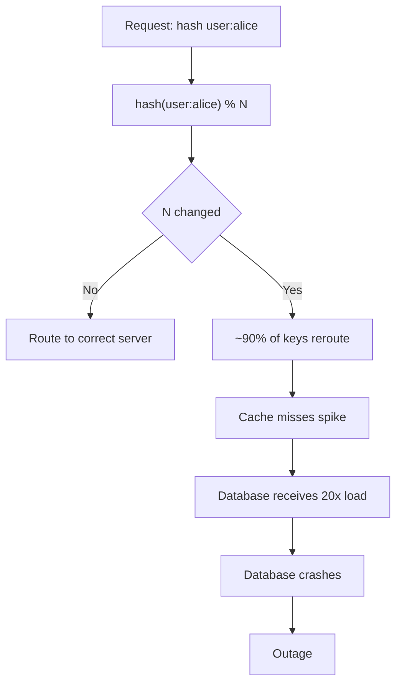
```mermaid
flowchart TD
    A[Request: hash user:alice] --> B["hash(user:alice) % N"]
    B --> C{N changed }
    C -- No --> D[Route to correct server]
    C -- Yes --> E["~90% of keys reroute"]
    E --> F[Cache misses spike]
    F --> G[Database receives 20x load]
    G --> H[Database crashes]
    H --> I[Outage]
```

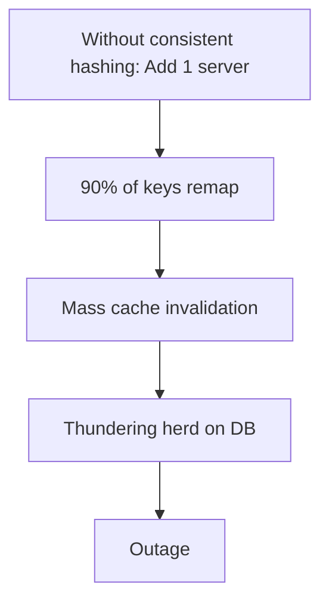
```mermaid
flowchart TD
    A["Without consistent hashing: Add 1 server"] --> B["90% of keys remap"]
    B --> C["Mass cache invalidation"]
    C --> D["Thundering herd on DB"]
    D --> E["Outage"]
```

---

#### Consistent Hashing: How It Works

**The core idea:** Instead of using the server count N as the modulus, map both keys and servers onto a fixed ring. A key belongs to the nearest server clockwise from its position.

**Ring construction:**

1. The output space of the hash function (0 to 2^32 or 0 to 2^64) is treated as a circular ring
2. Each server is placed on the ring at position `hash(server_id)`
3. Each key is placed on the ring at position `hash(key)`
4. A key belongs to the server at the first position clockwise from the key's position

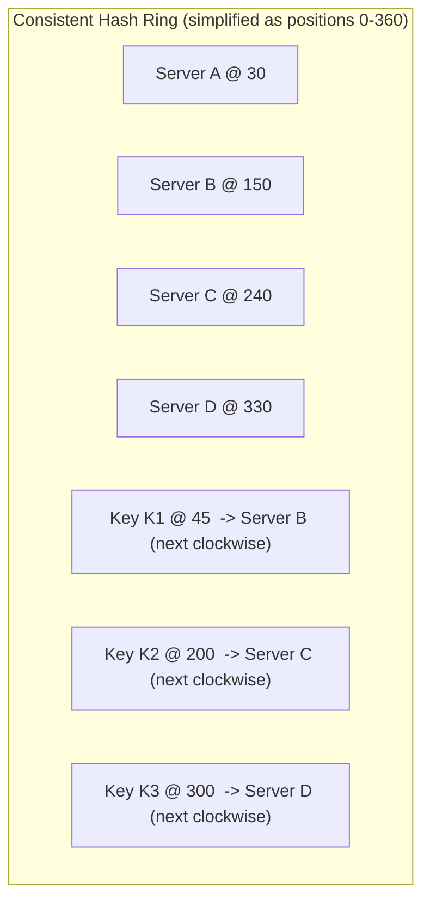
```mermaid
graph TD
    subgraph "Consistent Hash Ring (simplified as positions 0-360)"
    A["Server A @ 30 "]
    B["Server B @ 150 "]
    C["Server C @ 240 "]
    D["Server D @ 330 "]
    K1["Key K1 @ 45  -> Server B (next clockwise)"]
    K2["Key K2 @ 200  -> Server C (next clockwise)"]
    K3["Key K3 @ 300  -> Server D (next clockwise)"]
    end
```

**Adding a server (worked example):**

```
BEFORE: Servers A (30 ), B (150 ), C (240 ), D (330 )
  Key K1 @ 45  -> B (next clockwise from 45  is 150  = B)
  Key K2 @ 200  -> C (next clockwise from 200  is 240  = C)

ADD Server E at 100 :
  Now ring: A(30 ), E(100 ), B(150 ), C(240 ), D(330 )
  
  Key K1 @ 45  -> E (next clockwise from 45  is now 100  = E)  <- MOVED
  Key K2 @ 200  -> C (unchanged)
  
Only keys in the arc between A and E (30  to 100 ) move to E.
That is ~1/5 of keys. The other 4/5 are undisturbed.
```

**Removing a server:**

```
REMOVE Server B at 150 :
  Keys that were going to B (arc from 100  to 150 ) now go to C (next clockwise = 240 )
  Only B's keys move. All other keys are unaffected.
```

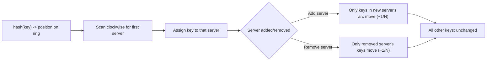
```mermaid
flowchart LR
    A["hash(key) -> position on ring"] --> B["Scan clockwise for first server"]
    B --> C["Assign key to that server"]
    C --> D{Server added/removed }
    D -- "Add server" --> E["Only keys in new server's arc move (~1/N)"]
    D -- "Remove server" --> F["Only removed server's keys move (~1/N)"]
    E --> G["All other keys: unchanged"]
    F --> G
```

**The guarantee:** When you add or remove a server, only approximately `1/N` of all keys need to move. For 10 servers, that is 10% -- not 90%.

---

#### Virtual Nodes: Why You Need Them

**The problem with a raw ring:** If you place each server at exactly one position on the ring, the distribution can be highly uneven by chance.

Example with 3 servers, randomly placed:
```
Ring positions (0-360 ):
  Server A @ 10 
  Server B @ 15   
  Server C @ 200 

Arc sizes:
  A owns: 200  to 10  = 170  of the ring (~47% of keys)
  B owns: 10  to 15  = 5  of the ring (~1.4% of keys)   <- almost nothing
  C owns: 15  to 200  = 185  of the ring (~51% of keys)
```

Server B handles 1.4% of load while A and C handle nearly everything. This is terrible distribution.

**Virtual nodes (vnodes) fix this:** Each physical server is placed on the ring at multiple positions. Typically 100-200 virtual positions per server, each computed as `hash(server_id + "#" + vnode_index)`.

```
Server A's vnodes: A#0 @ 12 , A#1 @ 67 , A#2 @ 134 , A#3 @ 198 , A#4 @ 287 , ...
Server B's vnodes: B#0 @ 34 , B#1 @ 89 , B#2 @ 156 , B#3 @ 231 , B#4 @ 310 , ...
Server C's vnodes: C#0 @ 45 , C#1 @ 112 , C#2 @ 178 , C#3 @ 256 , C#4 @ 334 , ...
```

With 150 vnodes each, the arc ownership is smoothed: each server gets approximately 1/3 of the ring, with only small statistical variance.

**Adding a server with vnodes:** The new server's 150 vnodes are inserted across the ring. Each vnode takes a small arc from whichever server previously owned that arc. The load shift is spread across many existing servers, so no single server is hit hard.

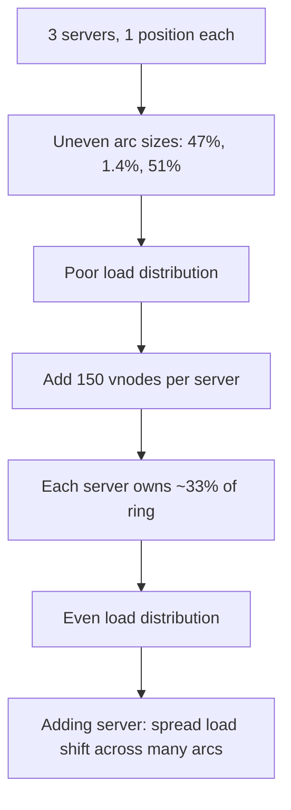
```mermaid
flowchart TD
    A["3 servers, 1 position each"] --> B["Uneven arc sizes: 47%, 1.4%, 51%"]
    B --> C["Poor load distribution"]
    C --> D["Add 150 vnodes per server"]
    D --> E["Each server owns ~33% of ring"]
    E --> F["Even load distribution"]
    F --> G["Adding server: spread load shift across many arcs"]
```

---

#### Jump Hashing: When You Do Not Need a Ring

Consistent hashing with vnodes requires O(V) memory (where V = vnodes, typically 100-200 x N) and O(log V) lookup time via binary search. For very large clusters, this adds up.

**Jump hashing** (Google, 2014) provides the same minimal-movement guarantee as consistent hashing, but with O(log N) time and O(1) space -- no ring, no sorted array.

```python
# Jump hash -- pseudocode (Lamping & Veach, 2014)
def jump_hash(key: int, num_buckets: int) -> int:
    b = -1
    j = 0
    while j < num_buckets:
        b = j
        key = (key * 2862933555777941757 + 1) % (2**64)
        j = int((b + 1) * (2**31 / ((key >> 33) + 1)))
    return b
```

The loop runs O(log N) times. No data structures needed beyond the key and bucket count.

**The guarantee:** When you go from N buckets to N+1 buckets, only K/(N+1) keys move to the new bucket (where K is total keys). This matches consistent hashing's property.

**Critical limitation:** Jump hashing only works for *contiguous* bucket numbering: 0, 1, 2, ..., N-1. You can add buckets (go from N to N+1), but you cannot remove an arbitrary bucket -- removing bucket 3 from a 10-bucket set leaves a gap. You would have to remap everything to buckets 0-8.

**When to use jump hashing vs consistent hashing:**

| Scenario | Use |
|----------|-----|
| Servers only added, never removed mid-range | Jump hashing |
| Fixed shard count with occasional growth | Jump hashing |
| Servers join and leave arbitrarily (caches, nodes fail) | Consistent hashing |
| You need zero memory overhead | Jump hashing |
| N is large (>10,000 nodes) | Jump hashing (O(1) memory vs O(V) for vnodes) |

---

#### Rendezvous Hashing

**The problem:** You need consistent assignment like consistent hashing, but N is small (fewer than 50 nodes), and you want to avoid the ring data structure entirely.

**Rendezvous hashing** (also called Highest Random Weight hashing): For each key, compute a score for every candidate server. Assign the key to the server with the highest score.

```python
def rendezvous_assign(key: str, servers: list) -> str:
    # Score each server for this key
    scored = [(hash(key + ":" + server), server) for server in servers]
    # Return server with highest score
    return max(scored)[1]
```

**Properties:**
- When a server leaves, each of its keys independently re-evaluates and picks the next-highest server. No coordination needed.
- Only ~1/N of keys move when a server is added or removed.
- O(N) per lookup -- you must score all N servers for each key.

**When O(N) is acceptable:** When N is small (5 replicas, 10 CDN origins, 20 database read replicas). For these cases, rendezvous hashing is simpler than building and maintaining a vnode ring.

**Real uses:** Nginx upstream selection, CDN origin server selection, read replica selection in distributed databases, consistent selection of cache replicas.

---

#### Hashing Algorithm Comparison Table

| Algorithm | Lookup Time | Memory | Handles Arbitrary Removal | Best For |
|-----------|-------------|--------|--------------------------|----------|
| **Modulo (% N)** | O(1) | O(1) | No -- full remap | Fixed-size in-memory hash tables |
| **Consistent hashing + vnodes** | O(log V) | O(V) | Yes -- any node, minimal move | Distributed caches, KV stores, Cassandra, Dynamo |
| **Jump hashing** | O(log N) | O(1) | Last bucket only | Fixed/growing shard counts, immutable storage |
| **Rendezvous hashing** | O(N) | O(N) | Yes -- any node, minimal move | Small N: CDN origins, replica selection |

**Staff-level framing:** "Consistent hashing is not always the right answer. If our shard count only grows (we never remove a shard mid-range), jump hashing gives the same redistribution guarantee with zero memory overhead. For our 5 read replicas, rendezvous hashing is simpler and avoids managing a ring entirely."

---

#### L5 vs L6: Hash Functions

| Aspect | L5 Thinking | L6 Thinking |
|--------|-------------|-------------|
| **Sharding key** | "We use `user_id % 10`" | "Modulo causes full redistribution on resize. We use consistent hashing. Adding a shard moves ~10% of keys, not 90%." |
| **Adding capacity** | "We add a server to the pool" | "We add a server's vnodes to the ring. Keys in its arcs migrate. During migration, we dual-read (old + new) to handle the transition window." |
| **Hot partition** | "One shard is getting more traffic" | "Our shard key is `user_id` but one influencer account has 100x the traffic. We need a secondary index key or a dedicated shard for that account." |
| **Hash function choice** | "We use MD5" | "MD5 for partitioning is fine, but we use xxHash -- it is 10x faster and has better distribution for short strings. MD5 is deprecated for any security use." |

---

### Building Block 2: Caching

#### Why Does This Exist 

Databases are slow compared to memory. A typical disk read takes 1-10 milliseconds. A typical Redis read takes 0.1-1 milliseconds. Memory access is orders of magnitude faster than disk. If you could keep your most-used data in memory, reads would be 10-100x faster.

Caching exists because **most systems have a small "hot set" of data that handles most of the read traffic**. The 80/20 rule applies to data: roughly 20% of your data items receive 80% of reads. If you can fit that 20% in a cache, you serve 80% of reads from memory without touching the database.

**The mathematical impact:** If 95% of reads hit the cache:
- Only 5% reach the database
- Database load = 1/20th of total read load
- A system needing 100 database replicas without caching needs only 5 with caching
- The 95 saved replicas represent enormous cost savings

**Production example:** At its scale, Twitter's feed service handles hundreds of thousands of reads per second. Each feed read touches dozens of tweet IDs. Without caching, each read would require multiple database round-trips. Their Memcached layer handles approximately 99% of reads. Without it, their database tier would need to be 100x larger.

#### What Is a Cache  (Desk vs. Filing Cabinet)

A **cache** is a faster, smaller storage layer that holds a subset of data from a slower, larger primary store.

**The analogy:** Your desk (cache) vs. the filing cabinet in the corner (database).

- You keep frequently-used files on your desk for immediate access
- When you need a document, you check your desk first
- If it is there (**cache hit**): you use it immediately -- no trip to the cabinet
- If it is not there (**cache miss**): you walk to the cabinet, get it, and put a copy on your desk

The desk has limited space. Eventually you clear off documents you have not used recently to make room for new ones. This is **eviction**.

#### Types of Caches in a System

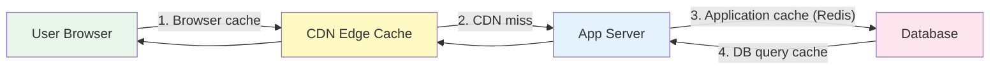
```mermaid
flowchart LR
    User["User Browser"] -->|"1. Browser cache"| CDN["CDN Edge Cache"]
    CDN -->|"2. CDN miss"| AppServer["App Server"]
    AppServer -->|"3. Application cache (Redis)"| DB["Database"]
    DB -->|"4. DB query cache"| AppServer
    AppServer --> CDN
    CDN --> User

    style User fill:#e8f5e9
    style CDN fill:#fff9c4
    style AppServer fill:#e3f2fd
    style DB fill:#fce4ec
```

| Cache Type | Where | What It Caches | Typical Latency | Hit Rate |
|------------|-------|----------------|-----------------|---------|
| **CPU L1/L2/L3** | Inside the CPU | Memory addresses | 1-40 nanoseconds | 95-99% |
| **Browser cache** | Client device | Static assets, API responses | 0 ms (disk) | Varies by user |
| **CDN cache** | Edge servers near users | Static files, sometimes API | 5-50 ms | 80-95% for static |
| **Application cache** | Server-side (Redis, Memcached) | DB results, computed data | 0.1-1 ms | 80-99% |
| **Database query cache** | Inside DB engine | Query result sets | 1-5 ms | 50-90% |

**Layered caching in practice:** A single request might pass through all these layers. A CDN hit never reaches your servers at all. An application cache hit never touches the database. Each layer protects the layers beneath it.

---

#### Cache-Aside Pattern: Step-by-Step

Cache-aside (also called lazy loading) is the most common caching pattern. The application code manages the cache explicitly.

**Read path:**

```
1. Request arrives for key K (e.g., "user:12345")
2. Application checks cache: GET user:12345
3a. Cache HIT -> return value directly (fast path, ~0.5ms)
3b. Cache MISS ->
      a. Query database: SELECT * FROM users WHERE id = 12345
      b. Receive row from database (~5ms)
      c. Write to cache: SET user:12345 <row> EX 3600 (TTL: 1 hour)
      d. Return row to caller
```

**Write path (on data change):**

```
When user 12345 updates their profile:
  a. Write to database: UPDATE users SET name = 'Alice' WHERE id = 12345
  b. Invalidate cache: DEL user:12345
  c. Next read will be a cache miss -> loads fresh data -> re-populates cache
```

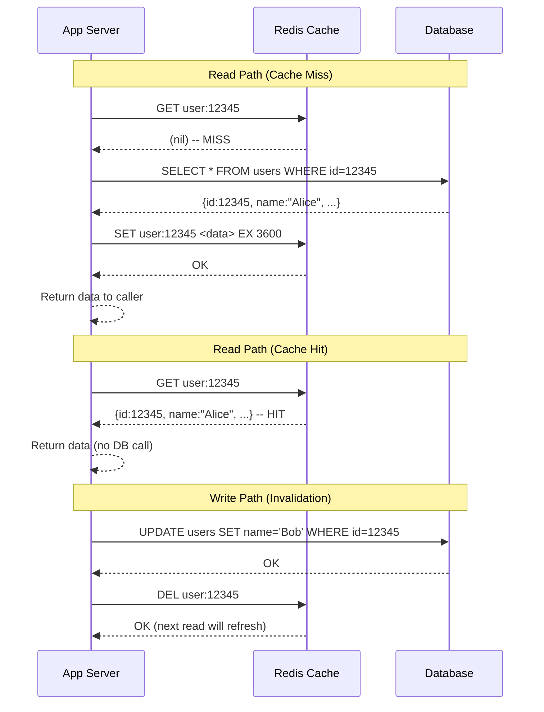
```mermaid
sequenceDiagram
    participant App as App Server
    participant Cache as Redis Cache
    participant DB as Database

    Note over App,DB: Read Path (Cache Miss)
    App->>Cache: GET user:12345
    Cache-->>App: (nil) -- MISS
    App->>DB: SELECT * FROM users WHERE id=12345
    DB-->>App: {id:12345, name:"Alice", ...}
    App->>Cache: SET user:12345 <data> EX 3600
    Cache-->>App: OK
    App-->>App: Return data to caller

    Note over App,DB: Read Path (Cache Hit)
    App->>Cache: GET user:12345
    Cache-->>App: {id:12345, name:"Alice", ...} -- HIT
    App-->>App: Return data (no DB call)

    Note over App,DB: Write Path (Invalidation)
    App->>DB: UPDATE users SET name='Bob' WHERE id=12345
    DB-->>App: OK
    App->>Cache: DEL user:12345
    Cache-->>App: OK (next read will refresh)
```

**Why cache-aside is preferred:**
- The application controls what gets cached and for how long
- Cache failures are graceful -- on miss, fall back to database
- Works with any cache technology (Redis, Memcached, in-process)
- Simple to understand and debug

---

#### All Five Cache Patterns Explained

**Write-Through:**

Every write goes to both the cache and the database simultaneously.

```
Write "Alice" ->
  1. Write to cache: SET user:12345 {"name":"Alice"} EX 3600
  2. Write to database: UPDATE users SET name='Alice' WHERE id=12345
  3. Return success only after BOTH succeed
```

```
Pros: Cache always has the latest data (strong consistency)
Cons: Every write hits both cache and DB -> higher write latency, double write load
When: Session data, feature flags, any data that must always be fresh in cache
Real example: User authentication token -- must be consistent immediately
```

**Write-Behind (Write-Back):**

Write to cache immediately. Write to database asynchronously later.

```
Write "Alice" ->
  1. Write to cache: SET user:12345 {"name":"Alice"} (immediate)
  2. Return success immediately
  3. Background worker: flush to DB within 5-30 seconds
```

```
Pros: Extremely fast writes (cache speed, not DB speed)
Cons: If cache dies before flush, data is lost. Complex recovery.
When: View counts, like counts, metrics -- where losing a few counts is acceptable
Real example: YouTube view counter -- you can afford to lose 100 views if cache crashes
NEVER use for: Financial transactions, orders, anything where loss is unacceptable
```

**Write-Around:**

Write directly to the database, bypassing the cache entirely. Cache is populated on reads.

```
Write "Alice" ->
  1. Write to database only: UPDATE users SET name='Alice' WHERE id=12345
  2. Do NOT update cache (cache has stale or no entry)
  Next read -> cache miss -> reload from DB -> populate cache
```

```
Pros: No cache pollution from write-heavy data that is rarely read
Cons: First read after a write is always a cache miss
When: Write-heavy data (logs, audit trails, bulk imports)
Real example: Log ingestion -- you write millions of log entries per minute but rarely read individual ones
```

**Read-Through:**

The cache layer (not the application) is responsible for fetching from the database on a miss.

```
Read user:12345 ->
  1. Application calls cache: cache.get("user:12345")
  2. Cache checks internally: Do I have this 
  3a. HIT -> cache returns value to application
  3b. MISS -> cache fetches from DB itself, stores it, returns to application
  Application never talks to DB directly
```

```
Pros: Simpler application code -- always talk to cache, never directly to DB
Cons: Requires a smart cache proxy that knows how to fetch from your DB
When: Caching layers with built-in loaders (Redis + a loader function, DAX for DynamoDB)
Real example: DynamoDB Accelerator (DAX) -- DynamoDB with transparent caching built in
```

**Comparison Table:**

| Pattern | Consistency | Write Latency | Read Latency | Data Loss Risk | Best For |
|---------|-------------|---------------|--------------|---------------|----------|
| **Cache-aside** | Eventual | Normal (DB only) | Fast after first miss | None | Most web apps, product catalog, user profiles |
| **Write-through** | Strong | Slow (cache + DB) | Fast (always cached) | None | Sessions, config, tokens |
| **Write-behind** | Eventual (async) | Very fast (cache only) | Fast | Yes (if cache dies) | View counts, metrics, non-critical counters |
| **Write-around** | Eventual | Normal (DB only) | Slow (always misses first read) | None | Write-heavy, rarely-read data |
| **Read-through** | Eventual | Normal | Fast after first miss | None | Smart cache proxies, DAX |

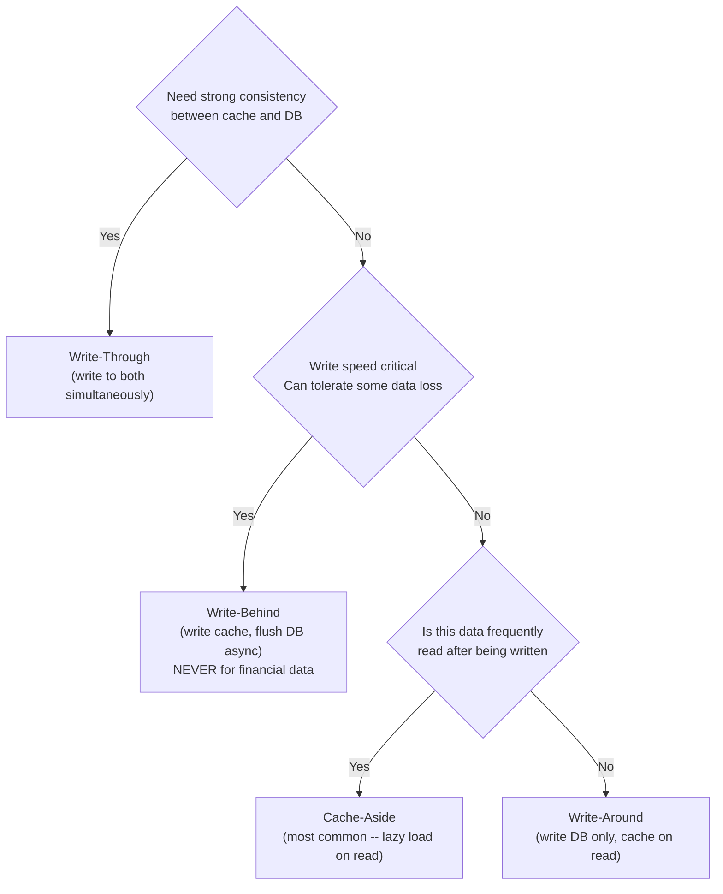
```mermaid
flowchart TD
    Q1{Need strong consistency\nbetween cache and DB }
    Q1 -- Yes --> WriteThrough["Write-Through\n(write to both simultaneously)"]
    Q1 -- No --> Q2{Write speed critical \nCan tolerate some data loss }
    Q2 -- Yes --> WriteBehind["Write-Behind\n(write cache, flush DB async)\nNEVER for financial data"]
    Q2 -- No --> Q3{Is this data frequently\nread after being written }
    Q3 -- Yes --> CacheAside["Cache-Aside\n(most common -- lazy load on read)"]
    Q3 -- No --> WriteAround["Write-Around\n(write DB only, cache on read)"]
```

---

#### TTL: How to Choose the Right Value

TTL (Time To Live) is the duration after which a cached entry automatically expires. Every cached entry should have one -- caches that never expire entries grow unboundedly and will eventually serve dangerously stale data.

**The fundamental trade-off:** Short TTL -> fresh data, more cache misses, higher DB load. Long TTL -> stale data, fewer misses, lower DB load.

| Data Type | Acceptable Staleness | Recommended TTL | Reasoning |
|-----------|---------------------|-----------------|-----------|
| User session | Until logout | 24 hours | Session must be valid; revocation via explicit invalidation |
| User profile (name, avatar) | Minutes to hours | 1-6 hours | Rarely changes; staleness is tolerable |
| Product price | Seconds to minutes | 60-300 seconds | Can change hourly; users expect near-current prices |
| Product description | Days | 24-72 hours | Very rarely changes |
| Inventory count | Seconds | 10-60 seconds | Changes with every purchase; stale count causes oversell |
| Homepage featured items | Minutes | 5-30 minutes | Controlled by marketing; near-real-time enough |
| Static assets (JS, CSS) | Weeks | 7-30 days | Use versioned URLs; deploy new version with new URL |
| Exchange rates | Minutes | 60 seconds | Business risk from stale rates |

**Jitter:** If you set all entries to expire at the same TTL, they may all expire at nearly the same time (e.g., if a cache is loaded in bulk). Add a small random jitter to spread expirations:

```python
ttl = base_ttl + random.randint(0, base_ttl // 10)  # +/-10% jitter
```

---

#### Cache Invalidation: The Hard Problem

Phil Karlton's famous quote: "There are only two hard things in Computer Science: cache invalidation and naming things."

**Why it is hard:** You have multiple representations of the same data -- one in the database, one or more in various cache tiers. When the database changes, all cache copies must either be updated or invalidated. Miss any one of them and you serve stale data.

**Four invalidation strategies:**

**1. TTL-only (time-based):**
Accept that data may be stale for up to TTL seconds. Do not explicitly invalidate on writes.
- Simple to implement
- Works when eventual consistency is acceptable (product descriptions, static content)
- Breaks when data must be fresh immediately (user balance, inventory count)

**2. Invalidate on write (delete-on-write):**
Every time you write to the database, delete the corresponding cache key.
```python
def update_user_profile(user_id, new_name):
    db.execute("UPDATE users SET name =   WHERE id =  ", new_name, user_id)
    cache.delete(f"user:{user_id}")
    # Next read will be a miss and refresh from DB
```
- More consistent than TTL-only
- Adds complexity: must track which cache keys are affected by each write
- Risk: if cache delete fails, stale entry persists until TTL

**3. Write-through:**
Update cache and database together on every write. Cache always reflects DB.
- Strongest consistency
- Higher write overhead (every write hits both systems)
- If cache is down during a write, the write must still succeed (write DB, skip cache, invalidate on recovery)

**4. Version in key:**
Embed a version number or hash in the cache key. When data changes, increment the version. Old keys expire naturally.
```
Key: user:12345:v4   (v4 is the current version)
On update: write user:12345:v5. Old v4 key expires via TTL.
```
- Works well for CDN cache (you cannot push invalidation to edge nodes reliably)
- Requires the client to know the current version (often stored in a fast lookup)

---

#### Cache Hit Rate: The Multiplier Effect

**The math:** If your cache handles H% of reads, your database handles only (100-H)% of reads.

| Cache Hit Rate | DB Load Reduction | Effective DB Multiplier |
|---------------|-------------------|------------------------|
| 50% | 2x | 2x fewer DB calls |
| 80% | 5x | 5x fewer DB calls |
| 90% | 10x | 10x fewer DB calls |
| 95% | 20x | 20x fewer DB calls |
| 99% | 100x | 100x fewer DB calls |

**What this means in practice:** A system receiving 2,000,000 read QPS with a 95% hit rate sends only 100,000 QPS to the database. At $0.20/hour per database replica handling 10,000 QPS, you need 10 replicas ($2/hour) instead of 200 ($40/hour). The cache pays for itself many times over.

**What determines hit rate:**

1. **Working set size vs cache size:** If your "hot" data is 10 GB and your cache is 1 GB, you can only hold 10% of it. Misses will be frequent. Increase cache size or reduce working set (TTL shorter = more churn).

2. **TTL length:** Shorter TTL = more expirations = more misses. Longer TTL = higher hit rate = more staleness.

3. **Key design:** If your cache key includes a timestamp (e.g., `product:123:2024-01-15T14:32:07`), you will never hit the same key twice. Cache keys must be designed for reuse.

4. **Eviction policy:** LRU (Least Recently Used) evicts keys that have not been accessed recently. This naturally keeps the hot set in cache. LFU (Least Frequently Used) keeps the most-accessed items.

5. **Access pattern:** If access is highly skewed (10% of items get 90% of traffic), a small cache handles a large fraction of requests. If access is uniform (every item equally popular), you need the entire dataset in cache to get good hit rates.

---

#### Cache Stampede: What It Is and Three Ways to Fix It

**The problem:** A popular cache entry (e.g., the homepage product list) has a TTL of 60 seconds. At second 60, the TTL expires. In the next 100 milliseconds, 50,000 requests arrive. All of them miss the cache. All 50,000 hit the database simultaneously. The database -- designed for 5,000 QPS -- receives 500,000 QPS in a burst and crashes.

This is a **cache stampede** (also called **thundering herd**).

**Why it happens:** All entries cached at the same time expire at the same time. Popular entries attract many simultaneous requests.

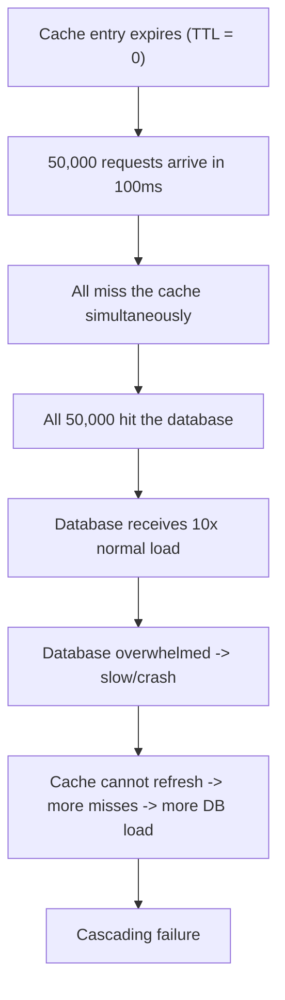
```mermaid
flowchart TD
    A["Cache entry expires (TTL = 0)"] --> B["50,000 requests arrive in 100ms"]
    B --> C["All miss the cache simultaneously"]
    C --> D["All 50,000 hit the database"]
    D --> E["Database receives 10x normal load"]
    E --> F["Database overwhelmed -> slow/crash"]
    F --> G["Cache cannot refresh -> more misses -> more DB load"]
    G --> H["Cascading failure"]
```

**Mitigation 1: Request coalescing (locking)**

The first request to miss the cache acquires a lock and refreshes. All other concurrent requests either wait for the lock or receive the stale value while refresh is in progress.

```python
def get_with_lock(key: str) -> dict:
    value = cache.get(key)
    if value is not None:
        return value  # Cache hit

    lock_key = f"lock:{key}"
    if cache.setnx(lock_key, "1"):  # Acquire lock (atomic set-if-not-exists)
        cache.expire(lock_key, 5)   # Lock expires in 5 seconds (safety)
        try:
            value = db.query(key)
            cache.set(key, value, ex=3600)
            return value
        finally:
            cache.delete(lock_key)  # Release lock
    else:
        # Another request is refreshing; wait briefly and retry or return stale
        time.sleep(0.05)
        return cache.get(key) or db.query(key)  # Fallback
```

**Mitigation 2: Probabilistic early expiration**

Before the TTL fully expires, some requests probabilistically decide to refresh early. This spreads the refresh load over time rather than spiking at TTL=0.

```python
import math, random, time

def get_with_early_expiry(key: str, beta: float = 1.0) -> dict:
    value, expiry, delta = cache.get_with_metadata(key)
    if value is None:
        return refresh_from_db(key)  # Already expired, must refresh
    
    # Probabilistic early expiry: sometimes refresh before TTL=0
    remaining_ttl = expiry - time.time()
    if -delta * beta * math.log(random.random()) >= remaining_ttl:
        # Refresh now (probabilistically, when TTL is getting low)
        return refresh_from_db(key)
    return value
```

**Mitigation 3: Background refresh (stale-while-revalidate)**

Serve the stale value immediately. Trigger a background job to refresh the cache asynchronously. The user sees slightly stale data for one request cycle, but never waits for a DB round-trip.

```python
def get_with_background_refresh(key: str) -> dict:
    value, ttl = cache.get_with_ttl(key)
    
    if value is None:
        # Completely expired -- must synchronously refresh
        return refresh_from_db(key)
    
    if ttl < 60:  # TTL under 60 seconds -- trigger background refresh
        background_queue.enqueue(refresh_task, key)  # Async, non-blocking
    
    return value  # Return current value immediately
```

**Which to use:**
- Request coalescing: when serving stale data is unacceptable (financial data, inventory counts)
- Probabilistic early expiry: simple, no coordination, good for most use cases
- Background refresh: best user experience (never stale, never waits), but requires background workers

---

#### Hot Keys: When One Key Gets All the Traffic

A **hot key** is a single cache key that receives orders-of-magnitude more traffic than average.

**Examples:**
- A celebrity's profile page (`user:justinbieber`) requested by millions of followers simultaneously
- A blockbuster product's listing page (`product:iphone-16-pro`) on launch day
- A global configuration value (`config:feature-flags`) read by every server on every request
- A trending hashtag's tweet list (`hashtag:superbowl`) during a live event

**Why it breaks things:** All requests for a hot key route to the same cache node (by consistent hashing). That single node must handle all 100,000 QPS while other nodes sit idle at 1,000 QPS. The hot node becomes the bottleneck.

**Four solutions:**

**1. Local in-process cache:**
Each application server keeps a small in-memory copy of extremely hot keys.

```python
from functools import lru_cache
import time

# Simple in-process TTL cache
_local_cache = {}

def get_hot_key(key: str) -> dict:
    if key in _local_cache:
        value, expiry = _local_cache[key]
        if time.time() < expiry:
            return value  # Local hit -- no network call
    
    value = redis.get(key)  # Fall through to Redis
    _local_cache[key] = (value, time.time() + 5)  # Cache locally for 5 seconds
    return value
```

With 100 app servers, the Redis node now receives 100 QPS instead of 10,000 QPS for that key.

**2. Key sharding (fan-out reads):**
Store the same value under multiple keys. Read from a randomly selected key.

```python
NUM_SHARDS = 10

def set_hot_key(key: str, value: dict):
    for i in range(NUM_SHARDS):
        redis.set(f"{key}:shard:{i}", value, ex=3600)

def get_hot_key(key: str) -> dict:
    shard = random.randint(0, NUM_SHARDS - 1)
    return redis.get(f"{key}:shard:{shard}")
```

Now the traffic for this key is spread across 10 cache nodes (via consistent hashing of 10 different keys).

**3. CDN for read-only hot data:**
For data that does not change per user (a celebrity's public profile, a trending post), serve from CDN. The CDN handles millions of requests without touching Redis or your database.

**4. Rate limiting and circuit breaking:**
If a hot key is being accessed due to a bug (infinite loop in a client) or abuse, rate-limit requests per key. Circuit-break to a default value if the key exceeds threshold.

---

#### Eviction Policies: How the Cache Decides What to Remove

When a cache reaches its maximum size, it must evict (remove) entries to make room for new ones. The eviction policy determines which entries are removed.

| Policy | How It Works | Best For |
|--------|-------------|---------|
| **LRU** (Least Recently Used) | Evict the entry that was least recently accessed | General-purpose; keeps recently-accessed data |
| **LFU** (Least Frequently Used) | Evict the entry accessed least often overall | Skewed access patterns; keeps perennially popular items |
| **FIFO** (First In, First Out) | Evict the oldest entry | Simple but ignores access patterns |
| **Random** | Evict a random entry | Simple; surprisingly competitive with LRU in some studies |
| **TTL-based** | Evict expired entries first | Good default; combine with LRU for non-expired entries |

**LRU vs LFU:** LRU is generally better for web caches where recency matters (if you accessed it recently, you probably will again). LFU is better for caches with stable, highly-skewed access patterns (some items are always popular regardless of when they were last accessed). Redis supports both via `maxmemory-policy`.

---

#### Production Failure Story: The Celebrity Photo Stampede

**Incident:** In 2012, a major social network had a celebrity with 20 million followers post a new profile photo. The photo's metadata was cached with a 5-minute TTL. At exactly 5 minutes after the post, the cache entry expired. In the next 200 milliseconds, approximately 80,000 users loaded the celebrity's profile and all got a cache miss simultaneously. The database received 80,000 simultaneous queries for the same row. The database query planner could not handle the concurrent load on that single row's index. Response times spiked to 30 seconds. The page became effectively unavailable for that celebrity's profile for 4 minutes.

**Fix applied:** They implemented per-entry TTL jitter and background refresh for accounts with followers above 1 million. TTL jitter ensured that even if two requests cached the same data, they would expire at slightly different times. Background refresh meant the cache was refreshed before expiry, so the stampede condition never arose.

**Lesson:** Hot keys need special treatment. Standard cache patterns break at extreme traffic concentrations. Identify your hot keys in advance (follower count, product popularity, feature flag access frequency) and apply mitigations proactively.

---

#### L5 vs L6: Caching

| Aspect | L5 Thinking | L6 Thinking |
|--------|-------------|-------------|
| **Cache pattern** | "We cache database results in Redis" | "We use cache-aside with 5-minute TTL. On write, we invalidate the key. We add 10% TTL jitter to prevent mass expiration." |
| **Hit rate** | "The cache is working well" | "Our target hit rate is 95%. Currently at 87% because our working set (8 GB) exceeds cache size (4 GB). We need to either increase cache memory or reduce TTL to evict more aggressively." |
| **Stampede** | "Redis handles concurrent requests" | "Our celebrity accounts have 10M followers. We use local in-process caching for the top 1000 accounts (by follower count) with a 30-second TTL. This reduces Redis load by 95% for hot keys." |
| **Failure** | "If Redis goes down, requests fail" | "If Redis goes down, we fall through to the database. We have circuit breakers: if DB latency exceeds 500ms for 10% of requests, we return cached-but-potentially-stale data from a secondary in-memory cache rather than hammering the DB." |
| **Invalidation** | "We update the cache when data changes" | "We invalidate on write and use a 1-hour TTL as a backstop. We track which cache keys correspond to each database entity in a mapping table, so a write to `users:12345` also invalidates `feed:*` keys that contain that user's data." |


---

### Building Block 3: State vs Stateless

#### Why Does This Exist 

In the early days of web applications, each server kept user sessions in its own memory. A user logged in to Server A, and Server A stored their session (user ID, shopping cart, preferences) in a Python dictionary or Java HashMap in RAM.

This worked fine with one server. The moment you added a second server, you had a problem: if the load balancer sent the user's next request to Server B, Server B had no session data. The user would appear to be logged out.

The industry solution was **sticky sessions**: configure the load balancer to always send a particular user to the same server. This fixed the immediate problem but created a new set of problems:

- If Server A is overloaded, you cannot move users from it to Server B
- If Server A crashes, all users whose sessions lived there are immediately logged out
- You cannot deploy a new version of Server A without logging out its users
- Auto-scaling becomes complicated -- new servers start with no sessions; old servers cannot be removed while users are on them

The solution was to stop storing state in the servers themselves and move it to a dedicated external store. With state externalized, every server is identical and interchangeable. This is the principle behind stateless servers.

#### What Stateful vs Stateless Means

**Stateful server:** Stores data between requests in its own memory. Request N+1 can depend on state set by Request N, but only if both hit the same server.

**Stateless server:** Stores nothing between requests. Every request is self-contained. If state is needed (e.g., who is the logged-in user ), the server fetches it from an external store on each request.

```mermaid
flowchart TD
    subgraph "Stateful (BAD for scale)"
        LB1[Load Balancer] -->|"User Alice -> sticky to A"| SA[Server A\nSession: {alice: logged_in}]
        LB1 -->|"User Bob -> sticky to B"| SB[Server B\nSession: {bob: logged_in}]
        SA -->|"Server A crashes"| X["Alice's session LOST"]
    end

    subgraph "Stateless (GOOD for scale)"
        LB2[Load Balancer] -->|"Any request"| S1[Server 1\nNo state]
        LB2 -->|"Any request"| S2[Server 2\nNo state]
        LB2 -->|"Any request"| S3[Server 3\nNo state]
        S1 -->|"Fetch session"| Redis[(Redis\nSessions)]
        S2 -->|"Fetch session"| Redis
        S3 -->|"Fetch session"| Redis
    end
```

#### The Standard Pattern: Stateless App Servers + Stateful External Stores

```
+-------------------------------------------------------------+
|                    STANDARD ARCHITECTURE                     |
|                                                             |
|  Load Balancer (round-robin, no sticky sessions needed)     |
|         |          |          |                             |
|    +----v---+  +---v----+  +-v------+                     |
|    |Server A|  |Server B|  |Server C|  <- Stateless         |
|    |(any    |  |(any    |  |(any    |    Interchangeable   |
|    |request)|  |request)|  |request)|    Add/remove freely |
|    +----+---+  +---+----+  +-+------+                     |
|         +----------+----------+                             |
|                    |                                        |
|         +----------+----------+                             |
|         |          |          |                             |
|    +----v---+  +---v----+  +-v------+                     |
|    |  Redis |  |  MySQL |  |  S3    |  <- Stateful stores   |
|    |(session|  |(user   |  |(files) |    Source of truth   |
|    | cache) |  | data)  |  |        |                      |
|    +--------+  +--------+  +--------+                      |
|                                                             |
+-------------------------------------------------------------+
```

**Why this works:**
- Any server handles any request -- load balancer can freely distribute
- Add a new server: it immediately starts handling requests (no warm-up, no session migration)
- Remove a server: in-flight requests complete, then it shuts down cleanly (no session loss)
- Scale independently: add more app servers without touching the state stores

---

#### Session Tokens vs JWT: A Deep Comparison

There are two main approaches to authenticating users in a stateless architecture.

**Server-side session tokens:**

1. User logs in -> server creates a session record in Redis: `session:abc123 = {user_id: 42, roles: [admin], expires: 2025-01-16}`
2. Server returns session ID in a cookie: `Set-Cookie: session_id=abc123`
3. Every subsequent request includes the cookie: `Cookie: session_id=abc123`
4. Server looks up `session:abc123` in Redis to identify the user (~0.5ms)

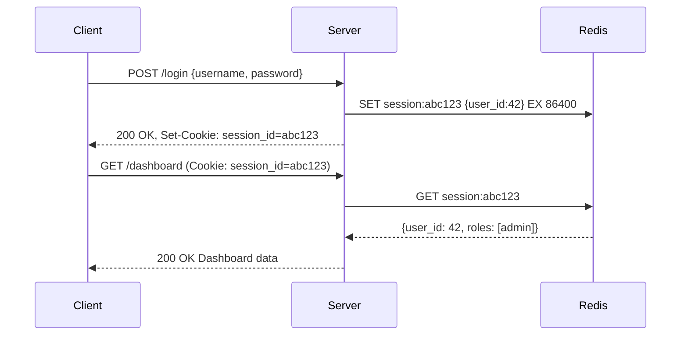
```mermaid
sequenceDiagram
    participant Client
    participant Server
    participant Redis

    Client->>Server: POST /login {username, password}
    Server->>Redis: SET session:abc123 {user_id:42} EX 86400
    Server-->>Client: 200 OK, Set-Cookie: session_id=abc123

    Client->>Server: GET /dashboard (Cookie: session_id=abc123)
    Server->>Redis: GET session:abc123
    Redis-->>Server: {user_id: 42, roles: [admin]}
    Server-->>Client: 200 OK Dashboard data
```

**JWT (JSON Web Token):**

1. User logs in -> server creates a signed token containing the user's data: `{"user_id": 42, "roles": ["admin"], "exp": 1737072000}`
2. Server signs it with a secret key and returns it: `Authorization: Bearer eyJhbGci...`
3. Every subsequent request includes the token: `Authorization: Bearer eyJhbGci...`
4. Server validates the signature locally -- **no Redis lookup needed**

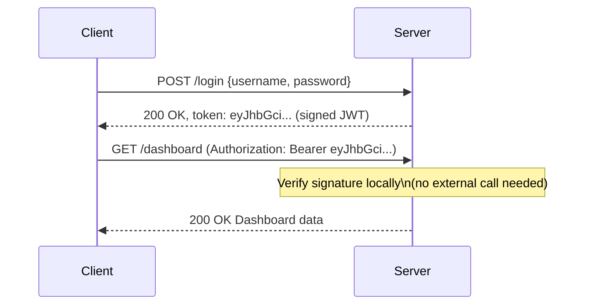
```mermaid
sequenceDiagram
    participant Client
    participant Server

    Client->>Server: POST /login {username, password}
    Server-->>Client: 200 OK, token: eyJhbGci... (signed JWT)

    Client->>Server: GET /dashboard (Authorization: Bearer eyJhbGci...)
    Note over Server: Verify signature locally\n(no external call needed)
    Server-->>Client: 200 OK Dashboard data
```

**Comparison:**

| Aspect | Server-side Session Token | JWT |
|--------|--------------------------|-----|
| **Storage** | Redis (server-side) | Client-side (in token) |
| **Network call per request** | Yes (1 Redis lookup) | No (local signature verification) |
| **Revocation** | Instant (delete from Redis) | Difficult (token valid until expiry) |
| **Scalability** | Redis must scale with traffic | Completely stateless |
| **Token size** | Small (just the session ID) | Larger (contains all claims) |
| **Logout all devices** | Trivially (delete all sessions for user) | Hard (need a revocation list) |
| **Security risk** | Redis compromise exposes active sessions | JWT secret compromise is catastrophic |

**When to use JWT:** Short-lived tokens (15-60 minutes) for APIs where instant revocation is not required. Mobile apps, third-party API access.

**When to use server-side sessions:** Applications that need instant revocation ("log out all devices", "ban this user immediately"), long-lived sessions, or where you want centralized control over active sessions.

**The revocation problem with JWTs:** If a user's account is compromised and you need to immediately invalidate their access, you cannot with pure JWTs -- the token is valid until it expires. The workaround is a **JWT blocklist** (store revoked JIDs in Redis). But this reintroduces a server-side lookup, negating some of JWT's statelessness benefit. This is a genuine trade-off with no perfect answer.

---

#### What Breaks Without Stateless Design

**Scenario: Stateful servers under load**

Your system has 3 servers with sticky sessions. Traffic increases 3x. You need to add 3 more servers.

Problems:
1. The 3 new servers have no sessions -- they cannot immediately serve users
2. You cannot rebalance users from overloaded old servers to new empty servers without logging them out
3. One overloaded old server has 60% of users -- you need it to handle 3x traffic while new servers sit idle
4. You cannot take an old server down for maintenance without logging out its users first

**With stateless servers:** Add 3 new servers. Load balancer immediately starts routing requests to them. They fetch session data from Redis just like the old servers. Zero migration, zero user impact. The old servers can be drained and redeployed without logging anyone out.

---

#### L5 vs L6: State Design

| Aspect | L5 Thinking | L6 Thinking |
|--------|-------------|-------------|
| **Architecture** | "Our servers store session data" | "Our app servers are stateless. Session data lives in Redis with a 24-hour TTL. Any server handles any request. We scale by adding servers to the pool without any session migration." |
| **JWT** | "We use JWT for authentication" | "We use JWT with 15-minute expiry for API access and refresh tokens (stored in Redis, 30-day TTL). Short JWT expiry limits the window of exposure if a token is compromised. Refresh tokens can be revoked immediately in Redis." |
| **Failure** | "If a server goes down, some users lose their session" | "If a server goes down, in-flight requests fail (clients retry). Session data is in Redis -- no session loss. Load balancer stops sending to the failed server within 5 seconds (health check interval)." |

---

### Building Block 4: Idempotency

#### Why Does This Exist 

Networks are unreliable. This is not a pessimistic view -- it is an engineering fact. Packets are dropped. Connections time out. Load balancers retry requests. Mobile clients lose connectivity and retry when reconnected. In a distributed system at scale, you should expect that any request might be sent more than once.

If your operations are idempotent, retries are harmless. If they are not, retries cause duplicates: double charges, duplicate orders, spam emails.

The concept of idempotency was formalized in HTTP/1.1 (RFC 7231) specifically because the protocol acknowledges that clients might need to retry requests. The RFC defines which HTTP methods are idempotent so clients know which requests are safe to retry.

**Production failure story:** In 2011, a major e-commerce company had a bug where their mobile app's checkout screen would sometimes submit the payment request twice due to a race condition on the "Pay" button. Users who double-tapped were charged twice. Because the payment API was not idempotent, both requests succeeded. The company processed thousands of double-charges before the bug was caught. The refund and reconciliation process took weeks. The company redesigned their entire payment API to require idempotency keys for all charge operations as a result.

#### What Idempotency Means (First Principles)

An operation is **idempotent** if applying it multiple times produces the same result as applying it once.

**Mathematical definition:** For an operation f and input x: `f(f(x)) = f(x)`

**Elevator button analogy:** You press the "Floor 5" button. The elevator goes to floor 5. You press "Floor 5" again. Nothing changes -- the elevator is already going to floor 5. The second press has no additional effect. Pressing the button N times has the same result as pressing it once.

**HTTP method idempotency:**

| Method | Idempotent  | Reason |
|--------|------------|--------|
| **GET** | Yes | Read-only. Same request returns same (or current) data. |
| **HEAD** | Yes | Same as GET, just returns headers. |
| **PUT** | Yes | "Set resource X to value Y." Doing it 5 times: X is still Y. |
| **DELETE** | Yes | "Remove resource X." Second delete: X is already gone. 404. Same end state. |
| **POST** | **No** | "Create a new resource." Each call creates a new one. |
| **PATCH** | Depends | "Apply this change." If change is "set name to Alice" -> idempotent. If change is "increment counter by 1" -> not idempotent. |

**The POST problem:** `POST /orders` creates a new order. If the client retries due to a timeout, a second order is created. This is the fundamental problem idempotency keys solve.

---

#### The Double-Charge Scenario: A Narrative

Follow this request through a payment system without idempotency:

```
T=0ms:    User clicks "Pay $99.99"
T=1ms:    Frontend sends POST /charges {amount: 99.99, card: "4111..."}
T=5ms:    API server receives request, begins processing
T=10ms:   Payment processor contacted, charge initiated
T=15ms:   Payment processor confirms charge SUCCESS
T=16ms:   API server begins preparing response
T=20ms:   Network glitch -- TCP connection drops
T=21ms:   API server: response never delivered
T=22ms:   API server closes connection, charge completed in DB
T=25ms:   Frontend: request timed out after 24ms. Retrying...
T=26ms:   Frontend sends POST /charges {amount: 99.99, card: "4111..."}
T=30ms:   API server receives retry, processes as NEW request
T=35ms:   Payment processor contacted again, charge initiated
T=40ms:   Payment processor confirms charge SUCCESS (second charge!)
T=41ms:   API server sends response: 200 OK
T=42ms:   Frontend receives response, shows "Payment successful"
T=43ms:   User sees one confirmation. They were charged twice. [N]
```

With idempotency:

```
T=0ms:    User clicks "Pay $99.99"
T=1ms:    Frontend generates idempotency key: "pay-12345-abc-xyz" (UUID)
T=2ms:    Frontend sends POST /charges {amount: 99.99, card: "4111...", 
          Idempotency-Key: "pay-12345-abc-xyz"}
T=5ms:    API server: check key "pay-12345-abc-xyz" in Redis -> not found
T=6ms:    Process payment...
T=15ms:   Payment processor confirms charge SUCCESS
T=16ms:   API server: store in Redis: "pay-12345-abc-xyz" -> {status: success, charge_id: "ch_123"}
T=20ms:   Network glitch -- TCP connection drops
T=25ms:   Frontend: request timed out. Retrying with SAME key...
T=26ms:   Frontend sends POST /charges {amount: 99.99, card: "4111...",
          Idempotency-Key: "pay-12345-abc-xyz"}
T=27ms:   API server: check key "pay-12345-abc-xyz" in Redis -> FOUND
T=28ms:   API server: return stored result {status: success, charge_id: "ch_123"}
T=29ms:   NO second charge. User charged exactly once. [Y]
```

---

#### Idempotency Keys: The Mechanism

**How they work:**

1. **Client generates a unique ID** for each logical operation. This should be a UUID v4 or another collision-resistant random ID. It must be generated once per *logical operation* (per "user clicked Pay"), not per *network request*.

2. **Client sends the key** with every request, including retries. The key must be the same across retries. `Idempotency-Key: 550e8400-e29b-41d4-a716-446655440000`

3. **Server checks the key** before processing. Lookup: `GET idempotency:550e8400-...`
   - Found: Return the stored response. Do not process again.
   - Not found: Process the request, store the key -> result, return the result.

4. **Server stores the key** with a TTL (typically 24 hours). The stored value is the response (or enough information to reconstruct it).

5. **After TTL expiry**, the key is gone. A retry with an expired key would be treated as a new request. Design your TTLs so that legitimate retries always occur within the window (24 hours is standard for payments).

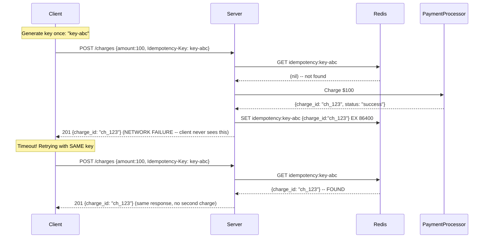
```mermaid
sequenceDiagram
    participant Client
    participant Server
    participant Redis
    participant PaymentProcessor

    Note over Client: Generate key once: "key-abc"

    Client->>Server: POST /charges {amount:100, Idempotency-Key: key-abc}
    Server->>Redis: GET idempotency:key-abc
    Redis-->>Server: (nil) -- not found
    Server->>PaymentProcessor: Charge $100
    PaymentProcessor-->>Server: {charge_id: "ch_123", status: "success"}
    Server->>Redis: SET idempotency:key-abc {charge_id:"ch_123"} EX 86400
    Server-->>Client: 201 {charge_id: "ch_123"} (NETWORK FAILURE -- client never sees this)

    Note over Client: Timeout! Retrying with SAME key

    Client->>Server: POST /charges {amount:100, Idempotency-Key: key-abc}
    Server->>Redis: GET idempotency:key-abc
    Redis-->>Server: {charge_id: "ch_123"} -- FOUND
    Server-->>Client: 201 {charge_id: "ch_123"} (same response, no second charge)
```

---

#### Implementation Pattern 1: Database Unique Constraint

The simplest implementation -- use the database's unique constraint enforcement.

```sql
-- Schema: orders table with unique constraint on idempotency_key
CREATE TABLE orders (
    id          SERIAL PRIMARY KEY,
    idempotency_key VARCHAR(64) UNIQUE NOT NULL,
    user_id     BIGINT NOT NULL,
    amount_cents INTEGER NOT NULL,
    status      VARCHAR(32) DEFAULT 'pending',
    created_at  TIMESTAMP DEFAULT NOW()
);

CREATE UNIQUE INDEX idx_orders_idempotency ON orders(idempotency_key);
```

```python
def create_order(idempotency_key: str, user_id: int, amount_cents: int) -> dict:
    try:
        result = db.execute("""
            INSERT INTO orders (idempotency_key, user_id, amount_cents)
            VALUES (%s, %s, %s)
            RETURNING id, status, created_at
        """, [idempotency_key, user_id, amount_cents])
        return result.fetchone()  # Newly created order
    
    except UniqueViolationError:
        # Duplicate key -- this is a retry. Return the existing order.
        result = db.execute("""
            SELECT id, status, created_at FROM orders
            WHERE idempotency_key = %s
        """, [idempotency_key])
        return result.fetchone()  # Return existing order without creating a new one
```

**Pros:** Atomically handles concurrent retries -- the database's unique constraint enforcement is the lock. No additional infrastructure needed.

**Cons:** Does not capture the *response* -- only prevents duplicate creation. If the original request failed after inserting but before returning, the retry returns the incomplete order.

---

#### Implementation Pattern 2: Redis Check-Then-Process

More flexible -- stores the full response and handles any operation type.

```python
import json
import uuid
from redis import Redis
from typing import Optional

redis = Redis(host='localhost', port=6379)
IDEMPOTENCY_TTL = 86400  # 24 hours

def process_payment(idempotency_key: str, amount_cents: int, card_token: str) -> dict:
    # Step 1: Check if we have already processed this key
    cache_key = f"idempotency:{idempotency_key}"
    cached = redis.get(cache_key)
    
    if cached is not None:
        # Already processed -- return the stored response
        return json.loads(cached)
    
    # Step 2: Process the payment (this is the expensive, non-idempotent operation)
    charge_result = payment_processor.charge(
        amount_cents=amount_cents,
        card_token=card_token
    )
    
    # Step 3: Store the result with TTL
    response = {
        "charge_id": charge_result.id,
        "status": charge_result.status,
        "amount_cents": amount_cents,
        "processed_at": charge_result.timestamp
    }
    redis.setex(cache_key, IDEMPOTENCY_TTL, json.dumps(response))
    
    return response
```

**The race condition problem:** Two concurrent requests with the same key arrive simultaneously. Both check Redis and both find the key absent. Both proceed to charge the card. This is a **TOCTOU (Time of Check to Time of Use)** race condition.

**Fix: Atomic lock with SETNX:**

```python
def process_payment_safe(idempotency_key: str, amount_cents: int, card_token: str) -> dict:
    cache_key = f"idempotency:{idempotency_key}"
    lock_key = f"idempotency_lock:{idempotency_key}"
    
    # Step 1: Check cache first (fast path for already-processed keys)
    cached = redis.get(cache_key)
    if cached:
        return json.loads(cached)
    
    # Step 2: Acquire a lock to prevent concurrent processing
    # SETNX = "SET if Not eXists" -- atomic, prevents race condition
    lock_acquired = redis.set(lock_key, "1", nx=True, ex=30)  # 30-second lock TTL
    
    if not lock_acquired:
        # Another request is processing this key. Wait and retry.
        import time
        time.sleep(0.1)
        cached = redis.get(cache_key)
        if cached:
            return json.loads(cached)
        raise RetryableError("Concurrent idempotency key processing -- retry")
    
    try:
        # Step 3: Double-check after acquiring lock (another request may have finished)
        cached = redis.get(cache_key)
        if cached:
            return json.loads(cached)
        
        # Step 4: Process
        charge_result = payment_processor.charge(amount_cents, card_token)
        response = {"charge_id": charge_result.id, "status": charge_result.status}
        redis.setex(cache_key, IDEMPOTENCY_TTL, json.dumps(response))
        return response
    finally:
        redis.delete(lock_key)  # Always release the lock
```

---

#### Implementation Pattern 3: Distributed Idempotency at Scale

At high scale, multiple API server instances may receive concurrent requests with the same idempotency key (load balancer distributes retries across different servers).

**Pattern:** Use the database as the canonical idempotency store, with Redis as a fast read-through cache.

```python
def process_payment_distributed(idempotency_key: str, amount_cents: int) -> dict:
    # 1. Check Redis (fast)
    cached = redis.get(f"idem:{idempotency_key}")
    if cached:
        return json.loads(cached)
    
    # 2. Check DB (authoritative, handles cross-server duplicates)
    existing = db.execute(
        "SELECT response FROM idempotency_records WHERE key = %s",
        [idempotency_key]
    ).fetchone()
    
    if existing:
        # Populate Redis for future fast lookups
        redis.setex(f"idem:{idempotency_key}", 3600, existing['response'])
        return json.loads(existing['response'])
    
    # 3. Process (with DB-level unique constraint as final safety net)
    try:
        result = payment_processor.charge(amount_cents)
        response = json.dumps({"charge_id": result.id, "status": result.status})
        
        db.execute(
            "INSERT INTO idempotency_records (key, response, expires_at) VALUES (%s, %s, NOW() + INTERVAL '24 hours')",
            [idempotency_key, response]
        )
        redis.setex(f"idem:{idempotency_key}", 3600, response)
        return json.loads(response)
    
    except UniqueViolationError:
        # Another server processed this key concurrently
        existing = db.execute(
            "SELECT response FROM idempotency_records WHERE key = %s",
            [idempotency_key]
        ).fetchone()
        return json.loads(existing['response'])
```

---

#### Stripe's Idempotency Implementation

Stripe's payment API is the canonical example of idempotency done right. Here is how Stripe handles it:

1. **Client generates a UUID** for each payment attempt and stores it locally (in the mobile app's database or the server's session).

2. **Client sends `Idempotency-Key: <uuid>`** header with the charge request.

3. **Stripe checks a distributed store** (their internal equivalent of the patterns above) for the key.

4. **If found:** Stripe returns the exact same response as the original request -- same HTTP status code, same response body, same charge ID.

5. **If not found:** Stripe processes the charge, stores the key -> response, returns the response.

6. **Stripe retains keys for 24 hours.** After 24 hours, the key can be reused (though clients should not reuse them).

7. **Stripe's rule:** The key is scoped to the API key -- different merchants' keys do not conflict. And if the request body differs from the original (same idempotency key but different amount), Stripe returns a 422 error -- protecting against client bugs that reuse keys for different operations.

**The 422 body mismatch check** is crucial and often overlooked. If a client sends key "abc" with amount $100, then resends key "abc" with amount $200 (a bug), Stripe refuses rather than returning the $100 result. This prevents a subtle class of bugs where key reuse across different operations returns wrong results silently.

---

#### Which Operations Must Be Idempotent

```
CHECKLIST: Does this operation need an idempotency key 

  Does it charge money                          -> YES, mandatory
  Does it transfer funds between accounts        -> YES, mandatory
  Does it create an order or reservation         -> YES, mandatory
  Does it send an email, SMS, or notification    -> YES (to avoid duplicates)
  Does it provision a resource (VM, API key)     -> YES
  Does it debit or credit an external account    -> YES, mandatory
  Does it create a user account                  -> YES (or use unique constraint on email)
  Is it a read operation (GET)                   -> No (reads are naturally idempotent)
  Does it idempotently set a value (PUT)         -> No (PUT is naturally idempotent)
  Does it generate a report from existing data   -> Probably not (result is same on retry)
```

---

#### L5 vs L6: Idempotency

| Aspect | L5 Thinking | L6 Thinking |
|--------|-------------|-------------|
| **Payment API** | "We retry failed payments" | "Every charge has an idempotency key. The key is stored in Redis with 24-hour TTL. Duplicate keys return the stored response -- no second charge. The key is generated client-side (UUID v4) before the first attempt." |
| **Concurrent retries** | "We hope two retries don't arrive at the same time" | "We handle concurrent duplicates with a DB unique constraint as the safety net. Two concurrent requests with the same key: one succeeds on INSERT, one hits the UniqueViolation and reads the already-stored result." |
| **Key expiry** | "We keep keys forever" | "We keep keys for 24 hours with automatic Redis TTL expiry. We also run a nightly DB cleanup for idempotency records older than 24 hours. After 24 hours, a retry would be treated as a new request -- but this is acceptable because users do not retry payment attempts after a day." |
| **Order creation** | "We use POST /orders" | "POST /orders requires `Idempotency-Key` header. We return 400 if it is missing. This is enforced at the middleware layer -- no individual handler needs to check." |


---

### Building Block 5: Queues

#### Why Does This Exist 

Without queues, every operation is synchronous and tightly coupled. Service A calls Service B directly. If Service B is slow, Service A slows down. If Service B crashes, Service A's requests fail. If Service B cannot handle 10,000 requests per second but Service A sends 10,000 per second, Service B falls over.

These are three separate problems that queues solve independently:

- **Decoupling:** Service A and Service B do not know about each other. A publishes to the queue. B consumes from it. Either can be deployed, updated, or scaled without coordinating with the other.
- **Buffering:** If Service A produces 10,000 messages/second but Service B processes 5,000/second, the queue absorbs the excess. Service B catches up during slow periods. Neither service falls over.
- **Reliability:** If Service B crashes, messages stay in the queue. When it restarts, it processes from where it left off. Nothing is lost.

**Production failure story:** In 2013, a large e-commerce platform had their checkout service call their email service synchronously. During Black Friday, their email service became slow due to high load from confirmation emails. Average checkout time went from 400ms to 4 seconds because every checkout blocked waiting for the email service. They lost an estimated 15% of sales during the peak hour before engineers noticed and rolled back the synchronous email call. The fix was to put email sending in a queue -- checkout publishes "send email" event and returns immediately.

#### What Is a Queue 

A **queue** is a buffer between message producers and message consumers. Producers add messages to the queue and continue. Consumers read messages from the queue at their own pace.

```
Producer(s) -> [Message 1][Message 2][Message 3][Message 4] -> Consumer(s)
              <- --------------- QUEUE ------------------- ->
              (producers never directly call consumers)
```

The queue sits between them, absorbing the difference in speed, isolating them from each other's failures, and allowing independent scaling.

---

#### Five Reasons to Use a Queue

**1. Decoupling:** The checkout service should not know that an email service exists. It should not import the email service's client library, know its hostname, or depend on its uptime. If the email service is down, checkout should still work. Queues enable this separation.

**2. Asynchronous processing:** The user does not need to wait for the email to be sent. They want confirmation that their order was placed. Send the order confirmation email in the background; the user sees "Order placed!" in 200ms regardless of how long the email takes.

**3. Buffering traffic spikes:** During a flash sale, order volume spikes 50x. Your fulfillment service can only process 1,000 orders/minute. Without a queue, 50,000 orders/minute would overwhelm it. With a queue, orders flow in at 50,000/minute, sit in the queue, and the fulfillment service processes them at a steady 1,000/minute. The queue depth grows but nothing falls over.

**4. Reliability:** If a worker processing messages crashes, messages remain in the queue. When the worker restarts (or a new instance starts), it picks up where it left off. Without a queue, in-flight work disappears when the worker crashes.

**5. Load leveling:** Convert bursty input into steady output. Video uploads spike when users get home from work (6-8 PM). The transcoding pipeline runs steadily through the night. The queue smooths the spike into consistent work.

---

#### Queue vs Log: SQS vs Kafka

There are two fundamentally different models:

**Queue model (SQS, RabbitMQ):**
- A message is consumed by exactly one consumer
- After a consumer processes a message and acknowledges it, the message is deleted from the queue
- If you add a second consumer, you get competing consumers -- each message still goes to only one of them
- You cannot re-read a message after it has been consumed

**Log model (Kafka):**
- Messages are appended to an ordered, persistent log
- Messages are NOT deleted after consumption -- they are retained for a configurable period (hours, days, weeks)
- Multiple consumer groups can independently read the same messages from their own offsets
- You CAN re-read old messages by resetting an offset

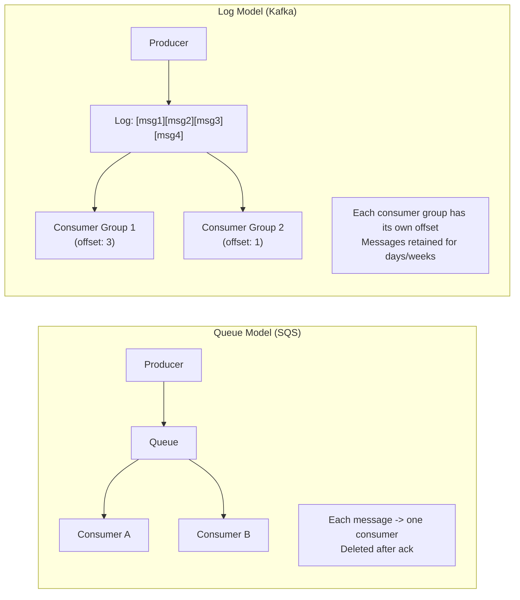
```mermaid
flowchart LR
    subgraph "Queue Model (SQS)"
        P1[Producer] --> Q[Queue]
        Q --> C1[Consumer A]
        Q --> C2[Consumer B]
        note1["Each message -> one consumer\nDeleted after ack"]
    end

    subgraph "Log Model (Kafka)"
        P2[Producer] --> LOG["Log: [msg1][msg2][msg3][msg4]"]
        LOG --> CG1["Consumer Group 1\n(offset: 3)"]
        LOG --> CG2["Consumer Group 2\n(offset: 1)"]
        note2["Each consumer group has its own offset\nMessages retained for days/weeks"]
    end
```

**Kafka vs SQS Comparison:**

| Aspect | Amazon SQS | Apache Kafka |
|--------|-----------|--------------|
| **Model** | Queue (message deleted on ack) | Log (messages retained) |
| **Replay** | No -- consumed messages gone | Yes -- reset offset to re-read |
| **Multiple consumers of same message** | No (competing consumers) | Yes (multiple consumer groups) |
| **Throughput** | ~3,000 msg/sec (standard), up to 300K batched | Millions of messages/sec per partition |
| **Message retention** | 1 minute to 14 days | Hours to weeks (configurable) |
| **Ordering** | FIFO queues: per MessageGroupId | Per partition (strict) |
| **Managed service** | Fully managed (AWS) | Self-managed (or Confluent/MSK) |
| **Use case** | Simple async tasks, AWS-native workflows | Event streaming, high throughput, audit logs, event sourcing |
| **At-least-once** | Yes (visibility timeout mechanism) | Yes (consumer commits offset) |

**When to choose SQS:**
- You need a simple, managed, reliable message queue
- You are already in AWS and want zero operational overhead
- Messages should be processed exactly once and then discarded
- Your throughput is below 100K messages/second

**When to choose Kafka:**
- You need replay capability (new consumer wants historical events)
- Multiple independent services need to consume the same events (fan-out without fan-out infrastructure)
- You have high throughput (>100K messages/second)
- You are building an event-driven architecture or event sourcing system
- You need an immutable audit log of all events

---

#### Queue Delivery Semantics

How many times is a message guaranteed to be delivered 

**At-most-once:**
- Message is sent once. If the consumer crashes before processing, the message is lost.
- No retries. Messages may be lost but are never duplicated.
- Simple implementation: delete from queue when consumer receives it (not when it finishes processing)

```
Producer -> Queue -> Consumer receives (Queue deletes immediately)
If consumer crashes before processing: message is LOST (not redelivered)
```

**At-least-once:**
- Message is delivered until acknowledged. If the consumer crashes after processing but before acknowledging, the message is redelivered.
- Messages may be delivered more than once. Consumers must be idempotent.
- Standard for SQS: message becomes invisible during processing (visibility timeout). Consumer sends explicit acknowledgment when done. If ack not received within timeout, message reappears.

```
Producer -> Queue -> Consumer receives (Queue marks invisible, NOT deleted)
Consumer processes -> Consumer sends ACK -> Queue deletes message
If consumer crashes: message reappears after visibility timeout -> redelivered
```

**Exactly-once:**
- Message is delivered precisely once. Never lost, never duplicated.
- Extremely difficult to achieve in distributed systems. Requires distributed transactions or careful deduplication.
- Kafka Transactions + idempotent producers + exactly-once semantics: achievable but complex and lower throughput.
- In practice: use at-least-once + idempotent consumers. The result is "effectively exactly-once."

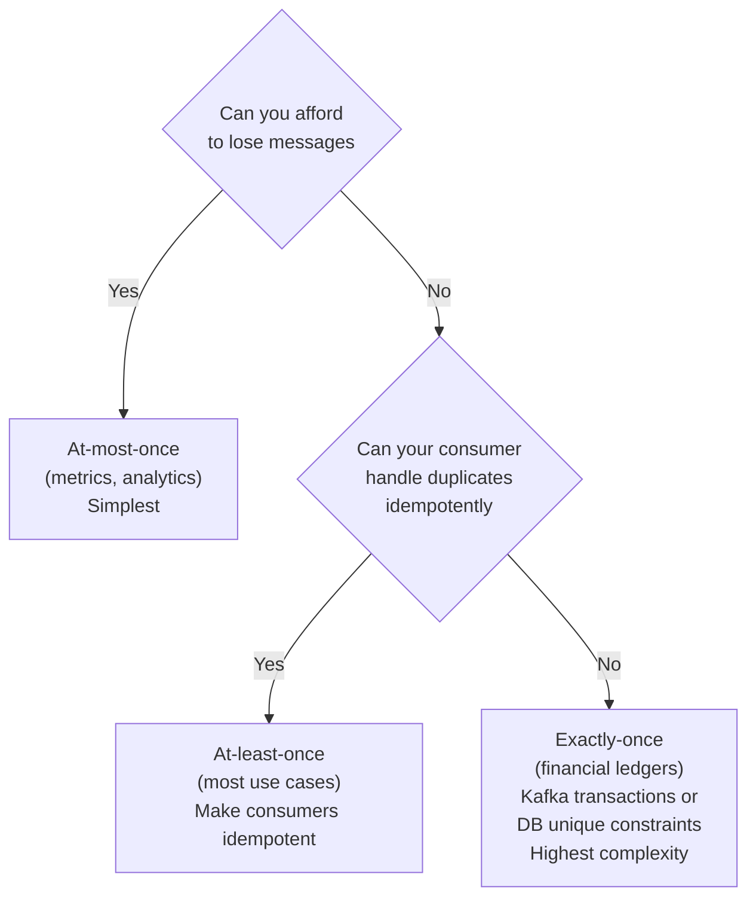
```mermaid
flowchart TD
    Q1{Can you afford\nto lose messages }
    Q1 -- Yes --> ATMOST["At-most-once\n(metrics, analytics)\nSimplest"]
    Q1 -- No --> Q2{Can your consumer\nhandle duplicates\nidempotently }
    Q2 -- Yes --> ATLEAST["At-least-once\n(most use cases)\nMake consumers idempotent"]
    Q2 -- No --> EXACTLY["Exactly-once\n(financial ledgers)\nKafka transactions or\nDB unique constraints\nHighest complexity"]
```

**The practical standard:** Design consumers to be idempotent (handling the same message twice produces the same result) and use at-least-once delivery. This is simpler than exactly-once and still produces correct outcomes.

---

#### Dead Letter Queue (DLQ): Why It Is Mandatory

**The problem:** A message in your queue cannot be processed. Maybe:
- The message is malformed (missing required fields)
- The consumer has a bug that makes it crash for this specific message
- The message refers to a resource that no longer exists

Without a DLQ, this "poison message" is retried indefinitely. The consumer crashes, the message reappears (visibility timeout), the consumer crashes again. All messages behind it in the queue are blocked. Nothing gets processed.

**The DLQ pattern:** After N failed delivery attempts (typically 3-5), the message is moved to a separate Dead Letter Queue instead of being retried again. The main queue continues processing other messages unimpeded.

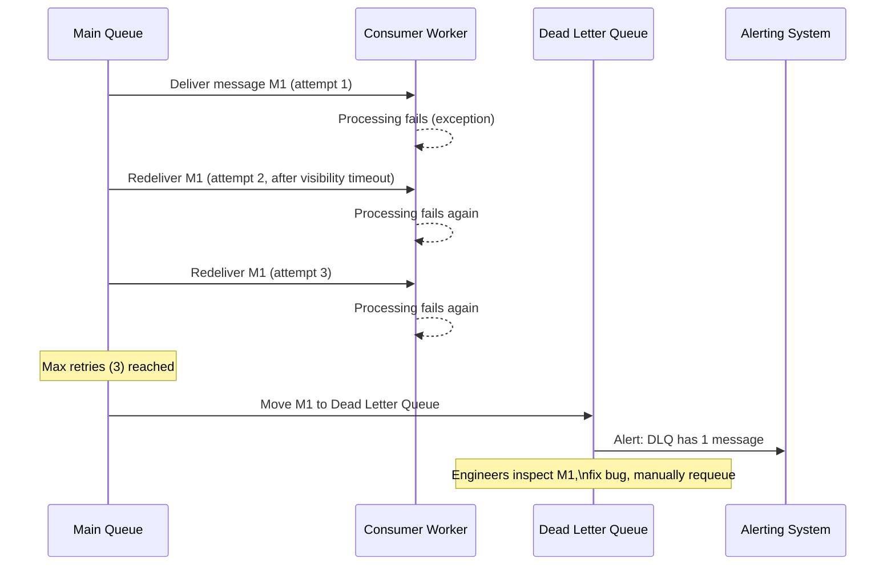
```mermaid
sequenceDiagram
    participant Queue as Main Queue
    participant Worker as Consumer Worker
    participant DLQ as Dead Letter Queue
    participant Alert as Alerting System

    Queue->>Worker: Deliver message M1 (attempt 1)
    Worker-->>Worker: Processing fails (exception)
    Queue->>Worker: Redeliver M1 (attempt 2, after visibility timeout)
    Worker-->>Worker: Processing fails again
    Queue->>Worker: Redeliver M1 (attempt 3)
    Worker-->>Worker: Processing fails again
    Note over Queue: Max retries (3) reached
    Queue->>DLQ: Move M1 to Dead Letter Queue
    DLQ->>Alert: Alert: DLQ has 1 message
    Note over DLQ: Engineers inspect M1,\nfix bug, manually requeue
```

**DLQ best practices:**
- **Always configure a DLQ.** No exceptions. Any queue without a DLQ will eventually block on a poison message.
- **Alert on DLQ depth > 0.** DLQ messages mean something is broken. You want to know immediately.
- **Set DLQ retention high** (7 days or more). Engineers need time to investigate and replay.
- **Build tooling to replay.** Being able to fix the bug and then requeue DLQ messages is essential.

---

#### Queue Patterns in Detail

**Pattern 1: Fan-Out**

One event triggers multiple independent consumers, each receiving a copy of the event.

```
"OrderPlaced" event
    |
    +--  Inventory Service: reserve the items
    +--  Email Service: send confirmation email  
    +--  Analytics Service: record the conversion
    +--  Fulfillment Service: begin picking items
    +--  Fraud Detection: check for suspicious patterns
```

Implementation in Kafka: Each service has its own consumer group. All groups receive every message independently, at their own pace.

Implementation in SQS: Use SNS (Simple Notification Service) as a fan-out broker. SNS delivers to multiple SQS queues. Each service has its own SQS queue.

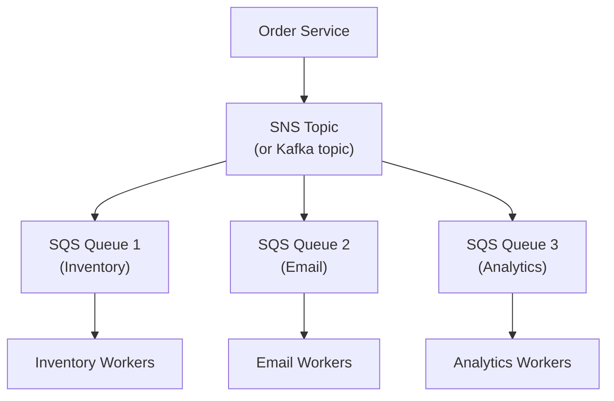
```mermaid
flowchart TD
    Producer["Order Service"] --> SNS["SNS Topic\n(or Kafka topic)"]
    SNS --> Q1["SQS Queue 1\n(Inventory)"]
    SNS --> Q2["SQS Queue 2\n(Email)"]
    SNS --> Q3["SQS Queue 3\n(Analytics)"]
    Q1 --> W1["Inventory Workers"]
    Q2 --> W2["Email Workers"]
    Q3 --> W3["Analytics Workers"]
```

**Why fan-out matters:** Without it, the Order Service would need to directly call Inventory, Email, Analytics, Fulfillment, and Fraud Detection synchronously. Each call adds latency (20ms x 5 = 100ms minimum). Each service's outage risks the checkout flow. Adding a new consumer requires changing the Order Service. With fan-out, adding a new consumer requires zero changes to the Order Service.

**Pattern 2: Competing Consumers**

Multiple workers read from the same queue. Each message goes to exactly one worker. Used to scale processing horizontally.

```
Queue: [Job1][Job2][Job3][Job4][Job5][Job6]
  +--  Worker 1: processes Job1, then Job4
  +--  Worker 2: processes Job2, then Job5
  +--  Worker 3: processes Job3, then Job6
```

Workers are stateless and interchangeable. To increase throughput, add more workers. To decrease costs during quiet periods, remove workers. Auto-scaling based on queue depth is the standard approach.

**Pattern 3: Priority Queue**

High-priority messages are processed before low-priority messages regardless of arrival order.

Implementation approaches:
- **Multiple queues:** High-priority queue, normal queue, low-priority queue. Workers always drain the high-priority queue first.
- **RabbitMQ priority queues:** Built-in priority field (0-255). Messages with higher priority dequeued first.
- **Kafka:** Use separate topics per priority. Consumer code polls high-priority topic first, low-priority only when high-priority is empty.

```
Priority-0 (critical): system alerts, payment failures   -> process in <1 second
Priority-1 (high): user-initiated actions                -> process in <5 seconds
Priority-2 (normal): background processing               -> process in <60 seconds
Priority-3 (low): analytics, bulk exports               -> process when idle
```

**Pattern 4: Delay Queue**

Messages become visible to consumers only after a specified delay. Used for:
- Scheduled jobs: "Send abandoned cart email 1 hour after cart abandonment"
- Retry with exponential backoff: "Retry this failed webhook in 30 seconds, then 60, then 120"
- Soft deletes with grace period: "Actually delete this account 30 days after user requests deletion"

SQS supports delivery delays up to 15 minutes. For longer delays, use a scheduled jobs system (cron + DB) or a dedicated delay queue service.

---

#### Queue Backlog Handling

**The backlog problem:** Your queue depth is growing. Messages are arriving faster than consumers process them.

**Immediate mitigation:** Add more consumer instances. If consumers are stateless (and they should be), adding instances immediately increases throughput. SQS + auto-scaling on queue depth is the standard pattern.

**When adding consumers is not enough:**

1. **The work is CPU-bound:** Each message takes 5 seconds of computation. You have 100 workers but receive 1,000 messages/second. You need 5,000 workers. Adding enough might not be practical or cost-effective.
   - Solution: Optimize the per-message work, or reduce message rate at the source (backpressure)

2. **The downstream service is saturated:** Your email workers process fast, but your SMTP provider limits you to 500 emails/second. 10,000 workers will not help -- they all hit the same bottleneck.
   - Solution: Rate-limit at the consumer, queue at the rate-limited layer, or pay for a higher tier of the service

3. **Message volume is temporarily too high:** Flash sale spike -- 10x normal volume for 2 hours.
   - Solution: Queue absorbs the spike. Accept that processing will take longer than normal. Set expectations (user sees "your order is being processed"). Spin up extra workers for the duration.

**Backpressure:** When the queue is full or the consumer is saturated, signal to the producer to slow down. HTTP 429 (Too Many Requests), gRPC flow control, Kafka producer backpressure.

**Load shedding:** When the system is completely overwhelmed, drop low-priority messages intentionally rather than accepting all of them and processing none well. A better outcome is to drop analytics events during a crisis than to let the backlog block order processing.

---

#### L5 vs L6: Queue Design

| Aspect | L5 Thinking | L6 Thinking |
|--------|-------------|-------------|
| **Queue choice** | "We use SQS for async processing" | "We use SQS for task queues (email, notifications) and Kafka for event streaming (order events, analytics). SQS because we need simple managed delivery; Kafka because we need multiple services to consume the same order events independently." |
| **Delivery semantics** | "We use at-least-once delivery" | "We use at-least-once delivery. All consumers are idempotent -- keyed by the message's order_id or event_id. Duplicate deliveries produce no additional side effects." |
| **DLQ** | "We have a DLQ configured" | "DLQ with 7-day retention. Alert on DLQ depth > 0 fires within 5 minutes. We have a replay tool that can batch-requeue DLQ messages after a bug fix. SQS visibility timeout is 30 seconds with 3 max receives before DLQ." |
| **Consumer scaling** | "We scale workers up when needed" | "We have CloudWatch alarm on SQS ApproximateNumberOfMessagesVisible > 100. Auto Scaling Group scales email workers from 2 to 20 instances. Scale-in uses a 10-minute cooldown to avoid thrashing during bursty periods." |
| **Poison messages** | "We retry failed messages" | "After 3 failures, message goes to DLQ. We alert immediately. We log the full message and exception for each failure attempt. We never let a single bad message block the queue." |

---

### Building Block 6: Synchronous vs Asynchronous

#### Why Does This Exist 

Every communication between services is either synchronous (the caller waits for a response) or asynchronous (the caller continues without waiting). This choice has profound implications for latency, fault tolerance, coupling, and user experience.

Synchronous communication is simpler to reason about but tighter in coupling. Asynchronous communication is more complex but more resilient.

**The core insight:** Not every operation in a system has the same urgency. Charging a credit card must succeed before you confirm an order -- that is synchronous. Sending a confirmation email can happen 10 seconds later -- that is asynchronous. Bundling the email send into the synchronous checkout flow means email provider latency becomes checkout latency. This is the wrong design.

**Staff engineers distinguish between operations by their urgency and coupling requirements.** The decision of sync vs async is made per-operation, not per-system.

---

#### Synchronous: Caller Blocks Until Response

In **synchronous** communication, the caller sends a request and waits, doing nothing else, until the response arrives.

```
[Client] -------- Request ----------  [Server]
                                           |
          -------- Response ----------- (processes)
[Client continues only after response]
```

**Properties:**
- Simple: one request, one response, one code path
- Immediate feedback: errors are returned to the caller synchronously
- Tight coupling: caller's latency = callee's latency
- Fragile: if callee is slow or down, caller blocks or fails

**Examples:**
- HTTP GET /products -> response with product list
- SQL SELECT -> rows returned immediately
- gRPC call -> response with data
- Function call -> return value

---

#### Asynchronous: Caller Continues Immediately

In **asynchronous** communication, the caller sends a request and immediately continues. The result arrives later through a callback, event, webhook, or polling.

```
[Client] ---- Request ----  [Queue/Service]
[Client continues immediately]
                                    |
                             (processes later)
                                    |
                             [Callback/Webhook/Event]
```

**Properties:**
- Complex: need to track in-flight work, handle failures, route results back
- Non-immediate feedback: errors surface later, harder to show to users
- Loose coupling: caller's latency independent of callee's latency
- Resilient: callee can be down; work queues up and processes when it recovers

**Examples:**
- Publish "OrderPlaced" event -> email worker sends email (async)
- Upload video to S3 -> transcoding pipeline processes in background
- POST /reports -> "report is generating, we will email you"
- Webhook delivery -> our system POSTs to partner URL, retry on failure

---

#### The Decision Framework

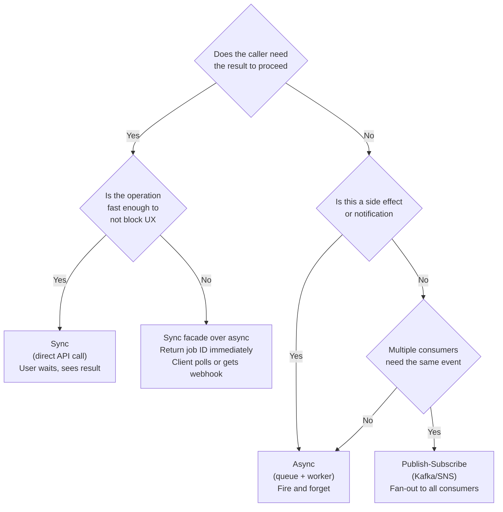
```mermaid
flowchart TD
    Q1{Does the caller need\nthe result to proceed }
    Q1 -- Yes --> Q2{Is the operation\nfast enough to\nnot block UX }
    Q2 -- Yes --> SYNC["Sync\n(direct API call)\nUser waits, sees result"]
    Q2 -- No --> FACADE["Sync facade over async\nReturn job ID immediately\nClient polls or gets webhook"]
    Q1 -- No --> Q3{Is this a side effect\nor notification }
    Q3 -- Yes --> ASYNC["Async\n(queue + worker)\nFire and forget"]
    Q3 -- No --> Q4{Multiple consumers\nneed the same event }
    Q4 -- Yes --> PUBSUB["Publish-Subscribe\n(Kafka/SNS)\nFan-out to all consumers"]
    Q4 -- No --> ASYNC
```

**Ask these five questions for every inter-service call:**

1. Does the caller need this result to continue  -> Yes = sync
2. Does the user see the result directly  -> Yes = sync
3. Can we afford to process this minutes later  -> Yes = async is an option
4. Is this a side effect (log, notify, audit)  -> Yes = async
5. What happens if the async worker fails  -> Need DLQ, retry, and alerting

---

#### The Sync Facade Over Async Work Pattern

Some operations are too slow to do synchronously but the user still needs *some* immediate response.

**The pattern:**
1. Receive the request
2. Validate inputs synchronously (fast)
3. Return an immediate "accepted" response with a job/order ID
4. Put the heavy work in a queue
5. Process asynchronously
6. Update status in the database
7. Client either polls for status or receives a webhook

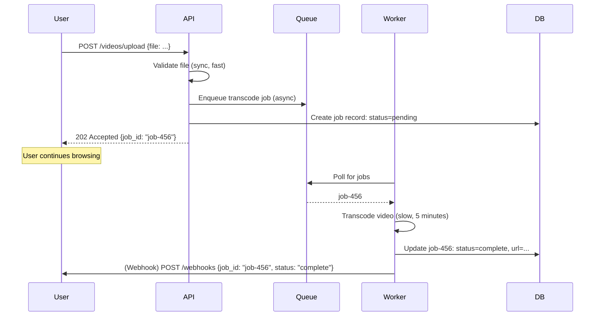
```mermaid
sequenceDiagram
    participant User
    participant API
    participant Queue
    participant Worker
    participant DB

    User->>API: POST /videos/upload {file: ...}
    API->>API: Validate file (sync, fast)
    API->>Queue: Enqueue transcode job (async)
    API->>DB: Create job record: status=pending
    API-->>User: 202 Accepted {job_id: "job-456"}

    Note over User: User continues browsing

    Worker->>Queue: Poll for jobs
    Queue-->>Worker: job-456
    Worker->>Worker: Transcode video (slow, 5 minutes)
    Worker->>DB: Update job-456: status=complete, url=...
    Worker->>User: (Webhook) POST /webhooks {job_id: "job-456", status: "complete"}
```

**Real examples of sync facade:**
- **Amazon checkout:** "Order placed!" returns in 200ms. Fulfillment, inventory, shipping all happen async.
- **GitHub CI:** "Push received" returns immediately. Build kicks off asynchronously.
- **Stripe payouts:** "Payout initiated" returns immediately. Bank transfer settles over days.
- **S3 multipart upload:** Each part upload returns immediately. Complete request finalizes async.

---

#### Event-Driven Architecture

At scale, many services need to react to the same events. Calling each synchronously creates a dependency web. Event-driven architecture uses a publish-subscribe model instead.

**The pattern:**
- Services publish events when things happen: "OrderPlaced", "UserRegistered", "PaymentSucceeded"
- Other services subscribe to events they care about
- No service knows about the others; they only know about the event types

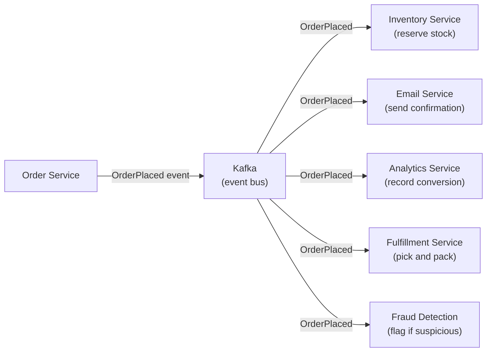
```mermaid
flowchart LR
    OrderService["Order Service"] --> |"OrderPlaced event"| Kafka["Kafka\n(event bus)"]
    Kafka --> |"OrderPlaced"| InventoryService["Inventory Service\n(reserve stock)"]
    Kafka --> |"OrderPlaced"| EmailService["Email Service\n(send confirmation)"]
    Kafka --> |"OrderPlaced"| AnalyticsService["Analytics Service\n(record conversion)"]
    Kafka --> |"OrderPlaced"| FulfillmentService["Fulfillment Service\n(pick and pack)"]
    Kafka --> |"OrderPlaced"| FraudService["Fraud Detection\n(flag if suspicious)"]
```

**Benefits:**
- Adding a new consumer (e.g., loyalty points service) requires zero changes to the Order Service
- Each service scales independently
- A consumer can be down for hours and catch up when it recovers
- The Order Service cannot be slowed by downstream services

**Challenges:**
- **Eventual consistency:** Inventory may still show an item as available for milliseconds after an order is placed
- **Ordering:** Events may arrive out of order. Kafka per-partition ordering helps, but only within a partition.
- **Debugging:** A bug in how events are processed requires tracing through multiple services and queues
- **Idempotency:** At-least-once delivery means consumers may receive the same event twice

---

#### Challenges of Async Systems

**1. Eventual consistency:**
The user places an order. The order service confirms it. The inventory service receives the event 500ms later and decrements stock. For that 500ms, the inventory count is stale. If two orders arrive simultaneously, both may see enough stock, both confirm, both decrement -- resulting in oversell.

Solutions: Optimistic locking in the inventory service (compare-and-swap), synchronous inventory check before async fulfillment, or accepting the occasional oversell and handling it as a business exception.

**2. Error handling and visibility:**
In sync: the error returns to the caller, who can show it to the user. In async: the error happens in a worker, potentially minutes after the user's request. The user may already be on a different page.

Solutions: Polling endpoints ("GET /orders/456/status"), webhooks, email notification on failure, DLQ with alerting.

**3. Message ordering:**
Kafka guarantees ordering within a partition. SQS FIFO guarantees ordering within a MessageGroupId. Standard SQS has no ordering guarantee. If order matters (user profile "updated -> deleted" must not arrive as "deleted -> updated"), you need ordered delivery.

**4. Debugging distributed async flows:**
A request enters the system synchronously, spawns async jobs, which spawn more async jobs. When something goes wrong, tracing the failure requires correlating logs across services, queues, and workers.

Solutions: Distributed tracing (Jaeger, Zipkin, AWS X-Ray), correlation IDs in every message, structured logging.

---

#### Detailed Decision Matrix: 12 Real Examples

| Operation | Decision | Rationale | Failure Mode |
|-----------|----------|-----------|-------------|
| **User login** | Sync | User must see success/failure immediately to proceed | If auth service is down: return 503, user cannot log in |
| **Load product page** | Sync + cache | User waits for page to render | Cache miss -> DB load spike |
| **Process payment charge** | Sync (or sync facade for 3DS) | User must see approved/declined before leaving checkout | Charge provider timeout -> fail safely, do not retry without idempotency key |
| **Send confirmation email** | Async (queue) | User does not need to wait for SMTP delivery | Email worker down -> messages queue up, delivered when recovered |
| **Update search index** | Async (CDC -> queue -> Elasticsearch) | New document is available immediately; search catchup takes seconds | Search shows stale results for up to 30 seconds |
| **Reserve inventory** | Sync | Must know if in stock before charging | Inventory service timeout -> fail checkout, no charge |
| **Generate report** | Async + sync facade | Reports take minutes; return job_id immediately | Worker failure -> DLQ alert, user gets error webhook |
| **Record analytics event** | Async, at-most-once | Losing 0.1% of events is acceptable | Worker crash -> events lost (OK for analytics) |
| **Send push notification** | Async (queue) | Delivery is best-effort, user not blocking | Device offline -> delivered when next online |
| **Deliver webhook to partner** | Async with retries | Partner endpoint may be slow/down; retry with backoff | Partner consistently down -> DLQ, alert, human intervention |
| **Replicate data to read replica** | Async (replication lag) | Reads can tolerate slight staleness | Replication lag > threshold -> reads stale data, need to handle in app |
| **Multi-service checkout orchestration** | Sync for critical path; async for side effects | User needs immediate order confirmation | Async failure -> DLQ, user already has order ID, support can resolve |

---

#### Fire-and-Forget vs Request-Response vs Pub-Sub

Three communication patterns and when to use each:

**Request-Response (Sync):**
```
Client -> Request -> Server -> Response -> Client
```
Use when: Caller needs the result. Simple. Caller and callee are tightly coupled.
Examples: REST API calls, database queries, gRPC calls.

**Fire-and-Forget (Async, one consumer):**
```
Producer -> Queue -> Consumer (one consumer, no response to producer)
```
Use when: Result does not need to be returned to the producer. Decoupled. Reliable with DLQ.
Examples: Email sending, log writing, analytics events.

**Publish-Subscribe (Async, many consumers):**
```
Publisher -> Topic -> Consumer A (copy)
                 -> Consumer B (copy)
                 -> Consumer C (copy)
```
Use when: Multiple independent services need to react to the same event. Highest decoupling.
Examples: OrderPlaced event consumed by inventory, email, analytics, fulfillment.

---

#### L5 vs L6: Sync vs Async

| Aspect | L5 Thinking | L6 Thinking |
|--------|-------------|-------------|
| **Default choice** | "We'll make it async to be safe" | "Async for side effects (email, analytics). Sync for the critical user path (payment, inventory check). Over-asyncing critical paths hides errors and makes debugging hard." |
| **Checkout design** | "Use a queue for everything in checkout" | "Checkout is sync through payment and order creation -- user needs immediate confirmation. Email, analytics, fulfillment are async (queue). The sync path takes 200-400ms. Async side effects complete within 30 seconds." |
| **Error handling** | "Async errors go to the logs" | "Async errors go to DLQ. We alert on DLQ depth. We have a status endpoint so users can check order state. If the async fulfillment step fails, customer support can manually trigger it." |
| **Consistency** | "Eventual consistency is fine" | "The core checkout flow (payment + order) is synchronous and strongly consistent. Side effects are async and eventually consistent. We tell users their order is placed (strong) but inventory updates may take a few seconds (eventual)." |
| **Debugging** | "We can check the logs" | "Every async message has a correlation_id matching the original request. Distributed trace (X-Ray) follows the request through API -> Kafka -> worker. DLQ messages include the full stack trace and all retry attempts." |


---

## 4. Mental Models

### The Toolbox Checklist

Run this checklist for every system you design. It takes 60 seconds and prevents the most common architectural mistakes.

```
SYSTEM DESIGN BUILDING BLOCK CHECKLIST
=======================================

  HASH
  - How is data distributed across servers/shards 
  - What is the shard key  (user_id, tenant_id, order_id )
  - Consistent hashing or modulo  (consistent unless N never changes)
  - What happens when a node is added or removed 
  - Are there hot partitions  (celebrity user, viral product)

  CACHE
  - What data is cached  (DB results, computed values, sessions )
  - Where is the cache  (Redis, Memcached, CDN, in-process )
  - What pattern  (cache-aside, write-through, write-behind )
  - What is the TTL  Is it appropriate for the data's change rate 
  - What is the invalidation strategy  (TTL-only, invalidate-on-write )
  - What is the target hit rate  Does the cache size support it 
  - What happens when the cache is down  (fallback to DB  circuit breaker )
  - Are there hot keys  How do you handle them 
  - Is stampede protection needed for popular expiring keys 

  STATE
  - Are application servers stateless 
  - Where does session data live  (Redis with TTL )
  - JWT or server-side sessions  What are the revocation requirements 
  - Can any server handle any request without sticky routing 

  IDEMPOTENCY
  - Which write operations have side effects  (charge, create, send )
  - Do those operations accept idempotency keys 
  - Where are idempotency keys stored  (Redis with 24h TTL )
  - How are concurrent duplicate requests handled  (SETNX lock  DB unique constraint )
  - Are queue consumers idempotent  (at-least-once delivery means duplicates)

  QUEUE
  - What work is processed asynchronously 
  - What queue system  (SQS for tasks, Kafka for events/streaming )
  - What delivery semantic  (at-least-once with idempotent consumers is standard)
  - Is a DLQ configured  Is there an alert on DLQ depth > 0 
  - What is the retry strategy  (exponential backoff, max retries )
  - How does the system handle a growing backlog  (autoscale workers, backpressure )
  - Is fan-out needed  (one event -> multiple consumers )

  SYNC / ASYNC
  - Which interactions are synchronous  (user sees result immediately)
  - Which are asynchronous  (side effects, notifications, background work)
  - For async operations: how does the user find out when they complete 
  - Are there operations that use sync facade over async work  (return job ID immediately)
  - What is the error handling strategy for async failures 
```

If you answer all six boxes, you have addressed the most common gaps in system design interviews and production architectures.

---

### The Checkout Flow Synthesis: All Six Building Blocks in One Request

The checkout flow is the canonical example that uses all six building blocks. Tracing it end-to-end shows how they interact.

**User action:** User clicks "Place Order" with cart containing 3 items, card ending 4242.

```mermaid
flowchart TD
    A["User clicks Place Order"] --> B["Load Balancer\n(round-robin -- works because servers are STATELESS)"]
    B --> C["App Server\n(fetch session from Redis -- STATELESS + STATE)"]
    C --> D["Idempotency Check\n(has this order been placed before  -- IDEMPOTENCY)"]
    D -- "Duplicate request" --> E["Return stored response\n(no double charge)"]
    D -- "New request" --> F["Route to inventory shard\nvia consistent hashing -- HASH"]
    F --> G["Check inventory\ncache-aside pattern -- CACHE"]
    G -- "Cache HIT" --> H["Items available\n(no DB call needed)"]
    G -- "Cache MISS" --> I["Query inventory DB\nPopulate cache"]
    H --> J["SYNC: Call payment provider\n(user waits for approval)"]
    I --> J
    J -- "Declined" --> K["Return 'payment declined'\n(sync error to user)"]
    J -- "Approved" --> L["Create order record in DB\n(write idempotency key -> response)"]
    L --> M["Return 'Order Confirmed'\norder_id: 12345"]
    M --> N["ASYNC: Publish OrderPlaced event\nto Kafka -- QUEUE"]
    N --> O1["Email Worker\n(send confirmation)"]
    N --> O2["Inventory Worker\n(decrement stock)"]
    N --> O3["Analytics Worker\n(record conversion)"]
    N --> O4["Fulfillment Worker\n(begin picking)"]
```

**Tracing each building block:**

| Step | Building Block | What It Does | What Breaks Without It |
|------|--------------|-------------|----------------------|
| Load balancer routes to any server | **Stateless** | Any server can handle any request | With stateful servers, must use sticky sessions; cannot scale freely |
| Fetch session from Redis | **State (external)** | App server reads user's cart from Redis | If session in server memory, a server restart loses cart |
| Idempotency check at start | **Idempotency** | Detects retries, returns stored result | Double-click or retry = two orders, two charges |
| Route to inventory shard | **Hash (consistent)** | Same item always goes to same shard | With modulo hash, adding a shard remaps 90% of keys, stampedes DB |
| Check inventory in cache | **Cache (cache-aside)** | Serve inventory from Redis, not DB | Every checkout hits DB directly; DB overwhelmed at peak |
| Sync payment call | **Sync/Async** | User waits for approval/decline | Async payment = user cannot see if card was charged |
| Async email/inventory/analytics | **Queue + Sync/Async** | Side effects happen after user gets response | Sync email = email provider latency becomes checkout latency |
| DLQ on queue consumers | **Queue (DLQ)** | Failed messages captured, not lost | Malformed message loops forever, blocks queue |

---

## 5. Real-World Examples

### Netflix: Caching, Stateless Services, and Async Processing

**Scale:** 260+ million subscribers, 100+ million streaming hours/day, hundreds of microservices.

**Caching:**
Netflix's EVCache (a modified Memcached with replication) serves as a distributed cache across AWS regions. Movie metadata, user profiles, and personalized recommendation scores are cached. Cache hit rates exceed 99% for metadata reads. Without EVCache, Netflix's databases would receive 100x their current load.

Netflix uses a custom TTL strategy: high-churn data (recommendations change with viewing history) uses short TTLs (5-15 minutes). Low-churn data (movie descriptions, cast information) uses long TTLs (hours to days). Critical data (license validity for DRM) is fetched synchronously at playback time -- no caching.

**Stateless services:**
Every Netflix microservice is stateless. User state is stored in Cassandra (long-term) and EVCache (short-term). This allows Netflix to deploy new versions of services via blue-green deployments without session loss. Any service instance can handle any request.

**Async processing:**
When a video is uploaded by a content partner, it goes through a transcoding pipeline with dozens of stages: quality analysis, encoding at multiple bitrates (240p through 4K), audio track processing, subtitle generation, thumbnail creation, DRM packaging. Each stage is a worker consuming from a queue. The pipeline is entirely asynchronous. A single video may take 24-48 hours to fully process. The upload confirmation is a sync facade: "Video received, processing begins" returns immediately.

**Queue design:**
Netflix uses a combination of Kafka (high-throughput event streaming: playback events, recommendation signals) and SQS (task queues: encoding jobs, notification delivery). Kafka topics retain events for 7 days, enabling replay for new consumer services or debugging.

---

### Stripe: Idempotency as a First-Class Design Principle

**Scale:** Trillions of dollars in payment volume annually, millions of API calls per day.

**Idempotency:**
Stripe's API is built on idempotency as a foundational principle, not an afterthought. The `Idempotency-Key` header is documented for every non-idempotent API endpoint. Stripe's internal implementation stores idempotency key results for 24 hours. If the same key is sent with a different request body, Stripe returns HTTP 422 Unprocessable Entity -- protecting against client bugs that accidentally reuse keys for different operations.

Stripe recommends generating idempotency keys as UUIDs v4 on the client side, before the first attempt, and storing them durably (in the client's database) so they can be retrieved on retry. This ensures that even after a client restart, the retry uses the same key as the original attempt.

**Payment flow:**
Stripe's charge flow is synchronous from the client's perspective (you send a charge request and wait for approved/declined), but internally Stripe fans out asynchronously to fraud detection, card network authorization, 3DS authentication (if required), and notification to the merchant's webhook endpoint. The client sees a clean synchronous API; the complex async orchestration is hidden behind it.

**Idempotency at the database level:**
Stripe's storage system enforces idempotency with unique constraints at the database layer as a final safety net. Even if application-level idempotency logic fails (a bug, a race condition), the database will reject duplicate inserts. This defense-in-depth approach -- application-level + database-level -- is the pattern for critical financial systems.

---

### Amazon: Sync Facade, Queues, and the Two-Pizza Team Model

**Scale:** Hundreds of millions of active customers, millions of sellers, billions of products.

**Checkout flow -- sync facade:**
When you click "Place your order" on Amazon, you receive a confirmation in under 500ms. But the operations Amazon must perform -- fraud scoring, inventory reservation across thousands of warehouses, payment authorization with multiple payment methods, tax calculation, shipping rate calculation, seller notification -- cannot all complete in 500ms.

Amazon uses a sync facade: the critical path (fraud check, payment authorization, order creation) runs synchronously. Everything else (warehouse notification, seller notification, shipping label generation, analytics) runs asynchronously via queues. The user gets immediate confirmation. The rest follows.

**Stateless microservices:**
Amazon's service-oriented architecture (described in Werner Vogels' famous 2006 blog post) consists of hundreds of independent microservices, all stateless. Each service owns its own database. State is never shared across service boundaries -- it is communicated via explicit API calls or events. This allows each service to scale, deploy, and fail independently.

**Queue-based decoupling:**
Amazon's fulfillment pipeline is heavily queue-based. An order event triggers parallel pipelines: warehouse management (pick, pack, ship), seller management (notify seller, wait for confirmation), payment settlement (capture authorization, process payment). Each pipeline is a series of queue-consuming workers. Failures in one pipeline do not cascade to others. The DLQ for each pipeline is monitored; anomalies trigger immediate alerts.

---

### Facebook/Meta: Hash Rings, Hot Keys, and Real-Time Fan-Out

**Scale:** 3+ billion monthly active users, hundreds of billions of messages, trillions of reads per day.

**Consistent hashing:**
Facebook's Memcached deployment (described in their NSDI 2013 paper) uses consistent hashing to distribute cache keys across thousands of Memcached servers per region. Adding servers to the cluster moves only ~1/N of keys, allowing live capacity expansion without full cache invalidation. Facebook's paper introduced several innovations on top of consistent hashing, including lease mechanisms for stampede prevention and regional replication strategies.

**Hot keys -- celebrity problem:**
Facebook explicitly designed for the "celebrity problem": a celebrity with 30 million followers posts a status. Every follower's feed read in the next 60 seconds may request that post's content. This single key receives millions of reads per second -- far exceeding any single cache node's capacity.

Facebook's solution: they identify "hot" objects via monitoring (fan count, recent access rate) and route their cache reads differently. Hot objects are stored in multiple local cache replicas within each server cluster. Read requests are distributed across all replicas. Additionally, application servers maintain a local in-process LRU cache for the hottest objects, eliminating even the Memcached network round-trip.

**Real-time notification fan-out:**
When a celebrity posts, Facebook must deliver the notification to 30 million followers. This is an extreme fan-out problem. Facebook's solution is a tiered approach: they do not compute all 30 million feeds synchronously. Instead, the post is written once, and feeds are lazily populated on read (pull model) for most users. For high-follow accounts, a hybrid model pre-computes feeds for the most active followers. Async queues handle the notification delivery.

---

## 6. Design Trade-offs

### When NOT to Use Consistent Hashing

- **N never changes:** If your shard count is fixed (e.g., 16 PostgreSQL shards determined at launch, never changed), modulo hashing is simpler and equally correct. Consistent hashing's benefit -- minimal redistribution on resize -- is irrelevant if you never resize.
- **Very small N (< 5 nodes):** With so few nodes, consistent hashing's complexity is not worth the benefit. A routing table or simple modulo is clearer.
- **You need a routing table for other reasons:** If you are already maintaining a routing table (e.g., for range-based sharding), adding consistent hashing adds complexity without benefit.

### When NOT to Cache

- **Data that changes with every read** (e.g., random number generator output): No reuse, no hit rate, only overhead.
- **User-specific data with very low access frequency:** If each user accesses unique data once a week, you will always miss the cache.
- **Financial data requiring strong consistency:** Account balance, order total -- fetch from the database directly. Stale cached values cause incorrect billing or fraud.
- **Very fast primary store:** If your database query takes 1ms (in-process SQLite, small dataset), adding a cache adds latency without benefit.
- **Early-stage system:** Cache adds complexity. In the early stages, optimize the database query first. Add caching only when database load becomes the bottleneck.

### When NOT to Use a Queue

- **User needs the result in the same request:** If a user submits a form and must see the result before they can proceed (e.g., form validation, payment confirmation), a queue adds complexity without enabling anything useful. Use sync.
- **Very simple, low-volume operations:** If you are processing 10 messages/minute, the operational overhead of a queue system (monitoring, DLQ, retry configuration, visibility timeouts) may outweigh the benefits. A simple database-backed job table might be simpler and equally reliable.
- **Strict ordering is required and complex to implement:** Kafka per-partition ordering is available, but if you need global ordering across many keys, queues make this harder, not easier.
- **Debugging is already hard:** More asynchrony means more distributed traces to follow. If your team struggles with debugging already, adding async complexity can worsen MTTR.

### When NOT to Make Operations Idempotent

- **Operations that are naturally idempotent:** GET, PUT with the same body, DELETE -- these already behave correctly on retry. Adding idempotency keys is unnecessary overhead.
- **Operations where duplicate detection would be incorrect:** "Generate unique report at this timestamp" -- you might actually want a new report each time. Idempotency key would return the old report, not a new one. Use idempotency keys only where duplicate prevention is the desired behavior.
- **Very short-lived operations with no financial/side-effect impact:** Reading a non-critical configuration value -- no need for idempotency keys.

### The Sync vs Async Tension

There is a genuine tension between two valid goals:
- **Consistency and immediacy:** Users want to know the result of their action immediately. Sync achieves this.
- **Resilience and throughput:** Systems are more resilient when they decouple operations. Async achieves this.

The resolution is to be deliberate about each operation: not everything can or should be async, and not everything needs to be sync. The checkout example illustrates the middle ground -- sync for the critical path, async for the side effects.

---

## 7. Common Interview Questions

### Q1: "How does consistent hashing work  Why is it better than modulo hashing "

**Strong answer:**
Consistent hashing maps both keys and server nodes to positions on a ring (0 to 2^32). A key belongs to the first server clockwise from its position. Adding a server: only keys in its arc (between it and its predecessor) move -- approximately 1/N of all keys. Removing a server: only its keys move to the next clockwise server.

Modulo hashing uses `hash(key) % N`. When N changes, almost all keys remap: going from 10 to 11 servers remaps ~90% of keys. For a cache, this means a mass cache miss event. At scale with thousands of requests/second, this can crash the database.

Real-world use: Cassandra, DynamoDB, Redis Cluster, Memcached all use consistent hashing. Virtual nodes (100-200 per server) smooth distribution so one server does not get a disproportionately large arc by chance.

---

### Q2: "A celebrity posts a photo. Their 10 million followers load their profile in the next 60 seconds. What breaks and how do you fix it "

**Strong answer:**
The photo's metadata (and the celebrity's profile) is a **hot key**. All 10M requests may route to the same cache node (consistent hashing maps one key to one node). That cache node becomes the bottleneck at potentially 100K+ QPS.

Additionally, if the TTL expires during this spike, 10M requests simultaneously miss the cache -- **stampede**. All hit the database.

Fixes:
1. **Key replication:** Store the celebrity profile under 10 shard keys (profile:123:shard:0 through :9). Read from a randomly selected shard. Now 10 cache nodes share the load.
2. **Local in-process cache:** Each app server caches the top 1000 celebrity profiles locally for 30 seconds. At 100 app servers, Redis now receives 100 QPS instead of 10M QPS for that key.
3. **Stampede prevention:** Background refresh -- before TTL expires, a background job refreshes the entry. Serve the stale value while refreshing. Users never see a cache miss at stampede scale.
4. **CDN for public data:** A celebrity's public profile is identical for all viewers. Serve it from a CDN. CDN handles billions of requests without touching your infrastructure.

---

### Q3: "How do you prevent double-charging in a payment system with unreliable networks "

**Strong answer:**
Use idempotency keys. The client generates a UUID before the first payment attempt and stores it. Every request for this payment (including retries) sends the same UUID in the `Idempotency-Key` header.

Server implementation:
1. Check Redis for `idempotency:{key}` -- if found, return stored response immediately (no processing)
2. If not found, acquire a distributed lock (`SETNX idempotency_lock:{key}`)
3. Double-check Redis after lock acquisition (concurrent duplicate may have processed)
4. Process the payment
5. Store `idempotency:{key} -> {charge_id, status}` with 24-hour TTL
6. Release lock

The database also has a unique constraint on idempotency_key as a final safety net -- even if Redis and the lock fail, the database rejects duplicate inserts.

Stripe's rule: if the same key arrives with a different request body (different amount), return 422 -- this prevents client bugs from silently returning wrong results.

---

### Q4: "Your Kafka consumer has been down for 6 hours. It comes back online. What happens "

**Strong answer:**
Kafka retains messages based on retention policy (e.g., 7 days). The consumer's committed offset records the last successfully processed message. When it comes back online, it resumes from that offset -- it will process all 6 hours of accumulated messages.

Considerations:
1. **Backlog size:** At 10,000 msg/sec, 6 hours = 216 million messages. With one consumer, catch-up will take 6 hours at normal throughput. Scale up consumer instances if faster catch-up is needed.
2. **Ordering:** If the consumer depends on event order (user created before user updated), Kafka per-partition ordering is maintained. But if you add more consumer instances, different partitions may catch up at different rates. Ordering guarantees only apply within a partition.
3. **Staleness:** Notifications sent 6 hours late may be confusing to users. Consider adding a staleness check: "if event timestamp is >1 hour old, skip notification delivery."
4. **Downstream impact:** If the consumer's output feeds another system (e.g., search indexing), that system may have a 6-hour stale window. Plan for this.

---

### Q5: "Design the idempotency system for a checkout flow that calls 3 external services."

**Strong answer:**
The checkout calls: (1) Inventory Service, (2) Payment Service, (3) Order Service -- in sequence.

Problem: The client retries the entire flow on timeout. Each service may have already partially executed.

Design:
- Each service receives the same top-level idempotency key (generated by the client) plus a service-specific suffix: `key-inventory`, `key-payment`, `key-order`.
- Each service independently checks its own idempotency store.
- If Payment succeeded but Order Service failed: on retry, Payment Service returns cached success (no second charge). Order Service receives new request and creates the order.
- If all three succeeded but client never got the response: all three return cached responses. Client gets the correct result.
- Concurrent duplicates: each service uses `SETNX` + Redis or DB unique constraint to prevent parallel processing of the same key.

The idempotency key structure: `{client_uuid}:{service_name}`. Storage: Redis, 24-hour TTL, value = serialized response.

---

### Q6: "When would you use write-behind caching  What are the risks "

**Strong answer:**
Write-behind (write-back) caches data in Redis immediately and asynchronously flushes to the database. This reduces write latency dramatically -- the write returns at cache speed (~0.5ms) instead of database speed (~5ms).

Use when:
- Very high write throughput with eventual consistency acceptable (view counts, like counts, metrics)
- Writes that are frequently overwritten before being read (cursor position, draft content)

Risks:
- **Data loss:** If the Redis node crashes before flushing to the database, all unflushed writes are lost. For view counts, losing 1000 views is acceptable. For financial transactions, this is catastrophic.
- **Ordering:** Multiple updates to the same key must be flushed in order. If updates arrive out of order, the database may have a stale value.
- **Complexity:** Need a reliable flush process with its own error handling, retry, and monitoring.

Never use for: Payment data, orders, any financial record, user-generated content that must not be lost.

---

### Q7: "Compare Kafka and SQS. When do you choose each "

**Strong answer:**
SQS is a queue: messages are consumed and deleted. One message -> one consumer. Managed by AWS.
Kafka is a log: messages are retained for days/weeks. Multiple consumer groups each independently read every message at their own offset. High throughput (millions/sec). More operational complexity (unless using Confluent/MSK).

Choose SQS when:
- You need simple, managed, reliable async task processing
- You are in AWS and want zero ops overhead
- Each message should be processed by exactly one consumer
- Throughput is moderate (<100K msg/sec)
- You do not need replay capability

Choose Kafka when:
- Multiple independent services need to consume the same events (OrderPlaced consumed by inventory, email, analytics, fulfillment -- each independently)
- You need replay (new service wants historical events; debugging requires replaying events)
- Very high throughput (>100K msg/sec)
- You are building event sourcing or event-driven architecture
- You need an audit log of all events

Real decision: An e-commerce platform might use SQS for email and notification queues (simple task delivery) and Kafka for order events (inventory, analytics, fulfillment, and future services all need to consume them independently).

---

### Q8: "How does a cache stampede happen and how do you prevent it "

**Strong answer:**
Cache stampede: A popular cache key expires. Thousands of requests arrive simultaneously, all miss the cache, and all hit the database at once. Database receives sudden massive load spike and may crash.

Prevention strategies:

1. **TTL jitter:** Spread expiration times randomly. Instead of TTL = 300 seconds for all entries, use TTL = 300 + rand(0, 30). Entries that were cached together expire at different times, preventing mass simultaneous expiry.

2. **Request coalescing (lock):** When a cache miss occurs, the first request acquires a Redis lock (`SETNX`) and performs the DB read. Subsequent concurrent requests either wait briefly and get the result from cache (which the first request populated), or get the stale value while the first request refreshes.

3. **Probabilistic early expiry:** Before TTL=0, use a formula based on the remaining TTL and the time it takes to refresh. Some requests "decide" to refresh early (probabilistically). This spreads the refresh load over time rather than concentrating it at the exact TTL expiry.

4. **Background refresh:** Before TTL expires, a scheduled job refreshes the cache. Serve the current value while the background refresh is in progress. Users never hit a cold cache miss -- they may see a slightly stale value for one request cycle, but never wait for a DB round-trip.

For a system where 99% hit rate is required, combine jitter + background refresh.

---

### Q9: "What is the difference between stateful and stateless services  Why does it matter "

**Strong answer:**
Stateful: Server stores session data in its own memory. Request from user Alice must go to the same server each time (sticky sessions). Server crash = session loss. Cannot rebalance users between servers. Scaling is complicated.

Stateless: Server stores nothing between requests. Session data is in an external store (Redis). Any server can handle any request. Load balancer can freely distribute. Adding servers = immediate capacity increase. Server crash = no data loss (data is in external store).

Why it matters:
- **Horizontal scaling:** Stateless servers are interchangeable. Add 10 more during peak load; they work immediately. Remove them when peak subsides. Stateful servers require session migration or sticky routing.
- **Deployments:** Deploy new version by replacing servers one at a time. Users seamlessly move to new servers. With stateful servers, deploying requires session drainage or user disruption.
- **Failure handling:** Stateless server crashes are transparent. Load balancer stops routing to it. Users' next requests go to other servers. With stateful servers, crash = forced logout.

Standard pattern: stateless app servers + stateful stores (Redis for sessions, database for persistent data).

---

### Q10: "Design a system where checkout must be idempotent across 3 services with network failures."

**Strong answer:**
Three services called in sequence: inventory reservation, payment charge, order creation.

**Idempotency key design:**
Client generates a UUID for this checkout attempt. Each service call uses a derived key:
- `{client_uuid}:inventory` for inventory reservation
- `{client_uuid}:payment` for the payment charge
- `{client_uuid}:order` for order creation

**Flow on first attempt:**
1. Inventory: check key -> miss -> reserve -> store `key -> {reservation_id}` in Redis TTL 24h
2. Payment: check key -> miss -> charge -> store `key -> {charge_id}`
3. Order: check key -> miss -> create -> store `key -> {order_id}`

**Flow on retry after Payment succeeded but Order failed:**
1. Inventory: check key -> hit -> return stored reservation_id (no new reservation)
2. Payment: check key -> hit -> return stored charge_id (no new charge)
3. Order: check key -> miss -> create order -> store key

**Flow on retry after all three succeeded (client never got response):**
All three return stored results. Client gets the correct outcome. Nothing is duplicated.

**Concurrent duplicate prevention:** Each service uses `SETNX lock:{key}` before processing. Only one request proceeds; the other waits and reads the result the first request stored.

---

### Q11: "Your queue consumer is processing a message that causes it to crash. What happens "

**Strong answer:**
Without a DLQ: Message is not acknowledged. After visibility timeout (e.g., 30 seconds on SQS), message reappears. Consumer processes it, crashes again. Infinite loop. This message blocks all other messages in the queue (or at minimum occupies a worker indefinitely).

With a proper DLQ configuration:
1. Message is delivered to consumer (attempt 1). Consumer crashes. No ack.
2. After visibility timeout, message reappears (attempt 2). Consumer crashes.
3. After attempt 3 (maxReceiveCount = 3 on SQS), SQS moves message to DLQ.
4. Main queue continues processing other messages.
5. DLQ depth > 0 alert fires. Engineers are paged.
6. Engineers inspect DLQ message: malformed JSON field causing a NullPointerException.
7. Engineers deploy a bug fix.
8. Engineers replay the DLQ message (manually trigger requeue). Consumer processes it successfully.

Key settings:
- `maxReceiveCount`: 3-5 attempts before DLQ (balance between transient failures and poison messages)
- `visibilityTimeout`: longer than your longest normal processing time (avoid false redelivery)
- DLQ retention: 7 days (engineers need time to investigate)
- Alert on `ApproximateNumberOfMessagesVisible > 0` for the DLQ

---

### Q12: "What is eventual consistency and when is it acceptable "

**Strong answer:**
Eventual consistency means: after a write, all replicas will eventually reflect the new value, but there is a window where some reads may see the old value. The system is not immediately consistent -- it converges to consistency over time.

**When acceptable:**
- Social media feed: if a new post takes 500ms to appear in all followers' feeds, no one cares
- Product description: if a price update takes 5 seconds to propagate to all edge nodes, it is tolerable
- User profile photo: if the new avatar takes a few seconds to appear everywhere, it is acceptable
- Analytics: slightly stale dashboards are fine; real-time exactness not required

**When NOT acceptable:**
- Account balance: user must see the correct balance immediately after a transaction
- Inventory count: selling an item must immediately prevent oversell (eventually consistent inventory = oversell risk)
- Payment status: user must see the correct charge status immediately
- Login/logout: after logout, the session must be immediately invalid everywhere

**Technical levers:**
- **Cache TTL:** Shorter TTL = less eventual inconsistency window
- **Sync writes across replicas:** Read-your-writes consistency (user always reads their own writes from the same replica)
- **Sync critical path, async side effects:** The checkout flow is synchronous (payment, inventory check) while analytics is eventually consistent

---

## 8. Key Takeaways

### Summary of All Six Building Blocks

**Hash functions distribute data evenly.**
Use consistent hashing (not modulo) for distributed caches and databases. Adding a node moves ~1/N keys, not all of them. Virtual nodes (100-200 per server) smooth distribution. For fixed-size or grow-only shard sets, jump hashing is O(1) space and equally minimal. For small N, rendezvous hashing is simpler.

**Caching is the most powerful scale lever.**
A 95% cache hit rate reduces database load by 20x. Use cache-aside for most applications. Write-through for data that must always be fresh. Write-behind only for non-critical counters where loss is acceptable. TTL balances freshness and hit rate -- match it to your data's change frequency. Plan for stampede: add jitter, use background refresh, replicate hot keys. Always have a plan for cache failure (fall through to DB with circuit breaker).

**Stateless servers enable horizontal scaling.**
Move all state to external stores. Any server handles any request. Adding servers is immediate capacity. No sticky sessions, no session migration, no session loss on server crash. Use Redis for sessions (with TTL), database for persistent state. JWT for short-lived stateless tokens; server-side sessions for instant revocation.

**Idempotency is mandatory for writes with side effects.**
Every operation that charges money, creates records, sends messages, or has external side effects must accept and honor idempotency keys. Client generates UUID per logical operation. Server stores key -> response for 24 hours. Concurrent duplicates handled with SETNX lock or DB unique constraint. Stripe implements this as a first-class API feature -- it is the industry standard for payment APIs.

**Queues decouple and buffer.**
Use queues for work the user does not need to wait for. At-least-once delivery with idempotent consumers is the standard pattern. Always configure a DLQ. Alert on DLQ depth > 0. Scale workers based on queue depth. Choose SQS for simple task queues, Kafka for event streaming and fan-out.

**Sync when the user needs the result; async for side effects.**
The checkout critical path (inventory check, payment, order creation) is synchronous -- user sees confirmation immediately. Email, analytics, fulfillment are async -- they happen in the background via queues. Async errors go to DLQ with alerting. Use distributed tracing and correlation IDs to debug async flows.

---

### L5 vs L6 Thinking: All Six Building Blocks

| Building Block | L5 Answer | L6 Answer |
|---------------|-----------|-----------|
| **Hash** | "We hash user_id to distribute across shards" | "We use consistent hashing with 150 vnodes per shard. Adding a shard moves ~5% of keys. xxHash for speed -- no security requirement here. During rebalance, we dual-read (old + new shard) to avoid misses." |
| **Cache** | "We cache database results in Redis" | "Cache-aside with 5-min TTL. TTL jitter +/-30s prevents stampede. Invalidate on write for user-visible data. Background refresh for top 100 celebrity profiles. 95% hit rate target. Circuit breaker falls through to DB if Redis is down -- DB handles 5x load max." |
| **State** | "Our servers are stateless" | "Stateless app servers behind ALB (round-robin). Session in Redis, 24-hour TTL. JWTs for API tokens (15-min expiry) + refresh tokens in Redis (30-day TTL, revocable). Deploying a new version: blue-green, drain old instances, zero session loss." |
| **Idempotency** | "We retry on failure" | "All POST endpoints with side effects require `Idempotency-Key`. Middleware enforces it -- 400 if missing. Keys stored in Redis (24h TTL). Concurrent duplicates: SETNX lock, then double-check. DB unique constraint as final safety net. Payment keys are scoped to user -- key reuse across different users is not a concern." |
| **Queue** | "We use Kafka for async processing" | "Kafka for order events (fan-out to inventory, email, analytics, fulfillment -- each independent consumer group). SQS for notification delivery (simpler, managed). DLQ on every queue, 7-day retention, alert on depth > 0. Consumers are idempotent (keyed on event_id). Auto-scale workers on queue depth > 100." |
| **Sync/Async** | "Checkout is sync, email is async" | "Sync critical path: inventory check, payment charge, order record -- user waits 200-400ms for confirmation. Async: email, fulfillment, analytics, search indexing. Async errors are surfaced via order status endpoint (users can poll) and webhook. DLQ alert means fulfillment failures are never silent. Correlation IDs trace every request through all services." |

---

### The Golden Rule

**Sync for user-facing results. Async for side effects.**

When a user clicks a button and needs to see the outcome (did my payment succeed  is my item in stock ), the flow must be synchronous. The user is waiting. They need an answer.

When an operation does not need to be visible immediately (send an email, update analytics, index search, send fulfillment notification), make it asynchronous. Move it to a queue. The user gets a faster response. The side effect happens in the background.

This single distinction, applied consistently to every operation in your system, produces architectures that are fast, resilient, and operationally manageable.

---

## Exercises and Brainstorming

### Exercise 1: Consistent Hashing Ring

You have a consistent hashing ring with 5 servers (A, B, C, D, E) and 150 virtual nodes each.

1. Roughly what percentage of keys move when you add server F 
2. Which servers are affected when F is added 
3. During the rebalance window (when keys are moving), some cache reads will miss. Describe two mitigations.
4. Compare with modulo hashing: `hash(key) % 5 -> % 6`. What percentage of keys remap 
5. Why would you use jump hashing instead of consistent hashing for this use case 

*Target answers: ~17% move to F; all 5 servers donate keys from their arcs where F's vnodes land; dual-read old+new and pre-warm; modulo remaps ~83%; jump hashing if node count only grows, for O(1) memory.*

---

### Exercise 2: Cache Strategy Decisions

For each data type in an e-commerce system, choose a cache pattern and explain your TTL choice:

| Data | Cache Pattern | TTL | Justification |
|------|--------------|-----|---------------|
| User session (cart, auth) |   |   | |
| Product price (updates hourly) |   |   | |
| Product description (rarely changes) |   |   | |
| Inventory count (changes per purchase) |   |   | |
| Order history (immutable after creation) |   |   | |
| Homepage featured products |   |   | |
| User's "last viewed" list |   |   | |

*Then discuss: For inventory count, is caching safe at all  If you cache it for 60 seconds, what is the oversell risk *

---

### Exercise 3: Idempotency Across Services

A payment flow calls 3 services: Inventory, Payment, Order -- in sequence. The client retries on timeout.

1. Payment succeeds on attempt 1. Order creation fails. On retry, what happens at each service 
2. All three succeed but client never receives the response. On retry, what should each service return 
3. Two concurrent requests with the same idempotency key arrive 10ms apart. How do you prevent a double charge 
4. Client generates idempotency keys as `user_id + timestamp (to the minute)`. What is the risk 
5. Should the idempotency key TTL be 1 hour or 24 hours  What are the implications of each 

---

### Exercise 4: Queue Design

Design the queue architecture for a food delivery system when an order is placed:

Operations: (1) Notify restaurant, (2) Assign driver, (3) Send confirmation SMS to customer, (4) Charge payment method, (5) Update analytics dashboard, (6) Reserve loyalty points

1. Which operations must be synchronous (in the request-response cycle) 
2. Which can be in a queue 
3. For the queue operations, is fan-out appropriate  Which operations are independent 
4. If the driver assignment service is down for 30 minutes, what happens to orders in the queue 
5. How do you handle a restaurant that never acknowledges the notification 

---

### "What If X Changes " Scenarios

**Hashing:**
- "Your consistent hashing ring has 20 servers. Overnight, 3 servers fail simultaneously. Walk me through what happens to the cache."
- "Your shard key is user_id, but one enterprise customer has 40% of your total data. How do you handle this hot shard "
- "You need to change your shard count from 16 to 32. What is the migration strategy with minimal downtime "

**Caching:**
- "Your Redis cluster goes down at 2 PM on a Tuesday. Walk me through exactly what happens to your system and your mitigation steps."
- "Your cache hit rate drops from 95% to 65% over 3 days. What is your diagnosis and fix "
- "A product goes viral. Its cache key is receiving 500K reads/second. Your Redis node for that key handles 80K reads/second. What do you do "

**Idempotency:**
- "Your Redis idempotency store is down for 5 minutes. What happens to payment requests during that time "
- "A client keeps reusing the same idempotency key for different payment amounts (a bug). What should your API return and how do you detect this "
- "You need to reduce idempotency key TTL from 24 hours to 1 hour to save Redis memory. What is the risk "

**Queues:**
- "Your order event Kafka topic has 3 days of backlog due to a consumer bug. The bug is fixed. How do you process the backlog without overwhelming downstream systems "
- "You discover your email consumer has been sending duplicate emails because messages were delivered twice. How do you make it idempotent "
- "A message in your SQS queue causes your consumer to crash every time it is processed. You have no DLQ configured. What happens "

**Sync/Async:**
- "Your payment provider starts responding in 3 seconds instead of 200ms. You have a synchronous payment call in checkout. What is the impact and how do you mitigate "
- "You are asked to make the checkout flow fully asynchronous (payment via queue, result via webhook). What are the user experience implications  When is this appropriate "

---

### Trade-off Debates

**1. JWT vs server-side sessions for a high-security banking app:**
- JWT: no Redis lookup per request, scales perfectly, but cannot revoke before expiry
- Server sessions: instant revocation, one Redis lookup per request, Redis must be highly available
- *A user's account is flagged for fraud at 2 AM. You need to invalidate their session immediately. Which approach supports this  What is the cost *

**2. Single large Kafka topic vs per-entity topics:**
- Single topic: simple, one consumer group sees all events, global ordering possible
- Per-entity (per user_id): parallel processing, per-entity ordering, N topics to manage, consumer isolation
- *For order events, which approach handles a buggy consumer (crashes on one order type) more gracefully *

**3. Write-through vs cache-aside for a user profile cache:**
- Write-through: always fresh, every write hits Redis + DB, higher write latency
- Cache-aside: writes only hit DB, cache refreshes on next read, possible brief stale window
- *A user updates their profile and immediately refreshes the page. Which approach guarantees they see the new value  Does the answer change if you have 200 app servers *

---

## 9. Missing Depth: Failure Modes, Injection Scenarios, and Extended Trade-offs

---

### Building Block Combinations -- Failure Modes Table

When you combine two building blocks, each combination has its own failure mode. This table is what L6 candidates know and L5 candidates guess at.

| Combination | Use case | Watch out for |
|-------------|----------|---------------|
| **Cache + DB** | Read-through cache for hot data | Stampede on miss; invalidation on write; cache-aside vs write-through choice |
| **Queue + Idempotency** | Async workers with at-least-once | Duplicate messages; consumer must dedupe by key or idempotent action |
| **Hash + State** | Sharded storage by user_id | Hot partition if one key dominates; rebalance when adding nodes |
| **Sync + Timeout** | Call downstream with deadline | Too short -> false failures; too long -> cascading delay; circuit breaker when downstream is down |
| **State + Failover** | Session in Redis; Redis failover | Session loss or duplicate; use sticky sessions or short TTL and re-auth |

#### Each Failure Explained With an Example

**Cache + DB: What happens when your Redis cache goes down at 3 AM **

Walk through it step by step:

1. All requests miss the cache (Redis is down, so every GET returns nil)
2. All requests go directly to the database
3. The database gets 20x its normal load (if your cache hit rate was 95%, now it sees 100% instead of 5%)
4. The database slows down under the extra load
5. Connection pool exhausts (each request holds a connection longer because the DB is slower)
6. All requests start returning 503

Mitigation: Your database needs enough headroom to handle 100% cache-miss traffic. Aim for DB to handle at least 20% of peak directly -- meaning if peak QPS is 100K and hit rate is 95%, your DB must handle at least 20K QPS on its own (not just the 5K it normally sees). Have a circuit breaker on the cache path. Alert on cache hit rate dropping more than 5 percentage points from baseline.

---

### Failure Injection Scenarios -- Three Detailed Walk-throughs

These are the scenarios interviewers use to separate L5 from L6. Concrete numbers are required. "It depends" is not an answer.

---

#### Scenario 1: Cache Stampede

**Setup:** Product catalog cache with 5-minute TTL. At 9:00 AM, the TTL expires for a popular product. In the next 200ms, 50,000 requests arrive -- and all miss the cache simultaneously.

**Sub-question 1: What happens to your database **

50,000 queries hit the DB in 200ms -- that is 250,000 QPS. If the DB handles 10K QPS normally, it is immediately overwhelmed. CPU spikes to 100%. Queries queue. Latency goes from 5ms to 5 seconds. Connections exhaust. Downstream errors cascade. This is a self-inflicted DDoS on your own database.

**Sub-question 2: How do you prevent this  Two different mitigations.**

Mitigation A -- Probabilistic Early Expiry (also called "jitter" or "early recomputation"): When a cache entry is within X% of its TTL remaining, randomly recompute it. For example: at TTL = 5 min, when 30 seconds remain, there is a 50% chance any request will refresh the cache. The first few requests probabilistically refresh it. By the time it expires, fresh data is already in cache. Zero thundering herd.

Mitigation B -- Request coalescing (single-flighter): When a cache miss occurs, a lock (Redis distributed lock or in-process mutex) is acquired. Only ONE request fetches from DB. All other requests for the same key wait (or return stale if configured). When the one request completes, it populates the cache and releases the lock. All waiters read from cache. Cost: first-miss latency is higher (one request waits), but the DB sees exactly 1 query per cache miss instead of 50,000.

**Sub-question 3: How to detect in monitoring before an outage **

Alert 1: Cache hit rate drops below threshold (e.g. < 90% for 30 seconds) -> investigate miss spike.
Alert 2: DB connection pool utilization > 80% -> downstream pressure.
Alert 3: DB query latency p99 > 2x baseline.

If all three fire together at exactly HH:MM:00 (a round-minute TTL expiry time) -> cache stampede. Add jitter to TTL: instead of exactly 300s, use 270-330s randomly. This staggers expiry times across requests that were cached at the same moment.

---

#### Scenario 2: Queue Backlog Cascade

**Setup:** Checkout service writes OrderCreated events to Kafka for async email, analytics, and fulfillment. Traffic spikes 10x during a flash sale. Consumers cannot keep up. Queue grows.

**Sub-question 1: What happens when the queue reaches retention limit **

Kafka retention is time-based (e.g. 7 days) or size-based (e.g. 100 GB). If the retention limit is hit, oldest messages are deleted permanently. Email for orders from 7 days ago is never sent. Analytics data is permanently lost. Fulfillment events are lost -> orders never fulfilled -> customer support nightmare. NEVER let Kafka retention fill without alerting. Set an alarm when consumer lag exceeds a threshold (not just when retention fills).

**Sub-question 2: How does backpressure propagate back to the checkout service **

It does not -- automatically. Kafka is a fire-and-forget buffer. The checkout service produces messages and returns immediately regardless of consumer lag. What actually happens: (1) consumer lag metric grows silently, (2) business impact builds -- emails not sent, orders not fulfilled, (3) when retention fills, data is permanently lost.

To add backpressure: (1) checkout service monitors the consumer group lag metric (Kafka consumer group lag), (2) if lag exceeds a threshold, checkout service adds an artificial delay or returns 503 with Retry-After. This is not automatic -- it requires explicit instrumentation.

**Sub-question 3: Dropping messages vs applying backpressure -- when is each acceptable **

Drop messages (at-most-once): acceptable for metrics, analytics, logging, telemetry. The value of the data degrades quickly; losing it is acceptable. Example: "user clicked button" event -- losing 1% during a flash sale is fine.

Apply backpressure: required for business-critical events: order fulfillment, payment confirmation, inventory updates. Losing these = lost orders, undelivered goods, billing discrepancies. Better to slow down the checkout (503, retry) than lose a fulfillment event.

Hybrid approach: for emails, consider accepting some loss if the consumer is too far behind (an email for a completed order after 24 hours is worse than no email at all). For fulfillment and payment: never lose.

---

#### Scenario 3: Idempotency Key Collision

**Setup:** Two different users submit idempotency keys that are numerically close (e.g. sequential integers assigned by the client).

**Sub-question 1: What does your system return to User B whose key matched User A's request **

The server finds User A's stored result for that key and returns it -- User B's request is treated as a retry of User A's request. User B might get User A's order confirmation, User A's payment response, or User A's account data. This is a data leak AND a functional bug. User B's order was never created. User A might get charged twice if the timing is wrong.

**Sub-question 2: How should idempotency keys be generated to make collision astronomically unlikely **

Use UUID v4 (128-bit random number). Collision probability with 1 trillion keys is approximately 6 x 10^-8 (one in 17 billion). In practice: zero collisions.

NEVER use sequential integers, timestamps, or user_id alone.

```python
import uuid
key = str(uuid.uuid4())
```

If using ULIDs (time-sortable): still 80 bits of randomness -- acceptable. If using short codes (6 chars): 36^6 = 2.2 billion possibilities -- with birthday paradox, expect collision after ~50,000 keys. Too small for production.

**Sub-question 3: Risk of using `timestamp + user_id` as idempotency key **

Risk 1: Same user makes two requests in the same millisecond (rare but possible with aggressive retries). Both get the same key -> second request returns the first's response. The second operation never executes.

Risk 2: On retry, if the retry happens in a different millisecond, the key is DIFFERENT -> idempotency is broken entirely. The key must be the same on retry, but a timestamp-based key changes every millisecond.

Solution: client generates a UUID ONCE before the first attempt and reuses it for all retries. Store it in local state before making the first call.

---

### Original Trade-off Debates -- Three Deep Dives

---

#### Debate 1: Consistent Hashing vs Routing Table (e.g. Vitess)

**Consistent hashing:**
- No central routing state -- the hash function and node list are all you need
- O(log N) lookup with vnodes (binary search on the ring)
- Minimal key movement on rebalance (~1/N)
- Self-organizing -- nodes join and leave without manual intervention

**Routing table (e.g. Vitess shard map):**
- Central shard map stored in a coordination service (ZooKeeper, etcd)
- O(1) lookup -- just a table scan
- Explicit shard assignment -- admin controls which data lives where
- Arbitrary shard movement -- you can split one hot shard into two without touching others

**When to prefer a routing table:**
1. You need precise control over which data lives where (compliance, data residency, tenancy isolation)
2. You want to split one hot shard into two without moving other shards
3. Small N (< 20 shards) where consistent hashing ring overhead is unnecessary
4. Your team values predictability and explicit control over elegance

**Operational cost of each:**
Routing table requires a coordination service as a dependency (ZooKeeper or etcd), and all clients must query it on every request. It has a single point of failure for the map store. Consistent hashing needs only the hash function and the current node list -- no coordination service, no single point of failure.

**Real-world examples:**
Google's Bigtable and Spanner use a form of routing table (tablet server assignment tracked by master). Amazon's DynamoDB uses consistent hashing. Both are valid at massive scale. The choice reflects operational preferences, not fundamental correctness.

---

#### Debate 2: Synchronous Write-Through vs Asynchronous Write-Behind for a Session Store

**Write-through:**
Every session write is synchronous to BOTH Redis and a backing DB. No data loss on Redis failure. Write latency = max(Redis, DB) ~= 10ms instead of 1ms. Double write load on every session update.

**Write-behind:**
Write to Redis immediately (1ms response). Async write to DB in the background (50ms later). Write latency = Redis only (1ms). Risk: if Redis crashes in that 50ms window, the DB has stale data and the session is effectively lost.

**The 100ms Redis crash scenario:**

User logs in at T=0. Write-behind saves session to Redis at T=0 and queues a DB write. At T=50ms, the Redis node crashes before the DB write completes. The user's session is lost. On the next request, they appear logged out and are forced to re-authenticate.

**User experience impact:**
Write-through: user never loses their session under any failure scenario.
Write-behind: user loses their session approximately 0.01% of the time (only if Redis crashes within the async write window). For most apps, this is acceptable -- users just re-login. For financial or medical apps where session loss means lost in-progress work (form data, multi-step workflows), write-through is required.

**Recommendation:**
Use write-through for high-value sessions (banking, healthcare, checkout flows). Use write-behind for typical web app sessions (read-heavy, user does not lose critical data on re-auth).

---

#### Debate 3: Single Large Queue vs Many Small Queues

**Single topic (one Kafka topic):**
Simple to operate -- one consumer group, all events in order together, easy to add new consumers. Blast radius: if one consumer group is a bad actor (pulls too fast, reprocesses poison messages), it can affect other consumer groups' visibility of the partition.

**Per-entity topic (e.g. one topic per user_id or order_id):**
Parallel processing, ordering guaranteed per entity, one slow consumer group does not affect others. Cost: N topics to manage, N consumer groups, N sets of lag metrics, N DLQs. At scale, this becomes unmanageable quickly.

**For payment processing:**
Use a single large topic with high partition count (e.g. 100 partitions). Shard by user_id or order_id so one user's payments are processed in order within a partition. This gives ordering where it matters without N separate topics. Blast radius: one slow consumer group affects all payments -- use consumer groups carefully and isolate by criticality (payment processing vs. analytics use different consumer groups on the same topic).

**The hybrid that actually works:**
One topic per business domain (payments, orders, notifications) but NOT one per entity. Domains are stable and finite. Entities are infinite (one per user, one per order). Three topics with 50 partitions each vs. 10 million topics is not a real debate -- domains win every time.

---

### Target Cache Hit Rates by Use Case

These numbers come up in interviews. Know them, know why, and know how to calculate the multiplier effect.

| Data type | Target hit rate | Reasoning |
|-----------|-----------------|-----------|
| Session data | 99%+ | Same user, same session -- no reason to miss unless TTL is too short |
| User profile (name, avatar, bio) | 90-95% | Frequently accessed, changes occasionally |
| Product catalog | 95-99% | Mostly static, high reuse across users |
| Real-time feed | 70-90% | Personalized, frequently updated -- harder to cache effectively |
| Search results | 50-80% | High cardinality (every query is somewhat unique); popular queries cached, long tail is not |

**Why every percentage point matters:**

A 95% hit rate means the DB sees 5% of traffic = 20x load reduction.
An 80% hit rate means the DB sees 20% of traffic = 5x reduction.
Going from 80% to 95% is a 4x improvement in DB protection. That is the difference between needing 4 DB replicas and needing 1.

**How to measure it:**
`hit_rate = cache_hits / (cache_hits + cache_misses)`

Alert if hit rate drops more than 5 percentage points from baseline -- this signals the cache is cold, TTL is misconfigured, or the working set grew beyond cache capacity.

---

### Cache Hit Rate Multiplier Table

| Hit Rate | DB traffic (% of requests) | DB load reduction |
|----------|---------------------------|-------------------|
| 50% | 50% | 2x |
| 80% | 20% | 5x |
| 90% | 10% | 10x |
| 95% | 5% | 20x |
| 99% | 1% | 100x |

**Worked example: 100K read QPS. DB handles 10K QPS.**

- Without cache: need 10 DB replicas to handle 100K QPS
- 90% cache hit: DB sees 10K QPS -> 1 primary handles it
- 95% cache hit: DB sees 5K QPS -> 1 primary with comfortable headroom
- 99% cache hit: DB sees 1K QPS -> primary barely notices

This is why a jump from 90% to 95% hit rate is worth engineering effort -- it halves your DB load, which means half the number of replicas, half the cost, and twice the headroom before your next scaling event.

---

### Visual Summary: Chapter 6 in One Picture

```mermaid
mindmap
  root((Chapter 6\nBuilding Blocks))
    Hash
      Consistent hashing
      Virtual nodes
      Jump hashing
      Rendezvous hashing
      Hot partition mitigation
    Cache
      Cache-aside
      Write-through
      Write-behind
      Stampede prevention
      Hot key replication
      Hit rate targets
    State
      Stateless servers
      External session store
      JWT vs server-side sessions
      Revocation strategy
    Idempotency
      UUID v4 keys
      Redis SETNX lock
      DB unique constraint
      24-hour TTL
      Body mismatch check
    Queue
      At-least-once + idempotent consumers
      Kafka vs SQS
      DLQ mandatory
      Fan-out pattern
      Backlog handling
    Sync/Async
      Sync for user-visible results
      Async for side effects
      Sync facade over async work
      Correlation IDs
      DLQ for async errors
```

---

### Master L5 vs L6 Table -- All Six Blocks

| Block | L5 | L6 |
|-------|----|----|
| **Hash** | Uses `user_id % N` to shard; aware of consistent hashing | Chooses consistent hashing with 150 vnodes; explains why modulo causes mass redistribution; handles hot partitions with secondary shard key or dedicated shard for dominant key |
| **Cache** | Puts data in Redis with a TTL; knows cache-aside | Tracks hit rate target (95%), sizes cache to fit working set, adds TTL jitter, implements background refresh for hot keys, has a DB fallback plan with circuit breaker when Redis is down |
| **State** | Knows servers should be stateless; moves sessions to Redis | Explains JWT revocation problem, uses short-expiry JWTs + revocable refresh tokens, designs for zero-downtime deploys with stateless servers, understands that sticky sessions are a scaling anti-pattern |
| **Idempotency** | Adds an idempotency key to the payment API | Generates UUID v4 client-side before first attempt, stores key -> response with 24h TTL, handles concurrent duplicates with SETNX + double-check, adds DB unique constraint as safety net, rejects body mismatches |
| **Queue** | Sends work to a queue for async processing; knows SQS vs Kafka | Configures DLQ on every queue, alerts on DLQ depth > 0, uses at-least-once with idempotent consumers, chooses Kafka for fan-out and replay, applies backpressure when consumer lag exceeds threshold |
| **Sync/Async** | Makes user-facing flows sync, side effects async | Defines the sync critical path explicitly (payment + inventory check + order record), makes everything else async, instruments async flows with correlation IDs and distributed traces, ensures async errors surface via DLQ alerts and order status endpoints -- never silently lost |

---

## 10. Named Production Incidents

These are real, named incidents from major tech companies. Each illustrates a failure mode from one of the six building blocks in this chapter. Study the root cause and the fix -- both come up in Staff-level interviews.

---

#### Production Failure Story: The 2008 Facebook Memcached Reshard Cascade

**Incident:** In 2008, Facebook's engineering team added new capacity to their Memcached cluster. They were using modulo hashing: `server = hash(key) % N`. When N changed from 200 to 202, roughly 99% of all cache keys computed to a different server. Every cache key was effectively a cold miss simultaneously. Their MySQL databases received approximately 40x their normal query rate in under 30 seconds. Several MySQL primaries fell over from the connection storm. Facebook.com was unavailable or severely degraded for approximately 45 minutes.

**Root cause:** Modulo hashing has no locality property. A change in N causes near-total key redistribution. 200 servers to 202 servers: (hash(key) % 200) != (hash(key) % 202) for ~99% of keys. The cache went from 99%+ hit rate to ~1% hit rate instantaneously.

**ASCII diagram:**

```
Before (N=200):                    After adding 2 servers (N=202):

key "user:12345"                   key "user:12345"
hash = 9,876,543                   hash = 9,876,543
9876543 % 200 = 143                9876543 % 202 = 141
--> routes to server 143           --> routes to server 141 (DIFFERENT)
    [cache HIT]                        [cache MISS --> DB query]

Happens for ~99% of all keys simultaneously:

+------------------+     flood     +-------------------+
| 200M cache keys  | -----------> | MySQL primaries   |
| all routed wrong |    40x QPS   | (crash)           |
+------------------+               +-------------------+
```

**Fix applied:** Facebook migrated all Memcached clusters to consistent hashing with virtual nodes. With consistent hashing, adding 2 servers to a 200-server cluster moves only ~1% of keys (1/N per new server). The remaining 99% of keys continue routing to their original server. Cache hit rate drops by ~1%, not 99%. Their NSDI 2013 paper ("Scaling Memcache at Facebook") documents this and additional innovations: lease mechanisms, regional replication, and hot-key detection.

**Lesson for Staff engineers:** Modulo hashing is a trap at scale. Any reshard is a full cache flush. If you inherit a system using modulo hashing, migrating to consistent hashing is one of the highest-leverage reliability improvements you can make. The migration is non-trivial (you must dual-write or accept a cold cache window during cutover), but the alternative is guaranteed outages every time you add capacity.

---

#### Production Failure Story: The GitHub 2018 Memcached DDoS Amplification

**Incident:** On February 28, 2018, GitHub was hit by the largest DDoS attack recorded at that time: 1.35 Tbps of traffic. The attack used Memcached servers on the public internet as amplifiers. Attackers sent small UDP packets (600 bytes) to thousands of misconfigured Memcached servers, spoofing the source IP as GitHub's IP. Each Memcached server responded with up to 100 KB of cached data -- an amplification factor of approximately 50,000x. GitHub's ingress links were saturated within seconds. The site was intermittently unreachable for approximately 10 minutes before Akamai's DDoS scrubbing kicked in and absorbed the traffic.

**Root cause:** Memcached listens on UDP port 11211 by default. UDP requires no handshake, so source IP spoofing is trivial. Memcached has no authentication by default. Thousands of Memcached instances were exposed to the public internet with no firewall. Attackers pre-loaded large values into these servers, then triggered retrieval with spoofed UDP packets addressed to GitHub.

**ASCII diagram:**

```
Attacker machine
(spoofed source IP = GitHub's IP)
        |
        | 600-byte UDP GET request
        v
+---------------------+     x 50,000 amplification
| Public Memcached    | ---------------------------> GitHub's IP
| server (no auth,    |   100 KB response per packet
| UDP port 11211 open)|
+---------------------+

Repeated across ~100,000 open Memcached servers:
100,000 servers x 100 KB x high rate = 1.35 Tbps inbound at GitHub

+-----------------------------+
| GitHub ingress links        |
| (saturated, site degraded)  |
+-----------------------------+
        |
        | (after ~10 min)
        v
+-----------------------------+
| Akamai scrubbing center     |
| absorbs + filters traffic   |
| Site recovers               |
+-----------------------------+
```

**Fix applied:** GitHub was already using Akamai for DDoS protection; Akamai's scrubbing centers absorbed the traffic and restored service within 10 minutes. The broader industry response: major cloud providers blocked UDP port 11211 at the network edge. Operators disabled UDP on all Memcached instances and moved Memcached behind firewalls. IETF published guidance discouraging default UDP in caching protocols.

**Lesson for Staff engineers:** Caching infrastructure is not just a performance concern -- it is a security surface. Memcached and Redis must never be exposed to the public internet, must have authentication enabled (Redis AUTH, or Memcached SASL), and must be bound to internal network interfaces only. When you deploy a caching layer, your deployment checklist must include: (1) binding to localhost or private IP only, (2) firewall rules blocking external access, (3) disabling UDP if the protocol supports it, (4) enabling auth. These are not optional hardening steps -- they are table-stakes for production.

---

#### Production Failure Story: The Reddit 2019 Redis Cache Stampede

**Incident:** In October 2019, a major national news event caused Reddit's front page traffic to spike approximately 6x within a few minutes. Reddit's front page is assembled from a set of highly-cached queries: top posts per subreddit, trending posts, vote counts. Under normal traffic, the Redis cache kept database queries to a minimum. When the spike hit, several hot cache keys expired simultaneously (they had been set with the same TTL, all warming up together after a prior deploy). Thousands of servers all received cache misses on the same keys at the same moment. Each attempted to recompute the value by querying PostgreSQL. The database received a thundering herd of identical queries. PostgreSQL response times spiked to 30+ seconds. Reddit's front page became unresponsive for approximately 7 minutes.

**Root cause:** Synchronized TTL expiration. All hot cache keys were populated at the same time (after a deploy) with identical TTLs, so they all expired at the same time. No stampede prevention mechanism (probabilistic early refresh, mutex lock, or TTL jitter) was in place for these keys.

**ASCII diagram:**

```
T=0 (deploy):
  front-page keys cached, TTL = 300s each
  [key: top-posts]  expires at T=300
  [key: trending]   expires at T=300
  [key: hot-subs]   expires at T=300

T=300 (all keys expire simultaneously):
  traffic spike (6x normal) hits at the same moment

  Server 1 --> Redis MISS --> query Postgres
  Server 2 --> Redis MISS --> query Postgres
  Server N --> Redis MISS --> query Postgres   (N = thousands)

  +---------------------------------------------+
  | Postgres receives N identical queries at T=300|
  | Response time: 30+ seconds                   |
  | Front page unavailable for ~7 minutes         |
  +---------------------------------------------+
```

**Fix applied:** Reddit added TTL jitter to all cache key writes: each key's TTL is set to `base_ttl + random(0, base_ttl * 0.1)`. This spreads expiration across a 10% window, ensuring synchronized mass expiration cannot happen. They also added a probabilistic early refresh: when a key's remaining TTL falls below a threshold, a small percentage of requests trigger a background cache refresh instead of waiting for expiration.

**Lesson for Staff engineers:** TTL jitter is a one-line fix that eliminates a whole class of stampede incidents. The pattern is: `ttl = base_ttl + random.randint(0, int(base_ttl * 0.1))`. Apply it to every cache write, not just the ones you think are hot. The keys that cause stampedes are often not the ones you predicted. Combine with background refresh for keys that receive more than 10,000 reads per second -- they should never expire cold; they should be refreshed in the background before expiration.

---

#### Production Failure Story: The Stack Overflow 2019 Load Balancer Misconfiguration

**Incident:** On July 9, 2019, Stack Overflow experienced an outage lasting approximately 34 minutes. The direct cause was a load balancer configuration change applied incorrectly during a routine maintenance window. The change was intended to update health check parameters on their HAProxy load balancers. Instead, a misconfiguration caused HAProxy to mark all application servers as unhealthy simultaneously. HAProxy stopped routing traffic to any backend. New connections received connection refused or timeout errors. Stack Overflow, Server Fault, Super User, and all Stack Exchange properties were unreachable for 34 minutes while engineers identified the misconfiguration and rolled it back.

**Root cause:** The health check configuration change was applied to all load balancer nodes at once with no staged rollout. The new health check parameters caused all backends to fail simultaneously. No automatic guard rail aborted the change when healthy backend count fell to zero.

**ASCII diagram:**

```
Normal state:
  HAProxy
  +----> App Server 1 [healthy]
  +----> App Server 2 [healthy]
  +----> App Server 3 [healthy]
  +----> App Server 4 [healthy]
  Traffic distributed across all four backends.

After misconfigured health check pushed to all LB nodes at once:
  New check fires against all backends simultaneously
  All backends fail the new check parameters

  HAProxy
  +----> App Server 1 [UNHEALTHY - removed from rotation]
  +----> App Server 2 [UNHEALTHY - removed from rotation]
  +----> App Server 3 [UNHEALTHY - removed from rotation]
  +----> App Server 4 [UNHEALTHY - removed from rotation]

  Result: zero backends in rotation.

  User --> HAProxy --> (no backend available) --> connection refused
```

**Fix applied:** Stack Overflow rolled back the load balancer configuration manually. Post-incident, they implemented a guard rail: if a config change causes healthy backend count to drop below 50%, the change is automatically reverted. They also added a synthetic canary health check that fires immediately after any LB config change and blocks further rollout if it fails.

**Lesson for Staff engineers:** Load balancers are the single most dangerous component to misconfigure -- one wrong change eliminates your entire serving capacity in one operation. Every load balancer config change must have: (1) staged rollout (one LB node at a time, not all at once), (2) automatic rollback if healthy backend count drops below a threshold, (3) a synthetic health check that fires immediately after the change and gates the rollout. The load balancer has no upstream to protect it -- it IS the upstream. Treat its configuration changes with the same rigor as a database schema migration.

---

#### Production Failure Story: The Facebook 2021 BGP Route Withdrawal (The Six-Hour Outage)

**Incident:** On October 4, 2021, Facebook, Instagram, and WhatsApp went offline for approximately six hours -- one of the longest outages Facebook had experienced since its founding. The direct cause was a routine BGP configuration change that accidentally withdrew all of Facebook's BGP route advertisements. BGP (Border Gateway Protocol) is the protocol that tells the internet how to find Facebook's IP address ranges. When the routes were withdrawn, the global internet had no path to Facebook's servers. DNS lookups for facebook.com returned no usable records. All three apps were simultaneously unreachable to all 3.5 billion users worldwide.

**Root cause:** A maintenance command was issued that was intended to assess the capacity of the backbone network. The command had a bug: it inadvertently took down all backbone connections between Facebook's data centers AND simultaneously withdrew all external BGP route advertisements. With no routes advertised, Facebook's authoritative DNS servers were unreachable. Because Facebook's DNS servers were unreachable, even internal tools used by engineers to diagnose and fix the problem were inaccessible. The network team had to physically travel to data centers and use out-of-band management consoles to restore connectivity.

**ASCII diagram:**

```
Normal state:
  Internet routers hold BGP routes:
  AS32934 (Facebook) --> 157.240.0.0/16, 31.13.64.0/18, etc.

  User --> DNS lookup "facebook.com"
       --> Facebook DNS server (reachable via BGP route)
       --> returns 157.240.12.35
       --> TCP connection to 157.240.12.35 (reachable)
       --> page loads

After BGP route withdrawal (October 4, 2021 ~17:00 UTC):
  Facebook's BGP routes removed from all internet routers

  User --> DNS lookup "facebook.com"
       --> DNS query reaches no authoritative server (routes gone)
       --> NXDOMAIN or timeout

  +------------------------------------------+
  | Facebook's servers are still running      |
  | but the internet has no route to them     |
  | Internal tools also unreachable           |
  | Engineers cannot SSH to fix the config    |
  | Physical access to data centers required  |
  +------------------------------------------+

  Duration: ~6 hours
  Impact: 3.5 billion users, all three apps, all regions
```

**Fix applied:** Facebook engineers physically traveled to data centers, used out-of-band console access (serial console connections that bypass the network), and restored the BGP route advertisements manually. Normal BGP propagation then took additional minutes to spread the restored routes across the global internet. Post-incident, Facebook implemented stricter safeguards: BGP configuration changes must go through a more conservative rollout that withdraws routes incrementally (never all at once) and requires confirmation that routes are still being advertised before the change propagates further. Out-of-band management access was improved so engineers are never again locked out by a network-layer outage.

**Lesson for Staff engineers:** BGP is the foundation beneath DNS, which is the foundation beneath every other building block in this chapter. A failure at the BGP layer makes load balancers, caches, databases, and queues irrelevant -- clients cannot even resolve the IP to connect to. Two lessons for system design: (1) treat network routing as infrastructure with the same change management discipline as application code -- staged rollouts, blast radius limits, and automated rollback; (2) always maintain out-of-band management access (IPMI, serial console, separate management network) so a network-layer failure does not also make your recovery tools unreachable. The six-hour duration was caused not just by the failure itself but by the loss of the tooling needed to fix it.

---

## How Your Thinking Evolves: Intern to Staff Engineer

*Same problem at four levels: your product page is loading slowly. It queries the DB every time.*

### Intern Level: "Cache everything in memory"

The intern adds an in-memory cache (a Python dict or a Java HashMap): "Store the product in a dict on the server. Next time someone requests it, return from memory instead of the DB."

Think of this like keeping your notes on a sticky note on your desk. Fast to read. But: if your computer restarts, the sticky note is gone (in-memory cache doesn't survive restarts). If you have 5 servers, only one server has the cached product -- the other 4 still go to DB (no shared cache). If the product price changes, the server's cache still shows the old price (no invalidation).

The intern's cache has three fatal flaws: it's local (not shared), it's volatile (lost on restart), and it has no invalidation strategy.

### Mid-Level (L4): "Add Redis"

L4 adds Redis as a shared, persistent cache. All 5 servers read from Redis. The product is cached for 5 minutes (TTL). After 5 minutes, the cache expires and the next request fetches fresh data.

Better. But L4 chose 5-minute TTL without asking: "What is the consequence of a user seeing a stale price for 5 minutes?" For an e-commerce site during a flash sale, a stale price of $100 when the real price is $50 means the user adds to cart, goes to checkout, and sees a different price. Confusing. Trust broken.

L4 also didn't think about cache stampede: when the TTL expires, 1,000 users hit the cache simultaneously, all get a miss, all go to DB, all query the same product. The DB gets 1,000 simultaneous reads for one product.

### Senior (L5): "Cache policy is derived from business requirements"

L5 asks before setting any TTL: "What is the SLA for price accuracy? The legal team says: displayed prices must update within 10 seconds of a price change." Now the TTL is determined: 10 seconds maximum.

L5 also adds cache-aside + write-through for price changes: when an admin updates a price, the code explicitly invalidates the cache entry (cache-aside) AND writes the new price to Redis (write-through). The cache is always fresh, not just eventually consistent.

For cache stampede: L5 adds probabilistic early refresh (PER): before a key expires, a small random fraction of reads trigger a background refresh. The cache is refreshed before expiry, preventing the stampede.

```
L5 CACHE ARCHITECTURE:
  [User] -> [Redis cache]
                |
         cache hit? return immediately (5ms)
                |
         cache miss? -> [DB query] -> cache result -> return (50ms)

  Write path:
  [Admin updates price] -> [DB write] -> [Redis.delete(product:123)] -> [Redis.set(product:123, new_price, TTL=10s)]

  Stampede prevention: PER (probabilistic early refresh)
  Cache miss storm: mutex lock on first miss, queue subsequent misses
```

### Staff (L6): "The cache is a component with its own failure modes"

L6 does everything L5 does, then asks: "What happens when Redis goes down?"

"If Redis is unavailable, every request falls through to the DB. Our DB handles 100 req/second normally (99% cache hit rate). Without cache, it handles 10,000 req/second. Our DB has a connection limit of 500. At 10,000 req/second, connection pool is exhausted in 50ms. The site goes down."

L6 adds: circuit breaker for Redis (if Redis is slow/down, fall through to DB with rate limiting). The rate limiter caps DB traffic at 500 req/second (DB safe maximum). Users beyond the limit get a cached "stale" response from a secondary local in-memory cache (acceptable for 30 seconds of Redis downtime).

"Also: our Redis is a single node. When it fails, we lose all cache. We need Redis Cluster (3 primary, 3 replica nodes). Replication factor 1 means any single node failure is a 1/3 cache miss increase. We can sustain that."

```
L6 CACHE FAILURE DESIGN:
  Redis healthy:   User -> Redis -> return (5ms)
  Redis slow:      Circuit breaker trips, User -> DB with rate limit (50ms)
  Redis down:      Circuit open, User -> local in-memory cache (stale 30s) -> DB rate-limited

  Redis Cluster: 3 primary + 3 replica
  Data partitioned across 3 primaries (by key hash)
  Single node failure: 1/3 cache lost, DB absorbs 3x traffic (within DB safe zone)
```

### The Pattern

- Intern: local in-memory cache (not shared, no invalidation)
- L4: Redis with TTL (stampede risk, TTL chosen without business requirements)
- L5: TTL from SLA, write-through invalidation, stampede prevention
- L6: Redis failure mode design, cluster topology, circuit breaker, local fallback

---

## L5 vs L6 Calibration: Core Building Blocks

| Dimension | L5 (Senior) | L6 (Staff) |
|-----------|-------------|------------|
| Cache policy | TTL-based, cache-aside | Derives TTL from SLA, designs write-through + explicit invalidation |
| Cache stampede | Knows it can happen | Implements PER or mutex locking, designs active refresh before expiry |
| Redis failure | Knows Redis can go down | Designs circuit breaker + fallback cache + DB rate limit for Redis outage |
| Redis topology | Single node or basic replica | Designs Redis Cluster: shard count, replica factor, node failure impact |
| Load balancer | Configures round-robin or least-conn | Designs health check policy, LB failure mode, session draining during deploys |
| DB selection | SQL vs NoSQL based on data model | Selects based on: query patterns, scale, consistency model, operational overhead |
| Message queue | Uses SQS/RabbitMQ for async work | Designs queue topology: fan-out, DLQ, retry policy, poison message handling |
| Blob storage | Uploads files to S3 | Designs: multipart upload, presigned URLs, lifecycle policy, cross-region replication |
| Search | Adds Elasticsearch for full-text search | Designs indexing pipeline, relevance tuning, index rollover strategy |
| CDN | Configures CDN for static assets | Designs cache invalidation: TTL + event-driven purge, origin shield |
| System composition | Assembles building blocks for one service | Designs standard building block patterns used by the entire engineering org |
| Failure mode | Knows each block can fail | Maps failure modes: what happens when each block fails, fallback for each |

