# Chapter 8: APIs, Frontend, Backend, and Databases -- The Building Blocks

---

## 1. Learning Goal

By the end of this chapter, you will be able to:

- Explain what an API is from first principles, and why it is a **contract** rather than just an interface
- Design REST APIs that are stable, versioned, and backward-compatible -- the way Stripe, Google, and Amazon do it
- Know when to add a BFF, when to use SSR vs. CSR, and why GraphQL is not always the answer
- Choose a database from first principles based on access patterns, consistency needs, and read/write ratio
- Articulate the full database scaling staircase -- what problem each step solves and what new problem it introduces
- At the L6 level: connect API design, system boundaries, and data modeling into a coherent architecture argument

**This chapter is the foundation for every system design question at Google L6.** Nearly every design -- whether it is a URL shortener, a ride-sharing system, a payment platform, or a social feed -- requires you to make decisions about APIs, frontend/backend split, and database selection. These are not isolated topics. They connect: your API shape is constrained by your data model; your data model is constrained by your access patterns; your access patterns are driven by your product requirements. Master the building blocks, then master the reasoning that connects them.

---

## 2. Why This Matters

### The Three Hardest Problems in System Design

In practice, three classes of mistakes cause the most production incidents and the most expensive rewrites:

1. **Breaking API changes** -- You changed a field name, removed an endpoint, or altered an error code without a deprecation period. Now 200 partner integrations are broken. It takes months to coordinate the rollback and migration.

2. **Wrong database choice** -- You chose MongoDB because "it is flexible" without analyzing your access patterns. Six months later you discover you need multi-table joins for reporting, and your document store makes them painful. Migration at scale costs weeks of engineering time.

3. **Ignoring the read/write ratio** -- You built read replicas because you thought your system was read-heavy. It turns out your write volume was the bottleneck. Your primary is saturated and your replicas are sitting idle.

All three of these mistakes are **preventable at design time** with the knowledge in this chapter. Staff engineers at Google are expected to avoid them -- and to catch them in design reviews when teammates miss them.

### Why "Just Add Servers" Does Not Work for Databases

You can scale stateless services horizontally: add more application servers behind a load balancer and you are done. Databases are different. They hold **state**, and state is sticky. To scale a database you must either:

- Replicate it (which introduces consistency trade-offs)
- Shard it (which introduces query limitations)
- Cache in front of it (which introduces invalidation complexity)

Each approach solves one problem and introduces another. Understanding this sequence -- and planning for it from day one -- is a core Staff-level skill.

### APIs Are More Than Code -- They Are Team Boundaries

When Amazon ran the famous "API mandate" (circa 2002, reported widely as the Bezos memo), the insight was not technical -- it was organizational. By requiring every team to expose its data through a well-defined API, Amazon created **independent deployability**. The User team could change their database, rewrite their service, or migrate to a new data center -- as long as their API contract held, no other team broke. This is Conway's Law made actionable.

At L6, every API you design is simultaneously a team boundary. When you propose an API shape, you are proposing the contract that two or more teams will live with for years.

---

## 3. Core Concepts

### 3.1 What Is an API and Why Is It a Contract 

#### First Principles: What Problem Does an API Solve 

Imagine two programs need to communicate. Program A needs a piece of data from Program B. The simplest approach: give Program A direct access to Program B's database. But this creates a dependency nightmare:

- If Program B changes its database schema, Program A breaks
- Program B cannot improve its storage without coordinating with Program A
- Any bug in Program B's data layer is now also Program A's problem
- There is no security boundary -- Program A can read or write anything

The solution is an **intermediary layer** -- a defined interface that Program B controls and exposes, while hiding its internals. This is an API.

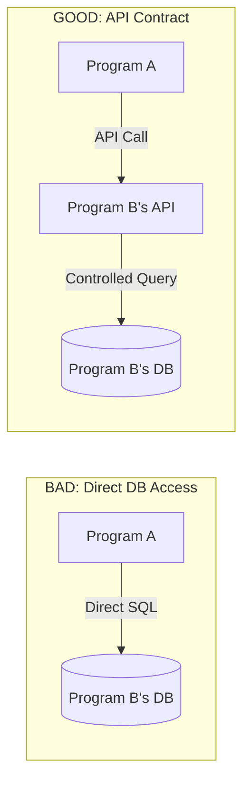

#### The Three Parts of a Contract

An API is not just "a URL you can call." It is a **binding agreement** with three components:

1. **What can be requested** -- which endpoints exist, what parameters they accept, what authentication is required
2. **How to request it** -- HTTP method, headers, request body format, authentication scheme
3. **What will be returned** -- response body shape, status codes for every outcome, error format

When you change any of these without coordinating with consumers, you break the contract. This is a **breaking change**, and at scale it can cascade into production incidents across dozens of dependent teams.

> **Why the word "contract" matters:** Contracts have legal-level weight in software teams. Changing an API contract unilaterally is equivalent to breaching a contract. At Google, Stripe, Amazon, and other large companies, API contracts are formalized: documented, versioned, and changed only through a defined deprecation process.

#### The Restaurant Menu Analogy

An API is like a restaurant menu. The menu tells you:
- **What you can order** (endpoints/operations)
- **How to order it** (syntax, format)
- **What you will receive** (the dish, i.e., the response)

The menu does not tell you how the kitchen makes the food. The chef can change the recipe, the ingredients, even the kitchen equipment -- as long as the dish that arrives matches what the menu promised. This is **encapsulation**: the API hides implementation details.

A restaurant that changes its menu without warning loses customers. An API that changes without notice loses developer trust.

---

### 3.2 REST APIs: Resources, HTTP Methods, CRUD, Idempotency

#### Why REST Exists -- The Problem It Solved

Before REST (early 2000s), APIs were often built as **RPC (Remote Procedure Call)** systems -- you called named functions like `getUserById(123)` or `createOrder(...)`. These were functional but inconsistent: every API had different conventions, making integration unpredictable.

Roy Fielding's 2000 dissertation introduced REST (Representational State Transfer) -- a set of architectural constraints that, when applied to HTTP, produce a consistent, predictable API style. The core insight: **model the world as resources, and use HTTP methods to operate on them**.

#### Resources and URLs

In REST, a **resource** is any noun your system manages: users, orders, products, payments. Each resource has a URL that identifies it:

| Resource | Collection URL | Item URL |
|---|---|---|
| Users | `/users` | `/users/123` |
| Orders | `/orders` | `/orders/456` |
| A user's orders | `/users/123/orders` | `/users/123/orders/456` |

**Key rule:** URLs are nouns. The action comes from the HTTP method, not the URL.

Bad: `GET /getUserById id=123` (verb in URL)
Good: `GET /users/123` (noun in URL, GET method implies "read")

#### HTTP Methods and CRUD

| HTTP Method | CRUD Equivalent | Typical Use | Creates New Resource  |
|---|---|---|---|
| GET | Read | Fetch a resource or list | No |
| POST | Create | Create a new resource | Yes |
| PUT | Replace | Replace a resource entirely | No (resource must exist) |
| PATCH | Update | Partially update a resource | No |
| DELETE | Delete | Remove a resource | No |

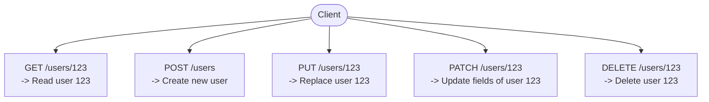

#### Idempotency -- Why It Matters for Reliability

**Idempotency** means: calling the same operation multiple times produces the same result as calling it once. This matters enormously for reliability because networks fail, clients retry, and load balancers can send duplicate requests.

| Method | Idempotent  | Why |
|---|---|---|
| GET | Yes | Reading does not change state |
| PUT | Yes | Replacing with the same data is identical to replacing once |
| DELETE | Yes | Deleting something that is already deleted is a no-op |
| POST | **No** | Each call can create a new resource (duplicate orders!) |
| PATCH | Usually no | Depends on the operation (increment vs. set) |

**The payment problem:** If a client calls `POST /payments` and the network drops after the server processes the payment but before the response reaches the client, what should the client do  Retry  If `POST` is not idempotent, it will charge the customer twice.

**The solution: idempotency keys.** The client generates a unique key (e.g., a UUID) and sends it with the request: `Idempotency-Key: abc-123`. The server stores the key and the result. If the same key arrives again, the server returns the stored result without re-executing. Stripe, PayPal, and every serious payment API uses this pattern.

> **Beginner mistake:** Assuming that because DELETE is idempotent, calling it twice is always safe. The HTTP spec says: the second call may return 404, which is technically a different response. Idempotency guarantees the **side-effect** is the same (resource is gone), not that the status code is identical. Code defensively: treat 404 on a DELETE as success.

---

### 3.3 HTTP Status Codes -- Every Important One

Status codes are the vocabulary of HTTP. They tell the client what happened so it can react appropriately. Staff engineers know these cold -- and more importantly, they know **when to use each** and **what the client should do in response**.

#### 2xx -- Success

| Code | Name | When to Use | Client Action |
|---|---|---|---|
| 200 | OK | General success for GET, PUT, PATCH | Process response body |
| 201 | Created | Resource created (POST) | Often includes `Location` header pointing to new resource |
| 202 | Accepted | Request received, processing async | Client should poll or wait for webhook |
| 204 | No Content | Success, no body (DELETE, some PATCH) | No body to parse |

**Beginner mistake:** Using `200 OK` with an error payload (e.g., `{"success": false, "error": "..."}`). This breaks HTTP semantics -- HTTP client libraries and proxies make decisions based on status codes. Always use the correct status code.

#### 3xx -- Redirection

| Code | Name | When to Use |
|---|---|---|
| 301 | Moved Permanently | Resource URL has permanently changed; update bookmarks |
| 302 | Found | Temporary redirect (e.g., after login redirect) |
| 304 | Not Modified | Client has a cached version that is still valid (used with ETags) |

#### 4xx -- Client Errors

| Code | Name | When to Use | Client Action |
|---|---|---|---|
| 400 | Bad Request | Malformed request, validation failure | Fix the request before retrying |
| 401 | Unauthorized | No authentication provided, or token invalid | Re-authenticate |
| 403 | Forbidden | Authenticated but not permitted | Do not retry -- user lacks permission |
| 404 | Not Found | Resource does not exist | Handle gracefully (may be expected) |
| 409 | Conflict | Duplicate resource, version conflict | Resolve conflict (re-read, merge, retry with new state) |
| 410 | Gone | Resource permanently removed (deprecated endpoint) | Stop calling this endpoint |
| 422 | Unprocessable Entity | Semantically invalid request (e.g., invalid email format) | Fix semantic issue |
| 429 | Too Many Requests | Rate limit exceeded | Back off, check `Retry-After` header |

**401 vs 403:** This trips up many engineers. `401 Unauthorized` means "you have not told me who you are" (missing or invalid credentials). `403 Forbidden` means "I know who you are, but you are not allowed to do this." Never return 401 when the issue is permissions -- that confuses clients into re-authenticating when they should instead escalate to an admin.

#### 5xx -- Server Errors

| Code | Name | When to Use | Client Action |
|---|---|---|---|
| 500 | Internal Server Error | Unexpected server failure | Retry with exponential backoff |
| 502 | Bad Gateway | Upstream service returned an invalid response | Retry |
| 503 | Service Unavailable | Server temporarily overloaded or down | Retry with backoff + check `Retry-After` |
| 504 | Gateway Timeout | Upstream service timed out | Retry |

**Staff-level insight:** Never expose stack traces or internal error details in 5xx responses. Log them server-side and return only a `request_id` that can be used to look up the logs. External consumers should get a sanitized error message, never raw exception output.

---

### 3.4 REST Design Best Practices

#### URL Naming Conventions

The goal: URLs should be self-describing. Someone reading a URL for the first time should understand what resource it represents.

**Rules:**
1. Use **plural nouns** for collections: `/users` not `/user`
2. Use **path parameters** for known IDs: `/users/123` not `/users id=123`
3. Use **nested paths** for sub-resources: `/users/123/orders` for a user's orders
4. Use **query parameters** for filtering and pagination: `/orders status=pending&limit=20`
5. Never put verbs in URLs: `/users/123/activate` should be `PATCH /users/123` with `{"status": "active"}`

| Bad | Good | Reason |
|---|---|---|
| `GET /getUser userId=123` | `GET /users/123` | Verb in URL, query for known ID |
| `POST /users/123/update` | `PATCH /users/123` | Update implied by HTTP method |
| `GET /user/orders` | `GET /users/123/orders` | Plural noun, explicit ID |
| `DELETE /deleteUser/123` | `DELETE /users/123` | Verb redundant with HTTP method |

#### Standard Error Response Format

Every API error should return the same shape so client code can handle errors uniformly:

```json
{
  "error": {
    "code": "VALIDATION_ERROR",
    "message": "Invalid email format",
    "details": [
      {
        "field": "email",
        "issue": "Must be a valid email address"
      }
    ],
    "request_id": "req_8f3a2b1c",
    "docs_url": "https://api.example.com/errors/VALIDATION_ERROR"
  }
}
```

| Field | Purpose | Why It Matters |
|---|---|---|
| `code` | Machine-readable error type | Clients can switch on it: `if (error.code === "RATE_LIMIT_EXCEEDED") backoff()` |
| `message` | Human-readable description | For logs and developer debugging |
| `details` | Field-specific issues (for validation) | Client can highlight specific form fields |
| `request_id` | Unique identifier for this request | Support teams can find the log entry instantly |
| `docs_url` | Link to error documentation | Reduces support burden |

#### Pagination: Cursor vs. Offset

**Why pagination exists:** Without it, `GET /users` could return millions of rows, overwhelming both server memory and client parsing.

**Offset pagination** (` page=2&per_page=20`) works like a book: "give me items 21-40." Simple and intuitive.

**Problem with offset pagination:** If the data changes between page 1 and page 2 requests (a new user is inserted at position 15), the second page will skip the user who was pushed from position 20 to 21. This creates **ghost pages** (items appear twice) and **missed items**.

**Cursor pagination** (` cursor=eyJpZCI6MjB9&limit=20`) uses a pointer into the dataset. "Give me the next 20 items after this specific record." Because it anchors to a specific record rather than a position, it is stable even when the dataset changes.

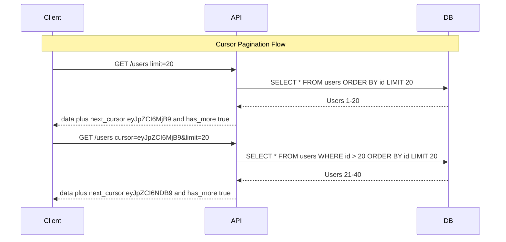

**When to use which:**
- **Offset:** Admin UIs where users navigate to page 5 directly; static or rarely changing data; small datasets
- **Cursor:** Feeds, activity streams, any list that changes frequently; large datasets; infinite scroll

> **Beginner mistake:** Using offset pagination for a social media feed. Users will see duplicate posts or miss posts when new content arrives between page loads. Always use cursor pagination for feeds.

---

### 3.5 API as Organizational Boundary -- Conway's Law and the Amazon Mandate

#### Conway's Law

Melvin Conway observed in 1968: "Organizations which design systems are constrained to produce designs which are copies of the communication structures of those organizations."

In plain English: your software architecture will mirror your team structure. If three teams build a system, you will get a three-component system. If one team owns both frontend and backend, they will build tight coupling. If two teams own separate services, those services will have a formal API between them.

The implication: **designing an API boundary is simultaneously designing a team boundary.** When you say "the User service will expose a REST API to the Order service," you are saying "the User team and the Order team will coordinate through this contract, not through shared code or shared databases."

#### The Amazon API Mandate

Around 2002, Amazon faced a scaling problem -- not of infrastructure, but of organization. As teams grew, they were creating dependencies by sharing databases and calling each other's internal code. This made independent deployments impossible: changing one thing broke something else across the company.

The reported mandate (widely cited in tech literature) required:
1. All teams expose their data and functionality through **service interfaces** (APIs)
2. Teams communicate with each other only through those interfaces -- **no shared databases, no direct function calls**
3. Interfaces must be designed as if they would eventually be exposed to external developers

The result: Amazon could grow to thousands of services and hundreds of teams while preserving independent deployability. This is also the origin of AWS -- Bezos reportedly observed that if internal APIs were good enough to be exposed externally, they could be productized. Amazon S3, EC2, and the rest were the result.

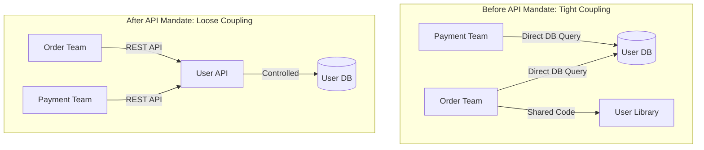

**L6 insight:** When you design a system that crosses team boundaries, the API contract is your most important deliverable. Get it wrong and every downstream team pays the cost. Get it right -- versioned, backward-compatible, well-documented -- and teams can move independently for years.

---

### 3.6 Breaking vs. Non-Breaking Changes

Understanding exactly which changes are safe and which are breaking is a Staff-level skill. Many engineers underestimate the scope of breaking changes.

#### Non-Breaking (Additive) Changes -- Safe

These changes can be deployed without a versioning event:

- **Adding a new optional field** to a response (`"middle_name": null`)
- **Adding a new endpoint** (`POST /users/123/archive`)
- **Adding a new query parameter with a default** (` include_deleted=false`)
- **Adding a new value to an error code enum** (clients should handle unknown codes gracefully)
- **Relaxing a validation rule** (accepting strings up to 200 chars instead of 100)
- **Adding a new HTTP method to an existing URL** (`PATCH /users/123` when only `PUT` existed)

**Why these are safe:** Well-written clients ignore unknown fields (Postel's Law: be liberal in what you accept). Adding things does not remove what was there.

#### Breaking Changes -- Require Deprecation/Versioning

These changes will break at least some clients if deployed without a migration period:

- **Removing a field** from a response (clients reading that field will get `undefined`/null)
- **Renaming a field** (`price` to `unit_price`)
- **Changing a field's type** (`amount: 1000` integer cents to `amount: "10.00"` string decimal)
- **Changing a field's meaning** (amount was in USD, now in the user's local currency)
- **Removing an endpoint** entirely
- **Changing the URL structure** (`/v1/users/123` to `/v1/accounts/123`)
- **Adding a required field to a request** (clients not sending it will get errors)
- **Changing error codes or status codes** (clients switching on specific codes will break)
- **Changing pagination behavior** (offset to cursor with different semantics)
- **Changing default sort order** (clients may have been relying on deterministic ordering)
- **Tightening a validation rule** (previously valid requests now fail)

> **Real-world incident:** A payments platform changed the `amount` field from integer cents (`1000` = $10.00) to a decimal string (`"10.00"`). They called it a "clarification," not a breaking change. 23 partner integrations broke. Some partners parsed `"10.00"` as integer `10` and charged customers $0.10 instead of $10.00. $47K in under-charges occurred over 6 hours before detection. The fix required reverting the change, running dual fields for 6 months, and adding contract tests in CI. Every type change is a breaking change. No exceptions.

---

### 3.7 The Expand-Contract Pattern

The expand-contract pattern (also called parallel change) is the safe way to make breaking changes without breaking consumers.

**The three phases:**

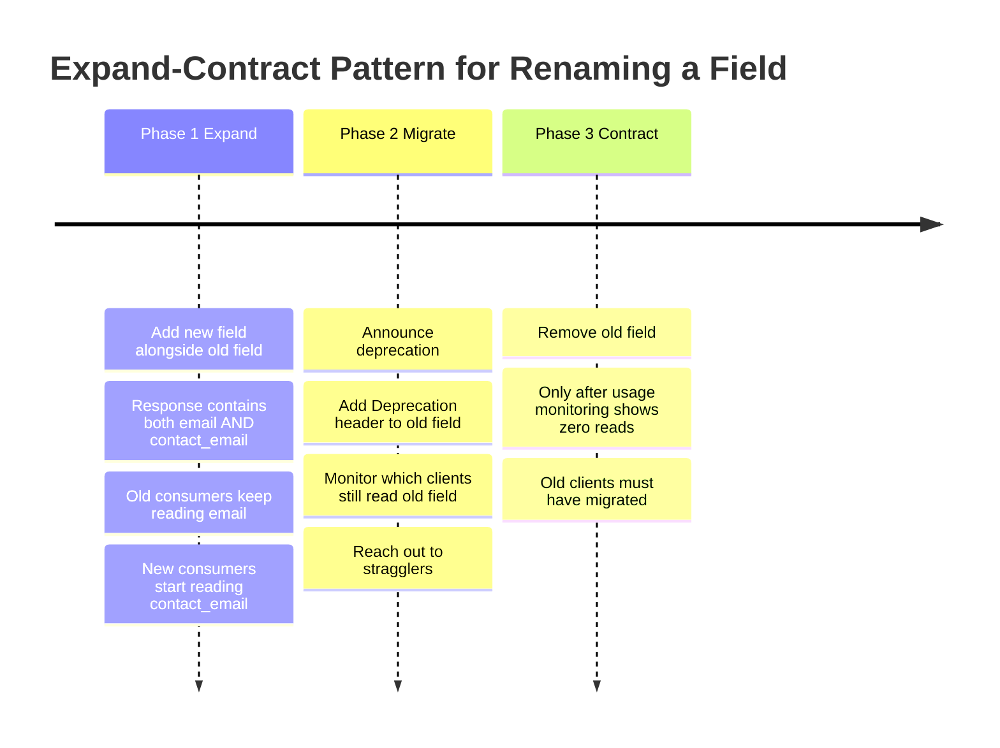

**Phase 1 -- Expand (Day 1):**
Deploy both fields simultaneously. The response contains `"email": "x@y.com"` AND `"contact_email": "x@y.com"`. Old clients read `email` and work fine. New clients can start using `contact_email`. Zero breakage.

**Phase 2 -- Migrate (Weeks 2-12):**
- Announce in changelog: "`email` is deprecated, use `contact_email`"
- Add `Deprecation: true` response header
- Set a sunset date: `Sunset: Sat, 01 Jun 2025 00:00:00 GMT`
- Monitor per-client usage: log which `client_id` or API key reads the old field
- Proactively contact high-traffic consumers that have not migrated

**Phase 3 -- Contract (After migration is complete):**
Remove the old field -- but only after usage monitoring shows it is at zero. Not "almost zero." Zero. Clients that still read a removed field will see `undefined` and may silently produce bugs.

**Staff-level:** Never skip Phase 2. "We'll tell them in the release notes" is not enough. Proactively reach out to every known consumer. Track actual usage in production logs. Only remove when confirmed safe.

---

### 3.8 API Versioning Strategies

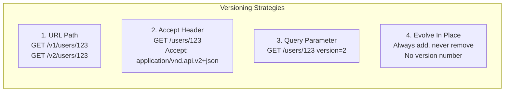

#### Comparison Table

| Strategy | Pros | Cons | Best For |
|---|---|---|---|
| **URL Path** (`/v1/`) | Explicit and visible; easy to route; CDN-cacheable; easy to document separately | URL proliferation; multiple codepaths in server | Public APIs, most common and understood by all developers |
| **Accept Header** | Clean URLs; version is metadata not data; HTTP-native content negotiation | Hidden from logs; harder to test (can't just paste URL); clients must set headers explicitly | APIs where URL aesthetics matter; some REST purists prefer this |
| **Query Parameter** (` version=2`) | Easy to test; no header setup | Not semantically correct (version is not query data); clutters URLs | Quick internal versioning; avoid for external APIs |
| **Evolve In Place** | No version management; no migration; consumers always on latest | Cannot make breaking changes; schema grows over time; inconsistencies accumulate | Internal APIs with 1-3 consumer teams you can coordinate directly |

**Staff recommendation:**
- Public APIs with many consumers: **URL path versioning** -- `/v1/`, `/v2/`. Explicit, debuggable, understandable to anyone.
- Internal APIs between a few teams: **Evolve in place** -- add optional fields, never remove. Version only when a breaking change is unavoidable.
- Max two active versions at any time. If you are on `/v7/`, you have made six breaking changes that each required migration work from every consumer. This is a design process failure, not a versioning success.

---

### 3.9 Deprecation and Sunset Strategy

A structured deprecation process protects consumer trust. Here is the full lifecycle:

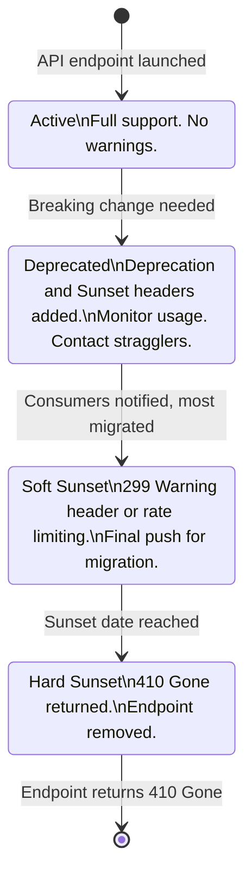

**Deprecation headers (RFC 8594):**
```
Deprecation: true
Sunset: Sat, 01 Mar 2025 00:00:00 GMT
Link: <https://api.example.com/v2/users>; rel="successor-version"
```

**Timeline by API type:**
- **Public API with many partners:** 6-12 months from announcement to hard sunset
- **Internal API between teams:** 1-3 months; use direct Slack communication
- **Mobile API:** Extra time -- you cannot force users to update their apps. Some users run year-old versions. Plan for 12-18 months or maintain indefinitely.

---

### 3.10 When APIs Become Bottlenecks

At scale, the API layer itself becomes a scaling problem. Every request passes through authentication, authorization, rate limiting, and routing. These are not free.

#### Rate Limiting

**Why it exists:** Without rate limiting, a single misbehaving client (or attacker) can exhaust your server capacity, affecting all other clients.

**Common algorithms:**

| Algorithm | How It Works | Allows Bursts  | Complexity |
|---|---|---|---|
| **Token bucket** | Tokens refill at fixed rate; request consumes one token | Yes | Low |
| **Leaky bucket** | Requests enter a queue; processed at fixed rate | No (smooths traffic) | Low |
| **Fixed window** | Count requests in a window (e.g., 100/minute) | Yes (at window boundary) | Very low |
| **Sliding window** | Rolling count; smoother than fixed | Slightly | Medium |

**Response:** Return `429 Too Many Requests` with `Retry-After: 60` header.

**Implementation:** Rate limiting state (counters, tokens) must live in a shared store accessible to all API server instances. Redis is the standard choice: `INCR` with TTL for fixed window; sorted sets for sliding window.

#### Authentication Caching

Every API request typically validates a token (JWT verification, session lookup, OAuth introspection). At 100K QPS, doing a database lookup per request for auth is prohibitive. Solution: cache auth decisions.

- **JWT verification:** Stateless -- validate the signature locally (no network call). But: cannot revoke before expiry. Use short expiry (15 minutes) + refresh tokens.
- **Session validation:** Cache in Redis with TTL. Trade-off: if user is deactivated, the cache may serve stale auth for up to TTL seconds.
- **API key validation:** Cache the key to permissions mapping in memory or Redis. Invalidate on key revocation.

#### API Gateway Scaling

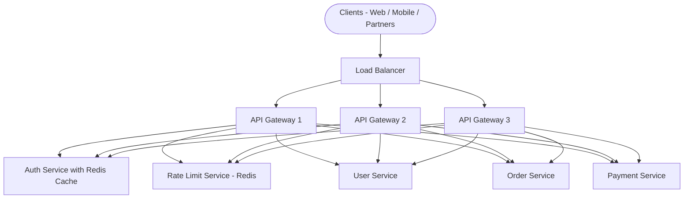

The API gateway is on the critical path for every request. It must be:
- **Stateless** -- no local session storage, so any instance can handle any request
- **Horizontally scalable** -- add instances behind the load balancer
- **Fast** -- auth check and routing should add less than 5ms overhead

---

### 3.11 Frontend vs. Backend -- What Each Does and Why the Split Matters

#### Why Split at All 

The earliest web applications had no split: the server generated HTML and sent it to the browser. The "backend" was the same code that rendered the UI. This works for simple apps but breaks down when:

- You need the same data on web and mobile (different UI, same data)
- You want rich interactive UIs that respond instantly without full page reloads
- You need independent deployability: a new button in the UI should not require a backend redeploy
- You want separate teams: a UI designer does not need to understand database queries

The frontend/backend split solves all of these by **separating the concern of presentation from the concern of business logic and data**.

#### Frontend -- What It Is and What It Does

The frontend is everything that runs on the user's device:
- **HTML/CSS:** Structure and style of the page
- **JavaScript:** Interactivity, routing, state management, API calls
- **Rendering:** Turning data from the backend into pixels the user sees

The frontend is responsible for:
- User experience: layout, animations, interactions
- Input validation (client-side, for UX -- never for security)
- State management: what data is shown, what the user has typed
- Making API calls to the backend
- Caching responses for performance

The frontend is **not** responsible for:
- Business rule enforcement (a client can lie; the backend must validate)
- Data storage (localStorage is not a database)
- Security decisions (access control must be enforced server-side)

#### Backend -- What It Is and What It Does

The backend runs on servers the user never sees:
- **Business logic:** Validating orders, calculating prices, enforcing rules
- **Authentication and authorization:** Verifying who the user is and what they can do
- **Data access:** Reading and writing from databases
- **Integrations:** Calling third-party APIs (Stripe, SendGrid, Twilio)
- **Security:** Rate limiting, input validation, audit logging

> **Beginner mistake:** Trusting frontend validation for security. A user can open browser DevTools and bypass any JavaScript check. Backend must always re-validate every input. Frontend validation is for UX (instant feedback), not security.

---

### 3.12 BFF -- Backend for Frontend

#### The Problem: One API for All Clients

Imagine you have a single API serving both your web app and mobile app:

- **Web app** needs rich product data: full descriptions, images at 1200x800, related products, review counts
- **Mobile app** needs lean data: product thumbnail at 200x200, short title, price only (to fit in a list view)
- **Web app** can make multiple API calls in parallel (fast network, powerful device)
- **Mobile app** should make one call (slow network, battery constraints)

A single API serving both clients faces a choice: return everything (mobile over-fetches) or return the minimum (web under-fetches and needs N+1 calls). Neither is good.

#### The BFF Solution

A BFF is a thin backend service that sits between a specific frontend and the shared backend services. Each client type gets its own BFF, which:

1. **Aggregates** multiple backend calls into one response for the client
2. **Shapes** the data to exactly what the client needs
3. **Adapts** the protocol if needed (mobile may need binary/protobuf; web is fine with JSON)
4. **Owns** the frontend-facing API contract for that client type

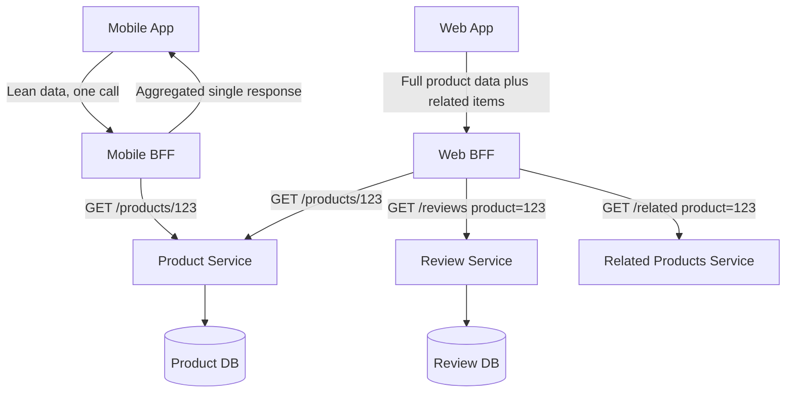

#### When to Add a BFF

**Add a BFF when:**
- Web and mobile need meaningfully different data shapes (different fields, different aggregation)
- Mobile needs batched responses to minimize round-trips on slow networks
- Different auth flows (web uses sessions; mobile uses OAuth tokens)
- Different error handling or retry logic per client type
- Team structure: a dedicated frontend team benefits from owning the BFF

**Skip the BFF when:**
- Early stage product with a single client type
- Both clients consume identical data in the same shape
- Team is small -- another service means another thing to deploy, monitor, and maintain
- The performance difference between optimized and general API is negligible

> **Staff-level insight:** The BFF pattern introduces operational overhead. You now have more services, more deployments, more points of failure. This overhead is justified when the performance gain or team autonomy gain is real. Never add a BFF speculatively -- add it when the pain of not having one is demonstrable.

---

### 3.13 Thin Client vs. Thick Client

| Model | Where Logic Lives | Example | Trade-offs |
|---|---|---|---|
| **Thin client** | Server does heavy lifting | Traditional server-rendered PHP/Rails apps; admin tools | Simple client, but every interaction requires server round-trip |
| **Thick client (SPA)** | Client does routing, state, rendering | React/Vue/Angular apps | Rich interactivity, but large JS bundles; slower first load |

The industry has shifted toward thick clients for consumer apps (SPAs) because:
- Users expect app-like interactivity (no full page reloads)
- Client-side routing is instant
- State can be cached locally

But thin clients are seeing a resurgence (Next.js, Remix, server components) because:
- SEO requires server-rendered HTML
- First load performance is better without large JS bundles
- Less JavaScript equals less surface area for bugs

---

### 3.14 Rendering Strategies: SSR, CSR, SSG, Hydration

#### The Problem: Where and When Is the HTML Generated 

The HTML the browser renders must come from somewhere. The four strategies differ in **when** and **where** that HTML is generated.

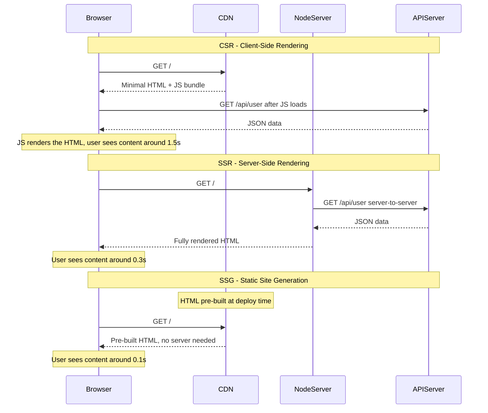

#### Strategy Comparison

| Strategy | When HTML Is Generated | Latency FCP | SEO | Best For |
|---|---|---|---|---|
| **CSR** Client-Side Rendering | In the browser after JS loads | 1-2 seconds | Poor without extra work | Dashboards, apps behind login, real-time UIs |
| **SSR** Server-Side Rendering | On the server per request | 200-500ms | Excellent | Public pages, e-commerce, social feeds |
| **SSG** Static Site Generation | At build time | 50-200ms | Excellent | Blogs, docs, marketing pages (content rarely changes) |
| **Hydration** SSR plus CSR | Server sends HTML; client adds interactivity | 200-500ms initial, then instant | Excellent | Most modern apps (Next.js, Nuxt) |

**Latency numbers that matter:**
- Users perceive latency above 300ms as "slow"
- Every 100ms of latency reduces conversion rates by roughly 1% (Amazon's reported figure)
- Google's Core Web Vitals use LCP (Largest Contentful Paint) as an SEO signal -- SSG and SSR win here

**Real-world choices:**
- **Twitter:** SSR for the initial feed (SEO + fast first paint), CSR for interactions after load
- **Airbnb:** SSR for listing pages (SEO critical -- need Google to index listings), CSR for search interactions
- **Google Docs:** Thick CSR (no SSR needed -- behind login, SEO irrelevant, rich interactivity required)

> **Beginner mistake:** Building a public marketing site as a pure CSR app (React without SSR). Google crawls it and sees an empty HTML shell -- your SEO is destroyed. Always use SSR or SSG for publicly indexed pages.

---

### 3.15 GraphQL vs. REST -- Deep Comparison

#### The Problem GraphQL Solves

REST has two structural problems at scale:

**Over-fetching:** `GET /users/123` returns `{id, name, email, phone, address, preferences, created_at, ...}` -- but the mobile app only needs `{name, avatar}`. You have transferred 10x the necessary data.

**Under-fetching:** To render a social post, you need the post, the author's profile, the like count, and the comment count. With REST you make 4 separate API calls -- a "waterfall" of requests:
1. `GET /posts/456`
2. `GET /users/123` (to get the author)
3. `GET /posts/456/likes/count`
4. `GET /posts/456/comments/count`

GraphQL lets the client specify **exactly what it needs** in a single query:

```graphql
query {
  post(id: "456") {
    content
    author {
      name
      avatar
    }
    likeCount
    commentCount
  }
}
```

One request. Exactly the fields needed. No over-fetching, no under-fetching.

#### Trade-off Comparison

| Aspect | REST | GraphQL |
|---|---|---|
| **Data shape** | Fixed by server | Client specifies exactly what it needs |
| **Endpoints** | Many (one per resource or view) | One endpoint (`/graphql`) |
| **Caching** | HTTP caching works naturally (URL = cache key) | Query-level caching required (no URL variation) |
| **N+1 problem** | Less common with well-designed endpoints | Common -- resolvers can trigger per-item DB queries |
| **Query cost** | Bounded by endpoint design | Clients can write expensive deep-nested queries |
| **Learning curve** | Low | Higher (schema, resolvers, DataLoader) |
| **Tooling** | Mature, universal | Good but more specialized |
| **Versioning** | Formal versioning via `/v1/` | Schema evolution (deprecate fields, add new) |
| **Best for** | Simple APIs, HTTP caching critical, stable clients | Many client types with different data needs, rapid iteration |

**The N+1 problem in GraphQL:** If you query 100 posts and each needs the author's name, a naive GraphQL resolver calls `getUser(authorId)` 100 times -- 100 database queries. Solution: **DataLoader** batches these into a single `SELECT * FROM users WHERE id IN (...)`. Without DataLoader, GraphQL scales poorly.

**When to choose GraphQL:**
- Multiple clients (web, iOS, Android, partner APIs) with significantly different data needs
- Rapid product iteration where the data shape changes frequently
- You have the engineering capacity to implement DataLoader and query cost limits

**When to choose REST:**
- Single client type or clients with identical data needs
- HTTP caching is important (GraphQL POST requests are not HTTP-cacheable by default)
- Team is smaller and cannot afford GraphQL's operational complexity
- Public API -- REST is universally understood; GraphQL requires more client-side knowledge

> **Staff-level insight:** GraphQL is not strictly better than REST. It solves real problems (over/under-fetching) but introduces new ones (N+1, expensive queries, caching complexity). Evaluate whether the problems it solves are actually problems you have. Many teams adopt GraphQL prematurely and spend months on DataLoader and query cost limiting that a well-designed REST API would not have needed.

---

### 3.16 Relational Databases (PostgreSQL) -- ACID from First Principles

#### Why Do We Need a Database at All 

A program's variables live in RAM. RAM is volatile: power off, restart the server, and all variables are gone. A database provides **persistence** -- data that survives process restarts, server failures, and hardware death.

Beyond persistence, databases provide:
- **Queryability:** Find all orders placed in the last 7 days by users in California
- **Concurrency:** 1000 users reading and writing simultaneously without corrupting each other's data
- **Durability:** Even if the server crashes mid-write, committed data is not lost
- **Consistency:** Constraints (no negative account balance, no orphan orders) are enforced

#### What Makes a Database "Relational" 

A relational database organizes data into **tables** -- each table is a collection of rows with a fixed set of typed columns. Tables can reference each other through **foreign keys**.

Example: `orders.user_id` is a foreign key that references `users.id`. This relationship allows joins: "find all orders for users who signed up in California."

**Why this model:** The relational model (Codd, 1970) is extremely flexible. By expressing data as tables and relationships, you can answer almost any question without knowing the question at design time. This flexibility is why relational databases have dominated for 50 years.

#### ACID -- Explained from First Principles

ACID is not just an acronym -- each property solves a specific failure mode.

**Atomicity: Either all or nothing**

Problem it solves: A bank transfer deducts $100 from Account A and credits $100 to Account B. If the system crashes after the debit but before the credit, $100 vanishes.

Solution: Wrap both operations in a transaction. If anything fails, the database rolls back everything -- the debit never happened.

```sql
BEGIN;
  UPDATE accounts SET balance = balance - 100 WHERE id = 'A';
  UPDATE accounts SET balance = balance + 100 WHERE id = 'B';
COMMIT;  -- Both succeed, or neither does
```

**Consistency: Only valid data can be stored**

Problem it solves: Someone places an order for a product that does not exist. Or a user's balance goes negative. These are invariants (rules that must always be true).

Solution: The database enforces constraints -- foreign keys, NOT NULL, CHECK constraints, unique constraints. A transaction that would violate a constraint is rejected.

**Isolation: Concurrent transactions do not interfere**

Problem it solves: Two users simultaneously book the last seat on a flight. Both read `seats_available = 1`, both subtract 1, both write `seats_available = 0`. But one of them should have failed.

Solution: Isolation levels (from weakest to strongest):
- **Read Uncommitted:** Can read uncommitted changes from other transactions (very rare to use)
- **Read Committed:** Only reads committed data (PostgreSQL default; most common)
- **Repeatable Read:** Same read twice in a transaction returns same result
- **Serializable:** Full isolation -- as if transactions ran one at a time

Higher isolation equals fewer anomalies, but more locking and lower throughput.

**Durability: Committed data survives crashes**

Problem it solves: The database acknowledges a write, then crashes. On restart, is the data there 

Solution: Write-ahead logging (WAL). Before any change is applied to the data files, it is written to an append-only log. On restart, the database replays the log to recover committed transactions.

> **L6 insight:** ACID guarantees are not free. Atomicity requires rollback logging. Consistency requires constraint checks on every write. Isolation at Serializable level requires locking or MVCC. Durability requires fsync to disk. Each guarantee adds latency and limits write throughput. This is why many large-scale systems use eventual consistency for non-critical data -- they trade ACID guarantees for throughput.

---

### 3.17 NoSQL Types -- When Each Wins and Loses

"NoSQL" is an umbrella term for databases that do not use the relational model. There are at least five fundamentally different types, each solving a different problem.

#### Key-Value Stores (Redis, DynamoDB)

**Model:** Every piece of data is stored as a value, accessed by a key. Like a giant hash map.

**Strengths:**
- Sub-millisecond reads and writes (Redis keeps data in memory)
- Extreme horizontal scalability (partition by key hash)
- Simple operations: GET, SET, DELETE, EXPIRE

**Weaknesses:**
- Cannot query by value -- "find all keys where value.city = NYC" requires scanning everything
- No joins, no relationships
- Redis loses data on restart unless configured for persistence (trade-off: memory = fast, disk = durable)

**When key-value wins:**
- Session storage (key = session ID, value = user session object)
- Caching (key = cache key, value = cached response)
- Rate limiting counters (key = user_id + window, value = count)
- Feature flags and config (key = flag name, value = true/false)

**Real-world:** GitHub uses Redis for session storage and rate limiting. Every API request checks a Redis counter; at 100K QPS this is far faster than a database query.

#### Document Stores (MongoDB, CouchDB, Firestore)

**Model:** Data is stored as self-contained documents (JSON/BSON). A document can contain nested arrays and objects. No fixed schema -- different documents in the same collection can have different fields.

**Strengths:**
- Flexible schema -- perfect for user-generated content where fields vary
- Nested data is natural (a blog post with its comments as an array)
- Query by any field (unlike key-value)
- Horizontal scaling (sharding)

**Weaknesses:**
- Multi-document transactions were historically absent or weak (modern MongoDB has them, but simpler than SQL)
- No true joins -- referencing across collections requires application-level lookups
- Flexible schema can become a liability: inconsistent data, hard to enforce invariants

**When document stores win:**
- Product catalogs (different product types have different attributes)
- Content management (articles have varying metadata)
- User profiles with optional fields
- Configuration objects

**Real-world:** MongoDB powers many content management systems. A product catalog where TVs have resolution and refresh rate, while shoes have size and color, is awkward in SQL but natural in a document store.

#### Column-Family Stores (Cassandra, HBase)

**Model:** Data is organized by rows and columns, but columns are grouped into "column families" and can be sparse. Optimized for writing many rows quickly and reading by partition key.

**Strengths:**
- Massive write throughput (LSM tree, no random writes)
- Linear horizontal scalability (add nodes, capacity increases proportionally)
- Designed for multi-datacenter replication
- Excellent for time-series: writes are sequential, reads scan by time range

**Weaknesses:**
- Query model is extremely constrained -- you design your tables around your queries; changing queries later requires new tables
- No joins, no ad-hoc queries (no WHERE on non-key columns without expensive full scans)
- Eventual consistency by default (tunable, but strong consistency reduces availability)
- Complex to operate: compaction, tombstones, repair processes

**When column-family wins:**
- Time-series data at scale (IoT sensor readings, metrics)
- Event logs (append-only, read by time range)
- High-write throughput workloads that can tolerate eventual consistency

**Real-world:** Netflix uses Cassandra for their viewing history (100B+ rows). Apple reportedly runs one of the largest Cassandra deployments for iCloud. The access pattern is: write viewing events continuously, read by user ID and time range.

#### Graph Databases (Neo4j, Amazon Neptune)

**Model:** Data is stored as nodes (entities) and edges (relationships). Relationships are first-class citizens with their own properties.

**Strengths:**
- Multi-hop relationship traversal is trivial: "friends of friends who like jazz and live in NYC" is one query
- Relationship queries that would require many joins in SQL are direct traversals
- Adding new relationship types does not require schema migrations

**Weaknesses:**
- Poor for tabular data or high-volume simple lookups
- Fewer engineers with graph database expertise
- Operational complexity relative to relational databases
- Performance at very high scale (billions of edges) is challenging

**When graph databases win:**
- Social networks (follow/follower relationships, mutual connections)
- Recommendation engines (users who liked X also liked Y)
- Fraud detection (patterns across transaction networks)
- Knowledge graphs (entities and their relationships)

**Real-world:** LinkedIn uses graph databases for its "You may know" recommendations. eBay uses Neptune for fraud detection -- finding rings of related accounts.

---

### 3.18 Database Selection Framework -- The 5 Questions

Choosing a database is one of the most consequential architectural decisions. The selection should be driven by analysis, not familiarity.

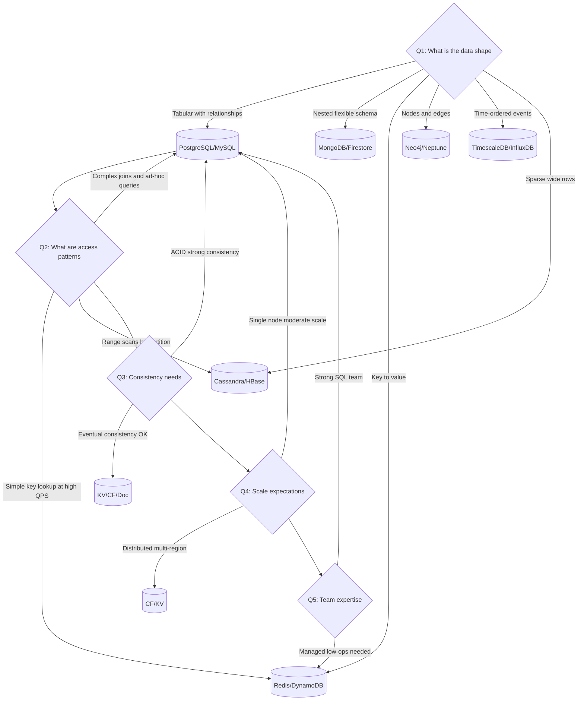

**The 5 Questions in detail:**

1. **What is the data shape ** Draw your data model. Does it naturally fit rows and columns  Nested documents  Key lookups  Graph traversals  Let the shape guide the first filter.

2. **What are the access patterns ** Write down your top 5 queries. Not hypothetical queries -- real queries the application will run in the hot path. These queries determine indexing strategy, partitioning strategy, and often the database type.

3. **What are the consistency needs ** "We need ACID for payments" means PostgreSQL. "We can tolerate a few seconds of lag on the activity feed" means eventual consistency is fine. Different domains within the same system may have different answers.

4. **What is the scale expectation ** Order-of-magnitude estimates: 10K users or 10M users  100 QPS or 100K QPS  1GB of data or 1TB  A single PostgreSQL instance handles millions of users and thousands of QPS. Cassandra justifies its complexity at hundreds of thousands of QPS and petabytes.

5. **What is the team's expertise ** Cassandra is powerful but operationally complex. If your team has never run Cassandra, the learning curve can cost months. Managed services (DynamoDB, Aurora, Cosmos DB) reduce operational burden significantly.

---

### 3.19 Database Scaling Staircase -- 5 Stages

Every production database follows a predictable scaling path. Each stage solves the problem of the previous stage -- and introduces a new problem. Understanding this sequence lets you design for the future without over-engineering for the present.

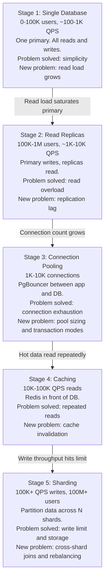

#### Stage 1: Single Database (Startup to ~100K Users)

One PostgreSQL primary. All reads and writes go to it. Deployments are simple: one database to back up, monitor, and recover.

**What breaks it:** As traffic grows, the primary CPU and I/O become saturated. SELECT queries compete with INSERT/UPDATE/DELETE for resources. You start seeing slow queries.

**Design principle at this stage:** Optimize queries and add appropriate indexes before scaling the infrastructure. Many "database performance problems" are actually query problems that a well-placed index solves instantly.

#### Stage 2: Read Replicas (~100K-1M Users)

Add one or more read-only replicas. Replication streams write-ahead logs from primary to replicas. Application routes reads to replicas, writes to primary.

**What it costs:** Replicas are slightly behind the primary -- "replication lag." For most reads (social feeds, product catalogs), a few hundred milliseconds of lag is acceptable. For "read your own writes" (user submits a profile change and immediately sees it), you must route that read to the primary.

**Design principle:** Classify your reads: which are latency-tolerant (can go to replica) and which require freshness (must go to primary). Route accordingly.

#### Stage 3: Connection Pooling (~1K-10K Application Server Threads)

Each application server instance maintains a pool of database connections. At 50 application servers with 20 threads each, you have 1000 potential connections hitting the database. PostgreSQL handles a few hundred concurrent connections well; beyond that, connection overhead dominates.

**PgBouncer** sits between application servers and the database, multiplexing hundreds of application connections onto a small number of actual database connections:

```
50 app servers x 20 threads = 1000 connections to PgBouncer
PgBouncer sends only 50-100 actual connections to PostgreSQL
```

**What it costs:** PgBouncer in transaction pooling mode (the most efficient) cannot support PostgreSQL features that require a persistent session: named prepared statements, advisory locks, LISTEN/NOTIFY. Plan around these limitations.

#### Stage 4: Caching (~10K-100K QPS Reads)

A cache (Redis or Memcached) sits in front of the database. Frequently-read data (popular product pages, user profiles, configuration) is stored in the cache with a TTL. On a cache hit, no database query is made.

**Cache miss storm (thundering herd):** Cache expires; 10,000 requests simultaneously query the database. Solution: lock-based cache fill (only one request rebuilds the cache; others wait) or jitter on TTL (randomize expiry by plus or minus 10% so all cache entries do not expire simultaneously).

**Invalidation strategies:**
- **TTL expiry:** Simple; may serve stale data for up to TTL seconds
- **Write-through:** Update cache whenever DB is updated (tightly coupled)
- **Event-driven invalidation:** Publish a change event; cache subscribers invalidate on receipt

**Design principle:** Cache hit rate should be above 90% for the cache to be worthwhile. If your cache has a 50% hit rate, you have roughly doubled your infrastructure complexity for a 2x improvement.

#### Stage 5: Sharding (100M+ Users, 100K+ Write QPS)

Data is partitioned across N independent database instances (shards). A shard key (usually user_id or tenant_id) determines which shard holds a given row. Application-level routing sends each query to the correct shard.

**What it costs:**
- **Cross-shard queries are broken:** Joins across shards require scatter-gather (query all shards, aggregate results in application). This is expensive and complex.
- **Rebalancing is painful:** Data grows unevenly. A "hot shard" can become a bottleneck. Splitting shards requires careful data migration.
- **Global uniqueness:** AUTO_INCREMENT IDs are shard-local. Use UUIDs, or a centralized ID service (like Twitter's Snowflake), or composite IDs (shard_id + local_id).

**Design principle for sharding:** Your shard key must be in the WHERE clause of 90%+ of your queries. If you shard by user_id, every query must include user_id. Cross-user queries (admin dashboards, analytics) are expensive -- plan to serve them from a separate read store (e.g., a data warehouse) rather than on the production sharded database.

---

### 3.20 Read/Write Ratio -- How It Drives Every Architectural Decision

The ratio of reads to writes is the single most impactful input to your database and caching architecture. Measure it or estimate it before making any scaling decisions.

| Read/Write Ratio | Example Systems | Primary Strategy | Database Choice |
|---|---|---|---|
| 1000:1 | Product catalog, public docs | Aggressive CDN + cache, many replicas | SQL with replicas; consider read-optimized stores |
| 100:1 | Social feeds, news | Redis cache, multiple read replicas | SQL standard; or DynamoDB with DAX |
| 10:1 | E-commerce orders | 1-2 replicas, selective caching | SQL |
| 1:1 | Chat messages, counters | Minimal caching | SQL or column-family |
| 1:10 | IoT telemetry, log ingestion | Write-optimized store, batching | Cassandra, time-series |
| 1:1000 | High-frequency metrics | Append-only log, batch aggregation | Kafka to InfluxDB/TimescaleDB |

**Getting it wrong is expensive:**
- **Treating a write-heavy system as read-heavy:** You add read replicas and Redis cache. Your primary is still saturated by writes. You have added operational complexity without solving the problem.
- **Treating a read-heavy system as write-heavy:** You shard your database and optimize for write throughput. Your replicas sit idle. Your primary is underutilized while your caching layer is missing.

**Measure, do not assume:** Add instrumentation to count DB reads vs. writes per endpoint. Many engineers assume their system is read-heavy because reads feel more frequent, but miss that one checkout endpoint generates 20 writes (order, inventory, payment, audit log, notification).

---

### 3.21 Indexes -- How They Work, Write Overhead, When Not to Index

#### How Indexes Work

A database index is a separate data structure (typically a B-tree) that maps a column's values to row locations. Without an index, finding `users WHERE email = 'alice@example.com'` requires reading every row in the table (O(n) full scan). With an index on `email`, the database traverses the B-tree in O(log n) -- from seconds for millions of rows to milliseconds.

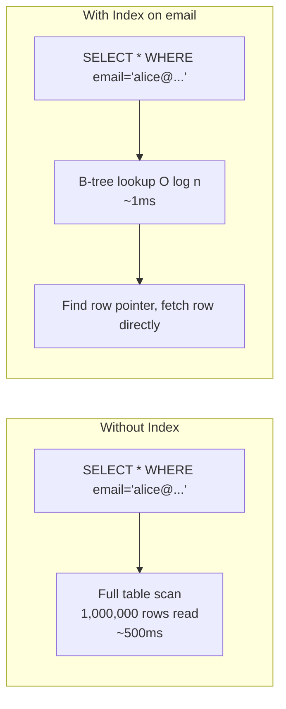

#### Write Overhead

Every index must be updated on INSERT, UPDATE, and DELETE. If a table has 5 indexes:
- Each INSERT updates 5 B-trees instead of just the table
- Each UPDATE to an indexed column updates the B-tree for that column
- Each DELETE removes entries from all 5 B-trees

**Practical impact:** A table with 1-3 well-chosen indexes sees ~5-15% write overhead. A table with 10+ indexes can see 50-100% write overhead. For write-heavy tables, over-indexing is a serious performance problem.

#### Indexing Strategy

**Index the hot path:** What are your most frequent queries  Index for those. Do not create indexes speculatively for "queries we might run someday."

**Composite indexes:** An index on `(user_id, created_at)` serves queries like `WHERE user_id = 123 ORDER BY created_at DESC`. Column order matters -- the leading column must appear in the WHERE clause.

**Unique indexes:** Enforce uniqueness at the database level for fields like email. This is both an integrity constraint and an efficient lookup.

**When NOT to index:**
- Columns with very low cardinality (boolean `is_deleted` -- index on true/false is rarely useful)
- Tables that are almost exclusively written to (log tables, event tables)
- Rarely-queried columns that are only needed in analytics (run analytics queries on a replica or data warehouse, not the production database)
- Very small tables (under 10K rows) -- full scans are faster than B-tree traversal for tiny tables

---

### 3.22 Connection Pools -- Why Needed, How to Size, PgBouncer

#### Why Not One Connection Per Request 

Opening a new database connection involves:
1. TCP handshake (1 round trip)
2. TLS negotiation (2+ round trips)
3. PostgreSQL authentication (1 round trip)
4. Allocating connection state on the DB server (~5-10 MB per connection)

For a 1ms database query, this connection overhead (typically 5-20ms) is 5-20x the query cost. At 10K QPS, opening a new connection per request is catastrophic.

**Connection pool:** A pool maintains N open connections that are reused across requests. The application "checks out" a connection, uses it, and returns it. Connection setup cost is paid once at startup, not per request.

#### How to Size a Connection Pool

**Rule of thumb for PostgreSQL:**
```
pool_size = (number_of_cores x 2) + number_of_spindles
```

For a database server with 8 cores and SSD (spindles approximately 1):
```
pool_size = 8 x 2 + 1 = 17 connections per application server
```

**Calculating total connections:**
```
total_connections = pool_size_per_instance x number_of_app_instances
```

For 50 app instances with pool size 20:
```
total_connections = 20 x 50 = 1000 connections
```

PostgreSQL's default `max_connections` is 100, typically tuned to 500-1000 in production. If your application needs more, add a connection pooler.

#### PgBouncer

PgBouncer is a lightweight connection pooler for PostgreSQL. It sits between your application servers and the database:

```
App Server 1: 20 connections -> PgBouncer
App Server 2: 20 connections -> PgBouncer  -> 50-100 connections -> PostgreSQL
...
App Server N: 20 connections -> PgBouncer
```

**PgBouncer modes:**
- **Session pooling:** Connection held for the entire client session. Low multiplexing. Use when clients use session-level features (SET, LISTEN/NOTIFY).
- **Transaction pooling:** Connection returned to pool after each transaction. High multiplexing -- 1000 app connections can share 50 DB connections. Cannot use prepared statements, SET, advisory locks. This is the most common production configuration.
- **Statement pooling:** Aggressive -- returned after each statement. Rarely used; breaks most SQL patterns.

---

### 3.23 Schema Design for Evolvability

Schemas are the hardest thing to change in a production system. A schema migration on a 10TB table can take hours and require careful coordination to avoid locking. Design schemas to minimize the cost of future changes.

**Principles:**

1. **Prefer additive changes:** Adding a column with a default is cheap. Dropping a column requires coordinating with all consumers. Add new optional columns freely; guard carefully against removing them.

2. **Use JSONB for truly variable data:** PostgreSQL's JSONB column can store arbitrary JSON with full query support. Use this for user-defined fields, metadata, or attributes that vary widely -- you avoid needing ALTER TABLE for every new attribute.

3. **Include `created_at` and `updated_at` on every table:** You will always eventually need these. Adding them retroactively is expensive.

4. **Use UUIDs or globally unique IDs if you plan to shard:** Auto-increment integers are not globally unique across shards. Start with UUIDs if sharding is a realistic future step.

5. **Avoid storing derived data without documenting it:** Caching a `total_orders_count` in the users table speeds reads but complicates writes and creates inconsistency risks. Document why it exists and what invalidates it.

**Expand-contract for schema changes:**
- Adding a column: `ALTER TABLE users ADD COLUMN middle_name TEXT;` -- safe, instant on modern PostgreSQL
- Renaming a column: Add new column, backfill data, update application to use new column, drop old column
- Changing a column type: Add new column with new type, backfill, switch reads, drop old
- Dropping a column: Only after confirming no application code reads it (grep all codebases, monitor for errors)

---

### 3.24 Backup, RPO, and RTO

#### Why Backups Are Not Optional

"We do not need backups -- we have read replicas." This is a dangerous misconception. Read replicas replicate data changes -- including accidental deletes and corrupted writes. If someone runs `DELETE FROM users WHERE 1=1` (no WHERE clause), that deletion is replicated to all replicas within seconds.

Backups are separate, point-in-time snapshots of the database that allow you to restore to a state before an error occurred.

#### RPO and RTO -- The Two Recovery Metrics

**RPO (Recovery Point Objective):** How much data can we afford to lose  "RPO = 1 hour" means: if we suffer a catastrophic failure, we can tolerate losing at most the last hour of data.

**RTO (Recovery Time Objective):** How long can we afford to be down while recovering  "RTO = 4 hours" means: we commit to restoring service within 4 hours of a failure.

| Backup Strategy | RPO | RTO | Cost |
|---|---|---|---|
| Daily backup to S3 | ~24 hours | Hours | Low |
| Hourly backup | ~1 hour | Hours | Medium |
| Continuous WAL archiving (PITR) | Minutes to seconds | Hours (restore + replay) | Medium |
| Hot standby with failover | Seconds | Minutes | High |
| Multi-region active-active | Near zero | Near zero | Very high |

**Point-in-Time Recovery (PITR):** PostgreSQL streams its write-ahead log continuously. By archiving WAL files, you can restore to any point in time -- even "restore to 3:45:23 PM yesterday, just before the bad query ran."

**L6 insight:** Define RPO and RTO with the business before choosing backup strategy. "We should back up the database" is incomplete. "Our RPO is 30 minutes and RTO is 2 hours, based on acceptable data loss and the SLA our customers expect" is a decision with business grounding. Untested backups are not backups -- run restore drills quarterly.

---

## 4. Mental Models

### The Restaurant Analogy (Full System)

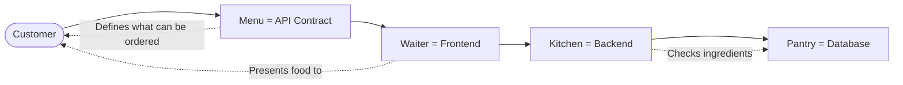

- **Menu (API):** Defines what you can order, how to order it, and what you will receive. The kitchen can change recipes -- but the menu must stay consistent.
- **Dining room and waiter (Frontend):** What the customer sees and interacts with. Beautiful and responsive, but the waiter does not cook food -- they interface.
- **Kitchen (Backend):** Where the actual work happens. Multiple chefs (services) work in parallel. The customer never sees the kitchen.
- **Pantry (Database):** The source of truth. The kitchen can cache ingredients on the counter (cache), but the pantry is where real inventory lives.

### The Scaling Staircase

Each floor solves the problem of the floor below -- but adds a new problem:

- **Floor 1 (Single DB):** Simple. Like a one-person kitchen. Works until you have too many customers.
- **Floor 2 (Read Replicas):** Hire more waiters to read the menu. But now they might read yesterday's menu (replication lag).
- **Floor 3 (Connection Pool):** Add a maitre d' to manage table assignments instead of everyone crowding the entrance.
- **Floor 4 (Cache):** Write the daily specials on a whiteboard (cache) so the waiter does not run to the kitchen for every question.
- **Floor 5 (Sharding):** Open a second kitchen location. More capacity -- but now a customer's order might need to be split across two kitchens (cross-shard joins).

### The Contract Mental Model

An API is like a legal contract between two companies. It specifies obligations on both sides. Changing it unilaterally is breach of contract. Changing it with notice and a migration period is an amendment. The difference between a junior engineer ("I'll just change the field name") and a Staff engineer ("we'll run expand-contract over 6 weeks") is an understanding of the contract model.

---

## 5. Real-World Examples

### Stripe -- API Design as a Product

Stripe's API is widely considered the gold standard for developer experience. Their key choices:

**Idempotency keys on every mutation:** Every `POST /v1/charges` accepts an `Idempotency-Key` header. The same key sent twice returns the same result. This is not optional -- it is a core part of the contract. It solves the "charged twice on retry" problem at the API contract level.

**Date-based versioning:** Stripe uses dates as version identifiers (`2024-06-20`). When you set a version in your account settings, all API responses use that version's behavior -- even as the underlying API evolves. You can test what a new version will look like and opt in deliberately. This decouples API evolution from application upgrades.

**Structured webhook payloads:** Every Stripe webhook has a `type` field (`charge.succeeded`, `invoice.payment_failed`) and a consistent `data.object` structure. Clients switch on `type` and handle each case. Adding new event types is non-breaking -- clients ignore types they do not recognize.

**Request IDs everywhere:** Every API response includes `request-id: req_abc123`. Support tickets from developers include this ID; Stripe engineers can find the exact request in logs in seconds. This is a design decision, not an afterthought.

### Amazon -- Internal APIs and AWS

The API mandate (described earlier) transformed Amazon's internal architecture. When every team's data is behind an API, you can enforce SLAs, rate limits, and authorization uniformly. No team can accidentally bring down another team's database by running an unindexed query.

AWS itself is the external version of Amazon's internal APIs. S3 was the internal blob storage service before it became a product. The discipline of "design it like it will be external" produced APIs that were good enough to become a trillion-dollar business.

### Google -- Protobuf and gRPC for Internal APIs

While Google's external APIs are REST, internal service-to-service communication primarily uses **gRPC** (Protocol Buffers over HTTP/2). Why 

- **Binary encoding:** Protobuf is roughly 10x more compact than JSON -- significant at Google scale
- **Strong typing:** Schema is defined in `.proto` files; breaking changes are caught at compile time
- **Streaming:** gRPC supports bidirectional streaming -- not possible with REST
- **Code generation:** Generate clients in Go, Java, Python, C++ from one schema

For external APIs, Google still uses REST because HTTP+JSON is universally understood and debuggable without specialized tools. gRPC is an internal optimization.

### Twitter/X -- The Read/Write Mismatch Problem

Twitter's core challenge: writes are cheap (one user posts a tweet), reads are extremely expensive (millions of followers need to see it). Early Twitter read the social graph on every feed load -- a join across millions of rows that was unsustainable at scale.

**Solution: Fan-out on write.** When a user posts a tweet, Twitter pushes it into each follower's "inbox" (a pre-computed timeline stored in Redis). Reading the feed becomes a simple Redis list lookup -- no join. The write is slower (fan-out to millions of followers), but reads are fast.

**The edge case:** Celebrity accounts with 100M followers cannot fan-out on write -- that is 100M Redis writes per tweet. Solution: hybrid model. Celebrity tweets are not pre-fanned. Instead, when you load your feed, Twitter injects celebrity tweets you follow inline from a separate read of their timeline. This trade-off is invisible to users.

### Facebook -- Database Architecture at Scale

Facebook runs what is likely the largest MySQL deployment in the world, augmented by:
- **TAO:** A graph-aware distributed cache and abstraction layer over MySQL for social graph data (friendships, likes, comments)
- **RocksDB:** A key-value store (LSM tree-based) used for embedded storage in many systems
- **Cassandra:** For messages and other high-write workloads

The lesson: even Facebook uses MySQL (relational) as its foundation. The exotic NoSQL systems are layered on top for specific access patterns. "Start with PostgreSQL/MySQL and add specialized stores only when you have proven the need" is sound advice even at Facebook scale.

---

## 6. Design Trade-offs

### REST vs. GraphQL -- Decision Framework

| Use GraphQL When | Use REST When |
|---|---|
| Multiple client types (web, iOS, Android, partner) with different data needs | Single client type or uniform data needs |
| Frontend teams need to move faster than backend can add endpoints | Stable product with predictable data shapes |
| Over-fetching is a measurable performance problem on mobile | HTTP caching is important (REST caches by URL natively) |
| You have engineering capacity to implement DataLoader and query cost limiting | Smaller team that needs simpler operational model |
| Data shape evolves rapidly (startup phase) | Public API where universal HTTP tooling matters |

### SQL vs. NoSQL -- When Each Wins

| Use SQL (PostgreSQL) When | Use NoSQL When |
|---|---|
| You need multi-table joins and ad-hoc queries | Access pattern is purely key-value (no joins needed) |
| ACID transactions are required (payments, orders) | Eventual consistency is acceptable |
| Schema is stable and well-understood | Schema is highly variable or evolving rapidly |
| Scale is moderate (single-node or modest cluster) | You need to scale writes horizontally across many nodes |
| Team has SQL expertise | Team has relevant NoSQL expertise |

### BFF -- When to Add vs. Skip

| Add a BFF When | Skip the BFF When |
|---|---|
| Mobile needs significantly less data than web (save bandwidth) | Both clients consume identical data |
| Different auth flows per client type | Single client type |
| Mobile needs batched responses (minimize round-trips) | Early-stage product -- reduce operational complexity |
| Frontend team wants autonomy over their API contract | Shared API is simpler and sufficient |

### Caching -- Trade-off Summary

| Strategy | Freshness | Complexity | Use When |
|---|---|---|---|
| No cache | Always fresh | Minimal | Data changes per request; low read volume |
| TTL cache | Stale up to TTL | Low | Read-heavy; stale-by-seconds acceptable |
| Write-through | Fresh | Medium | Writes are infrequent; cache must be fresh |
| Event-driven invalidation | Near-fresh | High | Writes are frequent; staleness is not acceptable |

---

## 7. Common Interview Questions -- Staff-Level Q&A

### Q1: Design the API for a ride-sharing system like Uber

**What the interviewer is probing:** Can you model a complex domain as REST resources  Do you handle async operations (trip completion) correctly  Do you think about idempotency for payment 

**Strong answer:**

"The key resources are: riders, drivers, trips, and payments. Let me walk through the lifecycle:

- `POST /trips` -- rider requests a trip. Body: `{pickup_location, destination, rider_id}`. Returns `{trip_id, status: 'searching'}`. This is async -- we return 202 Accepted, not 201 Created, because the trip is not confirmed until a driver accepts.
- `GET /trips/{id}` -- poll for trip status (or use WebSocket push)
- `POST /trips/{id}/accept` -- driver accepts. Idempotency key required: `Idempotency-Key: {trip_id}-{driver_id}`.
- `POST /trips/{id}/complete` -- driver marks complete. Triggers payment.
- `GET /drivers/nearby lat=37.7&lng=-122.4&radius=5` -- find nearby drivers (used by dispatch service)

For versioning: `/v1/` from day one. For error format: `{code, message, request_id}`. For pagination on trip history: cursor pagination since trips are time-ordered.

The payment `POST /payments` must be idempotent -- the mobile app may retry if the network drops mid-trip. We use the trip_id as the natural idempotency key."

---

### Q2: How would you handle a breaking API change without taking down consumers 

**Strong answer:**

"Expand-contract, in three phases. Say we need to rename `price` to `unit_price`:

Phase 1 (Expand): Add `unit_price` alongside `price`. Both fields return the same value. Old consumers read `price` and still work. New consumers start using `unit_price`. Zero breakage. Deploy this immediately.

Phase 2 (Migrate -- 6 weeks): Add `Deprecation: true` and `Sunset: <date>` headers. Log which clients are reading `price`. Contact the top 5 consumers directly via Slack/email. Update documentation.

Phase 3 (Contract -- after zero usage confirmed): Remove `price` from the response. Update docs. Monitor error rates for a week after removal to catch any stragglers we missed.

The key is: no consumer experiences a break. We absorb the cost of dual-field support so they do not absorb the cost of an outage."

---

### Q3: SQL vs NoSQL -- how do you choose 

**Strong answer:**

"I work through five questions:

1. Data shape: Is it tabular with relationships, or document/key-value/graph 
2. Access patterns: What are my top 5 queries  Do I need joins, or key lookup 
3. Consistency: Do I need ACID  Or is eventual consistency acceptable 
4. Scale: Single node or distributed  Write-heavy or read-heavy 
5. Team expertise: What can we operate reliably 

For most systems, I start with PostgreSQL because it handles 90% of use cases well -- ACID, joins, ad-hoc queries, mature tooling. I reach for NoSQL when I have a specific, demonstrated need: Redis for sub-millisecond key-value lookups; Cassandra for 100K+ write QPS on append-only data; Elasticsearch for full-text search.

I avoid premature NoSQL adoption. MongoDB does not automatically scale better than PostgreSQL -- it just has a different trade-off profile. The wrong choice costs months of migration."

---

### Q4: Walk me through the database scaling staircase

**Strong answer:**

"Five stages, each solving the previous stage's bottleneck:

Stage 1: Single primary. Simple. Works to ~1K QPS. Problem: read load saturates it.

Stage 2: Read replicas. Route reads to replicas, writes to primary. Handles 10x more reads. Problem: replication lag means replicas may be seconds behind. 'Read your own writes' must go to primary.

Stage 3: Connection pooling (PgBouncer). At 50 app servers x 20 threads = 1000 connections, PostgreSQL struggles. PgBouncer multiplexes thousands of app connections onto 50-100 DB connections. Problem: transaction pooling mode breaks prepared statements and advisory locks.

Stage 4: Caching (Redis). Cache hot reads -- product pages, user profiles. At 10K QPS, 90% of reads should hit cache. Problem: cache invalidation. When data changes, how do you invalidate  TTL is simple but staleness. Write-through is fresh but tight coupling.

Stage 5: Sharding. Partition data by user_id across N shards. Each shard handles 1/N of writes. Problem: cross-shard joins require scatter-gather; global uniqueness requires UUID or Snowflake IDs; rebalancing is operationally painful.

The key insight: design your schema for Stage 5 from Stage 1. Use user_id as the leading column in all user-scoped tables. Avoid cross-shard queries in your hot path. This makes the Stage 5 migration possible when you need it."

---

### Q5: What is idempotency and why does it matter for payment APIs 

**Strong answer:**

"Idempotency means: calling the same operation multiple times produces the same result as calling it once.

For payments, this matters because networks are unreliable. A client sends `POST /payments` -- the server processes the charge and debits the card, but the server crashes before sending the response. The client times out. Should it retry  If POST is not idempotent, a retry creates a second charge.

The solution: idempotency keys. The client generates a UUID and sends it with the request: `Idempotency-Key: abc-123`. The server stores the key and result in the database -- atomically with the payment processing, ideally in a transaction. If the same key arrives again, the server returns the stored result without re-executing.

This is table stakes for payment APIs. Stripe, Adyen, and Braintree all require idempotency keys for charge operations. When I design a payment API, idempotency keys are not optional -- they are part of the contract on day one."

---

### Q6: How do you design for BFF at scale 

**Strong answer:**

"The BFF pattern makes sense when clients have meaningfully different data needs. The risk is over-engineering.

First, I quantify the difference. If the mobile app needs 5 fields from a response that has 50, that is genuine over-fetching worth solving. If it needs 48 of 50 fields, a BFF is complexity without much benefit.

When a BFF is justified: I create a thin aggregation layer per client type. Each BFF owns the API contract for its client. It calls shared backend services (User Service, Order Service) and shapes the response. Critically, BFF contains no business logic -- it only aggregates and shapes. Business logic lives in the shared services.

At scale, each BFF must scale independently. The web BFF handles higher sustained traffic; the mobile BFF handles more burst traffic (app opens spike at certain times). I scale each separately and do not let them share state.

The mistake I see: BFFs that grow into mini-backends. They start doing data transformations, then validation, then writing to the database. Keep BFFs thin: aggregate, shape, return."

---

### Q7: What rendering strategy would you choose for an e-commerce product detail page 

**Strong answer:**

"SSR with hydration -- specifically Next.js or similar.

Why SSR: Product pages need to be indexed by Google. If Google crawls a CSR React app, it sees an empty HTML shell. That is terrible for SEO. SSR sends fully rendered HTML that Google indexes immediately.

Why hydration: After the initial server-rendered page loads, the client needs to be interactive -- add to cart, image galleries, reviews loading. Hydration means the server sends full HTML (fast first paint, SEO), and the browser activates it with React's event handlers.

Latency impact: With SSR, the server fetches product data and renders HTML before responding. TTFB might be 200-400ms instead of 50ms for a static page. The trade-off: better SEO and first paint vs. slightly higher TTFB. For e-commerce, the SEO and conversion benefit of fast first paint justifies this.

For highly personalized data (user's cart count, personalized recommendations), I would SSR the static content and CSR the personalized parts to avoid cache invalidation complexity on the server side."

---

### Q8: You have a 99:1 read/write ratio on your user profile service. How do you architect the database layer 

**Strong answer:**

"At 99:1, reads dominate everything. My architecture:

Primary for writes only. All profile updates go to the primary. At 99:1, the primary is lightly loaded -- its job is durability and consistency.

Two to three read replicas. All reads route to replicas. I configure the application to read from replicas by default. For 'read your own writes,' I route to the primary for that user's next 10 seconds -- then back to replicas.

Redis cache in front of DB. User profiles are read much more often than they change. I cache the profile by user_id with a 5-minute TTL. Cache hit rate on popular profiles should be above 95%. For profile updates, I update Redis immediately (write-through) so reads after writes are fresh.

CDN for profile images. Images are not in the database -- they are in S3, served through CloudFront.

Monitoring I care about: replication lag (should be under 1 second), cache hit rate (should be above 90%), read replica CPU (if above 80%, add a replica), query latency (p99 under 50ms for cached reads, 100ms for DB reads).

If we hit 100K QPS reads, I consider ElastiCache with Read-Through to absorb load. At 1M QPS reads, I revisit the data model -- maybe user profiles should be in DynamoDB with DAX."

---

### Q9: A team wants to switch from integer cents to decimal strings for the amount field in the payment API. How do you handle this 

**Strong answer:**

"This is a breaking change regardless of how it is framed. Integer `1000` versus string `'10.00'` -- a client parsing the old type will produce wrong amounts if not warned.

I would block the 'just change it' approach and propose expand-contract:

Phase 1 -- Expand: Add `amount_decimal: '10.00'` to the response alongside `amount: 1000`. Both fields are populated. Old clients read `amount` and work correctly. New clients can start using `amount_decimal`. No one breaks.

Phase 2 -- Migrate (6 months for external API, 4 weeks for internal): Add Deprecation and Sunset headers referencing the `amount` field. Log which clients are still reading `amount` -- track by client API key or service name. Reach out directly to the top 10 consumers. Create a migration guide.

Phase 3 -- Contract: Remove `amount` only after monitoring shows zero reads. Then monitor error rates for a week.

Why the strict process  Because of the real cost of getting it wrong: in a documented incident, a similar change caused 23 partner integrations to break, with $47K in under-charges over 6 hours."

---

### Q10: How do you size a connection pool for a PostgreSQL database 

**Strong answer:**

"There are two pools to size: the pool per application server instance, and the database-level pool managed by PgBouncer.

Per-instance pool size: A rough heuristic -- `2 x number_of_cores + effective_spindle_count`. For an application server with 4 cores, that is roughly 9 connections.

System-wide capacity: If I have 100 app server instances, each with a pool of 10 connections, that is 1000 connections total. PostgreSQL's default `max_connections` is 100; it should be tuned to 500-1000 in production. If 1000 app connections would exceed the DB limit, I put PgBouncer in front.

PgBouncer sizing: App servers connect to PgBouncer (logical connections); PgBouncer maintains a much smaller pool of real connections to PostgreSQL. Example: 1000 app logical connections to PgBouncer to 50 real DB connections.

Signals to watch: Connection wait time (if requests are queuing for a connection, pool is too small). DB CPU and memory (if at 100%, pool may be too large). I target 70-80% pool utilization with headroom for spikes.

Caveat: Transaction pooling mode in PgBouncer breaks prepared statements, advisory locks, and SET commands. If your application uses these -- common with ORMs -- you must use session pooling mode, which reduces the multiplexing ratio."

---

### Q11: When would you use GraphQL instead of REST 

**Strong answer:**

"I reach for GraphQL when I have three or more client types with meaningfully different data needs and the bandwidth or latency cost of over-fetching is measurable.

The classic case: a company with web, iOS, Android, and partner API consumers. Web needs rich product pages with 50 fields. iOS needs a condensed list view with 8 fields. With REST, I either have four separate endpoints, or I over-fetch on all clients except the one I optimize for. With GraphQL, each client fetches exactly what it needs.

But GraphQL has real costs that I need to justify:

N+1 problem: Without DataLoader, a query for 100 posts that includes author names triggers 100 separate DB queries for authors. Implementing DataLoader adds complexity.

Query cost limiting: Clients can write deeply nested, expensive queries. I need query depth limits and complexity scoring to prevent expensive attacks.

Caching: REST URLs are natural cache keys -- CDN, browser, HTTP proxies all cache by URL. GraphQL's POST requests are not HTTP-cacheable without persisted queries or client-side caching libraries.

If I am building an API for a single client type, or clients with similar data needs, REST is simpler and I stay with it. I do not adopt GraphQL speculatively."

---

### Q12: You just joined a team that has no database backups. What do you do 

**Strong answer:**

"I treat this as a production incident risk and address it in the first week.

Step 1: Understand the risk. What is the dataset  How much data would we lose  What is the business impact of losing it completely  This determines the urgency.

Step 2: Enable continuous WAL archiving immediately. For PostgreSQL, this is a configuration change: set `archive_mode = on` and `archive_command` to ship WAL files to S3. Cost is minimal. This immediately reduces RPO to minutes.

Step 3: Create a baseline full backup using `pg_basebackup` or a managed service (AWS RDS automated backups). This is the starting point for any future restore.

Step 4: Test the restore. The first restore should happen before you have a crisis, not during one. Create a test environment, restore to it, verify data integrity. Document the procedure and time it (this becomes your RTO estimate).

Step 5: Define RPO and RTO with the business. 'How much data can we afford to lose  How long can we be down ' These are business questions. The answers determine whether our current backup strategy is sufficient.

Step 6: Automate and alert. Backup jobs should alert on failure. Recovery runbooks should be documented and version-controlled."

---

## 8. Key Takeaways

### L5 vs. L6 Thinking -- For Every Major Concept

#### API Design

| Aspect | L5 Thinking | L6 Thinking |
|---|---|---|
| **New endpoint** | "I'll add an endpoint for this" | "Does this fit our resource model  What's the versioning story  Are we setting a precedent " |
| **Field change** | "I'll rename the field" | "Rename is a breaking change. Expand-contract: add new name, migrate consumers over 6 weeks, remove old" |
| **Error handling** | "Return 500 if something goes wrong" | "Every error has a machine-readable code, human message, request_id, and maps to the right HTTP status" |
| **API stability** | "We'll update clients when we change it" | "This API is a contract. Our consumers depend on stability. I version from day one and deprecate formally" |
| **Org implications** | "The backend team owns it" | "This API is a boundary between Team A and Team B. Both teams must agree on changes. It is org design as much as tech design" |

#### Frontend/Backend Architecture

| Aspect | L5 Thinking | L6 Thinking |
|---|---|---|
| **Rendering** | "We use React" | "We use SSR for public SEO-critical pages; CSR for the authenticated dashboard. First paint on public pages is a conversion metric" |
| **BFF decision** | "We have one API for everything" | "Mobile needs 20% of the web payload. Adding a mobile BFF eliminates 80% over-fetching. The operational cost of one more service is justified by the latency and bandwidth savings" |
| **Frontend security** | "We validate in the form" | "Client-side validation is UX. All security validation happens on the backend. Never trust client input" |

#### Database Selection and Scaling

| Aspect | L5 Thinking | L6 Thinking |
|---|---|---|
| **Database choice** | "We use Postgres/MongoDB" | "We use PostgreSQL for orders (ACID, joins required). Redis for sessions (sub-ms, TTL). Elasticsearch for search (full-text, facets). Each store chosen for its access pattern" |
| **Scaling plan** | "We'll add read replicas when needed" | "We're at 5K QPS reads, 500 QPS writes. At 10K reads we add a replica. At 50K reads we add Redis cache. At 10K writes we evaluate sharding. Schema today uses user_id as leading key so Stage 5 is feasible" |
| **Index strategy** | "We should add an index to speed this up" | "We have 3 indexes on this table. Adding a 4th slows writes by ~5%. Our write volume is 2K QPS; that matters. Profile first -- is this query in the hot path " |
| **Connection pool** | "We use a connection pool" | "50 instances x 20 pool size = 1000 connections. DB max is 1200. We have 200 headroom. We monitor connection utilization; if it exceeds 80%, we add PgBouncer or reduce pool size" |

### The Five Things That Separate Staff-Level API + Database Design

1. **API is a contract, not a convenience.** Changing it has downstream consequences measured in team-weeks. Design it carefully upfront; manage evolution through formal deprecation.

2. **Database choice follows access patterns, not brand preference.** Start with the queries, not the database. "We need ACID, joins, and CRUD at 5K QPS" means PostgreSQL. "We need 100K key-value lookups per second with less than 1ms latency" means Redis.

3. **The read/write ratio drives the architecture.** Measure it or estimate it carefully. It determines caching strategy, replication strategy, and where you will hit limits.

4. **Design schemas and shard keys for Stage 5 from Stage 1.** You will not shard today, but adding user_id as a leading column costs nothing now and saves weeks of migration later.

5. **Backups are not replicas.** Replication copies your errors instantly. Backups let you go back in time. Both are required. Neither replaces the other.

### One-Liners to Remember

- "An API is a promise. Versioning is how you manage that promise over time."
- "The best API change is an additive one. The second best is an expand-contract. The worst is a silent breaking change."
- "The database is the hardest thing to scale because it holds state. Everything else is compute."
- "Over-fetching wastes bandwidth. Under-fetching wastes time. A good API design minimizes both."
- "Cursor pagination is stable under mutation. Offset pagination is not. Use cursor for feeds."
- "Read replicas absorb reads. They do not help writes. Know which problem you have."
- "Cache invalidation is hard. Test it. Do not assume TTL alone is sufficient for your consistency requirements."

---

## Visual Summary

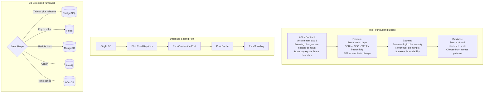

---

## 9. API Anti-Patterns -- The Full Breadth Table

These are the most common mistakes in production API and database design. Staff engineers recognize and block these in design reviews.

| Anti-pattern | Why it hurts | Better approach |
|---|---|---|
| **No idempotency for writes** | Retries (network drop, load balancer retry) cause duplicate charges, duplicate orders | Idempotency keys for every mutating operation. Store key -> result. Return stored result on retry. |
| **Breaking changes without versioning** | Deploy breaks all existing clients at once, no migration time | Versioned API (`/v1/`). Additive-only changes in minor releases. Deprecation window of 3-6 months. |
| **One giant response** | `GET /users` returns 10,000 users -- slow, memory-heavy, client crashes | Cursor pagination with `limit`. Field selection (` fields=id,name`). Never return unbounded lists. |
| **DB as implementation detail** | "We'll use whatever DB is already there" -- no access-path analysis | Write down your top 5 queries first. Choose store and schema to match. Plan indexing before writing any code. |
| **Ignore read/write ratio** | Write-optimized store for read-heavy workload or vice versa | Measure or estimate read/write ratio. Choose store, replication, and caching to match. |
| **No error contract** | Ad-hoc error bodies, different codes per endpoint, clients can't handle consistently | Standard error shape: `{code, message, request_id, docs_url}`. HTTP status maps to the right code. Document every error code. |

### Edge Cases That Trip Up Engineers

**Offset pagination breaks under mutation.** If you use ` page=2&per_page=20` and a new record is inserted between page 1 and page 2, the second page skips one record (it shifts past the boundary). Cursor pagination anchors to a specific record ID -- stable under inserts and deletes. Always use cursor pagination for feeds and time-ordered lists.

**Adding a required field breaks existing clients.** An existing client sending a request without the new required field now gets a 400 error. Prefer optional new fields with sensible defaults. Only mark a field required in a new major version after consumers have had time to adopt it.

**Removing a field is always breaking.** Even if you think "no one reads this field," a client somewhere relies on it. Use expand-contract. Add the replacement first. Monitor for zero reads on the old field. Only then remove.

---

## 10. API Versioning Appendix -- Staff-Level Depth

### L5 vs L6 Versioning Thinking

| Scenario | L5 Approach | L6 Approach |
|---|---|---|
| **New field needed** | "Release v2" | "Add as optional field to v1. Old consumers ignore it. No version bump needed -- additive changes are never breaking." |
| **Breaking change needed** | "Push v2 and deprecate v1" | "Expand-contract first: add new field in v1, migrate consumers over 3 months. If full restructure needed, create v2 with 6-month overlap, sunset headers, per-client usage monitoring, direct outreach to top consumers." |
| **Internal API** | "Same versioning as public" | "Internal APIs evolve in place -- add optional, never remove. Versioning overhead is not worth it for 3 consumer teams we can reach on Slack. For public APIs with 10K consumers, formal versioning is essential." |
| **Version proliferation** | "We are on v7" | "If you are on v7, you shipped 6 breaking changes. Each required migration work from every consumer. Better: evolve in place for 90% of changes. Version only when unavoidable. Two active versions is the maximum." |

### Versioning Strategy Comparison

| Strategy | Pros | Cons | Best For |
|---|---|---|---|
| **URL path** (`/v1/`) | Explicit and visible. CDN-cacheable. Easy to document separately. Every developer understands it. | URL proliferation. Multiple code paths in server. | Public APIs -- most common and most understood. |
| **Accept header** (`application/vnd.api.v2+json`) | Clean URLs. Version is metadata not URL. HTTP-native. | Hidden from logs. Hard to test (cannot paste URL). Client must set header explicitly. | APIs where URL aesthetics matter. Some REST purists. |
| **Query parameter** (` version=2`) | Easy to test. No header setup. | Not semantically correct. Clutters URLs. | Quick internal versioning. Avoid for external APIs. |
| **Evolve in place** (no version number) | No version management. Consumers always on latest. | Cannot make breaking changes. Schema grows over time. | Internal APIs with 1-3 consumer teams you can coordinate directly. |

**Staff recommendation:** URL path (`/v1/`) for public APIs. Evolve-in-place for internal APIs -- add optional fields, never remove. Never run more than 2 active versions simultaneously -- if you are on v7, the versioning process is broken.

### Expand-Contract Timeline

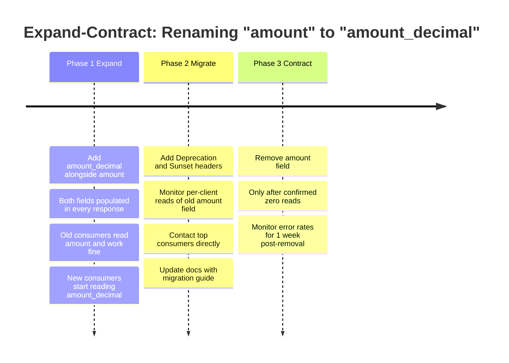

**Phase 1 -- Expand (Day 1).** Both fields live in the response. Zero breakage. Old clients work. New clients can start using the new field immediately.

**Phase 2 -- Migrate (Weeks 2-12).** Add `Deprecation: true` and `Sunset: <date>` response headers. Log which clients (by API key or service name) still read the old field. Reach out directly to the top 5 high-traffic consumers. Post in developer changelog.

**Phase 3 -- Contract (After zero usage confirmed).** Remove the old field. Not "almost zero" -- zero. Monitor error rates for one week after removal to catch any stragglers. Done.

### Deprecation and Sunset Strategy

| Phase | Action | Duration | HTTP Signal |
|---|---|---|---|
| **Announce** | Changelog entry, API docs updated | Day 0 | -- |
| **Sunset headers** | Add `Deprecation: true` and `Sunset: <date>` to responses | Immediate | `Deprecation: true`, `Sunset: Sat, 01 Jun 2025 00:00:00 GMT` |
| **Monitor** | Track per-client usage of deprecated endpoint/field | Ongoing | Log client ID + API version |
| **Warn** | Directly contact high-traffic consumers who have not migrated | Month 3 | -- |
| **Soft sunset** | Return `299 Warning` header or start rate-limiting v1 | Month 5 | `Warning: 299 - "API v1 deprecated, sunset June 2025"` |
| **Hard sunset** | Return `410 Gone` for all v1 requests | After sunset date | HTTP 410 |

**Timeline guidance:** Public API with many partners -- 6 to 12 months from announcement to hard sunset. Internal API between teams -- 1 to 3 months, use Slack for direct coordination. Mobile API -- 12 to 18 months minimum, because you cannot force users to update their app versions.

### Breaking vs Non-Breaking Changes Reference

| Change | Breaking  | Migration Required |
|---|---|---|
| Add optional response field | No | None |
| Add new endpoint | No | None |
| Add optional request parameter with default | No | None |
| Remove a response field | **Yes** | Expand-contract with deprecation window |
| Rename a field | **Yes** | Expand-contract: add new name, deprecate old |
| Change field type (e.g. integer to string) | **Yes** | New field with new type -- never change in place |
| Change field meaning (e.g. amount changes currency) | **Yes** | Treat as type change -- new field |
| Remove an endpoint | **Yes** | New version, 410 Gone after sunset |
| Add required request field | **Yes** | New version, or add with default then make required later |
| Change HTTP status codes | **Yes** | New version |
| Change default sort order | **Yes** | New version or query parameter to opt in |
| Tighten validation (shorter max length) | **Yes** | New version |

### Production Incident: Silent Breaking Change

**Context.** A payments platform served 150 partner integrations. The backend team changed the `amount` field in the charge response from integer cents (`1000` = $10.00) to a decimal string (`"10.00"`). The release notes called it a "clarification."

**Impact.** 23 partners broke. Several partners parsed `"10.00"` as an integer and got `10`, so they processed charges at $0.10 instead of $10.00. $47,000 in under-charges occurred over 6 hours before the on-call engineer caught the pattern in payment anomaly dashboards.

**Root cause.** No versioning. No sunset headers. No expand-contract. The change was treated as a bug fix and pushed directly to production. No consumer was notified. No contract tests in CI caught the type change before deploy.

**Fix.** Reverted `amount` to integer. Added `amount_decimal: "10.00"` as a new optional field alongside the original `amount: 1000`. Gave all 150 partners a 6-month migration window. Added API contract tests to CI that fail if any existing field changes type.

**Lesson.** Any type change -- integer to string, string to number, object to array -- is a breaking change. No exceptions. Use expand-contract. Never change a field's type in place.

### Quick Reference: API Versioning Golden Rules

1. **Add fields freely** (optional with default) -- not a version bump.
2. **Never remove fields** -- deprecate first, remove only after confirmed zero usage.
3. **Never change field types** -- add a new field with the new type instead.
4. **Version (`v1` -> `v2`) only for structural changes** you cannot evolve in place.
5. **Two active versions maximum** -- if you have more, the versioning process has failed.
6. **Public API:** URL path versioning. **Internal API:** Evolve in place.
7. **Deprecation timeline:** 6 months for public, 1-3 months for internal, 12-18 months for mobile.

### Staff-Level Interview Answers

**"How do you version APIs "**

"URL path versioning for public APIs -- `/v1/`, `/v2/`. Explicit, cacheable, understood by everyone. For internal APIs, I prefer evolve-in-place: add optional fields, never remove. When a breaking change is unavoidable, I version (`v1` -> `v2`), support both during a 6-month migration window with `Deprecation` and `Sunset` response headers, monitor per-client usage of v1, then sunset. The key insight: versioning is a contract with consumers, not a technical convenience. Breaking that contract breaks trust. Every breaking change you ship costs your consumers engineering time -- that cost is yours to minimize."

**"How do you handle a breaking change "**

"Expand-contract. Example: we need to rename a field. Step one: add the new field name alongside the old. Both are populated in every response. Old clients read the old name and keep working. New clients start using the new name. Zero breakage, deploy immediately. Step two: add `Deprecation: true` and `Sunset: <date>` headers. Log which clients still read the old field. Contact the top 5 consumers directly. Step three: when monitoring shows zero reads of the old field, remove it. Total timeline: 4-12 weeks. The important part -- no consumer experiences a break. We absorb the cost of dual-field support so they do not absorb the cost of an outage."

---

## 11. Interview Application

### How API Questions Appear

**Explicit form:** "Design the API for Stripe payments." "Design the API for a ride-sharing system." "How would you version a REST API "

**Embedded form:** In any system design -- "Design a notification system," "Design Twitter feed" -- the interviewer expects you to discuss API design: endpoints, versioning, error handling, backward compatibility, pagination. Most L6 candidates miss the embedded form.

### How Database Questions Appear

**Explicit form:** "How would you store and query X " "SQL vs NoSQL -- when would you use each "

**Embedded form:** In any system design, the interviewer listens for: Do you justify your choice  Do you consider scale, consistency, and access patterns  Most candidates say "use PostgreSQL" without justification. That is not L6.

### Common Interview Mistakes

| Mistake | Why It Signals Junior | Better Approach |
|---|---|---|
| Choosing a database without justifying | "We'll use MongoDB" with no rationale | "We need flexible schema for user-generated content. Document store fits. Eventual consistency is acceptable for this use case." |
| Designing APIs without backward compatibility | "We'll change the field name" | "We'll add a new optional field, deprecate the old one in 6 months, migrate consumers, then remove." |
| Ignoring read/write ratio | Picking write-optimized DB for read-heavy system | "We're 100:1 read-heavy. PostgreSQL with read replicas and Redis cache." |
| Over-engineering with GraphQL | Proposing GraphQL when REST suffices | "REST fits our resource model. We'd consider GraphQL if we had many clients with divergent data needs -- we don't yet." |
| No pagination or error format | Designing list endpoints without considering size limits | "All list endpoints use cursor pagination. Errors follow standard format: `{code, message, request_id}`." |
| Treating the DB as an afterthought | Designing services first, "we'll need some database" | Data model and access patterns come first. "Our primary query is X -- that suggests this schema and this index." |

### Opening Moves in Any API or Database Question

1. **Clarify consumers.** "Who are the API consumers -- internal services, mobile, partners " This drives auth model, rate limits, and versioning strictness.
2. **Clarify access patterns.** "What are the primary queries -- key lookup, range scan, joins, full-text search " This drives database choice and schema.
3. **Clarify consistency.** "Do we need strong consistency for any operations  Which can tolerate eventual consistency " This drives replication and caching strategy.
4. **State trade-offs explicitly.** "We are choosing X over Y because of Z. We accept that we lose [capability]." This is what L6 sounds like.

### Sample Follow-Up Q&A -- With Strong Answers

**"Why REST over GraphQL "**
"REST fits our resource model and we have a single client type. HTTP caching works well for us. GraphQL would help if we had multiple clients with very different data needs -- web needs 50 fields, mobile needs 8. We do not have that divergence yet. We'd revisit if mobile becomes a significant surface and over-fetching becomes a measurable latency problem."

**"How would you handle a breaking API change "**
"Expand-contract. Add a new optional field alongside the old one. Both are populated. Deprecate the old with a 6-month notice and `Deprecation`/`Sunset` headers. Monitor per-client usage. Proactively contact the top consumers who have not migrated. Remove only after confirmed zero reads. No consumer experiences a break."

**"Why PostgreSQL over DynamoDB for this use case "**
"We need joins across users and orders for our reporting queries. We need ACID for payment operations. Our scale is single-digit K QPS -- well within a single PostgreSQL primary with one read replica. DynamoDB would force us to denormalize and give up ad-hoc queries. If we hit write limits at 50K+ QPS, we'd add read replicas and sharding before switching stores entirely."

**"How do you handle API rate limiting "**
"Rate limiting lives at the API gateway, keyed by client API key or user ID. We use a token bucket -- it allows short bursts but caps sustained rate. We return 429 with a `Retry-After` header. Rate limit counters live in Redis (INCR with TTL) -- they need to be shared across all gateway instances. Internal services get different limits or no limit. High-value external partners can get higher tiers or dedicated capacity."

### Synthesis: How It All Connects

API design, frontend/backend split, and database selection are not independent topics. They form a chain of decisions.

Your API contract defines what data the frontend can request. Your data model defines what the backend can efficiently serve. Your database choice defines what your data model can look like. And your access patterns -- driven by the product -- constrain all three.

A Staff-level answer weaves these together: "We use cursor pagination in the feed API because our feed data changes frequently -- offset would produce gaps. That pagination choice means our query is `WHERE id > cursor ORDER BY id LIMIT n` -- so we need an index on `id`. We chose PostgreSQL because we need that index plus ACID for the write path. Our BFF shapes the response differently for mobile (lean) vs. web (rich) so we do not over-fetch on mobile. The API is versioned from day one so the mobile team can ship independently."

That chain of reasoning -- product requirement to API shape to data model to database to scaling -- is what L6 looks like in practice.

---

## 12. Chapter 8 -- The Complete Mental Model

### The Full System in One Diagram

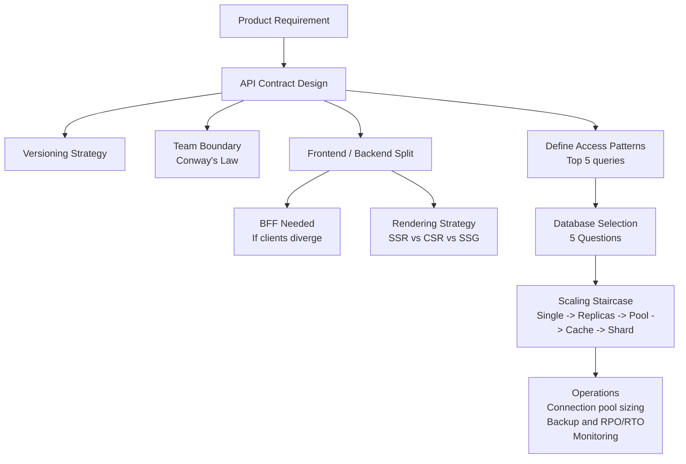

### Key Decisions and What Happens When You Get Them Wrong

| Decision | What Happens if Wrong | How to Get It Right |
|---|---|---|
| **API contract (field types, structure)** | Breaking changes cascade to all consumers. Incident similar to the $47K payment bug. Weeks of migration work. | Design with versioning from day 1. Never change a field type in place. Use expand-contract for every breaking change. |
| **Database choice** | Wrong data model means slow queries, missing features (no joins in DynamoDB), or expensive migrations. Costs weeks or months to fix at scale. | Write your top 5 queries first. Choose the DB that serves them efficiently. Justify the trade-offs explicitly. |
| **Read/write ratio assumption** | Read replicas do nothing for a write-heavy system. Cache does nothing when every request is unique. You solve the wrong problem. | Measure or estimate the ratio before designing. Let it drive caching strategy, replication, and DB choice. |
| **Shard key** | Cross-shard joins at 100M users require scatter-gather across all shards -- expensive and complex. Some queries become impossible. | Choose shard key from day 1 (usually user_id). Lead all user-scoped tables with it. Avoid cross-shard queries in the hot path. |
| **BFF decision** | No BFF: mobile over-fetches, slow on 3G. Wrong BFF: business logic leaks into BFF, becomes a mini-backend, hard to maintain. | Add BFF only when clients have measurably different data needs. Keep BFF thin -- aggregate and shape, no business logic. |

### One-Liners for Each Section

- **API:** "An API is a promise. Versioning is how you manage that promise over time."
- **Breaking changes:** "The best change is additive. The second best is expand-contract. The worst is silent."
- **Conway's Law:** "When you design an API boundary, you design a team boundary."
- **Database:** "The database is the hardest thing to scale because it holds state."
- **Read/write ratio:** "Measure it. It drives every caching, replication, and sharding decision."
- **Scaling staircase:** "Each step solves one problem and introduces a new one. Don't skip steps."
- **Cursor pagination:** "Offset breaks when data changes. Cursor doesn't. Use cursor for feeds."
- **Connection pool:** "One connection per request is catastrophic at scale. Pool and reuse."
- **Backups vs replicas:** "Replicas copy your errors instantly. Backups let you go back in time. Both are required."

---

*Next chapter: OS Fundamentals -- how processes, threads, and memory management underpin every service you build.*

---

## How Your Thinking Evolves: Intern to Staff Engineer

*Same problem at four levels: design the API for a social media app's "post a photo" feature.*

### Intern Level: "Make an endpoint that does everything"

```
POST /upload
  - receives photo bytes
  - resizes to 3 sizes (thumbnail, medium, full)
  - saves to disk
  - saves metadata to DB
  - sends email notification
  - returns 200 OK
```

Think of this like a to-do list where one task is "plan the wedding." Technically correct -- it's one item. But it hides enormous complexity and sequential dependencies inside a single unit.

The intern's endpoint: synchronous, does 5 things, takes 8 seconds. If email fails at step 5, does the photo save roll back? If resizing takes 7 seconds, the HTTP client times out. If 100 users upload at once, 100 threads are blocked for 8 seconds each.

### Mid-Level (L4): "Separate concerns into distinct endpoints"

L4 splits: upload returns immediately after saving the raw photo. A background worker resizes and sends email.

```
POST /photos       <- saves raw, returns photo_id immediately
GET /photos/:id    <- returns photo with status (processing, ready)
```

Better. But L4 designs the response schema without versioning. Six months later, the mobile app needs a new field: thumbnail_url. L4 adds it to the response. Older mobile apps that don't know about thumbnail_url crash because they can't parse the new field. Breaking change with no version strategy.

### Senior (L5): "Design for clients, not for implementation"

L5 asks before writing any code: "Who calls this API? Native iOS, Android, and web. They have different needs: mobile needs thumbnail_url immediately; web needs the full resolution URL. Mobile is on slow networks; minimize response size."

L5 designs:
- POST /v1/photos with versioned path
- Response includes only what mobile needs: id, status, thumbnail_url (computed async, with a WebSocket push when ready)
- GraphQL for the web client (fetches exactly the fields it needs, no over-fetching)
- Pagination on GET /v1/users/:id/photos using cursor-based pagination (not page numbers)

L5 also writes an API contract (OpenAPI spec) before implementing, shares it with the iOS and Android teams, and gets sign-off before building.

```
L5 API DESIGN:
  Mobile client     -> REST v1 (minimal payload, versioned)
  Web client        -> GraphQL (flexible field selection)
  Internal services -> gRPC (typed, efficient binary protocol)
  External partners -> REST v2 (stable, documented, SLA)
```

### Staff (L6): "The API is a product with a lifecycle"

L6 does everything L5 does, then asks:

"How do we deprecate v1 when we're ready to release v2? We have 5M mobile clients on v1. We can't force all of them to upgrade simultaneously. We need: a deprecation timeline (v1 supported for 18 months), a migration guide, sunset headers (Deprecation: Sat, 1 Jan 2026 00:00:00 GMT), and traffic monitoring to know when v1 usage drops to <1%."

"Our public API has 3 external partners. Each integration took them 6 months to build. If we make a breaking change, they need 6 months to migrate. Our API stability is now a business contract, not a technical detail. Breaking changes require a partner advisory council meeting."

"At 10M photo uploads/day, the metadata schema evolution matters. If we add a column to the photos table, that ALTER TABLE blocks writes for 40 seconds on a 500GB table. We need online schema migration (gh-ost, pt-online-schema-change) as part of our API change process."

```
L6 API LIFECYCLE:
  Design   -> OpenAPI spec, partner review, contract sign-off
  Launch   -> v1, monitor adoption, track usage by endpoint
  Evolve   -> add fields (non-breaking), new versions (breaking)
  Deprecate -> sunset headers, 18-month warning, migration guide
  Retire   -> v1 turned off only when usage < 0.1%

  The API is a product. It has a roadmap and a PM.
```

### The Pattern

- Intern: one endpoint does everything (synchronous, no versioning, brittle)
- L4: separates upload from processing, adds background workers (no version strategy)
- L5: designs for each client type, versioned, contract-first, right protocol per consumer
- L6: API lifecycle management, deprecation planning, schema migration, external partner SLAs

---

## L5 vs L6 Calibration: APIs, Frontend, Backend, DB

| Dimension | L5 (Senior) | L6 (Staff) |
|-----------|-------------|------------|
| API design process | Writes OpenAPI spec before implementation | Runs partner review cycle, formal contract sign-off |
| Versioning | Uses versioned paths (/v1), avoids breaking changes | Defines versioning policy: minor vs major, sunset timeline |
| Protocol selection | Chooses REST vs gRPC based on use case | Designs protocol matrix: REST external, gRPC internal, GraphQL web |
| Pagination | Cursor-based pagination (not page numbers) | Designs keyset pagination with stable sort order under concurrent writes |
| Deprecation | Adds deprecation notice to docs | Implements sunset headers, monitors sunset traffic, runs partner calls |
| Schema migration | Knows about online schema change tools | Designs zero-downtime migration plan, tests on staging at production data size |
| Background jobs | Separates async work from sync API path | Designs job queue with idempotency, DLQ, and retry budget |
| Error design | Structured error responses (code, message) | Error taxonomy: client errors vs server errors, retriable vs not |
| API observability | Request/response logging, latency histogram | Per-endpoint SLO with error budget, downstream dependency tracing |
| GraphQL | Can implement a GraphQL schema | Designs DataLoader to prevent N+1, rate-limits complexity score |
| Authentication | Implements JWT auth | Designs token lifecycle: issue, rotate, revoke, audit log |
| Team scope | Designs API for one feature | Designs API standards used across the engineering org |

---

## Exercises

### Exercise 1: REST vs GraphQL vs gRPC Decision

For each consumer below, choose REST, GraphQL, or gRPC and justify in 2 sentences:
a) iOS app with strict bandwidth limits
b) Web dashboard that shows 20 different data views, each needing different fields
c) Internal microservice calling another with high RPC volume (10K calls/second)
d) External partner integration that needs a stable 5-year API contract
e) Real-time leaderboard fed by a game server
f) Admin tool used by 5 internal engineers

### Exercise 2: API Versioning Strategy

You have a REST API with 3M mobile clients on v1. You need to add a required location field to the POST /posts endpoint (breaking change). Design:
- How do you introduce v2 without breaking v1?
- How long do you support v1?
- How do you tell clients to migrate (response headers? push notifications?)
- How do you measure when it's safe to turn off v1?

### Exercise 3: Schema Migration Plan

Your posts table has 800M rows. You need to add a media_type column (VARCHAR, default 'image'). Design a zero-downtime migration:
- Step 1: Add column with default (does this lock the table?)
- Step 2: Backfill existing rows in batches (what batch size? what delay between batches?)
- Step 3: Make the column NOT NULL (when is it safe?)
- Step 4: Deploy application code that uses the new column (before or after migration?)

### Exercise 4: Design the Photo Upload API

Design the complete API for a photo-sharing app. Requirements: iOS + Android + web clients, up to 10MB photos, thumbnail generation async, public and private photos.

Specify: all endpoints, request/response schemas, async job design, WebSocket notification for when thumbnail is ready, error codes.

### Exercise 5: API Rate Limiting

Design rate limiting for a public API with 3 tiers: free (100 req/min), pro ($99/month, 10K req/min), enterprise (custom). Specify:
- Where does rate limiting live (API gateway, per-service, Redis?)
- What is the rate limit algorithm (token bucket, sliding window log, fixed window?)
- What response headers communicate the limit status?
- How do you handle burst traffic for pro tier?

### Exercise 6: Postmortem -- API Breaking Change

A v1 API change accidentally broke 12 enterprise clients. Design the incident response:
- How do you detect it (monitoring? customer complaints?)
- Immediate mitigation (rollback? feature flag?)
- Communication plan for enterprise clients
- Post-incident: how do you add a breaking change review process?

---

## Named Production Incidents

### Incident 1: Stripe 2019 -- Silent API Version Behavior Change

**What happened:** Stripe rolled out an update to their internal payment processing logic in 2019 that changed how certain edge-case charge fields were interpreted. Partners who were using older API versions received no error -- the API accepted their requests just as before. But the behavior of how funds were routed changed silently. This created billing discrepancies worth approximately $2M before Stripe's anomaly detection systems flagged the pattern and engineers traced the cause.

**Root cause:** The API versioning system was not applied consistently to a backend behavior change. The engineering team treated it as an internal refactor, not as a contract-affecting change. Because clients got 200 OK responses with no errors, there was no signal that anything was wrong. The mismatch lived silently in the delta between what clients expected and what the system now did.

**ASCII diagram:**
```
WHAT CLIENTS EXPECTED (v1 contract):

  POST /v1/charges  -->  { amount: 1000, currency: "usd" }
                    <--  200 OK -- charge routed to primary processor

WHAT ACTUALLY HAPPENED AFTER INTERNAL CHANGE:

  POST /v1/charges  -->  { amount: 1000, currency: "usd" }
                    <--  200 OK (no error!)
                         but charge routed differently -- silent behavior drift

  v1 client --(no error seen)--+
                               |
                 [Backend behavior changed]
                               |
                 [Billing ledger now mismatched]
                               |
                 [Detected 6 hours later via anomaly detection]
```

**Fix applied:** Stripe reverted the routing logic, credited affected partners, and introduced stricter internal rules: any backend change that could alter observable behavior for any active API version requires going through the same breaking-change review process as a schema change. They also added automated contract tests that run against every active API version on every deploy.

**Staff lesson:** Versioning the URL path is not enough. The full API contract includes backend behavior -- how funds are routed, what rounding rules apply, what order operations execute in. At L6, you define the contract in terms of observable outcomes, not just schema shape. A change is breaking if any client's observed results change, even if no field names or HTTP status codes changed.

---

### Incident 2: Twitter 2023 -- Too-Short API Deprecation Window

**What happened:** In early 2023, Twitter announced it was deprecating its free API v1.1 access and requiring all developers to migrate to the paid API v2 or the new Basic tier within 30 days. Thousands of third-party apps had been built on v1.1 over the previous decade. Accessibility tools that let blind users read Twitter, academic research bots tracking public discourse, open-source client apps, bot-detection services, and community moderation tools all broke simultaneously when the deadline hit and v1.1 was shut off.

**Root cause:** The business decision to monetize API access was made under financial pressure. The 30-day window was not derived from any engineering analysis of how long it takes real developers to assess, implement, test, and ship a migration -- it was driven by a revenue timeline. For an API that had been stable for 10+ years, the gap between "what developers needed" (6-12 months minimum) and "what they were given" (30 days) was enormous.

**ASCII diagram:**
```
API DEPRECATION TIMELINE (what happened):

  Day 0:  Twitter announces v1.1 shutdown in 30 days
           |
           v
  Day 1-25: Developers scramble to understand v2 pricing and scope
             Many tools: "v2 does not support what we need OR costs 100x more"
             |
             v
  Day 30: v1.1 turned off
           |
           +---> Accessibility tools: BROKEN
           +---> Research bots: BROKEN
           +---> Open-source clients: BROKEN
           +---> Bot detection services: BROKEN
           +---> Community moderation tools: BROKEN

CORRECT DEPRECATION TIMELINE (what should have happened):

  Day 0:   Announce deprecation + migration guide + pricing
  Day 30:  Add Deprecation and Sunset headers to v1.1 responses
  Day 60:  Monitor per-developer migration progress
  Day 90:  Reach out to high-traffic v1.1 users directly
  Day 180: Rate-limit v1.1 traffic as soft sunset signal
  Day 365: Hard sunset -- turn off v1.1
```

**Fix applied:** Twitter offered no real fix -- the deprecation proceeded. The episode became a textbook case study in how not to manage API deprecation for a large developer ecosystem. Some tools found workarounds; many simply shut down permanently.

**Staff lesson:** Deprecation timelines must be calibrated to developer reality, not internal business timelines. 30 days is appropriate for an internal API between two teams in the same company. For a public API with an established external developer ecosystem, 6-12 months is the minimum. Mobile clients need even longer -- you cannot force users to update apps. At L6, you push back on unrealistic deprecation timelines because the cost of a botched deprecation (broken partner integrations, developer trust lost, legal exposure) almost always exceeds the benefit of moving faster.

---

### Incident 3: Twilio 2022 -- ALTER TABLE Blocks Writes for 4 Minutes

**What happened:** Twilio engineers needed to add a new column to a high-traffic database table that stored SMS delivery records. The table had approximately 500 million rows. The migration added a NOT NULL column with no default value, which required the database to lock the entire table, write a null placeholder to every existing row, then enforce the constraint. This operation blocked all writes to the table for approximately 4 minutes. During those 4 minutes, SMS messages queued by Twilio's global customers could not be written to the database. SMS delivery failed globally for the duration of the migration window.

**Root cause:** The migration was written without accounting for how PostgreSQL handles NOT NULL constraints on large tables. Adding a NOT NULL column without a default in older PostgreSQL (pre-11) requires a full table rewrite. Even in newer versions, a poorly constructed migration can block writes. The team did not test the migration against a production-sized dataset in staging -- their staging database had millions of rows, not 500 million.

**ASCII diagram:**
```
BEFORE MIGRATION (normal operation):

  Twilio API receives SMS send request
       |
       v
  [App Server] --> INSERT INTO sms_records ... --> [DB: 500M rows]
       |
  200 OK returned to customer

DURING ALTER TABLE (4 minutes):

  Twilio API receives SMS send request
       |
       v
  [App Server] --> INSERT INTO sms_records ... --> [DB: TABLE LOCKED]
                                                        |
                                           ALTER TABLE in progress
                                           Writing null to 500M rows
                                                        |
                                           All writes BLOCKED
       |
  Request times out or queues --> SMS delivery FAILS globally

CORRECT APPROACH (zero-downtime column add):

  Step 1: ALTER TABLE ADD COLUMN new_col TEXT;          -- instant, nullable
  Step 2: Backfill in batches: UPDATE ... WHERE id BETWEEN x AND y
  Step 3: Application code writes to both old + new column
  Step 4: ALTER TABLE ALTER COLUMN new_col SET NOT NULL; -- after all rows filled
  Step 5: Drop old column after cutover confirmed
```

**Fix applied:** Twilio reverted to a nullable column with a default value to immediately restore write availability. They then implemented the migration correctly: adding the column as nullable first, backfilling existing rows in batches of 10,000 with sleeps between batches to avoid I/O spikes, verifying all rows were populated, then adding the NOT NULL constraint. They also mandated that all schema migrations be tested against a full production-sized data copy before deployment.

**Staff lesson:** Schema migrations on large tables are one of the most dangerous operations in a production system. The rule is: never use ALTER TABLE with NOT NULL on a large table without a default. The safe sequence is always add-nullable first, backfill in batches, verify, constrain. At L6, you review migration scripts with the same rigor as application code, and you require that every migration be tested against a dataset that matches production in size, not just in schema shape.

---

### Incident 4: GitHub 2018 -- API Returns Stale Data During DB Failover

**What happened:** In October 2018, GitHub suffered a major incident triggered by a network partition between their US East Coast data centers. To protect data, GitHub's orchestration system promoted a database replica to become the new primary. During the failover window -- which lasted about 43 seconds -- some API requests were routed to the old primary and some to the newly promoted replica. The replica was not fully caught up. Depending on which server handled a given API call, the response might include fresh data or data that was seconds to minutes old. CI/CD systems that called the GitHub API to check commit SHAs received wrong or missing data and failed builds on code that was completely valid.

**Root cause:** GitHub's load balancer routed API traffic without knowing which database node was the current authoritative primary at any given moment during the failover. The application had no mechanism to detect that a replica had been promoted and to flush or invalidate caches. This is a known hazard of database failover: there is always a window where "which node is the source of truth" is ambiguous from the application's point of view.

**ASCII diagram:**
```
NORMAL OPERATION:

  API Request --> [App Server] --> [DB Primary] --> consistent data

DURING FAILOVER (43 second window):

  Network partition detected:
    [Old Primary] -- connection lost -- [Replica A]

  Orchestration promotes Replica A to new primary.

  But load balancer has not updated yet:

  Request 1 --> [App Server A] --> [Old Primary]  --> commit SHA: abc123 (fresh)
  Request 2 --> [App Server B] --> [Replica A]    --> commit SHA: abc122 (stale, 30s lag)
  Request 3 --> [App Server C] --> [Old Primary]  --> commit SHA: abc123 (fresh)

  CI/CD system calls API twice:
    Call 1: sees abc123 (build starts)
    Call 2: sees abc122 (build sees DIFFERENT SHA --> treats as invalid --> FAILS)

  +-------------------+
  | Impact            |
  | Stale reads:      |
  | - Wrong commit    |
  |   SHAs to CI/CD   |
  | - Failed builds   |
  |   on valid code   |
  | - Developer trust |
  |   broken          |
  +-------------------+
```

**Fix applied:** GitHub implemented "read your own writes" routing: any API request that recently wrote data is pinned to the primary for subsequent reads for a short window. They also improved their failover orchestration to update load balancer routing rules as part of the failover sequence -- not after it. Finally, they added monotonic read guarantees for certain API endpoints where ordering of results is critical.

**Staff lesson:** Database failover always has a consistency window. Applications that need read-your-own-writes consistency must track which requests have written data and route their reads to the primary for a short period after each write. At L6, this is a design requirement you specify upfront for any API that CI/CD systems or other automation depends on -- because automation has no tolerance for "sometimes you get stale data." Build the consistency guarantee into the API layer, not just the database layer.

---

### Incident 5: Salesforce 2022 -- Wrong Index Dropped on Shared Table

**What happened:** In May 2022, a Salesforce database administrator intended to drop a database index that was no longer needed for a specific customer tenant. Due to a scripting error, the DROP INDEX command was executed against a shared infrastructure table used by thousands of tenants rather than the tenant-specific table it was intended for. The dropped index was critical for query performance on one of the most-accessed tables in the Salesforce CRM platform. Without it, API response times for all tenants sharing that table jumped from a typical 200ms to 45 seconds or more. Approximately 20,000 enterprise customers experienced extreme API slowness or timeouts for several hours. The incident triggered SLA breach penalties across a large number of enterprise contracts.

**Root cause:** Multi-tenant shared infrastructure means a single operational mistake can affect thousands of customers at once. The blast radius of the wrong DROP INDEX was enormous because the table was shared. There was no dry-run or preview mode for the script. The script was run with production database credentials in a live environment without a peer review step and without a test run against a staging copy of the schema.

**ASCII diagram:**
```
MULTI-TENANT SHARED TABLE (simplified):

  Tenant A's data --> | accounts_shared_table | <-- Tenant B's data
  Tenant C's data --> |                       | <-- Tenant D's data
                         ...20,000 tenants...

  Index: idx_accounts_owner_id  (critical for all SELECT by owner)

  DBA INTENT:    DROP INDEX idx_tenant_007_old ON tenant_007_table;
  ACTUAL SCRIPT: DROP INDEX idx_accounts_owner_id ON accounts_shared_table;
                                     |
                           Index dropped on SHARED table
                                     |
                    +----------------+----------------+
                    |                                 |
          ALL TENANTS affected              Query without index:
          API response: 200ms --> 45s       full table scan
                                            on millions of rows

TIMELINE:
  T+0:   Index dropped (mistake executed)
  T+3:   Alert fires: p99 API latency > 30s
  T+8:   Engineers identify missing index
  T+12:  Index rebuild begins (large table -- takes time)
  T+180: Index rebuild complete, latency restored
```

**Fix applied:** Salesforce rebuilt the index, which on a table of that size took approximately 3 hours during which performance remained degraded. After the incident, they introduced mandatory peer review for all DDL (data definition language) commands in production, a dry-run mode that previews which objects a script will affect before executing, and automated checks that flag any DDL command targeting a shared table (as opposed to a tenant-scoped table) for escalated approval.

**Staff lesson:** In a multi-tenant system, the blast radius of any infrastructure operation scales with the number of tenants on the affected resource. Operational runbooks for shared infrastructure must treat DDL commands as high-risk changes requiring the same review process as a production code deploy. At L6, you design operational safeguards into the platform itself: the tooling should make it hard to accidentally target a shared resource when you meant a tenant-scoped one. "Humans make mistakes" is not a postmortem finding -- it is a design constraint you plan for.

---

## 13. Common Interview Mistakes -- and Exactly How to Fix Them

These are the six mistakes that reliably separate L4/L5 answers from L6 answers. Each one is described in enough detail that you can recognize it in your own draft answers and correct it before the interviewer does.

### Mistake 1: Choosing a Database Without Justifying the Choice

**What it looks like.** The candidate says "I'd use MongoDB for the user service" or "we'll use PostgreSQL" and moves on. No analysis of the access patterns, no mention of consistency requirements, no trade-off acknowledgment.

**Why it signals junior thinking.** Database selection is one of the highest-leverage decisions in a system design. The wrong choice leads to expensive migrations, query performance problems, or consistency bugs that are invisible at low scale and catastrophic at high scale. A Staff engineer does not have a favorite database -- they have a framework for selecting the right one for the problem at hand.

**The fix.** Before naming a database, name your top three access patterns. "Our primary queries are: fetch a user by ID (key lookup), list all orders for a user (indexed scan by user_id), and join orders with payments for a receipt view (join). That access pattern -- key lookup, indexed scan, and join -- fits PostgreSQL's strengths exactly. MongoDB would force us to do the join in application code, and Cassandra's query model doesn't support joins at all. PostgreSQL with a composite index on (user_id, created_at) serves all three queries efficiently." That chain of reasoning is what L6 sounds like.

---

### Mistake 2: Proposing Pagination Without Specifying the Strategy

**What it looks like.** The candidate designs a `GET /posts` endpoint and says it returns a paginated list. When the interviewer asks how pagination works, the candidate says "offset and limit, like `?page=2&per_page=20`." That's the end of the answer.

**Why it signals junior thinking.** Offset pagination is wrong for any list that changes over time. For a social feed, a product catalog with real-time inventory updates, or any time-ordered event stream, new items inserted between page 1 and page 2 requests cause page 2 to skip or repeat items. At production scale, this is not a theoretical problem -- users on infinite-scroll apps visibly see duplicate posts or notice gaps in their feeds.

**The fix.** Specify the pagination strategy based on the data's mutability. For feeds and time-ordered lists: "We use cursor-based pagination. The response includes a `next_cursor` field -- a base64-encoded JSON object containing the ID and timestamp of the last item returned. The next request sends `?cursor=<value>`, and the query is `WHERE (created_at, id) < (cursor.created_at, cursor.id) ORDER BY created_at DESC LIMIT 20`. This is stable under inserts and deletes because it anchors to a specific row, not a position." For admin UIs with static data where users navigate directly to page 5, offset is acceptable -- but name the trade-off.

---

### Mistake 3: Designing an API Without Addressing Backward Compatibility

**What it looks like.** The candidate designs a clean v1 API. The interviewer asks "how would you add a new required field to the request?" or "what happens when you need to rename a field?" The candidate says "I'd update the field and push v2." No mention of existing consumers, migration windows, or deprecation process.

**Why it signals junior thinking.** In isolation, "push v2" is technically correct. But it ignores the operational reality: every existing consumer of v1 must be identified, notified, migrated, and verified before v1 can be retired. For a public API with 500 partner integrations, that migration is months of coordinated engineering work across many organizations that are not yours to command. At L6, you demonstrate awareness that the API serves external teams as much as it serves the product.

**The fix.** For any change to an existing field: "First, is this a breaking change? Renaming a field is always breaking -- clients reading the old name get undefined. Adding a new optional field is not breaking -- clients ignore unknown fields. For the rename case, I use expand-contract: I add `unit_price` alongside the existing `price` field. Both contain the same value. Old clients keep reading `price` and work fine. New clients start using `unit_price`. I add `Deprecation: true` and `Sunset: 2025-06-01` headers. I monitor per-client usage of `price` in our logs -- keyed by API key or service name. After 90 days, if usage of `price` is at zero, I remove it. If it is not zero, I reach out directly to whoever is still reading it." That specificity is what L6 looks like.

---

### Mistake 4: Treating the Frontend as the Security Boundary

**What it looks like.** The candidate describes client-side validation as if it enforces business rules. "The mobile app will check that the quantity is positive before sending the order." Or: "We validate the email format in JavaScript before the form submits." The backend API accepts whatever the frontend sends.

**Why it signals junior thinking.** Any user with basic developer tools can bypass JavaScript validation in under 60 seconds. The HTTP request can be constructed directly without a browser -- curl, Postman, or any HTTP client can send an order with a negative quantity or a malformed email regardless of what the frontend checks. Client-side validation is a UX feature. It gives users instant feedback without a network round-trip. But it is not a security mechanism.

**The fix.** Separate UX validation from security validation explicitly. "All security-sensitive validation happens on the backend -- that includes quantity bounds, price calculations, permission checks, and rate limits. The frontend validates for UX: instant feedback on email format, required field indicators, character count limits. But the backend always re-validates every field it receives, regardless of what the frontend claimed to check. The API contract specifies which fields are required, what types they must be, and what ranges are valid -- and the backend enforces this contract on every request, always." Add: "We return 400 Bad Request with a structured error body specifying the field and the violation so the frontend can surface useful error messages even for backend-caught issues."

---

### Mistake 5: Confusing Read Replicas With a Backup Strategy

**What it looks like.** The candidate adds read replicas to their database design and mentions them as part of the "reliability story." When asked about backups or disaster recovery, they point to the replicas. "If the primary fails, we fail over to a replica."

**Why it signals junior thinking.** Read replicas replicate data changes -- all of them, including accidental deletes and corrupt writes. If a developer runs `DELETE FROM users WHERE status = 'inactive'` and accidentally omits an AND clause that was supposed to scope it, that deletion replicates to all replicas within seconds. The read replicas faithfully contain a copy of the mistake. Failover to a replica after a data loss event gives you a different server running the same corrupted dataset. Replicas solve availability problems (primary crashes, failover is fast). They do not solve data loss problems.

**The fix.** Distinguish the two dimensions explicitly. "We address availability and data durability separately. For availability: two read replicas with automatic failover -- if the primary fails, one replica is promoted within 30-60 seconds. For data durability: continuous WAL archiving to S3, enabling point-in-time recovery. This means if someone accidentally deletes a table at 3:47 PM, we can restore to 3:46 PM -- we are not stuck with the deletion. Our RPO is under 5 minutes for data loss; our RTO is under 5 minutes for availability failures. These are different failure modes with different mitigations. Replicas do not help if the data itself is corrupted. WAL backups do not help if what you need is sub-minute failover. Both are required."

---

### Mistake 6: Picking REST vs. GraphQL Without Quantifying the Problem

**What it looks like.** The candidate either reflexively picks REST ("it's simpler") or reflexively picks GraphQL ("we have multiple clients"). When asked to justify, the reasoning is vague: "GraphQL gives us flexibility" or "REST is more standard." No measurement, no specific trade-off analysis.

**Why it signals junior thinking.** Both answers can be correct. The problem is the reasoning -- or lack of it. "Flexibility" and "standardness" are not architectural arguments; they are preferences. A Staff engineer's answer quantifies the problem: how many clients are there, how different are their data needs, what is the measured over-fetch ratio on mobile, what is the team's experience with DataLoader and query cost limiting.

**The fix.** Anchor the decision to a measurable problem. "Our mobile client fetches the product list view and needs 8 fields per product. Our web client fetches the product detail page and needs all 50 fields. With a single REST endpoint returning 50 fields, the mobile app over-fetches by 6x. At 50K mobile requests per minute on 3G connections, that's roughly 200MB of wasted bandwidth per minute. That's a measurable problem worth solving. GraphQL solves it by letting mobile query only the 8 fields it needs. The cost is DataLoader complexity to prevent N+1 queries and query complexity scoring to prevent expensive deep-nesting attacks. Given we have 4 client types and a dedicated frontend team, that trade-off is justified." If the mobile over-fetch ratio is not measurable or the client types are similar, that's a reason to stay with REST and say so.

---

## 14. Additional Exercises

### Exercise 7: Database Selection for a Notification System

A notification system needs to: store 1 billion notifications per month (mostly delivered, never deleted), support "fetch last 50 notifications for user X" as the only read query, and handle 200K writes per second at peak. The system runs across 3 geographic regions.

Design the database layer:
- What database type fits this access pattern and why?
- How do you partition the data (what is the partition key)?
- How do you handle multi-region replication -- active-active or active-passive?
- What is the consistency model you accept and why?
- What happens to notifications written during a region outage?

Justify each decision with the specific constraint it serves. Do not just name a database -- show that the access pattern, write volume, and multi-region requirement together point to a specific choice.

---

### Exercise 8: Designing a Rate Limiter from Scratch

Design a distributed rate limiter that enforces per-user limits of 1,000 requests per minute across a fleet of 50 API gateway instances.

Specify:
- What data structure and algorithm does each gateway instance use?
- Where is the shared state stored, and why?
- How do you avoid a race condition where two gateways simultaneously allow the 1,001st request for the same user?
- What is the behavior if the shared state store becomes unavailable -- do you fail open (allow all) or fail closed (deny all)?
- How do you return rate limit status in the response (which headers, what values)?
- What is the performance budget for the rate limiting check (it is on the hot path of every request)?

---

## 15. Homework Problems

These problems are designed to be worked through outside the interview setting. They require more thought and research than the exercises. Spend at least 30 minutes on each before looking up answers.

### Homework 1: The N+1 Problem in Practice

Set up a small application (any language) with a PostgreSQL database. Create a `posts` table and a `users` table. Write a GraphQL resolver (or simulate one with REST) that fetches 100 posts and each post's author name. Observe the number of SQL queries generated. Then implement DataLoader batching and observe how the query count changes. Write a one-page explanation of: (a) how the N+1 problem manifests, (b) what DataLoader does at the SQL level, and (c) when DataLoader is not sufficient and you need a different strategy.

### Homework 2: Measure Your Own System's Read/Write Ratio

Pick any production system you have access to (work project, personal project, or a sample system you build for this exercise). Add instrumentation to count database reads versus writes per minute for 24 hours. Plot the ratio over time. Answer: Is it what you expected? Does it vary significantly by time of day? What does the ratio imply for your caching and replication strategy? What would you change in the architecture based on this measurement?

### Homework 3: Schema Migration on a Large Table

Using a PostgreSQL instance (Docker is fine), create a table with 5 million rows. Time the following operations and record results: (a) `ALTER TABLE ADD COLUMN nullable_col TEXT`, (b) `ALTER TABLE ADD COLUMN not_null_col TEXT NOT NULL DEFAULT 'default'`, (c) `ALTER TABLE ADD COLUMN not_null_no_default TEXT NOT NULL` (watch what happens), (d) the safe multi-step migration: add nullable, backfill in batches of 10,000, then add constraint. Write up what you observe about lock behavior and timing for each approach. This is the kind of empirical knowledge that separates engineers who have done migrations from engineers who have only read about them.

### Homework 4: Build and Test an Idempotency Key System

Implement a simple payment endpoint that accepts `POST /payments` with an `Idempotency-Key` header. The endpoint should: store the key and result in a table, return the stored result if the same key is used again, handle the case where the same key arrives concurrently from two requests at exactly the same time (hint: database uniqueness constraint plus optimistic retry). Test it: call the endpoint twice with the same key simultaneously using a script that fires two requests in parallel. Verify only one charge is created. Write up: what concurrency mechanism prevents double-processing, and what happens if the first request fails after saving the key but before completing the charge?

### Homework 5: Instrument and Analyze API Latency

For any web API you can access (your own project or a public API), add latency instrumentation at three points: (a) total request duration from the client's perspective, (b) time spent in the application layer (business logic), (c) time spent waiting on the database. Run 1,000 requests and compute p50, p95, and p99 latency for each tier. Answer: Which tier dominates the latency? Is the database the bottleneck, or is it the application logic? What would you optimize first based on this data, and why? What does the p99 versus p50 gap tell you about the tail latency characteristics of your system?

---

## 16. Quick Reference: REST vs GraphQL vs gRPC

| Dimension              | REST                                   | GraphQL                                | gRPC                                   |
|------------------------|----------------------------------------|----------------------------------------|----------------------------------------|
| **Protocol**           | HTTP/1.1 or HTTP/2, JSON               | HTTP/1.1 or HTTP/2, JSON               | HTTP/2, Protocol Buffers (binary)      |
| **Payload size**       | Moderate — often over-fetches fields   | Exact — client specifies fields        | Small — binary encoding ~10× smaller  |
| **Type safety**        | Optional (OpenAPI spec)                | Strong (schema introspection)          | Strong (proto file is the contract)    |
| **Versioning**         | URL or header based (`/v1/`, `Accept:`)| Schema evolves; deprecation in schema  | Proto fields are numbered; additive OK |
| **Streaming**          | Server-Sent Events or WebSocket        | Subscriptions (WebSocket under hood)   | Bidirectional streaming native         |
| **N+1 problem**        | Yes, if not careful                    | Yes — solved with DataLoader batching  | N/A (procedural calls)                 |
| **Best for**           | Public APIs, simple CRUD, browsers     | Mobile/web with varied data needs      | Internal service-to-service (low lat)  |
| **Tooling maturity**   | Highest (every language, every tool)   | High (Apollo, Relay, Hasura)           | High for backend; browser needs grpc-web|
| **Real-world examples**| Stripe, Twilio, GitHub public API      | GitHub v4, Shopify, Facebook Graph API | Google internal, etcd, Kubernetes API  |

**When to pick gRPC for internal services:** when you need < 5ms P99 between services, when you need streaming (e.g., log tailing), or when you're already proto-first. The binary encoding and HTTP/2 multiplexing reduce CPU and connection overhead measurably at high throughput.

**When to stick with REST for internal services:** when teams use different languages with uneven proto support, when you need curl-debuggability, or when the endpoints are simple CRUD with no streaming needs.

---

## 17. API Versioning Strategies

Every API eventually needs to change. The question is how to change it without breaking existing clients.

**URL versioning** (`/api/v1/users`, `/api/v2/users`) is the most common and most visible approach. It makes the version explicit in every URL, easy to route in a load balancer, and easy for clients to pin to a version. Drawback: you end up running two full versions in parallel until old clients migrate.

**Header versioning** (`Accept: application/vnd.myapi.v2+json`) keeps URLs clean but requires clients to set a non-obvious header. API gateways and proxies may not understand it without custom logic. Mostly used in APIs that follow strict REST principles (GitHub, Stripe use custom Accept headers for minor versions).

**Query parameter versioning** (`/users?version=2`) is easy but pollutes every URL and is easy to forget. Rarely the best choice for public APIs.

**Additive-only evolution** (no versioning) works when you can guarantee backwards compatibility: only add fields, never remove or rename them. JSON ignores unknown fields by default, so adding fields is safe. This is the GraphQL philosophy (deprecate fields, never remove) and the proto philosophy (field numbers are forever). Requires discipline — one breaking change forces a full version bump.

**Sunset policy:** always announce deprecation timelines. Give clients at least 6–12 months to migrate. Use the `Sunset` HTTP header (RFC 8594) to programmatically communicate the deadline. Remove the old version on schedule — letting dead versions linger indefinitely creates operational and security debt.

---

## 18. The N+1 Query Problem

The N+1 problem is one of the most common performance bugs in server-side applications. It happens when an application issues 1 query to fetch a list of N items, then issues N additional queries to fetch a related record for each item — N+1 queries total.

```sql
-- 1 query: fetch 100 posts
SELECT id, title, author_id FROM posts LIMIT 100;

-- N queries: fetch each author individually
SELECT name FROM users WHERE id = 42;
SELECT name FROM users WHERE id = 17;
-- ... repeated 98 more times
```

**Detection:** Enable slow query logging and look for bursts of identical queries that differ only by a primary key value. An ORM like Hibernate or ActiveRecord will print a warning in debug mode. Some APM tools (Datadog, New Relic) flag N+1 automatically.

**Fix 1 — JOIN:** Retrieve the data in a single query.
```sql
SELECT p.id, p.title, u.name
FROM posts p
JOIN users u ON u.id = p.author_id
LIMIT 100;
```

**Fix 2 — Batch load (DataLoader pattern):** Collect all required IDs during a request, then issue one `WHERE id IN (...)` query at the end. This is the pattern that Facebook's DataLoader library implements for GraphQL resolvers. It works even across resolver boundaries because the batching happens asynchronously at the end of the event loop tick.

**Fix 3 — Eager loading (ORM):** Most ORMs support `include` / `preload` / `joinedload` directives that tell the ORM to fetch associations in bulk rather than lazily.

The N+1 problem gets worse at scale: fetching a page of 20 items may be fine, but fetching 1,000 items in a batch job will issue 1,000 extra queries. Always test with realistic data volumes.

---

## 19. Database Connection Pooling

Every database connection consumes memory on the database server — PostgreSQL uses about 5–10 MB per connection for its per-process model. A fleet of 100 app servers each holding 20 persistent connections = 2,000 connections and ~10–20 GB of overhead on the database, before it serves a single query.

**Connection pooling** reuses a small pool of long-lived connections. The application checks out a connection, uses it for one query or transaction, then returns it to the pool. Common pool sizes: 10–50 connections per app server instance, depending on database and query mix.

**PgBouncer** is the de-facto connection pooler for PostgreSQL. It sits between app servers and Postgres and multiplexes thousands of client connections onto a small number of real database connections. In transaction-mode pooling, a connection is held only for the duration of one transaction, then returned — enabling aggressive oversubscription (10,000 client connections → 100 real database connections).

**Pool sizing rule of thumb:** start at `cores × 2` connections per database node. A 32-core Postgres instance works well with ~64–100 connections. Going higher increases contention and context switching without improving throughput. This is the "pool size calculator" rule from HikariCP documentation and is well-validated empirically.

**Connection pool exhaustion** is a production emergency. When all connections are in use and a new request arrives, it either blocks waiting for a connection (timeout) or fails immediately. Symptoms: latency spike, error rate jump, connection pool "full" alerts. Fix: reduce query duration, add read replicas to spread load, or increase pool size cautiously.

---

```
╔══════════════════════════════════════════════════════════════════════╗
║                         KEY TAKEAWAYS                                ║
╠══════════════════════════════════════════════════════════════════════╣
║  REST vs GraphQL vs gRPC: REST for public APIs, GraphQL for          ║
║  flexible client queries, gRPC for internal low-latency services.    ║
║                                                                      ║
║  API versioning: URL versioning for major breaking changes;          ║
║  additive-only evolution for minor changes. Announce sunset dates.   ║
║                                                                      ║
║  N+1 query: 1 list query + N per-item queries = performance trap.    ║
║  Fix with JOIN, batch load (DataLoader), or ORM eager loading.       ║
║                                                                      ║
║  Connection pooling: ~10–50 connections per app server instance.     ║
║  Use PgBouncer for PostgreSQL. Pool exhaustion = production outage.  ║
║                                                                      ║
║  Read/write ratio: most systems are 80–99% reads. Design caches      ║
║  and replicas accordingly. Measure before assuming.                  ║
║                                                                      ║
║  Idempotency keys: every mutation that might be retried needs one.   ║
║  Store key + response atomically. Unique constraint prevents races.  ║
╚══════════════════════════════════════════════════════════════════════╝
```

---

*Pairs with Chapter 11 (OS Fundamentals) for deeper networking context, Chapter 21 (5-Phase Framework) for applying API design in interviews, and Chapter 46 (Databases Deep Dive) for the storage layer beneath the API.*

---

**One-liners for the interview room:**
- "REST for external, gRPC for internal" — default split at most large tech companies.
- "N+1 queries are the tax on lazy loading — always profile with realistic data."
- "Connection pool exhaustion is silent until it isn't — alert before it happens."
- "API versioning is a promise to clients; the hard part is keeping it."
- "GraphQL pushes field selection responsibility to the client — great for mobile, dangerous without query depth limits."

---

### Brainstorming Questions — API Design

1. REST vs GraphQL vs gRPC: you're building a new backend that serves a mobile app, a web dashboard, and 3 internal services. Which API style (or combination) do you choose? What's the deciding factor?
2. A product team asks you to add a new field to a widely-used API response. What questions do you ask before agreeing? What could go wrong if you don't ask them?
3. Your API has 10 clients. One needs the response in a completely different shape. Do you add a new endpoint, a query parameter, or a new API version? What principle guides the decision?
4. Pagination is "boring." Name one production incident where bad pagination design caused a real problem. How would you design it differently?

### Brainstorming Questions — Frontend-Backend Interaction

1. A frontend team says the page is slow. Where do you start? What would make you say "this is a backend problem" vs. "this is a frontend problem"?
2. You're building a BFF (Backend for Frontend). What does it do that the main API doesn't? When does a BFF become over-engineering?
3. An API call is failing 0.1% of the time. The frontend retries automatically. At 1M calls/day, what happens to your backend? What should the retry policy look like?

### Brainstorming Questions — Database Interaction

1. Your service runs queries directly against the main database. Six months later, query latency has doubled. What's your diagnostic process? What are the top three suspects?
2. N+1 query problem: give an example of how this shows up in a real application (not a textbook example). How do you detect it in production? How do you fix it?
3. You have a choice: cache query results in Redis, or add a read replica. When does each win? What's the deciding question?

---

## Homework

**Assignment 1 — API design review.** Find an internal API your team publishes. Review it for: consistent error codes, backward compatibility, pagination on list endpoints, and authentication. Write a one-page review with three concrete improvements.

**Assignment 2 — Database query audit.** Pick the five slowest queries in your production database (use query logs or APM). For each: explain plan, identify the bottleneck, and propose one fix (index, query rewrite, caching, denormalization).

**Assignment 3 — Interview practice: API design question.** Practice answering "design a public API for a URL shortener" in 30 minutes. Target: REST vs GraphQL choice with reasoning, pagination strategy, rate limiting design, versioning strategy, and error contract.

**Assignment 4 — Read the Stripe API documentation.** Stripe has one of the best-designed APIs. Spend 30 minutes reading their API reference. Identify 5 specific design decisions that demonstrate expertise: error handling, idempotency keys, pagination, webhook retry strategy, versioning. Write down what you'd copy for your own APIs.

`Chapter 10 | Section 1: Foundations | APIs, Frontend, Backend, DB`
