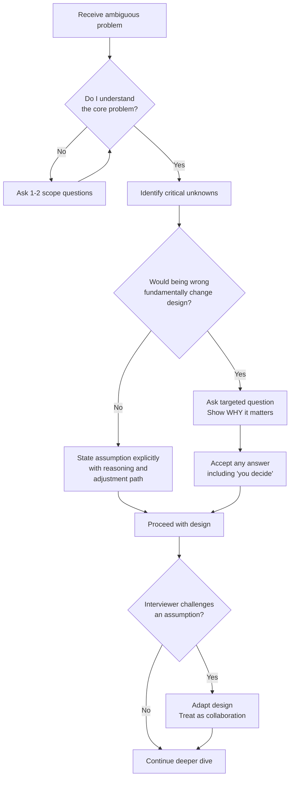
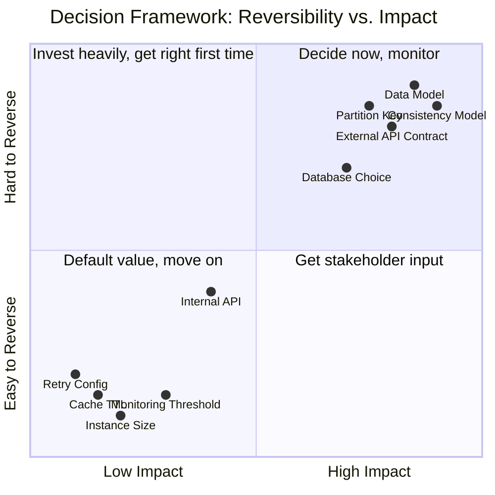
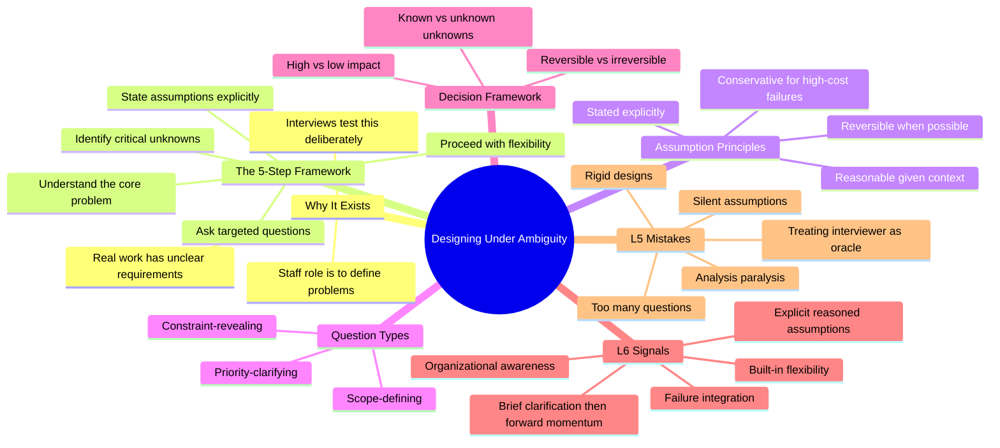
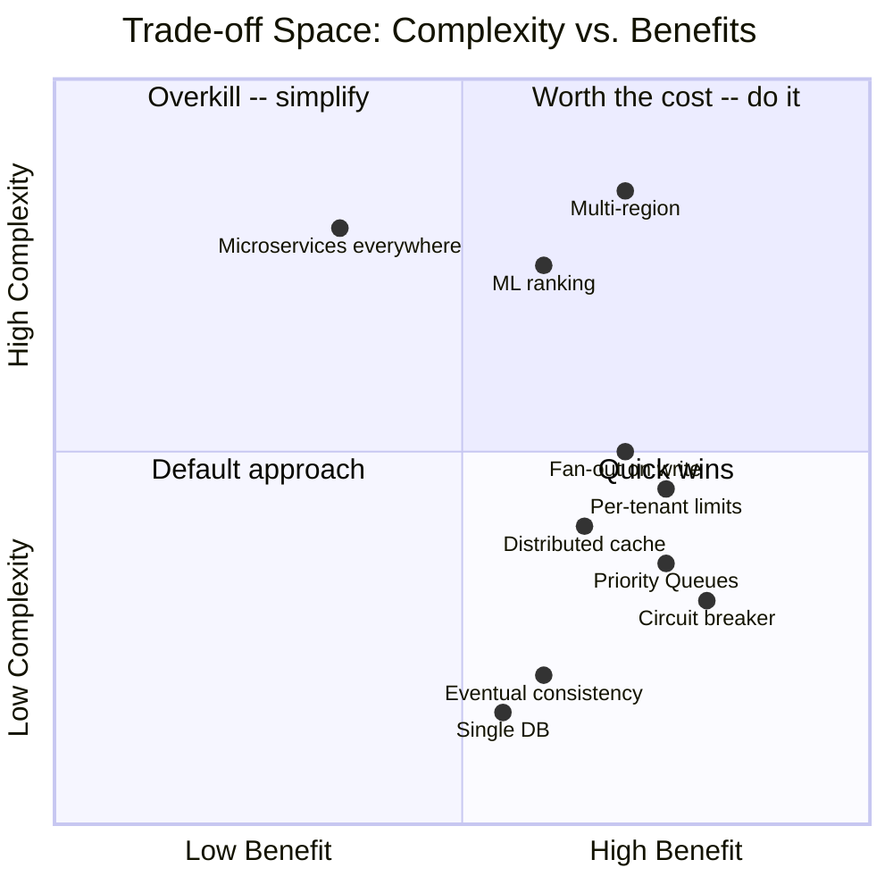
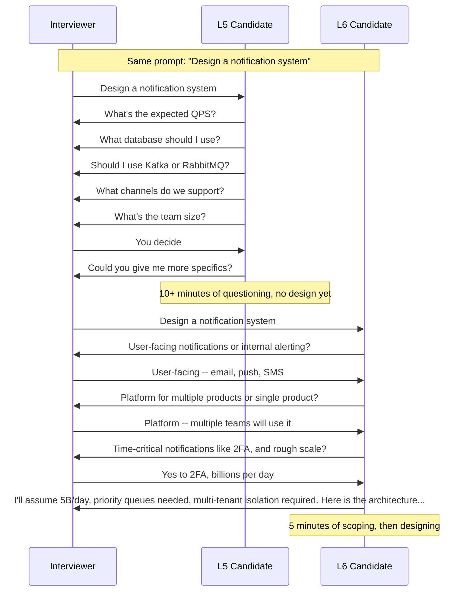
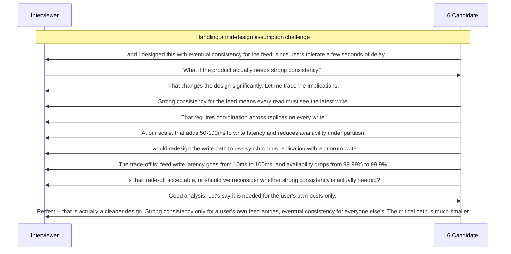
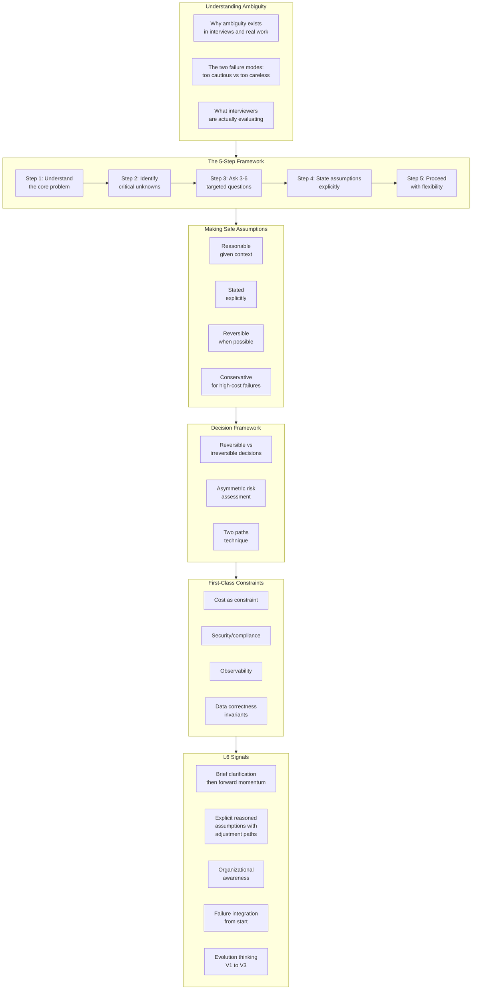
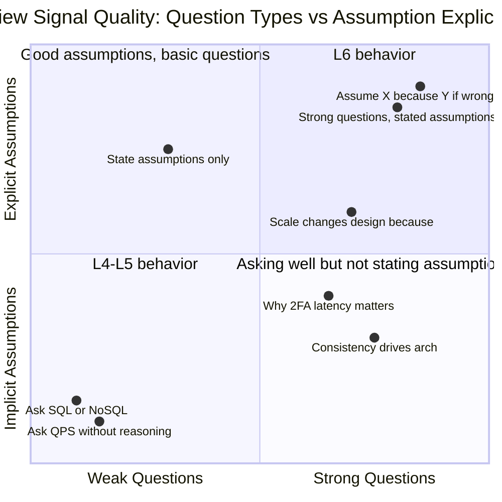
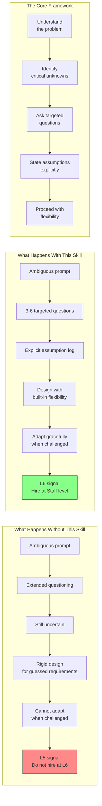

```mermaid
flowchart LR
    A[Problem Given] --> B[Understand Core Problem\n2-3 min]
    B --> C[Identify Critical Unknowns\n1 min]
    C --> D{Fundamentally changes design?}
    D -- YES --> E[Ask targeted question\nShow WHY it matters]
    D -- NO --> F[State assumption\nwith reasoning]
    E --> G[Accept any answer]
    F --> G
    G --> H[State assumption log\nexplicitly]
    H --> I[Design with flexibility\nNote reversible vs irreversible]
    I --> J[Deep dive on\nkey components]
    J --> K{Interviewer\nchallenges assumption?}
    K -- YES --> L[Adapt design\nTrace implications\nTreat as collaboration]
    K -- NO --> M[Continue\nAdd organizational\nand failure thinking]
    L --> M
    M --> N[L6 Signal Delivered]

    style A fill:#f9f,stroke:#333
    style N fill:#9f9,stroke:#333
    style E fill:#ff9,stroke:#333
    style F fill:#9ff,stroke:#333
```

# Chapter 10: Staff Engineer Mindset -- Designing Under Ambiguity

---

## Section 1: Learning Goal

By the end of this chapter you will be able to do three things.

First, you will understand why ambiguity is intentional in Staff Engineer interviews and in real Staff Engineer work. You will stop treating ambiguity as a problem to eliminate and start treating it as the normal environment you operate in.

Second, you will have a concrete five-step framework for navigating unclear requirements. You will know exactly what to say, in what order, and how to move forward confidently even when information is incomplete.

Third, you will be able to demonstrate L6-level ambiguity handling in an interview. You will know the specific behaviors that interviewers are looking for, the specific mistakes that signal L5 thinking, and the exact phrases that signal Staff-level judgment.

This chapter is specifically aimed at recent graduates and senior engineers preparing for Google Staff Engineer (L6) interviews. The gap between L5 and L6 is nowhere more visible than in how you handle ambiguity. That is what this chapter trains.

---

## Section 2: Why This Matters

### The Most Disorienting Moment in a Staff Interview

You walk into a Staff Engineer interview. The interviewer says: "Design a notification system."

You wait for more details. Requirements. Constraints. Numbers.

They do not come.

The interviewer looks at you and says: "What questions do you have?"

You ask five questions. The answers are vague. "Assume a large scale." "Whatever makes sense." "You decide."

You feel stuck. You feel like you cannot design without more information. That feeling is the test.

This moment is not an accident. It is not laziness on the interviewer's part. It is the interview working exactly as designed. The ambiguity is the problem they want to see you solve.

### Why Staff Engineers Work in Ambiguity

Senior Engineers receive well-defined tickets. "Build a feature that does X with these inputs and outputs." The scope is clear. The success criteria are clear.

Staff Engineers receive concerns. "Our checkout is too slow." "We are worried about scaling next year." "The notification system is unreliable." "We need better observability."

These are not requirements. These are problems that have not yet been defined. The Staff Engineer's job is to transform a vague concern into a concrete technical plan. To do that, you must:

1. Understand what the actual problem is (not just the stated symptom)
2. Define the scope (what is in scope and what is out)
3. Decide what matters most and what can wait
4. Make tradeoffs with incomplete information
5. Communicate your reasoning so others can contribute

The interview is a compressed version of this reality. When an interviewer gives you an ambiguous prompt, they are testing whether you can do exactly this work.

### The Paradox That Trips People Up

Here is the thing many candidates miss. Asking too many questions is just as bad as asking too few.

A candidate who spends fifteen minutes extracting every requirement before drawing a single diagram has failed. Not because asking questions is wrong. But because they have shown they cannot function without complete information. Staff Engineers must function constantly with incomplete information.

The correct behavior is a balance. Ask enough to understand the core problem and the major constraints that would fundamentally change your design. Make explicit assumptions for everything else. Proceed.

That balance is what this chapter teaches.

---

## Section 3: Core Concepts

### Concept 1: What "Ambiguity" Actually Means

**Why does ambiguity exist?**

Ambiguity exists because requirements in the real world are almost never complete. Problems come from human observations of systems behaving badly. "The system is slow" is an observation, not a requirement. "Users are complaining" is feedback, not a specification. Even when someone writes a requirements document, they cannot anticipate every edge case, every future use case, or every constraint that will become relevant.

In interviews, ambiguity exists deliberately. The interviewer could give you a perfectly specified problem. They choose not to because the skill of navigating ambiguity is exactly what they are evaluating.

**What ambiguity means in practice:**

Ambiguity means that when you start working on a problem, some information is missing and you do not know which missing information matters. There are things you know you do not know (known unknowns). There are things you do not even know you need to know (unknown unknowns). Navigating ambiguity means making progress despite both.

**The two failure modes:**

Too much caution: You ask question after question, waiting until you feel you have enough information before committing to anything. You never feel you have enough. You spend the entire interview gathering rather than designing. The interviewer sees someone who cannot operate without complete information.

Too little caution: You assume everything silently, never stating your assumptions, and design a system that only makes sense under a specific set of unstated assumptions. The interviewer cannot evaluate your reasoning. When they challenge an assumption, your design falls apart because you did not build in flexibility.

The Staff Engineer approach is neither of these. It is: ask the questions that would fundamentally change the design, make explicit stated assumptions for everything else, and proceed with built-in flexibility.



---

### Concept 2: Why Staff Engineers Are Given Ambiguous Problems

**Why does this exist?**

At Senior level, your value comes from executing well on defined problems. You are given a spec and you build something that meets that spec reliably, cleanly, and with good engineering practices.

At Staff level, your value comes from a different skill. You are given a situation and you figure out what the problem actually is, whether that problem is worth solving, and what approach makes sense given constraints that are not fully known. You define the problem. The problem does not define itself for you.

This is a fundamentally different skill. Many engineers with strong Senior-level technical skills never make the jump to Staff because they try to be excellent Senior Engineers instead of being Staff Engineers. They keep waiting for the problem to be defined rather than defining it themselves.

**What this means in an interview:**

When an interviewer gives you "Design a notification system," they are not being vague because they did not prepare. They are being vague because they want to see you handle the vagueness. They want to see whether you freeze (bad), whether you drill them for every detail (also bad), or whether you systematically navigate the ambiguity yourself (good).

**The signal they are looking for:**

They want to see that you can operate as someone who will be trusted to go into a room with a product manager, hear "the notification system is unreliable," and come out thirty minutes later with a clear problem statement, a proposed approach, a list of tradeoffs, and a plan. Not someone who will come out asking for more information.

---

### Concept 3: The Mindset Shift -- From "I Need Information" to "I Will Make Assumptions"

**Why does this mindset shift matter?**

The Senior mindset around ambiguity is: "I need more information before I can design." This feels responsible. It feels like good engineering. It feels like not guessing.

But at Staff level, this mindset is a trap. Here is why.

In real work, you almost never get the information you want before a decision is needed. Waiting for perfect information means decisions never get made or get made by someone else. Staff Engineers do not have the luxury of waiting.

More importantly, asking for information and making assumptions are not that different in practice. When you ask "What is the expected QPS?" and the product manager says "around 100K," that number is itself an estimate, probably made up on the spot, and could easily be off by 5x in either direction. You have "information" but it is not fundamentally more reliable than a well-reasoned assumption.

The Staff mindset is: "I will make a well-reasoned assumption, state it explicitly, and design for it. If the assumption is wrong, I will show how the design adapts."

This is actually better than waiting for information because it makes your reasoning visible, it makes your assumptions challengeable, and it demonstrates the judgment that Staff Engineers are paid to have.

**The exact mindset shift:**

```
L5 thought: "I need to know the QPS before I can choose a database."

L6 thought: "For a system like this, QPS is probably in the 10K-100K range.
            I will assume 50K QPS for my design. That suggests a read-optimized 
            database with connection pooling. If the actual QPS is 10x higher, 
            the bottleneck shifts to the database write path and I would add 
            a write buffer. If it is 10x lower, I am slightly over-engineered 
            but still correct."
```

The L6 thought contains more useful information. It shows reasoning. It shows awareness of tradeoffs. It shows flexibility. The L5 thought shows a dependency that may never be resolved.

---

### Concept 4: How to Make Assumptions Confidently and Explicitly

**Why does this exist?**

Making assumptions explicitly is a Staff-level skill because it does two things at once.

First, it enables progress. You cannot design a system without making assumptions. Every design choice you make is based on some assumption about scale, usage patterns, reliability requirements, or business context. The question is whether those assumptions are visible or hidden. Making them explicit and stated enables progress while keeping the reasoning auditable.

Second, it demonstrates judgment. A well-reasoned stated assumption shows that you understand the problem domain well enough to know what a reasonable assumption looks like. "I will assume 100K QPS because this is a mid-size consumer product and that is typical for this category" shows domain knowledge and reasoning ability that "I need to know the QPS" does not.

**The four properties of a safe assumption:**

A safe assumption is reasonable given the context. It is based on industry norms, stated information, or first-principles reasoning about the problem. "I will assume this needs 99.9% availability" is reasonable for a user-facing system. "I will assume this needs 100% availability" is not reasonable because nothing achieves 100%.

A safe assumption is stated explicitly. The interviewer knows what you assumed. You said it out loud. They can agree, disagree, or redirect. Hidden assumptions are design landmines.

A safe assumption is reversible. The design can adapt if the assumption turns out to be wrong. "I assumed eventual consistency is acceptable. If we need strong consistency, I would add a synchronous write path here and accept the latency increase."

A safe assumption is conservative when the failure cost is high. When the cost of underestimating is much worse than the cost of overestimating, assume the harder constraint. "I am not sure if this data needs encryption at rest, but I will assume it does because the cost of adding encryption later is much higher than the cost of having it from the start."

**How to phrase an assumption:**

Good phrasing:
- "I am going to assume X because it is typical for this type of system. If that is wrong, here is where it affects the design."
- "Let me proceed with assumption X. This assumption drives decision Y in my design. We can revisit it if you tell me something different."
- "For now, I will assume X. I am noting this explicitly because if X changes, the entire storage tier changes with it."

Weak phrasing:
- "I assume X." (No reasoning, no flexibility)
- "Is X true?" (Asking instead of assuming; too passive for L6)
- "I will just assume whatever makes sense." (Careless, not thoughtful)

The difference between good and weak phrasing is not just style. Good phrasing actively demonstrates the judgment the interviewer is evaluating. Weak phrasing hides that judgment or shows its absence.

---

### Concept 5: The Clarifying Questions Framework

**Why does this exist?**

Not all questions are equal. Some questions reveal deep understanding of the problem space. Others reveal that you are waiting for someone else to do your analysis for you.

Clarifying questions serve two simultaneous purposes. They gather information that would genuinely change your design. And they demonstrate to the interviewer that you understand what matters about this type of system.

A question like "What database should I use?" reveals nothing about your understanding. It asks the interviewer to make your decision for you.

A question like "Do users expect to see their changes immediately, or is a few seconds of delay acceptable? I am asking because that is the core consistency question and it changes the entire storage and replication strategy" reveals that you understand why consistency matters, what the tradeoff is, and what it means for your design. That question is worth asking even if the interviewer says "you decide," because asking it demonstrated something valuable.

**The three types of good clarifying questions:**

Type 1: Scope-defining questions. These clarify what you are solving and what you are not.

Examples:
- "When you say notification system, are we including user preference management and opt-out, or focusing on the delivery infrastructure?"
- "Should I design the content generation side -- what to notify -- or the delivery side -- how to notify -- or both?"
- "Are we building a platform that multiple products will use, or a notification system for a single product?"

Why these are good: They show you understand that systems have scope. They demonstrate that you know the difference between a point solution and a platform. They move the conversation forward rather than stalling it.

Type 2: Constraint-revealing questions. These uncover requirements that would fundamentally change the architecture.

Examples:
- "Are there time-critical notifications like two-factor authentication codes where seconds matter, versus marketing emails where hours are fine? The answer changes whether I need priority queues."
- "What is our failure tolerance? Can we occasionally lose a notification, or does every notification have to be delivered at least once?"
- "Is this single-tenant, meaning one company's notifications, or multi-tenant where multiple companies send through the same platform? Multi-tenancy changes the isolation model."

Why these are good: Each question reveals the reasoning behind it. You are not asking for a number; you are showing that you understand the architectural implications of the answer.

Type 3: Priority-clarifying questions. These help you focus on what matters most.

Examples:
- "If I had to optimize for one property -- reliability, latency, or cost -- which matters most?"
- "What is the most important user journey I should make sure works well, even if other things degrade?"
- "What would constitute a working MVP versus the full vision?"

Why these are good: At Staff level, you cannot design everything with equal depth in a forty-five minute interview. These questions help you allocate your time and signal that you understand prioritization.

**How many questions to ask:**

Three to six questions is the right range. Here is why.

Fewer than three: You might miss a critical constraint. You appear to be guessing rather than engaging seriously with the problem.

Three to six: You demonstrate engagement and understanding. You establish the key constraints. You leave time for actual design work.

More than six or seven: You appear unable to proceed without complete information. You are consuming valuable design time. The interviewer wonders whether you will ever start. This pattern at Staff level is a serious negative signal.

The rule: Ask questions until you can make meaningful progress. Make assumptions for everything else.

**How to handle "you decide" answers:**

When an interviewer says "you decide," they are giving you exactly what they want to see: a chance to demonstrate that you can make a decision.

Wrong response: Ask a different version of the same question hoping for a different answer.

Right response: Make a decision. State your reasoning. Proceed.

Example of the right response:

Interviewer: "What scale should I design for?"
You: "I will design for a mid-to-large scale -- around ten million users and one hundred million events per day. This is large enough to require serious distributed systems thinking but not so extreme that we need exotic approaches. I will note where the design would change if we are ten times or one hundred times larger."

This single response shows more Staff-level judgment than any follow-up question could.

---

### Concept 6: When to Stop Asking and Start Designing

**Why does this exist?**

There is a specific moment in every system design interview where you need to stop asking and start designing. Many candidates miss this moment. They keep asking because they are not sure they have enough information. But "enough information" is a feeling, not a threshold, and the feeling of having enough information never arrives under conditions of genuine ambiguity.

The correct threshold is not "I feel ready." The correct threshold is "I know enough to make meaningful progress." These are very different things.

**The "good enough" threshold:**

You have enough information to start designing when:
1. You understand what the core system is supposed to do
2. You know the rough scale (even if it is your own estimate)
3. You have identified the one or two decisions that would most fundamentally change the architecture
4. You have either gotten answers to those critical questions or made stated assumptions for them

Everything else can be assumed or figured out as you go.

**Signs you are waiting too long:**

You are asking the same question in different words. "What is the QPS?" followed by "How many requests per second?" is not two questions; it is one question you are repeating.

You are asking for implementation details before understanding the system. "Should I use Kafka or RabbitMQ?" is not a clarifying question; it is a design decision you should make yourself after understanding the requirements.

You are asking questions that you could answer from first principles. "Should this be fault-tolerant?" does not need an answer. Of course it should. Every production system should be fault-tolerant.

You express discomfort with uncertainty. "I just want to make sure I understand all the requirements before I start" is a signal that you need complete information to function. Staff Engineers do not have that luxury.

**The practical technique:**

Set a mental timer. Give yourself three to five minutes for initial clarification. After that, transition to designing even if you have uncertainty. You can ask more targeted questions as you design if you hit a genuine blocker. But start moving.

The transition phrase: "I think I have enough to get started. Let me state my key assumptions and then walk through the architecture. Let me know if any of these assumptions are wrong."

---

### Concept 7: The Assumption Log

**Why does this exist?**

An assumption log is the practice of explicitly stating your assumptions at the beginning of your design, and continuing to state new assumptions as they arise during the design discussion. This practice is a strong L6 signal because it makes your reasoning transparent, keeps the discussion collaborative, and prevents the design from feeling arbitrary.

Without an assumption log, your design choices appear to come from nowhere. "I chose Cassandra." Why? "I chose priority queues." Why? When assumptions are implicit, the interviewer cannot evaluate whether your choices are good given the constraints. When assumptions are explicit, the interviewer can see the reasoning and engage with it.

**How to run an assumption log in an interview:**

At the start of your design, after your clarifying questions, state your key assumptions in a list:

"Before I start designing, let me state the assumptions I am working with. First, I am assuming a large-scale system -- one hundred million daily active users and one billion events per day. Second, I am assuming a mix of time-critical notifications, like two-factor authentication, and non-urgent ones, like marketing emails. Third, I am assuming this needs to be a platform that multiple teams will use, which means I need to think about multi-tenancy and isolation. Fourth, I am assuming reliability matters more than cost -- occasional over-provisioning is acceptable but message loss is not. These assumptions will drive my design. Tell me if any of them are wrong."

As you design, state new assumptions as they arise:

"For the database tier, I am going to assume a read-heavy workload -- probably ninety-to-one reads to writes. That drives me toward a read-optimized database with caching."

"I am assuming here that we have engineering capacity to operate a distributed cache. If the team is small, I would simplify to application-level caching."

**Why this works in interviews:**

It gives the interviewer multiple entry points to engage. They can agree with an assumption, disagree with it, or add context that changes it. This turns the interview into a conversation rather than a monologue. Interviewers at L6 level strongly prefer candidates who engage in dialogue over candidates who lecture.

It also protects you. If you later make a design choice that seems questionable, you can refer back to a stated assumption: "This choice follows from my earlier assumption that we need sub-ten-millisecond latency. If we relax that constraint, I would simplify this part."

---

### Concept 8: How to Handle Contradictory Requirements

**Why does this exist?**

Contradictory requirements are common in real engineering. A product manager wants the system to be both fast and consistent. A business wants both low cost and high availability. An engineer wants both simplicity and flexibility. These things are often in tension.

In interviews, contradictory requirements appear as deliberate constraints that cannot all be fully satisfied at once. "We need sub-millisecond latency and strong consistency across multiple regions." That is very hard. The interviewer wants to see how you handle the tension.

**The wrong approach:**

Try to satisfy all requirements simultaneously without acknowledging the tension. Design a system that claims to be both strongly consistent and sub-millisecond across regions without explaining how. This either produces an incorrect design or a design that the interviewer knows does not work.

**The right approach:**

Name the contradiction explicitly. Explain what the fundamental tension is. Propose a resolution. Explain the tradeoff of that resolution.

Example:

"You have mentioned both sub-millisecond latency and strong consistency across regions. These are fundamentally in tension because of the speed of light. Data that lives in multiple regions requires network round trips for coordination, and those round trips take tens to hundreds of milliseconds by themselves. So we cannot have both perfectly.

Here are the resolutions available to us:

Option A: Accept eventual consistency. We deliver sub-millisecond reads by serving from local cache, and accept that users in different regions may see slightly different data for a second or two. This is acceptable for a social feed but not for a financial transaction.

Option B: Accept higher latency for writes. Strong consistency requires coordination between regions. We pay for that with write latency -- maybe fifty to one hundred milliseconds per write. Reads can still be fast if we read from a local replica.

Option C: Define consistency regions. For data that must be consistent, route all operations through a single primary region and pay the latency cost. For data that can be eventually consistent, allow local reads and writes.

Given that you are describing a notification system, I would recommend Option A for notification delivery and Option B for anything involving billing or account state. Which of those approaches would you like me to design first?"

This response names the contradiction, explains why it exists at a fundamental level, offers multiple resolutions, and asks a prioritizing question. That is L6 behavior.

---

### Concept 9: How to Handle Unknown Unknowns

**Why does this exist?**

Unknown unknowns are the most dangerous type of ambiguity. They are the things you do not know you do not know. You cannot ask about them because you do not know they exist. Your design does not account for them because you are not aware they need to be accounted for.

Examples of unknown unknowns in system design:

You design a notification system without knowing that one of the future tenants will send batch notifications to millions of users simultaneously. This is not an unknown you asked about. You did not know to ask.

You design a user profile service without knowing that the company will add HIPAA-regulated health data to profiles next year. Now your system needs controls it was never designed for.

You design a service without knowing that regulatory requirements in a particular country will require data to stay within that country's borders.

**The Staff Engineer approach to unknown unknowns:**

You cannot eliminate unknown unknowns, but you can design for them by making your system more adaptable and by asking second-order questions.

Second-order questions surface unknown unknowns by asking about the future and about context you might not be aware of:

- "Are there other teams or products that might use this system in the future that we are not currently thinking about?"
- "Are there any regulatory or compliance considerations I should know about, even if they are not requirements yet?"
- "What happens to this system during peak events -- holiday shopping, major news events, product launches?"
- "Are there any partnerships or integrations planned that might add load or new requirements?"
- "What does this system need to look like in two to three years, even if we are only building a fraction of that today?"

These questions do not have specific technical implications until you hear the answer. But asking them often surfaces requirements that were not explicitly mentioned because no one thought to mention them.

**Designing for adaptability:**

Beyond asking questions, you design for unknown unknowns by building in explicit extensibility points:

"I am designing this with a plugin architecture for notification channels. We currently support email, SMS, and push. But the abstraction means adding a new channel -- say, WhatsApp or in-app notifications -- does not require changing the core pipeline. This gives us flexibility for channels we have not thought of yet."

"I am keeping the ranking logic as a separate service that can be swapped out. Right now it is chronological. If we later want ML-based ranking, we replace the ranking service without changing anything else."

This kind of forward-looking design is a strong L6 signal.

---

### Concept 10: First-Principles Reasoning

**Why does this exist?**

Pattern matching is a Senior Engineer skill. You have seen a notification system before, so you know the general shape: queue, workers, delivery. You pattern-match to the familiar shape and fill in details.

First-principles reasoning is a Staff Engineer skill. Instead of matching to a pattern, you derive the design from the specific constraints of this problem. You ask: "What does this specific problem require? Given these specific constraints, what is the optimal architecture?"

First-principles reasoning produces better designs because it starts from the actual problem rather than from a template. And it is more resilient to unusual requirements because it does not depend on the pattern fitting.

**What first-principles reasoning looks like:**

Pattern-matching approach: "This is a notification system. I have built these before. The architecture is: API gateway, message queue, worker pool, delivery service."

First-principles approach: "What does a notification system fundamentally need to do? Receive events from producers. Decide which users to notify. Deliver notifications through channels. Ensure delivery is reliable. Handle failures and retries. Prevent duplicates. Scale independently from the producers.

Given those requirements, what properties does the architecture need? Decoupling between event production and notification delivery -- so a slow SMS provider does not block email delivery. Priority separation -- so a critical two-factor authentication code does not wait behind a bulk marketing campaign. Idempotency -- so retries do not cause duplicate notifications. Rate limiting -- so a runaway producer cannot overwhelm the system.

From those requirements and properties, here is the architecture that satisfies them..."

Both approaches might produce similar-looking architectures. But the first-principles approach:
- Produces a design that is justified by reasoning
- Can handle unusual constraints ("actually we do not need priority separation because all notifications are marketing") because the reasoning can adapt
- Demonstrates understanding rather than just recall

**How to practice first-principles reasoning:**

For any system design, before you draw any boxes, ask:
- What does this system fundamentally need to do?
- What are the most important properties it needs to have?
- What are the failure modes that would be unacceptable?
- Given those requirements and failure modes, what architecture satisfies them?

Then draw boxes.

---

### Concept 11: "What Would I Build" vs. "What Is Right for This Context"

**Why does this exist?**

There is a difference between designing the system you know how to build and designing the system that is right for this specific context. Senior Engineers often build the former. Staff Engineers deliberately build the latter.

"What would I build" leads to designs that reflect the engineer's familiarity and comfort. You know Postgres, so you use Postgres everywhere. You know Kafka, so every system has Kafka in it. You know microservices, so every system is microservices.

"What is right for this context" leads to designs that reflect the specific constraints, team size, scale, and requirements of this problem. Small team, early-stage product? Postgres and a monolith is probably right even if you personally prefer a distributed database. High-volume event stream with multiple consumers? Kafka might be right even if you do not love operating it.

**How to demonstrate this in an interview:**

Before recommending any specific technology or architecture, name the context-specific factors that are driving the recommendation:

"For this team size and scale, I would recommend Postgres rather than a distributed database. The operational complexity of a distributed database is significant, and we are not yet at the scale where Postgres becomes a bottleneck. When we hit those limits -- probably when our data exceeds a few terabytes or our write throughput exceeds tens of thousands per second -- we have a clear migration path."

Notice: the recommendation is justified by context. "Small team" and "not at scale yet" are the reasons, not "I know Postgres."

"If this were a ten-engineer startup, I would design differently -- simpler, fewer components, easier to operate. But you have described a platform team at Google scale. In that context, the additional complexity of this tiered storage approach is justified because the operational tooling and engineering expertise to manage it exist."

---

### Concept 12: How to Reason About Scale When You Don't Know the Exact Numbers

**Why does this exist?**

Scale is one of the most common ambiguities in system design interviews. "Design a large-scale system" tells you nothing concrete. And even when you ask, the answer is often "hundreds of millions of users" or "large" -- still vague.

The mistake is to either wait for exact numbers or to use arbitrary numbers without reasoning. Staff Engineers derive approximate numbers from first principles, state their derivation, and use those derived numbers as the basis for design decisions.

**The back-of-envelope derivation method:**

Step 1: Anchor on something you know or can estimate.

"For a social media feed system, let me estimate the scale. Say five hundred million registered users. Twenty percent are daily active -- that is one hundred million. Each active user checks their feed about ten times a day. That is one billion feed reads per day. If each feed request loads the top fifty posts, we are reading fifty billion post records per day."

Step 2: Convert to operational rates.

"One billion reads per day divided by eighty-six thousand seconds per day is roughly twelve thousand reads per second at average. With a ten-to-one peak-to-average ratio, peak is around one hundred twenty thousand reads per second."

Step 3: Derive implications.

"At one hundred twenty thousand reads per second, a single database server cannot handle this. We need read replicas. Given that feeds are personalized and user-specific, caching individual feeds in Redis makes sense -- we can cache the hot feeds in memory and serve most of the load from cache."

This derivation demonstrates several important things. You can reason quantitatively. You understand the connection between scale numbers and architectural decisions. You are not guessing randomly.

**Common safe scale anchors:**

For a mid-size consumer product: One to ten million daily active users, one hundred to one thousand requests per second at average load.

For a large consumer product like a major social network: Tens to hundreds of millions of daily active users, tens to hundreds of thousands of requests per second at peak.

For an enterprise API: Thousands to tens of thousands of requests per second, lower burst factor.

For a batch data pipeline: Measure in volume per day rather than per second. Terabytes to petabytes per day for large scale.

When in doubt, state your anchor and the reasoning behind it: "I am anchoring on ten million DAU because you described this as a mid-size product. If you are larger, here is where the design would need to change."

---

### Concept 13: Designing for Change

**Why does this exist?**

Requirements change. Assumptions get invalidated. Scale grows. New features are added. New regulations appear. The design you make today needs to be easy to evolve when these changes happen.

Designing for change does not mean designing for every possible change. That leads to over-engineering. It means making the most likely categories of change easy to accommodate while not paying a heavy cost for changes that are unlikely.

**The three categories of change to plan for:**

Scale change: The system grows by ten times or one hundred times. Design the critical path so it can be horizontally scaled. Use stateless services where possible. Separate concerns so the write path and read path can scale independently.

Feature change: New types of notifications, new channels, new rules for who gets notified. Use abstraction and pluggable components. "I am designing the channel abstraction so that adding a new channel only requires implementing a new plugin -- the core pipeline does not change."

Operational change: The team grows. The technology evolves. The company is acquired. Use standard interfaces (HTTP, gRPC) rather than proprietary protocols. Keep technology choices at the level of proven, well-supported options rather than experimental tools.

**Designing for change in practice:**

"I am choosing to make the fan-out service a separate deployable component from the delivery service. They could be combined today, but separating them now means we can scale them independently later. Fan-out is CPU-intensive and write-heavy; delivery is I/O-intensive and read-heavy. They have different scaling profiles. Keeping them separate is a small upfront cost that pays off as we scale."

"I am using an event-driven design here rather than direct RPC calls. This means when we add a new consumer -- say, an analytics service that wants to know when notifications are sent -- we just add a new subscriber. The notification service does not need to know about the analytics service. This is how we design for future integrations we cannot anticipate today."

---

### Concept 14: The Reversible vs. Irreversible Decisions Framework

**Why does this exist?**

Jeff Bezos famously described decisions as either two-way doors (reversible) or one-way doors (irreversible). Staff Engineers apply this framework to their design decisions because the stakes are very different for each type.

For reversible decisions, the right strategy is to make the decision quickly with reasonable information, execute, and adjust as you learn more. Spending a lot of time on a reversible decision is waste.

For irreversible decisions, the right strategy is to invest more time and effort in getting it right the first time, because changing it later will be expensive or impossible.

**Examples of irreversible (or very expensive to reverse) decisions:**

Data model choices that persist in storage. If you store notifications in a columnar format and later need a document model, migrating terabytes of data is expensive.

API contracts with external consumers. Once you have thousands of clients depending on an API format, changing it breaks all of them. Versioning helps but adds complexity.

Consistency model of a distributed system. Changing from eventually consistent to strongly consistent, or vice versa, requires redesigning your coordination layer.

Partitioning strategy in a distributed database. Choosing the wrong partition key leads to hot spots that are difficult to fix without a data migration.

**Examples of reversible decisions:**

Cache implementation and TTL values. Easy to change; just deploy new configuration.

Initial instance sizes. Easy to scale up or down.

Specific configuration parameters. Easy to change without code changes.

Internal service boundaries. Harder to change than configuration but easier to change than external APIs.

**How to apply this in an interview:**

"This is a one-way door decision. Once we choose the partition key for this Cassandra table, changing it requires migrating all existing data. So I want to be deliberate here. Let me reason through the access patterns carefully before committing."

"This is a two-way door. The specific TTL for this cache is easy to change with a config update. I will start with one hour and adjust based on production data."

"Let me distinguish the reversible decisions from the irreversible ones in this design. The irreversible ones are: the data model, the consistency model, and the external API contract. I will spend more time on those. The reversible ones are: cache sizes, instance counts, and retry timeouts. I will pick reasonable defaults and not overthink them."

---



---

### Concept 15: Analysis Paralysis and How to Break It

**Why does this exist?**

Analysis paralysis is the state where you have gathered so much information, or thought about so many possibilities, that you cannot make a decision. In system design interviews, it manifests as extended questioning, revisiting the same questions, expressing repeated uncertainty, and failing to make progress on the actual design.

Analysis paralysis usually comes from a fear of being wrong. "If I assume X and it turns out to be wrong, I will look bad." But the opposite is true. A candidate who makes a reasoned assumption that turns out to be wrong looks better than a candidate who cannot make assumptions at all. The former shows judgment. The latter shows a dependency on complete information that is impractical at Staff level.

**The five techniques to break analysis paralysis:**

Technique 1: Set a mental timer. Allow yourself three to five minutes for initial clarification. When the timer is up, make your assumptions and start designing regardless of how uncertain you feel.

Technique 2: Use the "good enough" threshold. Ask yourself: "Do I know enough to make meaningful progress?" Not: "Do I know everything?" Just: "Do I know enough to start?" If yes, start.

Technique 3: Choose the reversible path. When stuck between two options, choose whichever is easier to change later. Make a note: "I am choosing A because it is easier to change than B if my assumptions turn out to be wrong."

Technique 4: Verbalize the uncertainty. "I am not certain about X, so I will assume Y for now and note it explicitly. If Y is wrong, here is how I would change the design." This allows you to acknowledge uncertainty without being paralyzed by it.

Technique 5: Start with what you know. Every problem has some aspects that are clear even under ambiguity. Start designing those. The unclear parts often become clearer once you have started.

---

### Concept 16: The Two Paths Technique

**Why does this exist?**

Sometimes there are genuinely two valid approaches and the right choice depends on a constraint you have not resolved. In these cases, sketching both paths briefly and then choosing one is better than either asking more questions or silently choosing one.

The two-paths technique shows that you understand the problem space well enough to see multiple valid approaches. It shows that you can reason about when each applies. And it shows that you can still make a decision and move forward.

**How to use it:**

"I see two valid approaches here, and the right choice depends on our consistency requirements.

Path A: Fan-out on write. When a user posts, we immediately write a feed entry for every follower. Reads are fast because the feed is precomputed. The cost is write amplification -- posting to a user with one million followers writes one million records.

Path B: Fan-out on read. When a user views their feed, we compute it on the fly by querying everyone they follow. Reads are slower but writes are cheap. The issue is that at scale, computing a feed from many follows in real time is expensive.

At the scale we are discussing -- five hundred million users with an average of five hundred follows each -- fan-out on write is feasible for regular users but not for celebrity accounts with millions of followers. I will use a hybrid approach: fan-out on write for regular users, fan-out on read for accounts with more than one hundred thousand followers.

This hybrid is what Twitter uses. I am choosing it not because Twitter uses it but because it is the right solution to this specific trade-off."

Notice the last sentence. That is first-principles reasoning, not pattern matching.

---

## Section 4: Mental Models

### Mental Model 1: The Weather Forecaster

A weather forecaster does not wait for complete information before making a forecast. The atmosphere is too complex; complete information never arrives. Instead, the forecaster makes the best possible prediction given available data, states their confidence level ("seventy percent chance of rain"), and explains what signals they are watching.

This is exactly what Staff Engineers do with ambiguous requirements. Make the best possible assumption given available context. State the assumption explicitly with reasoning. Note what would change the assumption.

### Mental Model 2: The Doctor Diagnosing Without Test Results

A good doctor does not say "I cannot diagnose you until every test is back." They use symptoms, history, and examination to form a working diagnosis, treat for the most likely condition, and adjust when test results arrive. They document their reasoning so other doctors can follow it.

Staff Engineers work the same way. Form a working assumption based on available evidence. Design for that assumption. Document the reasoning. Adjust when new information arrives.

### Mental Model 3: The Architect of a New Building

An architect designing a building does not know every detail of how the building will be used. They cannot know. So they design with flexibility: load-bearing walls in the right places, wiring and plumbing in accessible locations, room sizes that can be reconfigured. They make the most important structural choices carefully (irreversible decisions) and leave the rest flexible (reversible decisions).

Staff Engineers design systems the same way. Careful about structural choices like data models and consistency models. Flexible about operational choices like cache sizes and instance counts.

### Mental Model 4: The Detective

A detective does not wait for a confession before forming a theory. They gather available evidence, form a hypothesis that best explains it, act on the hypothesis, and update it as new evidence appears. They state their reasoning ("the evidence suggests...") so others can evaluate it.

Staff Engineers under ambiguity are detectives. Available evidence is the problem statement, stated constraints, and domain knowledge. The hypothesis is the design. The reasoning is the assumption log. The update mechanism is flexibility built into the design.

### Mental Model 5: The Experienced Chef Without a Recipe

An experienced chef given "make something with chicken and vegetables" does not ask for a recipe. They assess what they have, recall techniques that work with these ingredients, make assumptions about what the diner probably wants, and create a dish. A novice cook with the same ingredients is paralyzed without a recipe.

Staff Engineers are experienced chefs. They have enough domain knowledge to make reasonable assumptions and proceed. Junior engineers are novice cooks -- they need a recipe (complete requirements) to function.

---



---

## Section 5: Real-World Examples

### Example 1: Google -- News Feed (Fan-out at Scale)

**The situation:**

Google's social products (and analogously, products like YouTube's subscription feed) face a classic ambiguity problem: how do you deliver personalized content to users when you do not know upfront which users are online, which creators they follow, or how many followers any given creator has?

**The ambiguous requirement:**

"Users should see new content from people they follow."

**The first-principles reasoning:**

What does "see new content from people they follow" require technically?

When a creator publishes content, we need to notify all their followers. There are two ways to do this:

Option A: At publish time, write to every follower's feed (fan-out on write). The follower's feed is always ready to read. Fast reads, expensive writes.

Option B: At read time, look up everyone the user follows and find their recent content (fan-out on read). Reads are expensive. Writes are cheap.

The scale numbers matter enormously here. For a creator with one thousand followers, fan-out on write produces one thousand writes per post. Manageable. For a creator with ten million followers, fan-out on write produces ten million writes per post. At even modest posting rates, that is hundreds of millions of writes per day from celebrity accounts alone.

**The Staff-level assumption and resolution:**

"I am assuming that the creator distribution follows a power law -- a small number of creators have enormous follower counts and a large number have small follower counts. This is empirically true for every social platform. Given this, I will use a hybrid approach:

For normal accounts (fewer than one hundred thousand followers), I will use fan-out on write. Most accounts fall into this category, and the write volume is manageable.

For celebrity accounts (more than one hundred thousand followers), I will use fan-out on read. When a user loads their feed, we merge the pre-written entries (from normal accounts they follow) with real-time lookups (from celebrity accounts they follow).

The threshold of one hundred thousand is an assumption. I would validate it by looking at the actual follower distribution and choosing the threshold that minimizes total compute cost."

This is the actual approach used in production at social scale platforms including Twitter and early Facebook.

### Example 2: Amazon -- Rate Limiting at Scale

**The situation:**

Amazon's API Gateway needs to rate limit requests to protect backend services. The requirement is clear at a high level but deeply ambiguous in the details.

**The ambiguous requirement:**

"We need to prevent any one customer from overwhelming the system."

**The first-principles reasoning:**

What does "prevent overwhelming" mean technically? It means limiting the rate of requests from any single source. Rate limiting is straightforward conceptually but complex at scale.

The ambiguity: "at scale" for Amazon means potentially millions of API keys, each potentially sending thousands of requests per second, with the rate limiting check itself needing to add less than one millisecond of latency.

**The Staff-level assumption and resolution:**

"I am assuming two competing requirements here. First, the rate limit check needs to be very fast -- sub-millisecond -- because it is in the critical path of every API call. Second, the rate limits need to be accurate enough to prevent abuse but do not need to be perfectly accurate to the millisecond.

These two requirements together rule out approaches that require synchronous coordination. If I check a central Redis store on every request, the network round trip alone will add five to ten milliseconds at minimum. That violates the latency requirement.

So I will use a local-first approach: each gateway node maintains an in-memory counter for each API key. Periodically -- say every hundred milliseconds -- it synchronizes with a central store. This means that in the worst case, a user can exceed their rate limit by the amount they send in one sync window. At a one-hundred-millisecond window, that might mean they get ten percent over their limit.

I am assuming that ten percent over-limit during a sync window is acceptable. If the business requirement is tighter accuracy, I would either shorten the sync window (more Redis load) or switch to a different algorithm that provides better accuracy at a higher computational cost."

This is essentially how Amazon's actual API Gateway rate limiting works.

### Example 3: Netflix -- Video Delivery Under Ambiguity

**The situation:**

Netflix needs to deliver video smoothly to users around the world, even though at the time of designing their CDN strategy, they did not know which content would be popular, how much data users would consume, or what network conditions would be like.

**The ambiguous requirement:**

"Video should play smoothly without buffering."

**The first-principles reasoning:**

What makes video buffer? The client's download speed is lower than the video bitrate. Either the content is too far from the user (high latency, low throughput), or the network is congested, or the server is overloaded.

What do we control? We control where we place the content and at what bitrates we encode it. We can also control the delivery strategy -- whether we push content proactively to edge nodes or wait for first request.

**The Staff-level assumption and resolution:**

"I am making a key assumption here: I do not know which content will be popular. Most content will rarely be watched. Some content will be watched by tens of millions of users simultaneously. I cannot store all content at every edge location -- that would require enormous storage.

My assumption is that popularity follows a power law -- a small percentage of content generates the vast majority of views. I will design for that distribution:

For popular content: proactive caching at hundreds of edge locations close to users. When a new popular title releases, we push the content to edge nodes before users request it.

For long-tail content: content lives at a smaller number of regional nodes. When a user in Tokyo requests an obscure documentary, they fetch it from a regional node in Japan, not from US headquarters. Higher latency than edge, but the long-tail content only gets rare requests.

The threshold for 'popular enough to push to all edges' is an assumption I would validate with actual viewing data."

This is close to Netflix's actual open connect CDN strategy.

### Example 4: Uber -- Matching Under Uncertainty

**The situation:**

Uber needs to match riders with drivers in real time. The ambiguity: how do you build a system that works in a city with five hundred drivers and also works in a city with one hundred thousand drivers, without knowing which cities will exist when you design it?

**The Staff-level design consideration:**

"I am designing the matching system with a core assumption: the matching problem is fundamentally local. A rider in New York does not compete for drivers with a rider in Los Angeles. So the system should be regionally sharded -- each geographic region operates as a semi-independent matching system.

This assumption means: I do not need a single global matching service. I need a distributed regional service. This makes scaling straightforward -- adding a new city means spinning up a new regional shard, not scaling a global database.

My second assumption is that driver availability is highly dynamic. Drivers go online and offline every few minutes. A driver location update must propagate to the matching system in under a second. This rules out eventual consistency for location data -- I need strong consistency on the hot path.

These two assumptions together -- regional sharding and strong consistency for location -- drive the entire storage and coordination architecture."

---

## Section 6: Design Trade-offs

### Trade-off 1: Ask More vs. Assume More

Asking more questions gathers real information but costs time and signals dependence on others.
Making more assumptions saves time and signals independence but risks designing for the wrong constraints.

The Staff-level balance: Three to six targeted questions for constraints that would fundamentally change the architecture. State assumptions for everything else.

### Trade-off 2: Simple vs. Flexible Design

A simpler design is easier to build, test, operate, and understand. But it may not handle changing requirements well.

A more flexible design handles change better but adds complexity now and may be solving for problems that never actually occur.

The Staff-level balance: Build in flexibility at structural decision points (service boundaries, data models, APIs). Use simple solutions for operational decisions (configuration, scaling policies).

### Trade-off 3: Consistency vs. Availability

Strong consistency ensures every read reflects the latest write. This requires coordination between nodes, which adds latency and reduces availability under partitions.

Eventual consistency allows reads to serve from any replica, giving fast reads and high availability. But users may see stale data.

The Staff-level framing: Not "which is better" but "which invariants must be consistent and which can be eventually consistent?" In most systems, the answer is: most reads can be eventually consistent, but a small number of critical operations (financial transactions, inventory decrement, authentication) need strong consistency.

### Trade-off 4: Over-Engineering vs. Under-Engineering

Over-engineering adds complexity for scale or features that are not needed yet. It costs development time, slows iteration, and makes the system harder to understand.

Under-engineering builds the minimum and relies on future refactoring. This works for uncertain requirements but can lead to expensive rewrites when scale arrives.

The Staff-level balance: Do not over-engineer for unknown requirements. Do design for the scale and failure modes that are predictable given the context. "I am designing for ten million users but not one billion users because there is no signal that we will reach that scale in the next two years. When we do, here is the migration path."

### Trade-off 5: Centralized vs. Decentralized

A centralized architecture (single database, single queue, central coordinator) is simpler to reason about and develop for. It is easy to achieve consistency. It is a bottleneck at high scale.

A decentralized architecture distributes load and eliminates single points of failure. It is harder to reason about, harder to keep consistent, and harder to operate.

The Staff-level balance: Start centralized. Add decentralization only where the centralized component cannot scale to the required throughput. "I am using a single database for now. The partition key design means we can shard later without changing the access patterns."

---



---

## Section 7: Common Interview Questions With Full L6 Model Answers

### Question 1: "Design a notification system."

**L5 response pattern:**
Ask many questions about specific notification types, databases to use, specific QPS numbers. Design a straightforward queue-and-worker system for the stated requirements. Do not discuss multi-tenancy, priority separation, or failure modes unless asked.

**L6 model answer:**

"Before I dive in, let me understand the scope. When you say notification system, are we talking about user-facing notifications -- email, push, SMS -- or internal alerting for engineers? And is this for a single product or a platform that multiple products will send notifications through?

[Answer: user-facing, platform for multiple products]

That changes things significantly. Multi-tenant platform means I need to think about isolation and rate limiting per tenant. Let me ask two more questions.

First, scale: roughly how many notifications per day?

Second, are there time-critical notifications like two-factor authentication where seconds matter?

[Answer: billions per day, yes there are time-critical notifications]

Let me state my assumptions before designing. I am assuming five billion notifications per day across all channels -- email highest volume, SMS lowest volume but potentially highest priority. I am assuming a mix of critical notifications like two-factor authentication that must arrive in under ten seconds, and non-urgent notifications like marketing emails that can wait hours. I am assuming multiple producer teams who need isolation from each other so a runaway producer cannot overwhelm the platform or other tenants.

High-level design: The core of this system is ingestion, prioritization, and per-channel delivery pipelines.

For ingestion: producer teams send events through a REST API or gRPC. The ingestion layer validates events, applies rate limits per tenant, and routes to priority queues.

For prioritization: I will have separate queues for critical notifications and non-critical notifications within each channel. Critical notifications get dedicated worker capacity that cannot be stolen by bulk sends.

For delivery: separate workers per channel -- email, SMS, push -- because each channel has different throughput, latency, and reliability characteristics. SMS providers rate limit differently than email providers.

Key decisions and why:

Priority separation from the start. The worst failure mode for a notification system is password reset emails stuck behind a marketing campaign. Priority queues eliminate this class of incident.

Per-tenant rate limiting. One tenant sending a ten-million-user batch cannot block other tenants. I will implement per-tenant limits at ingest.

Circuit breakers on delivery providers. If an SMS provider goes down, I will not let requests pile up infinitely. Circuit breaker opens after a threshold of failures, fails fast to a backup provider.

Want me to deep-dive on any component?"

---

### Question 2: "Design a rate limiter."

**L6 model answer:**

"Let me understand the context. Is this for abuse prevention -- blocking bad actors -- fairness among customers, or cost control with tiered API pricing? And does it sit at the API gateway level or in the application?

[Answer: all three, API gateway level]

What scale are we talking? Thousands or millions of requests per second?

[Answer: millions per second, per API key with different tiers]

My assumptions: ten million requests per second at peak, thousands of unique API keys, sub-millisecond latency requirement for the rate limit check since it is in the critical path of every API call, and tier-based limits -- free, pro, and enterprise.

At ten million requests per second, the most important constraint is latency. We cannot synchronously hit a central store on every request. Network round trips add at minimum five milliseconds, and we need sub-millisecond.

I will use a distributed token bucket algorithm with local state and periodic global synchronization.

Each API gateway node maintains in-memory token buckets for every API key it serves. Tokens replenish at the rate limit for that key's tier. Requests consume tokens. If tokens are depleted, the request is rejected.

Every one hundred milliseconds, gateway nodes synchronize with a central Redis cluster. This sync reconciles differences -- if node A has seen eight hundred requests and node B has seen six hundred requests for a key with a one-thousand-per-second limit, the sync ensures neither node allows more than the aggregate limit.

The trade-off: a user can exceed their limit by up to about ten percent during a sync window. I am assuming this is acceptable for abuse prevention and fairness. If we need billing-accurate rate limiting, I would either tighten the sync window or use a different algorithm with synchronous coordination for the portion of requests above the limit.

Failure mode: if Redis goes down, I will fall back to purely local rate limiting. Each node enforces its local view. Accuracy degrades but the service remains available. This is the right failure mode -- degraded accuracy is better than a service outage.

For enterprise accounts that need guaranteed limits, I would offer a dedicated Redis instance with guaranteed SLA."

---

### Question 3: "How do you handle conflicting requirements in a system you are designing?"

**L6 model answer:**

"Conflicting requirements are almost always a sign that two valid objectives are in tension with each other. My first step is to name the tension explicitly rather than trying to pretend both can be achieved simultaneously.

For example: if a product requirement is that users should see their changes immediately, and an engineering requirement is that the system should remain available during network partitions, these are in tension. The CAP theorem tells us we cannot have both.

My approach in practice: I bring both requirements to the table, explain the fundamental tension in plain terms, and propose a resolution that prioritizes based on the actual business impact.

In that example, I would say: for users' own data -- their own posts, their own profile -- I will use strong consistency because seeing stale versions of your own data creates a confusing user experience. For other users' data -- other people's feeds, follower counts -- I will use eventual consistency because the user experience impact of a few seconds of staleness is minimal.

This is how Instagram actually works. Your own profile update is strongly consistent. Your follower count may be eventually consistent.

The key is making the trade-off explicit and justifying it by business impact. I never try to hide a conflict. I name it, frame it, propose a resolution with explicit reasoning, and make sure everyone agrees on the priority."

---

### Question 4: "What do you do when an interviewer says 'you decide'?"

**L6 model answer:**

"I decide. Immediately. With explicit reasoning.

'You decide' is not a problem. It is an opportunity. It is the interviewer saying: 'Show me your judgment.'

So I make the decision, state why I made it, note what the key assumption is, and move forward. I do not ask a follow-up question trying to get a different answer.

For example, if I ask 'What scale should I design for?' and the interviewer says 'you decide,' I say: 'I will design for ten million daily active users and one hundred million events per day. That scale is large enough to require distributed systems thinking -- a single machine cannot handle this -- but not so extreme that I need exotic approaches. If we are actually much smaller, the design simplifies easily. If we are much larger, here is where the bottleneck would move.' Then I keep going.

The key is that the decision comes with reasoning. Not just 'I will use X' but 'I will use X because Y, and if Y turns out to be wrong here is what changes.'

That pattern -- decision, reasoning, flexibility -- is the Staff-level response to any 'you decide' situation."

---

### Question 5: "Your design depends on an assumption that turns out to be wrong. How do you respond?"

**L6 model answer:**

"If an assumption I stated explicitly turns out to be wrong, I treat it as new information and adapt. The process is straightforward because I stated the assumption explicitly and noted its effect on the design.

I say something like: 'Okay, so the actual requirement is X instead of Y. That changes this part of my design. Specifically, [original decision] was based on [original assumption]. Given the actual requirement, I would [change] instead. Here is why...'

This is not a failure. It is the system working as intended. I stated the assumption, the assumption was challenged, I adapted. That is exactly what a Staff Engineer should do.

What I try to avoid is two things. One: getting defensive about the original design. Being wrong about an assumption is not a mistake; it is information. Two: changing every part of the design unnecessarily. I make the minimum changes required by the new information, not a wholesale redesign. Most of the design probably still holds even when one assumption changes.

The real skill here is having stated the assumptions clearly enough that I can identify exactly which parts of the design are affected by the change."

---

### Question 6: "How do you prioritize what to design first in an ambiguous problem?"

**L6 model answer:**

"I start with the component that determines the most about the rest of the system.

For most systems, that is the data model. How you represent and store the data constrains almost every other decision. If you get the data model wrong, you end up rearchitecting later. So I start there.

After the data model, I focus on the critical path -- the sequence of operations that every request must go through. The critical path is where performance is most constrained and where failures are most impactful.

If the problem involves a specific tricky component -- say, fan-out at celebrity scale, or rate limiting at very high throughput -- I will often jump to that component early because it is likely what the interviewer is most interested in discussing.

I explicitly say what I am doing and why: 'I am going to start with the data model because it constrains everything else. Then I will walk through the critical write path, then the read path, and then we can dive into whichever component you find most interesting.'

This signals that I understand the problem well enough to prioritize. It also gives the interviewer agency to redirect me if their interest lies elsewhere."

---

### Question 7: "Design a system with a scale you have never worked at personally."

**L6 model answer:**

"I reason from first principles rather than from personal experience. What I have worked on personally is less important than my ability to derive the right approach from the constraints.

Here is how I approach scales I have not personally operated at.

First, I acknowledge it: 'I have not personally operated at billion-user scale, so I will reason from what I know about how these systems work rather than personal experience.'

Second, I anchor on known reference points. Public engineering blog posts from Google, Facebook, Twitter, and Amazon describe many of the approaches used at these scales. I can reason from those. 'Google's Spanner is designed for exactly this kind of global consistency at massive scale. Let me reason about whether our constraints match Spanner's trade-offs.'

Third, I derive rather than guess. Instead of guessing what a billion-user system looks like, I derive it by pushing the constraints: 'At one billion daily active users, the write load is X. At X writes per second, a single database server is a bottleneck because [calculation]. So we need horizontal write scaling, which means [approach]. That approach requires [trade-off].'

The key is showing the reasoning. An interviewer does not expect you to have operated at Google scale if you have not worked at Google. They expect you to be able to reason about it systematically."

---

### Question 8: "How do you communicate your design to non-engineers?"

**L6 model answer:**

"I translate technical decisions into business impact language and avoid jargon.

Instead of: 'We are using eventual consistency with a synchronization interval.'
I say: 'When a user updates their profile picture, it might take a second or two for all their followers to see the change. That trade-off is worth it because it lets us scale to millions of users without slowing down.'

Instead of: 'We are using a circuit breaker pattern for the SMS provider dependency.'
I say: 'If our SMS provider goes down, our system will detect that within a few seconds and automatically switch to a backup provider. That means two-factor authentication codes will still arrive, just from a different carrier.'

I lead with the decision and the user or business impact. Technical mechanisms are supporting details for people who want to know more.

I also make trade-offs concrete: 'Option A gives users a better experience but costs us twenty percent more to run. Option B is cheaper but users occasionally see their data update a few seconds later. Given our cost constraints, I recommend Option B -- the user experience difference is not visible in practice.'

The goal is that a product manager or engineering director can understand the decision, understand the trade-off, and know whether to push back on it."

---

### Question 9: "Design a system where you know the requirements will change."

**L6 model answer:**

"I design for change by separating the decisions that are hard to change from the decisions that are easy to change, and investing my flexibility budget in the right places.

The decisions that are hard to change: data model, external API contracts, consistency model, and partitioning strategy. I will be careful and deliberate about these. I will choose data models that can be extended without migration. I will design APIs with versioning from the start. I will choose a consistency model that I am confident will hold for the foreseeable future.

The decisions that are easy to change: service configuration, instance sizes, cache TTLs, retry policies. I will pick reasonable defaults and not agonize over these.

For the design itself, I will use extensibility patterns at the points where I know change is most likely:

If the feature set will grow: I will use a plugin architecture so new features can be added without changing the core. For a notification system, I design the channel abstraction so adding a new channel -- say WhatsApp -- requires implementing one new plugin, not changing the delivery pipeline.

If the scale will grow: I will design the partitioning strategy so I can add more partitions without changing the data model. For a Cassandra-based system, I will choose partition keys that allow even distribution and can be sharded further.

If the team will change: I will invest in documentation, monitoring, and clear service boundaries so that engineers unfamiliar with the system can understand and operate it.

The phrase I find useful is: 'Make the easy things easy and the hard things possible.' Common operations should be simple to do. Uncommon operations -- like adding a new channel or a new type of notification -- should be possible without a major rewrite."

---

### Question 10: "What is the difference between a Staff Engineer and a Senior Engineer in terms of how they handle ambiguity?"

**L6 model answer:**

"The core difference is whether they need ambiguity resolved before they can work, or whether they can work within ambiguity.

A Senior Engineer is excellent at solving well-defined problems. Give them a clear specification and they will build exactly what was specified, with good engineering practices, on time. Ambiguity slows them down because they need to resolve it before they can commit to an approach.

A Staff Engineer's core skill is defining the problem, not just solving it. They receive ambiguous situations -- 'the checkout is too slow,' 'we are worried about scale' -- and turn them into concrete technical plans. They do this by making explicit assumptions, stating their reasoning, and proceeding even without complete information.

In an interview, this shows up in several specific behaviors.

A Senior Engineer will ask many questions before starting, trying to reduce ambiguity to a level they are comfortable with. A Staff Engineer will ask three to six targeted questions and then make explicit assumptions for everything else.

When told 'you decide,' a Senior Engineer will ask a different version of the same question, trying to get a real answer. A Staff Engineer will make a decision, state their reasoning, and proceed.

A Senior Engineer's design will be optimized for the stated requirements. A Staff Engineer's design will have built-in flexibility: 'This design assumes X. If X changes, here is how I would adapt.'

A Senior Engineer treats the interviewer as someone who has the right answer. A Staff Engineer treats the interviewer as a collaborator -- someone to think with, not someone to extract information from.

The underlying mindset shift is: from 'I need requirements to design' to 'I will make my best judgment given available information, state my reasoning, and adjust as I learn more.'"

---

### Question 11: "How do you handle a situation where two stakeholders want incompatible things?"

**L6 model answer:**

"First, I make sure the incompatibility is real and not just a communication problem. Often what looks like conflicting requirements is actually two people describing the same need from different perspectives. I will restate both requirements in concrete, measurable terms and check whether they are actually incompatible.

If the conflict is real, I do three things.

One: I name it clearly. 'These two requirements are in tension because [fundamental reason]. We cannot have both at once without accepting a cost.'

Two: I propose resolutions with explicit trade-offs. Usually there are a few options for how to resolve a conflict: prioritize one requirement over the other, find a partial solution that partially satisfies both, or time-sequence the requirements so we achieve one now and build toward the other later.

Three: I escalate or defer based on who should make the call. If the conflict is technical and within my authority to decide, I make the call and explain my reasoning. If it involves prioritizing one team's needs over another's, or has significant business impact, I escalate to the right decision-maker with a clear framing: 'Here are your options, here are the trade-offs, and here is my recommendation.'

What I avoid: trying to design a system that satisfies both incompatible requirements without acknowledging the trade-off. This produces systems that satisfy neither well. The honest framing -- 'we must choose' -- leads to better outcomes than the wishful framing -- 'we can have everything.'"

---

### Question 12: "How do you approach a problem when you realize you have been designing for the wrong requirements?"

**L6 model answer:**

"First, I assess how much of the design is invalidated by the new information. Not every wrong assumption invalidates the entire design. I trace the implications: 'My assumption was X. The actual requirement is Y. That directly affects [these components] but does not change [these other components].'

Second, I do not start over from scratch unless I absolutely have to. I adapt the existing design. Starting over is expensive and often unnecessary. Most design decisions hold even when some assumptions change.

Third, I think about what else might be affected. 'If I was wrong about X, am I also wrong about the related assumption Z? Let me check that assumption explicitly now.'

Fourth, I acknowledge it cleanly and move forward. 'I see -- my assumption about X was wrong. Let me adjust the design. [Explain adjustment.] Does this new design make sense given the actual requirements?'

What I do not do: get defensive, try to redefine the requirements to match my design, or pretend the assumption was fine when it was not. Getting an assumption wrong and adapting gracefully is a normal, expected part of engineering. It demonstrates the same skill in an interview: I can handle new information without losing my composure or my ability to reason clearly."

---

### Question 13: "How do you think about scale when you have no data?"

**L6 model answer:**

"I derive it from first principles using anchor points I can reason about.

The anchor points are: what type of product is this, what kind of user behavior drives the load, and what category of scale seems plausible given the context.

For a consumer social product, I might reason: if this is a mid-size social platform, probably ten to fifty million daily active users. Each user makes roughly ten requests per minute while active. Active users might be active for one hour per day on average. So ten million users times ten requests per minute times sixty active minutes equals six billion requests per day, or about seventy thousand requests per second. Peak load is probably two to three times average, so around two hundred thousand requests per second at peak.

From that derivation, I know: a single server cannot handle this. I need horizontal scaling. The database will be a bottleneck without caching. Connection pooling is essential.

I state the derivation out loud rather than just stating the number. 'I am estimating seventy thousand requests per second at average based on [calculation]. My peak estimate is two hundred thousand requests per second with a three-to-one peak ratio.' This shows that the number is reasoned, not random.

If I am wrong about a key input -- say, users are actually active for three hours instead of one hour -- I can trace the effect: write-through would triple the estimated load to six hundred thousand requests per second at peak, which changes the caching strategy.

The key skill is not knowing exact numbers. It is being able to derive defensible estimates and trace their implications."

---

### Question 14: "How do you design for unknown unknowns?"

**L6 model answer:**

"Unknown unknowns are requirements you do not know to ask about. You cannot ask about them directly, but you can reduce their impact through two strategies.

Strategy one: ask second-order questions that surface unknowns you did not know to ask about directly.

'Are there other teams or use cases that might use this system in the future that we are not currently thinking about?' This question often surfaces future tenants, partners, or integrations.

'Are there any regulatory or compliance considerations that apply to this data, even if they are not current requirements?' This surfaces GDPR, HIPAA, SOX, and similar considerations.

'What happens to this system during your biggest traffic events -- holiday shopping, major product launches, viral moments?' This surfaces burst capacity requirements.

'Where do you see this system needing to be in two years?' This surfaces scale and feature evolution.

Strategy two: design for adaptability rather than trying to anticipate specific changes.

I use extensibility patterns at likely change points. Plugin architectures for channels, processors, or delivery mechanisms. Event-driven designs so new consumers can subscribe without changing producers. Well-defined APIs with versioning so adding a new version does not break existing consumers.

I also note explicitly in my design: 'This part of the design is the most likely to need change if requirements evolve. I am keeping it isolated so changes here do not cascade through the rest of the system.'

The honest truth is: you cannot design for everything you do not know. But you can make your design more resilient to change in general, and that resilience pays off regardless of which specific unknown requirement eventually materializes."

---

### Question 15: "Walk me through how you would navigate a completely ambiguous design prompt -- from zero to a design."

**L6 model answer:**

"Let me walk through the complete process using an example. Suppose the prompt is: 'Design a messaging system.'

Step one: Understand the core problem, not just the prompt. I do not start drawing boxes. I ask: 'Let me make sure I understand the scope. By messaging system, do you mean real-time chat like Slack or WhatsApp, or asynchronous messaging like email, or perhaps an internal event messaging system for services?' [Answer: real-time chat, like WhatsApp.]

Now I understand the problem space: real-time delivery, message persistence, online presence, group messaging, read receipts.

Step two: Identify the critical unknowns. What would fundamentally change my architecture?

Scale matters enormously. A million users and a billion users require different approaches. Latency requirements: how real-time is real-time? Message persistence: forever, or do messages expire?

Step three: Ask targeted questions for the critical unknowns. I ask: 'Are we designing for millions or billions of users? How critical is sub-second delivery? And should messages be persistent permanently?' I ask three questions, not ten. Each question shows why it matters to the design.

[Answers: hundreds of millions of users, real-time delivery matters, messages persistent permanently]

Step four: State my assumptions explicitly. 'Let me state the assumptions I am working with. Five hundred million users, fifty million daily active. Fifty messages per active user per day -- two and a half billion messages per day. Sub-five-hundred-millisecond delivery target for online users. Messages stored indefinitely but accessed mostly for recent history. I will focus on one-to-one messaging first and then discuss how groups differ. These assumptions drive my design. Tell me if any are wrong.'

Step five: Design with flexibility. I walk through the architecture, noting at each decision: 'This choice follows from assumption X. If X changes, here is what I would adjust.' For the database choice: 'I chose Cassandra's time-series model because I assumed a high write volume and a primary access pattern of recent messages. If the access pattern is actually random-access across the entire history, a different storage model might be better.'

Throughout, I treat the interviewer as a collaborator. When they push back on something, I adapt the design rather than defending it rigidly. Pushback is information, not criticism.

At the end: I check back on my assumption log. 'I want to make sure my initial assumptions still hold. Have any of them been invalidated by our discussion?' This closes the loop and shows I was tracking my assumptions throughout."

---

### Question 16: "How do you recognize when you are falling into analysis paralysis, and how do you escape?"

**L6 model answer:**

"The warning signs I watch for: I am asking the same question in different forms. I am expressing uncertainty repeatedly without moving forward. I am designing in my head but not communicating progress. I am waiting for the interviewer to give me permission to start.

The root cause is almost always fear of being wrong. 'What if I assume X and it is actually Y? Then my whole design is wrong.' This fear is understandable but misplaced. A well-reasoned design based on a stated assumption that turns out to be wrong is better than no design, because it demonstrates reasoning.

The escape techniques I use:

One: I remind myself that 'enough to start' and 'enough to finish' are different thresholds. I do not need complete information to start. I need enough to make meaningful progress.

Two: I make the decision and verbalize the uncertainty: 'I am not certain about X, so I will assume Y and note that the design changes here if Y is wrong.' This acknowledges the uncertainty without being paralyzed by it.

Three: I choose the reversible path. If I cannot decide between A and B, I ask which is easier to change later. I choose that one and move forward.

Four: I start with what I know. Every problem has aspects that are clear regardless of uncertainty. I start designing those, and often the unclear parts become clearer once I have started.

The key insight: being uncomfortable with uncertainty is normal. Acting paralyzed by it is not acceptable at Staff level. I can feel uncertain and still make decisions. That is the whole point."

---

### Question 17: "How does organizational ambiguity affect your technical design?"

**L6 model answer:**

"Organizational ambiguity -- who owns this, whose priority matters, who pays for it -- affects technical design in ways that are not always obvious.

If the ownership is unclear, I optimize for independent operability. I design the system so the team that builds it can also own and operate it. I avoid dependencies that require another team to be on-call for my system.

If the system will span multiple teams, I pay extra attention to API design and interface contracts. The interface between teams is where ambiguity causes the most friction. I design interfaces that are versioned, well-documented, and additive -- new features add new fields rather than changing existing ones.

If the priority is unclear -- meaning different teams want the system optimized for different things -- I surface that explicitly and propose a resolution. 'Team A wants low latency. Team B wants high throughput. These are not always in conflict, but here is the design choice where they are: [specific decision]. I recommend optimizing for Team B's use case here because it is the more common access pattern, and I will note the impact on Team A's latency.' I do not silently choose one priority over another.

The organizational questions I ask in an interview: 'Who would own this system after we build it?' and 'Will multiple teams use this?' These questions surface organizational ambiguity that would otherwise show up as hidden constraints.

And when I hear 'there is no clear owner for this problem,' I flag it explicitly: 'That is actually an important design constraint. I will design this with clear ownership boundaries so that if a team does not yet own it, they can take ownership cleanly.'"

---



---



---

## Section 8: Key Takeaways -- L5 vs L6 for Every Dimension

### Dimension 1: Response to Ambiguity

**L5:** Ambiguity feels like a blocker. The first instinct is to ask more questions until the ambiguity is resolved.

**L6:** Ambiguity is the normal working environment. The first instinct is to identify the critical unknowns, make assumptions for the rest, and proceed.

**What to say at L6:** "I do not have complete requirements, but I have enough to start. Let me state my assumptions and design for them."

---

### Dimension 2: Clarifying Questions

**L5:** Asks many questions, including questions about implementation details that should be design decisions ("Should I use Kafka?"). Questions are asked to get information, not to demonstrate understanding.

**L6:** Asks three to six targeted questions, each revealing understanding of the problem domain. Questions are phrased to show why they matter: "Consistency requirements will determine the storage architecture -- do users need to see their changes immediately?"

**What to say at L6:** "I have a few questions that will shape the architecture significantly. After those, I will make assumptions for the rest."

---

### Dimension 3: Assumption Handling

**L5:** Assumptions are implicit. Design decisions appear without explanation. When assumptions are wrong, the design cannot adapt because the assumptions were never stated.

**L6:** Assumptions are explicit, reasoned, and stated before they become relevant. "I am assuming a read-heavy workload -- probably a hundred-to-one read-to-write ratio -- because this is a social feed. That drives my choice of a read-optimized storage layer."

**What to say at L6:** "Let me state my key assumptions before I start designing..."

---

### Dimension 4: Response to "You Decide"

**L5:** Asks a follow-up question hoping for a more specific answer. Shows dependence on external direction.

**L6:** Makes a decision immediately with explicit reasoning. "I will design for ten million daily active users. That scale is large enough to need distributed architecture but not so extreme that I need exotic solutions."

**What to say at L6:** "Okay, I will go with [X] because [reasoning]. Here is what would change if we need [Y] instead."

---

### Dimension 5: Design Flexibility

**L5:** Designs for the stated (or assumed) requirements with a single-path design. When the interviewer changes a constraint, the candidate has to partially or fully restart.

**L6:** Builds adjustment paths into the explanation from the start. "This works for X. If we needed Y instead, the bottleneck moves here and I would address it by..."

**What to say at L6:** "This design assumes X. If X changes, here is how I would adjust..."

---

### Dimension 6: Handling Contradictory Requirements

**L5:** Tries to satisfy both requirements, produces a design that satisfies neither well. Does not name the fundamental tension.

**L6:** Names the tension explicitly. Explains the fundamental reason the requirements conflict. Proposes a resolution with clear trade-offs. Asks which direction to prioritize.

**What to say at L6:** "These two requirements are in tension because [reason]. Here are the ways I can resolve this: [options]. I recommend [option] because [reasoning]."

---

### Dimension 7: Scale Reasoning

**L5:** Uses exact numbers when given, guesses when not given. Does not derive numbers from first principles. Does not discuss what changes at 10x scale.

**L6:** Derives scale estimates from first principles, states the derivation. Discusses the design at multiple scale points: current, 10x, and 100x.

**What to say at L6:** "Let me estimate the scale from first principles... At this scale [calculation]. If we are 10x larger, the bottleneck moves here..."

---

### Dimension 8: Failure Integration

**L5:** Discusses failure handling after the design is complete, usually when prompted. Failure is an afterthought.

**L6:** Integrates failure thinking from the start. "This assumption could be wrong in two ways. If I overestimate, we are over-provisioned. If I underestimate, the system fails here. I am designing toward the less-damaging failure mode."

**What to say at L6:** "Let me think about the failure mode of this assumption..."

---

### Dimension 9: Organizational Awareness

**L5:** Focuses purely on the technical design. Does not address ownership, multi-team implications, or governance.

**L6:** Addresses organizational dimensions proactively. "This system will be used by multiple teams. I need to design for multi-tenancy, define who owns it, and build governance for schema changes."

**What to say at L6:** "Before I design the technical system, let me ask who would own this after we build it -- that affects whether I optimize for simplicity or clear interfaces."

---

### Dimension 10: Evolution Thinking

**L5:** Designs for current requirements. Does not discuss how the design evolves as the system grows.

**L6:** Explicitly designs for evolution. "V1 is simple: [description]. When we hit scale limit X, here is the migration path to V2. When requirements expand to include Y, here is how the architecture accommodates that."

**What to say at L6:** "Let me think about this in terms of evolution stages..."

---

### Dimension 11: First-Class Constraints

**L5:** Considers cost, security, and observability as secondary concerns to be added later.

**L6:** Treats these as first-class constraints from the start. "What data sensitivity applies here? That determines whether I need encryption at rest and audit logging. What is the cost envelope? That determines whether I can afford in-memory caching at this scale."

**What to say at L6:** "Let me consider the first-class constraints: cost, security, observability, and data correctness. These are not afterthoughts."

---

### L5 vs L6 Comparison Summary

| Dimension | L5 Behavior | L6 Behavior |
|-----------|-------------|-------------|
| Ambiguity as | Blocker to resolve | Environment to navigate |
| Questions asked | Many, including implementation details | Three to six, revealing understanding |
| Assumption handling | Implicit, unstated | Explicit, reasoned, flexible |
| "You decide" response | Follow-up question | Immediate decision with reasoning |
| Design flexibility | Single path | Multiple paths with adjustment paths |
| Conflicting requirements | Try to satisfy both | Name tension, propose resolution |
| Scale reasoning | Use given numbers | Derive from first principles |
| Failure integration | After design, when prompted | Integrated from start |
| Organizational | Technical focus only | Ownership, governance, teams |
| Evolution | Current state only | V1 through V3+ migration path |
| Cost, security, observability | Afterthoughts | First-class constraints |

---

### The One-Line Summary

L5 needs requirements to design. L6 makes requirements from what is given, states them explicitly, and designs flexibly.

---

### The Phrase to Remember

"I will assume X because Y. If X is wrong, here is how the design changes."

This single sentence pattern captures the entire Staff Engineer mindset for navigating ambiguity. Master this phrase. Use it every time you make a design decision. It is the difference between L5 and L6.

---



---

## Quick Reference: Phrases for Every Situation

**Starting the problem:**
- "Let me make sure I understand the problem space before diving into solutions."
- "I have a few questions that will shape the architecture, then I will make assumptions for the rest."
- "Let me restate the problem to confirm I understand it."

**Making assumptions:**
- "I am going to assume X because it is typical for this type of system."
- "Let me proceed with Y as an assumption. This affects the storage tier in my design. If Y is wrong, here is what changes."
- "This decision depends on Z, which we have not discussed. I will assume [value] for now and note it as a dependency."

**Handling "you decide":**
- "I will go with X because [reasoning]. Let me know if I should adjust."
- "For that, I will use a reasonable default: X. Here is why that makes sense for a system like this."

**Showing flexibility:**
- "This design assumes X. If X is different, here is how the design would change."
- "I designed for the ninety-percent case. For the edge case where Y, I would handle it by..."
- "This is a reversible decision -- we can change it once we have production data."

**When genuinely stuck:**
- "This decision fundamentally changes the architecture. Before I proceed, I need to know: A or B?"
- "I see two valid paths here. Let me sketch both briefly, then we can choose."

**When challenged:**
- "That is new information. Let me trace the implications. If [new constraint], then [these parts of the design change]. Specifically..."
- "Good point. My original assumption was X. Given what you have told me, I would adjust by..."

**Signaling organizational awareness:**
- "Who would own this system after we build it? That affects whether I optimize for operational simplicity or clear interfaces."
- "This spans multiple teams. I will define clear API contracts so team boundaries do not become coordination bottlenecks."

**Integrating failure thinking:**
- "The failure mode of this assumption is [Y]. I am comfortable with that because [Z]."
- "If my scale estimate is wrong by 10x in the hard direction, the system fails here. I am designing a mitigation for that specifically."

---

*"Ambiguity is not the obstacle. Ambiguity is the medium. Staff Engineers do not wait for it to clear -- they navigate it."*

*"A good decision now, stated clearly, with explicit reasoning, beats a perfect decision never."*

---

## Deep Dive: The Asymmetric Risk Framework for Assumptions

### Why Asymmetric Risk Matters

When you make an assumption, being wrong in one direction is often much worse than being wrong in the other direction. A Staff Engineer thinks about this asymmetry explicitly and uses it to calibrate assumptions.

The framework: For every important assumption, ask "If I am wrong, which direction of wrong is more survivable?"

If overestimating is more survivable than underestimating, assume higher. The cost of being wrong in the cheaper direction is lower.

If underestimating is more survivable, assume lower. This is rare but occurs when over-provisioning has significant negative consequences (cost, complexity, operational burden).

### Examples of Asymmetric Risk in Practice

**Scale assumption:**
You estimate ten thousand requests per second. The actual number is one hundred thousand.

Overestimate direction (you assumed one hundred thousand, actual is ten thousand): Your system is over-provisioned. You are paying more than needed for infrastructure. Operational cost is higher. But the system works. Users are happy. You can scale down when you discover you are over-provisioned.

Underestimate direction (you assumed ten thousand, actual is one hundred thousand): Your system is overwhelmed. Requests fail. Users experience errors or timeouts. You have an incident. You are scrambling to scale while the system is degraded.

Verdict: Overestimating scale is much more survivable than underestimating. Design for the higher estimate or include a safety margin.

**Consistency assumption:**
You assume eventual consistency is acceptable. The actual requirement is strong consistency for financial operations.

Under-assumed direction (you assumed eventual, actual needs strong): Users see stale data for financial operations. Amounts could be off. Trust is damaged. You may have regulatory compliance issues. This is very hard to fix without a redesign.

Over-assumed direction (you assumed strong, actual only needs eventual): Your system pays extra latency and complexity for coordination that is not strictly necessary. The system works correctly, just slightly slower or more complex than it needs to be.

Verdict: Assuming stronger consistency than needed is survivable. Assuming weaker consistency than needed can cause correctness bugs and compliance violations. When in doubt, assume stronger consistency requirements.

**Data durability assumption:**
You assume data can be lost occasionally (low durability). The actual requirement is no data loss ever.

Under-assumed direction: You lose user data. This could mean lost messages, lost transactions, lost documents. Depending on the context this ranges from annoying to catastrophic. Very hard to fix after the fact.

Over-assumed direction: You spend more on storage and replication than strictly necessary. The system has lower write performance than it could. Acceptable cost.

Verdict: Assume data cannot be lost unless you have explicit confirmation that occasional loss is acceptable.

**Latency assumption:**
You assume users need sub-hundred-millisecond response times. The actual requirement is sub-ten-millisecond.

Under-assumed direction (you assumed one hundred milliseconds, actual needs ten): Users notice the slowness. Depending on the context, this might affect product metrics or contractual SLAs. You may need to redesign the critical path.

Over-assumed direction (you assumed ten milliseconds, actual only needs one hundred): You over-optimized. Your system has unnecessary complexity in the hot path. But it is correct and fast.

Verdict: Neither direction is clearly more survivable. This is a case where the asymmetry is roughly equal, so you should ask about latency requirements rather than assuming.

### The Asymmetric Risk Table

| Assumption | Underestimate Cost | Overestimate Cost | Safe Direction |
|------------|-------------------|-------------------|----------------|
| Scale/throughput | System overload, incidents, user impact | Over-provisioning, higher cost | Assume higher |
| Consistency strength | Data bugs, compliance violations, user confusion | Extra latency, complexity | Assume stronger |
| Data durability | Data loss, user trust damage, compliance issues | Higher storage cost, lower write performance | Assume cannot lose |
| Availability requirement | Users blocked, SLA violations | Over-engineering, higher cost | Assume higher |
| Latency requirement | Product metrics impact, SLA violations | Premature optimization, complexity | Ask -- neither direction clearly better |
| Security/compliance | Regulatory penalties, data breaches, lawsuits | Over-engineering, unnecessary complexity | Assume stricter |

### How to Use This Table in an Interview

"I need to decide whether to assume eventual consistency or strong consistency for the user feed. Let me think about the asymmetric risk.

If I assume eventual consistency and the actual requirement is strong consistency, I have a correctness problem -- users see stale or inconsistent data. That is hard to fix without a redesign of the storage layer.

If I assume strong consistency and the actual requirement is only eventual consistency, I have an over-engineering problem -- extra latency and complexity for coordination that is not needed. That is easy to fix by relaxing the consistency requirement.

The failure modes are not symmetric. So I will assume stronger consistency as my default and explicitly call it out as an assumption. If you tell me eventual consistency is acceptable, I can simplify the design."

---

## Deep Dive: Organizational Ambiguity in Detail

### The Three Types of Ambiguity and Why Staff Engineers Navigate All Three

Technical ambiguity is the most obvious: you do not know the scale, the latency requirements, the consistency requirements, or the failure tolerance.

Requirements ambiguity is less obvious: you know the stated requirement but you are not sure what the actual underlying need is. "The checkout is too slow" is a requirement stated as an observation. What is the underlying need? Faster checkout? Better perceived performance? Fewer abandoned carts? Each leads to different solutions.

Organizational ambiguity is the least discussed but often the most consequential: you do not know who makes decisions, who owns the system, whose priorities take precedence when there is a conflict, or who is accountable when something fails.

Senior Engineers often navigate technical ambiguity well but miss requirements and organizational ambiguity. Staff Engineers navigate all three.

### Why Organizational Ambiguity Affects Technical Design

Who owns the system determines how you optimize it.

If your own team owns it, you optimize for your team's operational capability. Choose technology your team can operate. Choose architecture your team can debug at 3am.

If another team will own it, you optimize for handoff. Clear interfaces. Good documentation. Simple operational runbooks. Fewer esoteric technology choices.

If ownership is unclear, you design for independent operability -- any team should be able to pick this up and run it without deep context from you.

Who pays for it determines your cost constraints.

If there is a clear owner with a budget, you design within that budget. You might need to justify the infrastructure cost explicitly.

If the cost is shared or unclear, you design conservatively on cost because you cannot predict what budget pressure will exist in the future.

Whose priorities take precedence determines how you resolve conflicts.

If one team's requirements are more important than another's -- say the payments team's latency requirements matter more than the analytics team's throughput requirements -- you design the critical path for the payments team and accept that analytics gets a less optimized path.

If priorities are unclear, you design for configurability -- each consumer can tune their own trade-offs within bounds you define.

### The Ownership Question in Practice

In real engineering, ownership ambiguity is one of the most common sources of technical debt and incidents.

**Scenario: Platform system without clear owner**

A platform team builds a shared notification service. No one designess who is on-call for it. When it fails at 2am, everyone thinks someone else is handling it. The incident lasts longer than it should because the escalation path is unclear.

**Scenario: System built by one team, used by another**

Team A builds a data pipeline. Team B depends on it. Team A is reorganized and some engineers move to Team C. The data pipeline now has no clear owner. When it fails, Teams B and C both think the other owns it. No one adds monitoring. No one improves reliability.

**How Staff Engineers prevent this:**

They make ownership explicit before the design is complete. "Before we finalize this design, I want to make sure we have clarity on ownership. My recommendation: [Team X] owns the platform layer with an on-call rotation. [Team Y] and [Team Z] are consumers with defined SLAs they can expect from the platform. Platform changes go through [governance process]. Does that ownership model work?"

This is not bureaucracy. This is the difference between systems that get maintained and systems that degrade invisibly.

### Governance for Shared Systems

When a system is shared across teams, it needs governance. Staff Engineers think about governance as part of the technical design.

Governance questions to address:

Who can change the schema? For a shared database or event stream, schema changes affect all consumers. Someone needs to own the change process.

Who reviews breaking changes to the API? External-facing APIs affect consumers who may not even know the API is changing.

Who approves new consumers? A new team onboarding to a shared platform changes the load and the failure blast radius.

Who resolves capacity conflicts? When Team A wants to triple their notification volume, does that require approval from the platform team?

In an interview, you demonstrate organizational awareness by raising these questions:

"For this shared platform, I would recommend: a formal onboarding process for new tenants that includes capacity review, a schema change process that requires migration guides for existing consumers, and a governance body -- even if just a Slack channel -- where platform changes are discussed before being deployed. These are not technical decisions but they prevent the organizational failures that cause technical incidents."

---

## Deep Dive: Designing for Evolution

### Why Systems Must Be Designed for Change

No system stays the same. Scale grows. Features are added. Regulations change. Teams reorganize. Technology evolves. A system that cannot accommodate change becomes technical debt. A system designed for change remains valuable longer.

The challenge: you cannot design for every possible change. Designing for every possible change leads to over-engineering. The skill is designing for the most likely and highest-impact categories of change while not over-investing in unlikely changes.

### The Three Categories of Change

**Category 1: Scale change**

Scale almost always increases over time. A system that works at one hundred thousand users often needs to work at one million or ten million users later. Design the architecture so the critical path can scale horizontally.

Design for scale change by:
- Using stateless services where possible. Stateless services scale horizontally by just adding more instances. Stateful services require coordination.
- Separating the write path and read path. They have different scaling profiles and different optimization needs.
- Using partition keys that allow even distribution and can be refined later without migrating data.
- Building in explicit bottleneck awareness. "At ten times current scale, this component becomes the bottleneck. Here is the plan for addressing it when we get there."

**Category 2: Feature change**

Product requirements change. New types of content are added. New notification channels appear. New user segments need different treatment. Design the architecture so adding new features does not require changing core infrastructure.

Design for feature change by:
- Using abstraction and plugin architectures at the boundaries where new features are most likely to appear. "The channel abstraction means adding WhatsApp is a new plugin, not a core pipeline change."
- Using event-driven patterns where producers do not need to know about consumers. "When we add an analytics service, it subscribes to the event stream. The notification service does not need to change."
- Designing data models for extensibility. Add fields rather than changing existing fields. Use schemas that can be extended without migration.

**Category 3: Operational change**

Teams change. Engineers come and go. On-call rotations change. Companies are acquired. Design the system so it can be operated by people who did not build it.

Design for operational change by:
- Choosing well-documented, widely-used technologies. Something with a large community is easier for a new engineer to learn.
- Writing runbooks for common operations and failure scenarios.
- Building comprehensive monitoring and alerting. The system should tell you when it is unhealthy before users notice.
- Designing for graceful degradation. When a component fails, the system should degrade in a controlled, understandable way, not crash unpredictably.

### The V1 -> V2 -> V3 Evolution Pattern

One of the strongest L6 signals in a system design interview is explicitly describing how the design would evolve over time.

Instead of designing one monolithic system for the final state, design a progression:

V1: The simplest design that demonstrates the concept and works for current scale. Focus on correctness and learning.

V2: Add the components that scale pain points as they are hit. Do not add these until the pain point is real.

V3: The mature system with all the optimization and reliability features that large scale requires.

Example for a notification system:

"Let me describe the evolution of this system.

V1 is a simple implementation: a REST API that accepts notification events, a single Postgres queue table, and a worker process that polls the queue and sends notifications through provider SDKs. This works for millions of notifications per day. It is easy to build, debug, and operate. The team learns which notification types are most critical, which channels are most reliable, and what the real scale looks like.

V2 addresses the first scaling pain: at tens of millions of notifications per day, the Postgres queue becomes a bottleneck. We replace it with a proper message queue -- Kafka or SQS -- and add multiple worker instances for each channel. We add basic monitoring: queue depth, processing latency, delivery success rate.

V3 adds the reliability features that high scale requires: priority queues so critical notifications (two-factor authentication, fraud alerts) never wait behind bulk marketing sends. Per-tenant rate limiting so one runaway producer cannot overwhelm other tenants. Dead letter queues for failed deliveries. Automatic retry with exponential backoff. Multi-provider failover for SMS.

The critical insight: V3 is much more complex than V1. But you do not need V3 complexity on day one. You build V1, learn from it, and evolve to V3 as the scale and requirements demand it. Trying to build V3 from day one when you have V1 scale is over-engineering."

---

## Deep Dive: Cost, Security, Observability, and Data Correctness as First-Class Constraints

### Why These Are Not Afterthoughts

Senior Engineers often treat cost, security, observability, and data correctness as things to add later, after the core system is working. This creates problems:

Cost retrofits require refactoring storage choices, caching strategies, and compute allocation. These are architectural decisions that are expensive to change.

Security retrofits require adding encryption to existing data (migration), adding audit logging to existing operations (risky to add safely), and adding access controls to existing APIs (can break clients).

Observability retrofits require adding instrumentation to live services (risky without testing), adding correlation IDs (requires changes to all services in the call chain), and adding monitoring that alerts on the right signals (requires knowing what the failure modes are before you can write the alerts).

Data correctness retrofits require analyzing existing data for violations of invariants you should have enforced from the start. This is often impossible without a full data migration.

The cost of adding these after the fact is almost always much higher than the cost of including them from the start. Staff Engineers know this and design them in from the beginning.

### Cost as a First-Class Constraint

**The question to ask:**

"What is our cost envelope? How much infrastructure spend is acceptable for this system, and what are the biggest cost drivers?"

**Why it matters:**

At scale, infrastructure cost dwarfs most other engineering concerns. A storage choice that seems fine at one thousand dollars per month becomes a serious problem at one hundred thousand dollars per month when the system scales by one hundred times.

**How to design with cost awareness:**

"I am making a cost assumption here: I am assuming we want to keep storage costs below X per million users. That means I cannot afford to store full message history in a hot cache. I will use a tiered storage approach -- recent messages in Redis (high cost, low latency), older messages in Cassandra (low cost, higher latency). This reduces the Redis footprint by eighty percent compared to storing all messages in cache."

"I need to flag a cost trade-off here. Full-text search on notifications would be very useful for user experience, but an Elasticsearch cluster to support it at this scale would cost approximately Y per month. If that is acceptable, I will add it. If not, I will defer it and design the data model to make adding it later feasible."

**Common cost mistakes to avoid:**

Designing for maximum performance without checking the cost. Fetching from a fast in-memory cache on every request is great for latency but expensive at scale. Is the latency improvement worth the cost?

Storing all data indefinitely without a retention policy. At scale, old data you never access still costs money to store. Define retention policies from the start.

Using synchronous replication everywhere for consistency. Synchronous replication is expensive in terms of write latency and cross-region bandwidth. Use it where you need it; use asynchronous replication where eventual consistency is acceptable.

### Security and Compliance as a First-Class Constraint

**The question to ask:**

"What type of data does this system handle? Is it user PII, financial data, health data, or none of the above? Are there regulatory requirements -- GDPR, HIPAA, PCI DSS -- that apply?"

**Why this is irreversible:**

Adding encryption to data that is already stored unencrypted requires migrating all existing data. At scale, that migration takes weeks or months and carries significant risk.

Adding audit logging after the fact requires identifying every place in the code where a sensitive operation happens and adding logging without breaking the operation. Risky.

Adding data deletion support (for GDPR right to be forgotten) requires knowing where all instances of a user's data are stored. If you never designed the system with deletion in mind, you might have copies in backup stores, analytics pipelines, or logs that are very hard to find and delete.

**How to design with security and compliance:**

"I am assuming this system handles user PII -- names, email addresses, phone numbers. That drives three design decisions. First, encryption at rest using AES-256 for the message store. Second, audit logs for all access to user data with user ID, accessor identity, and timestamp. Third, a deletion endpoint that scrubs all user data when a deletion request is received, plus a documented path to scrub data from all downstream systems."

"I need to clarify one question before I finalize the data model: will we ever store health-related information in this system? If yes, we are in HIPAA territory and I need to add compliance controls. If no, we are under standard GDPR requirements which are more straightforward. This changes the access control model significantly."

**Trust boundaries:**

"I am also thinking about trust boundaries. This API is called by internal services only. That means I can use service-to-service authentication with internal certificates rather than public key infrastructure. If this ever becomes an external API, the authentication model changes significantly."

### Observability as a First-Class Constraint

**Why you need it from day one:**

When your system fails in production -- and it will -- your ability to diagnose and fix the failure depends entirely on the observability you built in. If you did not build it in, you are debugging blind.

More specifically: the signals you need to diagnose a failure are often data that you are not collecting unless you deliberately collect it. By the time a failure occurs, it is too late to add the collection you needed.

**The three pillars of observability:**

Metrics: Numerical measurements over time. Examples: request rate, error rate, latency percentiles, queue depth, cache hit rate, database connection pool utilization.

Logs: Structured records of discrete events. Examples: each request with its parameters and outcome, each error with its stack trace and context, each external API call with its response time and result.

Traces: End-to-end records of a request's path through all the services it touched. Traces tie together the metrics and logs from multiple services into a single view of one request's journey.

**How to design observability in from the start:**

"For this system, here are the critical signals I need from day one.

Metrics: request rate per endpoint, error rate per endpoint, latency at p50, p99, and p999, queue depth for each priority queue, worker pool utilization, and delivery success rate per notification channel.

Logs: every notification event received (with type, priority, tenant ID), every delivery attempt (with channel, provider, outcome, latency), and every retry or failure with error details.

Traces: end-to-end trace from API ingestion through queue to delivery, with correlation IDs that tie together events across all components.

Alerts: if queue depth exceeds X thousand messages and is not draining, if delivery failure rate exceeds five percent for any channel, if p99 latency exceeds two seconds, if any worker pool is at zero healthy workers.

These are not nice-to-haves. They are the minimum required to operate this system. I will instrument them as part of the initial build, not as a follow-up task."

**The correlation ID pattern:**

"I will generate a unique ID for every notification event at ingestion time. This ID flows through every step of the pipeline -- queue, worker, delivery. Every log entry for that notification includes the correlation ID. This means when a user reports their two-factor authentication code did not arrive, I can search for their notification ID and see exactly what happened at every step."

### Data Correctness as a First-Class Constraint

**Why correctness invariants must be defined upfront:**

Data correctness bugs are among the hardest to fix after the fact. If your system allows invalid states -- duplicate notifications, missing notifications, notification counts that do not match reality -- you discover these problems by seeing their effects, which is often much later than when they were introduced.

Fixing data correctness bugs in production requires both a code fix and a data migration to repair the existing incorrect data. Data migrations at scale are risky and expensive.

**How to identify and enforce invariants:**

An invariant is a condition that must always be true. For a notification system:

"A notification event must be delivered at most once per user per event ID." (Prevents duplicates.)

"A notification event that enters the confirmed-delivered state must have actually been delivered to the channel." (Prevents false positives in delivery reports.)

"The count of notifications in the tenant's daily stats must equal the count of successfully delivered notifications for that tenant that day." (Ensures billing and reporting accuracy.)

Each invariant becomes a design requirement:

"At-most-once delivery" requires deduplication -- checking that a notification ID has not already been processed before processing it. This requires idempotency at the delivery layer.

"Confirmed delivery must be actual delivery" requires delivery confirmation from the channel provider, not just confirmation that you sent the request.

"Stats must match delivered" requires either transactional updates (increment stats atomically with marking delivery as successful) or eventual reconciliation (a background job that compares stats to delivery logs).

**How to discuss this in an interview:**

"Before I finalize the design, I want to identify the invariants that must never be violated.

First invariant: A notification must never be sent twice to the same user for the same event. This is especially critical for two-factor authentication codes and alerts. I will implement this by storing a processed-event-IDs set and checking it before processing any event. The set is idempotent -- processing the same event ID twice is safe.

Second invariant: Notification delivery stats must accurately reflect actual deliveries. This is important for tenants who pay based on delivery volume. I will use a transactional update pattern: mark delivery as complete and increment stats in the same transaction. This prevents the stats from drifting from reality.

Third invariant: Critical notifications must not be preempted by non-critical ones once they are in the processing pipeline. I will enforce this with strict priority queues and worker affinity -- critical workers only process critical queues."

---

## Deep Dive: Failure Thinking Integrated Into Ambiguity Navigation

### The Integration Point

Failure thinking and ambiguity navigation are not separate skills. Every assumption you make carries a failure mode. The assumption might be wrong. When it is wrong, the system fails in a specific way. Staff Engineers think about these failure modes at assumption time, not after the system is built.

This integration changes how you make and state assumptions:

Old way (L5): "I am assuming one hundred thousand requests per second."

New way (L6): "I am assuming one hundred thousand requests per second. If I am wrong in the higher direction -- say the actual load is one million requests per second -- the database write path becomes the bottleneck first, which I can detect via write latency increasing. I will add a monitoring alert specifically for write latency and a plan to shard the write path if that threshold is hit."

The L6 way demonstrates: you have thought about what happens when the assumption is wrong. You have a detection mechanism. You have a response plan. This is what production readiness looks like.

### Failure Modes of Common Assumptions

**Scale assumption too low:**

Failure mode: Service is overwhelmed. Request latency increases. Error rate increases. Users experience degraded service or outages.

Detection: Monitor latency, error rate, queue depth.

Response: Scale up workers, add read replicas, introduce caching, or shed low-priority load.

Design implication: Design the scale-up path explicitly. What component breaks first? How do you scale it? What is the procedure?

**Consistency assumption too weak:**

Failure mode: Users see stale or inconsistent data. For financial operations, this can cause double charges or lost transactions. For auth operations, this can cause users to be authenticated with revoked credentials.

Detection: Hard to detect automatically. Often discovered through user reports or data audits.

Response: Typically requires a data migration to fix existing bad data, plus a code fix to prevent future violations. This is expensive.

Design implication: When in doubt, use stronger consistency. The cost of being wrong about consistency is much higher than the cost of over-engineering for consistency.

**Read/write ratio assumption wrong:**

Failure mode: If you assumed read-heavy and optimized for reads, then under write-heavy load the write path is under-provisioned. Writes queue up. Data freshness degrades.

Detection: Monitor write latency and write queue depth separately from read latency.

Response: Add write capacity, change caching strategy, potentially change storage technology.

Design implication: Choose storage that can be optimized in either direction rather than storage that is fundamentally optimized for one access pattern.

**Single-tenant assumption wrong:**

Failure mode: When a second tenant uses the system, there is no isolation. One tenant's load affects the other. One tenant's bug can affect the other. Billing cannot be attributed per tenant.

Detection: Typically discovered when the second tenant onboards and performance degradation is noticed.

Response: Requires adding tenant isolation throughout the system. This is a significant refactor.

Design implication: If there is any chance the system will be used by multiple teams or tenants, build multi-tenancy in from the start. The cost of adding it later is high.

### The "Blast Radius" Concept

Blast radius is the scope of impact when something fails. A Staff Engineer explicitly designs to minimize blast radius.

"If the SMS delivery service fails, what is the blast radius?"

Small blast radius design: SMS delivery is isolated from email and push delivery. Email and push continue working. Only SMS notifications are affected.

Large blast radius design: All delivery services share a single worker pool. If the SMS provider causes the worker to crash, all notification delivery stops.

Designing for small blast radius means isolating failure domains:

"I am using separate worker pools for each channel -- email workers, SMS workers, push workers. If the SMS provider has an outage that causes SMS workers to back up and exhaust their resources, it does not affect the email or push workers. Users still receive email and push notifications. Only SMS is delayed."

"I am using per-tenant queues rather than a shared queue. If Tenant A sends a massive burst that fills their queue, it does not affect Tenant B's queue. Tenant A's notifications may be delayed; Tenant B's are not."

"I am using circuit breakers on all external dependencies. If the database becomes slow, the circuit breaker opens and requests fail fast rather than accumulating. This prevents the database slowness from cascading into a thread pool exhaustion that takes down the entire service."

---

## Additional Interview Q&A Examples

### Question 18: "How do you know when to stop asking questions and start designing?"

**L6 model answer:**

"I use the 'good enough to make meaningful progress' threshold rather than the 'I feel ready' threshold.

The 'feel ready' threshold never arrives under genuine ambiguity. If I wait until I feel ready, I will ask ten to fifteen questions and still feel uncertain.

The 'good enough to make meaningful progress' threshold is concrete: I know what the system is supposed to do, I know the rough scale, and I have identified the one or two most critical architectural decisions and either gotten answers or made stated assumptions for them.

Everything else I can figure out as I go. If I am designing the storage layer and I realize I need to know the read/write ratio, I can state the assumption at that point and keep moving.

In practice, for most system design prompts, I need about three to five minutes of clarification before I can start designing. I ask my targeted questions, state my initial assumptions, and begin.

I also keep in mind that asking more questions after I have started is fine and expected. If I hit a genuine blocker mid-design, I say 'I need to know X before I can continue with this component' and ask at that point. That is not analysis paralysis; it is appropriate scoping during the design."

---

### Question 19: "How do you handle it when the interviewer gives contradictory hints during the design?"

**L6 model answer:**

"I name the contradiction explicitly and ask which takes precedence.

For example, if the interviewer first says 'availability is the top priority' and later says 'users must always see consistent data even during network partitions,' these are in direct tension. The CAP theorem tells us we cannot have both.

I say: 'I want to make sure I understand the requirements correctly. Earlier you mentioned availability is the top priority, which suggests we should prefer availability over consistency during partitions. Now you are describing a use case where consistency must be preserved even during partitions. These are in tension -- during a network partition, we must choose one. Which takes precedence: availability or consistency?'

I do not try to design around the contradiction by ignoring one of the requirements. I surface it clearly and ask for a resolution.

Sometimes the interviewer will clarify that one requirement was overstated or that there is a nuanced answer -- maybe consistency matters for transactions but availability matters for reads. This nuance is exactly the kind of information that produces a better design. Surfacing the contradiction is how I get to it.

Sometimes the interviewer is deliberately testing whether I can identify the tension. Naming it clearly is the correct response."

---

### Question 20: "What do you do when you realize you have been optimizing for the wrong thing?"

**L6 model answer:**

"First, I assess the scope of the rework. Not all design decisions are affected when an optimization target changes. I trace which components were specifically optimized for the wrong target.

For example, suppose I have been optimizing for write throughput and midway through I learn that read latency is actually more critical.

I say: 'That changes my approach. I was optimizing for write throughput, which led me to use an append-only log structure for the message store. For read latency, an append-only log is suboptimal -- we need additional indexing. I would change the storage layer to use a read-optimized structure, possibly adding a separate read index alongside the write log. The write path does not need to change significantly, but the read path becomes the priority for optimization.'

I do not restart from scratch unless I need to. I trace the implications of the new information and make the minimum necessary changes.

I also use this as an opportunity to check my other assumptions: 'If I was wrong about the optimization priority, let me make sure my other assumptions are still valid. I assumed the read/write ratio was write-heavy. Does that assumption still hold? If reads are the priority, maybe the ratio is actually read-heavy, which would further support moving to a read-optimized storage.'

The ability to partially adapt rather than fully restart is a Staff-level skill. It shows that you can reason about which parts of a design are coupled to which assumptions."

---

### Question 21: "How do you explain your assumptions to a skeptical stakeholder?"

**L6 model answer:**

"I explain the reasoning, the alternatives I considered, and the cost of being wrong.

Format: 'I made assumption X because [reasoning]. The alternative was Y, which I rejected because [reason]. If X turns out to be wrong, here is what the impact is and here is the plan for correcting it.'

For a skeptical stakeholder, the key is showing that you thought it through rather than guessing. A stakeholder who is skeptical of an assumption is usually asking implicitly: 'Did you consider the alternative? Are you sure this is right?'

Showing the alternatives and your reasoning for the choice addresses that concern directly.

For example, if I assumed eventual consistency for the user feed and a product manager is skeptical: 'I chose eventual consistency here because it allows us to scale reads much more cheaply -- we can serve from any replica without coordination. The alternative was strong consistency, which requires all replicas to coordinate on every write. At the scale we discussed, strong consistency would add fifty to one hundred milliseconds to every write and significantly reduce throughput.

The risk of eventual consistency is that a user might see their feed update a second or two after a friend posts. In user testing for social feeds, this delay is generally not noticeable. If we see user complaints about feed staleness in production data, we can either tighten the replication lag target or introduce per-user consistency guarantees for the user's own posts.

If you believe users will notice this delay, I can redesign for strong consistency -- here is what changes in the architecture and here is the performance cost we would accept.'"

---

### Question 22: "What is the relationship between first-principles reasoning and pattern matching in system design?"

**L6 model answer:**

"Pattern matching is necessary and valuable at Senior level. You have seen enough systems to recognize patterns quickly. 'This is a messaging system; the architecture generally looks like X.' This is efficient and often correct.

At Staff level, pattern matching is a starting point, not the answer. You use pattern recognition to quickly identify the general shape of the solution space, then apply first-principles reasoning to derive the specific design that fits this specific set of constraints.

The risk of pure pattern matching: the pattern you matched might not apply to this specific context. If the product team has unusual consistency requirements, or the scale is atypically small or large, or there are compliance requirements that change the storage model, then the standard pattern for this type of system is wrong for this case.

First-principles reasoning starts from the requirements and derives the design. It is slower but more accurate for unusual constraints. 'This system needs to do X. For X to work, it needs property Y. Property Y requires architectural choice Z. Choice Z has these trade-offs...'

In practice, I use both. I pattern-match first to get a rough shape and to understand which components are likely to exist. Then I apply first-principles reasoning to each component, asking 'why does this component exist, what does it need to do, and what is the right design for this specific context?'

The tell-tale sign that someone is purely pattern matching: they propose a technology without being able to explain why that technology is right for this specific problem. 'I will use Kafka here' without being able to articulate what properties of Kafka are required by this design.

The tell-tale sign of first-principles reasoning: every technology choice is justified by a specific requirement. 'I am using Kafka here because we need at-least-once delivery with high throughput and multiple consumers. Kafka's log-based storage and consumer group model is the right fit for those properties.'"

---

### Question 23: "How do you balance the need to be thorough with the time constraints of an interview?"

**L6 model answer:**

"Ruthless prioritization. I identify the components and decisions that matter most to this specific design and spend my time on those.

At the start, after my initial clarification and assumption-setting, I say explicitly what I am going to cover and in what order. 'I will start with the data model and write path because those are the most critical decisions. Then I will walk through the read path. Then I will discuss failure modes and what happens at 10x scale. I will defer the operational details like monitoring configuration and deployment strategy unless you want to focus there.'

This gives the interviewer agency to redirect me. If the monitoring discussion is what they care about, they will say so. If the failure modes discussion is what they care about, they will say so.

I also pace myself. If I have forty-five minutes, I might allocate five minutes for clarification and assumption-setting, ten to fifteen minutes for the high-level design, fifteen to twenty minutes for two or three deep dives, and five minutes for summary and remaining questions.

If I am running long on one component, I surface it: 'I could go deeper on this component, but I want to make sure we get to the critical path discussion. Do you want me to continue here or move on?'

The worst outcome in a time-constrained interview is spending forty minutes on one perfect component and never discussing the system as a whole. The interviewer needs to see that you can reason about the entire system, even if no single component is fully specified."

---

### Question 24: "How do you demonstrate that your design is better than the naive approach?"

**L6 model answer:**

"I explicitly compare my design to the naive approach and explain the specific ways in which my design handles constraints the naive approach cannot.

The naive approach is usually: take the stated requirement, add the most obvious component, and connect them directly. It works for small scale and simple cases but fails under specific conditions.

I name the naive approach: 'The simplest design here would be a direct write to the database on every API call with a synchronous delivery to notification providers. That works at low scale and is easy to build.'

Then I explain why it does not work at the scale we are designing for: 'At one hundred thousand notifications per second, synchronous delivery to the SMS provider will cause timeouts to back up. When the SMS provider is slow or down, every API call blocks until timeout. If the API has a one-second timeout and the SMS provider takes two seconds, we get a five-minute queue backup with a thousand requests waiting. The entire API is effectively down.'

Then I explain what my design does differently: 'By decoupling ingestion from delivery through a queue, we separate the two failure domains. The API accepts notifications at the rate clients send them. The delivery workers process the queue as fast as providers allow. If providers are slow, the queue grows but the API remains responsive. We get graceful degradation instead of a hard failure.'

The key is being specific about which failure mode the naive approach cannot handle. Generic statements like 'the naive approach does not scale' are weak. 'The naive approach fails when the SMS provider is slow because the blocking threads exhaust the thread pool' is strong -- it names the specific failure mechanism."

---

### Question 25: "A junior engineer on your team cannot handle ambiguous tasks. How would you help them develop this skill?"

**L6 model answer:**

"This is a coaching problem, and the solution is graduated exposure combined with reflection.

The root of the problem for most junior engineers is that they have not internalized that making a reasonable assumption and being wrong is better than making no progress. They fear being wrong, so they keep asking for information.

The first thing I do is help them understand what the cost of waiting for complete information actually is. I show them a real example where a decision was delayed waiting for requirements, and the result was either making the decision anyway under pressure or the opportunity being missed entirely.

Then I introduce the 'good enough to start' threshold. I do not ask them to handle all ambiguity at once. I ask them to practice one specific skill: before asking a clarifying question, write down what assumption they would make if they could not ask. If the assumption is reasonable, make it and state it rather than asking.

I also pair with them on ambiguous tasks early on. I model the behavior: 'I do not know the exact scale requirement. Here is what I am assuming and why. If I am wrong, here is what I would change.' I let them watch me navigate ambiguity in real time.

Over time, I give them progressively more ambiguous tasks. Start with tasks that have one or two unknowns and reasonable defaults. Progress to tasks with multiple unknowns and significant tradeoffs.

The reflection component is important: after each ambiguous task, I ask them to review their assumption log. Which assumptions held? Which were wrong? What was the impact of being wrong? This builds their calibration over time -- they develop a sense for which assumptions are safe and which carry risk.

Most junior engineers can develop this skill in six to twelve months with intentional practice. The limiting factor is usually not intelligence; it is the confidence to make a call and own it."

---

## Visualizing the Complete Chapter



---

## L5 vs L6 Dialogue Gallery

The following section shows the same scenario played out twice -- once at L5 level and once at L6 level. Study the differences carefully.

### Scenario A: Rate Limiter Design

**L5 version:**

Interviewer: Design a rate limiter for an API.

Candidate: What's the expected QPS?

Interviewer: You decide.

Candidate: Okay, let's say 100K QPS. Should I use Redis for the counter storage?

Interviewer: Up to you.

Candidate: What algorithm should I use? Token bucket or sliding window?

Interviewer: You decide.

Candidate: Okay... I'll use token bucket. And for implementation, each request checks Redis to see if there are tokens available. If yes, decrement. If no, reject.

Interviewer: What happens if Redis goes down?

Candidate: We'd need to handle that. We could use a Redis sentinel or cluster for high availability.

[Analysis: The candidate made four decisions but asked about all of them first. The design is technically correct but demonstrates dependence. The failure question was the first sign of interesting design thinking.]

**L6 version:**

Interviewer: Design a rate limiter for an API.

Candidate: Let me understand the context first. Is this for abuse prevention, fairness among customers, or tiered access control for different API plans? Each suggests different design priorities.

Interviewer: All three, actually.

Candidate: Useful -- so we need a system that can handle multiple dimensions of rate limiting. A few more questions: Is this at the gateway level or in the application? And what scale -- thousands or millions of requests per second?

Interviewer: Gateway level. Millions per second.

Candidate: Perfect. My assumptions before I start: I am designing for ten million requests per second at peak, which means the rate limit check needs to be sub-millisecond -- it is in the critical path of every call. I am assuming thousands of unique API keys with three tiers: free, pro, and enterprise with custom limits. And I am assuming accurate-but-not-perfect rate limiting is acceptable -- meaning up to about five to ten percent over the limit during brief windows is acceptable in exchange for lower latency.

That last assumption is critical. At ten million requests per second, we cannot do synchronous coordination on every request -- the network round trips alone would exceed our latency budget.

My design: distributed token bucket with local state and periodic global synchronization.

Each gateway node maintains in-memory token buckets per API key. Tokens replenish at the configured rate. This gives sub-millisecond limit checks since there is no network call. Every hundred milliseconds, nodes sync their state to a central Redis cluster. This reconciles distributed counters so we get roughly accurate global limits across the fleet.

The trade-off I am accepting: during a one-hundred-millisecond sync window, a user can exceed their limit by the amount they send on one node. At typical traffic patterns, this is small -- maybe five percent over the limit. If we need billing-accurate limits, I would tighten the sync window to ten milliseconds, accepting higher Redis load.

Now, failure mode: if Redis goes down.

Three options: fail open (allow everything), fail closed (reject everything), or fail to local-only.

I choose local-only. Each node continues enforcing local limits without global synchronization. Rate limiting becomes per-node rather than global. Accuracy degrades but the service remains available. When Redis recovers, we sync up state. This is the right trade-off because a brief accuracy degradation is much less bad than taking down the API.

For enterprise accounts with strict limits, I would route them to dedicated gateway nodes with a dedicated Redis instance and a higher-SLA deployment.

[Analysis: The candidate stated their assumptions explicitly, explained the reasoning behind each decision, and demonstrated the failure mode thinking unprompted. This is the L6 pattern.]

---

### Scenario B: Database Choice Under Uncertainty

**L5 version:**

Candidate: For storage, should I use SQL or NoSQL?

Interviewer: What do you think?

Candidate: Well, SQL has ACID properties and is good for relational data. NoSQL is better for scale.

Interviewer: Which would you use for a social feed?

Candidate: I would use Cassandra because it scales well.

[Analysis: The recommendation appeared without reasoning from constraints. The candidate did not analyze the access patterns. "Scales well" is a vague justification.]

**L6 version:**

Candidate: For storage, let me work through the access patterns before choosing a technology.

The primary access pattern for a social feed is: given a user ID, return the most recent N posts from people they follow, in reverse chronological order. This is a time-ordered per-user query.

Secondary pattern: write a feed entry for every follower when a user posts. At average scale this is hundreds of writes per post. For celebrity accounts, millions of writes.

Given those patterns, I need:
- Fast range queries by user and time
- High write throughput (millions of writes per second at scale)
- The data is not highly relational -- I do not need cross-user joins
- I do not need strong consistency -- eventual consistency is acceptable for feeds

This pattern strongly suggests a wide-column store like Cassandra or HBase. The partition key would be user ID. The clustering key would be timestamp. This allows efficient range queries by user with recency ordering. Horizontal scaling is straightforward -- add nodes as data grows.

I would not use a relational database here because the write throughput requirements exceed what Postgres can handle without complex sharding, and the access pattern does not benefit from relational features.

I would also add Redis as a cache layer for the hot feeds -- users who are currently active have their recent feed pre-fetched and cached. This takes the most common access pattern off the database entirely.

[Analysis: The recommendation flows from the access pattern analysis. The technology choice is justified by specific properties required by the design, not by generic claims about scalability.]

---

### Scenario C: Handling a Challenge Mid-Design

**L5 version:**

Interviewer: What if the consistency requirement actually needs to be strong, not eventual?

Candidate: Oh, then I would use Postgres instead of Cassandra.

Interviewer: Walk me through what changes.

Candidate: We would replace the Cassandra layer with Postgres, and then the queries would need to be different...

[Analysis: The candidate accepted the change passively without tracing implications. "Replace Cassandra with Postgres" treats this as a simple technology swap when it is actually an architectural change with significant tradeoffs.]

**L6 version:**

Interviewer: What if the consistency requirement actually needs to be strong, not eventual?

Candidate: That significantly changes the design. Let me trace the implications.

Strong consistency for a social feed means every read must reflect every write at the time of the read. For a globally distributed system, strong consistency requires coordination -- every write must be acknowledged by a majority of replicas before it is considered committed.

Specifically:
- Write latency increases from roughly five milliseconds to fifty to one hundred milliseconds, because we need to wait for acknowledgment from multiple data centers
- Read throughput decreases, because we can only serve reads from the primary replica, not any replica in the region
- Availability during partitions decreases -- in a CAP trade-off, we are now choosing consistency over availability

For a social feed, this trade-off is usually not worth it. Feed staleness by a few seconds is acceptable. But let me check whether strong consistency is actually required for the entire feed or just for specific operations.

Do you need strong consistency for all feed reads, or just for a user's own posts? Because a common pattern is: strong consistency only for a user's own content (so they see their own posts immediately after posting), and eventual consistency for everyone else's content (a few seconds of delay is acceptable). This hybrid reduces the scope of strong consistency significantly and keeps most reads fast.

If you do need strong consistency for the entire feed, I would change the storage layer to a strongly consistent distributed database like Google Spanner or CockroachDB. Cassandra with its eventual consistency model cannot provide this. The trade-off is higher write latency across the board and higher infrastructure cost.

[Analysis: The candidate named the tradeoffs of the change, challenged whether the requirement is correct (the hybrid pattern question), and showed a clear path to accommodating the new requirement if confirmed. This is L6 behavior under challenge.]

---

## Summary: The Complete Framework at a Glance

### The 5-Step Framework Fully Expanded

**Step 1: Understand the core problem**

Do not start with the solution. Start by understanding the problem deeply enough to know whether the stated prompt is the actual problem.

"Design a notification system" could mean many things. Are we solving for unreliable delivery? For scale? For multi-tenancy? For cost? Restating the problem in your own words surfaces these questions.

**Step 2: Identify critical unknowns**

Critical unknowns are the unknowns that would fundamentally change the architecture. Scale is almost always critical. Consistency requirements are usually critical. Latency targets are often critical. Compliance requirements are sometimes critical.

Non-critical unknowns are the ones where you can make a reasonable assumption without changing the core design. Specific timeout values. Exact cache TTLs. Specific retry counts.

**Step 3: Ask targeted questions**

Ask only about the critical unknowns. Phrase each question to show why you are asking. "Consistency requirements drive the storage architecture -- do users need to see their changes immediately?" This question is better than "Do you need consistency?" because it shows you understand the implication.

Ask three to six questions. Then stop asking.

**Step 4: State assumptions explicitly**

Before designing, state your assumptions in a list. Cover the critical unknowns and any other assumptions that are driving your design choices. "I am assuming X because Y. If X is wrong, here is what changes." Say this for each assumption.

**Step 5: Proceed with flexibility**

Design for your assumptions but build flexibility into the explanation. At every significant decision, note: "This follows from assumption X. If X changes, here is how I would adjust." This shows the interviewer that your design is adaptable, not rigid.

### The Key Pattern to Master

The single most important pattern to practice is the assumption statement pattern:

**"I am assuming [X] because [Y]. If that assumption is wrong, here is how the design changes: [Z]."**

Practice this until it is automatic. Use it for every significant design decision. Use it when you are not sure about scale. Use it when you make a technology choice. Use it when you choose a consistency model.

This single habit is the clearest signal of Staff-level thinking in ambiguous design discussions.

---

*The conclusion of this chapter is simple. Staff Engineers are comfortable being uncomfortable. They do not need complete information to make progress. They make the best decision they can with what they have, state their reasoning clearly, and adjust when new information arrives.*

*That is not just an interview skill. That is the reality of Staff Engineering. And mastering it is what separates engineers who get promoted to Staff from those who remain at Senior.*

*"Ambiguity is not the obstacle. Ambiguity is the medium."*

---

## Deep Dive: The Full Interview Walkthrough -- News Feed Design

This section walks through a complete forty-five minute Staff Engineer interview with narrated commentary. Every step is explained in detail. Read this as a model for how a real L6 interview should feel.

### Minutes 0-5: Problem Understanding and Scoping

**Interviewer:** "Design a news feed system."

The candidate hears "news feed" and knows this could mean many things. A social feed like Facebook. A content feed like YouTube subscriptions. A news aggregator like Google News. The first job is to understand the actual scope.

**Candidate (internal thinking):** What kind of feed? Who generates content? Who consumes it? What does "news" mean in this context? What scale? What real-time requirements?

**Candidate says:** "Let me make sure I understand what we are building. A news feed typically means a personalized stream of content for a user -- content generated by people or entities they follow. Is that the right framing, or are we building something like a news aggregator that surfaces trending articles from external publishers?"

**Interviewer:** "Personalized feed -- users follow other users and see their posts."

**Candidate:** "Got it. And should I focus on the full end-to-end system -- content ingestion, feed generation, and delivery -- or a specific component?"

**Interviewer:** "Full end-to-end."

Now the candidate understands the scope. Time for the targeted critical questions.

**Candidate:** "A few questions that will shape the architecture significantly.

First, scale: Are we designing for millions or billions of users? This changes whether we need exotic approaches like the ones Facebook uses, or whether more standard distributed systems work.

Second, real-time expectations: When someone posts, how quickly must their followers see it? Seconds? Minutes?

Third, the read/write ratio: For most social feeds, reads heavily dominate. Is that expected here too?"

**Interviewer:** "Large scale -- hundreds of millions of users. Real-time is important, within a few seconds. Yes, reads dominate heavily."

**Analysis of what just happened:** The candidate asked three questions and got concrete answers. They did not ask "What database should I use?" or "How should I handle pagination?" Those are design decisions, not clarifying questions.

---

### Minutes 5-8: Assumption Setting

**Candidate:** "Perfect. Let me state my assumptions before I start designing.

Scale: I will model five hundred million users with one hundred million daily active users. Average user follows five hundred others. That gives us fifty billion edges in the follow graph -- significant but manageable.

Content: Ten posts per active user per day equals one billion posts per day. Each post fans out to all followers. Average fan-out is five hundred, so one billion posts times five hundred average followers equals five hundred billion feed write operations per day. That is about five million writes per second.

Read traffic: Assuming each active user loads their feed ten times per day, that is one billion feed reads per day -- about twelve thousand reads per second average, probably one hundred to two hundred thousand at peak.

Real-time: Sub-five-second delivery target for online users.

Reliability: A missed post is acceptable -- eventually consistent feeds are fine. A duplicated post is mildly annoying but not a critical failure.

These assumptions drive the design. The five-million-writes-per-second number is the key constraint -- that is the fan-out problem, which is the most interesting challenge in feed systems.

Do these assumptions look reasonable?"

**Interviewer:** "Those work. Proceed."

**Analysis:** The candidate calculated the scale from first principles. This is L6 behavior. They did not guess; they derived from given numbers. And they identified the key constraint: the fan-out at five million writes per second. This tells the interviewer that the candidate understands where the challenge actually lives.

---

### Minutes 8-20: High-Level Design

**Candidate:** "Let me walk through the high-level architecture, then we can dive into any component.

[Draws the following on the whiteboard]

The system has four major layers:

Layer 1 -- Content Ingestion: When a user creates a post, it goes through an API server that authenticates, validates, and writes to the post store (a database of all posts), then publishes an event to a fan-out queue.

Layer 2 -- Fan-out Service: Workers read from the fan-out queue. For each post event, they look up the author's followers in the social graph service and write feed entries -- 'user X should see post Y' -- to the feed store. This is where the five million writes per second happen.

Layer 3 -- Feed Store: A per-user feed cache. When user A loads their feed, they read from their pre-computed feed in this store. It is optimized for the 'give me the most recent N posts for user A' access pattern.

Layer 4 -- Feed Delivery: API servers that handle feed read requests, pull from the feed store and cache, and return the personalized feed to the client.

Now let me explain the key design decisions.

Decision 1: Fan-out on write versus fan-out on read.

Fan-out on write means: when a user posts, we write to every follower's feed immediately. Reads are fast because the feed is precomputed.

Fan-out on read means: when a user reads their feed, we compute it on the fly by fetching recent posts from everyone they follow.

At five hundred average follows per user, fan-out on write is feasible for most users. But for celebrity accounts with ten million followers, one post generates ten million writes. We need a hybrid.

My design: fan-out on write for normal users (fewer than one hundred thousand followers). Fan-out on read for celebrity accounts. When a user loads their feed, we merge the precomputed entries (from normal users they follow) with real-time queries (for celebrity accounts they follow).

This is a hybrid approach. The threshold of one hundred thousand followers is a parameter I would tune based on production data -- specifically, at what follower count does the write amplification become unacceptably expensive?

Decision 2: Feed store technology.

The access pattern is: given user ID, return most recent N posts, ordered by time. This is a range query by user and time. Cassandra's wide-column model with partition key = user ID and clustering key = timestamp is well-suited for this.

I will also add Redis as a cache layer for active users. A user who is currently using the app has their feed pre-fetched in Redis. This takes the most latency-sensitive access pattern off Cassandra entirely.

Decision 3: The social graph service.

The fan-out service needs to know who follows each user. This is the follow graph. At fifty billion edges, this is too large to hold in memory. I will use a dedicated social graph service backed by a distributed graph database or a custom adjacency list store partitioned by user ID.

For fan-out, we only need the edge list (who are user X's followers). We do not need deep graph traversal. This access pattern is simple enough that we can use Cassandra for the graph too -- partition by user ID, each row is a follower.

Let me pause here. Are there components you would like to explore deeper?"

**Analysis:** The candidate covered the full architecture in twelve minutes, identified the key challenge (fan-out at scale), made explicit design decisions with reasoning, and offered to deep-dive. The hybrid fan-out decision demonstrates understanding of the actual problem rather than the textbook solution.

---

### Minutes 20-35: Deep Dive -- Fan-out and Failure Modes

**Interviewer:** "Let's go deeper on the fan-out service. What happens if it falls behind?"

**Candidate:** "Good question -- this is the most critical failure mode. Let me think through it systematically.

The fan-out service falling behind means: posts are being created faster than the fan-out workers can process them. The fan-out queue depth grows. Users see stale feeds -- their feeds do not include recent posts.

First, detection: I need a metric for fan-out lag -- the time between a post being created and its fan-out completing. If this metric exceeds thirty seconds for the ninety-ninth percentile, I alert.

Second, the failure is degradation, not outage. Users can still load their feeds. They just do not see the most recent posts. This is acceptable degradation -- better than a hard failure.

Third, containment: Which users are most affected? Celebrity fan-outs are the highest volume. If a celebrity with five million followers posts during a fan-out backlog, that one post generates five million write operations. Celebrity fan-outs are disproportionately expensive.

Response options:

Option A: Auto-scale fan-out workers. This is the first line of defense. When queue depth exceeds a threshold, add more workers. This handles gradual increases but not sudden spikes.

Option B: Prioritized fan-out. Process high-engagement posts first -- posts from popular accounts or accounts with high recent engagement. This ensures the most-viewed content stays fresh even during backlog.

Option C: Shed celebrity fan-outs. During backlog, temporarily pause fan-out for celebrity accounts. Their followers will not see their posts immediately, but they will see them via the fan-on-read fallback path when they load their feed.

Option D: Degrade to full fan-out-on-read. If the backlog is catastrophic, temporarily disable fan-out-on-write entirely. All feeds are computed on read. Higher read latency, but feeds are always current.

My design uses Options A and B for normal operation. Option C is the first degradation step. Option D is the emergency circuit breaker.

The key insight is that feed staleness is better than feed unavailability. I design to degrade toward staleness, not toward hard failure."

**Interviewer:** "What if we need to add search for post content?"

**Candidate:** "That is a significant feature addition. Let me think about how it fits.

Search requires a full-text index over post content. The challenge is that posts are generated at one billion per day -- the index must be highly write-efficient.

The right technology here is Elasticsearch. It is purpose-built for full-text search, handles high write throughput with near-real-time indexing, and supports the complex query patterns that post search requires.

The architecture change: add an indexing path from the content ingestion layer to Elasticsearch. This is an async path -- the post is first written to the post store, then an event triggers indexing in Elasticsearch. The index may lag the post store by a few seconds, but search results do not need to be real-time.

The trade-off: Elasticsearch adds operational complexity. It requires dedicated infrastructure, careful capacity planning, and a team that knows how to operate it. If search is a critical feature, this complexity is justified. If search is a nice-to-have, I would defer it and instead design the post store schema so that adding Elasticsearch later is straightforward.

[Adds Elasticsearch to the architecture diagram with an async write path]

The integration point is important: I would design the search API as a separate service that reads from Elasticsearch. The main feed service does not need to know about search. This maintains separation of concerns and means the search service can be deployed, scaled, and operated independently."

---

### Minutes 35-42: Multi-Region and Evolution

**Interviewer:** "How would you extend this to multiple regions?"

**Candidate:** "Multi-region adds several new challenges. Let me reason through them.

New unknowns with multi-region: consistency model across regions, where fan-out happens, and how the social graph is replicated.

My assumption: eventually consistent is acceptable for feeds. A user in Tokyo does not need to see posts from users in London within milliseconds. Five to ten seconds of cross-region lag is fine.

The architecture change: each region has its own fan-out service and feed store. When a user in Tokyo posts, the fan-out service in Tokyo handles Tokyo-based followers. Followers in London are handled by the London region's fan-out service.

How does the London fan-out service know about the Tokyo post? We replicate post events across regions using a global event replication mechanism. The Tokyo region publishes a post event to a global event stream. The London region subscribes to that stream and runs fan-out locally for London-based followers.

This is the localized fan-out pattern. Compare it to centralized fan-out where all fan-out happens in one region and feeds are replicated to other regions.

Centralized fan-out: simpler operationally. All fan-out logic in one place. But every post written from anywhere must travel to the central region and then be replicated back. High cross-region latency for all posts.

Localized fan-out: more complex operationally. Fan-out logic must be deployed in every region. But posts fan out locally, so a Tokyo user sees Tokyo posts quickly.

I choose localized fan-out because feed latency directly affects user experience. The operational complexity is manageable with good deployment automation.

New failure mode with multi-region: cross-region replication lag. If the global event stream has lag, users in London will not see Tokyo posts for longer than expected. My mitigation: monitor cross-region replication lag with a metric, alert if it exceeds thirty seconds, and surface a user-facing 'feed may be delayed' indicator if lag is severe."

---

### Minutes 42-45: Wrap-up and Summary

**Candidate:** "Let me summarize the key decisions and tradeoffs in my design.

Core architecture: fan-out on write for normal users, fan-out on read for celebrity accounts, with a hybrid merge at read time. This is the key insight that makes the system scalable.

Storage: Cassandra for the feed store and social graph (time-series access patterns). Redis for hot feed caching. Post store for the content itself.

Failure modes I designed for explicitly: fan-out backlog (degrade toward staleness, not hard failure), celebrity fan-out explosion (shed-able during backlog), fan-out service failures (circuit breaker to full fan-out-on-read as emergency).

Multi-region: localized fan-out per region, globally replicated event stream, eventually consistent across regions.

The three most important assumptions I made: five hundred average follows per user, sub-five-second delivery target, eventual consistency is acceptable for feed freshness.

If any of those assumptions are wrong -- particularly if consistency must be stronger -- here is what I would change: strong consistency for the feed would require eliminating the fan-out-on-read path and using a coordination mechanism that is much more expensive. I would strongly push back on a strong consistency requirement for a social feed because the user experience benefit does not justify the cost.

What else would you like to explore?"

---

## Additional Concept Expansions

### Expansion: The Difference Between Symptoms and Root Causes

**Why this matters:**

When someone gives you an ambiguous requirement, they are usually describing a symptom, not a root cause. "The checkout is too slow" is a symptom. The root cause might be any of: database query performance, network latency, a slow third-party payment provider, or unnecessary synchronous calls in the checkout flow.

A Staff Engineer's job is to distinguish symptoms from root causes. Designing a solution for a symptom without understanding the root cause often produces a fix that does not actually solve the problem.

**How to surface root causes:**

Ask "why" questions: "When you say checkout is too slow, what exactly is slow? The page load? The payment processing? The order confirmation? And how slow is too slow -- what is the target?"

Ask about failure modes: "Is this slow all the time, or only during certain conditions? Only for certain users? Only during peak traffic?"

Ask about the history: "When did this problem start? Was there a change that correlated with the slowness appearing?"

These questions help you identify whether the problem is architectural (the system is designed wrongly), operational (the system is under-provisioned), or a specific bug (a recent change introduced a performance regression).

**In an interview:**

"When you say the notification system is unreliable, can you tell me more about the failure mode? Are notifications not being sent at all, being sent with delay, being sent to the wrong users, or being sent multiple times? Each of those is a different root cause and leads to a different design solution."

This question demonstrates that you understand the problem has depth and that you are not going to start designing until you understand what you are actually solving.

---

### Expansion: How to Reason About the Unknown Unknowns Systematically

**The known-unknowns matrix:**

When you start a design, you can categorize your unknowns:

Things you know you need to know: scale, consistency requirements, latency targets. You ask about these.

Things you do not know you need to know: compliance requirements for data you have not considered, future tenants of a shared platform, burst traffic patterns from partner integrations. These are unknown unknowns.

You cannot ask about the second category directly because you do not know it exists. But you can use systematic checklists to reduce its scope.

**The Staff Engineer checklist for unknown unknowns:**

Before finalizing a design, scan through these categories:

Regulatory and compliance: "Does any data in this system have regulatory implications? PII under GDPR? Health data under HIPAA? Financial data under PCI DSS? Payment data under SOX?"

Multi-tenancy: "Will other teams or companies ever use this system? If so, how do we prevent one tenant from affecting another?"

Burst traffic: "What is the worst-case load scenario? A major marketing campaign? A viral event? A partner sending a batch job at 2am?"

Data evolution: "Will the data schema need to evolve? How? Are there consumers who depend on the current schema?"

Geographic: "Are there users in jurisdictions with data residency requirements? Will we need to expand to regions with local data laws?"

Lifecycle: "What happens when users delete their accounts? Are there data retention requirements? What about backups?"

Dependencies: "What happens when each of our external dependencies fails? SMS provider? Email provider? Payment provider?"

This is not a complete list, but scanning through it at design time surfaces many unknown unknowns before they become production incidents.

---

### Expansion: The Complete Assumption Log Format

**Why format matters:**

A well-formatted assumption log is easy to review, easy to challenge, and easy to reference during the design discussion. A poorly formatted one (just a list of statements) is harder to engage with.

**The recommended format for each assumption:**

```
Assumption: [what you are assuming]
Reasoning: [why you believe this is reasonable]  
Impact on design: [which specific design decisions this assumption drives]
Failure mode: [what happens if this assumption is wrong]
Detection: [how you would know if the assumption is wrong in production]
Adjustment: [what you would change if you discover the assumption is wrong]
```

**Example for a notification system:**

```
Assumption: Five billion notifications per day across all channels
Reasoning: Large platform with multiple tenants, typical for B2C2B model
Impact on design: Requires horizontal worker pools, cannot use single-threaded 
                  processing, requires queue depth monitoring
Failure mode: If actual volume is 50B/day (10x higher), worker pools saturate,
              queue depth grows, notification latency increases
Detection: Queue depth alert at 1M messages, processing latency alert at 
           > 30 seconds
Adjustment: Scale worker pool horizontally, potentially add more queue partitions
            for parallel processing
```

In an interview, you do not need to state all six components every time. But you should cover at minimum: what you are assuming, why, and what changes if it is wrong. The full format is useful for design documentation in real work.

---

### Expansion: The Question Quality Spectrum

**The spectrum from weak to strong:**

At the weak end: questions that ask the interviewer to make decisions for you.

"What database should I use?"
"Should I use a message queue?"
"How should I handle retries?"

These are design decisions, not clarifying questions. The interviewer wants you to make these decisions.

At the slightly better end: questions that gather facts without showing understanding.

"What is the QPS?"
"How many users are there?"
"What are the latency requirements?"

These gather information but do not demonstrate that you understand why the information matters.

At the strong end: questions that reveal your understanding of the problem domain.

"Consistency requirements drive the entire storage architecture. Do users need to see their own posts immediately after posting, or is a few seconds acceptable? For social media, users almost always expect to see their own actions immediately, even if others' actions are eventually consistent."

"The read/write ratio determines whether I optimize the storage layer for writes or reads. For a social feed, I would expect reads to dominate heavily -- users scroll their feeds much more than they post. Is that correct for your use case, or is this a write-heavy platform like a logging or telemetry system?"

These questions demonstrate that you understand the implications of the answers. The interviewer sees that you are not just gathering data -- you are reasoning about the architecture in real time.

**The meta-principle:**

A good clarifying question contains a hypothesis. You are not asking "what is X?" You are asking "is X this thing I expect it to be, and here is why I expect that?" If your hypothesis is wrong, the interviewer tells you. If it is right, you confirm your understanding and demonstrate knowledge simultaneously.

---

### Expansion: When First-Principles Reasoning Reveals a Better Design

Sometimes first-principles reasoning leads you away from the conventional answer for a type of system. This is a strong L6 signal -- it shows you are deriving the design from the constraints, not copying a template.

**Example: URL Shortener with unusual requirements**

Standard URL shortener design: hash the URL to a short code, store the mapping in a key-value store, redirect on lookup.

Unusual requirement: "This URL shortener is used for QR codes on physical marketing materials. QR codes are printed and distributed. Once printed, they cannot be updated. But the underlying destination URL may need to change if the landing page is redesigned."

Standard design fails this requirement. You cannot change the redirect destination after the code is generated because the code is printed and distributed.

First-principles reasoning: What do we need? A stable code that maps to a changeable destination. The code itself must be stable (it is printed). The destination it maps to must be changeable.

This is a two-level indirection problem. The QR code encodes a URL that points to our service. Our service maps that URL to the current destination. We can change the current destination without changing the URL in the QR code.

This is actually the standard design -- but the insight is the two-level indirection that enables destination changeability, not just "use a key-value store." The reasoning from the constraint (printed QR codes cannot be updated) to the solution (two-level indirection) is what makes it Staff-level.

**Example: Distributed lock with unusual failure tolerance**

Standard distributed lock design: acquire lock in Redis, hold it for the duration of the operation, release it.

Unusual requirement: "We need distributed locks for a database migration. The migration takes several hours. During that time, other services must not modify the data being migrated."

Standard design fails this requirement. Redis locks typically expire in seconds to minutes. A lock held for hours will expire and another service may acquire it, allowing the data to be modified while the migration is in progress.

First-principles reasoning: What do we need? A mechanism to prevent data modification for several hours. The mechanism must be resilient to the lock holder crashing (or we will deadlock forever). The mechanism must be observable so operations teams can see the lock status.

This is not a Redis lock problem. This is a lease-with-heartbeat problem. The migration process holds a lease and periodically renews it. Other services check the lease before modifying data. If the migration process crashes, the lease expires and other services can proceed.

But wait -- for a multi-hour migration, we also need a manual override capability. If the migration fails midway, operations teams need to be able to cancel the lock without waiting for expiry.

This leads to a completely different design than "use a Redis lock." The key insight came from reasoning about the specific failure modes of a multi-hour lock.

---

### Expansion: How to Detect Your Own Analysis Paralysis in Real Time

Analysis paralysis is often invisible from the inside. You feel like you are being thorough. You feel like you need more information. You do not feel paralyzed -- you feel like you are being careful.

From the outside, it is obvious. The interviewer has been answering questions for ten minutes and you have not drawn a single box.

**The signals to watch for in yourself:**

Signal 1: You are asking about the same dimension in different ways. "What is the QPS?" is the same question as "How many requests per second?" If you have already asked about scale, do not ask again in different words.

Signal 2: You are asking about implementation details rather than requirements. "Should I use Redis or Memcached?" is not a clarifying question. It is a design decision. Stop asking and decide.

Signal 3: You are formulating a question and then thinking "but maybe I can assume that." If you can assume it, assume it. Do not ask.

Signal 4: You feel like you "need just one more piece of information" before you can start. That feeling does not go away. Start anyway.

Signal 5: You have been talking for five minutes and have not said anything like "here is what I am thinking" or "let me propose an approach." If you have not proposed anything in the first five minutes, you are in analysis paralysis.

**The recovery:**

Acknowledge it to yourself internally. Then say out loud: "I think I have enough to start. Let me state my key assumptions and begin designing. I may ask more questions as I go."

Then draw your first box. Once you start designing, the momentum usually builds. The act of drawing the first component often clarifies what the next question should be or what the next assumption should be.

---

### Expansion: Organizational Ambiguity Examples from Real Engineering

**Case 1: The Shared Library Problem**

A team builds a shared utility library used by fifty other services across the organization. The library does not have a clear owner -- it was built by engineers who have since moved to other teams.

When a security vulnerability is found in the library, who is responsible for fixing it? Who is responsible for making sure all fifty services update to the patched version?

Without clear ownership, nobody is. The vulnerability stays unpatched. Some services update, some do not.

**The Staff Engineer approach:**

When designing a shared library or platform that will have multiple consumers, explicitly address ownership and governance upfront.

"Who owns this after we build it? I would recommend: the team that builds it owns it for the first year. After one year, we assess whether to transfer ownership to a platform team or continue with the current team. The owner is responsible for security updates, compatibility guarantees, and the on-call rotation for incidents."

"How do we handle breaking changes? I recommend a formal deprecation process: announce the breaking change six months in advance, maintain both versions for the transition period, remove the old version after all consumers have migrated."

**Case 2: The Unclear Priority Problem**

A shared service has two major consumers: Team A (payments) and Team B (recommendations). Team A needs the service to be highly available and low-latency. Team B needs the service to have high throughput for batch processing.

These requirements are in tension. High availability favors smaller, more frequent writes. High throughput for batch processing favors large, infrequent writes.

Without a decision about whose needs take precedence, the system tries to serve both and does both poorly.

**The Staff Engineer approach:**

"Before I design this service, I need to understand the priority hierarchy. Team A is payments -- their requirements are more critical because a payment failure has direct revenue impact. Team B is recommendations -- important, but less critical.

I would design the service primarily for Team A's requirements: low latency, high availability, no batch operations on the critical path.

Team B gets a different interface: a bulk import API that runs as a background process and does not affect the real-time path. This is a clean separation. Team A's requests are never delayed by Team B's batch operations.

This decision needs to be explicit and documented so that if a new team joins and asks 'why can I not use the synchronous API for bulk operations,' there is a clear answer."

---

### The Complete L5 vs L6 Comparison

The following table covers every observable dimension of difference between L5 and L6 behavior during a system design interview focused on ambiguity.

| Observable Behavior | L5 Pattern | L6 Pattern |
|----|----|----|
| First action after receiving prompt | Starts asking questions immediately | Restates the problem in own words first |
| Number of questions asked | Seven or more | Three to six |
| Question types | Mix of clarifying and implementation detail questions | Only clarifying questions that reveal understanding |
| Question phrasing | "What is the QPS?" | "Scale drives the architecture -- are we in the millions or billions of events range?" |
| Response to "you decide" | Asks a different question | Makes a decision with explicit reasoning and proceeds |
| Assumption handling | Implicit, not stated | Explicit, stated with reasoning and adjustment path |
| Starting design | Waits until all questions are answered | Starts after assumptions are stated, even with uncertainty |
| When challenged on assumption | Defends original design | Traces implications, adapts, treats as collaboration |
| Tradeoff discussions | Mentions when asked directly | Proactively surfaces tradeoffs before being asked |
| Scale discussion | Designs for stated or assumed scale only | Discusses design at 10x and 100x scale explicitly |
| Failure handling | Added at the end, when prompted | Integrated from the start with specific failure modes |
| Organizational ownership | Not discussed | Proactively raises ownership, governance, multi-team use |
| Evolution over time | Designs current state only | Describes V1 through V3 evolution explicitly |
| Cost discussion | Not mentioned unless asked | Identifies major cost drivers, discusses trade-offs |
| Security/compliance | Not mentioned unless asked | Asks about data sensitivity early, designs for it |
| Observability | "We can add monitoring later" | Names specific metrics, logs, and traces from the start |
| Data correctness | Not discussed | Identifies invariants that must never be violated |
| Handling "this system will be used by multiple teams" | Focuses on technical design | Addresses multi-tenancy, isolation, and governance |
| When pushed on a requirement being contradictory | Tries to satisfy both | Names the tension, proposes a resolution |
| Overall interview feel | Execution of a specified design | Collaborative exploration with an expert |

---

## Production Incident Case Studies

### Incident Study 1: The Notification Queue Cascade

**Background:**

A large e-commerce company built a notification platform for transactional emails -- order confirmations, shipping updates, password resets. The platform was designed by one team for their own products with an estimated volume of two million notifications per day.

**What happened:**

Month 1: Platform launched. Two million notifications per day as expected.
Month 3: Two other teams discovered the platform and integrated their services. Volume jumped to fifteen million notifications per day.
Month 5: A marketing team integrated for promotional emails. They scheduled a campaign sending twenty million emails in a single day -- ten times the previous daily maximum.

When the campaign launched, the notification queue went from one hundred thousand messages to forty million messages in under an hour. The single-worker-per-channel design could not process forty million messages at a reasonable rate. Critical notifications -- order confirmations and password resets -- were buried behind promotional emails in the same queue.

Users who tried to reset their passwords received their emails twelve to eighteen hours later. The support team was overwhelmed. The incident lasted four days.

**Root cause analysis from an ambiguity perspective:**

The design engineer asked: "What events trigger notifications?" They did not ask: "Who else might use this platform?" "What is the maximum volume a single campaign might send?" "Are all notification types equally critical?"

Three ambiguities were not resolved at design time:
1. Platform vs point solution (would other teams use it?)
2. Maximum burst volume (what is the worst case?)
3. Priority separation (is a password reset the same priority as a promotion?)

All three had reasonable defaults the engineer could have assumed:
1. "I will design for a shared platform because any successful notification service becomes shared."
2. "I will assume the maximum burst is 100x the average volume. Marketing campaigns can send enormous volume."
3. "I will separate critical notifications from non-critical from day one because mixing them causes exactly this kind of incident."

**What a Staff Engineer would have designed:**

Before designing, stated assumptions would include: "I am designing this as a shared platform because point solutions become shared. I am assuming any team can onboard without my involvement -- which requires per-tenant rate limiting from the start. I am assuming there will be critical notifications (password resets, order confirmations) that must never be delayed behind marketing campaigns -- which requires priority queue separation from day one."

The design would have included: dedicated high-priority queues with dedicated workers, per-tenant rate limiting at ingest, capacity reviews required before onboarding a new tenant, and monitoring for queue depth per priority tier.

**The lesson:**

"Design for the platform" is an assumption that should be default for any notification-like system. "Critical operations must be isolated from bulk operations" is an assumption that should be default for any queueing system. Both of these are safe assumptions that prevent an entire class of incidents.

---

### Incident Study 2: The Consistency Bug

**Background:**

A startup built a shared workspace tool where users could collaboratively edit documents. To improve performance, they chose eventual consistency for the document state -- edits were propagated to other users with a delay of one to two seconds.

**What happened:**

The tool became popular and added a feature: comments on specific text selections. The comment is anchored to a range of text in the document.

Under eventual consistency, two users could be editing the same document simultaneously with slightly different views. If User A deleted a paragraph while User B was adding a comment to that paragraph, the comment anchor became invalid. The comment existed but pointed to text that no longer existed.

Over time, documents accumulated orphaned comments. The comment count in the UI was wrong. Deleting comments did not work for orphaned comments. The delete button appeared to succeed but the comment reappeared on refresh.

This was a correctness bug caused by an inconsistency between the comment anchor (which referenced a specific text range) and the document state (which had changed that text).

**Root cause analysis from an ambiguity perspective:**

The original design decision -- eventual consistency for document state -- was made with a specific use case in mind: collaborative editing of text. The decision was reasonable for that use case.

The ambiguity that was not resolved: "Are there any data invariants that depend on consistency between document state and other data?" Comments anchored to text selections create exactly this kind of inter-object dependency. The comment's validity depends on the text it references existing unchanged.

A Staff Engineer at design time would have asked: "What data depends on the document state being consistent? Are there references from other objects to specific parts of the document?" This question would have surfaced the comments-on-text-selection use case and the consistency requirements it creates.

**The lesson:**

When you choose a consistency model, explicitly think about all the data that might have invariants that depend on that consistency. "Which invariants must never be violated?" is not just a philosophical question -- it has concrete implications for what operations need strong consistency even in an otherwise eventually consistent system.

---

### Incident Study 3: The Unknown Unknown -- GDPR

**Background:**

A B2B SaaS company built an analytics pipeline that processed customer usage data. The pipeline stored detailed event logs -- which users clicked what buttons, how long they spent on each page, what search queries they ran.

The data was used for product analytics and customer success reporting. The team designed the pipeline as a pure data engineering problem: collect events, store them, make them queryable.

**What happened:**

Two years after launch, the European Union's GDPR took effect. The analytics pipeline contained personal data -- user IDs, search queries, behavior patterns -- all of which were regulated under GDPR.

GDPR required: the ability to delete a specific user's data upon request (right to erasure), the ability to export a specific user's data upon request (data portability), and the ability to demonstrate that data was not retained longer than necessary.

The analytics pipeline had none of these capabilities. Events were stored in a raw log format without user ID indexing optimized for deletion. The storage format was append-only and not designed for targeted deletions. Implementing GDPR compliance required:

- Re-ingesting two years of historical data through a new pipeline
- Adding a user ID index to enable efficient targeted deletions
- Implementing a deletion queue that processed deletion requests asynchronously
- Changing the retention policy and implementing automated expiry
- Adding an audit log for compliance evidence

The remediation project took six months and cost significant engineering resources.

**Root cause analysis from an ambiguity perspective:**

The team treated the analytics pipeline as a purely technical problem without asking the compliance question: "Does this data have regulatory implications?"

This was an unknown unknown because the team did not know to ask about GDPR compliance. It was not part of their requirements. It was not something the product manager asked about.

**What a Staff Engineer would have asked:**

"What type of data does this pipeline process? Does it include user identifiers, behavioral data, or any other personally identifiable information? If so, we need to understand the regulatory requirements before we finalize the storage design."

Even in 2016 (before GDPR was finalized but while it was being developed), this question would have surfaced the need for a PII-aware design. "At least GDPR is coming in 2018 and it will require right-to-erasure. Let me design the storage with deletion capability from the start rather than retrofitting it later."

**The lesson:**

The compliance question -- "What regulatory requirements apply to this data?" -- is a universal question that should be asked for any system that processes user data. It is easy to answer early and very expensive to answer late.

---

## Extended Topic: The Complete Walkthrough of "Reversible vs Irreversible" in Practice

### Why This Framework Changes How You Spend Time

Most engineers spend roughly equal time on all design decisions. Staff Engineers spend disproportionate time on the irreversible ones and move fast on the reversible ones.

This is the right allocation because the cost of being wrong is asymmetric. Getting a reversible decision wrong costs you a configuration change and a deploy. Getting an irreversible decision wrong costs you a data migration, an API deprecation cycle, or a fundamental rearchitecture.

In a forty-five minute interview, you cannot design everything with equal depth. You should spend deep time on irreversible decisions. You should breeze through reversible ones with a sentence and a reasonable default.

### The Full Spectrum of Reversibility

**Highly irreversible (one-way doors):**

External API contracts. Once external clients depend on your API format, changing it requires a deprecation cycle, versioning, and a migration period. This can take six to twelve months at large organizations. Design your external APIs carefully. Use extensible formats. Plan for versioning from day one.

Database schemas for data at scale. Migrating terabytes of existing data is expensive. Changing a partition key in a distributed database may require rewriting all the data. Choose data models carefully, especially primary keys, partition keys, and schema structures that cannot be added to without migration.

Consistency model for distributed data. Changing from eventually consistent to strongly consistent requires redesigning the coordination layer. Changing from strongly consistent to eventually consistent requires proving that the system's correctness does not depend on strong consistency. Both changes are expensive.

Encryption model. Adding encryption to existing unencrypted data requires migrating all existing data. Not encrypting data and then having to add encryption later is very expensive. Assume you need encryption for sensitive data and design for it from the start.

**Medium reversibility (two-way doors with friction):**

Internal API contracts between owned services. You own both sides, so you can change both sides. But you still need to coordinate the change and deploy multiple services. This takes days to weeks.

Database technology choices. Migrating from Postgres to Cassandra is possible but expensive. The data must be migrated, the queries must be rewritten, and the operational model is different. Treat as two-way door with high friction.

Service boundaries (monolith to microservices or vice versa). Possible but requires significant refactoring. Treat as two-way door with medium friction.

Authentication and authorization model. Changing from API keys to JWT tokens requires all clients to update. Possible but requires coordination. Two-way door with medium friction.

**Highly reversible (easy two-way doors):**

Configuration values. Cache TTLs, timeout values, rate limits, retry counts. Change with a config update.

Instance sizes and counts. Change with a scaling operation.

Specific algorithm choices for internal operations (sorting, hashing, compression). Change with a code update.

Monitoring thresholds and alert configurations. Change with an ops update.

Feature flags. By definition reversible.

### How to Discuss Reversibility in an Interview

"I want to call out the decisions in this design that are harder to change later, because I should spend more time reasoning through them.

The hard-to-change decisions are: the data model for the message store, the external API contract, and the consistency model for the delivery status.

The easy-to-change decisions are: the specific timeout values, the cache TTL for recent messages, and the number of worker instances per queue.

Let me spend more time on the hard-to-change ones. For the data model: I am choosing to store messages with a composite key of (user_id, conversation_id, timestamp). This choice affects both the access pattern -- range queries by user and conversation are efficient -- and the partition behavior. If I am wrong about this being the primary access pattern, migrating to a different schema is expensive.

Let me think through all the access patterns I might need before committing to this schema..."

This is how you demonstrate the reversibility framework in practice. You identify what is hard to change, you invest more reasoning time in those decisions, and you explicitly flag the cheaper-to-change decisions as ones where you are using reasonable defaults.

---

## Extended Topic: Why the "Good Decision Now" Philosophy Works

### The Philosophical Basis

The philosophy "a good decision now beats a perfect decision never" is not just motivational. It reflects a real property of engineering work.

Perfect decisions are impossible because you never have complete information. The information you would need to make a perfect decision often only exists after you have made a decision and observed the consequences.

This is not a failure of engineering; it is a property of complex systems. You cannot know exactly how users will use your system until they use it. You cannot know exactly where performance bottlenecks will appear until the system is running under load. You cannot know exactly which failure modes matter most until you have had some failures.

The implication: the goal is not to make a perfect decision. The goal is to make a decision that is correct enough to move forward, learn from, and improve.

### The Three Properties of a Good-Enough Decision

A good-enough decision has three properties.

Property 1: It is based on explicit reasoning. You have thought about the available evidence and derived a conclusion from it. The reasoning is visible and can be evaluated by others.

Property 2: It is stated clearly. Others know what you decided and can engage with it. Hidden decisions cannot be challenged or improved.

Property 3: It is revisable when new information arrives. You have designed the decision point so you can change the decision if the evidence changes. This might mean using a configuration value instead of a hard-coded constant, or designing an interface that can be reimplemented, or writing a migration path for the data.

### What Makes a Decision Not Good Enough

A decision is not good enough if:

It is made by default. "I used Postgres because it is what I know." The reasoning is not from the constraints of the problem.

It is made on a false dichotomy. "Either strong consistency or eventual consistency." Many problems have nuanced solutions -- strong consistency for writes, eventual consistency for reads, strong consistency for critical operations, eventual for non-critical.

It is unmeasurable. You cannot tell if the decision was right because you have no monitoring, no metrics, and no feedback loop. A good decision includes a way to know if it was wrong.

It is irreversible without necessity. You chose an irreversible approach when a reversible approach would have worked. This eliminates the ability to learn and adjust.

### How to Communicate This in an Interview

"I want to be explicit that I am making this decision with incomplete information. My reasoning is: [stated reasoning]. The information that would make me more confident is: [what you do not know]. In the absence of that information, I am choosing [decision] because [why this is the safer direction]. If I am wrong, I will know because [detection mechanism], and I would change by [adjustment path]."

This pattern is clean and powerful. It names the incompleteness explicitly, makes the decision anyway with explicit reasoning, and shows that you have thought about how to learn if you are wrong.

---

## Extended Topic: The Scale Derivation Toolkit

### Why Engineers Struggle With Scale Estimation

Most engineers are uncomfortable with back-of-envelope calculations because they feel like guessing. They are not sure if their numbers are right and they worry about looking wrong.

But back-of-envelope calculations are not about precision. They are about order of magnitude. Is this a thousand requests per second problem or a million requests per second problem? Those two are different by a thousand times, and the architectures for them are fundamentally different. You do not need to know whether it is eight hundred thousand or nine hundred thousand. You need to know whether it is hundreds of thousands or millions.

**The toolkit:**

Anchor on a known number. You know roughly how many people use a product at a given stage. Consumer apps: millions to hundreds of millions of users. Enterprise apps: thousands to hundreds of thousands. Internal tools: hundreds to thousands of users.

Estimate daily active rate. For consumer social products, roughly fifteen to thirty percent of registered users are daily active. For enterprise SaaS, roughly sixty to eighty percent. For internal tools, roughly fifty to seventy percent.

Estimate events per user per day. How many times does the average daily active user generate the type of event you are designing for? For a social feed, a user might post once per day but scroll through their feed twenty times. For an e-commerce site, a user might browse many pages but check out once per week.

Convert to per-second rates. There are eighty-six thousand seconds in a day. Divide daily events by eighty-six thousand for average rate. Multiply average by three to ten for peak rate depending on how bursty the traffic is.

**Example: Notification system for a major consumer app**

Registered users: 500 million
Daily active users: 100 million (20% daily active rate)
Notifications per user per day: mix of critical (2FA, around 0.1 per day) and non-critical (marketing, around 5 per day)
Total notifications per day: 100 million users times 5.1 notifications = 510 million per day
Average per second: 510 million / 86,400 = 5,900 per second (call it 6,000)
Peak per second: 6,000 times 5 (marketing campaigns often run at business hours, causing 5x peak): 30,000 per second

This derivation takes thirty seconds. It tells you the design needs to handle thirty thousand notifications per second at peak. That is a medium-scale distributed system -- not trivial, but not requiring exotic approaches.

**The presentation format:**

"Let me estimate the scale from first principles. I will start with users: I am assuming five hundred million registered users with twenty percent daily active, giving one hundred million daily active users. Each active user receives on average five notifications per day -- mostly non-critical marketing, with some critical transactional notifications. That gives five hundred million notifications per day or about six thousand per second at average. Peak during marketing campaigns is probably five times average -- around thirty thousand per second. My architecture needs to handle thirty thousand notifications per second with head room."

---

## Extended Topic: The Two-Way Traceability Principle

### What It Is

Two-way traceability is the principle that every design decision should trace back to a requirement (or stated assumption), and every requirement should trace forward to a design decision that addresses it.

When you state an assumption, it should lead to at least one design decision. "I am assuming a read-heavy workload" should lead to "I am choosing a read-optimized storage layer."

When you make a design decision, it should trace back to an assumption or requirement. "I am using Redis for the hot feed" should trace back to "I assumed read latency must be under ten milliseconds, and Cassandra alone would not meet that."

### Why This Matters in Interviews

Two-way traceability makes your design feel coherent rather than arbitrary. Every component exists for a reason. Every choice is justified.

Without it, your design looks like a collection of components you know rather than an architecture derived from constraints.

With it, your design looks like a logical derivation: these are the constraints, these are the implications, this is the architecture that satisfies the constraints.

### How to Practice It

As you design, keep a mental map: assumptions on the left, design decisions on the right. Every item on the left should have an arrow to something on the right. Every item on the right should have an arrow from something on the left.

If you have a design decision with no arrow from the left, ask: "Why am I making this decision? What assumption or requirement drives it?"

If you have an assumption with no arrow to the right, ask: "What design decision does this assumption drive? If none, why did I state it?"

In an interview, you make this explicit: "This design decision -- using separate worker pools per channel -- comes from my earlier assumption that channels have different failure modes and I should not let one channel's failure affect another. Without the isolation assumption, I could use a single worker pool and simplify the design."

---

## Extended Topic: Practice Scenarios with Self-Assessment

### Scenario 1: Design a URL Shortener

Prompt: "Design a URL shortener like bit.ly."

**The analysis you should do before drawing anything:**

What is the core problem? Store a mapping from short code to original URL. Return the original URL when given the short code.

What are the critical unknowns?
- Scale: how many new URLs created per day, how many redirects per day?
- Latency: how fast must the redirect be?
- Link lifetime: do links expire?
- Analytics: do we need click tracking?

What can I assume without asking?
- Reads (redirects) will heavily dominate writes (link creation). This is typical for URL shorteners.
- Latency should be low -- a slow redirect degrades user experience.
- Links created today will still need to work in five years.

What should I ask?
- "What scale are we targeting? Millions or billions of redirects per day?"
- "Do we need per-link analytics -- click counts, geographic distribution of clicks?"

**L6 assumption log for this problem:**

"I am assuming one billion redirects per day and ten million new links created per day. That is a one-hundred-to-one read-to-write ratio, which is typical for URL shorteners.

I am assuming redirects need to be fast -- sub-ten-millisecond -- because a slow redirect is a poor user experience and defeats the purpose.

I am assuming links are permanent -- they do not expire. This means I need a storage system that can hold billions of entries indefinitely.

I am also assuming we need click analytics, because that is a major value proposition of URL shorteners. If analytics is not needed, the design simplifies significantly."

**Self-assessment questions:**

Did you identify that the read/write ratio is the key characteristic for this system? If not, practice analyzing access patterns before choosing technology.

Did you state an explicit assumption about link permanence? Many candidates forget that "permanent links" is a requirement that affects storage design.

Did you address analytics, or did you only address the core redirect functionality? The analytics requirement significantly changes the design.

---

### Scenario 2: Design a Real-Time Collaboration Tool

Prompt: "Design Google Docs -- a real-time collaborative document editor."

**The critical unknowns:**

Operational transformation or CRDT? This is the core algorithm question. OT (Operational Transformation) and CRDT (Conflict-free Replicated Data Types) are both approaches to merging concurrent edits. The choice affects the entire conflict resolution design.

Consistency model for concurrent edits: Do all users see changes in real time? Can users have divergent views temporarily?

Persistence model: Are edits persisted immediately or batched? What is the conflict-resolution strategy for concurrent saves?

**What to ask:**

"What is the expected concurrency -- how many users typically edit the same document simultaneously? This affects whether we need a sophisticated conflict resolution algorithm or whether simpler approaches work."

"Do users need to see each other's edits in real time (character by character), or can we batch edits and sync every second or two?"

**L6 assumption log:**

"I am assuming up to fifty simultaneous editors on a single document, which is high concurrency. This rules out simple last-write-wins and requires a proper conflict resolution algorithm.

I am assuming users need to see each other's edits in real time -- character by character -- because that is the expectation for a collaborative tool.

I am choosing Operational Transformation over CRDTs for this design because OT is better understood and has proven implementations (like Google Wave's algorithm). CRDTs are emerging but have different trade-offs. I will note this as a decision point -- if we are building for distributed multi-master operation, CRDTs might be preferred."

**The key design decisions to make:**

How do you broadcast edits to all simultaneous editors? WebSocket connections to a central server for low latency. The server holds the canonical document state and broadcasts transformations to all connected clients.

How do you handle conflicts? Operational transformation: each operation is transformed against all operations that occurred concurrently, so the final state is the same regardless of the order operations are received.

How do you persist edits reliably? Log all operations to a database. Replay the operation log to reconstruct document state. This gives you change history for free.

---

### Scenario 3: Design a Distributed Job Scheduler

Prompt: "Design a distributed job scheduler."

**The critical unknowns:**

What types of jobs? One-time jobs at a specific time, recurring cron-style jobs, event-triggered jobs?

What reliability guarantees? At-most-once execution, at-least-once execution, or exactly-once execution?

What is the scale? How many jobs per day, per second?

**What to ask:**

"What types of jobs are we scheduling? Cron-style recurring jobs, one-time future jobs, or both?"

"What are the reliability requirements? Is it acceptable for a job to occasionally execute twice, or must we guarantee exactly-once execution?"

**L6 assumption log:**

"I am assuming a mix of cron-style recurring jobs and one-time delayed jobs. This is the most common pattern for job schedulers.

I am assuming at-least-once execution is required -- no job must be silently dropped. Exactly-once is desirable but I will treat it as a nice-to-have, designing for idempotent jobs that handle duplicate execution gracefully.

I am assuming scale of ten million jobs per day -- about one hundred and fifteen per second average. This is manageable but requires a proper distributed design to avoid single points of failure.

I am assuming jobs have deadlines -- if a job misses its scheduled time by more than N minutes, alert rather than running late."

**The core architectural challenge:**

The distributed job scheduler problem has a fundamental challenge: how do you ensure exactly one node picks up a job at its scheduled time, across a fleet of scheduler nodes, without a central coordinator being a single point of failure?

The standard approach: distributed lock with leader election. One node is the scheduler leader and picks up jobs. If the leader fails, another node takes over. The lock is held in a distributed coordination system like Zookeeper or etcd.

Alternative approach: hash-based partitioning. Jobs are partitioned by ID across scheduler nodes. Each node owns a partition and only picks up its own jobs. This eliminates the need for a central coordinator but requires handling node failures (reassigning partitions when a node dies).

"I am choosing hash-based partitioning because it eliminates the single point of failure of a leader election approach. The trade-off is that partition rebalancing when nodes join or leave requires coordination. I will use consistent hashing to minimize the number of jobs that need to be reassigned during rebalancing."

---

## Extended Topic: Reading Signals in the Interviewer's Responses

### Why This Matters

Interviewer responses to your questions and design choices contain information beyond the literal content. Learning to read these signals helps you steer the interview productively and demonstrate Staff-level situational awareness.

**Signal: The interviewer says "interesting" or "tell me more about that"**

This is positive -- they want to go deeper on a component or decision. You have touched on something they find valuable. Spend more time here. Go deeper on the reasoning, the trade-offs, and the failure modes.

Do not interpret this as "I said something wrong." It almost always means "you said something interesting, keep going."

**Signal: The interviewer redirects you -- "Let's move on to X"**

They are not interested in going deeper on what you were discussing. They want to cover something else. Move on without finishing every thought. The interviewer is running the interview and they have a coverage agenda.

Do not take this as criticism. It usually means your coverage of the current topic is sufficient and they want to see you reason about something else.

**Signal: The interviewer adds a constraint -- "What if we need X?"**

They are testing how you adapt when assumptions change. This is a deliberate test of flexibility. Do not defend your original design. Trace the implications of the new constraint, adapt the design, and explain what changed.

The right response is not "That is hard" or "We would need to redesign everything." The right response is "That changes [specific components]. Here is how I would adapt..."

**Signal: The interviewer seems unresponsive or gives minimal answers**

This could mean they are seeing what you do with limited information (intentional). It could mean they are evaluating whether you proceed confidently without hand-holding. In either case, the response is to proceed with stated assumptions rather than keep asking.

**Signal: The interviewer pushes back on a choice -- "Why did you choose X over Y?"**

They are probing your reasoning. This is not necessarily criticism. They want to know if you understand the trade-offs or if you made the choice by default.

The right response: state the reasoning explicitly. "I chose X because [reason]. The main trade-off is [trade-off]. Y would be better if [condition]. In this context, I believe [condition] does not apply because [reasoning]."

---

## Extended Topic: The Vocabulary of a Staff Engineer Navigating Ambiguity

Different engineers use different language when navigating ambiguity. Some language signals L5. Some signals L6. Here is the full vocabulary guide.

### Language That Signals L5

"I need to know X before I can design this."

Why this is L5: it creates a dependency. It signals that you cannot proceed without information you do not have.

Better L6 version: "I do not have X, so I will assume [reasonable value] and note that the design changes if X is significantly different."

---

"Should I use X or Y?"

Why this is L5: it asks the interviewer to make your decision.

Better L6 version: "I am choosing X because [reason derived from requirements]. Y would be better if [condition that does not apply here]."

---

"What do you think about this approach?"

Why this is L5 (in certain contexts): it seeks approval before proceeding.

Better L6 version: "I recommend this approach because [reasons]. What aspects would you like to explore further?" (Then proceed regardless.)

---

"Is that right?"

Why this is L5 (when overused): seeking validation at every step suggests you need external confirmation to feel confident.

Better L6 version: State your reasoning clearly. Invite feedback with "Let me know if that reasoning is off" rather than seeking approval with "Is that right?"

---

"I am not sure about this part."

Why this is L5: it announces uncertainty without resolving it.

Better L6 version: "I have less certainty about this component. I will assume [X] for now and note that this is where I would invest more investigation in a real design."

### Language That Signals L6

"Let me state my assumptions before I start designing."

Why this is L6: It shows you are about to be explicit and structured. It sets up the assumption log pattern.

---

"This decision follows from my earlier assumption that X."

Why this is L6: two-way traceability. Design decisions are explicitly linked to their assumptions.

---

"The failure mode of this assumption is Y. I am designing toward the less-damaging direction."

Why this is L6: integrates failure thinking with assumption making.

---

"If X changes, here is specifically what I would adjust in the design."

Why this is L6: built-in flexibility. The design is not rigid to one set of assumptions.

---

"Let me distinguish the reversible decisions from the irreversible ones."

Why this is L6: explicitly applies the reversibility framework.

---

"I see two valid paths here. Let me sketch both, then choose."

Why this is L6: demonstrates understanding of the tradeoff space before committing.

---

"The organizational question here is: who owns this system?"

Why this is L6: raises ownership proactively, not just technical design.

---

"In a production version of this design, the first thing I would add is observability."

Why this is L6: treats observability as a first-class concern, not an afterthought.

---

## Extended Topic: Interview Self-Assessment Tool

Use this scoring rubric during practice interviews to identify where to improve.

### Phase 1: Problem Understanding (first 5 minutes)

Score yourself 1 (needs work), 2 (developing), or 3 (strong) on each:

Did you restate the problem in your own words before asking questions?
Did your first question reveal understanding of the problem domain?
Did you identify the type of system (platform vs. point solution, real-time vs. batch, etc.)?
Did you limit initial questions to three to six?
Did each question show why you were asking it?

**Total Phase 1: __/15**

---

### Phase 2: Assumption Setting

Did you state a formal assumption log before starting to design?
Did each assumption include reasoning (not just the statement)?
Did each assumption include a consequence -- "if wrong, here is what changes"?
Did you identify scale, consistency, latency, and ownership assumptions?
Did you flag which assumptions were most critical to get right?

**Total Phase 2: __/15**

---

### Phase 3: Design Clarity

Did you start with the most important component or decision?
Did you explain why each component exists before explaining how it works?
Did you proactively surface trade-offs before being asked?
Did each design decision trace back to a stated assumption?
Did you discuss the design at multiple scales (current and 10x)?

**Total Phase 3: __/15**

---

### Phase 4: Flexibility and Adaptation

When an assumption was challenged, did you trace implications specifically?
Did you adapt the design without needing to restart from scratch?
Did you treat pushback as collaboration rather than criticism?
Did you proactively offer alternative paths ("If X changes, here is how I would adjust")?
Did you distinguish reversible from irreversible decisions in your design?

**Total Phase 4: __/15**

---

### Phase 5: Breadth of L6 Concerns

Did you address failure modes integrated into the design (not as an afterthought)?
Did you address organizational ownership?
Did you address cost as a constraint?
Did you address observability with specific metrics, logs, or traces?
Did you address data correctness invariants?

**Total Phase 5: __/15**

---

### Scoring Interpretation

60-75: Strong L6 signals. You are demonstrating the behaviors interviewers look for.

45-59: L5+ signals. Good technical foundation. Focus practice on the categories where you scored lowest.

30-44: Developing. The gaps are probably in assumption handling and flexibility. Practice the assumption log pattern explicitly.

Below 30: Needs significant work. Focus on the five-step framework first before optimizing for advanced signals.

---



---

## Extended Topic: Building the Habit Through Real Work

The best way to develop the ambiguity navigation skill is not to practice it only in mock interviews. It is to build the habit in your real day-to-day work. Here is how.

### Daily Practice: The Assumption-First Habit

Every time you receive an ambiguous task at work, before asking any clarifying questions, spend two minutes writing down:

1. What do I know for certain?
2. What am I unsure about?
3. What is a reasonable assumption I could make for each uncertainty?
4. Which uncertainties, if wrong, would require significant rework?

Only after doing this exercise should you decide which questions to ask. Ask only about the fourth category -- the ones where being wrong requires significant rework. For everything else, state your assumption and proceed.

This practice trains two things simultaneously. It trains you to make assumptions (the skill). And it calibrates your judgment for which things are worth asking about versus assuming (the meta-skill).

After a few weeks of this practice, you will find that you naturally default to making stated assumptions rather than asking questions. You will also find that your assumptions are more accurate because you are thinking them through carefully before making them.

### Weekly Practice: The Assumption Audit

Once per week, look back at a design decision you made recently and do an assumption audit.

For each major decision in the design:
- What was the assumption underlying it?
- Was that assumption stated explicitly at the time?
- Has that assumption been validated or invalidated by production data or feedback?
- If the assumption was wrong, what was the actual impact?

This retrospective practice builds calibration. Over time, you develop a sense for which types of assumptions tend to hold and which tend to be wrong. That sense directly improves your ambiguity navigation in interviews because your assumptions become better-calibrated.

### Monthly Practice: The "Unknown Unknowns" Review

Once per month, look back at a system you designed or worked on and ask: "What did we not know we did not know when we designed this?"

These are the things that caused surprising problems. The partner integration that tripled load. The regulatory requirement that appeared unexpectedly. The new team that started using a shared platform without a capacity review.

For each unknown unknown you identify:
- What question, asked at design time, would have surfaced it?
- What checklist item would have caught it?

Gradually build a personal "unknown unknowns checklist" -- the questions you ask every time because they surface the kinds of things you would not think to ask about otherwise.

---

## Extended Topic: The Staff Engineer as a Design Discussion Facilitator

One dimension of ambiguity navigation that is rarely discussed: at Staff level, you are often not the only person in the design discussion. You are facilitating the discussion, not just presenting your design.

### What Facilitation Looks Like

In a real Staff Engineer design discussion, other engineers, product managers, and sometimes engineering leaders are in the room. The Staff Engineer's role is to:

- Frame the problem clearly so everyone is working on the same problem
- Make the decision points explicit so the group can discuss them
- Surface trade-offs so the group can prioritize
- Drive toward a decision without dictating it
- Document the decisions and the reasoning behind them

This is different from a solo design session where you just need to come up with an answer.

### How to Show Facilitation Mindset in an Interview

In an interview, the interviewer is playing the role of a collaborator. Treating them as a collaborator (rather than an oracle or an audience) demonstrates the facilitation mindset.

Specific behaviors:

Invite input on decisions: "I am leaning toward eventual consistency here. Do you see a reason that might not work?"

Check alignment on priorities: "I want to make sure I am optimizing for the right thing. Based on what you have told me, latency is more important than consistency -- is that right?"

Surface unresolved questions for the group: "I am not sure whether to prioritize the write path or the read path for deep-dive. What is most interesting to you?"

Propose rather than declare: "I recommend this approach. Here is my reasoning. I am open to alternative views."

These behaviors signal that you are comfortable leading a discussion, not just executing a design.

### The Difference From Seeking Approval

There is a subtle but important difference between facilitation and seeking approval.

Seeking approval: "Is this the right approach?" (Needs external validation to proceed.)

Facilitation: "I recommend this approach because of X and Y. What aspects concern you?" (States a recommendation, invites feedback, drives forward.)

Facilitation is active and forward-moving. Approval-seeking is passive and blocking. The former is L6. The latter is L5.

---

## Extended Topic: Ambiguity in the Context of Constraints You Cannot Change

Sometimes the ambiguity is not about what the right design is. It is about constraints you cannot change but that limit your design options. Examples:

The company is committed to a specific cloud provider. The team must use a specific database that the company has already invested in. There is a hard cost ceiling that was set before you joined the project.

These constraints are often not stated explicitly. They surface during design discussions when someone says "but we cannot use X because..." or "the budget only allows Y."

### How to Handle Fixed Constraints

First, make them explicit: "I want to make sure I understand the constraints I am working within. Are there technology choices already made that I should design around? Are there cost ceilings I should know about?"

Second, acknowledge the constraint and its implications: "If we must use Postgres, I can work within that constraint. I would design the read path differently -- specifically, I would add read replicas and a read cache rather than switching to Cassandra. The trade-off is somewhat higher complexity in the caching layer."

Third, note if the constraint makes the requirements impossible: "If the latency requirement is sub-millisecond and we must use a relational database on shared infrastructure, I need to flag that this combination may not be achievable. Sub-millisecond relational database queries require dedicated hardware and specific indexing strategies. I can design toward it, but I want to be transparent about the challenge."

### In an Interview

Fixed constraints are sometimes introduced by interviewers as challenge questions: "What if we could only use AWS Lambda for computation? How would that change your design?"

The right response is to trace the implications of the constraint, identify where the constraint creates challenges, propose a design that works within it, and note if the constraint forces accepting a different trade-off than you would prefer.

"If we can only use Lambda, the stateful components in my design become more complex. Lambda is stateless, so I cannot hold WebSocket connections there -- I would need a separate connection manager service, like API Gateway WebSocket or a dedicated connection-handling service. The fan-out workers would work well as Lambda functions since they are naturally event-driven and stateless. The database choice does not change. The main implication is that the connection management component needs to be redesigned."

---

## The Chapter in One Visual



---

*The conclusion of this chapter is simple. Staff Engineers are comfortable being uncomfortable. They do not need complete information to make progress. They make the best decision they can with what they have, state their reasoning clearly, and adjust when new information arrives.*

*That is not just an interview skill. That is the reality of Staff Engineering. And mastering it is what separates engineers who get promoted to Staff from those who remain at Senior.*

*"Ambiguity is not the obstacle. Ambiguity is the medium."*

---

## Appendix A: The 5-Step Mental Framework for Ambiguous Problems

### Step 1 -- Acknowledge the ambiguity explicitly

Do not pretend the problem is clear when it is not. When you receive an ambiguous prompt, say out loud: "This prompt is intentionally open-ended. Let me identify what I know, what I need to know, and what I can safely assume."

This one habit does two things. It prevents you from silently assuming things that should be stated. And it signals to the interviewer that you are treating ambiguity as a legitimate problem to navigate, not a mistake to ignore.

Example: You are asked to "design a notification system." Instead of immediately drawing boxes, you say: "This is broad -- let me figure out what I know, what I need to ask, and what I can reasonably assume. I know this involves delivering messages to users. I need to know who produces the notifications and what channels are involved. I can safely assume this is user-facing (email, push, SMS) unless told otherwise."

### Step 2 -- Identify the one constraint that matters most

Every design has a binding constraint -- the single requirement that, if changed, would change the whole design. Finding this constraint before drawing anything is the most important step.

For a notification system, ask yourself: is the binding constraint delivery speed (real-time push) or delivery guarantee (no missed notifications)? These require completely different architectures. Real-time delivery optimizes for latency and uses persistent connections (WebSockets). Guaranteed delivery optimizes for durability and uses queue-backed retry systems.

These are not the same system. Building the wrong one because you did not identify the binding constraint wastes all the design work that follows.

How to find it: ask yourself, "If I change this one requirement, does the whole architecture change?" If yes -- that is your binding constraint. Find it before drawing any boxes.

### Step 3 -- Ask 3 to 5 targeted clarifying questions

Questions should reveal constraints, not just facts. There is a difference between gathering information and revealing what you understand about the design space.

"How many users?" reveals scale -- useful but mechanical.

"What happens if a notification is delayed by 5 minutes?" reveals whether real-time matters -- this changes the architecture.

"Who are the producers?" reveals organizational coupling -- a single internal team vs. multiple external teams changes the multi-tenancy model, the rate limiting strategy, and the API design.

Before asking any question, run this test: if the answer is A, does my design change? If the answer is B, does my design change? If both answers produce the same design, do not ask the question.

Do not ask questions whose answers would not change your design. They waste time and make you look like you are stalling.

### Step 4 -- State your assumptions explicitly and confidently

After asking your 3 to 5 questions, state your assumptions clearly before drawing anything. Do not wait to be asked. Do not hint at assumptions. State them directly.

"Based on your answers, I will assume: 50M DAU, at-most-once delivery is acceptable, multiple producer teams, and peak load around 10K notifications per second."

State them once, at the beginning. You do not need permission to make reasonable assumptions -- you need to make them visible so the interviewer can correct them if they are wrong.

If you do not state assumptions, you are hiding your reasoning. A correct design with hidden reasoning scores poorly. A slightly imperfect design with clear reasoning scores well. The reasoning is what the interviewer is evaluating.

### Step 5 -- Design with visible flexibility

As you design, call out the decisions that would change under different assumptions. Do not just draw a box and move on. Name what the box depends on.

"If we needed exactly-once delivery instead of at-most-once, I would add an idempotency store here -- a Redis set that tracks processed notification IDs. Before processing any notification, we check the set. This adds one network call per notification but guarantees no duplicates."

This shows the interviewer two things at once: you understand your own design's constraints, and you have thought about what would change. This is the design thinking that distinguishes Staff-level candidates.

---

## Appendix B: The Assumption Safety Matrix

Not all assumptions carry the same risk. Categorize every assumption you make using this matrix.

| Category | What it means | Examples |
|----------|---------------|---------|
| Safe to assume | Industry standard; would not surprise anyone | "We use HTTPS." "Users have mobile devices." "We need 99.9% availability for user-facing flows." |
| Ask first | Different answer changes the whole design | "Is delivery real-time or can it batch?" "Who are the producers -- one team or many?" "Do we need cross-region?" |
| Assume conservatively | Unknown, but erring wrong is costly | If unknown scale: assume higher. If unknown consistency requirement: assume stricter. |
| Do not assume | High-stakes business decisions | "What is acceptable data loss?" "Can we show stale data to users?" Never assume answers to these. |

### Common Safe Assumptions by System Type

For any large-scale system, these are almost always true and safe to assume without asking:

"We serve global users" -- this means you should consider CDN and latency from the start, not retrofit it later.

"Data must persist across restarts" -- this means you need durable storage, not in-memory-only.

"The system must handle traffic spikes" -- this means horizontal scaling or queuing is always worth designing for.

For user-facing systems, these are almost always true:

"Users are on mobile with variable connectivity" -- design for offline tolerance and retry.

"p99 latency matters, not just p50" -- the slow requests are the ones that lose users.

"Users notice UI that is slow by more than 200ms" -- design the critical path to stay under this.

For data systems, these are almost always true:

"Data grows over time and you need an archival strategy" -- never assume data will stay small.

"You need to query data both by time and by entity (user, order, etc.)" -- this usually means needing more than one index or more than one storage layer.

"Analytics and operational queries have different patterns and should use different stores" -- never try to serve both from one database.

---

## Appendix C: Question Quality -- Weak vs Strong

### Weak clarifying questions

These questions do not change the design regardless of the answer:

"What programming language should we use?" -- the language does not change the architecture.

"Should we use microservices or monolith?" -- this is a design decision you should make from requirements, not a question to ask.

"How many engineers are on the team?" -- the team size does not change the system architecture.

"Should we use AWS or GCP?" -- the cloud provider changes some implementation details but not the fundamental design.

Why these are weak: the interviewer cannot evaluate your design thinking from these questions. They tell the interviewer nothing about whether you understand the problem space. They also make you look like you need someone else to make your decisions.

### Strong clarifying questions

These questions change the design based on the answer:

"What is the expected read/write ratio? This determines whether we optimize for read replicas or write throughput." -- read-heavy systems use replicas and caches; write-heavy systems use write buffers and sharding.

"How stale can the data be? 100ms changes the design completely from 5 minutes." -- 100ms means synchronous replication; 5 minutes means async replication is fine.

"Are there compliance requirements -- GDPR, HIPAA? This affects where we store PII." -- HIPAA changes the encryption model, access logging, and data residency requirements.

"Should the system fail open or closed when a dependency is unavailable?" -- fail open means allow requests through; fail closed means reject them. These produce different circuit breaker implementations.

"Is this for a single region or global? Multi-region changes the consistency model." -- single region can use synchronous replication; global deployment with low latency requires eventual consistency or sophisticated consensus protocols.

### How many questions is right

Zero to two questions is too few. You are either guessing at constraints or designing something so generic it shows no judgment.

Three to five questions is the right amount. Each question is targeted, reveals a constraint, and moves quickly to design.

Six or more questions is too many. After question six, you are signaling that you cannot function without more information. Each additional question beyond five reduces your signal.

The right number of questions is the minimum needed to identify your binding constraints and make your key assumptions explicit. That number is almost always between three and five.

---

## Appendix D: Handling "You Decide" Answers

Sometimes you ask a clarifying question and the interviewer says "you decide" or "what would you choose?" This is not a trick question and it is not a vague non-answer. It is a direct invitation to demonstrate judgment.

The wrong response: ask another question, or say "I am not sure, it depends on many factors." This signals that you need external input to make decisions.

The right response: make a clear choice, state the reasoning in one or two sentences, and name the condition under which you would choose differently.

Here is how this looks in practice:

Interviewer: "How consistent does the feed need to be?"

Candidate: "You decide."

Interviewer: "What would you choose?"

Wrong: "Um, I am not sure, it really depends on many factors and I would need to think more about it..."

Right: "I would choose eventual consistency for the feed. A post appearing 200ms late is acceptable -- users do not notice. Choosing eventual consistency lets me use read replicas for the feed query, which matters at this scale since reads dominate heavily. The exception: if there is a financial transaction in the feed -- like a payment confirmation -- I would route those to strong consistency. So: eventual by default, strong for safety-critical content."

What makes the right answer work: it names the decision, gives the reason in plain terms, and names the condition under which the choice would flip. This is exactly what Staff engineers do in production decisions. They do not wait for consensus -- they make a call, explain it, and note when they would change it.

---

## Appendix E: Breaking Analysis Paralysis -- Five Techniques

### Technique 1: Set a time limit

Tell yourself: "I will ask at most four questions. Then I will start designing." This forces prioritization. You cannot ask your fifth question, so you must choose the four most important ones. In an interview, time is the most constrained resource.

The benefit: it prevents the gradual drift into asking one more question, then one more, then one more. A hard limit makes the cost of each question visible.

### Technique 2: The "good enough" threshold

You do not need certainty to begin. You need enough information to design confidently. The test is: "Do I know what the three most important design decisions are?" If yes, you have enough to start. If no, ask one more question -- but only one.

"Feel ready" is not the threshold. "Good enough to make meaningful progress" is the threshold. These are very different standards.

### Technique 3: Prefer reversible decisions

When uncertain between two options, choose the more reversible one. Starting with a single database and adding sharding later is reversible. Starting with a complex sharded setup and trying to simplify is very hard and expensive.

Under ambiguity, the reversible choice preserves optionality. You pay a small price now (slightly less optimal) to keep the option to change direction later. This is always the right trade-off when you do not know which direction is correct.

### Technique 4: Verbalize the uncertainty

"I am not sure whether we need real-time or batch delivery. I will design for real-time, which is a superset -- it can handle both requirements. If batch turns out to be sufficient, we can simplify later by removing the WebSocket layer."

Saying the uncertainty out loud does something important: it transforms your uncertainty from a blocker into an acknowledged design decision. You are not stuck -- you are making a deliberate choice to err toward the harder requirement and noting that you are doing so. This is awareness, not weakness.

### Technique 5: Start with what you know

Even under maximum ambiguity, there are always some things you know. You know the inputs (what goes in), the outputs (what comes out), and the core transformation (what the system does). Start there.

Draw the data flow first. The data flow does not change much between design alternatives -- a notification system always takes an event in and delivers a message out, regardless of whether it is real-time or batch. Draw that path first, then layer in the uncertain decisions.

Starting creates momentum. Once you have drawn the first few boxes, the next decisions often become clearer because you can see what they connect to.

---

## Appendix F: 6-Step Decision-Making Framework with Incomplete Information

This framework gives you a structured way to make decisions when you do not have all the information you want. It works in interviews and in real production design decisions.

**Step 1: Name what you know.**

"I know we have 50M DAU, we need to send email and push notifications, and there are multiple producer teams."

**Step 2: Name what you do not know.**

"I do not know the exact notification volume per day, the required delivery latency, or whether we need delivery receipts."

**Step 3: Name the impact of each unknown.**

"Volume determines whether I need Kafka vs SQS -- Kafka handles higher throughput and replay but has more operational overhead. Latency determines whether I need WebSockets vs polling. Delivery receipts determine whether I need to track each notification individually in a status store."

**Step 4: Estimate or assume the unknown, with reasoning.**

"I will estimate 5 notifications per user per day = 250M per day = roughly 3K per second at average. That is comfortably within SQS's capacity, so I will start there. I will assume delivery latency of less than 5 seconds -- enough for a queue-based system, no WebSockets needed yet."

**Step 5: Design using your assumptions.**

"Given these assumptions, here is my design..." -- then design the system.

**Step 6: Mark the assumptions that would trigger a redesign.**

"If notification volume is actually 50K per second instead of 3K, I would replace SQS with Kafka for the throughput and replay capability. If delivery latency must be under 500ms, I would add WebSockets for the push path."

This last step is what separates L6 from L5. You are not just designing for your assumptions -- you are marking the thresholds at which the design would change. This tells the interviewer you understand the design's constraints.

### Worked example: Database Choice Under Uncertainty

Weak approach: "I will use PostgreSQL." This gives no reasoning and acknowledges no uncertainty.

Strong approach: "I have two main candidates: PostgreSQL and DynamoDB. The binding question is the access pattern. If we primarily look up notifications by user_id to show a user's notification history, PostgreSQL with a composite index on (user_id, created_at) handles this perfectly. If we also need to look up notifications by type across all users -- for example, how many password reset emails were sent today -- DynamoDB makes this cross-user analytics query very hard because it requires a full scan or a secondary index with high read costs.

I will ask: do we need cross-user analytics queries on notifications? [Interviewer: not initially.] Then PostgreSQL works. I will note that if analytics requirements emerge, we would add a Kafka stream to a separate analytics store -- that is a clean additive change, no migration needed."

---

## Appendix G: Confidence Continuum

Not all decisions require the same level of certainty before committing. Use this continuum to allocate your attention.

### High confidence required before committing

Database choice -- migration at scale is expensive and risky. A bad initial choice can require weeks of migration work.

API contract design -- breaking changes hurt downstream consumers and require deprecation cycles that can take months.

Data model and schema -- hard to change with real data in production, especially the primary key, partition key, and normalization decisions.

Shard key selection -- re-sharding a distributed database often requires writing all the data again.

For these decisions: wait until you have enough information. Ask the clarifying questions that reveal these constraints before committing.

### Medium confidence acceptable

Queue technology -- migrating from SQS to Kafka is feasible but takes engineering effort and carries risk.

Caching strategy -- changing TTL, eviction policy, or cache topology is relatively straightforward.

Load balancer routing algorithm -- usually changeable with configuration.

For these decisions: proceed with your best estimate, document the assumption, and plan for revisiting when you have production data.

### Low confidence acceptable

Number of replicas -- add or remove with a configuration change.

Instance size -- scale up or down on demand.

Specific timeout values -- tune in production based on observed latency distributions.

Logging verbosity -- toggle with configuration, no code change needed.

For these decisions: pick something reasonable and note it is tunable. Do not spend interview time on these.

---

## Appendix H: The Defer and Document Pattern

When you genuinely cannot decide something without more information, the right move is not to ask an infinite chain of questions. It is to defer the decision and document the condition that would resolve it.

The pattern in plain terms: "I am going to defer the decision on [X] and design with [assumption A]. If the actual requirement turns out to be [condition B], I would change the design by [specific change]. I have noted this as an open question."

Example in practice:

"I am going to defer the question of whether we need cross-region support. I will design single-region for now. If we need cross-region, the change is: (1) add a Kafka mirror to replicate events cross-region, and (2) add regional routing at the CDN layer. The core design does not change -- it is an additive change. I have noted this as an open question for after launch."

Why this works: you keep moving, you demonstrate awareness of the uncertainty, and you show that adding cross-region later is not a redesign -- it is a defined migration. The interviewer can see you have thought through the path even though you have not built it yet.

This is exactly how Staff engineers handle uncertainty in production: defer the decision, document the trigger condition, keep shipping.

---

## Appendix I: Full Interview Flow -- 5 Phases with Dialogue

This is a model for how a 45-minute design interview should feel when you handle ambiguity at L6 level.

### Phase 1: Initial Understanding (minutes 0-3)

Goal: understand the surface of the problem without going deep. Spend two to three minutes here.

Example for a Notification System:

Candidate: "Can you tell me more about the context? Is this a greenfield design or are we improving an existing system?"

Interviewer: "Greenfield. New notification platform."

Candidate: "And who are the primary consumers -- mobile apps, web, both?"

Interviewer: "Both."

Candidate: "Alright, I have a sense of the problem. Let me ask a few targeted questions before I start designing."

### Phase 2: Assumption Setting (minutes 3-7)

Goal: establish the binding constraints and make assumptions explicit.

Candidate asks three to four targeted questions that reveal binding constraints. Then:

"Based on your answers, let me state my assumptions: 50M DAU, roughly 250M notifications per day, multiple producer teams, at-least-once delivery is acceptable, latency target under 5 seconds for push. I will design with these. Tell me if any of these are wrong."

This takes about four minutes and gives the rest of the interview a clear foundation.

### Phase 3: High-Level Design (minutes 7-20)

Goal: show the full system at the right altitude. Do not go deep on any one component yet.

"Let me sketch the four main components: Producer API, Routing Service, Channel Workers, Delivery Providers. Here is the critical path: producer calls API, routing service looks up user preferences, enqueues to channel queue, worker picks up, calls provider, records status. The hardest part is the fan-out for marketing campaigns -- I want to go deep on that. Does that sound like the right area to focus?"

Thirteen minutes for a full system sketch is the right pace. Do not spend forty minutes on one component.

### Phase 4: Deep Dive with Flexibility (minutes 20-38)

Goal: show technical depth and awareness of trade-offs on the most important component.

Go deep on fan-out. State the options (fan-out on write, fan-out on read, hybrid). Make a choice with explicit reasoning. When the interviewer pushes back ("What if we need real-time delivery?"), adapt rather than defend:

"Good catch -- for real-time we would add a WebSocket path alongside the queue. The queue handles bulk marketing; WebSocket handles the critical path. Here is how they coexist: [explanation of the two-path architecture]."

### Phase 5: Handling Pushback (minutes 38-45)

Goal: demonstrate that you treat challenges as collaboration, not as criticism.

Interviewer: "What if SendGrid goes down?"

Candidate: "Good question -- I should have mentioned this earlier. Circuit breaker at the email worker: after 50% error rate for 30 seconds, stop calling SendGrid and move failed jobs to a dead-letter queue. Alert on-call immediately. When SendGrid recovers, process the DLQ with exponential backoff. The user sees 'email delivery delayed' in their notification history -- not a failure, just delayed. For critical emails like password resets, I would fall back to a secondary provider like Postmark instead of the DLQ."

---

## Appendix J: Two Complete Interview Dialogues

### Dialogue 1: Notification System

Interviewer: "Design a notification system."

Candidate: "Before I start, a few questions. First -- what types of notifications? Transactional like password resets and order confirmations, or marketing like promotions? The scale and compliance requirements differ significantly."

Interviewer: "Both."

Candidate: "Second -- scale? DAU and roughly how many notifications per user per day?"

Interviewer: "50 million DAU, 5 notifications per user per day on average."

Candidate: "Third -- delivery guarantee? Can we occasionally miss a notification, or is every notification critical?"

Interviewer: "At-least-once. Duplicates are acceptable."

Candidate: "Fourth -- real-time requirement? How quickly must push notifications arrive?"

Interviewer: "Within 5 seconds is fine."

Candidate: "Great. My assumptions: 50M DAU, 250M notifications per day -- roughly 3K per second at average, 10K at peak. At-least-once delivery, under 5 second push latency, multiple producer teams. [Draws system.] Five components: Producer API, Routing Service, Channel Workers for email, push, and SMS, External Providers, Delivery DB. Critical path: [traces it]. I want to go deep on the fan-out problem first, because that is where the hard design decisions are..."

This dialogue shows the three-to-four question pattern, explicit assumption statement, and immediate identification of the hardest problem.

### Dialogue 2: Rate Limiter

Interviewer: "Design a rate limiter."

Candidate: "Let me clarify -- who are we rate limiting? External API consumers, internal service-to-service calls, or both?"

Interviewer: "External API consumers."

Candidate: "And what is the failure mode? If the rate limiter is unavailable, do we fail open -- allow all traffic -- or fail closed -- block all traffic?"

Interviewer: "What would you recommend?"

Candidate: "I would recommend fail open for most use cases. If our rate limiter goes down, blocking 100% of traffic is worse than allowing some excess requests through. The exception: if the API handles financial transactions where abuse is very costly, fail closed. I will assume fail open since you said external API consumers -- likely a developer API where an outage is worse than temporary over-access. My assumptions: fail open on limiter unavailability, per-API-key limits rather than per-IP which is easy to circumvent, Redis for the counter store, sliding window algorithm. [Draws system.] Rate limit store, check middleware, API gateway layer. Key design question: where does the counter live? Redis is the standard, but what if Redis is slow?"

Interviewer: "What happens if Redis goes down?"

Candidate: "Circuit breaker on the Redis call. After 50% latency exceeds 50ms for 30 seconds: fail open, log all allowed requests for post-incident audit. Alert on-call immediately. When Redis recovers, counters reset -- we missed a window, so some excess requests got through. We accept this trade-off: a 30-second Redis outage means some excess requests were allowed. This is better than blocking all legitimate traffic for 30 seconds."

---

## Appendix K: Five Common Mistakes -- Full Detail

### Mistake 1: Treating ambiguity as a problem to eliminate

The behavior: asking question after question trying to get a complete specification. "What is the exact QPS?" "What is the exact p99 requirement?" "Is it exactly 50M users or 100M?"

Why it happens: in school and early career, problems come with complete specifications. Ambiguity feels like something went wrong.

Why it is problematic: real systems never have complete specifications. A Staff engineer who cannot design without perfect information is not useful in production. Interviewers recognize this as L4 behavior.

How to avoid it: reframe ambiguity as a design input, not a problem. "I do not know the exact QPS" becomes "I will assume 10K QPS, which is the order of magnitude that changes the architecture."

Better approach: "I will assume 10K QPS -- that is the scale where caching becomes important. If the actual number is 1K, the design simplifies slightly. If it is 100K, we would need to add sharding. I will note both directions."

### Mistake 2: Asking questions that do not change the design

The behavior: asking about team size, programming language, or cloud provider.

Why it happens: these feel like important questions because they matter for real implementation.

Why it is problematic: they do not change the architecture. The interviewer cannot tell what constraint you are trying to reveal. You are consuming time without demonstrating understanding.

How to avoid it: before asking any question, run this test: if the answer is X, does my design change? If the answer is Y, does my design change? If no -- do not ask.

Better approach: only ask questions where different answers lead to different designs.

### Mistake 3: Designing only for the stated requirements

The behavior: designing exactly what was asked, nothing more.

Why it happens: fear of overcomplicating, or not thinking about second-order effects.

Why it is problematic: real systems have implicit requirements -- operational ones, security ones, compliance ones, team ownership ones. Missing these signals L5 thinking.

How to avoid it: after understanding the stated requirements, ask yourself: "What else must be true for this system to work in production?" Add monitoring, alerting, failure modes, and a scaling strategy even if not explicitly asked.

Better approach: "I will design the happy path first, then add the production requirements: monitoring, alerting, failure handling, and the operational runbook."

### Mistake 4: Treating pushback as criticism

The behavior: when the interviewer challenges a decision, becoming defensive or abandoning the design entirely.

Why it happens: nervousness, interpreting a challenge as "you are wrong."

Why it is problematic: pushback in an interview is information, not criticism. Responding defensively signals poor collaboration skills. Abandoning the design entirely signals lack of conviction.

How to avoid it: treat every challenge as new information. "Good point -- let me think about that." Then either update the design if the pushback reveals a real problem, or defend it with reasoning if you believe the original choice still holds.

Better approach: "Good question. I chose X because [reason]. If the concern is [specific issue], I would change it to Y. But if we are still under [original assumption], X still makes sense. Which way is this constraint pointing?"

### Mistake 5: Designing in silence

The behavior: drawing and designing without explaining your reasoning as you go.

Why it happens: it feels faster, similar to writing code alone.

Why it is problematic: the interviewer cannot evaluate reasoning they cannot see. A correct design with no visible reasoning scores poorly. An imperfect design with clear visible reasoning scores well.

How to avoid it: narrate as you design. "I am placing the cache here because the DB query is expensive and the result changes rarely. I am using Redis because it supports TTL natively. TTL of 5 minutes -- long enough to reduce DB load, short enough to keep data reasonably fresh."

Better approach: never draw something without explaining why you placed it there. The explanation is the evaluation signal.

---

## Appendix L: Deep Dives -- Asymmetric Risk, Real Incident, Organizational Ambiguity

### Deep Dive 1: The Asymmetric Risk Framework

Some assumptions are asymmetric -- being wrong in one direction is much more costly than being wrong in the other. Recognize these and always assume in the direction where being wrong is less costly.

Example -- estimating scale:

If you assume 10K QPS when the actual load is 1K: you over-build slightly. The cost is a few extra Redis nodes -- maybe $150 per month.

If you assume 1K QPS when the actual load is 10K: you under-build badly. The cost is a production outage, emergency scaling under live load, customer impact, and an incident review.

The failure modes are not symmetric. Always assume higher scale when uncertain.

Example -- consistency model:

If you assume eventual consistency is acceptable when strong consistency is actually required: you get data correctness bugs. These are hard to detect, hard to fix, and potentially cause compliance violations. Very costly.

If you assume strong consistency is required when eventual would have been fine: your system is slightly over-engineered. The cost is some extra latency and complexity. Easy to relax later.

When uncertain about consistency, assume stricter.

The general rule: for any assumption, ask "which direction of being wrong is survivable?" Assume in that direction.

### Deep Dive 2: Real Incident -- When Poor Ambiguity Handling Caused a Production Failure

A team was asked to build a "fast notification system." They assumed "fast" meant low latency -- under 500ms per notification. They built a synchronous, in-process notification sender optimized for speed per individual notification.

The actual requirement was different: "fast" meant high throughput -- the team needed to send 10 million notifications in under 10 minutes for a marketing campaign. A synchronous in-process sender is good at low latency per notification but terrible at high total throughput.

When the marketing campaign ran, the system tried to send 10 million synchronous calls to the mail server. The mail server was overwhelmed. 90% of notifications failed. The campaign was cancelled.

The root cause: nobody asked "what does 'fast' mean to you?" The word was ambiguous. One team heard "fast per notification." The other team meant "fast total throughput." These are opposite optimizations.

The fix: always ask "what does that adjective mean to you?" when you hear words like fast, reliable, scalable, efficient, or available. These words mean different things to different people. A 30-second clarifying question would have prevented this incident entirely.

### Deep Dive 3: Organizational and Political Ambiguity

Not all ambiguity is technical. Sometimes the ambiguity is about who owns what, what takes priority, or whether a technology choice is being driven by organizational politics rather than requirements.

Three types of organizational ambiguity and how to handle each:

Ownership ambiguity -- "Who owns the notification service?" surfaces when you ask who will be on-call for it and which team's OKRs depend on its quality. The team with skin in the game should own it.

Priority ambiguity -- "We need this feature AND reliability improvements" cannot both be done in the same sprint. The right move: ask the product owner to rank them explicitly. Do not accept both as equal priority -- force a decision.

Technology ambiguity -- pressure to use a "company-standard" tool that does not fit the use case. The right move: evaluate the standard tool against the specific requirements. If it fits, use it. If it does not fit, make the case in writing with data. "The standard tool solves problem X, but our problem is Y, and here is why they require different approaches."

### Deep Dive 4: Ambiguity at Different Evolution Stages

The nature of ambiguity changes as a system grows. Staff engineers design differently for each stage.

V1 (new system, 0 to 10K users): Maximum technical and requirements ambiguity. Requirements will change. Design strategy: build reversible. Choose the simplest implementation for each component. Document every assumption. Avoid commitments that are expensive to change -- especially shard key, API contract shape, and data model normalization level.

V2 to V5 (growing system, 10K to 1M users): Requirements clarifying but scaling ambiguities emerging. The question is "how do we scale this specific bottleneck?" Design strategy: isolate the scaling problem. Add read replicas before sharding. Add cache before adding replicas. Each step clarifies whether the next step is needed.

V10 and beyond (mature system, 1M+ users): Technical requirements are mostly clear. Organizational ambiguity now dominates. "Should the notification service be a platform team or embedded in each product team?" Design strategy: make organizational decisions explicit. Document ownership. Run SLA reviews quarterly.

---

## Appendix M: Interview Calibration -- Signal Matrix and Feedback Examples

### Signal Matrix

| Behavior | L5 signal | L6 signal |
|----------|-----------|-----------|
| Response to ambiguous prompt | Pauses, asks many questions, seems uncomfortable | Asks 3 to 4 targeted questions, states assumptions, starts designing |
| When interviewer says "you decide" | Asks another question or expresses uncertainty | Makes a clear choice with reasoning and names the condition that would change it |
| When challenged on a decision | Defends rigidly or abandons the design entirely | Evaluates the challenge: updates if valid, defends if not, explains either way |
| Handling unknown scale | "I need to know the exact numbers before I can proceed" | "I will estimate X -- here is my reasoning. The architecture changes at Y." |
| Covering failure modes | Designs only the happy path | Proactively names failure modes nobody asked about |
| Handling contradictory requirements | Gets stuck and asks for clarification repeatedly | Identifies the conflict, proposes a resolution, asks for confirmation |
| Time management | Spends most time on the first component | Budgets time across the full system, goes deep on the highest-value component |
| Communication style | Designs in silence OR monologues without checking in | Narrates reasoning, checks in every 5 to 10 minutes |

### What interviewers write in feedback

L5 feedback -- these are real patterns that show up in interview debrief notes:

"Strong on implementation details but did not reason about scale or failure modes."

"Asked too many clarifying questions before starting. Seemed uncomfortable with ambiguity."

"Correct design for the stated requirements but no discussion of edge cases or how the system would evolve."

L6 feedback -- these are the patterns that lead to hire decisions:

"Identified the ambiguity in the prompt immediately. Asked three targeted questions that revealed the binding constraints."

"Made assumptions confidently and explicitly. Design was flexible -- showed awareness of how it would change under different assumptions."

"Treated my pushback as information, not criticism. Updated the design cleanly when I introduced a new constraint."

The difference between these two sets of feedback is not technical knowledge. Both candidates may understand distributed systems equally well. The difference is whether the candidate demonstrates the judgment and communication patterns that Staff-level work requires.

---

## Appendix N: Extended Example -- Full News Feed Interview (3 Phases)

### Phase 1 -- Clarification (3 questions)

Interviewer: "Design a news feed system."

Candidate: "A few clarifying questions. First -- is this a social network feed showing posts from people I follow, or a curated news feed showing articles from publishers?"

Interviewer: "Social network. Posts from followed users."

Candidate: "Second -- what scale? I am asking because the fan-out strategy changes significantly between 100K and 100M users."

Interviewer: "Let's say 50 million DAU, and users follow on average 500 others."

Candidate: "Third -- is the feed ranked by an algorithm or chronological?"

Interviewer: "Start with chronological. We can discuss ranking later."

### Phase 2 -- Assumption Statement

Candidate: "My assumptions: 50M DAU, roughly 500 follows per user, chronological feed, 10 posts per user per day on average -- so 500M new posts per day. The feed shows the last 24 hours of posts from followed users, up to 100 posts. Read to write ratio: probably 100 to 1 -- users read much more than they post. I will design read-optimized.

One key assumption I am stating explicitly: we can tolerate eventual consistency in the feed. A new post may take 1 to 2 seconds to appear in followers' feeds. This is standard for social feeds and is the trade-off that makes the fan-out problem tractable."

### Phase 3 -- Design with Running Commentary

Candidate: "Two main approaches to fan-out:

Fan-out on write: when User A posts, immediately write to each of their 500 followers' feed cache. So 1 post produces 500 writes. Pros: reads are trivial -- just read the cache. Cons: a celebrity with 10M followers produces 10M writes per post.

Fan-out on read: when User B loads their feed, fetch the last N posts from each of the 500 users they follow, then merge and sort. Pros: simple write path. Cons: 500 DB queries per feed load -- latency multiplies by 500.

I will use a hybrid: fan-out on write for users with under 10K followers, fan-out on read for celebrities with over 10K followers. This caps write fan-out, handles celebrities gracefully, and requires a merge step at read time that combines precomputed entries with real-time celebrity queries."

Interviewer: "What if a celebrity follows another celebrity?"

Candidate: "Good edge case. Say Celebrity A has 10M followers and Celebrity B has 5M followers. When A posts, their fan-out is on-read because they have over 10K followers. When B loads their feed, we fetch A's recent posts via on-read. B's own posts have been written to 5M follower caches via on-write.

These two strategies compose cleanly -- they operate at independent points in the pipeline. The only concern: B's feed load is slower because we are doing on-read lookups for some followed accounts. Cap the number of celebrity on-read lookups per feed load at around 50, and cache the merged result in Redis with a short TTL."

---

## Appendix O: 56 Brainstorming Questions (organized by section)

These are not questions to ask the interviewer. They are questions you should ask yourself as you design, to deepen your thinking and catch the things that L6 candidates surface naturally.

### On Ambiguity Recognition (Section A)

Good thinking recognizes that the stated problem is often not the actual problem. When you hear "the checkout page is slow," the first question to ask yourself is: slow for whom? All users? Mobile users only? Users in Asia? Slow at what scale -- 100 users or 100K? Slow in what way -- time to first byte, or time to interactive? Each answer points to a different root cause and a different fix.

Similarly, "design a notification system" is not a problem -- it is a solution stated as a problem. The actual problem is: "users are missing important events in the product." Before designing notifications, ask whether notifications are the right solution. Sometimes a better in-product summary page eliminates the need for notifications entirely.

### On Assumption Types (Section B)

Not all assumptions carry equal risk. Scale assumptions -- "we have 50M DAU" -- are usually safe and can be revised cheaply. Consistency assumptions -- "eventual is acceptable" -- are higher risk. Getting them wrong causes data correctness bugs that are hard to find and expensive to fix. Security assumptions -- "this data is not PII" -- are the highest risk. Getting them wrong can cause compliance violations with legal consequences.

When making any assumption, ask: what is the cost of this assumption being wrong? If the cost is low -- we add more servers -- assume freely. If the cost is high -- we have stored PII without proper controls -- ask explicitly.

### On Clarifying Question Quality (Section C)

A clarifying question earns its place if and only if a different answer would change your design. "How many engineers are on the team?" rarely changes the architecture. "Do we need cross-region?" changes the architecture dramatically -- it introduces async replication, global routing, and data residency considerations.

Before any clarifying question, run this test mentally: if the answer is A, I design X. If the answer is B, I design Y. If X and Y are the same design, the question is not worth asking.

### On Analysis Paralysis (Section D)

Analysis paralysis in system design usually comes from two sources: fear of being wrong, and perfectionism. Both are solved the same way: accept that your first design will have flaws, and design for changeability rather than correctness. A design that is "good enough today and easy to evolve tomorrow" is more valuable than a "perfect design that takes three times longer to produce."

The signal that you have crossed from healthy deliberation into analysis paralysis: you have asked more than five questions, or you are returning to previously answered questions, or you have been talking for ten minutes without making a single design decision. When you notice any of these: pick a direction, state it, and move.

### On Decision-Making Under Uncertainty (Section E)

The best decisions under uncertainty are the ones that are easy to reverse. Choose PostgreSQL over a distributed NoSQL database when you are not sure about your access patterns -- migrating from PostgreSQL to Cassandra is feasible, but migrating from Cassandra to PostgreSQL means giving up distributed write capability, which is nearly impossible at large scale.

This principle applies everywhere: start with a single region (adding a second region is additive). Start with a monolith (splitting into services is additive). Start with polling (adding WebSocket is additive). Start with synchronous calls (adding async is additive). Each of these "starts simple" choices preserves optionality. You pay for optionality with some immediate inefficiency; you earn it back when requirements change.

### On Flexibility in Design (Section F)

A flexible design is not an over-engineered design. Flexibility means the design changes in well-defined places when requirements change, rather than requiring a full rewrite. The key technique: separate the parts that will change -- business logic, storage strategy, delivery mechanism -- from the parts that will not -- the data model's core entities, the API contract's resource structure.

For a notification system: the producer API contract -- POST /notifications with a payload -- will not change for years. The delivery channel -- email, push, SMS, WhatsApp -- will change as new channels are added. Design the delivery channel as a pluggable interface, not a hardcoded implementation. Adding WhatsApp then means: add one new worker, wire it to the existing queue, no changes to the producer API or routing layer.

### On L5 vs L6 Patterns (Section G)

The most reliable signal of L6 thinking when working through an ambiguous problem is this: the candidate treats the ambiguity itself as information. "This prompt is ambiguous -- that means the actual requirements are not settled. The most important thing I can do right now is identify the one assumption that, if wrong, changes the whole design."

An L5 candidate treats ambiguity as a problem to eliminate by asking questions. An L6 candidate treats ambiguity as a design input -- making visible assumptions, designing for flexibility, and naming what would trigger a redesign. The L6 candidate spends less time asking and more time designing, because they are comfortable operating with incomplete information.


---

## How Your Thinking Evolves: Intern to Staff Engineer

*Same problem at four levels: a PM says "build a recommendation system." No other details.*

### Intern Level: "Start building"

The intern hears "recommendation system" and starts coding a collaborative filtering model. They've seen one before and know how to build it. Two weeks later they demo: "I built a recommendation system using collaborative filtering."

Think of this like a chef who hears "make something" and starts cooking before asking: for how many people? What dietary restrictions? What budget? What occasion?

The PM responds: "That's not what I meant. We need simple 'you might also like' rules based on purchase history. We don't have enough data for ML." Two weeks of work, wrong direction.

### Mid-Level (L4): "Ask for requirements, then build"

L4 asks: "What kind of recommendations? How many users do we have? What's the latency requirement?" They get answers, build the right thing, ship in 3 weeks.

Better. But L4 asked for requirements as if they're fixed. They weren't. The PM's requirements were themselves uncertain: "you might also like" was their first idea, but they didn't know if that's the best approach. L4 executed a specification without questioning whether the specification would achieve the goal.

### Senior (L5): "Clarify the goal, then propose options"

L5 asks: "What business problem are we solving? Is it increasing basket size? Reducing churn? Surfacing hidden inventory?" The PM says: "We want to increase average order value."

L5 responds: "There are 3 ways to approach that: (1) rule-based: users who bought X also bought Y, ships in 2 weeks; (2) collaborative filtering: users like you bought Z, ships in 6 weeks, needs 10K+ users of data; (3) ML model: personalized, ships in 4 months. Given we have 2K users, option 1 is the only viable one now. We can evolve to option 2 in Q3."

L5 reframed from "build a recommendation system" to "which approach achieves the business goal given our constraints?"

### Staff (L6): "Design for the unknown, not for the known"

L6 does L5's framing, then asks: "What assumptions in our approach will be invalidated as we grow?"

"Option 1 (rule-based) is correct now. But rule-based systems become unmaintainable at 1,000+ SKUs. We'll need to migrate to collaborative filtering when we hit 10K users. If we build option 1 in a way that's hard to migrate from (hard-coded rules in the service), that migration will cost 3 months. If we build option 1 with a recommendation engine abstraction (swappable strategy pattern), the migration costs 2 weeks."

"I propose we ship option 1 in 2 weeks, but build it behind an abstraction that lets us swap the underlying strategy without changing the API. The abstraction costs 3 extra days now and saves 3 months later."

```
L6 AMBIGUITY NAVIGATION:
  1. Identify the business goal (not the feature request)
  2. Map the options (technical, timeline, data requirements)
  3. Match option to current constraints (users, data, time)
  4. Identify which assumptions will change at scale
  5. Design for assumption change without over-engineering today

  The wrong question: "How do I build a recommendation system?"
  The right question: "What recommendation approach achieves the goal
                       now AND doesn't trap us later?"
```

### The Pattern

- **Intern**: builds first, discovers mismatch at demo
- **L4**: asks for requirements, executes specification
- **L5**: reframes to business goal, presents options with trade-offs
- **L6**: designs for the unknown, adds strategic flexibility, manages future migration cost

---

## L5 vs L6 Calibration: Staff Engineer Mindset Under Ambiguity

| Dimension | L5 (Senior) | L6 (Staff) |
|-----------|-------------|------------|
| Ambiguity response | Asks clarifying questions | Drives to alignment and proposes a framing |
| Requirement source | Receives requirements from PM | Participates in shaping requirements before they are written |
| Option presentation | Proposes one solution with trade-offs | Presents 3 options with explicit recommendation and reasoning |
| Decision reversibility | Aware of reversible vs irreversible | Explicitly labels each decision: reversible/irreversible, cheap/expensive to change |
| Business alignment | Understands the feature goal | Understands the business goal the feature serves |
| Phased approach | Delivers in milestones | Designs phases so each phase is independently valuable |
| Future-proofing | Avoids over-engineering | Designs for identified future changes, avoids speculative changes |
| Stakeholder management | Updates stakeholders on progress | Manages stakeholder expectations before surprises occur |
| Risk framing | Identifies technical risks | Frames risks in business terms for non-technical stakeholders |
| Scope negotiation | Can say "no" to features | Can say "no" and propose an alternative that achieves the business goal |
| Written communication | Design docs are clear | Design docs drive alignment across teams without a meeting |
| Decision quality | Makes good decisions | Makes good decisions AND documents them for future teams |

---

## Exercises

### Exercise 1: Ambiguity Triage

For each vague request below, write 3 clarifying questions that would most efficiently resolve the ambiguity:

a) "We need a faster checkout"
b) "Build a search feature"
c) "Make the app more secure"
d) "We need real-time analytics"
e) "Improve the recommendation algorithm"

For each: identify what assumption you are trying to validate, and what technical direction changes based on the answer.

---

### Exercise 2: Reversibility Classification

For each architectural decision below, classify as: (A) highly reversible -- change later with minimal cost, or (B) highly irreversible -- changing later requires major migration:

a) Choice of REST vs GraphQL API
b) Choice of SQL vs NoSQL database
c) Choice of monolith vs microservices
d) Shard key for a distributed database
e) Event schema format in Kafka
f) Authentication token format (JWT structure)
g) Frontend framework (React vs Vue)
h) Cloud provider (AWS vs GCP)

For the irreversible ones: what is the minimum design investment that reduces the cost of changing later?

---

### Exercise 3: Phased Design Practice

You need to build a real-time notification system. Full requirements: push notifications, email, SMS, in-app, 10M users, <1s delivery.

Design 3 phases where each phase ships independently valuable functionality:
- Phase 1: must be shippable in 2 weeks, serves 95% of immediate need
- Phase 2: shippable in 6 weeks, extends coverage
- Phase 3: full system, 3 months

For each phase: what does it do, what does it not do, and what assumption must be true for Phase 2 to build on Phase 1 without rewriting?

---

### Exercise 4: Options Document

Write a 1-page "options doc" for this decision: "Should we build our own search infrastructure (Elasticsearch cluster) or use a managed service (Algolia, Typesense Cloud)?"

Include: 3 options (build, buy, hybrid), evaluation criteria (cost, latency, relevance, operational overhead, lock-in), recommendation with reasoning, and what would change your recommendation.

---

### Exercise 5: Ambiguous Incident Analysis

During a production incident, your monitoring shows: p99 API latency increased from 100ms to 800ms at 2:15 PM. No deploys happened today. Write the next 15 minutes of your incident investigation as a decision tree:

- What are your first 3 hypotheses?
- What metric confirms/eliminates each?
- What is your mitigation while you investigate (shed load? rollback? wait?)
- At what point do you escalate, and to whom?

---

### Exercise 6: Staff-Level Design Review

Review this one-line design decision: "We'll store user sessions in the database."

Write a Staff-level design review response that:
- Identifies the 3 most important questions to ask before approving
- Names 2 alternatives and their trade-offs
- States the conditions under which "sessions in the database" is the correct choice
- States the conditions under which it is the wrong choice

---

## Named Production Incidents

### Incident 1: Boeing 737 MAX MCAS -- Ambiguous Requirements Leading to Safety Issue

**What happened:** The 737 MAX's MCAS system was designed to automatically push the plane nose down under certain conditions. The system's behavior was not clearly communicated to pilots. When MCAS activated incorrectly (due to a faulty sensor), pilots did not know how to override it. Two crashes resulted in 346 deaths.

**Root cause (engineering framing):** A system with ambiguous operating requirements was deployed without user documentation or training. "Users" (pilots) were not consulted in the design of the interface. The feedback mechanism (what happens when MCAS activates) was not designed for the user's mental model.

**ASCII diagram:**
```
  Faulty sensor -> MCAS activates -> nose pushes down
       |
  Pilot: "why is the nose going down?"
       |
  No clear signal that MCAS is active
  No clear override procedure communicated to pilots
       |
  Pilot fights MCAS -> insufficient time -> crash
```

**Fix applied:** MCAS was redesigned with clear pilot notification (MCAS indicator on display), a clear override procedure (single switch), and pilot training requirements. The ambiguity in the system's operating model was eliminated.

**Staff lesson:** "Ambiguous requirements" is not only a software problem. Unclear system behavior + untrained users = latent disaster. L6 engineers ask: who are the users of this system, and what happens when the system behaves unexpectedly? The answer must be designed for, not assumed.

---

### Incident 2: Knight Capital 2012 -- $440M in 45 Minutes from Ambiguous Code Flag

**What happened:** Knight Capital deployed new trading software that used a code flag (`SMARTS`) to activate a new routing strategy. An old, unused trading strategy ("Power Peg") had previously used the same flag. When the new code was deployed to 7 of 8 servers (one server was not updated), the old server used the old SMARTS behavior (Power Peg), which bought and sold stocks at market rate repeatedly. In 45 minutes, Knight Capital lost $440 million and went bankrupt.

**Root cause:** A code flag had ambiguous meaning because it was reused across two different strategies. One server running old code interpreted the flag differently. No canary deployment, no circuit breaker on trading volume.

**ASCII diagram:**
```
  New code (7 servers): SMARTS flag = new routing strategy (correct)
  Old code (1 server): SMARTS flag = Power Peg (buy/sell at market, repeatedly)
       |
  Power Peg executes 4 million transactions in 45 minutes
  Each transaction loses a small amount
  4M x small loss = $440M total loss
       |
  No circuit breaker on transaction volume -> runs until manual stop
```

**Fix applied:** Knight Capital was acquired. Industry adopted: feature flags must have unique names per feature, deployment must be atomic (all-or-nothing), trading systems must have hard circuit breakers on total transaction volume.

**Staff lesson:** Ambiguous code flags are a time bomb. Code that reuses identifiers for different meanings creates silent incompatibilities. L6 engineers enforce: new features get new flag names, old flags are explicitly retired, and deployment procedures require all-or-nothing atomicity.

---

### Incident 3: Cloudflare 2019 -- WAF Rule Triggered by Regex Catastrophic Backtracking

**What happened:** Cloudflare deployed a new WAF (Web Application Firewall) rule containing a regular expression that caused catastrophic backtracking on certain inputs. The regex was `.*.*=.*` which has exponential time complexity for certain inputs. A single matching request would spike one CPU core to 100% for several seconds. At Cloudflare's traffic volume, this caused 100% CPU on all cores, resulting in a global outage for 27 minutes.

**Root cause:** The WAF rule was not performance-tested at scale before deployment. The regex had valid logic but invalid performance characteristics. The deployment had no gradual rollout and no automatic rollback trigger.

**ASCII diagram:**
```
  New WAF rule deployed globally (no gradual rollout)
  Rule contains regex: .*.*=.* (catastrophic backtracking)
  At normal traffic: some requests trigger exponential backtracking
  CPU: 100% on affected cores
  At Cloudflare traffic scale: all cores affected
  Result: global 27-minute outage
```

**Fix applied:** Cloudflare added: automated regex performance testing before WAF rule deployment (measures worst-case backtracking time), gradual rollout for all WAF rules (1% -> 10% -> 100%), and automatic rollback if error rate increases.

**Staff lesson:** Performance testing must include adversarial inputs, not just happy-path inputs. A regex that works correctly but performs exponentially on crafted inputs is a production hazard. L6 engineers ask: what input would cause worst-case behavior, and how does that perform at our traffic scale?

---

### Incident 4: Heroku 2022 -- OAuth Token Leak from Ambiguous Access Scope

**What happened:** Heroku suffered a security incident where GitHub OAuth integration tokens were leaked. The tokens had broader access scopes than required. When an attacker obtained the tokens, they had read access to GitHub repositories of Heroku customers who had connected their GitHub accounts, even for repositories that were not connected to Heroku deployments.

**Root cause:** OAuth tokens were issued with maximum scope "repo" (all repos) instead of minimum required scope "specific_repo" (only connected repos). The broader scope was chosen for developer convenience, not security necessity.

**ASCII diagram:**
```
  Heroku OAuth integration: requests scope="repo" (all repos)
  Attacker obtains token
  Attacker has read access to ALL customer repos
  (not just repos deployed on Heroku)

  Correct design: scope="specific_repo" + repo_id
  Attacker obtains token -> access to ONE specific repo
```

**Fix applied:** Heroku and GitHub updated the integration to use minimum-necessary OAuth scopes. GitHub introduced repository-specific tokens (fine-grained personal access tokens) to allow exactly this kind of scope limitation.

**Staff lesson:** Request the minimum access scope that your feature requires, not the maximum that is convenient. Ambiguous or broad permission grants are vulnerabilities waiting to be exploited. L6 engineers review access scopes the same way they review code: with a "minimum necessary" mindset.

---

### Incident 5: Facebook 2021 -- Configuration Change Without Rollback Plan

**What happened:** Facebook's 6-hour global outage (October 4, 2021) was caused by a configuration change to the backbone routers that coordinate traffic between Facebook's data centers. The command withdrew BGP routes, making Facebook's DNS servers unreachable. Because the DNS servers were unreachable, engineers could not access internal tools to push a fix. Physical access to data centers was required.

**Root cause:** A configuration change with global impact had no rollback plan for the scenario where the change makes remote access impossible. The change was treated as a routine operation without adversarial failure analysis.

**ASCII diagram:**
```
  Config change: withdraw BGP routes (routine maintenance)
  Unexpected effect: ALL Facebook backbone routes withdrawn
       |
  Facebook DNS unreachable from outside
  Internal tools unreachable (they use DNS too)
       |
  Engineers cannot SSH to servers to push rollback
  Cannot access internal ticketing to coordinate
       |
  6-hour outage: required physical access to data centers to restore
```

**Fix applied:** Facebook implemented: out-of-band management access (a separate network path that does not depend on the main backbone), automated configuration validation that simulates routing table effects before deployment, and a two-person requirement for backbone configuration changes.

**Staff lesson:** For any infrastructure change, ask: "If this goes wrong, can we still fix it?" If the answer is "no" -- because the fix requires the same infrastructure that just broke -- you have designed a scenario where outage is permanent until physical intervention. L6 engineers require an out-of-band recovery path for every category of infrastructure change.
