# Chapter 9: OS Fundamentals -- Process, Thread, Memory, CPU, and Disk

> **Target audience**: Recent college graduate preparing for Google Staff Engineer (L6) system design interviews.
> **Goal**: Move from "I know CS theory" to "I can reason about production systems using these fundamentals."

---

## 1. Learning Goal

After studying this chapter, you will be able to:

- Explain what a process and a thread are, at first-principles level, not just from a textbook definition
- Describe the three dominant concurrency models (thread-per-request, event loop, goroutines) and choose between them for a given scenario
- Explain, with numbers, why a Java service uses 4-8x more memory than an equivalent Go service
- Identify whether a server is CPU-bound or I/O-bound, explain the difference in one sentence, and prescribe the right fix for each
- Walk through how garbage collection works, why it causes latency spikes, and how to tune or mitigate it
- Use the memory hierarchy latency ladder to justify caching decisions in a design interview
- Estimate thread pool size, memory footprint, and disk IOPS for a service using back-of-envelope math
- Recognize when a "slow server" symptom maps to a process, memory, CPU, or disk problem
- Connect process isolation -> containers -> microservices as one coherent architectural idea

---

## 2. Why This Matters

### The Gap That Costs L6 Candidates Their Offer

Here is the scenario that plays out repeatedly in Staff Engineer system design interviews:

A candidate brilliantly designs a distributed system -- sharding strategy, consistent hashing, Kafka for event streaming, Redis for caching, CDN for static assets. Then the interviewer asks: "Your Java API service is at 4K QPS and you're seeing periodic p99 latency spikes to 2 seconds every few minutes, but p50 is fine at 40ms. What's happening and how do you fix it "

The candidate pauses. They suggest "maybe add more instances " or "maybe the database is slow " But they cannot name the actual root cause: the JVM garbage collector is pausing the world. They cannot explain which GC algorithm to switch to, or why Go would not have this problem, or how to calculate whether the current heap size is the culprit.

This is the L5-to-L6 gap. L5 engineers design systems. L6 engineers design systems *and* understand the OS-level substrate those systems run on. They know the resource constraints, the failure modes, and the levers to pull.

### Why These Fundamentals Drive Every Scaling Decision

You are running an API server. You need to scale from 2K to 20K QPS. Do you:
- Add more CPU cores 
- Add more RAM 
- Increase the thread pool 
- Add more instances 
- Optimize the database queries 

The answer depends entirely on which of the four OS-level resources is the bottleneck: **process/thread model**, **memory (RAM)**, **CPU**, or **disk I/O**. If you do not understand these, you will add the wrong resource and waste money -- or worse, miss the root cause and still have degraded performance after the expensive infrastructure change.

### The Kitchen Analogy (Use This in Interviews)

The entire OS resource model maps cleanly to a restaurant kitchen:

| OS Concept | Kitchen Analogy |
|---|---|
| **Process** | A kitchen -- its own space, its own equipment, isolated from other kitchens |
| **Thread** | A chef inside one kitchen -- shares the stove and fridge with other chefs |
| **Memory (RAM)** | The kitchen counter -- more counter = more dishes you can work on simultaneously |
| **CPU** | The stove -- does the actual cooking (computation) |
| **Disk** | The warehouse out back -- huge storage, but slow to walk to and fetch from |
| **Context switching** | A chef stopping mid-recipe to help with another dish, then coming back |
| **Garbage collection** | A cleaner periodically sweeping the counter, pausing all cooking briefly |
| **Cache hit** | Grabbing an ingredient from the counter instead of walking to the warehouse |

---

## 3. Core Concepts

### 3.1 What Is a Process 

#### Why Does a Process Exist 

Before processes, early computers ran one program at a time. If that program crashed, the machine died. If you wanted to run two programs, you ran them sequentially. The whole machine was one giant shared space.

Processes were invented to solve isolation. The operating system needed a way to say: "Program A and Program B each get their own sandbox. They cannot see each other's data. If A crashes, B keeps running."

This isolation is still the fundamental value of a process today.

#### What a Process Actually Is

A **process** is the operating system's representation of a running program instance. When you launch your API server, the OS creates a process. That process owns:

1. **A virtual address space** -- the process believes it has exclusive access to a large block of memory (e.g., the entire 0-2^64 address range on a 64-bit system). The OS uses hardware (the MMU, Memory Management Unit) to map these virtual addresses to actual physical RAM locations. Process A's virtual address 0x1000 maps to a different physical location than Process B's virtual address 0x1000. They cannot see each other's memory.

2. **A file descriptor table** -- open files, open sockets, pipes. Each process has its own table. When a process exits, the OS closes all its file descriptors.

3. **Resource accounting** -- the OS tracks CPU time, memory usage, open file counts per process. Limits can be set (via `ulimit` or cgroups).

4. **At least one thread** -- a process that has no threads does nothing. The process is the container; the threads are the workers.

#### What Crash Isolation Means in Practice

If Process A has a null pointer dereference, the OS kills Process A. Process B, running on the same machine, continues unaffected. Their memory spaces are separate; the MMU enforces it in hardware.

This is why Nginx and Chrome use multi-process architectures. Nginx has a master process and worker processes. If a worker crashes due to a bad request, the master restarts it. Other workers keep serving traffic. Chrome gives each tab its own process. A bad website cannot crash other tabs or steal their data.

**Production incident pattern**: A monolith (single process) has a memory corruption bug in the payment module. The bug eventually corrupts heap memory used by the authentication module. Authentication starts returning wrong results. The entire service is compromised -- not just payments. With separate processes, the payment process dies (or is killed), but authentication continues. This is why service isolation at the process boundary is valuable.

#### Common Beginner Mistake

Many engineers think "container = process" and "VM = machine." That is roughly right but imprecise. A container is a group of processes that share an isolated namespace (filesystem, network, PID). There can be multiple processes inside a container (e.g., your app plus a log forwarder sidecar). The isolation mechanism is Linux namespaces and cgroups, not a separate OS kernel.

### 3.2 What Is a Thread 

#### Why Do Threads Exist 

Processes give isolation, but they are expensive. Creating a process requires the OS to allocate a new virtual address space, copy page tables, set up file descriptor tables, and more. This takes milliseconds and megabytes of overhead.

Threads were invented to provide **parallelism within a process** cheaply. Multiple threads inside one process share the same memory space. Creating a thread requires only a new stack (a few kilobytes to a megabyte) and some scheduler bookkeeping. It is orders of magnitude cheaper than creating a process.

#### What a Thread Actually Is

A **thread** is the smallest unit of CPU scheduling within a process. It is what the OS kernel schedules onto a CPU core. A thread has:

1. **Its own stack** -- local variables, function call frames, return addresses. When `handleRequest()` calls `queryDatabase()` calls `buildSQL()`, all those stack frames live on one thread's stack. Default stack size: 1 MB in Java, 8 MB on Linux for native threads.

2. **Its own program counter** -- where in the code this thread is currently executing.

3. **Its own register state** -- the values in CPU registers (general-purpose, floating-point) for this thread's current computation.

4. **Shared heap** -- all threads in a process share the same heap. If Thread A puts an object at address 0x5000 on the heap, Thread B can read or write it directly.

#### The Shared Heap Problem: Race Conditions

Because threads share the heap, they can interfere with each other. Suppose two threads both increment a shared counter:

```
Thread A reads counter = 5
Thread B reads counter = 5        (B reads before A writes)
Thread A writes counter = 6
Thread B writes counter = 6       (B overwrites A's update)
Counter is now 6, not 7
```

This is a **race condition**. The correct answer (7) was lost. To prevent this, you use **locks (mutexes)**. Thread A acquires the lock, reads-modifies-writes, releases the lock. Thread B blocks until the lock is free.

But locks introduce new problems: **deadlocks** (two threads each hold a lock the other needs), **lock contention** (many threads waiting for one lock, hurting throughput), and **priority inversion** (a low-priority thread holds a lock needed by a high-priority thread).

**Common beginner mistake**: Assuming that adding `synchronized` to every method makes your code "safe." In reality, excessive locking is a performance disaster and can create subtle correctness problems when multiple locks are involved.

### 3.3 Process vs. Thread: The Full Comparison

| Dimension | Process | Thread |
|---|---|---|
| **Memory space** | Own isolated virtual address space | Shares process's address space |
| **Heap** | Own heap | Shared heap (all threads in process) |
| **Stack** | One per process (for main thread) | One per thread (~1 MB default in JVM) |
| **Creation cost** | High -- OS must allocate new address space, page tables, fd table | Low -- allocate a stack + scheduler entry |
| **Creation time** | ~milliseconds | ~microseconds |
| **Communication** | IPC: pipes, sockets, shared memory (explicit) | Direct -- read/write shared variables (with synchronization) |
| **Crash isolation** | Process crash does not affect siblings | Thread crash (unhandled exception) kills entire process |
| **Fault containment** | Excellent | Poor |
| **Context switch cost** | Higher -- may need to flush TLB | Lower -- same address space, no TLB flush |
| **Scaling** | Limited by process creation overhead | Limited by stack memory and context switch overhead |
| **Debugging** | Separate processes have separate core dumps | Thread dumps show all threads' stacks at once |
| **Typical use case** | Browser tabs, Nginx workers, containers, microservices | Request handling within a server, parallel computations |

### 3.4 Multi-Processing vs. Multi-Threading: When to Choose Which

#### Multi-Processing

**Use it when**: You need fault isolation (a crash in one worker should not kill others), security isolation (different tenants, different privilege levels), or when your language has a GIL that prevents true parallelism with threads (CPython).

**Examples**:
- Nginx: one master + N worker processes. Each worker handles connections. Worker crash is isolated.
- Python Gunicorn: N worker processes, because CPython's GIL prevents CPU-bound parallel threads.
- Chrome: one process per tab for fault and security isolation.

**Costs**: More memory (each process has its own heap, metadata). Slower IPC (must serialize data to cross process boundaries). More complex coordination.

#### Multi-Threading

**Use it when**: You need shared access to large in-memory data structures, you need low-overhead parallelism within a single process, and your language/runtime manages thread safety well.

**Examples**:
- Java Spring Boot: thread pool of 200 OS threads, each handling one HTTP request.
- Database engines (PostgreSQL): shared buffer pool accessed by multiple backend threads.
- Go: goroutines (lightweight threads) handling millions of concurrent I/O operations.

**Costs**: Race conditions require careful synchronization. One badly written thread can corrupt the entire process. Debugging is harder (Heisenbugs -- bugs that disappear when you add logging).

**Staff-level insight**: The choice is often dictated by the language and runtime, not the engineer. Java, Go, and C# use threads (or goroutines). Python's GIL makes threads ineffective for CPU-bound work. Node.js uses a single-threaded event loop. Understanding your runtime's model is more practically useful than knowing the theoretical trade-offs.

### 3.5 Context Switching: The Hidden Tax

#### What Actually Happens During a Context Switch

When the OS scheduler decides to stop running Thread A and start running Thread B, it must:

1. **Save Thread A's state**: All CPU registers (general-purpose, FPU, SIMD), the program counter (where A was executing), the stack pointer.
2. **Update Thread A's kernel metadata**: Mark it as "sleeping" or "runnable."
3. **Load Thread B's state**: Restore all registers, program counter, stack pointer.
4. **TLB considerations**: If A and B are in different processes, the TLB (Translation Lookaside Buffer -- the cache for virtual-to-physical address translation) must be partially or fully flushed. This is expensive. If they are threads in the same process, TLB flush is avoided.
5. **Cache effects**: Thread B likely needs different data than Thread A was using. The L1/L2/L3 cache is now filled with A's working set. B will have cache misses until it warms up its working set.

#### The Numbers

- **Direct context switch cost**: ~1-10 microseconds for register save/restore and kernel bookkeeping.
- **Indirect cache miss cost**: Variable, but can add 10-100+ microseconds of effective overhead as the new thread refills caches.
- **TLB flush (process switch)**: Additional overhead for cross-process switches, as the TLB must be flushed or tagged.

At 10,000 context switches per second (plausible with 200+ threads under load), you spend 10-100 milliseconds per second on context switching alone -- 1-10% of a CPU core, just on overhead.

#### When Context Switching Becomes a Problem

Too many threads = thrashing. If you have 2,000 threads on a 16-core machine, the OS must rapidly switch between them. At some point, more time is spent switching than working. Signs:
- High `%sys` CPU in `top` (kernel time)
- High `cs` (context switches) in `vmstat`
- CPU usage is high but actual work throughput is low

**The fix**: Fewer threads (use an event loop or goroutines), or ensure threads spend most of their time doing useful work rather than sleeping on I/O.

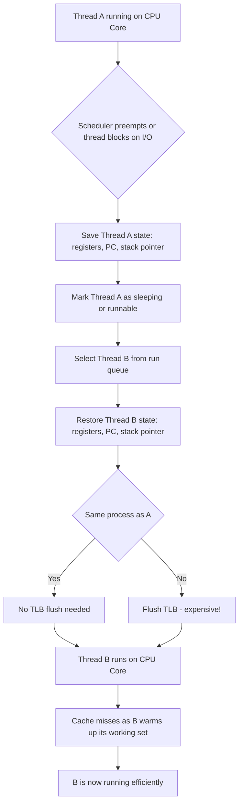

### 3.6 The Thread-per-Request Model

#### Why It Exists

The simplest way to handle many requests concurrently: give each request its own thread. The thread blocks while waiting for the database, the network, or the filesystem. Other threads handle other requests in parallel. This model is intuitive -- you write sequential code, and concurrency comes "for free" from having multiple threads.

#### How It Works

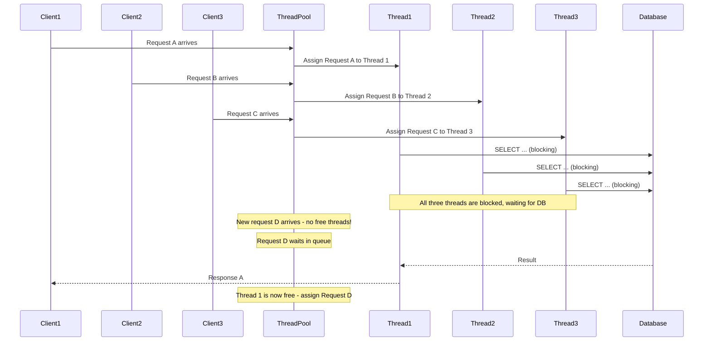

#### The Memory Math

In Java (Tomcat, Spring Boot), each OS thread has a default stack of **1 MB**. Thread pool of 200 threads = 200 MB just for stacks, before any application data.

| Threads | Stack Memory | Notes |
|---|---|---|
| 50 threads | 50 MB | Minimal stack usage |
| 200 threads | 200 MB | Typical Spring Boot default |
| 500 threads | 500 MB | Aggressive sizing |
| 1,000 threads | 1 GB | Stack memory alone is a problem |

A Java service with 500 threads, a 2 GB heap, and JVM overhead (metaspace, code cache, native memory) might use **3-4 GB total**. This is why Java services have large memory requirements.

#### Pros of Thread-per-Request

- **Simple mental model**: Each request has its own stack. Thread dumps clearly show which request is blocked where. Debugging is straightforward.
- **Blocking I/O is fine**: You can use synchronous database drivers, synchronous HTTP clients. The thread handles the blocking. No callback hell.
- **Well-understood by most Java/C# developers**: The programming model matches how most engineers think.

#### Cons of Thread-per-Request

- **Memory**: 1 MB per thread limits concurrency before you run out of RAM.
- **Context switch overhead**: At hundreds of threads, context switching overhead adds up.
- **Max concurrent requests = thread pool size**: If all 200 threads are blocked waiting for a slow database, the 201st request must wait in the queue. Latency grows.
- **Thread creation cost**: Creating and destroying OS threads is expensive. Thread pools mitigate this by reusing threads, but pool sizing is a tuning challenge.

#### The Blocking Cascade

If your thread pool has 200 threads and your database is slow (p99 = 500 ms instead of 10 ms), Little's Law tells you: at 2K QPS, you need 2000 x 0.5 = 1000 concurrent threads. You only have 200. The other 1800 QPS worth of requests queue up. Queue grows. Latency skyrockets. This is how a slow database turns into a "server is down" incident even when the server's CPU and network are fine.

### 3.7 The Event-Loop Model

#### Why It Exists: The C10K Problem

In 1999, Dan Kegel published a paper asking: how do you build a server that handles 10,000 concurrent connections  The thread-per-connection model would require 10,000 threads. At 1 MB each: 10 GB of stack memory. Plus context switching overhead. It was infeasible on 1999 hardware.

The answer was the event loop. Instead of one thread per connection, use one thread for all connections, with non-blocking I/O. When a connection is waiting for data, the thread does not wait -- it moves on to handle other connections. When data arrives, an event fires and the thread handles it.

This is implemented using OS-level mechanisms:
- **`epoll`** (Linux): monitors thousands of file descriptors, notifies when any is ready for reading or writing
- **`kqueue`** (BSD/macOS): similar to epoll
- **`IOCP`** (Windows): completion-based variant

#### How an Event Loop Works

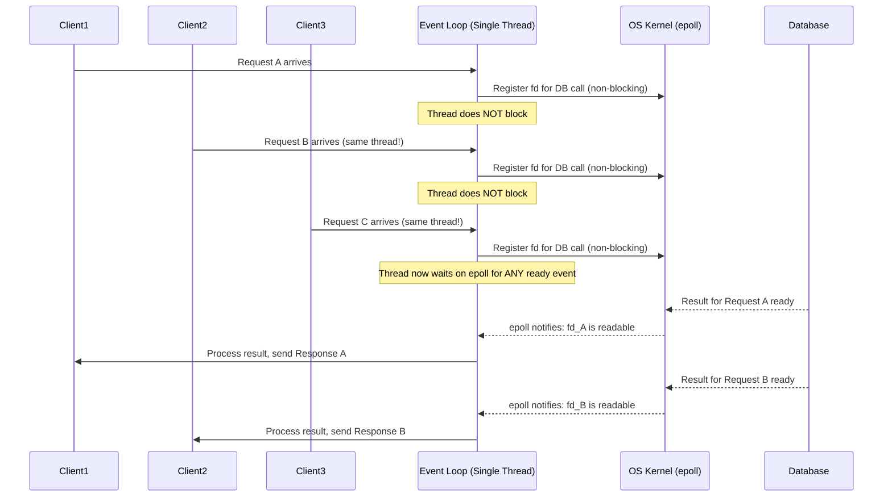

#### Node.js as the Canonical Example

Node.js runs JavaScript on a single thread (the V8 event loop). When your code does:

```javascript
db.query("SELECT * FROM users WHERE id =  ", [userId], (err, rows) => {
    // This callback runs when the DB responds
    response.json(rows[0]);
});
// This line runs IMMEDIATELY, before the DB responds
doSomethingElse();
```

The `db.query` call registers the callback with the event loop and returns immediately. The single thread moves on to handle the next request. When the database responds, the event loop calls the callback. One thread handles 10,000+ concurrent connections this way.

#### The Critical Limitation: CPU Work Blocks Everything

The event loop's Achilles' heel: if you do CPU-heavy work on the event loop thread, you block all other connections.

```javascript
// DANGEROUS: This blocks the event loop for everyone
app.post('/compress', (req, res) => {
    const result = compressLargeFile(req.body); // CPU-intensive, takes 2 seconds
    res.send(result);
    // While compressLargeFile runs, ALL other requests wait
});
```

If `compressLargeFile` takes 2 seconds, every other request that arrives during those 2 seconds is queued. In a thread-per-request model, other threads would handle them. In an event loop, there is only one thread.

**Mitigation**: Offload CPU work to a worker pool (Node.js `worker_threads`), a separate process, or a separate service.

**Real production incident pattern**: A Node.js API service serving 5K QPS suddenly has p99 latency jump from 20ms to 10 seconds. The culprit: a new endpoint that parses a large JSON request body (10K items), which is CPU-intensive. Every request hitting that endpoint blocks the event loop, causing all other requests to queue.

#### Pros and Cons of the Event-Loop Model

| Pros | Cons |
|---|---|
| Handles 10K+ concurrent connections with one thread | CPU work blocks everyone -- must avoid synchronous computation |
| Minimal memory per connection (a few KB for buffers) | Harder to debug -- no single stack per request |
| No context switching overhead between connections | Callback hell (mitigated by async/await) |
| Excellent for I/O-bound workloads | Blocking library calls (sync DB drivers) destroy the benefit |

### 3.8 Goroutines: The Best of Both Worlds

#### What M:N Scheduling Means

Go's goroutines use **M:N scheduling**: M goroutines mapped onto N OS threads (where N is typically equal to GOMAXPROCS, defaulting to the number of CPU cores).

- M goroutines are user-space (not OS-level) -- Go's runtime scheduler manages them
- N OS threads are what the kernel sees and schedules onto CPU cores
- The Go runtime decides which goroutines run on which OS threads

When a goroutine blocks on I/O, the Go runtime does NOT block the underlying OS thread. It moves the goroutine off the thread, parks it, and runs another goroutine on that thread. When the I/O completes, the goroutine is placed back on the run queue.

#### Why Go Uses Less Memory Than Java

This is a question that comes up in Staff-level interviews. The answer requires understanding the stack size difference:

| Runtime | Concurrency Unit | Initial Stack Size | Grows To |
|---|---|---|---|
| Java (pre-Loom) | OS thread | 1 MB | Fixed at creation |
| Go | Goroutine | **2 KB** | Up to 1 GB (grows as needed) |
| Erlang | Process | 300 bytes | Grows as needed |

A Go service with 10,000 active goroutines uses approximately 10,000 x 2 KB = **20 MB** for goroutine stacks. The same Java service with 10,000 OS threads would use 10,000 x 1 MB = **10 GB** for thread stacks alone. That is a 500x difference.

In practice, Go services do not spin up 10,000 threads equivalent to serve the same load as a Java service. But at the same concurrency level, Go's stack footprint is dramatically smaller.

Additional reasons Go uses less RAM than Java:
1. **No JIT compiler warmup overhead** -- Go compiles ahead-of-time. No JVM metaspace, no JIT code cache.
2. **Simpler runtime** -- No JVM overhead. Less baseline memory consumption.
3. **Smaller GC overhead** -- Go's GC is designed for low pause time, not maximum throughput. Less GC bookkeeping overhead per object.
4. **No class metadata** -- JVM keeps metadata per class in metaspace. Go has simpler type information.

**Real production numbers**: A team at Cloudflare migrated a stateless API service from Java (Spring Boot) to Go. The Java service used 4 GB per pod, 8 pods = 32 GB total. The Go service used 512 MB per pod, 4 pods = 2 GB total. Same functionality, same load, 16x less memory. This translates directly to infrastructure cost savings.

#### The Goroutine Lifecycle

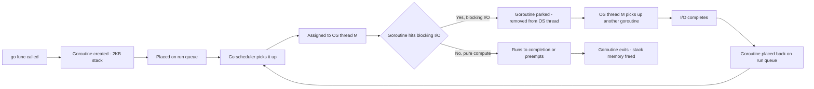

#### When to Choose Goroutines vs Threads vs Event Loop

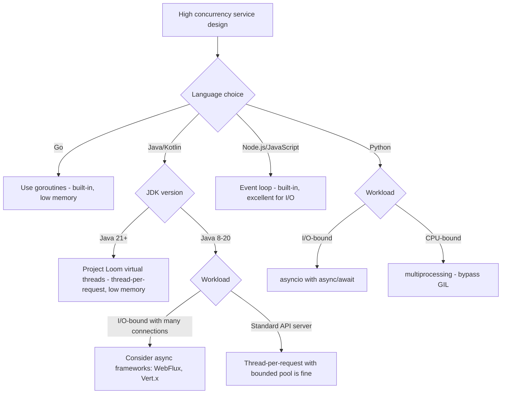

### 3.9 Green Threads, Coroutines, and Async/Await

#### The Spectrum of Lightweight Concurrency

All of these concepts share a common idea: run many logical tasks concurrently without creating one OS thread per task.

| Concept | Language/Runtime | How It Works |
|---|---|---|
| **Goroutines** | Go | M:N scheduling, runtime-managed, preemptive |
| **Green threads** | Old Java, older runtimes | N:1 mapping -- many user-space threads on 1 OS thread |
| **Coroutines** | Kotlin, Lua | Cooperative -- explicitly yield at suspension points |
| **Async/await** | JS, Python, C#, Rust | Syntactic sugar over state machines; runs on thread pool |
| **Virtual threads** | Java 21+ (Loom) | M:N like goroutines, but appear as OS threads to Java code |
| **Fibers** | Various | User-space threads, often cooperative |

#### Async/Await: Under the Hood

When you write:

```python
async def handle_request(request):
    user = await db.fetch_user(request.user_id)    # suspends here
    posts = await db.fetch_posts(user.id)           # suspends here
    return render(user, posts)
```

The Python `async` keyword signals that this function can be suspended. Each `await` point is a potential suspension. The async framework (asyncio) compiles this into a state machine. When the function hits `await db.fetch_user(...)`, it suspends and another coroutine runs on the thread. When the DB responds, the event loop resumes this coroutine.

**The critical requirement**: Everything must be non-blocking. If `db.fetch_user` uses a synchronous driver (blocking I/O), it blocks the entire thread, defeating the purpose. You must use async-compatible libraries throughout.

#### Kotlin Coroutines and Android

Kotlin coroutines are popular in Android development and Ktor (Kotlin server framework). They are structured around **coroutine scopes**, **suspend functions**, and **dispatchers**. The dispatcher determines which thread pool the coroutine runs on (e.g., `Dispatchers.IO` for blocking I/O, `Dispatchers.Default` for CPU work).

**Staff-level insight**: When evaluating frameworks, ask: "Does this framework support virtual threads, coroutines, or async I/O  Can I have N active concurrent requests with far fewer than N OS threads " This determines memory and concurrency scaling characteristics.

### 3.10 The C10K Problem and How It Was Solved

#### The Original Problem (1999)

In 1999, a typical web server using thread-per-connection could handle maybe 1,000 concurrent connections before memory and context switching overhead made it unusable. Handling 10,000 concurrent connections (C10K) seemed impossible.

Calculating why:
- 10,000 threads x 1 MB stack = 10 GB RAM (rare in 1999)
- 10,000 context switches/second x 10  s each = 100 ms/second CPU overhead
- Scheduler overhead for 10,000 runnable threads is itself significant

#### The Solution: Non-Blocking I/O + Event Loops

The key insight: most web server work is **waiting**, not computing. A thread handling an HTTP request spends 90%+ of its time waiting for disk or network. If we could have one thread handle the I/O readiness checking for all connections, and only "wake up" when a connection has data ready, we could serve 10,000 connections from one thread.

This required OS support:
- **`select`** (1983): Can monitor up to 1024 file descriptors. Slow -- O(n) scan each call.
- **`poll`** (1987): Similar to select, no 1024 limit, still O(n).
- **`epoll`** (Linux 2.5.44, 2002): O(1) event notification for ready file descriptors. Scales to millions.
- **`kqueue`** (FreeBSD/macOS, 2000): Similar to epoll.

Nginx was built on top of epoll and could handle **10,000+ concurrent connections with ~2.5 MB of memory**. Apache's thread-per-request model used ~400 MB for the same load.

#### Today: C100K and C1M

Modern systems aim for 100K or 1M concurrent connections. This requires:
- epoll/kqueue-based event loops
- Kernel tuning (`net.core.somaxconn`, file descriptor limits)
- Connection pooling (reuse expensive TCP connections)
- Efficient memory management per connection
- Load balancing across multiple instances

**Staff-level interview question**: "We expect 500K concurrent WebSocket connections for our real-time feature. How do you architect the connection layer "

Answer framing: A single server with a well-tuned event loop (Nginx, Go net/http, Node.js) can handle 50K-100K connections. For 500K, you need 5-10 connection servers behind a load balancer. The load balancer must support connection pinning (each client sticks to one server). Connection server state (subscriptions) must be stored externally (Redis pub/sub, Kafka) for fault tolerance.

### 3.11 Thread Pool Sizing: The Math

#### Little's Law Applied to Thread Pools

**Little's Law** is a fundamental result from queuing theory:

```
L = lambda x W
```

Where:
- **L** = average number of items in the system (concurrent requests in-flight)
- **lambda** = average arrival rate (QPS)
- **W** = average time each item spends in the system (average latency)

For a thread-per-request server: L = lambda x W. Your thread pool must have at least L threads to avoid queueing.

**Example**:
- Target: 3,000 QPS
- Average request latency (including DB wait): 80 ms
- L = 3,000 x 0.08 = 240 concurrent requests

You need at least 240 threads. If your pool has 200, requests start queuing at 3,000 QPS. The queue grows, latency increases, which increases L, which requires even more threads -- a positive feedback loop that cascades into timeout failures.

#### Thread Pool Sizing Rules

**For I/O-bound workloads**:
```
threads ~= target_concurrency x safety_factor
         = (target_QPS x avg_latency_seconds) x 1.5
```

The safety factor of 1.5 gives headroom for latency spikes. If DB latency p99 is 200 ms and p50 is 20 ms, size for something between.

**For CPU-bound workloads**:
```
threads ~= num_CPU_cores x (1 + wait_ratio / compute_ratio)
```

If a task is 50% waiting and 50% computing: threads ~= num_cores x 2. More threads than this just adds context switching without helping throughput.

**Practical rule**: 
- Pure I/O-bound (waiting on network/DB): threads can be 10-50x the number of CPU cores
- Pure CPU-bound: threads ~= number of CPU cores
- Mixed: profile your actual workload

#### Over-Threading: The Hidden Danger

Too many threads is as bad as too few. With 2,000 threads on a 16-core machine:
- Each core must context-switch among 125 threads
- Memory: 2,000 x 1 MB = 2 GB just for stacks
- Scheduler overhead increases
- Lock contention increases (more threads competing for shared data)

**Real production pattern**: An engineer increases the Tomcat max threads from 200 to 2000 to "handle more traffic." Memory usage doubles, CPU usage jumps (context switching), and p99 latency actually gets worse. They revert the change.

### 3.12 Process Isolation, Containers, and Microservices

#### The Logical Chain

Understanding process isolation makes the entire container and microservices narrative clear:

1. **Process isolation** (1960s): Each program gets its own memory space. Crashes are contained.
2. **`chroot` jail** (1979): Change a process's view of the filesystem root. Early process isolation.
3. **Hypervisors/VMs** (1980s+): Full machine isolation. Each VM gets its own OS kernel. Strong isolation, high overhead.
4. **Linux namespaces** (2002+): Isolate processes' views of the system: PID namespace (own PID 1), network namespace (own network interfaces), mount namespace (own filesystem view), user namespace (own user IDs).
5. **cgroups** (2007): Limit and account for CPU, memory, I/O usage per process group.
6. **LXC** (2008): Combines namespaces + cgroups into "Linux containers."
7. **Docker** (2013): Packages application + dependencies into a portable image. Runs as Linux containers. Made containers accessible to developers.
8. **Kubernetes** (2014): Orchestrates many containers across many machines.

**The insight**: A Docker container is essentially a process (or group of processes) with:
- An isolated filesystem view (via mount namespace + union filesystem)
- An isolated network (via network namespace)
- Resource limits (via cgroups)

The process isolation primitive from the 1960s is the foundation of modern containerized deployments.

#### Why Microservices Map to Process Isolation

A monolith runs all components (auth, orders, payments, notifications) as threads in one process. A bug in the notifications module can crash the entire process. You cannot scale just notifications independently -- scaling the monolith scales everything.

Microservices run each component as its own process (container). This gives:
- **Fault isolation**: Notifications service crashes, orders service continues
- **Independent scaling**: Orders service at 10x instances, notifications at 1x
- **Independent deployment**: Update notifications without touching orders
- **Team ownership**: Each team owns their service (Conway's Law)

The cost is real: network hops instead of function calls, serialization overhead, distributed tracing complexity, operational overhead. But the isolation benefits are why large organizations adopt microservices.

---

## 4. Mental Models

### 4.1 The Restaurant Kitchen Model (Extended)

Use this mental model in interviews when someone asks about concurrency:

**Thread-per-request = One chef per customer**

Imagine a restaurant where every customer who walks in is immediately assigned a dedicated personal chef. That chef does nothing but serve that one customer -- waits at their table, walks to the kitchen, waits for the food, brings it back. The advantage: very attentive service. The problem: as soon as you have 200 customers, you need 200 chefs. A restaurant with 200 chefs costs a fortune, and most of them are standing around waiting for the kitchen (the database) at any given moment.

**Event loop = One ma tre d' routing everyone**

Now imagine one ma tre d' taking everyone's orders, routing requests to the kitchen, and delivering food as it comes out -- all without ever waiting. The kitchen (I/O) does its work asynchronously. The ma tre d' stays busy routing, never standing still. One person handles 500 customers. But: if a customer asks the ma tre d' to personally do something that takes 5 minutes (CPU-bound work), all other customers must wait.

**Goroutines = A rotating crew of efficient chefs**

Goroutines are like having a small team of chefs (equal to the number of stove burners -- the number of CPU cores) who serve an unlimited number of customers, but each chef can juggle multiple tasks. When a chef is waiting for an oven timer (I/O), they pick up another task. The chefs never outnumber the burners, so the kitchen doesn't get chaotic. But far more customers are being served than there are chefs.

### 4.2 Memory as a Workspace

Think of RAM as your desk:
- **Registers** = what's in your hand right now (tiny, instant)
- **L1 cache** = the pen and notepad right next to you (tiny, very fast)
- **L2/L3 cache** = the drawers in your desk (small, fast)
- **RAM** = your entire desk surface (medium, accessible)
- **SSD** = the filing cabinet in your office (large, takes time to find stuff)
- **HDD** = the archive room down the hall (huge, slow to walk to)
- **S3/object storage** = offsite storage warehouse (vast, takes a while to ship)

Everything you work on right now must be on your desk. If your desk is too small, you spend your time walking to the filing cabinet. That is exactly what happens when a database's working set exceeds its buffer pool: constant disk reads.

### 4.3 Garbage Collection as Office Cleaning

Imagine your desk (RAM) accumulates papers as you work. Eventually, it gets cluttered. A cleaner comes periodically to remove papers you are done with (unreachable objects). While the cleaner sweeps, you have to pause work (stop-the-world GC pause).

Different GC strategies:
- **Stop-the-world (old Parallel GC)**: Cleaner says "everyone stop, I need to clean everything." Your desk gets perfectly clean, but all work stops for minutes.
- **G1GC**: Cleaner identifies the most cluttered regions and cleans them incrementally, pausing work for shorter intervals.
- **ZGC/Shenandoah**: Cleaner works mostly while you are working, pausing you for only milliseconds.
- **Go GC**: Similar to ZGC -- concurrent, very short pauses.

### 4.4 Disk I/O as Library Lookup

CPU and RAM are like having the book open on your desk. Disk I/O is like the book being in the library:

- **SSD** = a well-organized library where you can find any book in seconds
- **HDD** = a large archive where the librarian must walk through rows of shelves to find your book -- and the shelves are in random order

Sequential disk I/O = asking the librarian to bring you books 1 through 100 in order -- they just walk down one aisle.

Random disk I/O = asking the librarian for book 47, then book 892, then book 3 -- each time they must walk to a different part of the archive.

HDD sequential: fast. HDD random: painfully slow (each random access = the read head must physically move). This is why WAL (Write-Ahead Log) converts random writes into sequential writes.

---

## 5. Real-World Examples

### 5.1 Java vs. Go Memory: A Detailed Breakdown

Let us compare two identical API services serving 2,000 QPS with p99 DB latency of 30 ms.

**Using Little's Law**: concurrent threads needed = 2,000 QPS x 0.030 s = 60 concurrent threads minimum. Size to 100 for safety.

**Java (Spring Boot, traditional) Memory Breakdown**:

| Component | Size | Notes |
|---|---|---|
| 100 OS threads x 1 MB stack | 100 MB | Baseline for thread stacks |
| JVM heap (`-Xmx`) | 2 GB | Heap for application objects |
| JVM metaspace | 200 MB | Class metadata, reflection data |
| JVM code cache | 250 MB | JIT-compiled native code |
| Direct/off-heap buffers | 200 MB | Netty, NIO direct buffers |
| **Total** | **~2.75 GB** | Typical for a medium Spring Boot service |

**Go (net/http) Memory Breakdown**:

| Component | Size | Notes |
|---|---|---|
| 100 goroutines x 2-8 KB stack | ~0.5 MB | Goroutine stacks are tiny initially |
| Go heap | 300 MB | Application objects |
| Go runtime overhead | 50 MB | Runtime structures, GC metadata |
| **Total** | **~350 MB** | ~8x less than Java |

**Why the difference matters**:
- At 16 pods x 2.75 GB (Java) = 44 GB total memory needed
- At 8 pods x 350 MB (Go) = 2.8 GB total memory needed
- On c5.xlarge (4 vCPU, 8 GB RAM) at $0.17/hour: Java needs ~6 instances, Go needs ~1 instance
- Monthly cost difference: 5 instances x 730 hours x $0.17 = ~$620/month, just for this one service

### 5.2 Production OOM Incident: The Java API Service

**Background**: A Java API service (Spring Boot, `-Xmx4g`, 200 Tomcat threads) serves 3K QPS normally. Black Friday traffic ramps to 12K QPS.

**Timeline of the incident**:

1. **T+0 min**: Traffic ramp begins. QPS goes from 3K to 12K over 10 minutes.
2. **T+10 min**: Thread pool exhaustion. DB latency spikes from 20 ms to 400 ms (database under load). Little's Law: 12,000 x 0.4 = 4,800 concurrent threads needed. Thread pool has 200. Requests queue.
3. **T+12 min**: Tomcat's accept queue fills. p99 latency hits 5 seconds. Alerts fire.
4. **T+15 min**: Engineer increases thread count to 800 (emergency config change). Memory usage jumps: 600 new threads x 1 MB = 600 MB. Total memory: 4 GB heap + 800 MB threads + 500 MB overhead = 5.3 GB. Container limit is 5 GB.
5. **T+16 min**: OOMKilled. Container restarts. During restart, load shifts to other pods, which OOMKill in cascade. 100% error rate for 3 minutes.

**Root cause analysis**:
- **Proximate cause**: Adding threads without adjusting memory limits caused OOM.
- **Underlying cause**: Didn't account for DB latency increasing under load. Thread pool was sized for normal-day latency (20 ms), not peak latency (400 ms).
- **System design failure**: No circuit breaker on DB calls. When DB slowed, requests just piled up in the queue.

**Fix**:
1. Size thread pool for worst-case DB latency, not average. At 400 ms DB latency and 5K QPS target (with circuit breaking): 5,000 x 0.4 = 2,000 concurrent -> 2,500 threads. Set container memory limit to accommodate.
2. Add circuit breaker (Resilience4j): if DB error rate > 50%, open circuit and return 503 immediately instead of queueing.
3. Add connection pool timeout: if a thread waits >1 second for a DB connection, fail fast with 503.
4. Set container memory limit = heap + threads x 1 MB + 800 MB overhead, not arbitrary.
5. Load test with simulated DB slowness, not just high QPS.

### 5.3 GC Pause Latency Spikes: The Sawtooth Pattern

**Symptom**: A Java service shows a p99 latency "sawtooth" -- it is 50 ms for several minutes, then spikes to 500 ms for 2-3 seconds, then returns to 50 ms. This repeats every 3-5 minutes.

**Diagnosis**: GC logs show Full GC events every 3-5 minutes, each taking 2-3 seconds. The heap is filling up, triggering a full collection.

**Why this happens with G1GC**: G1GC works in regions. It collects the most garbage-dense regions first (incremental). But if the allocation rate is too high, the regions fill up faster than incremental collection can keep up. G1GC escalates to a "Full GC" -- a stop-the-world collection of the entire heap. All application threads pause.

**GC Tuning Strategy**:

Step 1: Identify allocation rate. GC logs show it. If allocation rate is 2 GB/minute and heap is 4 GB, you get a full GC roughly every 2 minutes (under 50% heap usage trigger).

Step 2: Choose the right collector:
- If pause time matters more than throughput: switch to **ZGC** (Java 15+) or **Shenandoah** (OpenJDK 15+). Both aim for sub-millisecond pauses even on large heaps.
- If throughput matters more: keep Parallel GC or G1GC, increase heap size.

Step 3: Reduce allocation rate. Find what is allocating heavily (async-profiler, Java Flight Recorder). Common culprits: creating new objects in tight loops, large deserialization (parsing JSON into object graphs), string concatenation in loops.

Step 4: Right-size the heap. Rule of thumb: heap should be 2-3x the "live set" (objects that cannot be collected). If live set is 1 GB, heap should be 2-3 GB. Smaller heap = more frequent GC. Larger heap = longer pauses when GC runs.

**The ZGC difference**: ZGC performs most of its work concurrently (while the application is running). Pause times are measured in microseconds, not milliseconds, even for 100 GB heaps. The trade-off: slightly higher CPU overhead (doing GC concurrently consumes CPU that could serve requests) and slightly lower throughput. For latency-sensitive services, this is almost always the right trade.

### 5.4 Redis: Why In-Memory Makes Everything Fast

Redis stores its entire dataset in RAM. Every read and write is a memory operation. At hardware speeds:
- Memory access: ~100 nanoseconds
- Context switch: ~1 microsecond
- Redis overhead per command: ~1-10 microseconds
- Total Redis GET latency (local network): **0.1-1 millisecond**

Compare to a database query that hits disk:
- Random SSD read: ~100 microseconds
- HDD read: ~10 milliseconds
- DB query (with index, cached pages): 1-50 milliseconds

Redis is **10-1000x faster** than a disk-backed database for simple key-value lookups. This is why every caching layer uses Redis or Memcached: the latency difference is the justification.

**The memory constraint**: Redis is limited by RAM. A server with 256 GB RAM is a very large Redis instance. For datasets beyond that, Redis Cluster shards data across multiple servers. Each shard is a Redis instance in RAM.

**Durability trade-off**:
- **No persistence**: Pure speed, data lost on crash. Acceptable for session tokens with short TTL.
- **RDB snapshots**: Periodic snapshot to disk. Data from last snapshot to crash is lost.
- **AOF log**: Every write command appended to a file. Near-zero data loss. Slight write overhead.
- **RDB + AOF**: Both. Good durability with acceptable performance.

**Staff insight**: "Why not use Redis for everything instead of a relational database " 
- Redis is optimized for simple key-value, lists, sets, sorted sets. Complex queries (joins, aggregations) are limited.
- RAM is expensive. Relational databases store data on disk (with RAM caching) -- far cheaper per GB.
- Redis is a cache/session store/message queue complement to a database, not a replacement for structured data.

---

## 6. Mermaid Diagrams

### 6.1 Bottleneck Diagnosis Flowchart

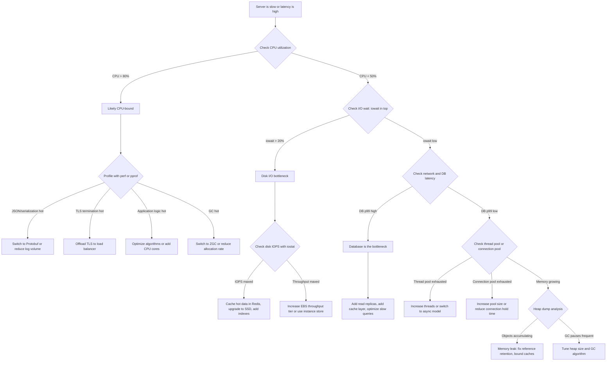

### 6.2 Thread Lifecycle

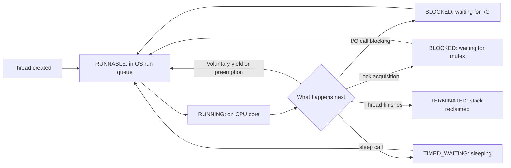

### 6.3 Memory Hierarchy

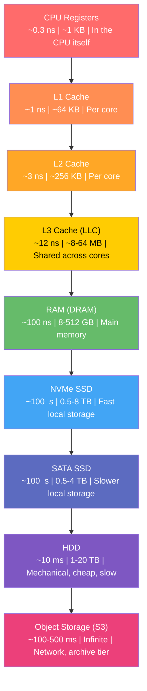

### 6.4 Concurrency Model Comparison

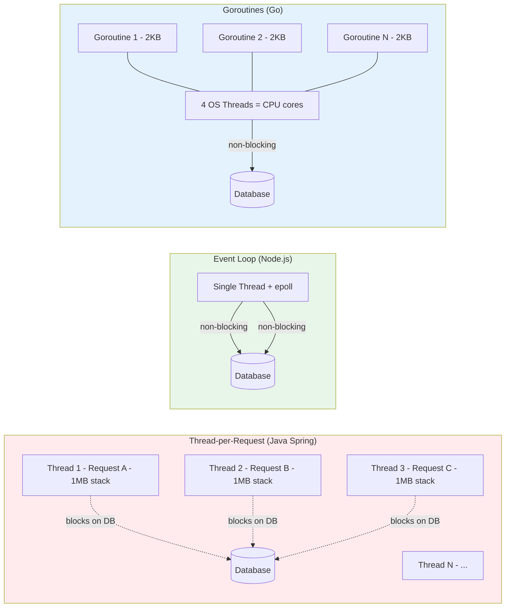

### 6.5 Thread-per-Request vs Event Loop Sequence Diagrams

#### Thread-per-Request Under Slow DB

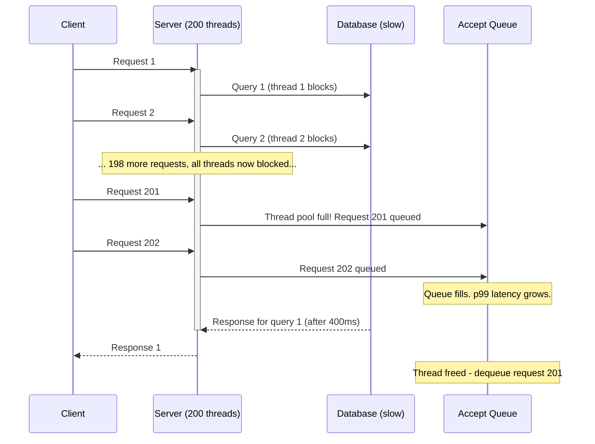

#### Event Loop Under Same Conditions

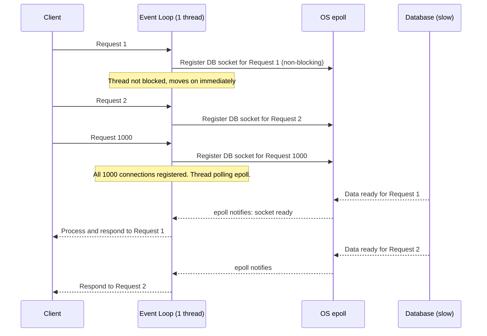

---

## 7. Design Trade-offs

### 7.1 Thread-per-Request vs. Event Loop vs. Goroutines: Full Trade-off Table

| Dimension | Thread-per-Request | Event Loop | Goroutines |
|---|---|---|---|
| **Memory per 10K connections** | ~10 GB (1 MB stacks) | ~100 MB | ~20-50 MB |
| **Max concurrent connections** | Limited by thread stack RAM | Limited by file descriptors and buffers | Limited by heap and goroutine stack |
| **CPU-bound work** | Fine -- thread blocks others' wait time, not their CPU | Blocks everything -- must offload | Fine -- goroutine blocks, others run on other OS threads |
| **Code complexity** | Simple synchronous code | Callback hell or async/await | Simple synchronous code |
| **Debugging** | Easy -- thread dump per request | Hard -- async stack traces are confusing | Medium -- goroutine dump, but harder than threads |
| **Blocking I/O compatibility** | Fine -- thread absorbs it | Must use async libs everywhere | Fine -- Go scheduler handles it |
| **Typical languages** | Java, C#, Ruby (Puma) | Node.js, async Python, Nginx | Go, Erlang, Elixir |
| **Best workload** | Standard I/O-bound APIs | High-concurrency I/O-bound, low CPU | Everything -- general purpose |
| **When it breaks** | High QPS + high DB latency = thread exhaustion | Any synchronous code in the hot path | Goroutine leaks (unbounded goroutine creation) |

### 7.2 GC Trade-offs

| GC Algorithm | Pause Goal | Throughput | Heap Size | When to Use |
|---|---|---|---|---|
| **Serial GC** | Long pauses | Low | Small | Single-core, batch, embedded |
| **Parallel GC (G1's predecessor)** | 100ms-1s | High | Medium | Batch jobs, offline processing |
| **G1GC** | 10-100ms | Good | 6 GB+ | Default for most Java 11+ web services |
| **ZGC (Java 15+)** | <1ms | Slightly lower than G1 | Any (tested to TB) | Latency-sensitive services |
| **Shenandoah** | <1ms | Slightly lower than G1 | Any | Latency-sensitive, OpenJDK |
| **Go GC** | <1ms | Good | Any | Built into Go -- no choice needed |
| **V8 (Node.js)** | Incremental, low | Good | Moderate | Node.js -- no choice needed |

**The ZGC trade-off in detail**: ZGC achieves low pauses by doing almost all work concurrently. This means GC threads are running while your application threads run. At high CPU utilization (>70%), ZGC's concurrent work competes with your application for CPU. You may see slightly lower throughput at peak load compared to G1GC. For most latency-sensitive services (where you have headroom CPU), ZGC is the right choice.

### 7.3 Storage Tier Trade-offs

| Scenario | Recommendation | Rationale |
|---|---|---|
| Primary database (OLTP) | EBS gp3 or io2, or NVMe SSD | Random I/O -- needs IOPS, not just throughput. Persistence required. |
| Read cache (Redis) | EC2 with large RAM | Entire dataset in memory. Instance store for temp data if OK with loss on restart. |
| Logging, analytics | HDD or S3 | Sequential writes, infrequent reads. Cost matters more than speed. |
| ML training data | High-throughput EBS or S3 with local SSD cache | Large sequential reads. Cost vs. speed trade-off. |
| Message queue (Kafka) | SSD (local or EBS) | Sequential write (WAL pattern). High throughput, moderate IOPS. |

### 7.4 Process vs. Thread for Isolation: The Real Trade-off

**Process-per-worker** (Gunicorn, Nginx workers):
- **Pro**: A crash in one worker does not affect others. Memory corruption in Worker 1 cannot corrupt Worker 2. Security isolation (Worker 1 cannot read Worker 2's in-memory secrets).
- **Con**: Inter-worker communication requires IPC (serialization overhead). Cannot share large data structures (e.g., a 10 GB in-memory index) -- each process has its own copy. Startup time is longer.

**Thread-per-request** (Tomcat, Puma threaded):
- **Pro**: Threads share heap. A large in-memory cache is built once and shared. Lower memory overhead.
- **Con**: A bug in one thread can corrupt heap state for all threads. Thread safety issues.

**When the choice matters at Staff level**: Designing a multi-tenant system where one tenant's request processing failure should not affect others. Or: designing a plugin system where plugins are untrusted code. Process isolation is the right tool. For a standard API server with trusted code, threads (or goroutines) are the right choice.

---

## 8. Common Interview Questions (Staff L6 Level)

### Q1: "Your Java service is at 4K QPS and you see periodic p99 latency spikes every 3 minutes. p50 is fine at 30ms. What's the cause and how do you fix it "

**Strong L6 Answer**:

The pattern -- regular spikes with good steady-state -- is the classic GC pause signature. The GC runs periodically (triggered by heap fill-up), pauses the world, then normal latency resumes.

Diagnosis steps:
1. Enable GC logging: `-Xlog:gc*:file=/var/log/gc.log:time,uptime,level,tags` on Java 9+
2. Check pause times. Full GC pauses of 1-5 seconds match this symptom. G1 "Mixed GC" pauses of 50-200ms would also match.
3. Check allocation rate from GC logs (bytes promoted, collection frequency).
4. Confirm correlation: GC pause timestamps match p99 spike timestamps.

Fix options:
1. **Increase heap**: If GC is running too frequently, a larger heap reduces frequency. `-Xmx` from 4g to 8g. But pauses when it does run will be longer.
2. **Switch to ZGC or Shenandoah**: Sub-millisecond pauses, but requires Java 15+ and slightly higher CPU.
3. **Reduce allocation rate**: Use profiler (async-profiler or JFR) to find what is allocating heavily. Common culprit: creating lots of short-lived objects per request.
4. **Tune G1 target pause**: `-XX:MaxGCPauseMillis=200` tells G1 to aim for 200ms max. May not achieve it, but guides collection regionality.

For an SLO of p99 < 100ms, ZGC is the correct answer if you are on Java 15+. For older Java, move to a larger heap + tune G1.

---

### Q2: "We want to handle 1 million concurrent WebSocket connections for a real-time feature. Walk me through the architecture."

**Strong L6 Answer**:

First, establish the scale: 1M concurrent connections, not 1M QPS. These are long-lived connections, mostly idle (waiting for server-push events). This is the C10K problem at C1M scale.

Single server capacity:
- A well-tuned event-loop server (Nginx, Go, Node.js) can handle ~50K-100K concurrent connections per instance (dependent on RAM for socket buffers).
- At ~50K connections/server: 1M / 50K = 20 connection servers.

Architecture:
1. **Load balancer with sticky routing**: L4 load balancer (network level) assigns each client to a connection server. Connection stays on that server. Client reconnects to same server (by IP hash or session token).
2. **Connection servers**: 20-50 Go or Node.js servers running event-loop model (not thread-per-connection). Each handles 20K-50K WebSocket connections. Horizontal scaling.
3. **Fan-out layer**: Events must be pushed to all relevant connections. An event for user 12345 must reach connection server A (where user 12345 is connected). Use Redis pub/sub or Kafka: when an event fires, publish to a topic. All connection servers subscribe and fan out to their connected clients.
4. **Presence tracking**: Need to know which connection server has which user. Redis hash or consistent hashing to route events to correct server.
5. **Reconnection handling**: Clients must reconnect automatically (exponential backoff). When a connection server dies, its 20K clients reconnect, distributed across surviving servers. Thundering herd mitigation: randomize reconnect delay.

Memory estimation per connection server (50K connections):
- Socket buffers: 50K x 32 KB = 1.6 GB
- Go goroutine per connection: 50K x 10 KB = 500 MB
- Application state per connection: 50K x 2 KB = 100 MB
- Total: ~2.5 GB per server -> 4 GB instance

---

### Q3: "Explain why a Go service typically uses less RAM than an equivalent Java service. Give actual numbers."

**Strong L6 Answer** (see Section 5.1 for full breakdown):

Three main factors:

1. **Stack size per concurrency unit**: Java OS thread = 1 MB default. Go goroutine = 2 KB initial. At 200 concurrent workers: Java uses 200 MB for stacks alone, Go uses 0.4 MB. At 10,000 workers: Java uses 10 GB, Go uses 20 MB.

2. **Runtime overhead**: JVM requires metaspace (class metadata, ~100-500 MB), JIT-compiled code cache (~100-250 MB), JVM infrastructure. Go's runtime is leaner -- no JIT, no metaspace, simpler GC metadata. Baseline overhead: JVM ~500 MB+, Go ~50 MB.

3. **GC overhead**: JVM's GC requires extra heap headroom to function efficiently. G1GC recommends heap be 2-3x the live set. Go's GC is also concurrent but lighter on overhead.

Real numbers: A stateless API serving 2K QPS:
- Java (Spring Boot): 2 GB heap + 200 MB stacks + 500 MB JVM overhead = ~3 GB
- Go: 300 MB heap + ~5 MB goroutines + 50 MB runtime = ~360 MB

---

### Q4: "A Node.js service is at 1K QPS but suddenly p99 jumps to 10 seconds. CPU is at 90%. What happened "

**Strong L6 Answer**:

CPU at 90% on a Node.js event-loop service means CPU-bound work on the event loop thread. Node.js is single-threaded for JavaScript execution. If something blocks the event loop, all other requests queue.

Diagnose:
1. `perf` or `node --prof` to get a CPU profile. Look for hot synchronous functions.
2. Check recent deployments -- did someone add a new endpoint or middleware 
3. Check for large request bodies being parsed synchronously.

Common causes:
- **JSON parsing of large payloads**: `JSON.parse()` on a 1 MB response body is synchronous and blocks the event loop for milliseconds.
- **Regex with catastrophic backtracking**: A poorly written regex on input data can consume seconds of CPU.
- **Crypto operations**: `bcrypt.hashSync()` (synchronous!) on every login request.
- **Image manipulation without worker threads**: `sharp` is native (C++), but if called on the main thread, it blocks.

Fix:
- Move CPU-heavy operations to `worker_threads` (Node.js 11+)
- For crypto: always use the async variants (`bcrypt.hash()`, not `bcrypt.hashSync()`)
- For large JSON: stream parsing, or offload to a worker
- If the service fundamentally needs CPU, switch to a multi-threaded model (Go, Java) or add multiple Node.js processes (cluster module)

---

### Q5: "Explain what happens during a Full GC in Java, and how it manifests in production metrics."

**Strong L6 Answer**:

**What happens**:
1. JVM triggers a Full GC when the heap is too full for incremental collection (G1's "Mixed GC" failed to keep up), or when explicitly triggered, or when Old Gen is exhausted.
2. All application threads are stopped -- stop-the-world. This is the pause.
3. GC threads traverse the entire heap -- from GC roots (stack variables, static fields, JNI references) through all reachable objects.
4. Unreachable objects are marked as dead.
5. Living objects may be compacted (moved together to remove fragmentation). Compaction is expensive: moving objects means updating all references to those objects.
6. Application threads resume.

**Duration**: Proportional to live heap size. A 4 GB heap with 2 GB live objects might take 2-5 seconds for a Full GC.

**Production manifestation**:
- `p99` or `p999` latency spikes at regular intervals (GC frequency)
- `p50` is unaffected (most requests complete between GC events)
- All in-flight requests during the GC pause exceed the pause duration in their latency
- GC logs show: `[GC pause (G1 Evacuation Pause) Full ... 3.2 secs]`
- Metrics: GC pause duration counter spikes; GC count increases; thread state shows "waiting for GC"
- In distributed traces: requests that happened to be in-flight during GC show a blank gap of 3 seconds

**Staff insight for design interviews**: When designing a latency-sensitive service (p99 < 100ms SLO), if you are using Java, you must either use ZGC/Shenandoah or account for GC in your SLO budget. Some teams maintain a "GC pause budget": if GC pauses take X ms, and our SLO is Y ms p99, we have Y-X ms for actual request processing.

---

### Q6: "How does WAL (Write-Ahead Log) work and why does it allow fast writes even on HDD "

**Strong L6 Answer**:

**The problem WAL solves**: B-tree updates require random writes. If you insert a row, the database must update multiple B-tree nodes (in arbitrary disk locations). On HDD, each random write requires a seek (10 ms mechanical seek + rotational delay). 100 random writes = 1 second. This is too slow for a transactional database.

**How WAL works**:
1. Before modifying any data page, append the change to the WAL file (a sequential log).
2. The WAL is written sequentially -- no seeking. Just stream bytes to end of file.
3. After the WAL entry is durably written (fsynced), the transaction is committed. The actual data page modification can happen lazily.
4. On crash: replay the WAL from the last checkpoint. All uncommitted transactions are rolled back; all committed transactions are re-applied.

**Why sequential writes are fast on HDD**:
- Random HDD write: seek time (~5 ms) + rotational delay (~5 ms) + transfer time (~0.1 ms) = ~10 ms per operation
- Sequential HDD write: no seek, no rotational delay, just stream = ~200 MB/s -> 0.1 ms per 4 KB write

**The math**: Writing a 1 MB WAL entry sequentially: 1 MB / 200 MB/s = 5 ms. Writing the same 1 MB as 256 random 4 KB operations: 256 x 10 ms = 2,560 ms. Sequential is **512x faster** for this example on HDD.

**On SSD**: The benefit is smaller but still real. SSD random write: ~100  s. SSD sequential write: ~200  s per 4KB (write amplification). Sequential is still ~2x faster per operation, and more importantly, sequential writes avoid SSD write amplification (flash page remapping), extending SSD lifespan.

**WAL in practice**: PostgreSQL WAL, MySQL InnoDB redo log, Kafka's log-structured storage, RocksDB, Cassandra's commitlog -- all use this pattern. It is the foundational reason log-structured systems can sustain high write throughput.

---

### Q7: "What is CPU throttling in containers, and how does it cause high latency despite low CPU utilization "

**Strong L6 Answer**:

**The paradox**: A container shows 20% CPU utilization in metrics, but p99 latency is 500ms (should be 50ms). The CPU seems fine. The actual problem: **CPU throttling** from cgroup CPU limits.

**How cgroup CPU quotas work**:
- Kubernetes sets `cpu_limit = 500m` (500 millicores = 0.5 CPU cores)
- The Linux cgroup mechanism gives the container 50% of one CPU core per 100ms period
- Specifically: in each 100ms window, the container's processes can use at most 50ms of CPU time
- If the container uses its 50ms quota early (a burst of computation), it is **throttled** for the rest of the 100ms window -- the kernel literally stops scheduling its threads onto CPUs

**Why this appears as low CPU utilization**: The metric your monitoring system reports is CPU usage / allocated CPU. If allocated is 500m and you use 500m, utilization = 100%. But if you burst to 2000m for 25ms, get throttled for 75ms, burst again -- your average utilization might show 50%, but you experience 75ms stalls every 100ms.

**How to detect throttling**:
```
# Look for: container_cpu_cfs_throttled_seconds_total
# High throttling ratio = (throttled_time / total_time) x 100
```

**Fix**:
1. Increase the CPU limit: if your service needs bursts above 500m, set limit to 2000m
2. Use CPU requests + limits with headroom: set request = 500m, limit = 2000m
3. Use HorizontalPodAutoscaler on CPU utilization to add pods before throttling
4. For Java: `-XX:+UseContainerSupport` ensures the JVM respects container CPU limits for GC thread counts and ForkJoinPool sizes

---

### Q8: "A customer reports that their database queries are slow (p99 = 5 seconds) but the CPU is at 10% and the database has 64 GB RAM. What are you checking "

**Strong L6 Answer**:

Low CPU, high latency, plenty of RAM -> classic disk I/O or lock contention problem.

**Diagnostic steps**:

1. **`iostat -x 1`**: Check disk IOPS, throughput, and `%util` (disk utilization). If `%util` is near 100% or `await` (average I/O wait time) is high, disk is the bottleneck.

2. **Buffer pool hit rate**: `SHOW STATUS LIKE 'Innodb_buffer_pool_read_requests'` vs `Innodb_buffer_pool_reads`. If hit rate < 99%, many queries are missing the buffer pool and hitting disk. Despite 64 GB RAM, if the working set is larger or buffer pool is misconfigured, pages may be going to disk.

3. **IOPS check**: If the database is on an EBS gp2 volume sized at 100 GB, it gets 300 IOPS. At 300 IOPS x 16 KB page = 4.8 MB/s. A busy OLTP database needs 3,000-50,000 IOPS. The disk is at its IOPS limit, not CPU limit.

4. **Lock contention**: `SHOW ENGINE INNODB STATUS` -- look for lock waits. Slow queries due to row-level locks waiting for other transactions.

5. **Slow query log**: `EXPLAIN` on the slow queries. Full table scan without index  Using a non-selective index 

**Likely answers**:
- **Undersized EBS**: 100 GB gp2 volume = 300 IOPS. Upgrade to gp3 with provisioned IOPS, or io2 for high IOPS needs.
- **Cold buffer pool**: After a restart, buffer pool is empty. Queries hit disk until it warms up. Fix: pre-warm by querying hot tables at startup, or use `innodb_buffer_pool_dump_at_shutdown` to persist and reload the buffer pool.
- **Missing index**: A slow query causing a full table scan. Fix: add the index.
- **Lock contention**: Long-running transactions blocking others. Fix: optimize transaction scope, add timeouts.

---

### Q9: "How would you design the memory allocation for a Java service that must handle 10K concurrent requests on a machine with 32 GB RAM "

**Strong L6 Answer**:

This is a capacity planning question. Work through each component:

**Thread pool sizing (for 10K concurrent)**:
- 10K concurrent requests on a traditional thread model = 10,000 OS threads x 1 MB stack = **10 GB just for stacks**. Not feasible on 32 GB.
- Options:
  a) Project Loom (Java 21+ virtual threads): virtual threads use ~1 KB stack. 10K virtual threads ~= 10 MB. Backed by a small carrier thread pool (e.g., 32 threads = 32 MB stacks). This is the modern answer.
  b) Reactive/async (WebFlux, Vert.x): event loop model, few OS threads, non-blocking everywhere.
  c) Multiple smaller instances: 10 instances each handling 1K concurrent, 16 threads each, with smaller footprint.

**Memory allocation for Option A (virtual threads, Java 21)**:
- Carrier thread pool: 32 threads x 1 MB = 32 MB
- 10K virtual threads x ~1 KB active stack = ~10 MB
- Heap: depends on per-request allocation. At 10K concurrent, 64 KB per request = 640 MB active request memory. Set `-Xmx` to 3-4x live set = 2-3 GB.
- JVM overhead: metaspace (~200 MB), code cache (~200 MB), misc JVM structures (~200 MB)
- Connection pool buffers: 32 KB x 1K DB connections = 32 MB
- Application cache: 2-4 GB (most valuable use of remaining RAM)
- **Total**: ~3 GB JVM + 3 GB cache + 1 GB OS + headroom = ~8 GB

This leaves 24 GB available. That RAM can be used for:
- A larger application cache (in-process Caffeine/Guava cache for hot data)
- Running multiple JVM instances on the same machine
- OS page cache benefiting the JVM's memory-mapped files

**Key insight**: Without virtual threads, 10K concurrent Java requests requires either reactive frameworks (complex code) or horizontal scaling (10 instances x 1K concurrency each). Java 21 virtual threads fundamentally change this equation, aligning Java's capability with Go's goroutines.

---

### Q10: "Explain Little's Law and how you'd use it to size a thread pool for a production service."

**Strong L6 Answer**:

**Little's Law**: L = lambda x W

- L = average number of items in the system simultaneously (concurrent requests in-flight)
- lambda (lambda) = average arrival rate (requests per second = QPS)
- W = average time each item spends in the system (average latency in seconds)

**Intuition**: If 100 customers arrive per hour at a restaurant, and each stays for 1 hour on average, there are 100 customers in the restaurant at any given time. If service gets slower (W increases) but arrival rate stays the same (lambda unchanged), the restaurant fills up (L increases).

**Applying to thread pool sizing**:

Given:
- Target QPS: lambda = 5,000 requests/second
- Average request latency: W = 0.060 seconds (60 ms, dominated by DB at 50 ms p50)
- L = 5,000 x 0.060 = 300 concurrent requests in-flight

Thread pool must have at least 300 threads to serve these requests without queueing. Size to 400 for safety margin (latency variability, burst).

**The trap**: Sizing for p50 latency, not p99. If DB p99 is 500 ms:
- L at p99 spike = 5,000 x 0.500 = 2,500 concurrent
- With only 400 threads, at p99 DB latency 2,100 requests queue
- Queued requests stack up, latency grows further (positive feedback)
- System enters "death spiral" -- increasing queue depth increases latency, which increases concurrency needed, which increases queue

**Mitigation**: Apply timeout to thread pool wait. If a thread does not become available within 200ms, return 503. This sheds load gracefully rather than letting the queue grow unboundedly. Set max queue depth = 2x thread pool size.

**Staff-level nuance**: Little's Law assumes a steady-state system in equilibrium. During traffic ramps, the transient behavior can exceed steady-state estimates. Add a 50% safety factor for real production sizing.

---

### Q11: "Your service memory is growing by 100 MB per hour and will OOM in 8 hours. How do you diagnose and fix it without a restart "

**Strong L6 Answer**:

This is a memory leak detection scenario. The 100 MB/hour growth confirms a leak -- if objects were being properly collected, growth would plateau.

**Immediate triage (without restart)**:

1. **Take a heap dump**: `jcmd <pid> GC.heap_dump /tmp/heap.hprof`. This snapshots all objects currently on the heap without stopping the service long-term (pause is 1-10 seconds depending on heap size).

2. **Force GC to distinguish leak from garbage**: `jcmd <pid> GC.run`. If memory drops significantly after GC, the growth is garbage accumulation (high allocation rate) rather than a true leak. If memory barely drops, it is a true leak (objects are reachable and cannot be collected).

3. **Analyze heap dump with Eclipse MAT**:
   - Run "Leak Suspects Report" -- MAT automatically identifies classes with suspicious retained heap
   - Look for: growing `HashMap`, `ArrayList`, `byte[]` with large retained sizes
   - Use "Dominator Tree" to find what holds the most retained memory
   - Check "GC Roots -> inspect path to GC root" to find what is holding the leak alive

**Common culprits**:
- **Unbounded cache**: A `HashMap<String, List<Event>>` accumulating data without eviction. Fix: switch to `Caffeine` or `Guava Cache` with `maximumSize` and TTL.
- **Event listener not removed**: An event bus subscriber added per request but never removed. Over time, thousands of subscribers accumulate. Fix: use weak references, or ensure cleanup in finally blocks.
- **Thread-local variables**: `ThreadLocal<SomeObject>` accumulated per-thread, not cleaned. Fix: call `remove()` in request-end hooks.
- **ClassLoader leak**: Common in hot-reloading scenarios (Tomcat `webapps` reload). The old ClassLoader cannot be GC'd because a static variable holds a reference to a class from the old ClassLoader. Fix: properly clear static references on hot reload.

**Without a restart**: Once identified, if the leak is in application code, you may be able to deploy a hot patch (if your runtime supports it) or drain connections from this instance while adding a new one. If it is a third-party library or requires a restart, deploy new instances, then kill old ones (rolling restart).

---

### Q12: "Compare Redis and a relational database for session storage. When would you use each "

**Strong L6 Answer** (connecting OS fundamentals to design):

**Redis for session storage**:
- All data in RAM: session reads at ~100  s vs 10-50 ms for DB
- O(1) key-value lookup: session lookup is just `GET session:{token}`
- Built-in TTL: Redis expires keys automatically (`SETEX session:{token} 3600 {...}`)
- Horizontal scaling: Redis Cluster shards by key
- At 100K sessions x 4 KB each = 400 MB -- easily fits in a medium Redis instance

**Relational DB for session storage**:
- Persistent (survives Redis restart). Redis data is lost on restart unless persistence is configured.
- Complex queries: "find all sessions for user X" is easy with SQL
- ACID transactions: update session + other records atomically
- Cost: shared infrastructure with other data. No additional Redis to manage.

**When to use Redis for sessions**:
- Any service above ~1K QPS where session lookup is in the critical path
- Need TTL-based automatic expiration
- Session data is ephemeral (losing it just forces re-login)
- Sub-millisecond session lookup matters for overall p99

**When to use the relational DB for sessions**:
- Low traffic (< 100 QPS) -- DB performance is fine
- Need session data in complex queries with other tables
- No Redis infrastructure available / want to minimize components
- Session data must survive Redis restarts and you cannot afford Redis persistence overhead

**Staff-level answer for design interviews**: "We use Redis for session storage because it is the hot path -- every authenticated API call checks the session token. At 50K QPS, that's 50K Redis GETs per second. Redis handles this at sub-millisecond latency. The relational database would saturate under this load, even with good indexing. We accept that Redis data is semi-volatile -- losing sessions forces re-login, which is acceptable for our UX requirements. For anything that must be durable (user profiles, order history), we use PostgreSQL."

---

## 9. Key Takeaways

### The Four Pillars -- One Sentence Each

1. **Process/Thread**: A process is an isolated container; a thread is a worker inside that container sharing the heap -- the concurrency model you choose determines how many requests one server can handle and how much memory it costs.

2. **Memory (RAM)**: RAM is ~1000x faster than SSD; everything hot must live in it -- GC pauses, heap size, and memory leaks are the most common causes of Java service latency spikes.

3. **CPU**: Most API servers are I/O-bound (the CPU is idle, waiting for DB/network) -- profile before adding CPU, because the bottleneck is almost always somewhere else.

4. **Disk I/O**: Sequential writes are hundreds of times faster than random writes on HDD -- WAL, log-structured storage, and caching exist to exploit this gap.

### The Numbers That Matter

Memorize these for back-of-envelope calculations in interviews:

| Fact | Number | Use |
|---|---|---|
| RAM access latency | ~100 ns | Justify caching decisions |
| SSD random access latency | ~100  s | 1,000x slower than RAM |
| HDD random access latency | ~10 ms | 100,000x slower than RAM |
| Context switch cost | ~1-10  s | Justify limiting thread count |
| Java thread stack default | 1 MB | Memory budget per thread |
| Go goroutine initial stack | 2 KB | 500x smaller than Java thread |
| Redis GET latency (local) | 0.1-1 ms | Justify using Redis over DB for hot lookups |
| DB query latency (indexed, warm) | 1-50 ms | Little's Law calculations |
| GC Full pause (Java G1) | 100ms-3s | p99 latency impact calculation |
| GC pause (ZGC/Go) | <1 ms | When to choose Go or ZGC |

### L5 vs. L6 Thinking: The Complete Comparison

| Situation | L5 Answer | L6 Answer |
|---|---|---|
| "Service is slow, what do you do " | "Add more instances" | "Profile first. Is CPU > 80%  No -> I/O-bound. Check DB latency, cache hit rate, thread pool exhaustion." |
| "How many threads " | "200, it's the default" | "L = lambda x W = 3K QPS x 0.05s = 150 concurrent. I set 200 + 50% safety margin = 300 threads, sized heap for 300 threads x 1MB + 2GB heap = 2.3 GB." |
| "Java service uses a lot of memory" | "Give it more RAM" | "4 GB = 500 threads x 1MB stacks + 2 GB heap + 500 MB JVM overhead. Do I need 500 threads  L = lambdaW gives me 150. I can shrink to 200 threads, reduce container to 2.5 GB, and save 30% cost." |
| "Periodic p99 spikes" | "Scale up" | "Sawtooth pattern at 3-minute intervals = GC pauses. Enable GC logging, verify. Switch to ZGC if on Java 15+. Otherwise tune heap to reduce Full GC frequency." |
| "Database is slow" | "Add more DB servers" | "Check CPU, IOPS, buffer pool hit rate first. If IOPS-bound, upgrade EBS tier. If cache miss rate is high, add Redis. If slow queries, add indexes. Only scale DB if after all optimization it is still the bottleneck." |
| "How does Redis achieve sub-ms latency " | "It's in memory, so it's fast" | "RAM access is ~100 ns. Redis command overhead is ~1-10  s. Network adds ~100  s for a same-DC call. Total ~200  s. Compare to DB: index lookup + disk page read = 1-50 ms. 100x difference." |
| "Go vs Java for new service " | "Java has more libraries" | "For a stateless API service with high concurrent connections: Go uses ~8x less RAM (2KB goroutine vs 1MB thread), has sub-ms GC, and compiles to a single binary. If team expertise and library ecosystem favor Java, use virtual threads (Java 21) for comparable memory efficiency." |

### The "Server Is Slow" Decision Tree (Memorize This)

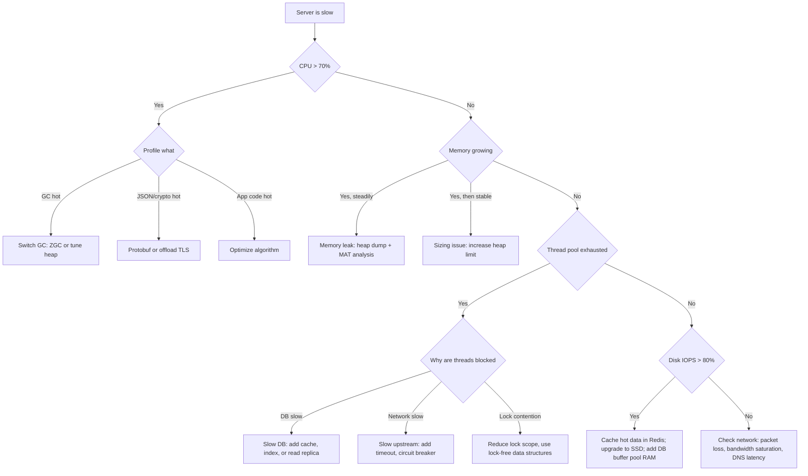

---

## Appendix A: Quick Reference Numbers

### Latency Ladder

| Operation | Latency | Notes |
|---|---|---|
| CPU register | 0.3 ns | 1 cycle at 3 GHz |
| L1 cache hit | 1 ns | ~3 cycles |
| L2 cache hit | 3 ns | ~9 cycles |
| L3 cache hit | 12 ns | ~30 cycles |
| RAM access | 100 ns | Main memory |
| NVMe SSD read | 100  s | 1,000x slower than RAM |
| SATA SSD read | 100  s | Similar to NVMe for small I/O |
| HDD random read | 10 ms | 100,000x slower than RAM |
| Same-DC network RTT | 0.5 ms | Within one data center |
| Cross-region network RTT | 100 ms | US East <-> US West |
| S3 first-byte latency | 100-500 ms | Object storage over network |

### Memory Sizing Cheat Sheet

| Component | Size |
|---|---|
| Java OS thread stack | 1 MB default (`-Xss` to change) |
| Go goroutine initial stack | 2 KB (grows as needed) |
| Kotlin coroutine | ~few KB |
| TCP socket kernel buffer | 4-64 KB per connection |
| HTTP/1.1 connection buffer | ~8-32 KB |
| PostgreSQL `shared_buffers` | 25% of RAM (rule of thumb) |
| Redis per-key overhead | ~50-100 bytes metadata + value size |
| JVM metaspace | 100-500 MB typical |
| JVM JIT code cache | 100-250 MB typical |

### Disk IOPS Reference

| Storage | Random Read IOPS | Sequential Throughput |
|---|---|---|
| HDD (7200 RPM) | 100-200 | 100-200 MB/s |
| SATA SSD | 50,000-100,000 | 500 MB/s |
| NVMe SSD (local) | 200,000-1,000,000 | 1-7 GB/s |
| EBS gp3 (AWS) | 3,000-16,000 | 125-1,000 MB/s |
| EBS io2 (AWS) | up to 256,000 | up to 4,000 MB/s |
| Instance store (NVMe) | 100,000-1,000,000+ | 1-10 GB/s |

### Concurrency Model Memory at Scale

| Model | Memory for 10K concurrent connections |
|---|---|
| Java OS threads | ~10 GB (stacks alone) |
| Java virtual threads (Loom) | ~10 MB (micro-stacks on carrier threads) |
| Go goroutines | ~20-50 MB |
| Node.js event loop | ~100-200 MB (buffers per connection) |
| Nginx (epoll) | ~10-30 MB |

---

## Appendix B: Exercises

### Exercise 1: Diagnose CPU Steal

Your service is experiencing intermittent p99 latency spikes every 90 seconds. CPU utilization shows 40% user, 5% system, and **30% CPU steal** (the `%st` field in `top`).

1. What does "CPU steal" mean  Who is stealing CPU time from whom 
2. Why would CPU steal cause intermittent spikes rather than sustained high latency 
3. What are your three immediate mitigation options  Evaluate each by: time to implement, cost, and risk.
4. You move to a dedicated host (no neighbors). CPU steal drops to 0%. Does this fix all latency spikes  What else might cause 90-second periodic spikes in a JVM service 
5. Design a production alert for CPU steal. What threshold (e.g., >10% for >5 minutes), what action does it trigger, and what is the runbook 

**Hints**:
- CPU steal is specific to virtualized environments. The hypervisor is giving your VM's CPU time to another tenant.
- Dedicated instances (bare metal, dedicated host) or moving to a less noisy neighbor environment fixes it.
- 90-second periodicity in a JVM service is suspicious -- JVM has multiple scheduled tasks (GC, JIT compilation, JMX polling).

---

### Exercise 2: Thread Pool Sizing for Mixed Workloads

You are designing a thread pool for a Java service handling two request types:
- **Type A** (70% of traffic): DB queries, ~50 ms average blocking I/O
- **Type B** (30% of traffic): In-memory computation, ~10 ms CPU, no I/O

Total QPS: 2,000. Available CPU cores: 8.

1. Apply Little's Law (`L = lambdaW`): for Type A at 1,400 QPS with 50 ms latency, what is the minimum thread count to avoid queuing 
2. For Type B at 600 QPS with 10 ms processing, how many threads do you need 
3. Single pool or two separate pools  What is the failure mode of a single pool when Type A requests spike 
4. Your pool uses an unbounded queue. At 3x traffic (6,000 QPS), what happens to queue depth, heap memory, and p99 latency 
5. Redesign with a bounded queue and rejection policy. What should the rejection policy be for each request type  What HTTP status code do you return when the pool is exhausted 

**Model answers**:
1. Type A: 1,400 x 0.050 = 70 concurrent. Minimum 70 threads. Size to 100.
2. Type B: 600 x 0.010 = 6 concurrent. But Type B is CPU-bound. With 8 cores, maximum useful CPU threads = 8. Type B actually limits at 8 threads x 100ms CPU time = 800 CPU-ms/second / 10ms each = 80 requests/second with 8 threads. At 600 QPS, you need more CPU. Type B is the CPU bottleneck.
3. Separate pools prevent Type A exhaustion from blocking Type B (and vice versa). Single pool: if DB is slow (Type A takes 500ms), all threads fill up with Type A, Type B waits.
4. At 6K QPS, unbounded queue fills at 4K QPS x 0.5s = 2,000 items depth. Each queued HTTP request holds request/response buffers (~32 KB). 2,000 items x 32 KB = 64 MB added to heap. p99 = queue wait time (grows linearly with queue depth) + processing time.
5. Bounded queue of 2x thread pool size. Rejection: Type A -> 503 Service Unavailable (client can retry). Type B -> 503 with `Retry-After: 1` header. Never queue requests indefinitely.

---

### Exercise 3: JVM OOM Investigation

Your Java service is OOMKilled every 2-4 hours. Heap is `-Xmx4g`. Pod memory limit: 5 GB.

1. What are the four most likely causes of JVM OOM at 80% heap 
2. A heap dump (captured via `-XX:+HeapDumpOnOutOfMemoryError`) shows 60% of live objects are `byte[]`, retained by a Netty ByteBuf pool. What does this indicate  How do you fix it 
3. GC logs show Full GC every 5 minutes, taking 3 seconds each. Your SLO is p99 < 200 ms. Which GC algorithm change would you evaluate (G1 -> ZGC)  What are the trade-offs in terms of throughput vs pause time 
4. After fixing the heap leak, you are still OOMKilled. `jcmd <pid> VM.native_memory` shows: heap=4 GB, threads=500 MB, metaspace=200 MB, code cache=150 MB. Pod limit is 5 GB. What is over the limit  What do you cut 
5. Your service runs in Docker/Kubernetes. Without `-XX:+UseContainerSupport`, JVM reads the host machine's total RAM (128 GB) and sets `-Xmx` to 30 GB. What happens to the container  How does `-XX:+UseContainerSupport` fix this 

**Model answers**:
1. (a) Application-level memory leak (objects held in cache without eviction), (b) excessive thread count (stacks consuming non-heap memory), (c) Metaspace leak (class loading without unloading in dynamic environments), (d) off-heap/direct buffer leak (Netty, NIO).
2. Netty ByteBuf pool is not being released after use. Objects are ref-counted; if `release()` is not called, buffers accumulate. Fix: ensure `ReferenceCountUtil.release()` or `buf.release()` is called in all code paths, including error paths. Use `ResourceLeakDetector.setLevel(PARANOID)` in test environments to trace leaks.
3. G1 -> ZGC: ZGC achieves <1ms pauses vs G1's 100ms-3s Full GC. Trade-off: ZGC uses more CPU (concurrent GC work) and may have slightly lower maximum throughput. For p99 < 200ms SLO, ZGC's sub-ms pauses make the SLO achievable; G1's 3-second Full GC makes it impossible.
4. Heap (4 GB) + threads (500 MB) + metaspace (200 MB) + code cache (150 MB) = 4.85 GB. Pod limit 5 GB. Operating system overhead (~100-200 MB) pushes it over. Cut: (a) reduce `-Xmx` to 3.5 GB (leaves 1.5 GB for non-heap); (b) reduce thread pool to cut thread stack memory.
5. Without container support, JVM sees 128 GB host RAM, sets heap to ~30 GB. The container limit is, say, 5 GB. The JVM allocates 30 GB of heap -- far more than the container's memory limit. OOMKill occurs when heap usage exceeds the cgroup memory limit. `-XX:+UseContainerSupport` (default on JDK 11+) makes the JVM read cgroup limits (not host RAM) and set heap accordingly: typically `-Xmx = 0.25 x container_limit`.

---

### Exercise 4: Design a Proxy Service Thread Model

You are building a reverse proxy (like Nginx) forwarding requests to 500 upstream backends.
- Each upstream call: ~20 ms network I/O, negligible CPU
- Target: 50,000 QPS, 16 CPU cores available

1. Thread-per-request model: how many threads would you need  What is the memory cost (assume 1 MB stack per thread) 
2. Event-loop model (epoll): how many threads  Why is this sufficient for I/O-bound work 
3. A single event-loop thread is processing a request when a malicious client sends a 100 MB request body. How does this affect all other clients sharing the event loop  What is the mitigation 
4. You have 500 upstreams. How many connections per upstream in your connection pool  What factors determine this number 
5. One upstream degrades to p99 = 2 seconds. Without circuit breaking, describe the cascade: connection pool exhaustion -> thread/event queue buildup -> impact on healthy upstreams.

**Model answers**:
1. Little's Law: L = 50,000 x 0.020 = 1,000 concurrent threads. Memory: 1,000 x 1 MB = 1 GB for stacks. Plus heap. Feasible but heavy.
2. Event loop: 16 threads (one per CPU core). The 16 threads use epoll to monitor all sockets. When any socket is ready, that thread processes it. No blocking -> no more threads needed. All 50K concurrent connections are just file descriptors being watched by epoll.
3. Reading 100 MB synchronously on the event loop blocks all other connections for the duration (100 MB / 1 Gbps network ~= 0.8 seconds). Mitigation: (a) enforce per-request body size limit (e.g., max 1 MB); (b) read body asynchronously and process in chunks; (c) off-load body reading to a thread pool; (d) reject unusually large requests early.
4. Connection pool per upstream: QPS_to_this_upstream / (1000ms / upstream_latency). At 50K QPS to 500 upstreams = 100 QPS/upstream. At 20ms latency: L = 100 x 0.020 = 2 concurrent connections per upstream. Size pool to 5-10 for safety and connection reuse.
5. Cascade: (a) The slow upstream's 5-connection pool fills immediately (at 100 QPS x 2s in-flight = 200 concurrent, but pool only has 5 -> 195 requests waiting). (b) The waiting requests hold event loop callbacks and memory. (c) Request queue for slow upstream grows. (d) The proxy's overall request queue grows because resources are held waiting for the slow upstream. (e) Connections to healthy upstreams cannot get thread/event-loop time because it is spent managing queued slow requests. (f) p99 for all upstreams degrades. Circuit breaker solution: after 10 consecutive failures or 50% error rate on an upstream, open the circuit, return 503 immediately for that upstream, free resources, protect healthy upstreams.

---

### Failure Injection Scenarios

**Scenario 1: Thread Leak**

A new deployment causes thread count to grow from 50 to 5,000 over 6 hours. Memory is fine (40% heap). CPU is at 95%. Service becomes unresponsive.

Questions:
- What is a thread leak and how does it happen in Java  (Common causes: `ExecutorService` not shut down, listener not deregistered)
- What is consuming 95% CPU with 5,000 threads  (Hint: context switching overhead, scheduler contention)
- The thread dump shows 4,950 threads blocked on `ReentrantLock.lock()`. What does this indicate  (Hint: a lock holder died or is hung)
- Fix: how do you detect a thread leak in CI before it reaches production  What test metric do you monitor 

**Model answers**:
- Thread leak: code creates an `ExecutorService` per request (or per WebSocket connection) and never calls `.shutdown()`. Each executor has a pool of N threads waiting for work. After 1,000 requests, 1,000 executors x 5 threads each = 5,000 threads.
- 95% CPU with 5,000 threads: context switching. The OS is rapidly switching between 5,000 runnable threads. At 10 s per switch x 50,000 switches/second = 500ms/second of overhead = near 100% of one core.
- 4,950 threads blocked on a lock: one thread holds the lock (or the lock holder crashed without releasing). All others wait. This is a deadlock or a hung lock holder.
- CI detection: track `Thread.activeCount()` or JMX thread count metrics. A unit test that fires 100 requests and checks thread count does not grow > initial + small_delta.

**Scenario 2: Memory Pressure and Swapping**

At peak load, your container starts swapping to disk. p99 jumps from 50 ms to 5,000 ms.

Questions:
- Why does a single page fault (disk access, ~10 ms) cause a 100x latency increase for an in-memory operation that takes 0.1 ms normally  Connect your answer to the memory hierarchy numbers in this chapter.
- What Kubernetes resource configuration prevents the OS from allocating swap for your container 
- You cannot redeploy right now. What immediate OS-level mitigations reduce memory pressure (without restart) 
- Design a Kubernetes liveness probe that detects "service is alive but too slow due to memory pressure" and triggers a pod restart.

**Model answers**:
- Page fault: an in-memory `HashMap.get()` that normally completes in 0.1 ms (a few RAM accesses at 100ns each) now requires a disk read when the backing memory page has been swapped out. Disk read: 10 ms. That is 100x slower than a RAM access. The 0.1 ms operation becomes 10 ms. At 50 QPS hitting that data, each request incurs a 10 ms page fault. p99 spikes to 5,000 ms because multiple page faults stack in a single request.
- Kubernetes: set `requests.memory == limits.memory` (Guaranteed QoS class). The kernel is less likely to swap pages from a pod with memory guarantees. Also: disable swap on the node (`/proc/sys/vm/swappiness = 0`).
- Immediate mitigations: `echo 3 > /proc/sys/vm/drop_caches` (frees page cache, may help if OS is caching data you do not need); reduce process priority of other processes to free RSS; kill non-critical processes.
- Liveness probe: a custom endpoint `/health/live` that, instead of just returning 200, performs a timed operation (e.g., write + read from an in-memory structure, or check p99 of recent requests from a rolling window). If the operation takes >500ms (indicating severe slowdown), return 503. Kubernetes will restart the pod. Kubernetes liveness probe config: `timeoutSeconds: 1, failureThreshold: 3` -- if the check times out or returns non-2xx three times, restart.

---

## Appendix C: Capacity Planning Framework

When designing a new service or evaluating whether an existing service can handle increased load, apply this four-pillar framework. Staff engineers do this during design reviews and incident postmortems.

### Step 1: Identify the Workload Characteristics

Before sizing anything, answer these questions:

| Question | Why It Matters |
|---|---|
| What is the expected QPS at p50, p95, p99  | Thread pool sizing, DB connection pool sizing |
| What is the expected request latency  | Little's Law calculation for concurrency |
| Is the workload I/O-bound or CPU-bound  | Determines whether to add instances vs. optimize code |
| What is the data working set size  | Determines RAM requirements for caching |
| What is the read:write ratio  | Determines storage throughput requirements |
| What is the expected peak:average ratio  | Sizing must handle peak, not just average |

### Step 2: Apply Little's Law for Concurrency

```
Concurrent requests = QPS x Average latency (in seconds)
Thread pool size = Concurrent requests x 1.5 (safety margin)
```

**Example**: E-commerce checkout service
- Expected QPS: 500 requests/second (normal), 2,000 QPS (Black Friday)
- Expected DB p99 latency: 80 ms
- Concurrent at peak: 2,000 x 0.080 = 160 concurrent
- Thread pool: 160 x 1.5 = 240 threads

### Step 3: Memory Budget

```
Total Memory = Heap + Thread stacks + JVM overhead + Connection buffers + Cache
```

Using the checkout example (Java, 240 threads):
- Thread stacks: 240 x 1 MB = 240 MB
- JVM heap: 3x live set. If a request holds ~500 KB in memory (request/response objects, parsed data), 160 concurrent x 500 KB = 80 MB live set. Heap: 240 MB. Add application cache of 1 GB -> heap 1.3 GB, set `-Xmx` to 2 GB.
- JVM overhead (metaspace, code cache): 500 MB
- Connection buffers: 240 DB connections x 32 KB = 8 MB (negligible)
- **Total**: ~2.75 GB. Size container to 3.5 GB (adds buffer for GC headroom).

### Step 4: CPU Budget

- I/O-bound services: CPU consumption is low. A rule of thumb: 1 CPU core per 1,000-5,000 QPS for simple proxy/API work.
- CPU-bound operations per request: if a request spends 5 ms of CPU time (JSON parsing, business logic), then 2,000 QPS x 5 ms = 10,000 ms of CPU/second = 10 CPU cores needed.
- Start with: `CPU_cores = (QPS x CPU_ms_per_request) / 1000`
- For the checkout example: 2,000 x 5ms / 1000 = 10 cores. Size to 12-16 for headroom.

### Step 5: Disk/Storage Budget

- DB reads: QPS x (1 - cache_hit_rate) = disk reads per second needed
- Example: 2,000 QPS, 90% cache hit rate -> 200 DB reads/second
- Each DB read = ~4 KB (one page): 200 x 4 KB = 0.8 MB/s throughput needed. EBS gp3 handles this easily.
- But IOPS: 200 random reads/second = 200 IOPS. EBS gp3 baseline is 3,000 IOPS. Plenty of headroom.
- If cache hit rate drops to 50%: 1,000 DB reads/second x 4 KB = 4 MB/s, 1,000 IOPS. Still within gp3.

### The Capacity Planning Worksheet

```
Service: ___________________________________________
Peak QPS: _______ | Avg latency: _______ ms | DB p99: _______ ms

CONCURRENCY:
  Concurrent at peak = _______ QPS x _______ s = _______
  Thread pool = _______ x 1.5 = _______

MEMORY:
  Thread stacks = _______ threads x 1 MB = _______ MB
  Heap = _______ GB  (set -Xmx to this)
  JVM overhead = 500 MB (fixed)
  Cache = _______ GB
  Total = _______ GB -> container limit = Total x 1.2

CPU:
  CPU ms/request = _______ ms
  CPU cores = _______ QPS x _______ ms / 1000 = _______

DISK:
  DB reads/second = _______ QPS x (1 - _______ cache hit) = _______
  IOPS needed = _______ reads x 1 IOPS each = _______
  Throughput needed = _______ reads x 4 KB = _______ MB/s
```

---

## Appendix D: NUMA -- Memory Locality on Multi-Socket Servers

### What NUMA Is

Most consumer hardware has one CPU socket. But large production servers (the ones running your databases, large JVMs, or ML inference) often have **multiple CPU sockets**, each with its own set of CPU cores and directly attached RAM.

**Non-Uniform Memory Access (NUMA)**: The RAM is divided into "NUMA nodes." Each CPU socket has a local NUMA node. Accessing memory on your local NUMA node is fast (~100 ns). Accessing memory on a remote NUMA node (attached to another socket) crosses the inter-socket bus (QPI/UPI on Intel, Infinity Fabric on AMD) and takes roughly **150-200 ns** -- 1.5-2x slower.

### Why It Matters for Large Services

On a 2-socket server with 48 cores and 512 GB RAM:
- 24 cores attached to NUMA node 0 (256 GB local RAM)
- 24 cores attached to NUMA node 1 (256 GB local RAM)

If your Java process starts on cores from both NUMA nodes and allocates memory without NUMA awareness, approximately half its memory accesses will cross the inter-socket bus. On a throughput-sensitive, memory-intensive workload (a database, a large in-memory cache), this 50% extra latency on half your memory accesses can reduce throughput by 10-20%.

### When to Tune for NUMA

Most application services (stateless APIs, microservices) do not need NUMA tuning. The performance difference is within noise.

NUMA tuning matters for:
- **Large databases** (PostgreSQL, MySQL, Oracle) with huge buffer pools
- **In-memory grids** (Redis, Hazelcast, Apache Ignite)
- **High-frequency trading** systems with sub-microsecond latency requirements
- **Large JVMs** (>100 GB heap) doing high-throughput work

### How to Tune

Tools: `numactl`, `numastat`, JVM `-XX:+UseNUMA` flag.

- `numactl --membind=0 --cpubind=0 java -Xmx200g ...`: bind the JVM to NUMA node 0, memory from node 0. Prevents remote NUMA access.
- JVM: `-XX:+UseNUMA` tells the JVM to allocate heap regions local to the CPU running each thread. Effective for G1GC and Parallel GC.
- `numastat -p <pid>`: shows how many memory accesses hit local vs remote NUMA nodes.

**Staff interview answer**: "For our 64-core database servers, we use `-XX:+UseNUMA` in the JVM and ensure the buffer pool allocations favor local NUMA nodes. We measured a 12% throughput improvement for our OLTP workload."

---

## Appendix E: Off-Heap Memory in JVM Applications

### The Problem with On-Heap Memory

All objects allocated with `new` in Java go on the JVM heap. The heap is managed by the GC. The GC scans the heap to find live objects. The larger the heap, the longer the scan takes (even with modern concurrent collectors). At 100 GB heaps, even ZGC's concurrent work requires CPU and adds latency.

Some data -- particularly large binary buffers used for network I/O, file I/O, or large caches -- does not benefit from being on the GC heap. The GC does not need to "understand" a byte buffer; it just needs to know whether it is alive or dead.

**Off-heap memory**: Memory allocated outside the JVM heap, directly from the OS. The GC does not scan it. It is managed by explicit allocation and deallocation (or by a library that tracks reference counts).

### How Off-Heap Memory Is Used in Practice

**Netty Direct Buffers**: When Netty (the networking library behind many Java servers: Vert.x, Akka HTTP, Spring WebFlux under the hood) sends and receives network data, it uses `DirectByteBuffer` -- memory allocated directly from the OS, not the JVM heap. This allows:
- Zero-copy operations: data goes directly from network card to Direct buffer, bypassing heap copy
- No GC pressure from large buffers (a 64 MB receive buffer would be a significant GC burden if on heap)

**Large Caches (Chronicle Map, Caffeine with off-heap)**: Some in-process caches store values off-heap. A 50 GB cache on the JVM heap would cause massive GC overhead. Off-heap: no GC, but you must serialize/deserialize objects to copy them between heap and off-heap (because heap Java objects have GC-managed pointers; off-heap regions do not).

**ML Model Weights**: Serving TensorFlow or PyTorch models from Java (via JNI). The model weights (hundreds of MB to tens of GB) are loaded in native memory, not JVM heap. Inference operations read from native memory.

### The Off-Heap Risk

The danger of off-heap memory: **it does not benefit from GC.** If you allocate off-heap memory and fail to free it when done, you have a native memory leak. The JVM process memory grows without bound. The OOM kill comes from the container memory limit (which counts all memory, not just heap), not from JVM heap exhaustion.

Diagnosis: `jcmd <pid> VM.native_memory` shows breakdown of all JVM memory regions including direct buffers. `pmap -x <pid>` shows OS-level memory map.

**Staff-level guidance**: "We cap Netty's direct buffer pool via `io.netty.maxDirectMemory` and set container memory limit = `-Xmx` + direct_buffer_max + metaspace + thread_stacks + 512 MB OS overhead. This ensures the container limit always exceeds the JVM's real memory ceiling."

---

## Appendix F: When "I/O-Bound" Services Become CPU-Bound

This is one of the most commonly missed concepts in system design interviews. Engineers classify their API services as "I/O-bound" (waiting on DB, network) and do not think about CPU. Then a specific scenario causes CPU saturation.

### The Six Scenarios

**1. JSON Serialization/Deserialization at High QPS**

Jackson's `ObjectMapper` parsing a 100 KB JSON body takes ~1-5 ms of CPU. At 10K QPS:
- 10,000 x 3 ms = 30,000 ms/second = 30 CPU-core-seconds per second = 30 cores just for JSON
- A typical API pod has 4 cores. 30 core-seconds per second is impossible on 4 cores.

Fix: Use Protocol Buffers (5-10x faster than JSON). Or profile and find that 90% of fields are unused -- only parse what you need.

**2. TLS Termination on the Application Server**

Every HTTPS connection requires a TLS handshake (~1-3 ms CPU for RSA/ECDHE key exchange). At 10K new connections/minute: 10,000 / 60 = 167 handshakes/second x 2 ms = 334 ms/second of CPU = ~0.3 cores just for TLS handshakes. Plus: AES-GCM encryption/decryption for every request. At 10K QPS with 10 KB bodies: 100 MB/s of AES work -> ~0.5 core with AES-NI.

Fix: Terminate TLS at the load balancer (nginx, AWS ALB), which has optimized crypto and can offload to hardware. Application servers see plain HTTP internally.

**3. Response Compression (gzip/brotli)**

gzip compression at compression level 6 on a 50 KB response body: ~0.5 ms CPU. At 5K QPS: 5,000 x 0.5 ms = 2,500 ms/second = 2.5 cores just for compression.

Fix: Cache compressed responses where possible. Use brotli (slower to compress than gzip, but better ratio -- worth it for static content). Consider omitting compression for small responses (<1 KB, overhead not worth it). Enable gzip at the load balancer/proxy (nginx), not the application.

**4. Complex Regular Expressions**

A single regex with catastrophic backtracking on an untrusted input string can consume 100% of a CPU core for seconds. Even well-behaved regex: matching a 10-field validation regex on every request at 50K QPS adds up.

Fix: Profile regex usage. Replace complex regex with finite-state machines or specialized parsing. Add timeout to regex execution (Java: `Pattern` with timeout in newer versions). ReDoS mitigation: test regex with adversarial inputs before deploying.

**5. Excessive Structured Logging**

JSON logging via Logback + Jackson: serializing a log event with 20 fields per request takes ~0.1 ms. At 50K QPS with 3 log lines per request: 150,000 x 0.1 ms = 15,000 ms/second = 15 cores for logging alone.

Fix: Use structured logging frameworks with lazy evaluation. Only log at DEBUG in production for errors; use sampling for info-level logs. Use asynchronous log appenders (AsyncAppender in Logback) so serialization happens off the request thread.

**6. Reflection-Heavy Frameworks**

Spring Boot with heavy use of AOP (aspect-oriented programming), interceptors, and reflection-based mapping can add 1-5 ms of overhead per request. At high QPS, this dominates.

Fix: Profile framework overhead with async-profiler. Use `@Cacheable` on reflection operations. Consider lighter frameworks (Quarkus with GraalVM native image, Micronaut with ahead-of-time compilation) that avoid reflection at runtime.

### The Pattern

The common thread: these CPU costs are per-request and multiplied by QPS. Something that takes 1 ms per request becomes 1 core per 1,000 QPS. At 50K QPS, even 0.1 ms per request is 5 cores. Always think: **cost_per_request x QPS = total_CPU_cost**.

---

## Appendix G: Practical Tooling Reference

When debugging OS-level issues on production servers, these tools are your first line of investigation:

### CPU Investigation

| Tool | Command | What It Shows |
|---|---|---|
| `top` | `top -H -p <pid>` | Per-thread CPU usage for a process |
| `perf` | `perf top -p <pid>` | Real-time CPU profiling, which functions consume CPU |
| `perf` | `perf record -g -p <pid> sleep 30 && perf report` | Capture 30s profile, show call graph |
| `async-profiler` (Java) | `./profiler.sh -d 30 -f out.html <pid>` | Java-specific flamegraph, works with JIT |
| `pprof` (Go) | `go tool pprof http://localhost:6060/debug/pprof/profile` | Go CPU profile |
| `vmstat` | `vmstat 1` | System-wide: context switches (`cs`), interrupts, CPU split |

### Memory Investigation

| Tool | Command | What It Shows |
|---|---|---|
| `free` | `free -m` | Total, used, free, cached RAM |
| `pmap` | `pmap -x <pid>` | Memory map of a process |
| `jcmd` (Java) | `jcmd <pid> VM.native_memory` | JVM memory breakdown (heap, threads, metaspace, direct) |
| `jcmd` (Java) | `jcmd <pid> GC.heap_dump /tmp/heap.hprof` | Capture heap dump |
| `pprof` (Go) | `go tool pprof http://localhost:6060/debug/pprof/heap` | Go heap profile |
| Eclipse MAT | GUI tool | Analyze Java heap dumps, find leaks |

### Disk I/O Investigation

| Tool | Command | What It Shows |
|---|---|---|
| `iostat` | `iostat -x 1` | Per-device IOPS, throughput, `%util`, `await` |
| `iotop` | `iotop -p <pid>` | Per-process disk I/O |
| `lsof` | `lsof -p <pid>` | Open files and sockets for a process |
| `strace` | `strace -p <pid> -e read,write` | System calls: see what a process is reading/writing |

### Thread Investigation

| Tool | Command | What It Shows |
|---|---|---|
| `jstack` (Java) | `jstack <pid>` | Thread dump: all thread states and stack traces |
| `jcmd` (Java) | `jcmd <pid> Thread.print` | Same as jstack |
| `goroutine` dump (Go) | `kill -QUIT <pid>` or `http://localhost:6060/debug/pprof/goroutine` | All goroutine stack traces |
| `ps` | `ps -eLf \| grep <pid>` | Number of threads in a process |
| `pidstat` | `pidstat -t 1` | Per-thread CPU usage over time |

### The "First 5 Minutes" Checklist for a Slow Service

When you are paged for a slow service at 3 AM, run these in order:

1. `top` -- overall CPU, memory, load average
2. `vmstat 1 5` -- context switches, iowait, memory pressure
3. `iostat -x 1 5` -- disk IOPS and utilization
4. `ss -s` or `netstat -s` -- network connection counts, socket states
5. If Java: `jstack <pid>` -- thread dump, look for blocked threads and what they are waiting on
6. Check application metrics: p99 latency, error rate, QPS -- is the issue new or gradual 
7. Check GC logs (if Java): are there Full GC events correlating with the slowness onset 

This systematic approach prevents the common mistake of immediately "doing something" (restarting the service, scaling up) before understanding the root cause.

---

## Appendix H: L5 vs L6 Comparison Tables

### Table A -- Concurrency Model

| Topic | L5 Answer | L6 Answer |
|---|---|---|
| **Concurrency** | "We use a thread pool of 200" | "We use 200 threads because our p99 DB latency is 50ms; 200 x 20 QPS/thread ~= 4K QPS. Beyond that we need more instances or async." |
| **Blocking I/O** | "Threads block on DB, that's fine" | "Blocking threads limit our max QPS per instance. At 500 threads we're at 2GB stack; we're considering async client" |
| **Memory** | "Our Java service uses 4GB" | "4GB = 2GB heap + 500 threads x 1MB stack + metaspace. Go equivalent would be ~512MB for same load" |
| **Scaling** | "Add more instances" | "Add instances, but also: connection pooling, async I/O, or switch runtime if CPU-bound" |

### Table B -- CPU and I/O

| Topic | L5 Answer | L6 Answer |
|---|---|---|
| **Slowness** | "Add more CPU" | "Profile first. If CPU < 50%, we're I/O-bound. Optimize DB, add cache, connection pool." |
| **Scale** | "We need 16 cores" | "We're I/O-bound; 4 cores per instance is enough. Scale horizontally. Save cost." |
| **Serialization** | "We use JSON" | "At 50K QPS, JSON is 20% of CPU. Evaluating protobuf or MessagePack" |
| **TLS** | "HTTPS is on" | "TLS termination at LB vs app: LB offloads crypto from app servers" |

### Table C -- Disk and Storage

| Topic | L5 Answer | L6 Answer |
|---|---|---|
| **DB slow** | "Add more RAM" | "Add RAM for buffer pool, but also check: index usage, query patterns, disk IOPS limits" |
| **Storage choice** | "Use default" | "EBS gp3 vs io2: we need 16K IOPS for our DB; gp3 caps at 16K, io2 scales higher" |
| **Caching** | "We have a cache" | "Cache hit rate is 60%; 40% hits DB. At 10K QPS that's 4K DB reads/sec. Can our disk handle it " |
| **Instance store** | "We use EBS" | "Our cache node uses instance store for speed; we accept data loss on instance failure" |

---

## Appendix I: WAL Math and Disk I/O Numbers

### Why WAL Works

WAL (Write-Ahead Log) converts random writes into sequential ones. This is the fundamental reason databases can sustain high write throughput even on spinning disks.

### The Core Numbers

On HDD:
- Random write: ~100 IOPS (10ms each)
- Sequential write: 200 MB/s
- Writing 1 MB sequentially: 5ms
- Writing 1 MB as 256 random 4KB writes: 256 x 10ms = **2.5 seconds**

Sequential is **500x faster** for the same amount of data.

### IOPS vs Throughput

These are two different limits and often confused:

| Limit | When It Applies | Example |
|---|---|---|
| **IOPS limit** | Many small random reads/writes | 1000 IOPS x 4KB = 4 MB/s total |
| **Throughput limit** | Large sequential reads/writes | 200 MB/s regardless of operation count |

For a database doing 4KB random reads: IOPS is the bottleneck, not throughput. For a backup job streaming a large file: throughput is the bottleneck.

### Cloud Storage Reference

| Storage | IOPS | Throughput | First-Byte Latency |
|---|---|---|---|
| EBS gp3 | 3,000-16,000 | 125-1,000 MB/s | <1ms |
| EBS io2 | up to 256,000 | up to 4,000 MB/s | <1ms |
| Instance store (NVMe) | 100K-1M | 1-10 GB/s | <0.1ms |
| S3 | n/a (object storage) | High throughput | 100-500ms first byte |

Instance store is fastest but data is lost when the instance stops. S3 is durable and cheap but has high first-byte latency. EBS persists independently of the instance.

---

## Appendix J: Edge Cases and Anti-Patterns

### Edge Cases Table

| Resource | Scenario | What Happens | Fix |
|---|---|---|---|
| **Threads** | Unbounded pool under burst | Thread count and memory explode | Bounded pool + queue + backpressure or 503 |
| **Memory** | GC pressure from many short-lived objects | Long GC pauses | Reduce allocation, tune heap/collector, off-heap for caches |
| **Memory** | One huge allocation (500MB file) | Single request dominates heap | Stream or chunk data, cap request body size |
| **CPU** | No timeout on CPU-bound path | One request monopolizes a core | Timeouts, isolate CPU-heavy work to queue/worker pool |
| **Disk** | Log/temp file fills disk | Writes fail, process dies | Rotate logs, cap temp size, monitor disk usage, alert early |
| **Disk** | Many small random reads without cache | IOPS saturation | Cache hot data, batch reads, use SSD |

### Anti-Patterns to Avoid

- "Just add more memory" without profiling first -- the real issue may be a memory leak or wrong GC configuration
- Unbounded thread pools -- under traffic bursts, thread count and stack memory will explode
- Ignoring GC in latency SLOs -- a 3-second Full GC pause makes a p99 < 500ms SLO impossible
- No per-request or per-connection memory budget -- one large request can starve all others

---

## Appendix K: "What If X Changes " Brainstorming

These prompts train you to reason about failure modes and edge cases, which is what separates L6 answers from L5 answers.

### Processes and Threads

**Prompt 1**: "A memory corruption bug in thread 47 corrupts shared heap memory. What happens to the other 99 threads in the same process  How would the same bug behave with 100 separate processes "

Model answer: With shared heap, all 99 other threads are at risk -- corrupted data structures, segfaults, silent data corruption. With separate processes, the bug is isolated to one process. The other 99 continue unaffected. This is why browsers isolate tabs as separate processes.

---

**Prompt 2**: "A context switch takes ~1-10  s. You have 200 threads handling 100K QPS. How many context switches per second  Is this a bottleneck "

Model answer: 100K QPS / 200 threads = 500 req/thread/sec. Each request involves at least 2 context switches (in + out). 100K x 2 = 200K switches/sec. At 5 s each = 1 second of CPU time per second just switching -- that is 100% of 1 core. With 8 cores, this is 12.5% overhead. At 1000 threads with same QPS: 10x worse.

---

**Prompt 3**: "Multiprocessing vs multithreading for CPU-intensive image resizing at 5,000 images/second, 2ms each."

Model answer: 5000 x 2ms = 10 seconds of CPU work per second = 10 cores worth. Use multiprocessing -- Python's GIL prevents true thread parallelism for CPU-bound work. Each process gets its own core. With 16 cores, you can process 16 images simultaneously. Multiprocessing has ~50ms startup overhead per process but using a pool eliminates this.

### Memory

**Prompt 4**: "Your JVM service caches 10M user profiles in a HashMap, each ~2 KB. Total: 20 GB. Your container has 16 GB. What happens "

Model answer: JVM OOM kill. The GC cannot collect what you are holding. Fix: bounded cache with eviction (Guava Cache, Caffeine). Size to fit available heap. 16 GB container -> set -Xmx 12 GB -> cache budget = 12 GB   (thread stacks + code + metadata). For 2KB objects: ~5M profiles = 10 GB. Remaining 2 GB for other heap use. Evict by LRU.

---

**Prompt 5**: "Your Go service uses mmap to read large files. The file is 50 GB, server has 32 GB RAM."

Model answer: OS page cache maps the file but only loads pages on access. First access to a page triggers a page fault -- the OS reads from disk and loads into RAM. Hot pages stay in memory; cold pages get evicted under memory pressure. If working set exceeds RAM, the process causes constant page faults. You observe high iowait, slow reads, and eventual thrashing. Mitigation: only mmap the hot portion, or read sequentially with prefetch.

### CPU and GC

**Prompt 6**: "CPU profiling shows 35% of CPU is JSON deserialization at 50,000 QPS. Three mitigation options with trade-offs."

Model answer: (1) Protocol Buffers -- 5-10x faster than JSON, but requires schema compilation, less human-readable, harder to debug. (2) Pre-parse at gateway -- parse once, pass struct downstream, saves per-service parsing but creates tight coupling. (3) Async deserialization -- parse in a dedicated thread pool off the hot path, but adds queuing latency. Best choice: Protobuf for high-frequency internal service calls; keep JSON for external and public APIs.

---

**Prompt 7**: "Port Go service to Java. Go GC = sub-ms pauses. SLO = p99 < 5ms. Is it achievable with Java "

Model answer: Achievable with ZGC or Shenandoah -- both target sub-ms pauses on modern JVMs. However: (1) Heap size matters -- GC pause grows with heap; keep heap at or below 16 GB for low-pause. (2) Allocation rate -- reduce object creation. (3) JVM warmup -- p99 in the first 60 seconds is higher. ZGC with 8 GB heap typically achieves < 1ms pauses. Tuning flags: `-XX:+UseZGC -Xmx8g -XX:ZCollectionInterval=0`. Load test to verify p99 before shipping.

---

**Prompt 8**: "Your Go service has sub-millisecond GC pauses, but you're seeing periodic 5ms latency spikes every 2 minutes."

Model answer: Not GC if it is Go. Likely candidates: (1) goroutine scheduler preemption at safe points -- rare but can cause short pauses; (2) OS-level scheduling jitter -- preempted by OS for another process; (3) network buffer pressure -- TCP retransmit on a packet loss; (4) disk write stall -- if logging synchronously. Profile with pprof trace mode to see scheduler events. Check `/proc/stat` for CPU steal if on a shared VM.

---

## Appendix L: Failure Injection Scenarios -- Full Detail

### Scenario 1: Thread Leak

**Setup**: New deployment. Thread count grows from 50 to 5,000 over 6 hours. Memory is fine (40% heap). CPU is at 95%. Service is unresponsive.

**Sub-question 1**: What is a thread leak and how does it happen in Java 

A thread is created (via `ExecutorService.submit`, `new Thread`, etc.) but never terminates. Common causes: `ExecutorService` created inside a request handler and never shut down; thread blocked on I/O forever with no timeout; listener registered but never deregistered -- holds both a reference and a thread.

**Sub-question 2**: What is consuming 95% CPU with 5,000 threads 

Context switching. The OS switches between 5,000 threads constantly. At 5 s per switch, 5,000 threads x 100 switches/sec = 500,000 switches/sec = 2.5 seconds of CPU time per second. On an 8-core machine that is 31% of all CPU time just switching. Lock contention between threads makes it worse.

**Sub-question 3**: Thread dump shows 4,950 threads blocked on `ReentrantLock.lock()`. What does this indicate 

A lock holder is hung or dead -- possibly waiting for I/O with no timeout, or stuck in an infinite loop. All 4,950 threads are trying to acquire the same lock. This is a lock convoy. Fix: find the lock holder (the thread currently holding the lock), investigate what it is waiting for, add timeouts on I/O operations that could leave a lock held indefinitely.

**Sub-question 4**: How do you detect a thread leak in CI 

Expose thread count as a metric. Alert when count exceeds 2x baseline. In CI: run a load test for 5 minutes, sample thread count every 10 seconds. If it grows monotonically without plateauing, you have a leak. Assert that thread count stabilizes after load ends.

---

### Scenario 2: Memory Pressure and Swapping

**Setup**: At peak load, the container starts swapping to disk. p99 jumps from 50ms to 5,000ms.

**Sub-question 1**: Why does one page fault (10ms) cause a 100x latency increase for a 0.1ms in-memory operation 

Without the fault: 0.1ms. With the fault: the OS traps to kernel, issues a disk I/O read (10ms on HDD, ~0.1ms on SSD), copies the page into a RAM frame, then resumes the process. That 10ms blocks the thread entirely. On HDD: 100x worse. On SSD: latency is roughly the same as without swapping -- which is why cloud databases use NVMe.

**Sub-question 2**: What Kubernetes resource configuration prevents swap 

Set `memory limit == memory request`. A Kubernetes pod with limit equal to request gets Guaranteed QoS class. The Linux OOM killer kills processes that exceed their cgroup memory limit rather than swapping them.

**Sub-question 3**: Immediate mitigations without restart 

(1) Drop page cache: `echo 3 > /proc/sys/vm/drop_caches` -- frees cached disk data so application memory can use RAM instead. (2) Set swappiness to 0: `sysctl vm.swappiness=0` -- kernel will not swap unless truly out of memory. (3) Kill low-priority processes to free RAM for the critical service.

**Sub-question 4**: Liveness probe for "alive but too slow due to memory pressure" 

Add a latency check to the liveness probe: make a simple in-memory operation (a ping to a local in-process structure), time it. If p99 of internal health latency exceeds a threshold (e.g., 100ms) -> probe fails -> Kubernetes restarts the pod. Example: expose `/healthz` that does a small Redis PING. If Redis PING latency exceeds 50ms, return 503.

---

## Appendix M: Capacity Planning Worked Example

### The Scenario

API service: 5K QPS, p99 latency 30ms dominated by DB wait (mostly I/O-bound).

### Step-by-Step Derivation

**Thread pool:**
- Concurrent requests = QPS x latency = 5,000 x 0.030 = 150
- Add 33% safety margin -> 200 threads

**Memory:**
- Thread stacks: 200 x 1 MB = 200 MB
- Heap: assume 500 KB per request x 150 concurrent = 75 MB live set -> set heap to 3x = ~1 GB; add application cache -> set `-Xmx` to 2 GB
- JVM overhead: ~500 MB
- Total: 200 MB + 2 GB + 500 MB ~= **2.7 GB** -> provision 4 GB container

**CPU:**
- I/O-bound service: CPU < 50% typically
- CPU per request: ~2 ms (JSON parsing, business logic)
- CPU cores needed: 5,000 QPS x 0.002 s = 10 core-seconds/second -> 4 cores is tight; use 4 vCPU + autoscale

**Disk:**
- Stateless API -- no local disk beyond logs
- DB reads handled by DB tier

**Result**: 4-core, 4 GB instance, 200-thread pool

### Derivation Flowchart

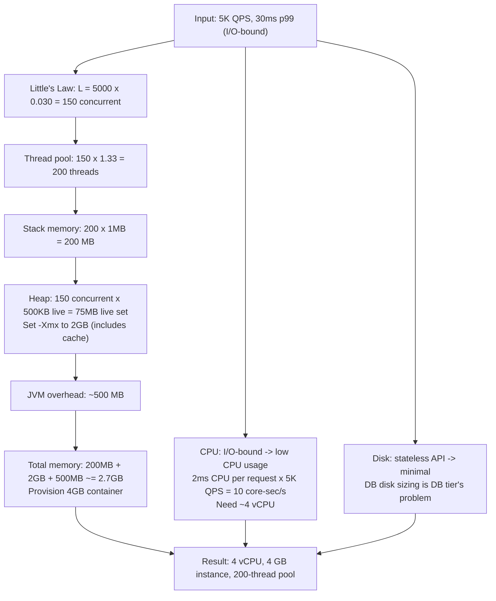

---

## How Your Thinking Evolves: Intern to Staff Engineer

*Same problem at four levels: your web server handles 10,000 concurrent connections. It's slow. What do you fix?*

### Intern Level: "Create a thread per connection"

The intern uses the classic thread-per-connection model: when a new connection arrives, spawn a new thread.

Think of this like hiring one employee per customer at a coffee shop. At 10 customers: fine. At 1,000 customers: 1,000 employees standing around, most of them just waiting. The waiting itself costs money (salaries = RAM). The coordination of 1,000 people talking over each other = context-switch overhead.

10,000 threads: each thread uses ~1MB stack space = 10GB RAM just for stacks. The OS scheduler spends more time context-switching between 10,000 threads than doing actual work. Response time degrades as concurrency grows.

### Mid-Level (L4): "Use a thread pool"

L4 knows thread-per-connection is wasteful. They use a thread pool: 50 fixed threads, each picks up a connection from a queue.

Better. Memory usage drops from 10GB to 50MB. But: if each thread is blocked waiting for a database response (I/O wait), all 50 threads are blocked simultaneously. The queue of incoming connections grows. New requests wait 30+ seconds while threads are just... waiting for I/O.

L4 fixed the memory problem but not the I/O blocking problem.

### Senior (L5): "Use async I/O with an event loop"

L5 knows the bottleneck is blocking I/O, not CPU. They switch to an event loop (Node.js model, or Python asyncio, or Java NIO).

One thread handles all 10,000 connections. When a connection needs to wait for DB response, the event loop registers a callback and moves on to the next connection. When the DB responds, the callback fires. No thread is ever blocked waiting.

```
L5 EVENT LOOP:
  Thread 1: [conn_1: send query to DB] -> [conn_2: send query to DB] -> [conn_3: ...]
         ^--- when DB responds to conn_1, event loop calls conn_1's callback

  vs Thread Pool:
  Thread 1: [conn_1: waiting for DB...............................................response]
  Thread 2: [conn_2: waiting for DB...............................................response]
  Thread 3: BLOCKED (thread 1 and 2 are using them but just waiting)
```

L5 also understands when NOT to use async: CPU-bound work (image compression, encryption) should use threads or processes, not an event loop. Mixing CPU-heavy work into an event loop blocks the single thread and starves all connections.

### Staff (L6): "OS concurrency model is a trade-off space, not a single answer"

L6 knows there is no universal answer. They design based on the workload profile:

"For our photo upload service: uploads are I/O bound (network receive, S3 write). Async event loop is optimal. For our ML inference service: CPU bound (matrix multiplication). Use process-per-worker with CPU pinning. For our database connection pool: use fixed thread pool (connections are resources, not compute)."

L6 also thinks about OS-level tuning that L5 misses:
- File descriptor limits: `ulimit -n` defaults to 1,024 on Linux. At 10,000 connections, you need `ulimit -n 100000`. If this is not set, the OS refuses connections silently.
- TCP backlog: the OS queue of unaccepted connections defaults to 128. At high traffic bursts, the backlog fills and new connections are dropped. Tuned: `net.core.somaxconn=65535`.
- Kernel bypass (DPDK): at 10M req/second, the OS TCP/IP stack itself is the bottleneck. High-performance systems (trading platforms, CDN edge) bypass the kernel entirely.

```
L6 CONCURRENCY MODEL SELECTION:
  Workload type        | Model            | Why
  ---------------------+------------------+---------------------------
  I/O bound (network)  | Async event loop | No thread blocking on I/O
  CPU bound (compute)  | Process-per-core | Full CPU utilization
  Mixed I/O + CPU      | Async + worker   | Event loop + thread pool
  DB connection pool   | Thread pool      | Connections = resources
  High-freq trading    | Kernel bypass    | OS overhead too high
```

### The Pattern

- Intern: thread per connection (RAM exhaustion, context-switch overhead)
- L4: thread pool (memory fixed, I/O blocking unsolved)
- L5: async event loop (eliminates I/O blocking, wrong for CPU work)
- L6: workload-specific model + OS tuning (fd limits, TCP backlog, kernel bypass)

---

## L5 vs L6 Calibration: OS Fundamentals

| Dimension | L5 (Senior) | L6 (Staff) |
|-----------|-------------|------------|
| Concurrency model | Chooses between threads, processes, async | Designs per-workload: async for I/O, processes for CPU |
| Thread pool sizing | Estimates pool size based on expected load | Uses Little's Law + p99 latency to compute exact pool size |
| Memory management | Knows heap vs stack, GC tuning basics | Profiles memory allocations, tunes GC pause targets, designs off-heap caching |
| I/O model | Knows blocking vs non-blocking I/O | Understands epoll internals, designs poll-based architecture |
| File descriptors | Knows fd limits exist | Sets per-process limits, monitors fd exhaustion, designs fd leak detection |
| System calls | Knows common syscalls (read, write, fork) | Minimizes syscall overhead via batching, kernel bypass for latency-critical paths |
| Process isolation | Uses processes for isolation | Designs cgroup + namespace isolation, seccomp sandboxing |
| Context switching | Knows context switching has overhead | Quantifies: 1-10 microseconds per switch, calculates cost at N threads |
| Signals | Knows SIGTERM, SIGKILL | Designs graceful shutdown: SIGTERM -> drain connections -> SIGKILL after timeout |
| CPU affinity | Knows CPUs exist | Pins hot threads to specific cores, disables NUMA cross-node access for latency |
| OS tuning | Knows some sysctl params | Comprehensive OS tuning checklist for production servers |
| Impact | Tunes one service | Builds OS hardening playbook for all production servers |

---

## Named Production Incidents

### Incident 1: GitHub 2015 -- Ruby GC Pause Outage

**What happened:** GitHub engineers changed a Ruby runtime setting called RUBY_GC_MALLOC_LIMIT to make the garbage collector run less often. The idea was to improve throughput. Instead, the GC waited until the process had consumed roughly 10x its normal memory before collecting. When GC finally ran, it froze all threads in the Ruby process for 10+ seconds. From the outside, GitHub's API stopped responding completely. Users saw timeouts. The site appeared down.

**Root cause:** RUBY_GC_MALLOC_LIMIT was set too high. Ruby's GC is stop-the-world: it pauses every thread while it scans memory. Normal GC runs take ~10ms and users don't notice. But with the limit raised, the GC deferred collection until memory ballooned. When it finally ran, the pause was 10,000ms -- long enough to trigger load balancer health check failures and connection timeouts.

**ASCII diagram:**
```
Normal GC (10ms pause):
  Thread 1: [work][GC][work][work][work][work]
  Thread 2: [work][GC][work][work][work][work]
                  ^--- 10ms, users don't notice

Bad GC (10,000ms pause):
  Thread 1: [work][work][work][work][GC-----------][work]
  Thread 2: [work][work][work][work][GC-----------][work]
                                    ^--- 10 seconds
                                    Load balancer sees:
                                    [timeout] -> marks server unhealthy
                                    [timeout] -> removes from pool
                                    Result: API appears DOWN
```

**Fix applied:** Reverted RUBY_GC_MALLOC_LIMIT to the default value. Also added GC pause duration monitoring so any future GC tuning change would trigger an alert before causing an outage.

**Staff lesson:** GC pause time is a key OS-level concern for any language with a garbage collector (Ruby, Java, Go, Python). Before tuning GC settings in production, measure the actual pause duration under load, not just throughput. A setting that improves throughput by 5% but adds a 10-second pause is a net loss. Always monitor p99 GC pause latency separately from application latency.

---

### Incident 2: Discord 2018 -- Async Event Loop Blocked by CPU Work

**What happened:** Discord's Python message relay service used asyncio, which is a single-threaded event loop. One developer added image processing (thumbnail generation) directly inside an async handler. Image processing is CPU-bound: it uses 100% of the CPU for ~200ms per image. Because asyncio is single-threaded, that 200ms of CPU work completely blocked the event loop. During that 200ms, no other async tasks could run. All 50,000 WebSocket connections sharing that process experienced a 200ms latency spike at the same moment.

**Root cause:** Mixing CPU-bound work into an I/O-bound async event loop. Asyncio gives you concurrency for I/O (waiting for network, disk) but not for CPU. The event loop is cooperative: a task must yield control (via await) for other tasks to run. CPU-bound code never yields. So the loop is stuck until the CPU work finishes.

**ASCII diagram:**
```
Asyncio event loop (single thread):

EXPECTED behavior (I/O only):
  Task A: [send msg]--[await network]--[recv msg]
  Task B:             [send msg]--[await network]--[recv msg]
  Task C:                         [send msg]--[await network]
  --> Tasks interleave at await points. All fast.

ACTUAL behavior (CPU work added):
  Task A: [recv img][CPU IMAGE PROCESSING - 200ms BLOCK]
  Task B:           [WAITING......................][run]
  Task C:           [WAITING......................][run]
  50,000 WebSocket connections:
          [WAITING......................] -> all spike at once
```

**Fix applied:** Moved image processing to a separate thread pool using asyncio's run_in_executor(). CPU-bound work runs in worker threads; the event loop stays free to handle I/O for all WebSocket connections.

**Staff lesson:** Single-threaded async (asyncio, Node.js event loop, Nginx worker) is not a magic performance fix. It works well for I/O-bound tasks. It fails badly for CPU-bound tasks. Any work that runs for more than a few milliseconds without hitting an await must be offloaded to a thread pool or a separate process. The rule: if it touches the CPU hard, it does not belong in the event loop.

---

### Incident 3: Cloudflare 2019 -- Buffer Overflow in HTTP Header Parsing

**What happened:** A C library used inside Cloudflare's edge servers had a bug: when it parsed certain malformed HTTP request headers, it wrote more bytes than it allocated space for. This is a buffer overflow. The extra bytes overwrote adjacent memory, which corrupted other parts of the process's state. Affected processes started returning garbage responses or crashing. About 1% of Cloudflare's global HTTP traffic was affected for 27 minutes.

**Root cause:** Buffer overflow in C. C does not automatically check whether you are writing past the end of an array. The library allocated a fixed-size buffer for a header field but did not validate that the incoming header value fit within that buffer. A specially crafted header with a very long value wrote past the end, corrupting adjacent memory on the stack or heap.

**ASCII diagram:**
```
Normal header (fits in buffer):
  Header value: "Mozilla/5.0"   (11 bytes)
  Buffer:       [M][o][z][i][l][l][a][/][5][.][0][ ][ ][ ][ ][ ]
                 ^--- value fits, adjacent memory untouched

Malformed header (buffer overflow):
  Header value: "AAAA...AAAA" (500 bytes, buffer is 64 bytes)
  Buffer:       [A][A][A][A][A][A][A][A][A][A][A][A][A][A][A][A]
  Overflow:     [A][A][A][A] --> [adjacent variable][return addr]
                                  ^--- CORRUPTED
                                  Process state broken -> crash or garbage output
```

**Fix applied:** Patched the C library to check the header value length before copying it into the buffer. Also added fuzzing (feeding random malformed inputs) to the library's test suite so similar bugs get caught before reaching production.

**Staff lesson:** Memory safety bugs in C/C++ are a production reliability concern, not just a security concern. A buffer overflow in a parsing function can take down a service the same way a bad config change can. For any service that parses untrusted input (HTTP headers, DNS packets, file uploads), input validation must happen before any memory copy. Languages with automatic bounds checking (Go, Rust, Java) eliminate this whole class of bug.

---

### Incident 4: Netflix 2015 -- Unbounded Cache Causes OOM Process Kill

**What happened:** A Java service at Netflix had a cache meant to hold at most 10,000 entries using LRU (least recently used) eviction. LRU eviction means: when the cache is full and you add a new item, the item that was used least recently gets removed. But the LRU comparator had a logic error -- it sometimes returned the wrong ordering, so the eviction algorithm never actually removed entries. The cache grew without bound. Eventually the Java process consumed all available memory (OOM -- out of memory). The OS killed the process. Auto-restart restarted it, but the leak happened again immediately. The service cycled repeatedly between OOM crash and restart.

**Root cause:** A bug in the eviction comparator. LRU eviction relies on correctly comparing last-access timestamps to find the oldest entry. A logic error (off-by-one, wrong comparison direction, or integer overflow) caused the comparator to always report entries as equally recent. With no clear eviction candidate, the cache never freed entries.

**ASCII diagram:**
```
Intended behavior (LRU eviction working):
  Cache (max 10,000 entries):
  [entry1][entry2]...[entry10000] --> FULL
  Add entry10001: evict entry1 (least recently used)
  [entry2]...[entry10000][entry10001] --> still 10,000 entries

Actual behavior (comparator bug):
  Cache grows:
  [entry1][entry2]...[entry10000][entry10001][entry10002]...
  No eviction ever triggered.
  Memory used: 100MB -> 500MB -> 1GB -> 2GB -> OOM
  OS kills process.
  Process restarts -> same leak -> OOM again.
  Cycle repeats until code deploy.
```

**Fix applied:** Fixed the comparator logic. Added a unit test that explicitly verifies eviction occurs when the cache is full. Added a metric tracking cache size that would alert if size ever exceeded 11,000 entries.

**Staff lesson:** Bounded caches are only bounded if the eviction logic is correct. An LRU cache with a broken comparator is an unbounded cache. Every bounded data structure in production (cache, queue, pool) should have a size metric and an alert. If you see a size metric trending upward without a ceiling, you have a leak. Catching it at 5,000 entries is a minor incident. Catching it at OOM is a production outage.

---

### Incident 5: Amazon EC2 2011 -- Thread Pool Deadlock in Control Plane

**What happened:** The Amazon EC2 control plane (the system that handles API calls like launching or terminating instances) hit a deadlock. Thread A acquired lock X and then tried to acquire lock Y. Thread B had already acquired lock Y and was waiting for lock X. Neither could proceed. Both threads were stuck forever. As more requests came in, more threads from the thread pool entered the same deadlock situation. Eventually all 200 threads in the pool were stuck waiting. New API requests had no available threads to process them. From the outside, EC2 API calls timed out. Health checks passed because the process was alive -- it just couldn't do any work.

**Root cause:** Circular lock dependency. When two threads each hold a lock the other needs, and each waits for the other to release, they are deadlocked. A deadlock does not crash the process -- it silently hangs threads. If enough threads deadlock, the thread pool is exhausted and the service stops processing work without appearing dead.

**ASCII diagram:**
```
Thread A:                    Thread B:
  acquire(lock_X) -> OK        acquire(lock_Y) -> OK
  try acquire(lock_Y) -> WAIT  try acquire(lock_X) -> WAIT
        |                              |
        +---------> deadlock <---------+
        Both waiting forever.

Thread pool exhaustion:
  Thread 1: [deadlocked]
  Thread 2: [deadlocked]
  Thread 3: [deadlocked]
  ...
  Thread 200: [deadlocked]
  New request: [no thread available] -> timeout

Health check:
  GET /health -> process alive -> returns 200 OK
  But no work is being done. Health check passes.
  Load balancer keeps sending traffic. All requests time out.
```

**Fix applied:** Enforced a global lock ordering rule: any code that acquires multiple locks must always acquire them in the same order (e.g., always lock X before lock Y, never Y before X). Added deadlock detection monitoring using thread dump analysis. Restarted the affected processes to clear the deadlock immediately.

**Staff lesson:** Deadlocks are invisible to standard health checks. A process can be running, responding to pings, and completely unable to do useful work simultaneously. For any service using multiple locks, establish and document a lock acquisition order. For Java services, thread dumps (jstack) show exactly which thread holds which lock -- this is the fastest way to diagnose a deadlock. Consider using timeout-based lock acquisition (tryLock with timeout) so a thread does not wait forever.

---

## 20. Virtual Memory and Memory-Mapped Files

Virtual memory is the OS abstraction that gives every process the illusion of a large, contiguous address space regardless of physical RAM available. The CPU's Memory Management Unit (MMU) translates virtual addresses to physical addresses using a multi-level page table. The unit of mapping is a **page** — typically 4 KB on x86-64.

**TLB (Translation Lookaside Buffer):** A hardware cache that stores recent virtual-to-physical address translations. A TLB hit costs ~1 ns; a TLB miss forces a page-table walk costing ~100 ns. For applications accessing many small memory regions (hash tables, linked lists), TLB misses become a measurable bottleneck. **Huge pages** (2 MB instead of 4 KB) reduce TLB pressure by covering 512× more memory per TLB entry — Linux databases like PostgreSQL and MongoDB use huge pages in production.

**Page faults:** When a process accesses a page not yet mapped to physical memory, the CPU raises a page fault. The kernel handles it: for an anonymous page (heap, stack), it allocates a physical page and zeros it. For a file-backed page (mmap), it reads the data from disk. Minor fault (~1 µs) = page was already in the page cache. Major fault (~1–10 ms) = required a disk read.

**Memory-mapped files (mmap):** `mmap()` maps a file directly into the process's virtual address space. The OS manages loading pages on demand via page faults and writing back dirty pages via the page cache. This gives database engines "free" buffering through the kernel's page cache without a separate user-space buffer. SQLite uses mmap for its read path. Drawback: the kernel may evict pages at any time, causing unpredictable I/O latency spikes. Production databases like PostgreSQL and InnoDB implement their own buffer pools instead of relying on mmap to control I/O scheduling precisely.

---

## 21. I/O Models: From Blocking to io_uring

Understanding I/O models explains why Node.js and Nginx can handle 10,000 concurrent connections on a single thread, while a naive threaded server struggles at 1,000.

**Blocking I/O:** A `read()` syscall blocks the calling thread until data arrives. One thread per connection is the natural model. Works well up to ~1,000 connections; breaks down beyond that due to thread overhead (8 MB stack per thread by default on Linux = 8 GB for 1,000 threads).

**Non-blocking I/O:** The socket is set to non-blocking mode. `read()` returns immediately with `EAGAIN` if no data is available. The application must poll repeatedly, which wastes CPU.

**I/O multiplexing (epoll):** The `epoll` syscall registers many file descriptors and returns only the ones that are ready. An event loop checks epoll, reads from ready sockets, processes the data, and loops. This is the model behind Nginx, Node.js, Redis, and most high-performance servers. A single thread can manage tens of thousands of connections. The trade-off: callback-based or async/await code required; no blocking calls allowed in the event loop.

**Async I/O (io_uring):** Linux 5.1+ (2019). io_uring uses two shared ring buffers between kernel and user space — a submission queue and a completion queue. Applications batch I/O operations into the SQ, the kernel processes them (possibly in parallel), and results appear in the CQ. No syscall per operation; the kernel can be polled without context switches. Enables high-throughput storage access (databases, proxies) at lower CPU cost than epoll. PostgreSQL 16+ experimentally supports io_uring; ScyllaDB's storage engine uses it natively.

**Rule of thumb:**
- CPU-bound work → multiple processes or threads (one per core).
- I/O-bound work with many connections → event loop with epoll (Node.js, Nginx).
- High-throughput storage (databases) → io_uring for lowest syscall overhead.

---

## 22. Process vs Thread vs Coroutine — Cost Comparison

| Unit        | Creation cost | Memory overhead | Switch cost  | Use case                          |
|-------------|---------------|-----------------|--------------|-----------------------------------|
| Process     | ~1–10 ms      | ~8 MB+ (VM)     | ~10 µs       | Isolation, multi-core CPU-bound   |
| Thread      | ~100 µs       | ~1–8 MB (stack) | ~1–5 µs      | Parallel CPU work, blocking I/O   |
| OS thread (Go goroutine scheduler basis) | — | — | — | — |
| Goroutine   | ~2–4 µs       | ~2 KB (grows)   | ~100 ns      | Massive concurrency in Go         |
| Coroutine (Python asyncio, JS Promise) | ~1 µs | ~few KB | ~100 ns | I/O-bound concurrent tasks |

**Why goroutines are cheap:** Go maintains its own scheduler (M:N threading — N goroutines multiplexed onto M OS threads). Goroutines start with a 2 KB stack that grows dynamically. The Go scheduler parks goroutines waiting on I/O without blocking the underlying OS thread, enabling millions of concurrent goroutines on a few hundred OS threads.

**When threads beat coroutines:** CPU-bound work that needs true parallelism. Python's GIL prevents threads from running Python bytecode in parallel — use multiprocessing or offload to C extensions. Go goroutines use all cores freely.

---

```
╔══════════════════════════════════════════════════════════════════════╗
║                         KEY TAKEAWAYS                                ║
╠══════════════════════════════════════════════════════════════════════╣
║  Virtual memory: TLB miss costs ~100x a TLB hit. Huge pages (2 MB)  ║
║  reduce TLB pressure — used in DB servers in production.             ║
║                                                                      ║
║  Page fault: minor ~1 µs (page in cache), major ~1–10 ms (disk).    ║
║  mmap is convenient but gives up I/O scheduling control.             ║
║                                                                      ║
║  epoll: single thread → 10k+ connections. The model behind Nginx,    ║
║  Redis, Node.js. No blocking calls allowed in the event loop.        ║
║                                                                      ║
║  io_uring (Linux 5.1+): ring-buffer submission/completion model;     ║
║  zero-syscall-per-I/O; used by databases for max storage throughput. ║
║                                                                      ║
║  Thread cost: ~100 µs creation, ~1–8 MB stack. Goroutine: ~2 µs,    ║
║  2 KB stack. For high concurrency, language-level coroutines win.    ║
║                                                                      ║
║  Lock ordering prevents deadlocks. Health checks won't catch them.   ║
║  Use jstack/thread dumps to diagnose. tryLock with timeout as hedge. ║
╚══════════════════════════════════════════════════════════════════════╝
```

---

---

## 23. The Linux Scheduler: CFS and What Engineers Need to Know

The Completely Fair Scheduler (CFS) is the default Linux scheduler since kernel 2.6.23. It tracks each task's "virtual runtime" (vruntime) — the amount of CPU time it has received, weighted by priority. The task with the smallest vruntime runs next. This ensures fairness: no runnable task is starved indefinitely.

**nice values:** Range -20 (highest priority) to +19 (lowest). Default is 0. Nice +10 gets roughly half the CPU time of nice 0 at equal contention. Batch jobs (backups, model training) should run at nice +10 to +19 so they don't compete with latency-sensitive services.

**CPU affinity:** Pin a process to specific CPU cores with `taskset` or `sched_setaffinity()`. Useful for latency-sensitive services that benefit from warm L1/L2 caches on a dedicated core. Database servers sometimes pin to a single NUMA node to avoid remote memory accesses.

**NUMA (Non-Uniform Memory Access):** On multi-socket servers, each CPU socket has local RAM. Accessing local RAM is ~60–100 ns; accessing another socket's RAM adds ~40–80 ns latency. The OS NUMA policy defaults to local allocation. For memory-intensive databases and JVMs, binding to one NUMA node with `numactl --membind=0` eliminates NUMA penalties.

**Scheduler latency vs throughput:** CFS is tunable via `/proc/sys/kernel/sched_latency_ns` (default 6–24 ms). This controls how long a task runs before it can be preempted. Shorter = lower latency, higher context-switch overhead. Nginx and latency-sensitive proxies benefit from lower values; batch workloads prefer higher values.

---

## 24. System Calls and Context Switch Cost

Every system call crosses the user/kernel boundary. The CPU saves register state, switches privilege level (ring 3 → ring 0), executes the kernel handler, restores state, and returns. A typical syscall costs **~100–1,000 ns** depending on what it does.

**Context switch cost:** ~1–10 µs for a full thread context switch (save registers, switch page tables, reload). For a service handling 100,000 RPS, if each request causes 10 context switches, that is 1 million context switches per second — at 5 µs each, ~5 seconds of CPU time per second per core just for switching. This is why event-loop servers (Nginx, Node.js) minimize context switches.

**Spectre/Meltdown mitigations (2018):** Kernel page-table isolation (KPTI) forces a page-table switch on every syscall, doubling the cost of user↔kernel transitions. High-syscall-rate workloads (many small reads, many `accept()` calls) saw 5–30% regressions after the patches. io_uring was partly motivated by eliminating per-operation syscalls to recover this overhead.

**vDSO (virtual Dynamic Shared Object):** The kernel maps a small piece of code into every process's address space. Calls to `gettimeofday()`, `clock_gettime()`, and `time()` use vDSO and execute entirely in user space — no kernel boundary crossing, ~5 ns instead of ~200 ns. Always use these instead of manual syscalls for timestamps.

---

## 25. OS Numbers Every Engineer Should Know

| Operation                                | Approximate time   |
|------------------------------------------|--------------------|
| L1 cache hit                             | 1 ns               |
| L2 cache hit                             | 4 ns               |
| L3 cache hit                             | 10–40 ns           |
| Main memory (DRAM) access                | 60–100 ns          |
| TLB hit                                  | ~1 ns              |
| TLB miss (page table walk)               | ~100 ns            |
| Syscall (simple, no I/O)                 | 100–500 ns         |
| Context switch (thread)                  | 1–10 µs            |
| Minor page fault (page in cache)         | ~1 µs              |
| Major page fault (disk read, SSD)        | 100 µs – 1 ms      |
| Disk seek (HDD)                          | 3–10 ms            |
| SSD random read (NVMe)                   | 100–200 µs         |
| Network round trip same datacenter       | 0.5–1 ms           |
| Network round trip cross-region (US-EU)  | 70–100 ms          |

These numbers inform every back-of-envelope calculation in system design. When a candidate says "it's fine, we'll just add a cache," the interviewer is thinking about these numbers to judge whether the answer is grounded in reality.

---

---

## 26. Pre-Interview Drill

Answer these out loud in under 60 seconds each:

1. A server has 32 cores and 256 GB RAM. It's CPU-bound at 80% utilization. You need to double throughput. What are your options?
2. A Java service is using 100% CPU but serving no requests. What OS tool do you reach for first, and what are you looking for?
3. Explain what a TLB is and why it matters for a database server.
4. You see a process that is consuming no CPU but is stuck and not making progress. What two OS conditions could cause this?
5. Why does Nginx use epoll rather than one-thread-per-connection?
6. A developer suggests using `mmap()` for a database buffer pool. What are the advantages and the risks?
7. What is the difference between a minor and major page fault? When does each occur?
8. Your Go service is handling 500,000 concurrent goroutines. Why is this feasible in Go but not in Java with 500,000 threads?
9. Explain io_uring in one sentence to a non-expert.
10. A batch job is competing for CPU with a latency-sensitive API server on the same host. What Linux mechanism do you use to fix this?

**Self-check:** If you struggle on any of these, re-read sections 20–25 above. These are the OS fundamentals that distinguish an engineer who has read about systems from one who has operated them.

---

**One-liners for the interview room:**
- "Huge pages reduce TLB misses — standard practice for databases at scale."
- "epoll is O(1) on number of ready fds; select/poll are O(n) on all registered fds."
- "io_uring eliminates the syscall-per-I/O tax — the biggest Linux I/O improvement in a decade."
- "Goroutines cost 2 KB each; OS threads cost 1–8 MB each. That is the concurrency scale difference."
- "Context switch overhead is why you don't want 10,000 OS threads — use an event loop instead."
- "gettimeofday() via vDSO costs ~5 ns; via syscall it costs ~200 ns — never benchmark with the slow path."
- "Deadlock is silent: the process is alive, health checks pass, but no work gets done."
- "NUMA matters on multi-socket servers: remote memory adds 40–80 ns latency per access."
- "nice +10 for batch jobs: ensures they yield CPU to latency-sensitive services under contention."
- "The page cache is your friend until memory pressure starts evicting hot pages — then it's your enemy."
- "CFS fairness is wall-clock fair, not throughput fair: spinning on a lock burns your vruntime share."
- "Spectre/Meltdown KPTI roughly doubled syscall cost — io_uring was the answer to get it back."
- "A major page fault pausing a database query is a 1–10 ms random delay — worse than a cache miss."

---

*Pairs with Chapter 10 (APIs, Frontend, Backend, DB) for application-layer context, and Chapter 46 (Databases Deep Dive) for how OS primitives underpin database storage engines.*

---

> **Production truth:** The most dangerous OS bugs are the ones that look like application bugs. A TLB shootdown storm looks like CPU spikes. A kernel bug under NUMA migration looks like random latency. KPTI overhead looks like your service got slower for no reason. Knowing these layers turns "the system is slow and I don't know why" into a directed investigation.

> **Interview truth:** Interviewers at L5+ level expect you to know that "add more servers" is not always the answer — sometimes the answer is huge pages, CPU affinity, or switching from threads to an event loop. Showing you know why these things exist — not just that they exist — is what separates a candidate who has read the textbook from one who has operated systems under pressure.

---

`Chapter 11 | Section 1: Foundations | OS Fundamentals`
