# Chapter 11: Trade-offs, Constraints, and Decision-Making at Staff Level

---

## Section 1: Learning Goal

By the end of this chapter, you will be able to do three things that separate a Google Staff Engineer (L6) from a Senior Engineer (L5) in a system design interview:

**First**, you will identify trade-offs that are not spelled out in the requirements. Most candidates wait for the interviewer to say "what are the trade-offs here?" A Staff engineer surfaces them without being asked. You will learn to see trade-offs the moment you hear a design problem, before anyone asks.

**Second**, you will communicate trade-offs in a structured, confident way. You will have a framework in your head -- not a script, but a skeleton -- that lets you walk through any trade-off clearly: what is being traded, why both sides matter, what the options are, what you recommend, and why the decision is or is not reversible.

**Third**, you will reason about what happens when your trade-off choice goes wrong. This is the hardest part and the clearest L6 signal. Saying "I chose consistency over availability" is L5. Saying "I chose consistency over availability, so during a network partition, users will see errors instead of stale data -- here is the blast radius, here is how we degrade gracefully, and here is what the on-call engineer does at 3am" is L6.

**What you are NOT doing**: You are not looking for the perfect answer. There is no perfect system. You are learning to make the best possible choice given real constraints, communicate it clearly, and own the consequences.

---

## Section 2: Why This Matters

### Every design decision is a trade-off. Every single one.

This is not an exaggeration. When you choose PostgreSQL over DynamoDB, you are trading horizontal scaling simplicity for richer query capability. When you choose a cache TTL of one hour, you are trading freshness for reduced database load. When you choose to build a monolith instead of microservices, you are trading team autonomy for operational simplicity. The trade-off exists whether you name it or not.

The difference between an L5 and an L6 is not that L6 makes better trade-offs in isolation. Both can do that. The difference is that L6 makes trade-offs **explicit** -- visible to the organization so that decisions are made consciously, not accidentally.

### Why implicit trade-offs are dangerous

Here is a scenario that plays out at almost every company:

A team builds a highly optimized system for their current scale. Nobody discusses the trade-off between current-performance and future-scalability. Nobody says "we are accepting that this system won't scale beyond 10x our current traffic." It just happens implicitly in hundreds of small decisions. Six months later, traffic doubles and the system struggles. Now the team faces a costly rewrite, a crisis conversation with leadership, and a long engineering slog.

What went wrong? Not the technical choice itself. Maybe the optimized-for-now system was actually the right call. The problem is that nobody consciously decided "we are willing to rewrite in six months to get better performance now." The cost was paid accidentally, not deliberately.

A Staff engineer in that same situation would have said: "This design is optimized for our current scale. The trade-off is that it will not scale beyond 10x without significant rework. If we expect to grow beyond that in the next two years, we should talk about whether to invest in a more scalable architecture now or plan for a migration later. Here are the options." The organization then makes an informed choice and owns the outcome.

### Why this matters especially at L6

At L5 (Senior), you are often given a context that implies the trade-offs. "Build a real-time chat system" implies latency matters. "Build a financial ledger" implies consistency matters. The trade-offs are embedded in the requirements.

At L6 (Staff), you are the one who determines which trade-offs are relevant. The requirements are ambiguous, the constraints are incomplete, and part of your job is to figure out what matters most. You are not just navigating trade-offs -- you are defining which ones the organization should care about.

This is what the promotion gap looks like in practice:

| Situation | L5 Response | L6 Response |
|-----------|-------------|-------------|
| "Improve our recommendation system" | "What is the latency requirement? What is the accuracy target? I will design to those specs." | "What are we really optimizing for -- engagement, revenue, or retention? What are we willing to sacrifice? Higher infra cost? Longer dev time? More operational complexity?" |
| Choosing a database | "What is the QPS? I will pick the right DB for those numbers." | "The QPS matters, but so does the team's expertise, the query patterns we expect over 2 years, the cost at 10x scale, and whether we can migrate away if we are wrong. Let me walk through all of that." |
| Pushback from stakeholder | "We need Kafka because it handles replay and multi-consumer." | "Fair challenge. Is your concern about operational complexity, the learning curve, or something in the requirements I may have misjudged? Let me walk through my reasoning and we can see if that changes the call." |

The L6 version does not require knowing more facts. It requires a different mode of thinking -- one that asks "what are we trading and for whom" before asking "what is the best technical solution."

---

## Section 3: Core Concepts

### 3.1 What a Trade-off Is and Why Every Design Decision Has One

A trade-off is any choice where gaining something in one dimension requires giving something up in another. In distributed systems, there are dozens of trade-off dimensions, and they are not independent -- pulling on one often changes several others.

The reason every design decision has a trade-off is physics, economics, and complexity. You cannot have zero latency and perfect consistency simultaneously because reading consistent data across distributed nodes requires coordination, and coordination takes time. You cannot have infinite scale for zero cost because compute, storage, and bandwidth all cost money. You cannot have a system that is both maximally simple and maximally flexible because flexibility is achieved through abstraction, and abstraction is a form of complexity.

**Why does this exist?** Because the universe is constrained. Network packets travel at the speed of light (roughly). Storage costs money. Engineers have finite time. Laws of thermodynamics are non-negotiable. A system designer's job is not to find loopholes in physics -- it is to navigate the real constraints as intelligently as possible.

A useful mental model: every design lives on a multi-dimensional surface, and you cannot move in all dimensions simultaneously. When you move toward better consistency, you slide away from lower latency. When you move toward cheaper cost, you slide away from better performance. Your job is to find the point on that surface that best serves your users and your business, given the constraints you actually have.

### 3.2 The Trade-off Articulation Framework

Knowing that a trade-off exists is not enough. You need a way to communicate it so other people can make informed decisions. Here is the six-step framework that Staff engineers use:

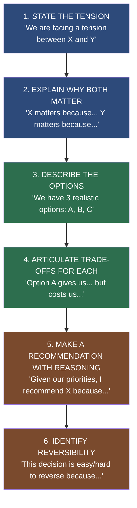

**Step 1 -- State the Tension**: Name the two things being traded against each other. Do not assume the interviewer or stakeholder can see it. Say it out loud. "We are facing a tension between development speed and operational simplicity."

**Step 2 -- Explain why both matter**: This is the step most people skip, and it is critical. If you skip it, you look like you are dismissing one side. Acknowledging both sides signals intellectual honesty. "Development speed matters because we are in a competitive market. Operational simplicity matters because our on-call rotation is already stretched and our infrastructure team is small."

**Step 3 -- Describe the options**: Two or three realistic options, not twelve. The goal is to show you understand the space, not to overwhelm. "We have three options: full microservices for maximum team autonomy, modular monolith for lower operational cost, or a hybrid where new features can be separate services."

**Step 4 -- Articulate trade-offs for each**: For each option, be specific about what you gain and what you give up. Use numbers where you can. "Option 1 gives us full independence but requires investing in service mesh, distributed tracing, and on-call tooling -- roughly a two-person-year investment before we see the benefits."

**Step 5 -- Recommend with reasoning**: Do not just present options and ask "what do you think?" That is L4 behavior at best. Make a recommendation and tie it to the priorities you have established. "Given our current team size and the urgency of the roadmap, I recommend Option 3."

**Step 6 -- Identify reversibility**: This is the Staff-level finisher. Help stakeholders understand whether this is a one-way door or a two-way door. "This is partially reversible. Starting with modular monolith and extracting services later is feasible. Going the other direction -- consolidating microservices -- is much harder. So the monolith is the safer starting point."

**Verbatim L5 vs L6 dialogue on the same topic:**

*L5 on database choice:*
"I would use PostgreSQL because we need ACID transactions and our team knows it well."

*L6 on database choice:*
"There is a tension here between query flexibility and horizontal scalability. PostgreSQL gives us rich SQL, ACID guarantees, and it matches our team's expertise -- that is the gain. The cost is that scaling writes beyond roughly fifty thousand QPS requires sharding, which is complex. DynamoDB, on the other hand, scales horizontally with zero effort, but its query model is limited to key-based access, which would hurt our reporting needs. Given that our team has deep Postgres knowledge and we need complex reporting, I recommend PostgreSQL. The trade-off we are accepting is future sharding complexity -- I would put a checkpoint at two million users to evaluate whether we need it. This decision is moderately hard to reverse: a migration would take three to six months, so we should be confident before proceeding."

Notice the L6 version covers all six steps naturally, without sounding like a robot reading from a checklist.

### 3.3 CAP Theorem: The Fundamental Distributed Systems Trade-off

The CAP theorem is one of the most important ideas in distributed systems design, and it is also one of the most misunderstood. Let me explain it from first principles.

**What is a distributed system?** Any system where data lives on more than one machine. A database with a primary and a read replica is a distributed system. A microservice that calls another service is part of a distributed system. Once you have multiple machines, you have network between them, and networks are unreliable.

**What is a network partition?** A partition happens when the network connecting your machines breaks down -- some machines can talk to each other but not to others. This is not a rare theoretical event. It happens regularly in production. A cable gets unplugged. A data center has a routing issue. A cloud provider has a brief outage in one availability zone. If you have ever been on-call, you have seen partitions.

**The CAP theorem says**: During a network partition, a distributed system can guarantee at most two of three properties:

- **Consistency (C)**: Every read receives the most recent write or an error. All nodes see the same data at the same time.
- **Availability (A)**: Every request receives a response (not necessarily the most recent data).
- **Partition Tolerance (P)**: The system continues operating even when some nodes cannot communicate.

Here is the key insight that most people miss: **you cannot avoid partition tolerance in a real distributed system**. Networks fail. Period. So the real choice during a partition is between consistency and availability. You can:

- **Choose CP (Consistency over Availability)**: When a partition happens, you reject requests that cannot be served consistently. Users see errors. No stale data.
- **Choose AP (Availability over Consistency)**: When a partition happens, you serve requests even if some nodes have stale data. Users get responses. Responses might be inconsistent.

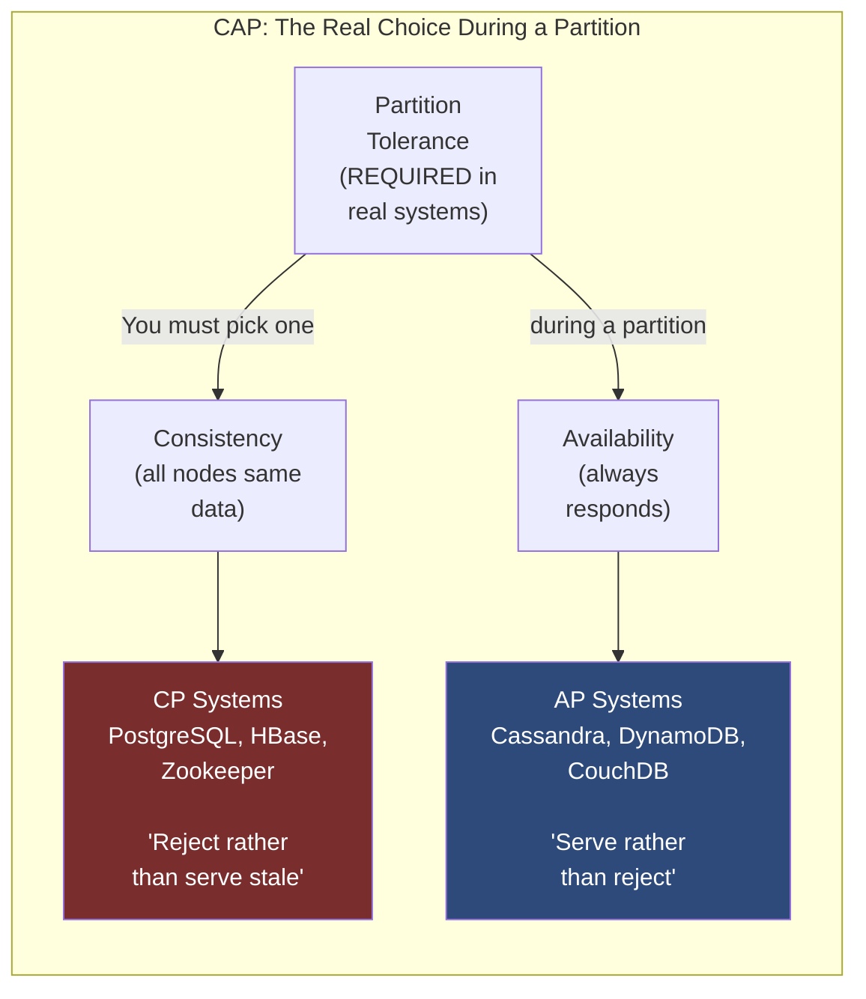

**Plain English examples of each:**

*CP -- Zookeeper*: Used for distributed coordination, leader election, configuration management. If there is a partition, Zookeeper will refuse to respond rather than give you stale configuration data. You might see a timeout or error. This is correct behavior -- configuration data that is wrong can break many systems simultaneously.

*AP -- Cassandra*: Used for high-scale storage where availability is paramount. During a partition, Cassandra will still accept reads and writes. Different nodes may temporarily have different versions of the data. This reconciles when the partition heals. Your feed showing slightly different data on two devices for thirty seconds is acceptable.

*AP -- Amazon DynamoDB*: Designed for extreme availability. "The database will always respond" is a core design goal. Consistency is tunable -- you can ask for strongly consistent reads (more latency, always fresh) or eventually consistent reads (less latency, possibly slightly stale).

**How to use this in an interview:**

"For the payment ledger, I would choose CP. If there is a network partition between data centers, I want the system to reject transactions rather than risk double-spending or losing money. A user getting an error message is far better than their money being mishandled. This means during a partition, some payment attempts will fail -- I would show the user a clear message to retry and ensure our clients have idempotency keys so retries are safe.

For the user activity feed, I would choose AP. During a partition, it is better to show a slightly stale feed than an error page. A post appearing thirty seconds late is completely acceptable. Users cannot tolerate the app being unusable, but they can tolerate slight data lag."

**Why can you not just "have both"?** Here is the intuition: imagine you have two database nodes, A and B, and the network between them breaks. A client writes to node A. Now a different client reads from node B. For consistency, node B needs to return the new value -- but it cannot, because it has not heard from node A since the network broke. You have three choices: (1) refuse the read (choose C, sacrifice A), (2) return the old value (choose A, sacrifice C), or (3) keep trying until the network heals (which might take forever, effectively choosing neither). There is no fourth option where you magically have both.

### 3.4 Consistency Models: A Spectrum, Not a Binary

CAP theorem is binary -- during a partition, you choose one side. But in practice, consistency is a spectrum, and you can tune where on it your system sits.

**Strong Consistency**: After a write completes, every subsequent read from any node returns that write. No matter which server you hit, you see the latest data. This requires coordination -- the write is not "done" until all nodes agree. Use it for: financial transactions, inventory counts, authentication tokens, anything where stale data causes real harm.

**Sequential Consistency**: Operations appear to execute in a global order, and each user's operations appear in the order they issued them. But different users may see updates in different orders. This is slightly weaker than strong consistency but still very safe. Many coordination services (like Zookeeper) offer this.

**Causal Consistency**: If operation A causally depends on operation B (for example, you read a post and then write a reply), then anyone who sees your reply also sees the post you replied to. Operations without a causal relationship can appear in any order. This is the consistency model Facebook uses for many social graph operations -- it feels consistent to the person doing the action, even if others see things in different orders.

*Concrete example of causal consistency:* You write a comment on a post. Your friend in another city reads the post and then reads your comment. Causal consistency guarantees that because your comment was written after reading the post, anyone who sees your comment will also see the post. What it does NOT guarantee: if two friends write comments at the same time without reading each other's comments, they might appear in different orders to different viewers.

**Eventual Consistency**: Given no new updates, all nodes will eventually converge to the same value. There is no bound on how long "eventually" takes. Use it for: social media feeds, shopping cart (with conflict resolution), DNS records, anything where a few seconds or minutes of staleness is acceptable.

*Concrete example of eventual consistency:* You update your Twitter profile picture. For the next few seconds, some people might see your old picture and others the new one, depending on which replica they hit. Eventually, all replicas converge.

**When is eventual consistency dangerous?** When users can see the stale version and take an action based on it that is hard to undo. If your inventory system is eventually consistent and two users both see "1 item left" from slightly stale replicas, both might successfully add to cart, and you oversell. For inventory, you need stronger consistency -- or at minimum, a final check at checkout with strong consistency guarantees.

```mermaid
quadrantChart
    title Consistency Model vs. System Complexity
    x-axis Low Complexity --> High Complexity
    y-axis Weak Consistency --> Strong Consistency
    quadrant-1 Avoid: High complexity, weak consistency
    quadrant-2 Ideal for critical systems: High complexity but strong guarantees
    quadrant-3 Ideal for scale: Low complexity, acceptable for most cases
    quadrant-4 Simple and strong: Only possible for small/single-node systems
    Strong Consistency: [0.85, 0.95]
    Sequential Consistency: [0.75, 0.85]
    Causal Consistency: [0.55, 0.6]
    Eventual Consistency: [0.25, 0.25]
    No Consistency: [0.1, 0.05]
```

**Common beginner mistake**: Treating eventual consistency as "broken consistency." It is not. Eventual consistency is a deliberate choice that makes sense in many scenarios. The mistake is applying it where strong consistency is actually required (like payments) or avoiding it where it would dramatically simplify the system (like social feeds).

**The fix**: For every component, ask "what is the worst thing that can happen if a user sees data that is 5 seconds stale? 30 seconds? 5 minutes?" If the answer is "nothing much," eventual consistency is fine. If the answer is "they might get double-charged" or "a security token might still work after revocation," you need strong consistency.

### 3.5 Availability vs. Consistency in Real Systems -- Three Canonical Examples

**Payment Systems -- Strong Consistency Required**

Payments deal with money. Incorrect behavior has direct financial harm: double charges, lost funds, fraud vulnerabilities. The cost of inconsistency is unacceptable.

What this means in practice:
- Use synchronous writes to a primary database
- Idempotency keys on all payment operations (so retries are safe)
- Prefer to fail the transaction rather than risk an inconsistent state
- Multi-phase commit for operations that span multiple services (auth, charge, fulfill)
- During a partition, reject the payment rather than proceed

*Exact words to say in an interview:* "For payments, my guiding principle is correctness over availability. I would rather show a user a clear error message and ask them to retry than risk charging them twice or losing a transaction. The user experience cost of a temporary error is much lower than the financial and trust cost of an incorrect payment."

**User Activity Feed -- Eventual Consistency Fine**

A feed showing posts from people you follow. Users expect it to feel fast. They do not expect it to be millisecond-precise.

What this means in practice:
- Pre-computed feed stored in Redis or similar cache
- Async fan-out when someone posts
- Reads served from cache, not the database
- TTL-based invalidation, not write-through consistency
- During degradation, serve from cache even if slightly stale

*Exact words to say in an interview:* "For the feed, eventual consistency is not just acceptable -- it is the right design choice. Users do not notice if a post appears a few seconds late in their feed. They absolutely do notice if the feed takes 500ms to load because we are doing synchronous consistency checks on every read. I am choosing to trade freshness for speed."

**User Profile -- Hybrid: Eventual for Display, Strong for Changes**

Your name, photo, and bio are displayed to other users. Displays can tolerate slight staleness. But when you change your own profile, you need to see the change immediately -- otherwise you think the update did not work and try again.

What this means in practice:
- Reads from cache (eventual consistency for display)
- Your own writes go through with read-your-own-writes guarantee
- The write invalidates your own cache synchronously
- Other users' caches update asynchronously (eventual)
- Password changes and email changes use strong consistency (security)

*Exact words to say in an interview:* "I am using a split consistency model here. Profile displays are read-heavy and can use a cache with a short TTL -- slight staleness is fine for someone else viewing your profile. But writes to your own profile use a read-your-own-writes guarantee: you immediately see your change in your own session. Password and email changes use strong consistency because the security implications of stale data are serious."

### 3.6 Latency vs. Throughput Trade-offs

These are often confused. Let us be precise.

**Latency** is how long a single operation takes from start to finish. The time from "client sends request" to "client receives response." Measured in milliseconds. Users notice latency directly -- a slow page load feels broken.

**Throughput** is how many operations you can complete per unit of time. Requests per second. Operations per second. Events per day. You notice throughput indirectly -- when throughput is insufficient, requests queue up, and then latency increases for everyone.

**Why they trade off**: Imagine a grocery store checkout lane. You can have ten items handled one at a time very quickly (low latency, low throughput), or you can batch ten customers together in a "group checkout" for economies of scale (higher throughput, higher latency for each individual). Most real systems have similar dynamics.

**Batching improves throughput, increases latency:**
- SSD controllers batch writes to improve throughput
- Database commit groups (committing multiple transactions in one fsync)
- HTTP/2 multiplexing (multiple requests over one connection)
- Event processing with micro-batches (process 100 events at once instead of one-by-one)

*Real numbers:* A Kafka consumer processing events one at a time might handle 1,000 events/second with 1ms per event. The same consumer with a batch size of 100 might handle 100,000 events/second -- but each event experiences up to 100ms of queuing before the batch is processed. Throughput up 100x, latency up 100x. For analytics ingestion, this is a great trade. For real-time notifications, it is terrible.

**Dedicated resources improve latency, reduce throughput:**
- Dedicated database connections for the critical payment path
- Priority queues where urgent requests skip the line
- Reserved compute instances instead of spot instances (no cold starts)
- Read replicas for reading (so reads do not compete with writes)

**Exact words to say in an interview for latency vs. throughput:**

"There is a fundamental tension here between how fast we respond to each request and how many requests we can handle in total. Batching is the classic trade. For our analytics pipeline, I am recommending event batching with a 500ms window -- each event experiences up to 500ms of latency before being processed, but our per-machine throughput goes from 10,000 to 2,000,000 events per second. This trade makes perfect sense for analytics. For the payment critical path, I am doing the opposite -- synchronous processing with dedicated resources, because we need sub-200ms latency on every transaction, and throughput is bounded by user actions anyway."

### 3.7 Simplicity vs. Flexibility -- The Over-Engineering Trap and the Under-Engineering Trap

This is one of the most important trade-offs in software engineering, and it has two failure modes, not one.

**The over-engineering trap**: Building for requirements you do not have yet. Creating a plugin system when you have one customer. Building a rules engine when you need two rules. Implementing a generic multi-tenant platform when you have zero tenants. This wastes engineering time, creates complexity that is hard to debug, and often means the thing you actually need is buried under abstractions designed for things that never happen.

*Real example of over-engineering:* A startup builds a "flexible notification system" in their first month with a full templating engine, delivery channel plugins, A/B testing support, user preference overrides, and a visual editor. After six months they have exactly two notification types -- "welcome email" and "password reset." The flexible system takes two weeks of engineering when a simple hardcoded solution would have taken two days. The flexibility adds zero value. They are maintaining complexity for hypothetical future needs.

**The under-engineering trap**: Building something so simple and specific that it cannot evolve. No abstraction anywhere. Every change requires touching a dozen places. Configuration is hardcoded. Extension requires copying and pasting. This is fine at day one but becomes a prison as requirements change.

*Real example of under-engineering:* A team hardcodes their notification logic in twenty places across the codebase. Six months later, they need to add a new notification type. Instead of adding one entry to a registry, they need to find all twenty places and update them. Three of the places get missed, leading to inconsistent behavior. The time cost of the shortcut has compounded into a large maintenance burden.

**The L6 approach**: Invest in flexibility where you have evidence you will need it. Avoid it everywhere else. The key phrase is "where you have evidence."

Evidence of needed flexibility:
- "We have changed this logic three times in the last six months" -- add an abstraction
- "Three different teams need slightly different versions of this" -- add configuration
- "We have a roadmap item to extend this in Q2" -- design with that extension in mind
- "This is a public API that others will build on" -- invest heavily in clean design

Absence of evidence:
- "We might need this someday" -- hardcode it
- "What if we switch databases later?" -- design for your actual database
- "Let's make it generic just in case" -- make it specific to your needs

**The spectrum with examples:**

| Approach | Simplicity | Flexibility | When it Fits |
|----------|-----------|-------------|--------------|
| Hard-coded values in code | Maximum simplicity | Zero flexibility | Configuration that has never changed |
| Constants in a config file | Very simple | Deployable changes | Values that change rarely but should not require code changes |
| Database-driven configuration | Moderate | High -- changes without deploy | Feature flags, user-facing settings |
| Plugin architecture | Complex to build and maintain | Very high | Known extension points with multiple implementors |
| Rules engine / meta-programming | Very complex | Maximum | Business logic that changes weekly, non-engineers need to edit |

**Exact interview phrasing:**

"For this first version, I am choosing simplicity over flexibility. We do not yet know which parts of this system will need to change most frequently. Building in flexibility now means adding complexity that might never pay off. Here is what I am hardcoding: the notification types, the delivery channels, and the retry policy. Here is what I am making configurable: the rate limits and the recipient lists, because I know those change frequently. If we learn that notification types change often, we can add an abstraction later. The cost of adding that abstraction then is low; the cost of carrying unnecessary complexity from day one is ongoing."

### 3.8 Build vs. Buy vs. Reuse -- The Full Decision Framework

Every system involves components that someone builds. The question is: does your team build them, do you buy them from a vendor, or do you reuse something that already exists internally?

This decision affects: engineering time, operational burden, cost, control, and the team's morale.

**Build**: Your team writes the code from scratch.
- Pro: Full control, exactly fits your requirements, no vendor dependency
- Con: Takes time, requires ongoing maintenance, your team must be expert operators
- When to build: Core business differentiation (your unique algorithm, your product-specific logic), when no suitable solution exists, when vendor lock-in risk is too high

**Buy (managed service / vendor)**: A third party provides the capability, you pay for it.
- Pro: Fast to integrate, operational burden transferred to vendor, vendor handles compliance and scaling
- Con: Per-use cost (often high at scale), limited customization, vendor lock-in, vendor's SLA and your ability to influence issues
- When to buy: Non-differentiating capability (email delivery, payment processing, observability), when the build cost exceeds vendor cost for realistic timelines, when compliance is complex (PCI, HIPAA -- let the vendor handle it)

**Reuse (internal)**: Another team at your company already built it and you can use it.
- Pro: Internal SLA and support relationship, often customizable to org needs, no external cost
- Con: May not fit your needs exactly, dependent on another team's roadmap and reliability
- When to reuse: When an internal solution covers 80%+ of your needs, when it is well-maintained and has an internal champion, when the integration cost is low

**The cost analysis dimension -- often missed by L5 candidates:**

L5: "We will use Stripe because payments are complicated and we want to move fast."

L6: "For payment processing, I recommend using Stripe. Here is the full analysis: Stripe charges 2.9% + $0.30 per transaction. At our current volume of 10,000 transactions per month averaging $50 each, that is $1,750/month in fees. Building our own payment processing requires PCI Level 1 compliance, bank partnerships, fraud detection, and multi-currency support -- roughly eighteen months of engineering at a cost of approximately two million dollars before we see any return. The crossover point where building becomes cheaper than buying is roughly when transaction fees exceed the cost of operating our own system -- I estimate that is above one million transactions per month. We are currently at ten thousand. Building would be insane right now. I would set a checkpoint at one hundred thousand transactions per month to reevaluate."

**The "not invented here" anti-pattern**: Some teams default to building everything. This feels good because you have control and understanding, but it is almost always a mistake for non-differentiating capabilities. Every hour your team spends building a general-purpose message queue is an hour not spent on the product feature that will win customers.

**The vendor lock-in anti-pattern**: Some teams are so afraid of vendor lock-in that they avoid excellent managed services and build worse versions themselves. Lock-in risk is real, but it is often overstated. The real question is: "What would it cost us to migrate away from this vendor in two years?" For most managed databases and message queues, the answer is "a few months of effort" -- completely manageable if the business requires it. Avoiding a great managed service to avoid "lock-in" is often a bad trade.

### 3.9 Centralization vs. Decentralization -- When Each Is Right

This trade-off appears in architecture (monolith vs. microservices), in data storage (single database vs. distributed), in teams (platform team owns the thing vs. each team owns their own), and in governance (standards enforced centrally vs. each team decides).

**Arguments for centralization:**
- Consistency of behavior (everyone gets the same logic)
- Easier to maintain and operate (one place to look)
- No fragmentation (no "six slightly different versions of the same thing")
- Clear ownership (one team is responsible)
- Economies of scale (one big database often more efficient than ten small ones)

**Arguments for decentralization:**
- Team autonomy (teams can move at their own pace)
- Blast radius isolation (one team's bug does not take down everyone)
- Flexibility (teams can choose the right tool for their workload)
- Avoids bottlenecks (central teams become chokepoints)
- Conway's Law alignment (architecture often follows team structure)

**Conway's Law -- critically important**: Your architecture tends to mirror your organization's communication structure. If you have three teams that rarely talk to each other, expect three independent services. If you have one platform team serving many product teams, expect a centralized platform with satellite services. This is not a choice -- it is a gravitational force. Smart Staff engineers design architectures that work with their team structure, not against it.

*Example:* A startup with five engineers builds a clean monolith. Fast, simple, everyone understands it. They grow to fifty engineers across eight teams. Suddenly the monolith is a coordination nightmare -- every deploy requires everyone to coordinate, every schema change needs six approvals. The centralized monolith was right at five engineers and wrong at fifty. The trade-off shifted, not because the technology changed, but because the organization changed.

**The right framework**: Ask "what is the unit of autonomy I need to preserve?" If teams need to deploy independently, ship independently, and scale independently -- you need decentralization at the service level. If teams need to share a data model, share tooling, or maintain consistent behavior -- you need centralization at that layer.

### 3.10 Reversible vs. Irreversible Decisions -- The Type 1 / Type 2 Framework

Jeff Bezos described this framework in Amazon's 2015 shareholder letter and it is one of the most practically useful mental models for engineering decisions.

**Type 1 Decisions (One-Way Doors)**: Decisions that are difficult or impossible to reverse. Once you walk through the door, you are committed. Changing course is expensive, painful, or damaging.

Examples:
- Choosing a public API contract (clients will build against it; changing it breaks them)
- Choosing a data storage format for billions of records (migration is months of work)
- Choosing a cloud provider at scale (switching is years of effort)
- Architectural patterns baked into dozens of services (changing requires coordinating all of them)

For Type 1 decisions: slow down, gather more data, get more people involved, challenge assumptions, build in migration paths where possible.

**Type 2 Decisions (Two-Way Doors)**: Decisions that are easy to reverse. If you made the wrong call, you can undo it quickly and cheaply.

Examples:
- Choosing a TTL for a cache (change a configuration value)
- Choosing which columns to include in a dashboard
- Choosing an internal API design (only one consumer, you control both sides)
- Choosing instance sizes for a service (change and redeploy)

For Type 2 decisions: decide quickly with your best current judgment, move fast, monitor and adjust.

**The common mistake**: Treating Type 2 decisions like Type 1 -- over-analyzing, over-discussing, and slowing down for decisions that can easily be corrected. This creates organizational paralysis. Every meeting about "which logging library to use for an internal tool" is time stolen from actual engineering.

**The other common mistake**: Treating Type 1 decisions like Type 2 -- moving fast, not gathering enough data, and ending up with a costly commitment that is painful to exit.

**Making Type 1 decisions more reversible -- the Staff Engineer skill:**

"The public API design is a one-way door. Once clients depend on it, we cannot change it without breaking them. But I can make it less irreversible by:
1. Versioning from day one (/v1/, /v2/, so we can evolve without breaking old clients)
2. Starting minimal (launch with fewer fields and add over time -- adding is easier than removing)
3. Using generic field names that can be reinterpreted (userId rather than facebookId)
4. Building deprecation mechanisms in from the start (sunset headers, migration guides)

These steps do not eliminate the one-way-door nature, but they change a heavy iron door into a lighter one."

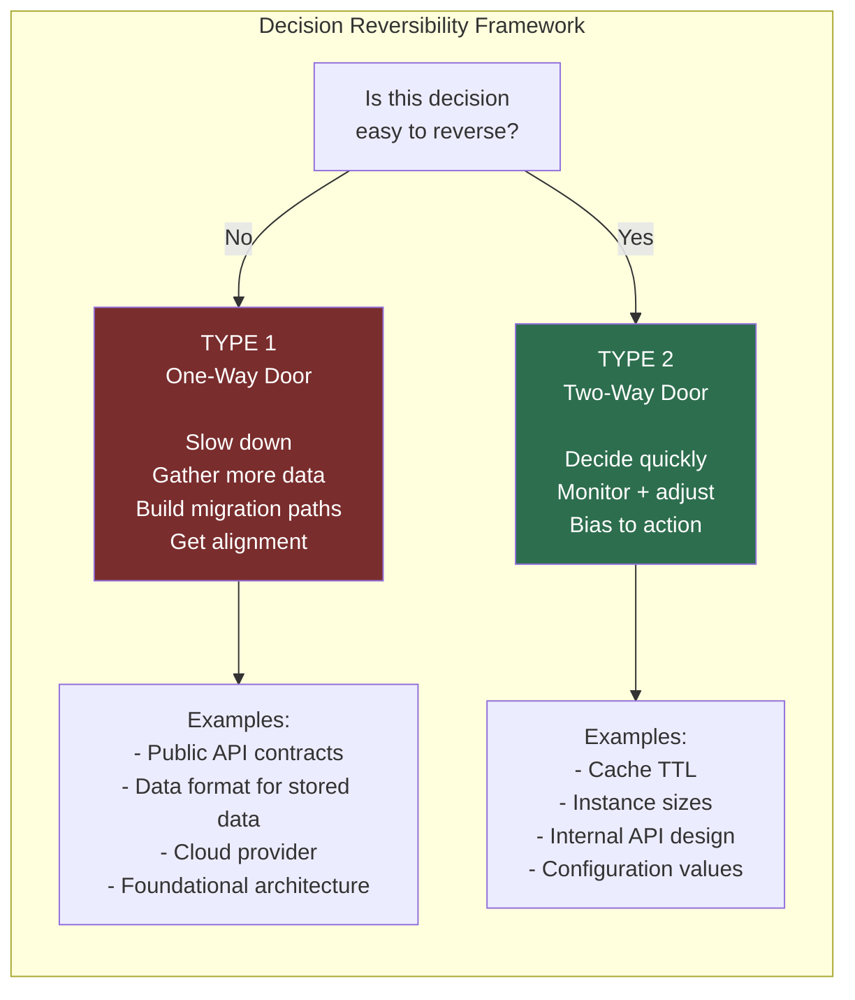

### 3.11 The Constraint Hierarchy

Constraints are the walls of the room you are designing in. They come in four types, and understanding which type each constraint is determines how you handle it.

**User Requirements**: What users actually need. These are the ultimate constraints -- if your design does not satisfy user requirements, nothing else matters. But user requirements are often stated imprecisely. "The feed should be fast" is a requirement. "The feed should load in under 200ms" is a more precise version. Part of a Staff engineer's job is to sharpen vague requirements into precise constraints.

**Business Constraints**: Commercial and strategic realities. "We need to launch in six months" is a business constraint. "Our infrastructure budget is $50K/month" is a business constraint. "We have a contractual commitment to this customer by Q3" is a business constraint. These often feel like arbitrary limitations but usually have good reasons behind them (competitive pressure, capital constraints, customer commitments).

**Technical Constraints**: Physical and technological limitations. Network latency between data centers is a technical constraint (light speed). Database throughput limits are technical constraints. Third-party API rate limits are technical constraints. These are usually genuinely immovable.

**Team Constraints**: What your team can actually build and operate. "We have two backend engineers" is a team constraint. "Nobody on the team has operated Kubernetes" is a team constraint. "Our on-call rotation is already at the limit of what is sustainable" is a team constraint. These are often treated as negotiable when they should not be -- you cannot design a system that requires expertise your team does not have and then hope the team will acquire it during the build.

**How to identify the binding constraint**: The binding constraint is the one that, if it changes, the entire design changes. Finding it is one of the most valuable things you can do at the start of a design.

*Example:* You are designing a recommendation system. The constraints are:
- 100ms latency requirement (user requirement)
- Six-month launch timeline (business constraint)
- Team has no ML expertise (team constraint)
- $30K/month infrastructure budget (business constraint)

What is the binding constraint? The team has no ML expertise. This eliminates building a custom ML model (too slow to learn, too risky). It also means you should use a managed ML service (Vertex AI, SageMaker) even if it exceeds the budget constraint -- because the alternative (building ML in-house in six months with no expertise) is worse. Once you recognize that team expertise is the binding constraint, the right answer becomes obvious: managed ML service, accept the higher cost, use the six months for integration and UX rather than model development.

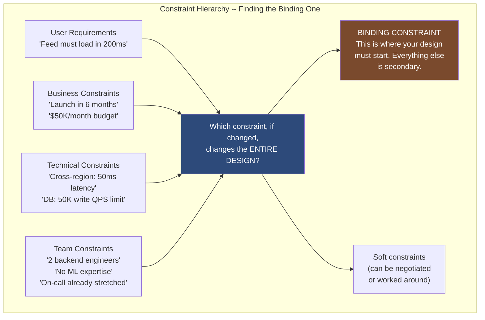

**How to challenge constraints appropriately:**

Not all constraints are actually fixed. Some are assumed. Staff engineers distinguish between them and are willing to challenge soft constraints.

*Bad:* "Our budget is $10K/month, so we cannot afford Kafka."

*Good:* "Our current infrastructure budget is $10K/month. If implementing this notification system with Kafka would save two weeks of engineering time, and if engineering time costs roughly $5K/week, then Kafka's additional $2K/month cost pays back in ten months -- and we get the reliability benefits immediately. I want to discuss whether the budget constraint is fixed or whether the ROI justifies expanding it."

### 3.12 Presenting Trade-offs to Different Audiences

A trade-off that is well-explained to an engineer may be incomprehensible to a product manager, and vice versa. Staff engineers adapt their communication to their audience.

**For engineers:** Use technical precision. Name the technologies. Use terms like "CAP theorem," "eventual consistency," "p99 latency," "write amplification." Your audience has the context to appreciate the nuance.

*Example:* "I am recommending Cassandra over DynamoDB for this use case. Cassandra gives us tunable consistency -- we can choose quorum reads for the critical path and one-level reads for the read-heavy path. DynamoDB's consistency model is less flexible, and the per-request costs at our scale would be prohibitive."

**For product managers:** Use user impact and product outcomes. Avoid jargon. Connect technical choices to features, timelines, and user experience.

*Example:* "For the feed, I am recommending we accept that a new post might take up to five seconds to appear in all followers' feeds. This keeps the feed loading fast -- under 200ms -- which is critical for user experience. The alternative, making it appear instantly everywhere, would slow down post creation and add significant engineering complexity. From a product perspective, users do not notice a five-second feed delay; they absolutely notice a 500ms post creation delay."

**For executives:** Use business impact: cost, risk, and time. Avoid both technical jargon and product details. Focus on tradeoffs between investment and outcomes.

*Example:* "We have two options for the payment system. Option A uses a managed service (Stripe) at $1.75K/month and takes six weeks to build. Option B builds our own payment processing, which would cost roughly two million dollars over eighteen months and requires specialized compliance work. The managed service is the right choice until our transaction volume reaches ten times what it is today -- at that point, building in-house becomes economically favorable. I recommend Option A now with a plan to reevaluate Option B in two years."

### 3.13 The "Good Enough" Principle -- When to Stop Optimizing

One of the quietest but most important skills at Staff level is knowing when to stop. Engineers are drawn to optimization. We want to make things faster, more reliable, more scalable. But optimization has diminishing returns, and over-optimization is a real cost.

**The principle:** "Good enough" is not a failure. It is a deliberate choice to stop spending engineering time on improvements that deliver diminishing value. The right level of optimization is the one where the next incremental improvement costs more than it delivers.

*Example:* Your API has p99 latency of 180ms and a requirement of 200ms. Should you optimize further?

L5 answer: "No, we are within requirement."

L6 answer: "We are within requirement, but let me think about what the next improvement would cost. We could probably get to 120ms with a week of optimization work. Would that meaningfully improve user experience? Research suggests users notice latency changes above about 100ms difference. Going from 180ms to 120ms is a 60ms improvement -- borderline perceptible. Is one week of engineering worth a marginally perceptible latency improvement? Probably not. I am recommending we stop here and spend that week on the feature backlog instead. We should revisit if the requirement changes to 100ms or if we see user complaints about performance."

**The over-optimization trap:** Some engineers optimize systems that are not on the critical path. They make the background job that runs once a day ten times faster. They reduce memory usage in a service with gigabytes of headroom. They add complexity to an internal tool used by five people. All of this is time not spent on things that actually matter.

**Knowing when to stop also applies to design decisions:** The "perfect" architecture takes longer to design and build than the "good enough" architecture. For most features and systems, the right answer is the one that reliably meets requirements, is understandable to the team, and can evolve -- not the theoretically optimal one.

---

## Section 4: Mental Models

### 4.1 The Five Core Mental Models for Trade-off Thinking

These are the five mental models that Staff engineers reach for automatically when reasoning about trade-offs. Practice them until they become instinct.

**Mental Model 1: Failure Projection**

"What happens when the thing I favored fails?"

Every trade-off has a failure mode. If you chose consistency over availability, the failure mode is: during a partition, users see errors. If you chose eventual consistency, the failure mode is: users see stale data for some period. If you chose simplicity over flexibility, the failure mode is: when requirements change, you need to rewrite.

The failure projection question forces you to think beyond the happy path. L5 engineers think about trade-offs during normal operation. L6 engineers also think about what happens at the edges.

*Applied to every trade-off:*
- "I chose low latency (cache) over consistency" -> "During cache failures, we serve from the database -- latency spikes from 5ms to 50ms. At scale, this could cause a cascading overload on the DB."
- "I chose high throughput (batch processing)" -> "During backpressure, the batch queue grows. At what queue depth do we start shedding load? Do we have a queue depth alert?"
- "I chose simplicity (monolith)" -> "When we need to scale one component independently, we cannot without scaling the whole monolith. What is the cost of that?"

**Mental Model 2: Blast Radius**

"If this trade-off goes wrong, who is affected, how many, how often, and how visibly?"

Blast radius is a borrowing from military planning -- how large is the area of effect when something explodes? In systems design, it is the scope of impact when a design decision goes wrong.

Low blast radius: affects a small number of users, rarely, in a way that is recoverable and not very visible. You can be more aggressive with these trade-offs.

High blast radius: affects many users, frequently, in a critical path, in a way that is highly visible and hard to recover from. You need more conservatism.

*Four blast radius dimensions:*
1. Who is affected? (internal engineers vs. some users vs. all users vs. revenue)
2. How often will the failure case occur? (once a year vs. once a month vs. daily)
3. How visible is the failure? (silent error log vs. degraded UX vs. error page vs. complete outage)
4. How recoverable? (auto-heals vs. needs engineer intervention vs. data loss)

*Example:* "The cache I am proposing could serve stale inventory data. If a user buys the last item and we then discover the cache was stale and the item was sold, we have an oversell. The blast radius: this affects a single user per occurrence, happens only during high traffic and cache invalidation races, results in a customer service situation (refund the customer or find alternate stock), and is recoverable with some manual effort. Medium blast radius. I am comfortable with the trade-off but I am adding a final inventory check at checkout that uses strong consistency -- this catches most races."

**Mental Model 3: One-Way vs. Two-Way Doors**

Already covered in Section 3.10. The short version: for two-way door decisions, decide quickly and adjust. For one-way door decisions, slow down, challenge assumptions, and build in migration paths.

**Mental Model 4: Cost Crossover Point**

"At what scale does Option A become more expensive than Option B?"

Every cost trade-off has a crossover point where the math flips. Managed services are cheap at low scale (fixed cost, shared infrastructure, no operational overhead) and expensive at high scale (per-request fees multiply). Self-hosted is expensive at low scale (fixed operational overhead regardless of volume) and cheaper at high scale (fixed infra cost amortized over many requests).

*Example:* "Managed Kafka (Confluent Cloud) versus self-hosted Kafka. Confluent charges roughly $0.10 per gigabyte processed. At our current 10GB/day, that is $300/month. Self-hosted requires three brokers at $0.08/hour each -- $175/month before operational overhead. Add twenty hours per month of engineering at $150/hour for operations: $3,175/month total. The managed service is cheaper until we hit roughly 30GB/day. At that point, investing in self-hosted starts making sense -- roughly twelve to eighteen months away at current growth. I am recommending Confluent Cloud now with a migration plan checkpoint at 25GB/day."

**Mental Model 5: Constraint Clarity**

"What are the actual constraints here, and which ones are truly immovable?"

Before starting any design, list the constraints explicitly. Categorize each as: hard (truly immovable), soft (preferred but negotiable), or assumed (might not actually be a constraint at all).

Designing without clear constraints is like navigating without a map. You will make decisions in a vacuum and discover you were building for the wrong context.

---

## Section 5: Real-World Examples

### 5.1 Instagram -- Fan-out Trade-off at Scale

When Instagram first launched, they used a simple fan-out-on-write approach for the feed. When someone posted a photo, it was written directly to every follower's feed. At 10,000 users, this was fine. At 100 million users, Selena Gomez's posts needed to be written to 100 million feed entries -- and she was not the only celebrity.

The trade-off that worked at small scale broke catastrophically at large scale:

**Fan-out on write (original approach)**:
- Read is instant (user's feed is pre-computed)
- Write is a disaster for celebrities (write amplification = followers)
- Selena Gomez posting one photo requires 100 million writes

**Fan-out on read (pure alternative)**:
- Write is cheap (write once to your posts table)
- Read is expensive (merge N timelines where N = number of people you follow)

**Instagram's solution -- hybrid fan-out:**
- Normal users (< 10K followers): fan-out on write. Fast reads, manageable write load.
- Celebrity users (> 10K followers): fan-out on read with a separate "celebrities" cache
- At read time: merge the pre-computed normal-user feed with fresh celebrity posts

This trade-off is the textbook example of "a trade-off that was right at one scale became wrong at the next, and the solution is a hybrid that handles each case with the right approach."

**The L6 interview answer:**

"For the feed, I am proposing a hybrid approach because the fan-out direction trade-off depends on follower count. For typical users, fan-out on write -- pre-compute their followers' feeds asynchronously. Feed reads are instant, write amplification is manageable. For celebrity accounts above ten thousand followers, fan-out on read -- store the post once, merge it into viewers' feeds at read time from a fast celebrity cache. The trade-off I am accepting is higher read-time complexity and slightly higher read latency -- I am adding a merge step. The trade-off I am avoiding is unbounded write amplification for celebrity posts. The crossover threshold of ten thousand followers can be tuned based on observed system performance."

### 5.2 Amazon Checkout -- Strong Consistency for Money

Amazon's checkout process is a canonical example of choosing consistency over availability because the cost of inconsistency is unacceptable.

**What happens if checkout is eventually consistent?**
- User sees "1 item in stock" (cached, slightly stale)
- User completes checkout
- Actually, item was the last one, sold to someone else 200ms ago
- Now Amazon either oversells (ships something they do not have) or has to cancel the order (terrible UX and trust damage)

**What Amazon actually does:**
- Inventory check at checkout uses strong consistency (read from primary, not replica)
- Payment authorization is synchronous and uses quorum writes
- Accept higher latency at checkout (users tolerate this -- they are completing a financial transaction)
- Reject the checkout if consistency cannot be guaranteed, show a clear error

**Numbers:** Amazon's checkout conversion research (roughly confirmed by multiple industry reports) shows that 100ms of additional latency costs about 1% of conversion. At Amazon's scale, that is enormous. Yet they accept the latency hit for consistency checks because the cost of overselling or payment errors exceeds the conversion cost.

**The L6 framing:**

"I am designing the inventory check and payment authorization with strong consistency. This will add approximately 50-100ms to the checkout flow compared to an eventually-consistent approach. That is a real UX cost. But the alternative -- showing users a successful checkout that might result in cancellation -- damages trust far more than 100ms. I am consciously paying latency for correctness. I am also designing the error path carefully: if inventory is unavailable or the payment cannot be consistently authorized, we show a clear, helpful error rather than a confusing partial failure."

### 5.3 Stripe -- Build vs. Buy for Payment Processing

Stripe's fundamental value proposition is that they have already solved the hardest parts of payment processing so that other companies do not have to.

What Stripe built (that would take you years):
- Bank relationships and network connections (Visa, Mastercard, ACH)
- PCI Level 1 compliance infrastructure ($1-5M to achieve)
- Fraud detection models trained on trillions of dollars of transaction data
- Multi-currency and multi-country routing
- Dispute and chargeback handling
- Payout to vendors and partners

What Stripe charges for this: roughly 2.9% + $0.30 per transaction for most businesses.

**The trade-off calculation:**

At $100K monthly GMV: Stripe fees = $2,900/month. Cost to build equivalent = $5-10M over 2 years. Not even close -- buy.

At $100M monthly GMV: Stripe fees = $2.9M/month, or $34.8M/year. Now a custom payment stack starts to look interesting. Companies like Shopify and Lyft have built partially custom payment infrastructure at this scale.

**The L6 insight:** This is not a "Stripe is good or bad" question. It is a question of where you are on the cost curve. The correct answer changes with scale. A Staff engineer identifies the crossover point and designs with a migration trigger: "We use Stripe until our monthly fees exceed $500K, at which point we initiate a twelve-month project to bring payment processing partially in-house. I am flagging this now so we design our payment abstraction layer to be Stripe-independent -- the integration code should hide Stripe-specific APIs."

### 5.4 Netflix -- CAP Theorem in Practice

Netflix made a famous deliberate choice to favor availability over consistency. Their reasoning, which they published openly:

"We knew that our systems would fail. The question was: what do we do when they fail? We decided that a degraded experience (some features missing, some data stale) was better than no experience (complete outage). We explicitly chose AP."

What this looks like in practice:
- Recommendation system: During degradation, fall back to pre-computed "top 20 globally popular" -- stale but available
- User rating data: Eventually consistent -- your rating might take a few seconds to propagate
- Billing: Strong consistency (this is the exception -- money always uses CP)
- Play button: Extremely high availability -- even if metadata is slightly stale, the video must play

Netflix's chaos engineering practice (Chaos Monkey) is directly related to this trade-off: they built their system to degrade gracefully, and then regularly broke things in production to verify it actually did.

**The L6 insight for your interview:**

"Netflix's approach illustrates an important nuance: AP vs. CP is not a system-wide decision. Different parts of the same system have different consistency requirements. Billing is CP. The play button is AP. Recommendations are AP with a fallback strategy. I am going to apply the same nuance here: the [financial component] will be CP, and the [engagement component] will be AP with explicit fallback behavior."

---

## Section 6: Design Trade-offs

### 6.1 Full Trade-off Analysis: Activity Feed System

**Problem:** Design a system that shows users a feed of activity from accounts they follow.

**Trade-off 1: Fan-out direction**

Tension: write cost vs. read cost.

Option A -- Fan-out on Write:
- When someone posts, immediately write to all followers' feeds
- Gains: reads are instant (pre-computed feed per user)
- Costs: writes are expensive for high-follower accounts; write amplification = follower count

Option B -- Fan-out on Read:
- Store posts once; merge at read time
- Gains: writes are cheap
- Costs: reads are expensive (merge N timelines)

Recommendation: Hybrid. Fan-out on write for users under 10,000 followers. Fan-out on read for users above that threshold. This bounds write amplification while keeping reads fast for typical users. The threshold is tunable.

This decision is mostly reversible -- we can adjust the threshold with a configuration change.

**Trade-off 2: Consistency level**

Tension: freshness vs. simplicity/performance.

For a social feed, eventual consistency is the right call. A post appearing five seconds late in a follower's feed is not a problem. This enables:
- Async fan-out (lower write-path latency)
- Aggressive caching of the pre-computed feed
- Background recomputation on follower count changes

This decision is reversible -- we can tighten consistency later if the product requires it.

**Trade-off 3: Storage vs. compute**

Tension: storage cost vs. read-time compute.

Pre-compute and store each user's feed up to 1,000 items. Storage cost: approximately 1KB per feed item x 1,000 items x 100M users = 100 TB. At $0.023/GB for S3-compatible storage, that is $2,300/month. Read-time compute for the alternative (merge fan-out on read for all users) is much higher at peak.

Recommendation: Pre-compute. Storage is cheap; latency is visible to users. Cap at 1,000 items per user to bound cost.

**Failure projections:**
- Fan-out worker fails: Followers temporarily miss new posts. Posts are queued; catch-up on worker recovery. Acceptable delay: a few minutes.
- Redis cache fails: Fall back to database reads. Latency increases from 5ms to 50ms. Increase DB capacity during this scenario or implement tiered fallback.
- Celebrity posts large follower count: Fan-out on read path must handle real-time merge. Pre-cache celebrity posts in a fast CDN-backed cache.

### 6.2 Full Trade-off Analysis: Payment Processing System

**Problem:** Design the payment processing system for an e-commerce platform.

**Guiding principle:** For payments, correctness takes precedence over all other concerns, including latency and availability.

**Trade-off 1: Consistency model**

This is CP. During a network partition, reject transactions. Do not risk double-charges, lost funds, or inconsistent states. Users will see an error and can retry. The UX cost of a temporary error is much lower than the financial and trust cost of incorrect payment behavior.

Implementation: synchronous writes to primary database, two-phase commit for cross-service operations, idempotency keys on all payment operations.

**Trade-off 2: Synchronous vs. asynchronous processing**

Authorization: synchronous. User waits for confirmation that funds are available. This takes 1-2 seconds, which is acceptable for a payment. Users understand that paying takes a moment.

Settlement: asynchronous. The actual movement of funds happens in the background. This can take minutes to hours. Users do not need to wait for this.

Gains: reasonable UX latency on the payment path. Strong guarantee that authorization was successful before proceeding to fulfillment.

**Trade-off 3: Build vs. buy**

Use Stripe. At current scale, per-transaction fees are far cheaper than building payment infrastructure. PCI compliance alone is a million-dollar investment. Build a payment abstraction layer so the integration is Stripe-agnostic -- when we reach $500K/month in fees, we can evaluate partial in-house processing.

**Failure projections:**
- Stripe unavailable: Payment API returns error. User sees clear retry message. Queue retries for a limited window. After five minutes, the order is cancelled and user notified.
- Database primary fails: Payments fail. Do not fail over to a replica for writes -- risk of split-brain is unacceptable for payment data. Wait for primary recovery. Show users a service disruption message.
- Network partition between payment service and fulfillment: Authorization succeeded; fulfillment uncertain. Use a distributed saga pattern with explicit compensation. If fulfillment cannot be confirmed within a timeout, initiate refund automatically.

### 6.3 Design Trade-off Matrix: Database Selection

This is a common interview scenario. Here is the full L6 analysis.

**Context:** Choosing a database for a user profile service that needs to store structured profile data, support profile search, and eventually serve 10 million users.

| Factor | PostgreSQL | DynamoDB | MongoDB | Cassandra |
|--------|-----------|---------|---------|-----------|
| Query flexibility | High (rich SQL) | Low (key-based) | Medium (flexible schema) | Low (denormalized) |
| Horizontal write scale | Medium (sharding required) | High (native) | High (sharding) | Very High (native) |
| Team expertise | High | Low | Medium | Low |
| Operational complexity | Medium (managed available) | Low (fully managed) | Medium | High |
| Consistency model | Strong (ACID) | Tunable | Tunable | Eventual (tunable) |
| Cost at 1M users | Medium | Medium | Medium | High (infra) |
| Cost at 10M users | Medium-High | High (per-request) | Medium | Medium |

**Recommendation for profile service:** PostgreSQL (RDS managed).

Reasoning:
1. Query flexibility matters -- the product team needs to filter, sort, and search profiles in ways we cannot predict today
2. Consistency matters -- profile updates (especially email and password) need ACID guarantees
3. Team expertise -- we have deep Postgres knowledge; ramp-up on a new database is a 3-month cost
4. Managed RDS eliminates most operational burden at a reasonable cost
5. At 10M users, we will likely need read replicas and potentially sharding -- but that is a problem worth solving in 18 months when we have production data to guide the solution

What I am trading: horizontal write scalability at extreme scale. If we get to 100M users writing at high frequency, we will need to revisit. But the decision is not irreversible -- migration from Postgres to a distributed database is a known engineering effort. I would rather have that complexity in the future (if we need it) than pay for NoSQL limitations today (uncertain query patterns).

---

## Section 7: Common Interview Questions -- 15 with Full L6 Model Answers

### Q1: "Walk me through how you think about trade-offs in system design."

**Why they ask:** They want to know if you have a framework or if you just wing it. They are also assessing whether you can be concise about a broad topic.

**L6 model answer:**

"I think about trade-offs in two stages: identification and articulation.

For identification, I ask: what are the dimensions that naturally conflict in this problem? The most common ones in distributed systems are consistency vs. availability, latency vs. throughput, simplicity vs. flexibility, and cost vs. performance. But there are also less-obvious ones: operational burden vs. feature richness, team autonomy vs. organizational consistency, current optimization vs. future scalability.

For articulation, I use a six-step structure. I state the tension, explain why both sides matter, describe the options, articulate what each option gains and costs, make a recommendation tied to our specific priorities, and identify how reversible the decision is.

The part I think is most often missed is the failure projection step: after I make a trade-off choice, I ask 'what happens when the thing I favored fails?' If I chose consistency, I need to design for what happens during a partition. If I chose eventual consistency, I need to design for how long stale data is acceptable and what happens when the staleness window is exceeded. The trade-off is not just a design-time decision -- it is a runtime behavior I am committing to."

### Q2: "You designed this with eventual consistency. What happens if a user sees stale data and takes an action based on it?"

**Why they ask:** This is the failure projection probe. They want to see if you thought past the happy path.

**L6 model answer:**

"That is exactly the right question to ask. The answer depends on what action we are talking about.

For read-only consumption -- browsing a feed, viewing a profile, reading content -- stale data is almost always acceptable. The user sees something slightly outdated, and the cost is negligible.

For actions with consequences -- placing an order, submitting a form, making a purchase -- we need to distinguish two cases. First, is the staleness detectable? For inventory, I would add a strong-consistency check at the moment of commitment -- the final 'place order' button triggers a fresh inventory check. This is a targeted use of strong consistency where it matters.

Second, what is the resolution path when stale data caused a problem? If someone completes checkout based on stale inventory and we discover the oversell after, we have a defined resolution: (a) find alternate stock, (b) refund with apology, or (c) delay fulfillment. I design these paths explicitly in the system.

The important principle: eventual consistency is not a global 'we do not care about correctness.' It is a deliberate choice applied where staleness is acceptable, with explicit guards at the points where it is not."

### Q3: "Why did you choose PostgreSQL over DynamoDB for this user service?"

**Why they ask:** They are testing whether you have a defensible reason or just defaulted to familiarity.

**L6 model answer:**

"The main factors in my decision were query flexibility, team expertise, and the consistency model.

Query flexibility: at early stage, we do not fully know how the product team will want to query user data. PostgreSQL's SQL gives us the ability to run ad-hoc queries, complex joins, and aggregations without schema changes. DynamoDB's key-based access model would require me to predict all access patterns upfront and design a key schema to support them. That is risky when requirements are still evolving.

Team expertise: our team has built and operated Postgres for four years. Using DynamoDB would add a three-to-six month ramp-up cost, and we would make more mistakes during that period. That is a real cost.

Consistency model: user data -- especially authentication data like email and password -- needs ACID guarantees. Eventual consistency in DynamoDB (unless you pay for strongly consistent reads on every operation) creates subtle risks for auth-related operations.

What I am trading: DynamoDB scales writes horizontally with zero operational effort. If we reach 100,000 concurrent writes per second, DynamoDB would be simpler to operate. But at our current and projected scale for the next eighteen months, PostgreSQL handles this comfortably with read replicas. I am accepting future sharding complexity in exchange for present-day query flexibility and operational familiarity. The migration, if we ever need it, is a known engineering investment."

### Q4: "What would you do differently if the traffic was 100x higher than you designed for?"

**Why they ask:** Scale evolution -- they want to see if you thought about where your design breaks and what you would do about it.

**L6 model answer:**

"Let me think through where the design breaks at 100x.

The first thing that breaks is the database write path. Currently I am using a single PostgreSQL primary. At 100x, that means roughly one million writes per second -- well beyond what a single primary handles. I would move to horizontal write scaling: either sharded PostgreSQL (complex but keeps SQL semantics) or a rewrite of the most write-heavy paths to use a distributed store like Cassandra or DynamoDB.

The second thing that breaks is the synchronous fan-out for the feed. At 100x user count, celebrities have 100x more followers. Pre-computing fan-out becomes prohibitive for high-follower accounts. I would move more aggressively to the fan-out-on-read model for a larger threshold of users.

The third thing that breaks is the cache layer. At 100x traffic, cache hit ratio matters enormously. A 5% cache miss rate that is fine at 1x scale causes ten million database hits per day at 100x. I would invest in better cache warming strategies, hierarchical caching (local in-process + distributed), and smarter eviction policies.

What I would design differently upfront: I would add more abstraction at the storage layer so the fan-out threshold and the consistency level are tunable without a code change. That way, adapting to 100x requires configuration and infrastructure changes, not an architectural rewrite."

### Q5: "You said you chose simplicity to move fast. How do you know when you have accumulated too much technical debt?"

**Why they ask:** Technical debt reasoning -- they want to see if you treat debt as a trade-off to be managed rather than an accident to be cleaned up.

**L6 model answer:**

"I treat technical debt as a trade-off with a carrying cost and a payoff cost, not as a moral failing.

The signals I watch for that indicate debt is becoming a problem: first, the change time for a specific area is increasing -- every new feature in this module takes twice as long as it should because we have to work around the debt. Second, incident frequency in the area is increasing -- the shortcuts are causing production problems with measurable frequency. Third, team friction is increasing -- developers are avoiding touching the area, it is the last thing anyone wants to pick up in a sprint.

When I see those signals, I do a formal debt assessment: what is the current monthly carrying cost in engineering time and incidents? What is the cost to fix it -- engineering time plus migration risk? What is the payback period?

I use a rule of thumb: if the payback period is under twelve months, I recommend paying the debt. If it is over twenty-four months and the area is stable, I recommend documenting it and living with it. Between twelve and twenty-four months, it depends on what we are about to build on top of it -- debt in a stable, rarely-touched area is very different from debt in a foundational component we are about to extend.

The specific trigger I am most careful about: if we are about to build new features on top of the debt, that compounds the risk significantly. Building on a shaky foundation means the new code inherits the problems of the old. I prioritize debt payment before building, not after."

### Q6: "An interviewer pushes back: 'Kafka seems like overkill for this use case. Why not use Redis pub/sub?'"

**Why they ask:** Pushback handling -- can you engage thoughtfully without being defensive or caving?

**L6 model answer:**

"That is worth exploring. Can you help me understand your concern -- is it primarily about operational complexity, or do you see something in the requirements that suggests simpler is sufficient?

[Interviewer elaborates: operational complexity, small team, low volume]

Fair point. Let me think through the Redis pub/sub option seriously.

Redis pub/sub is much simpler to operate -- it is likely already in our stack. For low volume and a small team, the operational overhead of Kafka is a real cost. What Redis pub/sub does not give us: message persistence (if a consumer goes down, it misses messages), replay capability (we cannot reprocess historical events), and consumer group semantics (multiple consumers receiving each message independently).

If the use case is fire-and-forget notification -- where losing a message is acceptable, and there is one consumer -- Redis is genuinely the better choice. The simplicity benefit outweighs the capability limitations.

If the use case requires delivery guarantees or replay -- for audit logging, event sourcing, or any case where we cannot lose messages -- Kafka is the right call despite the complexity.

Let me revisit the requirements. We said we need audit logging for compliance purposes. That requires durability -- we cannot lose messages. That changes my recommendation: I would keep Kafka for the audit stream, but I am happy to use Redis pub/sub for the internal notification stream where losing occasional messages is acceptable. Does that split make sense to you?"

### Q7: "How would you explain a consistency vs. availability trade-off to a product manager?"

**Why they ask:** Communication skill -- can you translate technical concepts for non-technical stakeholders?

**L6 model answer:**

"I would say something like this to a PM:

'We are making a decision about how our system behaves when something goes wrong -- specifically, when the network between our servers has a problem. In that situation, we have two options.

Option A: We make sure everyone sees the same data, even if that means temporarily refusing some requests. Think of it like a bank teller who will not process a transaction if they cannot confirm the balance. Users might see an error message, but the data will never be wrong.

Option B: We make sure the system always responds, even if that means some users briefly see slightly outdated information. Think of it like a search engine that serves results from a cache -- results are usually current, but occasionally slightly stale.

For the payment system, I am recommending Option A. The cost of incorrect payment data -- someone getting double-charged or a transaction getting lost -- is much higher than the cost of a temporary error message. For the feed, I am recommending Option B. Users expect fast page loads, and seeing a post a few seconds late is barely noticeable. The right answer is different for different parts of the product.'"

### Q8: "What is the most important trade-off in the design you just described, and why?"

**Why they ask:** Prioritization -- they want to see if you understand which trade-off was the load-bearing one.

**L6 model answer:**

"The most important trade-off is the consistency model for the inventory check at checkout.

Here is why it is the most important: every other trade-off I made -- the caching strategy, the fan-out direction, the database choice -- can be changed with some engineering effort if we are wrong. None of them have catastrophic downside risk.

The inventory consistency choice is different. If I choose eventual consistency there and get it wrong, users complete purchases for items that are out of stock. That causes order cancellations, customer service costs, trust damage, and potentially negative press. These are costs that do not just go away when you fix the technical issue.

And if I choose strong consistency and get it wrong in the other direction -- meaning I over-engineered for a problem I did not need to solve -- the cost is a few hundred milliseconds of extra latency and some extra infrastructure cost. Annoying, but recoverable.

The asymmetry of consequences is what makes this trade-off the most important. I should spend more design energy here, get more alignment from stakeholders, and move more slowly than on any other decision in this design. The correct answer is strong consistency for the final inventory check at checkout, with careful design of the error path so users get clear, helpful feedback when an item becomes unavailable during checkout."

### Q9: "How do you decide when to build vs. buy?"

**Why they ask:** They want to see if you have a framework beyond "build for control" or "buy for speed."

**L6 model answer:**

"I use a three-factor framework.

First, is this core business differentiation? If the capability is what makes our product unique -- our recommendation algorithm, our fraud detection, our specialized pricing logic -- we should build it. We need full control, ability to iterate rapidly, and no vendor dependency on our most critical value drivers.

If the capability is commoditized infrastructure -- message queues, email delivery, payment processing, observability, authentication -- we should buy unless we have a compelling reason not to. These have been solved many times. Building them ourselves is reinventing a wheel that has already been optimized for decades.

Second, what is the total cost of ownership comparison at our current scale and projected scale? For a managed service, model the per-use fees over two years. For build, model the engineering time, operational overhead, and ongoing maintenance. Find the crossover point. If we are below the crossover point and expect to reach it, design for migration.

Third, what is the blast radius of the vendor dependency? If the vendor has an outage, what breaks? If the vendor exits the business, how hard is it to migrate? For mission-critical paths, I want either a fallback or a migration story before committing.

The key anti-pattern I avoid: building something because it feels like control, without honestly accounting for the true cost. Engineers underestimate operational complexity almost universally. The second anti-pattern: refusing to buy because of vague 'vendor lock-in' fears, without actually modeling what exit would cost."

### Q10: "How do you handle a situation where two stakeholders want conflicting things from the system?"

**Why they ask:** This is an L6 scope question -- Staff engineers navigate organizational complexity, not just technical complexity.

**L6 model answer:**

"This happens constantly in practice. My approach is to first understand whether the conflict is real or apparent.

Apparent conflicts often dissolve when you understand the underlying need rather than the stated preference. If the product team wants real-time data and the infrastructure team wants batch processing, the real need of the product team is probably 'users see relevant, current information,' not 'data must be exactly real-time.' If near-real-time (five minutes) satisfies the user experience requirement, the conflict with the infrastructure team's batch-processing preference largely disappears.

Real conflicts -- where the underlying needs genuinely cannot both be satisfied -- require explicit trade-off articulation and a decision-maker. My job is not to pick the winner. My job is to make the trade-off visible: 'If we optimize for X, we get these benefits and pay this cost for the Y team. If we optimize for Y, we get these benefits and pay this cost for the X team. Here is my recommendation and why, but this is a business decision, not just a technical one.'

I then bring the articulated trade-off to the appropriate decision-maker -- usually the PM, EM, or both -- with a clear recommendation and an explicit ask for a decision. What I do not do is delay, hope the conflict resolves itself, or quietly pick one stakeholder's preference without making it visible."

### Q11: "Your design has a single point of failure in the message queue. Is that acceptable?"

**Why they ask:** Fault tolerance and blast radius reasoning.

**L6 model answer:**

"It depends on the blast radius and the recovery time objective, and I should have been more explicit about this.

Let me assess the blast radius: if the message queue fails, what stops working? [walks through impact] The read path is unaffected -- users can still view content. The write path degrades -- new posts queue on the producer side for retry. The fan-out is delayed. Users cannot see new content in their feeds until the queue recovers.

Recovery time: with a managed message queue (say, Amazon SQS or managed Kafka), the SLA is typically 99.9%, meaning the expected downtime is roughly nine hours per year, or less than one hour per month. Individual incidents are typically measured in minutes.

For this specific use case -- social feed -- I think a single message queue with managed availability is acceptable. The blast radius is medium: content creation is degraded, not broken, and recovery is typically fast. If this were a payment processing queue or an event queue for financial transactions, I would not accept this risk -- I would design for multi-region replication and explicit failover.

What I would add regardless: a dead letter queue for messages that fail to process, producer-side retry with exponential backoff, and an alert if the queue depth exceeds a threshold -- indicating consumer lag or queue failure. This way, we catch problems quickly and have visibility into exactly what was affected."

### Q12: "How do you think about technical debt? When do you pay it down and when do you live with it?"

**Why they ask:** Technical debt as a trade-off, not a moral issue -- they want to see mature engineering judgment.

**L6 model answer:**

"I treat technical debt like financial debt -- it has a principal and an interest rate. The question is always: are the returns from carrying this debt worth the ongoing interest payments?

The interest rate is the carrying cost: additional time to make changes in this area, increased incident probability, developer friction and morale impact. The principal is the cost to pay it down: engineering effort, migration risk, opportunity cost.

I recommend paying debt when: the carrying cost exceeds roughly five to ten percent of team velocity per month (it is actively slowing us down), we are about to build on top of it (compounding risk), the area is about to receive significant new investment, or incidents related to it are increasing.

I recommend living with debt when: the area is stable and rarely touched, carrying cost is low and well-understood, the fix cost is high and the payback period is long (over twenty-four months), or the area may be replaced wholesale in the near future anyway.

What I specifically avoid: paying down debt for aesthetic reasons without quantifying the carrying cost. 'The code is ugly and I do not like it' is not a business justification for a three-month refactor. 'This area causes two incidents per month and takes fifty percent more time to change than it should' is a business justification.

The other thing I avoid: incurring debt silently. When I am making a deliberate shortcut, I document it, set a trigger for when to revisit, and communicate it to the team. Hidden debt is far more dangerous than known debt."

### Q13: "Walk me through the CAP theorem and give me a real example of each choice."

**Why they ask:** Foundational knowledge plus practical application -- they want to see that you can explain the theory and connect it to real systems.

**L6 model answer:**

"The CAP theorem describes a fundamental tension in distributed systems. During a network partition -- when some nodes cannot communicate with others -- you must choose between consistency (all nodes see the same data) and availability (all nodes respond to requests). Partition tolerance is effectively mandatory in any real distributed system because networks do fail.

A CP system: Zookeeper, used for distributed coordination and leader election. If a network partition isolates a subset of nodes, Zookeeper refuses to respond rather than risk inconsistent coordination data. Getting wrong configuration data about who the leader is could cause multiple nodes to think they are the leader -- a split-brain condition that is far worse than a temporary unavailability.

An AP system: Apache Cassandra. Designed for high-availability globally-distributed storage. During a partition, Cassandra continues accepting reads and writes on all sides of the partition. Data diverges temporarily and reconciles when the partition heals. This is appropriate for use cases like social media timelines, user preferences, and event logs -- where temporary inconsistency is acceptable and availability is critical.

A concrete example of the trade-off in action: designing a distributed payment system. I would choose CP. During a partition between US-West and US-East data centers, I want payment processing to fail rather than potentially processing a payment on one side without the other side's knowledge. The user sees a temporary error. When the partition heals, processing resumes normally. The alternative -- allowing payments to proceed on both sides -- risks double-processing funds, which is catastrophic.

For the same company's product feed, I would choose AP. During a partition, both sides continue serving content from their local data. Users might see slightly different versions of the feed depending on which side of the partition they hit. When the partition heals, the feeds converge. The user experience impact -- a few extra seconds of potential staleness -- is completely acceptable."

### Q14: "How do you know if a decision is reversible or not?"

**Why they ask:** Decision reversibility framework -- one of the sharpest L6 signals.

**L6 model answer:**

"I assess reversibility across three dimensions: who depends on it, what data is committed to it, and how costly the migration is.

Who depends on it: internal decisions (only my team uses this code path) are highly reversible. API contracts that external teams or external customers depend on are highly irreversible -- changing them breaks things for people you cannot easily coordinate with.

What data is committed to it: a database schema with one hundred million rows in a format tied to a specific model is hard to change -- migration is expensive and risky. A configuration value with no data committed to it is trivial to change.

Migration cost: 'we could switch to a different approach in a long weekend' is a two-way door. 'We could switch approaches in a twelve-month migration project with five engineers' is a one-way door.

The classic examples:
- Public API design: one-way door. Build in versioning from day one.
- Database schema for existing data: one-way door. Design carefully, add migration paths.
- Internal cache TTL: two-way door. Change the config, redeploy.
- Cloud provider choice at scale: one-way door. Switching is years of effort.
- Feature flag value: two-way door. Toggle and observe.

The most important implication: for one-way doors, I slow down, gather more data, challenge assumptions, and get explicit alignment from stakeholders. The cost of a wrong one-way-door decision is much higher than the cost of moving slowly. For two-way doors, I bias toward action -- decide quickly with the best available information and correct course based on what we learn."

### Q15: "You are designing a system for a team of three engineers. How does that constraint affect your design?"

**Why they ask:** Team constraints -- do you account for organizational reality, or do you design in a theoretical vacuum?

**L6 model answer:**

"Team size is one of the most important constraints in system design and one of the most often ignored.

With three engineers, my design principles shift dramatically:

First, operational simplicity is paramount. Every service, every database, every queue is something the team must operate, debug, and be on-call for. With three engineers, you cannot afford an on-call rotation across ten services. I would design for two or three services maximum -- probably a monolith plus a background worker. If that means sacrificing some technical elegance for operational simplicity, so be it.

Second, managed services over self-hosted. Three engineers cannot staff a Kubernetes cluster, manage Kafka broker replication, or tune a Redis Cluster. I would use managed Postgres (RDS), managed queuing (SQS or Pub/Sub), and managed caching (ElastiCache). The per-month cost delta is easily worth the reduced operational overhead.

Third, deployment simplicity. I would use a single deployment pipeline for the monolith. Microservices with independent deployments require tooling, coordination, and on-call knowledge that a three-person team cannot sustain.

Fourth, reserve flexibility for places where I know it is needed. A three-person team cannot afford to maintain abstraction layers for hypothetical future needs. Every unnecessary layer is code they have to understand, debug, and maintain.

The design I would reject is microservices with a service mesh, multiple independent databases, and custom infrastructure automation -- this is appropriate for a team of thirty, not three. The design I would choose is a well-structured monolith on managed infrastructure that the team can fully understand, operate confidently, and extend without coordination overhead."

---

## Section 8: Key Takeaways -- L5 vs. L6 for Every Dimension

### 8.1 The Master Comparison Table

| Dimension | L5 (Senior) Behavior | L6 (Staff) Behavior |
|-----------|---------------------|---------------------|
| **Trade-off identification** | Identifies trade-offs when asked; embeds them in design choices implicitly | Surfaces trade-offs unprompted; makes them explicit before being asked |
| **Trade-off communication** | Explains the choice made; limited on alternatives | Uses six-step framework; explains tension, options, recommendation, reversibility |
| **Failure projection** | Reasons about happy path; may mention retries and replicas | Asks "what happens when the thing I favored fails?"; designs for degradation |
| **Blast radius** | Aware that failures have impact | Explicitly assesses scope, frequency, visibility, recoverability before committing |
| **Consistency model** | Knows CP vs. AP; applies correctly to obvious cases | Applies nuanced model; mixes consistency levels per component; explains failure behavior |
| **Constraint awareness** | Works within stated constraints | Identifies all constraint types, distinguishes hard from soft, challenges assumptions |
| **Decision reversibility** | Makes decisions; may not distinguish types | Explicitly classifies one-way vs. two-way doors; slows down for irreversible decisions |
| **Technical debt** | Knows debt is bad; wants to clean it up | Treats debt as a trade-off with carrying cost and payback period; quantifies the decision |
| **Build vs. buy** | Has an opinion (build for control / buy for speed) | Full cost analysis with crossover point; builds migration triggers into the design |
| **Scale evolution** | Designs for current requirements | Explicitly notes where the design breaks at 10x; designs for graceful transition |
| **Pushback handling** | Defends immediately or caves without reasoning | Acknowledges, explores the concern, revisits reasoning, adjusts or defends with logic |
| **Cost awareness** | Cost is secondary ("we will optimize later") | Cost is first-class; models cost curve at 10x scale; identifies crossover points |
| **Uncertainty handling** | Waits for more information; asks for exact requirements | Makes best decision with available information; communicates assumptions; sets checkpoints |
| **Audience adaptation** | Technical explanation for all audiences | Different framing for engineers, PMs, and executives; uses business impact for leadership |
| **Simplicity vs. flexibility** | "We should be flexible for the future" or "Keep it simple" | Invests in flexibility only where there is evidence it will be needed; defaults to simple |
| **CAP theorem application** | Knows the theorem; applies it system-wide | Applies it component-by-component; different consistency levels for different paths |
| **Cross-team impact** | Considers own team's needs | Explicitly asks "who else does this affect?" and designs to reduce complexity for others |
| **Operational burden** | Considers operational complexity abstractly | Asks "what does the on-call engineer do at 3am when this fails?" |
| **Observability trade-off** | Adds logging and metrics | Reasons about what to observe and what the cost is; right-sizes instrumentation |
| **Security trade-off** | Adds encryption and auth | Identifies trust boundaries; matches security investment to blast radius of compromise |

### 8.2 The L5 vs. L6 Dialogue Examples -- Every Key Scenario

**Scenario 1: Introducing a new database**

L5: "I will use DynamoDB -- it scales well and is fully managed."

L6: "I am choosing between PostgreSQL and DynamoDB here. PostgreSQL gives us rich SQL queries and strong consistency -- important because we do not yet fully know our access patterns and we need ACID for user auth data. DynamoDB gives us native horizontal scaling with no operational overhead. At our current scale of one million users, PostgreSQL with RDS handles this comfortably. At ten million users, we may need to shard or evaluate DynamoDB for the highest-write paths. I am recommending PostgreSQL with a checkpoint at five million users to reevaluate. This decision is moderately hard to reverse -- migration is a three-month project -- so I want explicit alignment on this choice."

**Scenario 2: Handling a network partition**

L5: "We will fail over to the replica during a partition."

L6: "During a partition, the right behavior depends on what is failing. For the read path, we serve from the replica -- reads continue, possibly slightly stale. For the write path, I am choosing to reject writes rather than proceed without quorum. Users see a temporary error. The alternative -- allowing writes on an isolated primary -- risks split-brain: two primaries accepting conflicting writes that are impossible to reconcile cleanly. The blast radius of a successful-but-unreconcilable write on a payment record is far worse than a temporary error message. Here is what the on-call engineer sees: a 'primary isolation alert' and a runbook that confirms replica-read-only mode is active and that writes are queued with retry logic."

**Scenario 3: Being asked about a choice under uncertainty**

L5: "I need more information about the expected traffic before I can design this."

L6: "I am working with uncertainty here, so let me be explicit about my assumptions and how the design changes under different scenarios. I am assuming traffic in the range of ten to fifty thousand QPS. At ten thousand, a single primary database with a read replica handles this. At fifty thousand, I need a connection pool and aggressive caching to keep the database from becoming a bottleneck. At one hundred thousand, I would need to evaluate read replicas per region or sharding. I am designing for the ten-thousand end with explicit scaling triggers: if we hit thirty thousand QPS sustained, I will add a second read replica and increase caching aggressiveness. If we hit eighty thousand QPS, I will open the sharding conversation. This way, I am not over-engineering for a scale we may never reach, but I am not ignoring the possibility either."

**Scenario 4: Technical debt discussion**

L5: "We have a lot of technical debt in this module. We need to schedule a refactor sprint."

L6: "Let me assess this debt before recommending a course of action. Current carrying cost: this module takes about forty percent longer to change than equivalent modules, and it caused two incidents in the last quarter -- roughly eight engineer-hours of incident response. Monthly carrying cost: approximately fifteen engineer-hours, worth about $3,000 at loaded cost. Fix cost: I estimate four to six weeks of engineering time, or roughly $50,000. Payback period: sixteen to seventeen months. The number itself suggests 'live with it.' However, we are about to build a major new feature on top of this module. If we do that without addressing the debt, we will spend the next two years fighting it on every change. I recommend paying the debt now, before we start the new feature, and resetting our timeline estimate by three weeks. The alternative is a two-year tax on all work in this area."

### 8.3 The Five Most Important Trade-off Principles for L6 Interviews

**Principle 1: Explicit over implicit.** Every trade-off you make implicitly will eventually be paid implicitly -- by a surprised team, a rewrite six months later, or a production incident. Make your trade-offs visible so the organization makes conscious choices.

**Principle 2: Project failure modes.** A trade-off that only exists in the happy path is incomplete. "I chose consistency" must be followed by "so during a partition, users see errors -- here is the blast radius, here is the degradation path, here is the runbook."

**Principle 3: Match conservatism to reversibility.** For two-way door decisions, move fast and correct course. For one-way door decisions, slow down, challenge assumptions, and build migration paths.

**Principle 4: Cost is first-class.** Not "we will optimize later." Model the cost at 10x scale, find the crossover point, and design with migration triggers.

**Principle 5: Trade-offs evolve with scale.** The right trade-off at ten thousand users may be wrong at one million. Anticipate where your current trade-offs break and design with explicit checkpoints for revisiting them.

### 8.4 One-Liners Worth Memorizing

"A trade-off is incomplete until you have stated what happens when the thing you favored fails." -- Use this to check yourself before finishing any trade-off explanation.

"Cost is not 'optimize later.' Model the cost curve, identify crossover points, and design with migration triggers." -- Use this when discussing build vs. buy or managed vs. self-hosted.

"One-way doors need high certainty. Two-way doors -- decide quickly, monitor, adjust." -- Use this when discussing API design, database schema, or architectural choices.

"State your trade-off. Then state what happens when the thing you favored fails." -- The summary of failure-aware trade-off thinking.

"The right trade-off at one scale is wrong at the next. Design with explicit checkpoints." -- Use this when discussing scale evolution.

---

## Appendix: Mermaid Diagrams for Study

### The Trade-off Mindset at Each Level

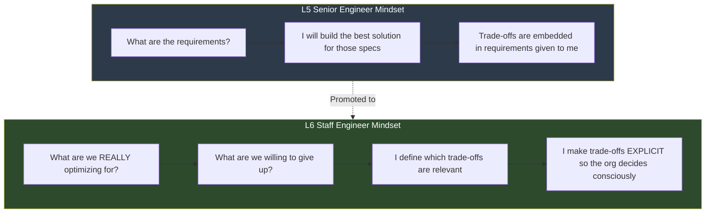

### CAP Theorem -- The Full Picture

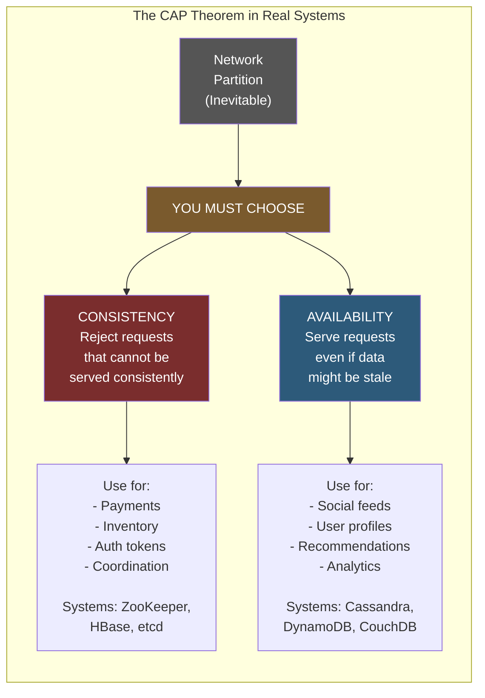

### Trade-off Communication Framework

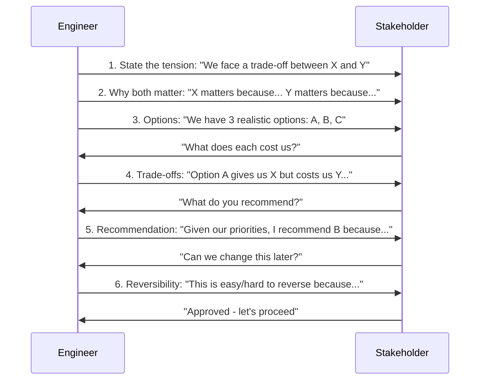

### Handling Pushback -- The Four-Step Response

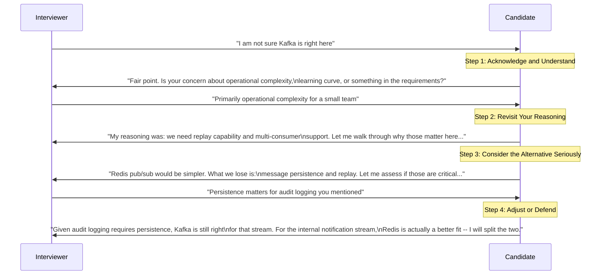

### The Blast Radius Assessment

```mermaid
quadrantChart
    title Blast Radius: How Conservative Should Your Trade-off Be?
    x-axis Rarely Occurs --> Frequently Occurs
    y-axis Few Users Affected --> All Users Affected
    quadrant-1 HIGH RISK: Conservative trade-off required
    quadrant-2 CRITICAL PATH: Most conservative, invest in mitigation
    quadrant-3 LOW RISK: Can be aggressive with trade-off
    quadrant-4 MEDIUM RISK: Monitor closely, have runbook
    Payment Error: [0.3, 0.9]
    Complete Outage: [0.15, 0.98]
    Cache Staleness: [0.7, 0.6]
    Notification Delay: [0.6, 0.35]
    Background Job Failure: [0.5, 0.1]
    Log Write Failure: [0.4, 0.05]
    Feed Recommendation Stale: [0.75, 0.5]
```

### Trade-off Evolution with Scale

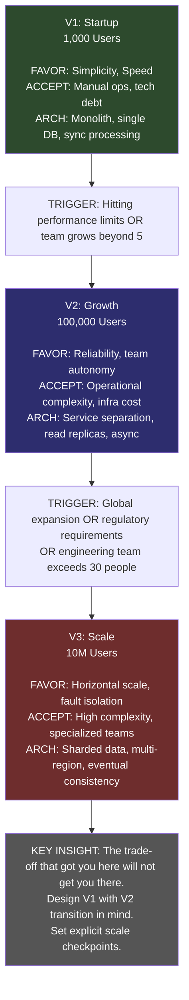

### Decision Reversibility Spectrum (Mindmap)

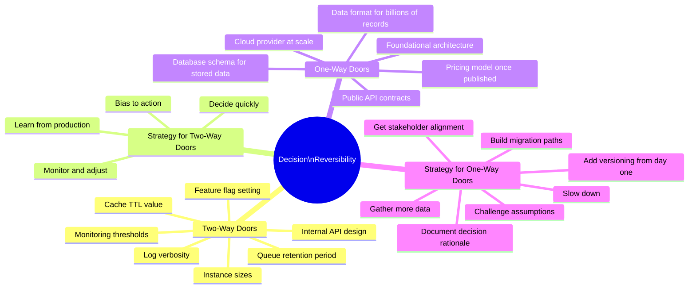

### Consistency Model Spectrum

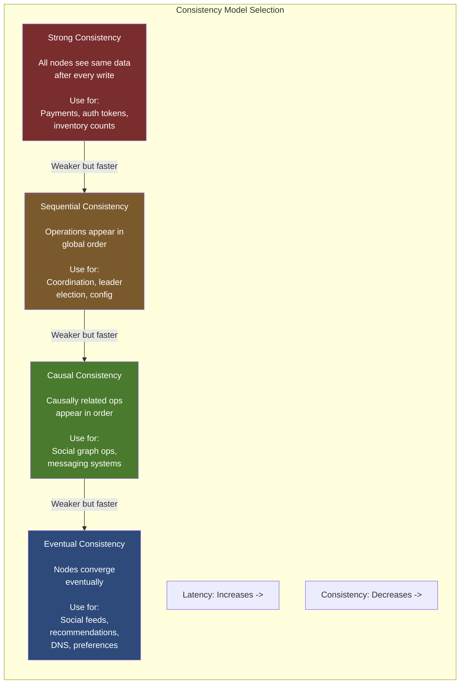

---

## Pre-Interview Trade-off Checklist

Before your Google Staff Engineer interview, verify you can do all of these:

**Trade-off identification:**
- Name five major trade-off dimensions in distributed systems without referring to notes
- For any system design problem, identify the three most important trade-offs in under two minutes
- Surface trade-offs that were not mentioned in the problem statement

**Trade-off communication:**
- Walk through the six-step communication framework smoothly without it sounding scripted
- Present two or three realistic options with honest pros and cons for each
- Make a recommendation with clear reasoning tied to stated priorities
- Identify whether a design decision is easy or hard to reverse, and why

**Failure-aware thinking:**
- For any trade-off choice, immediately project the failure mode
- Assess blast radius across four dimensions (who, how often, how visible, how recoverable)
- Design graceful degradation paths for critical trade-offs
- Know what the on-call engineer would do during failure

**Pushback handling:**
- Acknowledge a challenge without being defensive or immediately caving
- Walk through your reasoning in a collaborative rather than confrontational tone
- Consider an alternative seriously and analyze its trade-offs
- Adjust your design when the alternative is genuinely better, or defend your choice with clear logic

**Scale and evolution:**
- Identify where your design breaks at 10x scale
- Name explicit checkpoints for revisiting major trade-off decisions
- Design V1 so that the V2 transition is less painful

**Cost and constraints:**
- Model the cost of your design at current scale and at 10x
- Identify the crossover point where a cheaper-now option becomes expensive-at-scale
- List all constraints before presenting a design; distinguish hard from soft
- Challenge at least one assumed constraint in your design explanation

If you check all of these, you are demonstrating Staff-level trade-off thinking and are well-prepared for the Google L6 system design interview.

---

## Deep Dive: The Full Constraint Hierarchy with Worked Examples

### User Requirements -- The Ultimate "Why"

User requirements exist because there is a human being on the other end of every system you build. They have needs, expectations, and tolerance thresholds. Understanding user requirements deeply is the starting point for all trade-off reasoning.

The problem with user requirements as stated is that they are almost never precise enough to drive design decisions without interpretation. "The system should be fast" is a requirement that appears in almost every product brief ever written. It tells you essentially nothing. "The homepage should load in under one second on a 3G connection for 95% of users" is a requirement you can design around.

Part of the Staff engineer's job in the first minutes of a design interview is to sharpen vague requirements into precise ones. Here is how that looks in practice:

**Vague**: "Users expect real-time updates."
**Sharp**: "In the context of our chat application, messages should appear in the recipient's UI within two seconds of being sent on a stable network connection. On degraded connections, a 'message pending' indicator is acceptable."

**Vague**: "The system should be highly available."
**Sharp**: "The payment API should have 99.99% availability -- roughly 52 minutes of downtime per year. The internal reporting dashboard can have 99.5% availability -- roughly 44 hours of downtime per year. These are different systems with different user expectations."

**Vague**: "We need to support a lot of users."
**Sharp**: "At launch, we expect ten thousand daily active users. Our investor deck targets one hundred thousand in year two. We should design for ten thousand now and have a plan for the ten-times scaling that does not require a complete rewrite."

Notice that in each case, sharpening the requirement reveals constraints that were hidden. "Real-time" has a specific number. "Highly available" has different numbers for different components. "A lot of users" has a specific range with a specific growth plan.

**Why this matters for L6 interviews**: When an interviewer gives you a vague requirement, the L6 move is to sharpen it immediately. "When you say the system should be fast, can you help me understand what fast means for this use case? Is it under one hundred milliseconds? Under one second? Does it vary by operation?" This is not stalling -- it is demonstrating that you know precise requirements are the foundation of correct trade-off decisions.

### Business Constraints -- The Commercial Reality

Business constraints come from the commercial and strategic context in which engineering happens. They feel arbitrary to engineers but almost always have real reasons behind them.

**Timeline constraints** -- "We need to launch in six months" -- come from: competitive pressure (if we do not launch, a competitor will), investor milestones (our series B requires a product demo), customer commitments (we promised this feature in the contract), or internal planning cycles (Q4 is when we pitch for budget).

When a timeline constraint shapes your architecture, name it: "Given our six-month timeline, I am choosing to use managed services everywhere rather than self-hosted infrastructure. This adds ongoing operating cost compared to self-hosted, but saves approximately three months of infrastructure work. The trade-off is higher monthly cost for faster delivery."

**Budget constraints** -- "Our infrastructure budget is $50K/month" -- come from: company financial constraints, departmental allocation, historical spending patterns, or competitive margin pressures. Budget constraints are more often soft than they appear. If you can show that an additional $10K/month in infrastructure generates $100K/month in revenue, the constraint typically relaxes.

The Staff engineer's move: model the ROI. "Our current budget allows for Option A at $40K/month. Option B costs $55K/month but reduces p99 latency from 500ms to 100ms. Based on our A/B test data showing conversion increases with faster page loads, Option B likely generates an additional $150K/month in revenue. Should I model this in more detail for leadership?"

**Revenue targets** -- these create pressure on system design in subtle ways. If a team is on the hook for a specific revenue number, they are more likely to push features over reliability, more likely to accept technical debt in exchange for shipping speed, and more likely to resist infrastructure investments that do not have immediate product impact. Staff engineers make this tension explicit: "I understand we are targeting $2M ARR by Q4. The three features on the roadmap will help with that. There is a concurrent risk I want to flag: our payment system is currently a single point of failure. If it goes down during peak holiday shopping, we lose an estimated $20K/hour in revenue. That risk is growing as revenue grows. I recommend we budget one sprint for payment system resilience before Q4 peak season."

### Technical Constraints -- What Physics and Technology Impose

Technical constraints are the ones engineers are most comfortable identifying but sometimes too accepting of. Not all technical constraints are immovable -- some are choices masquerading as constraints.

**True technical constraints** (genuinely immovable):
- Speed of light limits network latency. New York to London is roughly 70ms minimum round-trip. You cannot engineer around this.
- Hard drive seek times. Spinning disk seeks take 3-10ms. SSD seeks take 0.1ms. This is physics, not configuration.
- Memory access latency hierarchy: L1 cache is 1ns, DRAM is 100ns, SSD is 100 microseconds, spinning disk is 10ms. This shapes every caching decision you make.
- Network bandwidth has physical limits per link.

**Soft technical constraints** (choices that feel like constraints):
- "We use Oracle because that is what we have always used." This is a historical constraint, not a technical one. Oracle can be replaced.
- "Our cloud provider does not support feature X." This is a vendor constraint. Switching providers is expensive but possible.
- "Our current API structure prevents this optimization." This is a design constraint. APIs can be versioned and evolved.

**The Staff engineer's skill**: Distinguish between constraints that are genuinely immovable and constraints that are simply expensive to move. This determines which constraints you work around and which you challenge.

Concrete example: "The team says we cannot use gRPC because our mobile clients use REST. That is a constraint, but is it an immovable one? gRPC-Web allows browser and mobile clients to use gRPC. Alternatively, we could use gRPC for service-to-service communication -- where it delivers the most value in throughput and schema enforcement -- and keep REST for the client-facing API. The constraint is not binary. There is a hybrid path that removes the constraint in the places it matters most."

### Team Constraints -- The Human Dimension of Architecture

Team constraints are the most under-discussed category in system design interviews, but they are often the binding constraint in practice.

**Team size determines operational overhead budget**: Each service you add to an architecture adds operational burden. Someone needs to be on-call for it, understand its failure modes, write runbooks, monitor it, and upgrade it over time. The burden per service is roughly constant. Therefore, the total manageable complexity is roughly proportional to team size. A five-person team can sustainably operate two to four services. A fifty-person team can sustainably operate twenty to thirty.

This is not a rule you can engineer around. If you design ten services for a five-person team, the team will be perpetually firefighting, unable to develop new features, and at high risk of burnout. The architecture must match the organizational capacity.

**Team expertise shapes risk profile**: A team that has been running Kafka for three years has a fundamentally different Kafka risk profile than a team adopting it for the first time. The same technology carries different operational risk depending on the team's experience with it.

The L6 move: account for this explicitly. "I am recommending RabbitMQ over Kafka for this system even though Kafka has better durability guarantees, because our team has operated RabbitMQ for two years and has zero Kafka experience. The operational risk of an unfamiliar system for a small team outweighs the technical advantages. If we are willing to invest in Kafka training over the next quarter, I would revisit this recommendation."

**Team structure reflects in system architecture -- Conway's Law**: Teams that communicate closely build tightly integrated systems. Teams that rarely communicate build loosely coupled systems. This is not primarily a design choice -- it is an emergent property of how people work.

A Staff engineer uses Conway's Law proactively: "If we want a microservices architecture, we need team structures that match. Independent services need independent teams. Right now, the three backend engineers all work on the same features. If we split to microservices, they will still have to coordinate every sprint, which eliminates the benefit of service independence. I recommend we either stay with the monolith until the team grows and specializes, or we consciously restructure the team around service boundaries before we restructure the architecture. Architecture that fights the team structure will be continuously undermined by the team's natural communication patterns."

---

## Deep Dive: Failure-Aware Trade-off Thinking -- Full Production Incident Analysis

### The Write-Through Cache Incident -- Full Reconstruction

This is a detailed reconstruction of a real-class incident that illustrates how trade-off decisions made at design time manifest as production failures many months later. Understanding this causal chain -- from a design-time decision to a production outage -- is essential for L6-level reasoning.

**The original design decision -- eighteen months before the incident:**

The team chose a write-through cache for product recommendation data. The design document recorded:

"We need strong consistency for product recommendations -- we do not want users to see outdated prices or out-of-stock items in their recommendations. We are implementing a write-through cache: every write to the product database triggers a synchronous cache update. Reads always return fresh data. Trade-off accepted: write latency increases because we must confirm both cache and database before returning. This is acceptable because product updates are infrequent (approximately one thousand per day) and can tolerate additional latency."

This is a reasonable, well-documented trade-off. The team understood what they were trading. The problem was not the choice itself.

**The missing piece in the design:**

The design document never answered: "What happens when the database write succeeds but the cache write fails?" Or more critically: "What happens when the database becomes slow -- not down, just slow?"

**The incident trigger:**

A routine database maintenance window caused primary query latency to spike from a baseline of 5ms to approximately 2,000ms. The database was responding, just slowly. The write-through cache implementation was coded to block on both the database write and the cache write before returning to the caller. Suddenly, every product update operation took over 2,000ms instead of 10ms.

**The cascade -- how a slow database became a user-facing outage:**

The product update service started timing out on its own callers. Upstream services waiting for product update confirmations started backing up -- their thread pools began filling. After six minutes, health checks began failing because API servers were spending all their threads waiting on slow database writes. The load balancer began cycling traffic off unhealthy instances. But since the database was the shared bottleneck across all instances, removing load from one instance just shifted it to another, which also became unhealthy.

Within nine minutes of the maintenance window starting, the recommendation API error rate reached 89%. The browse pages on the main site, which depended on recommendations, were showing errors. The shopping cart was unaffected because it used a different database cluster.

**The attempted mitigation during the incident:**

The on-call engineer identified database latency as root cause quickly -- three minutes after the first alert fired. They attempted:

First: read replica failover for the recommendation read path. This helped reads (which now went to the replica) but writes were still going to the primary and still blocking.

Second: enabling a "stale mode" -- a code path that was designed to allow reading from cache even if the database was slow. The engineer tried to enable it via a feature flag. The stale mode had a race condition: enabling it caused duplicate cache entries, which caused a different cascading error. It was rolled back after four minutes.

Third: scaling up the recommendation service by adding more instances. More instances meant more connections hitting the slow database, which increased database contention rather than reducing it. This made things marginally worse.

The incident self-resolved when the maintenance window completed and database latency returned to baseline, approximately twenty-three minutes after it started.

**Post-incident root cause analysis -- the L6 lesson:**

The root cause was not the write-through cache decision. That was a reasonable choice. The root cause was that the failure mode of that decision was never explicitly designed for.

The design said "write latency increases when the database is slow." It did not complete the reasoning: "When the database is slow, the cache write blocks, which blocks the update service thread, which cascades to the API servers' thread pools, which causes health checks to fail, which causes load balancer churn, which makes the browse experience fail for 40% of users."

The "stale mode" escape hatch existed in code but was never tested under load conditions. It was built as a theoretical safety valve but deployed as an untested one.

**The design change after the incident:**

A circuit breaker was added between the recommendation service and the database. If database write latency exceeds 200ms for 30 consecutive seconds, the circuit opens. In open state:
- Writes are acknowledged immediately (optimistic acceptance)
- The actual database write is queued asynchronously
- The cache is updated with the new data
- The response returns quickly to the caller

Data during circuit-open state is eventually consistent -- a product update might not be fully persisted for up to 30 seconds. This is explicitly acceptable for product catalog data.

The runbook was updated: "If 'circuit open' alert fires, check database health dashboard. Expected behavior: API continues serving, product updates are async-persisted. Expected resolution: auto-resolves when database recovers. If database degradation exceeds one hour, escalate to database team."

**The one-line lesson**: Every trade-off needs its failure projection. "We chose consistency via write-through cache" must be completed with "so during database degradation, writes block, which cascades to these services, affecting these users. Here is our designed degradation behavior and here is the runbook."

### Rate Limiter Failure Analysis -- Complete Walk-Through

The rate limiter scenario is one of the cleanest examples of failure-aware trade-off thinking because the failure modes are completely predictable and the design for each is tractable. It is also a common interview topic.

**The design decision**: Use a centralized Redis store for rate limiting. Every API request checks the Redis counter before proceeding. If the counter exceeds the threshold, reject the request with HTTP 429.

**Why centralized Redis is the "accuracy" choice**: With a centralized counter, every request from any user hitting any API server increments the same counter. If a user is allowed 1,000 requests per hour, they cannot get 3,000 by load-balancing across three servers. The counting is accurate across the entire fleet.

**Failure Mode 1: Redis is completely unavailable**

What happens: the Redis connection pool gets connection refused errors. Every API request that tries to check the rate limit gets an error before processing.

Option A -- Fail closed: reject all requests when Redis is unavailable. Every user gets HTTP 429 regardless of their actual usage. The entire API appears rate-limited to all users for the duration of the outage.

Option B -- Fail open: allow all requests when Redis is unavailable. Rate limits are completely unenforced during the outage. A malicious user could send unlimited requests.

Option C -- Fail to local limiting: each API server maintains a local in-memory counter. During Redis outage, each server independently limits the user to their full per-hour quota. A user hitting three servers could get up to 3x their quota.

The L6 recommendation: Option C. During a Redis outage, degrade to per-server limiting. Accept that users might get approximately N-times their quota (where N is the number of servers they can reach) during the outage. The outage is typically short. The blast radius of over-limiting -- the entire API being unusable for all users -- is far worse than the blast radius of under-limiting -- a few users getting up to 10x their quota for the duration of a short outage.

Verbatim interview phrasing: "I am choosing accuracy via centralized Redis. But I am designing graceful degradation. During a Redis outage, we fall to per-server limiting. A user hitting ten servers could in theory get 10,000 requests instead of 1,000. I assess this risk as acceptable because Redis outages are typically minutes long, most clients do not approach their rate limits under normal usage, and the alternative -- complete API unavailability -- has a blast radius of every user, not a small fraction of abusive ones."

**Failure Mode 2: Redis is slow -- p99 exceeds 50ms**

What happens: rate limit checks that normally take 1ms now take 80ms. For a payment API with a 200ms end-to-end SLA, adding 80ms of rate limit overhead is unacceptable.

Design: set an aggressive timeout on the Redis call -- 10ms maximum. If Redis does not respond within 10ms, use the cached local count from the last successful sync. Accept that the count might be up to 10ms stale. Resume normal synced operation when Redis recovers.

Verbatim interview phrasing: "The Redis timeout is 10ms. We are accepting up to 10ms of count staleness during Redis slow periods in exchange for keeping rate limit overhead under 5ms in the request path. The risk: if Redis is slow for an extended period, count staleness grows and users could temporarily exceed their limits by a small margin. This is acceptable compared to adding 80ms latency to every API request."

**Failure Mode 3: Network partition -- some servers can reach Redis, some cannot**

What happens: a network partition means half the API servers have Redis access and half do not. The servers without Redis access fall back to local counting. Users whose requests happen to be load-balanced to the non-Redis servers get per-server limiting; users whose requests hit Redis-connected servers get accurate limiting.

Design: accept this inconsistency during the partition. Alert fires on "Redis unreachable" for affected servers. On-call investigates the network partition. Typical resolution: minutes to tens of minutes.

Verbatim interview phrasing: "During a partition, rate limiting is inconsistent across the fleet. I accept this because partitions are short, the business impact of inconsistent rate limits during a brief partition is low, and the alternative -- rejecting all requests from non-Redis servers -- causes a partial outage that affects a potentially large fraction of users."

**The complete failure-aware summary for the interview:**

"I am implementing centralized Redis rate limiting for accuracy. Let me walk through the three failure modes I am designing for:

Redis unavailable: fall to local per-server limiting. Users may get up to ten times their quota during the outage. An alert fires immediately on Redis connectivity failure. Expected outage duration: minutes. On-call runbook: verify Redis cluster health, check whether Redis Cluster failover is occurring.

Redis slow: aggressive 10ms timeout. Use stale local count during slow period. Users may slightly exceed limits. Alert fires on high Redis p99 latency. Expected resolution: Redis team investigates.

Network partition: inconsistent limiting across fleet. Per-server limits on isolated nodes. Alert fires on per-server Redis connectivity errors. Expected resolution: network team investigates.

For all three failure modes, the API continues to serve requests. Rate limiting accuracy decreases temporarily. Alerts fire for operator investigation. I chose to design for degraded-but-available rather than accurate-but-potentially-down, because a complete API outage has a much larger blast radius than temporary rate limit inaccuracy."

---

## Deep Dive: Trade-offs Under Uncertainty

### The Five-Part Uncertainty Communication Framework

When you are designing a system with incomplete information -- which is almost always -- you need to communicate your assumptions, your decisions, and your sensitivity to uncertainty in a structured way. Here is the five-part framework with a complete worked example.

**Part 1 -- State your assumptions explicitly**: Name the numbers and conditions you are designing around. "I am assuming traffic will be in the range of 1,000 to 100,000 QPS in the first twelve months. The wide range reflects genuine uncertainty about product success."

**Part 2 -- Make the decision given those assumptions**: Do not defer. Pick an option and justify it. "Given this range, I am recommending PostgreSQL on RDS with read replicas. At the low end, a single primary handles this comfortably. At the high end, the read replicas absorb read traffic and the primary handles writes."

**Part 3 -- Identify sensitivity**: Which assumption, if wrong, would most change the decision? "This decision is most sensitive to the write volume assumption. If writes consistently exceed 20,000 per second, we would need to evaluate sharding. Read volume is handled by adding replicas."

**Part 4 -- Propose validation**: How do you test the key assumption? "Within eight weeks of launch, we will have real traffic data. I will set up monitoring for primary write throughput with an alert at 15,000 writes per second, giving us lead time before we hit the theoretical limit."

**Part 5 -- Define the pivot point**: What new information changes the decision? "If primary write throughput consistently exceeds 15,000 operations per second, or if we project reaching that threshold within six months, I will initiate a sharding design session. That is a four-to-six month project, so we need to start with at least six months of lead time."

**Why this is L6**: The L5 version says "I will use PostgreSQL because it is reliable and our team knows it." The L6 version acknowledges the uncertainty range, makes the decision defensible within that range, identifies where the decision breaks, proposes a validation mechanism, and defines the trigger for the next design change. This is engineering under uncertainty -- not avoiding decisions, but making them transparently with defined checkpoints.

### Scenarios Where Uncertainty Changes the Design

Not all trade-offs are robust to uncertainty. Some decisions that look correct in the expected case fail badly in edge cases.

**Scenario 1: Cache hit rate uncertainty**

Expected case: 90% cache hit rate. Cache serves most traffic. Database handles 10% of requests. Everything is fine at current scale.

Uncertain case: if cache hit rate drops to 50% due to cache failure, cache cold start, or unexpected traffic pattern, database traffic doubles. Is the database sized for 2x traffic? Most teams size for the expected case with small headroom, not for the worst case. A cache failure that drives 5x traffic to the database can cause a cascading failure.

L6 design response: size the database to handle 3-5x normal traffic without degrading. The cache is an optimization layer, not a load-bearing structure. The system should degrade gracefully if the cache is ineffective -- not fail catastrophically. Also add a circuit breaker: if the cache miss rate exceeds 40%, start throttling incoming traffic rather than allowing all cache misses to hit the database simultaneously.

**Scenario 2: Fan-out depth uncertainty**

Expected case: typical user has 500 followers. Fan-out generates 500 writes per post. At 10,000 posts per day, that is 5 million write operations per day -- manageable.

Uncertain case: a celebrity with 5 million followers joins the platform and makes a post. Suddenly a single post generates 5 million writes. The fan-out worker queue backs up catastrophically, delaying other users' posts, potentially for hours.

L6 design response: the fan-out threshold -- above which you switch from write-time fan-out to read-time fan-out -- should be set conservatively and should be dynamically adjustable via configuration without a code deploy. Start at 10,000 followers. Monitor maximum fan-out depth distribution. Adjust the threshold based on observed worker queue depth. Never design a fan-out system without explicit protections against outlier fan-out depth, and never assume your current maximum follower count represents the future maximum.

**Scenario 3: Synchronous dependency chain uncertainty**

Expected case: Service A calls Service B calls Service C. Each call takes 10ms. Total: 30ms. Well within the 200ms end-to-end SLA.

Uncertain case: Service C has a traffic spike and p99 latency increases to 300ms. Now the chain takes 320ms. SLA violated for those requests. Worse: Service A has ten threads waiting on Service B, which are all blocked waiting on Service C. Thread pool exhaustion propagates upstream.

L6 design response: set explicit timeout budgets at every synchronous call in the chain. Service A's call to Service B times out after 150ms maximum. If Service B does not respond in time, Service A returns a graceful degraded response -- a cached result, a default value, or an explicit indication of degraded mode. Never build synchronous dependency chains without timeouts at every hop, and never design without explicitly asking: "What happens when the slowest downstream service in this chain has a bad day?"

---

## Deep Dive: Technical Debt as Trade-off Reasoning

### The Full Technical Debt Framework

Technical debt is one of the most misunderstood concepts in software engineering. It gets discussed as a moral failing ("we have bad code"), as an inevitability ("all code becomes legacy"), and as an emergency ("stop everything, rewrite"). None of these framings are useful for decision-making.

The useful framing: technical debt is a deliberate trade-off with a carrying cost and a payoff cost, subject to the same return-on-investment analysis as any other investment decision.

**Three types of technical debt:**

Type 1 -- Deliberate and documented: the team explicitly chose a shortcut and wrote it down. "We are hard-coding the currency conversion rate for now. This will break if we expand internationally. We will fix this before the international launch." This debt is healthy -- it is intentional and has a defined resolution trigger.

Type 2 -- Deliberate but undocumented: the team chose a shortcut but did not write it down. Six months later, nobody remembers why the code is structured the way it is. The shortcut becomes permanent because nobody knows it was temporary. The carry cost compounds invisibly.

Type 3 -- Accidental: the team did not know they were incurring debt. Often the result of incomplete knowledge, unexpected requirements changes, or design decisions that seemed right at the time but have not aged well.

**The carry cost versus payoff cost analysis:**

Carry cost per month = (additional time per change in this area x change frequency per month) + (incident frequency per month x average incident resolution time x loaded hourly rate)

Payoff cost = engineering time to fix + migration risk cost (estimated probability of regression x cost of regression) + opportunity cost of not doing something else

Payback period = payoff cost / carry cost

Rule of thumb for decisions:
- Payback under six months: pay the debt, it is clearly worth it
- Payback six to twelve months: pay before building significant new features on top of it
- Payback one to two years: carry it, but document it and monitor whether carry cost is increasing
- Payback over two years: carry it unless the area is about to receive major new investment

**Worked example -- messaging system ordering debt:**

The system does not guarantee message ordering within a conversation. This was a shortcut taken during the initial build when the team needed to ship quickly.

Carry cost analysis:
- Two bugs per month related to ordering, each taking two hours to resolve: 4 engineer-hours per month
- Three user complaints per month handled by customer support at one hour each: 3 support-hours per month
- Total monthly carry cost at loaded rates ($150/hour engineering, $50/hour support): approximately $750/month

Payoff cost analysis:
- Engineering time: six weeks for one senior engineer = 240 hours = $36,000
- Migration risk mitigation: 40 additional hours for careful testing = $6,000
- Total payoff cost: approximately $42,000

Payback period: $42,000 / $750 = 56 months (4.7 years)

Standalone recommendation: do not pay this debt. The ROI is poor.

Exception trigger that changes the analysis: the team is about to build conversation threading -- a feature that requires correct message ordering as its foundation. Now the options are: (a) build threading on a broken foundation and have it be buggy from day one, or (b) fix ordering first, then build threading. In case (b), the payoff cost of fixing ordering is a prerequisite for delivering threading, not an optional standalone investment. The analysis changes completely: fix ordering first because the alternative is building a major roadmap feature on a known-broken foundation, which compounds the debt into a multi-year maintenance burden.

**Communicating technical debt to non-engineers:**

The mistake engineers make is presenting debt in technical terms: "the coupling between these modules makes refactoring difficult." Product managers and executives do not have a model for why coupling is bad or what refactoring means.

Better framing: "There is an area in our codebase that takes about 40% longer to change than equivalent areas. Every new feature we build in this area costs extra. Over the next two years, we have four features planned that touch this area. The extra cost of working around this problem over two years is roughly eight weeks of engineering time. Fixing it now takes three weeks. I recommend we schedule three weeks to fix this before we start the second planned feature, so we do not pay the eight-week tax. This is not code quality for its own sake -- it is an investment with a fifteen-month payback."

This framing is business-relevant: you are talking about time and features, not code quality. A PM can make a prioritization decision with this framing. A conversation about "coupling and refactoring" typically ends with "can we do it later?"

---

## The Full Production Example: Notification System Trade-off Evolution

This example traces a notification system through three scale milestones, showing exactly which trade-offs were right at each stage, which expired, and what the transition looked like.

### Version 1: Ten Thousand Users, One Hundred Thousand Notifications Per Day

**Architecture:**
- Single service that handles notification creation and delivery synchronously
- Single PostgreSQL database storing notification state and history
- Hard-coded notification types: welcome email, password reset, order confirmation
- No retry logic: if delivery fails, the failure is logged and that is the end of it

**Trade-offs made at this stage:**
- Simplicity over resilience: synchronous delivery means delivery failures surface immediately to the caller, but a slow email provider blocks the calling thread
- Consistency over throughput: single database with ACID transactions means no lost notifications, but throughput is bounded by a single primary
- Speed over flexibility: hard-coded notification types ship in two days rather than two weeks for a template system, but every new notification type requires a code change and a deploy

**Why these trade-offs are correct at this scale:**
Low volume means synchronous delivery is fast enough. At 100,000 notifications per day, each delivery taking 50ms on average, that is 5,000 seconds of total delivery time spread across the day -- manageable with a few concurrent workers and no queuing needed.

The team is small. Operational simplicity is paramount. A queue-based async system would add message queue infrastructure, dead-letter queues, visibility timeouts, and retry logic. That is several weeks of work and several new operational failure modes for a team that is already stretched.

Requirements are stable. The notification types have not changed in three months. Hard-coding is the right call.

**Warning signs that this version is approaching its limits:**
- The email provider occasionally takes two to three seconds to respond. When this happens, synchronous delivery blocks the calling thread and slows the upstream feature that triggered the notification.
- The notification database is approaching 10 million rows. Table scans on unindexed historical queries are getting slow.
- The team has been asked to add three new notification types in Q2. The hard-coded approach requires three separate code changes and deploys.

### Version 2: Five Hundred Thousand Users, Five Million Notifications Per Day

The version 1 trade-offs have expired. Time to shift.

**Architecture changes:**
- Async delivery via a managed message queue: notification creation immediately enqueues the request and returns success. Delivery workers process the queue independently.
- Dead-letter queue: failed deliveries after five retry attempts go to a DLQ for manual inspection or batch reprocessing.
- Database-driven notification templates: templates stored in the database. Adding a new notification type is a data change, not a code change.
- Retry logic: delivery failures retry with exponential backoff -- 1 minute, 5 minutes, 30 minutes, 2 hours, 8 hours.

**New trade-offs at this stage:**
- Resilience over simplicity: the queue, DLQ, retry logic, and template database add complexity. The system now has more moving parts and more things that can fail in interesting ways. But it handles email provider failures gracefully rather than blocking the entire calling service.
- Throughput over strict consistency: delivery is now eventually consistent. A notification created at 2:00pm might be delivered at 2:00:30pm. This is acceptable for all current notification types -- none are time-critical at the second level.
- Flexibility over deployment speed: new notification types are data operations, not code deployments. The initial investment in the template system was two weeks. The ongoing return is rapid iteration on notification content without engineering involvement.

**Cost of transition from V1 to V2:**
Approximately eight weeks of engineering time, one week of testing and dark-launch rollout, and new operational surface area: queue health monitoring, DLQ size alerting, retry rate tracking.

**What would have broken if the team had not made this transition:**
Synchronous delivery with 5 million daily notifications would mean roughly 58 deliveries per second on average -- and much higher at peak. An email provider spike to 300ms latency would have created 300ms x 58 deliveries/second = 17 seconds of blocking per second -- effectively halting delivery. Thread pools in the calling services would have saturated, causing cascading failures upstream.

### Version 3: Ten Million Users, One Hundred Million Notifications Per Day

Another order-of-magnitude increase. The V2 trade-offs are now the bottleneck.

**Architecture changes:**
- Sharded queue processing: notifications partitioned by user ID shard across multiple queues, enabling parallel processing at scale
- Tiered priority queuing: a fast-path queue for time-sensitive notifications (2FA codes, fraud alerts) with dedicated workers and strict latency SLOs, and a standard queue for everything else
- Horizontally sharded notification database: user notification history partitioned by user ID shard
- Self-service notification configuration: product teams configure their own notification types, templates, and routing rules without involving the platform team, subject to guardrails

**New trade-offs at V3:**
- Horizontal scale over operational simplicity: sharding adds significant complexity -- sharding logic, cross-shard queries, rebalancing procedures, shard-aware routing. This is a necessary trade. The alternative is a single queue processing over 1,100 notifications per second continuously with no isolation between time-sensitive and best-effort traffic.
- Eventual consistency as the norm: at this scale, strict ordering guarantees within a user's notification history are expensive. The V3 design explicitly accepts that notifications might arrive slightly out of creation order.
- Self-service over control: the platform team previously reviewed every new notification type. At this scale, that review becomes a bottleneck for product teams. Self-service with guardrails -- rate limits, template validation, compliance checks -- lets product teams move faster while the platform team focuses on infrastructure.

**The architectural planning insight -- what a Staff engineer adds:**

"For V1, we designed it to be simple. But we deliberately designed the interface between callers and the notification service so that callers do not know whether delivery is synchronous or asynchronous. When we moved to async delivery in V2, the callers did not need to change. We absorbed the complexity change at the platform boundary.

Similarly, at V2, we keyed all notification records by user ID from day one. V3 sharding required infrastructure work but no schema migration on existing data.

This is the planning principle at Staff level: design V1 so that the V2 transition is as cheap as possible. Not by building V2 complexity into V1, but by avoiding design choices that would require painful migrations when V2 becomes necessary. The cost of this planning is small -- a few hours of forethought at the start. The return is measured in weeks of avoided migration work."

---

## All Interview Phrases, Templates, and Communication Scripts

### Phrases for Every Situation

**Opening a trade-off discussion without being prompted:**
- "Before I recommend a solution, let me surface the key trade-offs here."
- "There is a fundamental tension in this problem between X and Y. Let me walk through it."
- "The most important decision I need to make here is between A and B. Here is why it matters."
- "I see three realistic options. Let me walk through what each one gains and gives up."
- "The constraint driving my design most is X. Let me explain why, and check whether you agree."

**Explaining a choice:**
- "I am choosing X over Y. Here is what I am gaining: [benefit]. Here is what I am giving up: [cost]. This makes sense for our context because [reasoning]."
- "The reason I am accepting this trade-off is that [the cost of the alternative] is higher than [the cost of this choice]."
- "This is a deliberate trade-off. I am trading [A] for [B] because in our context, [B] is more valuable than [A]."

**Projecting failure -- the L6 finisher:**
- "Let me project what happens when this choice goes wrong."
- "When the database is slow, this design behaves as follows: [behavior]. Is that acceptable for this product?"
- "The failure mode of this trade-off is [description]. The blast radius is [scope]. Here is how we contain it."
- "During degradation, users will experience [description]. I assess that as [acceptable/problematic] because [reasoning]."

**Acknowledging pushback:**
- "That is a fair challenge. Help me understand your concern -- is it about [A] or [B]?"
- "Good point. Let me think about that seriously."
- "I hear the concern. Let me walk through my reasoning and see if it holds up under your challenge."

**Exploring an alternative seriously:**
- "If we used [alternative], here is what we would gain: [benefit]. Here is what we would give up: [cost]. Let me assess whether that trade is better or worse for our situation."
- "That alternative is worth considering seriously. The main differences are [X and Y]. Given our priorities, I would still lean toward my original recommendation because [reason], but if [different condition], the alternative would be better."
- "You are right that [alternative] is simpler. The question is whether [the capability we lose] is critical. Let me revisit the requirements against that."

**Handling uncertainty:**
- "I am working with uncertainty on [dimension]. My assumption is [X]. If [Y] instead, the design changes in [these ways]."
- "This is a reversible decision. I am making my best call now with available information. We should revisit when we have production data in [timeframe]."
- "The main uncertainty is [X]. I am designing to be robust to that uncertainty by [approach]. If [X] resolves to [specific scenario], I would adjust the design by [specific change]."

**Discussing reversibility:**
- "This is a two-way door -- we can change it easily if we are wrong."
- "This is a one-way door. Once clients depend on this API, we cannot change it without breaking them. I want to slow down here."
- "I am making this more reversible by adding versioning from day one and starting with a minimal interface."

**Discussing cost as a first-class constraint:**
- "Let me model the cost at current scale and at 10x."
- "The managed service costs $X/month at current volume. At 10x volume, that becomes $Y/month. The crossover point where self-hosted becomes cheaper is at Z volume."
- "Cost is a design constraint here, not an afterthought. At 10x scale, the per-request fees represent [percentage] of revenue -- that is a business-critical number."

---

### The Complete Trade-off Statement Template

Memorize this structure. Not as a script, but as a skeleton you can fill in naturally during an interview.

"For [component or decision], I am recommending [choice].

The main trade-off is [what we are giving up] in exchange for [what we are gaining].

This makes sense for our context because [reasoning tied to our specific priorities and constraints].

The failure mode of this choice is [description]. During [failure scenario], users will [experience]. The blast radius is [scope]. We handle it by [mitigation].

If [conditions were different -- different priorities, different scale, different constraints], we would reconsider [alternative].

This decision is [easy or hard] to reverse because [reasoning]. [If hard to reverse: here is how we make it more reversible.] [If easy to reverse: here is what we monitor to know when to change it.]"

**Worked example -- user session store:**

"For the user session store, I am recommending Redis with a 24-hour TTL.

The main trade-off is session persistence in exchange for simplicity and low latency. If Redis fails without a fallback, users are logged out. We are accepting that risk in exchange for sub-millisecond session lookups and a simple operational model.

This makes sense for our context because sessions are idempotent -- being logged out and logging back in is annoying but not data-losing. Our users are accustomed to occasional re-authentication. The alternative, synchronous writes to a persistent database for every session operation, would add 20-50ms to every authenticated request. At our traffic volume, that is a significant UX regression that affects every logged-in user on every page load.

The failure mode: if Redis is unavailable, session lookups fail, and authenticated routes return unauthorized errors. The blast radius is every authenticated user -- roughly 80% of our active users during business hours. We handle it by: first, Redis Cluster with automatic failover (reduces outage from minutes to seconds); second, client-side JWT tokens as a fallback for a degraded-but-running state (users with a valid unexpired JWT can continue without a session store); third, a runbook for Redis recovery that the on-call engineer can execute in under five minutes.

If we were building a financial services platform where losing a session mid-transaction causes real financial harm, we would reconsider persistent session storage and accept the latency cost.

This decision is easy to reverse -- we can add persistent session storage behind the same interface without changing callers. The migration would take one sprint. I would trigger a revisit if session-related incidents start appearing in our SLA reports."

---

## Visual Summary: Chapter 11 in Full

### The L6 Trade-off Thinking Map

```mermaid
flowchart TD
    subgraph "WHEN HEARING A DESIGN PROBLEM"
        P["Problem stated by interviewer"]
        P --> ID["IDENTIFY TRADE-OFFS unprompted\nConsistency vs Availability?\nLatency vs Throughput?\nSimplicity vs Flexibility?\nBuild vs Buy?"]
        ID --> CONSTRAINT["IDENTIFY CONSTRAINTS\nUser requirements\nBusiness: timeline, budget\nTechnical: latency, throughput\nTeam: size, expertise, on-call\nWhich is the BINDING constraint?"]
    end

    subgraph "WHEN MAKING A DECISION"
        CONSTRAINT --> OPTS["DESCRIBE 2-3 OPTIONS\nNot 10, not 1\nShow you understand the space"]
        OPTS --> TRADEOFF["ARTICULATE EACH TRADE-OFF\nOption A: gains X, costs Y\nOption B: gains Y, costs X"]
        TRADEOFF --> REC["RECOMMEND WITH REASONING\n'Given our priorities of X and Y,\nI recommend B because...'"]
        REC --> REV["ASSESS REVERSIBILITY\nOne-way door: slow down, gather data\nTwo-way door: decide fast, monitor"]
    end

    subgraph "PROJECTING AND DEFENDING"
        REV --> FAIL["PROJECT FAILURE MODES\nWhen this goes wrong:\nBlast radius: who, how often, how visible\nDegradation behavior\nOn-call runbook"]
        FAIL --> SCALE["PROJECT SCALE EVOLUTION\nWhere does this break at 10x?\nWhat triggers the redesign?\nHow do we make V1-to-V2 cheap?"]
        SCALE --> PUSH["HANDLE PUSHBACK\n1. Acknowledge + understand\n2. Revisit reasoning\n3. Consider alternative seriously\n4. Adjust or defend with logic"]
    end

    style ID fill:#2d4a7a,color:#fff
    style CONSTRAINT fill:#1a3a6a,color:#fff
    style OPTS fill:#2d6e4e,color:#fff
    style TRADEOFF fill:#1a5e3e,color:#fff
    style REC fill:#7a5a2d,color:#fff
    style REV fill:#6a4a1d,color:#fff
    style FAIL fill:#7a2d2d,color:#fff
    style SCALE fill:#6a1d1d,color:#fff
    style PUSH fill:#444,color:#fff
```

### Quick Reference: All Trade-off Dimensions

| Dimension | Favor Left | Favor Right | Key Question to Ask |
|-----------|-----------|-------------|---------------------|
| Consistency vs Availability (CAP) | Payments, auth, inventory | Social feeds, profiles, recommendations | "What is the cost if a user sees wrong data?" |
| Strong vs Eventual Consistency | Payments, session tokens, inventory counts | Social activity, analytics, DNS | "What happens if the user sees data that is 5 seconds stale?" |
| Latency vs Throughput | User-facing APIs, real-time systems | Batch pipelines, analytics ingestion | "Does a user wait for this response?" |
| Simplicity vs Flexibility | Early-stage, small team, stable domain | Mature product, known extension points, multi-tenant | "Do we have evidence we will need this flexibility?" |
| Cost vs Performance | Internal tools, variable load, non-critical | User-facing, SLA-bound, competitive edge | "What does 100ms added latency cost in revenue or user engagement?" |
| Speed of delivery vs Quality | Hypothesis validation, temp solutions | Core infrastructure, security, foundations | "What is the expected lifetime of this code?" |
| Build vs Buy | Core business differentiation | Commoditized, compliance-heavy capabilities | "Where is the cost crossover point?" |
| Centralization vs Decentralization | Consistency, economies of scale | Team autonomy, blast radius isolation | "What is the unit of autonomy the organization needs?" |
| One-way vs Two-way Door | All irreversible decisions -- slow down | All reversible decisions -- decide fast | "How expensive is being wrong here?" |
| Observability vs Cost | Critical paths, payment flows | High-volume, cost-sensitive batch paths | "What does the on-call engineer need to debug this at 3am?" |
| Security vs Velocity | External APIs, PII, compliance-bound | Internal tools, known trust boundaries | "What is the blast radius if this trust boundary is violated?" |
| Operational burden vs Features | When team is at on-call capacity | When team has operational headroom | "What happens to the on-call rotation if we add this service?" |

### Final One-Page Summary for Interview Day

**Before you design anything, ask these three questions:**
1. What are the top three trade-offs in this problem, and which is most important?
2. What are the constraints -- user, business, technical, team -- and which is the binding one?
3. Is the key architectural decision a one-way door or a two-way door?

**While designing, make yourself say these things out loud:**
- "I am choosing X over Y because [reason]. I am accepting [cost]."
- "Let me project what happens when this fails."
- "The blast radius is [scope]. Here is how we contain it."

**When the interviewer challenges you, respond in four steps:**
1. Acknowledge: "Fair point. Is your concern about [A] or [B]?"
2. Revisit: "Let me walk through my reasoning."
3. Consider: "If we used [alternative], we would gain [X] and lose [Y]."
4. Adjust or defend: "Given that, I would [change design]" OR "I would still recommend [original] because [reason]."

**The single most important sentence to remember:**

"State your trade-off. Then state what happens when the thing you favored fails."

That is what separates L5 from L6 on trade-off thinking. Not knowing more facts. Not having more vocabulary. Completing the reasoning to include failure modes, blast radius, and graceful degradation -- and making all of it visible to the people who need to own the consequences alongside you.

The goal of every trade-off conversation is not to convince someone your choice is correct. The goal is to make the consequences of each option visible so the organization can make an informed decision and consciously own the outcome. That is what Staff engineers do. That is what you are preparing to do.

---

## Extended Interview Q&A: 10 Additional Full L6 Scenarios

### Q16: "How do you decide how much observability to add to a new service?"

**Why they ask**: Observability is a trade-off dimension that L5 engineers often treat as "add as much as possible" and L6 engineers treat as a deliberate cost-benefit decision.

**L6 model answer:**

"I think about observability in three tiers, and I match the tier to the criticality and blast radius of the service.

The first question I ask is: what does an on-call engineer need to diagnose a problem in this service at 2am with no prior context? The answer to that question defines the minimum viable observability for the service.

For a critical path service -- payment processing, authentication, or anything directly in the purchase flow -- I instrument everything. One hundred percent trace sampling, per-request structured logs, latency histograms at every significant operation, error rates broken down by error type, and dashboards pre-built for the most likely failure scenarios. Yes, this is expensive. At a hundred thousand QPS, full trace sampling adds roughly fifteen percent CPU overhead and significant storage cost. For a payment service, that is completely justified -- the blast radius of a silent failure is enormous.

For a standard product service -- recommendation engine, feed builder, content delivery -- I use a sampling approach. One percent trace sampling for normal operation, switching to one hundred percent automatically when error rates exceed two percent. Standard metrics: request rate, error rate, p50/p95/p99 latency. Error logs with structured context. This gives me 95% of the diagnostic value at roughly 20% of the cost.

For a background worker or low-traffic internal service -- batch jobs, internal admin tools -- I instrument the minimum: job completion, job failure with error details, and resource utilization. Detailed tracing adds overhead without proportional value when the service handles ten requests per day.

The second dimension is: what are the most likely failure modes, and do I have the right signals to detect each one early? For every significant component I add, I run through the top five ways it can fail and verify I have a metric or log that would show me that failure before a user reports it. If I cannot answer 'yes' for a failure mode, I add instrumentation for it.

The trade-off I am explicitly making: aggressive instrumentation on critical paths, lighter instrumentation on non-critical paths, and zero instrumentation on things that do not matter. This is not laziness -- it is a deliberate cost allocation that puts observability investment where the blast radius justifies it."

### Q17: "You have two weeks to implement a feature, but the right architecture would take six weeks. What do you do?"

**Why they ask**: Speed vs. quality trade-off under real-world time pressure. They want to see if you make a deliberate choice versus just defaulting to either extreme.

**L6 model answer:**

"This is a classic speed-quality trade-off, and the right answer depends on factors I need to clarify first.

First: what is driving the two-week deadline? If it is an external commitment -- a customer demo, a contractual milestone, a competitive response -- the deadline is real and the solution must fit within it. If it is an internal estimate that turned into a commitment without full information, there may be negotiating room.

Second: what is the lifetime of this feature? Is it a permanent core feature, or a temporary experiment? If it is a sixty-day experiment to test a hypothesis, building the six-week architecture is objectively the wrong call. If it is a feature that will be in production for five years, the two-week shortcut will be paid back with interest over that lifetime.

Third: what specifically makes the six-week architecture better? Is it correctness (the two-week version has known limitations that could cause user-visible bugs), scalability (the two-week version breaks at 10x traffic), or maintainability (the two-week version is harder to extend later)? The answer changes the risk profile.

Assuming the deadline is real and the feature is permanent, here is my approach: implement the two-week version, but make the technical debt explicit and documented. Write down exactly what we are accepting: "This implementation handles up to X QPS before requiring rework. It cannot support use case Y. It accumulates technical debt in area Z. We will address this before Q3 when we plan to build feature W, which depends on area Z."

Then I set a specific trigger: "When [condition], we revisit." Not "someday" -- a specific, measurable condition.

What I explicitly do not do: implement the two-week version and pretend it is the six-week version. That creates hidden debt that compounds into an expensive surprise. The trade-off needs to be visible so the organization can decide whether to accept it with open eyes."

### Q18: "How would you design a system that needs to work across multiple geographic regions?"

**Why they ask**: Multi-region design is rich with trade-offs: data residency, replication lag, consistency, cost, complexity.

**L6 model answer:**

"Multi-region design is fundamentally a set of trade-offs around consistency, latency, cost, and compliance. Let me walk through the key decisions.

The first decision is data residency: can data freely cross regions, or are there regulatory constraints? GDPR for EU data, data sovereignty laws in certain countries, and contractual requirements can force data to stay in a specific region. This is often the binding constraint, and it changes the architecture significantly -- if EU data must stay in EU, you cannot use a single global database.

Assuming no hard residency constraints, the next decision is the consistency model for cross-region replication. Synchronous replication -- where a write is not acknowledged until it has been committed in all regions -- gives you strong consistency but adds the cross-region round-trip to every write. New York to London is roughly 70ms round-trip. Every write now takes 70ms longer. For a payment system, that might be acceptable. For a user interface action, it may not be.

Asynchronous replication -- where the write is acknowledged after committing locally, and then replicated to other regions in the background -- gives you low write latency but eventual consistency. Other regions may see writes up to several seconds after they are committed in the primary region. For read-heavy workloads where users in each region are primarily reading content from other users, this is completely fine. For cases where a user in London writes data and immediately reads it from a different endpoint in Frankfurt, you need read-your-own-writes guarantees -- the read must go to the primary or you must include the write's timestamp in the read request and the replica must catch up before serving.

The third decision is active-active versus active-passive. Active-passive means one region is the primary and handles all writes; other regions are replicas that handle reads only. Failover means promoting a replica to primary, which takes time and may require some manual coordination. Active-active means writes can go to any region, which requires conflict resolution -- what happens when the same record is updated in two regions simultaneously? This is the hardest problem in distributed systems and is almost always solved through application-level conflict resolution rules rather than a database magic solution.

For most use cases at the Staff interview level, I recommend active-passive with asynchronous read-replica replication for reads, and synchronous writes to the primary for critical paths. This gives you: low-latency reads from regional replicas, strong consistency on writes to the primary, and a clear failover story without the complexity of conflict resolution. The trade-off is that writes always go to the primary, which adds latency for users far from the primary region. This is usually acceptable -- the read-to-write ratio in most applications is heavily read-skewed."

### Q19: "Your system is experiencing high latency. Walk me through how you diagnose and fix it."

**Why they ask**: Production debugging and performance trade-off reasoning. They want to see systematic thinking, not guessing.

**L6 model answer:**

"High latency is a symptom, not a root cause. My diagnosis approach is to narrow the scope systematically rather than guess.

Step one: characterize the problem. Is it affecting all requests or a subset? All endpoints or specific ones? All users or users in specific regions? Is it constant or spiky? Does it correlate with traffic volume or specific time patterns? The answers cut the problem space dramatically.

Step two: look at the latency distribution. p50, p95, p99, and p99.9. A p99 spike with a stable p50 usually means a specific slow resource is affecting a small fraction of requests -- database query with occasional table locks, garbage collection pause, or a synchronous downstream call with tail latency. A rising p50 with everything moving together usually means a capacity constraint -- the system is working but under too much load.

Step three: trace the critical path. Which components are in the critical path for the slow requests? I would use distributed tracing to find where time is being spent. The common culprits: database query latency (most common), external service call latency, lock contention, serialization/deserialization overhead, or cold start issues.

Step four: once I have identified the bottleneck, I make a trade-off decision about the fix. The options are almost always: reduce the work being done, cache the result, parallelize the work, or add more capacity.

For example, if the bottleneck is a database query: can I cache the result? What is the acceptable staleness window? Is this a read-heavy pattern that would benefit from a read replica? Or is the query itself inefficient -- missing an index, doing a full table scan -- in which case adding hardware does not help and I need to fix the query.

The trade-off I communicate explicitly: 'Adding a cache here will reduce database load by estimated 80% and bring p99 latency from 800ms to 50ms. The trade-off is that cached results may be up to 5 minutes stale. For this specific use case -- product catalog browsing -- 5-minute staleness is acceptable. For account balance display, it is not, and I would not cache there.'"

### Q20: "How do you evaluate whether to use a microservices architecture?"

**Why they ask**: Monolith vs. microservices is a classic trade-off question with no universal correct answer. They want to see nuanced reasoning.

**L6 model answer:**

"Microservices are not inherently better than a monolith, and a monolith is not inherently better than microservices. They make different trade-offs, and the right choice depends on specific context. Let me walk through the factors I weigh.

Arguments for microservices: independent deployability (each service can be deployed without coordinating with others), independent scalability (a high-traffic service can be scaled without scaling everything), technology diversity (different services can use different languages and databases where appropriate), and fault isolation (a bug in one service does not bring down all services).

Arguments against microservices: operational complexity (each service needs its own CI/CD pipeline, monitoring, on-call rotation, and runbooks), network overhead (service calls that were function calls in a monolith become network round-trips with all the associated failure modes), distributed debugging difficulty (a request that fails in a monolith shows a clear stack trace; the same failure in a microservices system might span five services), and team coordination overhead (interface changes between services require cross-team coordination).

The practical decision framework I use:

Is the team large enough to operationally sustain multiple services? A rule of thumb: you need roughly two to three engineers dedicated to a service to operate it sustainably. A five-person team should not be running ten services.

Are there genuinely different scaling requirements? If all parts of the application have similar traffic patterns, the independent-scalability benefit of microservices is minimal. If the search service gets ten times more traffic than the admin service, separating them makes sense.

Do different teams own different parts of the system and need independent deployment? If yes, microservices boundaries should follow team boundaries -- Conway's Law. If no, a monolith with clear internal module boundaries gives you most of the organizational benefit with far less operational complexity.

Is the domain well-understood? Microservices require knowing the right service boundaries. Getting boundaries wrong in a microservices system is much more expensive to fix than getting module boundaries wrong in a monolith. If you are exploring a new domain and the right boundaries are unknown, start with a monolith and extract services once the boundaries become clear.

My default recommendation: start with a well-structured modular monolith. Extract services at the boundaries where you can observe actual need -- different scaling requirements, different teams needing independent deployment, or performance isolation requirements. Avoid designing a microservices architecture before you have evidence for why you need one."

### Q21: "Describe a time when a trade-off decision you made turned out to be wrong. What did you learn?"

**Why they ask**: Self-awareness and learning from failure. They want to see that you treat incorrect trade-off decisions as learning opportunities, not as things to hide.

**L6 model answer:**

"A few years ago I was designing a search indexing pipeline and made a trade-off decision that turned out to be wrong. I chose to optimize for indexing throughput over indexing freshness -- the system could process millions of documents per hour, but there was up to a 30-minute delay before a newly created document appeared in search results.

The reasoning at the time was sound: our product team had not expressed a strong requirement for real-time indexing, and high throughput was explicitly required to handle our document volume. I documented the trade-off: 'indexing latency is 15-30 minutes, optimized for throughput.'

What I did not adequately consider was the user experience implication. When a user creates a document and then immediately searches for it, they expect to find it. A 30-minute delay means they search, do not find it, conclude search is broken, and contact support. We started seeing this pattern in support tickets and user feedback about six weeks after launch.

The lesson I take from this is threefold. First, I had narrowly defined the consistency requirement as 'document state consistency' -- are all fields correct -- but missed the temporal consistency requirement: does a newly created document appear in search within a user-expected timeframe. Users have an implicit expectation that their own recent actions are reflected immediately, even when they are fine with other users' actions appearing with some delay.

Second, the trade-off was documented but I had not adequately modeled the failure mode. The failure mode was not a crash or data corruption -- it was a user experience failure that looked like 'broken search' even though the system was operating exactly as designed.

Third, the fix required a separate fast-path index for recently created documents with lower throughput but much higher freshness, combined with the high-throughput batch index for historical documents. This is the tiered approach I now use for most indexing problems -- it is more complex, but it matches the actual user expectations for recent content versus historical content.

If I were making that decision again, I would have explicitly asked the product team: 'A user creates a document. How long before they can find it in search results -- 5 seconds, 1 minute, 30 minutes?' That question surfaces the implicit expectation and leads to a much better conversation about the trade-off."

### Q22: "What is your approach to making a decision when you and another senior engineer disagree?"

**Why they ask**: Collaboration, intellectual humility, and decision-making under disagreement -- all L6 dimensions.

**L6 model answer:**

"Disagreements between experienced engineers usually happen for one of three reasons: different information, different assumptions about the future, or genuinely different values about what to optimize for. My first move is to figure out which one.

If it is different information -- one of us knows something the other does not -- the resolution is simple: share the information. I find that about 40% of engineering disagreements dissolve as soon as the information asymmetry is resolved.

If it is different assumptions about the future -- one of us believes the system will need to scale to 10x in twelve months and the other believes it will not -- the resolution is to make the assumptions explicit. "I am assuming X, which leads me to recommend Y. You are assuming A, which leads you to recommend B. Which assumption is better-supported by data?" This often leads to a shared effort to validate the key assumption before committing.

If it is different values -- one engineer values operational simplicity and the other values flexibility, and these lead to different design recommendations -- the resolution requires a third input: what does the business and the product actually need? I try to make this a data question rather than a preference question.

When none of those approaches lead to agreement, I prefer to make the decision reversible if possible, move forward with one option, and establish a clear criterion for revisiting. "Let us go with your approach. If we see more than three incidents in this component in the next quarter, we revisit the design." This avoids analysis paralysis while creating a feedback loop.

What I do not do: defer indefinitely hoping the disagreement resolves itself, escalate to a manager as a first move (it signals that I cannot resolve disagreements with peers), or implement my preferred solution without consensus just because I feel more strongly about it.

The one case where I will escalate: if the disagreement involves a decision I assess as a one-way door with high stakes, and the other approach seems likely to be seriously wrong in a way that is expensive to fix. In that case, I make my concern explicit, document it, request that a third senior engineer weigh in, and escalate only if that does not resolve it."

### Q23: "How do you know when a system is 'good enough' versus when it needs to be further optimized?"

**Why they ask**: The "good enough" principle is an L6 maturity signal. L5 engineers often optimize until something else forces them to stop. L6 engineers decide when to stop.

**L6 model answer:**

"'Good enough' is defined by whether the system reliably meets its requirements -- the user requirements, the business requirements, and the SLA. If it meets those requirements, additional optimization is spending engineering time for diminishing returns.

The specific test I use: identify the top three user-visible metrics that matter for this system -- latency, availability, and throughput are the common ones. Define the target for each. If the system is meeting those targets with reasonable headroom, it is good enough. If it is meeting them only at the edge of capacity, I need more headroom. If it is not meeting them, it needs optimization.

What good enough does not mean: the fastest possible latency, the cheapest possible cost, or the most elegant possible architecture. Engineers have a natural pull toward optimizing things that are interesting or that already work well. That pull needs to be consciously managed. The question is always: "Is this optimization the highest-value use of engineering time compared to everything else we could be doing?"

A concrete example: our API has p99 latency of 160ms and a requirement of 200ms. An engineer wants to spend two weeks optimizing the hot path to get to 80ms. My assessment: we have 40ms of headroom. The optimization would provide value -- 80ms would feel noticeably snappier. But the feature backlog has work that will directly impact conversion rate and retention. Two weeks of optimization work that reduces latency from 160ms to 80ms is a much smaller business impact than two weeks of feature work. I would defer the optimization unless the requirement tightens or we see latency creep from new feature work.

The exception: when a latency improvement is a competitive differentiator -- when users choose between our product and a competitor partly on the basis of responsiveness -- then latency optimization is feature work. The frame of 'good enough versus optimized' changes when performance is itself a product value."

### Q24: "How do you communicate a complex trade-off decision to executives who are pushing for the simpler/cheaper option?"

**Why they ask**: Leadership communication and translating technical trade-offs to business impact -- a Staff engineer's core organizational skill.

**L6 model answer:**

"Executives pushing for simpler or cheaper are usually making a reasonable business judgment with incomplete information about the consequences. My job is not to convince them I am right -- it is to give them the information they need to make an informed decision, then support whatever decision they make.

The framing that does not work: 'If we do the cheap option, the system will have performance problems and we will have to rewrite it.' This sounds like an engineer protecting their preferred solution. Executives have heard this before and it has often not materialized.

The framing that works: translate the technical consequences into business impact.

'The cheaper option will handle our current traffic comfortably. If we exceed 50,000 concurrent users -- which our projections suggest happens in Q3 -- we will need to scale the system. At that point, the architecture does not support horizontal scaling. We would face two options: an emergency three-month rewrite during peak season, or accepting degraded performance for users during our highest-traffic period. The more expensive option handles 10x our current traffic without rework. The delta is $15K/month in infrastructure -- which at our current revenue is roughly 0.3%. I am recommending we spend that 0.3% to eliminate the Q3 scaling risk. The expected cost of an emergency Q3 rewrite is significantly higher.'

Notice the structure: I quantified the risk in terms executives care about (Q3 peak season, revenue impact), I quantified the cost of the better option in terms they can compare ($15K/month, 0.3% of revenue), and I gave them a clear recommendation with reasoning.

If after hearing this, the executive still chooses the cheaper option -- maybe the $15K/month matters more than I know, or the Q3 risk is lower than I assessed -- I support that decision. I document my concern, the information I provided, and the decision made. Then I plan for the Q3 scenario by ensuring we have the engineering capacity to respond quickly if needed.

What I do not do: argue, repeat the same concern multiple times once the decision is made, or treat a business decision as a technical defeat."

### Q25: "Walk me through how you would document a significant architecture decision."

**Why they ask**: Architecture Decision Records (ADRs) and decision documentation -- an L6 organizational practice. They want to see that you think about institutional knowledge, not just in-the-moment design.

**L6 model answer:**

"I document significant architecture decisions in a format modeled on Architecture Decision Records -- the ADR pattern. The purpose is to capture not just what was decided but why, so that future engineers can understand the context and make good decisions about whether to change it.

The structure I use has five sections.

First, context: what situation are we in that requires this decision? What are the constraints and requirements driving it? This is the 'why are we even making this decision' section. Without context, the decision looks arbitrary.

Second, decision: what did we decide? This should be one clear sentence or paragraph. Not 'we considered several options' -- that belongs in the next section. The decision itself: 'We will use PostgreSQL for the user profile service.'

Third, alternatives considered: what else did we evaluate, and why did we reject or deprioritize each? 'DynamoDB was evaluated. It was rejected because [specific reason]. MongoDB was evaluated. It was rejected because [specific reason].' This shows the decision was not made arbitrarily and helps future engineers understand the comparison without having to redo the research.

Fourth, consequences: what does this decision mean going forward? What do we gain? What do we give up? What new problems does this create? 'Consequence: horizontal write scaling requires sharding, which is complex and will need to be addressed when we reach approximately 50,000 write operations per second, estimated in approximately eighteen months.'

Fifth, review trigger: under what conditions should this decision be revisited? 'Revisit if: primary write QPS consistently exceeds 15,000 for more than two weeks; the team adopts significant NoSQL expertise that changes the expertise trade-off; or regulatory requirements change our data model significantly.'

The most important section is the last one. Decisions without review triggers tend to become permanent regardless of whether the context changes. Review triggers make the decision provisional rather than permanent -- the organization can evolve it when conditions warrant.

I also include who made the decision and when, so future engineers know who to consult if they have questions about the context."

### Q26: "How do you think about the trade-off between moving fast and breaking things versus moving carefully?"

**Why they ask**: This is a fundamental engineering judgment question. They want to see mature thinking about velocity and risk, not a dogmatic position on either side.

**L6 model answer:**

"'Move fast and break things' as a universal principle is a mistake. 'Move carefully and never break anything' is equally a mistake. The right answer depends on what you are building, who uses it, and what the blast radius of breakage is.

The framework I use: match velocity to reversibility and blast radius.

For exploratory work -- feature experiments, internal tools, proof-of-concept systems, early-stage products being validated -- move fast. The cost of being wrong is low: you can reverse quickly, users are few or tolerant, and the learning from shipping quickly is high. Spending extra weeks on architecture quality for a feature you will delete in a month if it does not work is a poor trade.

For production infrastructure, core platform services, and foundational capabilities -- move carefully. The blast radius of breakage is high: many teams depend on it, failure is user-visible, and the cost of recovery from an incident or a poor architectural decision is high. The extra weeks of design review, testing, and staged rollout are worth it.

For most product features that fall between these extremes: move at a pace that matches the expected lifetime of the code and the blast radius of a bug. A feature that affects ten percent of users and can be rolled back with a feature flag -- move relatively fast. A feature that changes the data model for all users and requires a database migration -- move carefully.

The specific practices I use to move fast without unnecessary breakage: feature flags for all significant changes (enables rapid rollback without a deploy), incremental rollouts with monitoring (catch problems at small blast radius before they reach all users), and explicit staging for one-way-door decisions (slow down specifically for decisions that cannot be reversed).

What I push back on: the idea that 'moving carefully' means slow or bureaucratic. The careful steps -- design review, staged rollout, monitoring before full launch -- do not need to be slow. They just need to happen. A staged rollout can happen over twenty-four hours. A design review can happen in two days. Moving carefully is about what checks happen, not about how slowly they happen."

---

## Common Beginner Mistakes and How to Fix Them

This section catalogs the most common trade-off reasoning mistakes made by engineers preparing for Staff-level interviews, with concrete fixes for each.

### Mistake 1: Presenting only your preferred option

**What it looks like**: "I would use Kafka for the message queue because it handles high throughput and supports replay."

**Why it is a problem**: You have not demonstrated that you considered alternatives. The interviewer does not know if you chose Kafka because it is genuinely best or because it is the only option you know.

**The fix**: "I evaluated three options for the message queue. RabbitMQ is simpler to operate and would work well for low-volume use cases, but it does not support message replay, which we need for our audit log. AWS Kinesis is fully managed and would eliminate operational overhead, but at our projected volume the per-shard pricing would cost $X/month more than self-managed Kafka. I am recommending Kafka because [specific reason tied to requirements]."

### Mistake 2: Stating a trade-off without projecting the failure mode

**What it looks like**: "I chose eventual consistency for the feed because we need high availability."

**Why it is a problem**: This is the L5 version. You have identified the trade-off correctly but not completed the reasoning.

**The fix**: "I chose eventual consistency for the feed. This means during a partition or database degradation, users may see feeds that are up to five minutes stale. During a Redis cache failure, reads fall back to the database with higher latency. These failure modes are acceptable for a social feed -- users tolerate slight staleness. If this were a financial balance display, I would not choose eventual consistency here."

### Mistake 3: Not knowing your numbers

**What it looks like**: "PostgreSQL can handle a lot of traffic."

**Why it is a problem**: "A lot" is not a number. An L6 engineer should know rough orders of magnitude: a modern PostgreSQL primary can handle roughly 10,000-50,000 write QPS with proper indexing and connection pooling. A read replica can handle more for read-heavy workloads. Beyond that, sharding or a different database is needed.

**The fix**: Always have rough numbers for common systems:
- PostgreSQL primary: ~10,000-50,000 write QPS before sharding is needed
- Redis: ~100,000-500,000 operations per second per node
- Kafka: ~100,000-500,000 messages per second per broker (depends on message size)
- A single app server: ~1,000-10,000 requests per second (depends heavily on work per request)
- Cross-region network round-trip: ~70ms US to EU, ~150ms US to Asia

These numbers let you say "PostgreSQL handles our current load of 5,000 writes per second with headroom, and I would expect to need sharding or replicas at around 30,000 writes per second -- which our growth projections suggest in about fourteen months."

### Mistake 4: Treating all constraints as equally rigid

**What it looks like**: "Our budget is $10K/month so we cannot use Kafka."

**Why it is a problem**: You are accepting a constraint without questioning whether it is truly immovable. If the feature Kafka enables generates $100K/month in value, the budget constraint should be challenged.

**The fix**: "Our current infrastructure budget is $10K/month. Kafka would add approximately $2K/month. Before accepting the budget as a hard constraint, I want to model whether the capability Kafka provides justifies the cost increase. If it does, I will bring a cost-benefit analysis to the budget discussion rather than designing around the constraint."

### Mistake 5: Being defensive under pushback

**What it looks like**:
Interviewer: "Why not use DynamoDB here?"
Candidate: "No, PostgreSQL is definitely better for this use case."

**Why it is a problem**: You have shut down exploration without engaging with the alternative. The interviewer does not know if you thought about DynamoDB or not.

**The fix**: "That is worth exploring. The main things DynamoDB would give us are managed horizontal scaling and lower operational overhead. What we would lose is rich SQL queries and ACID transactions across multiple records. For this specific use case, [reason SQL matters]. If we did not need those capabilities, DynamoDB would be a strong choice. Given our requirements, I would still lean toward PostgreSQL, but can you help me understand what is driving the DynamoDB preference? There might be a constraint I am missing."

### Mistake 6: Designing for theoretical scale instead of actual scale

**What it looks like**: "I am designing the database with sharding from day one to handle one billion users."

**Why it is a problem**: You are adding months of complexity for a scale you will never reach, or will not reach for years. In the meantime, the team operates a complex sharded system that was unnecessary.

**The fix**: "I am designing for our current scale and our eighteen-month projection. At our current one million users with ten percent monthly growth, I estimate we will be at two to three million in eighteen months. A single PostgreSQL primary with read replicas handles that comfortably. I am designing the data model and access patterns so that sharding is possible later -- specifically, all user-data is keyed by user ID, which is naturally shard-able. If we grow faster than projected or the model changes, we can add sharding then. We are not doing it now because the complexity cost exceeds the value at our current and near-future scale."

### Mistake 7: Not distinguishing between different parts of the system

**What it looks like**: "The system uses eventual consistency."

**Why it is a problem**: Different parts of the same system have different consistency requirements. Saying "the system" uses one consistency model misses this.

**The fix**: "The consistency model varies by component. The payment processing path uses strong consistency -- we cannot afford incorrect payment state. The product catalog browsing path uses eventual consistency with a cache -- slight staleness in product listings is completely acceptable. The user session management uses read-your-own-writes consistency -- you can see your own changes immediately, but other users' changes appear with a short lag. I am matching the consistency model to the blast radius of inconsistency in each component."

### Mistake 8: Making reversibility sound like weakness

**What it looks like**: "I am not sure this is right, so I am choosing a reversible option."

**Why it is a problem**: This sounds like you lack confidence. Reversibility as an explicit strategy is a strength, not a hedge.

**The fix**: "I am choosing a reversible architecture at this stage because we have genuine uncertainty about [specific factor]. Building in reversibility costs approximately one week of extra abstraction work. The value is that if our assumptions about [factor] turn out to be wrong -- which is plausible given [reason for uncertainty] -- we can change course in one sprint rather than six months. The reversibility is a deliberate investment in risk management, not indecision."

---

## Brainstorming and Reflection Content from the Original -- Expanded Explanations

### Thinking About Your Own Trade-off Biases

Every engineer has natural preferences that influence their decisions. Understanding your biases helps you compensate for them in interviews and on the job.

**The simplicity bias**: Some engineers always reach for the simplest solution, even when the problem genuinely requires more complexity. In interviews, this shows up as under-designing -- proposing a solution that works today but will fail at the next scale milestone. The fix is to explicitly ask: "What happens when traffic doubles? When the team grows? When the product expands internationally?"

**The flexibility bias**: Some engineers always want to build for all possible futures. Every component gets an abstraction layer. Every configuration value is database-driven. Every API is designed to support ten different use cases. In interviews, this shows up as over-designing -- spending ten minutes on the plugin architecture for a system that has three clients. The fix is to explicitly ask: "Do we have evidence we need this flexibility? What is the specific scenario where a hard-coded version fails?"

**The familiarity bias**: Most engineers default to technologies they know well. If you have run Postgres for five years, you will find many reasons why Postgres is the right choice. If you have built microservices at your current job, you will find many reasons why microservices are the right architecture. The fix is to explicitly force yourself through the alternatives: "If I had never heard of Postgres, what would I evaluate?" You do not have to change your recommendation, but you should be able to defend it against alternatives you actually considered.

**The recency bias**: If you recently read an article about DynamoDB or worked on a Kafka project, those technologies will feel more salient than others. The fix is to always ask "why this technology for this problem" rather than "how do I fit this problem to this technology I am thinking about."

**The availability bias in failure thinking**: Engineers are more likely to design for failure modes they have personally experienced than for failure modes they have not. If you were on-call for a Redis outage last month, you will probably add Redis failure handling. If you have never seen a network partition in production, you may not adequately design for partition behavior. The fix is to use a systematic failure mode checklist rather than relying on intuition.

### Reflecting on Constraint Awareness

The most common constraint that engineers miss in early-career design work is the team constraint. When you are designing on paper -- in an interview, in a design document -- it is easy to design a system that would be excellent if operated by an expert team with infinite capacity. The reality is that your system will be operated by real people, who have other systems to worry about, who will be paged at 3am, and who need to understand what is wrong within minutes.

A useful self-check: for every component you add to an architecture, ask "what does the on-call engineer do when this component fails at 3am?" If the answer is "I do not know" or "they SSH into the server and look at logs," you have not adequately designed the operational story. The on-call engineer should have a runbook entry, an alert with a clear title that tells them what is wrong, and a defined set of steps to either recover automatically or escalate.

Another useful self-check: write down the constraint list before starting the design. Make yourself name at least one constraint from each category: user requirements, business constraints, technical constraints, and team constraints. Then identify which one is binding. This discipline prevents the common failure mode of designing in a vacuum and discovering thirty minutes in that you missed a constraint that would have changed your entire approach.

### Understanding Pushback as Information

Most engineers receive pushback as a social signal -- the interviewer does not like my answer. This is the wrong frame. Pushback in a design interview is information. It might mean:

The interviewer has information you do not have. "I am not sure Kafka is right here" might mean "our team tried Kafka six months ago and had operational problems I am not telling you about yet." The right response is to ask: "Is your concern based on experience with Kafka in a similar context? There might be a constraint I am missing."

The interviewer is testing your reasoning. "I am not sure Kafka is right here" might mean "I have no strong view on Kafka, I just want to hear you defend your choice." The right response is to walk through your reasoning calmly and clearly.

The interviewer genuinely disagrees. "I am not sure Kafka is right here" might mean "I think Redis pub/sub would be better for this use case and here is why." The right response is to engage with the alternative genuinely and either update your recommendation or explain why Kafka is still the better fit.

In all three cases, the wrong response is to immediately defend your choice or to immediately abandon it. The right response is to understand which situation you are in before responding substantively. A simple "help me understand your concern" buys you five seconds to assess and almost never hurts.

### The Living Trade-off Document

One of the most valuable practices for Staff engineers -- both in real work and in demonstrating L6 thinking -- is maintaining a living record of trade-off decisions. Not a formal ADR process if your team does not use one, but even an informal set of notes that answers:

What did we decide? Why did we decide it? What alternatives did we reject and why? What conditions would make us reconsider? What is the expected carrying cost of this decision?

When you look at a system six months or two years later, these notes are the difference between "I can explain why this was designed this way and evaluate whether those reasons still apply" and "nobody knows why this works the way it does, so we are afraid to change it." The second condition -- fear of changing poorly-understood systems -- is one of the most common sources of technical debt accumulation.

In an interview, you can demonstrate this thinking by talking about decisions you made in the past and how you documented them: "When I designed this system, I documented that we were accepting eventual consistency for the feed and strong consistency for payments. I also noted that the eventual consistency choice assumed a maximum staleness window of thirty seconds was acceptable to users. Six months later, when we added a time-sensitive notification feature, I went back to that document and recognized we needed to build a separate fast-path -- the original assumption about staleness did not hold for notifications about things happening right now."

This kind of reasoning -- tracking the lifecycle of a trade-off decision, recognizing when it is no longer valid, and revisiting it -- is a clear L6 signal.

---

## Chapter Conclusion: What You Should Be Able to Do Now

After working through this chapter thoroughly, you should be able to do the following without referring to notes:

**In the first five minutes of a system design interview:**
- Identify the top two or three trade-off dimensions in the problem without being prompted
- Name the constraints you are designing around and distinguish hard from soft
- Ask clarifying questions that sharpen vague requirements into precise ones

**While presenting your design:**
- State trade-offs explicitly as you make choices: "I am choosing X over Y because [reason], accepting [cost]"
- Use the six-step communication framework naturally and without it sounding scripted
- Match your consistency model to the blast radius of inconsistency in each component
- Distinguish one-way-door from two-way-door decisions and flag them explicitly

**When projecting failure:**
- For every significant trade-off choice, state the failure mode: "When this goes wrong, users experience [description]"
- Assess blast radius across who, how often, how visible, and how recoverable
- Describe a graceful degradation path for critical components
- Describe what the on-call runbook entry would say

**When challenged:**
- Acknowledge without defending: "Fair point, help me understand your concern"
- Consider alternatives seriously and out loud
- Either update your design with reasoning or defend your original choice with reasoning
- Never immediately abandon or immediately entrench

**When discussing scale and evolution:**
- Identify where your design breaks at 10x scale
- Name a specific checkpoint for revisiting the key trade-off decisions
- Explain how you designed V1 so the V2 transition is cheaper

**When discussing technical debt:**
- Frame it as a carry cost versus payoff cost analysis, not a quality judgment
- Quantify both the carry cost and the payoff cost
- Make a specific recommendation: pay, carry, or carry with a defined review trigger

If you can do all of these things confidently and naturally, you are demonstrating trade-off thinking at the Google Staff Engineer level. The concepts are not difficult. The skill is making them reflexive -- surfacing them automatically, communicating them clearly, and completing the reasoning all the way through to the failure mode and the graceful degradation story.

That is the standard. Now practice it until it is automatic.

---

## Appendix A: Trade-off Evolution Over Scale (V1 to V2 to V3)

The way trade-offs change as a system grows is one of the most important Staff-level insights.

Trade-offs that are acceptable at one scale become unacceptable at the next. The Staff engineer designs V1 with full awareness that it will need to change at V2 and V3, and makes those future migrations as cheap as possible.

### Notification System -- Full Scale Evolution Example

V1 (10K DAU, single team):

Trade-off chosen: synchronous delivery, single database, no queue. Why acceptable: 10K users x 5 notifications/day = 50K notifications/day = less than 1 per second. A simple DB insert and a synchronous email call works fine.

What will break at V2: at 1M DAU, that becomes 5M notifications/day = 58 per second average, 500 per second at peak. Synchronous email calls block threads. The DB becomes a bottleneck.

What V1 must get right NOW for V2 to be cheap: the API contract (producers always call POST /notifications -- we can change internals without touching producers), the data model (notification table with user_id as the leading key -- ready for sharding), no state in the notification service itself (stateless = easy to scale horizontally).

V2 (1M DAU, multiple teams):

Trade-off chosen: async delivery via queue, fan-out to multiple channels. Why needed: 500 per second peak cannot be handled synchronously. Multiple teams now produce notifications -- they need a shared API.

New trade-off introduced: eventual delivery (notifications delivered within 5 seconds, not immediately). Acceptable for marketing; we add a synchronous path for password reset.

What will break at V3: at 50M DAU, 250M notifications/day = 2,900 per second average, 20K per second at peak. A single queue becomes a bottleneck. Marketing campaigns create huge fan-out spikes.

What V2 must get right for V3 to be cheap: partition the queue by notification type (critical, transactional, marketing), add priority, keep channel workers stateless.

V3 (50M DAU, multi-team platform):

Trade-off chosen: priority queues per tier, fan-out workers, channel-specific rate limiting. New trade-offs: more operational complexity (3 queue types to monitor), higher latency for the marketing tier (queue backpressure during spikes), higher cost (more workers). All acceptable because marketing does not need real-time delivery, and the operational cost is justified at 50M users.

### Trade-off Review Checklist When Scale Increases 10x

When you increase scale by 10x, revisit: (1) What synchronous flows need to become async? (2) What single components need to be split? (3) What new teams will produce or consume this system? (4) What consistency trade-offs were acceptable before but are not now?

---

## Appendix B: Technical Debt as a Trade-off Decision

Technical debt is not a mistake -- it is a conscious trade-off with a known cost.

### The Debt Trade-off Framework: Incur, Carry, Pay

Incur: You take on debt deliberately. "We will hardcode the database hostname instead of using service discovery -- saves 2 days now. We will fix it when we add the second database." This is a Type 2 (reversible) decision. The cost of fixing it later is low.

Carry: Debt has an interest rate. Some debt costs nothing to carry -- a TODO comment in rarely-touched code. Some costs a lot -- a missing index that slows every query by 50ms. The right question is: "What is the interest rate on this debt?"

Pay: Some debt is worth paying immediately (when the interest rate is high). Some is worth deferring (when the interest rate is low). Pay when the debt is blocking a feature, causing incidents, or slowing other engineers.

### Messaging System Debt Example

Early decision: store messages and delivery status in the same table. Acceptable at 10K users -- simple, one query.

Interest rate: at 100K users, 10M messages/month means a large table. Every delivery status update needs to join the message table for validation. Latency creeps up 10ms per month.

Debt recognition: at 6 months, the team notices delivery status updates are taking 200ms. The join is the cause.

Pay decision: separate messages and delivery status into two tables. 1 week of migration work. After: delivery status updates drop to 8ms.

The insight: the team could have separated them at the start (2 hours of work). They chose not to (saved time early). They paid at 6 months (1 week of work). The interest on this debt was about 1 week. Was it worth it? Probably yes -- they shipped faster at the start when iteration speed mattered most.

### Debt Communication Template

"I am proposing we take on [specific debt] -- [describe the shortcut]. This will cost us [estimated time to incur] and will need to be fixed when [specific trigger condition]. The estimated fix cost at that point is [estimated time]. I am recommending this because [reason the trade-off is worth it]."

---

## Appendix C: Interview Calibration -- Trade-off Thinking

### What Interviewers Are Actually Checking

When an interviewer evaluates trade-off thinking, they are not checking if you know the "right" answer. There often is not one. They are checking whether you:

1. Identify that a trade-off exists (not just pick a technology)
2. Name the two sides of the trade-off explicitly
3. Connect each side to a real consequence (not just abstract)
4. Recommend one side with reasoning tied to the specific context
5. Name what would change your recommendation

### L5 vs L6 Phrase Comparisons

Database choice:

L5: "I will use PostgreSQL."

L6: "I see two main candidates: PostgreSQL and DynamoDB. The binding question is the access pattern. If we primarily query by user_id with occasional time-range queries, PostgreSQL with a composite index handles it cleanly. If we need millisecond reads at 100K QPS with a simple key lookup, DynamoDB is better. Given you said latency is critical and our access pattern is key-only, I would choose DynamoDB. If our query patterns become more complex later, we would add a read model via CDC."

Consistency choice:

L5: "We will use eventual consistency."

L6: "Eventual consistency for the feed -- a post appearing 2 seconds late is acceptable. Strong consistency for payments -- showing a user a stale balance while their transaction is in-flight is unacceptable. I am choosing eventual consistency per feature, not per system. The system itself supports both; the choice is made at the feature level."

Caching choice:

L5: "We will add a Redis cache."

L6: "Adding a cache solves the read latency problem, but introduces three new problems: cache invalidation complexity, the risk of serving stale data, and a new operational dependency. Given our read/write ratio of 100:1 and that our content changes at most once per hour, the trade-offs favor caching. I would use cache-aside with a 5-minute TTL -- low enough to bound staleness, high enough to meaningfully reduce DB load. If we needed stronger consistency, I would switch to write-through."

#### When Communicating Under Uncertainty

**L5 phrases** (avoids deciding):
- "I need more information to decide."
- "What's the exact QPS?"
- "Let's wait for PM to clarify the consistency requirements."

**L6 phrases** (decides with stated assumptions):
- "Based on our best estimate of 10-50K QPS, I'd recommend X. Here's how we'd adapt at the edges of that range."
- "This is a reversible decision. Let's make our best call now and revisit with production data."
- "The main uncertainty is [X]. I'm designing to be robust to that uncertainty by [approach]. If [X] resolves differently, I'd adjust by [specific change]."
- "I'm making an assumption here that [X]. If that's wrong, the design changes in [these ways]."

#### When Discussing Failure Modes

**L5 phrases** (reactive, surface-level):
- "We'd add retries."
- "We'd fail over to the replica."
- "We'd add circuit breakers."

**L6 phrases** (proactive, blast-radius aware):
- "If this fails, the blast radius is [scope]. Here's how we contain it."
- "During degradation, the user experience is [description]. I assess that as acceptable because [reasoning]."
- "I'm choosing [option] which means during [failure scenario], we'll see [behavior]. The alternative would be [other behavior], which I consider worse because [reasoning]."
- "Before I move on -- let me walk through what happens when this component fails."

#### When Framing Cost

**L5 phrases** (cost as afterthought):
- "We'll optimize the cost later."
- "Managed is simpler, we'll use it."
- "Cost isn't a concern at this stage."

**L6 phrases** (cost as first-class constraint):
- "At our current scale of [X], the managed service costs $Y/month. At 10x, that becomes $Z/month -- which crosses into 'we should build this ourselves' territory at around [threshold]."
- "The main cost driver here is [X]. Here's the trade-off: we can reduce cost by [Y], but that costs us [Z]."
- "I'm recommending managed now, with a migration checkpoint at [scale]. The trade-off is explicit: operational simplicity now for a future migration."

---

### Common L5 Mistakes in Trade-off Discussions

1. Stating a choice without naming the alternative ("We will use Kafka." -- what was the other option?)
2. Stating a trade-off without connecting to consequences ("Eventual consistency has some latency." -- what specifically breaks?)
3. Treating trade-offs as binary when they are spectrums ("We need strong consistency." -- for ALL data? The payment confirmation? The like count?)
4. Not naming what would change the recommendation ("We will use PostgreSQL." -- what would make you choose DynamoDB instead?)

### Signals of Strong Staff Thinking in Trade-off Discussions

- "The key question that determines this trade-off is..."
- "I would choose X for the payment flow, Y for the feed, because the consistency requirements differ."
- "This is a Type 2 decision -- if I am wrong, migration is straightforward. Here is the migration path."
- "At our current scale, X wins. At 10x scale, Y becomes the better choice because..."
- "I would accept this technical debt now because the interest rate is low -- here is when I would pay it."

---

## Appendix D: Four Real-World Examples (Instagram, Amazon, Stripe, Netflix)

### Instagram -- Fan-out Trade-off at Scale

Instagram started with fan-out on write: when a user posts a photo, the system immediately writes to every follower's feed cache. Works perfectly at 10K users.

At 100M users, Kylie Jenner has 150M followers. One post triggers 150M write operations. The fan-out takes hours. By the time all feeds are updated, the post is stale.

Instagram's resolution: hybrid fan-out. Regular users (under 10K followers): fan-out on write. Celebrities (over 10K followers): fan-out on read. Feed loads are slightly slower for celebrity content (read-time join), but write amplification is capped at 10K.

The Staff-level lesson: the right trade-off changes at different scales. The design that works at 10K followers breaks at 150M. Instagram designed V1 knowing that V2 would need the hybrid, and built the abstraction layer (fan-out service) that made the V2 change localized.

### Amazon -- Strong Consistency for Payments

Amazon's checkout page is measured at: every 100ms of additional latency reduces conversion by roughly 1%. At Amazon's scale, 100ms = approximately $1.6B/year in lost revenue.

Despite this, Amazon maintains strong consistency for payment processing. When you click "Place Order," Amazon does a synchronous call to the payment service, which does a synchronous call to the bank. This adds roughly 200ms to the checkout flow.

Why accept the latency cost? Because the alternative -- eventual consistency -- means showing a user a successful checkout when the payment is actually pending. If the payment later fails, you either ship goods you have not been paid for, or cancel a confirmed order, which destroys customer trust.

Amazon's solution: strong consistency on the payment path, eventual consistency everywhere else (order status, recommendations, inventory display). The consistency choice is made per operation, not per system.

### Stripe -- Build vs Buy Analysis

Stripe faced a choice: build their own fraud detection system, or buy a third-party service.

At low GMV (under $100M): buying is almost always right. The third-party service costs 0.1% of GMV (say $100K/year). Building would cost $500K to build plus $200K/year to maintain.

At high GMV ($10B+): the math reverses. 0.1% of $10B = $10M/year. Building cost is still $500K plus maintenance, now amortized across huge volume. Plus: first-party data gives better fraud detection than any third party can offer.

The decision threshold: when annual cost of buying exceeds estimated build-plus-maintain cost within 2 years, build. Before that threshold, buy.

The Staff-level lesson: build vs buy is a cost crossover calculation, not a religious preference. Calculate the crossover point before making the decision.

### Netflix -- Explicit AP Choice with Chaos Engineering

Netflix chose Availability over Consistency (AP in CAP theorem terms). They made this explicit: "The customer can always press Play. Even if our recommendation service is down, even if our user profile service is stale, the streaming must work."

To validate this choice, Netflix built Chaos Monkey -- a tool that randomly kills production instances. By regularly experiencing failures, Netflix confirmed that their AP choices actually delivered availability under real failure conditions, not just theoretical ones.

Different parts of Netflix have different consistency choices: streaming (AP -- a slightly stale video manifest is fine), billing (CP -- charging the wrong amount is not fine), watch history (eventual -- seeing your history 1 second late is fine).

The Staff-level lesson: explicit consistency choices, validated by deliberate failure injection. Netflix did not assume their AP design worked -- they proved it.

---

## Appendix E: Three Full Design Examples with Trade-off Analysis

### Design Example 1: User Activity Feed

Binding constraint: high read volume (100:1 read/write ratio), latency under 200ms p99.

Trade-off 1 -- Fan-out strategy:

Option A: Fan-out on write. Every post is immediately written to followers' feed caches. Read = cache lookup (fast). Write = N writes where N = follower count.

Option B: Fan-out on read. Post stored once. Feed load = join across all followed users' posts.

Decision: fan-out on write for users under 10K followers; fan-out on read for celebrities. Reasoning: caps write amplification while keeping read latency fast.

Trade-off 2 -- Consistency level:

Option A: Strong consistency. User sees their own post immediately.

Option B: Eventual consistency. Post appears in follower feeds within 5 seconds.

Decision: eventual for follower feeds, strong for own feed (read-your-writes). Users always see their own posts immediately; followers see it within 5 seconds.

Trade-off 3 -- Storage vs compute:

Option A: Precompute and cache the ranked feed. Fast reads, expensive to maintain.

Option B: Compute the feed at read time. Cheaper storage, slower reads.

Decision: cache the top 100 posts per user with a 5-minute TTL. Below 100 posts, recompute. Reasoning: cache hit rate is high enough (80%+) that caching pays for itself.

### Design Example 2: Payment Processing System

Binding constraint: correctness (a charge processed twice or not at all is a production incident with real financial consequence).

Trade-off 1 -- Consistency vs availability:

Decision: CP. Accept that during a network partition, payments fail rather than producing incorrect results. A failed payment means the customer retries. A double charge means a customer dispute, financial loss, and trust damage.

Trade-off 2 -- Synchronous vs asynchronous confirmation:

Decision: synchronous for the charge (user sees "payment confirmed"). Asynchronous for the downstream effects (inventory update, fulfillment trigger, analytics). Reasoning: user needs to know the charge result immediately; downstream effects can happen within seconds.

Trade-off 3 -- Build vs buy (fraud detection):

Decision: buy at current GMV ($50M/year). Cost: $50K/year (0.1%). Build cost would be $300K plus $150K/year maintenance. Buying becomes more expensive than building when GMV exceeds $450M/year. Target for review at $200M GMV.

### Design Example 3: Search Autocomplete

Binding constraint: latency (autocomplete must respond in under 50ms or it feels broken).

Trade-off 1 -- Latency vs freshness:

Option A: real-time index update. Every new document immediately available in autocomplete.

Option B: batch index update every 5 minutes.

Decision: 5-minute batch. Reasoning: the 50ms budget is very tight. Real-time index updates require synchronous writes to the index, which adds latency to the write path. 5-minute staleness is acceptable for autocomplete -- if you search for "new iphone" 3 minutes after it is published, a 5-minute delay is not noticeable.

Trade-off 2 -- Personalization vs simplicity:

Option A: personalized autocomplete -- weights suggestions based on this user's history.

Option B: global frequency-based -- same suggestions for all users.

Decision: start with global. Personalization adds 10x complexity (user model, per-user cache, cold start problem for new users). Ship global first. If user research shows personalization increases query completion rate, add it as a separate layer.

Trade-off 3 -- Precision vs recall:

Decision: bias toward recall (show more suggestions, even if some are less relevant). For autocomplete, users quickly scan the list -- showing 8 options with 2 less relevant ones is better than showing 4 very relevant options, because users might be misspelling or using different words than expected.

---

## Appendix F: Real Incident -- The Write-Through Cache Outage

Context: e-commerce platform. Product catalog cached with write-through strategy. Cache and database updated atomically on every product change.

Trigger: Black Friday sale setup. Marketing team updates 50,000 product prices simultaneously using a bulk update script. Each update triggers a cache write plus DB write.

Propagation: 50,000 cache writes hit the Redis cluster. Redis write latency spikes from 2ms to 8,000ms. Write-through design means every product update blocks until both cache and DB complete. The price update script stalls. Meanwhile, the checkout service cannot update cart prices because its product cache calls are timing out.

User impact: 20% of checkout attempts fail because the product cache is returning stale prices (TTL expired, re-read blocked by Redis slowness). Support tickets spike 10x. Estimated revenue impact: $2.1M over 3 hours.

Engineer response: page Redis team. Increase Redis connection pool. Scale out cache cluster. Reduce write-through writes to 20% via an emergency config flag. Cache cluster takes 45 minutes to stabilize.

Root cause: write-through design assumed cache writes would be fast (2ms). Bulk update scenario (50K simultaneous writes) was never load-tested. The design worked correctly under normal load; broke under batch-update load.

Design changes made after the incident:

1. Changed product catalog from write-through to cache-aside. DB writes complete immediately; cache is invalidated. Next read repopulates cache. This decouples the write path from cache health.

2. Added rate limiting on bulk update scripts: max 100 product updates per second, regardless of source.

3. Added circuit breaker on cache writes: if Redis is slow, complete the DB write and invalidate the cache key (accept a cache miss on the next read).

Lesson learned: write-through is the right strategy when cache and DB writes are equally fast and equally reliable. When they can diverge (under bulk writes), write-through creates a bottleneck. The correct default is cache-aside (which degrades gracefully under cache stress), with write-through reserved for specific flows where cache freshness is critical.

---

## Appendix G: 15 Complete Interview Q&A Pairs

**Q1: Walk through your trade-off thinking framework.**

L5: "I look at the requirements and pick the best option."

L6: "I use a five-step process. First, I identify the binding constraint -- the single factor that, if different, would change the design. Second, I name two or three options. Third, for each option I state the consequence of being wrong. Fourth, I recommend one option tied to the binding constraint. Fifth, I name the condition under which I would change my recommendation. For example, for database choice: the binding constraint is the access pattern. Two options: PostgreSQL (flexible queries, ACID) vs DynamoDB (simple key lookups, millisecond latency). I recommend DynamoDB when the binding constraint is latency and access pattern is key-only. I would switch to PostgreSQL if we need ad-hoc queries for reporting."

**Q2: What if stale data causes a wrong action to happen?**

L5: "Then we need strong consistency."

L6: "It depends on the action's reversibility and cost. If the action is 'show user a post 2 seconds late' -- stale data is fine. If the action is 'charge a credit card based on stale balance' -- stale data is catastrophic. I categorize: (1) display actions (stale OK, eventual consistency acceptable), (2) user-visible state changes (stale problematic, use read-your-writes guarantee), (3) financial or irreversible actions (stale unacceptable, strong consistency required). I design the consistency model per action type, not per service."

**Q3: Why PostgreSQL over DynamoDB for this design?**

L5: "PostgreSQL is more mature."

L6: "Three reasons specific to this design: (1) We need JOIN queries across users and orders for the reporting dashboard. DynamoDB requires application-level joins which add latency and complexity. (2) Our write volume is 1K QPS -- well within PostgreSQL's capacity with connection pooling. (3) Our team has deep PostgreSQL expertise; operational incidents are resolved faster with familiar tools. The trade-off I am accepting: PostgreSQL is harder to scale horizontally if we exceed 10K write QPS. At that point I would add read replicas for the reporting queries and evaluate sharding. That is a known migration path."

**Q4: What breaks at 100x scale?**

L5: "The database will be slow."

L6: "At 100x scale, three things break in order. First: the database write path -- today at 1K write QPS, at 100K we exceed single-primary capacity. Fix: read replicas for reads, sharding by user_id for writes. Second: the fan-out -- each post fans out to 500 followers. At 100x users, 500 followers times 100x posts = 50K fan-out writes per post. Fix: hybrid fan-out. Third: the cache hot key -- today our top 1000 products get 80% of reads. At 100x traffic, these hot keys saturate individual cache nodes. Fix: local in-process cache for the top N keys plus replicate hot keys across cache nodes. I would plan for all three proactively, not reactively."

**Q5: How do you know when technical debt is too much?**

L5: "When it slows us down too much."

L6: "I use three tests. Test 1 -- the incident test: is this debt causing incidents? If yes, the interest rate is high and it must be paid immediately. Test 2 -- the velocity test: is this debt slowing down new features? If adding a feature requires understanding and working around the debt, the interest rate is moderate and it should be scheduled in the next quarter. Test 3 -- the new engineer test: can a new engineer understand and modify this code without pairing? If not, the debt is silently growing as the team grows -- it is accumulating interest invisibly and should be addressed before the team size doubles."

**Q6: The interviewer pushes back on Kafka choice.**

Interviewer: "Isn't Kafka overkill here? Why not just use SQS?"

L5: "You are right, I will use SQS."

L6: "Good challenge. SQS is simpler and cheaper. I chose Kafka for two reasons: (1) replay capability -- if a downstream service needs to reprocess the last 7 days of events, Kafka retains them. SQS does not. (2) multiple independent consumer groups -- we have 3 teams consuming this stream independently. Kafka lets each team read at their own pace without interfering. If neither of these requirements exists, SQS is the right choice. Is replay a requirement? Do we have multiple independent consumers?"

**Q7: How do you explain CAP to a product manager?**

L5: "It is a theorem about distributed systems..."

L6: "Here is the intuition: imagine you have a backup copy of your data in two cities. If the internet between them breaks, you have a choice: (1) lock down both copies and refuse all writes until the internet comes back -- users cannot do anything, but both copies stay identical. This is choosing Consistency. (2) let both cities accept writes independently -- users can keep working, but the two copies diverge and you will need to reconcile them later. This is choosing Availability. There is no option 3 -- you cannot be both fully consistent and fully available when the connection is broken. The choice is: which is worse for our users, being down or seeing slightly stale data?"

**Q8: What is the most important trade-off in system design?**

L5: "Consistency vs availability."

L6: "The most important trade-off is reversibility vs speed. Every design decision that is easy to reverse should be made fast, even without perfect information. Every decision that is hard to reverse deserves careful analysis. In practice: data model and shard key (hard to change) deserve days of analysis. Infrastructure choice, instance size, timeout values (easy to change) should be decided in minutes. The costly mistake is treating easy decisions with the same rigor as hard ones -- it wastes time without reducing risk."

**Q9: Build vs buy for authentication.**

L5: "Buy -- use Auth0 or Cognito."

L6: "Build vs buy for auth: buy is almost always right, with two exceptions. Exception 1: your authentication requirements are highly custom (government or enterprise compliance, hardware security modules, specific federation protocols). Exception 2: your scale is so large that vendor cost exceeds build cost -- for most companies this happens above $500M ARR. Below that: Auth0 or Cognito at 0.1% of revenue is cheaper than building and maintaining auth. The risk I am accepting by buying: vendor dependency (pricing changes, service changes, outages). Mitigation: design the integration behind an abstraction layer so switching vendors is a configuration change, not a rewrite."

**Q10: How do you handle conflicting stakeholders on a trade-off?**

L5: "I would escalate to my manager."

L6: "First, I separate the conflict from the trade-off. Usually stakeholders agree on the goal but disagree on which trade-off to accept. My process: (1) frame the trade-off as a business question, not a technical question. 'Choosing eventual consistency saves $X/month in infrastructure and ships 2 weeks faster. The cost: 0.1% of users see stale data for up to 30 seconds. Is that acceptable?' (2) give each stakeholder the decision they actually own -- PM owns the product trade-off, EM owns the engineering cost. (3) if they still conflict, escalate with data: 'Here is the concrete difference in outcome for each choice.' Most conflicts are resolved when the decision is framed in user impact and cost, not in technical terms."

**Q11: Is a single point of failure acceptable?**

L5: "No, we should never have a single point of failure."

L6: "It depends on the blast radius and the mitigation cost. If the single point of failure takes down 1% of users for 5 minutes and removing it costs 3 months of engineering work, it might be acceptable. If it takes down 100% of users and removing it costs 2 weeks, it is not. I ask: (1) what is the blast radius if this fails? (2) how likely is it to fail? (3) what does it cost to eliminate? I then do the expected value calculation: probability times blast radius vs cost to fix. Single points of failure are worth fixing when expected impact exceeds cost to fix."

**Q12: How do you communicate technical debt to leadership?**

L5: "I would explain the technical problem."

L6: "Leadership cares about business outcomes, not technical details. I frame technical debt in terms of: (1) velocity cost -- 'this debt is costing us 20% of sprint capacity to work around.' (2) incident risk -- 'this debt caused 2 of our last 5 incidents. Expected incident cost: $200K/year based on our incident history.' (3) migration cost vs carry cost -- 'fixing this costs 3 weeks. The current annual cost of carrying it is 4 weeks of velocity. Break-even: 9 months.' Then: 'I recommend we pay this debt in Q3. Here is the plan.'"

**Q13: Walk through CAP with a concrete example.**

L6 full answer: "Let me use a payment system. Imagine our database has a primary in US-East and a replica in US-West. Under normal conditions, both are synchronized. Now imagine the network between them breaks -- a network partition. Requests are still coming in from both regions. We have two choices: (1) Consistency: lock down both US-East and US-West. Refuse all payment writes until the partition heals. Users see 'service unavailable.' This is CP. (2) Availability: let US-East and US-West both accept payments independently, even though they cannot sync. Users can transact. But when the partition heals, both sides might have accepted the same $100 transaction -- double charge. This is AP. For payments: CP is the right choice. A 'service unavailable' error is recoverable -- user retries. A double charge is not -- user dispute, financial loss, trust damage. For a social feed: AP is the right choice. A post appearing in some users' feeds and not others' for 30 seconds is acceptable."

**Q14: How do you know if a decision is reversible?**

L6: "I ask four questions: (1) Is data involved? Data decisions are the hardest to reverse -- if you store data in format X and need format Y, migration at scale is painful. Schema changes on tables with 100M rows take hours. (2) Does an external contract depend on it? API shape, event schema, SLA commitments -- once consumers depend on them, changes require coordination. Hard to reverse. (3) Does it affect multiple teams? A local implementation choice is easy to reverse. A shared infrastructure choice affects 10 teams -- reversal requires coordinating all 10 teams. (4) Is there a migration path? A 'reversible' decision has a defined migration path. If you cannot describe how you would undo it without a full rewrite, it is actually irreversible. If all four answers are 'no': highly reversible. If any is 'yes': treat as hard to reverse."

**Q15: Designing for a 3-engineer team.**

L5: "We would use a simple architecture."

L6: "Team size is a constraint, not just a background fact. For a 3-engineer team: (1) Operational complexity is bounded -- we can operate at most 3-4 distinct services. Every new service needs someone to be on-call for it. (2) Technology choices should minimize ops burden -- managed services over self-hosted (RDS over self-hosted PostgreSQL, SQS over self-managed Kafka). (3) Debugging speed matters more than raw performance -- choose systems your team can diagnose at 3am over systems that are faster but opaque. (4) Avoid distributed transactions -- with 3 engineers, debugging a distributed saga failure is worse than a slower but simpler monolith. I would design a modular monolith with a clear path to microservices when the team grows. The interface between modules is already defined; extraction is additive when the team can sustain more services."

---

## Appendix H: CAP Theorem Full Detail

### What is a Distributed System?

Any system where data is stored or processed on more than one machine. If you have a primary database and one replica, you have a distributed system. If you have two API servers, you have a distributed system.

### What is a Network Partition?

A network partition is when some machines in your system cannot communicate with other machines. It does not mean all machines are down -- it means some cannot reach others. This is common: datacenter network switch fails, cross-region link is congested, a server's network interface drops.

### Why Partition Tolerance is Mandatory

Network partitions happen. You cannot build a production system that assumes they will not. Therefore, every distributed system must be partition-tolerant by definition. The real choice in CAP is: when a partition occurs, do you prioritize Consistency or Availability?

CP systems -- choose consistency during partitions: ZooKeeper, HBase, most relational databases with synchronous replication. Behavior during partition: refuse to serve reads or writes on the side that cannot reach the primary. Users see errors. Best for: any system where incorrect data is worse than no data. Financial systems, inventory counts, access control.

AP systems -- choose availability during partitions: Cassandra, DynamoDB, CouchDB. Behavior during partition: serve reads and writes on all nodes, even if they diverge. Accept that the data will need to be reconciled when the partition heals. Best for: systems where serving stale data is acceptable. Social feeds, product catalogs, recommendation systems, user profiles for display.

### Why You Cannot Just Have Both

During a partition, Node A and Node B cannot communicate. A write arrives at Node A. If you want consistency, you must prevent Node B from serving reads until it knows about this write -- which it cannot, because the partition blocks communication. Your choices: (1) block Node B (consistent, unavailable) or (2) let Node B serve its stale state (available, inconsistent). There is no option 3.

---

## Appendix I: Consistency Models Spectrum

### Strong Consistency

Every read returns the most recent write. If you write X=5, the next read anywhere returns 5. Cost: requires coordination across all nodes. Every read must confirm with the primary or wait for replication. Use when: the user's action depends on seeing the latest state. Payment balance, inventory count during checkout, access control.

### Sequential Consistency

All operations appear to happen in some sequential order that is consistent across all nodes. You will not see time going backward. Cost: slightly less restrictive than strong, but still requires coordination. Use when: operations must appear to happen in order, but you can accept slight delay. Version-controlled documents, distributed task queues.

### Causal Consistency

If operation A causally depends on operation B (B happened before A), all nodes see B before A. Example: a user posts a comment "I agree!" replying to another comment "This article is great." Causal consistency ensures no one ever sees the reply before the original comment. Cost: must track causal dependencies. More complex than eventual consistency. Use when: replies, reactions, and chains of events must appear in order.

### Eventual Consistency

Given enough time without updates, all nodes converge to the same value. Cost: reads may return stale data for a window of time (typically milliseconds to seconds in practice). Use when: staleness is acceptable for the use case. Social feed, product descriptions, recommendation scores.

### When Eventual Consistency is Dangerous

If a user updates their shipping address and places an order 1 second later, eventual consistency might use the old address (replication lag). Fix: for the specific operation "use address for new order," read from the primary (read-your-writes guarantee), not from an eventually consistent replica.

---

## Appendix J: The 5-Step Trade-off Communication Framework (Templates)

### Template 1 -- Two-Option Comparison

"I see two main approaches: [Option A] and [Option B].
Option A gives us [benefit A] but costs us [cost A].
Option B gives us [benefit B] but costs us [cost B].
The binding constraint here is [constraint], which favors Option [A or B].
I would recommend [choice] because [reason tied to binding constraint].
I would reconsider if [condition that would change the recommendation]."

Example: "I see two main approaches: fan-out on write and fan-out on read. Fan-out on write gives us fast reads but amplifies writes by the follower count. Fan-out on read gives us simple writes but makes reads slow and expensive. The binding constraint here is our read/write ratio of 100:1, which favors fan-out on write. I would recommend fan-out on write for users with under 10K followers. I would reconsider for celebrity accounts -- at 10M+ followers, the write amplification is unacceptable."

### Template 2 -- Constraint-Driven Decision

"The constraint that determines this decision is [constraint].
Given that constraint, [Option A] is [better/worse] because [reason].
[Option B] would be better if [alternative constraint], but that is not our situation because [reason].
My recommendation: [choice] with the trade-off that [what we are giving up]."

### Template 3 -- Spectrum Analysis

"This is not a binary choice -- it is a spectrum. On one end: [extreme option 1] -- maximizes [property] but sacrifices [other property]. On the other end: [extreme option 2] -- maximizes [other property] but sacrifices [property]. The right point on the spectrum depends on [key question]. Given [context], I would position here: [specific choice on spectrum], which gives us [outcome]."

---

## Appendix K: Staff-Level Trade-off Thinking -- What Good Looks Like in Practice

### On Trade-off Identification

A good Staff engineer identifies trade-offs before the interviewer asks. When you choose PostgreSQL, the immediate follow-up should come from you: "I chose PostgreSQL. The trade-off I am accepting is that it does not scale writes horizontally. At 10x current write volume, I would need to shard. Here is how I would do that." Not waiting to be asked -- proactively naming it.

Similarly, when you choose synchronous over asynchronous: "I am going synchronous here. The trade-off: if the downstream service is slow, this request is slow too. I am mitigating that with a 200ms timeout and a fallback response."

### On Communicating to Non-Engineers

Trade-offs translated to business terms are much more persuasive than technical trade-offs. "We could use eventual consistency to save $30K/year in infrastructure cost and reduce page load time by 50ms. The risk: 0.1% of users will see their profile picture not update for up to 5 seconds after they change it. Is that acceptable?" is better than "We could use an AP database to reduce replication overhead."

### On Failure-Aware Trade-off Reasoning

Every trade-off has a failure mode. When you choose a trade-off, also choose its failure mode. "I am choosing eventual consistency for the feed. The failure mode: if our reconciliation system has a bug, some users could see a post appear and then disappear. Mitigation: monotonic reads (once you have seen version V, you always see version V or higher). The residual risk: a post might appear slightly out of order, but once seen, it stays seen."

### On Cross-Team Trade-offs

Many trade-offs have cross-team consequences that the designer does not feel directly. "We are exposing a REST API instead of gRPC for simplicity. The trade-off: HTTP/1.1 is slower and less efficient than gRPC's HTTP/2. The consumer (mobile team) will feel the latency cost, not us. Before finalizing this choice, I would check with the mobile team -- if their latency budget is tight, we might reconsider."

---

## How Your Thinking Evolves: Intern to Staff Engineer

*Same problem at four levels: the team debates whether to build their own search or use Elasticsearch.*

### Intern Level: "Let's use Elasticsearch, everyone uses it"

The intern has heard of Elasticsearch. It's popular. They suggest it confidently.

Think of this like recommending a Ferrari to someone who asked "what car should I get?" You've seen Ferraris, they're good cars. But you didn't ask: budget? highway or city driving? 2 seats or 5? The recommendation is not wrong in some abstract sense -- it's wrong because it ignored every constraint.

The intern's answer is based on recognition, not analysis. Elasticsearch may be correct, or it may be massive overkill for a 10K-document search problem.

### Mid-Level (L4): "Let's evaluate Elasticsearch vs PostgreSQL full-text search"

L4 compares two options: "Elasticsearch gives better relevance and scales to billions of documents. PostgreSQL full-text search is simpler and we already have PostgreSQL."

Better. But L4 evaluated the tools without a decision framework. What is "better"? Better for what? What are the actual requirements: how many documents? What is the expected QPS? What is the latency requirement? What is the team's operational expertise? L4 compared tools without comparing them against requirements.

### Senior (L5): "Match the solution to the requirements"

L5 starts with requirements:
- Document count: 50K products
- QPS: 20 read/second
- Latency: p99 < 500ms
- Team Elasticsearch expertise: none
- Operational overhead budget: low (team of 5 engineers, no dedicated ops)
- Budget: startup, minimize fixed costs

L5's analysis:
- Elasticsearch: correct at 100M documents, overkill at 50K, requires ops expertise, $300/month minimum
- PostgreSQL full-text search: sufficient at 50K documents, 20 QPS, no new infra, team already knows SQL

L5 recommends PostgreSQL now, with a documented threshold: "When we exceed 1M documents or 500 QPS, migrate to Elasticsearch. We will revisit in Q3."

```
L5 DECISION FRAMEWORK:
  1. Document the requirements (specific numbers, not adjectives)
  2. Evaluate options against requirements (not against each other in abstract)
  3. Choose the option that meets requirements with lowest cost and complexity
  4. Document the migration trigger (when do we revisit?)
```

### Staff (L6): "The decision is also about risk and reversibility"

L6 does L5's analysis, then adds two dimensions L5 missed:

"Reversibility: migrating from PostgreSQL to Elasticsearch takes 3-4 weeks at 50K documents. At 10M documents, it takes 6 months. The longer we wait, the more expensive the migration. Our growth rate is 30%/month -- we'll hit 1M documents in 8 months. Do we accept the migration cost now when it's cheap, or in 8 months when it's expensive? Given our engineering bandwidth (5 engineers, 3 other active projects), I recommend PostgreSQL now and we schedule the Elasticsearch migration as a Q3 project before we hit the threshold."

"Organizational risk: Elasticsearch requires someone to own it. If the one engineer who sets it up leaves, we have an unowned system. At our team size, that's a real risk. PostgreSQL is owned by everyone on the team."

```
L6 DECISION ADDITIONS:
  - Reversibility: how expensive is it to change this decision later?
  - Organizational risk: who owns this, and what happens when they leave?
  - Migration timeline: plan the migration before you need it (not after)
  - Growth curve: when do we hit the threshold where this decision is wrong?
```

### The Pattern

- **Intern**: picks by recognition ("everyone uses X")
- **L4**: compares options in abstract (without requirements)
- **L5**: matches option to specific requirements, documents migration trigger
- **L6**: adds reversibility, organizational risk, and migration timeline

---

## L5 vs L6 Calibration: Trade-offs, Constraints, Decision Making

| Dimension | L5 (Senior) | L6 (Staff) |
|-----------|-------------|------------|
| Decision framing | "Option A vs Option B" | "Requirements first, then options" |
| Requirements clarity | Uses stated requirements | Challenges requirements: are these the right metrics? |
| Build vs buy | Evaluates on technical merit | Evaluates on TCO (total cost of ownership) including operational burden |
| Reversibility | Aware of reversible vs irreversible | Explicitly factors reversibility into the recommendation |
| Decision documentation | Documents the decision | Documents the decision, the constraints, and what would change the decision |
| Organizational risk | Considers technical risk | Considers organizational risk (key person dependency, expertise gap) |
| Trade-off communication | Explains trade-offs to engineers | Translates trade-offs into business terms for non-technical stakeholders |
| Constraint handling | Works within given constraints | Challenges constraints: "why is 3 months a constraint? Can we negotiate?" |
| Threshold setting | Knows the solution has limits | Documents the specific metric threshold where the decision should be revisited |
| Consistency vs availability | Makes a choice | Documents the choice and which operations are CP vs AP |
| Cost modeling | Estimates cost for option chosen | Models cost for all options at 1x and 10x scale |
| Precedent setting | Solves one decision | Documents the decision framework for the team to apply to future decisions |

---

## Brainstorming Questions

**Question 1:** You must choose between a relational database and a document store for a new service. List 8 questions you would ask before making the recommendation.

**Question 2:** Your team is 2 engineers. Your CTO says "adopt Kubernetes." List the trade-offs for a 2-engineer team adopting Kubernetes vs continuing with EC2 + systemd. What is your recommendation?

**Question 3:** "We need 99.999% availability." What does that mean in minutes of downtime per year? What architectural components typically prevent it? What does it cost (operational complexity, engineering time)?

**Question 4:** Your checkout service calls 5 downstream services. Each has 99.9% availability. What is the combined availability of a checkout that requires all 5 to succeed? What can you do to improve it?

**Question 5:** "Strong consistency or eventual consistency for user profile updates?" Walk through 5 specific operations on a user profile and assign a consistency model to each with a justification.

**Question 6:** Your startup must choose: build a custom recommendation algorithm or use a third-party recommendation API ($2K/month). List the decision criteria that favor building, and the criteria that favor buying.

**Question 7:** A feature requires either: (A) a new microservice or (B) adding it to an existing monolith. What are the 6 most important factors in the decision?

**Question 8:** "Optimize for read latency or write latency?" For each of the following systems, state which you'd optimize and why: (a) Twitter feed, (b) bank transaction, (c) real-time game leaderboard, (d) document editor, (e) e-commerce cart.

**Question 9:** Your engineering team proposes rewriting a legacy service from Python to Go for performance. What data would you need to see before approving the rewrite? What is the risk of the rewrite vs the risk of not rewriting?

**Question 10:** Design a decision-making framework (a rubric or checklist) for "should we shard this database?" What questions must be answered, and what answers push toward sharding vs not?

**Question 11:** "Monolith vs microservices" -- under what team sizes, traffic levels, and development stage is each appropriate? Where does the trade-off reverse?

**Question 12:** Your service needs to call an external API. The external API has 99.5% uptime. How does this affect your service's SLA? What mitigations exist (caching, circuit breaker, fallback)?

**Question 13:** You discover that a competitor ships features 3x faster than your team. What organizational or technical factors would you investigate first? What are 5 hypotheses?

**Question 14:** A PM requests a feature that requires changing the data model in a way that is not backward-compatible. What options exist, and what is the cost of each?

**Question 15:** "We can ship in 2 weeks with 80% quality, or in 6 weeks with 99% quality." How do you decide which to choose? What information would change your recommendation?

**Question 16:** Your team built a service that 3 other teams now depend on. Those teams want new features that conflict with your team's roadmap. How do you manage this?

**Question 17:** "Cost vs performance" -- name 3 architectural decisions where spending more money directly buys better performance. Name 3 where it does not.

**Question 18:** A staff engineer from another company says "at our company we use X for everything." When is this advice useful, and when is it harmful?

**Question 19:** Your data pipeline is slow. You can fix it with: (A) throwing more hardware at it, (B) algorithmic optimization, or (C) architectural redesign. How do you decide which to attempt first?

**Question 20:** A technical decision was made 18 months ago that now looks wrong. The cost to reverse it is high. What factors determine whether to reverse it, work around it, or accept it?

**Question 21:** "Our SLA is 99.9% for search results." Does this apply to (a) the API response, (b) the relevance of results, (c) the freshness of the index? How do you measure each?

**Question 22:** Your database is at 60% capacity. When do you start the migration to a larger instance or a sharded setup? How do you calculate the lead time required?

---

## Exercises

### Exercise 1: Trade-off Matrix

For each architectural decision below, fill in the trade-off matrix (benefit, cost, risk, when it's right):

| Decision | Benefit | Cost | Risk | Right when... |
|----------|---------|------|------|---------------|
| SQL vs NoSQL | | | | |
| Sync vs async API | | | | |
| Cache vs no cache | | | | |
| Monolith vs microservices | | | | |
| Build vs buy auth | | | | |

---

### Exercise 2: Constraint Identification

Read this requirement: "Build a real-time leaderboard for a mobile game with 50M players worldwide."

Identify 5 hidden constraints not stated explicitly:
- What consistency model does "real-time" imply?
- What does "worldwide" imply about latency?
- At 50M players: what is the write QPS if 10% are active simultaneously?
- Is exact ranking required, or approximate?
- How long does the leaderboard need to retain history?

For each constraint: state the two extreme values and which value changes your architecture most.

---

### Exercise 3: Decision Document Practice

Write a 1-page decision document for: "Should our API gateway be built in-house or use Kong/AWS API Gateway?"

Must include: decision statement, constraints, options (3), evaluation criteria, recommendation, and what would change the recommendation.

---

### Exercise 4: Build vs Buy at Scale

You're at a company with 200 engineers. Evaluate "build vs buy" for each:
a) Logging infrastructure (Elasticsearch vs Datadog)
b) Feature flags (LaunchDarkly vs in-house)
c) Identity provider (Auth0 vs in-house SAML)
d) Payment processing (Stripe vs in-house)

For each: at what engineering team size does the "buy" answer flip to "build"?

---

### Exercise 5: Reversibility Analysis

For each decision, rate reversibility (1=easy to change, 5=nearly impossible to change after launch) and justify:
a) Frontend framework
b) Mobile app API contract
c) Database shard key
d) Event schema in Kafka
e) Choice of blob storage provider (S3)
f) Authentication token format
g) CDN provider

For decisions rated 4-5: what investment now (days of engineering) would reduce the reversal cost by 50%?

---

### Exercise 6: Conflict Resolution

Two senior engineers disagree: Engineer A wants to shard the database now (citing growth projections). Engineer B says sharding is premature optimization (current load is 20% of capacity).

Write a resolution process:
- What data resolves the disagreement?
- What is the decision threshold (at what load level does sharding become necessary)?
- Who makes the final call?
- How do you document the decision so it can be revisited in 6 months?

---

## Named Production Incidents

### Incident 1: Friendster 2003 -- Wrong Architecture Choice Kills the Product

**What happened:** Friendster was the dominant social network before Facebook. Their architecture stored social graphs in a relational database with complex joins (friends of friends queries). As the network grew, query latency grew exponentially. Pages took 30-40 seconds to load. Users left for faster competitors (eventually Facebook). Friendster never recovered from the performance perception.

**Root cause:** Relational database with ORM-based social graph queries. The data model was wrong for the access pattern. Social graphs are not relational at scale; they are graph data structures that require graph traversal, not SQL joins.

**ASCII diagram:**
```
  "Find friends of friends":
  SQL: SELECT * FROM users
       JOIN friendships ON users.id = friendships.friend_id
       JOIN friendships AS f2 ON f2.user_id = friendships.friend_id
       WHERE friendships.user_id = :me

  At 100K users: 50ms
  At 1M users:   500ms
  At 10M users:  5,000ms (5 seconds per page load)
  At 50M users:  30,000ms (30 seconds -- users left)
```

**Fix applied:** Friendster attempted a rewrite, but too late. Facebook's architecture (memcached + MySQL with simple primary key lookups) was designed for the access pattern.

**Staff lesson:** Architecture decisions made in year 1 determine the ceiling of year 5. L6 engineers ask: "Does this data model scale with our growth trajectory, or does it have an exponential cost curve?" The social graph is a canonical example: SQL joins for graph traversal is O(N^k), not O(1).

---

### Incident 2: Instagram 2012 -- Database Migration Causes 3-Hour Outage During Growth

**What happened:** Instagram was growing 10x per year. Their PostgreSQL database hit capacity. They planned a migration to a sharded setup. During the migration, an unexpected interaction between old and new data paths caused 3 hours of partial availability. Some users could read posts but not like them; others could not see recent posts.

**Root cause:** The migration was planned for steady-state load. During the migration window, write traffic was higher than modeled. The dual-write period (writing to both old and new databases simultaneously) caused unexpected lock contention on the old database.

**ASCII diagram:**
```
  Migration plan: dual-write to old DB + new sharded DB
  Expected write load during migration: normal
  Actual write load: 2x (unexpected traffic spike during window)

  Old DB: lock contention from 2x load -> reads slow
  New DB: receiving writes but old DB reads are failing
  Users: can write to new path, can't read from old path consistently
  Result: 3-hour window of inconsistent reads/writes
```

**Fix applied:** Instagram learned to perform migrations during their lowest-traffic window (4-6 AM PST), to test the dual-write overhead at 2x expected load, and to have a rollback procedure that takes < 5 minutes.

**Staff lesson:** Migration plans are tested at expected load, but migrations happen in the real world where load is unpredictable. L6 engineers add: test at 2x load, plan for the rollback, and choose the migration window based on traffic, not convenience.

---

### Incident 3: Google+ 2011 -- Consistency Trade-off That Surprised Users

**What happened:** Google+ launched with a "Circles" feature: you share a post with specific circles and they see it. Under high load (launch day), Google+ used eventual consistency for circle membership. Users would add a friend to a circle, then immediately share a post to that circle, and the friend would not receive it (because the circle membership update had not yet propagated). This surprised users and undermined trust in the feature.

**Root cause:** The engineers chose eventual consistency for circle membership to reduce latency and improve scalability. They did not analyze the user-facing consequence: "add to circle, then share" is a causal sequence where order matters. Eventual consistency violated the user's causal expectation.

**ASCII diagram:**
```
  User: add friend to "Close Friends" circle
        |-> DB write: circle membership update (async propagation)
  User: share post to "Close Friends"
        |-> DB read: is friend in "Close Friends"?
                    |-> Read from replica: membership not yet propagated
                    |-> Friend is NOT in "Close Friends" yet
                    |-> Post not delivered to friend

  User experience: "I added them to the circle, why didn't they see my post?"
```

**Fix applied:** Google+ added read-your-own-writes consistency for circle membership: after you add someone to a circle, your own reads of that circle's membership are strongly consistent for 60 seconds. This costs slightly more but matches user causality expectations.

**Staff lesson:** Consistency trade-offs have user-facing consequences. L6 engineers analyze "what does eventual consistency mean for this specific user interaction?" before choosing AP. The answer for circle membership + immediate share is: users expect causal consistency (read-your-own-writes), and eventual consistency breaks that expectation.

---

### Incident 4: Parse 2016 -- Build vs Buy Misjudgment Leads to Shutdown

**What happened:** Parse was a Backend-as-a-Service (BaaS) platform acquired by Facebook in 2013. Facebook decided to shut it down in 2016. Thousands of mobile apps had built their entire backend on Parse. When Parse shut down, those apps had 1 year to migrate -- a timeline that many small developers could not meet.

**Root cause (for app developers):** Developers chose to "buy" (use Parse) for convenience, without evaluating the lock-in risk. Parse had no export mechanism, no standard API, and no migration path. The decision to use Parse was made without asking: "What happens if this service shuts down?"

**ASCII diagram:**
```
  2013: "Should we build our backend or use Parse?"
  Analysis done: Parse is cheaper, faster, handles infra
  Analysis NOT done: what is the lock-in? what is our exit strategy?

  2016: Facebook shuts down Parse
  App developers: 1 year to rewrite their entire backend
  Many apps: could not afford the rewrite, died
```

**Fix applied:** The developer community learned to evaluate vendor lock-in as part of "build vs buy" decisions. Open-source alternatives (Parse Server, Supabase, Firebase alternatives) emerged.

**Staff lesson:** "Buy" decisions must include: exit strategy, lock-in analysis, and vendor health assessment. L6 engineers ask: "If this vendor shuts down or raises prices 5x, what is our migration cost?" That cost is part of the TCO calculation. If the migration cost is existential, "buy" is the wrong answer.

---

### Incident 5: Twitter 2022 -- Infrastructure Reduction Causes Cascading Trade-off Failures

**What happened:** After Musk's acquisition of Twitter in late 2022, significant infrastructure was decommissioned to reduce costs. Engineers who understood the constraints were gone. Multiple features were disabled, degraded, or broke. Tweet search results became stale. Real-time notifications lagged. Some features (edit tweet, circles) stopped working for periods.

**Root cause:** Cost constraints drove infrastructure decisions without full analysis of the constraint chain. Each system had dependencies; removing infrastructure X caused failures in Y because no one fully documented the constraints X was satisfying.

**ASCII diagram:**
```
  Decision: reduce infrastructure servers by 50%
  Analysis done: cost per server, total server count
  Analysis NOT done: which systems depend on each server tier?
                     what is the latency/availability SLA of each system?

  Result: search indexing fell behind (search results stale by hours)
          notification delivery slowed (real-time became near-time)
          some features hit resource limits and disabled themselves
```

**Fix applied:** (ongoing) Twitter documented dependencies and re-enabled critical infrastructure after identifying cascading failures.

**Staff lesson:** Cost reduction under pressure requires a dependency map. You cannot safely reduce infrastructure X without knowing every system that depends on X and the cascading effect of reducing X's capacity. L6 engineers maintain a live dependency map and quantify "what breaks and how fast" for every infrastructure reduction.
