# Chapter 10: Networking Foundations -- HTTP, TCP, Sockets, and the OSI Model

---

## 1. Learning Goal

After reading this chapter, you will be able to:

- Explain the OSI model and identify which layers matter most for debugging production systems
- Describe the difference between TCP and UDP, explain the three-way handshake from first principles, and choose the right protocol for any use case
- Explain what a socket is, how connections are created and destroyed, and why connection pooling exists
- Analyze the full cost of a new HTTPS connection (DNS + TCP + TLS + auth) and explain why that cost drives major architectural decisions
- Explain HTTP methods, status codes, and headers with the precision expected of a Staff Engineer -- not just "what they are" but "why they work the way they do"
- Distinguish bandwidth from latency, explain with math when each dominates, and propose the right mitigation for each
- Walk through the Tokyo-to-Virginia request example and calculate latency contributions at every hop
- Diagnose connection refused, timeout, 502, 503, and 504 errors by layer
- Discuss TLS 1.2 vs TLS 1.3, where to terminate TLS, and when mTLS is appropriate

---

## 2. Why This Matters

### The Networking Knowledge Gap

Most recent college graduates can write an HTTP API. Far fewer can answer: "Our p99 jumped from 20ms to 800ms every 30 seconds -- what's wrong " or "Why are our Tokyo users experiencing 400ms latency when Virginia users see 40ms "

These are not exotic questions. They are the questions asked in every L5-to-L6 promotion calibration, every production incident postmortem, and every Staff Engineer system design interview. And they cannot be answered without understanding what actually happens when a request crosses a network.

### Networking Is Not Just Infrastructure

A common misconception among junior engineers: "networking is a DevOps/SRE concern, not an application developer concern." This is wrong at the Staff Engineer level.

Consider these decisions that every backend engineer makes constantly:

- Should this service use HTTP or gRPC  (Protocol choice -- networking)
- Should we have a global database or regional ones  (Latency -- networking)
- Why does this microservice call take 200ms when the actual work takes 5ms  (Connection overhead -- networking)
- Can we retry this failed request safely  (Idempotency -- HTTP semantics + networking)
- How should we design our error handling  (Status codes -- HTTP)

Every one of these is a networking decision. At L6, you are expected to design systems that perform correctly under real network conditions: packet loss, variable latency, connection limits, TLS overhead.

### Real Production Consequences

**Connection pool exhaustion brought down a payment service at a fintech company.** A new code path caught an exception before returning a database connection to the pool. Over 30 minutes, the pool drained to zero. Every new payment request waited for a connection that never came. The service returned 503. Revenue stopped.

**Certificate expiry took down an e-commerce API at midnight.** The certificate for `api.checkout.example.com` expired. TLS handshakes failed. Every client got a connection error. The on-call engineer spent two hours figuring out why a "healthy" service was returning connection errors.

**TCP head-of-line blocking doubled video buffering events on mobile for a streaming company.** A single lost TCP packet stalled all HTTP/2 streams on the same connection. HTTP/3 (QUIC over UDP) cut buffering events by 40% for users on lossy mobile networks.

These are the kinds of failures a Staff Engineer is expected to prevent, anticipate, and explain. Networking fundamentals are the prerequisite.

---

## 3. Core Concepts

### 3.1 The OSI Model -- Seven Layers, Each With a Job

#### Why Does the OSI Model Exist 

Before the OSI model (created in 1984), every vendor built proprietary networking stacks. A DEC computer could not communicate with an IBM computer. The idea behind OSI was simple: if we agree on a layered model where each layer has a defined responsibility and communicates with adjacent layers via standard interfaces, any implementation at layer N can interoperate with any implementation at layer N from a different vendor.

The model was never fully implemented as specified -- TCP/IP won the protocol war -- but the OSI layering framework remains the single most useful mental model for debugging network problems. When a request fails, asking "which layer is this failure " narrows the problem space from "everything" to one of seven categories.

#### The Seven Layers

| Layer | Number | Name | Responsibility | Real Examples |
|-------|--------|------|----------------|---------------|
| Application | 7 | Application | User-facing protocols, data meaning | HTTP, HTTPS, gRPC, WebSocket, DNS, SMTP, FTP |
| Presentation | 6 | Presentation | Format, serialization, encryption | TLS/SSL, JSON encoding, XML, compression |
| Session | 5 | Session | Session lifecycle, authentication state | Session tokens, connection management |
| Transport | 4 | Transport | End-to-end delivery, reliability, flow control | TCP, UDP, QUIC |
| Network | 3 | Network | Logical addressing, routing across networks | IP, ICMP, BGP, OSPF |
| Data Link | 2 | Data Link | Physical addressing, local network delivery | Ethernet, Wi-Fi (802.11), MAC addresses |
| Physical | 1 | Physical | Actual signal transmission | Fiber optic, copper cables, radio waves |

**Mnemonic (bottom to top):** Please Do Not Throw Sausage Pizza Away -- Physical, Data Link, Network, Transport, Session, Presentation, Application.

#### What Each Layer Actually Does

**Layer 7 -- Application**: This is where your code lives. When you write `response.status(200).json({...})`, you are operating at Layer 7. HTTP is a Layer 7 protocol. So is DNS (the query/response format), gRPC (HTTP/2-based RPC), WebSocket (HTTP upgrade), and SMTP (email). Layer 7 defines the *meaning* of the data -- is this an HTTP GET or an HTTP POST  Is this a DNS query or a DNS response 

**Layer 6 -- Presentation**: This layer handles format translation and encryption. In practice, TLS (Transport Layer Security) technically lives here -- it encrypts data before transmission. JSON serialization also conceptually belongs here. In the TCP/IP model (the one actually implemented), L5 and L6 are folded into L7, but the distinction matters for understanding TLS: the encryption wraps the HTTP payload.

**Layer 5 -- Session**: Session management -- establishing, maintaining, and terminating sessions between applications. In HTTP with cookies, the session concept lives here. In practice, this layer is mostly folded into L7 for TCP/IP implementations.

**Layer 4 -- Transport**: This is the second most important layer for a system designer. TCP and UDP live here. The transport layer is responsible for getting data from one application to another application on the other host (as opposed to L3, which gets it from one host to another). Key concerns: port numbers (which application ), reliability (TCP retransmits lost packets), ordering (TCP reassembles in order), flow control (don't overwhelm the receiver), and congestion control (don't overwhelm the network).

**Layer 3 -- Network**: IP routing. When a packet is sent across the internet, L3 is responsible for finding the path. Each router reads the IP header (destination IP), looks up its routing table, and forwards the packet toward the destination. ICMP (used by `ping` and `traceroute`) also lives here.

**Layer 2 -- Data Link**: Local network delivery. Within a single network segment (e.g., your office LAN), data is delivered by MAC address (a hardware address burned into the network interface). Ethernet switches operate at L2. ARP (Address Resolution Protocol) maps IP addresses to MAC addresses within a subnet.

**Layer 1 -- Physical**: The actual signal on the wire or in the air. Fiber optic pulses of light. Electrical signals on copper. Radio waves for Wi-Fi. If your cable is unplugged, this is the failure layer.

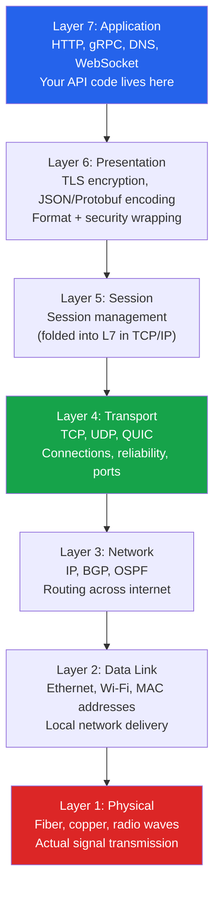

#### Debugging by Layer: The Most Practical Use of OSI

The real value of the OSI model for a Staff Engineer is fast failure diagnosis. Every symptom maps to a layer. Once you identify the layer, you know where to look.

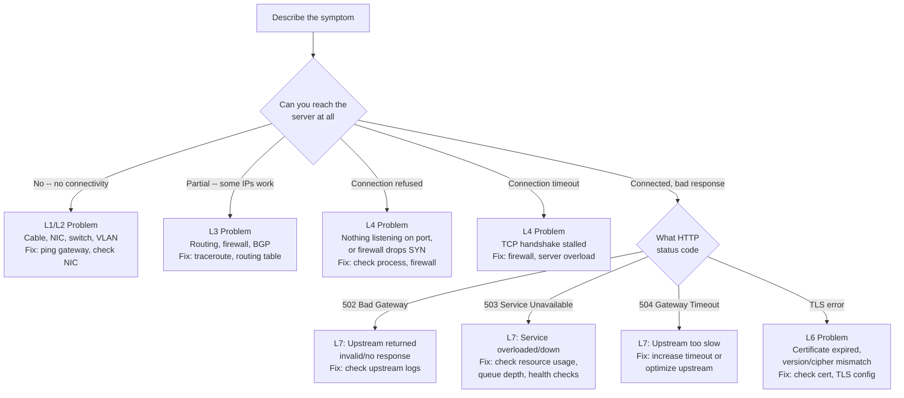

**Concrete L1-L7 Failure Examples:**

- **L1**: Engineer unplugged the wrong cable in the datacenter. `ip link show` shows `eth0: DOWN`. `ping 8.8.8.8` fails with "Network unreachable."
- **L2**: VLAN misconfiguration after a switch replacement. Services in the same /24 subnet cannot reach each other. `arp -n` shows incomplete entries. Fix: VLAN trunk port configuration.
- **L3**: BGP route flap after a backbone router update. Traffic to `10.20.0.0/16` goes nowhere for 90 seconds. `traceroute` shows packets reaching a router then dying. Fix: BGP hold timer tuning.
- **L4**: `nc -zv db.internal 5432` returns "Connection refused" -- PostgreSQL isn't running. `systemctl start postgresql`. Or: firewall rule blocks port 443 for all traffic from pod CIDR -- `curl` hangs on TCP SYN until timeout.
- **L6**: TLS certificate expired. `curl https://api.example.com` returns `SSL certificate problem: certificate has expired`. Fix: rotate certificate.
- **L7**: Application returns `HTTP 502` because upstream service is crashing on a new deployment. Fix: roll back, check application logs.

#### The TCP/IP Model: What Is Actually Deployed

The OSI model is a teaching framework. The TCP/IP model (also called the Internet model or DoD model) is what runs on every computer, phone, and server on the planet.

| TCP/IP Layer | OSI Equivalent | Contains |
|--------------|----------------|----------|
| Application | L5 + L6 + L7 | HTTP, DNS, TLS, your application code |
| Transport | L4 | TCP, UDP, QUIC |
| Internet | L3 | IPv4, IPv6, ICMP |
| Link | L1 + L2 | Ethernet, Wi-Fi, MAC, physical |

The TCP/IP model has four layers. When engineers say "L4 load balancer" or "L7 load balancer," they are mixing OSI numbering with TCP/IP implementation -- and that is the standard vocabulary at every tech company. Use OSI numbers for discussion; understand that TCP/IP is what is actually running.

---

### 3.2 TCP -- The Reliable Transport

#### Why TCP Exists: The Problem It Solves

In the early days of packet-switched networks (ARPANET, 1969), packets could be lost, duplicated, reordered, or corrupted. For some applications -- file transfer, email, database queries -- this was unacceptable. If you are transferring a file and packet 1,437 is lost, receiving everything except that packet is worse than receiving nothing, because you cannot reconstruct the file.

IP (the Internet Protocol) provides best-effort delivery: it routes packets but makes no guarantees. TCP sits on top of IP and provides the reliability that IP does not: every byte is delivered, in order, exactly once, or the connection fails.

#### TCP's Guarantees

1. **Reliability**: Every segment is acknowledged. If an ACK is not received within a timeout, the segment is retransmitted. Under normal conditions, no data is lost.

2. **Ordering**: Segments are numbered with sequence numbers. Even if packet 5 arrives before packet 3, TCP holds packet 5 in a receive buffer until packet 3 arrives, then delivers them in order to the application.

3. **Connection-oriented**: A TCP connection must be established (via three-way handshake) before any application data can be sent. This creates shared state at both endpoints.

4. **Flow control**: The receiver advertises a "receive window" -- how many bytes it is currently willing to accept. The sender does not exceed this window. This prevents a fast sender from overwhelming a slow receiver.

5. **Congestion control**: TCP monitors for signs of network congestion (packet loss, ECN signals) and reduces its transmission rate accordingly. This prevents the network from collapsing under load.

#### The Three-Way Handshake: Step by Step

The three-way handshake is how TCP establishes a connection. It serves three purposes:
1. Tells the server a client wants to connect
2. Lets both sides agree on initial sequence numbers (for ordering and reliability)
3. Confirms the bidirectional path works (you know both directions work after the handshake)

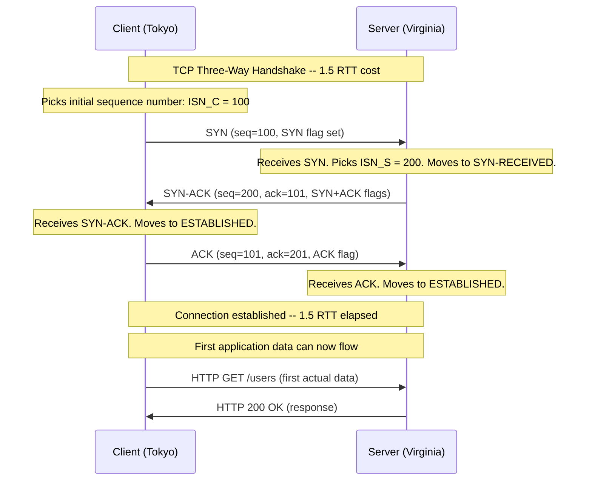

**Why "SYN-ACK" and not just "ACK" ** The server must also synchronize its own sequence number with the client. SYN-ACK does two things simultaneously: acknowledges the client's SYN (ACK part) and announces the server's sequence number (SYN part). This is why you need three messages, not two.

**Why does the ACK number increment by 1 ** The SYN flag itself "consumes" one sequence number, even though no application data is sent. So if the client sends `seq=100` with SYN, the next expected byte from the client is 101.

**The 1.5 RTT cost**: The client sends SYN, waits for SYN-ACK (1 RTT), then sends ACK. The ACK can piggyback on the first data packet. But the server has to receive the ACK before it considers the connection established, so data sent in the third message is processed after 1 RTT from the server's perspective, and the client waits 1.5 RTT before it gets the first response. For a 140ms Tokyo-Virginia RTT, this is 210ms before any application data flows.

#### TCP Overhead and Limitations

**Head-of-Line Blocking (HOL Blocking):** This is one of TCP's most important limitations for system design. TCP delivers data in order. If segment 5 is lost, segments 6, 7, 8, 9 are held in the receive buffer, waiting for segment 5 to be retransmitted and arrive. The application sees no data until the gap is filled. This stalls the entire TCP connection for every application using it.

In HTTP/2, multiple HTTP requests are multiplexed over a single TCP connection as "streams." But all those streams share one TCP connection. If one packet is lost, all streams stall -- even streams that had no data in the lost packet. This is TCP's head-of-line blocking problem, and it gets worse on high-latency or lossy networks.

**Retransmission overhead:** When a segment is lost, TCP waits for either:
- A timeout (Retransmission Timeout, RTO) -- starts at ~200ms, doubles with each retry
- Three duplicate ACKs (fast retransmit) -- faster, but requires subsequent segments to arrive

The RTO algorithm (based on measured RTT) means a single packet loss can stall a connection for hundreds of milliseconds.

**Per-connection state and memory:** Every TCP connection requires the kernel to maintain state: sequence numbers, receive/send windows, retransmission timers, congestion control state. Each connection also has kernel buffers (typically 4-128 KB each for send and receive). At 100,000 simultaneous connections, this is several GB of kernel memory just for TCP state.

**TCP Header:** Minimum 20 bytes (no options) up to 60 bytes with options. Compare to UDP's fixed 8-byte header. For small, frequent messages (gaming updates, IoT telemetry), this overhead matters.

#### When to Use TCP

Use TCP when correctness is more important than speed, or when missing data renders the entire transfer useless:

| Use Case | Why TCP |
|----------|---------|
| Web traffic (HTTP/HTTPS) | Every byte of the response must arrive; partial HTML is useless |
| Database connections | A partially-received SQL result would corrupt the application |
| File transfers (FTP, SCP) | A corrupted file is worse than no file |
| Email (SMTP) | Every character of the message must be delivered |
| Payment APIs | Missing a single transaction record is unacceptable |
| Remote shell (SSH) | Every keystroke and output character must arrive in order |
| Any API call | Partial JSON is invalid JSON -- reliability required |

---

### 3.3 UDP -- The Fast Transport

#### Why UDP Exists: The Problem It Solves

TCP's guarantees come with costs: connection setup (handshake), per-packet overhead (20+ byte headers), retransmissions, ordering buffers. For some applications, these costs eliminate the benefits.

Consider a video call. You are receiving 30 video frames per second. If frame 23 is lost:
- With TCP: frames 24-30 are held until frame 23 is retransmitted (adding ~100-300ms delay). The video freezes.
- With UDP: frame 23 is simply missing. The codec shows a brief glitch or uses the previous frame. Frame 24 arrives normally. Calls feel smooth.

A brief visual glitch is far better than a 300ms freeze in a live conversation. UDP is the right choice when timeliness matters more than completeness.

#### UDP's Properties

1. **Connectionless**: No handshake. Send a packet. Done. No shared state between client and server.
2. **No reliability**: Packets may be lost. No ACK, no retransmit.
3. **No ordering**: Packets may arrive out of order. The application must handle this if it cares.
4. **No flow control**: Sender can flood the receiver. Application layer must implement if needed.
5. **Minimal overhead**: 8-byte header (source port, destination port, length, checksum). Versus TCP's 20+ bytes.
6. **Broadcast/multicast capable**: UDP supports sending to multiple recipients. TCP is point-to-point.

#### The 8-Byte UDP Header vs TCP's 20+ Bytes

```
UDP Header (8 bytes total):
+------------------+------------------+
|  Source Port     | Destination Port  |  4 bytes
|  (16 bits)       | (16 bits)         |
+------------------+------------------+
|  Length          | Checksum          |  4 bytes
|  (16 bits)       | (16 bits)         |
+------------------+------------------+

TCP Header (20 bytes minimum, up to 60 with options):
Source Port (2) + Dest Port (2) + Sequence Number (4) +
Acknowledgment Number (4) + Data Offset+Flags (2) +
Window Size (2) + Checksum (2) + Urgent Pointer (2) = 20 bytes
+ Options (up to 40 bytes)
```

For a 100-byte gaming position update sent 60 times per second, UDP adds 8 bytes (8%) overhead. TCP adds 20+ bytes (20%+) plus the state machine complexity.

#### When to Use UDP

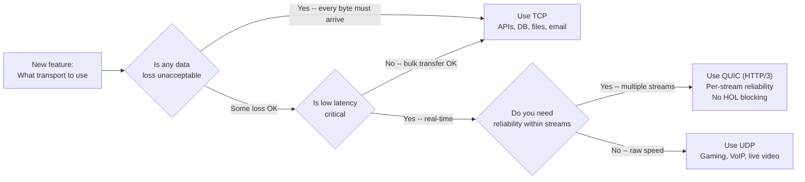

| Use Case | Why UDP | Detail |
|----------|---------|--------|
| Video streaming | Late packet worse than lost | A stale frame is useless; proceed to next |
| Online gaming | Position updates are superseded | If packet with pos(t=100) is lost, pos(t=120) makes it irrelevant |
| VoIP / video calls | Real-time audio, glitch > freeze | Jitter buffers handle small gaps; retransmit would cause noticeable delay |
| DNS queries | One-packet request, one-packet response | Tiny, no need for connection overhead; TCP fallback for large responses |
| Real-time analytics | Some loss acceptable | Counting events -- losing 0.1% of events is fine |
| NTP (time sync) | Single packet exchange | Latency measurement, round-trip timing |
| DHCP | Broadcast-based | Must work before IP address is assigned |

**The key insight**: For real-time applications, a retransmitted packet that arrives 200ms late is often worse than no packet at all. The application has already moved on. UDP lets the application make that decision itself, rather than forcing TCP's reliability model on every use case.

---

### 3.4 QUIC and HTTP/3 -- Solving TCP's Problems

#### The Problem TCP Can't Solve

HTTP/2 was designed to fix HTTP/1.1's inefficiencies (one request per connection, uncompressed headers). It introduced multiplexing -- multiple HTTP streams over one TCP connection. This was a huge improvement.

But there was a fundamental problem: all those streams run over a single TCP connection. TCP is ordered. One lost packet stalls all streams until it is retransmitted. This is TCP head-of-line blocking at the HTTP/2 level. On a reliable network (your datacenter), you barely notice. On a mobile network with 1-5% packet loss, it is severe.

HTTP/2 also improved the TLS handshake situation but could not change TCP's 1-RTT minimum connection setup. And TCP connection migration (when a mobile phone switches from Wi-Fi to cellular) required a completely new connection.

#### QUIC: A New Transport Built on UDP

QUIC (Quick UDP Internet Connections), originally developed at Google and later standardized by the IETF, solves these problems by building a new transport protocol on top of UDP rather than IP:

**Per-stream reliability without head-of-line blocking:** QUIC implements its own reliability mechanism, but at the stream level, not the connection level. If a packet containing Stream A data is lost, only Stream A stalls. Streams B, C, D, and E continue flowing. This is the key difference from HTTP/2 over TCP.

**0-RTT and 1-RTT connection setup:** QUIC combines the transport handshake and TLS handshake into a single operation. A new connection requires 1 RTT. If the client has previously connected to the server and cached session parameters, 0-RTT is possible (the client sends data in the very first packet). Compare to TCP + TLS 1.3 which requires at minimum 1 RTT for TCP + 1 RTT for TLS = 2 RTT minimum.

**Connection migration:** QUIC connections are identified by a Connection ID, not by the 4-tuple (src IP, src port, dst IP, dst port). When a mobile device switches from Wi-Fi to cellular, the source IP changes. A TCP connection dies and must be re-established. A QUIC connection seamlessly migrates to the new IP.

**Built-in encryption:** QUIC mandates TLS 1.3. You cannot use QUIC without encryption. This removes the temptation to skip encryption for "internal" services.

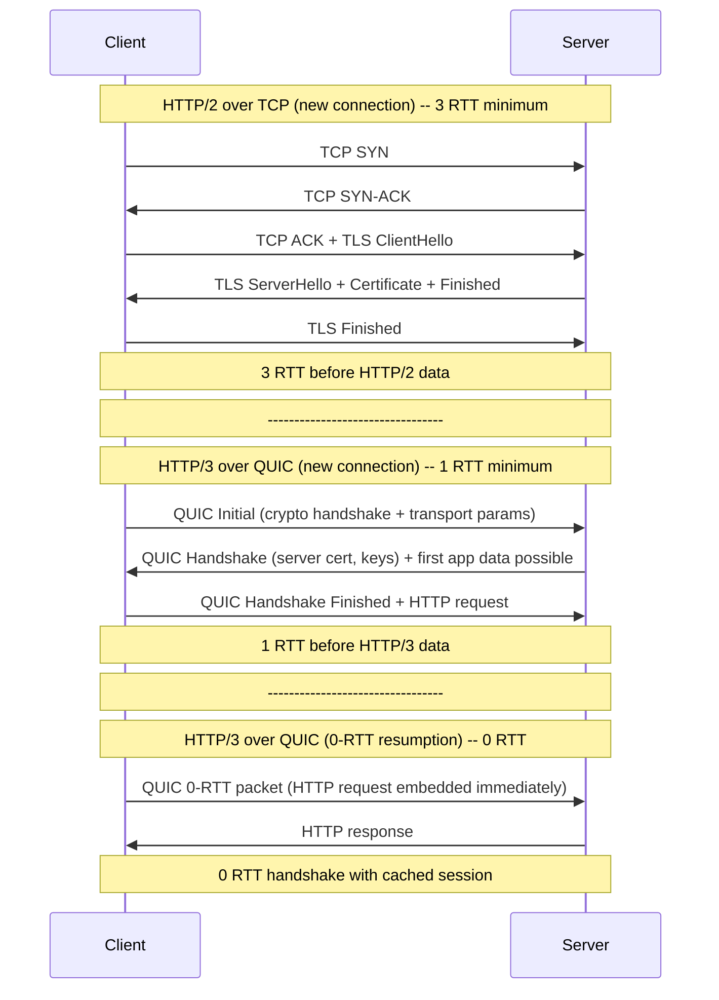

#### HTTP Versions at a Glance

| Version | Transport | Key Feature | Limitation |
|---------|-----------|-------------|------------|
| HTTP/1.0 | TCP | Request-response | New connection per request |
| HTTP/1.1 | TCP | Keep-alive, pipelining | HOL blocking at HTTP layer; pipelining rarely used |
| HTTP/2 | TCP | Multiplexing, header compression (HPACK), server push | TCP head-of-line blocking; 2-3 RTT setup |
| HTTP/3 | QUIC (UDP) | Per-stream reliability, 0/1-RTT setup, connection migration | UDP firewalled in some networks; newer tooling |

**Real-world adoption**: As of 2024, HTTP/3 is supported by ~30% of top websites. Google, Cloudflare, and Meta are major proponents. Cloudflare serves all its traffic over HTTP/3 when clients support it. Google's internal infrastructure uses QUIC extensively.

**When HTTP/3 matters most**: Mobile users on lossy LTE/5G networks, users with long RTT (developing regions), applications with many small parallel requests (web page loading). For datacenter-to-datacenter traffic where packet loss is near zero, the difference between HTTP/2 and HTTP/3 is minimal.

---

### 3.5 Sockets and the Connection Lifecycle

#### What Is a Socket 

A socket is an endpoint for network communication. More precisely, it is a programming abstraction that represents one end of a bidirectional communication channel. A socket is identified by:

- **IP address**: Which machine (e.g., `142.250.80.46` for Google)
- **Port number**: Which service on that machine (e.g., `443` for HTTPS, `5432` for PostgreSQL)
- **Protocol**: TCP or UDP

The combination of (IP address, port, protocol) uniquely identifies a socket. A TCP connection is identified by a 4-tuple: (client IP, client port, server IP, server port). This means one server IP and port can serve millions of simultaneous connections -- as long as each client has a different source IP or port.

**Port ranges:**
- `0-1023`: Well-known ports (HTTP=80, HTTPS=443, SSH=22, DNS=53, SMTP=25). Require root to bind.
- `1024-49151`: Registered ports (PostgreSQL=5432, MySQL=3306, Redis=6379)
- `49152-65535`: Ephemeral (dynamic) ports. OS assigns these to client connections.

#### The Connection Lifecycle: Socket API

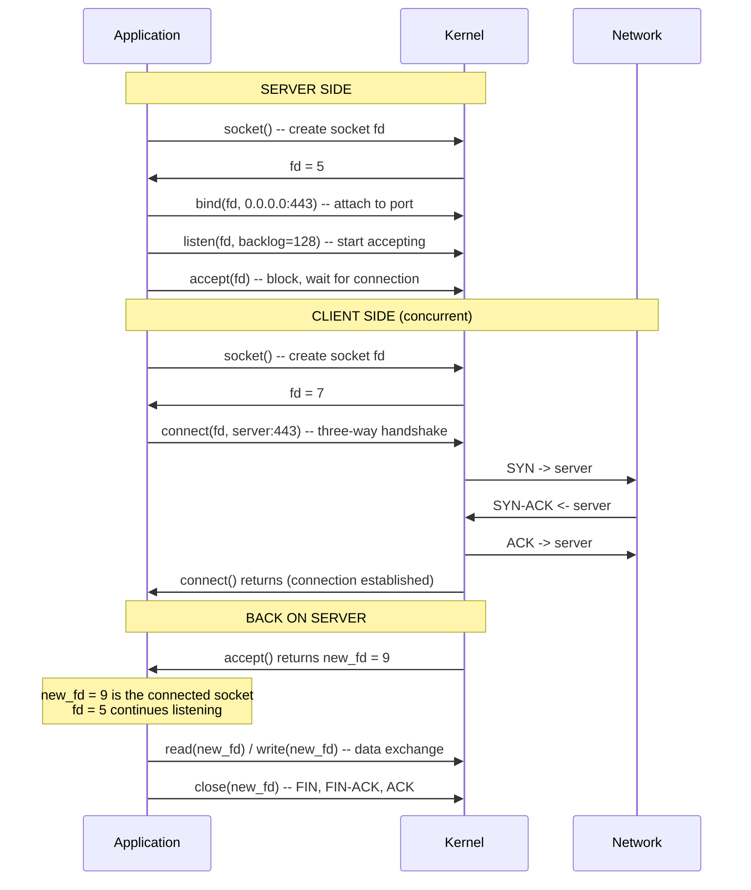

**Key functions:**
- `socket()`: Creates a socket. Returns a file descriptor (integer). No network activity yet.
- `bind()`: Server attaches socket to a local address (IP + port). Client rarely calls this -- OS picks ephemeral port automatically.
- `listen()`: Server marks socket as passive -- ready to accept connections. `backlog` parameter specifies the kernel queue size for incoming connection requests not yet `accept()`ed.
- `accept()`: Server waits for and accepts an incoming connection. Returns a *new* socket for that specific connection. The original listening socket stays open for more connections.
- `connect()`: Client initiates three-way handshake to server. Blocks until handshake completes.
- `read()`/`write()` or `send()`/`recv()`: Data exchange on the connected socket.
- `close()`: Initiates TCP teardown (FIN exchange).

#### Listening Socket vs Connected Socket

This distinction trips up many engineers. When a server calls `accept()`, the kernel returns a new file descriptor -- a different socket from the one that was listening. The listening socket continues to listen on port 443 for more connections. The new "connected socket" is the channel to this specific client.

This is why one server can handle thousands of simultaneous connections on a single port. There is one listening socket. Each `accept()` call creates a new connected socket for each client. The server application manages these connected sockets (usually one thread per socket, or an event loop managing all of them with non-blocking I/O and `epoll`/`kqueue`).

#### Kernel Limits That Bite You in Production

**File Descriptor Limit (`ulimit -n`):** Every open socket is a file descriptor (Unix "everything is a file" philosophy). The kernel limits the number of open file descriptors per process. Default is often 1024 on many Linux distributions. A server handling 10,000 simultaneous connections needs 10,001+ file descriptors (10K connections + stdin/stdout/stderr + listening sockets + log files). Production servers set this to 65535 or higher via `/etc/security/limits.conf` or systemd service configuration.

```bash
# Check current limit
ulimit -n

# Set for current shell session
ulimit -n 65535

# Set permanently for a service (systemd)
# In /etc/systemd/system/myservice.service:
# [Service]
# LimitNOFILE=65535
```

**Listen Backlog (`net.core.somaxconn`):** When clients connect faster than the server calls `accept()`, the kernel queues incoming connections. The `backlog` parameter to `listen()` and the `net.core.somaxconn` kernel parameter limit this queue. Under high load (traffic spike, slow `accept()`), the queue fills and new connections are refused with "Connection refused." Tune this to handle burst traffic.

**SYN Backlog (`net.ipv4.tcp_max_syn_backlog`):** Separate from the completed connection queue -- this is the queue for half-open connections (SYN received, SYN-ACK sent, waiting for ACK). Relevant for SYN flood defense and high-connection-rate services.

**Ephemeral Port Exhaustion:** Client processes are assigned ephemeral ports (49152-65535 = ~16K ports per destination IP) when making outgoing connections. A service making 10,000 outgoing connections per minute to the same destination IP can exhaust these ports. Connection pooling (reusing connections instead of opening new ones) is the primary mitigation.

---

### 3.6 Connection Pooling -- Why It Exists and How to Size It

#### The True Cost of a New Connection

When application code calls `db.query("SELECT * FROM users WHERE id = 1")`, it needs a database connection. If no connection exists, creating one involves:

| Step | Time | Notes |
|------|------|-------|
| DNS resolution | 0-100ms | Often cached; 0ms if in local resolver cache |
| TCP handshake | 1 RTT (e.g., 0.5-5ms same region) | Cannot be skipped |
| TLS handshake | 1-2 RTT (e.g., 1-10ms same region) | Session resumption can reduce to ~0.5 RTT |
| Database authentication | 1 RTT + server-side auth check | Password hashing, ACL check |
| **Total (same-region DB)** | **~5-15ms** | Before query starts |
| **Total (cross-region DB)** | **~200-600ms** | Dominated by RTT |

For a query that takes 2ms to execute, spending 5-15ms on connection setup means 71-87% of the wall-clock time is connection overhead. 

**HikariCP benchmark (a popular Java connection pool):** Acquiring a connection from the pool: ~250 nanoseconds. Creating a new connection: ~5-10 milliseconds. Connection pool is **20,000-40,000x faster** than creating a new connection.

#### How Connection Pooling Works

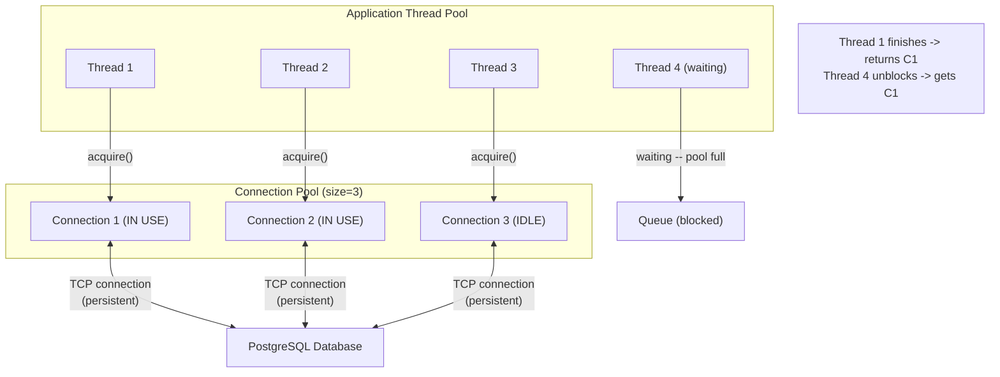

The pool pre-creates connections and maintains them alive. When application code needs a connection:
1. Call `pool.acquire()` -- gets a connection from the idle list (microseconds)
2. Use the connection for the query
3. Call `pool.release()` or return via `try-with-resources` -- connection goes back to idle list
4. If no connections are available: wait in queue (up to `connectionTimeout` setting)

The pool keeps connections alive with:
- Periodic keepalive queries (e.g., `SELECT 1` every 30 seconds)
- Connection validation on borrow (`testOnBorrow`)
- Connection TTL (max lifetime, evict and replace after N minutes to prevent stale connections)

#### Connection Pool Sizing: The Formula

This is a classic interview question at the Staff level. Wrong answer: "make the pool bigger."

**The right starting point uses Little's Law:**

```
L = lambda x W

Where:
L = average number of connections in use (pool size needed)
lambda = throughput (requests per second using the DB)
W = average time each connection is held (seconds)
```

**Example:**
- 1,000 QPS hitting the database
- Each query takes 5ms (0.005 seconds)
- L = 1,000 x 0.005 = 5 connections needed on average
- Add headroom for bursts: 5 x 2 = 10 connections
- This is far less than the default pool sizes of 100+ many engineers set "to be safe"

**The danger of too-large pools:**
- Database has limited resources. 200 application instances x 100 connections = 20,000 database connections.
- PostgreSQL with `max_connections = 100` (default) will reject connections 101-20,000.
- Even with `max_connections = 20000`, each PostgreSQL connection uses ~5-10MB RAM. 20,000 connections x 7.5MB = 150GB -- probably more than your DB server has.
- More connections competing for the same CPU/disk does not make queries faster. It makes them slower due to lock contention, context switching, and CPU saturation.

**The right formula for databases:**

```
pool_size = ((core_count * 2) + effective_spindle_count)
```

This is the PostgreSQL project's own recommendation (from "HikariCP Wiki: About Pool Sizing"). For a 4-core DB server with SSDs (effective_spindle = 1):
`pool_size = (4 * 2) + 1 = 9`

For the *application* side, if you have 50 app instances each needing `pool_size`, ensure `50 x pool_size_per_instance <= database max_connections`. Use PgBouncer if needed.

**Too small is also dangerous:**
- Pool exhausted -> requests queue behind `connectionTimeout`
- If timeout is long, requests pile up, threads pile up, service runs out of memory
- If timeout is short, requests fail with "connection timeout waiting for pool"

**Signs of pool exhaustion:**
- Metric: "pool connections waiting" > 0 sustained
- Metric: "pool connections in use" == pool max size constantly
- Metric: request latency p99 increases suddenly (requests are queuing)
- Error: "Connection is not available, request timed out after 30000ms" (HikariCP)

#### Connection Leaks: How They Happen and How to Find Them

A connection leak occurs when code acquires a connection and fails to return it. Common causes:

```java
// BUG: Exception before release
Connection conn = pool.acquire();
String result = doSomethingThatThrows(); // Exception thrown here!
pool.release(conn); // NEVER REACHED -- connection leaked
```

```java
// FIX: try-finally or try-with-resources
try (Connection conn = pool.acquire()) {
    String result = doSomething();
    // conn automatically returned at end of try block, even if exception
}
```

**How to detect leaks:**
1. Monitor `pool_connections_in_use` over time. If it monotonically increases and never decreases, you have a leak.
2. Set `leakDetectionThreshold` (HikariCP) to log a warning if a connection is held longer than N milliseconds.
3. Take thread dumps when pool is exhausted -- look for threads holding connections without active DB work.
4. Set a maximum connection lifetime in the pool (e.g., 30 minutes). Even leaked connections are eventually evicted.

---

### 3.7 HTTP Methods, Status Codes, and Headers

#### HTTP Methods: What They Mean and Why They Matter

HTTP methods are not arbitrary labels. They carry semantic meaning that HTTP clients, proxies, CDNs, and load balancers rely on.

| Method | Purpose | Idempotent  | Safe  | Cacheable  |
|--------|---------|-------------|-------|------------|
| GET | Read/fetch a resource | Yes | Yes | Yes |
| HEAD | Fetch headers only (no body) | Yes | Yes | Yes |
| OPTIONS | What methods does this URL support  | Yes | Yes | No |
| POST | Create a resource or trigger an action | No | No | Only with explicit headers |
| PUT | Replace entire resource | Yes | No | No |
| PATCH | Partial update | No* | No | No |
| DELETE | Remove a resource | Yes | No | No |

**Idempotent** means: calling the operation multiple times produces the same result as calling it once. `DELETE /users/123` deletes user 123 the first time; subsequent calls return 404 but do not create additional side effects. `PUT /users/123` with the same body replaces user 123 with the same data -- calling it 5 times is identical to calling it once.

**Safe** means: the operation does not change server state. GET and HEAD never modify data. CDNs and proxies can therefore safely retry safe methods without fear of side effects.

**Why idempotency matters for retries:** When a network request fails (timeout, connection reset), the client cannot know whether the server received and processed the request. For idempotent methods (GET, PUT, DELETE), retrying is always safe. For non-idempotent methods (POST), retrying might create duplicates (two orders, two payments, two user accounts).

**Why GET-for-mutations is a disaster:**
- Web crawlers (Googlebot) follow links and make GET requests. If GET mutates state, crawling deletes data.
- Browser prefetch (Chrome speculatively fetches links on hover) makes GET requests. If GET deletes, hovering over a "Delete" link deletes the resource.
- Proxy servers cache GET responses. A cached "DELETE succeeded" response served to a later request that actually needs to delete different data is catastrophic.

#### Idempotency Keys for POST Operations (The Stripe Pattern)

POST is not idempotent. But payments, order creation, and user registration often use POST (because they create new resources). What happens if the network drops after the server processes the request but before the response arrives  The client doesn't know if the request succeeded. Retrying POST might create a duplicate.

**Solution: Idempotency Keys**

```
POST /payments
Content-Type: application/json
Idempotency-Key: 550e8400-e29b-41d4-a716-446655440000

{
  "amount": 10000,
  "currency": "usd",
  "customer": "cus_123"
}
```

The server:
1. Checks if `Idempotency-Key: 550e8400...` was seen before
2. If yes: return the stored response from the first execution (do NOT re-execute)
3. If no: execute the operation, store (key -> response), return response

The client can safely retry as many times as needed. The second, third, and fourth requests all return the same stored response. The payment is only charged once.

**Stripe's implementation:** Keys are stored for 24 hours. The key is tied to the authenticated customer (prevents key reuse across customers). If two requests with the same key have different bodies, Stripe returns 422 (conflicting idempotent request).

**When to implement idempotency keys:**
- Payment processing
- Order creation
- Email sending (don't send twice)
- User registration
- Any operation where "exactly once" semantics are required

#### HTTP Status Codes: The Contract

Status codes are not suggestions. They are a contract between server and client that every HTTP intermediary (CDN, load balancer, proxy, retry library) relies on.

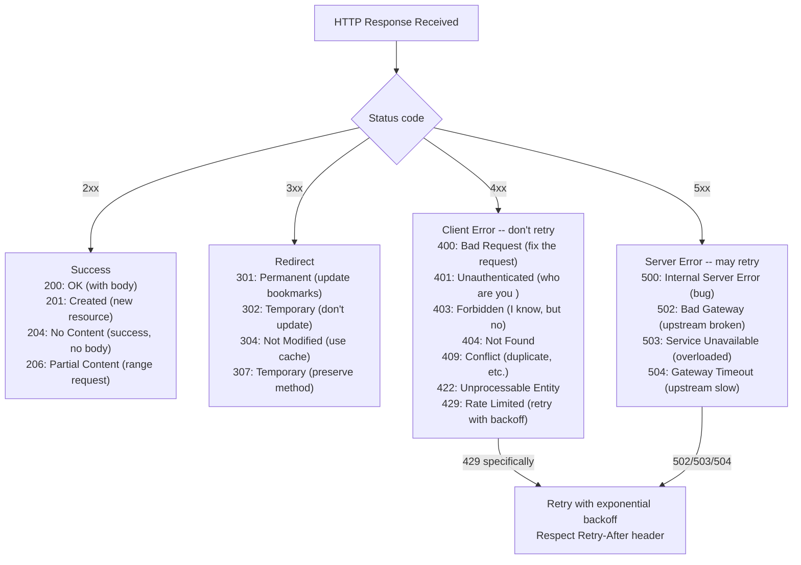

**Critical distinctions that trip up engineers:**

**401 vs 403:**
- 401 Unauthorized means: "You are not authenticated. Provide credentials." (Despite the name, 401 is about authentication, not authorization.)
- 403 Forbidden means: "I know who you are, and you cannot do this." (This is authorization.)
- Using 403 for unauthenticated requests leaks information (confirms the resource exists). Use 401 for missing/invalid auth tokens.

**404 vs 403 for security:**
- If a user requests `/admin/users` and is not an admin, should you return 403 (forbidden) or 404 (not found) 
- 403 confirms the resource exists but the user lacks permission. This leaks information.
- 404 hides whether the resource exists at all. This is sometimes correct (for sensitive resources) but can confuse legitimate users.
- Best practice: 403 for resources the user knows about; 404 or 403 consistently for sensitive paths.

**Status codes and retry semantics (critical for distributed systems):**

| Status | Retry  | Notes |
|--------|--------|-------|
| 200 | Never | Success |
| 400 | Never | Fix the request |
| 401 | After re-auth | Re-authenticate, then retry |
| 403 | Never | Permissions issue, not transient |
| 404 | Never | Resource doesn't exist |
| 408 | Yes | Request timeout -- safe to retry |
| 409 | Depends | Conflict -- may need different strategy |
| 429 | Yes, with backoff | Rate limited -- respect Retry-After |
| 500 | Carefully | Bug -- retry might cause duplicate side effects for POST |
| 502 | Yes | Gateway issue, upstream may be fine |
| 503 | Yes, with backoff | Overloaded -- retry after delay |
| 504 | Yes | Upstream timeout -- retry |

**The 200-for-errors anti-pattern:**

```json
// WRONG: HTTP 200 OK with error in body
HTTP/1.1 200 OK
Content-Type: application/json

{
  "success": false,
  "error": "User not found",
  "code": 404
}
```

Consequences:
1. CDNs and proxies cache this response (200 = success = cacheable). Other users get the "user not found" error from cache.
2. Retry libraries don't retry it (it's a 200). The user never gets the correct response.
3. Monitoring alerts don't fire (error rate is 0% because HTTP 200). The bug is invisible.
4. Logging pipelines classify it as success. Debugging is impossible.

Use proper HTTP status codes. The entire HTTP ecosystem depends on them.

#### HTTP Headers for Production Systems

Headers are metadata that control caching, security, routing, and observability. Missing or misconfigured headers cause production incidents.

| Header | Direction | Purpose | Production Example |
|--------|-----------|---------|-------------------|
| `Content-Type` | Both | Format of body | `application/json; charset=utf-8` |
| `Authorization` | Request | Auth credentials | `Bearer eyJhbGc...` |
| `X-Request-ID` | Both | Distributed tracing | `550e8400-e29b-41d4-a716-446655440000` |
| `X-Correlation-ID` | Both | Alternative tracing header | Same pattern as X-Request-ID |
| `X-Forwarded-For` | Request (proxy adds) | Original client IP | `203.0.113.195, 70.41.3.18` |
| `Cache-Control` | Response | Caching directives | `max-age=3600, must-revalidate` |
| `ETag` | Response | Resource version for conditional GET | `"33a64df551425fcc55e4d42a148795d9f25f89d4"` |
| `If-None-Match` | Request | Conditional fetch | `"33a64df5..."` -- returns 304 if unchanged |
| `Strict-Transport-Security` | Response | Force HTTPS for future requests | `max-age=31536000; includeSubDomains` |
| `Retry-After` | Response | When to retry (429/503) | `120` (seconds) or `Wed, 21 Oct 2025 07:28:00 GMT` |
| `Idempotency-Key` | Request | Safe retries for non-idempotent ops | `UUID` |

**X-Request-ID in practice:** At Google, Cloudflare, and most tech companies, every request is assigned a UUID at the entry point (load balancer or API gateway). This ID is propagated to every downstream service via headers. When debugging, you search your centralized log system for that UUID and get a complete trace of the request across every service. Without this, debugging multi-service failures requires comparing timestamps across log files -- a miserable experience.

**Cache-Control values you must know:**
- `no-store`: Never cache. For sensitive data (PII, financial).
- `no-cache`: Cache but always revalidate with server before serving. Ensures freshness.
- `max-age=3600`: Cache for 3600 seconds without revalidating.
- `s-maxage=3600`: Cache in shared caches (CDN) for 3600 seconds. Overrides max-age for CDNs.
- `must-revalidate`: Once stale, must revalidate with origin before serving.
- `private`: Only browser cache, not CDN. For user-specific content.
- `public`: CDN may cache.

**Strict-Transport-Security (HSTS):** Tells browsers to always use HTTPS for this domain for the specified duration, even if the user types `http://`. Prevents SSL stripping attacks. Once served, the browser enforces HTTPS without even making the initial HTTP request (preventing MITM on the first connection).

---

### 3.8 TLS: Transport Layer Security

#### Why TLS Exists

HTTP is plaintext. Every router between your browser and the server can read your requests and responses. In 1994, SSL (Secure Sockets Layer) was created by Netscape to encrypt HTTP traffic. SSL evolved into TLS (Transport Layer Security). TLS 1.0, 1.1, 1.2, 1.3 -- each version fixed security vulnerabilities in the previous.

TLS provides:
1. **Confidentiality**: Data is encrypted. Interceptors see ciphertext.
2. **Integrity**: Data cannot be modified without detection (HMAC-based authentication).
3. **Authentication**: Server (and optionally client) proves identity via certificate.

#### TLS 1.2 vs TLS 1.3: The Latency Difference

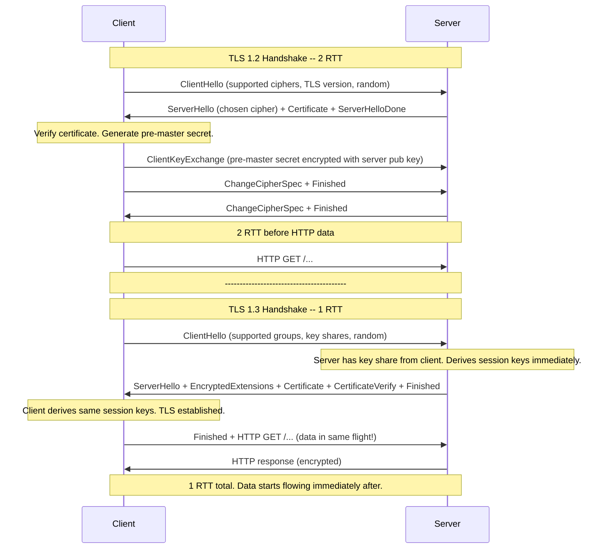

**TLS 1.2:** 2 RTT. At 100ms RTT (US-Europe), this is 200ms for TLS alone, on top of the TCP handshake (100ms). Total before HTTP: 300ms.

**TLS 1.3:** 1 RTT. At 100ms RTT, this is 100ms for TLS. Combined with TCP: 200ms. Saves 100ms per new connection.

**TLS 1.3 0-RTT (session resumption):** If client and server have previously connected and the client has saved the "session ticket," TLS 1.3 supports sending application data in the very first packet (0-RTT). The server can process this immediately. Latency: 0ms for TLS on resumed connections.

**The 0-RTT security caveat:** 0-RTT data is vulnerable to replay attacks. An attacker can capture and re-send the 0-RTT packet. For idempotent requests (GET), this is acceptable. For state-changing requests (POST payment), do not use 0-RTT without additional replay protection (e.g., nonces, timestamps).

#### Where to Terminate TLS

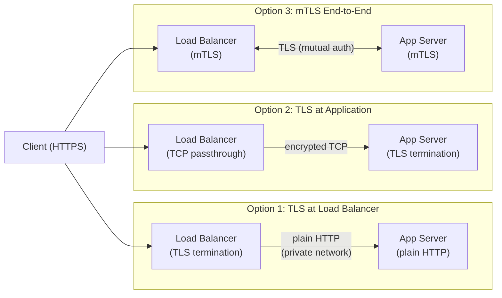

**Option 1 (TLS at LB):** Most common. Load balancer handles TLS; backend gets plain HTTP. Pros: App servers don't do expensive crypto; centralized certificate management; LB can inspect/route based on HTTP headers. Cons: Traffic is unencrypted from LB to app servers (acceptable on private cloud network; not for PCI/HIPAA compliance without re-encryption).

**Option 2 (TLS at App):** End-to-end encryption. Pros: Data encrypted all the way. Cons: Certificate management on every app server; load balancer can't see HTTP headers (L4 LB only); more CPU per app server.

**Option 3 (mTLS):** Mutual TLS -- both client and server present certificates. Used for service-to-service auth in zero-trust networks (no implicit trust just because traffic is "internal"). Adds complexity (certificate rotation, CAs, workload identity) but strong security. Kubernetes with service meshes (Istio, Linkerd) typically provides mTLS.

---

### 3.9 Bandwidth vs Latency: The Most Misunderstood Trade-off

#### Definitions

**Bandwidth** (also called throughput): The maximum rate at which data can be transferred across a network link. Measured in bits per second: Mbps (megabits/s), Gbps (gigabits/s).
- Home broadband: 100-1000 Mbps
- Datacenter server NIC: 1-100 Gbps
- Cross-continental fiber backbone: 100+ Gbps per wavelength

**Latency**: The time for a signal to travel from source to destination. For network engineering, we usually care about **Round-Trip Time (RTT)** -- time for a packet to go from A to B and back. Measured in milliseconds.
- Same datacenter: 0.1-0.5ms
- Same cloud region (e.g., us-east-1 within one AZ): 1-2ms
- Different AZs, same region: 1-5ms
- Cross-country (New York to Los Angeles): 50-80ms
- Cross-continent (New York to London): 70-120ms
- New York to Tokyo: 120-160ms
- Satellite (geostationary): 500-700ms

#### Why Latency Cannot Be Fixed with More Bandwidth

Latency is fundamentally limited by the speed of light. Light travels through fiber at approximately 200,000 km/s (about 2/3 the speed of light in vacuum due to the refractive index of glass).

New York to Tokyo:
- Distance: ~10,800 km
- Speed of light in fiber: ~200,000 km/s
- One-way minimum: 10,800 / 200,000 = 0.054 seconds = 54ms
- Round-trip minimum: ~108ms
- Actual RTT (with routing, amplifiers, processing): ~130-160ms

No amount of money or engineering can make light travel faster. Adding more bandwidth (wider pipe) does not reduce latency (pipe length). These are orthogonal dimensions.

#### The Math: When Does Each Dominate 

**Scenario 1: Small API request (1KB request, 5KB response)**

Total data: 6KB = 6,144 bytes = 49,152 bits

| Bandwidth | Transfer time | RTT (example) | Which dominates  |
|-----------|--------------|---------------|-----------------|
| 1 Mbps | 49ms | 100ms | RTT (100ms > 49ms, but they add) |
| 100 Mbps | 0.5ms | 100ms | RTT completely dominates (100ms >> 0.5ms) |
| 1 Gbps | 0.05ms | 100ms | RTT dominates by 2000x |

For a 6KB API response at modern network speeds, bandwidth transfer time is essentially zero. The request takes 100ms because of RTT, not because of bandwidth. Doubling the bandwidth changes nothing for this workload.

**Scenario 2: Large file transfer (1 GB)**

Total data: 1 GB = 8 Gbits

| Bandwidth | Transfer time | RTT (one-time) | Which dominates  |
|-----------|--------------|----------------|-----------------|
| 10 Mbps | 800 seconds | 0.1 seconds | Bandwidth (800s >> 0.1s) |
| 100 Mbps | 80 seconds | 0.1 seconds | Bandwidth still dominates |
| 1 Gbps | 8 seconds | 0.1 seconds | Bandwidth dominates |

RTT is a one-time setup cost for the file transfer. After connection is established, you are limited purely by bandwidth.

**The crossover point:** For a request of size S bytes at bandwidth B bps and RTT of R seconds, bandwidth becomes a factor when:

`S / B > R` -> `S > B x R`

For 100 Mbps and 100ms RTT: `S > (100x10^6 / 8) x 0.1 = 1.25 MB`

Responses larger than ~1.25 MB start to have meaningful bandwidth contribution. API responses are almost always far smaller.

#### Cross-Region Latency Reference Table

```
APPROXIMATE RTT (milliseconds) -- best-case routing

             Tokyo  Singapore  Sydney  Mumbai  Frankfurt  London  Virginia  California  S o Paulo
Tokyo          --       70       110      90      240       240      140        110         290
Singapore     70        --        90      50      200       200      210        170         300
Sydney       110       90         --     130      280       280      230        160         330
Mumbai        90       50       130       --      160       160      200        190         270
Frankfurt    240      200       280     160        --        15       90        150         200
London       240      200       280     160       15         --       80        140         180
Virginia     140      210       230     200       90        80        --         70         170
California   110      170       160     190      150       140       70          --         180
S o Paulo    290      300       330     270      200       180      170        180           --

Same AZ (same datacenter): 0.1-0.5ms
Same region, different AZ: 1-3ms
```

**Practical implication**: If your API is in Virginia and your primary user base is in Tokyo, a cold request takes ~140ms just in RTT. Add TCP handshake (140ms) + TLS 1.3 (140ms) = 420ms before any server processing. For a 200ms p99 target, this is physically impossible for cold connections. Solutions: regional deployment, connection reuse, edge computing.

---

### 3.10 Reducing Latency: Geo-DNS, Anycast, and CDNs

#### Geo-DNS: Serve Requests from the Nearest Region

Geo-DNS (Geographic DNS) is a DNS technique where the same hostname resolves to different IP addresses depending on where the DNS query originates.

**How it works:**
1. User in Tokyo queries `api.example.com`
2. The user's DNS resolver sends the query to example.com's authoritative DNS
3. The authoritative DNS identifies the resolver is in Asia
4. Returns IP of the Tokyo region: `104.21.100.1`

5. User in Virginia queries `api.example.com`
6. Returns IP of the Virginia region: `198.51.100.1`

Both point to `api.example.com` but different physical infrastructure. Tokyo user gets 5ms RTT. Virginia user gets 2ms RTT.

**Limitation**: Geo-DNS uses the DNS resolver's IP, not the actual client IP. If a Virginia user uses Google's DNS (8.8.8.8 in Mountain View), they might get routed to a California server instead of Virginia. This is the "DNS resolver location bias" problem.

**Failover with Geo-DNS**: If the Tokyo region goes down, update the DNS record to point Tokyo queries to Singapore (next closest). DNS TTL determines how quickly this propagates. Low TTL (60 seconds) = faster failover, more DNS load. High TTL (5 minutes) = slower failover, less DNS load.

#### Anycast: One IP, Multiple Locations

Anycast is a routing technique where the same IP address is announced from multiple physical locations via BGP. The internet routes each client's request to the topologically nearest location announcing that IP.

**How it works:**
- Cloudflare announces `1.1.1.1` from 275+ data centers worldwide
- BGP routing naturally sends each client to the nearest Cloudflare PoP
- A user in Tokyo reaches a Tokyo PoP at ~5ms; a user in London reaches a London PoP at ~5ms
- Same IP (`1.1.1.1`), different physical servers

**Anycast vs Geo-DNS:**
- Anycast: Routing happens in the network (BGP). No DNS tricks. Failover is instant (BGP reconvergence, ~seconds).
- Geo-DNS: Routing happens at DNS. Requires TTL to propagate. More flexible (per-subdomain).
- Anycast is better for DDoS mitigation (traffic is distributed across all PoPs). CDNs (Cloudflare, Akamai, Fastly) use Anycast for their edge network.

#### CDNs: Cache at the Edge

A CDN (Content Delivery Network) places caches at edge locations close to users. Static content (images, CSS, JS, videos) served from a CDN edge node adds only ~5-30ms of latency (vs. 100-300ms from origin).

```mermaid
sequenceDiagram
    participant U as User (Tokyo)
    participant E as CDN Edge (Tokyo)
    participant O as Origin (Virginia)
    
    Note over U,E: Cache HIT scenario
    U->>E: GET /image.png
    Note over E: Cache hit! File is here.
    E->>U: 200 OK (image) -- 10ms total
    
    Note over U,E,O: Cache MISS scenario (first request or expired)
    U->>E: GET /page.html
    Note over E: Cache miss. Forward to origin.
    E->>O: GET /page.html
    O->>E: 200 OK (page content)
    Note over E: Cache the response for future requests.
    E->>U: 200 OK (page content) -- 150ms total
    
    Note over U,E: Second user in Tokyo (cache is now warm)
    U->>E: GET /page.html
    E->>U: 200 OK (from cache) -- 10ms total
```

**CDN for API (dynamic content):** CDNs can also cache API responses with short TTLs (60 seconds). `GET /products` with `Cache-Control: public, max-age=60` can be served from edge for 60 seconds after the first request. Subsequent requests within 60 seconds get cached response at edge latency (5-30ms) instead of origin latency (100-300ms).

**CDN edge functions:** Modern CDNs (Cloudflare Workers, Fastly Compute, Lambda@Edge) let you run code at edge nodes. For highly dynamic APIs, you can run lightweight logic at the edge (authentication, routing, A/B testing, personalization) and only hit the origin for data.

---

## 4. Mental Models

### The Postal Mail System

Networking is postal mail:

| Network Concept | Postal Analogy |
|----------------|----------------|
| IP address | Street address |
| Port | Apartment number |
| DNS | Phone book (name -> address) |
| TCP | Registered mail (delivery confirmation, in-order) |
| UDP | Postcard (send and forget, might get lost) |
| HTTP | Letter format (Dear Sir, ... Sincerely) |
| TLS | Sealed envelope (confidential) |
| CDN | Local post office (caches common items) |
| Connection pool | Having the envelope pre-addressed and stamped |

### The Highway System

**Bandwidth = highway width** (number of lanes). More lanes = more cars per hour.
**Latency = highway length** (distance to destination). Building more lanes does not make the trip shorter.

If you are driving across the country (large file transfer), you want more lanes (bandwidth). If you are driving to the corner store (small API request), more lanes help a tiny bit, but the drive time is dominated by the distance (latency).

### The Restaurant Analogy for Connection Pooling

Creating a new database connection is like walking to a restaurant, waiting in line to get a table, ordering, waiting for the food, eating, and leaving. ~10ms just to "get seated."

Connection pooling is like having reserved tables. You walk in, sit immediately (~250 nanoseconds), order, eat, leave. The table (connection) stays reserved for you to use again.

Without connection pooling, every request "walks in cold." With pooling, your reserved table is always waiting.

---

## 5. Real-World Examples

### 5.1 Cloudflare's Global Network: Anycast at Scale

Cloudflare operates one of the largest Anycast networks in the world, with 275+ data centers in ~100 countries. Every Cloudflare data center announces the same set of IP addresses via BGP.

When a user in Mumbai requests a website protected by Cloudflare:
1. Their DNS resolver returns a Cloudflare IP (e.g., `104.21.45.67`)
2. BGP routing directs their TCP connection to the nearest Cloudflare PoP (likely Mumbai or Singapore)
3. Cloudflare's edge handles TLS termination, caching, DDoS mitigation, and WAF locally
4. Only uncached requests are forwarded to the origin

**Result:** A Cloudflare-protected site typically sees ~15-30ms response times from anywhere in the world for cached content, regardless of where the origin server is hosted. Without Cloudflare (origin in Virginia), a Mumbai user would see ~200ms RTT.

**DDoS mitigation:** When a 2 Tbps DDoS attack hits a Cloudflare customer, the attack traffic is distributed across 275+ PoPs via Anycast. Each PoP absorbs a fraction of the traffic. No single PoP is overwhelmed. This is Anycast's DDoS resilience: the more PoPs, the more absorbed bandwidth.

### 5.2 Netflix's Open Connect: CDN for Video Streaming

Netflix operates Open Connect, their own CDN, embedded within ISP networks worldwide. Netflix ships physical hardware to large ISPs and installs it in their facilities. This hardware caches popular Netflix content locally.

**Why this matters for bandwidth vs latency:**
- A 4K Netflix stream requires ~25 Mbps of sustained bandwidth
- Without CDN: every 4K stream would consume 25 Mbps from Netflix's datacenter
- With Open Connect: stream traffic stays within the ISP's network (near-zero cost) and has RTT of ~1-5ms (same building or local exchange)

Netflix pre-populates Open Connect appliances every night with content expected to be popular the next day (based on viewing patterns). By the time users start watching in the evening, the content is already cached locally.

**Real numbers:** Netflix serves over 15% of all internet traffic globally. Without edge caching, this would be completely impractical from centralized data centers.

### 5.3 Google's Global Infrastructure: Latency at Scale

Google operates one of the world's largest private backbone networks, connecting data centers on six continents with dedicated fiber. Why build a private backbone instead of using public internet 

**Public internet routing** is unpredictable. BGP routes packets along paths that minimize AS (Autonomous System) hops, not physical distance or latency. A packet from New York to London might route through Chicago, Dallas, and Miami before crossing the Atlantic -- adding 50ms of unnecessary latency.

**Google's private backbone** routes traffic on the shortest physical path across Google's own fiber, reducing cross-continent latency by 30-50ms compared to public internet routing.

For Google Search, every millisecond matters. A 100ms increase in search latency reduces searches by 1% (an internal Google study result). At Google's scale (8.5 billion searches/day), 1% is 85 million searches. The private backbone ROI is clear.

**Google's "cold potato" vs "hot potato" routing:** Most ISPs use "hot potato" routing -- get traffic off your network as quickly as possible. Google uses "cold potato" routing -- keep traffic on Google's network as long as possible (enter as close to the user as possible, exit as close to the destination as possible). This minimizes hops on the unpredictable public internet.

### 5.4 The Complete Tokyo-to-Virginia Request: Latency at Every Hop

Let's trace a user in Tokyo making a cold HTTPS request to an API hosted in Virginia, with no caching, no connection reuse.

| Phase | What Happens | Latency | Cumulative |
|-------|-------------|---------|------------|
| DNS resolution | Local DNS resolver cache miss -> query authoritative DNS (Virginia) -> response | ~50ms | 50ms |
| TCP handshake | SYN -> Virginia (140ms RTT), SYN-ACK -> ACK | ~140ms | 190ms |
| TLS 1.3 handshake | ClientHello -> ServerHello+Cert+Finished -> Finished | ~140ms | 330ms |
| HTTP request | GET request bytes transmitted (1KB at 100Mbps: ~0.08ms) | ~0ms | 330ms |
| Server processing | App logic, DB query (same region DB: ~5ms), response serialization | ~20ms | 350ms |
| HTTP response | 10KB response at 100Mbps: ~0.8ms | ~1ms | 351ms |
| **First byte received** | **Total time to first byte** | | **~351ms** |

Now with connection reuse (keep-alive, warm TLS session):

| Phase | What Happens | Latency | Cumulative |
|-------|-------------|---------|------------|
| HTTP request | Reuse existing TCP+TLS connection; send GET | ~0ms | 0ms |
| Round trip | Request flies to Virginia, server processes, response returns | ~140ms RTT | 140ms |
| Server processing | ~20ms | 20ms | 160ms |
| **First byte received** | **Total time to first byte (warm connection)** | | **~160ms** |

Connection reuse saves ~190ms (330ms TLS+TCP vs 0ms). This is why keep-alive and connection pooling are not optional -- they are foundational performance requirements for cross-region APIs.

**What Staff Engineers do with this analysis:**
- Set p99 latency targets that account for the physics: for Tokyo users hitting Virginia API, 200ms p99 is achievable only with connection reuse; 50ms is not achievable without a Tokyo deployment
- Deploy regional infrastructure when user geography demands it
- Use CDN edge functions or regional read replicas to reduce cross-region RTTs
- Always design mobile apps to reuse HTTP connections (HTTP/2, keep-alive)

---

## 6. Design Trade-offs

### TCP vs UDP: The Real Decision Framework

| Factor | Favors TCP | Favors UDP |
|--------|-----------|-----------|
| Data integrity required | Yes | -- |
| Real-time latency critical | -- | Yes |
| Missing data makes remaining data useless | Yes (file transfer) | -- |
| Missing data is superseded (stale) | -- | Yes (position updates) |
| Ordered delivery required | Yes | -- |
| Packet loss rate high (mobile network) | -- | Yes (retransmit would cause too much delay) |
| Broadcast/multicast needed | -- | Yes |
| Custom reliability (per-stream) needed | -- | Yes (use QUIC) |

### Connection Pooling: Small vs Large

| Pool Size | Problem | Symptom |
|-----------|---------|---------|
| Too small | Threads queue waiting for connections | High p99 latency; "timeout waiting for connection" errors |
| Too large | Database overwhelmed with connections | DB CPU saturated; queries slow; DB OOM |
| Right size | Matches actual concurrency with headroom | Low latency; few waiting; DB healthy |

Use Little's Law: `pool_size = QPS_using_DB x average_query_time_in_seconds x safety_factor(2)`

### TLS Termination Trade-offs

| Where TLS Terminates | Security | Performance | Complexity |
|---------------------|----------|-------------|------------|
| Load balancer | Unencrypted to backends (private network) | Crypto offloaded from apps | Simple (one cert location) |
| Application | Encrypted end-to-end | Crypto on every app instance | More complex (certs everywhere) |
| Both (re-encryption) | End-to-end + central visibility | Both crypto costs | High complexity |
| mTLS service mesh | Per-service mutual auth | Sidecar overhead (~5-10ms) | High (Istio/Linkerd setup) |

### HTTP/1.1 vs HTTP/2 vs HTTP/3

| Version | Best For | Avoid When |
|---------|----------|------------|
| HTTP/1.1 | Simple integrations, legacy clients | High-concurrency, many small requests |
| HTTP/2 | Modern web/API, reliable networks | High packet loss (mobile); HOL blocking hurts |
| HTTP/3 | Mobile users, lossy networks, real-time | UDP is firewalled; need mature tooling |

---

## 7. Common Interview Questions

### Q1: Explain TCP head-of-line blocking. How does HTTP/3 solve it 

**L5 answer:** TCP head-of-line blocking is when a lost packet stalls all subsequent packets. HTTP/3 uses QUIC which avoids this.

**L6 expected answer:** TCP delivers data in order. When segment N is lost, the receiver has segments N+1, N+2, N+3 in its buffer but cannot deliver them to the application until N arrives. The application is blocked. In HTTP/2, multiple request streams share one TCP connection. A single lost packet in any stream stalls all streams on that connection -- even streams whose data arrived intact. On a 1% packet loss mobile network, HTTP/2 streams are stalled every ~100 packets on average.

QUIC implements its own reliability at the stream level, running over UDP. If a packet carrying Stream A data is lost, only Stream A stalls. The QUIC connection delivers Streams B, C, D without waiting. Each stream has its own sequence numbers and ACK mechanism. This is per-stream reliability without cross-stream head-of-line blocking.

Additionally, QUIC connections are identified by a Connection ID, not by the source IP. So when a mobile user switches from Wi-Fi to LTE, their IP changes but the QUIC connection migrates transparently. TCP would require a full teardown and new handshake.

**Trade-off to mention:** QUIC is stateful at the kernel level (the UDP layer is stateless, but QUIC's congestion control and session management are not). QUIC requires CPU for its own reliability implementation. Some enterprise firewalls block UDP 443, forcing fallback to HTTP/2 (most QUIC implementations detect this and fall back gracefully).

---

### Q2: You are designing a ride-hailing API. Users in S o Paulo are experiencing 600ms p99 latency. Your API servers are in US-East-1. What would you do 

**Expected answer structure:**

First, identify the physics: S o Paulo to US-East-1 RTT is ~170ms. Cold HTTPS: DNS (~50ms) + TCP handshake (170ms) + TLS 1.3 (170ms) + round trip for request (170ms) + server processing (~30ms) = ~590ms. The user is experiencing basically the theoretical minimum for a cold cross-region request.

Solutions in order of impact:
1. **Deploy a regional API endpoint in South America** (e.g., sa-east-1 S o Paulo). RTT drops to ~5ms within the region. HTTPS cold connection: 5+5+5+30 = ~45ms. This is the highest-impact fix.

2. **Connection reuse**: If deploying regionally is too expensive initially, ensure clients use HTTP/1.1 keep-alive or HTTP/2. Warm connections reduce 600ms to ~200ms (170ms RTT + processing). Not ideal, but 3x better.

3. **CDN for cacheable responses**: If some API responses are cacheable (product listings, configs), serve them from a CDN PoP in S o Paulo (Cloudflare, Fastly have S o Paulo PoPs). Cache-hit responses: ~15ms.

4. **Regional read replica**: If the API queries a database, a read replica in S o Paulo eliminates the DB query latency from being cross-region. Write operations must still go to US-East-1 (eventual consistency trade-off).

5. **Async where possible**: For non-latency-critical operations, accept the request at edge, queue to US-East-1, respond 200 Accepted immediately. Background processing in US-East-1.

---

### Q3: Explain the difference between bandwidth and latency. When does each dominate 

**Expected answer:** Bandwidth is the capacity of the network pipe -- how many bits per second can flow through it. Latency (RTT) is the time for a packet to travel from source to destination and back. They are orthogonal: a wide pipe does not travel faster.

Bandwidth dominates when transfer size S > bandwidth x RTT. For a 100 Mbps link and 100ms RTT: S > 1.25 MB. Most API responses (1KB-100KB) are well below this threshold -- for them, bandwidth is irrelevant. A 1KB response at 1 Gbps arrives in 0.008ms. At 1 Mbps, it arrives in 8ms. But if RTT is 100ms, both take ~100ms. The bandwidth difference is swamped by latency.

For a 1 GB file download at 10 Mbps: transfer takes 800 seconds. Adding more bandwidth to 100 Mbps brings it to 80 seconds. The RTT contribution (100ms) is irrelevant.

**Design implication:** For user-facing interactive APIs, optimize for latency (geographic proximity, connection reuse, fewer round trips). For bulk data movement (backups, analytics exports, video), optimize for bandwidth (parallel connections, compression, chunked transfer).

---

### Q4: What happens to a TCP connection when the load balancer idle timeout fires 

**Expected answer:** Load balancers typically have an idle connection timeout (AWS ALB default: 60 seconds). If no data flows on a TCP connection for 60 seconds, the load balancer silently drops the connection -- it closes it from its own connection table without sending FIN or RST to either the client or the server.

The client and server still think the connection is alive. This is a "half-open" or "zombie" connection. When the client tries to use the connection (send the next HTTP request), one of two things happens:
1. If the server also cleaned up (e.g., its own keep-alive timeout fired): the server sends RST. Client gets "connection reset." This is detectable.
2. If the server is still holding the connection: the server receives data on a connection it thinks is valid. Response is sent. The load balancer has no entry for this connection and drops the response or sends RST. Client sees a timeout or reset.

**Race condition:** If the application's keep-alive timeout is longer than the load balancer timeout (e.g., app keep-alive = 90s, LB timeout = 60s), the connection is dropped by the LB after 60s, but the app tries to reuse it at 85s. The request fails.

**Fix:** Application keep-alive timeout must be less than the load balancer idle timeout. If LB timeout is 60s, set application keep-alive to 55s. Additionally, configure TCP keepalive at the kernel level to send probes on idle connections, which prevents the LB from seeing them as "idle."

---

### Q5: Design a connection pool for a service that calls 500 upstream microservices.

**Expected answer:** Key insight: you don't need 500 separate pools. You need a pool per upstream *host*, sized appropriately.

First, ask: what are the calling patterns 
- Uniform: 10,000 QPS spread equally = 20 QPS/service
- Skewed: 80% of calls go to 10 services (hot services)

For each upstream:
- Pool size = QPS to that service x average response time (Little's Law)
- For 20 QPS x 5ms = 0.1 connections needed on average -> pool of 2-5 with headroom
- For a hot service at 1000 QPS x 5ms = 5 connections -> pool of 10-15

For 500 services x pool size 5 = 2,500 total connections. This is feasible.

**Configuration parameters:**
- `maxConnections`: 10 (per upstream, for most)
- `minIdle`: 2 (keep 2 warm, avoid cold-start latency on burst)
- `connectionTimeout`: 50ms (fail fast if pool is exhausted)
- `socketTimeout`: 100ms (fail fast if upstream is slow -- prevents pool exhaustion)
- `maxConnectionAge`: 10 minutes (evict old connections to handle upstream restarts)
- `validateOnBorrow`: Optional `HTTP GET /health` check on idle connections

**Critical:** Set `socketTimeout`. Without it, one slow upstream holds a connection indefinitely. 10,000 requests at 2 seconds each = pool exhausted in 20 seconds. With 100ms socket timeout, slow requests fail fast and connections return to pool.

---

### Q6: When should you use idempotency keys  Walk me through the Stripe implementation.

**Expected answer:** Idempotency keys should be used whenever:
1. The operation has side effects (creates data, charges money, sends email)
2. The network is unreliable (always)
3. The client might retry (always should be assumed)

Without idempotency keys on POST /payments: client sends request, server charges card and saves to DB, response is lost in network, client retries, server charges card twice.

**Stripe's implementation:**
- Client generates UUID: `Idempotency-Key: 550e8400-e29b-41d4-a716-446655440000`
- Server receives request:
  - Hash the idempotency key
  - Check an "idempotency store" (Redis or DB table): `WHERE idempotency_key = hash AND user_id = 123`
  - If found: return stored response immediately (no re-execution)
  - If not found: execute the payment, store (key, user_id, request_hash, response, timestamp) atomically with the payment
  - Return response
- Client receives response (whether from execution or from cache)

**Storage:**
- Keep idempotency keys for 24 hours (Stripe's policy)
- Key is scoped to the authenticated user (prevents user A using user B's key)
- If same key, same user, different request body: return 422 (conflicting idempotent request)

**Distributed system concern:** The idempotency check and the business operation must be atomic. If you check "not found," execute, but crash before storing the key, the next retry executes again. Use a database transaction: `BEGIN; INSERT idempotency_key; <business_operation>; COMMIT;` -- the key is stored only when the operation commits.

---

### Q7: Your service is returning 503s. Walk me through how you would diagnose this.

**Expected answer (layer-by-layer approach):**

503 Service Unavailable typically means "I cannot handle this request right now." It is a server-side signal of capacity issues.

**Step 1: Is it us or upstream **
- Is our service healthy (CPU, memory, threads, connections) 
- Are our downstream dependencies healthy 
- Check: Are all instances returning 503, or just some  (Partial = bad instance or zone)

**Step 2: Check resource saturation**
- Thread pool exhaustion: all threads busy, new requests rejected
- Connection pool exhaustion: no available DB or upstream connections
- Memory: GC thrashing, OOM kills
- CPU: 100% sustained, can't process new requests

**Step 3: Check downstream**
- If 503s started when a downstream service slowed down: connection pool to that service is exhausted
- Example: service B went from 5ms to 2000ms. Service A has 100 connections to B. At 200 QPS x 2s = 400 connections needed. Pool of 100 is exhausted. New requests to A fail with 503.
- Fix: circuit breaker, timeout on B calls, scale B

**Step 4: Check the queue**
- If using a queue-based architecture: is the queue full  Consumers not keeping up 

**Step 5: Look at timing**
- Did 503s start at a specific time  Correlate with deployments, cron jobs, traffic spike
- Are 503s periodic  (Connection pool draining due to LB idle timeout  Cron job exhausting resources )

**Resolution hierarchy:**
1. Immediate: add capacity (scale out) or shed load (drop low-priority requests)
2. Short-term: fix the bottleneck (optimize queries, increase pool, fix slow dependency)
3. Long-term: circuit breakers, rate limiting, load shedding by priority

---

### Q8: Explain TLS 1.2 vs TLS 1.3. Why does TLS 1.3 matter for mobile users 

**Expected answer:**

TLS 1.2 requires 2 round trips for a new connection:
- RTT 1: ClientHello -> ServerHello + Certificate + ServerHelloDone
- Client computes pre-master secret, encrypts with server public key
- RTT 2: ClientKeyExchange + ChangeCipherSpec + Finished -> ChangeCipherSpec + Finished
- Total: 2 RTT before HTTP data

TLS 1.3 requires 1 round trip:
- The client's ClientHello includes key shares (Diffie-Hellman parameters). The server computes shared keys immediately and responds with EncryptedExtensions, Certificate, and Finished -- all encrypted.
- Client verifies, sends Finished. HTTP data can be included in this same packet.
- Total: 1 RTT before HTTP data

For mobile users at 200ms RTT (typical LTE on edge network):
- TLS 1.2 new connection overhead: 2 x 200ms = 400ms just for TLS
- TLS 1.3 new connection overhead: 1 x 200ms = 200ms for TLS
- Savings: 200ms per new connection

With TLS 1.3 0-RTT (session resumption): 0ms for TLS. The first HTTP request is included in the TLS ClientHello packet. For a user returning to an app (common case), there is zero TLS overhead.

**The 0-RTT replay risk:** 0-RTT data can be replayed by an attacker. If the first request is `GET /user/profile` (idempotent), replay does no harm. If it is `POST /payment`, a replay is a duplicate charge. Mitigation: only use 0-RTT for safe (idempotent) methods, or add anti-replay tokens.

**Why it matters for mobile specifically:** Mobile networks have higher RTT (LTE: 50-100ms, 5G: 10-30ms, but variable), higher packet loss, and frequent connection re-establishments (moving between cells). Saving 1 RTT per connection is material for user experience. Additionally, TLS 1.3 removed all weak cipher suites present in TLS 1.2 (RC4, DES, 3DES, MD5), making it simpler and more secure.

---

### Q9: Design the networking layer for a global real-time gaming service.

**Expected answer:**

Key requirements: low latency (< 50ms to all players), real-time game state updates, player position updates, handling of lossy mobile connections.

**Protocol choice: UDP, not TCP**
- Player position updates are superseded. If update at t=100ms is lost, the update at t=116ms (next frame) makes it irrelevant.
- TCP retransmission adds 100-300ms delay for retransmitted packets -- unacceptable for real-time game feel.
- UDP with application-level sequencing: include a sequence number in every packet. If you receive seq=50 after seq=52, discard seq=50 (stale). No retransmission needed.
- For critical game events (player died, item purchased), use TCP or implement application-level reliable messaging over UDP.

**Regional game servers:**
- Deploy game servers in every major region (US-East, US-West, EU-West, AP-Tokyo, AP-Singapore, AP-Sydney, SA-S o Paulo)
- Use Geo-DNS or Anycast to route players to nearest server
- Players connecting from Tokyo to Tokyo server: ~10ms RTT
- Target: all players within 50ms of a game server

**State synchronization between regions:**
- For cross-region matchmaking or global tournaments: a dedicated synchronization backbone
- Regional server is authoritative for players connected to it
- Cross-region replication for leaderboards, account data is eventual consistency

**Connection management:**
- UDP is connectionless, but game servers maintain session state per player (UDP source IP + port -> player session)
- Handle IP changes (mobile users) by using application-level session tokens rather than relying on 5-tuple
- DDoS protection: Anycast distributes volumetric DDoS across all PoPs; rate limiting at edge

**Bandwidth calculation:**
- 100 bytes per player position update x 60 updates/sec x 100 players in a match = 600 KB/s per match
- 1,000 concurrent matches x 600 KB/s = 600 MB/s (4.8 Gbps) per region server
- Need 100+ Gbps aggregate capacity with CDN/Anycast

---

### Q10: What is the C10K problem and how was it solved 

**Expected answer:**

The C10K problem (10,000 simultaneous connections) was identified by Dan Kegel in 1999. The issue: traditional server architectures used one thread (or one process) per connection. At 10,000 connections, you needed 10,000 threads. Each thread uses ~1-8MB of stack space: 10,000 x 4MB = 40GB of RAM just for thread stacks. Context switching overhead for the OS scheduler with 10,000 runnable threads was enormous.

**The solution: event-driven non-blocking I/O**

Instead of one thread per connection, use one thread to monitor many connections for readability/writability.

1. Mark all sockets as non-blocking: `fcntl(fd, F_SETFL, O_NONBLOCK)`
2. Register all socket file descriptors with the kernel event system
3. Block on `epoll_wait()` (Linux) or `kqueue()` (BSD/macOS): returns when any socket is ready
4. Process ready sockets one by one in a loop
5. When you hit an "operation would block" (EAGAIN), stop and wait for the next epoll event

One thread handles thousands of connections. When a connection has data ready, the thread reads it, processes it, sends the response, and returns to waiting. CPU is used only for actual work, not for sleeping threads.

**This is the foundation of:**
- Node.js (single-threaded event loop with libuv)
- Nginx (event-driven architecture vs Apache's thread-per-connection)
- Redis (single-threaded event loop)

**C100K and C1M:** Beyond C10K, the remaining bottlenecks were kernel memory (per-connection TCP buffers), cache misses at high connection counts, and NIC interrupt handling. Solved by: tuning socket buffer sizes, NUMA-aware memory allocation, kernel bypass (DPDK), RSS (Receive Side Scaling) to distribute NIC interrupts across CPU cores.

---

### Q11: How would you debug a production issue where every 30 seconds there is a 2-second latency spike 

**Expected answer:**

The regularity (exactly 30 seconds) is the crucial clue. Random network issues do not have perfectly regular patterns. This is almost certainly a configured timeout value somewhere.

**Hypothesis generation:**
1. TCP keepalive interval = 30 seconds: when idle, OS sends a keepalive probe. If LB drops the connection, next request fails and must re-establish (adds TCP + TLS handshake time).
2. LB idle timeout = 30 seconds: same scenario -- LB kills idle connection, next request hits "zombie" connection.
3. Connection pool keepalive/validation interval = 30 seconds: pool sends `SELECT 1` to test connections. If this takes >1ms, all pool operations pause briefly.
4. GC pause at 30-second interval: JVM, Go, etc. if GC is triggered every 30s by a cron-like pattern (request volume creates heap pressure at regular intervals).
5. Cron job at 30-second interval: something heavy running (log rotation, metrics aggregation, health check) that blocks CPU or I/O.

**Diagnosis steps:**
1. `netstat -s | grep -i timeout` -- look for TCP timeout counters incrementing
2. Check LB access logs for connection IDs -- do the slow requests coincide with new connection IDs (new handshakes) 
3. Check `tcp_keepalive_time` setting: `sysctl net.ipv4.tcp_keepalive_time`
4. Check JVM GC logs if Java service: `grep "GC pause" app.log | awk '{print $1}' | sort`
5. Check cron jobs: `crontab -l; systemctl list-timers`

**Likely fix:** LB idle timeout (e.g., 30 seconds) fires before application keep-alive (e.g., 90 seconds). The LB drops the connection; the application tries to reuse it; the request fails and retries with a new connection. Fix: set application keep-alive timeout < LB idle timeout (e.g., LB = 60s -> app = 55s).

---

### Q12: Explain what happens when a PostgreSQL database reaches its `max_connections` limit. How do you architect around it 

**Expected answer:**

PostgreSQL has a `max_connections` parameter (default: 100). When the 101st connection tries to connect, PostgreSQL returns: `FATAL: sorry, too many clients already`. This error propagates back to the application as a connection acquisition failure. If the application's connection pool treats this as a pool exhaustion (connection not available), requests queue up. If queuing is not bounded, threads pile up, memory grows, and the service cascades into 503.

**Why max_connections is low:**
- Each PostgreSQL connection is a separate OS process (~5-10 MB RSS for backend process memory)
- At 1000 connections: ~5-10 GB for connection overhead alone, before actual query data
- Context switching overhead: 1000 processes competing for CPU cores
- Lock contention: more processes competing for the same data

**Architecture solutions:**

1. **PgBouncer (connection pooler):** PgBouncer sits between applications and PostgreSQL. Applications connect to PgBouncer (which supports thousands of client connections). PgBouncer multiplexes these into a small pool of real PostgreSQL connections.

   - **Session pooling:** Each PgBouncer connection maps to one PostgreSQL connection for its lifetime. Saves connection setup overhead; does not reduce max connection count significantly.
   - **Transaction pooling:** PgBouncer assigns a PostgreSQL connection for the duration of a transaction only. Between transactions, the connection returns to the pool. 1000 application connections can map to 50 PostgreSQL connections if transactions are short. **Limitation:** Cannot use prepared statements, `SET` for session-level state, or advisory locks in transaction pooling mode.

2. **Application-side pool sizing:** If you have 200 app instances x 50 connections = 10,000 connections. With `max_connections = 200`, you have a problem. Reduce per-instance pool size: 200 instances x 1 connection = 200 connections. Size pool by Little's Law, not "what feels safe."

3. **Read replicas:** For read-heavy workloads, distribute reads across replicas. If 70% of queries are reads, 70% of connections go to replicas, reducing connections to primary.

4. **RDS Proxy (AWS) / Cloud SQL Proxy:** Managed connection pooling as a service. Handles connection pooling transparently.

---

## 8. Key Takeaways

### L5 vs L6 Thinking: Networking

| Concept | L5 Thinking | L6 Thinking |
|---------|-------------|-------------|
| **OSI Model** | "7 layers, L7 is HTTP, L4 is TCP" | "Connection refused is L4. 502 is L7. Knowing the layer cuts debug time from hours to minutes." |
| **TCP handshake** | "TCP connects before sending data" | "3-way handshake = 1.5 RTT. Tokyo-Virginia = 140ms RTT = 210ms handshake. TLS adds another 140ms. Cold connection = 350ms before first byte. Design to reuse connections." |
| **HOL blocking** | "TCP sometimes has ordering issues" | "HTTP/2 multiplexes over one TCP conn. One lost packet stalls all streams. HTTP/3/QUIC does per-stream reliability. On mobile (1-2% loss), HTTP/3 can cut buffering by 40%." |
| **UDP** | "UDP is faster but unreliable" | "UDP means 'I want to handle reliability myself, or I don't need it.' For gaming position updates: stale data is useless, UDP + app-layer sequencing is correct. For DNS: one-packet exchange, UDP is right." |
| **Sockets** | "A socket is a connection to a server" | "Socket = IP + port. Connection = 4-tuple (client_IP, client_port, server_IP, server_port). File descriptor per connection. `ulimit -n` limits FDs. At 10K connections, tune to 65535+." |
| **Connection pooling** | "We should pool database connections" | "New connection = DNS + TCP + TLS + auth = 5-15ms (same region). HikariCP pool acquire = 250ns. 20,000-40,000x faster. Size by Little's Law, not intuition. Too large exhausts DB." |
| **HTTP status codes** | "200 = success, 500 = error" | "Status codes are a contract. CDNs cache 200. Retry libraries retry 503, not 400. Wrong codes corrupt retries, break monitoring, confuse CDNs. 401 = auth missing. 403 = auth valid, permission denied." |
| **Bandwidth vs latency** | "Our network is fast enough" | "For 1KB API responses at 100Mbps, bandwidth contributes 0.08ms. RTT of 100ms contributes 100ms. Bandwidth is irrelevant for small requests. Reducing RTT (geography) is the only lever." |
| **TLS** | "HTTPS is secure, adds some overhead" | "TLS 1.2 = 2 RTT. TLS 1.3 = 1 RTT. At 200ms mobile RTT, that's 200ms saved per new connection. 0-RTT for session resumption on idempotent requests. Terminate at LB for simplicity; consider mTLS for zero-trust." |
| **HTTP/3** | "Newest HTTP version, good for performance" | "HTTP/3 = HTTP over QUIC over UDP. Solves TCP HOL blocking with per-stream reliability. Saves 1 RTT vs HTTP/2 on new connections. Connection migration for mobile. Wins on lossy networks (mobile, developing regions)." |
| **CDN** | "CDN for static assets, faster load times" | "CDN cache hit = 5-30ms from edge. Cache miss = 150-300ms to origin + back. Cache-Control headers determine cache behavior. CDN edge functions run code at edge (Cloudflare Workers) for dynamic responses." |
| **Debugging** | "Check logs and metrics" | "Start at L7: is it a bad HTTP status  L6: TLS error  L4: connection refused or timeout  L3: routing  Use X-Request-ID to trace across services. `netstat`, `tcpdump`, `curl -v` to diagnose by layer." |

### The Five Questions Every Staff Engineer Asks

1. **"Which layer is this failure "** -- Narrows the search space from "everything" to one of seven layers.
2. **"Are we reusing connections "** -- Cold connections are 20,000x slower than pool acquire. Connection reuse is always worth checking.
3. **"What is the RTT between our users and our servers "** -- Drives geographic deployment decisions. Cannot be fixed by bandwidth.
4. **"Do we have X-Request-ID for distributed tracing "** -- Without this, cross-service debugging is archaeology.
5. **"Are our status codes correct for retry semantics "** -- Wrong codes cause silent duplicate operations or broken retries.

### The Core Mental Model

```
EVERY REQUEST = DNS + TCP + TLS + HTTP

Cold (new connection):
  DNS:  0-50ms  (cached resolver = 0ms; cache miss = 50ms)
  TCP:  1x RTT  (one round trip for handshake)
  TLS:  1-2x RTT (TLS 1.3 = 1 RTT, TLS 1.2 = 2 RTT)
  HTTP: 1x RTT  (request round trip)
  Server: Xms  (your application + DB)

Warm (reused connection):
  HTTP: 1x RTT + Server processing
  (All DNS, TCP, TLS costs are zero)

RTT by region:
  Same AZ:       0.5ms
  Same region:   1-5ms
  Cross-country: 50-80ms
  Cross-ocean:   100-200ms
  Satellite:     500-700ms

Physics limits RTT. You can only reduce it by moving servers closer.
```

---

## Exercises

### Exercise 1: Debug P99 Latency Spikes Every 30 Seconds

Your service's p99 latency spikes from 20ms to 800ms exactly every 30 seconds. The spikes last ~2 seconds. CPU is healthy. DB latency is normal. The pattern is too regular to be traffic-based.

**Questions:**
1. What is your first hypothesis  List three possible root causes for a regular 30-second pattern.
2. You check `netstat -s` and see `TCPTimeouts` incrementing during each spike. What does this mean  How does TCP timeout relate to the 30-second spike 
3. You discover `tcp_keepalive_time` is set to 30 seconds. Load balancer is silently dropping idle connections after 30s. Walk through what happens: idle connection -> load balancer drops -> next request -> TCP RST or timeout.
4. Fix: connection keep-alive configuration. Where do you set it -- the application, the load balancer, or both  What values 
5. After fixing keep-alive, spikes still appear but every 90 seconds now. What new hypothesis do you form 

**Model Answers:**

1. Three hypotheses for 30-second pattern: (a) LB idle timeout = 30s -- drops idle connections; next request hits dead connection. (b) `tcp_keepalive_time = 30s` -- OS sends TCP keepalive probe; if LB doesn't respond, connection is reset. (c) A cron job or timer fires every 30s (log flush, metrics push, connection validation sweep) that causes resource contention.

2. `TCPTimeouts` incrementing means TCP is waiting for ACK on sent data and timing out (RTO). This happens when the LB drops a connection mid-flight. The client sent data on what it believed was a live connection; no ACK comes back; TCP retries until RTO fires (default 200ms, backs off exponentially). The 2-second spike duration matches a few RTO retries before the connection is declared dead and a new one is opened.

3. Timeline: Connection sits idle for 30s -> LB connection table entry expires, LB closes its side without notifying client or server -> Client has a "zombie" TCP connection. Next request: client sends HTTP GET on zombie connection -> LB (which has no state for this connection) either: drops the packet (client waits for timeout, ~200ms-2s), or sends RST (client gets immediate connection reset error and must retry with a new connection). Server side: server also has a zombie connection; if the client RST reaches it, the server clears state.

4. Fix both sides: Application keep-alive timeout must be shorter than LB idle timeout. If LB = 60s idle timeout, set application HTTP keep-alive to 55s. At the kernel level: `net.ipv4.tcp_keepalive_time = 50` (start sending probes at 50s, before LB 60s timeout). At the LB (e.g., AWS ALB): increase idle timeout to 90s or 120s if possible. Best practice: LB timeout > app keep-alive timeout, so app always closes first.

5. After fix: same symptom at 90s suggests the LB was tuned to 90s, or there is a second timeout somewhere (middleware, framework, OS). New hypothesis: application framework has a server-side connection timeout of 90s (e.g., Nginx `keepalive_timeout 90`). Or: the LB rule was updated to 90s, not 120s. Check each layer's timeout configuration.

---

### Exercise 2: Connection Pool for 500 Upstream Instances

Your service makes HTTP calls to a microservices cluster with 500 instances behind a load balancer. Your service handles 10,000 QPS. Each upstream call takes ~5ms.

**Questions:**
1. Without connection pooling, every request opens a new TCP connection. At 10,000 QPS and 5ms response time, how many simultaneous open connections do you need  What's the overhead of each new connection 
2. With a connection pool of 100 connections, what's the maximum throughput you can handle without queuing  (Apply Little's Law: L = lambdaW)
3. Your load balancer distributes connections evenly across 500 backends. With 100 pooled connections, how many connections go to each backend on average 
4. A backend instance is removed during a rolling deploy. Your connection pool has 5 open connections to it. What happens to in-flight requests 
5. Design the connection pool configuration: max pool size, min idle, connection TTL, validation on borrow.

**Model Answers:**

1. Little's Law: L = lambda x W = 10,000 x 0.005 = 50 simultaneous connections. Without pooling, every request creates a new TCP (+ TLS) connection. Each new connection costs: TCP handshake (1 RTT ~= 0.5ms same-region) + TLS 1.3 (1 RTT ~= 0.5ms) = ~1ms overhead on a 5ms operation = 20% overhead. At 10,000 QPS: 10,000 new handshakes/second = significant CPU and port overhead.

2. Pool of 100 connections. Maximum throughput where pool is not exhausted: lambda = L/W = 100/0.005 = 20,000 QPS. Pool supports up to 20,000 QPS without queuing. Current load is 10,000 QPS -- pool is half-utilized on average.

3. 100 connections distributed across 500 backends by the load balancer: 100/500 = 0.2 connections per backend on average. In reality, the pool holds connections to a subset of backends. Only backends that were recently used will have pooled connections. A backend that hasn't received requests in a while will have 0 pooled connections; when traffic hits it again, a new connection is created. This is fine -- pool establishes new connections on demand.

4. Rolling deploy removes a backend instance. 5 connections in pool point to its IP. In-flight requests (requests being processed when the instance is removed): (a) If the instance completes the request before shutdown, connections return to pool normally. (b) If the instance is killed mid-request: TCP RST is sent to client. HTTP client receives "connection reset." Must retry. For idempotent requests (GET), retry immediately. For non-idempotent (POST), retry only if idempotency key is set. After removal, these 5 pool connections receive RST. Pool marks them as invalid and removes them. New requests to the cluster get connections from the other 495 backends.

5. Configuration:
   - `maxConnections: 150` (50% headroom above calculated need of 100; handles spikes)
   - `minIdle: 10` (keep 10 warm for burst requests; avoid cold-start entirely)
   - `connectionTimeout: 50ms` (fail fast if pool exhausted; don't queue forever)
   - `socketTimeout: 200ms` (fail fast if upstream is slow; return connection quickly)
   - `maxConnectionAge: 10 minutes` (evict long-lived connections; handles upstream restarts, rolling deploys)
   - `idleTimeout: 60 seconds` (remove idle connections after 60s to match LB timeouts -- set < LB timeout)
   - `validateOnBorrow: false` (adds latency; rely on maxConnectionAge + error handling instead)
   - `retryOnConnectionFailure: true` (if connection fails validation, create new one immediately)

---

### Exercise 3: 10,000 Connections to PostgreSQL

Your service has 200 instances, each with a connection pool of 50 connections to a single PostgreSQL database. That's 10,000 simultaneous database connections.

**Questions:**
1. PostgreSQL default `max_connections` is 100. What happens when your 101st connection tries to connect 
2. With `max_connections = 10000`, what's the memory overhead 
3. PgBouncer in "transaction pooling" mode multiplexes 10,000 client connections into 100 database connections. How does this work  What can't you do 
4. One instance has a connection leak. Pool exhausted in 10 minutes. What are the symptoms and how do you detect which instance 
5. PostgreSQL is CPU-bound at 10,000 concurrent queries. How do you reduce parallelism without changing application code 

**Model Answers:**

1. On the 101st connection attempt: PostgreSQL returns `FATAL: sorry, too many clients already`. The connection is rejected at the PostgreSQL level, before authentication. The application's connection pool receives this as a connection creation failure. If the pool has a retry mechanism, it retries with exponential backoff. If not, the request fails with a "could not create database connection" error, typically surfaced as a 500 or 503 to the user.

2. PostgreSQL backend process memory: each connection spawns a backend process using ~5-10MB RSS. 10,000 connections x 7.5MB = 75GB of RAM just for PostgreSQL backend processes. Additionally, shared_buffers (typically 25% of RAM) must be large enough for hot data. A machine with 128GB RAM, 75GB used for connections, leaves only 53GB for actual data caching. Query performance degrades due to cache pressure. This is why running 10,000 direct connections is never recommended.

3. PgBouncer transaction pooling: A client connects to PgBouncer (lightweight proxy). PgBouncer assigns a PostgreSQL connection only when a transaction begins. When `COMMIT` or `ROLLBACK` occurs, the PostgreSQL connection returns to PgBouncer's pool. Another client can now use that PostgreSQL connection. 10,000 clients can share 100 real connections if transactions are short (< a few ms each). Cannot use transaction pooling with: prepared statements (need persistent session state), `SET` for session variables (`SET search_path = myschema` is lost after transaction), advisory locks (require session duration), `LISTEN/NOTIFY` (session-level feature). If your application uses any of these, use session pooling instead, or rewrite the application to avoid session-level state.

4. Symptoms of connection leak in one instance: Monitoring shows that specific instance's pool `connections_in_use` metric grows monotonically and never decreases. Other instances show stable metrics. Users on requests routed to that instance see increasing latency (waiting for pool), then 503s as pool is completely exhausted. Detection steps: (a) Add `leak_detection_threshold = 5000ms` to HikariCP -- it will log `Connection leak detection triggered` with a stack trace showing which code path acquired but did not release the connection. (b) Compare `connections_in_use` metric per instance -- the outlier is obvious. (c) Thread dump on the affected instance: connections held by threads that are waiting (not executing).

5. With PgBouncer between apps and PostgreSQL, reduce PgBouncer's pool size (`pool_size` in pgbouncer.ini). If PgBouncer pool_size = 50, only 50 real PostgreSQL connections exist. When 50 queries are running simultaneously, the 51st request waits in PgBouncer's queue until one finishes. This limits PostgreSQL parallelism without any application code changes. Monitor PgBouncer queue depth (`SHOW POOLS` shows `cl_waiting` -- number of clients waiting for a server connection). Adjust pool_size to keep CPU below target threshold while minimizing cl_waiting.

---

### Exercise 4: Latency Budget for Ride-Hailing API

You're designing a ride-hailing API. End-to-end p99 latency budget: 500ms. User in S o Paulo. API servers in US-East-1. Database in US-East-1.

**Questions:**
1. Network RTT from S o Paulo to US-East-1: ~170ms. How much budget is consumed before any processing 
2. What's left for processing after all round trips 
3. Design a latency reduction strategy. How much do you recover 
4. Your DB is in US-East-1. You deploy a read replica in S o Paulo. Replication lag: 200-500ms. Can you use the regional replica for read-your-writes on ride status 
5. At 1 million rides/day in S o Paulo, each generating 5 API calls: what's the QPS  Can a single regional server handle it 

**Model Answers:**

1. Cold connection breakdown for S o Paulo -> US-East-1:
   - DNS: ~30ms
   - TCP handshake: 170ms (1 RTT)
   - TLS 1.3 handshake: 170ms (1 RTT)
   - HTTP request round trip: 170ms (1 RTT)
   - **Total before processing: ~540ms**
   This already exceeds the 500ms budget before a single line of application code runs.

2. Nothing is left -- the physics alone exceed the budget. With TLS 1.2 (2 RTT): 30 + 170 + 340 + 170 = 710ms. Even with TLS 1.3 and warm connections (skip TCP + TLS): 30 + 170 = 200ms RTT only -- 300ms available for processing. The fundamental issue is the 170ms RTT.

3. Latency reduction strategy:
   - **Option A: Regional deployment in S o Paulo** -- Deploy API server in sa-east-1 (S o Paulo). RTT drops from 170ms to ~5ms. Budget breakdown: DNS (~5ms) + TCP (5ms) + TLS (5ms) + HTTP (5ms) + processing (50ms) = 70ms. Saves 430ms. This is the right solution.
   - **Option B (if regional deployment is not immediately feasible)**: Enforce connection reuse (HTTP/2 persistent connections). Warm connections eliminate TCP and TLS overhead: 30ms DNS (can be cached = 0) + 170ms HTTP RTT + 50ms processing = 220ms. Still within budget with warm connections, but requires all clients to implement connection reuse properly (mobile apps, etc.).
   - **Option C: CDN edge for read-heavy paths** -- If "show nearby drivers" is read-heavy and drivers update positions every 5 seconds, cache responses at CDN edge in S o Paulo with 5s TTL. Cache-hit response: ~15ms.

4. Read replica with 200-500ms replication lag: You cannot use it for read-your-writes on ride status. Example: User requests a ride (write to US-East-1 primary). Immediately queries ride status (read from S o Paulo replica). Replica lag = 300ms. The ride request is not yet replicated. Status shows "no active ride." User thinks the request failed. This is a read-your-writes consistency violation. Solutions: (a) Always read ride status from primary for the user who just wrote (sticky read to primary, use replica for other reads). (b) Add the write's timestamp to the client; only use replica if its replication lag is fresher than the write timestamp. (c) Read from primary for 1 second after any write, then switch to replica.

5. QPS calculation: 1,000,000 rides/day x 5 API calls/ride = 5,000,000 API calls/day. 5,000,000 / 86,400 seconds/day = ~58 QPS average. Peak is typically 3-5x average = 174-290 QPS peak. A single well-configured regional server (4-8 core, ~50ms per request) with Little's Law: at 290 QPS x 0.05s = 14.5 concurrent requests. A single server handles this easily. However, for production you want at least 3 instances for availability (no single point of failure, rolling deployments). Scale trigger: when CPU sustained > 60% or p99 latency > 400ms.

---

### Failure Injection Scenarios

**Scenario 1: Cascading Connection Exhaustion**

Service A calls Service B. Service B slows to 2 second p99 (baseline 20ms). Service A has 200 connections to B, no timeout configured.

1. At 1,000 QPS hitting A, with B at 2s latency: connections in use = 1,000 x 2 = 2,000. But pool size is 200. After ~0.2 seconds, all 200 connections are occupied. Requests queue behind the pool. Queue grows at 1,000 requests/second. After 10 seconds: 10,000 requests queued. Threads are holding connections or queued -- application runs out of threads or heap memory.

2. Pool exhausted: Service A starts returning 503 (connection timeout waiting for pool) or 500 (unhandled exception). All callers of A see 503.

3. Services C and D call Service A. A returns 503. C and D's own pools fill up with stuck requests to A. They run out of connections to A. C and D start returning 503 to their callers. The cascade propagates up the call graph until the end user sees an error.

4. Fix: set socket timeout on calls to B = 100ms. Slow requests to B fail fast. Connections return to pool. Service A remains available (some requests fail, but service does not become fully unavailable). Service A should return 503 (downstream unavailable) to its callers -- they know to retry. A circuit breaker would improve this further: after N failures, stop sending to B entirely, return 503 immediately without consuming a connection.

**Scenario 2: Split DNS Resolution**

Services in US-East and EU-West use `api.internal.company.com`. One EU-West pod has `/etc/hosts` pointing to US-East IP.

1. Impact: that pod makes every request with 200ms RTT instead of 2ms. All requests from that pod time out if timeout is set to 50ms. Requests take 200ms minimum + processing. Symptoms: that specific pod shows high latency in per-pod metrics; requests routed to that pod appear slow to end users; the pod shows 100% of calls to `api.internal` are slow.

2. Failover DNS update: deploy new IP. Pods that respect DNS TTL (say, 5 minutes) will see the new IP within 5 minutes. Pods caching indefinitely will never update. Strategy: have both old and new IPs serve traffic simultaneously during TTL window. Only decommission old IP after TTL + buffer (e.g., 10 minutes). Monitor which IPs are being connected to from your load balancer logs.

3. Infinite DNS caching: symptom is connections going to a stale IP. The stale IP may be: (a) unused (connection refused -- easy to detect), (b) repurposed by another service (responses from wrong service -- hard to detect). In monitoring: track which destination IPs the service connects to. Alert on unknown IPs. Use service mesh with mTLS -- certificate includes service identity; connecting to the wrong service is immediately detected.

**Scenario 3: TLS Certificate Expiry**

Certificate for `payments.api.company.com` expires at midnight. Rotation automation failed.

1. At 00:01 AM, all new TLS connections fail. Clients get: `SSL_ERROR_RX_RECORD_TOO_LONG` or `certificate has expired`. Clients with existing TLS sessions may continue for the TLS session ticket duration (typically hours for TLS 1.2 session tickets). Mobile apps that reconnect frequently fail immediately. Desktop browsers with long-lived connections may work for minutes before reconnecting. Background services with persistent connections continue until they reconnect.

2. 10ms latency increase over 24 hours: plausibly related. As certificate approaches expiry, some clients may attempt session resumption, fail (server rejects expired ticket), and fall back to full handshake. This adds 1 RTT = 10ms for those clients. Not definitive, but worth checking certificate expiry during investigation.

3. Emergency certificate rotation zero-downtime steps: (a) Generate new certificate and private key. (b) Verify new certificate chain is valid (`openssl verify -CAfile ca.crt new.crt`). (c) Deploy new cert to load balancer (or cert management system). On AWS ACM: update the listener. On nginx: `ssl_certificate new.crt; ssl_certificate_key new.key; nginx -s reload`. (d) Verify: `curl -v https://payments.api.company.com/health` shows new certificate. `echo | openssl s_client -connect payments.api.company.com:443 2>/dev/null | openssl x509 -noout -dates`. (e) Monitor TLS error rate drops to zero within 60 seconds of deploy.

4. Alert design: `openssl s_client -connect hostname:443 </dev/null 2>/dev/null | openssl x509 -noout -enddate | cut -d= -f2` -- returns expiry date. Script: compare expiry date to (today + 30 days). If expiry < today + 30d: fire alert. Run this check hourly from a monitoring system (Datadog, PagerDuty, Grafana). Also: AWS Certificate Manager sends SNS alerts at 45, 30, 15, 7 days before expiry. Enable these. Command: `echo | openssl s_client -servername payments.api.company.com -connect payments.api.company.com:443 2>/dev/null | openssl x509 -noout -enddate`.

---

## 9. Ephemeral Port Exhaustion

### What Are Ephemeral Ports 

When a client opens a TCP connection to a server, the OS assigns a random **source port** from the ephemeral range: **49152-65535** (roughly 16,384 ports available per destination IP).

The client's connection is identified by the 4-tuple: (client IP, client ephemeral port, server IP, server port). Each active connection occupies one ephemeral port until the connection is fully closed.

### How Exhaustion Happens

After a TCP connection is closed, the port enters **TIME_WAIT** state. The OS holds the port for 2 x MSL (Maximum Segment Lifetime) -- typically 60-120 seconds. This prevents delayed packets from a dead connection confusing a new connection.

During TIME_WAIT, the port **cannot be reused** for a new connection to the same destination.

**Math:**
- A scraper service opens 100 connections/second to the same external API
- TIME_WAIT duration = 240 seconds (typical)
- Ports occupied simultaneously = 100 x 240 = **24,000 ports**
- Available ports = ~16,384
- Result: **port exhaustion** after about 2.7 minutes of operation

### Symptom

```
connect: Cannot assign requested address
```

This error means the OS cannot find a free ephemeral port for the new connection. The call to `connect()` fails before any network packet is sent.

### Fixes

| Fix | How | When to Use |
|-----|-----|-------------|
| **Connection pooling + keep-alive** | Reuse existing connections -- avoid opening new ones | First choice always |
| Expand ephemeral range | `sysctl -w net.ipv4.ip_local_port_range="1024 65535"` | Expands from 28K to ~64K ports |
| `SO_REUSEADDR` | Socket option that allows reuse of TIME_WAIT ports | Server-side binds; some clients |
| Reduce `tcp_fin_timeout` | `sysctl -w net.ipv4.tcp_fin_timeout=15` | Reduces TIME_WAIT from 60s to 15s |
| Multiple source IPs | Bind connections to different local IPs | Complex; NAT cluster setups |

### Why Staff Engineers Must Know This

Connection pooling is not just a performance optimization. At scale, it prevents port exhaustion. A service that opens 100 new TCP connections per second to the same destination **will exhaust ports** regardless of how fast the server responds, because TIME_WAIT holds ports far longer than the connections are actually in use.

If your team says "add more threads and open more connections," the right counter is: "We'll exhaust ephemeral ports before we run out of threads."

---

## 10. Kernel Tuning Parameters -- Full Reference

These parameters control the OS behavior for TCP connections. They come up in production capacity planning, incident postmortems, and Staff-level design discussions.

### File Descriptor Limit: `ulimit -n`

Every open socket is a **file descriptor** (FD). The kernel limits FDs per process.

- Default on many Linux distros: **1024**
- A server handling 10,000 connections needs: 10,000 FDs for sockets + FDs for log files, listening sockets, stdin/stdout/stderr = 10,005+
- At 1,000 QPS with 60-second connection lifetime: up to **60,000 simultaneous connections** -> need FD limit of 65535+

```bash
# Check current limit
ulimit -n

# Set for current session
ulimit -n 65535

# Set permanently for a systemd service
# In /etc/systemd/system/myservice.service:
# [Service]
# LimitNOFILE=65535
```

### `net.core.somaxconn` -- Accept Queue Length

When the OS completes the TCP handshake faster than the application calls `accept()`, completed connections queue here. If the queue fills, new connection attempts are refused with "Connection refused."

- Default: 128 (far too small for high-traffic servers)
- Production: 1024-65535
- Symptom when too small: "Connection refused" during traffic spikes even though the server process is running

```bash
sysctl -w net.core.somaxconn=65535
```

### `net.ipv4.tcp_max_syn_backlog` -- Half-Open Connection Queue

This is the queue for **half-open connections** (SYN received, SYN-ACK sent, waiting for the final ACK). Relevant during:
- SYN flood attacks (attackers send SYN but never complete the handshake)
- Very high connection rates where ACKs are slightly delayed

```bash
sysctl -w net.ipv4.tcp_max_syn_backlog=4096
```

### `net.ipv4.ip_local_port_range` -- Ephemeral Port Range

Controls the range of ports the OS assigns to outgoing client connections.

- Default: 32768-60999 = **28,231 ports**
- Expanded: 1024-65535 = **64,511 ports**
- Relevant when your service makes many outgoing connections (as a client)

```bash
sysctl -w net.ipv4.ip_local_port_range="1024 65535"
```

### TCP Keepalive Parameters

When a connection is idle, the OS can send keepalive probes to check if the remote end is still alive.

| Parameter | Default | Meaning |
|-----------|---------|---------|
| `tcp_keepalive_time` | 7200 (2 hours) | Seconds idle before first probe |
| `tcp_keepalive_intvl` | 75 | Seconds between probes |
| `tcp_keepalive_probes` | 9 | Number of probes before declaring dead |

**The problem:** AWS ALB default idle timeout is 60 seconds. With `tcp_keepalive_time = 7200`, the OS never probes the connection before the LB drops it. The LB silently kills the connection at 60s; the OS doesn't notice for 2 hours. The next request on that connection fails.

**Fix:** Set `tcp_keepalive_time` to less than the LB idle timeout:

```bash
sysctl -w net.ipv4.tcp_keepalive_time=50
sysctl -w net.ipv4.tcp_keepalive_intvl=10
sysctl -w net.ipv4.tcp_keepalive_probes=3
```

### Full Quick Reference

| Parameter | Default | Production Value | What It Controls |
|-----------|---------|-----------------|-----------------|
| `ulimit -n` | 1024 | 65535 | Max open FDs per process |
| `net.core.somaxconn` | 128 | 65535 | Accept queue (completed handshakes) |
| `net.ipv4.tcp_max_syn_backlog` | 128-1024 | 4096 | Half-open connection queue |
| `net.ipv4.ip_local_port_range` | 32768-60999 | 1024-65535 | Ephemeral port range for outgoing connections |
| `net.ipv4.tcp_keepalive_time` | 7200 | 50 | Idle seconds before first keepalive probe |
| `net.ipv4.tcp_keepalive_intvl` | 75 | 10 | Seconds between keepalive probes |
| `net.ipv4.tcp_keepalive_probes` | 9 | 3 | Probes before connection declared dead |
| `net.ipv4.tcp_fin_timeout` | 60 | 15-30 | TIME_WAIT duration in seconds |

---

## 11. Complete 9-Region Latency Reference Table

### Region-to-Region RTT (Approximate, Best-Case Routing)

| | Tokyo | Singapore | London | Virginia | California |
|---|---|---|---|---|---|
| **Tokyo** | 1-5ms | 70ms | 250ms | 140ms | 110ms |
| **Singapore** | 70ms | 1-5ms | 200ms | 220ms | 170ms |
| **London** | 250ms | 200ms | 1-5ms | 80ms | 140ms |
| **Virginia** | 140ms | 220ms | 80ms | 1-5ms | 70ms |
| **California** | 110ms | 170ms | 140ms | 70ms | 1-5ms |

**Same region, different AZ:** 1-5ms
**Satellite (geostationary):** 500-700ms

### AWS Region RTT Reference

| From \ To | us-east-1 | us-west-2 | eu-west-1 | ap-southeast-1 |
|-----------|-----------|-----------|-----------|----------------|
| **us-east-1** | < 1ms | 70ms | 80ms | 220ms |
| **us-west-2** | 70ms | < 1ms | 140ms | 170ms |
| **eu-west-1** | 80ms | 140ms | < 1ms | 200ms |
| **ap-southeast-1** | 220ms | 170ms | 200ms | < 1ms |

### Design Implications

- Tokyo to Virginia: 140ms RTT. A cold HTTPS request takes 140 (TCP) + 140 (TLS 1.3) + 140 (HTTP) = **420ms before server processing**. This is physically unavoidable without regional deployment.
- London to Virginia: 80ms RTT. Cold HTTPS = 80 + 80 + 80 = **240ms**. Marginal for 200ms SLA targets with warm connections.
- Singapore to Virginia: 220ms RTT. Cold HTTPS = **660ms**. Regional deployment in AP is mandatory for sub-500ms SLAs.

---

## 12. CLOSE_WAIT and TIME_WAIT TCP States

### The TCP Close Sequence

TCP connection teardown is a **4-way handshake**. Either side can initiate close.

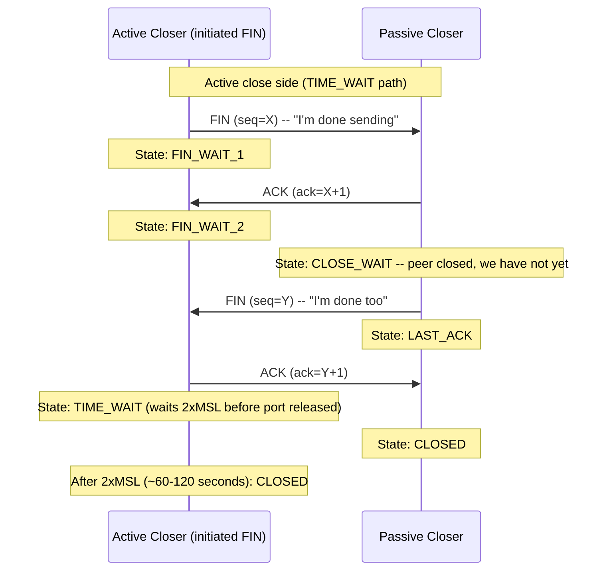

### TIME_WAIT

The side that **initiates** close enters TIME_WAIT after sending the final ACK. It stays there for **2 x MSL** (Maximum Segment Lifetime), typically 60-120 seconds.

**Why TIME_WAIT exists:** If the final ACK is lost, the passive closer retransmits its FIN. The active closer must still be around to re-send the ACK. Also: TIME_WAIT ensures any delayed packets from this connection expire before the same 4-tuple is reused for a new connection.

**Normal:** Seeing TIME_WAIT connections on servers that initiate many short-lived connections (load balancers, outbound HTTP clients) is expected and healthy. High counts are a signal to check connection reuse.

### CLOSE_WAIT -- The Application Bug State

CLOSE_WAIT means: the remote peer sent FIN (it closed its side) but **your application has not yet called `close()`** on the socket.

CLOSE_WAIT is always an **application-level bug**. The OS received the peer's FIN and is waiting for your code to close its side. Common causes:

1. Exception thrown in request handler before the `close()` call is reached
2. Connection obtained from a pool but never returned (`pool.release()` skipped)
3. Background thread holding a socket reference while the main handler finished

**Symptom:**

```bash
netstat -an | grep CLOSE_WAIT
```

If this count grows over hours and never decreases, you have a connection leak.

**Fix:** Find code paths that acquire a socket or connection but do not close it in all exit paths. The `finally` block or `try-with-resources` pattern prevents this:

```java
// WRONG -- exception skips close()
Socket sock = getSocket();
doWork(sock);      // throws exception
sock.close();      // never reached

// RIGHT -- always closed
try (Socket sock = getSocket()) {
    doWork(sock);
} // close() called automatically, even on exception
```

**Monitoring:** Alert when CLOSE_WAIT count exceeds your baseline by 2x. A single leaked code path can drain your entire connection pool in under an hour.

---

## 13. "What If X Changes " -- Brainstorming Section

These are the exact questions asked at Staff and Principal interviews. For each: read the question, form your own answer, then compare.

---

### TCP and Connections

**Q1: Your service is behind an AWS ALB. ALB has a 60-second idle connection timeout. Your service's keep-alive is 90 seconds. What race condition does this create **

Model answer: The ALB may silently close an idle connection after 60 seconds. Your service still thinks the connection is open -- it will close it at 90s. When the next request arrives at second 61-89, your service sends data on a dead connection. The ALB returns TCP RST. Your client sees a "connection reset" error.

The fix is simple: **always set application-side keep-alive shorter than the LB idle timeout.** If LB closes at 60s, send keep-alive at 50s. The app closes first, gracefully, before the LB silently drops it.

Rule: "Application keep-alive timeout < LB idle timeout."

---

**Q2: You're seeing CLOSE_WAIT connections accumulating on your server.**

Model answer: CLOSE_WAIT means the remote peer (client) sent FIN and closed its side, but your application code has not called `close()` on the socket. This is an **application bug**, not a network bug. Likely causes:

1. Exception in request handler before `close()` -- missing `finally` block
2. Connection obtained from pool but never returned -- missing `pool.release()`
3. Background goroutine or thread holding socket reference after the main handler exited

Fix: search for socket/connection objects not wrapped in `try-with-resources` or `defer`. Add connection leak detection (HikariCP `leakDetectionThreshold`, Go's `net/http` transport idle connection timeout). Alert when CLOSE_WAIT count exceeds baseline by 2x.

---

**Q3: Your service makes 100 outbound connections/second to an external API. The external API rate limits to 60 connections/minute per IP.**

Model answer: At 100 connections/sec, you open 6,000 connections per minute -- 100x the limit. You will be rate-limited almost immediately.

Options:
1. **Connection pooling (first choice):** Stop opening a new connection per request. Use a pool of 5-10 long-lived connections. 60 connections/minute limit ~= 1 new connection per second; a steady pool of 5 connections easily handles this with keep-alive.
2. **Multiple source IPs:** Distribute connections across multiple outbound IPs (if you have a NAT cluster). Each IP gets its own 60/min quota.
3. **Request queuing + rate limiter:** Queue incoming requests, release at 1/second to the external API. Token bucket or leaky bucket algorithm.
4. **Negotiate higher limit with the vendor.**

Recommended approach: **connection pooling + a request queue with rate limiter.** Connection pooling alone solves the immediate problem; the rate limiter protects against burst scenarios.

---

### HTTP and Protocols

**Q4: You're migrating from HTTP/1.1 to HTTP/2. HTTP/2 uses multiplexing. Is head-of-line blocking still a problem **

Model answer: HTTP/2 solves **application-layer** head-of-line blocking. Multiple HTTP requests on a single connection no longer block each other at the HTTP level.

But **TCP-layer** head-of-line blocking still exists. All HTTP/2 streams share one TCP connection. If a single TCP packet is lost, all streams sharing that connection wait for retransmission -- even streams with no data in the lost packet.

On reliable datacenter networks (< 0.01% packet loss), this is negligible. On mobile or intercontinental links (0.5-2% loss), it is significant. HTTP/3 (QUIC over UDP) solves this: each stream has independent loss recovery. A lost packet stalls only the stream it belonged to.

**Practical implication:** For mobile API clients or users in high-latency regions, HTTP/3 can reduce p99 latency by 20-40% compared to HTTP/2 on lossy connections.

---

**Q5: A client sends a POST to create an order. The order is created. The response is lost. The client retries. How do you make this safe **

Model answer: Use an **idempotency key** in the request header (`Idempotency-Key: <uuid4>`).

Server behavior:
1. Check if this key was seen before (in Redis or DB)
2. If yes: return the stored response without re-executing
3. If no: execute the order creation, atomically store (key -> response), return response

Client retries with the same key. Server returns the same `201 Created` with the same order ID. The order is created exactly once.

Key details:
- Use 24-hour TTL on stored keys
- Scope the key to the authenticated user (key X for user A cannot be reused by user B)
- If same key + same user + **different request body**: return `422 Unprocessable Entity` (conflicting idempotent request -- Stripe's pattern)
- The storage of the key and the order creation must be **atomic** (in the same DB transaction), or a crash between creation and key storage causes double-execution on retry

---

**Q6: Your API returns `200 OK` with `{"error": "user not found"}` in the body. What are the three concrete consequences **

Model answer:

1. **CDN and reverse proxies cache it.** 200 responses are cacheable. A "user not found" error gets cached and served to future requests. Users receive a stale error response, potentially for hours.

2. **Client retry logic doesn't trigger.** Retry libraries trigger on 5xx and 429. A 200 response is treated as success. The client never retries, and the user sees a failure with no automatic recovery.

3. **Monitoring and alerting miss the error.** Error rate dashboards count 5xx responses. All these "200 errors" appear as successful requests. Your p99 error rate looks fine while users are failing silently.

Fix: return the correct HTTP status code (`404 Not Found` for missing users). The entire HTTP infrastructure -- CDNs, proxies, load balancers, retry libraries, monitoring systems -- is designed to behave correctly based on status codes.

---

### DNS and Routing

**Q7: Your service does a DNS lookup for every request to a downstream. DNS TTL is 5 minutes but resolution takes 50ms. How do you optimize **

Model answer: **Cache DNS results in the application** for the TTL duration.

Most HTTP client libraries do this automatically (Java `HttpClient`, Go `net/http`, cURL). If yours does not, wrap DNS resolution with a TTL-aware in-process cache: resolve once, cache the IP for 5 minutes, re-resolve when the TTL expires.

Concern: if the downstream changes IP (failover, blue-green deploy), you keep sending to the old IP until the cache expires. Mitigation: respect the TTL exactly -- do not cache indefinitely.

Also check `/etc/resolv.conf` `ndots` setting. If `ndots=5` and your service name is `api.internal`, the OS tries multiple FQDN combinations before succeeding -- adding multiple DNS round trips per resolution. Reducing `ndots` or using fully-qualified names avoids this.

---

**Q8: You're using Geo-DNS. A region fails. TTL is 5 minutes. How long do users experience downtime **

Model answer: Up to **5 minutes** for clients with a fresh DNS cache -- they continue hitting the failed region until their TTL expires. On top of that: your health check typically takes 30 seconds to 3 minutes to detect the failure and update DNS.

Total impact window: **5-8 minutes** for clients with recently cached DNS entries.

Mitigation strategies:
- **Before planned failovers:** Roll TTL down to 30-60 seconds 24 hours in advance (TTL-rolling technique). This allows fast DNS propagation during the actual failover.
- **For unplanned failures:** Multi-CDN or Anycast routing responds much faster. BGP route withdrawal propagates in 30-60 seconds, compared to DNS TTL wait.
- **Always test failover with TTL already low** -- never discover during an incident that your TTL was 24 hours.

---

### TLS

**Q9: TLS 1.2 requires 2 RTT. TLS 1.3 requires 1. Your users are in high-latency regions (200ms RTT). What's the savings  What does 0-RTT give you and what's the security risk **

Model answer:

- **TLS 1.2:** 2 RTT x 200ms = **400ms** before first data
- **TLS 1.3:** 1 RTT x 200ms = **200ms** before first data
- **Savings:** 200ms per new connection

For a user loading a page with 10 requests: if there is only 1 new connection (reuse for all others), savings = 200ms total. Connection reuse makes this a one-time cost per connection lifetime.

**TLS 1.3 0-RTT (session resumption):** The client sends application data in the very first packet -- zero TLS handshake latency. For returning users, the TLS overhead is 0ms.

**Security risk of 0-RTT: replay attacks.** An attacker who captures the 0-RTT data can replay it to the server. The server cannot distinguish the original from the replay.

Mitigation: only use 0-RTT for **idempotent, safe operations** (GET requests, read-only queries). Never for payments, order creation, or any state-changing operation. Stripe does not use 0-RTT for payment endpoints.

---

## 14. Connection Pool Exhaustion -- Case Study

### The Scenario

Your service starts returning 503. The database is healthy. Other services calling the same database are fine. Your service-specific metrics show "connections available: 0."

This is a classic pool exhaustion incident. Here is how to diagnose it step by step.

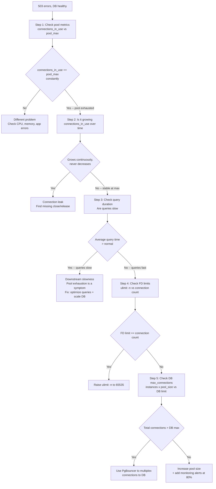

### Step-by-Step Diagnosis

**Step 1: Confirm pool exhaustion**

Check your pool metrics: "connections in use" vs "pool size." If connections in use == pool max, pool exhaustion is confirmed. Possible causes: slow queries, connection leak, pool too small.

**Step 2: Look for a connection leak**

If "connections in use" grows over time and never decreases (even when QPS drops), you have a leak. Connections are being acquired but never returned. Search your codebase for `getConnection()`, `pool.borrow()`, or `dataSource.getConnection()` calls that are not followed by `close()` or `release()` in a `finally` block.

**Step 3: Check if downstream is slow**

If queries are slow (say, 2 seconds instead of 5ms), each connection is held for 400x longer than normal. Little's Law: at 100 QPS x 2s = 200 simultaneous connections. If pool is 50, it exhausts in seconds. Pool exhaustion is the *symptom*; slow queries are the *cause*. Fix: optimize queries AND scale the DB. Increasing pool size alone just shifts the exhaustion point.

**Step 4: Check file descriptor limits**

Each connection = 1 file descriptor. Run `ulimit -n`. If your FD limit is 1,024 and you have 1,000 connections, new connections fail with "Too many open files." Set `LimitNOFILE=65535` in your systemd service file.

**Step 5: Check database `max_connections`**

The database has its own connection limit. Example: 500 connections per app instance x 10 instances = 5,000 connections, but DB `max_connections = 100`. Result: 4,900 connections rejected. Use **PgBouncer** to multiplex: 10 app instances x 500 pool connections = 5,000 client connections to PgBouncer -> PgBouncer maps these to 50 real PostgreSQL connections.

### Real Incident Pattern

A new code path caught an exception but did not return the connection to the pool:

```java
// BUG introduced in new code path
Connection conn = pool.getConnection();
try {
    String result = riskyOperation();
    pool.release(conn);
} catch (Exception e) {
    log.error("Operation failed", e);
    // BUG: pool.release(conn) not called in catch block
}
```

Over 30 minutes, all 50 connections leaked. The fix:

```java
// FIXED -- always release, even on exception
Connection conn = pool.getConnection();
try {
    String result = riskyOperation();
} catch (Exception e) {
    log.error("Operation failed", e);
} finally {
    pool.release(conn); // always executes
}
```

Prevention: add pool metrics + alerting. Fire a warning when "connections in use" > 80% of pool max. This gives you time to investigate before the service fails.

---

## 15. Failure Injection Scenarios -- Complete Detail

### Scenario 1: Cascading Connection Exhaustion

**Setup:** Service A calls Service B. B responds slowly (p99 = 2 seconds, baseline = 20ms). Service A has a connection pool of 200, with **no timeout** configured on calls to B.

**What happens:**

At 1,000 QPS, each request to A calls B and waits up to 2 seconds. After 10 seconds:
- In-flight requests holding connections: 1,000 QPS x 2s = **2,000 requests in flight**
- Pool size: 200
- Pool exhausted within **0.2 seconds** of B slowing down

Service A starts returning 503 (connection timeout waiting for pool) or queuing requests until memory is exhausted.

**Cascade:**

Services C and D also call Service A. A is now unavailable. C and D's own pools fill up with stuck requests to A. They run out of connections to A and return 503 to their callers. The cascade propagates up the call graph.

**Fix:**

Set a **100ms timeout** on calls to B. If B doesn't respond in 100ms, the request fails fast, the connection returns to the pool immediately, and Service A stays available.

Trade-off: some requests fail with 503 instead of waiting. Return `503` with `Retry-After: 2` header so callers know to retry with backoff.

**Pattern:** Add a **circuit breaker**. After 50% of calls to B fail within a 10-second window, stop calling B entirely for 30 seconds. Return 503 immediately without consuming a connection. After 30 seconds, try a few "probe" requests -- if B is healthy, resume.

---

### Scenario 2: Split DNS Resolution

**Setup:** Services in EU-West and US-East use `api.internal.company.com`. One EU-West pod has `/etc/hosts` pointing to the US-East IP. That pod now makes every "internal" call across the Atlantic: +200ms latency.

**Detection:**

Distributed tracing (using X-Request-ID): the EU-West pod's traces show 200ms for "internal service call." All other EU-West pods show 2ms. The anomaly is in one pod.

Alert: intra-cluster call latency exceeds threshold (e.g., > 20ms for internal services).

Verify from that pod:
```bash
nslookup api.internal.company.com
# Shows US-East IP instead of EU-West IP
```

**DNS failover scenario:**

When you update DNS to point to a new IP, clients with cached entries continue using the old IP for TTL duration. Strategy:
1. Keep old IP alive during the TTL window. Return 503 for new requests (to drain them away) but finish already-in-flight requests.
2. For stateless services: run both old and new IPs simultaneously -- traffic naturally migrates as TTLs expire.
3. For stateful services (sessions): sticky routing during the TTL window. New connections go to new IP; existing sessions stick to old IP until they complete.

**Stale IP caching symptom:**

Clients get "Connection refused" or responses from the wrong service. Detect in monitoring: compare the destination IPs your service connects to against a known-good registry. Alert when an unexpected IP is seen.

---

### Scenario 3: TLS Certificate Expiry

**Setup:** Certificate for `payments.api.company.com` expires at midnight. Automated rotation failed.

**What happens at 00:01 AM:**

- All **new** TLS handshakes fail immediately: `certificate has expired`
- Clients with active TLS sessions may continue for the session ticket lifetime (6-24 hours for TLS 1.2 session tickets). These clients continue working temporarily.
- Mobile apps that frequently reconnect (network switches, app backgrounding) start failing immediately.
- Background services with persistent connections continue until they reconnect.

**Latency increase warning signal:**

In the hours before expiry, some clients attempt session resumption and fail (server rejects the resumption because cert is near expiry in some validation modes). They fall back to a full TLS handshake: +1 RTT = +10ms. This rising latency in p99 is a pre-expiry warning signal -- not definitive, but correlates.

**Emergency zero-downtime fix:**

```bash
# Step 1: Obtain new certificate from CA
# (Let's Encrypt, AWS ACM, or internal CA)

# Step 2: Verify the new certificate is valid
openssl verify -CAfile ca-bundle.crt new_certificate.crt

# Step 3a: If using AWS ACM -- update the listener cert in ACM console
# or via CLI:
aws acm import-certificate --certificate-arn arn:... \
  --certificate file://new.crt \
  --private-key file://new.key \
  --certificate-chain file://chain.crt

# Step 3b: If using nginx -- rolling reload:
cp new.crt /etc/nginx/certs/payments.crt
cp new.key /etc/nginx/certs/payments.key
nginx -s reload   # graceful reload, no dropped connections

# Step 4: Verify
echo | openssl s_client -connect payments.api.company.com:443 \
  -servername payments.api.company.com 2>/dev/null \
  | openssl x509 -noout -dates
# notAfter should show the new expiry date
```

Total time with automation: 15-30 minutes.

**Monitoring -- detect before expiry:**

```bash
# Check certificate expiry from monitoring system (run hourly)
echo | openssl s_client -connect payments.api.company.com:443 \
  -servername payments.api.company.com 2>/dev/null \
  | openssl x509 -noout -enddate

# Alert when: notAfter < now + 30 days
```

Also enable cloud-native alerts:
- AWS ACM: sends SNS notifications at 45, 30, 15, and 7 days before expiry
- Let's Encrypt with certbot: auto-renews at 30 days before expiry
- Datadog / Grafana: built-in TLS certificate expiry monitors

---

## How Your Thinking Evolves: Intern to Staff Engineer

*Same problem at four levels: users in Asia are complaining your app is slow. Your servers are in US-East.*

### Intern Level: "Make the server faster"

The intern's first instinct: "The server is slow, let's add more CPU." They profile the server: CPU is at 20%, memory at 40%. The server is not the problem. The intern is confused.

Think of this like blaming the restaurant kitchen for slow service when the problem is that the restaurant is 3 miles away and the food delivery takes 30 minutes. No matter how fast the kitchen cooks, physics limits how fast the food arrives.

The problem is latency. US-East to Tokyo is 160ms one-way, 320ms round-trip. Even an instantaneous server response takes 320ms just to travel. A webpage with 20 serial requests = 6.4 seconds of pure travel time, before any processing.

### Mid-Level (L4): "Add a CDN for static assets"

L4 knows about CDNs. They put CloudFront in front of static assets (images, CSS, JS). Tokyo users now download static files from a Tokyo edge node -- 5ms instead of 320ms.

Better. Static content is fast. But the dynamic API calls (user feed, search results) still go to US-East: 320ms round-trip. The page loads images fast but the news feed takes 2+ seconds. L4 solved 30% of the problem (static assets) and left 70% (dynamic API) unsolved.

### Senior (L5): "Cache dynamic responses, design for the specific latency budget"

L5 breaks the problem into: static (CDN already handles), dynamic-cacheable (user feed, which updates every 30s), dynamic-uncacheable (write operations, real-time).

For dynamic-cacheable: L5 uses edge caching with short TTLs (30 seconds for a news feed). The CDN caches the API response at the edge. Tokyo users get the cached feed from Tokyo in 5ms. Cache invalidation happens when the feed updates.

L5 also measures: "How much of our latency is actual network travel vs server processing?" Tool: `curl -w "@curl-format.txt" https://api.example.com/feed`. If travel time is 300ms and server is 20ms, the fix is geographic, not optimization.

```
L5 LATENCY BREAKDOWN:
  Total: 340ms
  - DNS lookup: 10ms (fix: DNS prefetch, TTL tuning)
  - TCP connect: 160ms (fix: TCP connection reuse, HTTP/2)
  - TLS handshake: 80ms (fix: TLS session resumption)
  - Server processing: 20ms (not the bottleneck)
  - Data transfer: 70ms (fix: compression, smaller payloads)

  Biggest wins: move servers closer (geo), HTTP/2 multiplexing, TLS resumption
```

### Staff (L6): "Network latency is a physics problem, design the architecture around it"

L6 starts with: "The speed of light in fiber is 200,000 km/second. US-East to Tokyo is 10,000 km. Minimum round-trip: 100ms. No software optimization beats physics. The only fix for latency is geography: move compute closer to users."

L6 designs a multi-region architecture:
- US-East: primary region, writes go here
- Tokyo: read replica + edge cache for reads
- Frankfurt: read replica + edge cache for EU

Writes still go to US-East (single source of truth). Reads are served from the nearest region. Cross-region replication lag: 80ms. Users in Tokyo read data that is up to 80ms stale. For a news feed: acceptable. For financial data: not.

L6 also designs the anycast DNS layer: `api.example.com` resolves to different IPs in different geographies, each IP routing to the nearest region.

```
L6 GLOBAL ARCHITECTURE:
  [Tokyo user] -> DNS anycast -> [Tokyo edge]
                                      |
                         +------------+------------+
                         |                         |
                 [Read: Tokyo replica]      [Write: route to US-East]
                  (80ms stale, OK)          (320ms round-trip, required)
```

### The Pattern

- Intern: blames server, misses that physics (latency) is the constraint
- L4: CDN for static (30% of problem solved)
- L5: breaks down latency budget, caches dynamic responses, measures actual components
- L6: designs multi-region architecture, separates read vs write geography, anycast DNS

---

## L5 vs L6 Calibration: Networking Foundations

| Dimension | L5 (Senior) | L6 (Staff) |
|-----------|-------------|------------|
| Latency diagnosis | Uses curl timing to break down latency components | Builds full latency budget model: physics + protocol + server + client |
| CDN strategy | Adds CDN for static assets | Designs cache hierarchy: origin -> regional PoP -> edge, with invalidation strategy |
| DNS | Knows DNS resolution | Designs DNS TTL policy, split-horizon DNS, anycast routing |
| TLS | Implements TLS, knows handshake cost | Tunes TLS session resumption, designs OCSP stapling, chooses cipher suite |
| HTTP/2 | Knows HTTP/2 multiplexes requests | Designs H2 push, stream prioritization, header compression |
| WebSockets | Can implement WebSocket server | Designs WebSocket load balancing (sticky sessions or stateless pub/sub) |
| TCP tuning | Knows TCP basics | Tunes TCP window size, nagle algorithm, keepalive timers for specific workloads |
| Multi-region | Knows multiple regions reduce latency | Designs read/write separation across regions, replication lag SLA |
| Bandwidth vs latency | Knows the difference | Quantifies: which workloads are bandwidth-bound vs latency-bound, optimizes accordingly |
| Network failure | Knows networks fail | Designs for partition tolerance, BGP failover, circuit breaker at network layer |
| Cost | Knows CDN has egress costs | Models egress cost at scale: CDN vs direct, regional vs global |
| Impact | Optimizes one service's network | Designs network architecture for entire product |

---

## Named Production Incidents

### Incident 1: Facebook 2021 -- BGP Withdrawal Global Outage

**What happened:** A Facebook engineer made a routine BGP configuration change to one of Facebook's backbone routers. The change had a mistake: it accidentally withdrew all of Facebook's BGP routes from the global internet. BGP is the protocol that tells every router on the internet how to reach a network. When Facebook's BGP routes disappeared, every router on the internet stopped knowing how to reach Facebook's IP addresses. Facebook.com, Instagram.com, and WhatsApp.com all became unreachable simultaneously. The outage lasted about 6 hours. The tricky part: Facebook's own DNS servers were inside their network. Engineers trying to fix the problem couldn't reach internal tools because those tools also required connecting to Facebook's network.

**Root cause:** A BGP configuration audit command sent to Facebook's backbone routers had a bug. Instead of checking the capacity of connections, it inadvertently took them down. This caused all BGP sessions to drop, which withdrew all of Facebook's route announcements. The internet lost all knowledge of how to reach Facebook.

**ASCII diagram:**
```
Normal state (Facebook routes in BGP):
  Internet routers:
  ISP A: "To reach 157.240.x.x, send to Facebook AS32934"
  ISP B: "To reach 157.240.x.x, send to Facebook AS32934"
  User: DNS lookup facebook.com -> 157.240.x.x -> route exists -> connected

After BGP withdrawal:
  Internet routers:
  ISP A: [no route to 157.240.x.x]
  ISP B: [no route to 157.240.x.x]
  User: DNS lookup facebook.com -> 157.240.x.x -> no route -> timeout

  Facebook DNS servers (inside FB network) also unreachable:
  Fix requires physical access to backbone routers.
  Engineers had to go on-site to push fix.
```

**Fix applied:** Facebook pushed corrected BGP route announcements from an out-of-band management network that was not affected. They also implemented additional safeguards: BGP changes now require a staged rollout and automated verification that route reachability is maintained before changes are fully applied.

**Staff lesson:** BGP is the glue that holds the internet together. A single misconfigured BGP advertisement can make an entire company's infrastructure unreachable. Key lesson: management plane (the tools you use to fix problems) must be reachable even when the data plane (production traffic) is broken. If your internal tools are on the same network as your product, you may not be able to fix a network outage from inside. Design an out-of-band management path.

---

### Incident 2: Cloudflare 2020 -- BGP Route Leak Via Third-Party AS

**What happened:** A small ISP misconfigured its BGP routing and began advertising Cloudflare's IP prefixes as if it owned them. Normally, Cloudflare's IPs are advertised only by Cloudflare's own AS (autonomous system number). When the ISP advertised the same prefixes with a shorter or equally preferred route path, some internet routers started sending traffic destined for Cloudflare's servers to the ISP instead. The ISP had no actual connection to Cloudflare's servers, so the traffic went nowhere. Cloudflare lost approximately 15% of its global traffic for over 6 minutes. Users experienced complete packet loss -- their packets were delivered to the wrong destination and silently dropped.

**Root cause:** BGP has no built-in authentication for route origins. Anyone can announce any prefix. The misconfiguration at the ISP was not intentionally malicious, but BGP accepted the announcement because it looked like a valid (or even preferred) route. Verizon and other transit providers propagated the leak instead of filtering it.

**ASCII diagram:**
```
Normal routing:
  User packet -> ISP router -> Cloudflare AS13335 -> Cloudflare server -> response

Route leak:
  Cloudflare announces: "I own 104.16.0.0/12"
  Rogue ISP also announces: "I own 104.16.0.0/12" (more specific or equal path)

  Some internet routers prefer rogue ISP route:
  User packet -> ISP router -> Rogue ISP -> [dead end, no path to Cloudflare]
                                             -> packet dropped silently
  User sees: connection timeout

  15% of global traffic affected for 6+ minutes.
```

**Fix applied:** Cloudflare worked with upstream transit providers to filter the rogue announcements. Long term: Cloudflare uses RPKI (Resource Public Key Infrastructure) to cryptographically sign their route announcements, so routers can reject unsigned routes for Cloudflare's prefixes.

**Staff lesson:** BGP route leaks can cause outages even when your own infrastructure is healthy. Defense is at the routing level: implement RPKI to sign your BGP announcements, work with upstream providers to enable route origin validation, and set up BGP monitoring that alerts when your prefixes are announced by unexpected ASes. Tools like BGPmon or Cloudflare's own radar can detect route leaks in near-real time.

---

### Incident 3: GitHub 2018 -- TLS Certificate Expiry on api.github.com

**What happened:** GitHub's TLS certificate for api.github.com expired in production. The automated certificate renewal system failed silently. The renewal script had a bug that only triggered when the domain's DNS records had changed -- GitHub had changed their DNS configuration 3 months earlier, and the renewal script did not account for this. When the certificate expired, any HTTPS connection to api.github.com was rejected by clients with a TLS error. Git push and git pull operations across thousands of companies' CI/CD pipelines failed for approximately 45 minutes.

**Root cause:** The certificate renewal automation had a hidden dependency on DNS configuration. When DNS changed, the renewal script's domain ownership verification step failed silently (logged the error but did not alert or retry). The script ran on a schedule, appeared to succeed from a job-completion standpoint, but had not actually renewed the certificate. The team discovered the problem only when the certificate expired.

**ASCII diagram:**
```
Certificate lifecycle (what should happen):
  Day 0:   Certificate issued, valid for 90 days
  Day 60:  Renewal script runs -> verifies domain ownership -> issues new cert
  Day 90:  Old cert expires, new cert already in place. Users unaffected.

What actually happened:
  Day 0:   Certificate issued, valid for 90 days
  Day -90: DNS records changed (GitH.ub infrastructure change)
  Day 60:  Renewal script runs -> domain verification fails (DNS mismatch)
           -> logs error -> job reports "completed" -> no alert sent
  Day 90:  Certificate expires.
  Day 90:  git push/pull: TLS handshake fails.
           Browser: "Your connection is not private" (NET::ERR_CERT_DATE_INVALID)
           45 minutes of outage across thousands of dependent systems.
```

**Fix applied:** Fixed the renewal script to treat verification failure as a fatal error (not a silent log). Added monitoring that alerts when any certificate has fewer than 30 days remaining, independent of the renewal script. Added a separate check that alerts if the live certificate expiry date does not match what the renewal system expects.

**Staff lesson:** Certificate expiry is one of the most preventable outages in production. There are two things to monitor, not one: (1) does the renewal job report success, and (2) is the actual live certificate expiry date being pushed back. These can diverge, as GitHub found. Every team running a TLS service should have an independent certificate expiry monitor that checks the live certificate directly, separate from the renewal pipeline.

---

### Incident 4: Let's Encrypt 2020 -- Mass Certificate Revocation

**What happened:** Let's Encrypt (a free certificate authority used by millions of websites) discovered a bug in their certificate issuance software. The bug was in CAA record checking -- a security check that verifies whether a domain owner has authorized Let's Encrypt to issue a certificate. Due to the bug, some certificates were issued without properly checking this authorization. Let's Encrypt was legally required to revoke all affected certificates within 24 hours -- about 3 million certificates. Websites using automated renewal tools (like certbot) got new certificates before the revocation. Sites that renewed manually did not, and their certificates were revoked without replacements in place, causing browsers to reject connections.

**Root cause:** A bug in the CAA (Certification Authority Authorization) checking logic in Let's Encrypt's Boulder software. CAA records let domain owners specify which CAs are allowed to issue certificates for their domain. The bug caused multiple certificate requests to share a single CAA check result instead of checking independently per request. This meant some certificates passed CAA validation incorrectly.

**ASCII diagram:**
```
CAA check (intended):
  Request cert for example.com -> check DNS CAA record for example.com
  -> "letsencrypt.org is authorized" -> issue certificate

CAA check (buggy):
  Request 1 for example.com -> check CAA -> authorized -> cache result
  Request 2 for example.com -> reuse cached result -> issue cert (correct, same domain)
  Request 3 for different.com -> reuse cached result -> issue cert (WRONG - skipped check)

Revocation impact:
  3 million certificates revoked.
  Sites with certbot: auto-renew runs -> new cert issued -> no downtime.
  Sites with manual renewal: old cert revoked -> no replacement -> browser rejects connection.
                             Users see: "Your connection is not secure"
```

**Fix applied:** Let's Encrypt fixed the CAA caching bug and re-checked all recent issuances. They improved their issuance audit pipeline to detect future logic errors before certificates reach production scale.

**Staff lesson:** Automation is the difference between a certificate revocation being a minor background event versus a production outage. If Let's Encrypt had announced this revocation with a 30-day window instead of 24 hours, manual processes might have kept up. But for internet-scale events with hard deadlines, manual processes will always lag. Any certificate renewal process that requires human action is one mass revocation away from an outage. Use automated renewal everywhere.

---

### Incident 5: Slack 2021 -- DNS TTL Extending User-Visible Outage During AWS Failover

**What happened:** During an AWS us-east-1 partial outage, Slack's backend services automatically failed over to a different region. The failover itself took about 2 minutes. However, Slack's API endpoint DNS record had a 30-second TTL (time-to-live). TTL tells clients how long to cache a DNS answer before re-querying. Clients that had resolved Slack's API endpoint DNS in the last 30 seconds still had the old IP address cached. Those clients kept sending requests to the unavailable endpoint for up to 30 more seconds, even after the backend was healthy in the new region. This extended the user-visible outage from 2 minutes (backend failover time) to 2 minutes + 30 seconds (TTL expiry) for affected users.

**Root cause:** DNS TTL creates a window during which clients hold stale IP mappings. During a failover, the IP address of a service's endpoint changes. Until a client's cached DNS entry expires and it re-queries, it will keep sending traffic to the old address. A 30-second TTL means up to 30 extra seconds of stale routing. In this case, the TTL was already short (30 seconds is low for production DNS), but it still extended the outage meaningfully.

**ASCII diagram:**
```
Timeline:
  T=0:    AWS us-east-1 partial outage begins. Slack API endpoint unreachable.
  T=0:    Slack starts failover to us-west-2.
  T=120s: Slack backend healthy in us-west-2. DNS updated to new IP.

Client behavior during T=120s to T=150s (30s TTL window):
  Client A (resolved DNS at T=110s):
    Cached IP: old us-east-1 address (TTL expires at T=140s)
    Sends requests to old IP -> connection refused -> error for 20 more seconds.
  Client B (resolved DNS at T=0s):
    Cached IP: old us-east-1 address (TTL already expired at T=30s)
    Re-queries DNS at T=30s -> gets same broken IP (failover not done yet)
    Re-queries DNS at T=150s -> gets new IP -> connected.

  Users whose DNS cache expires after T=120s: 0 extra outage.
  Users whose DNS cache expires before T=120s: re-query gets old IP, wait more.
  Worst case: up to 30 extra seconds of outage beyond backend recovery.
```

**Fix applied:** Slack reviewed their DNS TTL strategy for failover-critical endpoints. For health-check-driven failover, a lower TTL (5-10 seconds) reduces the stale cache window, at the cost of more DNS queries during normal operation. They also evaluated using anycast or a global load balancer layer that can absorb regional failures without requiring DNS updates.

**Staff lesson:** DNS TTL is a direct knob on your failover speed. If your TTL is 300 seconds (5 minutes), a DNS-based failover will have a 5-minute tail where some clients keep hitting the dead endpoint. Reduce TTL on health-check-driven endpoints to 30 seconds or less. Also: pre-lower the TTL before a planned maintenance window (do it 2x the TTL ahead of time, so client caches drain). And remember: you cannot instantly flush client DNS caches -- TTL is the only mechanism you control.

---

## Homework

**Assignment 1 — Network trace analysis.** Use `tcpdump` or Wireshark to capture traffic to/from one of your services for 60 seconds during normal operation. Identify: TCP handshake overhead, keep-alive connections, TLS handshake latency, and any unexpected retransmissions. Write a one-page interpretation.

**Assignment 2 — DNS TTL audit.** Check the DNS TTLs for your production services. For health-check-driven failover endpoints, are TTLs appropriately short (30-60s)? For stable endpoints, are TTLs appropriately long (300-3600s)? Make the case for any changes needed.

**Assignment 3 — Interview practice: networking question.** Practice answering "what happens when you type google.com in a browser?" covering: DNS resolution, TCP handshake, TLS handshake, HTTP request, server processing, response. Time yourself covering all layers in 5 minutes without notes.

**Assignment 4 — CDN configuration review.** Review the CDN configuration for a product you work on. Find: cache hit rate by content type, TTL settings, origin shield configuration, and any bypass rules. Identify one optimization that would improve performance or reduce origin cost.
