# Chapter 9: Designing Systems That Scale Across Teams

---

## Section 1: Learning Goal

By the end of this chapter you will be able to:

1. Explain the **two types of scale** — technical (more traffic) and organizational (more teams) — and why organizational scale is harder.
2. Apply **Conway's Law** and the **inverse Conway maneuver** to real system designs.
3. Define **API contracts**, write **versioning and deprecation policies**, and negotiate **Service Level Agreements** between teams.
4. Choose between **platform thinking** and **point solutions**, and know the exact signals that say "build a platform now."
5. Explain what a **service mesh** and an **API gateway** do and when each is the right tool.
6. Use **event-driven architecture** to decouple teams, and know when NOT to use events.
7. Apply the **database-per-service** pattern, CQRS, and read models to keep data ownership clean.
8. Draw a **dependency graph**, identify **circular dependencies**, and design **graceful degradation** with circuit breakers.
9. Run a **cross-team incident** as the Incident Commander, write runbooks, and lead blameless post-mortems.
10. Design systems for **team autonomy** — knowing when to centralize and when to decentralize.

This is the dimension of system design that most candidates miss. It is precisely what separates L6 thinking from L5 thinking at Google.

---

## Section 2: Why This Matters

### The One Sentence Answer

Systems fail more often from human and organizational reasons than from technical ones.

### The Long Answer

Most system design books teach you how to handle more requests, store more data, and survive more failures. That is important. But it is not what distinguishes Staff Engineers from Senior Engineers.

A Staff Engineer understands something that takes years to learn. A system that scales to a billion requests per second but requires three teams to coordinate for every change will grind to a halt. A service with perfect availability but unclear ownership will accumulate technical debt until it becomes unmaintainable. A platform that solves everyone's problem but belongs to no one will eventually solve no one's problem well.

This chapter teaches you how to design systems that scale not just technically but *organizationally* — across teams, ownership boundaries, and years.

### Why Google Cares About This at L6

At Google, Staff Engineers (L6) are explicitly evaluated on **cross-team impact**. The promotion criteria include phrases like:

- "Technical leadership across multiple teams"
- "Systems or infrastructure that benefit the broader organization"
- "Influence on technical direction beyond the immediate team"

This is not a bureaucratic checkbox. It reflects a real belief: the problems worth solving at Staff level are problems that span team boundaries. If a problem can be solved within a single team, a Senior Engineer can handle it.

### The Scale You Need to Design For

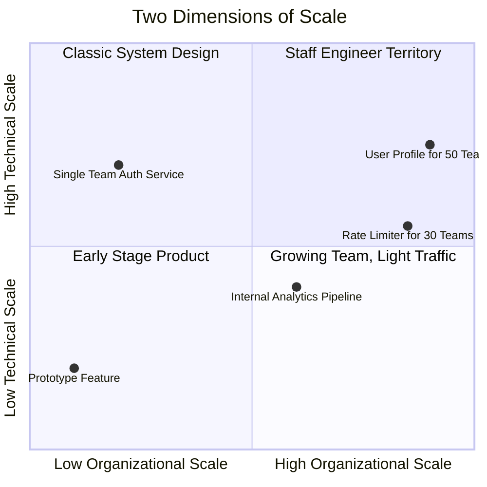

**The key insight:** Technical scale has well-known solutions (sharding, caching, CDN, replication). Organizational scale requires design decisions that shape how *humans* interact with the system. There is no off-the-shelf answer. You have to think it through.

### The L5 vs L6 Difference — In One Table

| Scenario | L5 (Senior) Approach | L6 (Staff) Approach |
|---|---|---|
| New shared service | "This architecture handles our load requirements" | "This handles our load. But who owns it when we're done? How will other teams request changes? What happens to on-call?" |
| API design | "This API is clean and efficient" | "This API will become a contract. Can teams evolve independently? What happens when requirements diverge?" |
| Adding a dependency | "This library solves our problem" | "If we depend on this, we're coupled to their release cycle. Who pages when it breaks? Is that acceptable?" |
| Platform proposal | "Building a shared platform will reduce duplication" | "A platform creates a team. Who staffs it? What's the funding model? What happens if priorities shift?" |
| Breaking change | "We need to migrate to the new API" | "This migration spans 40 teams. What's the coordination cost? Is the benefit worth the organizational tax?" |

**The core difference:** L6 engineers see systems as sociotechnical artifacts — shaped by and shaping the humans who build, operate, and depend on them.

---

## Section 3: Core Concepts

### Concept 1: The Two Types of Scale

#### What It Means

There are two completely different kinds of scale, and confusing them is the most common mistake in system design interviews.

**Technical scale** means: can the system handle more load? More requests per second. More data stored. More geographic regions. More fault tolerance. This is the scale most engineers think about.

**Organizational scale** means: can more teams work on and with this system independently? More teams depending on it without being blocked. More people modifying it without stepping on each other. More use cases without one team becoming a bottleneck. More years without the system becoming unmaintainable.

#### Why Organizational Scale Is Harder

Technical scaling has well-understood solutions. You add machines. You shard databases. You use CDNs. You replicate across regions. The solution space is known.

Organizational scaling does not have a recipe. Every system is different. The right answer depends on team size, company culture, product maturity, and dozens of other factors. There is no "add more machines" equivalent.

More importantly: technical problems degrade gradually. Latency increases, error rates climb, you notice and fix it. Organizational problems are invisible for a long time, then catastrophic. A system accumulates coordination debt for two years, and then suddenly it takes three months to ship any feature.

#### The Real-World Progression

Here is how organizational scale problems appear:

**Week 1:** Team A builds a user profile service. It is clean, fast, does exactly what Team A needs.

**Month 3:** Team B needs user profiles too. Rather than duplicate, they call Team A's service. Reasonable.

**Month 6:** Teams C, D, and E also need user profiles. All depend on Team A's service. Team A is happy to help.

**Month 12:** Problems begin:
- Team A's on-call now handles incidents for five teams' use cases
- Team B needs a new field that Team A does not have bandwidth to add
- Team C's traffic spike takes down the service, affecting everyone
- Team D needs different latency guarantees than the service provides
- Team E's requirements conflict with Team B's

**Month 18:** The service is unmaintainable. Every change requires coordinating with five teams. Team A's roadmap is entirely consumed by cross-team requests. No one feels empowered to improve it.

**What went wrong?** The system scaled technically. It handled the load. But it did not scale organizationally. It became a coordination bottleneck, an on-call burden, and a source of friction.

#### Technical Decisions Have Organizational Consequences

This is the critical insight. Every design decision shapes how teams will interact with your system:

| Technical Decision | Organizational Consequence |
|---|---|
| Shared database | All teams coupled to same schema evolution |
| Synchronous API calls | Caller and callee must scale together |
| Centralized configuration | Single team becomes gatekeeper |
| Shared library | All consumers must upgrade together |
| Monolithic deployment | All changes require coordination |
| Global feature flags | One team's experiment can affect everyone |

Staff Engineers see these consequences before they materialize. Senior Engineers often discover them only after they have become painful.

---

### Concept 2: Conway's Law and the Inverse Conway Maneuver

#### What Conway's Law Says

Conway's Law was stated by Melvin Conway in 1968:

> "Any organization that designs a system will produce a design whose structure is a copy of the organization's communication structure."

In plain English: **your system architecture mirrors your team structure**. This is not optional. It happens whether you want it to or not. It is a law, not a guideline.

#### Why This Exists — First Principles

Think about how software gets built. Engineers who talk to each other build systems that talk to each other. Engineers who do not talk to each other build systems that do not talk to each other well — they have awkward APIs, mismatched data models, and unclear ownership at the seams.

Communication structures become system structures because:
1. Teams design for their own use cases, not for others
2. Teams optimize for their own deployment and operational needs
3. Teams define APIs at their organizational boundaries (what they hand off)
4. Integration points between teams are where systems break — because that is where communication breaks down

#### Real Examples

**Amazon, circa 2002:** Amazon had a monolith. Jeff Bezos issued his famous "API mandate" — every team must expose their data and functionality through service interfaces, and all communication must happen through those interfaces. This forced teams to treat each other as customers and producers. The result was AWS — teams built such good internal platforms that they could sell them externally.

**Google's Borg:** Google's cluster management system (Borg) mirrors Google's internal team structure. Infrastructure teams own Borg's core. Product teams run jobs on Borg. The API between them is stable and versioned. The org structure is the system structure.

**Netflix:** Netflix's microservices architecture is a direct reflection of their team structure. Each team owns one or two services end-to-end. Teams are small (5-7 people). Services are small. The system architecture looks like the org chart.

**The counter-example:** Many companies have a centralized "platform team" that owns all infrastructure. Their system architecture shows it — a monolithic infrastructure layer that everything depends on, owned by a bottleneck team. The org structure created the system bottleneck.

#### The Inverse Conway Maneuver

This is the Staff Engineer move. If Conway's Law says your system mirrors your org, you can **deliberately design your org to get the system architecture you want**.

The inverse Conway maneuver says: first decide what system architecture you want, then structure your teams to match it.

**Example:** You want a microservices architecture. You create small teams, each owning one service end-to-end. The teams naturally build small, independently deployable services because that is how the teams are structured. The team structure shapes the system, instead of the system reflecting an accidental team structure.

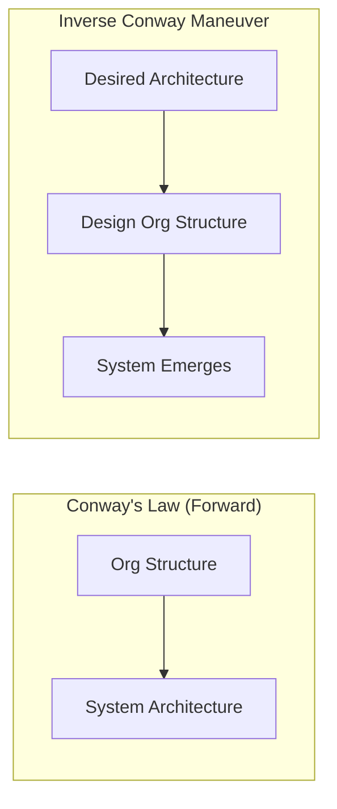

#### How Amazon, Google, Netflix, and Uber Used This

**Amazon (Two-Pizza Teams):** Jeff Bezos's rule: a team should be small enough that two pizzas can feed it (5-7 people). Small teams naturally build small, focused services. Large teams build large, coupled systems. Amazon deliberately kept teams small to force service boundaries.

**Google (TL ownership model):** Google assigns a Tech Lead to every significant system. The TL owns the technical direction, makes architecture decisions, and sets API contracts. This means every system has a single technical owner — not a committee, not a "shared" model. The ownership structure shapes the system structure.

**Netflix (Full-cycle engineers):** Netflix moved to "full-cycle engineering" — teams own everything from development to deployment to on-call. This meant teams needed clearly scoped services they could actually operate. Large, coupled systems are impossible to run full-cycle. The org model forced service decomposition.

**Uber (Domain teams):** Uber organized engineering into domains (Rides, Eats, Freight). Each domain owns their systems end-to-end. This means domain boundaries become API boundaries. The product domains are the system domains.

#### The Practical Lesson for Interviews

When you propose a system architecture, you are also proposing an org structure. A Staff Engineer says this explicitly:

*"This design requires a dedicated platform team of 4-5 engineers who own the core infrastructure. If we don't have that team, the design won't work. Let me walk through what each team would own..."*

This is the signal interviewers look for. You understand that technical decisions have organizational consequences.

---

### Concept 3: API Contracts as Team Boundaries

#### What an API Contract Is

An **API contract** is the formal agreement between a service provider (one team) and service consumers (other teams) about what the service does and how it behaves.

A contract specifies:
- What endpoints exist and what they accept
- What responses they return in success cases
- What errors they return in failure cases
- What performance they guarantee (latency, throughput)
- What availability they guarantee (SLO)
- What behavioral guarantees they make (idempotency, ordering)

This is different from API documentation. Documentation describes what the API does today. A contract is a promise about what it will keep doing.

#### Why the API Is the Most Important Deliverable

Many engineers think the code is what matters. The API is just how you expose the code. This is backwards.

The code can change. You can rewrite the internals completely — different database, different algorithm, different language — and as long as the API contract stays the same, nobody notices. This is the entire basis of software engineering: hide implementation behind interfaces.

The API, once published, is the hardest thing to change. Changing it requires coordinating every single consumer. At two teams, that is manageable. At twenty teams, it is a multi-month project. At fifty teams, it might be impossible.

**Therefore: get the API right. The code you can refactor.**

#### Stable API Equals Team Independence

When your API is stable, other teams can do their work without waiting for you. They do not need to check if something changed. They do not need to coordinate with you before deploying. They can evolve their systems independently.

When your API is unstable, other teams must monitor your changes. They must coordinate with you before every deployment. They cannot evolve independently. You are a bottleneck on their roadmap.

**Stable API = team independence = faster shipping for everyone.**

#### The Cost of a Breaking Change

A breaking change is a change that breaks existing consumers. The consumer's code was written for the old contract. The new contract is different. Their code now fails.

The cost of a breaking change scales with the number of consumers:

| Number of Teams | Cost of One Breaking Change |
|---|---|
| 1 team | A few hours of work. You can coordinate verbally. |
| 2 teams | A day of work. One meeting to coordinate. |
| 5 teams | A week of work. Multiple meetings, different priorities. |
| 10 teams | A month of work. Some teams have no bandwidth. |
| 20 teams | A quarter of work. Full migration project with a manager. |
| 50 teams | Might be impossible. Some teams will never migrate. |

This is not linear. Coordination cost grows faster than team count because each pair of teams must coordinate with each other.

**Therefore: treat breaking changes as expensive. Design APIs that can evolve without breaking existing consumers.**

#### How to Avoid Breaking Changes

**Rule 1: Add, do not remove.** You can add new fields, new endpoints, new optional parameters. You cannot remove existing ones without breaking consumers.

**Rule 2: Make new fields optional.** New required fields break consumers. New optional fields do not. If you must add a required field, add it optional first, then deprecate the old behavior.

**Rule 3: Version explicitly.** When you must break compatibility, create a new version (v2) and let v1 keep running. Consumers migrate when they are ready.

**Example — backwards compatible change:**
```
# v1 API (still works after change)
POST /send-notification
{
  "user_id": "12345",
  "message": "Your order shipped!"
}

# v2 API (new optional field, v1 consumers unaffected)
POST /send-notification
{
  "user_id": "12345",
  "message": "Your order shipped!",
  "channel": "email"  # optional, defaults to "push" if absent
}
```

v1 consumers call with just `user_id` and `message`. They keep working. v2 consumers can now specify channel. Both work simultaneously.

**Example — breaking change handled correctly:**
```
# v1 API - returns name as single string
GET /user/12345
→ { "name": "John Doe" }

# You want to split name. Introduce v2, keep v1 running.
GET /v2/user/12345
→ { "first_name": "John", "last_name": "Doe" }

# v1 keeps working. Teams migrate to v2 at their own pace.
# Set a sunset date: "v1 will be removed on 2026-01-01".
```

#### Versioning, Deprecation, and Sunset — The Full Process

A well-managed API lifecycle has four phases:

**Phase 1: Current.** The API is actively supported. This is the version teams should use. You add features here.

**Phase 2: Deprecated.** The API is still working, but you have announced it will be removed. You are not adding new features. Migration guides exist. Teams should be planning their migration.

**Phase 3: Sunset approaching.** You are actively reminding teams to migrate. You send warnings in API responses. You have direct conversations with teams that have not migrated.

**Phase 4: Removed.** The API is gone. Consumers still using it will get errors.

**Timeline guidelines:**

| Number of Consumers | Minimum Deprecation Notice |
|---|---|
| 1-5 teams | 3 months |
| 5-15 teams | 6 months |
| 15-30 teams | 12 months |
| 30+ teams | 18+ months (may never be fully deprecated) |

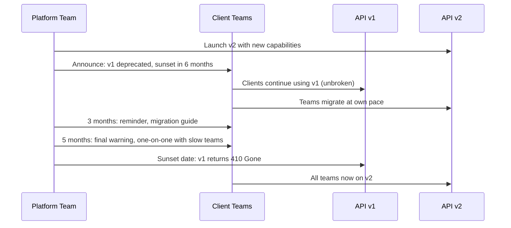

#### Service Level Agreements Between Teams

An **SLA** (Service Level Agreement) is a formal commitment from a service provider to its consumers. It specifies:

- **Availability:** The service will be up X% of the time (e.g., 99.9%)
- **Latency:** Requests will complete within Y milliseconds at the Pth percentile (e.g., p99 < 200ms)
- **Throughput:** The service will handle up to Z requests per second per consumer
- **Error rate:** The service will return errors at most W% of the time
- **Consequences:** What happens if the SLA is violated (incident review, credits, engineering time)

**Why SLAs exist:** Without a formal SLA, teams make different assumptions. Team A assumes the notification service is available 99.9% of the time. Team B assumes it's available 99.99%. Team C has no idea. When the service is down for 10 minutes, Team A is fine (within budget), Team B is furious (violated their assumption), and Team C files a ticket saying "it's broken."

**A sample SLA document:**

```
Notification Service SLA
Owner: Platform Team
Version: 1.2
Last updated: 2025-11-01

Availability
- Monthly uptime: 99.9% (allows ~44 minutes/month downtime)
- Measurement: percentage of minutes with successful health check
- Excludes: planned maintenance windows (announced 48 hours in advance)

Latency
- p50: < 50ms
- p95: < 200ms
- p99: < 500ms
- Measurement: request-response time at service boundary

Throughput per client
- Default: 100 requests/second
- Can be increased by request (SRE approval required)
- Rate limit exceeded: HTTP 429 (not counted as SLA violation)

Error rate
- < 0.1% HTTP 5xx errors during normal operation

Support
- P1 (service down): respond within 15 minutes
- P2 (degraded): respond within 2 hours
- Feature requests: triaged within 1 week

Review cadence: Quarterly SLA review meeting
```

**The difference between SLO and SLA:** An SLO (Service Level Objective) is an internal goal. An SLA is an external commitment with consequences. Platform teams set SLOs for themselves; SLAs are what they commit to clients. Your SLO should be tighter than your SLA so you catch problems before violating your commitment.

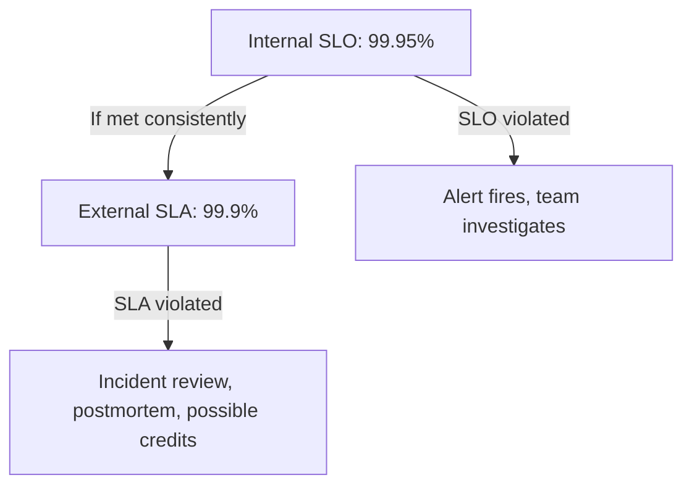

---

### Concept 4: Platform Thinking vs Point Solutions

#### What Each Term Means

A **point solution** solves one team's specific problem. Team B needs rate limiting. Team B builds a rate limiter. It is tuned for Team B's use case. Team B owns it.

A **platform** is a shared capability that multiple teams can use independently. It provides a foundation that others build on. The platform team owns the platform. Consumer teams use it to build their own features.

A **library** is code that teams include in their own service. The library team publishes it. Consumer teams run it in their own process. There is no separate service, no separate deployment.

The boundaries are:
- Library: code you include, you run it
- Platform service: code they run, you call it via API
- Platform framework: code they publish, you run it as part of your service

#### When to Build a Platform

**The Rule of Three:** When three or more teams have independently built the same thing, it is time for a platform.

Why three? One team building something is just a feature. Two teams building the same thing might be coincidence. Three teams building the same thing proves there is a real shared need — and paying the cost to build a shared platform is now justified.

**Other signals that say "build a platform now":**

| Signal | Threshold | What It Means |
|---|---|---|
| Number of teams solving same problem | 3+ | Proven shared need |
| Consistency problems | Security/compliance violations | Each team's custom solution has different quality |
| Onboarding time | >2 weeks for new services | Teams waste time reinventing the wheel |
| Incident rate from custom solutions | >2 incidents/quarter from duplication | The duplicated code is causing production problems |
| Total engineering time on duplicated work | >20% of org-wide engineering time | Economically wasteful |

#### Platform Team Anti-Patterns

**Anti-pattern 1: Building features nobody asked for.** The platform team spends quarters building elaborate features based on what they think clients need. When they ship, clients do not use it. The platform team becomes disconnected from real pain.

*Fix: Customer development. Talk to clients weekly. Build what they ask for, not what you imagine they need.*

**Anti-pattern 2: Too abstract to use.** The platform team builds a highly general, highly configurable system. It can do everything. But it requires deep expertise to use. Every client needs extensive hand-holding. Self-service is impossible.

*Fix: Golden path first. Build the opinionated, 80%-use-case path that works out of the box. Add flexibility later.*

**Anti-pattern 3: Too narrow to be useful.** The platform team builds something so specific that only one team's exact use case works. Other teams would need to "fork" the platform to use it. This defeats the purpose.

*Fix: Use case discovery before design. Talk to the three teams that will use the platform. Find the common core.*

**Anti-pattern 4: Mandate without value.** Leadership mandates all teams use the platform. Teams are forced to adopt something that does not work for their use case. They build shadow workarounds that technically comply with the mandate but defeat its purpose.

*Fix: Adoption through value, not mandate. If teams are not adopting voluntarily, the platform is not solving the right problem.*

**Anti-pattern 5: No escape hatch.** The platform enforces one way of doing things. Teams with unusual needs are stuck. They cannot customize. They either force their use case into an ill-fitting box or build a shadow platform.

*Fix: Golden path plus escape hatch. The default works for 80% of cases. For the other 20%, provide documented override mechanisms.*

#### The Golden Path — Making the Right Thing Easy

The golden path is the opinionated, well-paved, well-lit path through your platform. It is the path where:

- Documentation is excellent
- Examples are comprehensive
- The happy path requires minimal configuration
- Sensible defaults cover most cases
- Getting started takes minutes, not days

**Why it matters:** If the right thing (using the platform) is harder than the wrong thing (building your own), teams will always choose the wrong thing. The golden path makes the right thing easy enough that teams choose it willingly.

**Example — Spotify's Backstage:** Spotify built Backstage, an internal developer portal. The golden path for creating a new service is: use the Backstage service template. Run one command. Get a new service with CI/CD, observability, documentation, and dependency tracking already configured. The setup time dropped from days to minutes. Adoption was nearly 100% within a year because the alternative was slower.

**Example — Google's Borg:** Google's cluster management system has a golden path: define your job in a Borg configuration file, submit it, Borg handles placement, scheduling, restarts, and health checks. Teams do not need to understand cluster management. They just describe what they want.

#### Real Examples of Internal Platforms

**Google's Borg:** Cluster scheduling. Teams declare "I need 100 CPUs and 200GB of RAM running this container." Borg figures out where in the cluster to run it, monitors health, and restarts failures. Teams do not manage machines.

**Google's Stubby (now gRPC):** Internal RPC framework. Handles serialization, load balancing, authentication, retry logic, circuit breaking. Teams write their service logic; Stubby handles cross-cutting concerns.

**Google's Bigtable (internally):** Distributed key-value storage. Teams store their data in Bigtable without building their own distributed storage system. The Bigtable team handles reliability, replication, and performance.

**Spotify's Backstage:** Developer portal. Tracks all services, their owners, their documentation, their CI/CD status, their dependencies. A new engineer can find any service, see who owns it, and read its documentation in one place.

**Uber's infrastructure platforms:** Uber built platforms for: distributed tracing (Jaeger, originally internal), rate limiting (RATELIMITER), circuit breaking, service discovery, and configuration management. These freed product teams to focus on rides and eats instead of infrastructure.

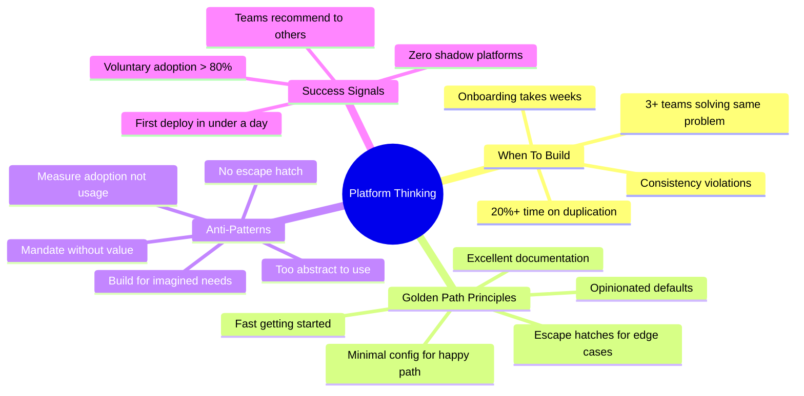

---

### Concept 5: Service Mesh, API Gateways, and Cross-Team Infrastructure

#### What a Service Mesh Does

A **service mesh** is an infrastructure layer that handles service-to-service communication. It sits between services (typically as a sidecar proxy alongside each service) and handles:

- **Service discovery:** How does Service A find Service B? The mesh maintains a registry.
- **Load balancing:** When there are multiple instances of Service B, which one does Service A call?
- **Circuit breaking:** If Service B is slow or down, should Service A keep hammering it or give up?
- **Retries:** If a request to Service B fails transiently, should the mesh retry automatically?
- **Observability:** The mesh can trace every request, measure every latency, count every error — without any code changes in the services themselves.
- **mTLS (mutual TLS):** The mesh can encrypt all service-to-service traffic and verify identity, without application code handling certificates.

**The key insight: the mesh solves cross-cutting concerns once, instead of in every service.**

Without a service mesh: every service team must implement service discovery, load balancing, circuit breaking, retries, and observability. Each team does it slightly differently. Some do it wrong. Some skip it when under deadline pressure.

With a service mesh: the platform team implements these once in the mesh. Every service gets them automatically, correctly, consistently.

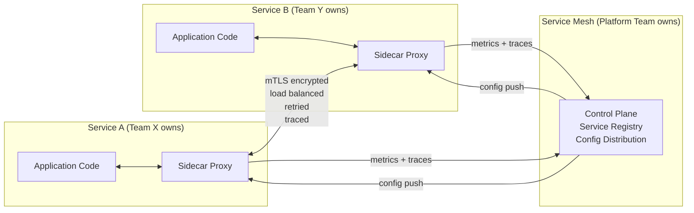

**Popular service meshes:** Istio (Google-originated), Linkerd, Envoy, Consul Connect.

**When to use a service mesh:** When you have 20+ services across multiple teams and you are spending significant engineering time on cross-cutting concerns. The setup cost is high. The payoff is consistency and operational simplicity at scale.

**When NOT to use a service mesh:** For small systems, the overhead is not worth it. Five services across two teams can share a library instead.

#### What an API Gateway Does

An **API gateway** sits at the edge of your system. It is the entry point for all external traffic (from clients, mobile apps, third parties). It handles:

- **Authentication:** "Is this request from a legitimate user?" The gateway checks tokens, verifies signatures, and rejects unauthenticated requests before they reach any service.
- **Rate limiting:** "Is this user making too many requests?" The gateway enforces limits per user, per IP, per API key.
- **Routing:** "Which backend service should handle this request?" The gateway maps `/api/orders/123` to the Order Service, `/api/users/456` to the User Service.
- **Protocol translation:** The gateway can accept REST and translate to gRPC internally.
- **Response caching:** The gateway can cache read-heavy responses.
- **SSL termination:** The gateway handles HTTPS, internal services can use HTTP.

**The key insight: the API gateway solves external-to-internal concerns once.**

Without an API gateway: every service must handle authentication, rate limiting, and SSL. Some will do it wrong. Security vulnerabilities will appear. Inconsistency will confuse clients.

With an API gateway: one place handles all of this. Backend services trust that the gateway has already authenticated requests. They focus on business logic.

**The difference between API gateway and service mesh:**

| | API Gateway | Service Mesh |
|---|---|---|
| Where it lives | Edge (external traffic in) | Inside cluster (service-to-service) |
| Who uses it | External clients, internal API callers | Internal services calling each other |
| Key concerns | Auth, rate limiting, routing | Discovery, circuit breaking, mTLS |
| Who owns it | Platform/API team | Platform/infra team |

**L5 vs L6 on infrastructure choices:**

*L5 says:* "We need rate limiting. I'll add it to each service."

*L6 says:* "Rate limiting is a cross-cutting concern. If we add it to each service, we get 30 different implementations with 30 different bugs. We should implement it once at the API gateway for external traffic, and in the service mesh for internal traffic. The platform team owns both. Individual services inherit the capability automatically."

---

### Concept 6: Event-Driven Architecture for Team Decoupling

#### The Problem with Synchronous Calls

When Service A calls Service B synchronously (an HTTP request, a gRPC call), Service A and Service B are coupled at runtime. This creates organizational coupling:

- If Service B is slow, Service A is slow
- If Service B is down, Service A fails (or must build retry/fallback logic)
- Service A must know Service B exists, know its API, know its URL
- Service B must be deployed before Service A can function
- If Service B's API changes, Service A must be updated

**The organizational consequence:** The team that owns Service A depends on the team that owns Service B. They must coordinate deployments, coordinate API changes, coordinate incidents. Team A cannot fully control their own destiny.

#### How Events Decouple Teams

With events, the coupling is reversed. Service A publishes an event to a shared bus: "Order was placed." Service A does not know who cares. Service B subscribes to order-placed events. Service B does not know who published them.

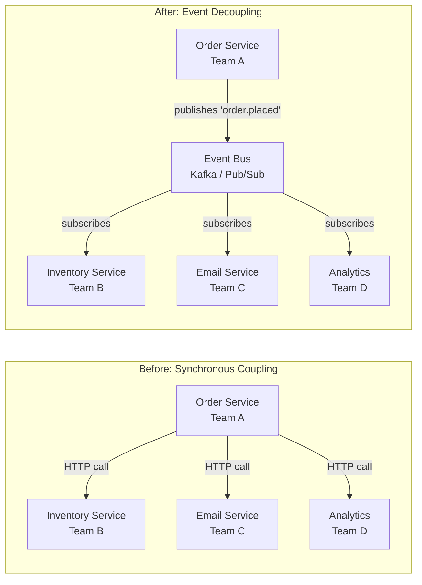

**What this changes organizationally:**
- Team A does not know or care about Teams B, C, and D
- Teams B, C, and D can join or leave without telling Team A
- Teams B, C, and D deploy independently — no coordination with Team A
- A new team (Team E) can subscribe without any change to Team A's code
- Team A's on-call is not responsible for inventory, email, or analytics failures

#### Event Schema Ownership

This is a subtle but important concept. When you use events, you need to answer: **who owns the event contract?**

The event schema is the structure of the event message — what fields it contains, what types they are, what they mean. This schema is as important as an API contract. Changing it can break all subscribers.

**Rule: The publisher owns the event schema.** Team A (Order Service) owns the `order.placed` event. They define what it contains. They version it. They deprecate old versions.

**Why the publisher owns it:** The publisher knows what data they have. Subscribers asking for more data than the publisher has creates unreasonable dependencies. The publisher should publish what they know, and subscribers should work with that.

**What subscribers can do:** Subscribers can request new fields be added to events. They cannot demand the publisher change existing fields (that would be a breaking change). If a subscriber needs data the event does not have, they either request the publisher add it, or they make a separate API call to get it.

#### Versioning Events — Harder Than APIs

Versioning events is harder than versioning APIs for one important reason: **consumer lag**.

When you change an API, you deploy the new version and clients immediately use it (or fail if they have not updated). The feedback is immediate.

When you change an event schema, events already published to the queue might sit there for hours or days before being consumed. A subscriber might be processing last Tuesday's events and encounter a new schema they do not understand.

**Practical rules for event versioning:**

1. **Never remove fields.** Subscribers might be using them. Leave them in, just stop writing to them.
2. **New fields must be optional.** Old events in the queue will not have them. Subscribers must handle absence gracefully.
3. **Use explicit version in event metadata.** Every event should carry a `schema_version` field so consumers know which version they are processing.
4. **Maintain consumers for multiple versions.** When you release schema v2, keep your consumer able to process v1 events still in the queue.
5. **Dead letter queue for unprocessable events.** Events that fail processing go to a DLQ for human review. This catches schema mismatches before they cause silent data corruption.

#### Worked Example: Order Placed Event

Order service publishes `order.placed`. Four teams subscribe independently:

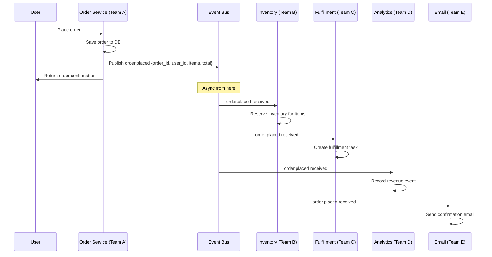

**What Team A (Order Service) knows:** That it published an event. Nothing else.
**What Team B knows:** That orders get placed, and it should reserve inventory.
**What happens if Team B is slow:** Orders still go through. Inventory reservation is slightly delayed. Orders and reservations eventually converge.
**What happens if Team E (Email) is down:** Orders still go through. Emails queue up and are delivered when Email service recovers.
**What happens if a new team joins:** They subscribe to the event bus. Team A does not change anything.

#### When NOT to Use Events

Events are not always the answer. Use synchronous calls when:

- **You need an immediate response.** "Can I place this order?" requires knowing immediately whether items are in stock. You cannot wait for an async event response.
- **You need strong consistency.** If two things must happen atomically (deduct inventory AND record order), events with eventual consistency are wrong.
- **The consumer must confirm before you proceed.** Payment processing must succeed before you confirm an order. This is synchronous.
- **Debugging is critical.** Async event flows are harder to trace and debug. If your team is small and debugging speed matters more than decoupling, synchronous is simpler.

**The rule:** Use events to decouple *side effects* (things that happen after the main action). Use synchronous calls for the main action itself.

For orders: placing the order (synchronous) → triggers fulfillment, email, analytics (events). The events are side effects. The order placement itself needs immediate confirmation.

---

### Concept 7: Data Ownership Across Teams

#### The Single Source of Truth Principle

Every piece of data must have exactly one owner — one team that is the authoritative source. This is the **single source of truth** (SSOT) principle.

Why does this matter? Because when two teams both write to the same data, you get race conditions, conflicting updates, and data corruption with no clear owner to fix it.

**Example:** User profile data. The User Platform Team is the single source of truth. They own the user's name, email, subscription status. Commerce team does not write to user profiles. Social team does not write to user profiles. They read from the User Platform Team's API.

The User Platform Team's database is the authoritative source. Everyone else is a consumer.

#### Why Shared Databases Across Teams Are Dangerous

Imagine two teams sharing a database. This seems efficient. One database, two teams' data. No API needed.

The problems:

**Schema coupling:** Team A wants to add a column to a table. Team B's queries now return unexpected data. Team A wants to rename a column. Team B's queries break. Every schema change is a cross-team coordination event.

**Deployment coupling:** You cannot deploy Team A's service independently if their schema change affects Team B's running service. You must coordinate deployments.

**Operational coupling:** Team B's slow query degrades Team A's performance. Team A cannot scale their database independently if Team B is also using it.

**Trust boundary violation:** Team B can read or write data they should not have access to. There is no API-level access control.

**The fix:** Each team owns their own database. Cross-team data access happens via APIs, not direct database queries.

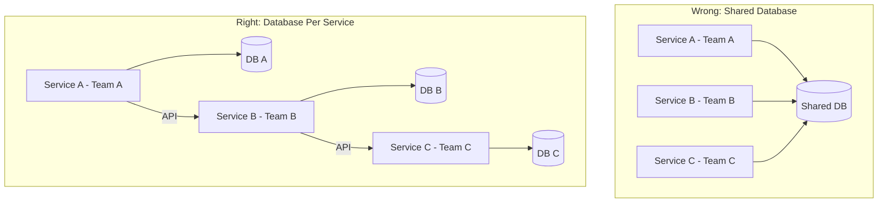

#### The Database-Per-Service Pattern

Each service owns its own database. No other service has direct access. Cross-service data access goes through APIs.

**Trade-offs:**

Benefits:
- Teams can evolve their schema independently
- Services can choose the right database type for their use case (relational, document, time-series)
- Failures are isolated
- Teams can scale their database independently
- Trust boundaries are enforced by the API

Costs:
- You cannot do simple SQL joins across service boundaries
- Distributed transactions are hard (two-phase commit or saga pattern)
- Eventual consistency means different services may temporarily have different views of the same data
- More operational complexity — many databases to manage

**When to accept these costs:** When you have multiple teams and need team independence. The coordination costs of a shared database exceed the operational complexity of separate databases once you have 3+ teams.

#### Cross-Service Queries — How to Join Data Without Sharing a DB

This is the practical question everyone asks: "If each service has its own database, how do I query across services?"

**Option 1: API composition.** Service A calls Service B and Service C via their APIs, then combines the results in the application layer. Simple. Works for small data volumes. Too slow for large aggregations.

**Option 2: Event-driven denormalization.** When Service B's data changes, it publishes an event. Service A consumes the event and stores the relevant data in its own database. Service A can now query its local copy. This is eventual consistency — Service A's copy may be slightly stale. Suitable when queries need high performance and slight staleness is acceptable.

**Option 3: Read models (CQRS).** The write path uses each service's own database. A separate read path builds a denormalized view by consuming events from multiple services. A query service sits in front of this read model and answers cross-service queries. This is the most powerful pattern and the most complex.

#### CQRS and Read Models

**CQRS** stands for **Command Query Responsibility Segregation**. The name is fancy. The idea is simple: separate the path for writing data from the path for reading data.

**Write path (Commands):** Each service has its own database. Writes go to the service that owns that data. Consistency is strong on the write path.

**Read path (Queries):** A separate read model aggregates data from multiple services. It is built by consuming events. It is denormalized (data is stored in the shape that queries need, not normalized for storage efficiency). Consistency is eventual — the read model may be seconds behind the write path.

**When to use CQRS:** When you have complex read requirements (cross-service aggregations, full-text search, reporting) but you do not want to compromise write path independence.

**Example:**
- User profile data: User Platform Team's database (write path)
- Inventory data: Inventory Team's database (write path)
- "Show me the order history with user names and item availability" query: Read model that subscribes to order events, user events, and inventory events, builds a denormalized table optimized for this query

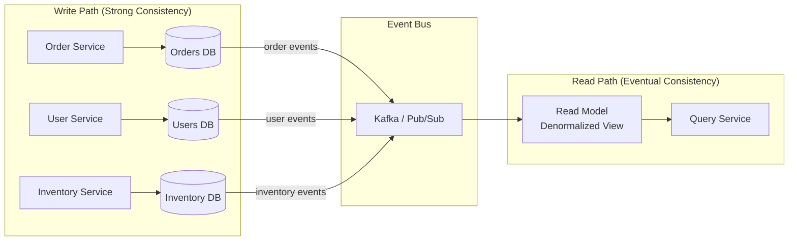

#### Data Contracts

A **data contract** extends the API contract concept to cover not just API endpoints but also:

- **Event schemas:** What fields does an event contain? What do they mean?
- **Read model shapes:** What does the denormalized view look like? Who owns maintaining it?
- **Database migration coordination:** When a team changes their schema, which downstream consumers of their events might be affected?

Data contracts are often neglected because they are less visible than API contracts. But they are equally important. A silently changed event schema can corrupt downstream read models without any obvious error.

---

### Concept 8: Dependency Management

#### Upstream vs Downstream Dependencies

**Upstream dependency:** A service you depend on. You call them. If they fail, you may fail.
**Downstream dependency:** A service that depends on you. They call you. If you fail, they may fail.

*Analogy: upstream is the river feeding your town's water supply. You depend on it. Downstream is the town below yours that uses your runoff.*

**Why this vocabulary matters:** In incidents, you need to quickly determine:
- "We're seeing failures — is it us or an upstream?"
- "We made a change — which downstreams might be affected?"

The language upstream/downstream lets teams communicate quickly without ambiguity.

#### Dependency Inversion

**Dependency inversion** is a software design principle: depend on abstractions, not on concrete implementations.

In organizational terms: depend on a stable interface (an API contract), not on a specific implementation team.

**Why it matters:** If your service depends on "the gRPC endpoint at grpc://user-service:8080", you are coupled to that specific service's implementation. When the user service team refactors or moves their endpoint, you break.

If your service depends on "any service that implements the UserProfile API contract", you can swap implementations, run blue-green deployments, or even replace the team that owns it, without changing your service.

**Practical application:** Use API schemas (gRPC's protobuf, OpenAPI specs) as the contract. Depend on the schema, not the service.

#### Circular Dependencies — Why They Are Dangerous

A **circular dependency** is when Service A depends on Service B and Service B depends on Service A (directly, or through a chain).

Why they are dangerous:
1. **You cannot deploy independently.** Deploying Service A might require Service B to be updated first. But updating Service B requires Service A. You are stuck.
2. **Failures cascade both ways.** Service A's failure cascades to Service B, which cascades back to Service A, creating an amplifying feedback loop.
3. **They indicate a design problem.** If A needs B and B needs A, some responsibility is in the wrong place. The data or logic that both need should probably live in a third service C, which both A and B depend on without depending on each other.

**How to detect circular dependencies:**
- Draw your dependency graph (edges point from "depends on" to "depended on")
- Look for cycles in the graph
- In large systems, use automated tooling — service catalog tools can detect cycles by analyzing service-to-service call patterns from distributed traces

**How to break circular dependencies:**
1. **Extract shared logic.** If A calls B to get some data that B itself got from A, that data probably belongs in a third service C that both A and B call.
2. **Introduce events.** If A synchronously calls B, and B synchronously calls A, convert one to events. A publishes an event; B subscribes. Now B does not call A — it just reacts to A's events.
3. **Merge A and B.** Sometimes circular dependencies indicate A and B are really one service that was incorrectly split.

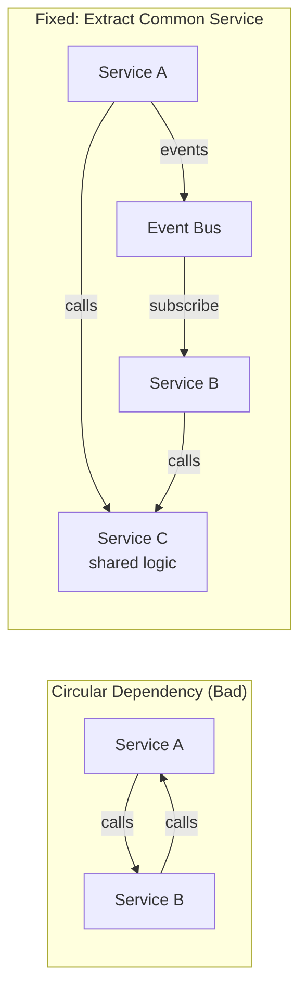

#### The Dependency Graph — Drawing It and Understanding Blast Radius

A **dependency graph** is a directed graph where nodes are services and edges point from "consumer" to "dependency." Service A depends on Service B means there is an edge from A pointing to B.

**Why draw it:** The dependency graph shows you blast radius immediately. When Service B fails, which services fail with it? Follow all edges pointing to B — those are the immediate downstream failures. Then follow edges pointing to those services, and so on.

**In interviews, always draw the dependency graph** for any system with multiple services. Then annotate it with: "Service X is at the critical path. If it fails, everything in this subgraph fails."

**Staff insight:** Services deeper in the dependency graph (more things depend on them) need higher reliability standards. Auth service, user profile service, rate limiter — these are deep. A 30-minute outage of the auth service takes down every other service. Design accordingly.

#### Graceful Degradation

**Graceful degradation** means: when a dependency is slow or down, your service continues to function, perhaps with reduced capability, rather than failing completely.

**Why it exists:** Dependencies fail. Networks have blips. Services have incidents. A service that stops working every time a dependency has a hiccup is fragile. A service that degrades gracefully survives partial failures.

**The degradation spectrum:**

```
Healthy → Degraded → Impaired → Failing → Down
  100%      80%        50%       20%        0%
```

At each level, define what your service does:

- **100% healthy:** Normal operation
- **80% degraded:** Maybe one feature stops working. Use cached data. Serve slightly stale results.
- **50% impaired:** Non-critical features disabled. Critical path still works.
- **20% failing:** Only core function works. Everything else fails gracefully with informative errors.
- **0% down:** Static fallback page. Queue incoming requests for when service recovers.

**Example — User Profile Service degradation:**
- User profile service returns complete data? Show full profile.
- User profile service is slow? Show cached profile (slightly stale).
- User profile service is down? Show placeholder profile with name and avatar only (from local cache).
- Local cache is empty? Show "Profile unavailable, please refresh" but let the user continue their main task.

The user is degraded, not blocked.

#### Circuit Breakers and Bulkheads

A **circuit breaker** is a software pattern (named after the electrical component) that protects your service from a failing dependency.

How it works:
1. **Closed state (normal):** Calls pass through normally. The breaker counts failures.
2. **Open state (dependency failing):** When the failure rate exceeds a threshold, the breaker "opens" — it stops sending requests to the dependency and immediately returns a fallback response. The dependency gets time to recover without being hammered.
3. **Half-open state (testing recovery):** After a timeout, the breaker sends a small number of test requests. If they succeed, it closes (back to normal). If they fail, it opens again.

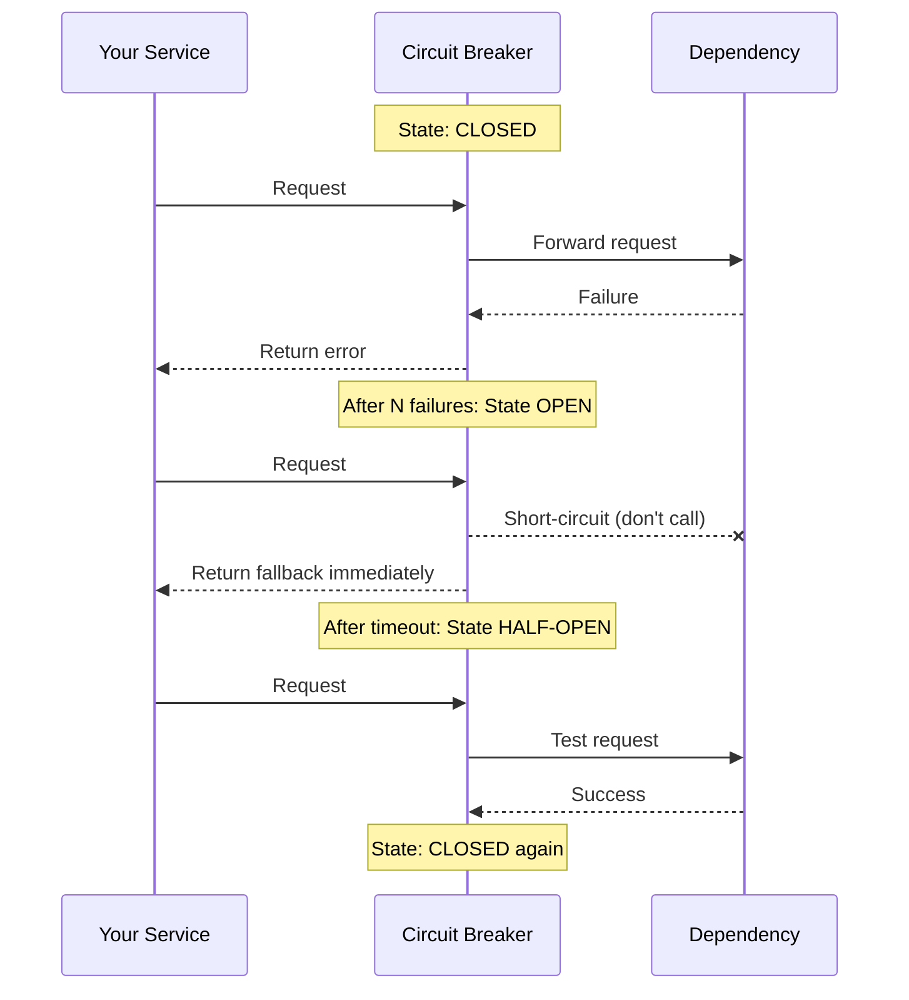

**Why circuit breakers exist from first principles:** Without a circuit breaker, a slow dependency causes your thread pool to fill up with waiting requests. Your service becomes slow. Its callers become slow. The slowness cascades up the dependency chain. What started as one service's problem becomes every service's problem.

Circuit breakers prevent this cascade. They convert dependency failures into fast local failures, protecting your thread pool and isolating the blast radius.

**Bulkheads** are named after the watertight compartments in a ship. If one compartment floods, the others stay dry. In software, bulkheads isolate resources for different functions so that one failing function cannot starve others of resources.

**Example:** Your service calls both the Payment API and the Inventory API. Without bulkheads: slow Payment API exhausts your thread pool, and Inventory API calls also queue up even though Inventory is fast. With bulkheads: Payment API calls use threads from one pool (say, 10 threads). Inventory API calls use a separate pool (10 threads). Payment slowness cannot affect Inventory calls.

---

### Concept 9: Cross-Team Incident Response

#### Who Owns an Incident That Spans Three Teams?

This question is more important than it appears. In a single-team incident, the answer is obvious — the team owns it. In a multi-team incident, it is not obvious. And the confusion about ownership is often what makes multi-team incidents last 3x longer than they should.

**The answer:** One person must be the **Incident Commander (IC)**. This person does not need to understand every service. They are not the person who fixes things. They are the person who coordinates the response.

The IC:
- Declares the incident and opens the incident channel
- Identifies which teams are affected
- Assigns roles (tech lead, communications lead)
- Drives toward resolution — asks "what's blocking us?" every 15 minutes
- Decides when to escalate to management
- Declares the incident resolved only when every affected team confirms

The IC is a **Staff Engineer's role** in a cross-team incident. This is not management. It is technical leadership that happens to require organizational coordination.

#### The Incident Commander Role at Staff Level

At Staff level, you will be asked to IC incidents that you did not cause and may not understand deeply. The skill is:

1. **Establish the incident channel immediately.** Channel name: `#incident-YYYY-MM-DD-brief-description`. Pin the incident doc.

2. **Post the initial status update within 5 minutes:**
   ```
   Summary: Auth service experiencing elevated errors (15% 5xx rate)
   User impact: Login failures for approximately 10% of users
   Teams affected (preliminary): Auth, User Profile, any service requiring auth
   Current status: Investigating root cause
   IC: [your name]
   Next update: 15 minutes
   ```

3. **Know your scope.** "What services are affected? What teams own them? What is each team's on-call contact?" This should be answerable in 5 minutes from a service catalog.

4. **Separate the roles.** You coordinate. The engineers fix. Do not try to do both.

5. **Regulate communication cadence.** Updates every 15 minutes in the incident channel. No debugging noise in the channel — create a separate `#incident-[name]-debug` thread for technical discussion.

6. **Declare resolution criteria.** "We are resolved when error rate is below 0.1% for 10 consecutive minutes, AND all affected team on-calls have confirmed their services are healthy."

#### Cross-Team Runbooks

A **runbook** is a document that describes how to handle a known operational situation. Write runbooks before the incident, not during.

For cross-team systems, the runbook must answer:

1. How do you know a cross-team incident has started? (Detection criteria)
2. Which teams must be notified? (Contact list with escalation path)
3. What information does each team need? (Service status page, which metrics to check)
4. What can each team do independently vs. what requires coordination?
5. What is the fallback if the owning team cannot respond?

**A good cross-team runbook for the auth service incident would have said:**

```
Auth Service High Error Rate Runbook

Detection:
- Auth service error rate > 5% for 5 minutes
- Auth service p99 latency > 1000ms for 5 minutes

Teams to notify:
- Auth Team on-call: [contact info]
- Every team with auth dependency: see service catalog /auth/dependents
- Leadership: only if estimated impact > 10,000 users or > 30 minutes

Immediate actions (any engineer can do):
1. Check auth service status dashboard: [link]
2. Check recent deployments: [link]
3. Post in #auth-team-oncall with: current error rate, which endpoints failing, since when

Actions requiring coordination:
- If traffic rollback needed: Auth team leads, all teams on standby
- If database issue: Auth team + Database SRE team

Recovery criteria:
- Error rate < 0.1% for 10 consecutive minutes
- Auth team on-call confirms service healthy
```

#### Blameless Post-Mortems

A **post-mortem** (or **blameless post-mortem**) is a structured review of an incident, focused on learning and system improvement, explicitly not focused on assigning blame.

**Why blameless culture matters for cross-team trust:** In multi-team incidents, it is tempting to blame. "Team B's code change caused the outage." "Team A's service was not resilient enough." When blame becomes normal, teams become defensive. They hide information to avoid blame. They do not report near-misses. Trust erodes. Cross-team collaboration suffers.

In a blameless post-mortem, the assumption is: **engineers are professional and trying their best.** If an engineer made a mistake, the system allowed that mistake to become an incident. Fix the system.

**The blameless post-mortem structure for cross-team incidents:**

1. **Timeline** (facts only, no editorializing): What happened, when, who saw it, what actions were taken.

2. **Impact**: How many users affected? How long? What services?

3. **Root causes** (use "5 Whys"): 
   - The service failed. Why? Because there was no circuit breaker.
   - Why no circuit breaker? Because when the service was built, it only had one downstream.
   - Why was it not added when more downstreams were added? Because there was no architectural review checklist.
   - Fix: add circuit breakers to the checklist.

4. **What went well**: Catch the positives — what monitoring caught this quickly? What graceful degradation limited blast radius?

5. **Action items** (specific, owned, time-bounded):
   - "Add circuit breaker to auth service client library — Auth Team — 2 weeks"
   - "Add auth service to cross-team incident runbook — Platform Team — 1 week"
   - "Add dependency graph to service catalog — Infra Team — 3 weeks"

6. **All affected teams participate.** Not just the team that caused the incident. Each team's perspective surfaces different learnings.

**What a bad post-mortem looks like:**
- "The incident was caused by Engineer X's code change." (Blame, not learning)
- Only the owning team participates. (Missing downstream learnings)
- Action items: "Be more careful." (Not specific, not actionable)
- Filed away and never referenced again. (No follow-through)

**What a good post-mortem produces:** Concrete system changes that make the same class of incident impossible or significantly less likely — across all teams.

---

### Concept 10: Designing for Team Autonomy

#### Why Autonomy Is a Design Goal

Team autonomy means a team can ship features, make decisions, and respond to incidents without needing approval or coordination from other teams.

Autonomy is not just an org chart preference. It is a system design goal. If your system design requires Team A to coordinate with Teams B, C, and D before every deployment, you have designed away autonomy — regardless of what the org chart says.

A Staff Engineer asks: "How does my design reduce or increase the coordination cost for teams?"

**Why autonomy matters for velocity:** Coordination has exponential cost. If every change requires a meeting between 4 teams, and each team has 5 engineers, that is 20 people spending time coordinating instead of building. The meeting cost alone is staggering. The actual coordination overhead (waiting for others' schedules, aligning on decisions, resolving disagreements) is worse.

Autonomous teams move fast. Coordinating teams move slowly.

#### How to Reduce Coordination Cost in System Design

**1. Clear ownership boundaries.** Every service, every database table, every API has one owner. Coordination happens at the API boundary, not inside the service.

**2. Stable APIs.** If the API is stable, teams can build against it without coordinating on every change. The API absorbs the coordination cost.

**3. Event-driven side effects.** Side effects (email, analytics, inventory reservation) happen through events. The core service does not coordinate with every downstream consumer.

**4. Per-team configuration.** If a team can configure their own rate limits, their own feature flags, their own alert thresholds without asking the platform team — that is autonomy. Self-service configuration is autonomy.

**5. Independent deployment.** Teams can deploy their services without other teams needing to coordinate. The API contract is what makes this possible — as long as you maintain the contract, others are not affected.

**6. Per-team resources.** Separate databases, separate queues, separate caches. If teams share resources, they are coupled operationally.

#### The Two-Pizza Team Principle Applied to System Design

Jeff Bezos's two-pizza rule: a team should be small enough that two pizzas feed it (5-7 people).

**Applied to system design:** Every service should be owned by a two-pizza team. If a service is too large for a two-pizza team to own, understand, operate, and evolve — it is too large. Split it.

This is not just about team size. It is a proxy for: "Can this team hold the whole service in their heads? Can they deploy it independently? Can they handle on-call without overwhelming themselves?"

A team that owns three small, well-scoped services is healthier than a team that owns one giant, sprawling service.

#### When Centralization Is the Right Answer

Decentralization is not always right. Centralization makes sense when:

**Security:** Security controls must be consistent. If each team implements their own authentication, some will do it wrong. Centralized authentication means one team gets it right once, and everyone inherits the correct implementation.

**Compliance:** GDPR, HIPAA, SOC2 require consistent behavior across all services. Centralized data handling (audit logs, access controls, retention policies) ensures compliance is not accidentally missed by one team.

**Shared infrastructure:** Networking, DNS, load balancers, service mesh — these are cross-cutting infrastructure that needs consistent operation. One platform team manages this better than every product team managing their own.

**Rare expertise:** If a capability requires deep expertise that is rare in your organization (cryptography, distributed consensus, ML inference optimization), one team with that expertise serving others is more efficient than every team learning it.

#### When Decentralization Is the Right Answer

Decentralization is right when:

**Feature velocity:** When teams need to ship features quickly with different requirements, decentralization lets them move independently. Do not block Team A's marketing campaign because Team B has an unrelated production incident.

**Independent deployment:** When teams have different deployment cadences and risk tolerances, they should deploy independently. Coupling deployments kills the teams that move fast.

**Experimentation:** When teams are exploring different approaches to the same problem, let them. The best solution will emerge. Then potentially centralize the winner.

**Different SLO requirements:** When different use cases have different reliability needs, separate them. A batch job and a user-facing API should not be in the same service with the same SLO.

```mermaid
quadrantChart
    title Centralize vs Decentralize Decision
    x-axis Low Consistency Requirement --> High Consistency Requirement
    y-axis Low Velocity Requirement --> High Velocity Requirement
    quadrant-1 Toughest: Centralized Platform with Rapid Self-Service
    quadrant-2 Decentralized Teams with Common Standards
    quadrant-3 Small Org: Share Everything
    quadrant-4 Centralized Control
    Authentication: [0.9, 0.5]
    Feature Flags: [0.4, 0.8]
    Rate Limiting: [0.6, 0.5]
    Compliance Logging: [0.95, 0.3]
    A/B Test Config: [0.2, 0.9]
    ML Model Serving: [0.7, 0.7]
```

---

## Section 4: Mental Models

### Mental Model 1: The Cell Tower vs The Water Tower

**Technical scale** is like a cell tower. To handle more calls, you add antennas, upgrade equipment, add towers nearby. The engineering is hardware and signals. It scales with technology.

**Organizational scale** is like a water tower shared by a town. Everyone depends on it. If the town adds 1000 new houses (teams), the water tower needs more capacity. But more importantly: who decides when to flush the system? Who pays for maintenance? Who is on call at 3 AM when the valve breaks? Who has the key?

Technical scale is the water capacity. Organizational scale is the governance system that lets the town share the water without conflict.

### Mental Model 2: The Highway vs the Bike Path

Imagine two cities connected by a road. When the road is a bike path, only bikes use it. When bikes become trucks, the path is insufficient — but more importantly, bikes and trucks conflict.

A service designed for one team's use is the bike path. When 20 teams start using it, the path must become a highway: lanes, traffic rules, on-ramps and off-ramps, maintenance crews, emergency procedures.

The governance of the highway is organizational scale. You do not just add lanes (technical scale). You add traffic laws, lane markings, exit signs (API contracts, SLAs, runbooks), and a department of transportation (platform team with ownership).

### Mental Model 3: The Building Code

Building code is what allows an architect to design a building that other architects, contractors, and residents interact with safely.

API contracts are building codes for services. They tell you: "This wall is load-bearing (this API endpoint is critical). This is the safe load limit (rate limit). This is how to connect the plumbing to our system (API schema)."

Just as you would not buy a house that did not meet building code, you should not depend on a service without an API contract. And just as a homeowner can modify their interior without violating building code (as long as they maintain the interfaces with the building), a team can refactor their service's internals without violating the API contract.

### Mental Model 4: The Franchise Model

A franchise like McDonald's solved an organizational scale problem. The franchisor (McDonald's) provides the brand, the recipes, the processes, the standards. The franchisee (the local owner) operates the store, hires staff, manages day-to-day operations. The franchisee has autonomy within the standards.

Platform engineering works the same way. The platform team is the franchisor: they provide the CI/CD pipeline, the observability stack, the authentication service. Product teams are franchisees: they build their products using the platform's capabilities. They have autonomy within the platform's standards.

The key insight: the franchise model scales because the franchisee does not need to invent the hamburger. They use the platform. But they can decorate their store, run local promotions, and hire their own staff.

### Mental Model 5: The Power Grid

The power grid provides electricity to every building without each building needing to generate its own power. The grid abstracts away the complexity: you plug in, you get electricity. You do not care how it is generated.

A platform service is a power grid for a specific capability. You call the API, you get authentication. You do not care how it is implemented. The platform team is the power company — they ensure reliability, capacity, and safety. You are the building — you consume without managing the generation.

But: if the power grid goes down, every building goes dark. This is the blast radius problem. Staff Engineers design platforms like a well-designed power grid: redundancy, circuit breakers at the distribution level, multiple generation sources, graceful degradation under load.

---

## Section 5: Real-World Examples

### Google: Borg and the Platform That Became AWS

**Background:** In the early 2000s, Google needed to run thousands of services across millions of machines. The naive approach: each team manages their own machines. The result of the naive approach: duplication, inconsistency, operational chaos.

**What they built:** Borg — a cluster management system that abstracts away machines. Teams describe what they need (CPU, memory, constraints), and Borg figures out where to run it. Teams do not manage servers.

**The organizational consequence:** Borg created a clean ownership boundary. Infrastructure team owns Borg. Product teams run jobs on Borg. The API is the Borg job spec (a protobuf config). This API is stable and versioned. Product teams can deploy without talking to the infrastructure team.

**The scale:** Google runs millions of jobs on Borg. Hundreds of product teams use it. The infrastructure team is a small fraction of total engineering. This ratio is only possible because Borg is a true platform — self-service, stable API, good documentation.

**What Amazon did with this:** AWS (Amazon Web Services) is essentially: "what if we sold our internal platform to everyone?" EC2 is Borg but with billing. S3 is Amazon's internal object storage with an API. The organizational scale lessons from building internal platforms became the world's largest cloud.

**Numbers:** AWS powers over 1 million active customers. The platform team concept — small teams building infrastructure that enables many other teams — scales to this level only because of strong API contracts, self-service, and clear ownership.

### Amazon: Two-Pizza Teams and the API Mandate

**The Jeff Bezos API Mandate (2002):** All teams must expose data and functionality through APIs. All communication must happen through those APIs. No direct database reads from another team's database. No back-door access. The mandate was enforced: you follow it or you are fired.

**Why this worked:** The mandate created clean ownership boundaries. Every team became both a producer (they expose APIs) and a consumer (they call others' APIs). The organizational structure became the system structure (Conway's Law, intentionally applied).

**The result at scale:** Amazon today has thousands of services. Teams of 5-7 engineers own each service end-to-end. Teams can deploy independently because the API contract is what other teams depend on, not the internal implementation.

**The measurement:** Amazon deploys to production every 11.7 seconds on average (2014 data). This is only possible because teams can deploy independently without coordination. The API contract is what makes this possible.

### Netflix: Chaos Engineering and Resilience at Team Scale

**Background:** Netflix moved from a monolith (single data center, tightly coupled) to microservices (multiple data centers, loosely coupled) between 2008 and 2011. This was both a technical migration and an organizational one.

**The organizational design:** Netflix created "full-cycle engineering" — teams own their service from development through deployment through on-call. This forced teams to scope their services carefully. You cannot do full-cycle engineering on a service that is too large to understand.

**Chaos Engineering:** Netflix created the Chaos Monkey — a tool that randomly terminates instances in production. The purpose: if you are always working against random failures, you build resilient services as a habit. The organizational consequence: every team builds graceful degradation. No team can assume their dependencies are always available.

**The team autonomy result:** Netflix has 700+ engineers across hundreds of teams. Each team can deploy their service without coordinating with others. The service mesh (Zuul API gateway, Hystrix circuit breakers) handles cross-cutting concerns. Teams focus on product features, not infrastructure plumbing.

**Numbers:** Netflix serves 260+ million subscribers. Peak traffic exceeds 15% of global internet bandwidth. This is handled by independent teams with autonomous deployment capability — not by a central release coordination team.

### Uber: Platform Engineering at Hypergrowth Scale

**Background:** Uber grew from 50 engineers in 2013 to 3000+ engineers in 2016. This is 60x growth in 3 years. At this growth rate, organizational scaling is the existential challenge. Technical scaling is relatively easy — you add machines. Organizational scaling requires deliberate design.

**What they built:** Uber invested heavily in internal platforms:

- **Jaeger:** Distributed tracing (later open-sourced). Every service request gets traced across service boundaries. When something breaks, engineers can see the entire call chain, including which team's service is slow.

- **Ringpop:** Distributed coordination (later open-sourced). Services discover each other and coordinate without a central coordinator.

- **RATELIMITER:** Internal rate limiting service. Every service that needs rate limiting uses RATELIMITER instead of building their own. One implementation, consistent behavior.

- **uDeploy:** Deployment infrastructure. Every team deploys through the same system. Consistent process, consistent security, consistent observability.

**The organizational consequence:** These platforms let Uber grow from 50 to 3000 engineers without the engineering organization collapsing into coordination chaos. New engineers are productive in days because the golden paths are established.

**The Uber split:** When Uber split into ride-sharing, food delivery (Eats), and freight, the platform team's work paid off. Each business unit could operate somewhat independently because the shared platforms had clean API contracts. Eats did not need to rebuild authentication, rate limiting, or distributed tracing — they used the platforms.

**Numbers:** Uber's microservices count grew from dozens to over 2000 services in 5 years. This is only manageable because each service has one owner, the owners can deploy independently, and cross-cutting concerns are handled by platforms.

---

## Section 6: Design Trade-offs

### Trade-off 1: Centralized Platform vs Distributed Ownership

| | Centralized Platform | Distributed Ownership |
|---|---|---|
| **Consistency** | High — one implementation | Low — each team does it differently |
| **Feature velocity** | Low — bottleneck on platform team | High — each team moves independently |
| **Operational excellence** | High — platform team specializes | Variable — depends on each team |
| **Blast radius** | High — platform outage affects all | Low — each team's failure is isolated |
| **Coordination cost** | Medium — teams must follow platform's process | Low — teams are autonomous |
| **Time to market for new teams** | Fast — platform is ready to use | Slow — teams build their own |
| **Long-term cost** | Low — one implementation maintained | High — N implementations, N maintenance burdens |

**When to choose centralized:** Security, compliance, shared infrastructure, rare expertise, and when consistency is more valuable than velocity.

**When to choose distributed:** Feature velocity, independent deployment, experimentation, and when teams have genuinely different requirements.

**The Staff Engineer answer:** Neither extreme is correct. Design a centralized platform for cross-cutting concerns (auth, observability, rate limiting) and distributed ownership for product features (checkout, recommendations, content). The art is knowing where to draw the line.

### Trade-off 2: Strong vs Eventual Consistency

| | Strong Consistency | Eventual Consistency |
|---|---|---|
| **Team coupling** | High — all writers must coordinate | Low — each team writes independently |
| **Availability** | Lower — must wait for consensus | Higher — can write without consensus |
| **Latency** | Higher — must wait for all nodes to agree | Lower — local write, async replication |
| **Developer simplicity** | High — what you write is what you read | Low — you might read stale data |
| **Cross-team coordination** | High — schema changes require coordination | Lower — events are immutable |
| **Correctness guarantees** | High — no split-brain | Lower — possible duplicate processing |

**When to choose strong consistency:** Financial transactions, inventory management, authentication state — anything where reading stale data would cause incorrect behavior with real consequences.

**When to choose eventual consistency:** Analytics, recommendations, notifications, search indexes — anything where slight staleness is acceptable and availability matters more than perfect correctness.

### Trade-off 3: Synchronous vs Asynchronous Integration

| | Synchronous (HTTP/gRPC) | Asynchronous (Events) |
|---|---|---|
| **Team coupling** | High — caller knows callee's API | Low — publisher and subscriber are independent |
| **Blast radius** | High — callee's failure affects caller | Low — caller continues, events queue |
| **Debugging** | Easy — request/response is traceable | Hard — event flows are harder to trace |
| **Latency** | Low for happy path | Higher — event processing delay |
| **Consistency** | Immediate | Eventual |
| **Implementation complexity** | Low | Higher — need queue, schema versioning, DLQ |
| **Coordination at deployment** | Must coordinate API changes | Schema changes must maintain backward compatibility |

**When to choose synchronous:** When you need an immediate response, strong consistency, or the simplicity outweighs the coupling cost.

**When to choose asynchronous:** When you need team independence, blast radius isolation, and can tolerate eventual consistency on side effects.

### Trade-off 4: API Versioning Strategies

| Strategy | How It Works | Pros | Cons |
|---|---|---|---|
| **URL versioning** (`/v1/`, `/v2/`) | Version in URL path | Explicit, cacheable, easy to test | URL proliferation, must route by version |
| **Header versioning** (`API-Version: 2`) | Version in request header | Clean URLs | Less visible, harder to test in browser |
| **Query param** (`?version=2`) | Version in query string | Easy for clients | Caching complications |
| **Content negotiation** | `Accept: application/vnd.company+json;v=2` | RESTful | Complex, less tooling support |
| **Additive only (no versioning)** | Only add fields, never remove | Simpler | Cannot make breaking changes |

**The Staff Engineer default:** URL versioning (`/v1/`, `/v2/`) for major breaking changes. Additive-only changes within a version. This gives the best combination of clarity and simplicity.

### Trade-off 5: Build vs Buy for Platform Capabilities

| | Build Internal Platform | Buy/Open Source |
|---|---|---|
| **Customization** | Perfect fit for your use case | May not fit exactly |
| **Control** | Full control | Dependent on vendor/community |
| **Cost** | High upfront, lower long-term | Lower upfront, potential licensing costs |
| **Time to value** | Slow — must build from scratch | Fast — deploy existing solution |
| **Expertise** | Builds internal expertise | Relies on external expertise |
| **Maintenance** | You own all bugs | Community/vendor handles bugs |
| **Integration** | Deep integration possible | May need adapters |

**The Staff Engineer default:** Buy/open-source first. Build only when the open-source solution is fundamentally misaligned with your needs. Kubernetes, Kafka, Prometheus, Envoy — these are production-grade platforms that cost years of engineering effort to build from scratch. Start here.

Build internal platforms on top of open-source components. Do not reinvent the wheel. Your internal platform is the layer that integrates these tools with your company's specific processes, naming conventions, and deployment patterns.

---

## Section 7: Common Interview Questions — 15 with Full L6 Model Answers

### Question 1: Design a notification service used by 15 teams.

**L5 answer:** "I'll use a message queue, worker pool, and vendor integrations for email/SMS/push. Here's the architecture..."

**L6 model answer:**

"Before I design, let me understand the organizational context. You said 15 teams — this is a platform problem, not just a service design problem.

Let me establish ownership boundaries first. The platform team owns: delivery infrastructure, vendor integrations, reliability, and quotas per team. Client teams own: message templates, send decisions, message content, and user preference management for their domain.

This separation matters because it determines who is on-call for what. If marketing sends a spam burst, that is Marketing's quota issue. If email vendor is down, that is Platform's infrastructure issue. Mixing these creates on-call confusion.

For the architecture: clients submit to an API that accepts `SendMessage(team_id, template_id, recipient, data)`. Each team has a dedicated queue to isolate blast radius — marketing floods the marketing queue without affecting auth's 2FA queue. Workers pull from queues, render templates, and deliver via vendor integrations.

For SLOs: I would propose two tiers. Critical messages (2FA codes, security alerts) get p99 delivery within 30 seconds. Transactional messages (order confirmation) get p99 delivery within 5 minutes. Marketing gets best-effort.

Now, the organizational concerns: new teams onboard through a self-service template registration — they do not need a ticket to the platform team. Teams manage their own templates and quotas. The platform team only gets involved when a team wants to increase their quota above the default.

For API versioning: since 15 teams will depend on this, I would version from day one with `/v1/` prefix and commit to 12 months deprecation notice for any breaking changes.

What questions do you have?"

**Why this is L6:** Addresses ownership immediately. Designs for blast radius isolation. Proposes self-service. Discusses SLO tiers by criticality. Commits to versioning policy.

---

### Question 2: How would you design a shared rate limiter for 30 services across 10 teams?

**L5 answer:** "I'll use Redis with token bucket algorithm, replicated across regions for high availability..."

**L6 model answer:**

"The first question is not 'which algorithm' but 'who owns this and what's the blast radius?' If I build one centralized rate limiter that all 30 services call synchronously, I've created a single point of failure for the entire organization. The on-call for a rate limiter incident becomes an organization-wide incident.

My design: sidecar pattern with central configuration. Each service runs a rate limiter sidecar — a small proxy that intercepts requests and applies rate limits locally. The platform team owns and distributes the sidecar binary. Each team configures their own limits via a self-service config service.

The config service is NOT in the critical path. Sidecars pull config periodically (say, every 30 seconds) and cache it. If the config service goes down, sidecars continue with their cached configuration. The blast radius of a config service outage is: new limit changes do not propagate, but existing limits keep working.

On-call ownership is clear: if a sidecar has a bug, the platform team investigates (they ship the sidecar). If a team's service is hitting rate limits, that team investigates — they configured the limits, they own the behavior.

The trade-off I am making: distributed sidecars cannot do exact distributed counting. If a service has 10 instances, each sidecar allows N requests per second, so the aggregate is 10N. For most use cases, approximate counting is acceptable. For exact counting (financial APIs, abuse prevention), I would recommend those teams call the central service for authoritative counting, accepting the latency and availability trade-off.

What level of counting accuracy do the 10 teams need?"

**Why this is L6:** Identifies SPOF risk immediately. Proposes design that limits blast radius. Gives clear on-call ownership. Acknowledges the consistency trade-off explicitly.

---

### Question 3: A critical library used by 40 services needs a security patch. How do you roll it out?

**L6 model answer:**

"This is the AuthLib scenario — I've seen this exact situation cause a multi-day incident when handled wrong. Let me walk through the Staff-level approach.

The first mistake is treating this as a purely technical rollout. The hard part is organizational coordination across 40 services, potentially 20 teams, with different release cadences and different deployment complexities.

Before anything else, I need visibility: which services use this library, and which version? If I don't have this in a service catalog already, I'm going to spend 2 hours emailing people before I can even start. This is a gap I'd address in the immediate post-mortem.

My rollout plan: First, assess the vulnerability severity. Critical (active exploitation): compress timeline. High (potential exploitation): 2-week window. Medium: 4-week window.

For a critical patch:
Day 1: Publish v2.3.5 alongside v2.3.4 (both work). Send direct message to all service owners, not just email — Slack DM to the on-call for each affected service. Include a migration guide that is copy-paste simple.

Day 3-5: Identify blockers proactively. Some teams cannot upgrade because they depend on an API removed in v2.3.5. I need to either provide a compatibility shim or work with those teams individually.

Day 7: For services still on v2.3.4, schedule paired upgrade sessions. One of my team's engineers helps each stuck team for 30 minutes.

Day 14: Final stragglers get escalated to their engineering manager with a clear deadline: "On day 21, v2.3.4 will return authentication warnings. On day 30, it will fail."

I would NOT do what the classic mistake is — force-upgrade by breaking the old version on an arbitrary date without working through blockers first. That creates a production incident.

Metrics I would track: percentage of services on new version by team, number of blockers remaining, average days to upgrade per team.

What is the current state — do we have a service catalog with library version tracking?"

**Why this is L6:** Immediately frames the organizational challenge. Provides a concrete timeline. Identifies the classic mistake. Drives to clear metrics. Ends with a clarifying question.

---

### Question 4: How would you design data ownership for a system where user profile data needs to be used by 10 different services?

**L6 model answer:**

"The key principle is: single source of truth with controlled access patterns. One team owns the authoritative user profile data. Every other team is a consumer, not a co-owner.

Let me walk through the three access patterns teams will need and design for each.

Pattern 1: Real-time access to current data. The User Profile Service exposes a read API — `GET /users/{id}/profile`. This is the authoritative source. For teams that need the most current data (security-sensitive operations), this is what they call.

Pattern 2: High-throughput, tolerate slight staleness (minutes). Teams like recommendations and ads consume profile update events from the event bus and maintain their own read-optimized cache. The User Platform Team publishes a `user.profile.updated` event whenever profile data changes. The consumer's cache may be up to 5 minutes stale.

Pattern 3: Aggregation and analytics. A read model built from events provides cross-service queries — 'show me users who placed orders AND have email opted in.' This read model is eventually consistent and owned by whoever needs the aggregation.

What I explicitly do NOT do: share the user profile database. Direct database access from 10 services creates schema coupling, deployment coupling, and trust boundary violations. Any team can corrupt any user's data. Schema changes must be coordinated with all 10 teams simultaneously.

The data contract specifies: the User Platform Team will maintain API backward compatibility for 12 months after deprecation. Events follow schema versioning — new fields are optional, old fields are never removed without 6 months notice. The read model is a best-effort view — do not use it for decisions requiring strong consistency.

One thing to clarify: which of these 10 services need to write user profile data? Write access should be restricted — probably only User Platform Team writes, with specific exceptions (e.g., the user preferences service updates notification preferences). Every write exception adds coordination complexity."

**Why this is L6:** Designs three distinct access patterns based on consistency needs. Explicitly forbids shared database and explains why. Defines data contract terms explicitly. Identifies write access as the critical boundary.

---

### Question 5: Conway's Law says your system will mirror your org structure. How do you use this in a design?

**L6 model answer:**

"Conway's Law is not just an observation — it is a design tool. If I know the system architecture I want, I can recommend the org structure to produce it. And if I know the org structure I am stuck with, I can predict where the system's seams and rough edges will be.

Let me give a concrete example. Suppose we want a microservices architecture for an e-commerce platform: independent Order Service, Inventory Service, User Service, Payment Service. Each service should be independently deployable.

If the org has one big 'platform team' that owns all backend services, Conway's Law predicts: you will get a monolith, or services so tightly coupled they might as well be a monolith. The team communicates internally, so the services communicate tightly.

The inverse Conway maneuver: structure the org to match the desired architecture. Create a team around each service. Each team owns their service end-to-end — design, development, deployment, on-call. Now the team boundaries become service boundaries. The services develop clean APIs at the boundaries because those are the communication points between teams.

In practice, I would use this in a design by: mapping the proposed service architecture to team ownership immediately. If I propose five services but there are only two teams, I would flag this — we either need three more teams, or we need to consolidate services. The architecture must match the org, or it will drift back toward what the org can actually support.

The insight that often surprises people: you can change org structure to get the architecture you want. It is a design lever, not a constraint."

**Why this is L6:** Explains Conway's Law and the inverse maneuver. Gives a concrete example. Makes the practical recommendation — if org and architecture do not match, either change the org or change the architecture.

---

### Question 6: Design a system where 50 teams can deploy their services independently.

**L6 model answer:**

"Independent deployment at 50-team scale requires designing four things: the deployment infrastructure, the API contract discipline, the observability stack, and the incident ownership model.

For deployment infrastructure: the golden path. Every team uses the same CI/CD pipeline template. The pipeline handles: build, test, canary deploy to 1% of traffic, automated rollback on error rate spike, full rollout. Teams customize the template for their language and test setup, but the deploy strategy is standardized. One platform team owns and improves the pipeline for everyone.

For API contract discipline: this is the foundational requirement for independent deployment. If Team A can break Team B by deploying, they cannot deploy truly independently. The rule: backward compatibility is required. New versions are additive. Breaking changes go in a new API version with a migration window. We enforce this with contract tests — Team B's test suite runs against Team A's staging environment. If Team A's deployment breaks Team B's contract tests, the deployment fails.

For observability: every service emits metrics, logs, and traces in a standard format. The platform team provides the collection and visualization infrastructure. When Team A deploys and something breaks, the on-call can see: error rate spiked at 2:34 PM, the last deployment was at 2:33 PM, these specific endpoints are failing. Within five minutes of a deployment, the team knows if it's safe. This speed is what makes frequent deployment safe.

For incident ownership: when 50 teams are deploying independently, you will have cross-team incidents. The ownership model is: the team whose deployment caused the incident owns the fix. The service that is failing pages its owner. The platform team assists with coordination but does not take ownership away from the causing team.

The failure mode to design against: one team's deployment kills a dependency, causing a cascade that looks like an infrastructure problem. The observability stack must show the causal chain — Team C's deployment caused errors in Service D which caused latency in Service E. Without this traceability, incidents escalate to all teams simultaneously and take hours.

What is the current state of your deployment and observability infrastructure?"

**Why this is L6:** Designs all four required systems. Emphasizes contract testing as the enforcement mechanism. Explains the observability requirement for safe frequent deployment. Names the failure mode to design against.

---

### Question 7: How do you handle a production incident where the failing service is owned by another team?

**L6 model answer:**

"In a cross-team incident, the Staff Engineer's role is to be the Incident Commander — to coordinate the response, not necessarily to fix the technical problem.

The first five minutes matter most. I create an incident channel — `#incident-2025-11-01-auth-errors`. I post the initial status: what is broken, what the user impact is, who I know is affected, and what the next step is. I assign one person as the communications lead — they send stakeholder updates every 15 minutes so engineers can focus on fixing.

I contact the owning team immediately. Not by email — by direct message to their on-call. "Auth service showing 15% error rate since 14:32 UTC. We see impact in [our service]. Joining your incident channel. What do you need from us?"

What I do NOT do: start debugging their service without their involvement. I do not have context on their system. My poking around might interfere with their investigation. I offer our logs, our traces, and our testing capacity.

I also reach out to all other potentially affected teams simultaneously. I check the service catalog for everything that depends on auth. I send each team: "Auth service incident active. Are you seeing impact? Please join #incident-2025-11-01-auth-errors."

During the incident, I track: which teams have confirmed impact, what workarounds are available (can teams cache auth tokens to reduce auth service load?), what the recovery ETA is, and whether we are making progress.

The organizational dynamic to manage: the owning team may feel defensive. They are the source of the problem — they feel it is their fault. My job is to make it clear this is not about blame. It is about restoring service. The owning team has the expertise to fix it. My job is to give them the space to do that without coordination chaos.

Post-mortem: all affected teams participate. The owning team writes the technical section. I write the coordination section — what went well in the cross-team response, what we would do differently."

**Why this is L6:** Describes the IC role concretely. Names specific actions with timelines. Addresses the organizational dynamic explicitly. Designs the post-mortem to include all teams.

---

### Question 8: When would you build an internal platform vs. let each team solve their own problems?

**L6 model answer:**

"The threshold is the rule of three: when three or more teams have independently built the same capability, the duplication cost exceeds the platform build cost.

Before three teams, each team's solution is somewhat unique — their use case has nuances that a general platform might not serve well. The coordination cost of building a general platform is not worth it yet.

After three teams, I have strong evidence of a shared need. I can interview all three teams and find the common core. The platform serves the common case; teams handle their edge cases via configuration or extension points.

The other key signals: consistency violations (each team's auth implementation has different security properties — this is a compliance risk that requires a platform), onboarding drag (new teams spend two weeks building the same thing their first sprint — this is waste), and shadow platforms (teams are building workarounds for your existing platform — this means you have a platform that is not meeting needs).

What makes a platform work: self-service is non-negotiable. If teams need to file a ticket to use your platform, you are just a slow service with extra steps. Golden path — the common case should require minimal configuration. Escape hatch — teams with unusual needs should have a documented way to override defaults. Adoption through value, not mandate — teams should choose your platform because it is genuinely better.

What makes a platform fail: building for imagined needs (survey your customers before building), being too abstract (build the 80% case well, not every possible case adequately), and ignoring shadow platforms (when teams route around you, that is your backlog).

The cost math: if each of 10 teams spends 25% of their time on infrastructure work, that is 2.5 FTEs of infrastructure per team. 10 teams × 2.5 FTEs = 25 FTEs of duplicated infrastructure work. A platform team of 3-4 engineers that eliminates 80% of that duplication pays for itself in the first year."

**Why this is L6:** Gives a concrete decision criterion. Explains the failure modes. Provides the ROI math. Connects to organizational signals (shadow platforms as feedback).

---

### Question 9: How do you design API versioning for a service that 40 teams depend on?

**L6 model answer:**

"At 40 teams, API versioning is not a technical nicety — it is organizational infrastructure. Getting it wrong means a multi-month coordination project every time you need to change anything.

My versioning strategy: URL versioning with additive-only changes within a version, and new versions for breaking changes.

Within `/v1/`: I can only add. New optional fields. New endpoints. New enum values (being careful that consumers ignore unknown values). New optional query parameters. I never remove, rename, or change the type of existing fields.

When I need a breaking change: I create `/v2/` and run both versions simultaneously. The migration window is at least 6 months for 40 teams — some teams have quarterly release cycles, some have compliance review periods, some have limited bandwidth.

The process: launch v2 with documentation and migration guide. Announce deprecation of v1 to all 40 teams — not just email, but direct message to tech leads. Three months in: send reminder to teams still on v1, offering migration support. Five months in: API responses include a deprecation header. Six months in: v1 returns HTTP 301 redirects to v2 for one month. Seven months in: v1 returns HTTP 410 Gone.

What I track: percentage of API traffic on each version. I do not sunset v1 at 6 months if 30% of traffic is still on v1 — that means 12 of my 40 teams have not migrated. I investigate why and either extend the window or provide direct help.

I also implement contract testing: each of the 40 teams has a test suite that runs against my staging environment and validates their expected behavior. I run these tests before deploying. If my change breaks any team's contract tests, my deployment fails and I fix it before shipping.

The anti-pattern to avoid: semantic versioning that communicates compatibility but does not enforce it. `v1.1.0` that breaks `v1.0.0` consumers is worse than no versioning — it provides false confidence."

**Why this is L6:** Gives concrete migration timeline by team count. Defines enforcement mechanisms (contract testing). Tracks the right metric (traffic on each version, not just teams). Names the anti-pattern.

---

### Question 10: Design an internal developer platform for 200 engineers across 30 teams.

**L6 model answer:**

"A developer platform for 200 engineers is a product. Its customers are developers. I would approach this with the same rigor as a consumer product: user research, roadmap, success metrics, and continuous improvement.

Before building, I would interview 10 engineers across different teams: what takes you the most time that should not? What did you have to build that you should not have had to build? What is your biggest frustration with deploying to production?

Based on typical answers at this scale, I would prioritize the platform capabilities in this order:

First: CI/CD golden path. If teams cannot deploy consistently and safely, nothing else matters. The platform provides a service template that comes preconfigured with a CI/CD pipeline, automated testing, canary deployment, and automatic rollback on error rate spike. A new engineer can deploy their first change to production on day one.

Second: observability stack. Metrics, logs, and distributed traces with standardized collection and pre-built dashboards per service. When something breaks, any engineer can find the relevant dashboard without being an observability expert.

Third: service catalog. Every service documented with: owner, dependencies, SLO, runbook links, contact for on-call. The service catalog is the organizational memory. When something breaks at 3 AM, you can find who owns the dependency in 30 seconds.

Fourth: secrets management. No secrets in code. A central secrets service that services call to get their credentials. Secrets can be rotated without redeployment.

Fifth: infrastructure as code templates. Spinning up a new database, queue, or cache should be a one-line configuration change, not a ticket to the infrastructure team.

My success metrics: time from first commit to production for a new service (target: under 4 hours), percentage of teams using the platform (target: >85%), developer NPS (quarterly survey), and shadow platform count (target: 0).

I would staff this platform team at 4-6 engineers for 200 engineers total — roughly 2-3% of engineering dedicated to the developer experience. This ratio means the platform must be largely self-service; there is not enough capacity for ticket-driven support."

**Why this is L6:** Starts with user research. Prioritizes capabilities based on impact. Defines success metrics. Calculates team size and acknowledges the self-service requirement that ratio implies.

---

### Question 11: How do you detect and break circular dependencies between services?

**L6 model answer:**

"Circular dependencies are a design smell that often means responsibility is in the wrong place. My approach has three steps: detect, analyze, break.

Detection: automated dependency analysis from distributed traces. Every request is traced. The trace shows the call graph: A calls B, B calls C, C calls A. Run cycle detection on the call graph nightly and alert when new cycles appear. Also: run static analysis on service-to-service client code — if Service A imports the gRPC stub for Service B and Service B imports the stub for Service A, that is a declared circular dependency before it even appears in traces.

Analysis: when I find a cycle, I ask why each leg of the cycle exists. A calls B because — A needs some piece of B's data or logic. B calls A because — B needs some piece of A's data or logic. The reason reveals the fix.

Breaking the cycle — three patterns:

Pattern 1: The shared data or logic should live in a third service C. A and B both call C. Neither calls the other. This is the most common fix.

Pattern 2: Convert one leg to events. A calls B synchronously (B needs to know about A's events). Change B's dependency: instead of B calling A, A publishes events and B subscribes. B no longer calls A — it just reacts to A's events.

Pattern 3: Merge A and B. If A and B are so interdependent that breaking the cycle requires a third service and complex events, maybe they should be one service. The circular dependency is a sign they are one logical domain that was incorrectly split.

Example: Order Service calls User Profile Service to get the user's delivery address. User Profile Service calls Order Service to get the user's most recent order (used for 'preferred address' feature). This is a circular dependency.

Fix: 'preferred address' is derived from order history. Move it to the Order Service. Order Service publishes `order.completed` events. User Profile Service subscribes to those events and updates its preferred address cache. Now User Profile Service does not call Order Service — it reacts to events. The cycle is broken."

**Why this is L6:** Describes automated detection. Analyzes the root cause. Provides three concrete breaking patterns with an example.

---

### Question 12: How do you negotiate an SLA with a team that is demanding 99.99% availability from your platform service?

**L6 model answer:**

"The first thing I do is not negotiate — it is understand. '99.99% availability' is a demand. Behind it is a need. I need to understand the need before I can propose a solution.

I ask: what user-facing behavior requires 99.99%? What happens to your users if we are down for 5 minutes? For 30 minutes? For 1 hour? This question often reveals that the actual requirement is softer than the stated SLA.

The math: 99.99% allows 52 minutes of downtime per year. 99.9% allows 8.7 hours of downtime per year. That is 16x more downtime. But if my service is never down for more than 2 minutes at a time (good incident response), 99.9% vs 99.99% is not 16 minutes vs 1 minute per incident — it is frequency of incidents.

If the team's answer is: "Our payment flow depends on you, and payment failures cost $500K per minute of downtime," then 99.99% may be worth the investment. If the answer is "Our recommendation engine uses your data, and stale recommendations are mildly suboptimal," then 99.9% with graceful degradation (serve cached recommendations when I'm down) is probably fine.

Once I understand the need, I present options:

Option A: Improve my service to 99.99%. Cost: significant engineering investment, dedicated SRE support, possibly multi-region redundancy. Timeline: 6 months.

Option B: Your service builds graceful degradation for my downtime. When I'm unreachable, you serve cached or default data. My 99.9% becomes effectively 99.99% for your users because short outages are invisible to them.

Option C: Meet in the middle. I commit to 99.95%, and you build a lightweight fallback for the remaining 0.05%. Lower investment on both sides.

I would document whatever we agree on as a formal SLA with error budget tracking, quarterly review, and clear escalation path when the SLA is violated.

What I would not do: commit to 99.99% without a credible path to deliver it, and then spend the next year in SLA violation incidents and escalations."

**Why this is L6:** Reframes the negotiation as requirements discovery. Does the availability math explicitly. Presents multiple options with costs. Refuses to promise what cannot be delivered.

---

### Question 13: How do you migrate a shared monolithic database to a database-per-service model across 8 teams?

**L6 model answer:**

"This is one of the most organizationally complex migrations you can do. The technical work is actually the easy part. The hard part is coordinating 8 teams who have implicit dependencies on each other's data without knowing it.

I start with discovery. Before writing a line of migration code, I need to know: which tables do each team own conceptually? Which teams read each other's tables directly? Are there any cross-team joins? Are there any cross-table foreign key constraints that span conceptual ownership boundaries?

This discovery takes weeks and usually reveals surprises. Team B was reading Team A's table in production, and nobody on either team realized they should have an API instead.

Phase 1: Assign ownership. Every table gets one owning team. Tables that multiple teams write to need to be split — probably into separate tables per team with an API to keep them in sync. This is the architectural decision phase, and it requires Staff-level judgment about where the domain boundaries are.

Phase 2: Build APIs before removing access. Every cross-team read that currently uses direct SQL gets replaced with an API call. Both exist simultaneously for several months. This is strangler fig pattern — gradually replace the old with new, do not cut over all at once.

Phase 3: Add read APIs. For each team, their owning tables get read APIs. Consumers switch from direct SQL to API calls. We run both in parallel with parity testing — run the SQL query and the API call, compare results, alert on differences.

Phase 4: Migrate read traffic. Team by team, flip from direct SQL to API calls. Monitor for performance regressions — API calls have higher latency than local SQL. Some consumers may need caching.

Phase 5: Remove direct access. After all teams have migrated their reads to APIs, revoke direct database access. Verify through access logs that no service is still connecting directly.

Phase 6: Separate databases. Move each team's tables to their own database. This is now a purely technical migration — the organizational and API work is done.

Timeline: 12-18 months for 8 teams. The main risk is teams not prioritizing API migration because it is not their direct goal. I would propose a formal program with milestones and leadership buy-in."

**Why this is L6:** Separates discovery from implementation. Describes strangler fig pattern explicitly. Gives realistic timeline. Identifies the organizational risk (team prioritization) explicitly.

---

### Question 14: How do you run a post-mortem for a 4-hour outage that involved 6 teams?

**L6 model answer:**

"A cross-team post-mortem is different from a single-team one in two ways: representation and attribution. You need all voices, and you need to be careful not to turn attribution into blame.

Logistics: within 48 hours, while details are fresh. I invite: on-call engineer from each of the 6 affected teams (not managers — the people who were actually debugging), the incident commander (me, if I was the IC), and one observer from an affected team who was not in the incident (fresh eyes catch things insiders miss).

I set the tone in the first 5 minutes: 'This is a blameless post-mortem. Our systems allowed this to happen. We are here to understand the system failure, not to assign blame to individuals. If you hear something that sounds like blame, call it out.'

Structure:
1. Timeline (30 minutes): Build a shared timeline of what happened. Each team contributes their perspective. Often, teams have different views of the same event — 'from our perspective, auth started failing at 14:32.' 'From our perspective, we saw the first errors at 14:29.' This reveals propagation paths.

2. Impact (10 minutes): Quantify. How many users affected? Revenue impact? SLA violations? This sets the stakes and determines how much engineering investment the fixes deserve.

3. Five Whys (30 minutes): For each root cause, ask why five times. 'The auth service failed. Why? Because a deployment removed a backward-compatible check. Why was this not caught? Because there are no contract tests. Why no contract tests? Because there is no platform requirement for them.' Now we have an actionable finding.

4. What went well (15 minutes): Name these explicitly. 'The alerting caught the issue within 3 minutes.' 'The circuit breakers in Service C prevented it from cascading further.' Reinforce what works.

5. Action items (30 minutes): Each item needs an owner, a definition of done, and a deadline. Not 'be more careful' but 'add contract tests to the CI/CD pipeline — Auth Team — 2 weeks.'

After: publish the post-mortem to the entire engineering organization within one week. Track action items in a public tracker. Review completion in 6 weeks. This signals that we take learning seriously and follow through."

**Why this is L6:** Explains the two differences from single-team post-mortem. Gives detailed structure with time allocations. Addresses the blameless culture explicitly. Requires public publishing and follow-through.

---

### Question 15: Design the ownership model for a payments service that 20 product teams depend on.

**L6 model answer:**

"Payments is the highest-stakes service in any e-commerce system. The ownership model for a service at this criticality level must be exceptionally clear.

Single owner: one dedicated payments team owns the service end-to-end. Not a committee. Not 'platform and finance jointly own it.' One team, one decision-maker, one on-call rotation. The payments team is accountable for reliability, security, and compliance.

The payments team's responsibilities: the core payment processing logic, vendor integrations (Stripe, Adyen, etc.), PCI DSS compliance, fraud detection, reconciliation, and the developer API that the 20 client teams use.

The 20 client teams' responsibilities: calling the payments API correctly, handling payment failures in their UI, not storing raw payment data (that is the payments team's job), and escalating payment issues to the payments team's SLA process rather than debugging payment internals themselves.

The API design matters enormously here. The payments API should be: simple to call correctly, hard to call incorrectly. Idempotency keys required on every payment request — this prevents double charges from client-side retries. The API returns rich error codes that let clients distinguish between 'try again' (transient network error), 'ask the user to retry with different card' (insufficient funds), and 'this transaction will never succeed, do not retry' (card blocked).

On-call boundaries: if a payment fails because the payments service is down — payments team owns the incident. If a payment fails because the client sent malformed data — client team owns the incident. The API design should make this distinction unambiguous (clear validation errors vs. 5xx server errors).

The SLA: payments is a tier 1 service. 99.99% availability (52 minutes/year downtime). Anything lower is unacceptable for a checkout flow. This requires: active-active deployment across at least two data centers, automated failover, chaos engineering practices, and quarterly game days where the payments team simulates failures to verify recovery procedures.

The governance: any change to the payments API requires a 3-business-day review including security, compliance, and representative client engineers. No cowboy deployments. Changes go through a formal change management process.

This level of process rigor might seem excessive, but for a service that touches 20 teams' revenue flows and holds PCI-regulated payment data, the cost of a mistake far exceeds the cost of process overhead."

**Why this is L6:** Names single ownership explicitly and explains why committees fail. Designs for idempotency. Defines on-call boundaries clearly. Calibrates SLA to service criticality. Acknowledges and justifies the governance overhead.

---

## Section 8: Key Takeaways — L5 vs L6 for Every Dimension

### Dimension 1: Understanding Scale

| | L5 (Senior) | L6 (Staff) |
|---|---|---|
| **Definition of scale** | More requests per second, more data, more regions | Both technical AND organizational scale — more teams, more years, more use cases |
| **Primary concern** | "Can this handle the load?" | "Can this handle the teams AND the load?" |
| **Mental model** | The system is a technical artifact | The system is a sociotechnical artifact shaped by and shaping human organization |
| **Five-year view** | Designs for launch requirements | Designs for 5-year trajectory explicitly |

### Dimension 2: Conway's Law and Org Design

| | L5 (Senior) | L6 (Staff) |
|---|---|---|
| **Awareness** | Knows Conway's Law exists | Uses Conway's Law as a design tool |
| **Direction** | Adapts design to existing org | Recommends org changes to get desired architecture |
| **In interviews** | Does not mention org structure | Explicitly maps services to team ownership immediately |
| **Inverse Conway** | Has not heard of it | Deliberately designs org structure to produce desired system structure |

### Dimension 3: API Contracts

| | L5 (Senior) | L6 (Staff) |
|---|---|---|
| **API attitude** | "API is how we expose our service" | "API is a long-term contract. Other teams' livelihoods depend on it." |
| **Breaking changes** | "We need to update the API" | "A breaking change affects 40 teams. What is the coordination cost? Is the benefit worth it?" |
| **Versioning** | Adds when problems arise | Versions from day one when first external client appears |
| **Deprecation** | "Tell people it is deprecated" | Full deprecation policy with notice period by team count, migration tooling, sunset date |
| **SLAs** | Sets availability targets | Negotiates formal SLAs with error budgets, review cadence, escalation paths |

### Dimension 4: Platform Thinking

| | L5 (Senior) | L6 (Staff) |
|---|---|---|
| **Build trigger** | "Multiple teams need this, let us build a platform" | "Has this been independently built by 3+ teams? Then we have proven need. Before that, do not abstract prematurely." |
| **Success metric** | Platform is used | Adoption rate >80%, shadow platform count = 0, developer NPS improving |
| **Self-service** | Nice to have | Non-negotiable. Ticket-driven platforms do not scale. |
| **Golden path** | Not a design consideration | First design decision: what is the 80% use case that the path must make trivially easy? |
| **Platform failure** | Not considered | Shadow platforms as primary signal: if teams route around you, that is the backlog. |

### Dimension 5: Service Mesh and API Gateways

| | L5 (Senior) | L6 (Staff) |
|---|---|---|
| **Cross-cutting concerns** | Implemented in each service | Solved once at the infrastructure layer (mesh or gateway) |
| **When to use** | When there is a problem | Proactively, when 20+ services are spending time on the same plumbing |
| **Ownership** | Each service team | Platform team owns the infrastructure; product teams inherit capabilities |
| **Build vs buy** | Might build in-house | Default to Istio, Envoy, Kong, etc. Build is last resort. |

### Dimension 6: Event-Driven Architecture

| | L5 (Senior) | L6 (Staff) |
|---|---|---|
| **When to use events** | "When we need async processing" | When the primary goal is team decoupling and blast radius isolation, not just async processing |
| **Event schema ownership** | Not considered | Publisher owns the schema. Version it. Follow additive-only within version. |
| **Consumer lag problem** | Not considered | Events in queue for hours — new schema must be backward compatible with queued events |
| **When NOT to use** | Events always good | Events are wrong for immediate consistency requirements, financial transactions, synchronous responses |
| **Dead letter queue** | "Retry on failure" | DLQ is required. Events that fail processing need human review, not infinite retry. |

### Dimension 7: Data Ownership

| | L5 (Senior) | L6 (Staff) |
|---|---|---|
| **Shared database** | Acceptable for efficiency | Dangerous at multi-team scale. Schema coupling, deployment coupling, trust violations. |
| **Single source of truth** | Not an explicit principle | Every piece of data has exactly one owner. Others access via API. |
| **Cross-service queries** | Direct database queries | API composition, event-driven denormalization, or CQRS read models — never direct DB access |
| **CQRS** | Advanced pattern, use sparingly | Standard pattern for complex read requirements across service boundaries |

### Dimension 8: Dependency Management

| | L5 (Senior) | L6 (Staff) |
|---|---|---|
| **Dependency graph** | Implicit | Explicit. Drawn at design time. Annotated with blast radius and SLO requirements. |
| **Circular dependencies** | Detected when problems arise | Detected proactively via static analysis and trace-based cycle detection |
| **Graceful degradation** | Error handling | Explicitly designed degradation modes at each health level (100%, 80%, 50%, 20%, 0%) |
| **Circuit breakers** | Known pattern | Required for any synchronous dependency. Designed with explicit open/close thresholds. |
| **Blast radius** | Not a first-class concern | Explicitly designed and bounded. Cross-team failures require explicit failure containment. |

### Dimension 9: Incident Response

| | L5 (Senior) | L6 (Staff) |
|---|---|---|
| **Single-team incidents** | Comfortable, effective | Same |
| **Multi-team incidents** | Participates | Leads. Incident Commander role. Sets communication cadence. Decides escalation. |
| **Cross-team runbooks** | Does not write them | Writes them before the incident. Tests them. Updates after incidents. |
| **Post-mortem** | Participates, focuses on technical root cause | Organizes, ensures all affected teams participate, drives action items to completion |
| **Blameless culture** | Aware of concept | Actively enforces. Calls out blame in real time. Models the behavior. |

### Dimension 10: Team Autonomy

| | L5 (Senior) | L6 (Staff) |
|---|---|---|
| **Autonomy** | "Teams should be autonomous" | Designs for autonomy. Names coordination cost explicitly. Reduces it through architecture. |
| **Two-pizza teams** | Knows the concept | Applies it to service scoping: "This service is too large for one team to own end-to-end. Split it." |
| **Centralize vs decentralize** | Context-dependent | Explicit criteria: security/compliance/rare expertise → centralize. Feature velocity/experimentation → decentralize. |
| **Conway's Law application** | Observes it | Applies it as a design tool via inverse Conway maneuver. |

### The L6 Phrases to Use in Interviews

**Opening any multi-team system design:**
"Before I dive into the architecture, let me understand the organizational context. How many teams will depend on this? Who will own it? What's the expected team growth over the next two years?"

**When discussing API design:**
"This API will become a long-term contract. I'd version it from day one, commit to additive-only changes within a version, and promise 12 months deprecation notice for any breaking changes."

**When discussing data ownership:**
"Each piece of data has exactly one owner. I'd design so other teams access user profile data via our API, not directly from our database. This gives us schema evolution independence."

**When discussing blast radius:**
"One thing I want to call out: if this service goes down, how many teams are affected? I'd prefer a design where failures are contained. Let me show you how to limit the blast radius..."

**When discussing platform vs point solution:**
"Has this been independently built by three or more teams? If yes, that is our signal to build a platform. If not, I'd be careful about over-abstracting prematurely."

**When discussing on-call:**
"Who pages when this breaks at 3 AM? The team that caused the issue, or the team that owns the service that surfaces the issue? We need to design the alerting boundaries to match the ownership boundaries."

**When discussing evolution:**
"I'm designing for the 5-year trajectory, not just the 6-month launch. At year 5 we'll have 50 teams depending on this. What decisions today make that sustainable?"

---

## Appendix: The Platform Engineering Deep-Dive

### What Platform Engineering Is

Platform engineering is internal product engineering. The customers are other engineers. The product is the infrastructure and tools that let product engineers ship faster.

Without a platform team: each of 10 product teams builds their own CI/CD, observability, authentication, and infrastructure provisioning. Each team's solution is different. Some are good. Some are bad. All are duplicated effort.

With a platform team: one team builds CI/CD, observability, authentication, and infrastructure provisioning well. All 10 product teams use it. They focus on product features instead of infrastructure.

**The key insight:** Platform engineering is not about owning infrastructure. It is about enabling product teams to be more effective.

### Platform Maturity Model

```
Level 0 — Ad-hoc
Each team builds everything themselves. No shared tooling.
Onboarding: weeks. Deploy time: unpredictable.

Level 1 — Shared scripts
Common deploy scripts in shared repository. README-driven.
Deploy time: 30-60 minutes. Still manual. Inconsistent adoption.

Level 2 — Golden path
Opinionated CI/CD pipeline. "Use this, it works." Templates for new services.
Deploy time: 10-15 minutes. Adoption: 60-80%.

Level 3 — Self-serve platform
Developer portal. Spin up a new service with one command.
CI/CD, observability, secrets, auth — all wired automatically.
Deploy time: under 5 minutes. Adoption: 90%+.

Level 4 — Product-grade
Platform has SLOs, on-call, roadmap, user research.
Internal developer satisfaction tracked. Platform team has PM.
Deploy time: under 2 minutes. Adoption: 95%+.

Most organizations: Level 1.
Staff Engineers aim for: Level 2-3.
Level 4: Google, Spotify, Netflix — requires sustained investment.
```

### The ROI Calculation

```
Without platform (10 teams):
- Each team spends 25% of time on infra/deploy/ops
- 10 teams × 5 engineers × 25% = 12.5 FTEs equivalent on duplicated work
- At $200K fully-loaded cost per engineer: $2.5M/year on duplication

With platform (10 teams + 3 platform engineers):
- Platform team: 3 FTEs × $200K = $600K/year
- Each team infra overhead drops to 5%: 10 × 5 × 5% = 2.5 FTEs
- 2.5 × $200K = $500K/year
- Total: $1.1M/year

Savings: $2.5M - $1.1M = $1.4M/year
Plus: faster time-to-market, consistent security, lower incident rate

Breakeven: platform pays for itself when 3+ teams are duplicating work.
```

### The Shadow Platform Signal

When teams build their own version of something your platform provides, this is a **shadow platform**. Shadow platforms are not a rebellion — they are a market signal.

Teams built their own monitoring tool because your platform's monitoring tool was too hard to configure. Teams built their own deploy script because your CI/CD pipeline did not support their language.

Shadow platforms tell you:
- Your platform is not serving a real need
- Your platform is too hard to use for some use cases
- Your platform is missing a capability that teams need urgently

**The right response to shadow platforms:** Interview the teams that built them. Understand what need they were solving. Decide: bring this into the platform (invest in the capability), or allow team-specific solutions with guardrails (define the interface so shadow solutions can integrate with the rest of the platform ecosystem).

**The wrong response:** "Shadow platforms are not allowed, use the official platform." This response does not fix the underlying problem. Teams will comply technically while workarounds proliferate. The shadow platform goes underground.

### Interview Integration

**"When would you build an internal platform?"**

"When three or more teams have independently built the same capability. Before three teams, the duplication is probably fine — each team's solution has nuances that a general platform might not serve. After three teams, I have strong evidence of shared need, and the coordination costs of maintaining separate implementations exceed the build cost of a platform.

My other signals: teams spending more than 20% of time on undifferentiated infrastructure work, new teams taking more than two weeks to set up their development environment, or teams building shadow solutions to work around a platform that does not meet their needs.

The platform must be self-service — no tickets. Must have a golden path — the 80% use case works out of the box with minimal configuration. Must have escape hatches — teams with unusual needs can customize within documented limits. And adoption must come from value, not mandate. If teams are not adopting voluntarily after six months, the platform is solving the wrong problem."

---

## Quick Reference: The Staff Engineer's Checklist for Multi-Team Systems

Before you finalize any design for a system that multiple teams will depend on, verify each item:

**Ownership:**
- [ ] Every service has exactly one owner
- [ ] Every database table has exactly one owner
- [ ] Every API endpoint has exactly one owner
- [ ] On-call rotation is assigned to the owner
- [ ] Ownership is documented in the service catalog

**API Contracts:**
- [ ] API is versioned from day one
- [ ] Deprecation policy defined (notice period by team count)
- [ ] Breaking changes require new version, not in-place change
- [ ] SLA documented and agreed to by all consumers
- [ ] Contract tests exist for top 5 consumers

**Blast Radius:**
- [ ] Dependency graph drawn and annotated
- [ ] Single points of failure identified and mitigated
- [ ] Circuit breakers on all synchronous external dependencies
- [ ] Per-team resource quotas (queues, rate limits, connections)
- [ ] Graceful degradation modes designed for each health level

**Data Ownership:**
- [ ] Single source of truth identified for each data entity
- [ ] No cross-team direct database access
- [ ] Event schemas owned by publishers and versioned
- [ ] Cross-service query strategy defined (API, events, CQRS)

**Platform and Self-Service:**
- [ ] Teams can configure their own quota/limits without a ticket
- [ ] Onboarding documentation exists
- [ ] New team can get to production in under 1 day
- [ ] Feature request process defined (not "ask us on Slack")

**Incident Response:**
- [ ] Cross-team runbook exists
- [ ] Contact list for affected teams is maintained
- [ ] IC role defined for cross-team incidents
- [ ] Post-mortem process includes all affected teams

**Evolution:**
- [ ] Design reviewed for 5-year trajectory
- [ ] Next bottleneck identified (at what team count does what break?)
- [ ] Investment roadmap for scaling mechanisms exists

---

## Deep Dive: The AuthLib Incident — Organizational Scaling Failure Analysis

This is a detailed walkthrough of a real class of incident. It happened because technical decisions did not account for organizational consequences.

### Background

AuthLib is a shared authentication library used by 40 services across 15 teams. Three engineers on the AuthLib team own and maintain it. The library is embedded in each service — not a separate service you call, but code you include in your own binary.

All services are on AuthLib v2.3.4. There is no dependency tracking, no version compatibility matrix, no cross-team contact list, and no established process for coordinating library upgrades.

### The Trigger

The security team discovers a critical vulnerability in v2.3.4. An attacker can forge tokens if they know a specific header format. The vulnerability is real and exploitable. It must be patched.

The AuthLib team builds the patch — v2.3.5. The fix is seven lines of code. The technical work takes 2 hours.

Then the organizational work begins. And that is where the incident happens.

### Hour by Hour

**Hour 0:** Security team reports the vulnerability to AuthLib team via a private channel.

**Hour 1:** AuthLib team builds and tests v2.3.5. Clean fix, all existing tests pass.

**Hour 2:** AuthLib team publishes v2.3.5 and sends an email: "Critical security patch required. All services must upgrade to v2.3.5 immediately." Email is sent to a mailing list that includes some, but not all, of the relevant engineering teams.

**Hour 3-12:** Chaos.

- Five teams see the email and upgrade quickly. Their services are now on v2.3.5.
- Ten teams are in meetings, on other incidents, or did not receive the email. They are still on v2.3.4.
- Three teams cannot upgrade even if they want to. They depend on a feature of v2.3.4 that was removed in v2.3.5 (the AuthLib team considered it deprecated but never formally announced it).
- Two teams do not know they use AuthLib. They use a third-party service that wraps AuthLib. They never appear on any dependency list.

**Hour 10:** AuthLib team is frustrated. Ten-plus hours have passed. More than half the services are still vulnerable.

**Hour 12:** AuthLib team makes a decision: force the upgrade by making v2.3.4 return authentication failures. "If they get errors, they will upgrade."

**Hour 13:** Production incident.

Services running v2.3.4 suddenly cannot authenticate users. Login is broken. Checkout is broken. APIs are returning 401 errors.

Fifteen teams are paged simultaneously. Most of their on-call engineers do not know what is happening. They see authentication failures. They check their service. Their service is fine. They try to page the AuthLib team — no one answers (they are handling the incident themselves and did not expect this consequence).

**Hour 14:** Incident commander role is disputed. Three different teams create incident channels. Information is scattered. The AuthLib team is debugging their decision. The affected teams are debugging their services. Nobody is coordinating.

**Hour 16:** The root cause is identified. AuthLib v2.3.4 is being deliberately failed. The fix is clear: upgrade to v2.3.5.

But three teams cannot upgrade. They depend on the removed feature. Upgrading breaks their service in a different way.

**Hour 20:** The AuthLib team adds a compatibility shim to v2.3.5 that preserves the removed feature. They publish v2.3.6.

**Hour 22:** All services begin upgrading to v2.3.6. But two teams cannot deploy — their CI/CD pipeline is broken for an unrelated reason, and they cannot get a build through.

**Hour 30:** Those two teams manually deploy. Full recovery.

**Hour 48:** The last service (one of the teams with a transitive dependency that nobody knew about) is identified and upgraded. Full resolution.

### The Post-Mortem Analysis

The vulnerability fix was seven lines of code. The incident lasted 48 hours and affected 40 services. How?

**Organizational root cause 1: No dependency visibility.**

AuthLib team did not know who used their library. They sent email to an incomplete list. Two teams with transitive dependencies were invisible. When they force-failed v2.3.4, they did not know the blast radius of their decision.

*Fix:* Require explicit dependency declarations in a service catalog. Every service lists its library dependencies with versions. This is queryable: "Which services use AuthLib?" Answer in seconds.

**Organizational root cause 2: No gradual rollout mechanism.**

Libraries are different from services. When a service team wants to roll out a change gradually (10% → 50% → 100%), they can use feature flags or canary deployment. For libraries, teams must upgrade their own binary and deploy. There is no way for the AuthLib team to gradually roll out a library upgrade.

*Fix:* For critical patches, the AuthLib team should own a migration tool — a script that opens PRs in every service's repository to upgrade the library. Teams merge at their own pace but the work is done for them. Add a compatibility window: v2.3.4 and v2.3.5 work simultaneously for 72 hours. Do not force-fail.

**Organizational root cause 3: No migration path planning.**

The AuthLib team removed a feature in v2.3.5 without a formal deprecation announcement. Three teams were still using it. When v2.3.5 removed it, those teams could not upgrade.

*Fix:* Deprecation policy for libraries: announce removal at least 6 months before the change. Document which teams use the deprecated feature (from the service catalog). Work with those teams to migrate before removing.

**Organizational root cause 4: No incident playbook.**

When the production incident started, there was no established process. No pre-designated IC. No list of affected team contacts. No communication template. No escalation path.

*Fix:* Write the cross-team incident playbook before the incident. For a library used by 40 services, this means: automated impact assessment (from service catalog), pre-written communication templates, designated IC role on rotation, and daily runbook testing once per quarter.

**Organizational root cause 5: No force-fail decision authority.**

The AuthLib team unilaterally decided to force-fail v2.3.4. This was technically within their authority (they own the library). But the impact was on 40 other services. At Staff level, decisions with blast radius beyond your own team require coordination with affected teams before action.

*Fix:* Decision authority matrix. "Decisions affecting only my service: I decide. Decisions affecting 1-5 teams: discuss with affected TLs. Decisions affecting 6+ teams: require IC role and explicit sign-off from affected team leads."

### The Lesson

The vulnerability was real. The patch was correct. The incident was caused by organizational failures that were visible and predictable before the incident happened.

A Staff Engineer on the AuthLib team would have asked, when the library was first shared across teams:

- How will I know who uses this library? (Service catalog)
- How will I coordinate critical upgrades? (Migration tooling and process)
- How will I safely deprecate features? (Deprecation policy)
- Who will I call if something goes wrong at 3 AM? (Contact list)
- Who has authority to force an upgrade? (Decision authority matrix)

None of these questions are technical. They are organizational. And they are exactly the questions that distinguish Staff-level thinking from Senior-level thinking.

---

## Deep Dive: Degradation Behavior Design

Graceful degradation is mentioned in every system design guide. Most guides stop at "add retries and circuit breakers." At Staff level, you design explicit degradation behavior — not just "add resilience" but "here is exactly what the system does at 80% health, at 50% health, and at 20% health."

### Why Degradation Behavior Must Be Designed

Consider the notification platform. At 100% health: every notification is delivered within 30 seconds. But what happens at 50% health?

Without explicit design: engineers improvise during the incident. Marketing emails queue indefinitely. Auth 2FA codes fail. Users cannot log in. The system does not know that 2FA codes are more important than marketing emails.

With explicit design: at 50% health, marketing emails queue (acceptable delay). 2FA codes route to the fallback SMS vendor (higher cost but acceptable). The system automatically sheds non-critical load and protects critical load.

The degradation behavior is a product decision, not just an engineering decision. It determines what users experience during incidents. Design it before the incident.

### The Degradation Matrix

For each feature and each health level, define the system's behavior:

| Feature | 100% Healthy | 80% Degraded | 50% Impaired | 20% Failing | 0% Down |
|---|---|---|---|---|---|
| Auth 2FA codes | Delivered <30s | Delivered <30s (primary) | Route to backup SMS vendor | Critical: force retry every 5s | Queue; do not lose |
| Order confirmation emails | Delivered <5min | Delivered <5min | Delivered <15min (acceptable) | Queue up to 4 hours | Queue; deliver on recovery |
| Marketing campaign emails | Sent on schedule | Sent on schedule | Delay by up to 1 hour | Skip (reschedule next day) | Skip (reschedule next day) |
| Transactional push notifications | Delivered <1min | Delivered <3min | Delivered <10min | Queue; deliver on recovery | Queue; deliver on recovery |

This matrix is a contract. Product managers sign off on it. Engineering implements it. On-call engineers have it in their runbook.

### Designing the Degradation Levels

**Level: 80% Degraded (Error rate 1-5%)**

At this level, most things are working. A small fraction of requests fail. The system should:
- Alert but not page (unless trending worse)
- Activate fallback paths for affected features
- Not shed significant load
- Log which features are using fallback paths

Engineering design: circuit breaker opens for failing vendor. Traffic routes to backup vendor. Metrics track which vendor is active.

**Level: 50% Impaired (Error rate 5-20%)**

At this level, significant disruption is occurring. The system should:
- Page on-call
- Actively shed non-critical load
- Protect critical paths
- Inform consumers that degradation is active

Engineering design: load shedding based on message criticality. Rate limiter tokens consumed by non-critical messages drop to 20% of normal. Critical messages get priority allocation.

**Level: 20% Failing (Error rate 20-50%)**

At this level, significant user impact is likely. The system should:
- Page on-call AND escalate to secondary
- Shed all non-critical load
- Serve minimal viable function only
- Consider declaring an incident

Engineering design: only critical message types processed. All others queued with TTL. Queue depth monitored to prevent runaway growth.

**Level: 0% Down (Error rate >50% or service unreachable)**

At this level, the system has failed. The response is:
- Full incident declaration
- Serve static fallback where possible
- Queue all messages for recovery
- Communicate estimated recovery to consumers

Engineering design: static fallback serves "service unavailable" with expected recovery time. Queue holds messages up to configurable max depth. At max depth, critical messages drop non-critical from queue head.

### Designing Graceful Degradation in Code

The degradation behavior should be explicit, not emergent. Define it clearly:

```
function routeNotification(message):
    channel_health = getChannelHealth()  # from circuit breaker state
    
    if message.priority == CRITICAL:
        # 2FA codes, security alerts — never skip
        for channel in [preferred, ...fallbacks]:
            if channel_health[channel] > 0%:
                result = send(channel, message, timeout=5s)
                if result.success: return DELIVERED
        # All channels down: queue with high priority
        queue(message, priority=HIGH, ttl=30min)
        return QUEUED
        
    elif message.priority == TRANSACTIONAL:
        # Order confirmations, receipts — delay is okay, loss is not
        if channel_health[preferred] > 30%:
            result = send(preferred, message, timeout=3s)
            if result.success: return DELIVERED
        # Degrade to best available channel
        best = bestAvailableChannel(channel_health, threshold=20%)
        if best:
            return send(best, message)
        queue(message, priority=MEDIUM, ttl=4hr)
        return QUEUED
        
    else:  # MARKETING
        # Marketing campaigns — can be skipped
        if channel_health[preferred] < 30%:
            emit_metric("marketing_notification_skipped")
            return SKIPPED  # acceptable
        return send(preferred, message, timeout=1s)
```

The code makes the degradation behavior explicit. There is no ambiguity about what happens when email vendor is at 50% health. The code is the documentation.

### Degradation and the Blast Radius Connection

Graceful degradation is a blast radius tool. When your dependency fails, the question is: does your failure propagate to your consumers?

Without degradation: Notification service fails → Order service cannot confirm orders → Checkout fails → Users cannot buy things.

With degradation: Notification service fails → Order service queues confirmation emails → Checkout continues → Users complete purchases and receive confirmation emails 4 hours later.

The blast radius shrank from "checkout is broken" to "confirmation emails are delayed." That is the value of graceful degradation at the organizational level.

---

## Deep Dive: The SLO Stack — Designing Reliability Across Team Boundaries

### Why Platform SLOs Must Be Tighter Than Client SLOs

When multiple teams depend on your service, your SLO directly constrains what SLO they can promise their users.

**The math:**

If Payment Service promises users 99.9% availability, and Payment Service depends on Auth Service and Database, and those services have independent failure modes, then:

```
Payment availability = Auth availability × Database availability
99.9% = Auth × Database
```

If Auth is 99.9% and Database is 99.9%:
```
Combined = 99.9% × 99.9% = 99.8%
```

Payment cannot promise 99.9% if Auth and Database are both 99.9%. The combined availability is only 99.8%.

This is why platform SLOs must be tighter than client SLOs. **Rule: platform SLO = client SLO + at least half a nine.**

| Client SLO | Platform SLO Needed |
|---|---|
| 99.9% | 99.95% |
| 99.95% | 99.99% |
| 99.99% | 99.999% |

### SLO Budgets and What to Do When They Break

An **error budget** is the inverse of the SLO. If your SLO is 99.9%, your error budget is 0.1% — that is how much "bad" you are allowed per month.

```
Monthly error budget at 99.9% SLO:
= 30 days × 24 hours × 60 minutes × 0.1%
= 43,200 minutes × 0.001
= 43.2 minutes of downtime allowed per month
```

When you burn through your error budget:
- Deployments should slow down or stop (you are too risky to ship more)
- Incident review is triggered immediately
- Engineering investment shifts from features to reliability

**The error budget conversation with leadership:**

"We burned through our monthly error budget in the first 10 days. This means we are on track for 3x our allowed downtime this month. Options: stop deployments for 20 days to let the budget recover, invest engineering time in reliability improvements now, or accept that we will miss our SLO this month and explain why to clients."

This conversation is concrete. It is in business terms. It is actionable. This is Staff-level communication.

### Negotiating SLOs as a Platform Team

You own a platform service. A new client team wants to integrate and claims they need 99.99% availability. You currently deliver 99.9%.

**The Staff Engineer's negotiation process:**

**Step 1: Understand the underlying need.**
Ask: "What user behavior would be broken if our service is down for 5 minutes? For 30 minutes? For 2 hours?"

Often the client says "99.99%" because it sounds rigorous, not because their actual use case requires it. If their service caches your data and the cache lasts 10 minutes, 5-minute outages are invisible to their users.

**Step 2: Present the cost of each option.**

Option A: I improve to 99.99%. This requires: dual-region active-active deployment, automated failover testing monthly, dedicated on-call engineer for the platform. Engineering cost: 6 months of work plus ongoing operational cost. This benefits all clients, not just you.

Option B: You build client-side resilience. Cache my data for 30 minutes. Serve stale data when I am unavailable. Your users experience slight staleness, not failures. Your effective availability from the user's perspective becomes much higher than my platform SLO.

Option C: We agree on 99.95%. I commit to the improvement from 99.9% to 99.95% (requires 3 months of work). You build a lightweight fallback for the remaining gap.

**Step 3: Document whatever you agree.**

A hand-wavy verbal agreement will be misremembered. Write it down:
- What availability percentage you commit to
- How availability is measured (what counts as "down")
- What the client must do to get the full benefit (e.g., "must implement client-side caching")
- What happens when the SLO is violated (post-mortem, error budget review)
- Review cadence (quarterly SLO review)

**What not to do:** Agree to 99.99% without a credible path to deliver it. You will spend the next year in SLA violation conversations with an angry client, and your credibility will be permanently damaged.

---

## Deep Dive: The Cost of Coupling — Making It Concrete

### Why Coupling Costs More Than Engineers Think

When two teams are coupled, the cost is not just coordination meetings. It is a compound cost that increases over time:

**Direct coordination cost:** Meetings, Slack messages, email chains, code reviews across team boundaries. Easily measured.

**Blocked time cost:** Team A is waiting for Team B to finish something. Team A's engineers are not idle — they context-switch to other work. Context switching has its own cost: 20-30 minutes to re-establish context.

**Decision latency cost:** Decisions that would take one hour in a single team take one week in two teams. Not because the decision is harder — because scheduling, context-sharing, and consensus-building take time.

**Fragility tax:** Coupled systems have higher incident rates. Each team's changes can break the other. More incidents = more on-call burden = more engineering time lost.

**Technical debt accumulation:** Coupled systems are harder to change. Engineers avoid changes because the risk is high. Technical debt accumulates. Eventually, the system becomes hard to modify.

### The Coupling Cost Formula

```
Annual coupling cost = 
    coordination_meetings × (hours_per_meeting × people × hourly_rate)
    + blocked_time × (probability_of_block × engineer_daily_cost)
    + decision_latency × (extra_days_per_decision × decisions_per_year × daily_cost)
    + incident_overhead × (cross_team_incidents_per_year × response_hours × hourly_rate)
    + migration_cost × (breaking_changes_per_year × avg_migration_days × team_cost_per_day)
```

**Worked example — shared database vs API:**

Shared database:
- Coordination meetings: 2/month × 2 hours × 4 people × $100/hr = $1,600/month = $19,200/year
- Blocked time: 10 days/year × 0.8 probability × $800/day = $6,400/year
- Decision latency: 5 extra days × 24 decisions × $800/day = $96,000/year (underestimated — schema changes are frequent)
- Incident overhead: 6 cross-team incidents × 8 hours × 4 people × $100/hr = $19,200/year
- Migration cost: 2 schema migrations × 30 days × 4 people × $800/day = $192,000/year
- **Total: ~$333,000/year**

API separation:
- Coordination meetings: 1/month × 1 hour × 2 people × $100/hr = $200/month = $2,400/year
- Blocked time: 2 days/year × 0.2 probability × $800/day = $320/year
- Decision latency: 1 extra day × 12 decisions × $800/day = $9,600/year
- Incident overhead: 2 incidents × 2 hours × 2 people × $100/hr = $800/year
- Migration cost: 1 API version migration × 5 days × 2 people × $800/day = $8,000/year
- **Total: ~$21,000/year**

**Savings from decoupling: ~$312,000/year for two teams.**

At five teams sharing a database, the costs multiply roughly quadratically (each pair of teams has coupling costs). At five teams: five pairs × $333K = $1.65M/year in coupling costs. This is why decoupling is economically justified at team scale.

### When Duplication Is Cheaper Than Sharing

Sharing is not always better. Sometimes the cheapest solution is to let each team build their own.

| Scenario | Share or Duplicate? |
|---|---|
| Complex stateful logic, 10 teams need it | Share — high implementation cost, high coordination savings |
| 200 lines of stateless string parsing, 3 teams need it | Duplicate — low implementation cost, coordination savings are small |
| Security-sensitive code, must be correct | Share — consistency requirement overrides duplication cost |
| Rapidly changing business logic, teams have different requirements | Duplicate — shared code would be a constant negotiation |
| Infrastructure (database, queue) | Share — operational complexity of N databases outweighs coupling cost |
| Application logic with diverging requirements | Duplicate — shared logic would become a mess of conditionals |

**The Staff Engineer's heuristic:** If you are spending more time in cross-team meetings about shared code than you would spend maintaining two separate copies of that code, duplicate it.

---

## Extended Incident Reference: Cross-Team Incident Playbook Template

Every platform team should have this document written and tested before an incident occurs.

### Cross-Team Incident Playbook Template

```
INCIDENT PLAYBOOK: [Service Name] Critical Failure

Service owner: [Team Name]
Last updated: [Date]
Next review: [Date + 6 months]

=====================================
SECTION 1: DETECTION
=====================================

Alert triggers:
- Error rate > 5% for 5 consecutive minutes → Page on-call
- Error rate > 20% for 2 minutes → Page on-call + declare incident
- Latency p99 > 2x normal for 10 minutes → Page on-call

Dashboard: [link to primary dashboard]
Runbook for on-call: [link to technical runbook]

=====================================
SECTION 2: IMPACT ASSESSMENT
=====================================

Who depends on this service? (updated from service catalog monthly)
- [Team A] — [Service A] — Impact if down: [description]
- [Team B] — [Service B] — Impact if down: [description]
- [Team C] — [Service C] — Impact if down: [description]
[Full list maintained in service catalog at: link]

How to quickly assess impact:
1. Check service health dashboard: [link]
2. Check error rate by client_team label in metrics: [query]
3. Post in #platform-status: "Potential [service] incident — investigating"

=====================================
SECTION 3: INCIDENT DECLARATION
=====================================

Declare an incident when:
- Error rate > 20% for more than 5 minutes
- Complete service unavailability for more than 2 minutes
- Confirmed user-facing impact from more than 2 client teams

Incident channel naming: #incident-YYYY-MM-DD-[service]-[short description]

Initial post template:
"""
INCIDENT DECLARED: [Service] experiencing [issue description]
Time detected: [time]
Current error rate: [X]%
Estimated user impact: [description]
Teams confirmed affected: [list from initial assessment]
IC: [name]
Comms lead: [name]
Current status: Investigating
Next update: 15 minutes
"""

Contact list (on-call for each dependent team):
[Maintained in PagerDuty/runbook — link here]

=====================================
SECTION 4: ROLES
=====================================

Incident Commander (IC):
- Does NOT fix the problem
- Coordinates the response
- Drives toward resolution
- Decides escalation
- Declares resolution (only when ALL teams confirm)
- Primary: [Name], Backup: [Name]

Communications Lead:
- Posts updates every 15 minutes
- Manages status page
- Drafts leadership communications if needed
- Primary: [Name], Backup: [Name]

Technical Lead:
- Investigates and fixes root cause
- Owner: [Owning team's on-call]
- Coordinates with infrastructure if needed

=====================================
SECTION 5: COMMUNICATION CADENCE
=====================================

Internal (incident channel):
- Initial post: within 5 minutes of incident declaration
- Updates: every 15 minutes
- Format: Status | Current error rate | What we know | What we are doing | ETA

External (status page + client teams):
- Initial: within 10 minutes (even if cause unknown)
- Updates: every 30 minutes
- Final: within 15 minutes of resolution

Leadership escalation:
- User impact > 10,000 users: notify VP Engineering
- Duration > 30 minutes: notify Director of Engineering
- Media/press risk: notify Communications team

=====================================
SECTION 6: RESOLUTION CRITERIA
=====================================

This incident is resolved ONLY when:
1. Error rate < 0.1% for 10 consecutive minutes
2. Latency is within normal bounds for 10 consecutive minutes
3. On-call from EACH affected team confirms their service is healthy
4. Root cause is identified (or documented as unknown with follow-up)

Resolution announcement template:
"""
INCIDENT RESOLVED: [Service] is back to normal
Duration: [X hours Y minutes]
Impact: [description]
Root cause: [brief description]
Post-mortem: [link — to be created within 48 hours]
Thank you to all teams who responded.
"""

=====================================
SECTION 7: POST-MORTEM
=====================================

Timeline: within 48 hours of incident resolution
Who attends: IC, all affected team on-calls, one observer

Agenda (90 minutes):
- 0-30: Build timeline (all teams contribute)
- 30-40: Impact assessment
- 40-70: Five Whys for each root cause
- 70-80: What went well
- 80-90: Action items (owner, deadline, definition of done)

Post-mortem is blameless. If you hear blame language, say:
"Let us focus on the system design that allowed this to happen."

Publish post-mortem to entire engineering org within 1 week.
Track action items in public tracker.
Review action item completion in 6 weeks.
```

---

## Failure Mode Reference: The 5 Most Common Organizational Scale Failures

### Failure Mode 1: The Ownership Vacuum

**How it starts:** A service is built by an ad-hoc cross-team task force. The task force disbands after launch. Nobody is assigned as permanent owner. The service is "owned by everyone" which means owned by no one.

**How it manifests:** Six months later, there is a production incident. The on-call goes to the service's GitHub repo. The last commit was 4 months ago by an engineer who left the company. Nobody knows how the service works. The on-call pages three teams. None of them know if they own it.

**Staff Engineer prevention:** Before any service launches, ownership must be declared. One team. Specific named engineers on the on-call rotation. Written in the service catalog before go-live.

**Interview signal:** "Who owns this service after the project team disbands?" If the answer is "we'll figure it out later," that is a red flag. Assign ownership at design time.

### Failure Mode 2: The Feature Creep Bottleneck

**How it starts:** A platform team builds a focused service. It works well. Five teams use it. Those teams request features. The platform team adds them. Ten more teams join. They request more features. The platform team's roadmap is now 80% client requests and 20% their own vision.

**How it manifests:** The platform team cannot improve the service's reliability because they are constantly adding features. They cannot hire fast enough to keep up. The service accumulates technical debt. Incidents increase. The team is exhausted. Key engineers leave.

**Staff Engineer prevention:** Define scope before launch: "This platform does X. It does not do Y or Z. Teams that need Y should build it themselves or work with us to understand if it belongs in the platform." Review scope quarterly. Say no to requests that are outside scope.

**The "yes to everything" failure pattern:** Some platform teams say yes to every request because they want to be helpful. This is a trap. A platform team that says yes to everything has no identity, no focus, and eventually no capacity. The most helpful thing a platform team can do is have clear scope and decline requests that are out of scope.

### Failure Mode 3: The Undocumented Assumption

**How it starts:** Platform team builds a service and knows all its assumptions: "this service assumes idempotent callers," "this service assumes single-digit RPS per client," "this service assumes requests are ordered." None of this is documented. The platform team just knows.

**How it manifests:** A new team onboards. They do not know the assumptions. They call the service with non-idempotent requests. They send 1000 RPS. They send requests out of order. Their service behaves incorrectly. They spend two weeks debugging. They page the platform team. The platform team says "oh, you need to know about our assumptions." The new team is frustrated.

**Staff Engineer prevention:** Document every assumption in the API contract. Not just the happy path — the constraints and preconditions. Run "adversarial onboarding" — once per quarter, have a new engineer onboard to the platform using only the documentation. Where they get stuck is where the documentation is insufficient.

### Failure Mode 4: The SLA Mismatch

**How it starts:** Platform team builds a service and informally commits to "high availability." Different client teams hear different things: "five nines," "99.9%," "best effort." Nobody writes it down.

**How it manifests:** The service experiences a 20-minute outage. The platform team's SLO (unstated, internal) was 99.9% — this outage was within budget. Team A's VP is furious — they expected 99.99% and they lost $50K of revenue. Team B does not care — they implemented graceful degradation. Team C is confused — they did not know there was an SLO at all.

**Staff Engineer prevention:** Written, signed SLAs before clients onboard. Every client gets the same document. No verbal commitments. Review SLAs annually and update based on capability.

### Failure Mode 5: The Dependency Cascade

**How it starts:** Service A depends on Service B. Service B depends on Service C. Service C depends on Service D. Nobody has drawn this dependency chain. Each team knows their immediate dependencies but not the full chain.

**How it manifests:** Service D has a performance regression. Service C becomes slow. Service B times out waiting for Service C. Service A starts failing. User-facing features that depend on Service A break. The on-call for the user-facing feature pages Service A's team. Service A's team pages Service B. Service B pages Service C. Service C pages Service D. Four teams are now involved in a 3 AM incident. Service D's on-call just woke up and has no idea their performance regression caused this cascade.

**Staff Engineer prevention:** The dependency graph must be visible and current. Service catalog with dependency tracking. Automated cycle detection. Blast radius annotations: "Service D has 12 downstream dependencies. A 10% performance regression in Service D typically manifests as 5-8% error rate increase in Services A, F, and G."

---

## The Vocabulary of Organizational Scale — Terms to Know and Use

Using precise vocabulary signals Staff-level thinking. Here are the terms and how to use them in interviews.

| Term | Definition | How to use in an interview |
|---|---|---|
| **Blast radius** | How many teams/services are affected by a failure | "The blast radius of this design concerns me — a single failure takes down 15 teams. Let me propose a design with smaller blast radius..." |
| **Coordination tax** | The time and energy cost of coordinating between teams | "This API design requires synchronizing deployments across 8 teams. That coordination tax will slow everyone down." |
| **Golden path** | The well-supported, opinionated default path through a platform | "We need to design the golden path so teams can deploy in under 10 minutes without configuration." |
| **Shadow platform** | An informal replacement for an official platform built by teams who find the official one inadequate | "If teams are building shadow rate limiters, that is our signal that the official solution is not meeting their needs." |
| **Organizational coupling** | Teams dependent on each other to do their work | "The shared deployment pipeline is an organizational coupling — Team A cannot deploy without Team B being available." |
| **Single source of truth** | One authoritative owner of a piece of data | "User profile data needs a single source of truth. The User Platform Team owns writes; everyone else reads via API." |
| **Conway's Law** | Systems mirror the communication structure of the organizations that build them | "Our monolith reflects our org structure — one big team, one big system. If we want microservices, we need to restructure the org." |
| **Inverse Conway maneuver** | Deliberately designing org structure to produce desired system architecture | "To get the microservices architecture we want, I'd recommend structuring teams around service boundaries — that is the inverse Conway maneuver." |
| **Error budget** | The amount of unreliability allowed by an SLO within a time period | "We've burned 60% of our monthly error budget in the first week. We need to slow deployments and invest in reliability." |
| **Two-pizza team** | A team small enough to be fed by two pizzas (5-7 people) | "This service is owned by a 15-person team — too large to maintain good ownership. I'd recommend splitting the service at domain boundaries." |
| **Strangler fig pattern** | Gradually replacing an old system by building the new system alongside it | "For this database migration, I'd use the strangler fig pattern — build the API alongside the direct DB access, migrate consumers one by one, then remove direct access." |
| **Blameless post-mortem** | An incident review focused on system improvement, not individual fault | "In cross-team incidents especially, blameless culture is critical. If teams fear blame, they hide information, and the real root causes stay hidden." |

---

## Visual Summary: The Complete Chapter at a Glance

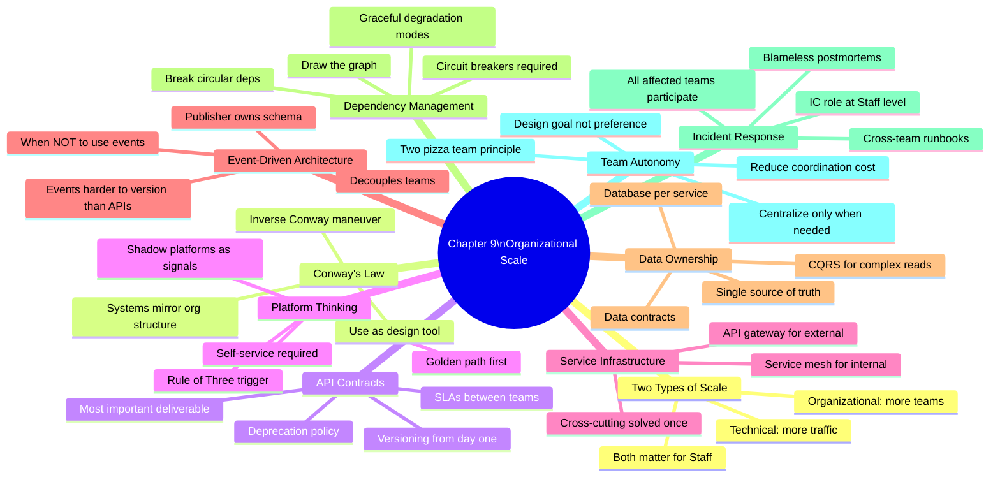

---

## Deep Dive: L5 vs L6 Dialogue Examples

These dialogues show exactly what the difference sounds like in a live interview. Read these out loud. Practice saying the L6 lines naturally.

### Dialogue 1: Designing a Shared Cache

**Interviewer:** "Design a shared caching layer for our platform."

**L5 candidate:** "I'd use Redis with a consistent hashing ring to distribute keys across nodes. For eviction I'd use LRU policy. Cache invalidation happens either through TTL or explicit invalidation on write. Here's the architecture..."

**L6 candidate:** "Before I design the technical solution, let me understand the organizational context. When you say shared, how many teams will use this cache? Do they cache different data from different services, or overlapping data?

I ask because a shared cache creates organizational coupling that might be undesirable. If Team A and Team B share the same cache cluster, Team A's hot keys can evict Team B's data. Team A's bug can flush Team B's cache. One team's traffic spike degrades everyone's cache hit rate.

My preference would be to distinguish between shared infrastructure and shared data. I'd propose: a shared Redis deployment maintained by the platform team, but with per-team key namespaces and per-team quota enforcement. The platform team owns the operational complexity — sizing, availability, upgrades. Each team owns their own cache keys, their own eviction policies within their namespace, and their own cache hit rate.

This way, teams get the operational benefit of shared infrastructure without the organizational coupling of sharing data. A bug in Team A's caching code doesn't affect Team B.

Now let me walk through the technical design for the Redis cluster itself..."

**What the interviewer hears:** L5 answered the technical question. L6 identified the organizational risk first, proposed a design that preserves team independence, and then answered the technical question. L6 asked clarifying questions that revealed deeper thinking.

### Dialogue 2: API Design for a New Service

**Interviewer:** "Your team is building a user preference service. Design the API."

**L5 candidate:** "I'd design a REST API. GET /users/{id}/preferences returns all preferences. PUT /users/{id}/preferences/{key} sets a preference. DELETE removes it. I'd use JSON. Here are the schemas..."

**L6 candidate:** "Let me think about this from the perspective of who will be using this API and for how long.

A user preference service will be used by many teams — notifications team needs notification preferences, ads team needs targeting preferences, product teams need feature toggle preferences. And this is a foundational service, so it will be around for years.

That means the API I design today will be a contract that teams build their systems around. If I later need to change it, every one of those teams has to coordinate a migration. So I want to get this right.

A few design decisions I'd call out explicitly:

First: versioning from day one. I'd namespace this as /v1/ before any team integrates. This gives me a path to introduce v2 if needed without breaking existing clients.

Second: structure the response to be backwards-compatible extensible. Instead of a flat key-value map, I'd use typed preference objects that can have additional optional fields added later. A flat map sounds simpler, but it makes it impossible to add metadata like 'this preference was last updated on X' without a breaking change.

Third: think about the read vs write access pattern. Most teams will read preferences frequently. Few teams should be able to write preferences — probably only the UI where the user actually sets them, and maybe a few trusted internal services. I'd design separate scoped permissions for read vs write.

Fourth: event publishing. When preferences change, publish a 'user.preference.changed' event. Teams that cache preferences can subscribe and invalidate their cache without polling my API.

Now let me show you the specific endpoint design..."

**What the interviewer hears:** L5 designed a correct API. L6 reasoned about the lifecycle of the API, the diversity of consumers, backward compatibility, access patterns, and event publishing — all before writing a single endpoint.

### Dialogue 3: Handling a Breaking Change

**Interviewer:** "Your team needs to change the user profile API. The current response includes 'name' as a single string, but you need to split it into first_name and last_name. How do you handle this?"

**L5 candidate:** "I'd update the API to return both first_name and last_name, and also keep name for backward compatibility. I'd send an email to all teams letting them know about the change and that they should migrate to the new fields. I'd deprecate name after everyone has migrated."

**L6 candidate:** "This is a classic backward-compatibility problem. Let me think through this carefully because the answer has significant organizational implications.

How many teams call this API? And do we have a service catalog that tells us which ones? If we have 30 teams depending on this, the migration plan needs to be much more structured than an email.

Here's the migration plan I would propose:

First, I would NOT change the existing 'name' field. It stays as-is. I would ADD 'first_name' and 'last_name' alongside it. This is always safe — adding optional fields is never a breaking change. Clients that do not know about first_name/last_name continue working exactly as before.

Second, I would announce this as a deprecation: 'The name field is deprecated. Please migrate to first_name and last_name by [date].' The date is determined by team count. At 30 teams, I would give 12 months.

Third, I would provide a migration guide — it should be copy-paste simple. 'Change name to `first_name + ' ' + last_name` wherever you use it.'

Fourth, I would track migration progress. I'd add metrics: how many API calls still reference the name field? This tells me which teams have migrated and which have not.

Fifth, 3 months before sunset: I'd reach out directly to teams that have not migrated. Not email — Slack DM to their tech lead. I would offer to help them migrate.

One month before sunset: the API starts returning a deprecation warning header. Teams see it in their logs.

On sunset date: I remove the field only if migration rate is above 95%. If it is lower, I extend by 3 months and escalate to the 5% of teams that are blocked.

The key insight: 'send an email and wait' does not work at 30 teams. Some teams will never prioritize a migration unless there is direct outreach, tooling, and a hard deadline with consequences."

**What the interviewer hears:** L5 had the right instinct (backward compatibility). L6 built a complete organizational process with metrics, outreach plan, tracking, and a clear decision about when to actually remove the field.

### Dialogue 4: Evaluating a Platform Proposal

**Interviewer:** "Your manager wants to build a centralized logging platform to replace each team's custom logging. Is this a good idea?"

**L5 candidate:** "Yes, it makes sense. Standardizing logging will improve incident response because everyone's logs will be in the same place. We can use the ELK stack or similar."

**L6 candidate:** "Good idea in principle, but the details matter a lot and I'd want to think through both the technical and organizational dimensions before committing.

First, let me understand the current state. How many teams have custom logging right now? What are the 2-3 most common pain points they experience? If teams are already happy with their setup, forcing migration to a centralized platform creates organizational friction with no corresponding benefit.

Assuming there IS pain — teams can't correlate logs across services, storage costs are out of control, there's no standard for log formats — then a centralized platform makes sense. Here's what needs to be true for it to succeed:

Self-service adoption. If teams need to file a ticket to set up logging for a new service, the platform will fail. The onboarding must be automated. A new service should get logging configured with a 10-line change to a config file.

Backward compatibility. Teams that have built dashboards and alerts on their current log format cannot afford to rebuild everything. The platform needs to support their existing format, or provide automated migration tooling.

Ownership clarity. Who owns the central platform? What is their SLO? If the central logging platform goes down, who pages and how fast do they respond? If teams' current logging is unreliable, they need to know the new platform is more reliable, not just more centralized.

Escape hatches. Some teams will have genuinely unusual logging needs — very high volume, special retention requirements, compliance requirements. The platform needs to accommodate these without custom work from the platform team.

Measurement of success. We should define upfront: what does success look like at 6 months? 80% of services using the platform? Cross-service log correlation working? Reduction in time-to-debug incidents?

If these conditions are met, yes, build the platform. If the plan is 'build it and mandate adoption,' I'd push back — mandated platforms that do not meet real needs create shadow systems and resentment."

**What the interviewer hears:** L5 agreed with a reasonable-sounding idea. L6 asked for more information, identified the organizational conditions for success, named the failure modes, and gave a conditional recommendation. This is exactly what Staff Engineers do.

---

## Extended Framework: The Organizational Scaling Stages

The system you design today will not be the system you have in three years. Teams will be added. Requirements will evolve. The codebase will grow. Staff Engineers think about the entire lifecycle.

### Stage 1: Single Team, Single Service (Team count: 1)

**What you have:**
- One team owns everything
- Requirements are changing fast
- Scale is manageable
- Iteration speed is everything

**What works at this stage:**
- Monolith or simple architecture
- Informal API (can change it yourself)
- Direct database access is fine
- Documentation lives in people's heads
- Breaking changes are fine (you control all the callers)

**What does NOT work at this stage (over-engineering):**
- Elaborate versioning schemes for APIs nobody else calls
- Platform teams for a single service
- Strict deprecation policies
- Formal SLAs with yourself

**Staff Engineer mindset:** "Move fast, learn fast. Do not over-engineer. But lay foundations that will not require complete rewrites at Stage 2."

**The foundations to lay now:**
- Clean abstractions (modules, interfaces) even if you do not need them yet
- At least some documentation — comments, a README
- Avoid tight coupling between components that MIGHT separate later
- Instrument with basic metrics so you can understand behavior

**First bottleneck at Stage 1:** Nothing. Single team coordination is fast. The bottleneck at Stage 1 is usually product decisions, not technical decisions.

### Stage 2: Two to Three Teams, Shared Services (Team count: 2-5)

**What changes:**
- Another team depends on your service
- Your API is now a contract (even if you did not declare it)
- Your deployments can affect other teams
- On-call incidents get more complex

**What breaks at this stage:**
- Informal API — you changed it and broke the other team
- In-head documentation — new team has no context
- Direct database access — the other team needs different data than your schema has
- Single on-call rotation — the other team does not know your system

**Investments to make now:**
- Introduce API versioning (start with v1 prefix)
- Write the README you should have written at Stage 1
- Establish ownership — this is owned by Team A; Team B is a client
- Define basic SLO — "we will be available 99.9% of the time"
- Separate databases (if not already)

**The mistake to avoid:** Treating the other team's needs as interruptions to your roadmap. They are clients now. Client needs must be managed, not ignored. Define a formal intake process for feature requests — even if it is just a shared backlog.

**First bottleneck at Stage 2:** Support burden. The other team will ask questions. Some will be in your documentation; many will not be. Every question that a team has to ask you is a documentation gap. Fix the documentation instead of answering the same question twice.

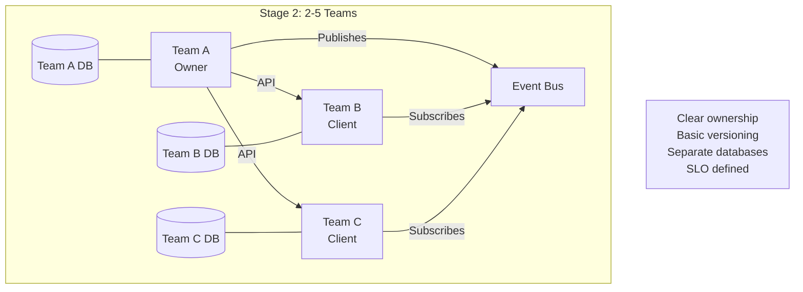

### Stage 3: Five to Fifteen Teams, Platform Services (Team count: 5-15)

**What changes:**
- Your service is now infrastructure
- You have more client teams than engineers
- Feature requests exceed capacity
- On-call burden grows non-linearly with client count
- Each client has different requirements that start to conflict

**What breaks at this stage:**
- Personal relationships replacing process — "just ask Bob"
- Feature requests via Slack — untracked, unprioiritized
- On-call handled by the same two engineers — they burn out
- Backwards compatibility is an informal promise — hard to enforce
- Teams have different expectations of your SLO

**Investments to make now:**
- Formal intake process for feature requests
- Self-service capabilities — teams can configure their own quota/limits
- On-call rotation expanded to at least 4 people, with documented runbooks
- Formal SLAs with each client team
- Contract testing — automated verification that your changes do not break clients
- Service catalog entry with dependency graph

**The platform team anti-pattern to avoid:** Heroics. Two engineers saying yes to everything, working nights and weekends, and slowly burning out. The answer is not more heroics — it is process. Define what the platform does and does not do. Say no to out-of-scope requests. Build self-service so teams do not need you for common tasks.

**First bottleneck at Stage 3:** Decision-making. With 10 teams as clients, every roadmap decision affects many people. The platform team needs a clear process for: how do we prioritize competing client requests? Who makes the final call? How do we communicate decisions?

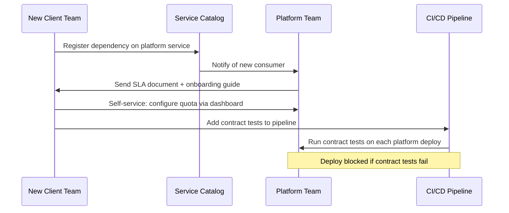

### Stage 4: Fifteen to Thirty Teams, Governance (Team count: 15-30)

**What changes:**
- The service is critical infrastructure
- Changes are high-risk and high-cost
- Some teams have compliance requirements that constrain the service
- Breaking changes are essentially impossible (too many consumers)

**What breaks at this stage:**
- Informal governance — who has authority to make architectural decisions?
- Ad-hoc API evolution — need formal change review
- Individual heroics for on-call — need dedicated SRE team
- Manual migration coordination — need migration tooling

**Investments to make now:**
- API change review board — explicit approval process for changes
- Dedicated platform SRE team (not the same engineers who build the service)
- Migration tooling — automated PRs, compatibility testing
- Governance document — who can change what, what needs sign-off
- Capacity planning — formal quarterly process
- Formal escalation paths — who to call for what

**The governance trap to avoid:** Governance so heavy that nothing can change. The goal is governance that allows safe change, not governance that prevents all change. If the change review process takes 3 months for every change, teams will route around the platform or build shadow solutions.

**First bottleneck at Stage 4:** Change management. Every change to the service potentially affects 20 teams. The friction of making changes, combined with the risk, means the platform may calcify — never changing, accumulating technical debt, eventually becoming a liability.

### Stage 5: Thirty Plus Teams, Strategic Infrastructure (Team count: 30+)

**What this looks like:**
- The service is foundational company infrastructure
- Multiple teams dedicated to its operation and evolution
- Changes require coordination across the organization
- The service has become a competitive advantage (or liability)

**What a Staff Engineer does at this stage:**
- Multi-year technical vision and roadmap
- Executive-level communication about technical direction and investment
- Industry-wide influence (open-source, standards bodies)
- Training and knowledge transfer at scale
- Cross-team architectural review authority

**The failure mode to watch for:** "Nobody touches it" syndrome. The service works. It is critical. Changing it is too risky. So it never changes. It slowly becomes out-of-date with best practices. New use cases require workarounds. Eventually it becomes a constraint on what the company can build.

**The Staff Engineer answer:** "We cannot afford not to change this. Here is a multi-year migration plan that keeps the service running, evolves it safely, and positions us for the next five years."

---

## Extended Reference: Service Level Agreement Templates

### Template 1: Platform Service SLA

```
SERVICE LEVEL AGREEMENT
Service: [Platform Service Name]
Provider: [Team Name]
Version: 1.0
Effective date: [Date]
Review schedule: Quarterly

1. AVAILABILITY

Defined as: percentage of minutes in the billing month where the service 
successfully processes requests (success rate > 99%).

Committed level: 99.9%
Allows: ~44 minutes downtime per calendar month
Excludes: Planned maintenance (announced 48+ hours in advance, 
          max 4 hours/month)
Measured by: [Link to dashboard]

2. LATENCY

Percentile | Committed | Measurement Window
p50        | < 50ms    | 5-minute rolling average
p95        | < 200ms   | 5-minute rolling average
p99        | < 500ms   | 5-minute rolling average

Measured at: Service entry point, not including client-side latency.

3. THROUGHPUT

Default per-client limit: 100 requests/second
Burst allowance: 200 requests/second for up to 60 seconds
Above limits: HTTP 429 returned; not counted as SLA violation.
Limit increase requests: Submit to [link], SRE review within 5 business days.

4. ERROR RATE

Committed: < 0.1% HTTP 5xx rate during normal operation.
Excludes: Errors caused by client-side malformed requests (HTTP 4xx)
          Errors during documented degradation modes

5. SUPPORT RESPONSE TIMES

Priority | Definition                    | Response Time
P1       | Service down, user impact     | < 15 minutes
P2       | Degraded, partial impact      | < 2 hours
P3       | Non-urgent issues             | < 1 business day
P4       | Feature requests, questions   | < 1 week (triage)

Contact: [PagerDuty rotation link]

6. RESPONSIBILITIES

Provider (Platform Team) is responsible for:
- Meeting the SLA commitments above
- Notifying consumers of planned maintenance 48+ hours in advance
- Notifying consumers of incidents via [status page] within 15 minutes
- Post-mortems within 48 hours of P1/P2 incidents
- API backward compatibility within major versions
- 12-month deprecation notice before major version sunset

Consumer (Your Team) is responsible for:
- Implementing retry logic with exponential backoff
- Implementing graceful degradation for periods of SLA violation
- Not exceeding your per-client rate limits
- Using the latest supported API version
- Notifying Platform Team of unusual traffic patterns 48+ hours in advance

7. ERROR BUDGET

Monthly error budget: 0.1% × 43,200 minutes = 43.2 minutes
Budget tracking: [Link to dashboard]

When budget is 50% consumed: Platform Team activates reliability sprint.
When budget is 100% consumed: Platform Team freezes non-critical deployments.
When budget exceeds 100%: Escalate to engineering leadership; post-mortem required.

8. REVIEW AND RENEGOTIATION

This SLA is reviewed quarterly by Platform Team and consumer team representatives.
Changes require 60 days notice.
SLA disputes escalated to VP Engineering if unresolved in 5 business days.

Signed: [Platform Team Tech Lead]         [Consumer Team Tech Lead]
Date:   ____________________              ____________________
```

### Template 2: Event Schema Contract

```
EVENT SCHEMA CONTRACT
Event: user.profile.updated
Publisher: User Platform Team
Current version: 1.3
Last updated: [Date]

1. SCHEMA

{
  "schema_version": "1.3",          // string, required
  "event_id": "uuid-v4",            // string, required, globally unique
  "event_type": "user.profile.updated",  // string, required
  "timestamp": "ISO-8601",          // string, required, UTC
  "user_id": "string",              // string, required
  "changed_fields": ["string"],     // array<string>, required, field names
  "profile": {
    "user_id": "string",            // string, required
    "email": "string",              // string, optional (may be null)
    "display_name": "string",       // string, optional
    "first_name": "string",         // string, optional, added in v1.2
    "last_name": "string",          // string, optional, added in v1.2
    "subscription_status": "string",// string, optional, enum: free|paid|trial
    "updated_at": "ISO-8601"        // string, required
    // Future fields will be added here as optional
  }
}

2. VERSIONING POLICY

Within-version changes (safe):
- Adding new optional fields to 'profile' object
- Adding new values to 'changed_fields'
- Adding new enum values to 'subscription_status'

Breaking changes (require new schema_version):
- Removing any existing field
- Changing type of any existing field
- Making optional fields required

3. CONSUMER REQUIREMENTS

- Parse unknown fields gracefully (ignore, do not fail)
- Handle missing optional fields gracefully (treat as null)
- Process events that may arrive out of order (use 'updated_at' to determine recency)
- Handle duplicate events (events may be delivered more than once)
- Schema version mismatch: process known fields, log warning for unknown version

4. DEPRECATED FIELDS

Field 'name' (single string): deprecated in v1.2. Use first_name + last_name.
Will be removed in v2.0, no earlier than [Date + 6 months from publication].

5. AVAILABILITY

Events published within 5 seconds of profile update (99th percentile).
At-least-once delivery: events may be delivered more than once.
Maximum delay during platform degradation: 30 minutes (events will not be lost).
Dead letter queue: events failing processing after 5 attempts go to [DLQ link].

6. CONTACT

Schema changes: minimum 30 days notice to subscribers.
Publisher on-call: [contact info]
Subscribe/unsubscribe: [link to self-service subscription management]
```

---

## Worked Example: Redesigning the Feature Flags Service

This is a complete worked example for Exercise 1 from the homework section. Walk through this to understand how to apply all the concepts in practice.

### The Starting Point

Your company has a Feature Flags service used by 20 teams. Current state:

- Central database stores all flag definitions
- All services call the Feature Flags API synchronously at runtime — every request to your service includes a call to Feature Flags
- Feature Flags team creates all flags (on request, 3-day turnaround)
- Flags have no per-team namespace — any team can accidentally read or write any flag
- A Feature Flags deployment causes brief errors in ALL services simultaneously
- On-call for Feature Flags pages on any service's incident because Feature Flags is in every request path

### Identifying the Problems

**Problem 1: Synchronous critical path dependency.**
Feature Flags is called on EVERY request. This means Feature Flags latency adds to every user request latency. Feature Flags availability directly limits every service's availability. Feature Flags is a single point of failure for the entire company.

**Problem 2: Team bottleneck.**
All flag creation goes through the Feature Flags team. This is a 3-day delay for every team that wants a feature flag. At 20 teams, this is a constant queue. The Feature Flags team is permanently behind.

**Problem 3: No namespace isolation.**
Any team can read any flag. Any team's misconfiguration can affect other teams. There are no blast radius boundaries.

**Problem 4: Coupled deployments.**
Deploying the central Feature Flags service affects all 20 services simultaneously. This makes Feature Flags extremely risky to update.

### The Redesigned System

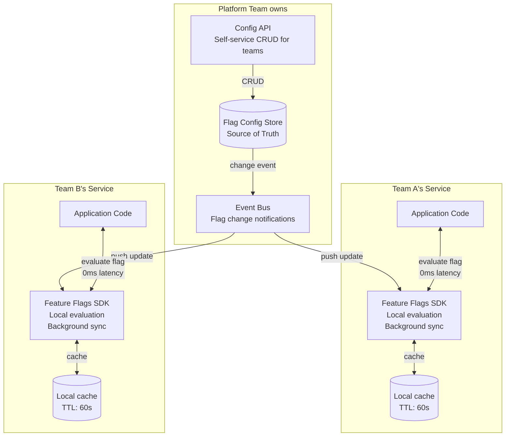

**Key changes:**

**Change 1: Local evaluation SDK replaces central API call.**
Teams embed the Feature Flags SDK in their service. The SDK downloads flag definitions periodically and evaluates flags locally. Zero network latency for flag evaluation. If the central Config Store goes down, services continue using their cached flag definitions.

**Change 2: Background sync replaces synchronous dependency.**
The SDK syncs flag definitions in the background, not in the request path. Config Store latency no longer affects service latency. Config Store availability no longer affects service availability.

**Change 3: Self-service flag management.**
Teams manage their own flags through the Config API UI. No ticket to the Feature Flags team. A team creates a new flag in 30 seconds. The 3-day turnaround disappears.

**Change 4: Per-team namespaces.**
Flag names are namespaced: `team-a/my-feature-flag`. Team A cannot accidentally read Team B's flags. Blast radius is contained.

**Change 5: Decoupled deployments.**
The Config Store and Config API can be deployed independently of any service. Changes to the Feature Flags platform do not cause errors in service deployments.

### New Ownership Boundaries

| Component | Owner | Responsibility |
|---|---|---|
| Config Store (database) | Platform Team | Availability, data integrity, backups |
| Config API | Platform Team | CRUD endpoints, authentication, authorization |
| Feature Flags SDK | Platform Team | Library code, background sync logic, local evaluation |
| SDK deployment | Each service team | Include SDK in their service, configure namespace |
| Flag definitions | Each service team | Create, modify, delete their own flags |
| SDK version upgrades | Each service team | Upgrade when ready; Platform team announces deprecation |

### Failure Mode Analysis

| Failure | Old behavior | New behavior |
|---|---|---|
| Config Store is down | ALL services fail immediately | Services continue with cached flags; new flags cannot be created |
| Config Store is slow | ALL services slow down | Services unaffected (SDK uses cache) |
| Team A's flag is misconfigured | Possible cross-team contamination | Only Team A's service affected (namespace isolation) |
| SDK has a bug | Affects service it is embedded in | Only that service affected |
| Platform Team deploys Config API update | Brief errors in config management UI | No service impact |
| Feature Flags SDK updated | Each team controls their upgrade timing | No forced simultaneous upgrade |

### Migration Plan

**Phase 1 (Months 1-2): Build SDK and Config API**
- Platform team builds the SDK with local evaluation and background sync
- Platform team builds Config API with namespace support
- Do not change any production service yet

**Phase 2 (Month 3): Pilot with one team**
- One volunteer team integrates the SDK
- They run old API call and SDK in parallel, compare results (shadow mode)
- Fix discrepancies in SDK behavior

**Phase 3 (Months 4-6): Gradual rollout**
- 5 teams per month integrate SDK
- Old Feature Flags API remains available during transition
- Each team switches from old API to SDK in shadow mode, then cuts over

**Phase 4 (Month 7-8): Sunset old API**
- Announce deprecation of old synchronous API
- Direct outreach to teams still using it
- Sunset date with hard deadline

**Phase 5 (Month 9): Full migration complete**
- Old API returns 410 Gone
- Platform team's on-call no longer has production incident responsibility for individual services

### The L6 Insight from This Exercise

The original Feature Flags design created organizational coupling that was not visible as a design decision. It seemed like "centralize the feature flag service" — a reasonable choice. But the organizational consequence was: one team's service in every other team's critical path.

The redesigned system achieves the same goal (shared feature flag management) with much better organizational properties:
- Teams are autonomous (create flags without tickets)
- Blast radius is bounded (namespace isolation)
- Availability is improved (local caching)
- The platform team is no longer a bottleneck or a SPOF

The technical change was not dramatic. The organizational change was significant. This is what Staff-level system design looks like.

---

## Reference: First Bottlenecks by Team Count

This table is based on patterns observed across organizations that have scaled engineering teams. Use it to anticipate what will break before it breaks.

| Team Count | Primary Bottleneck | Secondary Bottleneck | Key Investment |
|---|---|---|---|
| 1-3 teams | None significant | Informal documentation | README + basic API docs |
| 4-5 teams | "Who do I ask?" support burden | Unclear ownership | Service catalog + clear owners |
| 6-8 teams | Breaking changes without notice | Missing feature request process | API versioning + intake process |
| 9-12 teams | On-call overload | Slow client onboarding | Expanded on-call + self-service onboarding |
| 13-20 teams | Conflicting client requirements | Dependency visibility | Formal roadmap process + dependency graph |
| 20-30 teams | Platform team capacity | Migration coordination | Dedicated platform SRE + migration tooling |
| 30+ teams | Change governance | Architecture calcification | Formal governance process + architecture review |

**How to use this table:**

At each team count, you are working on the previous bottleneck while anticipating the next one. At 5 teams, you are establishing clear ownership while also thinking about API versioning for the 8-team stage. At 10 teams, you are expanding on-call while also building self-service for the 15-team stage.

**Staff heuristic:** "Invest in the next bottleneck before you hit it." The worst time to build API versioning is when you already have 12 teams hitting breaking changes. The best time is when you have 3 teams and can do it without coordination overhead.

---

## Reference: The Dependency Graph in Interviews

Interviewers expect Staff candidates to draw dependency graphs for any system with multiple services. Here is how to do this systematically.

### Step 1: List All Services

Name every service in the system. Do not omit anything — databases, caches, queues, and external services are all nodes in the graph.

### Step 2: Draw Directed Edges

For every pair of services where A calls B, draw an edge from A to B. The edge direction is: "A depends on B" means A → B.

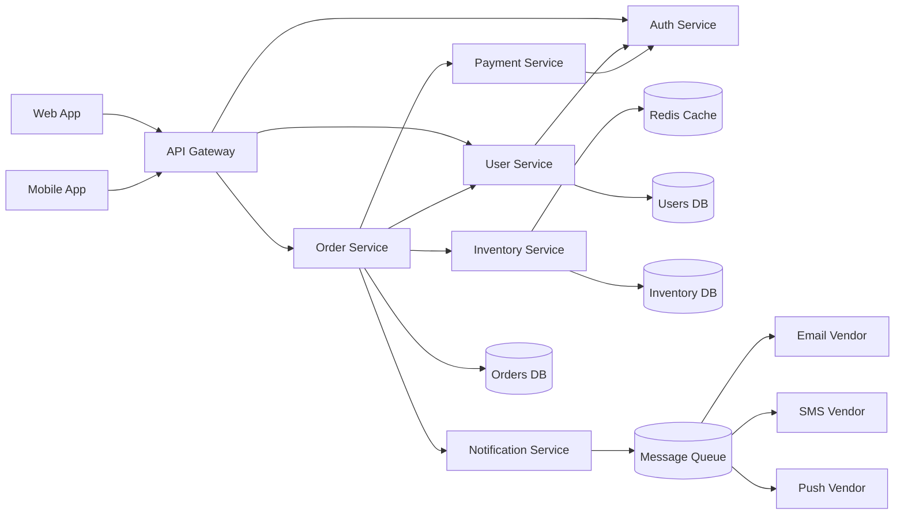

### Step 3: Annotate with Blast Radius

Look at each node. Count how many other nodes depend on it (directly or transitively). Nodes with many dependents have high blast radius.

In the graph above:
- **Auth Service:** Gateway, Order, Payment, User all depend on Auth. Blast radius = nearly the entire system.
- **API Gateway:** Web, Mobile depend on it. But it depends on Order, User, Auth. Gateway failure = user-facing failure.
- **Email Vendor:** Only the email consumer depends on it. Blast radius = email delivery only.
- **Inventory DB:** Only Inventory Service depends on it. Blast radius = inventory operations.

**The design implication:** Services with high blast radius need higher reliability targets, more careful change management, and better graceful degradation by their consumers.

### Step 4: Identify Critical Paths

A critical path is a chain of dependencies where every component must work for the user to complete their primary goal. In e-commerce: Web → Gateway → Order → Payment → Auth. If any of these fails, the user cannot check out.

**Staff insight:** Minimize the length of the critical path. Every service added to the critical path multiplies the probability of failure. Design non-critical operations (notifications, analytics) to be off the critical path using events.

### Step 5: Check for Cycles

In the graph, check for any cycle — a path that starts and ends at the same node. If you find one, it is a design problem. Fix it before the design is complete.

---

## Reference: The Complete L5 vs L6 Summary Table

| Dimension | L5 Thinking | L6 Thinking | Example Phrase |
|---|---|---|---|
| Scale definition | Technical only | Technical + organizational | "This scales technically, but does it scale across teams?" |
| API attitude | Implementation detail | Long-term contract | "This API will outlive the current team. Version it." |
| Ownership | Assigned if asked | First-class design concern | "Before anything else — who owns this at 3 AM?" |
| Blast radius | Acknowledged risk | Bounded by design | "I'm isolating these so one team's failure can't page five teams." |
| Platform decision | Build if useful | Triggered by rule of three | "Three teams independently built this — now we have evidence for a platform." |
| Data access | API or DB, depends | API only across team boundaries | "No team accesses another team's database. Period." |
| Events | Async optimization | Team decoupling tool | "Events let Order Service ship without coordinating with Email, Inventory, or Analytics." |
| Incidents | Participate | Lead as IC | "I'll be IC. You investigate. I coordinate." |
| Post-mortems | Single team | All affected teams | "Every team affected by this incident participates in the post-mortem." |
| Evolution | Handles current needs | Designs for 5-year trajectory | "At 50 teams this design breaks. Let me show you what breaks and when." |
| Conway's Law | Knows it exists | Uses it as design tool | "This org structure will produce this architecture. If we want a different architecture, we restructure the org." |
| SLOs | Availability target | Cross-team contract | "Your SLO must be tighter than your client's SLO or they can't meet their user-facing commitments." |
| Coordination cost | Felt but not quantified | Quantified explicitly | "This coupling costs $300K/year in coordination overhead. Decoupling costs $50K to build. Easy decision." |
| Self-service | Nice to have | Non-negotiable | "A platform that requires tickets is a bottleneck with a Jira board." |
| Shadow platforms | Problem to solve | Market signal | "Teams built their own — that's our backlog telling us what to build next." |

---

## Extended Design Exercise: The Full Worked Example — Payments Platform

This worked example walks through designing a payments platform from scratch. It covers every concept in this chapter in a single coherent design.

### Problem Statement

You are a Staff Engineer at a mid-size e-commerce company. The company has grown from 1 team to 25 teams over 3 years. Each team has built their own payment integration: some use Stripe directly, some use PayPal, some have built custom integrations.

Problems:
- 7 different payment integrations exist in the codebase, each with different reliability characteristics
- Payment compliance (PCI DSS) must be maintained by each team — some teams are doing it wrong
- Three security incidents in the past year involved payment data exposure
- Reconciliation is impossible — finance cannot match transactions across different integrations
- When Stripe has an outage, it affects some teams but not others — inconsistent incident response

You are asked to design a centralized Payments Platform that all 25 teams will use.

### Step 1: Establish Team Ownership

**Platform team (you):** Owns the Payments Platform service, payment vendor integrations, PCI DSS compliance, reconciliation, and the API that other teams use.

**Client teams (the 25 teams):** Own their own checkout flows, retry logic, error handling in UI, and the decision of when to charge (trigger). They do NOT own the payment mechanics.

This boundary is critical. The platform team does NOT own checkout UX decisions. Client teams do NOT own payment security. Each side has clear responsibility.

### Step 2: Define the API Contract

The API is a long-term contract. Design it for 5 years of backward compatibility.

```
POST /v1/charges
{
  "amount_cents": integer,        // required; in smallest currency unit
  "currency": "string",           // required; ISO 4217 (e.g., "USD")
  "idempotency_key": "string",    // required; client-generated UUID
  "payment_method_id": "string",  // required; token from payment method API
  "description": "string",        // optional; shown on receipt
  "metadata": {                   // optional; key-value pairs for client use
    "order_id": "string",
    "customer_id": "string"
  },
  "capture_mode": "immediate" | "manual"  // optional; default: immediate
}

Response (success):
{
  "charge_id": "string",          // globally unique charge identifier
  "status": "pending" | "succeeded" | "failed",
  "amount_cents": integer,
  "currency": "string",
  "created_at": "ISO-8601",
  "error": null | {               // present when status=failed
    "code": "string",             // machine-readable error code
    "decline_code": "string",     // issuer decline reason (if applicable)
    "message": "string",          // human-readable description
    "retryable": boolean          // can client retry this charge?
  }
}
```

**Design decisions explained:**

`idempotency_key` is required. This is the most important field. Without it, a client retry after a network timeout might double-charge the user. With idempotency keys, the second charge attempt returns the same result as the first (success or failure) without charging again. Making this required (not optional) means clients cannot accidentally omit it.

`retryable` in the error response. This tells clients exactly what to do. "insufficient_funds" is not retryable. "network_timeout" is retryable. Without this field, clients either retry everything (causing double charges on human errors) or retry nothing (missing recoverable failures).

`capture_mode: manual`. Some teams (e.g., pre-orders, reservations) need to authorize a charge now but capture it later. Adding this as an optional field with backward-compatible default means existing clients are unaffected but new use cases are supported.

### Step 3: Define the SLA

```
Payments Platform SLA v1.0

Availability:  99.99% (52 minutes downtime/year)
              [High because checkout downtime costs revenue directly]

Latency:
  p50:  < 300ms
  p95:  < 800ms
  p99:  < 2000ms
  [Payment calls involve external vendor — vendor latency included]

Throughput:  500 charges/second (org-wide aggregate)
             50 charges/second per client team (default)
             [Prevents one team's surge from affecting others]

Error rate:  < 0.05% 5xx rate (platform errors, not payment declines)
             [Payment declines are normal; platform errors are not]

Support:
  P1 (platform down): < 10 minutes response
  P2 (elevated errors): < 30 minutes response
  P3 (single team issue): < 4 hours response
```

### Step 4: Identify the Blast Radius Risks and Mitigate Them

**Risk 1: Platform outage takes down all checkout flows.**

Mitigation: clients must implement graceful degradation. When the platform returns 503 or times out, clients show "payment temporarily unavailable, please try again in a few minutes" instead of crashing. The platform provides a status endpoint that clients can check.

**Risk 2: One team's surge exhausts rate limit for all teams.**

Mitigation: per-team rate limits (50 charges/second default). Team A's Black Friday surge does not exhaust Team B's capacity.

**Risk 3: Payment vendor outage affects all teams simultaneously.**

Mitigation: multi-vendor strategy. Platform routes to Stripe primarily, Adyen secondarily, Braintree as fallback. If Stripe is down, platform fails over to Adyen automatically. Clients are unaware of the vendor — they call the platform API. The platform handles vendor diversity.

**Risk 4: PCI compliance violation by one team exposes all teams.**

Mitigation: the platform handles all raw payment data. Client teams NEVER see raw card numbers, CVVs, or full PAN numbers. Clients receive and store only payment_method_ids (tokens). PCI DSS scope is confined to the payments platform. If a client team has a data breach, they cannot expose payment data they never had.

### Step 5: Design for Conway's Law

This design requires: one platform team owns everything in the payments platform. Client teams are consumers, not co-owners.

If instead we design a "committee" model where 5 teams jointly own the payments platform, Conway's Law predicts: 5 teams will build 5 slightly different payment flows, coordinate every decision in committee, and create a service with conflicting design choices at every seam.

Staff engineer recommendation: staff a dedicated Payments Platform team of 5-7 engineers before launching. The team's identity is payments infrastructure. They are not product engineers moonlighting on shared infrastructure.

### Step 6: Plan the Migration

Current state: 7 payment integrations across 25 teams.
Target state: all 25 teams on the Payments Platform.

**Month 1-2:** Build the platform with no clients. Internal testing. Compliance audit.

**Month 3:** Pilot with one team — the team with the cleanest existing integration and the most motivated engineers. They run their old integration and the platform in shadow mode (charge via both, compare results, do not capture twice).

**Month 4-6:** Five teams per month onboard. Shadow mode first, then cut over.

**Month 7-8:** Sunset old integrations. Teams still on old integrations get direct outreach. A compliance requirement can accelerate this: "Old integrations fail PCI audit. Migration to platform is required by [date] for compliance."

**Month 9:** All teams on platform. Old integrations retired.

**Critical risk in migration:** Teams that have customized their checkout flow to depend on Stripe-specific behavior that the platform's abstraction does not expose. The platform needs to handle the 80% case. For the 20% edge case, provide explicit escape hatches with documented behavior.

### Step 7: Define the Event Schema for Downstream Consumers

Not every team that cares about payments calls the charges API. Analytics, finance, fraud detection, and loyalty programs care about payment events but do not initiate charges.

```
Event: payment.charge.completed
Publisher: Payments Platform Team
Version: 1.0

{
  "schema_version": "1.0",
  "event_id": "uuid",
  "event_type": "payment.charge.completed",
  "timestamp": "ISO-8601",
  "charge_id": "string",
  "status": "succeeded" | "failed",
  "amount_cents": integer,
  "currency": "string",
  "client_team": "string",        // which team initiated the charge
  "metadata": {},                  // client-provided metadata (passthrough)
  "error_code": "string | null"   // null when status=succeeded
  // NOTE: no raw card data. Never. PCI compliance requires this.
}
```

Analytics team subscribes and builds revenue dashboards. Fraud team subscribes and updates risk models. Finance subscribes and builds reconciliation. None of them need to call the payments API directly.

### The L6 Insight from This Example

Notice what did NOT appear in this design:

- "Which database should we use?" (PostgreSQL is the obvious answer for financial data — move on)
- "What language should we write this in?" (Does not affect the organizational design)
- "Should we use microservices or a monolith?" (The payments platform can be a well-structured monolith internally — external consumers do not care)

What DID appear: ownership, API contracts, SLAs, blast radius mitigation, Conway's Law alignment, migration plan, event schemas for non-charging consumers.

These are the organizational concerns. They are what Staff Engineers lead with.

---

## Quick Reference Cards

### Card 1: The 5-Question Ownership Test

Before any service goes to production, answer these five questions. If you cannot answer all five, the service is not ready.

1. **Who is the primary owner?** (One team name, not "shared")
2. **Who is on-call at 3 AM?** (Named engineers with PagerDuty rotation)
3. **Where is the runbook?** (URL to the primary troubleshooting guide)
4. **What is the SLO?** (Availability percentage and latency targets)
5. **Where is the service catalog entry?** (Link to the registry)

If any answer is "to be determined" or "TBD," the service is not ready to accept external clients.

### Card 2: The API Change Safety Checklist

Before changing any API that external teams call:

- [ ] Is this additive? (New optional field, new endpoint, new enum value) → Safe, ship it
- [ ] Does this remove a field or endpoint? → Breaking change, use new version
- [ ] Does this change the type or semantics of an existing field? → Breaking change, use new version
- [ ] Does this change default behavior? → Potentially breaking, add new opt-in parameter
- [ ] Have I checked the contract tests? → Run them first
- [ ] Have I announced the change to all consumers? → At least 30 days before deprecation
- [ ] Do I have metrics showing which teams still use the old behavior? → Required before sunset

### Card 3: The Blast Radius Assessment

For any failure scenario, answer:

1. **Which service failed?** (Name it)
2. **What does that service do?** (One sentence)
3. **Who calls that service?** (From the dependency graph)
4. **What do each of those callers do when it fails?** (Retry? Error? Degrade?)
5. **How many users are affected?** (Estimate)
6. **How many teams are paged?** (Count)
7. **What is the blast radius?** (Summary: "All checkout fails" vs "Email notifications delayed")

### Card 4: The Platform Decision Matrix

| Question | Answer → Decision |
|---|---|
| How many teams need this? | <3: each team builds own; 3+: consider platform |
| Is there compliance/security requirement? | Yes: centralize always |
| Are requirements diverging across teams? | Yes: be careful centralizing, may need escape hatches |
| Is the team that would own the platform funded? | No: do not build the platform (it will become abandoned) |
| Can it be self-service? | No: do not build the platform (ticket-driven = bottleneck) |
| Do you have user research from the 3 teams? | No: do not build yet, learn first |

### Card 5: Cross-Team Incident First 15 Minutes

```
Minute 0-2:   Declare incident. Create channel: #incident-YYYY-MM-DD-description
Minute 2-5:   Post initial status. Assign IC and Comms Lead.
Minute 5-10:  Check service catalog: who depends on this?
              Page affected teams' on-calls directly (not just email).
Minute 10-15: IC posts: "What is your impact?" to each affected team.
              Comms Lead: post to status page.
Minute 15:    IC: first coordination call or written sync.
              Decision: rollback vs forward-fix vs workaround.
```

The IC never goes dark. Update the incident channel every 15 minutes, even if the update is "still investigating, no change in status."

---

## Conclusion: The Mindset Shift

This chapter asks you to make a fundamental mindset shift. Not a small adjustment. A complete reframing of what "good system design" means.

**Before:** Good system design means: correct algorithms, appropriate data structures, proper fault tolerance, efficient use of resources.

**After:** Good system design means ALL of the above PLUS: clear ownership that will survive a team reorg, API contracts that will survive 5 years of product evolution, blast radius that will survive a human mistake at 3 AM, operational burden that will survive scaling to 50 teams, and coordination cost that will not gradually strangle the engineering organization.

The technical aspects of this chapter — circuit breakers, CQRS, service meshes — are not new to you. You have probably seen them before.

The organizational aspects — Conway's Law, API contracts as binding agreements, platform thinking as product management, incident command as a role, blameless culture as a prerequisite for truth-telling — these may be new. They are what makes the difference.

When you are in an interview designing a system, the other candidates will dive into load balancers and database sharding. You will pause and ask: "Who owns this in three years? What happens when requirements diverge between the teams that use it? What is the blast radius when it breaks?"

Those questions will signal something the interviewer has been waiting to hear from every candidate: this person thinks at the organizational level, not just the technical level. This person can lead systems that outlast any individual team.

That is what L6 looks like.

---

## Appendix A: Mermaid Reference Diagrams

These diagrams are referenced throughout the chapter. They are collected here for review.

### A1: Team Ownership and Communication Flow

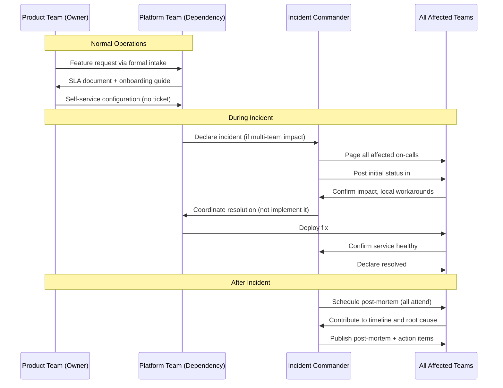

### A2: API Versioning Lifecycle

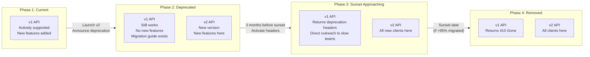

### A3: Platform Adoption Funnel

```mermaid
flowchart TD
    Awareness[Teams learn platform exists] --> Evaluation[Teams try golden path]
    Evaluation -->|Easy golden path| Adoption[Teams adopt for new services]
    Evaluation -->|Hard to use| Shadow[Teams build shadow platform]
    Adoption --> Expansion[Teams migrate existing services]
    Expansion --> Champion[Teams recommend to others]
    Shadow -->|Platform team learns| FixPlatform[Platform team fixes gaps]
    FixPlatform --> Evaluation
```

### A4: Data Ownership — Write vs Read Patterns

```mermaid
flowchart TD
    subgraph WritePath["Write Path: Strong Consistency"]
        direction LR
        W1[User writes their profile] -->|HTTP PUT| US[User Service\nOwner of user data]
        US -->|Write| DB[(Users DB\nSource of Truth)]
        US -->|Publish event| EB[Event Bus]
    end
    subgraph ReadPath["Read Path: Multiple Patterns"]
        direction LR
        EB -->|Subscribe| Cache[Consumer Cache\nEventually consistent\n5 min stale OK]
        EB -->|Subscribe| ReadModel[CQRS Read Model\nDenormalized\nFor complex queries]
        DB -->|Direct API call| RealTime[Real-time API\nFor security-sensitive reads]
    end
    subgraph Consumers
        AnalyticsTeam[Analytics Team\nUses: ReadModel] 
        AdsTeam[Ads Team\nUses: Consumer Cache]
        AuthTeam[Auth Team\nUses: Real-time API]
    end
```

### A5: Circuit Breaker State Machine

```mermaid
flowchart TD
    Closed["CLOSED\n(Normal operation)\nAll requests pass through\nCount failures"]
    Open["OPEN\n(Dependency failing)\nFast-fail all requests\nReturn fallback immediately"]
    HalfOpen["HALF-OPEN\n(Testing recovery)\nAllow limited test requests"]

    Closed -->|"Failure rate > threshold\n(e.g. 50% in 30s)"| Open
    Open -->|"After timeout\n(e.g. 60 seconds)"| HalfOpen
    HalfOpen -->|"Test requests succeed"| Closed
    HalfOpen -->|"Test requests fail"| Open

    Note1["`Benefits:
    - Stops amplifying failures
    - Fast response during outage
    - Self-healing on recovery`"]
```

### A6: Organizational Coupling vs. Technical Coupling

```mermaid
quadrantChart
    title Coupling Types and Consequences
    x-axis Low Technical Coupling --> High Technical Coupling
    y-axis Low Organizational Coupling --> High Organizational Coupling
    quadrant-1 Worst: Tightly coupled teams and systems
    quadrant-2 Manageable: Independent teams, coupled systems
    quadrant-3 Best: Independent teams and systems
    quadrant-4 Risky: Coupled teams, independent systems
    Shared DB + joint on-call: [0.9, 0.9]
    API with SLA + separate on-call: [0.4, 0.2]
    Events with schema contract: [0.3, 0.1]
    Shared library + coordinated releases: [0.7, 0.7]
    Sidecar with central config: [0.5, 0.2]
    Monolith + joint deploys: [0.95, 0.85]
```

---

## Appendix B: Practice Problem Set

These problems are calibrated for L6 interviews. Work through each one. For each, spend 5 minutes on organizational concerns before touching the technical design.

### Problem 1 (30 minutes): Search-as-a-Platform

**Scenario:** Your company has 15 teams. Each team has built their own search functionality:
- 5 teams use Elasticsearch directly (3 different clusters)
- 4 teams use basic database LIKE queries
- 3 teams use Algolia (different accounts)
- 3 teams have no search

**Prompt:** Design a Search Platform that all 15 teams can use.

**Organizational questions to answer first:**
- What are the 3 most common search use cases across teams?
- Which teams have compliance or data sovereignty requirements (their data cannot be in a shared index)?
- What is the blast radius if the search platform goes down?
- Who owns the search platform team?

**Technical questions to answer second:**
- What indexing architecture works for 15 teams with different data schemas?
- How do you handle per-team data isolation?
- What query language do teams use?
- How do you handle relevance tuning per team?

---

### Problem 2 (30 minutes): The Multi-Region Migration

**Scenario:** Your company currently operates in one region (US-West). The company is expanding to EU and Asia-Pacific. 30 teams will need to serve customers in all three regions.

**Prompt:** Design the multi-region architecture with appropriate team ownership.

**Organizational questions to answer first:**
- Do teams deploy to all regions simultaneously, or choose their own?
- Who owns the cross-region replication infrastructure?
- What happens during a region failover — which team makes the decision?
- How do EU GDPR requirements change data ownership?

**Technical questions to answer second:**
- Active-active vs active-passive per region?
- How does database replication work across regions?
- How do feature flags work per region?
- What is the blast radius of a regional failure?

---

### Problem 3 (20 minutes): The On-Call Scaling Problem

**Scenario:** Your platform service has grown from 5 to 25 client teams. Your on-call rotation (3 engineers) is getting paged 15 times per week. 60% of pages are from client issues (misconfiguration, wrong usage, their bugs), not platform issues.

**Prompt:** Design a system that reduces on-call burden to 5 pages per week without hiring more platform engineers.

**Hint:** This is primarily an organizational design problem, not a technical one. You need to change how incidents are triaged, attributed, and routed.

---

### Problem 4 (45 minutes): Staff to Staff Handoff

**Scenario:** You are a Staff Engineer at a company. You are leaving the company (new opportunity). You own:
- A payments platform used by 20 teams
- A rate limiter platform used by 30 teams
- A service mesh deployment used by all 100 services

**Prompt:** Design a handoff plan that does not create organizational chaos.

**Questions to answer:**
- What documentation must exist before you leave?
- How do you transfer deep institutional knowledge that is not documented?
- Who has authority to make architectural decisions after you leave?
- What is the 6-month roadmap, and how do you ensure it survives the transition?
- What are the top 3 risks if you leave without a structured handoff?

---

## Appendix C: System Design Vocabulary — 50 Terms

Every term below appears in Staff Engineer interviews and design reviews. Know all of them.

| Term | Simple Definition |
|---|---|
| **SLO** | Service Level Objective — an internal reliability target (e.g., 99.9% uptime) |
| **SLA** | Service Level Agreement — a formal contract with a client team specifying reliability |
| **Error budget** | The amount of unreliability your SLO allows in a time period |
| **Blast radius** | How many services/teams are affected by a failure |
| **Single source of truth** | One team/service that owns and is authoritative for a piece of data |
| **API contract** | The formal specification of what an API does, its guarantees, and its stability |
| **Breaking change** | A change to an API that breaks existing consumers |
| **Backward compatibility** | New version works with clients written for old version |
| **Deprecation** | Announcing that something will be removed in the future |
| **Sunset** | The actual removal of a deprecated API, feature, or service |
| **Conway's Law** | Systems mirror the communication structure of the organizations that build them |
| **Inverse Conway maneuver** | Designing org structure to produce desired system architecture |
| **Platform engineering** | Building internal products for developers (CI/CD, observability, auth) |
| **Golden path** | The opinionated, well-supported default path through a platform |
| **Shadow platform** | An informal replacement for an official platform, built because the official one is inadequate |
| **Self-service** | Capability for clients to do things without filing tickets |
| **Two-pizza team** | A team small enough to be fed by two pizzas (5-7 people) |
| **Service mesh** | Infrastructure layer handling service-to-service communication (discovery, circuit breaking, mTLS) |
| **API gateway** | Edge component handling external-to-internal traffic (auth, rate limiting, routing) |
| **Circuit breaker** | Pattern that stops calls to a failing dependency and fails fast instead |
| **Bulkhead** | Pattern that isolates resource pools so one failing component cannot exhaust resources for others |
| **Graceful degradation** | Serving reduced functionality instead of failing completely when a dependency is unavailable |
| **Idempotency key** | Client-generated identifier that makes a request safe to retry without side effects |
| **Dead letter queue (DLQ)** | Queue that receives messages that could not be successfully processed |
| **Event schema** | The formal structure of an event message (fields, types, meaning) |
| **Event sourcing** | Storing system state as a sequence of events rather than current state |
| **CQRS** | Command Query Responsibility Segregation — separate write and read paths |
| **Read model** | A denormalized view of data optimized for queries, built from events |
| **Eventual consistency** | Guarantee that all replicas of data will converge to the same value, but may be temporarily inconsistent |
| **Strong consistency** | Guarantee that every read sees the latest write |
| **Organizational coupling** | Teams dependent on each other to do their work (meetings, coordination, shared deployments) |
| **Technical coupling** | Services dependent on each other at runtime (API calls, shared databases) |
| **Dependency inversion** | Depending on abstractions (interfaces, API contracts) rather than concrete implementations |
| **Circular dependency** | A cycle in the dependency graph — A depends on B, B depends on A |
| **Strangler fig pattern** | Gradually replacing an old system by building the new system alongside it |
| **Canary deployment** | Releasing a change to a small percentage of traffic before full rollout |
| **Feature flag** | A configuration switch that enables or disables a feature at runtime |
| **Service catalog** | A registry of all services with metadata: owner, dependencies, SLO, runbook |
| **Incident Commander (IC)** | The person coordinating incident response (not necessarily the one fixing it) |
| **Blameless post-mortem** | Incident review focused on system improvement, not individual fault |
| **On-call rotation** | Schedule of engineers responsible for responding to incidents |
| **Runbook** | A document describing how to handle a known operational situation |
| **Error budget burn rate** | How fast you are consuming your allowed unreliability |
| **PagerDuty** | Common on-call management tool (used as a verb: "who PagerDuty when X breaks?") |
| **Coordination tax** | The time and energy cost of coordinating between teams |
| **Technical debt** | Accumulated shortcuts and poor decisions that make future changes harder |
| **Escape hatch** | A documented mechanism for customizing a platform when defaults do not fit |
| **Contract test** | A test that verifies a service's behavior matches what its consumers expect |
| **Dependency graph** | A directed graph showing which services depend on which others |
| **Blast radius containment** | Design decisions that limit how many teams are affected by a failure |

---

## Appendix D: Runtime Degradation Behavior — Full Deep Dive

### What is graceful degradation?

A system that degrades gracefully does not fail completely when one component is slow or down. Instead, it serves a reduced but functional experience. The user sees less, but the system keeps running.

**Why this matters at Staff level:** L5 engineers design the happy path. L6 engineers design the degradation path with the same rigor as the happy path.

### Notification Platform Degradation Design — Full Example

A notification platform has five components: Preference Service, User Service, Template Service, Delivery Workers, External Providers (FCM, SendGrid).

Design the degradation for each failure:

| Component fails | Degraded behavior | How to implement |
|----------------|------------------|-----------------|
| Preference Service down | Use default preferences (email only, no push) | Cache last-known preferences with 15-min TTL; on miss, use hardcoded defaults |
| User Service down | Skip user lookup; send to known address only | Cache email/phone at enqueue time, not at send time |
| Template Service down | Use static fallback template | Pre-render and cache critical templates; fallback to plain-text with link |
| Delivery Worker slow | Queue builds up; prioritize critical over marketing | Priority queue: payment confirmations > order updates > marketing |
| FCM down | Retry push; after 3 failures, fall back to email | Circuit breaker per channel; automatic channel fallback logic |

### The Three Criticality Tiers

Not all notifications are equal. Define tiers explicitly:
- **Critical (Tier 1):** password reset, payment confirmation, account security. Must deliver. Accept 10x cost. Never degrade below email.
- **Transactional (Tier 2):** order updates, shipping notifications. Should deliver. Accept 2x cost. Can delay up to 5 minutes.
- **Marketing (Tier 3):** promotions, newsletters. Nice to deliver. Accept delays up to 24 hours during incidents.

### Degradation Level Specification

Define four levels, each with explicit triggers and behaviors:

- **Level 0 — Normal:** All tiers processed normally.
- **Level 1 — Degraded:** Marketing (Tier 3) paused. Critical and Transactional continue.
- **Level 2 — Critical Only:** Transactional paused. Only Critical continues.
- **Level 3 — Emergency:** Only password reset and security alerts. All other notifications queued for recovery.

**Trigger mechanism:** Monitor external provider error rates. If FCM error rate > 20% for 2 minutes → Level 1. If > 50% for 5 minutes → Level 2. If > 80% for 10 minutes → Level 3.

```mermaid
flowchart TD
    A[FCM error rate monitor] --> B{Error rate > 20% for 2 min?}
    B -->|No| Z[Level 0 - Normal]
    B -->|Yes| C{Error rate > 50% for 5 min?}
    C -->|No| L1[Level 1 - Pause Marketing]
    C -->|Yes| D{Error rate > 80% for 10 min?}
    D -->|No| L2[Level 2 - Pause Transactional]
    D -->|Yes| L3[Level 3 - Emergency Only]
```

### Health Measurement

Define explicit health checks, not just ping:

```
checkHealth():
  if (preference_service.latency_p99 > 200ms): return DEGRADED
  if (delivery_worker.queue_depth > 100K): return DEGRADED
  if (fcm.error_rate > 20%): return DEGRADED
  if (email.error_rate > 10%): return DEGRADED
  return HEALTHY
```

### Fallback Chain Design

For every external dependency, design a fallback chain BEFORE deployment:

External Provider → Retry with backoff → Alternative provider → Queue for later → Graceful skip (for non-critical)

---

## Appendix E: SLO Dependencies Pyramid

### What the SLO Dependencies Pyramid shows

Your service's SLO is constrained by the SLOs of your dependencies. You cannot promise 99.99% if you depend on a service that only promises 99.9%.

The pyramid (bottom to top):
- **Foundation:** Infrastructure (99.99%+ — cloud provider SLA)
- **Platform layer:** Databases, queues, caches (99.95% — your org's internal SLA)
- **Shared services:** Auth, User, Notification (99.9% — team SLAs)
- **Product services:** Your service (99.9% — limited by dependencies)
- **User experience:** What users actually see (99.5% — after accounting for client failures, network, etc.)

### The +0.5 nine rule

When you depend on a service, your SLA should be at least 0.5 nines LOWER than theirs.
- Dependency promises 99.9% → Your SLA should be ≤ 99.4%
- Dependency promises 99.95% → Your SLA should be ≤ 99.45%

Why: If they have a 52-minute outage (99.9%), you need time to detect, mitigate, and recover. That takes more than 0 additional minutes.

```mermaid
graph TD
    A["Infrastructure (99.99%)"] --> B["Platform Layer (99.95%)"]
    B --> C["Shared Services (99.9%)"]
    C --> D["Your Service (99.9%)"]
    D --> E["User-Facing SLO (99.5%)"]
    style A fill:#2d6a4f
    style B fill:#40916c
    style C fill:#52b788
    style D fill:#74c69d
    style E fill:#b7e4c7
```

**Staff-level insight:** When a team negotiates their SLA, they must first audit all their upstream dependencies' SLAs. If your SLA chain shows 0.999 × 0.999 × 0.999 = 0.997 = 99.7%, you cannot honestly promise 99.9% to your customers.

---

## Appendix F: Decision Thresholds — When to Invest

### Matrix 1: When to invest in a Platform Team

| Signal | Threshold | Action |
|--------|-----------|--------|
| Teams duplicating infrastructure | 3+ teams rebuilding same capability | Create platform team |
| Support tickets for shared infra | > 10 tickets/week across teams | Platform team needed |
| Onboarding time for new service | > 2 weeks to set up logging/monitoring/deployment | Platform investment |
| Deployment incident rate | > 2 incidents/week caused by infra config | Platform standardization |
| Team size growing | Team count crosses 5 | Add platform team to prevent N-squared coordination |

### Matrix 2: When to version your API

| Situation | Action | Rationale |
|-----------|--------|-----------|
| First external consumer | Version immediately (/v1/) | Once external, you cannot make breaking changes without coordination |
| Internal only, < 3 consumers | Evolve in place | Low coordination cost; breaking changes manageable |
| Internal, > 10 consumers | Version | Too many teams to coordinate breaking changes verbally |
| Mobile app is a consumer | Version always | Mobile apps cannot be force-updated; old versions must keep working |
| SLA exists | Version | SLA implies stability; versioning makes contract explicit |

### Matrix 3: When to split a monolith into services

| Signal | Threshold | What to do |
|--------|-----------|------------|
| Teams contributing to same codebase | > 2 teams | Consider splitting along team ownership lines |
| Deployment coordination required | > 50% of deploys need coordination | Split so teams can deploy independently |
| One component's scaling needs differ | CPU-intensive component needing 10x more resources | Extract and scale independently |
| Failure blast radius | One component's bug takes down all others | Extract for fault isolation |
| Language/runtime mismatch | Teams need different runtimes | Extract to allow language independence |

---

## Appendix G: Human Error Modes at Scale

When systems span teams, human errors have larger blast radius. Staff engineers design to contain human error, not just technical failure.

| Error Mode | Example | Blast Radius | Design Mitigation |
|------------|---------|--------------|-------------------|
| **Misconfiguration** | Wrong rate limit set to 0 (blocks all traffic) instead of 1000 | All clients blocked | Canary deploys; config validation; gradual rollout with auto-rollback |
| **Wrong assumption** | Team A assumes Team B's SLA is 99.9%; it's 99.5% | A's SLA is unachievable | Explicit SLA documentation; SLA dependency audit before commitments |
| **Copy-paste error** | Developer copies production DB connection string to staging config, commits it | Production data exposed to staging queries | Secrets management; no secrets in code; automated credential rotation |
| **On-call fatigue** | On-call engineer dismisses 3am alert as false positive; it was real | 2-hour incident resolution instead of 15 min | Alert quality metrics; on-call rotation; escalation policies |
| **Undocumented dependency** | Team C breaks an undocumented internal API endpoint that Team D relied on | Team D's service fails in production | API contracts; integration tests between services; no undocumented endpoints |

**Staff-level insight:** "The system worked correctly — a human configured it wrong" is not an acceptable post-mortem conclusion. If a human can configure it wrong in production, the system design is incomplete. Every human error mode is a design gap.

---

## Appendix H: Data Contracts — Beyond API Contracts

### What is a data contract?

An API contract says "this endpoint returns this JSON shape." A data contract goes deeper: it says "this data means this thing, has these guarantees, and changes in these defined ways."

Three types of data contracts:

### 1. Event schema contracts

When Service A publishes an OrderPlaced event to Kafka, Service B, C, and D all subscribe. The event schema is a contract between Service A and all consumers. If Service A adds a required field, all consumers break. If Service A removes a field, all consumers using that field break.

Rules for event schema contracts:
- Never remove fields from published events — add new events instead
- Make new fields optional, with documented defaults
- Version events: `OrderPlaced.v1`, `OrderPlaced.v2` can coexist
- Consumers must handle unknown fields gracefully (ignore, do not fail)

### 2. Read model contracts

Service A writes to its own database. Service B needs to read A's data but cannot query A's DB directly (shared DB = tight coupling). Service A exposes a read model — a denormalized view optimized for B's queries.

The read model IS a contract. If Service A changes its internal schema, it must keep the read model stable. The read model is separate from the internal model.

Example: Order Service stores orders in normalized tables. Analytics Service needs a flat order summary. Order Service publishes a read model: `order_summary` table with pre-joined data. Analytics Service reads the read model, never the source tables.

### 3. Database migration contracts

When a service needs to change its database schema, it must:
1. Check: which other services (or read models) depend on this schema?
2. Use expand-contract: add new column, migrate data, update read path, remove old column
3. Never rename a column that other services query
4. Never drop a column without checking all consumers first

**Why this matters at Staff level:** Data contracts are harder to enforce than API contracts because databases are often "invisible" to other teams. Staff engineers make data contracts explicit and enforce them the same way they enforce API contracts.

---

## Appendix I: Observability at Organizational Scale

At small scale, one team can look at one dashboard. At org scale, you need ownership-attributable observability — every metric, log, and trace must tell you WHICH TEAM is responsible for the behavior you are seeing.

### Three practices for org-scale observability

**1. Metrics tagged by client/team**

Every request to a shared service is tagged with the calling team:
```
notifications_sent_total{team="checkout", channel="email"} 1234
notifications_sent_total{team="marketing", channel="push"} 5678
```

Why: When the notification service slows down, you can immediately see which team's traffic caused the spike. Without this, "notification service is slow" is a mystery. With this, "marketing team's batch campaign is saturating the queue" is a diagnosis.

**2. Team-tagged distributed traces**

Every distributed trace carries the initiating team's identifier. When a cross-team incident occurs, you search traces by team and find the causal chain.

**3. Request IDs propagated across team boundaries**

Every request gets a unique ID at ingress. This ID is propagated to every downstream call across every team boundary. When an incident occurs, you give the Request ID to each team and they can find their contribution to the failure without the incident bridge.

### SLO dashboards per team relationship

Consumer teams should see their OWN error rate FROM a specific dependency, not the dependency's overall error rate.
- Checkout team sees: "checkout's calls to Payment Service have 0.1% error rate"
- Not: "Payment Service has 0.1% error rate globally"

These can differ dramatically. If checkout's calls fail but other teams' calls succeed, you immediately know the issue is specific to checkout's usage pattern.

---

## Appendix J: Cross-Team Incident Response — Five Phases

### Phase 1 — Detection (0–5 minutes)

**Who:** On-call engineer from the team whose monitoring first alerts

**What:** Characterize the blast radius before paging other teams

**Checklist:** Is this isolated to my service? Which users are affected? Is it getting worse or stable?

**Key rule:** Do NOT page other teams until you know this affects them. False alarms destroy cross-team trust.

**Example:** "My error rate jumped from 0.1% to 8%. Tracing shows 70% of errors are on calls to Payment Service. I'm paging Payment team now."

### Phase 2 — Communication (5–10 minutes)

**Who:** Incident commander (usually most senior on-call)

**What:** Open incident channel. State: what we know, what we do not know, who is working it.

**Template:** "We are seeing [symptom] affecting [scope] since [time]. Current hypothesis: [X]. [Team A] is investigating [component]. [Team B] is investigating [component]. Next update in 15 minutes."

**Key rule:** Update the incident channel every 15 minutes even if there is nothing new to report. Silence creates panic.

### Phase 3 — Triage (10–30 minutes)

**Who:** All teams involved

**What:** Each team reports on their component's health. Incident commander synthesizes.

**Key question for each team:** "Is your component causing the issue, or are you a victim of upstream failure?"

**Avoid:** Blame. Focus on: "what is your component doing and is it expected?"

**Example:** Payment team: "Our service is healthy. We're receiving 3x normal traffic from checkout team — our error rate is high because we're being overwhelmed, not because we have a bug."

### Phase 4 — Execution (30–90 minutes)

**Who:** Each team owns their mitigation independently

**What:** Implement mitigations in parallel. Coordinate only at shared decision points.

**Key rule:** The incident commander does NOT implement fixes. They coordinate and remove blockers.

Mitigations can conflict: "Team A wants to roll back their deploy; Team B says rollback will break the integration they fixed last week." Incident commander decides.

### Phase 5 — Post-Mortem (24–72 hours after incident)

**Who:** All teams involved, blameless

**What:** Timeline, root cause, contributing factors, action items

**Key rule:** Every action item has a named owner AND a due date. Without both, nothing gets done.

**Format:** Context → Timeline → Root Cause → Contributing Factors (not the same as root cause) → Action Items

**Example action items:**
- "Add circuit breaker at Checkout→Payment boundary" — Owner: Checkout team — Due: 2 weeks
- "Add per-client rate limiting to Payment Service" — Owner: Payment team — Due: 1 week
- "Cross-team runbook for Payment degradation" — Owner: Both teams — Due: 1 week

---

## Appendix K: Coupling Cost Quantification

### Why quantify coupling cost?

"This design creates tight coupling" is abstract. "This design means 5 teams must coordinate every deployment, which costs 3 hours × 5 teams × 52 deploys/year = 780 engineering hours = $78,000/year at $100/hour" is concrete.

### Formula

Coupling cost per year = (coordination hours per interaction) × (interactions per year) × (teams affected) × (engineering cost per hour)

### Worked example: Shared database between 3 teams

- Schema change coordination: 4 hours per change × 3 teams = 12 hours
- Schema changes per year: 20
- Engineering cost: $150/hour
- Annual coupling cost: 12 × 20 × $150 = **$36,000/year**

Compare to extracting to separate services with API contracts:
- API change coordination: 1 hour per change × 3 teams = 3 hours (changes are now additive)
- API changes per year: 20
- Annual coupling cost: 3 × 20 × $150 = **$9,000/year**
- Investment cost: 2 weeks of engineering to extract = $12,000
- Break-even: under 1 year. After that: $27,000/year savings.

**Staff-level use:** When proposing a decoupling investment (extracting a service, creating an API contract, building a platform), calculate the coupling cost you are eliminating. A $50K engineering investment that eliminates $30K/year of coordination cost pays back in 20 months. A $200K investment for the same savings takes 7 years — probably not worth it.

---

## Appendix L: 18 Brainstorming Questions

### Ownership and Coupling

**1. Your team owns Service A. Team B owns Service B. A calls B synchronously. If B is slow, A is slow. Who owns the performance problem?**

Good answer: A owns the user experience, even if B is the root cause. A should add a circuit breaker and a fallback.

**2. Three teams share a database. One team drops a column. What happens? Who is responsible? How do you prevent this?**

Good answer: All three break. The team that dropped the column is responsible for coordination failure. Prevent with API contracts: no direct DB access across teams, and integration tests.

**3. Your service has a dependency on a library owned by another team. They update it with a breaking change. What's your responsibility? What's theirs?**

Good answer: Their responsibility: semantic versioning, changelog, deprecation period. Your responsibility: pin versions, upgrade on your schedule, run integration tests.

### Blast Radius

**4. How do you calculate the blast radius of your service failing?**

Good answer: List every service that calls yours, every user-facing feature those services support, and the revenue impact if those features fail.

**5. Your service fails. Your blast radius is 12 other services. How do you reduce it without reducing your service's features?**

Good answer: Async where possible, circuit breakers at every consumer, fallback responses, graceful degradation at each consumer.

**6. What is the blast radius of your database going down vs. your service going down? Are they the same?**

Good answer: Usually different. DB down = all service instances down = full blast radius. Service down = one replica's traffic fails = less. This is why DB high availability is more important than service high availability.

### Degradation

**7. You have three tiers of notifications: critical, transactional, marketing. If your system is at 80% capacity, what do you drop first?**

Good answer: Marketing first, then transactional if needed. Never drop critical. The answer requires having defined the tiers before the incident.

**8. How would you design a feature flag service that degrades gracefully?**

Good answer: Cache all flags locally with 5-minute TTL. On flag service outage: serve from cache. On cache expiry: default to safe defaults (flags off for new features, flags on for existing features).

**9. What is the difference between a retry and a fallback? When do you use each?**

Good answer: Retry = same operation, try again. Use when the failure is transient (network blip). Fallback = different operation or cached response. Use when the failure is persistent or the operation is not idempotent.

### SLOs

**10. Your service depends on 5 others, each with 99.9% SLA. What is the maximum SLA you can honestly promise?**

Good answer: 0.999^5 ≈ 99.5%. If any dependency fails, you fail. Your SLA is the product of all dependency SLAs.

**11. A product manager asks you to guarantee 99.99% availability. Your dependencies are at 99.9%. What do you say?**

Good answer: "I cannot commit to 99.99% with these dependencies. To achieve 99.99%, we need either: (1) our dependencies to upgrade their SLAs, (2) fallback designs that let us serve without them during their outages, or (3) to accept that we'll miss the 99.99% target and negotiate 99.95% instead."

**12. How do you write an SLO that both engineers and product managers understand?**

Good answer: "X% of [user action] complete in < Y milliseconds" — tied to user experience, not internal metrics.

### Cross-team incidents

**13. A cross-team incident is happening. You are not the root cause but your service is affected. What is your immediate responsibility?**

Good answer: (1) Implement fallback to reduce user impact, (2) join the incident channel and report your service's status, (3) coordinate with root cause team on mitigation timeline.

**14. After a cross-team incident, the post-mortem shows your service needs a circuit breaker. The other team's service needs better error handling. Who implements what? How do you track it?**

Good answer: Each team implements their own action items. Track with shared incident ticket, owner+due date per item. Review completion in 2-week check-in.

**15. Your team had 3 cross-team incidents this quarter that could have been prevented with a platform. How do you make the case for platform investment?**

Good answer: Quantify: 3 incidents × average 2 hours × 5 engineers × $150/hour = $4,500 direct cost. Plus user impact. Plus: platform prevents future incidents. ROI calculation shows investment pays back in under 6 months.

### Organizational design

**16. You need to migrate from a monolith to microservices. How do you decide which parts to extract first?**

Good answer: Extract the component with the highest blast radius (failure here breaks everything), OR the component whose scaling needs differ most from the rest, OR the component that slows down the most teams when it changes.

**17. Two teams want to own the same capability. How do you resolve it?**

Good answer: Ask who is most affected by its quality, who has the most context, and which team's roadmap is most aligned with its future needs. If still unclear, escalate to a Staff engineer or manager to decide, then commit.

**18. You are proposing a new shared platform. One team says "we'll just build our own." How do you respond?**

Good answer: "That makes sense given the current situation. Let me quantify what each approach costs over 18 months. If build-your-own is cheaper or faster, I'll support it. If platform saves more than 6 months of engineering across teams, I'll make the case together with you."

---

## Appendix M: Eight Comprehensive Exercises

### Exercise 1: Redesign Feature Flags for Organizational Scale

**Prompt:** Your company has 20 teams each maintaining their own feature flag system. Flags are evaluated in-process, with hardcoded on/off values in config files. Propose a shared feature flag platform.

**Skill built:** Platform thinking, organizational coupling analysis

**Deliverable:** 1-page design doc covering: API contract for flag evaluation, SDK design for 5 languages, degradation behavior when platform is down, migration path from existing systems

**Evaluation:** Does the design make the happy path easy (SDK with 2-line integration)? Does it handle platform outages gracefully? Is the migration path realistic for all 20 teams?

---

### Exercise 2: Find the Hidden Dependencies

**Prompt:** Draw the dependency graph for a system you know well. Include: direct API calls, shared databases, shared queues, shared config/secret stores, implicit timing dependencies (cron jobs that assume upstream has completed).

**Skill built:** Dependency visibility, blast radius analysis

**Deliverable:** A dependency graph with each dependency labeled as (direct API / shared data / timing) and each edge labeled with the failure consequence

**Evaluation:** Did you find at least 2 non-obvious dependencies (not just direct API calls)? For each dependency, can you describe the degradation behavior?

---

### Exercise 3: Migration Planning

**Prompt:** Your team owns a service that 8 other teams depend on. You need to migrate it from REST to gRPC. Plan the migration.

**Skill built:** API versioning, backward compatibility, cross-team coordination

**Deliverable:** A migration plan with: parallel operation period (both REST and gRPC live), consumer migration timeline, communication plan for each consumer team, rollback criteria

**Evaluation:** Does the plan have a parallel operation period (never cut over all at once)? Is the timeline realistic for 8 teams? What is the rollback plan if gRPC has issues?

---

### Exercise 4: 10x Growth Design

**Prompt:** Your service handles 10K requests/day. Design it to handle 100K requests/day. Which components need to change? What stays the same?

**Skill built:** Scale reasoning, avoiding over-engineering

**Deliverable:** Current architecture → 100K architecture with explicit changes marked. For each change: why it is needed, what breaks without it, the migration path.

**Evaluation:** Did you avoid over-engineering (no Kafka if SQS works)? Is each change triggered by an actual bottleneck, not "just in case"? Is the migration path zero-downtime?

---

### Exercise 5: Degradation Modes

**Prompt:** For a system you own, design degradation mode tiers. Define: what is Level 1 degradation (non-critical features off), Level 2 (transactional only), Level 3 (emergency only). Define triggers for entering and exiting each level.

**Skill built:** Graceful degradation design, operational maturity

**Deliverable:** Degradation playbook with: trigger conditions (specific metrics and thresholds), behaviors at each level, recovery criteria, how a human activates each level vs. automatic activation

**Evaluation:** Are the triggers specific (metric name, threshold value)? Is the recovery path explicit? Is there a way to manually force degradation levels for planned maintenance?

---

### Exercise 6: SLO Negotiation

**Prompt:** Your service depends on Team B's service. Team B promises 99.5% availability. Your customers expect 99.9%. What do you do?

**Skill built:** SLO math, dependency management, cross-team negotiation

**Deliverable:** Options analysis with: (1) accept the gap and lower your SLO, (2) implement fallback to reduce dependency on Team B, (3) negotiate with Team B to improve their SLO. For each option: cost, timeline, risk.

**Evaluation:** Is the math correct (0.999 × 0.995 = 0.994 = 99.4%)? Does the fallback design actually reduce dependency (not just hide it)? Is the negotiation proposal specific (what would Team B need to do, and what would you offer in return)?

---

### Exercise 7: Cross-Team Incident Simulation

**Prompt:** Run a tabletop exercise with teammates. Scenario: checkout starts failing. Root cause turns out to be a schema change by the Order team that broke a read model used by Checkout. Walk through all 5 phases.

**Skill built:** Cross-team incident response, communication, blast radius containment

**Deliverable:** A record of the exercise showing: detection time, time to page correct team, time to identify root cause, time to implement mitigation, action items from post-mortem

**Evaluation:** Was the correct team identified within 10 minutes? Was user impact mitigated before root cause was found? Do all action items have owners and due dates?

---

### Exercise 8: Coupling Cost Calculation

**Prompt:** Your team shares a database with 2 other teams. Calculate the annual coupling cost. Then calculate the cost of extracting to separate services with API contracts. Is the extraction worth it?

**Skill built:** Cost-aware design, quantifying technical debt

**Deliverable:** Spreadsheet or calculation showing: coordination hours per schema change, changes per year, teams affected, engineering hourly cost. Then same calculation post-extraction. Break-even analysis.

**Evaluation:** Are all coupling costs included (not just schema changes — also on-call, incidents, deployment coordination)? Is the break-even calculation realistic? Does the recommendation match the math?

---

## Appendix N: Visual Summary — Chapter 9 in One Picture

```mermaid
mindmap
  root((Systems That Scale Across Teams))
    Conway's Law
      Systems mirror communication
      Inverse Conway Maneuver
      Design the org to get the system you want
    API Contracts
      Most important deliverable
      Breaking change = coordination tax
      Version from day one
      SLAs between teams
    Platform Thinking
      3+ teams same capability = platform
      Golden path
      Platform maturity model
      ROI calculation required
    Event-Driven Decoupling
      Sync = coupled teams
      Async = independent teams
      Event schema ownership
      Version events like APIs
    Data Ownership
      One source of truth
      Database per service
      Data contracts
      Read models
    Degradation Design
      Criticality tiers
      Degradation levels
      Explicit triggers
      Fallback chains
    Observability
      Team-tagged metrics
      Ownership-attributable traces
      Per-relationship SLO dashboards
    Cross-Team Incidents
      5-phase framework
      Incident commander role
      Blameless post-mortems
      Action items with owners
```

**The one thing to remember from Chapter 9:**

> "Organizational scale is harder than technical scale. You can add more servers in minutes. You cannot add more teams in minutes. Design your systems so that adding a team makes things better, not worse."

---

## Appendix O: The "Technically Correct but Organizationally Broken" Rate Limiter

This is a concrete story from the Foundations of the chapter. Read it once. You will recognize this pattern the next time you design a shared service.

### The Setup

Team A builds a rate limiting service. They use the token bucket algorithm, Redis for shared state, and a clean REST API. The code is well-tested, the documentation is thorough, the p99 latency is excellent. Technically, this is a good system.

### What Happens Next

**Month 1:** Team B integrates. They are happy. Team A is pleased.

**Month 3:** Team B runs a marketing campaign. Their traffic triples. They need to raise their rate limit temporarily for four hours. They file a ticket to Team A. Team A's on-call is paged at 2am. Team A does not know what Team B's marketing campaign is. They raise the limit. The limit is never lowered. Nobody noticed.

**Month 5:** Team B needs a new feature — rate limit by API key, not by IP. Team A already has three tickets in their backlog from other teams. Team B escalates. Team A's manager gets involved. Team A is frustrated. They did not plan to be a rate-limiting product team.

**Month 6:** Team C hears about the friction. They decide to build their own rate limiter rather than deal with Team A's backlog. Now there are two rate limiters in the organization. Neither is well-maintained. Both have subtle bugs. Both have different behavior at the edges.

### What Went Wrong

The technical design was correct. The organizational design was absent. Nobody asked these questions at design time:

- Who owns the on-call when a client's traffic spike causes issues?
- How do clients request configuration changes? What is the SLA for that?
- What happens when two clients need conflicting behaviors?
- Is this a platform that Team A wants to own long-term, or a one-time build?

The result: a technically correct service that became an organizational burden, created cross-team friction, and led to duplicated solutions.

### What Staff-Level Design Looks Like Instead

Before writing a line of code, a Staff Engineer asks:

"This will be used by 30 teams. If I design this as a centralized runtime dependency, I am creating a single point of failure for all 30 teams AND making Team A on-call for every client's rate limit incident.

A better design: a sidecar pattern. The platform team ships a sidecar library with the rate-limiting logic. Each team runs the sidecar in their own deployment. A config service (not in the critical path) distributes limit policies. If the config service goes down, sidecars continue with cached config.

Now Team A is on-call for the sidecar library and the config service — not for each client's rate limit behavior. Each team owns their own limits and their own on-call. The blast radius of a config service outage is: new limit changes don't propagate, but existing limits keep working."

The technical work is similar. The organizational outcome is completely different.

**The Staff Engineer lesson:** Every technical design decision has organizational consequences. "Who pages at 3am?" is a design question, not an operational afterthought.

---

## Appendix P: Three Visual Diagrams

### Diagram 1 — Team Ownership Boundaries

This diagram shows the core ownership model. Every service has exactly one owning team. Arrows show API calls. There are no shared databases across team boundaries.

```mermaid
graph TD
    subgraph ProductTeams["Product Teams (Tier 1)"]
        CA[Commerce Team\nOwns: checkout, cart, orders]
        SB[Social Team\nOwns: feed, follows, likes]
        MC[Messaging Team\nOwns: DMs, group chats]
    end

    subgraph PlatformTeams["Platform Teams (Tier 2)"]
        UP[User Platform Team\nOwns: profile service, identity]
        NP[Notification Platform Team\nOwns: email, push, SMS delivery]
        RL[Rate Limiter Team\nOwns: sidecar library, config service]
    end

    subgraph InfraTeams["Infrastructure Teams (Tier 3)"]
        AU[Auth Service\nOwns: tokens, sessions, OAuth]
        DB1[(Users DB\nOwned: User Platform)]
        DB2[(Orders DB\nOwned: Commerce)]
        DB3[(Feed DB\nOwned: Social)]
    end

    CA -->|API call| UP
    CA -->|API call| NP
    CA -->|API call| AU
    SB -->|API call| UP
    SB -->|API call| NP
    SB -->|API call| AU
    MC -->|API call| UP
    MC -->|API call| NP
    MC -->|API call| AU
    UP -->|reads/writes| DB1
    CA -->|reads/writes| DB2
    SB -->|reads/writes| DB3

    style ProductTeams fill:#1a3a5c,stroke:#4a9eff
    style PlatformTeams fill:#1a4a2e,stroke:#4aff8a
    style InfraTeams fill:#4a2020,stroke:#ff6a6a
```

**Key rules visible in this diagram:**
- Each box is owned by one team. No shared ownership.
- Teams at higher tiers call teams at lower tiers, not the reverse.
- No team accesses another team's database directly. Only API calls cross team boundaries.
- On-call follows ownership. User Platform Team is on-call for the profile service; Commerce Team is on-call for orders.

### Diagram 2 — Service Dependency Graph (Blast Radius by Position)

This diagram shows how failure impact grows with dependency depth. Services at the bottom have more dependents — their failures affect more people.

```mermaid
graph TD
    Web[Web App] --> GW[API Gateway]
    Mobile[Mobile App] --> GW
    Admin[Admin UI] --> GW

    GW --> Order[Order Service]
    GW --> Social[Social API]
    GW --> Auth[Auth Service]

    Order --> Inventory[Inventory Service]
    Order --> Payment[Payment Service]
    Order --> Notif[Notification Service]
    Order --> UserSvc[User Service]
    Social --> Feed[Feed Service]
    Social --> UserSvc

    Payment --> Auth
    UserSvc --> Auth
    Inventory --> RedisCache[(Redis Cache)]

    Auth --> AuthDB[(Auth DB)]
    UserSvc --> UserDB[(Users DB)]
    Order --> OrderDB[(Orders DB)]
    Notif --> Queue[(Message Queue)]
    Queue --> EmailVendor[Email Vendor]
    Queue --> SMSVendor[SMS Vendor]
    Queue --> PushVendor[Push Vendor]

    style Auth fill:#8b0000,color:#fff
    style GW fill:#8b4500,color:#fff
    style UserSvc fill:#8b6a00,color:#fff
    style Order fill:#4a6a00,color:#fff
    style EmailVendor fill:#2a2a2a,color:#aaa
```

**Reading this diagram:**
- **Auth Service (dark red):** If Auth goes down, Gateway, Payment, UserSvc all fail — nearly the entire system is affected. This service needs 99.99% availability.
- **API Gateway (orange):** If the Gateway goes down, no user can reach any service. It is the single entry point.
- **Email Vendor (gray):** If the email vendor goes down, only email delivery is affected. Other services continue working. This is an isolated blast radius.
- **Feed Service:** Only Social API depends on it. Blast radius is limited to social feed features.

**The design principle:** Services deeper in the graph (more things depend on them) need stricter SLAs, more careful change management, and mandatory circuit breakers at every consumer.

### Diagram 3 — Blast Radius: Synchronous vs Asynchronous Boundaries

This diagram compares two designs for the same notification dependency and shows how async boundaries contain failure.

```mermaid
graph TD
    subgraph DesignA["Design A: Synchronous (Large Blast Radius)"]
        direction LR
        CommA[Commerce API] -->|sync call, waits| NotifA[Notification Service\n💥 DOWN]
        SocialA[Social API] -->|sync call, waits| NotifA
        NotifA -->|blocked| CommA
        NotifA -->|blocked| SocialA
    end

    subgraph DesignB["Design B: Asynchronous (Contained Blast Radius)"]
        direction LR
        CommB[Commerce API\n✓ continues working] -->|enqueue| QueueB[(Message Queue\nbuffering events)]
        SocialB[Social API\n✓ continues working] -->|enqueue| QueueB
        QueueB -->|deliver when ready| NotifB[Notification Service\n💥 DOWN — but isolated]
    end

    style DesignA fill:#3a1010,stroke:#ff4444
    style DesignB fill:#0d2a0d,stroke:#44ff44
    style NotifA fill:#8b0000,color:#fff
    style NotifB fill:#5a3000,color:#fff
    style CommB fill:#1a4a1a,color:#fff
    style SocialB fill:#1a4a1a,color:#fff
    style QueueB fill:#1a3a4a,color:#fff
```

**What each design does when the Notification Service fails:**

| | Design A (Sync) | Design B (Async) |
|--|--|--|
| Commerce API | Hangs, then fails | Keeps working |
| Social API | Hangs, then fails | Keeps working |
| Users affected | All users | Only: notifications delayed |
| Recovery | Must fix Notif before Commerce/Social recover | Commerce/Social already working; Notif catches up |
| Blast radius | Entire product | Notification delivery only |

**The Staff Engineer insight:** Async boundaries are blast radius boundaries. A queue between your service and a dependency means their failure cannot block your critical path. Every synchronous call is a direct blast radius chain. Design synchronous calls only when you need an immediate response — everything else should be async.

---

*End of Chapter 9*
