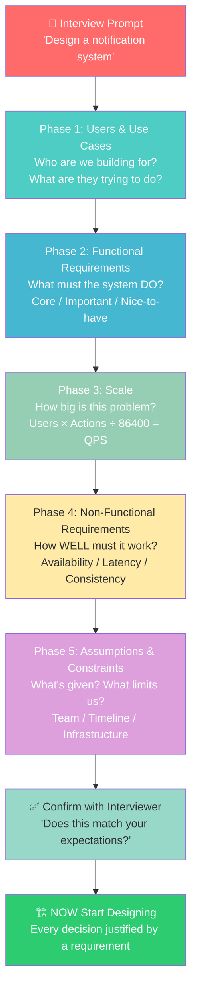
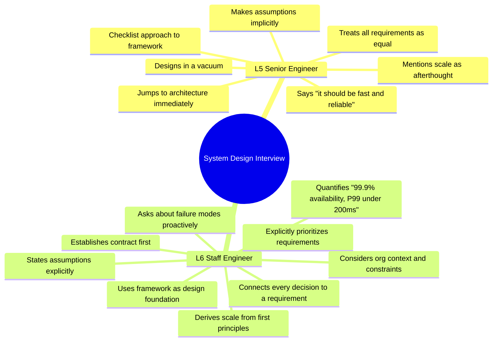
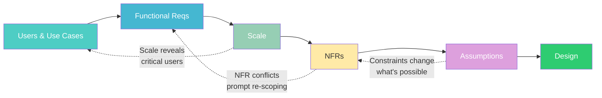
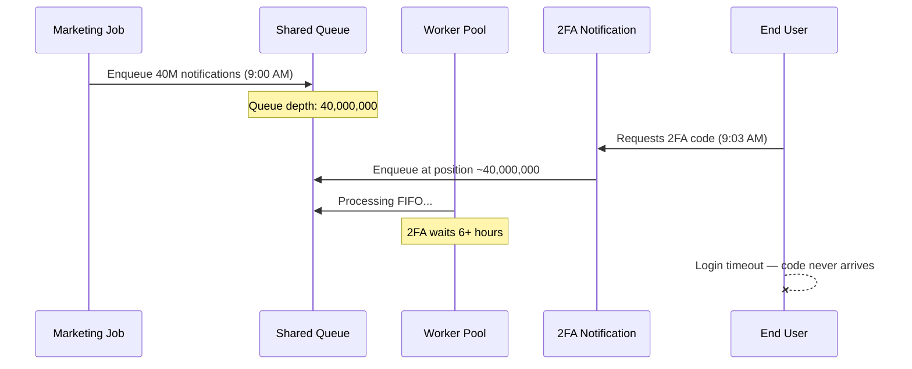
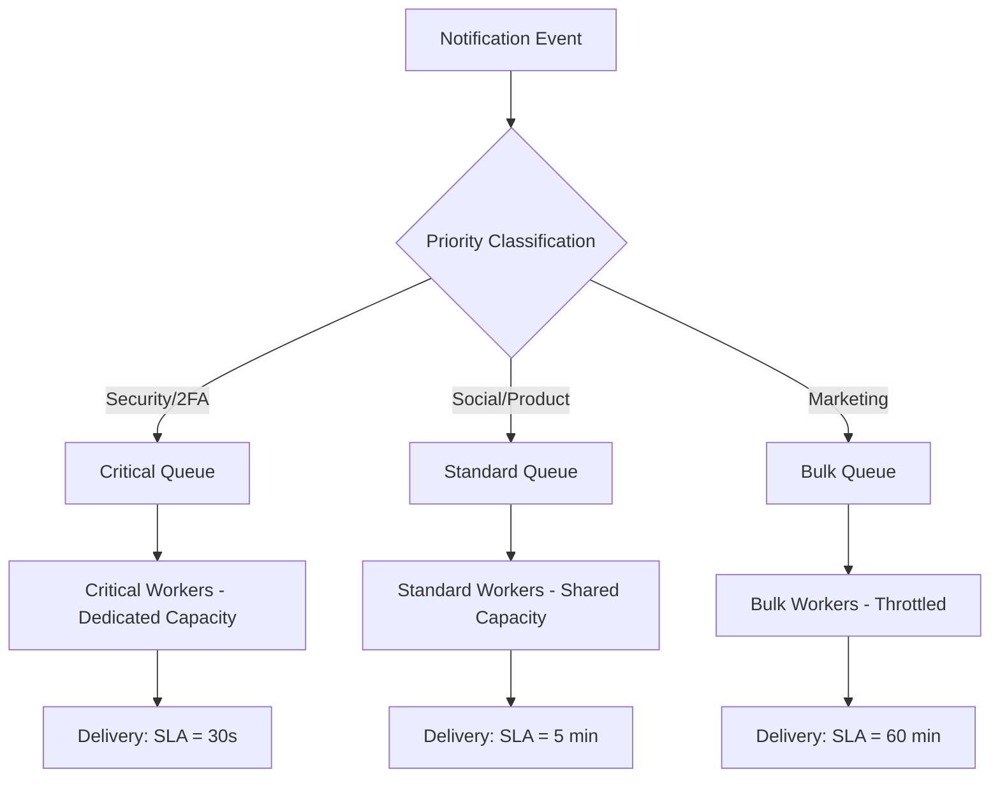

# Chapter 13: System Design Framework — Simplified Deep Dive

> **Who this is for:** A recent college graduate preparing for Google Staff Engineer (L6) system design interviews. You know how to code. You may have built things. But you have not yet internalized the *discipline* of how Staff engineers approach a new design problem. This chapter teaches that discipline from scratch.

---

## Chapter at a Glance

```
╔═══════════════════════════════════════════════════════════════════════════════╗
║            CHAPTER 13 — SYSTEM DESIGN FRAMEWORK AT A GLANCE                   ║
╠═══════════════════════════════════════════════════════════════════════════════╣
║                                                                               ║
║  CORE IDEA: Establish the contract BEFORE designing. Every design decision   ║
║  must trace back to a requirement established in the 5 phases.               ║
║                                                                               ║
║  THE 5 PHASES (always in this order):                                         ║
║  1. Users & Use Cases        → Who? What are they trying to DO?               ║
║  2. Functional Requirements  → What must the system DO?                       ║
║  3. Scale                    → How big? QPS = DAU × actions ÷ 86,400         ║
║  4. Non-Functional Reqs      → How well? Availability / Latency / Consistency ║
║  5. Assumptions & Constraints → What is given? What limits us?               ║
║                                                                               ║
║  L5 vs L6 IN ONE SENTENCE:                                                    ║
║  L5 jumps to architecture. L6 establishes the contract first.                ║
║                                                                               ║
║  THE QUESTION TO ASK AT THE END OF EVERY PHASE:                              ║
║  "Does this match what you had in mind before I continue?"                    ║
║                                                                               ║
║  FAILURE REQUIREMENT (L6 adds this to every phase):                          ║
║  "What is the acceptable user experience when this feature is degraded?"      ║
║                                                                               ║
╚═══════════════════════════════════════════════════════════════════════════════╝
```

---

## Quick Visual: L5 vs L6 — The Comparison That Matters

| Dimension | L5 (Senior) | L6 (Staff) |
|-----------|-------------|------------|
| **Starting point** | Jumps to architecture immediately | Establishes context through 5 phases first |
| **User discovery** | "Users are people who use the system" | Identifies external, internal, and system users separately |
| **Requirements** | Treats all features as equal priority | Explicitly categorises: core / important / nice-to-have |
| **Scale** | "We need to handle a lot of traffic" | "30M DAU × 20 actions ÷ 86,400 = 7K QPS. Peak at 3× = 21K" |
| **NFRs** | "It should be fast and reliable" | "99.9% availability, P99 < 200ms, eventual consistency OK for feeds" |
| **Assumptions** | Implicit — problems found during design | Listed explicitly and confirmed: "Please correct me if any are wrong" |
| **Failure thinking** | Designs for the happy path only | "What is the user experience when this component is down?" |
| **Decision justification** | "I'll use Kafka for the queue" | "Kafka because our durability requirement needs replay — stated in Phase 4" |
| **Scope** | Keeps adding features mid-design | Sets explicit scope, states what is out, confirms alignment |
| **Trade-offs** | Makes choices silently | Names both options, states what is being traded and why |

---

## Visual Overview: The 5-Phase Framework at a Glance



---

## Visual Overview: L5 vs L6 Thinking Side by Side



---

## Section 1: Learning Goal — What You Can DO After Reading This

After reading this chapter, you will be able to:

1. Walk into any system design interview and know exactly what to do in the first ten minutes — without panicking or winging it.
2. Ask the five categories of questions that establish context before you design anything.
3. Explain why each question category exists and what breaks when you skip it.
4. Do quick back-of-envelope math to estimate scale and state it in numbers — not vague words.
5. Distinguish between what a Senior (L5) engineer does and what a Staff (L6) engineer does at each phase.
6. Trace every design decision back to a specific requirement — so you can defend it.
7. Show two contrasting interview transcripts in your head: one structured, one not — and know which one gets the offer.
8. Apply the framework to at least three different types of problems (notifications, payments, search) and see how it generalizes.

This is not just interview prep. This is how Staff engineers think on the job at Google, Amazon, Meta, and every other top-tier company. Learn this framework and you change how you think about every system — not just interview problems.

---

## Section 2: Why This Matters — Real Interview and Production Impact

### 2.1 The Two Ways Candidates Fail System Design Interviews

There are two ways to fail a system design interview. Most candidates know about one of them. Very few know about the other.

**Failure Mode 1 — Not knowing enough**: You don't know what a message queue is. You don't know how databases handle concurrent writes. You don't know what a CDN does. This is knowledge-gap failure. It is fixable by studying.

**Failure Mode 2 — Not knowing what to do with what you know**: You know all the components. You've built systems before. But when given a vague prompt like "design a notification system," you panic, jump to drawing boxes, and produce something that doesn't fit the actual problem. This is process-gap failure. It is the more common failure for experienced engineers. It is what this chapter fixes.

The framework in this chapter addresses Failure Mode 2 completely.

### 2.2 Why Interviewers Care About Process, Not Just Output

A Google system design interviewer is not checking whether your final architecture is exactly what Google uses. They are checking whether you would be safe to hand a large, ambiguous project to.

Think about what a Staff engineer actually does on the job. They don't get handed a complete spec. They get handed a vague goal: "We need to make notifications faster" or "Users are complaining about slow feeds." Then they have to figure out:
- What does "faster" actually mean? Faster for whom? Measured how?
- What's causing the slowness right now?
- What scale are we actually at?
- What resources do we have?
- What's the right trade-off between fast delivery and cost?

An interviewer simulates this. They give you a vague prompt on purpose. The first ten minutes of your interview is the test of whether you know how to turn vague into concrete. If you skip that and jump to architecture, you are showing them that in real work you would also skip that step — and build the wrong thing.

### 2.3 What Goes Wrong in Production When You Skip This

Here is a real pattern seen repeatedly in production systems. An engineer gets a project. They are excited. They start designing. Six months later, the system launches. Within a week:

- Performance is terrible because the scale estimate was wrong by 10x.
- A critical feature is missing because no one explicitly agreed on requirements.
- The system fails in an obvious way under load because no one discussed failure modes.
- The team is stuck because the design painted them into a corner that wasn't justified by any actual requirement.

Every one of these failures maps to a skipped phase in the framework. The framework is not a bureaucratic ritual. It is a protection against these very concrete disasters.

### 2.4 L5 vs L6 — The Interview-Level Difference

Here is the clearest way to understand what separates L5 from L6 behavior in a system design interview:

**L5 engineers build systems.**
**L6 engineers build the right system for the specific context.**

The word "right" here means: sized correctly, scoped correctly, quality-leveled correctly, and justified clearly. None of that is possible without understanding context first. The framework is the tool for establishing context.

---

## Section 3: Core Concepts — Everything You Need to Know

### 3.1 What the Framework Is

The System Design Framework is a five-phase structure for gathering information before you design anything. Think of it as a conversation you have with the interviewer (or with a product manager in real work) to answer five fundamental questions:

1. **Who is this system for, and what do they need to do?** (Users and Use Cases)
2. **What must the system actually do?** (Functional Requirements)
3. **How big is this problem?** (Scale)
4. **How well must the system do it?** (Non-Functional Requirements)
5. **What are we taking for granted, and what limits us?** (Assumptions and Constraints)

These five questions, answered in order, give you everything you need to make good design decisions. Without them, you are guessing.

### 3.2 Why Having a Framework Matters

Imagine you are an architect asked to design a building. If you just start drawing walls, you will make decisions that turn out to be wrong:
- You draw a 10-story residential building, but the client wanted a 2-story retail space.
- You design for a warm climate, but the building is in Minnesota.
- You put the parking underground, but the site has a high water table.

Every one of these mistakes would have been caught by asking the right questions first. The framework is that set of questions for system design.

Here is the key insight: **a framework gives you confidence under pressure.** When an interviewer says "design a ride-sharing app," a person without a framework feels panic. A person with a framework feels calm. They know exactly what to do next — start Phase 1, ask about users.

### 3.3 The Framework as a Contract

This is the mental model that makes the framework click for most people.

Before you design, you are negotiating a contract with the interviewer. The contract says: "We agree that we are building [this] for [these users], at [this scale], with [these quality requirements], under [these constraints]."

Once both of you sign that contract, you can design. If you don't establish the contract first, you might design something the interviewer never intended. And even if your design is brilliant, it doesn't fit the problem — which means it's wrong.

Staff engineers at Google call this "alignment before architecture." In real projects, it's the difference between a design review that goes smoothly and one where someone says "Wait, why did you design it this way? That's not what we needed."

### 3.3.1 The Framework Flow Visualized

The five phases are sequential but also iterative. You complete them in order, but each phase can surface information that sends you back to refine an earlier phase.



For example: You state requirements in Phase 2. Then in Phase 3, scale calculations reveal that the fan-out problem for celebrity users is extreme. That forces you back to Phase 1 to add "celebrity users" as a distinct user type, which then changes Phase 2 (you add a priority queue requirement for different user tiers). The framework is a loop, not just a checklist.

### 3.4 Phase 1 — Users and Use Cases

#### What It Is

"Users" means every person or system that interacts with what you're building. "Use cases" means every significant thing they're trying to accomplish.

#### Why This Phase Exists

If you skip this phase, you design for the wrong person. And because different users need different things from the same system, designing for the wrong user produces the wrong architecture.

**Concrete failure example:** A team designed a notification system. They thought about "users" as the people receiving notifications. They didn't think about the system-level services that send notifications. So their API was designed for human interactions — small payloads, manual triggers. When other services tried to use it programmatically to send millions of notifications per hour, it fell over. The whole system needed to be redesigned.

They skipped Phase 1. They assumed one user type when there were really three.

#### How to Execute This Phase

Start by identifying every distinct type of user or actor in the system. For most systems, there are more than you think.

Think in three rings:
- **External users** — the people your product is built for
- **Internal users** — operations staff, customer support, data scientists
- **System users** — other services, APIs, automated processes

Then for each user, ask: what are their primary goals? What does success look like for them?

**Example — Notification System:**

Ring 1 (external): End users receiving push notifications on their phone
Ring 2 (internal): Operations team monitoring delivery rates, customer support resolving "I didn't get my notification" tickets
Ring 3 (system): The post service, the like service, the comment service — all of which generate events that become notifications

Each of these users has different needs. If you only design for Ring 1, you miss the requirements of Ring 2 and Ring 3, and the system will fail to serve them.

#### The Job-To-Be-Done Lens

Instead of asking "what features do users want?", ask "what job is the user hiring this system to do?"

This is a more powerful framing. A person using a notification system isn't hiring it to "receive notifications." They're hiring it to "stay informed about things I care about, without being overwhelmed by things I don't care about."

That reframing immediately surfaces requirements that the simpler framing misses: preference management, rate limiting, smart aggregation ("5 people liked your post" instead of 5 separate notifications).

#### Common Mistakes in Phase 1

**Mistake: Assuming a single homogeneous user**
Every large system serves multiple user types. Always ask "who else?"

**Mistake: Only considering happy-path use cases**
Users also need to cancel, undo, recover, and handle errors. "User wants to stop receiving notifications" is a use case too. And it drives major design decisions (preference storage, immediate propagation).

**Mistake: Not quantifying behavior**
"Users receive notifications" is less useful than "Users receive approximately 20 notifications per day, open about 30% of them within 5 minutes, and mute notifications after receiving 10+ in an hour." Numbers shape design.

**Mistake: Ignoring power users and edge cases**
A celebrity account with 10 million followers is a user too. Their behavior is 10,000x more impactful than a regular user. Not accounting for them causes production incidents.

#### L5 vs L6 Dialogue — Phase 1

L5: "Who are the users? Users who want to receive notifications."

L6: "Let me think about users carefully. I see at least three types. First, the end users — the people receiving notifications on their phones. They care about relevance, speed, and not being spammed. Second, internal users — operations staff who need to see delivery health dashboards, and customer support who needs to look up 'why did user X not get notification Y.' Third, system users — the post service, like service, and friend-request service that all generate events that need to turn into notifications. Each of these has very different needs. Did I miss any?"

The L6 answer takes 60 seconds longer. It surfaces requirements the L5 answer misses completely. The interviewer notes the difference immediately.

### 3.5 Phase 2 — Functional Requirements

#### What It Is

Functional requirements describe what the system must do. These are the capabilities, behaviors, and features that define its purpose.

#### Why This Phase Exists

Without explicit functional requirements, two things go wrong:

**Problem 1 — Scope creep:** You design without a clear boundary. The interviewer (or PM) keeps adding things. You keep expanding. Forty-five minutes in, you've designed 30% of everything and 100% of nothing.

**Problem 2 — Wrong priority:** You spend time on a nice-to-have feature while missing a must-have one. Or you design the entire analytics system in detail while only sketching the core delivery path.

The functional requirements phase establishes scope and priority explicitly. It gives you permission to focus.

#### The Three Buckets

Every requirement belongs in one of three buckets:

**Core** — The system literally does not function without this. If you don't build it, there is no product.
Example for notifications: "Users can send notifications" and "Users can receive notifications."

**Important** — The system works without this, but it's significantly less useful or won't meet user expectations.
Example for notifications: "Users can set preferences to mute certain notification types."

**Nice-to-have** — Valuable but can be added in a later version without impacting the core product.
Example for notifications: "Analytics on notification open rates."

When you state your scope to the interviewer, you say: "I'm going to design the core requirements in detail. I'll acknowledge the important ones and show how the architecture supports them, but I won't design them fully. I'll mention the nice-to-haves without spending time on them. Does that work?"

This shows prioritization. It shows you understand that time is finite. It shows L6 thinking.

#### How to Execute This Phase

**Step 1 — Enumerate requirements from use cases**

For each use case you identified in Phase 1, ask: "What must the system do to support this use case?"

Use case: "User receives a push notification when someone likes their post"
→ System must accept an event (someone liked a post)
→ System must look up the post owner
→ System must look up the post owner's notification preferences
→ System must look up the post owner's device tokens
→ System must send a push notification to those devices
→ System must store the notification in history

Each arrow becomes a functional requirement.

**Step 2 — Prioritize into the three buckets**

Go through your list and ask "If we couldn't do this on day one, would the product still make sense?" If no — it's core. If yes but barely — it's important. If yes easily — it's nice-to-have.

**Step 3 — Define scope explicitly**

State what's in scope and what's not. "I'm not designing the email or SMS sending infrastructure — I'll assume we use third-party providers like SendGrid and Twilio. I'm not designing the auth system — that's an existing service. Does that scope work?"

**Step 4 — Confirm with the interviewer**

Always end with "Does this scope match what you had in mind?" The interviewer may say yes. They may add something you missed. Either way, you're now aligned.

#### Example Application — URL Shortener

**Prompt:** "Design a URL shortening service."

**L6 approach:**

"Let me enumerate functional requirements from our use cases:

Core:
1. User provides a long URL, system returns a short URL
2. When someone visits the short URL, they are redirected to the long URL

Important:
3. User can choose a custom short code (vanity URL)
4. Short URLs can have an expiration date
5. Creator can view click count for their URLs

Nice-to-have:
6. Click analytics (device type, location, referrer)
7. QR code generation
8. Batch URL shortening via API

Out of scope for this design:
- User authentication (I'll assume it exists)
- Billing or usage limits
- URL safety checking (malware, phishing)

For the design session, I'll focus on core requirements 1 and 2, show how the data model supports 3-5, and acknowledge 6-8 without designing them. Does that scope work for you?"

This took 2 minutes. It established complete alignment. The interviewer now knows exactly what to evaluate.

#### Common Mistakes in Phase 2

**Mistake: Being too vague**
"The system should handle notifications" is not a requirement. It's a description of a category. A requirement is specific and verifiable: "When user A likes user B's post, user B receives a push notification within 5 seconds."

**Mistake: Treating every feature as equally important**
This leads to designing 10% of everything instead of 100% of the important parts. Prioritize. The interviewer wants to see you prioritize.

**Mistake: Confusing functional with non-functional**
"The system must be fast" is NOT a functional requirement. It says nothing about what the system does — only about how well it does it. That belongs in Phase 4.
"Users can retrieve their last 100 notifications" IS a functional requirement.

**Mistake: Not scoping out-of-scope items explicitly**
If you don't say "auth is out of scope," the interviewer might assume you forgot about it. Always state what you're explicitly not building.

#### L5 vs L6 Dialogue — Phase 2

L5: "We need to be able to send notifications, manage preferences, track delivery status, show history, and provide analytics."

L6: "Let me prioritize the functional requirements. Core — which means without this there's no product: send notifications and receive them. Important — which means the product works but isn't great without it: user preferences and notification history. Nice-to-have: analytics, A/B testing for notification content. For this session, I'm designing core in full, acknowledging important at the data model level, and not spending time on nice-to-haves unless you'd like me to. I'm also scoping out authentication, email/SMS infrastructure, and content moderation — I'll assume those are handled by other services. Does this scope work?"

The L6 answer explicitly categorizes, explicitly scopes, and explicitly confirms. It takes 90 seconds. It prevents 20 minutes of wasted design work.

### 3.6 Phase 3 — Scale

#### What It Is

Scale is how big the problem is. It puts real numbers on the load, data volume, and request rate the system must handle.

#### Why This Phase Exists

Scale is the single biggest factor in system architecture. This is not an exaggeration. The same problem at different scales requires fundamentally different solutions.

**Concrete example:**

Notification system for 1,000 users:
- Send notification → write to database → push to device
- A single server, a single database
- Works fine

Notification system for 100 million users:
- 7,000 notifications/second average, 70,000/second at peak
- A single database can't handle the write rate
- A single server can't handle the connection count
- A naive fan-out algorithm (one user likes a celebrity post → 10 million notifications) will crash the system
- You need message queues, distributed processing, sharded storage, priority lanes, and rate limiting

These are not the same architecture. They share some concepts, but the scale changes everything about how you implement them. If you skip Phase 3 and assume some vague "high scale," you will either over-engineer (adding complexity for scale you don't need) or under-engineer (building something that falls over at real load).

#### How to Execute This Phase

**Step 1 — Get the numbers if the interviewer has them**

"What scale are we designing for? How many daily active users? What's the expected request rate?"

If they give you numbers, use them. Write them down.

**Step 2 — Estimate from first principles if they don't**

This is a critical L6 skill. You should be able to estimate scale from a product description.

The formula is:
```
QPS = (Number of users who perform this action per day) / 86,400 seconds per day
```
(A useful shortcut: divide by 100,000 instead of 86,400 to get a conservative, round number)

Peak = Average × 10 (use this as your default safety factor)

**Step 3 — Calculate storage**

```
Storage = (Number of items stored) × (Size per item) × (Retention period)
```

**Step 4 — Use the numbers to drive decisions**

This is the step most L5 engineers skip. It's the most important part.

Don't just list the numbers. Say: "At 7,000 writes/second, a single relational database can't sustain this — typical PostgreSQL handles 5,000-20,000 simple inserts/second. So the write path needs to be horizontally scalable. I'll introduce a message queue to buffer writes."

Connect the number to the consequence. That's L6 thinking.

#### Back-of-Envelope Cheat Sheet

You need to know these numbers cold. Practice them until they're automatic.

**Time conversions:**
- 1 day = 86,400 seconds (round to 100,000 for quick math)
- 1 month ≈ 2.5 million seconds
- 1 year ≈ 30 million seconds

**Storage units:**
- 1 KB = 1,000 bytes (a short text message, a small JSON object)
- 1 MB = 1,000 KB (a photo, a minute of audio)
- 1 GB = 1,000 MB (a feature-length video, a large dataset)
- 1 TB = 1,000 GB
- 1 PB = 1,000 TB (Google-scale storage)

**Capacity rules of thumb:**
- Single server: handles 10,000 to 100,000 simple requests/second
- Single database: handles 5,000 to 50,000 queries/second (depends on query complexity)
- Redis: handles 100,000+ operations/second
- Kafka: handles 1 million+ messages/second per cluster

**Quick formulas:**
```
QPS (average) = Daily actions / 100,000
QPS (peak) = Average QPS × 10
Storage needed = Item count × Item size × Retention days
Bandwidth = QPS × Response size
```

#### Scale Example — WhatsApp-Scale Messaging

**Prompt:** "Design a messaging system."

**L6 scale estimation:**

"Let me figure out the scale. I'll assume a WhatsApp-like product.

Users: 500 million registered users, 200 million daily active.

Message volume: The average WhatsApp user sends about 50 messages per day and receives about 100.
- Sent: 200M × 50 = 10 billion messages/day
- That's 10B / 86,400 ≈ 115,000 messages/second average
- Peak (evenings, holidays): 3x to 5x, so let's design for 500,000 messages/second

Storage: Average message is about 200 bytes of text. With metadata, call it 1 KB.
- 10 billion messages/day × 1 KB = 10 TB/day new data
- Keeping messages for 1 year: 365 × 10 TB = 3.65 PB
- We need distributed, horizontally scalable storage from day one

Connections: Real-time messaging requires persistent connections (WebSocket or long poll).
- 200 million active users means up to 200 million concurrent connections at peak
- A single server can hold about 100,000 connections
- We need at minimum 2,000 connection servers, probably 10,000 for redundancy and geo-distribution

What this tells me architecturally: this is a massive scale problem that requires distributed systems at every layer — message ingestion, storage, delivery, and connection management. I cannot use a simple request/response API. I need to design for async delivery and massive connection counts."

This analysis took 3 minutes. It tells the interviewer you can size a problem correctly. And it tells you what architectural constraints you're working under before you draw a single box.

#### The "First Bottleneck" Mental Model

Staff engineers don't just think about current scale. They think about what breaks first as the system grows.

| Growth Stage | Typical First Bottleneck | Why It Breaks First |
|---|---|---|
| 1K → 10K users | Single database connection pool | Read and write contention before anything else |
| 10K → 100K users | Latency for distant users | Users far from the datacenter see bad P99 |
| 100K → 1M users | Fan-out events (celebrity posts, viral content) | One event generating millions of work items overwhelms queues |
| 1M → 10M users | Storage cost and bandwidth | Data volume grows faster than budget |
| 10M+ users | Operational complexity | Team can't maintain the system; incidents increase |

In an interview, you demonstrate L6 thinking by saying: "At 7K QPS, the write path is my first bottleneck — a single database can't sustain this. But as we grow to 70K QPS, the celebrity fan-out problem becomes my next bottleneck. I'll design the write path for horizontal scale now, and I'll design the fan-out handling in a way that can be extended without a rewrite."

#### Common Mistakes in Phase 3

**Mistake: Not asking about scale at all**
You simply don't know if you're designing for a startup or for Google. Architecture depends entirely on this. Ask.

**Mistake: Assuming "web scale" without justification**
"We need to handle millions of requests per second" sounds impressive. But it's meaningless without derivation. Show your math. Derive the number from user behavior.

**Mistake: Treating scale as decoration, not as a driver**
You calculate 7,000 QPS and then don't mention it again. L6 is about connecting the number to the consequence: "7K QPS means X, which means the architecture needs Y."

**Mistake: Forgetting about data scale**
Request volume is obvious. But what about data volume? A system that stores 10 TB/day has different infrastructure than one that stores 10 GB/day. Both might have similar QPS.

**Mistake: Ignoring growth trajectory**
Current scale is fine. But what happens in 6 months? In 2 years? Designing for current scale with no headroom means an emergency redesign in a year.

### 3.7 Phase 4 — Non-Functional Requirements

#### What It Is

Non-functional requirements (NFRs) describe the qualities the system must have. Functional requirements say what the system does. Non-functional requirements say how well it does it.

The key NFR dimensions are:
- **Availability** — What percentage of time must the system work?
- **Latency** — How fast must responses be?
- **Durability** — Can data ever be lost?
- **Consistency** — Do all users see the same data at the same time?
- **Security** — How is access controlled and data protected?
- **Observability** — How do we know when the system is unhealthy?

#### Why This Phase Exists

NFRs drive architecture more than functional requirements do. Two systems with identical functional requirements but different NFRs can have completely different architectures.

**Concrete example:**

System A — Social notification system:
- Availability: 99.9% (8 hours downtime/year)
- Latency: Deliver within 5 seconds P95
- Durability: Best-effort — some loss acceptable
- Consistency: Eventual — doesn't matter if "read" status is stale for a few seconds

Architecture: Simple message queue, async processing, async replication, no transaction overhead. A few hundred dollars a day to run.

System B — Financial transaction notification:
- Availability: 99.99% (52 minutes downtime/year)
- Latency: Deliver within 500ms P99
- Durability: Never lose a notification — these are legal records
- Consistency: Strong — if a transaction notification is sent, it must be immediately visible everywhere

Architecture: Multi-region active-active, synchronous replication, ACID transactions, dedicated capacity lanes, 24/7 on-call. A few thousand dollars a day to run.

Same functional requirement ("send a notification"). Completely different systems because NFRs differ. Skipping Phase 4 means you don't know which system you're building.

#### Availability in Depth

**Availability** is expressed as a percentage of time the system is operational.

| Availability | Downtime per Year | Downtime per Month | What This Requires |
|---|---|---|---|
| 99% | 3.65 days | 7.2 hours | Simple architecture, single region OK |
| 99.9% | 8.76 hours | 43.8 minutes | Redundancy at every layer |
| 99.99% | 52.6 minutes | 4.4 minutes | Automated failover, health checks, no manual steps |
| 99.999% | 5.26 minutes | 26 seconds | Extreme engineering, geographic distribution, zero-downtime deploys |

Notice that each additional "9" is about 10x harder than the previous one. Going from 99% to 99.9% is hard. Going from 99.9% to 99.99% requires a completely different operations model.

In an interview, when you say "high availability," you must follow it with a specific target. "I'm targeting 99.9% availability, which means 8 hours of downtime per year. To achieve this, I need redundancy at every layer and automated failover so no single component failure causes an outage."

#### Latency in Depth

**Latency** is how fast the system responds. You should think about it in two numbers:

- **P50 (median)**: The latency that 50% of requests are faster than. This is the "typical" experience.
- **P99**: The latency that 99% of requests are faster than. This represents the "worst case" most users experience. This number is usually 5-10x the P50.

For example, if P50 is 20ms and P99 is 200ms, it means most requests are very fast, but 1% of requests (which might be thousands per second at scale) take 200ms or more.

Why does P99 matter? Because if you have 1 million requests per second and your P99 is 200ms, then 10,000 requests per second are slow. At that scale, "1% of requests" is a huge number of users.

L6 thinking: "What's the latency budget for each operation, and is that achievable given the scale? If P99 must be under 100ms and I have 10 database lookups on the critical path, each lookup has a 10ms budget. At 100K QPS, can my database sustain those lookups within that budget? Probably not — I need caching."

#### Durability in Depth

**Durability** means data is not lost once written. A system with high durability ensures that if you write data and the system confirms it, that data will survive machine failures, power outages, and software bugs.

Durability is usually expressed in "nines" just like availability:
- 99.9% durable: lose roughly 1 in 1,000 records in a catastrophic event
- 99.999999999% (11 nines) durable: essentially never lose data — this is the standard for services like AWS S3

For notifications: "Can we lose a notification?" For social likes notifications — maybe. Missing one is annoying but not harmful. For 2FA codes — absolutely not. Losing a 2FA message prevents a user from logging in. The system design for each is very different.

#### Consistency in Depth

**Consistency** means all users see the same data at the same time. In distributed systems, this is hard because data is stored on multiple machines. Two machines can temporarily disagree about the state of the data.

The main options are:

**Strong consistency**: Every read returns the most recently written value. If User A writes "notification read," User B immediately sees it as read. This is safe but requires coordination — and coordination adds latency and reduces availability.

**Eventual consistency**: All machines will eventually agree, but might temporarily disagree. If User A marks a notification as read on their iPhone, their iPad might still show it as unread for 2-3 seconds. This is fine for many use cases and much simpler to implement at scale.

**The key question**: For each data type in your system, ask "Does it matter if two users see different values for a few seconds?" If no — eventual consistency is fine. If yes — you need strong consistency, and you must be ready to pay the cost in latency and complexity.

#### The CAP Theorem — Simplified

The CAP theorem says that in a distributed system, you can have at most two of these three properties simultaneously:

- **C**onsistency: All nodes see the same data
- **A**vailability: Every request gets a response (not an error)
- **P**artition tolerance: The system keeps working even if network messages are lost

The catch: in a real distributed system, network partitions (messages getting lost or delayed between machines) happen regularly. You can't choose to not have partition tolerance — it's forced on you. So the real choice is:

**CP** (Consistency + Partition Tolerance): When there's a network partition, the system refuses to serve reads/writes rather than risk returning stale data. It is consistent but not always available.

**AP** (Availability + Partition Tolerance): When there's a network partition, the system keeps serving requests, but might return stale data. It is available but not always consistent.

For a notification system: AP is almost always the right choice. It's better to show a notification a few seconds late (eventual consistency) than to fail to show it at all (choosing consistency over availability).

For a payment system: CP might be required. It's better to return an error than to process a transaction twice (choosing consistency over availability).

In interviews: "I'm choosing eventual consistency here because our availability requirement (99.9%) and user tolerance for slightly stale notification state supports it. The alternative — strong consistency — would require synchronous replication across all replicas, adding 20-50ms to every write and significantly complicating the architecture."

#### Security and Compliance

Security NFRs are often the most underspecified and the most dangerous to ignore.

Ask about:
- **Authentication**: Who is allowed to call this API? Users? Services? How do we verify identity?
- **Authorization**: What is each caller allowed to do? Can any user see any other user's notifications?
- **Data at rest**: Is data encrypted on disk?
- **Data in transit**: Is data encrypted over the network (TLS)?
- **Compliance**: Does the data fall under GDPR (EU user data), HIPAA (health data), or PCI-DSS (payment card data)? These regulations mandate specific technical controls.

Trust boundaries are a Staff-level concept: "Where does the trust level change in my system? Requests from users are untrusted. Requests from internal services are semi-trusted. Requests that have passed auth are trusted." Each boundary needs appropriate validation.

#### Observability

Observability is how you know what's happening in your system — especially when things go wrong. Staff engineers think about this proactively.

The three pillars of observability:
- **Metrics**: Numerical time-series data. "Number of notifications delivered per second." "P99 latency of the delivery service."
- **Logs**: Text records of events. "Notification ID 12345 delivered to device token ABC123 at time T."
- **Traces**: End-to-end records of a single request passing through multiple services. "This notification started at service A at T=0, entered queue B at T=10ms, was processed by worker C at T=250ms, delivered to device at T=1.2s."

In an interview, demonstrate observability thinking: "I want to make sure this system is observable. Key metrics: notifications ingested per second, notifications delivered per second (broken down by type), delivery latency P50/P99, queue depth, dead letter queue size. Key alerts: queue depth rising (indicates processing slowdown), dead letter queue growing (indicates delivery failures), delivery latency P99 exceeding SLA."

This shows operational maturity — a clear L6 signal.

#### Common Mistakes in Phase 4

**Mistake: Using vague language**
"High availability" and "low latency" are not requirements. They are wishes. A requirement is specific and measurable: "99.9% availability measured monthly" and "P99 latency under 200ms for API calls."

**Mistake: Asking for everything at maximum**
"We need high availability AND strong consistency AND ultra-low latency AND perfect durability AND low cost." This is physically impossible. These properties trade off. Identifying the trade-offs and asking which one wins is the L6 move.

**Mistake: Skipping security and compliance**
These aren't boring. They fundamentally change architecture. A system that must comply with HIPAA cannot store health data in the same place as non-health data. A PCI-DSS system has strict controls on who can access payment data. Skipping this phase means designing a system that can't actually be deployed in the real world.

**Mistake: Designing for maximum quality everywhere**
An internal debugging dashboard does not need 99.99% availability. A social feed does not need strong consistency. Match your quality targets to actual user impact.

#### L5 vs L6 Dialogue — Phase 4

L5: "Should the system be highly available? Yes. Fast? Yes. Reliable? Yes."

L6: "Let me think through the non-functional requirements specifically. For availability: for a social notification system, I'd target 99.9% — 8 hours of downtime per year. Missing social notifications is annoying but not catastrophic, so 99.99% is overkill and expensive. For latency: I'd target 5-second delivery P95 for push notifications. In-app history retrieval should be under 200ms P99 — users are waiting for that. For durability: social notifications are best-effort. I would not want to lose them routinely, but occasional loss during extreme failures is acceptable. For financial or security notifications, that would be different. For consistency: eventual consistency is fine. If it takes 3 seconds for 'read' status to sync across devices, users won't notice. For security: notifications can contain user-generated content, so TLS in transit, encryption at rest, and per-user access control. No user should see another user's notifications. Is there a compliance requirement I should know about?"

The L6 answer takes 3 minutes. It prevents designing the wrong system. It shows the interviewer you understand trade-offs, not just properties.

### 3.8 Phase 5 — Assumptions and Constraints

#### What It Is

**Assumptions** are things you believe to be true that you're not explicitly designing for.
Example: "I assume we have working authentication infrastructure."

**Constraints** are limits you must operate within.
Example: "The team has 3 engineers and a 3-month timeline."

#### Why This Phase Exists

Systems do not exist in isolation. They exist within organizations, with existing infrastructure, teams with specific skills, budgets, timelines, and regulatory environments. Ignoring this context produces technically correct but practically useless designs.

**Concrete failure example:** An engineer designed a beautiful recommendation system using the latest deep learning techniques. It was architecturally elegant. The problem: the team had no ML engineering expertise, no GPU infrastructure, and a 2-month launch deadline. The design was technically correct and completely impractical.

They skipped Phase 5. They designed in a vacuum without considering team skills or timeline.

A Staff engineer would have asked: "Do we have ML expertise on the team? Do we have GPU infrastructure? Is there a launch deadline?" And then designed accordingly — perhaps starting with a simpler collaborative filtering approach that the team could actually build and maintain.

#### How to Execute This Phase

**State your assumptions explicitly:**

"I'm going to make a few assumptions and I want to flag them so you can correct me if they're wrong:
1. We have existing authentication and authorization services I can integrate with rather than build
2. We're operating on cloud infrastructure — I'll use AWS as a reference
3. We have existing monitoring and logging infrastructure
4. Other services can publish events to a message bus for us to consume
5. The notification channels (push notification services, email, SMS) are handled by third-party providers"

Each assumption narrows your scope to what matters. Without stating them, the interviewer doesn't know if you forgot about authentication or if you're correctly assuming it's out of scope.

**Probe for constraints:**

"Are there constraints I should design around? Specifically:
- Are there technology mandates — must we use specific technologies or avoid others?
- Are there existing systems I must integrate with?
- What's the team size and experience level?
- Is there a launch timeline?
- Is there a budget constraint on infrastructure?
- Are there cross-team dependencies — other teams whose work we depend on or who depend on ours?"

**Treat cost as a first-class constraint:**

Staff engineers treat cost as a real constraint, not an afterthought. At scale, infrastructure cost can become the primary constraint — before latency and availability.

| System Type | Dominant Cost Driver | Why It Grows Fast |
|---|---|---|
| Notification / messaging | Fan-out compute + storage | Every notification triggers N deliveries; history grows continuously |
| Feed / recommendation | Compute (ML inference) | Real-time scoring at millions of requests/second |
| Media / CDN | Egress bandwidth | Data transfer scales with users and region count |
| Search / indexing | Storage + compute | Index builds and storage at petabyte scale |
| Payment / transaction | Durability + consistency overhead | Multi-region replication has fixed cost per transaction |

In an interview: "What's the infrastructure cost budget? At 70K notifications/second with 1-year retention, I estimate roughly 200TB of storage and significant compute for fan-out processing. If cost is constrained, I'd consider tiered storage (90 days hot, then cold), aggregating low-priority notifications to reduce count, and moving analytics off the critical path. If cost is not constrained, I'd prioritize reliability and optimize cost later."

**Consider cross-team and organizational impact:**

This is a uniquely L6 consideration. Staff engineers don't just think about their system in isolation — they think about how their design affects other teams.

Questions to ask:
- "Which teams depend on my API? Do I need backward compatibility or versioning?"
- "Which teams do I depend on for launch? What's their readiness?"
- "If I change my data model, who must migrate?"
- "Does my design create operational burden for other teams?"

In a notification system: "If I require all event producers (post service, like service, comment service) to adopt a new event format, I'm creating a cross-team dependency. Their teams need to plan and execute a migration. My design should either accept both old and new formats during a transition period, or I should quantify the org-wide coordination cost and make sure the benefit justifies it."

#### Common Mistakes in Phase 5

**Mistake: Making assumptions implicitly**
If you assume authentication is handled by another service but don't say so, the interviewer might think you forgot about it. Explicit assumptions are discussable; implicit ones create confusion.

**Mistake: Ignoring organizational constraints**
The best distributed system in the world is wrong if the team has 3 engineers who've never run Kubernetes. Match design complexity to team capacity.

**Mistake: Treating all constraints as fixed**
Ask: "Is this constraint firm?" Sometimes a 2-month deadline is negotiable if you can show why 4 months produces a dramatically better outcome. Sometimes it's not negotiable. Knowing the difference helps you make better trade-offs.

**Mistake: Forgetting to revisit assumptions**
Assumptions made at the start might not hold as the design evolves. Check back: "Earlier I assumed eventual consistency was fine — given what we've discussed about financial notifications, should I revisit that?"

#### L5 vs L6 Dialogue — Phase 5

L5: [Designs without stating any assumptions. Halfway through: "Oh wait, I assumed we had authentication. Is that right?"]

L6: "Before I design, let me state my assumptions clearly. I'm assuming: we have existing auth services, we're on cloud infrastructure, we have monitoring and logging in place, and the push/email/SMS delivery providers are third-party. I want to flag these explicitly because if any are wrong, they change the design. Now, constraints — I want to ask about a few things. One: are there technologies we must use or avoid? Two: what's the team size and experience level? We've been talking about Kafka — if the team has no Kafka experience, I'd consider a managed alternative or a simpler queue. Three: are there other teams whose roadmaps depend on this system launching by a specific date?"

The L6 response takes 90 seconds. It demonstrates organizational awareness. It demonstrates the ability to adapt a design to real-world constraints. These are exactly the behaviors that get someone promoted from L5 to L6.

---

## Section 4: Mental Models — Everyday Analogies

Mental models are thinking shortcuts. They help you reason quickly about unfamiliar situations by mapping them to familiar ones. Here are the most useful mental models for each phase of the framework.

### 4.1 The Contractor Analogy (for the whole framework)

Imagine you are a contractor hired to build a house. A client calls and says "build me a house."

A bad contractor says "okay" and starts ordering materials.

A good contractor says: "Tell me about the people who will live in it. Tell me what rooms you need. Tell me how many people will use it. Tell me what's important — should it be energy-efficient, low-maintenance, or luxurious? Tell me your budget and timeline."

Without those answers, the contractor might build a beautiful 5-bedroom house for a single person who wanted a 2-bedroom apartment. Or a sprawling one-story ranch for a family that needed 3 floors on a narrow lot.

The five phases of the framework are the contractor's questions. The design is the house. The framework is how you avoid building the wrong house.

### 4.2 The Contract Metaphor (for the framework overall)

The framework phase is a contract negotiation. You are saying: "Here is my understanding of what we are building. Do you agree?"

The interviewer either confirms or corrects. Either way, you are now aligned. You have a contract.

Without the contract, you might build something brilliant — for the wrong problem. In real work, building the wrong thing is not a partial success. It is a failure.

### 4.3 The Stakeholder Map (for Phase 1 — Users)

Imagine drawing concentric circles. In the center: the core user. The person you most obviously think of when you hear the product description.

In the next ring: secondary users. People who use the system less frequently but have important needs.

In the outer ring: internal users. Operations, support, analytics teams who need to manage, debug, and understand the system.

Beyond the circles: system users. Other services that interact with your API programmatically.

For a social notification system:
- Center: Users receiving push notifications
- Second ring: Users managing their notification preferences
- Third ring: Operations team monitoring delivery rates, customer support resolving delivery issues
- System users: Post service, like service, comment service publishing events

If you only design for the center, you miss everything else. The rings help you see the full picture.

### 4.4 The MVP Concentric Circles (for Phase 2 — Requirements)

Similar structure, different use:
- Innermost circle: Core requirements. Cannot launch without these.
- Second circle: Important requirements. The product works without them but is notably worse.
- Third circle: Nice-to-have requirements. Would be great, can ship without.
- Outside the circles: Out of scope. Not building this.

Being able to draw this picture for any system shows the interviewer that you can prioritize — which is a critical L6 skill. People who can't prioritize requirements end up building 20% of everything instead of 100% of what matters.

### 4.5 The Powers of Ten (for Phase 3 — Scale)

Think about scale in orders of magnitude. Each jump of 10x changes the architecture fundamentally.

| Scale | Architecture | Team |
|---|---|---|
| 10³ (1,000 users) | Single server, single database, no caching needed | 1-2 engineers |
| 10⁶ (1 million users) | Need caching, read replicas, load balancers | 3-10 engineers |
| 10⁹ (1 billion users) | Need sharding, distributed systems, multiple regions | 100+ engineers |
| 10¹² (1 trillion requests/year) | Need custom infrastructure, specialized hardware | Dedicated infra teams |

When you hear a product description, your first question should be: "What order of magnitude is this?" That immediately tells you the rough category of architecture required.

### 4.6 The Dial Panel (for Phase 4 — NFRs)

Imagine a control panel with four dials:
- Availability dial: 99% → 99.9% → 99.99% → 99.999%
- Latency dial: 1 second → 100ms → 10ms → 1ms
- Consistency dial: Eventual → Session → Strong → Linearizable
- Cost dial: $ → $$ → $$$ → $$$$

You cannot turn every dial to maximum. Turning the consistency dial to maximum automatically turns the cost and latency dials up too. Turning the availability dial to maximum turns up the cost dial. These dials are physically connected.

The design question in Phase 4 is: which dials matter most for this system? Which can we turn down to give us room to turn others up?

### 4.7 The SLA Pyramid (for Phase 4 — NFRs)

Imagine a pyramid with three levels:
- Bottom (largest, easiest to violate): Performance. The system is slow but works. Users are frustrated.
- Middle: Availability. The system is down. Users get errors. Recovery is possible.
- Top (smallest, catastrophic to violate): Durability. Data is lost permanently. Recovery is impossible.

Your architecture should protect higher levels of the pyramid more aggressively than lower levels. It's okay to have occasional performance degradation. It's very bad to have frequent outages. It's catastrophic to lose data.

This framing helps you make trade-off decisions: "I can accept slightly worse latency if it prevents data loss" is a good trade. "I can accept some downtime if it prevents data loss" is also often a good trade.

### 4.8 The Dependency Web (for Phase 5 — Constraints)

Picture a web with your system at the center. Threads connect your system to everything it depends on:
- Infrastructure (cloud, network, hardware)
- External services (auth, monitoring, push notifications)
- Internal services (other teams' APIs you call)
- People (your team, other teams you depend on for launch)
- Constraints (budget, timeline, regulations)

Every thread is a potential failure point. Every thread is a constraint. The dependency web helps you see what assumptions you're making about the environment.

Ask yourself: "If this thread broke, what would happen to my system?" That surfaces the critical dependencies you need to plan for.

### 4.9 The Growth Time Bomb

Current scale is fine. It's the growth rate that determines when you hit the wall.

Simple formula: At X% monthly growth, how many months until you hit N times current scale?

If you're at 50% of your database capacity and growing 10% per month, you hit the limit in 7 months. Time to start the redesign now.

If you're at 50% capacity and growing 50% per month, you hit the limit in 2 months. You're already in crisis mode.

This model teaches you to design with growth headroom — not infinite headroom, but enough runway to redesign without emergency. Typically, you want 6-12 months of runway before hitting any hard limit.

---

---

## Quick Reference Card — Everything You Need Before the Interview

Use this card to check your framework execution mid-design or in last-minute review.

### The 5-Phase Execution Checklist

| Phase | The question you are answering | What L6 sounds like | ☐ |
|-------|-------------------------------|---------------------|---|
| **Phase 1 — Users** | Who is this system for? | "I see 3 user types: end users, ops staff, and the services that integrate with us. Each has different needs." | ☐ |
| **Phase 2 — Requirements** | What must it do? | "Core: send and receive. Important: preferences and history. Nice-to-have: analytics. Out of scope: billing integration." | ☐ |
| **Phase 3 — Scale** | How big is it? | "30M DAU × 20 actions ÷ 86,400 = 7K QPS average. Peak at 3× = 21K. Celebrity fan-out is the multiplier to watch." | ☐ |
| **Phase 4 — NFRs** | How well must it work? | "99.9% availability = 8.7 hours downtime/year. P99 latency < 200ms. Eventual consistency acceptable for feed reads." | ☐ |
| **Phase 5 — Assumptions** | What am I taking as given? | "I'm assuming existing auth infrastructure, cloud deployment, third-party push providers. Correct me if any are wrong." | ☐ |
| **Confirm scope** | Does the interviewer agree? | "Here is my summary. Does this match what you had in mind?" | ☐ |

---

### Back-of-Envelope Quick Reference

| Calculation | Formula | Example |
|-------------|---------|---------|
| **Average QPS** | DAU × actions/day ÷ 86,400 | 30M × 20 ÷ 86,400 = 6,944 ≈ 7K QPS |
| **Peak QPS** | Average QPS × peak multiplier | 7K × 3 = 21K (primetime), 7K × 10 = 70K (events) |
| **Storage per year** | items/day × item_size × 365 | 200M × 500B × 365 = 36.5 TB/year |
| **Bandwidth** | QPS × average_payload_size | 7K × 2KB = 14 MB/s |
| **Fan-out load** | writes/sec × average_fanout | 1K posts × 500 followers = 500K ops/sec |

Shortcut: **daily_count ÷ 100,000 ≈ QPS** (good for mental math)

---

### NFR Targets Quick Reference

| NFR | Weak (L5 language) | Strong (L6 language) | What it means |
|-----|-------------------|---------------------|---------------|
| **Availability** | "Highly available" | "99.9% = 8.7 hrs/year downtime" | Three nines = one outage per month |
| | | "99.99% = 52 min/year downtime" | Four nines = major investment |
| **Latency** | "Low latency" | "P99 < 200ms for API responses" | Most users experience < 200ms |
| **Consistency** | "Consistent" | "Eventual OK for feed; strong required for payments" | Different data types need different models |
| **Durability** | "Don't lose data" | "At-least-once delivery for messages; zero loss for payments" | Be specific per data type |
| **CAP trade-off** | "We need both" | "During partition: availability over consistency (AP). Reads may be stale by up to 5s." | You must choose — CAP theorem |

---

### Common Mistakes — Weak vs Strong

| Signal | ❌ Weak (L5 pattern) | ✅ Strong (L6 pattern) | ☐ |
|--------|---------------------|----------------------|---|
| **Starting point** | Draws boxes before asking questions | "Before I design, let me go through five questions..." | ☐ |
| **Users** | "The users are people who receive notifications" | "External: recipients. Internal: ops, support. System: upstream services that trigger events." | ☐ |
| **Scale** | "We need to handle a lot of traffic" | "30M × 20 ÷ 86,400 = 7K QPS average, 21K peak" | ☐ |
| **NFRs** | "It should be fast and reliable" | "99.9% availability, P99 < 200ms, eventual consistency for reads" | ☐ |
| **Failure modes** | Only designs the happy path | "When the push service is down, fall back to email. When email is down, queue and retry." | ☐ |
| **Assumptions** | Never states them | "I'm assuming existing auth, cloud deployment, third-party push. Correct me if any are wrong." | ☐ |
| **Decision justification** | "I'll use Kafka" | "Kafka because Phase 4 established a durability requirement that needs message replay" | ☐ |
| **Scope** | Keeps expanding mid-design | "Analytics is out of scope for today. I'll make sure the data model can support it later." | ☐ |

---

### Pre-Design Summary Template

Before starting architecture, say these words:

> "Let me summarise what I've established.
>
> Users: [list the types].
>
> Core requirements: [list the must-haves]. Out of scope: [what you won't design].
>
> Scale: [X QPS average, Y QPS peak]. The key scale driver is [fan-out / write volume / storage].
>
> NFRs: [availability target], [latency target], [consistency model and why].
>
> Assumptions: [list the 3–4 main ones].
>
> Does this match what you had in mind before I start designing?"

This takes 60–90 seconds. It demonstrates L6 discipline before a single box is drawn.

---

## Section 5: Real-World Examples — Google, Amazon, Netflix, Uber

### 5.1 Google Search — Applying the Framework

**Prompt:** "Design Google Search."

**Phase 1 — Users and Use Cases:**

Primary users: Everyday people searching for information. Their job-to-be-done: "Help me find the answer to my question as fast as possible."

Secondary users: Businesses using Google Ads — their job is different: "Show my ad to people who are likely to buy my product."

Internal users: Search quality engineers, spam/abuse teams, ads engineers.

System users: Googlebot (the crawler that indexes the web), the ads serving system.

Key use case distinction: Search (real-time, user-facing) vs. Indexing (background, crawler-driven). These have very different requirements and must be architecturally separate.

**Phase 2 — Functional Requirements:**

Core:
1. Accept a search query from a user
2. Return relevant, ranked results in under 500ms
3. Index new web pages continuously

Important:
4. Serve targeted ads alongside organic results
5. Handle query spelling corrections and suggestions
6. Return Knowledge Graph answers for structured queries (e.g., "capital of France")

Nice-to-have:
7. Personalized results based on search history
8. Real-time results (news, sports scores)

**Phase 3 — Scale:**

Google processes approximately 8.5 billion searches per day.
- 8.5B / 86,400 ≈ 98,000 searches/second average
- Peak (Super Bowl, news events): 3-5x, call it 400,000 searches/second

The web index: Google has indexed an estimated 100 billion web pages. Each page entry including all metadata is perhaps 10 KB average.
- 100 billion × 10 KB = 1 petabyte for the index
- In practice, Google's index is estimated at hundreds of petabytes due to multiple versions, signals, and redundancy

At this scale, no single machine serves the index. Google's search infrastructure spans dozens of datacenters worldwide, each with tens of thousands of servers.

**Phase 4 — NFRs:**

- Availability: 99.99%+ — Google Search is effectively a utility. Extended downtime would be global news.
- Latency: Under 200ms for query serving (Google publicly targets this). The index is distributed specifically to achieve this.
- Durability: The web index is reconstructable from the web — durability is less critical than freshness.
- Consistency: Eventual consistency is fine for search results. New pages don't need to appear immediately; within a few hours to days is acceptable.

**Phase 5 — Constraints:**

Google has enormous infrastructure — this is not a constraint but an advantage. Key constraints are: scale (100B+ pages to index), real-time requirements (news must appear quickly), and adversarial environment (people try to game search rankings).

**What the framework tells you:**

The scale analysis alone tells you this requires a multi-tier distributed system: a crawling tier (Googlebot), an indexing tier (processing crawled pages into searchable entries), a serving tier (real-time query serving). The 200ms latency target at 100K QPS means the serving tier must use in-memory indexes or extremely fast distributed storage — disk-based lookups are too slow.

### 5.2 Amazon — Product Search and Recommendations

**Prompt:** "Design Amazon's product search and recommendation system."

**Phase 3 — Scale (focused demonstration):**

Amazon has approximately 300 million active customers worldwide and sells over 350 million products.

Product catalog: 350 million products × 5 KB average metadata = 1.75 TB just for product data. With search indexes, images, descriptions, reviews — call it 50 TB.

Search volume: Amazon doesn't publish search numbers, but if we estimate 300 million customers doing 3 searches per day:
- 900 million searches/day ÷ 86,400 = 10,400 searches/second average
- Holiday peaks (Black Friday, Prime Day): 10x average = 100,000 searches/second

Recommendation volume: Every page load triggers recommendation generation. 300 million customers × 30 page views/day:
- 9 billion recommendation requests/day ÷ 86,400 = 104,000 recommendation requests/second

What this tells us: Both search and recommendations operate at 100K+ QPS. Recommendation generation requires ML inference at that rate, which means: either pre-computed recommendations (stored per user), or extremely fast inference. At Amazon's scale, they do both — pre-compute for most users, real-time for fresh data.

**Phase 4 — NFRs (focused demonstration):**

- Latency: Add-to-cart latency directly impacts revenue (Amazon's famous study: 100ms slower = 1% less revenue). Target P99 < 100ms for product pages.
- Availability: Amazon's marketplace outages make the news. 99.99% minimum.
- Consistency: Eventual consistency for recommendations is fine. Showing a slightly stale recommendation doesn't cause harm. But inventory availability ("In stock") needs near-real-time accuracy to avoid overselling.

The inventory constraint drives a key design decision: a separate, highly consistent inventory service with strong consistency requirements, vs. the recommendation system which can afford eventual consistency. These are separate systems with separate NFRs.

### 5.3 Netflix — Content Streaming

**Prompt:** "Design Netflix's video streaming system."

**Phase 1 — Users and Use Cases:**

Primary users: Subscribers streaming video on various devices (TV, phone, tablet, laptop).
Secondary users: Content creators and studios uploading new content.
Internal users: Content engineers managing encoding pipelines, ops teams monitoring stream quality.

Key use cases:
1. Browse and discover content
2. Play a video and stream it continuously without buffering
3. Resume playback where user left off
4. Download content for offline viewing

**Phase 3 — Scale:**

Netflix has ~250 million subscribers, with roughly 100 million daily active viewers.

During peak hours, Netflix accounts for approximately 15% of global internet traffic. Let's estimate:
- 100 million concurrent streams during peak evening hours
- Average stream: 4 Mbps (HD quality)
- Total bandwidth: 100M × 4 Mbps = 400 Tbps
- This is why Netflix uses a global CDN (they call it Open Connect) with servers inside ISPs. Serving this from central datacenters would be impossible.

Content storage: Netflix's catalog is approximately 36,000 hours of content. In 4K: roughly 25 GB/hour.
- 36,000 × 25 GB = 900 TB of raw content
- With multiple bitrates, languages, subtitles, and redundancy: tens of petabytes

**Phase 4 — NFRs:**

- Latency: Netflix's research shows that if video start time exceeds 2 seconds, subscriber abandonment increases significantly. Target: video starts within 2 seconds.
- Availability: If Netflix is down during prime time, millions of subscribers immediately notice. 99.99%+ availability.
- Durability: Content files are precious — full durability required. User viewing history is also important but reconstructable.
- Consistency: Viewing position sync (so you can resume on a different device) needs to be near-real-time but not perfectly consistent. If you resume 5 seconds off from where you stopped, that's acceptable.

**Framework insight:** The P99 latency requirement for video start drives the entire CDN architecture. You cannot serve 100 million concurrent viewers from central datacenters — you need servers physically close to users. The framework phase makes this obvious before you design anything.

### 5.4 Uber — Ride Matching

**Prompt:** "Design Uber's ride-sharing matching system."

**Phase 1 — Users and Use Cases:**

At minimum three user types:
1. Riders: Want to request a ride and get picked up quickly
2. Drivers: Want to receive nearby ride requests and navigate to pickups
3. Internal ops: Need to monitor supply/demand balance, investigate incidents

Key use cases for riders:
- Request a ride (specify pickup, destination)
- See estimated arrival time and price
- Track driver in real-time
- Cancel a ride

Key use cases for drivers:
- Accept or decline incoming ride requests
- Navigate to rider pickup
- Complete a ride and receive payment

**Phase 3 — Scale:**

Uber completes approximately 19 million trips per day globally.
- Average trip: 20 minutes
- At any given time: 19M × (20 minutes / 1440 minutes/day) ≈ 263,000 active trips concurrently

Driver location updates: Every active driver sends a GPS update every 4-5 seconds.
- Uber has roughly 5 million active drivers globally
- Not all active simultaneously, but at peak maybe 1 million active drivers
- 1 million location updates / 5 seconds = 200,000 location updates per second

This location-update volume is the scale driver for Uber's system. It means Uber's backend must process 200,000 geographic data points per second, maintain a real-time spatial index, and efficiently match nearby riders with drivers. This is not a simple database problem — it requires specialized geospatial data structures and high-throughput write processing.

**Phase 4 — NFRs:**

- Matching latency: When a rider requests a ride, they expect to see a driver assigned within 30 seconds. Internally, the matching algorithm must find candidates and run in milliseconds.
- Location freshness: Driver locations must be fresh to within 5-10 seconds for accurate matching. Stale location data causes bad matches (driver shown as 2 minutes away but actually 10 minutes away).
- Availability: Uber downtime during high-demand periods (Friday night, NYE) has direct revenue impact. 99.99%+.
- Surge pricing consistency: When surge pricing kicks in, all riders in an area should see the same surge multiplier. This requires consistency for pricing data across regions.

**Framework insight:** The 200,000 location updates/second requirement immediately rules out a traditional SQL database as the location store. The geospatial nature of the matching problem requires specialized data structures (geohash, R-trees, or grid-based spatial indexes). Without Phase 3 analysis, you might design a system with a PostgreSQL table for driver locations — which would be completely wrong.

---

## Section 6: Design Trade-offs — When to Use or Avoid Each Approach

### 6.1 The Trade-off Map

Every design choice in a system has a trade-off. Staff engineers are distinguished by their ability to:
1. Identify that a trade-off exists
2. Explain the dimensions of the trade-off
3. State which side they're choosing and why
4. Know when the answer might change

Here is a structured view of the most common trade-offs that arise during the framework phases.

### 6.2 Consistency vs. Availability

**When to favor consistency:**
- Financial transactions where double-charging or double-crediting is catastrophic
- Inventory management where overselling causes real fulfillment problems
- User permission changes that must take effect immediately (security risk if delayed)
- Distributed locks where two processes must never both think they hold the lock

**When to favor availability:**
- Social feeds, likes, notifications — brief staleness is acceptable
- Search indexes — showing a result from 10 minutes ago is usually fine
- User profiles — if your follower count shows as "352" instead of "353" for 2 seconds, nobody cares
- Read-heavy systems where serving a slightly stale cache is much cheaper than a real-time read

**The decision question:** "If all machines temporarily disagree about the state of this data, what's the worst case? Is that worse than refusing to serve requests?"

### 6.3 Synchronous vs. Asynchronous Processing

**Synchronous processing (do it now, return result):**
- Use when: The user is waiting for the result. User needs confirmation. Failure must be immediately reported.
- Examples: Payment authorization, login, submitting a form
- Cost: Higher latency (must wait for all processing). Higher coupling (caller blocked until done). Harder to scale.

**Asynchronous processing (queue it, do it later):**
- Use when: The user doesn't need to wait for the result. Processing can be retried. High volume of work that can be processed at a controlled rate.
- Examples: Email sending, notification delivery, image processing, index building
- Cost: Complexity (must handle failures, retries, ordering). Eventual result visibility. Need durable queues.

**The decision question:** "Does the user need to wait for this? Can I return 'acknowledged' immediately and do the work later?"

### 6.4 Strong Consistency vs. Eventual Consistency

Already covered above in NFRs, but let's make the trade-off explicit:

| Dimension | Strong Consistency | Eventual Consistency |
|---|---|---|
| Behavior | Every read returns the latest write | Reads may return stale data temporarily |
| Implementation | Synchronous replication, Raft/Paxos | Async replication, CRDTs, timestamp-based merging |
| Latency | Higher (must wait for consensus) | Lower (write returns immediately) |
| Availability | Lower (unavailable during partition) | Higher (keeps serving during partition) |
| Complexity | Higher | Lower |
| When to use | Financial data, permissions, leader election | Social content, analytics, user preferences |

### 6.5 SQL vs. NoSQL

This is a trade-off that comes up in almost every system design interview. Here is the honest version:

**Use SQL (relational) when:**
- Your data has a clear, stable schema
- You need ACID transactions (atomically update multiple records)
- You have complex query patterns (joins across tables, aggregations)
- Your scale is not extreme (up to ~100K QPS with proper indexing and read replicas)
- You value operational simplicity and have a team familiar with SQL

**Use NoSQL when:**
- Your schema is flexible or evolving rapidly
- Your access pattern is simple (look up by key, append events)
- You need to scale horizontally beyond what a single SQL node can provide
- Your write rate exceeds what a primary SQL node can sustain
- Your data model is document-based (nested objects) or graph-based

**The common mistake:** Choosing NoSQL because it "scales better" without quantifying whether you actually need that scale. At 1,000 QPS with a clear schema and transaction requirements, SQL is almost certainly the right choice. Choosing NoSQL here adds operational complexity for no benefit.

**The Staff-level answer:** "I'll use SQL here because our access patterns are well-defined, we need atomic updates for preference changes, and our scale (7K QPS read, 500 QPS write) is well within what a well-tuned PostgreSQL cluster with read replicas can handle. If we hit 50K+ writes/second, I'd revisit this and consider Cassandra or Bigtable for the hot write path."

### 6.6 Build vs. Buy vs. Use

For every capability in your system, you have three options:

**Build:** Write it yourself.
- When: No good external option exists. You need extreme customization. This is a strategic differentiator.
- Cost: High initial investment. Ongoing maintenance. Full control.
- Examples: Google's search indexing, Netflix's recommendation algorithms

**Buy (commercial product):** License a commercial solution.
- When: Good solutions exist. Cost of building outweighs cost of license. Not a differentiator.
- Cost: Ongoing license fees. Vendor lock-in. Less control.
- Examples: Database commercial licenses, monitoring SaaS tools

**Use (open-source or cloud service):** Use an open-source tool or cloud-managed service.
- When: Great open-source or cloud options exist. Operational overhead is acceptable.
- Cost: No license fee. Operational overhead. Integration work.
- Examples: Kafka (open-source), managed cloud databases (AWS RDS), cloud storage (S3)

In interview context: "For the message queue, I'd use a cloud-managed Kafka service rather than self-hosting. Self-hosting Kafka requires significant operational expertise. Given our small team (one of our constraints), the operational simplicity is worth the cost."

---

## Section 7: Common Interview Questions — 15+ with Full L6 Model Answers

### 7.1 "Can you walk me through how you approach a system design problem?"

**L6 model answer:**

"Yes. I use a five-phase framework before I design anything. I do this because the right design depends entirely on context — who we're building for, at what scale, with what quality requirements, and under what constraints. Without establishing that context, any architecture I propose is just a guess.

Phase one: I identify all users and use cases. Not just the obvious end user — also secondary users, internal users like ops and support, and system users like other services that integrate with what I'm building. For each user type, I understand their primary job-to-be-done, not just what features they want.

Phase two: I enumerate functional requirements and prioritize them. I separate them into core (must have), important (should have), and nice-to-have. I also explicitly state what's out of scope. Then I confirm the scope with the interviewer. This prevents spending time designing things that weren't asked for.

Phase three: I figure out the scale. If numbers are given, I use them. If not, I derive them from the product description using back-of-envelope math. I turn scale into architectural consequences — at X QPS, we need Y. This phase is where I find the bottlenecks.

Phase four: I nail down non-functional requirements with specific numbers — not 'fast and reliable' but 'P99 under 200ms, 99.9% availability.' I also probe the trade-offs: between consistency and availability, between latency and durability, between cost and quality. I find which wins when they conflict.

Phase five: I state my assumptions explicitly and probe for constraints — team size, technology mandates, existing systems to integrate with, timeline, budget. These constrain the design space.

Only after these five phases do I start drawing boxes. At that point, every decision I make is justified by a specific requirement I established earlier. That's the difference between a Staff-level design and a Senior-level design."

### 7.2 "Why do you ask so many questions before designing?"

**L6 model answer:**

"Because the right design depends entirely on context. Let me give you a concrete example. If you ask me to design a notification system and I start drawing boxes, I might design a system optimized for 1,000 users. Or for 100 million users. Those are completely different architectures. Without asking about scale, I'm guessing.

Or I might assume we need strong consistency — every device must instantly see when a notification is marked as read. That adds significant complexity and cost. But if eventual consistency is fine (it usually is for social notifications), I'm building unnecessary complexity.

The questions I ask in the first 10 minutes directly determine whether the design I produce fits the actual problem or fits some imaginary problem. In a 45-minute interview, spending 10 minutes on questions and 35 minutes on the right design is a much better trade than spending 5 minutes on questions and 40 minutes on the wrong design.

The second reason is communication. When I state my understanding of the problem and ask 'does this match your expectation?', I'm establishing alignment. If there's a misunderstanding, we catch it early — not 30 minutes in when I've already designed based on wrong assumptions."

### 7.3 "Design a notification system."

**L6 model answer (the framework phases only — this is what you say before designing):**

"Before I design, I want to establish context.

Users: I see at least three types. End users receiving notifications on their phones and in-app. Internal ops and customer support who need delivery visibility and debugging tools. And system users — the other services like the post service and like service that generate the events that become notifications.

Functional requirements. Core: accept events from other services, determine who should be notified, deliver notifications across push and in-app channels, store notification history. Important: user preferences to mute or filter notifications, aggregation of similar notifications. Nice-to-have: analytics on open rates. For this session, I'll focus on the core delivery pipeline. Does that scope work?

Scale: How many users are we designing for? [Interviewer says 30 million DAU.] 30 million daily active users. If each receives about 20 notifications per day, that's 600 million deliveries per day — about 7,000 per second average. With a 10x peak factor for evenings and viral content, I'll design for 70,000 per second peak. Storage: if each notification is about 1 KB and we retain a year of history, 600 million per day × 365 × 1 KB ≈ 200 TB. These numbers tell me I need a distributed message queue and horizontally scalable storage.

NFRs: I'd target 99.9% availability — 8 hours downtime per year. Social notifications being delayed is annoying but not catastrophic. Latency: deliver push notifications within 5 seconds P95. For in-app history retrieval, 200ms P99. Durability: best-effort for social notifications — occasional loss during extreme failures is acceptable. For security or 2FA notifications, if those exist, stronger guarantees. Consistency: eventual is fine — 2-3 seconds for read status to sync across devices is acceptable.

Assumptions and constraints: I'll assume we have existing auth infrastructure, cloud deployment, and push notification credentials for APNs and FCM. Are there technology constraints? [Interviewer says use existing Kafka infrastructure.] Good, I'll use Kafka as the message queue. Team size? [Interviewer says 4 engineers.] Small team — I'll favor operational simplicity over cutting-edge complexity.

Summary: 30M DAU, 7K QPS average / 70K peak, 200TB storage. 99.9% availability, 5-second push delivery, 200ms API latency. Best-effort durability, eventual consistency. Small team, use Kafka, favor simplicity. Does this match your expectations before I start designing?"

### 7.4 "What's the difference between availability and reliability?"

**L6 model answer:**

"Good question — they're related but distinct.

Availability is about whether the system is up and responding to requests right now. It's usually expressed as a percentage: 99.9% availability means the system is operational 99.9% of the time.

Reliability is a broader concept — it means the system behaves correctly and consistently over time. A system can be highly available but unreliable: it's always responding, but sometimes returning wrong answers or silently dropping data. Conversely, a system can be reliable when it's up, but frequently down.

In practice: Availability is often the operationally measured metric — are requests succeeding? Reliability includes correctness — when the system is up, are the answers correct?

For a notification system: if the system is up 99.9% of the time but occasionally sends duplicate notifications, it's highly available but has a reliability problem. If it never sends duplicates but goes down for 1 hour a week, it's reliable but has low availability.

At Staff level, you care about both, and they drive different design decisions. Availability drives redundancy and failover design. Reliability drives correctness, idempotency, and data consistency design."

### 7.5 "What's the trade-off between consistency and availability in a distributed system?"

**L6 model answer:**

"This is the CAP theorem, which I'll explain in practical terms.

In a distributed system, your data lives on multiple machines. The machines communicate over a network. Networks are unreliable — messages can be delayed, dropped, or reordered. When that happens, machines can temporarily disagree about the state of the data.

You now have a choice: do you prioritize consistency or availability?

If you prioritize consistency: when two machines disagree about the data state, you return an error rather than potentially stale data. You're always right, but you're sometimes unavailable.

If you prioritize availability: when two machines disagree, you continue serving requests even if some might return stale data. You're always up, but you're sometimes wrong.

For most systems, the right choice depends on the failure mode. For payment processing — you absolutely prioritize consistency. Showing a stale balance could let someone spend money they don't have. Return an error rather than risk that. For a social notification feed — you absolutely prioritize availability. It's better to show a notification feed that's 3 seconds stale than to return a 503 error. Users would be far angrier at the error than at slightly stale data.

The Staff-level move is to separate this question by data type within the same system. In a notification system, the core delivery path can be eventually consistent, but notification preferences should be strongly consistent — if a user disables notifications, that should take effect immediately. Different data, different consistency model, same system."

### 7.6 "How do you estimate QPS for a system you've never seen?"

**L6 model answer:**

"I work from first principles. I ask: how many users perform this action per day?

Example: Let's say I'm estimating QPS for a URL shortener. If the product is a consumer URL shortener at scale, let's say 100 million monthly active users. About 30% of them are daily active — so 30 million DAU. Average user creates maybe 1 shortened URL per week, but clicks on 5 shortened URLs per day.

Creation QPS: 30M users × (1/7) URLs per day = about 4.3 million URL creations per day. Divided by 86,400 seconds = about 50 creations per second average. Peak at 10x: 500 creations/second.

Click QPS: 30M users × 5 clicks per day = 150 million clicks per day. Divided by 86,400 = about 1,700 clicks per second average. Peak at 10x: 17,000 clicks/second.

This tells me: the read path (clicks, redirects) is about 30x higher volume than the write path (URL creation). I should optimize the read path — likely with aggressive caching since each short URL maps to one long URL and that mapping almost never changes.

The key skill is making the derivation explicit. Don't pull numbers from thin air. Start from 'how many users?' → 'what fraction are active daily?' → 'how many times does the average active user do this action per day?' → multiply and divide. Show your work so the interviewer can correct your assumptions if needed."

### 7.7 "When would you choose a NoSQL database over a relational database?"

**L6 model answer:**

"I'd choose NoSQL when one or more of these conditions applies:

First: My write rate exceeds what a single primary SQL node can sustain (roughly 20K-50K writes per second, depending on the workload). At that point, I need horizontal write scaling, which traditional SQL doesn't support natively. Cassandra or DynamoDB, which partition data across many nodes, can scale writes linearly.

Second: My access pattern is overwhelmingly key-based lookups — give me the record for user ID 12345. No joins, no complex aggregations. In this case, a key-value or document store is simpler and faster than SQL because it removes overhead that I'm not using.

Third: My schema is dynamic or frequently changing. If different users have completely different attributes, a document store's flexible schema is much better than SQL where every row must fit the same columns.

Fourth: I need geographic distribution with low latency. DynamoDB Global Tables and Cassandra multi-region deployments are designed for this. SQL multi-region with strong consistency is significantly harder.

But I want to be clear about when NOT to use NoSQL: when I need ACID transactions across multiple records. SQL is excellent at this. NoSQL typically offers only single-row atomicity. If I need to atomically decrement a balance and create a transaction record, SQL is much safer.

For the notification system we discussed: I'd use a relational database for user preferences and metadata (complex queries, ACID needed), and a distributed key-value or document store for notification history at scale (key-based access, high write rate). Different data, different store."

### 7.8 "How do you handle the 'celebrity problem' in a social network?"

**L6 model answer:**

"This is a great example of why scale estimation matters in Phase 3 of the framework.

The celebrity problem: a user with 10 million followers posts a photo. Naively, your system needs to create 10 million notification records or 10 million feed entries, nearly instantaneously. This is a fan-out problem. At 10 million operations triggered by a single event, you'll overwhelm any system designed for average load.

First, let me characterize the problem. There are two types of fan-out:

Fan-out on write: When the celebrity posts, you immediately write to all 10 million followers' feeds or notification queues. Fast reads (just read your precomputed feed), but writes during the celebrity event are explosive.

Fan-out on read: You store the post once. When any follower requests their feed, you look up who they follow, find recent posts, and merge. Reads are more expensive, but writes are cheap and linear.

For most scales, hybrid is the right answer: fan-out on write for regular users (the read savings are worth it), fan-out on read for celebrities and large accounts (fan-out on write would be explosive for them).

The threshold: if a user has more than, say, 10,000 followers, use fan-out on read. Below that, fan-out on write.

Additional techniques: rate-limit fan-out velocity (process celebrity fan-out in batches over minutes rather than seconds), use a separate priority queue for celebrity events so they don't starve normal user processing, and monitor for accounts that cross the threshold and switch them automatically.

The key Staff-level point: this problem is invisible if you only think about average load. Phase 3 scale analysis must include the skew — the worst case events — not just the average. The celebrity scenario changes the architecture fundamentally, and you only discover that if you ask 'what's the worst-case load pattern?'"

### 7.9 "What is a message queue and why would you use one?"

**L6 model answer:**

"A message queue is an infrastructure component that acts as a buffer between a producer (something that generates work) and a consumer (something that processes work).

Without a message queue, a producer calls a consumer directly. The consumer must handle the request immediately. If the consumer is slow or down, the producer fails. If the producer generates work faster than the consumer can process it, work is lost or the system backs up and breaks.

With a message queue, the producer writes a message to the queue and returns immediately. The consumer reads from the queue and processes at its own pace. The queue holds the backlog. This decouples the producer from the consumer in three important ways:

One: Temporal decoupling. The consumer can be down temporarily. Messages queue up. When it comes back, it processes the backlog. No work is lost.

Two: Speed decoupling. If producers temporarily generate work faster than consumers can handle, the queue absorbs the spike. You don't need to provision for peak load on both sides simultaneously.

Three: Scale decoupling. You can scale consumers independently of producers. If processing is slow, add more consumer workers.

For a notification system: The event source (like service) produces events at 7K/second. The delivery system needs to send push notifications, which requires calls to Apple and Google push servers. Those external calls have variable latency. Without a queue, if Apple's push server is slow, the entire pipeline backs up and events are lost. With Kafka as a queue, the event source writes events at 7K/second, the delivery workers process at whatever rate the push servers allow, and the queue absorbs the difference.

Additional benefits: message queues like Kafka allow replay — if the delivery worker has a bug and processes messages incorrectly, you can fix the bug and replay messages from the start. That's invaluable for disaster recovery and for schema migrations."

### 7.10 "How do you design for failure?"

**L6 model answer:**

"This is the part of requirements gathering that most Senior engineers skip — explicitly asking 'what should the system do when things go wrong?' Let me walk through my approach.

First, I identify failure modes. For every component in the system, I ask: what happens when this fails? Database slow? Message queue full? Push notification service down? Network partition between services?

Second, I classify failures by impact. Not all failures are equal.
- A database going down vs. being slow have different responses
- Losing a social notification vs. losing a 2FA message have different severity
- A single-user failure vs. a system-wide failure have different blast radii

Third, I define degradation behavior. For each failure mode, what should the user experience? For a notification system: if the push notification service is down, can we fail gracefully by showing an in-app notification instead? If the entire notification system is slow, can we prioritize security notifications and delay social ones?

Fourth, I design for recovery. What's the RTO (recovery time objective — how long can we be down?) and RPO (recovery point objective — how much data can we lose?) for each failure scenario? These drive decisions about redundancy, replication, and queue durability.

Concrete techniques I use:
- Circuit breakers: If a downstream service is failing, stop sending requests for a short time rather than hammering it with retries. This prevents cascading failures.
- Retries with exponential backoff: Retry transient failures with increasing delays so a temporary hiccup doesn't cause permanent failure.
- Dead letter queues: If a message can't be processed after N retries, move it to a DLQ for manual investigation rather than dropping it.
- Idempotency: Design operations so that retrying them doesn't cause duplicates or other side effects.
- Graceful degradation: Define which features can be disabled under load to protect the core path.

The L6 insight is asking these questions before designing, not after. 'What happens when the push delivery service is down?' determines whether you need a circuit breaker between the notification service and push service. You only get that requirement by thinking about failure during requirements gathering."

### 7.11 "How do you decide between eventual consistency and strong consistency?"

**L6 model answer:**

"I ask a single question for each piece of data in my system: 'What is the worst case if two users, or two devices, or two replicas temporarily disagree about this value?'

If the answer is 'nothing important happens — a user might see a stale value for a few seconds,' then eventual consistency is fine. It's simpler, cheaper, and scales better.

If the answer is 'a user could take an invalid action based on stale data, causing real harm,' then I need strong consistency.

Examples:

Notification read status: User marks a notification as read on their phone. Their laptop might still show it as unread for 3 seconds. Impact: negligible. → Eventual consistency.

User's notification preference to disable all notifications: User disables notifications. If this takes 5 seconds to propagate, they might receive one more notification. Impact: annoying but not harmful. → Eventual consistency, propagate quickly.

Payment balance: User spends $100. Their visible balance must immediately reflect this so they don't think they have more money to spend. If the balance is stale, they might overspend. Impact: financial harm. → Strong consistency.

Security setting (block user): User blocks an abusive user. The block must take effect immediately. A 3-second window where the blocked user can still message is unacceptable. Impact: safety risk. → Strong consistency.

The key insight: consistency requirements differ by data type within the same system. I don't apply one model to the entire system — I apply the appropriate model to each type of data based on the failure mode of inconsistency."

### 7.12 "What is a back-of-envelope calculation and how do you do one?"

**L6 model answer:**

"A back-of-envelope calculation is a quick, rough order-of-magnitude estimate. The goal is not precision — it's to get to the right order of magnitude (1K vs 10K vs 100K) quickly, so you can make architectural decisions.

The process:
1. Identify what you're estimating (QPS, storage, bandwidth, connections)
2. Break it into component factors that you can estimate individually
3. Multiply them together
4. Sanity-check the result
5. Apply a safety factor (usually 2x-10x) for headroom

Example — estimating storage for a notification system:

I need to estimate: how much storage does notification history require?

Factors:
- Number of users: 30 million DAU
- Notifications per user per day: 20
- Total notifications per day: 30M × 20 = 600 million
- Size per notification: say 200 bytes for the text/metadata plus indexes → round to 1 KB to be safe
- Storage per day: 600M × 1 KB = 600 GB/day
- Retention: 1 year = 365 days
- Total: 600 GB × 365 = about 220 TB

Sanity check: 220 TB over a year for 30M daily active users. That's about 7 KB of notifications per user per year — about 7 MB per user over their lifetime. That seems plausible for a person's notification history.

Safety factor: I'd say '200-250 TB' to allow for index overhead, replication, and growth.

What I do with it: 'At 200+ TB, we can't fit this on a single database server. I need distributed storage. The 600 GB/day write rate also tells me I need multiple write nodes — a single server can typically sustain 100-500 MB/second of writes depending on the workload, so 600 GB/day is about 7 MB/second — actually manageable on a single fast server for writes, but the cumulative storage absolutely needs distribution.'

The calculation took 2 minutes. It determined key architectural decisions."

### 7.13 "How would you approach designing a system you know nothing about?"

**L6 model answer:**

"The framework is even more valuable when I don't know the domain. Here's how I approach it:

Step one: Say so, and start with Phase 1. 'I'm not familiar with the specific domain, so I'll make sure to ask more clarifying questions than usual. Let me start by understanding the users and use cases.'

Step two: Use the framework phases to gather information I would otherwise have from domain knowledge. The questions in each phase are domain-agnostic — they work for any system.

For Phase 1, I ask: 'Who are the users? What are they trying to accomplish? What does success look like for them?'

For Phase 2: 'What are the core operations — the things without which there's no product? What operations are important but secondary?'

For Phase 3: 'How many users? How frequently do they use the core operations? What's the data volume?' Then I calculate.

For Phase 4: 'What happens if the system is down for an hour? A day? What does the business lose? That tells me the availability requirement. How quickly does the user need a response? That tells me the latency requirement.'

For Phase 5: 'What existing infrastructure can I assume? What's the team's expertise?'

By the end of the framework phases, I have enough information to design a reasonable system even in an unfamiliar domain — because I know the users, the operations, the scale, the quality requirements, and the constraints. The specific domain knowledge fills in details, but the framework provides the structure.

The meta-skill here: most of engineering judgment is not domain-specific knowledge. It's the ability to ask the right questions and reason from first principles. The framework teaches that skill."

### 7.14 "Walk me through a time you discovered a design problem by thinking about requirements."

**L6 model answer:**

"Yes — this came up when I was designing a batch data processing system.

The initial requirement seemed simple: 'Process files uploaded by users and extract structured data from them.' I started sketching a design: user uploads a file, we put it in S3, a processing worker picks it up, extracts data, writes to a database.

Then I went through the framework phases carefully.

Phase 1 — Users: Who are the users? The obvious ones are the end users uploading files. But I also asked about the users of the output data — the data scientists and business analysts who would query the extracted data. Their requirement: be able to run queries across all processed files in under 5 seconds.

Phase 2 — Functional requirements: I realized 'extract structured data' was vastly underspecified. Different file types (CSV, Excel, PDF) require completely different parsing. Different users needed different data schemas extracted. This wasn't one function — it was dozens.

Phase 3 — Scale: How many files per day? They said maybe 10,000 files at launch, growing to 1 million files per day in a year. Average file: 10 MB. That's 10 TB per day at scale. But the real issue was the analyst requirement: to query across 1 million files' worth of extracted data in 5 seconds. That volume does not fit in a regular database without careful design.

The requirement I discovered by going through the framework: the analyst query requirement at scale was incompatible with a simple relational database design. I needed a columnar data warehouse or a data lake architecture. Without the framework phase pushing me to ask 'who are all the users and what do they need?', I would have designed a system that worked for the file uploaders but completely failed the analysts."

### 7.15 "How do you handle a design where you can't meet all the requirements?"

**L6 model answer:**

"This is the real-world situation constantly. Requirements conflict. Resources are limited. You can't always give everyone everything.

My approach:

Step one: Make the conflict explicit. Don't silently choose one requirement over another. Say: 'I see a conflict between [requirement A] and [requirement B]. Let me explain the trade-off.'

For example: 'We want both strong consistency and high availability. But the CAP theorem tells us that during a network partition, we can have one or the other. I want to make sure we've agreed on which one takes priority before I commit to a design.'

Step two: Quantify the cost of each choice. Don't just say 'there's a trade-off.' Say: 'If we choose strong consistency, we accept that during network partitions — which happen roughly once per month — the system will return errors for 30-60 seconds. If we choose availability, we accept that reads might be stale by up to 5 seconds during those same events.'

Step three: Involve the stakeholder in the decision. 'Given those options, which is more acceptable to your users — brief downtime or brief staleness?'

Step four: Document the decision clearly. 'We've agreed to prioritize availability over consistency. This means [specific impact]. If this causes a problem in the future, we'll revisit.'

The Staff-level insight is that the engineer's job is not to make these decisions unilaterally — it's to surface them clearly so the right people can make informed decisions. Silently choosing is an L5 behavior. Making trade-offs transparent is an L6 behavior."

### 7.16 "What questions do you always ask, regardless of the system design prompt?"

**L6 model answer:**

"Regardless of the prompt, I always ask these questions:

Phase 1 — Users: 'Who are all the users of this system? Are there internal users like ops and support in addition to external users?' And: 'Are there system users — other services that integrate with this?'

Phase 2 — Requirements: 'What's the minimum viable version of this system — the core without which there's no product?' And: 'What is explicitly out of scope for this design?'

Phase 3 — Scale: 'How many daily active users? What's the expected request rate?' If no numbers: 'Let me estimate — does this order of magnitude seem right?' I always ask about peak vs. average and about growth trajectory.

Phase 4 — NFRs: 'What's the availability target in numbers, not words?' And: 'Does this data need to be consistent across all nodes immediately, or is eventual consistency acceptable?'

Phase 5 — Constraints: 'Are there technology mandates or preferred tools?' And: 'What's the team size and experience level?' And: 'Are there existing systems I must integrate with?'

Failure requirements (L6 addition): 'What's the acceptable user experience when the system is degraded?' And: 'For this data, is any loss acceptable or must we have zero-loss durability?'

These questions take less than 5 minutes. They prevent designing for the wrong problem. I ask them every time, for every prompt."

---

## Section 8: Key Takeaways — L5 vs L6 Thinking for Every Dimension

### 8.1 The Core Distinction

The single most important takeaway:

**L5 engineers build systems.**
**L6 engineers build the right system for the specific context.**

Everything else in this chapter is in service of that distinction. The framework is the tool that enables L6 engineers to establish specific context before building anything.

### 8.2 Dimension-by-Dimension L5 vs L6 Comparison

#### Dimension 1: Starting Point

L5: "Here's a notification system design. I'll start with the API layer..."

L6: "Before I design, I want to establish context through five phases. Phase one: let me understand the users and use cases..."

**Why it matters:** L5 builds immediately. L6 verifies the problem before solving it. In a 45-minute interview, this means L5 spends 40 minutes designing something that might not fit. L6 spends 10 minutes on context and 35 minutes designing exactly what's needed.

#### Dimension 2: User Identification

L5: "Users are the people receiving notifications."

L6: "Users include end users receiving notifications, operations staff monitoring delivery health, customer support resolving delivery issues, and system users — the services that generate notification events. Each has different needs."

**Why it matters:** L5 sees one user. L6 sees the ecosystem. Missing internal or system users produces a system that can't be operated, debugged, or integrated — it just can't be deployed in the real world.

#### Dimension 3: Requirements Handling

L5: "We need to send notifications, store preferences, track delivery, show history, provide analytics."

L6: "Core (must have): send and receive. Important (should have): preferences and history. Nice-to-have: analytics. For this session, I'm designing core in full. I'll acknowledge important and defer nice-to-have. Does that scope work?"

**Why it matters:** L5 treats everything as equal priority. L6 prioritizes explicitly. In a 45-minute session, explicit prioritization means you spend time on what matters and show judgment about what matters.

#### Dimension 4: Scale Treatment

L5: "We need to handle a lot of traffic. I'll design for scale."

L6: "30 million DAU × 20 notifications/day = 600 million/day ÷ 86,400 = 7,000/second average. Peak at 10x = 70,000/second. At that write rate, a single database is insufficient — I need horizontal write scalability. I'll use a message queue to decouple ingestion from processing."

**Why it matters:** L5 acknowledges scale. L6 derives scale and uses it to drive specific decisions. Saying "we need scale" tells the interviewer nothing. Saying "at 70K/second, this specific component is the bottleneck, and here is my response" shows architectural judgment.

#### Dimension 5: NFR Precision

L5: "It should be fast and reliable."

L6: "99.9% availability (8 hours downtime/year), P99 delivery latency under 5 seconds, eventual consistency acceptable for read status, best-effort durability for social notifications. These specific targets drive specific architectural choices..."

**Why it matters:** Vague NFRs lead to vague design. Specific NFRs lead to specific, defensible decisions. "Fast and reliable" can mean anything. "P99 under 5 seconds and 99.9% availability" drives a concrete set of architectural decisions.

#### Dimension 6: Assumptions

L5: [Designs without stating assumptions. Problems emerge later when assumptions turn out to be wrong.]

L6: "I'm assuming existing auth infrastructure, cloud deployment, and third-party push notification providers. These assumptions are important — please correct me if they're wrong, because they change the design."

**Why it matters:** L6 makes assumptions explicit and discussable. If an assumption is wrong, you find out immediately instead of discovering it 30 minutes into the design. This is the hallmark of someone who has shipped production systems and learned from unexpected problems.

#### Dimension 7: Failure Thinking

L5: [Designs for the happy path. Failure modes emerge as afterthoughts.]

L6: "What's the acceptable user experience when the system is degraded? For social notifications, I'd accept a 5-minute delay. For 2FA, I'd accept nothing — it must arrive. These different reliability requirements mean I need separate processing lanes."

**Why it matters:** Production systems spend a lot of time in degraded states. Designing only for the happy path produces systems that catastrophically fail rather than gracefully degrade.

#### Dimension 8: Decision Justification

L5: "I'll use Kafka for the message queue."

L6: "I'll use Kafka because we need replay capability (established in our durability discussion) and because our write rate of 70K/second is within Kafka's single-cluster capacity. If we didn't need replay, RabbitMQ would be simpler to operate. If our write rate were lower, a simple database-backed queue might be sufficient. The Kafka choice is driven by these specific requirements."

**Why it matters:** L5 makes good decisions. L6 makes the same decisions but explains why, with specific reference to requirements. This is critical in interviews (showing judgment) and in real work (enabling others to understand and extend the design).

#### Dimension 9: Trade-off Handling

L5: "I chose availability over consistency."

L6: "I'm choosing availability over consistency for read status data because: the failure mode of inconsistency is that two devices show different read states for 2-3 seconds — which users rarely notice. The failure mode of strong consistency during a network partition is 503 errors — which users definitely notice. Given our 99.9% availability requirement, the trade-off clearly favors availability here."

**Why it matters:** Stating the choice is not enough. Justifying it with the failure modes and requirements shows you understand why the trade-off exists, not just that it exists.

#### Dimension 10: Framework Overall

L5: Treats the framework as a warmup before the "real" design work.

L6: Treats the framework as the foundation of the design. Every architectural decision traces back to a specific requirement established in the framework phases.

**Why it matters:** The framework is not a checklist. It is a lens. When you've internalized it, you see every design decision through the lens of requirements. "Why did you choose X?" → "Because requirement Y from our Phase 4 discussion." This is what the interviewer is listening for.

---

## Appendix A: The Two Interview Transcripts — Structured vs. Unstructured

This section shows two interviews with identical prompts. One candidate uses the framework. One does not. See the difference.

**Prompt:** "Design a ride-sharing system like Uber."

---

### Transcript 1 — Unstructured (L5 Behavior)

**Interviewer:** "Design a ride-sharing system like Uber."

**Candidate:** "Sure! So we'll need a database to store rides and users. We'll need a mobile app for riders and drivers. I'll use a microservices architecture with separate services for users, rides, and payments.

For the database, I'll use PostgreSQL. We'll have a users table, a rides table, and a locations table. The locations table will store driver GPS coordinates and we'll update it every few seconds.

For matching, when a rider requests a ride, we'll query the locations table to find the nearest driver. We can do a geospatial query using PostGIS.

For payments, when a ride ends, we'll charge the rider's card on file using Stripe.

For notifications, we'll use push notifications to tell the rider when the driver is assigned and when they arrive.

Should I go into more detail on any of these?"

**Interviewer:** "How would you handle the scale? Uber has millions of rides per day."

**Candidate:** "Right, yeah. We'd need to scale the database. We could add read replicas for the location queries since there are a lot of those. We might need to shard the rides table eventually."

**Interviewer:** "How often are driver locations updated?"

**Candidate:** "Every 5 seconds sounds right."

**Interviewer:** "How many concurrent drivers might there be?"

**Candidate:** "Maybe... a million?"

**Interviewer:** "How does that affect your database design?"

**Candidate:** "Oh. Yeah, 1 million location updates every 5 seconds is 200,000 writes per second. PostgreSQL with PostGIS might struggle with that. Maybe we need a different approach..."

---

**What went wrong:** The candidate jumped to architecture without establishing context. They assumed a database-first design without asking about scale. When scale came up, it invalidated their design — 200,000 writes/second is far beyond what PostgreSQL can sustain for this use case. They had to backtrack.

More importantly: they never asked about users (only thought of riders and drivers, not ops), never prioritized requirements (what's core vs. nice-to-have?), never asked about NFRs (what's the availability target?), and never stated assumptions.

---

### Transcript 2 — Structured (L6 Behavior)

**Interviewer:** "Design a ride-sharing system like Uber."

**Candidate:** "This is a great problem. Before I start designing, I want to make sure I understand what we're building. Let me ask a few questions.

Users: I see at least three types. Riders who want to get from A to B quickly. Drivers who want to earn money by giving rides. Internal operations staff who need to monitor supply and demand balance, investigate issues, and handle support cases. Are there other user types?

[Interviewer: That's the right set for now.]

Use cases for riders: Request a ride, see ETA and price, track driver in real-time, cancel a ride, rate the driver. For drivers: receive and accept requests, navigate to pickup, complete a ride, manage availability. For ops: monitor city-level supply/demand, investigate fraud, handle disputes. Does that capture the main use cases?

[Interviewer: Yes, that's good.]

Functional requirements — let me prioritize. Core, without which there's no product: match a rider with a nearby driver, track driver location in real-time, handle payment. Important: ratings, notifications, ride history, surge pricing. Nice-to-have: scheduled rides, multiple stop points. For this session, I'll focus on core. Does that scope work?

[Interviewer: Yes.]

Scale: How many rides per day are we designing for? [Interviewer: Assume global Uber scale — about 20 million rides per day.] Okay. 20 million rides per day, average duration 20 minutes. At any given time, that's 20M × (20/1440) ≈ 280,000 active rides concurrently.

Driver location updates: Drivers send GPS updates every 4-5 seconds. If we have maybe 2 million active drivers globally, that's 400,000 location updates per second. This is the key scale driver — it makes a traditional relational database impossible for the location store.

Matching requests: 20 million ride requests per day ÷ 86,400 = about 230 per second average. Peak at 5x (Friday evening) = about 1,200 matching requests per second. That's manageable.

Non-functional requirements: Availability — Uber downtime during peak hours is a major incident. I'd target 99.99%. Matching latency: When a rider requests a ride, matching should complete in under 2 seconds. Location freshness: Driver positions must be within 5-10 seconds for accurate matching. Durability: Payment records must never be lost. Ride history is important but reconstructable.

Assumptions: I'm assuming existing auth infrastructure, payment processing via Stripe, mapping/navigation via Google Maps API, and push notification infrastructure. Are there technology constraints I should know about?

[Interviewer: No constraints, you're free to choose.]

Summary: 20M rides/day, 400K location updates/second, 1,200 matching requests/second at peak. 99.99% availability, 2-second matching latency, 5-second location freshness. Never lose payment data. Existing auth and payment infrastructure.

The 400K location updates/second tells me immediately that the location store is a specialized problem — not a relational database. I'll use a distributed in-memory store like Redis with geospatial indexes, backed by periodic snapshots for durability. Now let me design the system..."

---

**What went well:** The candidate established all five phases clearly. They asked about users, prioritized requirements, derived scale from first principles, specified NFRs with numbers, and stated assumptions. Most importantly: Phase 3 revealed the key architectural constraint (400K location updates/second) before any design decisions were made. This means the design they build will actually work at Uber's scale.

The structured candidate spent 8 minutes on the framework phase. The unstructured candidate spent 2 minutes and then had to backtrack 10 minutes in. The structured candidate is ahead after 8 minutes; the unstructured candidate is behind.

---

## Appendix B: Applying the Framework to Three Different System Types

### B.1 Framework Applied to a Search System

**Prompt:** "Design a product search system for an e-commerce site like Amazon."

**Phase 1 — Users:**
- Shoppers: Find a product they want to buy as quickly as possible
- Sellers: Their products should be discoverable
- Category managers: Need analytics on search quality and zero-result queries
- Data scientists: Need search logs for training recommendation models

**Phase 2 — Requirements:**
- Core: Accept a text query, return ranked list of relevant products within 500ms
- Important: Filter by price, brand, rating; sort by relevance/price/recency; spell correction; search suggestions
- Nice-to-have: Personalized results based on history; sponsored product injection

**Phase 3 — Scale:**
- 300 million registered users, 100 million daily active
- Searches: Assume 3 searches per DAU = 300 million searches/day ÷ 86,400 = 3,500 searches/second average, 35,000/second peak
- Product catalog: 350 million products × average 5 KB indexed data = 1.75 TB index (raw), probably 10-20 TB with all associated data
- Index updates: Products change price, stock status frequently. Maybe 10 million updates/day = 115 updates/second average

**Phase 4 — NFRs:**
- Latency: P99 < 200ms for search results. Users abandon searches that take longer.
- Availability: 99.99% — if product search is down, no one can shop. That's a business emergency.
- Index freshness: Price and stock status should be updated within 5 minutes. New product listings within 1 hour.
- Consistency: Eventual consistency for search results is fine. If a price update takes 3 minutes to appear in search, that's acceptable.

**Framework insight:** The 35,000 searches/second peak at P99 under 200ms tells you immediately that the full product catalog cannot be queried in real-time from a database. You need an inverted index — a pre-built data structure that maps keywords to products. Tools like Elasticsearch or a custom built inverted index. The 10 TB index size tells you this index must be distributed. The 115 updates/second tells you index updates need an async update pipeline to keep the index fresh without blocking search serving.

### B.2 Framework Applied to a Rate Limiter

**Prompt:** "Design a rate limiting service."

**Phase 1 — Users:**
- API consumers: Need to know when they've hit limits and what the limit is
- API providers: Need to configure rate limits per API key or per IP
- Internal services: The rate limiter itself must be called by every API endpoint — low latency is critical

**Phase 2 — Requirements:**
- Core: Determine if a given request should be allowed or rejected based on configured rate limits; support rate limiting by API key, user ID, or IP; support multiple time windows (1 second, 1 minute, 1 hour)
- Important: Return remaining quota in response headers; graceful degradation if rate limiter itself is slow
- Nice-to-have: Real-time analytics on rate limit triggers

**Phase 3 — Scale:**
- The rate limiter is called by EVERY API request. If the APIs handle 100,000 requests/second total, the rate limiter handles 100,000 check requests/second.
- Each check must complete in under 1ms to not dominate API latency budget. At 100K calls/second with 1ms budget, you need 100 checks completed per millisecond — extremely high throughput.
- Counter storage: If you're rate limiting 10 million API keys with sliding window counters, you need to store and atomically update millions of counters under very high throughput.

**Phase 4 — NFRs:**
- Latency: Under 1ms P99 — this is called on the hot path of every API request
- Availability: If the rate limiter is down, the question is: fail open (allow all requests) or fail closed (reject all requests)? For most systems, fail open is safer — don't block all traffic because rate limiting is unavailable
- Consistency: For rate limiting, we need strong enough consistency to prevent significant overages, but not perfect consistency. If 10 concurrent requests each think they're the 100th request and all get through when the limit is 100, that's a minor overage. The alternative — strong consistency — requires coordination overhead that would violate the 1ms latency budget.

**Framework insight:** The sub-1ms latency requirement at 100K+ QPS immediately tells you this must be in-memory (Redis). It also tells you that strong consistency (which would require distributed locking) is incompatible with the latency budget. So you accept approximate rate limiting — a sliding window algorithm implemented with Redis atomic operations that allows minor overages but doesn't require coordination. The framework makes this trade-off explicit before you design.

### B.3 Framework Applied to a File Storage System

**Prompt:** "Design a file storage system like Dropbox."

**Phase 1 — Users:**
- Individual users: Store files and access them from multiple devices
- Sharing recipients: Receive shared files from other users
- Team users: Collaborate on shared folders
- Enterprise IT admins: Manage user accounts, compliance, data retention

**Phase 2 — Requirements:**
- Core: Upload a file; download a file; sync files across multiple devices when changed
- Important: Share files with specific users or via link; version history; conflict resolution when same file edited simultaneously
- Nice-to-have: Full-text search within documents; preview generation; admin compliance tools

**Phase 3 — Scale:**
- 500 million registered users, 100 million active monthly
- Storage: Average user stores 5 GB of files. 500 million users × 5 GB = 2.5 exabytes (2.5 × 10^18 bytes). This is massive distributed storage.
- Upload rate: If 10 million users upload 10 files per day each, that's 100 million uploads/day ÷ 86,400 = 1,157 uploads/second average
- Bandwidth: 1,157 uploads/second × 100 KB average file size = 116 MB/second upload. And similar for downloads. This is significant but manageable with CDN.

**Phase 4 — NFRs:**
- Durability: Files are irreplaceable user data. Must have 11 nines of durability — use multiple datacenters and multiple copies.
- Availability: 99.9%+ — file access being unavailable is a major user problem
- Consistency: Strong consistency for file metadata (you must see your own uploads immediately). Eventual consistency for sharing and sync might be acceptable.
- Latency: Small files should download in under 1 second. Large files are bandwidth-bound (you can't make a 1 GB download fast on a slow connection).

**Framework insight:** The exabyte-scale storage requirement immediately tells you: you cannot use a traditional database for file storage. You need an object storage system (like AWS S3). The metadata (file names, paths, sharing info) can live in a traditional database, but the file bytes live in object storage. This separation — metadata in database, files in object storage — is the core architectural decision, and the framework makes it obvious before you draw a single box.

---

## Appendix C: Quick Reference — Phrases That Signal L6 Thinking

Use these phrases in your interview. They communicate framework mastery without explicitly saying "I'm using a framework."

### Before Designing (Framework Phase)

"Before I start designing, let me establish context through a few questions..."

"Who are all the users here — including internal users and system users that integrate with this?"

"Let me categorize the requirements into core, important, and nice-to-have. For this session, I'll focus on..."

"Let me estimate the scale from first principles: [number of users] × [actions per day] ÷ 86,400 seconds = [QPS]."

"At [X QPS], the first bottleneck is likely [component] because [reason]."

"What's the availability target in numbers — 99.9% or 99.99%? Those are completely different architectures."

"Is eventual consistency acceptable here, or does [specific data type] require strong consistency?"

"Let me state my assumptions explicitly and you can correct me if any are wrong..."

"Does this summary match what you had in mind before I start designing?"

### While Designing (Connecting Decisions to Requirements)

"I'm choosing [X] because we established [requirement Y] in our earlier discussion."

"The alternative would be [Z], which would be better if [different requirement] applied."

"The trade-off I'm accepting here is [downside], which is acceptable because [requirement allows it]."

"This decision traces back to our scale discussion — at [X QPS], [single approach] can't sustain the load."

### When Trade-offs Arise

"I see a conflict between [requirement A] and [requirement B]. Which takes priority when they conflict?"

"If I optimize for [property A], I'm accepting worse [property B]. Is that the right trade-off for this system?"

"Choosing [option A] means [specific consequence]. Choosing [option B] means [different consequence]. Given our requirements, I'd recommend [option A] because [reason]."

---

## Appendix D: Pre-Interview Checklist

Use this checklist the week before your interview to verify you can execute each phase smoothly.

### Phase 1 — Users and Use Cases
- [ ] Can you identify external users, internal users, and system users for any prompt?
- [ ] Can you describe the "job-to-be-done" for each user type?
- [ ] Can you ask about edge case users (celebrities, high-volume accounts, ops staff)?

### Phase 2 — Functional Requirements
- [ ] Can you enumerate requirements from use cases methodically?
- [ ] Can you categorize them into core / important / nice-to-have in real-time?
- [ ] Can you state what's out of scope explicitly?
- [ ] Can you confirm scope alignment with the interviewer?

### Phase 3 — Scale
- [ ] Do you know the back-of-envelope formulas cold? (QPS = daily volume ÷ 100K, storage = count × size × retention)
- [ ] Can you derive QPS from a product description without being given numbers?
- [ ] Can you connect scale numbers to specific architectural consequences?
- [ ] Can you identify the first bottleneck at current scale and the next bottleneck as it grows?

### Phase 4 — NFRs
- [ ] Do you know the availability table cold? (99.9% = 8.76 hours downtime/year, etc.)
- [ ] Can you explain the CAP theorem in plain language?
- [ ] Can you explain strong vs. eventual consistency with concrete examples?
- [ ] Can you identify when security and compliance requirements apply?

### Phase 5 — Assumptions and Constraints
- [ ] Can you list five standard assumptions you'd make for any cloud-based system?
- [ ] Do you ask about team size and experience as a constraint?
- [ ] Do you ask about cost as a first-class constraint?
- [ ] Do you ask about cross-team dependencies?

### L6 Failure Requirements
- [ ] Do you ask what the acceptable user experience is during degradation?
- [ ] Do you classify which failures are acceptable (delayed) vs. catastrophic (lost)?
- [ ] Do you ask about recovery requirements (RTO, RPO)?

---

*End of Chapter 13 — System Design Framework*

> **Remember the core lesson:** Don't design until you've established the contract. Who are you building for? What must it do? How big is the problem? How well must it work? What are the limits? Answer these five questions explicitly, confirm alignment with the interviewer, and then design. Every decision you make after that point will be justified, defensible, and appropriate for the actual problem — not a generic one.

---

## Appendix E: The Real Incident — Cascading Notification Storm

This is one of the most important lessons in notification system design. It is based on a real class of production incident that has happened at multiple large companies. The lesson is simple: when you don't think about failure requirements, security-critical features get blocked by non-critical ones.

### The Setup

A social platform is running a large product launch. The marketing team schedules a notification to all 40 million active users — "Check out our exciting new feature!" — to go out at exactly 9:00 AM Pacific Time.

Meanwhile, the platform is also a popular authentication provider. Millions of users log in every day using 2-Factor Authentication (2FA). When a user logs in, they press "Send me a verification code." The platform sends an SMS notification with a 6-digit code. The user has 60 seconds to enter it.

The notification system is a single shared pipeline. Marketing notifications, social notifications (likes, comments, follows), and 2FA security notifications all go through the same queue and the same set of worker processes.

No one has thought about priority. A notification is a notification.

### 9:00 AM — The Storm Begins

The marketing job fires. 40 million notification messages are injected into the shared queue in approximately 90 seconds. The queue depth goes from near-zero to 40 million messages.

The notification workers are processing messages in FIFO order — first in, first out. They are picking up marketing notifications and sending them to the push notification service.

### 9:03 AM — The First Problem Surfaces

Users are trying to log in to the platform during the morning peak. Thousands of users per minute are hitting "Send me a verification code." Each of those requests creates a 2FA notification in the same queue.

But the queue already has 40 million marketing messages ahead of them.

The 2FA notifications are sitting at position 39,000,000+ in the queue. The workers are processing at about 100,000 messages per minute. At that rate, the 2FA notifications will not reach the front of the queue for approximately 6.5 hours.

Users are waiting for their 2FA code. 30 seconds pass. 60 seconds pass. The code never arrives. The login times out.

### 9:07 AM — Customer Support Explodes

Support tickets start flooding in: "I can't log in." "I never received my verification code." "Is the site down?"

The support team checks the platform status page. Everything shows green. The notification pipeline is "healthy" — it is processing messages, just not the right ones.

On-call engineers get paged. They look at the queue. Queue depth: 38 million (it's slowly draining). They see the issue. But they have no quick fix. The marketing notifications cannot simply be discarded — the marketing team has SLAs too. There is no priority queue. There is no mechanism to fast-track 2FA messages.

### 9:15 AM — The Decisions Made Under Pressure

The on-call team makes an emergency decision: stop the marketing workers and redirect all capacity to clearing the queue. But now marketing notifications are backlogged too.

Eventually, someone writes a one-off script to scan the queue and move messages flagged as "2FA" to the front. This takes 45 minutes to deploy through the emergency change process.

By 10:00 AM — 1 hour after the incident began — 2FA delivery is restored. But 800,000 login attempts failed during that hour. Users who were locked out during that window had to wait, reset passwords, or contact support.

### The Root Cause: Missing Failure Requirements

What went wrong? Not a bug. Not a server crash. Not a network failure.

A missing requirement.

At no point during the design of the notification system did anyone write down: **"2FA notifications must not be delayed by non-security notifications."**

There was no requirement for priority lanes. There was no requirement for blast radius isolation. There was no requirement that said: "If the marketing queue saturates, 2FA delivery must be unaffected."

Because the requirement was never written down, the architecture never enforced it.



### What Should Have Been Designed

The failure requirement that was missing:

> "2FA and security notifications must be delivered within 30 seconds of the trigger event, regardless of the load on non-security notification pipelines."

This one requirement, if it had been written, would have forced the design to have separate queues and separate worker pools for different notification priorities. The marketing blast would have filled the marketing queue. The 2FA queue would have been unaffected.



### The L6 Lesson

L5 engineers design for the happy path. When designing the notification system, an L5 engineer thinks: "A notification goes into a queue, a worker picks it up, and it gets delivered. Simple."

L6 engineers ask: "What if the queue is overwhelmed with low-priority messages? Which notifications must still get through? What does a user experience when the system is under load?"

The L6 question during requirements gathering was: **"Which notification types have strict delivery SLAs even under load?"**

The answer would have been: "2FA and account security notifications — users are actively waiting for them, and they expire. Everything else is best-effort."

That answer defines the architecture. Two separate pipelines. Separate queues. Separate capacity. Separate SLAs. The marketing blast can fill the bulk queue all it wants — it can never touch the critical queue.

**The L6 way to write this requirement:**

> "Security notifications (2FA, password reset, account alerts): delivered within 30 seconds, P99, regardless of system load on other notification types. Failure mode: if delivery is delayed beyond 60 seconds, trigger alert and log for investigation. Under no circumstances should security notification throughput be affected by social or marketing notification volume."

This is a failure requirement. Not a happy-path requirement. You only write it if you ask: "What is the failure mode we cannot accept?"

### The Staffing Implication

This incident is why Staff engineers are worth their salaries.

A junior engineer designs the happy path correctly. An L5 engineer designs a good system for normal conditions. An L6 engineer asks, before any architecture is committed to: "What are the failure modes that we cannot accept?" And then writes requirements that make those failures architecturally impossible.

The 2FA incident was not a runtime failure. It was a design failure. It was fixed at runtime with an emergency script, but the permanent fix was a redesign of the notification pipeline with explicit priority lanes.

Had an L6 engineer been in the room during the original requirements gathering, they would have asked: "Are there notification types that have strict delivery SLAs under all conditions?" The answer would have changed the architecture from day one.

---

## Appendix F: Brainstorming Questions

These questions are designed to deepen your thinking about the framework. Don't just read them — spend 5 minutes on each one that challenges you.

### On Requirements and Context

1. When you hear a new design problem, what is your first instinct? Do you start solving, or do you start asking questions? If you start solving, what does that tell you about your current default mode?

2. Think of a system you have built or maintained. Can you name all the different types of users — including internal users, operations staff, and other services that call it? If you struggle to name them, what does that suggest about who might be experiencing problems you don't know about?

3. Have you ever built something that was technically correct but was used differently than you expected? What did users actually need that you didn't think to ask about?

4. What is the difference between a requirement and a feature? Can you give an example of each from a system you know?

5. When have requirements changed after you started building? What caused the change? Could it have been discovered earlier if someone had asked different questions?

### On Scale and Estimation

6. Pick any system you use daily. Without looking anything up, estimate the QPS. Start from: how many daily active users? How many times per day does a typical user trigger the key action? Divide by 86,400. Does your estimate feel right? What's your confidence level?

7. What is the highest-traffic system you have personally worked on? What was the QPS? What was the first bottleneck you hit? What design change fixed it?

8. Think about data storage. For a system with 10 million users who each store an average of 10 items of 1 KB each, what is the total storage? If you add a year of history, how does that change? Do back-of-envelope calculations feel natural or forced for you?

9. What is "peak traffic" for a product you know? When does it happen? How does it compare to average? If you don't know, how would you find out?

10. If you had to design the same system at 10x the current scale, what would break first? At 100x? Have you ever experienced that transition in a real system?

### On Trade-offs and Failure

11. What is the availability of the most critical system you have worked on? Was it 99.9%? 99.99%? Do you know how many minutes of downtime per year that represents? If you don't know the formula, the simplified version is: 99.9% = about 8.7 hours/year, 99.99% = about 52 minutes/year.

12. Think of a production incident you experienced or heard about. What was the failure mode? Was it a hardware failure, a software bug, a dependency failure, or a design gap like the notification storm? What would a failure requirement have looked like that could have prevented or limited the impact?

13. Have you ever had to choose between consistency and availability? What was the situation? What did you choose? Were you happy with the result?

14. What assumptions are you currently making about systems you maintain that you have never written down? If one of those assumptions turned out to be wrong, what would break?

15. When was the last time you asked "what is acceptable behavior during failure?" for a system feature? If you haven't asked it recently, pick a feature you built and ask it now.

---

## Appendix G: Reflection Prompts

Set aside 20 minutes for each reflection. Write your answers — don't just think them.

### Reflection 1: Your Default Mode

Think honestly about how you currently approach new problems.

When you hear "design a system," do you feel a pull toward drawing boxes and arrows immediately? This is natural — it's pattern recognition from experience. But it skips the context that makes a design appropriate.

Ask yourself: In my last three design conversations (at work or in a practice session), how long did I spend on requirements before touching architecture? Was it less than 5 minutes? More than 10?

Now think about the Cascading Notification Storm incident. The engineers who built that system were probably very skilled. They designed a working notification pipeline. But they didn't ask the failure question. Would you have asked it?

Write down: what specific questions would you add to your habit to prevent a notification storm in your own systems?

### Reflection 2: What You Optimize For

Every engineer has unconscious defaults — things they optimize for without realizing it. Some engineers always add caching. Some always use the database they know best. Some always assume strong consistency.

Think about your own defaults:
- Do you default to eventual or strong consistency when not specified?
- Do you default to SQL or NoSQL databases?
- Do you tend to over-engineer for scale you don't have, or under-engineer and plan to fix it later?
- Do you tend to build for the happy path and add failure handling after?

These defaults aren't wrong — they're efficient heuristics. But they become problems when they override context. The framework is designed to surface the context that should override your defaults.

Write down your three strongest defaults and one situation where each would be the wrong choice.

### Reflection 3: The Conversations You Avoid

The hardest part of the framework is not the technical questions — it's the conversations that feel uncomfortable:

"I don't think we can meet all these requirements simultaneously."
"This requirement conflicts with that one — which takes priority?"
"I'm not sure this is the right thing to build."
"We're going to need to cut scope."

L5 engineers often avoid these conversations because they seem confrontational or because they worry about appearing to not know the answer. L6 engineers have these conversations explicitly because they know the cost of avoiding them.

Think of a project where an uncomfortable conversation was avoided. What happened as a result? Was the conversation eventually forced by a production incident or a missed deadline?

Write down one conversation you are currently avoiding about a system or project. What would happen if you had it?

---

## Appendix H: Homework Exercises

These exercises are designed to build the habits that make framework execution automatic. Do them with real problems, not hypothetical ones.

### Exercise 1: The 10-Minute Framework Drill

Pick three different design prompts — for example: "design a rate limiter," "design a ride-sharing system," and "design a video streaming platform."

For each one, start a timer and spend exactly 10 minutes going through only the framework phases. Don't design anything. Don't draw any boxes. Just ask and answer the five framework questions.

After each 10-minute session, write down:
- What were the 3 most important constraints you discovered?
- What scale numbers surprised you?
- What failure mode would you not have thought of without the framework?

The goal is to make the 10-minute framework phase feel natural and thorough. In an interview, this phase should be effortless so your mental energy goes to the actual design.

### Exercise 2: The Failure Mode Inventory

Pick a system you work on or know well.

List every core feature. For each one, write down:
- What is the failure mode that would be worst for users?
- Is there a requirement today that prevents or limits that failure mode?
- If no such requirement exists, write one using the template: "Under [load/failure condition], the system must [behavior]. Failure mode that is acceptable: [X]. Failure mode that is not acceptable: [Y]."

The goal is to build the habit of thinking in failure modes during requirements gathering, not after production incidents.

### Exercise 3: The Scale Calibration Exercise

Take five different system types:
1. A personal project (a few hundred users)
2. A startup MVP (10,000 users)
3. A growing product (1 million users)
4. A mature platform (100 million users)
5. Global infrastructure (1 billion users)

For each scale, answer:
- What is the approximate QPS for the primary action?
- What is the storage footprint per year?
- Can a single server handle the write load? If not, what's the first architectural change?
- What is the appropriate availability target and why?

Do this exercise in 30 minutes without looking things up. Then verify your estimates against what you know about real systems at those scales. Where were you off? What does that tell you about your intuitions?

### Exercise 4: The Assumption Surface

For a system you currently maintain, write down every assumption embedded in its design. Aim for at least 20. Examples:
- "The upstream service sends well-formed requests"
- "Our peak traffic is 10x average"
- "Users are in one timezone"
- "File sizes are under 10 MB"

Now categorize each assumption:
- Still valid
- Probably still valid, worth checking
- Not checked recently, could be wrong
- Definitely outdated

For each outdated assumption, what would need to change in the design if the assumption were false?

This exercise reveals technical debt that is invisible until it causes an incident.

### Exercise 5: The Requirements Tracing Walk

Take a design you've built — or a simplified version of one.

For each major architectural decision you made (choosing a specific database, adding a cache, using a message queue, separating services), trace it back to a requirement:
- Which functional requirement drove this decision?
- Which NFR drove this decision?
- Which scale number drove this decision?

If you can't trace a decision back to a requirement, ask: "Why does this exist?" If the answer is "habit" or "it seemed right," that's worth examining.

The goal: every significant architectural element should be justifiable by a specific requirement. Elements that can't be justified are candidates for simplification.

### Exercise 6: The Partner Interview Practice

This is the most important exercise. Do it once a week.

Find a partner. Your partner gives you a vague prompt: "Design a messaging system," "Design an analytics dashboard," "Design a recommendation engine."

Your job: spend exactly 10-12 minutes on the framework phases only. Your partner's job: answer your questions and deliberately not volunteer information — make you ask for it.

After the framework phase:
- Have your partner rate how complete your context was (1-10)
- Identify which questions you forgot to ask
- Identify which phase took too long or too short

Then switch roles.

Track your scores over time. When your partner consistently rates your context-gathering at 8+ and it feels under 10 minutes, you've internalized the framework.

---

## Extra Depth: Real-Life Incidents That Burned People Who Skipped the Framework

### Incident 1: The Interview That Went Sideways in Minute 3

A senior engineer applying for Staff at a major tech company jumped straight to architecture: "I'll use a microservices approach with Kafka for async processing and Redis for caching." The interviewer asked: "Who are the users?" The engineer said: "Consumers and producers." The interviewer said: "This is a healthcare record system. Who specifically?" The engineer had no answer. They had built the entire mental architecture on top of an assumption — that all users were developers — which was wrong. The rest of the 45 minutes was spent recovering. Final verdict: no hire.

Staff lesson: The first 7 minutes are not overhead. They are the foundation. Every minute skipped at the start costs 5 minutes at the end.

---

### Incident 2: The Rate Limiter That Let Through 10× Traffic

A team designed a rate limiter without identifying operational users. Three months after launch, a traffic spike hit a partner API. The on-call engineer needed to temporarily raise the rate limit for one customer without affecting others. There was no admin interface. There was no way to change limits without a code deployment. The code deployment took 40 minutes. The partner's service was degraded for 40 minutes because a user type — the operational user — was never identified in the design.

Staff lesson: Operational users are not a nice-to-have. If your system has no operator interface, it will be operated through code deploys, which is expensive, slow, and risky.

---

### Incident 3: The Migration That Took 3 Years Instead of 3 Months

A team designed a notification system by starting with the architecture diagram. They chose Kafka, designed topics, built producers and consumers. Six months after launch, the business asked to add email, SMS, and in-app notifications. The original design had encoded "push notification" into every layer — topic names, message schemas, database tables. Adding email required a full rewrite of the message routing layer. It took 3 additional months and two engineers.

If they had started with Phase 2 (functional requirements) first, they would have identified "multi-channel delivery" as a likely extension. The schema would have been: `{notification_id, channel_type, content, recipient}` — generic from day one. Instead it was: `{push_token, push_title, push_body, badge_count}`. Channel-specific.

Staff lesson: Requirements drive architecture. Architecture that precedes requirements encodes the first guess. Systems built on first guesses are expensive to evolve.

---

## More Brainstorming Questions — For Subconscious Internalization

Work through these one at a time. Write your answer before reading on. The goal is to feel these become automatic instinct.

**Question 7:** You are given "Design a content moderation system." List all 7 user types using the framework. Who is the adversarial user? What are they trying to do?

**Question 8:** An interviewer asks: "Design a calendar system for a company." You start Phase 1. What are the first 3 questions you ask? What would derail you if you assumed wrong answers?

**Question 9:** Think about the system you work on right now. Which Phase 5 assumptions have you never written down? List 5 of them. Which one, if it broke, would be most catastrophic?

**Question 10:** You have 7 minutes for Phase 1 in a real interview. You get 6 questions asked, and you think there are 2 more you should ask. Do you keep going or move on? How do you decide?

**Question 11:** A colleague shows you an architecture diagram for a new service. You notice they never ran through Phase 1. What 3 questions do you ask to probe the gap? What answer would concern you most?

**Question 12:** "Design Twitter." In Phase 2, you decide the core features are: post tweet, follow user, view timeline. A PM says: "What about search?" You say: "That's out of scope for this design." The PM pushes back. How do you defend your scope decision? What makes a scope boundary defensible vs arbitrary?

**Question 13:** You are on-call and a critical service is behaving strangely. You realize you don't know who the operational users of this service are — or who to call. What does this tell you about the design process for this service? What Phase is missing?

**Question 14:** Your system has been running for 2 years. A compliance team appears and says: "We need audit logs for all admin actions." No admin actions were logged. This is now a 3-month project. Which Phase would have caught this? What specific question in that Phase?

**Question 15:** You are mid-interview, 20 minutes in, and you realize you don't know whether the system is internal-only or public-facing. How does this change your design? Why does this question belong in Phase 1?

**Question 16:** "Design a search autocomplete system." In Phase 3 (Scale), you estimate 100M DAU × 5 searches/day × 3 keystrokes/search = 1.5B autocomplete requests/day = 17,000/sec average. Does this number surprise you? What architectural decision does it force?

**Question 17:** Compare: designing a system with Phase 1 taking 2 minutes vs 8 minutes. In which scenario are you more likely to miss the celebrity problem, the adversarial user, or the compliance requirement? Why does thoroughness early save time overall?

**Question 18:** A Staff engineer is asked: "Design a financial transaction system." They say: "Before I start, let me understand the users. I see three types: consumers making payments, merchants receiving payments, and the compliance/fraud team auditing every transaction. The compliance user is important because it means every transaction needs an immutable audit log — which changes the storage design significantly." Is this a Phase 1, Phase 2, or Phase 4 insight? Why can it come from Phase 1?

---

## More Homework Exercises (7–12)

### Exercise 7: User Type Discovery Under Time Pressure

Set a 3-minute timer. Pick a system prompt: "Design a hotel booking system."

Before the timer ends, write down:
- All 7 user types (use the framework: primary, secondary, admin, operational, automated, compliance, adversarial)
- For each: one thing they need that is NOT obvious from the prompt
- The one user type whose needs, if ignored, would cause the biggest production incident

After: check your list. Did you get all 7? Which user type is hardest to remember under pressure?

Practice until 7 user types in 3 minutes feels easy.

---

### Exercise 8: Phase 2 Requirements — Core vs Extended vs Out of Scope

Take this prompt: "Design a document collaboration tool (like Google Docs)."

In 5 minutes, write three lists:
1. **Core requirements** (must have for the first version — without these it's not the product)
2. **Extended requirements** (valuable but could be deferred 6 months)
3. **Out of scope** (things people expect but you are explicitly excluding with a reason)

Rules:
- Core list must have exactly 5 items
- Extended list must have exactly 4 items
- Out of scope list must have at least 3 items with explicit justifications

Now ask: if you had included everything in "core," how would that have changed your architecture? What would have been over-engineered for v1?

---

### Exercise 9: The 45-Minute Framework Walkthrough

Full mock interview. No skipping.

Set a timer: 45 minutes. Pick one of these prompts:
- "Design a parking lot management system"
- "Design a food delivery system"
- "Design a stock trading platform"

Walk through all 5 phases with timing:
- Phase 1 (Users): 7 min
- Phase 2 (Requirements): 7 min
- Phase 3 (Scale): 5 min
- Phase 4 (NFRs): 5 min
- Phase 5 (Assumptions): 3 min
- Architecture design: 13 min
- Wrap-up: 5 min

After: score yourself on each phase. Which phase ran over? Which did you want to skip? Which produced the most useful constraints for the design?

---

### Exercise 10: The Assumption Archaeology

Choose any production system you work on or know well. Open a document and spend 20 minutes writing every assumption you can find:

- Infrastructure assumptions (what services are available)
- Behavioral assumptions (how users will use it)
- Dependency assumptions (what upstream services provide)
- Scale assumptions (how traffic will grow)
- Operational assumptions (who will operate it, how)

For each assumption: rate it (1–5) for "how bad would it be if this assumption broke tomorrow?"

Focus on the 3 highest-rated ones. For each: what is the fallback design? Is there one?

---

### Exercise 11: NFR Trade-Off Conversation Practice

Find a partner. Your partner plays a PM who wants all of the following:
- "99.999% availability"
- "Sub-10ms latency globally"
- "Strong consistency"
- "Under $50K/month infrastructure"

Your job: spend 5 minutes explaining why these 4 NFRs cannot all be true simultaneously, what the trade-offs are, and what the realistic NFR set is for a system at this scale.

Criteria for success:
- Did you explain CAP theorem without jargon?
- Did you give a specific cost number for going from 99.9% to 99.999%?
- Did you propose a realistic alternative NFR set?
- Did your partner feel heard even though you said "no" to their requirements?

---

### Exercise 12: Phase-by-Phase Architecture Comparison

Design the same system twice: "Design a URL shortener."

**Design A:** Start with architecture. Draw boxes first, then fill in requirements.

**Design B:** Run all 5 phases first. Then draw architecture.

Compare:
- Which design has fewer components?
- Which design has explicit trade-off reasoning?
- Which design would you be more confident defending to a skeptical interviewer?
- Where did Design B produce a different architectural decision than Design A?

Write one paragraph explaining why the order of phases matters.

---

*Chapter 13 complete.*
