# Chapter 14 (Simplified): Phase 1 -- Users and Use Cases

**Who is this for?** A recent college graduate preparing for Google Staff Engineer (L6) system design interviews. Every term is defined on first use. Simple English throughout.

---

## Chapter at a Glance

```
+===============================================================================+
|           CHAPTER 14 -- PHASE 1: USERS AND USE CASES AT A GLANCE               |
+===============================================================================+
|                                                                               |
|  CORE IDEA: Before any architecture, establish WHO the system is for and      |
|  WHAT they are trying to accomplish. Miss a user type = miss a requirement.  |
|                                                                               |
|  THE 4 USER TYPES to find for every system:                                   |
|  1. Primary users      -> Use the product directly (end users, customers)     |
|  2. Internal users     -> Ops, support, on-call engineers, data scientists    |
|  3. System users       -> Other services that call your API                   |
|  4. Indirect users     -> Affected by the system but don't interact with it   |
|                                                                               |
|  THE USE CASE PATTERN:                                                        |
|  "[User type] can [action] [object] [constraints]"                            |
|  "When things go wrong, [user type] needs to [do X]."                        |
|                                                                               |
|  L5 vs L6 IN ONE LINE:                                                        |
|  L5: Names 1-2 user types. L6: Finds all 4 types + asks about edge cases.   |
|                                                                               |
|  THE CRITICAL QUESTION:                                                       |
|  "Are there users I have not named whose needs would change the               |
|   architecture if we designed without them?"                                  |
|                                                                               |
+===============================================================================+
```

---

## Quick Visual: L5 vs L6 -- Phase 1 Thinking

| Dimension | L5 (Senior) | L6 (Staff) |
|-----------|-------------|------------|
| **User identification** | "Users are people who use the product" | Names primary, internal, system, and indirect users explicitly |
| **Depth of user understanding** | States user types without digging deeper | Asks: "What is each user trying to accomplish? What breaks their day?" |
| **Internal users** | Not mentioned | Always includes: ops team, support team, on-call engineers |
| **System users** | Not mentioned | Identifies upstream and downstream services as users |
| **Use case format** | "Users can send messages" | "[Actor] can [action] [object] [constraints]. When it fails, [behaviour]." |
| **Edge case users** | Designs for the average user | Asks about high-volume users, celebrity accounts, batch jobs |
| **Scope setting** | Scope creeps mid-design | Explicitly confirms scope: "For today, I'll focus on [X]. [Y] is out of scope." |
| **The question asked** | "What should the system do?" | "Who are ALL the users? What happens when things go wrong for each one?" |

---

## Visual Overview: The Phase 1 Process

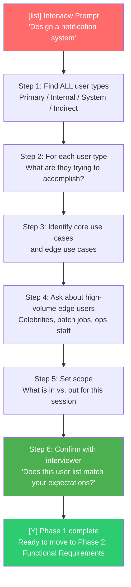

---

## Visual Overview: L5 vs L6 Mindmap -- Phase 1 Thinking

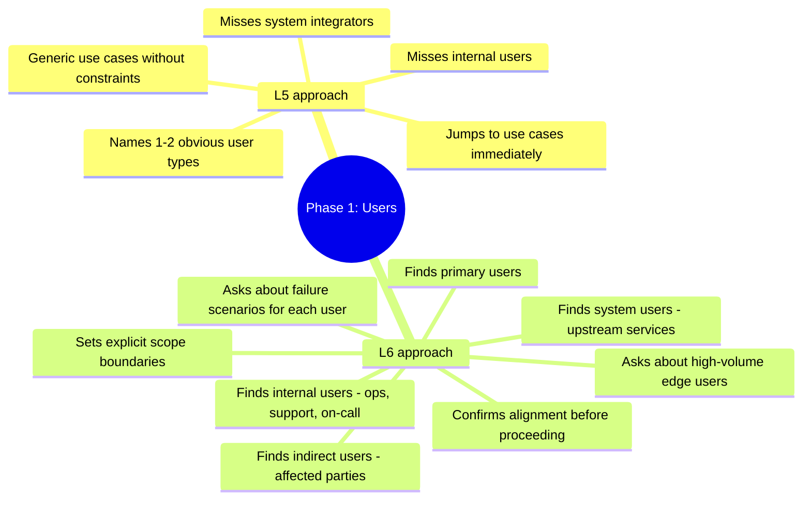

---

## 1. Learning Goal

By the end of this chapter, you will be able to:

- Name ALL the user types for any system -- not just the obvious ones
- Tell apart what users want to accomplish (intent) from how they ask for it (implementation)
- Separate the most important use cases (core) from the less important ones (edge)
- Set a clear scope in the first 5 minutes of any interview
- Explain WHY Phase 1 comes first and what goes wrong when you skip it
- Demonstrate L6 thinking by asking the right questions before touching the design

This chapter is about Phase 1 of the Staff-Level System Design Framework. The five phases are:

1. **Phase 1 -- Users and Use Cases** <- This chapter
2. Phase 2 -- Functional Requirements
3. Phase 3 -- Scale and Capacity
4. Phase 4 -- Non-Functional Requirements
5. Phase 5 -- System Design

Phase 1 comes first for a reason. Everything else depends on it.

---

## 2. Why This Matters

### The doctor analogy

Imagine you go to a doctor and say "I have a headache." A bad doctor immediately prescribes painkillers. A good doctor first asks: How long? Where exactly? Any blurry vision? Any fever? Any recent stress?

The prescription changes completely based on those answers.

System design works the same way. A bad engineer hears "design a notification system" and immediately draws boxes and arrows. A good engineer first asks: Who needs this? What are they trying to accomplish? What happens when it fails?

The design changes completely based on those answers.

### What "Phase 1" means

Phase 1 is the very first thing you do in a system design interview. Before you draw any diagram. Before you mention any technology. Before you talk about databases or APIs or microservices.

You spend 5 to 10 minutes asking and answering: **Who uses this system and what are they trying to do?**

That sounds simple. It is not easy. Most engineers skip this or rush through it. That is a mistake.

### The failure mode when you skip Phase 1

Here is what happens when engineers skip Phase 1:

**Scenario 1: Design for the wrong user**

An engineer is asked to "design a metrics pipeline." They assume the users are data scientists who want clean dashboards. They build a beautiful analytics system.

But the actual primary users are on-call engineers who need to debug outages at 3am. They need fast query response and detailed logs, not pretty charts.

Result: The system looks impressive but is useless in the moment that matters most.

**Scenario 2: Miss a critical use case**

An engineer designs a payment system. They nail the "user pays merchant" flow. They forget to design for "payment fails due to network error." At scale, 1% failure rate means thousands of failed transactions per day with no recovery path.

Result: Money gets stuck. Customers complain. Engineering scrambles to add retry logic as an afterthought.

**Scenario 3: Over-engineer for an edge case**

An engineer designs a messaging system. They get worried about users with 100,000 followers creating massive fan-out. They build a complex fan-out service with queues and workers and sharding.

But the actual product is an enterprise tool. Most users have 50 followers. The complex fan-out system adds cost and maintenance burden for a problem that almost never occurs.

Result: Over-engineered, expensive, hard to maintain.

**Scenario 4: Design for the wrong scale**

An engineer assumes the system needs to handle 1 billion users. They design with extreme sharding, multiple regions, and complex consensus protocols.

But the actual use case is an internal tool for 10,000 employees. A simple Postgres database would have worked fine.

Result: Wasted 6 weeks building distributed complexity for a problem that does not exist.

All four failures have the same root cause: not understanding who the users are and what they need before designing.

### Why L6 engineers invest time here

At Google, Staff Engineers (L6) are different from Senior Engineers (L5) in a key way:

- **L5 engineers solve the problem as stated.** They are excellent at execution. Given clear requirements, they build reliable systems.
- **L6 engineers define what the problem actually is.** They do not just accept the prompt. They question it, clarify it, and make sure the team is solving the right problem before anyone writes a line of code.

Phase 1 is where this L6 skill shows up most clearly.

In an interview, an L6 candidate spends 5-10 minutes on users and use cases before touching the design. This might feel slow. It is not. It is the most productive 10 minutes in the interview. Every minute spent here saves 5 minutes of designing the wrong thing.

---

## 3. Core Concepts

### 3.1 What is a "user" at Staff level?

**Definition: User** -- Anyone or anything that interacts with your system in any way.

Most engineers think "user" means a human being clicking buttons on an app. That is one type of user. There are three more.

At Staff level, there are four types of users:

```
+-----------------------------------------------------------------------------+
|                    THE FOUR TYPES OF USERS                                  |
|                                                                             |
|   TYPE 1: HUMAN USERS                                                       |
|   Real people interacting with the system                                   |
|   Examples: app users, internal staff, support agents, admins               |
|   They care about: speed, ease of use, relevant results                     |
|                                                                             |
|   TYPE 2: SYSTEM USERS                                                      |
|   Other software systems calling your APIs                                  |
|   Examples: partner services, internal microservices, third-party apps      |
|   They care about: stable APIs, predictable behavior, high throughput       |
|                                                                             |
|   TYPE 3: SERVICE USERS                                                     |
|   Automated jobs running on a schedule or trigger                           |
|   Examples: batch jobs, cron jobs, ML pipelines, data sync jobs             |
|   They care about: reliability, safe retries, efficiency                    |
|                                                                             |
|   TYPE 4: OPERATIONAL USERS                                                 |
|   Engineers who run, monitor, and fix the system                            |
|   Examples: SREs, on-call engineers, DevOps teams, platform teams          |
|   They care about: observability, debugging tools, control levers           |
|                                                                             |
|   MOST CANDIDATES ONLY THINK ABOUT TYPE 1.                                 |
|   STAFF ENGINEERS THINK ABOUT ALL FOUR.                                     |
+-----------------------------------------------------------------------------+
```

Let us go through each type in detail.

---

### 3.2 Human Users -- the most visible type

**Definition: Human User** -- A real person who interacts directly with the system, either through a UI or through a direct API call they wrote themselves.

Human users come in several subtypes:

**End consumers (external users)**
These are the people your product exists to serve. They use your mobile app, your website, or your service.

- A person ordering food on DoorDash
- A user watching Netflix
- A rider requesting a trip on Uber
- A person checking their bank balance

What they need:
- Fast responses (they get frustrated waiting more than a second)
- Clear error messages (they do not understand server errors)
- Consistent behavior (they expect the system to work the same way every time)
- Their data to be safe (they trust you with their information)

**Internal users (employees)**
These are employees of your company who use the system to do their jobs.

- Customer support agents looking up account details
- Data analysts running reports
- Marketing teams scheduling campaigns
- Finance teams pulling payment reconciliation data

What they need:
- Powerful search and filtering (they do complex queries)
- Bulk operations (they process many records at once)
- Audit trails (they need to know what changed and when)
- Access controls (different roles see different data)

**Admin users**
These are users with elevated permissions who manage the system.

- System administrators configuring settings
- Trust and safety teams reviewing flagged content
- Finance teams processing refunds
- Legal teams responding to data requests

What they need:
- Privileged API access (they can do things regular users cannot)
- Detailed logs (they need to see everything that happened)
- Override capabilities (they can bypass normal limits when necessary)
- Audit logs of their own actions (accountability)

**Why this matters for design:**

Different subtypes of human users create different design requirements.

If you design only for end consumers, your system might:
- Have no bulk operation support (internal users struggle)
- Have no audit logs (admin users cannot do their job)
- Have no way to look up a specific user's activity (support agents fail customers)

Example -- Notification System:

End consumers need: "Show me my notifications" -> Design a fast, personalized read API

Support agents need: "Why did user X not receive this notification?" -> Design a per-user debug API with trace information

Admin users need: "Pause all notifications for user X who reported abuse" -> Design an override API with immediate effect

---

### 3.3 System Users -- the silent high-volume type

**Definition: System User** -- Another software system that calls your APIs or consumes your data. No human is directly involved in the interaction.

System users are often the highest-volume users of your system. They call APIs programmatically, often thousands of times per second.

Examples:

**Internal services calling your API:**
- The feed service calling the notification service to say "user X got a new like"
- The payment service calling the fraud detection service before processing
- The search service calling the ranking service to score results
- The auth service calling the user profile service to verify permissions

**External partner integrations:**
- A third-party analytics platform pulling your data via API
- A payment processor sending webhook callbacks
- A shipping carrier sending delivery status updates
- An SMS gateway accepting message send requests

**What system users care about:**

**API stability** -- They have code deployed that calls your API. If you change the API, their code breaks. They need stability or advance warning of changes.

**Consistent behavior** -- They cannot tolerate your API behaving differently on different calls for the same input. Their logic depends on predictability.

**High throughput** -- They call you many times per second. Your API must handle this without slowing down.

**Clear error codes** -- When something goes wrong, their code needs to know what to retry and what to give up on. Vague errors break their retry logic.

**Why this matters for design:**

If you forget system users, you might:
- Design a human-friendly REST API that is too slow for high-volume service calls
- Return HTML error pages instead of JSON error codes (machines cannot parse HTML)
- Break the API without versioning (breaks all callers at once)
- Skip idempotency (definition below) -- causing double-processing on retries

**Definition: Idempotency** -- An operation is idempotent if calling it multiple times has the same effect as calling it once. For example, "set payment status to COMPLETED" is idempotent. "Add $10 to balance" is not -- calling it twice adds $20.

System users need idempotent operations because they retry on failure. If retrying a payment triggers multiple charges, that is catastrophic.

Example -- Rate Limiter:

The system user here is your own internal APIs being called. The rate limiter sits between callers and your APIs. System users (your APIs) need:

- Fast check: The rate limiter adds latency on every call. Even 1ms matters at 100,000 calls/second.
- Structured response: "429 Too Many Requests" with a "Retry-After" header, not a generic error.
- Consistent enforcement: If the limit is 1000 calls/minute, that must be exactly enforced -- not sometimes 1000, sometimes 800.

---

### 3.4 Service Users -- the automated batch type

**Definition: Service User** -- An automated process (not a human, not a real-time service) that interacts with your system in bulk or on a schedule.

Service users are different from system users in an important way:

- **System users** call your API in real time, triggered by user actions
- **Service users** run on schedules or triggers, often processing large batches

Examples:

**Batch jobs:**
- A nightly job that calculates recommendation scores for 100 million users
- A weekly job that sends digest emails to all subscribers
- An hourly job that processes all pending refunds
- A daily job that archives logs older than 90 days

**Cron jobs:**
- A job that runs every 5 minutes to check for expired sessions
- A job that runs at midnight to reset daily rate limits
- A job that runs every hour to sync data between two systems

**ML pipelines:**
- A pipeline that trains a new recommendation model on last week's data
- A pipeline that scores all users for churn risk
- A pipeline that re-ranks search results based on updated signals

**Data sync and ETL jobs:**
- A job that copies production data to the analytics warehouse
- A job that imports data from a third-party provider
- A job that exports compliance data to a legal team's system

**Definition: ETL** -- Extract, Transform, Load. A batch process that takes data from one place, changes its format, and loads it into another place.

**What service users care about:**

**Reliability** -- If a batch job fails halfway through, it should be able to restart without reprocessing what it already finished. This needs checkpointing.

**Definition: Checkpointing** -- Saving progress periodically so a job can restart from the last checkpoint instead of from the beginning.

**Idempotency** -- Batch jobs often get retried. Every operation must be safe to run twice.

**Efficiency** -- Batch jobs process large amounts of data. Wasted work per record adds up to hours of extra runtime.

**Throughput over latency** -- Batch jobs do not care if each operation takes 100ms. They care about total throughput (how many records per hour).

**Why this matters for design:**

If you forget service users, you might:
- Design APIs without bulk endpoints (forcing batch jobs to call one record at a time -- extremely slow)
- Skip idempotency (batch job retries cause duplicates)
- Have no pagination for large reads (batch jobs load entire tables into memory)
- Build no export-friendly data format (compliance exports are impossible)

Example -- Messaging System:

A batch job to export 90 days of messages for a compliance audit needs:
- A bulk export API (not 10 million individual API calls)
- Cursor-based pagination to process pages of messages without memory overflow
- A consistent snapshot (the export cannot capture a database in mid-write state)

If you did not think of service users during Phase 1, you might design a schema that makes bulk export very slow -- and then have to redesign it months later when the compliance team asks.

---

### 3.5 Operational Users -- the most forgotten type

**Definition: Operational User** -- An engineer whose job is to keep the system running. They interact with the system through monitoring dashboards, admin tools, log queries, and control APIs.

Operational users are the most commonly forgotten user type. During design, they seem like an afterthought. In production, they are critical.

Who are operational users?

**SREs (Site Reliability Engineers):**
- Definition: SRE -- An engineer responsible for the uptime and performance of production systems.
- They watch monitoring dashboards continuously.
- When an alert fires, they diagnose the problem and mitigate it.
- They need to answer: "Is the system healthy? Why is it slow? How do I fix it quickly?"

**On-call engineers:**
- Any engineer paged at 2am when something breaks.
- They need to go from "alert fired" to "problem fixed" as fast as possible.
- They need clear metrics, distributed traces, and control levers.

**Definition: Distributed trace** -- A record of one request's journey across multiple services. Used to find which service in the chain is slow or failing.

**Platform teams:**
- Engineers who maintain the infrastructure your service runs on.
- They need to deploy new versions safely, roll back when needed, and migrate data without downtime.

**Support engineers:**
- Engineers who investigate user complaints.
- "Why did user X not receive their SMS verification code?"
- They need per-request logs and per-user activity history.

**What operational users care about:**

**Observability** -- Can they see what the system is doing right now?
- Definition: Observability -- The ability to understand the internal state of a system from its external outputs (metrics, logs, traces).

**Debuggability** -- When something breaks, can they find the root cause quickly?
- Per-request logs
- Distributed traces
- Meaningful error messages

**Controllability** -- Can they change the system's behavior without deploying new code?
- Feature flags (turn features on/off)
- Rate limit adjustments (turn down load during incidents)
- Circuit breakers (cut off a failing dependency)
- Kill switches (disable a specific feature for a specific user)

**Definition: Feature flag** -- A configuration setting that enables or disables a feature without code deployment.
**Definition: Circuit breaker** -- A mechanism that automatically stops calls to a failing service, giving it time to recover.

**Safe operations** -- Can they perform maintenance safely?
- Graceful shutdown (drain in-flight requests before stopping)
- Blue-green deploys (run two versions simultaneously, cut traffic over)
- Canary releases (send 1% of traffic to new version, expand if healthy)

**Definition: Graceful shutdown** -- Stopping a service by first stopping new requests, then waiting for in-flight requests to complete, then stopping.

**Why this matters for design:**

If you forget operational users, you might:
- Build a system with no health endpoint (SREs cannot check if it is running)
- Emit no metrics (cannot alert on slow responses)
- Have no per-request correlation IDs (impossible to trace a failed request through logs)
- Have no way to adjust rate limits without a code deploy (25-minute response to incidents instead of 25 seconds)
- Have no graceful shutdown (every deploy drops in-flight requests)

Example -- A real failure caused by ignoring operational users:

A notification system delivered notifications to users. Engineers forgot to add per-notification tracing. When a user complained "I never got my password reset email," support engineers had no way to investigate. They could see aggregate delivery rates, but not whether one specific notification was delivered or dropped.

Result: Hours of manual log search. Customer waiting. Brand damage.

The fix required a data model change -- expensive and time-consuming. If operational users had been identified in Phase 1, per-notification tracing would have been in the original design.

---

### 3.6 Putting all four user types together

Here is a full example using a notification system:

| User Type | Who They Are | What They Need | Design Impact |
|-----------|-------------|----------------|---------------|
| **Human -- Consumer** | People receiving notifications | Fast delivery, preference controls | Push infra, preference storage |
| **Human -- Support** | Customer support agents | "Why did user X not get this?" | Per-notification audit log |
| **System -- Feed Service** | Internal service triggering "new like" alerts | High-throughput API, stable contract | Async processing, versioned API |
| **System -- Marketing Platform** | Email/SMS marketing tool sending campaigns | Bulk send API, delivery status | Queue-based ingestion |
| **Service -- Analytics Pipeline** | Nightly job aggregating delivery stats | Bulk read API, export capability | Event stream or bulk export endpoint |
| **Service -- Batch Marketing Jobs** | Scheduled campaigns | Idempotent bulk send, throttling support | Idempotency keys, rate limit headers |
| **Operational -- SRE** | On-call engineer monitoring delivery | Metrics, alerts, traces | Health endpoints, metrics emission |
| **Operational -- Support Eng** | Engineer debugging specific failures | Per-notification trace | Trace ID on every notification record |

**The lesson:** A design that only serves human consumers might:
- Have terrible throughput for the feed service (system user)
- Make batch marketing jobs impossible (service user)
- Be impossible to debug during outages (operational user)

When you identify all four user types, your design serves everyone.

---

### 3.7 How to identify all user types from an ambiguous prompt

In an interview, the prompt is short and ambiguous. "Design a ride-sharing app." "Design a payment system." "Design a URL shortener."

Here is a step-by-step thinking process for identifying all user types:

**Step 1: Who does the core action?**
"Who is doing the main thing the system exists for?"

For a ride-sharing app: The rider requests a ride. The driver accepts and drives. Both are human users.

**Step 2: Who else is a human who touches this system?**
"Beyond the core human users, who else logs in or uses an interface?"

For a ride-sharing app: Customer support (handling complaints). Admins (configuring city-level pricing). Driver account managers (onboarding new drivers).

**Step 3: What other systems call this system?**
"What software calls this system's APIs? What events does this system receive?"

For a ride-sharing app: The payment processor (charging riders). The mapping service (providing routes). The push notification service (alerting drivers to new ride requests). Analytics platforms (consuming ride data).

**Step 4: What batch jobs or automated processes interact with this system?**
"What runs on a schedule? What processes large amounts of data in bulk?"

For a ride-sharing app: A nightly job that calculates driver earnings and generates payslips. A weekly job that updates driver ratings. A job that runs fraud detection on all completed rides. A pipeline that trains the ETA prediction model.

**Step 5: Who runs and monitors this system?**
"When this breaks at 3am, who fixes it? What do they need to see?"

For a ride-sharing app: SREs monitoring ride completion rates. On-call engineers diagnosing matching failures. Support engineers debugging specific failed rides. City operations teams monitoring regional health.

After these five steps, your user list is much more complete than "riders and drivers."

**The full user list for a ride-sharing app:**

Human users: Riders, Drivers, Customer Support, Admins, City Operations Teams
System users: Payment Processor, Mapping Service, Push Notification Service, Analytics Platform
Service users: Driver Earnings Job, Rating Calculation Job, Fraud Detection Pipeline, ETA Model Training Pipeline
Operational users: SREs, On-call Engineers, Support Engineers

That is 14+ user types from a 5-word prompt.

---

### 3.8 For each user type: what questions do you ask?

Once you have listed user types, you ask targeted questions about each one. The answers change the design.

**For human users:**

- How many of them are there? (drives scale decisions)
- Are they technical or non-technical? (drives API design -- REST vs UI vs command-line)
- What is their tolerance for errors? (end consumers have almost zero tolerance; internal users are more forgiving)
- Do they need real-time data or is a few seconds old acceptable?
- What devices do they use? (mobile? desktop? poor network connections?)
- Are they in multiple regions? (drives latency and data residency decisions)

**Changing the design:**
- "Mostly mobile users on poor connections" -> aggressive caching, small payloads, offline support
- "Internal analysts on fast corporate networks" -> larger payloads, complex queries are fine

**For system users:**

- How often do they call you? (drives throughput design)
- Do they need synchronous responses or can they accept async? (drives API design)
- What happens if you are slow or unavailable? (drives SLA decisions)
- Do they retry on failure? (drives idempotency requirements)
- Are there multiple versions of their client code deployed? (drives API versioning)

**Changing the design:**
- "They call 50,000 times per second" -> need very low overhead per call, possibly gRPC over HTTP
- "They do not retry" -> need low error rates, no retry storms to design against
- "They have v1 and v2 clients deployed" -> need API versioning from day one

**For service users:**

- How large are their batches? (drives bulk API design)
- How often do they run? (drives load patterns -- steady vs burst)
- What happens if a job fails midway? (drives checkpointing and idempotency)
- Do they need consistent snapshots or is eventual consistency acceptable?
- What data format do they need? (CSV? JSON? Parquet? Avro?)

**Changing the design:**
- "Jobs process 100 million records" -> need cursor-based pagination and streaming APIs
- "Jobs run hourly" -> burst traffic 10 minutes per hour, then silence -- design for burst capacity

**For operational users:**

- What monitoring system do they use? (Prometheus? Datadog? Cloud monitoring?)
- What does "healthy" mean for this system? (what metrics define health?)
- When something breaks, what is the first thing they check?
- What control levers do they need? (ability to throttle? disable features? redirect traffic?)
- How do they deploy new versions? (blue-green? canary? rolling?)

**Changing the design:**
- "They use Datadog" -> emit metrics in Datadog format or ensure compatibility
- "They need to adjust rate limits without deploys" -> build a configuration API from the start
- "They deploy with blue-green" -> design for graceful connection draining

---

### 3.9 Primary vs. Secondary users

**Definition: Primary User** -- The user whose needs drive the core design decisions. If you must choose between serving them well or serving someone else well, you choose them.

**Definition: Secondary User** -- A user whose needs matter but do not override primary user needs. You accommodate them, but not at the cost of the primary experience.

Why does this distinction matter?

Every design involves trade-offs. You cannot optimize for everyone simultaneously. When you have to choose:
- Latency vs. durability
- Simplicity vs. flexibility
- Speed vs. accuracy

The primary/secondary distinction tells you how to decide.

**Example: Feed System**

Primary users: End consumers viewing their feed (the product exists for them)
Secondary users: Advertisers buying placement, ML teams tuning ranking, operations monitoring health

Trade-off: Fast feed loading vs. detailed advertiser analytics on every page view

Decision: Optimize for fast loading (primary user). Run analytics asynchronously (secondary user gets eventual data, not real-time).

**Example: Rate Limiter**

Primary users: The APIs being protected (the rate limiter exists to protect them)
Secondary users: The clients being rate-limited, operations teams configuring limits

Trade-off: Strict enforcement (protects APIs perfectly) vs. burst flexibility (better experience for clients)

Decision: Under normal load, allow bursts for clients. Under stress, API protection takes absolute priority.

**How to decide who is primary:**

Ask these questions:
- Who does the system exist to serve? (business purpose)
- Who generates the most value from this system? (revenue or core mission)
- Whose failure mode is most unacceptable? (what failure is catastrophic vs. inconvenient)
- Who interacts most frequently? (volume often indicates primacy)

In an interview, say this explicitly:

"I'm treating end consumers as primary users because the product exists for them. Internal analytics is secondary -- I'll accommodate it without compromising consumer experience. Does that priority make sense for this context?"

---

### 3.10 User Intent vs. User Implementation

**Definition: User Intent** -- The underlying goal or problem the user is trying to solve.

**Definition: User Implementation** -- A specific approach the user suggests for solving their problem.

Users express themselves in terms of implementation, not intent. They say what they want, not why they want it.

**The problem:** If you build exactly what users ask for, you might solve the wrong problem -- or miss a much better solution.

**Classic examples:**

| What the user says | What they actually want | Better solution |
|-------------------|-------------------------|-----------------|
| "I need a refresh button" | "I want to see current data, not stale data" | Real-time updates that eliminate refresh |
| "Notify me on every like" | "I want to feel appreciated by my audience" | Aggregated: "12 people liked your post" |
| "Add a search bar" | "I can't find things quickly" | Better organization + smarter search |
| "Export to CSV every day" | "I need to analyze engagement trends" | Built-in analytics dashboard |
| "Send me daily summary emails" | "Keep me informed without overwhelming me" | Smart digest based on actual activity levels |
| "Give me a button to clear the cache" | "Sometimes the app shows stale data and I want fresh data" | Automatic cache invalidation |
| "I need an admin panel" | "I need to manage user accounts and content" | Specific admin workflows, not a generic panel |

**Why this matters for system design:**

When you design for implementation instead of intent, you often:
- Build the wrong thing (solves the stated problem, not the real one)
- Miss simpler solutions (the user's suggested approach might be complex)
- Lock yourself into a specific approach prematurely (limits future options)
- Over-engineer (building a refresh button when you need a real-time event stream)

**How to uncover intent in interviews:**

The key question is: **"What problem are you trying to solve?"**

Practice these patterns:

For a notification system:
"What's the goal of these notifications? Are they meant to drive users back to the app? Alert them to urgent actions? Keep them informed of social activity? Each goal suggests a different design emphasis."

For a URL shortener:
"Why do people need short URLs? Is it character limits in specific platforms? Cleaner appearance in marketing? Click tracking and analytics? The answer changes what we need to build."

For a rate limiter:
"What behavior are we protecting against? Malicious attacks? Accidental loops? One big customer starving others? Expensive operations that should be limited on principle? Each threat model leads to a different design."

For a caching system:
"What problem does the cache solve? Slow database queries? Expensive computations? High read volume on limited resources? The answer determines what we cache, for how long, and how we invalidate."

**Deep example: Messaging System**

The prompt says: "Design a messaging system where users can send messages to each other."

Surface intent: Text exchange between two people.

Questions to uncover deeper intent:

"Is this real-time chat or asynchronous messaging? They feel similar but have very different requirements."

- Real-time chat: needs presence indicators, typing notifications, delivery receipts, sub-second delivery. Think: WhatsApp, iMessage.
- Async messaging: like email -- send when you want, read when you want, no expectation of immediate response. Think: email, LinkedIn messages.

"What matters more -- guaranteed delivery or low latency?"

- If guaranteed delivery: need acknowledgment protocols, message queues, retry logic. Never lose a message.
- If low latency: might drop messages occasionally for speed. Best-effort delivery.

"Are there group conversations? How large?"

- Small groups (10 people): can store a copy per recipient, simple fan-out
- Large groups (100 people): need fan-out optimization with message queues
- Massive groups (10,000 people): completely different architecture -- read from a central store, not per-recipient copies

"What about rich media?"

- Text only: simple storage, fast delivery
- Images and videos: need content delivery networks, different storage, size limits, transcoding pipelines

Each answer reveals the true intent and directly shapes the architecture. Without asking these questions, you might design a real-time chat system when they wanted async messaging -- or vice versa. The designs are fundamentally different.

---

### 3.11 Core Use Cases vs. Edge Use Cases

**Definition: Use Case** -- A specific thing a user wants to accomplish using the system. "User sends a message." "SRE checks system health." "Batch job exports last month's data."

**Definition: Core Use Case** -- A use case that happens frequently, delivers high value, and must work perfectly. Your architecture is built around these.

**Definition: Edge Use Case** -- A use case that happens rarely, is less critical, or can degrade gracefully. Your architecture handles these within the existing design.

```
+-----------------------------------------------------------------------------+
|                    CORE vs. EDGE USE CASES                                  |
|                                                                             |
|   CORE (Design Meticulously)            EDGE (Handle Appropriately)         |
|   -----------------------------         ----------------------------        |
|   - Happens often (high frequency)      - Happens rarely (low frequency)    |
|   - Delivers primary value              - Delivers secondary value          |
|   - Users expect it to be perfect       - Users tolerate some friction      |
|   - Business critical -- failure is bad  - Failure is inconvenient, not fatal|
|   - Drives your architecture            - Handled within your architecture  |
|                                                                             |
|   Examples for a Messaging System:                                          |
|                                                                             |
|   CORE:                                 EDGE:                               |
|   - Send a text message                 - Delete a sent message             |
|   - Receive a text message              - Unsend a message within 1 minute  |
|   - View conversation history           - Export entire conversation history |
|   - Real-time delivery                  - Message search across all time    |
|   - Group messaging (up to 100)         - Report message as spam            |
|                                                                             |
+-----------------------------------------------------------------------------+
```

**Why the distinction matters:**

If you design for edge cases first:
- You add complexity to handle rare scenarios
- The common case suffers because the architecture optimizes for the rare case
- You waste 50% of design effort on things 1% of users do

If you ignore edge cases entirely:
- Users encounter unhandled scenarios
- System fails unexpectedly in corner cases
- You have to retrofit solutions later, which is expensive

The right approach:
- Design for core cases meticulously
- Acknowledge and handle edge cases appropriately (without over-engineering)

**Characteristics of core use cases:**

1. **High frequency** -- This is what most users do most of the time. If you look at traffic, the majority hits these paths.

2. **High value** -- This is the primary reason the system exists. If these fail, the business fails.

3. **User expectations are zero tolerance** -- Users expect these to work. When they do not, users are angry, not just disappointed.

4. **Business critical** -- Failure here has direct business impact (lost revenue, user churn, legal liability).

**Characteristics of edge cases:**

1. **Low frequency** -- This affects a small percentage of users or scenarios.

2. **Graceful degradation is acceptable** -- "This feature is temporarily unavailable" is okay, not catastrophic.

3. **Simple solutions are fine** -- You do not need to optimize; a slightly slow or basic implementation is acceptable.

4. **Can be deferred** -- Often can be added in V2 without changing core architecture.

**How to identify core use cases in an interview:**

Ask yourself: "If I watched 1000 users use this system for one day, what would most of them be doing most of the time?"

That is your core use case list.

Then ask: "What would happen occasionally -- once per user per week? Once per month? What would only some users ever need?"

Those are your edge cases.

**Example: Rate Limiter Use Cases**

Core:
- Check if a request is allowed (happens on every single API call -- 100% of traffic)
- Enforce the limit (reject over-limit requests -- happens on every single API call)
- Return meaningful feedback to clients (every rejected call needs a response)

Edge:
- View current usage for a specific client (debugging, rare)
- Manually override a limit temporarily (incident response, very rare)
- Handle clock skew between servers (distributed systems issue, rare and internal)
- Generate usage reports (weekly, batch operation)
- Expire old limit buckets (background maintenance, automated)

For core cases, the design must be:
- Extremely fast (adds < 1ms latency to every API call)
- Highly available (rate limiter unavailability means no API calls can be checked)
- Consistent (enforcement must be accurate)

For edge cases, the design can be:
- Eventually consistent (usage reports are a few minutes old -- fine)
- Slower (manual overrides go through a separate admin path -- fine if it takes 2 seconds)
- Simple (clock skew handled with a small tolerance margin -- no need for complex coordination)

---

### 3.12 How to enumerate use cases from a prompt

Here is a step-by-step process for finding all use cases:

**Step 1: Write down what each user type does**

For each user type, ask: "What are all the things this user wants to do with the system?"

For a payment system:

Human users (consumers):
- Pay a merchant
- Check payment history
- Dispute a payment
- Set up recurring payment
- Add a new payment method
- Remove a payment method

Human users (merchants):
- Receive a payment
- Issue a refund
- View revenue reports
- Set up payout schedule
- Dispute a chargeback

System users (fraud detection service):
- Query transaction risk score before processing
- Receive fraud alerts in real time

Service users (reconciliation batch job):
- Export all transactions from yesterday
- Mark transactions as reconciled

Operational users (SRE):
- Check payment success rate
- Debug why a specific payment failed
- Pause processing for a specific merchant during investigation

**Step 2: Group by frequency and value**

After listing all use cases, mark each:
- C = Core (high frequency, high value, must be perfect)
- S = Secondary (medium frequency, moderate value, should work well)
- E = Edge (low frequency, low value, graceful degradation OK)

**Step 3: Prioritize explicitly**

State your priorities out loud:

"Core use cases: consumer paying merchant, merchant receiving payment, basic refund flow. Secondary: transaction history, reporting. Edge: dispute process, chargeback handling, export. I'll design the core cases in depth and note how secondary and edge cases fit within that design."

**Step 4: Check for missing use cases**

Ask yourself:
- "What happens when things go wrong?" (error cases are use cases too)
- "What does maintenance look like?" (operational use cases)
- "What does growth look like?" (scale use cases -- migrating data, adding regions)

---

### 3.13 User Personas -- making users concrete

**Definition: User Persona** -- A specific, concrete description of one type of user: who they are, what they know, what they want, and what frustrates them.

Personas make design decisions easier. Instead of "the user," you think "Priya, a junior data analyst who checks dashboards every morning."

**Why personas help:**

- They prevent designing for an imaginary "average user" who does not exist
- They surface conflicting needs explicitly (two personas may want opposite things)
- They make trade-offs easier ("this design serves Priya better but Arjun worse -- is that acceptable?")
- They help teams communicate about design decisions

**Example personas for a notification system:**

**Persona 1: Maya, consumer user**
- 28 years old, uses the app primarily on mobile
- Gets notifications throughout the day while at work
- Frustrated by notification overload -- she turns off notifications from apps that spam her
- What she needs: Relevant notifications only. Control over what she receives. Fast delivery.

**Persona 2: Vikram, SRE**
- 34 years old, manages the notification infrastructure
- On call every 3rd week
- When paged at 3am: needs to understand what is broken within 5 minutes and have a lever to stop the problem
- What he needs: Clear metrics. Per-notification tracing. Circuit breakers he can flip immediately.

**Persona 3: Ananya, product marketing manager**
- 31 years old, runs notification campaigns to re-engage users
- Sends batch notifications to millions of users weekly
- Needs to know: Did the campaign deliver? What was the click rate? Which segments performed best?
- What she needs: Reliable bulk send. Delivery receipts. Campaign analytics.

**Persona 4: Rahul, partner API developer**
- 27 years old, works at a partner company integrating with the notification API
- His company sends order status updates via the notification system
- He deployed code 6 months ago that calls the API and cannot easily change it
- What he needs: Stable API contract. No surprise breaking changes. Clear error codes for retry logic.

With these personas, design decisions become clearer:

"Should we batch notifications for efficiency?" Maya says yes -- less spam. Vikram says it makes debugging harder. Ananya says the campaign analytics don't care. Rahul says it complicates his retry logic.

Decision: Batch for Maya's experience. Log each notification individually for Vikram's tracing. Expose both aggregate and individual metrics for Ananya.

---

### 3.14 The User Journey Mapping Technique

**Definition: User Journey** -- The sequence of steps a user takes to accomplish a goal, from start to finish.

Mapping user journeys helps you:
- Find all the use cases you need to support
- Identify where users can fail and what they need in those moments
- Find system boundaries and integrations
- Understand latency requirements at each step

**How to map a user journey:**

1. Pick one user type and one goal
2. Write every step they take, including waiting, checking, retrying
3. At each step, ask: "What can go wrong? What does the user need?"
4. Note which other systems are involved at each step

**Example: Rider requesting a ride on a ride-sharing app**

| Step | User Action | System Action | What Can Go Wrong | What User Needs |
|------|-------------|--------------|-------------------|-----------------|
| 1 | Opens app | Load home screen, check auth | Auth failure, slow load | Fast loading, cached state |
| 2 | Enters destination | Autocomplete suggestions | Geocoding failure, no suggestions | Fast autocomplete, fallback to map |
| 3 | Requests ride | Match with driver | No drivers nearby, matching timeout | Clear "no drivers" message, not spinner |
| 4 | Waits for driver | Real-time driver location updates | GPS failure, driver cancels | Live map, cancel option |
| 5 | Driver arrives | Verify ride, start trip | Wrong car, driver not found | Clear driver details, cancel option |
| 6 | Completes ride | Process payment, send receipt | Payment failure, receipt not sent | Instant confirmation, retry mechanism |
| 7 | Rates driver | Submit rating | Rating service slow | Non-blocking -- can skip |

From this journey map:
- Step 3 is a core use case -- "match rider to driver" drives the whole architecture
- Step 4 is a core use case -- real-time GPS updates requires WebSocket or similar
- Step 7 is an edge use case -- ratings can be eventually consistent and slow
- Steps 1 and 2 need caching for perceived speed
- Steps 3 and 6 have business-critical failure modes that need explicit error handling

---

### 3.15 Traffic Patterns by User Type

Different user types create very different traffic patterns. Understanding these patterns shapes your capacity design.

**Definition: Traffic Pattern** -- How requests to the system are distributed over time. Is it steady? Bursty? Predictable?

**Human users create:**
- **Diurnal patterns** (peaks during business hours, late evening; troughs at night)
- **Definition: Diurnal** -- Following a daily cycle. Traffic is higher during the day than at night.
- **Event-driven spikes** (viral content, breaking news, sales)
- **Gradual growth** (user base grows over months)

**System users create:**
- **Steady high-volume traffic** (every API call triggers a rate limit check, for example)
- **Spiky patterns that mirror human user patterns** (internal services react to human user traffic)

**Service users create:**
- **Burst traffic at scheduled times** (nightly batch job runs from midnight to 2am)
- **Low-steady traffic** (a small job runs every 5 minutes)
- **Large one-time bursts** (annual compliance export of 3 years of data)

**Operational users create:**
- **Near-zero traffic normally** (dashboard reads are infrequent)
- **Extreme traffic during incidents** (everyone querying logs simultaneously during an outage)

**Why this matters:**

If your system only handles diurnal human user patterns, it might:
- Fail when the nightly batch job runs (service user burst at midnight)
- Be overwhelmed when all SREs simultaneously query logs during an incident (operational user burst)
- Miss the fact that one internal service generates 10x more calls than all human users combined (system user volume)

**Example: Notification System Traffic**

Human consumers: 10 million daily active users, each generating ~5 read requests per day = 50 million reads/day ~= 578 reads/second average, with 5x peak ~= 2,890 reads/second at peak

Internal services (system users): Feed service triggers ~100 million notifications/day from 1 billion feed interactions ~= 1,157 notifications/second, with 3x peak ~= 3,472/second

Marketing batch jobs (service users): Weekly campaigns send 50 million notifications in 2 hours = 6,944/second burst, only during campaign windows

SRE dashboard queries (operational users): Normally negligible. During incidents: potentially 50 engineers querying simultaneously, running heavy aggregation queries.

**The takeaway:** System users and service users generate more load than human users in this example. If you only designed for human users, your system would be 5x undersized.

---

### 3.16 Scope Control -- deciding what is in and what is out

**Definition: Scope** -- The boundary of what you are designing. What you will build vs. what you will not build. What is your responsibility vs. what is someone else's.

**Definition: Scope Control** -- The practice of deliberately deciding what is in scope and what is out, then communicating that explicitly.

In a 45-minute interview, you cannot design everything. In a 6-month project, you cannot build everything. Scope control is not about doing less. It is about doing the right things.

**Why explicit scope matters:**

If you leave scope ambiguous:
- You might spend 15 minutes designing something the interviewer did not expect
- The interviewer might think you are missing something you actually plan to address later
- Your design might have implicit assumptions that are not valid

If you make scope explicit:
- You and the interviewer are aligned from the start
- Your time is spent on what matters
- You can make explicit trade-offs ("I'm not designing search because it would add 30 minutes and isn't the core challenge")

**Types of things to scope explicitly:**

**Functional scope** -- What features you are building:
- "I'm designing notification delivery, not notification content creation."
- "I'm designing the payment processing pipeline, not the merchant onboarding flow."

**User scope** -- Which users you are optimizing for:
- "I'm optimizing for consumer experience. Analyst tools are secondary."

**Scale scope** -- What scale range you are targeting:
- "I'm designing for 10 million daily active users. 1 billion users would need different architectural choices."
- "I'm designing for current scale, with notes on what changes at 10x."

**Quality scope** -- What availability and latency targets:
- "I'm targeting 99.9% availability. 99.99% would require significant additional infrastructure."
- "I'm targeting P95 < 200ms for feed generation."

**Integration scope** -- What external systems you assume exist:
- "I'm assuming existing push delivery infrastructure (APNs, FCM). I'm not designing that."
- "I'm assuming existing user authentication. I'm not designing auth."

**How to state scope in an interview:**

"Before I start designing, let me state my scope explicitly.

In scope:
- [Item 1]
- [Item 2]
- [Item 3]

Out of scope:
- [Item A] -- handled by separate systems / future phases / not the core challenge
- [Item B] -- would require a separate design
- [Item C] -- out of scope for this interview but I can discuss if useful

Does this scope match what you had in mind?"

**Example: Scoping a Rate Limiter**

Potential scope:
- Single-service vs distributed rate limiting
- Different algorithms (token bucket, sliding window, fixed window, leaky bucket)
- Per-client vs per-endpoint vs per-user limits
- Configuration management
- Multi-tenant isolation
- Analytics and reporting
- Quota management
- Billing integration
- Abuse detection and response
- Rate limit bypass for trusted callers

Staff-level scoping:

"In scope: distributed rate limiting across multiple API servers, per-client and per-endpoint enforcement, configurable limits, basic visibility into current usage.

Out of scope: analytics dashboards (they consume the same data -- I'll note the API they'd use), quota management and billing (related but different problem), abuse detection beyond simple rate limiting (separate threat model), billing integration (separate system).

Does this scope work?"

This scope declaration takes 60 seconds and saves 15 minutes of designing the wrong thing.

---

### 3.17 How Phase 1 decisions ripple forward

The decisions you make in Phase 1 affect every other phase. Understanding these connections helps you make good decisions early and explain your design coherently later.

```
+-----------------------------------------------------------------------------+
|           PHASE 1 DECISIONS AND THEIR DOWNSTREAM EFFECTS                    |
|                                                                             |
|   Phase 1 Decision              ->  Downstream Architectural Effect          |
|   -----------------------------    ----------------------------------       |
|   User Types Identified         ->  APIs needed                              |
|                                     - Human users -> REST API                |
|                                     - System users -> gRPC or high-perf API  |
|                                     - Operational users -> Admin API          |
|                                                                             |
|   Core Use Cases Defined        ->  Data model                               |
|                                     - "View history" core -> persist per user |
|                                     - "Aggregate similar" -> store counts     |
|                                     - "Search messages" -> search index       |
|                                                                             |
|   Primary User Chosen           ->  Quality requirements                     |
|                                     - Primary user needs -> highest SLA       |
|                                     - Secondary -> can tolerate degradation   |
|                                                                             |
|   Scope Decisions Set           ->  Component boundaries                     |
|                                     - In scope -> components you design       |
|                                     - Out of scope -> interfaces to external  |
|                                                                             |
|   Intent Understood             ->  Design approach                          |
|                                     - "Real-time chat" -> WebSockets          |
|                                     - "Async messaging" -> queued delivery    |
|                                                                             |
+-----------------------------------------------------------------------------+
```

**Making ripple effects explicit in the interview:**

"Earlier I identified system users (internal services) generate 95% of notifications. This tells me the service-to-service API is the critical path. I'm designing that for maximum throughput and minimum latency. The REST API for human users managing preferences is low-volume and can be simpler."

"Because viewing notification history is a core use case, I need persistent storage per user. If it were out of scope, I could use a fire-and-forget architecture with no storage at all. That would be much simpler and cheaper."

"I said the primary user is the consumer. This means notification delivery gets 99.99% availability. The analytics dashboard for secondary users gets 99.9% -- one fewer nine, which is much cheaper to achieve."

This tracing shows that your design is coherent -- every decision connects logically to earlier ones.

---

## 4. Mental Models

### Mental Model 1: "The 4-Type Checklist"

Every time you get a system design prompt, run this mental checklist:

1. Human users: "Who are the real people using this?"
2. System users: "What other software calls this?"
3. Service users: "What batch jobs or automated processes touch this?"
4. Operational users: "Who monitors, debugs, and fixes this?"

If you have answered all four, you have a complete picture of your users.

Mnemonic: **H-S-S-O** (Human, System, Service, Operational)

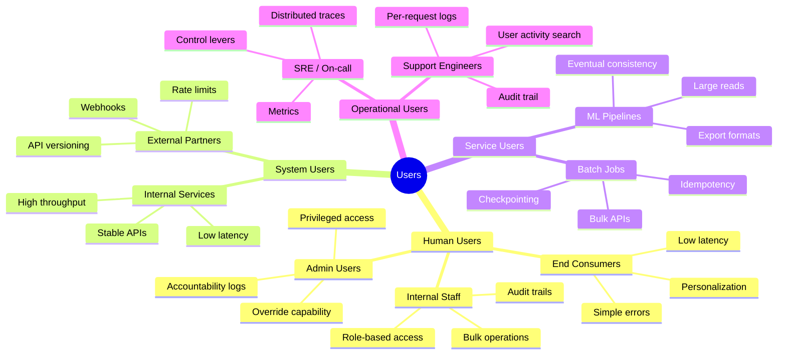

---

### Mental Model 2: "Intent Before Implementation"

Before designing any feature, ask:
- "What is the user trying to accomplish?" (intent)
- "Why are they asking for this specific thing?" (real need)
- "Is there a simpler way to give them what they actually want?" (better solution)

Then design for the intent, not the implementation.

Quick test: Can you complete this sentence for each use case?
"The user wants _____ because _____."

If you can, you understand the intent. If you cannot, dig deeper.

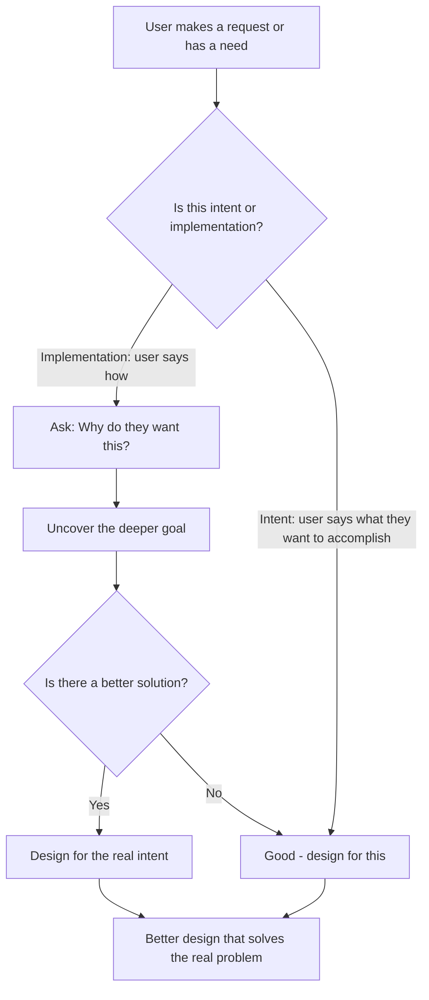

---

### Mental Model 3: "Core/Edge Priority Matrix"

When you list use cases, quickly rank them on two dimensions:
- **Frequency**: How often does this happen?
- **Value**: How important is this to the user and the business?

```
High Value    |  SECONDARY        |  CORE           |
              |  Design well,     |  Design meticu- |
              |  not optimal      |  lously, no     |
              |                   |  shortcuts      |
              |                   |                 |
Low Value     |  IGNORE or        |  OPTIMIZE       |
              |  simple stub      |  for volume,    |
              |                   |  even if low    |
              |                   |  value per call |
              |-------------------|-----------------|
                  Low Frequency       High Frequency
```

- High frequency, high value = **Core** -- your architecture serves these
- Low frequency, high value = **Secondary** -- design well, not perfectly
- High frequency, low value = **Optimize** -- keep cost low per call
- Low frequency, low value = **Edge** -- handle gracefully, do not over-engineer

---

### Mental Model 4: "The Ripple Test"

Before finalizing Phase 1, ask: "Does each decision I made ripple logically to a design choice?"

If you said "primary user is mobile consumer," you should be able to trace:
- Mobile -> small payloads -> compression, lightweight API
- Consumer -> low technical tolerance -> clear error messages, not stack traces
- Primary -> 99.99% availability -> dual-region, auto-failover

If a Phase 1 decision does not ripple to any design choice, either:
- You do not fully understand the decision's implications, or
- The decision is not actually meaningful

Both are signals to revisit.

---

### Mental Model 5: "The 5-Minute Investment"

Think of Phase 1 as investing time to save time.

The exchange rate: Every minute in Phase 1 saves 5 minutes in later design phases.

If you skip Phase 1 and design the wrong thing:
- 20 minutes into the design, you realize you are solving the wrong problem
- You must go back and redo the design
- You waste 25 minutes and the interview is mostly over

If you spend 8 minutes in Phase 1:
- You invest 8 minutes
- You save 20-30 minutes of wrong work
- Net gain: 12-22 minutes and a much better design

Explicitly say this in the interview: "I'm going to spend 5-8 minutes on users and use cases. This investment will make the rest of the design much more focused."

---

---

## Quick Reference Card -- Phase 1 Users and Use Cases

### User Discovery Checklist

| Step | What to do | What L6 sounds like | [ ] |
|------|-----------|---------------------|---|
| **1. Primary users** | Who uses the product directly? | "End users who need X. They measure success by Y." | [ ] |
| **2. Internal users** | Who runs this system? | "Ops who monitor. Support who resolves issues. On-call who debugs at 3 AM." | [ ] |
| **3. System users** | What services call this? | "The upstream service that triggers events. The downstream service that consumes them." | [ ] |
| **4. Indirect users** | Who is affected but doesn't interact? | "Followers who see a post. Recipients of a notification they didn't request." | [ ] |
| **5. Edge users** | Who stresses the system? | "Celebrity accounts with 10M followers. Batch jobs that send 1M events at once." | [ ] |
| **6. Failure users** | Who suffers when it breaks? | "Users who can't log in if 2FA is down. Ops who need traces to diagnose." | [ ] |
| **7. Confirm** | Does the interviewer agree? | "Is there a user type I've missed that would change the design?" | [ ] |

---

### The 4 User Types -- Quick Examples

| User type | Notification system | Ride-sharing | URL shortener |
|-----------|--------------------|--------------|--------------:|
| **Primary** | Recipients of notifications | Riders and drivers | Users creating and clicking links |
| **Internal** | Ops monitoring delivery rate; support resolving "I didn't get my 2FA" | Ops watching supply/demand; fraud team | Marketing team checking click analytics |
| **System** | Upstream services sending notification events | Payment service, map service, partner apps | Marketing platforms, analytics tools |
| **Indirect** | Senders who want to know if message arrived | Passengers affected by surge pricing | Creators of original content behind the link |

---

### Use Case Priority Framework

| Priority | Definition | Design decision |
|----------|-----------|-----------------|
| **Core (Must-have)** | System is useless without this | Design fully, in depth |
| **Important (Should-have)** | Significantly improves experience | Acknowledge, ensure data model supports it, defer for time |
| **Nice-to-have (Could-have)** | Would be pleasant | Note it, explicitly exclude from today's scope |
| **Out of scope (Won't-have)** | Not in this design | State explicitly with a reason -- shows judgment |

---

### Common Mistakes in Phase 1 -- Weak vs Strong

| Signal | [X] Weak (L5 pattern) | [Y] Strong (L6 pattern) | [ ] |
|--------|---------------------|----------------------|---|
| **User count** | Names only end users | Names primary + internal + system + indirect users | [ ] |
| **Internal users** | Not mentioned | Always includes ops, support, on-call engineers | [ ] |
| **System users** | Not mentioned | Identifies upstream event producers and downstream consumers | [ ] |
| **Failure scenarios** | Only describes success path | "When the 2FA notification fails, what does the user do?" | [ ] |
| **Edge users** | Designs for the average user | "What about a user with 10 million followers? A batch job sending 1M events?" | [ ] |
| **Scope** | Doesn't set boundaries | "I'll focus on [X]. [Y] is out of scope today. Agreed?" | [ ] |
| **Confirmation** | Moves on without checking | "Does this user list match what you had in mind?" | [ ] |

---

### Phase 1 Exit Statement Template

At the end of Phase 1, say:

> "Let me confirm the users before I move on.
>
> Primary users: [list with their core goal].
> Internal users: [ops / support / on-call and what they need].
> System users: [upstream services that trigger events, downstream services that consume].
>
> Key use cases in scope: [list 3-5].
> Out of scope for today: [list 2-3 with one-sentence reasons].
>
> Are there any users or use cases I've missed that would significantly change the design?"

This takes 30-45 seconds and earns L6 credit before Phase 2 begins.

---

## 5. Real-World Examples

### Example 1: Ride-Sharing App -- Applying Phase 1

**Prompt:** "Design a ride-sharing app."

**Step 1: Identify all user types**

Human users:
- Riders (the primary end consumer -- they request rides)
- Drivers (they accept and fulfill rides)
- Customer support agents (they handle complaints and disputes)
- City operations managers (they monitor city-level metrics and surge pricing)
- Trust and safety team (they review reported incidents)

System users:
- Payment processor (Stripe / Braintree -- receives payment requests)
- Mapping service (Google Maps / Mapbox -- provides routing)
- Push notification service (APNs/FCM -- sends alerts to drivers and riders)
- Background check provider (verifies new driver accounts)
- Analytics platform (Segment, Mixpanel -- receives events)

Service users:
- Nightly driver earnings calculation job
- Weekly driver rating aggregation job
- ETA model training pipeline (runs daily on yesterday's ride data)
- Fraud detection batch scan (runs nightly on completed rides)
- Data warehouse sync job (copies production data to analytics warehouse)

Operational users:
- SREs monitoring ride completion rates, matching latency, payment success
- On-call engineers debugging matching failures or payment outages
- Support engineers investigating specific failed rides
- Data engineers maintaining ETL pipelines

**Step 2: Identify primary vs. secondary users**

Primary: Riders and Drivers (the product exists for them)
Secondary: Customer support, operations teams, analytics, payment processors

**Step 3: Uncover intent**

"What problem are riders trying to solve?" -> Get from point A to point B reliably, safely, and affordably. Fast and predictable is more important than cheapest.

"What problem are drivers trying to solve?" -> Earn income on a flexible schedule. Reliable payments and steady ride flow matters most.

"What is the business trying to solve?" -> Match supply (drivers) to demand (riders) efficiently at scale.

**Step 4: List core and edge use cases**

Core use cases (design meticulously):
1. Rider requests a ride
2. System matches rider to driver
3. Driver accepts the ride
4. Real-time location tracking during ride
5. Payment processing at ride completion

Secondary use cases (design well):
6. Rider rates driver
7. Driver rates rider
8. Support investigates dispute
9. City operations views surge pricing controls

Edge use cases (handle gracefully):
10. Rider cancels after driver is assigned
11. Driver cancels mid-ride
12. Payment method fails -- retry with backup
13. Driver GPS stops updating
14. App goes offline mid-ride

**Step 5: Set scope**

"In scope: rider-driver matching, real-time tracking, payment processing, basic rating system.

Out of scope: driver onboarding (separate product), vehicle inspection (third-party), surge pricing algorithm (complex economics, separate design), carpool/shared rides (different matching logic), international markets (regulatory complexity).

Does this scope work?"

**Architectural implications from Phase 1:**

- Real-time tracking (core) -> WebSocket connections for live location updates
- Matching (core, primary) -> Low-latency matching service with geospatial indexing
- Payment (core) -> Idempotent payment API with retry logic for failures
- Driver earnings job (service user) -> Need bulk transaction export API with efficient pagination
- SRE (operational user) -> Need matching latency metrics, GPS update rates, payment success rates

---

### Example 2: Social Feed -- Applying Phase 1

**Prompt:** "Design a social media feed."

**Step 1: Identify all user types**

Human users:
- Feed consumers (view their personalized feed)
- Content creators (their posts appear in feeds)
- Advertisers (buy placement in feeds)
- ML/ranking team (employees tuning the ranking algorithm)
- Compliance team (reviewing flagged content in feeds)

System users:
- Content ingestion service (new post created -> feed update triggered)
- Social graph service (provides follow relationships)
- Engagement tracking service (records likes, comments, shares)
- Ad delivery service (injects ads into feed slots)
- Notification service (triggers "new post" notifications)

Service users:
- Feed pre-computation batch job (runs every hour to precompute feeds for active users)
- ML training pipeline (trains ranking model on engagement data)
- Content moderation batch job (scans posts in feeds for policy violations)

Operational users:
- SREs monitoring feed latency and freshness
- ML engineers running A/B experiments on ranking
- On-call engineers debugging feed outages

**Step 2: Primary vs. secondary**

Primary: Feed consumers (the feed exists for them)
Secondary: Creators, Advertisers, ML team, Operations

**Step 3: Intent**

"What are feed consumers trying to accomplish?" -> See content that matters to them from people they follow and topics they care about. They want relevant, fresh content without scrolling through noise.

"What is the business trying to accomplish?" -> Maximize time on platform (engagement) and ad revenue. These can conflict with pure relevance.

**Step 4: Core vs. edge use cases**

Core:
1. User opens app -> sees personalized feed within 200ms
2. User scrolls -> more content loads smoothly
3. User likes a post -> engagement recorded
4. New post from followed account -> eventually appears in feed

Edge:
5. User has no follows (new user cold start)
6. User follows 50,000 accounts (massive fan-out)
7. User reopens app after 30 days away
8. Post is deleted after being loaded into user's feed
9. User on very slow mobile connection

**Step 5: Scope**

"In scope: home feed generation for logged-in users, basic ranking (recency + engagement), pagination.

Out of scope: search feed, explore/discovery, creator analytics dashboard, ad targeting logic (assume ads are already decided elsewhere and I just need to inject them).

Does this scope work?"

**Architectural implications:**

- Feed latency target of 200ms (core use case, primary user) -> pre-computation or aggressive caching
- Ranking (core) -> Need social graph access and engagement signals in-memory for speed
- Cold start edge case -> Fallback to trending/popular content, no dedicated service needed
- 50,000 follows edge case -> Cap the input set or use fan-out on read
- ML team (secondary operational user) -> Need experiment framework, feature logging, not in core design

---

### Example 3: URL Shortener -- Applying Phase 1

**Prompt:** "Design a URL shortener like bit.ly."

**Step 1: Identify all user types**

Human users:
- Individual users creating short URLs (tweets, emails, personal use)
- Marketing teams creating branded short URLs for campaigns
- Admins managing accounts and custom domains

System users:
- Partner platforms that use your API to shorten URLs programmatically
- Browser clients resolving short URLs (every redirect click is a "system" call)
- Analytics platforms consuming click event data

Service users:
- Link expiration batch job (deactivates expired links)
- Analytics aggregation job (computes daily/weekly click stats)
- Abuse detection job (identifies spam links being created in bulk)

Operational users:
- SREs monitoring redirect latency (this is latency-critical)
- Support engineers investigating abuse or deactivation requests
- Platform teams managing custom domain configuration

**Step 2: Primary vs. secondary**

Primary: Users creating URLs + users clicking them (the redirect use case)
Secondary: Analytics, marketing, abuse detection

**Step 3: Intent**

"Why do users want short URLs?" -> Multiple intents:
- Character limit: Share on Twitter (280 chars) -- short URL saves space
- Aesthetics: Marketing emails look cleaner with short URLs
- Click tracking: Know whether people actually click your link
- Analytics: Understand who clicked, from where, on what device
- Link management: One place to manage all links, update destination without breaking old short URL

Which intent dominates? Depends on context. For Twitter users: character limits. For marketers: tracking. For developers: analytics API.

"What is the most critical use case?" -> The redirect. Someone clicks a short URL. If the redirect is slow or fails, that is a terrible experience. Every extra 100ms on a redirect is noticeable.

**Step 4: Core vs. edge use cases**

Core:
1. Create a short URL (write path -- happens much less often than reads)
2. Redirect a short URL (read path -- happens millions of times per day)
3. Track click events (happens on every redirect -- must be non-blocking)

Secondary:
4. View analytics dashboard
5. Create branded/custom short URL
6. Edit the destination URL after creation

Edge:
7. Bulk import of URLs for migration
8. Export all links and their stats
9. Link expiration on a specific date
10. Password-protected links

**Step 5: Scope**

"In scope: URL creation, fast redirect, basic click tracking.

Out of scope: analytics dashboard (it's a read-heavy reporting product, separate concern), custom domain management (DNS configuration, complex ops), link editing after creation (requires invalidating cache -- complexity I'll note but not design deeply).

Does this scope work?"

**Architectural implications:**

- Redirect is core and latency-critical -> must be extremely fast, use CDN + distributed cache
- Write path (URL creation) is low volume -> simple, no special optimization needed
- Click tracking must be non-blocking -> async event write, never slow the redirect
- Link expiration (edge case) -> background job, eventual consistency is fine
- Analytics (secondary, service users) -> consume from event stream, not from the redirect path

---

### Example 4: Payment System -- Applying Phase 1

**Prompt:** "Design a payment system."

**Step 1: Identify all user types**

Human users:
- Consumers making payments (buy things, send money)
- Merchants receiving payments
- Finance/accounting teams (reconciliation, reporting)
- Customer support (investigate failed or disputed payments)
- Compliance/legal teams (fraud investigation, regulatory requests)

System users:
- Merchant's website or app (initiates payment via API)
- Bank / payment network (processes the actual money movement)
- Fraud detection service (checks before processing)
- Notification service (sends payment confirmation)
- Risk scoring service (real-time risk assessment)

Service users:
- Nightly reconciliation job (ensures books balance)
- Failed payment retry job (reattempts failed transactions)
- Fraud detection batch job (retrospective analysis of suspicious patterns)
- Payout calculation job (calculates and initiates merchant payouts)

Operational users:
- SREs monitoring payment success rates, latency
- On-call engineers during payment outages
- Support engineers debugging specific failed payments
- Data engineers maintaining financial reporting pipelines

**Step 2: Primary vs. secondary**

Primary: Consumers making payments (the system exists to process payments for them)
Secondary: Merchants, Finance, Compliance, all operational users

**Step 3: Intent**

"What do consumers want?" -> Pay for things quickly and reliably. They want to pay and receive confirmation immediately. Any failure or uncertainty is anxiety-inducing.

"What are the critical non-negotiables?" -> Money never gets lost. A payment must either succeed or clearly fail -- never ambiguously process. Double-charges are catastrophic.

Key insight: This intent tells us that idempotency is not just a nice-to-have -- it is a core design requirement driven by the primary user's need for predictable, reliable payment processing.

**Step 4: Core vs. edge use cases**

Core:
1. Consumer initiates payment
2. System authorizes payment with bank/network
3. System confirms payment to consumer and merchant
4. System handles payment failure with clear error

Secondary:
5. Merchant views payment dashboard
6. Finance runs reconciliation
7. Consumer views payment history

Edge:
8. Consumer disputes a payment
9. Merchant issues refund
10. Compliance exports transactions for audit
11. Retry failed payment after network recovery

**Step 5: Scope**

"In scope: payment initiation, authorization with payment network, confirmation, failure handling, basic idempotency.

Out of scope: merchant onboarding (separate product), foreign currency conversion (complex regulation), subscription/recurring billing (different state machine), fraud model training (ML system, separate).

Does this scope work?"

**Architectural implications:**

- Idempotency is a core requirement (from primary user's need for reliable payments) -> every payment operation needs an idempotency key
- Payment confirmation must be reliable -> synchronous confirmation to consumer, async notification to merchant is acceptable
- Money never gets lost -> need at-least-once processing with deduplication, not best-effort
- Reconciliation job (service user) -> needs export API with transaction-level data, consistent snapshots
- Compliance export (edge case, service user) -> needs audit log from day one, even if export feature is not built yet

---

## 6. Design Trade-offs

### Trade-off 1: Primary user experience vs. secondary user experience

**The trade-off:** Optimizing for primary users sometimes degrades secondary user experience.

**Example:** In a feed system, pre-computing feeds for consumers (primary) means running expensive computations ahead of time. This consumes resources that could serve analytics queries for advertisers (secondary).

**How to reason through it:**

"Primary users see their feed in 50ms because we pre-compute. Secondary users (advertisers) get analytics that are 2 hours delayed because we run analytics as a background job. The primary user benefit justifies the secondary user cost."

**L6 signal:** Explicitly acknowledge the trade-off and justify the decision. Do not pretend there is no trade-off.

---

### Trade-off 2: Core use case performance vs. edge use case coverage

**The trade-off:** Designing for edge cases adds complexity that slows down core use cases.

**Example:** In a rate limiter, handling clock skew across servers perfectly requires distributed coordination on every request. This adds 2ms to every single API check. 2ms x millions of requests = significant latency and cost.

**How to reason through it:**

"I'm handling clock skew with a simple tolerance margin (accept +/-1 second difference). This is not perfect, but it adds zero latency to the core path. A perfect solution would cost 2ms per check -- not worth it for a rare edge case."

**L6 signal:** State what you are giving up in the edge case and why it is acceptable.

---

### Trade-off 3: Narrow scope (focused design) vs. broad scope (comprehensive design)

**The trade-off:** Narrow scope lets you design core cases well. Broad scope covers more ground but shallowly.

**Example:** In a payment system interview, you could:
- Narrow: Design payment processing with idempotency, retries, and failure handling in depth
- Broad: Sketch payment processing, fraud detection, merchant dashboards, reconciliation, and subscriptions superficially

**How to reason through it:**

"I'm choosing narrow scope. I'll design payment processing with full detail -- idempotency, failure handling, consistency guarantees. The other features can be built on top of this foundation, but the foundation must be correct. Shallow coverage of everything helps no one."

**L6 signal:** Choose a scope that lets you show depth in the core challenge. State what you are trading off.

---

### Trade-off 4: Designing for human users vs. designing for system users

**The trade-off:** Human-friendly APIs (REST, JSON, verbose responses) conflict with system-friendly APIs (gRPC, binary, minimal overhead).

**Example:** In a notification service, human users (mobile app) need a REST API with verbose, user-friendly responses. System users (internal services) call 50,000 times per second and need a lean, fast API.

**How to reason through it:**

"I'll design two API surfaces. The REST API for human users: simple, verbose, easy to understand. The gRPC API for internal services: efficient, minimal, optimized for throughput. They can share the same underlying service logic."

**L6 signal:** Recognize that different user types need different API designs. Do not force one design to serve all.

---

### Trade-off 5: Operational simplicity vs. operational power

**The trade-off:** Giving operational users more control (feature flags, per-tenant switches, circuit breakers) adds complexity to the system.

**Example:** Adding a circuit breaker per notification channel is complex to implement and operate. But without it, a single failing push provider takes down all notifications.

**How to reason through it:**

"The operational cost of building per-channel circuit breakers is real. But the risk of not having them is a complete outage when any one channel fails -- which happens eventually. The operational control is worth the complexity."

**L6 signal:** Acknowledge the operational complexity explicitly. Justify it with a specific failure scenario it prevents.

---

## 7. Common Interview Questions -- with Full L6 Answers

### Q1: "Explain what you do in Phase 1 of a system design interview."

**L5 answer:** "I clarify the requirements and scope."

**L6 answer:**

"Phase 1 is about understanding who uses the system and what they're trying to accomplish before designing anything.

I start by enumerating all user types -- not just end consumers, but also other systems that call my APIs, batch jobs that interact with my data, and operational users who run and monitor the system. Most candidates only think about end consumers. Staff engineers think about all four types.

Then I separate user intent from implementation. The prompt says 'design a notification system,' but I want to understand: what problem are these notifications solving? Are they engagement drivers, urgent alerts, or social awareness? The answer changes the design.

Next I classify use cases: core (high frequency, high value, must be perfect) vs. edge (rare, graceful degradation acceptable). I allocate design effort accordingly.

Finally, I set explicit scope -- what I'm designing and what I'm not -- and confirm with the interviewer. This prevents spending time on the wrong things.

The whole Phase 1 takes 5-8 minutes. Every minute here saves 5 minutes of designing the wrong thing."

---

### Q2: "What are the four types of users and why do all four matter?"

**L5 answer:** "There are end users, admin users, and maybe system integrations."

**L6 answer:**

"The four types are human users, system users, service users, and operational users.

Human users are real people: consumers, internal staff, admins. They care about latency, usability, and clear error messages.

System users are other software systems calling your APIs in real time. An internal feed service triggering notifications, or a partner integration consuming your data. They care about API stability, high throughput, and structured error codes for their retry logic.

Service users are automated batch jobs and pipelines. A nightly reconciliation job, an ML training pipeline. They care about idempotency, bulk operation support, and checkpoint-friendly APIs.

Operational users are engineers who run and fix the system: SREs, on-call engineers, support agents. They care about observability, debugging tools, and control levers they can use during incidents.

All four matter because a design optimized for only one type fails the others in critical moments. A system with great consumer UX but no operational tooling is unmaintainable in production. A system with great consumer and operational design but no bulk export API makes compliance impossible. Each type has different failure modes and needs them designed for explicitly."

---

### Q3: "How do you identify users when the prompt is ambiguous?"

**L5 answer:** "I ask clarifying questions about who will use the system."

**L6 answer:**

"I use a five-step process.

First, I ask 'who does the core action?' -- who performs the primary function the system exists for? For a ride-sharing app, that's riders and drivers.

Second, 'who else is a human who touches this system?' -- customer support, operations managers, admins. Anyone with a UI or direct API access.

Third, 'what other systems call this?' -- internal services, partner integrations, payment processors, mapping services. What software calls my APIs or sends me events?

Fourth, 'what batch jobs interact with this?' -- nightly earnings calculations, ML training pipelines, data sync jobs. Anything automated that processes data in bulk.

Fifth, 'who monitors and fixes this?' -- SREs, on-call engineers, support engineers. Who gets paged when things break?

After these five steps, I typically have 10-15 user types from a 5-word prompt. Then I prioritize: who is primary (drives the core design), who is secondary (important but can tolerate degraded service), and who I'm explicitly not designing for.

I say this all out loud, taking about 2 minutes. It signals structured thinking and comprehensive understanding."

---

### Q4: "Give an example of user intent vs. user implementation and why it matters."

**L5 answer:** "Users often say what they want, not why they want it."

**L6 answer:**

"The best example is the refresh button.

A user says: 'I need a refresh button to get the latest data.'

The implementation they're asking for: a button that triggers a data reload.

The actual intent: 'I want to see current data, not stale data.' They don't actually care about a button. They care about freshness.

If I design a refresh button, I've made them responsible for managing their own data freshness. They have to remember to refresh. They wonder 'is this data old?' every time they look at the screen.

If I design for the intent, I build a real-time update system. Data is always fresh. No button needed. Problem actually solved.

In system design, this matters because:
- I might build the wrong thing if I follow implementation too closely
- I might miss a fundamentally better approach
- I might over-engineer (a complex refresh system) when the user just wants fresh data

In interviews, I always ask 'What problem are we really solving?' before designing. For a rate limiter: 'Are we protecting against DDoS attacks, or ensuring fair usage among customers, or limiting expensive operations?' Each answer leads to a different design."

---

### Q5: "How do you separate core use cases from edge use cases?"

**L5 answer:** "Core use cases are the main things users do. Edge cases are rare scenarios."

**L6 answer:**

"I use two dimensions: frequency and value.

High frequency + high value = core. These happen constantly and deliver the system's primary purpose. For a messaging system: sending and receiving messages. These happen billions of times per day, they're why the system exists, and failure here is unacceptable.

Lower frequency or lower value = secondary or edge. For a messaging system: exporting conversation history is rarely needed by most users, and graceful degradation (slower export) is acceptable.

For core use cases, I design meticulously. I want sub-200ms latency, 99.99% availability, perfect correctness. I build the architecture around these.

For edge use cases, I design appropriately -- not lazily, but proportionally. I might accept eventual consistency, slower response, or simpler implementation. I explicitly say: 'This is an edge case. A simple solution is fine here because it's rare.'

One Staff-level nuance: I ask which edge cases today might become core use cases at scale. For a messaging system at 1,000 users, message search is an edge case. At 100 million users, users expect it and complain when it's missing. If search is a likely future core use case, I design message storage to be search-index-friendly from day one -- even if I don't build search yet."

---

### Q6: "How do you set scope in an interview? Give a concrete example."

**L5 answer:** "I clarify what I'll be designing and what's out of scope."

**L6 answer:**

"Scope setting has three parts: state what's in, state what's out with rationale, and confirm.

Concrete example for a payment system:

'In scope for this design: payment initiation by consumers, authorization through a payment network, confirmation handling, and failure recovery with idempotency. These are the core flows.

Out of scope: merchant onboarding -- that's a separate product with KYC verification and contract management, a completely different system. Fraud model training -- the ML system is separate; I'll design an API that the fraud model calls, but not the model itself. Foreign currency conversion -- involves regulatory complexity that would double the design time without being the core challenge. Subscription billing -- different state machine from one-time payments; I'll note how the system would extend, but not design it.

Does this scope match what you had in mind?'

This takes 90 seconds. It prevents 15 minutes of designing the wrong thing. And the final question is critical -- it invites the interviewer to correct course if I've misunderstood. Interviewers often say 'yes, exactly' or 'actually, let's include X' -- both are good outcomes."

---

### Q7: "How does Phase 1 affect your API design?"

**L5 answer:** "I design APIs based on what functionality is needed."

**L6 answer:**

"User types directly determine what APIs you need and how to design them.

Human users need REST APIs with verbose, user-friendly responses. Clear field names, descriptive error messages, versioned endpoints. They interact from browsers and mobile apps. Error messages should say 'Payment failed -- your card was declined' not 'Error 402: Insufficient funds exception'.

System users need high-performance APIs. If a service calls you 50,000 times per second, REST with JSON might add too much overhead. I'd consider gRPC with protocol buffers -- binary encoding, HTTP/2 multiplexing, generated clients. Error codes must be machine-parseable, not human-readable strings. Idempotency keys are required because they retry.

Operational users need admin APIs with privileged access -- rate limit adjustment, circuit breaker controls, feature flag management. These APIs are internal-only, can be slower (called rarely), but must be powerful. They do not need a great developer experience -- they need precise control.

Example from a notification system: I design three API surfaces:
- REST API for mobile clients: 'GET /notifications?user_id=X&page_token=Y' -- simple, paginated, verbose
- gRPC API for internal services: NotificationService.Send with idempotency key, structured status codes
- Admin gRPC API for SREs: RateAdjust, CircuitBreakerToggle, DeliveryStatusQuery

Without Phase 1 user identification, I might design one REST API and try to make it serve all three. That's the wrong choice."

---

### Q8: "How do you think about failures during Phase 1?"

**L5 answer:** "I'll handle failures when I get to the detailed design."

**L6 answer:**

"Different user types experience the same failure in completely different ways. I think about this during Phase 1, not later -- because failure design shapes architecture, and architecture is hard to change later.

For a notification system with a delivery delay of 30+ seconds:

Human consumers experience: 'App feels broken today.' They're frustrated, might turn off notifications. They need graceful degradation -- show something, even if it's cached content. Do not show error pages.

System users (internal services) experience: Timeouts. Their retry logic kicks in. If I haven't designed good retry guidance (Retry-After header, clear error codes), their retries amplify my problem. They need structured error responses that enable smart retry behavior.

Service users (batch jobs) experience: Job running past its SLA. They might fail and retry the entire job. I need idempotent operations and checkpointing so partial progress is not lost.

Operational users experience: Pager going off. They need metrics to see what's wrong within 2 minutes, distributed traces to find the root cause within 5 minutes, and control levers to mitigate within 10 minutes.

By thinking about this in Phase 1, I know I need:
- Cached fallbacks in the read path (human users)
- Structured error codes with retry guidance (system users)
- Idempotency keys on all writes (service users)
- Metrics, traces, and circuit breakers (operational users)

These requirements become part of my core design, not afterthoughts."

---

### Q9: "Walk me through how you apply Phase 1 to a social feed system."

**Full L6 answer:**

"Let me walk through Phase 1 step by step.

**User types:**

Human users: Feed consumers (the product exists for them), content creators (their posts appear in feeds), advertisers (buy feed placement), compliance team (review flagged content), ML/ranking engineers (tune the algorithm).

System users: The content ingestion service (new post created triggers feed update), the social graph service (provides follow relationships), engagement tracking (records likes and shares), the ad delivery service (injects ads).

Service users: Feed pre-computation batch job (precomputes feeds for active users hourly), ML training pipeline (trains ranking model nightly), content moderation batch job.

Operational users: SREs monitoring feed latency and freshness, ML engineers running A/B experiments, on-call engineers debugging feed outages.

**Primary vs. secondary:**
Primary: Feed consumers. The feed exists for them.
Secondary: Everyone else. Advertisers matter but not at consumers' expense.

**Intent:**
Consumers want relevant, fresh content from people they care about. Not just recent, not just popular -- relevant to them. They want it immediately when they open the app. They tolerate eventual consistency (feed does not need to update in real time while they're reading).

**Core use cases:**
1. User opens app -- sees personalized feed in under 200ms
2. User scrolls -- more content loads smoothly (pagination)
3. User likes a post -- engagement recorded quickly

**Edge use cases:**
- New user with zero follows (cold start -- show global trending)
- User follows 50,000 accounts (massive fan-out -- cap input set)
- Post deleted after loading into feed (show placeholder on next refresh)

**Scope:**
In scope: home feed generation, basic ranking, pagination.
Out of scope: search, explore, creator analytics, ad targeting (I'll inject pre-decided ads but not target them).

**Ripple effects:**
- 200ms latency (core use case, primary user) -> requires pre-computed feeds or aggressive caching
- Consumer is primary -> feed delivery at 99.99%, analytics at 99.9%
- Service user (pre-computation job) -> needs bulk read access to social graph and post data
- Operational users -> need feed generation latency metric, freshness metric, SRE dashboard

That is Phase 1 for a social feed. Ready to move to design."

---

### Q10: "How do you handle a conflict between user types?"

**L5 answer:** "I try to find a solution that works for everyone."

**L6 answer:**

"User type conflicts are inevitable. I don't try to make everyone perfectly happy -- I make the primary user win and design explicit degradation for secondary users.

Example: In a messaging system, human consumers want fast delivery -- acknowledge the message immediately even if replication hasn't completed. But compliance teams need guaranteed persistence -- they'd rather messages be slightly delayed than risk losing them.

Step 1: Identify the conflict explicitly. 'These two users want opposite things: speed vs. durability.'

Step 2: Apply primary/secondary designation. Consumers are primary. Compliance is secondary.

Step 3: Look for a design that serves both without compromise. Can I deliver fast AND persist reliably?

Yes: 'Optimistic delivery.' I acknowledge the message to the sender immediately after the primary write. I replicate to durable storage asynchronously. Compliance gets eventual durability. Consumers get perceived instant delivery.

Step 4: Document the failure mode honestly. If the primary fails before replication completes, a message is lost. The probability is very low -- maybe 0.001% under normal conditions. I document this as an accepted risk with a measurable target.

Step 5: Check: would compliance accept this? In most systems, yes -- 0.001% loss rate with clear documentation is acceptable. If not, I'd go to synchronous replication and tell consumers their messages might take 50ms longer.

The key L6 signal: I name the conflict, reason through it structurally, and document my decision with explicit acceptance of the trade-off. I don't pretend it doesn't exist."

---

### Q11: "How does Phase 1 thinking prevent over-engineering?"

**L5 answer:** "You avoid building unnecessary features."

**L6 answer:**

"Over-engineering usually comes from one of three mistakes, all preventable in Phase 1.

First: Designing for an edge case as if it were core. Example: A messaging system for an enterprise tool might have a few users who follow each other, with small groups. If you design for massive fan-out (optimizing for the case of 10,000 group members), you build queue workers, fan-out services, and sharding logic -- none of which is needed. Phase 1 use case analysis would have shown: small groups are the core case. Fan-out at extreme scale is an edge case that can be added later.

Second: Optimizing for a secondary user at the cost of primary users. Example: Adding complex analytics features to the real-time delivery path to serve data scientists (secondary). This slows down notification delivery for consumers (primary). Phase 1 primary/secondary designation prevents this.

Third: Building what users ask for instead of what they need. Example: Building a refresh button with complex cache invalidation logic when users just want current data. Real-time WebSocket updates would have been simpler and better. Phase 1 intent analysis prevents this.

The pattern: Phase 1 gives you a lens. Every design decision gets evaluated through: 'Does this serve the core use case for the primary user?' If the answer is no, it's probably over-engineering."

---

### Q12: "What is the difference between L5 and L6 in Phase 1? Show with a specific example."

**Full answer shown in next question -- see Q13**

---

### Q13: "Walk me through a side-by-side comparison of how an L5 and L6 candidate approach the first 5 minutes of a system design interview."

**L5 vs. L6 Dialogue -- Designing a Rate Limiter**

---

**INTERVIEWER:** Design a rate limiter.

---

**L5 CANDIDATE (Senior Engineer):**

"Sure. A rate limiter controls how many requests a client can make. I'll use a token bucket algorithm. Each client gets a bucket with a certain capacity. Tokens are added at a fixed rate. Each request consumes a token. When the bucket is empty, requests are rejected.

For storage, I'll use Redis to store token buckets. Redis is fast and supports atomic operations. I'll store each client's current token count and last refill timestamp.

For distributed operation, all API servers will check the same Redis instance..."

[Continues designing immediately]

---

**L6 CANDIDATE (Staff Engineer):**

"Before I start designing, let me spend a few minutes understanding the users and use cases. This will make the design much more focused.

**Users:**

Let me think through the four types.

Human users: Operations teams configuring rate limits. Security teams monitoring for abuse patterns. Product teams wanting usage analytics.

System users: The APIs being protected -- this is actually the system the rate limiter serves. The clients being rate-limited -- services and partners calling those APIs. Their experience with the rate limiter matters.

Service users: Potentially a batch job that generates usage reports.

Operational users: On-call engineers during incidents, who might need to adjust limits immediately or debug why a client is being blocked.

**Primary vs. secondary:**

The APIs being protected are the primary beneficiaries -- the rate limiter exists to protect them. Client services are secondary -- their experience matters but not at the cost of protection.

**Intent:**

What problem is this actually solving? I want to ask: is this primarily defending against malicious attacks -- DDoS? Or ensuring fair access among legitimate clients -- one big customer cannot starve others? Or protecting expensive operations -- some endpoints cost much more per call than others?

[To interviewer] Which of these is the primary use case?

[Interviewer: fair access among clients, with some DDoS protection]

Good. Fair access means I care about per-client tracking, not global limits. DDoS protection means I need to handle sudden large spikes efficiently.

**Core use cases:**

Core: Check if a request is allowed (happens on every single API call), enforce the limit (reject over-limit requests), return clear feedback to clients with retry guidance.

Secondary: View current usage for a client, update limits without restart.

Edge: Manual override during incidents, handle clock skew, generate usage reports.

**Scope:**

In scope: Distributed rate limiting across multiple API servers, per-client limits (and per-endpoint optionally), enforcement with configurable limits.

Out of scope: Billing integration, long-term analytics (they'd consume the same data -- separate concern), abuse detection beyond simple rates.

**Ripple effects I already see:**

The core path (check if request allowed) must add minimal latency -- it runs on every single API call. Even 1ms overhead at 100,000 calls/second is significant. This tells me the enforcement path must be hot-path optimized.

The operational user needs to adjust limits without deploys during incidents. This means I need a configuration layer that updates limits within seconds.

Does this scope and prioritization match what you had in mind?

[Interviewer: Yes, exactly right]

Great. Now let me design the system..."

---

**WHY L6 IS BETTER:**

The L5 candidate started designing immediately. They might build a technically correct token bucket rate limiter. But:
- Did they design for fair access specifically? Maybe, maybe not.
- Did they think about operational users' need for live limit adjustment? No.
- Did they know the core path needs to be extremely fast? They might have added unnecessary overhead.
- Is their scope appropriate? Unknown -- they never stated it.

The L6 candidate spent 4 minutes on Phase 1. Now they know:
- The core path must be hot-path optimized (primary user)
- They need a live configuration system (operational user)
- Fair-access semantics, not just global limiting
- Clear scope that prevents over-building

The L6 candidate's design will be more coherent, more defensible, and more correctly prioritized.

---

### Q14: "What questions do you ask for each user type? Show the thinking process."

**Full L6 answer:**

"For each user type, I have a set of targeted questions. Let me walk through them for a payment system.

**Human users (consumers paying):**

'How many users? What geography?' -> Drives scale and latency targets. US-only vs. global changes everything.

'Technical or non-technical?' -> Consumers are non-technical. API errors must be human-readable.

'What devices? Mobile or desktop?' -> Mobile means thinking about poor network connections, offline states.

'What is their tolerance for payment failure?' -> Very low. A failed payment is anxiety-inducing. I need clear, immediate feedback.

**System users (merchant's website calling our API):**

'How many calls per second?' -> Drives throughput design. 10 calls/second vs. 10,000 are different problems.

'Do they retry on failure?' -> Yes, all well-designed payment integrations retry. I need idempotency keys.

'Are there multiple versions of their client?' -> Probably yes. I need API versioning from day one.

**Service users (nightly reconciliation job):**

'How large is the batch?' -> A job processing 1 million transactions per night needs different design than 10,000.

'How often does it run?' -> Nightly means a burst at midnight. I need to size for that burst, not steady state.

'What happens if it fails midway?' -> It needs to restart from where it stopped. I need cursor-based pagination and checkpointing.

**Operational users (SREs):**

'What does healthy mean?' -> Payment success rate, authorization latency, processor response time.

'When something breaks, what's the first thing they check?' -> Success rate dashboard, then trace a specific failed payment, then check processor status page.

'What control levers do they need?' -> Ability to route traffic away from a failing payment processor, ability to pause all payments for a specific merchant during investigation.

For each question, the answer directly changes a design decision. This is why I ask them in Phase 1."

---

### Q15: "How do you communicate Phase 1 to a non-technical stakeholder or to leadership?"

**L6 answer:**

"Leadership often sees Phase 1 as 'just asking questions.' I frame it as risk management.

'We're establishing who we're building for and what matters most. Without this clarity, we risk building the wrong thing -- which costs weeks of rework -- or over-building for users who don't drive value -- which wastes months.

For this notification system, we have four user types. End consumers are primary -- every design decision optimizes for them. Internal services generate 95% of notification volume -- their API must be high-throughput. Operations needs to debug failures fast -- observability is built in, not bolted on.

That prioritization shapes every design decision. Without it, we design by committee and satisfy no one.'

The concrete example is key. 'We have four user types' sounds abstract. 'End consumers are primary, internal services generate 95% of volume, and operations needs debugging tools baked in' is concrete and shows judgment."

---

### Q16: "How do you apply Phase 1 to a URL shortener? Show the brainstorming process step by step."

**Step-by-step Phase 1 for URL shortener:**

**Step 1: What is the prompt asking?**
"Design a URL shortener like bit.ly."

**Step 2: Who does the core action?**
Someone creates a short URL. Someone else clicks it.

**Step 3: Who are all the human users?**
Individual users (personal use, tweets, emails)
Marketing teams (campaign tracking, branded links)
Developers (API integration for automated shortening)
Business owners (want analytics on campaign performance)
Admins (manage custom domains, audit abuse)
Trust and safety (investigate malicious links)

**Step 4: What other systems call this?**
Partner platforms using the API to shorten URLs programmatically
Web browsers resolving short URLs -> this is a SYSTEM USER, not a human user! The browser is making an HTTP request, not a human.
Analytics platforms consuming click event data (webhooks or stream)

**Step 5: What batch jobs touch this?**
Link expiration job (deactivates links after expiry date)
Analytics aggregation job (computes daily/weekly click stats)
Abuse detection job (identifies spam links created in bulk)
Dead link detection job (checks if original URLs still work)

**Step 6: Who operates this?**
SREs monitoring redirect latency (this is latency-critical -- every 100ms matters)
Support engineers handling abuse reports and deactivation requests
Platform engineers managing custom domain DNS configuration

**Step 7: What is the intent?**

"Why do people want short URLs?"
- Character limits: Needed for Twitter, SMS
- Clean appearance: Marketing emails, business cards
- Click tracking: Know who clicked, from where
- Analytics: Engagement measurement
- Link management: Update destination without breaking old links

Different intents -> different features:
- Character limits -> just need short, reliable redirect
- Analytics -> need detailed event tracking and dashboard
- Link management -> need URL editing capability

"What is the most critical use case?"
Clicking and redirecting. Every time someone clicks a bit.ly link, that is a redirect. If the redirect is slow -- 500ms instead of 50ms -- users notice. This is latency-critical.

**Step 8: Core vs. edge use cases**

Core:
1. Create a short URL (low volume -- happens once)
2. Redirect (extremely high volume -- every click is a redirect)
3. Track click event (must be non-blocking -- can't slow the redirect)

Secondary:
4. View analytics for your links
5. Custom branded URL (yourcompany.link/sale)
6. Link editing (change destination after creation)

Edge:
7. Bulk URL import (migration use case)
8. Link expiration on date
9. Password-protected links
10. Export all links and stats

**Step 9: Scope**

"In scope: URL creation, fast redirect (this is the critical path), basic click tracking.

Out of scope: Analytics dashboard (separate reporting product), custom domain DNS management (complex ops, separate service), link editing (cache invalidation complexity -- I'll note it but not design in depth).

**Step 10: State the ripple effects**

"The redirect path is core and latency-critical. This tells me the read path (redirect) must be served from a distributed cache or CDN, not from a database on every request. Write path (URL creation) is low volume and can be simple."

"Click tracking must be non-blocking -- I cannot write analytics data synchronously in the redirect path. I'll fire an async event to a stream. If the analytics write fails, that's acceptable. If the redirect fails, that is not acceptable."

---

### Q17: "What are the most common Phase 1 mistakes and how do you fix them?"

| Mistake | What It Looks Like | Why It Happens | The Fix |
|---------|-------------------|----------------|---------|
| Single user type | "Users send notifications" | Day-to-day work focuses on one user | Run the 4-type checklist: Human, System, Service, Operational |
| Taking prompt literally | Designs rate limiter without asking why | Senior engineers are trained to execute on requirements | Ask "What problem are we solving?" before any design |
| Skipping Phase 1 to "save time" | 30 seconds of questions, then architecture | Interview feels short; want to show building skills | Invest 5-10 minutes; time saved > time spent |
| No prioritization | All use cases treated equally | At Senior level, "cover everything" is expected | Explicitly: "Core: X, Y. Edge: Z, W." |
| Implicit scope | Designs without stating boundaries | Scope feels obvious to the designer | State in/out explicitly and ask "Does this work?" |
| Ignoring operational users | No mention of monitoring, debugging, observability | Operations is invisible until it fails | Explicitly list SREs, on-call engineers as user types |
| Intent not uncovered | Accepts "design a notification system" at face value | Did not question what problem notifications solve | Ask: "What are users trying to accomplish with these notifications?" |
| No failure thinking | Happy path only; failures handled later | Failures feel like a separate concern | For each user type: "What does failure look like to them?" |

---

## 8. Key Takeaways -- L5 vs. L6

### The fundamental difference

At L5, you are evaluated on: Can you design a system that works?

At L6, you are evaluated on: Do you understand the problem well enough to design the right system?

Phase 1 is where the L6 quality shows most clearly.

---

### Side-by-side comparison table

| Dimension | L5 (Senior Engineer) | L6 (Staff Engineer) | Why L5 Breaks at Scale |
|-----------|---------------------|---------------------|------------------------|
| **User scope** | Assumes the obvious user (end consumer) | Enumerates all 4 types: Human, System, Service, Operational | Systems used by machines or operated by SREs fail silently in production |
| **Intent** | Takes prompt literally ("design a rate limiter") | Probes: "What problem are we solving? DDoS? Fair usage? Cost control?" | Builds wrong solution; correct implementation of wrong requirement |
| **Failure thinking** | Happy path first; failures later | Per-user failure experience considered in Phase 1 | Cannot add fault tolerance as afterthought; architecture locks it out |
| **Scope** | Implicit; designs everything mentioned | Explicit in/out scope; seeks confirmation | Misalignment surfaces at minute 40; too late to fix |
| **Prioritization** | All use cases treated equally | Core vs. edge, primary vs. secondary with rationale | Design effort spread thin; nothing optimized well |
| **Operational users** | Rarely mentioned | First-class citizens: observability, debug tools, control levers | Systems that cannot be operated safely eventually get rewritten |
| **Cost** | Not mentioned in Phase 1 | "Which user type dominates cost?" | Cost surprise at scale; over-built for edge users |
| **Conflict resolution** | Avoids conflicts or compromises vaguely | Names the conflict, reasons through it structurally, documents the trade-off | Hidden conflicts surface in production as bugs |
| **Time in Phase 1** | 1-2 minutes | 5-8 minutes | L6 investment returns 5x in focused design time |

---

### The one thing to remember

**L5 engineers start designing when they hear the prompt.**

**L6 engineers start understanding when they hear the prompt. They start designing when they understand.**

The gap seems small. The results are completely different.

---

### Phase 1 Checklist -- use this in every interview

Before drawing a single box, confirm you have answered:

```
PHASE 1 CHECKLIST

[ ] Human users identified (consumers, internal, admins)
[ ] System users identified (other services calling my APIs)
[ ] Service users identified (batch jobs, automated processes)
[ ] Operational users identified (SREs, on-call, support)

[ ] Primary user chosen, with rationale
[ ] Secondary users listed

[ ] Intent uncovered -- "what problem does this solve?"
[ ] NOT just accepting the implementation as stated

[ ] Core use cases listed (high frequency, high value)
[ ] Edge use cases listed (rare, graceful degradation OK)
[ ] Priority stated clearly

[ ] Scope stated explicitly:
   [ ] In scope: [items listed]
   [ ] Out of scope: [items listed with rationale]
   [ ] Confirmed with interviewer: "Does this work?"

[ ] Failure thinking: how does each user type experience failure?

[ ] Ripple effects noted: what does Phase 1 imply for the design?
```

If all boxes are checked, you have done Phase 1 at L6 level.

---

### Memorable one-liners

- "Who operates it? Who debugs it? Who integrates with it?" -- The three questions that reveal hidden users
- "What problem are we actually solving?" -- The question that prevents designing the wrong system
- "Core: design meticulously. Edge: handle appropriately." -- The use case prioritization principle
- "In scope: X. Out of scope: Y. Does that work?" -- The scope declaration format
- "Phase 1 is a 5-minute investment that returns 25 minutes of focused design." -- The time argument
- "Users ask for buttons. They want outcomes. Design for outcomes." -- The intent vs. implementation principle
- "Every Phase 1 decision ripples to architecture. Trace it forward." -- The ripple effects principle

---

### Summary diagrams

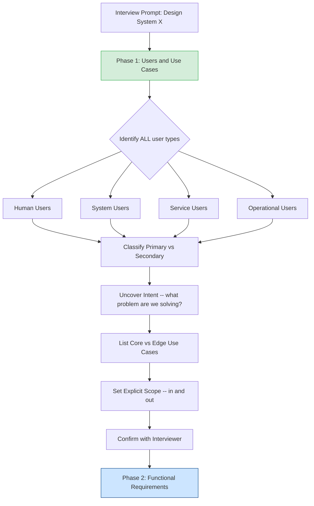

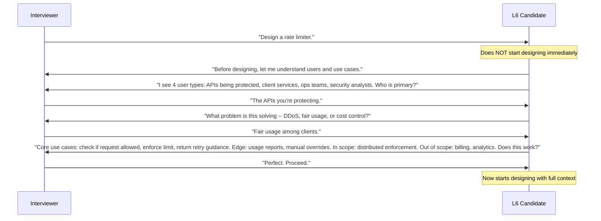

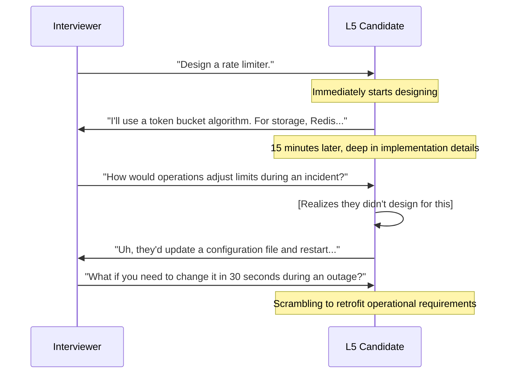

---

### Final words

Phase 1 feels like a soft skill -- just asking questions, just talking. It is not soft. It is the hardest and most valuable skill in system design.

The discipline is this: resist the urge to start drawing boxes. The first 5-10 minutes of a design interview are the most important. They determine whether you spend the next 40 minutes building the right thing or the wrong thing.

Every strong Staff Engineer you meet has developed this discipline. It does not come naturally. It requires practice.

Practice Phase 1 in isolation. Pick any system -- Netflix, Slack, Stripe, Uber. Spend 8 minutes doing only Phase 1. List all user types. Identify primary. Uncover intent. List core and edge use cases. State scope. Stop before designing.

Do that 20 times. It becomes instinct.

Then in the interview, you will be calm. You will have structure. And your design will be better than anyone who jumped straight to architecture.

---

*Chapter 14 Complete -- Phase 1: Users and Use Cases*

---

## 9. Conflict Resolution Between User Types

### Why conflicts are inevitable

When you design for multiple user types, their needs will clash. This is not a failure of design -- it is the natural result of serving different people with different goals.

End users want the feed to load in 100ms. The ML team needs to read all user activity data to train ranking models. Both needs are legitimate. Both cannot be served by the same database under the same load pattern without compromise.

The mistake is pretending conflicts do not exist, or assuming the right answer will become obvious later. Staff engineers name conflicts early and resolve them with a clear framework.

### The 3 most common conflict types

**Conflict 1: Performance vs. Analytics**

End users need fast responses. Analytics users need to run expensive queries over the same data.

Example: A marketing analyst wants to run a report that joins 90 days of delivery data across 10 million users. This query takes 30 seconds and consumes enormous database resources. At the same time, end users are opening the app and expecting their feed in 100ms.

If both use the same database, the query blocks or slows user-facing reads.

**Conflict 2: Simplicity vs. Power**

End users want simple, clean interfaces. Internal power users want full control and complex options.

Example: A support agent wants to see a user's complete history with every field, every metadata tag, every system flag. An end consumer wants a clean notification list with nothing confusing.

If you design for one, you burden the other.

**Conflict 3: Individual vs. Aggregate**

Individual users want immediate, personal responses. Operations and analytics teams want aggregate views.

Example: A user wants to know exactly whether their specific notification was delivered. An ops team wants aggregate delivery rates across all channels. Both are valid but use the data differently -- one needs per-record precision, the other needs throughput-optimized aggregation.

### The conflict resolution decision tree

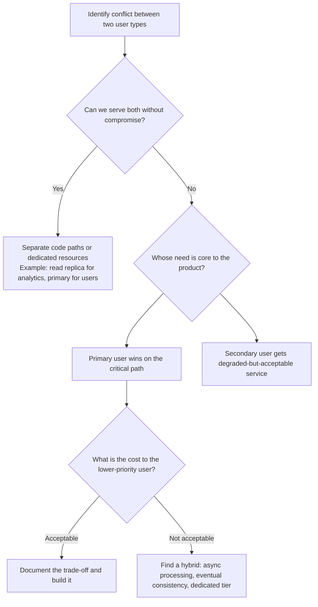

**Step 1 -- Can you serve both without compromise?**

Often yes. The answer is usually to separate the workload physically:

- Read replica for analytics queries, primary for user-facing reads
- Dedicated analytics cluster that consumes from an event stream
- BFF (Backend for Frontend) pattern that serves different payloads to different callers

**Step 2 -- If not, whose need is core to the product?**

This is where primary/secondary designation matters. You already decided this in Phase 1. The primary user wins on the critical path. The secondary user gets served in a way that does not degrade the primary experience.

**Step 3 -- What is the cost of the compromise for the lower-priority user?**

Name it explicitly. "Analytics data will be 2 hours delayed instead of real-time." "Marketing reports show yesterday's numbers, not today's." "ML training uses data from the previous day."

If the cost is acceptable, proceed. If it is not, find a hybrid.

### Worked examples

**Example A: End users want fast feed; ML team wants all data for training**

Conflict: The ML training pipeline needs to scan 100% of user activity. Running it against the production database would slow user-facing reads.

Resolution: Separate read paths. User-facing reads go to the primary database. ML training reads from a replica or a dedicated event stream (Kafka, Pub/Sub). The ML team gets slightly delayed data (seconds to minutes behind production). End users see no impact.

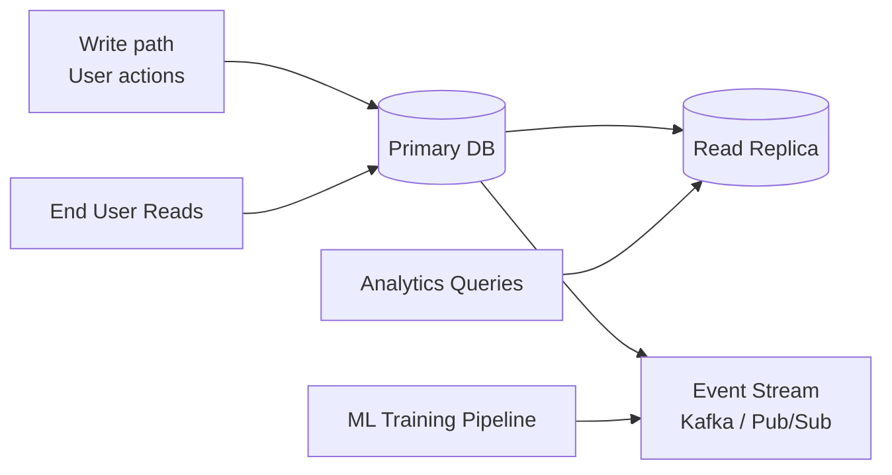

**Example B: Customer wants real-time inventory; warehouse wants batch reporting**

Conflict: The customer-facing inventory check must be fast (under 100ms). The warehouse team runs nightly batch reports that aggregate inventory across all SKUs and locations -- this takes minutes.

Resolution: Two different stores. Customer-facing inventory uses a fast, indexed read (Redis cache or primary DB). Warehouse batch reporting reads from a separate analytics warehouse (BigQuery, Redshift) that is updated every few minutes from the primary. Neither path interferes with the other.

**Example C: Mobile wants small payloads; web wants rich data**

Conflict: Mobile clients are on limited bandwidth and need compact responses. Web clients on fast connections want rich data with all fields for a full UI.

Resolution: BFF pattern -- Backend for Frontend. Two separate API layers, one optimized for mobile (compact, minimal fields, compressed), one for web (full fields, rich metadata). Both talk to the same underlying services but present different views.

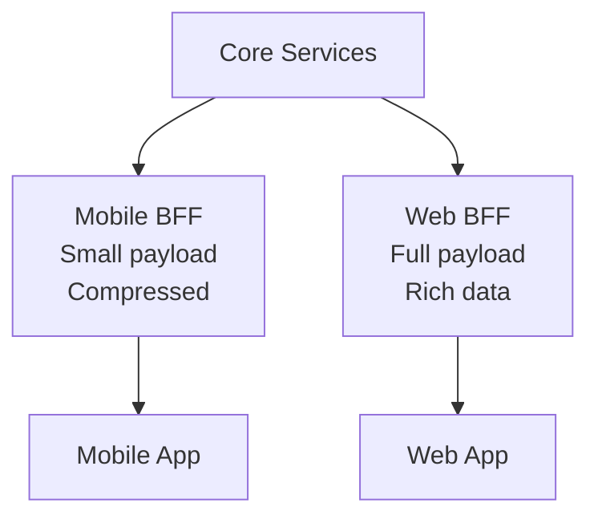

### The "silent user" problem

The most impactful user type is often the one nobody mentions in the original prompt.

The on-call engineer who will be paged at 3am when your system breaks is a user of your system. Their use case is: "Diagnose and resolve a production incident in under 15 minutes." If you do not design for this user, your system will be impossible to operate when it matters most.

Other silent users to look for:

- The support engineer who needs to investigate a specific user's complaint
- The compliance officer who needs to prove a transaction happened
- The finance team who needs to reconcile payment records at month-end
- The legal team who needs to export all data for a specific user under GDPR

These users are not mentioned in the prompt. They will absolutely use your system. Design for them in Phase 1 or retrofit painfully later.

---

## 10. Security, Compliance, and Human Factors

### The malicious user is a user type too

When enumerating user types, most engineers list the people the system is built for. They miss the people the system must be defended against.

Attackers have use cases just like legitimate users:

| Attacker goal | Use case they pursue | Design implication |
|---|---|---|
| Spam millions of users | Send unlimited notifications via the API | Rate limiting per sender, abuse detection |
| Harvest user emails | Enumerate user IDs via the notification API | No user-enumerable IDs, rate limit lookups |
| Trigger expensive operations | Send malformed requests that cause retries | Input validation, cost per request accounting |
| Bypass rate limits | Create multiple accounts to spread load | Per-IP limits, device fingerprinting |
| Read other users' data | Guess or forge session tokens | Strict auth, no predictable IDs |

Identifying attacker use cases in Phase 1 means your design includes defenses from the start, not as an afterthought.

**How to do this:** After listing legitimate user types, ask: "Who would want to abuse this system, and what would they try to do?" Spend 60 seconds on this. It surfaces requirements you would otherwise miss.

### Compliance users

Auditors, regulators, and legal teams are users of your system. Their use cases are defined by law, not by product requirements.

Three use cases that appear in almost every system:

**Right of access (GDPR Article 15):** "Show me all data you hold for user X." An auditor or the user themselves can request this. Your system must be able to export all records for a specific user in a reasonable time. This requires knowing where all user data lives -- across every table, every service.

**Right to erasure (GDPR Article 17):** "Delete all data for user X." Your system must be able to find and delete all records for a specific user. This is much harder than it sounds if data is spread across many services and caches.

**Audit trail (financial systems):** "Prove this payment happened." Financial regulators require immutable audit logs. Every payment must be traceable from initiation to settlement, with timestamps and actor IDs.

If these use cases are not in Phase 1, they cannot be properly designed for. Retrofitting GDPR compliance or financial audit trails into a system that was not designed for them costs months.

### Human factors: the exhausted on-call engineer

The on-call engineer at 3am is a user. They are tired. They are stressed. The alert fired at 2:47am and they have been awake for 20 minutes trying to understand what is wrong.

Their use case: "Diagnose the root cause and restore service in under 15 minutes."

For this user, your system needs:

- A clear, readable dashboard that shows system health at a glance -- not 200 metrics on one screen, but 5 key indicators
- Distributed tracing with request IDs so they can follow a single failing request through every service
- Obvious runbooks that say "if metric X is above threshold Y, do Z"
- Systems that surface relevant information rather than making the engineer search for it
- Control levers (feature flags, circuit breakers, rate limit adjustments) that can be operated without a code deploy

Designing for this user is what "operational excellence" means in practice. It is not abstract. It is a specific user with a specific use case and specific latency requirements.

### How to elicit non-obvious user types

After listing the obvious users, ask these questions:

- "Who else will interact with this system?" 
- "Who will integrate with this system programmatically?" (developers building on top of you)
- "Who will use this system to help customers?" (support engineers)
- "Who will query this system for business intelligence?" (finance, product analytics)
- "Who will audit this system for compliance?" (legal, compliance, security)
- "Who will attack or abuse this system?" (adversarial users)
- "Who will be woken up when this system breaks?" (on-call engineers)

Each question surfaces user types that are invisible from the original prompt but very real in production.

---

## 11. Operational Requirements as First-Class Citizens

### What operational requirements look like

Operational requirements are the requirements of the team running the system. They are not user stories in the traditional sense -- no product manager writes them. But they are just as real.

An operational requirement sounds like this:

"The on-call engineer must be able to identify the root cause of a delivery failure within 5 minutes."

This is a hard requirement, not a nice-to-have. If you cannot meet it, incidents take too long to resolve, SLAs are missed, and the team burns out.

### Operational requirements by system type

| System | Operational user | Key requirement |
|---|---|---|
| Notification system | On-call engineer | Identify which channel is failing within 3 minutes |
| Rate limiter | On-call engineer | Adjust limits for a specific client without deploy within 60 seconds |
| Messaging system | Support engineer | Find all messages between user A and user B from last week within 2 minutes |
| Payment system | On-call engineer | Identify whether a specific payment succeeded or failed, and why, within 5 minutes |
| Feed system | On-call engineer | Identify which component is causing feed latency within 3 minutes |

### How operational requirements drive design

The "5-minute diagnosis" requirement for a notification system does not mean you build a pretty dashboard. It means you must have:

1. **Per-stage metrics** -- How many notifications entered the queue? How many were dispatched? How many were delivered? How many failed? Without these, you cannot tell where the bottleneck is.

2. **Distributed tracing with request IDs** -- Every notification gets an ID at creation. That ID is passed through every service. When you look at the log for notification ID 12345, you can see exactly what happened at every stage.

3. **A runbook** -- A documented guide that says "if the delivery failure rate exceeds X%, check Y. If Y looks normal, check Z." The runbook is part of the system design. It cannot be added after the first incident.

You cannot add these after launch easily. Distributed tracing requires every service to pass and log the trace ID. Adding it later means modifying every service. Per-stage metrics require instrumentation at every stage. Runbooks require knowing which metrics matter -- which means thinking about operations before you build.

### The fire drill test

Before finalizing your design, ask: "If this system has an incident at 3am, what does the on-call engineer need to do?"

Walk through it step by step:
1. Alert fires. What metric triggered it?
2. Engineer opens dashboard. What do they see?
3. They need to narrow down the cause. What data can they look at?
4. They find the problem. What lever do they pull to fix it?
5. They verify the fix. What metric confirms it worked?

If any step has no answer -- no dashboard, no data, no lever -- that is a gap in your design. Fix it in Phase 1, not during the post-mortem.

### L5 vs. L6 on operational requirements

**L5 says:** "We'll add monitoring after we launch. We can instrument the system once we see what metrics we actually need."

**L6 says:** "Here are 5 specific metrics I would instrument from day one, and here is the alerting threshold for each:
1. Notification delivery success rate -- alert if < 99.5% over 5-minute window
2. Notification end-to-end latency (P95) -- alert if > 30 seconds
3. Queue depth per priority level -- alert if critical queue depth > 1000
4. Dead letter queue size -- alert on any increase
5. Per-channel error rate -- alert if any single channel exceeds 1% error rate"

The difference is concrete vs. abstract. L6 engineers have thought about operations deeply enough to name specific metrics. This is what L6 looks like in practice.

---

## 12. Cost and Sustainability as User Drivers

### How user types drive cost

Different user types create different cost structures. Understanding this in Phase 1 prevents expensive surprises at scale.

**End users** create read load. They open apps, view feeds, check status. Read load is high-frequency but usually lightweight per operation.

**Producers** (teams or services that create content) create write load. Writes are more expensive than reads -- they require durability guarantees, replication, indexing.

**Analytics users** create expensive query load. A single analytics query might scan billions of rows. One query from an analyst can consume more database resources than 10,000 user reads.

**Marketing campaigns** create burst write load. A marketing team sending a campaign to 10 million users creates a sudden spike that is 1000x the baseline.

### The "cost per user type" analysis

Once you have identified your user types, estimate the relative cost contribution of each. You do not need exact numbers -- order of magnitude is enough.

Example: Notification system

| User type | Traffic pattern | Cost contribution |
|---|---|---|
| End users reading notifications | 500K reads/day, lightweight | Low -- small reads, cached |
| Feed service triggering notifications | 1M writes/day, small payload | Medium -- consistent writes |
| Marketing campaigns | 10M writes per campaign, 2 campaigns/week | High -- burst writes, queue pressure |
| Analytics queries | 5 queries/day, full table scan | Very high per query -- expensive |

The marketing campaign is the cost risk. Not because it is the highest sustained load, but because it is unpredictable burst load that can overwhelm the system if not designed for.

### Sustainability: what happens at 10x growth?

Ask: if user count grows 10x, does cost grow linearly or faster?

Linear growth is manageable. If 10x users means 10x cost, you just scale horizontally.

Super-linear growth is a design problem. If 10x users means 50x cost because of a design choice that does not scale (full table scans, fan-out with no limit, no caching), you will hit a wall.

In the notification system example: if marketing campaigns send to all users and the user base grows 10x, campaign size grows 10x. But if the queue processing infrastructure is sized for the current peak and not the 10x peak, queue depth grows super-linearly during campaigns because you cannot process fast enough. That is a design choice to fix now, not later.

### Worked example: notification system cost drivers

**End users (delivery receipts):** Read-heavy, mostly cached. When a user opens the app and checks notifications, this is a cache read. Cost: low. Scales linearly.

**Producers (transactional notifications):** Moderate write load. Order confirmation, password reset, account alert. Predictable volume, grows with user count. Cost: medium. Scales linearly.

**Marketing campaigns (burst write):** This is where variability lives. A marketing team decides to send a re-engagement campaign to all 10 million users. This creates 10 million writes in a 2-hour window -- 1,389 writes per second compared to a baseline of maybe 50/second. Cost: spiky. Does not scale linearly if not designed for.

**Design for burst:** The way to handle this is not to size your write infrastructure for the campaign peak all the time (wasteful) but to use a rate-limited queue. Accept all 10 million writes immediately into a queue (cheap), then process them at a controlled rate (predictable, manageable). The queue absorbs the burst. The processing pipeline runs at steady rate.

This is a functional requirement: "The system must handle a 10x marketing campaign burst without proportional cost increase." This is not an NFR afterthought -- it is a core design requirement that comes directly from understanding the marketing team as a user type in Phase 1.

---

## 13. Use Case Evolution and the Degradation Ladder

### How use cases evolve over time

A system that starts with 3 use cases will have 30 use cases at V10. This is not a problem -- it is how products grow. The problem is when the architecture was designed only for V1 use cases and cannot accommodate V10 without a full rewrite.

Staff engineers design for use case evolution. They ask: "What will this system need to do in 2 years?" and make architecture choices that do not foreclose those futures.

### Notification system use case evolution

**V1 -- Just send emails:**
1. Producer sends a notification
2. System delivers via email
3. System records delivery status

**V3 -- Multi-channel, prioritized:**
1. Producer sends a notification with channel preference
2. System routes to email, SMS, or push
3. System applies per-user channel preferences
4. System retries on failure
5. System records delivery status per channel
6. System provides delivery analytics to producers

**V5 -- Full-featured platform:**
1-6 from V3, plus:
7. Producer specifies notification priority (critical / high / normal)
8. System enforces priority queues
9. System supports user notification preferences (do not disturb hours, opt-outs per category)
10. System supports A/B testing of notification content
11. System provides per-user delivery analytics
12. System supports notification templates
13. System throttles per-user notification rate

**V10 -- Enterprise platform:**
1-13 from V5, plus:
14. Multi-tenant isolation (different teams have different quotas)
15. Cost attribution per team
16. API versioning for external integrations
17. Webhook delivery to external systems
18. GDPR: delete all notifications for a user on request
19. GDPR: export all notifications for a user on request
20. Compliance audit log of all notifications
21. Rate limiting per sender team
22. Priority override for critical security alerts
23. Scheduled notification delivery (send at 9am user local time)
24. Notification bundling (aggregate 10 likes into one notification)
25. Delivery confirmation from push providers

V1 to V10 is not just adding features. Some V10 requirements (multi-tenant isolation, GDPR deletion) require architectural changes that are difficult to retrofit if not planned for.

### The "core vs. peripheral" classification

Not all use cases matter equally when the system is under stress.

**Core use cases** must work at all times, even in degraded mode. These are the uses cases the system fundamentally exists for. If they fail, the product fails.

Example: For a notification system, the core use case is "deliver a password reset email." If a user cannot reset their password, they are locked out. This is unacceptable.

**Peripheral use cases** can be disabled under load. They add value but are not the reason the system exists.

Example: Marketing campaign delivery is valuable, but it can be paused during an incident. Users are not locked out if a marketing email is delayed by 2 hours.

Making this classification explicit in Phase 1 allows you to design a degradation ladder.

### The Degradation Ladder Pattern

When a system is under stress, it does not fail all at once. It degrades gracefully through levels. The degradation ladder defines those levels before the first incident.

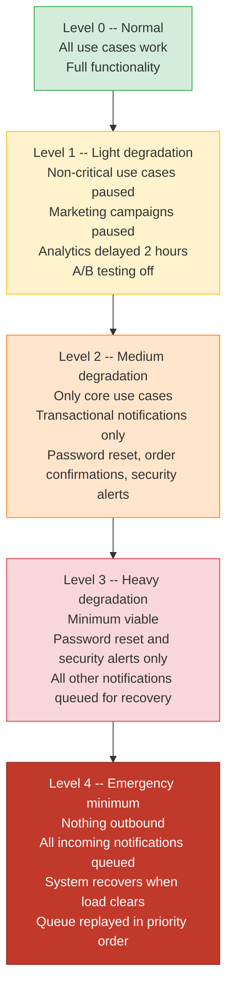

**Why define this before building?**

Because the degradation ladder requires architecture to support it. You cannot gracefully pause marketing campaigns during an incident unless:
- Marketing campaign notifications are in a separate queue from transactional notifications
- There is a feature flag or circuit breaker that pauses processing of the marketing queue
- The system knows the difference between a marketing notification and a password reset

If you design a single queue with no priority distinction, Level 1 degradation is impossible. You can only go from Level 0 to full outage.

Staff engineers define the degradation ladder in Phase 1 (use case classification: core vs. peripheral) and build the architecture to support it from day one.

---

## 14. Interview Calibration for Phase 1

### What interviewers are actually evaluating

During Phase 1, interviewers are not just listening to what you say. They are observing how you think. Here are the six signals they look for:

| Signal | L5 behavior | L6 behavior |
|---|---|---|
| **User identification** | Names 1-2 obvious user types (end users, admins) | Names all 4 types including operational and automated users; asks about non-obvious users |
| **Use case enumeration** | Lists features from the prompt ("users can send notifications") | Maps use cases to user types; separates intent from implementation |
| **Stakeholder awareness** | Treats the company as a single entity | Names specific teams and their distinct needs (marketing vs. product vs. compliance) |
| **Scale estimation** | "We need to handle millions of users" (generic) | Estimates traffic per user type; identifies which user type dominates load |
| **Operational users** | Rarely mentioned; monitoring is "we'll add it later" | Named explicitly with specific requirements; specific metrics listed |
| **Conflict identification** | Treats all users as having compatible needs | Proactively names conflicts; applies decision framework; documents trade-offs |

### Common Phase 1 mistakes that strong L5 engineers make

These are mistakes made by technically strong engineers who are used to executing on clear requirements:

**Mistake 1: Identifying users but treating them as equivalent**

"We have end users and admin users." True -- but end users need 50ms response time and admin users run reports that take 30 seconds. Treating them equivalently leads to designing a system that serves neither well.

Fix: For each user type, state their key requirement. "End users: sub-100ms read latency. Admin users: batch report capability within 5 minutes."

**Mistake 2: Listing use cases but not prioritizing them**

"Users can send notifications, receive notifications, manage preferences, view analytics, export data, configure templates..." All correct. But they are not equal. Without priority, the design spreads effort across everything and optimizes nothing.

Fix: Mark each use case explicitly -- Core (C), Secondary (S), or Edge (E). Say it out loud.

**Mistake 3: Missing the operational user type entirely**

An entire Phase 1 passes with no mention of the team that will run the system in production. The design has no monitoring, no observability, no control levers.

Fix: Always ask "Who monitors and debugs this system?" as a final check before moving on.

**Mistake 4: Treating "the company" as a user**

"The business needs analytics." Which team? What exactly do they need to know? When do they need it? "The company" is not a user. "The marketing team needs to know campaign delivery rates within 15 minutes of campaign completion, to decide whether to resend to non-openers" is a user with a specific use case.

Fix: Replace "the business" with a real team name and a specific use case.

**Mistake 5: Jumping to API design before use cases are complete**

After listing 2-3 use cases: "So the API would be POST /notifications with fields..." This is implementation before intent. Use cases are incomplete and you are already locking into decisions.

Fix: Finish the full use case list before touching any API design or architecture.

### What a "hire" Phase 1 looks like vs. a "no hire" Phase 1

**No hire -- Phase 1 transcript:**

Interviewer: "Design a notification system."

Candidate: "Sure. The users are end users who receive notifications, and producers who send them. The core use cases are: sending a notification and receiving it. I'll set scope to include email, SMS, and push. Let me now talk about the API..."

What is missing: No operational users. No system users. No service users. No intent analysis. Use cases are not prioritized. Scope is stated but not confirmed. Transition to API happens in under 60 seconds.

**Hire -- Phase 1 transcript:**

Interviewer: "Design a notification system."

Candidate: "Before I design, I want to spend about 5 minutes on users and use cases. Let me think through the four user types.

Human users: End consumers who receive notifications -- they want relevant, fast notifications. Support agents who investigate delivery failures -- they need per-notification traces. Compliance team -- they need audit logs and GDPR deletion capability.

System users: The services that trigger notifications -- checkout service, fraud detection, marketing platform. These generate most of the volume. They need a reliable, high-throughput API with idempotency keys since they retry on failure.

Service users: A nightly analytics job that aggregates delivery stats. An ML pipeline that reads notification engagement data for recommendation models. Both need bulk read APIs.

Operational users: The on-call engineer who gets paged when delivery fails. They need per-channel metrics, end-to-end trace IDs, and circuit breakers per channel.

Primary users are the end consumers -- the product exists for them. Secondary are producers and ops teams.

Intent: Producers want to reliably communicate with users. Consumers want relevant, timely information without being spammed.

Core use cases: Deliver a notification end-to-end; handle failure with retry; per-user preference controls.
Peripheral use cases: Marketing campaigns, analytics dashboard, A/B testing.

Scope: In scope -- notification routing and delivery, priority queues, preference management. Out of scope -- notification content creation, external push provider integration details, billing.

Does this scope work?

Interviewer: Yes, proceed.

Now let me talk about the functional requirements..."

The difference: complete user enumeration, intent analysis, prioritized use cases, explicit scope with confirmation, all in about 5-6 minutes.

### The 5-minute Phase 1 target

Staff engineers complete Phase 1 in 5 minutes, not 20.

This is not about rushing. It is about having internalised the framework deeply enough that it runs quickly. You are not discovering the framework in the interview -- you are applying it.

The 5-minute breakdown:
- 1 minute: Enumerate all user types (run the 7-step process mentally)
- 1 minute: Identify primary vs. secondary; name intent
- 1.5 minutes: List core and peripheral use cases
- 1 minute: State scope (in and out)
- 30 seconds: Confirm with interviewer

If you need 15+ minutes for Phase 1, you are not yet at L6 fluency. Practice until the framework runs in 5 minutes without effort.

---

## 15. The Notification Delivery Cascade Incident

This is a real failure pattern caused by a Phase 1 gap.

### Context

A notification system serves three producer teams:
- **Checkout team** -- sends order confirmations and shipping updates
- **Support team** -- sends service disruption alerts and account notices
- **Marketing team** -- sends promotional campaigns

All three teams use the same API with the same priority. Everything goes into a single queue. The system processes notifications in arrival order.

### The trigger

The support team sends a "service disruption" alert to all 10 million users simultaneously. This is a legitimate, reasonable thing to do -- customers need to know about a service outage. They use the standard API with default priority, because that is the only API available.

10 million notifications enter the queue in a 10-second window.

### The propagation

The queue, which normally has a few thousand items in it, now has 10 million. Processing rate is 50,000 per minute. It will take 200 minutes -- over 3 hours -- to clear.

During those 3 hours, every notification from every other team sits behind the support team's 10 million.

A user tries to reset their password. A password reset notification is generated. It enters the queue -- behind 9,800,000 support notifications.

### The user impact

The user trying to reset their password waits 45 minutes for their email. They cannot log in. They try again. Another password reset goes into the queue, now even further back.

Security risk: A user locked out of their account for 45 minutes is frustrated and may call support, may abandon the service, or may be a victim of account compromise who urgently needs to reset their password.

### The root cause

Phase 1 failure. "Critical security actions" was never identified as a separate use case with its own SLA. All notifications were treated as equivalent.

If the Phase 1 analysis had asked "are all notifications equal?" the answer would have been clearly no:

- Password reset: SLA = 30 seconds. A user is waiting, possibly locked out, potentially in a security emergency.
- Account notification: SLA = 5 minutes. Important but not urgent.
- Marketing campaign: SLA = best effort. No time guarantee.

### The design change

Once the incident happened, the team added criticality levels. Three priority queues:

1. **Critical queue** -- password reset, 2FA codes, account security alerts -- SLA 30 seconds
2. **High queue** -- order confirmations, shipping updates, support alerts -- SLA 5 minutes
3. **Normal queue** -- marketing, engagement, non-urgent communications -- SLA best effort

Each queue is processed by dedicated workers with dedicated capacity. A surge in normal queue does not affect critical queue at all.

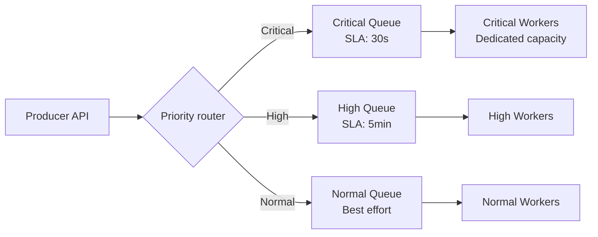

### The lesson

Phase 1 is where SLAs are born.

Every distinct use case with a distinct SLA requirement must be identified in Phase 1. If you group "password reset" and "marketing campaign" into the same use case bucket ("send notification"), you design a system that treats them identically. At low load this works fine. At high load it causes exactly this incident.

The question to ask during Phase 1 for every use case: "What is the maximum acceptable latency for this use case, and what is the consequence of exceeding it?" If two use cases have different answers, they are different use cases and require separate handling.

---

## 16. Finding ALL User Types from Any Prompt -- The 7-Step Process

When you hear a system design prompt, use this process to systematically find every user type. Run it mentally in 60-90 seconds.

**Step 1 -- Primary users**

Who directly uses the system's core feature?

For a notification system: End users who receive notifications.

**Step 2 -- Producer users**

Who creates or triggers the system's work?

For a notification system: Teams that send notifications -- checkout team, support team, marketing team.

**Step 3 -- Admin users**

Who configures and manages the system?

For a notification system: The platform team that sets rate limits, manages routing rules, configures notification templates, manages channel credentials.

**Step 4 -- Operational users**

Who keeps the system running?

For a notification system: On-call engineers who debug delivery failures and respond to incidents.

**Step 5 -- Automated users**

What other systems call this system programmatically?

For a notification system: The checkout service, the fraud detection service, the account security service -- all systems that trigger notifications without a human in the loop.

**Step 6 -- Compliance/audit users**

Who needs to see what happened?

For a notification system: Finance team needing delivery receipts for billing reconciliation. Legal team needing audit trail for regulatory requests. GDPR officer needing to export or delete all notifications for a specific user.

**Step 7 -- Adversarial users**

Who might abuse this system?

For a notification system: Spammers who want to send unlimited notifications to millions of users. Attackers trying to enumerate user IDs by seeing which notification sends succeed. Competitors probing the API for rate limit and pricing information.

### Applying the 7-step process to other systems

**A rate limiter:**

1. Primary users: Developers whose APIs are being protected
2. Producers: The callers being rate-limited (services, partners)
3. Admin users: Operations team configuring rate limit policies
4. Operational users: On-call engineers adjusting limits during incidents
5. Automated users: Every API caller is automated -- high-volume system users
6. Compliance/audit: Security team auditing which clients hit limits and when
7. Adversarial users: Attackers testing limit values to find exploitation windows; clients trying to bypass limits by distributing calls across IPs

**A URL shortener:**

1. Primary users: Individual users creating and clicking short URLs
2. Producers: Marketing teams creating campaign URLs in bulk
3. Admin users: Trust and safety team deactivating malicious links
4. Operational users: SREs monitoring redirect latency (latency-critical)
5. Automated users: Partner platforms shortening URLs via API at scale; browsers resolving redirects
6. Compliance/audit: Legal team requesting records of who clicked which links (subpoena response)
7. Adversarial users: Spammers creating thousands of URLs to bypass email filters; phishing attackers hiding malicious URLs behind a trusted short domain; scrapers harvesting destination URLs

**A ride-sharing system:**

1. Primary users: Riders requesting trips; drivers accepting trips
2. Producers: Not applicable directly -- riders and drivers are primary
3. Admin users: City operations teams configuring surge pricing; trust and safety team handling incidents; finance team managing driver payouts
4. Operational users: SREs monitoring match rates, GPS update frequency, payment success; support engineers investigating specific failed rides
5. Automated users: Payment processor (handles charges); mapping service (provides routes); background check provider (verifies new drivers); ETA model (scores ride estimates)
6. Compliance/audit: Regulatory bodies requiring ride records; legal team responding to law enforcement requests for trip data; insurance companies requesting accident records
7. Adversarial users: Fake drivers creating accounts to collect bonuses without completing rides; colluding riders and drivers manipulating ratings; fraudsters using stolen payment methods to take rides

---

## Real-Life Incidents -- When Phase 1 Was Skipped

### Incident 1: The Moderation System That Couldn't Be Moderated

A content moderation system was designed by a team who identified two user types: "content submitters" and "content reviewers." Three months after launch, they received a regulatory audit requiring them to produce, within 24 hours, a complete record of every moderation decision for the past 90 days -- who made it, when, what was the content, what was the outcome.

The compliance/audit user type was never identified. There was no audit log. The data existed in various places but was never structured for auditability. The engineering response: a 6-week emergency project to add audit logging retroactively. Cost: 2 engineers x 6 weeks = 12 engineer-weeks.

Staff lesson: The compliance/audit user has requirements that are expensive to add retroactively. Identify them in Phase 1. Their data requirements (immutability, completeness, retention period) must be designed in from day one.

---

### Incident 2: The API That Became a DDoS Tool

A public URL shortener service designed for end users was discovered by a group of adversarial users who used it to create millions of short links pointing to competitors' sites -- flooding them with traffic. The shortener had no rate limits per user, no link validation, no abuse detection.

The adversarial user type was never identified. The design had no concept of "someone might use this maliciously at scale." Adding abuse controls required: rate limiting per IP, link scanning integration, account-level throttling, and a trust-and-safety team workflow. All of these required architectural changes.

Staff lesson: Adversarial users are not rare. For any public-facing system, ask: "What can someone do with this system if they are trying to abuse it?" Design the answer into Phase 1 requirements.

---

### Incident 3: The Payments System With No Operator Interface

A payments team designed their system for two user types: "payers" and "payees." 11 months after launch, a batch processing bug caused duplicate charges to 50,000 customers. The ops team needed to: (1) pause new charges immediately, (2) identify affected transactions, (3) issue refunds in bulk.

There was no admin interface. There was no bulk refund tool. There was no way to pause the charge pipeline without a code deployment. The ops team spent 4 hours building ad-hoc scripts in production to fix the issue. Three customers complained publicly before the fix went live.

The operational user -- the person who needs to control the system in a crisis -- was never identified. Their requirements (pause controls, bulk operations, audit trails) were never designed.

Staff lesson: "Who operates this system when something goes wrong?" is a Phase 1 question with Phase 6 (Architecture) consequences. Always ask it.

---

## Brainstorming Questions -- For Subconscious Internalization

Write your answer to each before moving on. These build the instinct to think through all user types automatically.

**Question 1:** "Design an e-commerce platform." List all 7 user types. Who is the adversarial user? What specifically are they trying to do? What one design decision prevents them?

**Question 2:** You discover -- 6 months after launch -- that your system has no audit log. Which user type did you miss in Phase 1? What is the minimum system change to add auditing now? What would it have cost to design it in from day 1?

**Question 3:** A PM gives you this brief: "We need a simple chat system. Just let users send messages to each other." You are in Phase 1. List 5 questions you must ask before you agree to any scope. Which question has the biggest architectural impact?

**Question 4:** "Design a search autocomplete service." Who are the automated users of this system? What do they need that human users do not? How does their presence change your API design?

**Question 5:** Think of a system you operate at work. Who are its adversarial users? Is there anything in the current design that protects against them? What is the weakest point?

**Question 6:** You are 5 minutes into Phase 1 of a 45-minute interview. You have identified primary and secondary users. The interviewer says "that's good, let's move on." Do you move on? What 3 user types might you be missing? How do you decide whether to push for more time?

**Question 7:** "Design a ride-sharing app." A driver creates a fake account using a stolen identity, accepts rides, but never completes them. What user type is this? How does identifying them in Phase 1 change your onboarding design?

**Question 8:** Compare: "Design a consumer photo app" vs "Design a hospital photo management system." List the user types for each. Which user types are completely different? What does this tell you about the danger of applying patterns from one domain to another?

**Question 9:** "Design a real-time collaborative document editor." What are the requirements of the compliance/audit user that would NOT be obvious from the product description? How expensive is it to add these requirements after launch vs. designing them in?

**Question 10:** You are designing a financial trading platform. Your manager says "the users are just traders." You know this is incomplete. What 6 more user types exist? For each: name one system requirement that trader-only thinking would have missed.

**Question 11:** A system has been running for 3 years. Nobody has ever thought about the adversarial user. Today, a security researcher reports that the system can be exploited to extract private data from other users. Which Phase 1 question would have surfaced this? Write that question as you would ask it in an interview.

**Question 12:** You are doing a Phase 1 for a notification delivery system. List all the automated users (non-human system actors). For each automated user: what happens if they send malformed requests? Is your system designed to handle that gracefully?

**Question 13:** "Design a hotel booking system." You identify 7 user types in 3 minutes. The interviewer says "Nice, what about the hotel owner?" You missed them. What else might you have missed? What is the fastest way to check you have a complete list?

**Question 14:** In any Phase 1, there is a risk of going too deep on one user type and running out of time. How do you time-box your user analysis? What is your strategy for saying "I've done enough Phase 1" and moving on?

**Question 15:** "Design a news feed system." In Phase 1, you identify "content creators" as a user type. Specifically -- what do content creators need from the system that feed consumers do not? Name 3 requirements that only exist because of content creators.

---

## Homework Exercises

### Exercise 1: The 7-Type Sweep

For each of the following systems, do a complete 7-type user analysis. Time yourself -- target under 4 minutes per system.

Systems:
1. A banking mobile app
2. A fleet management system (trucks, deliveries)
3. A hospital patient scheduling system
4. A developer API platform (like Stripe or Twilio)
5. A live video streaming platform (like Twitch)

For each: which user type is hardest to remember under time pressure? Which one has the most surprising requirements?

---

### Exercise 2: Requirements That Come Only from User Types

Take this prompt: "Design a content management system for a news website."

First: list all 7 user types.

Then: for each user type, write one requirement that would NOT exist if that user type did not exist.

Example structure:
- Without operational users -> no requirement for: [X]
- Without adversarial users -> no requirement for: [Y]

After: count how many requirements you wrote. If you have 7 requirements (one per user type), your Phase 1 is driving Phase 2. If you have fewer, some user types are not informing requirements.

---

### Exercise 3: The Adversarial User Deep Dive

Choose any public-facing system (your own, or a well-known one like a URL shortener, rating system, or review platform).

Write a "threat model" from the adversarial user's perspective:
- Who are they? (spammer, competitor, fraudster, scraper, attacker?)
- What are they trying to achieve?
- What is their method?
- What is the impact if they succeed?
- What ONE architectural decision would stop them?

Practice: can you do this in 3 minutes for any system? This is a common L6 probe: "Who might abuse this system and how?"

---

### Exercise 4: Operational User Scenario Planning

Think about a system you own or know well. Now answer:

A critical bug causes the system to start processing duplicate transactions. You need to:
1. Stop the processing immediately
2. Identify all affected records
3. Roll back the duplicate operations
4. Notify affected users
5. Produce an audit report for compliance

Can your current system do all 5? For each capability that doesn't exist: trace it back to which user type's requirements were missing from Phase 1.

---

### Exercise 5: Phase 1 Under Time Pressure

This is a speed drill. Set a 2-minute timer.

Prompt: "Design a real-time leaderboard for a mobile game."

In 2 minutes, write:
- The 3 most important user types
- 1 non-obvious requirement per user type
- The one user type whose requirements would change the architecture most

Then do the same for: "Design a pharmacy management system."

Then: "Design a corporate expense management tool."

Goal: 3 systems, 2 minutes each. This builds the reflex. You should be able to identify 3 critical user types for any prompt within 60 seconds.

---

### Exercise 6: The Scope Negotiation

Find a partner. They give you a system prompt and then say: "Build everything. Don't cut anything."

Your job, in 5 minutes:
1. Identify the must-have core features (5 items max)
2. Identify what you are explicitly deferring (3 items with reasons)
3. Identify what you are explicitly out-of-scoping (3 items with reasons)
4. Get explicit "yes" from your partner on the scope

Success criteria: your partner understands exactly what you will and won't design, and agrees with your reasoning -- even if they initially wanted everything.

Practice this 3 times. The hardest part is saying "out of scope" confidently while making the other person feel heard.

---

### Exercise 7: From User Types to Architecture Constraints

Take the 7-user-type list you wrote for the banking mobile app in Exercise 1.

For each user type, write one architectural constraint they create:
- Primary users (customers) -> [architecture constraint]
- Admin users (bank ops) -> [architecture constraint]
- Compliance/audit users -> [architecture constraint]
- Adversarial users -> [architecture constraint]

Now: draw a rough architecture diagram. Circle every component that exists ONLY because of a specific user type's requirements.

Count the circles. In a well-designed system, most components should be traceable to user needs. If a component is uncircled, ask: "Why does this exist?"

---

### Exercise 8: The Full Phase 1 Walkthrough -- On Camera

This is the most important exercise.

Set up a camera or phone to record yourself. Pick this prompt: "Design a video streaming service."

Speak out loud as you do Phase 1. Walk through:
- "The users of this system are... Let me go through all 7 types..."
- "The core use cases are..."
- "The most important use case is... because..."
- "The edge case that will drive the architecture is..."

Watch the recording. Grade yourself:
- Did you cover all 7 user types?
- Did you say anything vague that you should have quantified?
- Did you sound confident or hesitant when naming the adversarial user?
- Did you identify a non-obvious use case that an L5 would miss?
- Did the whole Phase 1 take under 8 minutes?

Record this exercise monthly. You will see yourself improve. The goal: Phase 1 sounds like breathing -- automatic, complete, confident.

---

---

## Production Incident 3: Pinterest's 2013 Mobile API Misidentification

**Company:** Pinterest | **Year:** 2013

### What Happened (analogy first)

Imagine you design a restaurant menu for people who arrive by car and have an hour for lunch. Then 75% of your customers start showing up on foot, in a hurry, wanting something to eat in 10 minutes. Your menu has 40 items with long descriptions, no "quick picks" section, and the kitchen is optimized for plating elaborate dishes. You built the right restaurant for the wrong customer. That is Pinterest in 2013.

Pinterest launched as a desktop product. Their Phase 1 user identification said: "Users are people who discover and save visual content." True, but incomplete. The team built the API assuming desktop users: full-resolution images in every response, complex nested feed structures with 20-30 items per page, no offline mode because desktop users have stable WiFi, and no consideration for screen size or data cost.

By 2013, mobile usage had reached 75% of Pinterest's traffic. But the API was wrong in every dimension for mobile:
- Full-resolution images consumed 3-5x more data than necessary on a 4G connection
- 20-item feed pages were right for a desktop scroll; mobile users wanted 4-5 items that loaded fast
- No pagination optimized for "infinite scroll" on a small screen
- No offline mode meant a brief subway tunnel visit broke the entire app
- Battery usage was high because the client had to process more data than it needed

Pinterest spent 18 months rebuilding the API for mobile -- not because the original API was badly engineered, but because Phase 1 identified the wrong primary user. "Desktop user who saves images" and "mobile user who discovers images while commuting" are two different users with different architectures.

### Which Phase of the Framework Was Skipped or Done Poorly

**Phase 1 (Users and Use Cases) -- user identification omitted device type, network conditions, and usage context.**

The team named the user type correctly ("people who discover and save content") but failed to specify the dimensions that drive architecture:
- Device type: desktop vs. mobile (affects payload size, battery, screen layout)
- Network conditions: broadband vs. 4G vs. intermittent (affects offline requirements, image compression, payload size)
- Usage context: sitting at a desk vs. commuting (affects session length, interruption tolerance, scroll patterns)

All three dimensions are Phase 1 responsibilities. None were captured.

### ASCII Diagram

```
+-----------------------------------------------------------------------------------+
|                PINTEREST 2013 -- WRONG USER ASSUMPTION IN PHASE 1                 |
+-----------------------------------------------------------------------------------+
|                                                                                   |
|   Phase 1 said:           Actual user base by 2013:                               |
|                                                                                   |
|   +------------------+    +------------------+  +------------------+             |
|   | Desktop User     |    | Desktop User     |  | Mobile User      |             |
|   | - Broadband      |    | - 25% of traffic |  | - 75% of traffic |             |
|   | - Large screen   |    |                  |  | - 4G/LTE         |             |
|   | - Stable session |    +------------------+  | - Small screen   |             |
|   | - 1 hour session |                          | - Commuting      |             |
|   +------------------+                          | - 5 min session  |             |
|          |                                      +------------------+             |
|          v                                              |                         |
|   API designed for desktop:                    Desktop API served to mobile:      |
|   - Full res images (2MB each)                 - 2MB images on 4G = 20s load      |
|   - 20 items per page                          - 20 items = 40MB per page load    |
|   - No offline support                         - App breaks in subway tunnel      |
|   - Complex nested JSON                        - Battery drain from parsing       |
|                                                                                   |
|   Result: 18 months of rework to rebuild API for mobile-first users               |
|                                                                                   |
+-----------------------------------------------------------------------------------+
```

### Root Cause

Phase 1 user identification was one-dimensional. It named who uses the product but not how they use it. User identification in Phase 1 must capture: user type, device type, network conditions, and usage context. Missing any one of these can require a full API rebuild.

### Fix Applied

Pinterest rebuilt their API with a "device profile" system: clients declare their device type and network conditions at auth time, and the API server returns appropriately sized payloads. Mobile clients get compressed, cropped images. Feed page size is configurable by device class. An offline-first architecture with local caching was introduced for mobile. The Phase 1 process at Pinterest was updated to require a "user profile matrix" -- a table listing each user type crossed with device type and network conditions before any API design begins.

### Staff Lessons

- **"User" is not a single dimension.** A user is a combination of: who they are, what device they are on, what network they have, and what context they are in (commuting, at desk, in a meeting). Each combination can drive a different architecture.
- **Mobile is not a subset of desktop.** Mobile users have fundamentally different constraints -- battery, bandwidth, screen size, session length, interruption frequency. Treating mobile as a "smaller desktop" is how you end up with 18 months of rework.
- **Phase 1 device type drives Phase 3 payload calculations.** The image size on a mobile device is not a detail -- it is a major component of your bandwidth estimation. If you identify the wrong device type in Phase 1, your entire Phase 3 scale estimate is wrong.

---

## Production Incident 4: Zoom's 2020 Scale Explosion

**Company:** Zoom | **Year:** 2020

### What Happened (analogy first)

Imagine you design a taxi company assuming: average trip = 2 passengers, primary use case = business commute to the office. You buy cars with 4 seats, hire dispatchers optimized for short routes, and build a pricing model for 8AM-10AM peak hours. Then, overnight, every school in the country decides to use your taxis as classrooms. Average trip = 50 passengers, primary use case = 4-hour classes, peak hours = all day. Your entire operation model is wrong, even though you correctly identified the user type: "people who need to get from point A to point B." That is Zoom in 2020.

Pre-COVID, Zoom's design assumptions were well-reasoned and correct for their target market. Phase 1 use case analysis had identified: average meeting size = 8 people, primary use case = business meeting, meeting duration = 45-60 minutes, user type = corporate professional. These assumptions drove the architecture's most important decision: for meetings under 10 people, Zoom uses a peer-to-peer (P2P) mesh network where each participant connects directly to the others. For meetings over 10, Zoom routes through a server-side media relay.

The 10-person P2P threshold was chosen because it was the right balance for business meetings: P2P keeps latency low for small groups, and the vast majority of business meetings are small.

In March 2020, everything changed:
- Average meeting size jumped to 50+ for online classes
- Use case distribution flipped: education became 40% of all meetings (it was near zero before)
- Meeting duration extended to 3-4 hours for school days
- Simultaneous meeting count grew 300x in weeks

The P2P/server relay inflection point at 10 people was not designed to absorb a world where 80% of meetings exceeded it. The server-side relay infrastructure was sized for maybe 20% of meetings needing it. Suddenly 80% needed it. The system buckled.

### Which Phase of the Framework Was Skipped or Done Poorly

**Phase 1 (Users and Use Cases) -- use case frequency distribution was underspecified.**

Zoom's Phase 1 had correctly identified the actors (business professionals, students, teams). But the use case analysis assumed a specific distribution: "most meetings are 2-10 people." That assumption was not written down as a constraint -- it was embedded silently in the architecture choice (P2P threshold). When the distribution changed, the embedded assumption caused a cascade failure.

Phase 1 must capture not just the use cases but the expected frequency distribution of each use case. "95% of meetings are under 10 people" is a Phase 1 statement that must be written explicitly, because it is load-bearing for the architecture.

### ASCII Diagram

```
+-----------------------------------------------------------------------------------+
|                ZOOM 2020 -- USE CASE FREQUENCY DISTRIBUTION COLLAPSE              |
+-----------------------------------------------------------------------------------+
|                                                                                   |
|   Pre-COVID use case distribution:     Post-COVID use case distribution:          |
|                                                                                   |
|   Under 10 people: 90% of meetings    Under 10 people: 20% of meetings           |
|   Over 10 people:  10% of meetings    Over 10 people:  80% of meetings           |
|                                                                                   |
|   Architecture decision (based on pre-COVID):                                     |
|   If meeting size <= 10: use P2P mesh (no server relay needed)                   |
|   If meeting size > 10:  use server relay                                         |
|                                                                                   |
|   Infrastructure sizing:                                                          |
|   Server relay capacity sized for 10% of meetings needing it                     |
|                                                                                   |
|   Post-COVID reality:                                                             |
|   80% of meetings hit server relay -> 8x the designed capacity                   |
|        |                                                                          |
|        v                                                                          |
|   +------------------+                                                            |
|   | Server Relay     | <-- 8x overload                                            |
|   | Infrastructure   |                                                            |
|   +------------------+                                                            |
|        |                                                                          |
|        v                                                                          |
|   Latency spikes -> dropped participants -> failed meetings                       |
|                                                                                   |
|   Phase 1 assumption that was SILENT:                                             |
|   "90% of meetings are under 10 people"                                           |
|   Should have been WRITTEN as: a constraint that triggers architectural review    |
|   if the distribution changes by more than 20%.                                  |
|                                                                                   |
+-----------------------------------------------------------------------------------+
```

### Root Cause

Use case frequency distribution was not written down as an explicit Phase 1 statement. It was assumed and baked into an architecture decision (the P2P threshold). When the real-world distribution shifted, the architecture did not have a documented trigger for reassessment. The lesson is not that Zoom should have predicted COVID -- no one could. The lesson is that silent assumptions embedded in architecture are time bombs. Write them down in Phase 1 so they can be revisited.

### Fix Applied

Zoom rapidly scaled server-side relay capacity and invested heavily in their own data centers (rather than relying solely on cloud providers). They also introduced adaptive media routing: the P2P vs. server threshold became dynamic, adjustable without a deployment. Long term, they moved server relay infrastructure from reactive capacity to pre-provisioned regional capacity sized for peak distribution, not average distribution. The design process was updated to require explicit documentation of use case frequency assumptions, marked as "architecture-sensitive" so that any change in those assumptions triggers an architecture review.

### Staff Lessons

- **Use case frequency distributions are Phase 1 artifacts.** "Most meetings are under 10 people" is as important as "meetings exist." Write the distribution explicitly. It is load-bearing for your architecture.
- **Silent assumptions embedded in architecture are the most dangerous kind.** When a threshold (10 people for P2P) is chosen based on an unstated assumption, the assumption disappears from view. Months later, nobody knows why the threshold is 10 and whether it still applies.
- **Plan for use case distribution shift as a failure mode.** Every system has a "design center" -- the use case distribution it was built for. At Phase 1, ask: "What happens if this distribution shifts by 2x? 10x?" If the answer is "the architecture breaks," that is an NFR that needs to be captured in Phase 4.

---

## Production Incident 5: Robinhood's 2020 Zero-Commission Outage

**Company:** Robinhood | **Year:** 2020

### What Happened (analogy first)

Imagine you run a gym. You design the building for 500 members because you charge $80/month and expect people to use it 3-4 times a week. Then you announce: "Free membership for everyone." Suddenly you have 5,000 members, but more importantly, your existing 500 casual members now show up every day instead of twice a week. The building is not the bottleneck -- the lockers, the showers, and the equipment are, because you sized them for "500 members at average usage frequency." Your use case was right (people exercising at a gym) but your use case frequency was off by 10x. That is Robinhood in 2020.

When Robinhood launched zero-commission trading, the user type was correctly identified: retail investors, primarily millennials, making small to medium-sized trades. The team had sized the database for monthly active user volume. The frequency assumption was: a retail investor makes 2-3 trades per month. This was historically accurate for commission-based retail trading. At $5-7 per trade, even enthusiastic retail investors self-limited their frequency.

When the commission dropped to zero, the frequency constraint disappeared. The same users who made 3 trades per month now made 3 trades per day. Monthly active users did not change much -- but daily transaction volume per user increased by roughly 10x. The database was sized for MAU x 3 trades per month. The actual load was MAU x 3 trades per day. The database connections exhausted, the order processing queue backed up, and on the first major market moving day after launch, the system went down during market hours -- the worst possible time for a trading platform.

### Which Phase of the Framework Was Skipped or Done Poorly

**Phase 1 (Users and Use Cases) -- use case frequency was tied to a business model assumption that was about to change.**

The team identified the use case correctly: "Retail investors place trades." But the frequency estimate (2-3 trades per month) was derived from a pricing model ($5-7 per trade) that was being eliminated. The business model change was the trigger for the Phase 1 analysis -- and nobody asked: "If the pricing constraint is removed, how does use case frequency change?" This is the Phase 1 question that was missed.

### ASCII Diagram

```
+-----------------------------------------------------------------------------------+
|             ROBINHOOD 2020 -- USE CASE FREQUENCY WRONG BY ORDER OF MAGNITUDE     |
+-----------------------------------------------------------------------------------+
|                                                                                   |
|   Phase 1 analysis:                                                               |
|   User type: Retail investor                                                      |
|   Use case: "User places a trade"                                                 |
|   Frequency: 2-3 trades/month (based on industry data at $5-7/trade)             |
|                                                                                   |
|   Database sized for:                                                             |
|   MAU = 5M users                                                                  |
|   Trades/month = 5M x 2.5 = 12.5M trades/month                                  |
|   Trades/day = 12.5M / 30 = ~417K trades/day                                     |
|                                                                                   |
|   Business change: commission -> $0                                               |
|   (This change was the reason they were doing the design)                        |
|                                                                                   |
|   Actual frequency post-launch:                                                   |
|   Trades/month: 2-3 x 10 = 20-30/month per user                                  |
|   (or equivalently: 2-3/day)                                                     |
|   Actual trades/day = 5M x 2 = 10M trades/day                                    |
|                                                                                   |
|   Estimate: 417K/day    Reality: 10M/day    Delta: 24x off                        |
|                                                                                   |
|   +--------------------+                                                          |
|   | Database           | <-- 24x overload on market open day                     |
|   | (sized for 417K/d) |                                                          |
|   +--------------------+                                                          |
|        |                                                                          |
|        v                                                                          |
|   Connection pool exhausted -> order queue backed up -> outage during market hrs  |
|                                                                                   |
|   The Phase 1 question that was NEVER ASKED:                                      |
|   "If commission = $0, how does use case frequency change?"                       |
|                                                                                   |
+-----------------------------------------------------------------------------------+
```

### Root Cause

Use case frequency was derived from a business model constraint (price per trade) that was being eliminated. The team did not recognize that their frequency estimate was load-bearing and tied to an assumption that was about to become false. Phase 1 must not just capture the use case -- it must capture the assumptions behind the frequency estimate and flag which assumptions are "architecture-sensitive."

### Fix Applied

Robinhood implemented circuit breakers on order processing to prevent total collapse (degrade gracefully rather than fail hard). Long term, they redesigned the database sharding to be keyed by user activity level rather than user count, and added rate limiting per user as a circuit breaker. The Phase 1 process was updated to require a "sensitivity analysis": for each frequency estimate, ask "what business, product, or external change would cause this estimate to be wrong by 5x? By 10x? How does the architecture respond?"

### Staff Lessons

- **Use case frequency is not a constant -- it is a function of business model, pricing, and market conditions.** When any of those change, frequency can change dramatically. Phase 1 must identify what the frequency estimate depends on.
- **The most dangerous Phase 1 mistakes are in the numbers, not the categories.** Getting the user type right (retail investors) but the frequency wrong (3 trades/month vs. 3 trades/day) is enough to bring down the system. Getting the category wrong AND the number wrong is just noisier.
- **Phase 1 analysis should be repeated whenever a major business assumption changes.** A pricing change, a feature launch, a new partnership, a marketing campaign -- each can change use case frequency. Phase 1 is not a one-time exercise at the beginning of a project.

---

## Brainstorming Questions

**Question 1 -- The right level of user segmentation**
You are designing a social media platform. "Users" is too broad, but "18-24-year-old urban US users who prefer short-form video and are online after 9PM" might be too narrow for a system design interview.
- How do you decide how finely to segment users in Phase 1? What is the test for whether a user segment is worth calling out separately?
- Follow-up: Give an example where over-segmenting users in Phase 1 leads to an unnecessarily complex design.

**Question 2 -- Use case prioritization**
You have identified 15 use cases for a payment system. You cannot design all 15 in 45 minutes. How do you pick which 3-5 to focus on?
- What criteria do you use to prioritize use cases in Phase 1? List at least 4 criteria.
- Follow-up: If the interviewer's prioritization disagrees with yours, how do you handle that?

**Question 3 -- DAU vs. MAU and when it matters**
For most systems, the key scale driver is daily active users (DAU), not monthly active users (MAU). But some systems are MAU-driven: a tax filing app, an annual report tool, a birthday reminder app.
- How do you decide whether to design around DAU or MAU? What is the question you ask to determine which one matters?
- Follow-up: For a system where DAU = 10% of MAU, what does that tell you about the read-to-write ratio and the caching strategy?

**Question 4 -- Functional vs. non-functional requirements in Phase 1**
Phase 1 is supposed to capture users and use cases. But interviewers often slip NFRs into Phase 1: "The system must be fast." "It needs to be available globally."
- How do you handle an NFR that shows up in Phase 1 without breaking your framework flow?
- Follow-up: What is the risk of trying to answer an NFR in Phase 1 before you have completed the functional requirements?

**Question 5 -- The use case that changes the architecture**
Most use cases in a system are "normal" and drive a predictable architecture. But one use case -- often an edge case -- drives the entire design. For Twitter, it was "celebrities with 100M followers posting in real-time." For Uber, it was "surge pricing during a storm when all drivers are busy."
- How do you find the "architecture-driving" use case in a system you have not designed before?
- Follow-up: What do you do when the architecture-driving use case is one the interviewer has not mentioned?

**Question 6 -- Handling underspecified requirements**
An interviewer gives you the prompt: "Design a notification system." That is the entire prompt. No users named. No use cases specified. No scale.
- Walk through exactly how you would run Phase 1 for this prompt. What questions do you ask, in what order?
- Follow-up: What is the minimum set of Phase 1 answers you need before you can move to Phase 2?

**Question 7 -- International users and data residency**
You are designing a system for a company planning to expand from the US to Europe and Asia. International users are a use case that is easy to identify -- but data residency laws (GDPR in Europe, PIPL in China) are not "use cases" in the traditional sense.
- How do you handle data residency requirements in Phase 1? Where do they belong in the framework?
- Follow-up: Give a concrete example where a European user's data residency requirement changes the architecture compared to a US-only design.

**Question 8 -- Accessibility as a use case**
Many engineers omit accessibility from Phase 1 -- screen readers, keyboard navigation, high-contrast mode, and similar features. But for some systems (government portals, healthcare apps, banking), accessibility is legally required.
- How do you decide whether accessibility is a Phase 1 use case or an implementation detail?
- Follow-up: Give an example where identifying an accessibility use case in Phase 1 changes the API design.

**Question 9 -- The adversarial user**
Every system has users who will try to misuse it: bots that spam a messaging platform, sellers who game a marketplace ranking, traders who exploit a pricing API.
- How do you surface the adversarial user in Phase 1 without spending 20 minutes on abuse prevention?
- Follow-up: What is the minimum Phase 1 acknowledgment of adversarial users that prevents an L6-level interviewer from penalizing you?

**Question 10 -- Use case frequency modeling**
You have identified the use case "User uploads a photo." For Instagram, that happens millions of times per day. For a government document portal, it happens thousands of times per year. The frequency drives the entire Phase 3 analysis.
- How do you estimate use case frequency for a system you have no personal data on? What is your estimation process?
- Follow-up: What happens to your Phase 3 scale estimate if your use case frequency is off by 10x?

**Question 11 -- Internal users in a consumer-facing product**
Most engineers focus Phase 1 entirely on external users: "users who send messages," "users who place orders." But internal users -- the operations team, the support team, the on-call engineer -- have their own use cases that often drive significant architectural requirements.
- Name three internal user use cases for a ride-sharing platform (like Uber) that would change the architecture if ignored.
- Follow-up: How do you surface internal user requirements in an interview without making it seem like you are designing an admin panel instead of the actual system?

**Question 12 -- Estimating scale from use case frequency**
You have identified the use case "A business sends a marketing email to their customer list." The scale of this system depends entirely on how many businesses, how large their lists are, and how often they send. None of these are in the prompt.
- Construct a complete Phase 1 scale estimation for an email marketing platform, starting from first principles. Show your assumptions explicitly.
- Follow-up: Which assumption in your estimate is most likely to be wrong, and how does being wrong about it affect the architecture?

**Question 13 -- Use cases that conflict**
A system may have use cases that conflict with each other. Example: "Readers need feeds to load in under 100ms" conflicts with "Writers need posts to be visible immediately across all regions." You cannot satisfy both simultaneously with simple architecture.
- How do you handle conflicting use cases in Phase 1? Do you resolve the conflict in Phase 1 or defer it?
- Follow-up: What is the right Phase 1 output for a conflict that you know will require a trade-off in the architecture?

**Question 14 -- Device type as a use case variable**
Pinterest in 2013 learned that "mobile user" and "desktop user" are different use cases with different architectures. But device type is not always the split that matters. For a fintech app, "power trader" vs. "occasional investor" matters more than device type.
- How do you identify which user attribute (device, frequency, geography, expertise level) is the architecture-relevant split for a given system?
- Follow-up: Give an example where the wrong split in Phase 1 user segmentation leads to a design that works for 80% of users but fails for the 20% that matter most.

**Question 15 -- When to stop asking Phase 1 questions**
Phase 1 can expand indefinitely. You could spend an hour mapping every possible user and use case. In a 45-minute interview, you have maybe 8 minutes for Phase 1.
- What is your stopping condition for Phase 1? How do you know when you have enough information to move on?
- Follow-up: What is the one thing you should always confirm with the interviewer before leaving Phase 1?

**Question 16 -- Use case vs. user story vs. requirement**
These three terms are used interchangeably in practice but mean different things. A use case is a structured description of an interaction. A user story is a one-liner from the user's perspective. A requirement is a specification that must be met.
- Why does the distinction matter in a system design interview context? Give an example where confusing them leads to a different (worse) architectural decision.
- Follow-up: Which format is most useful in a system design interview: use case, user story, or requirement? Defend your answer.

**Question 17 -- The Phase 1 question that is actually a Phase 3 question**
An interviewer asks: "How many users does the system need to support?" This sounds like a Phase 1 question, but it is really a Phase 3 (scale) question. Phase 1 is about who and what, not how many.
- How do you handle scale questions that appear during Phase 1 without breaking the framework?
- Follow-up: What is the cost of answering scale questions during Phase 1 instead of deferring them to Phase 3?

**Question 18 -- Multi-tenant systems and user identification**
A SaaS product like Salesforce or Slack has two layers of users: the organization (a paying customer) and the individual user within that organization. The organization has use cases (billing, user management, compliance) that are completely separate from the individual user's use cases (sending messages, reading feeds).
- How do you structure Phase 1 for a multi-tenant SaaS system to capture both layers of users?
- Follow-up: Give an example where forgetting the organizational-level user in Phase 1 causes a significant architectural oversight.

**Question 19 -- L6-level Phase 1 in under 8 minutes**
An L6 engineer does Phase 1 better than an L5, but in the same amount of time. That means more signal per minute: asking better questions, identifying non-obvious users faster, and linking use cases to architecture implications on the fly.
- What are the 3 most important things an L6 engineer says during Phase 1 that an L5 does not say?
- Follow-up: How do you develop the Phase 1 instinct faster than "just do more interviews"?

**Question 20 -- Linking Phase 1 to the rest of the framework**
Phase 1 is valuable only if the users and use cases identified there actually drive decisions in phases 2-5. An L5 often treats Phase 1 as a checklist that gets filled in and then forgotten.
- How do you actively use Phase 1 outputs throughout the rest of the design? Give a concrete example of a Phase 1 user identification that changes a Phase 4 NFR.
- Follow-up: At the end of a 45-minute design session, how do you verify that every major architectural decision traces back to a Phase 1 user or use case?

---

## L5 vs. L6 Calibration Table

| Dimension | L5 (Senior) | L6 (Staff) |
|-----------|-------------|------------|
| **User identification depth** | Names 1-2 obvious user types ("end users," "admins") | Systematically walks through all 4 user types: primary, internal, system, indirect. Names specific roles: ops team, on-call engineers, downstream services |
| **Use case prioritization** | Lists use cases in the order they come to mind | Explicitly ranks use cases by architectural impact: "This use case drives the read/write ratio. This one drives the consistency model." |
| **Scale estimation accuracy** | Estimates at the user count level: "100M users, so we need a big database" | Estimates at the use case frequency level: "100M users x 3 reads/day / 86,400 = 3,500 reads/sec baseline. Peak 5x = 17,500. Cache target 95% hit ratio." |
| **Constraint identification** | Lists constraints given by the interviewer | Surfaces implicit constraints: "Mobile users on 4G imply a payload size constraint. European users imply GDPR data residency." |
| **NFR surfacing** | Treats NFRs as Phase 4 only | Begins building an NFR list during Phase 1: "The real-time notification use case signals low-latency delivery will be a key NFR." |
| **Stakeholder consideration** | Designs for the primary end user only | Includes internal users (ops, support, on-call), system users (partner APIs, internal services), and indirect users (regulatory bodies, affected third parties) |
| **Edge case identification** | Designs for the average user; mentions edge cases at the end | Identifies the edge case that drives architecture in Phase 1: "Celebrity accounts posting to 50M followers -- that is the edge case that decides the fanout strategy." |
| **Use case frequency modeling** | States use cases without frequency estimates | Attaches a frequency to each use case: "Users read feeds 20x/day, post 1x/day. 20:1 read-to-write ratio -- that drives caching strategy." |
| **Data residency awareness** | Not mentioned unless the interviewer brings it up | Asks: "Are there users in the EU or China? That changes whether we can store data in a single US region." |
| **Accessibility consideration** | Treated as an implementation detail | Asks: "Is accessibility a legal requirement for this product? If yes, which use cases are affected?" |
| **International scale** | Assumes users are in one country; adds "CDN for global users" as a vague afterthought | Identifies which use cases change for international users: latency, language, currency, regulatory, and payment method differences. |
| **Framework time allocation** | Spends variable time on Phase 1; no explicit budget | States the time budget at the start: "I will spend about 8 minutes on Phase 1. Let me start with users and use cases." Visibly tracks time and transitions on schedule. |

---

*Chapter 14 complete. Next: Chapter 15 -- Phase 2: Functional Requirements.*

---

## How Your Thinking Evolves: Intern to Staff Engineer

*Same problem at four levels: Phase 1 for a ride-sharing app like Uber.*

### Intern Level: "Users are people who use the app"

"Users are riders who request rides and drivers who accept them."

Two user types. Done. The intern moves on to designing the database.

What's missing: What about ops teams who monitor the city-level supply/demand dashboard? What about third-party developers using the Uber API (airports, hotels embedding ride-booking)? What about the matching algorithm itself as a "user" of the location service? What about regulators who need audit logs?

Missing user types = missing requirements = wrong architecture.

### Mid-Level (L4): "Let me enumerate the actors"

L4 lists: riders, drivers, ops team, customer support. They're thinking about the people who touch the system. Better. But still missing: they haven't thought about use case FREQUENCY. A rider requests a ride once a day. A driver accepts 10 rides a day. Ops is watching a dashboard continuously. Customer support looks up 1 incident per 10 minutes. The frequency difference is 10x-100x between user types -- this changes database access patterns, caching strategy, and which APIs need to be fast.

### Senior (L5): "Let me model use cases with frequency"

L5 writes:

| User Type | Use Case | Frequency | Latency Requirement |
|-----------|----------|-----------|---------------------|
| Rider | Request ride | 1/day | < 2 seconds |
| Driver | Accept/decline | 10/day | < 500ms |
| Driver | Update location | Every 5 seconds (while active) | < 100ms |
| Ops | View heatmap | Continuous | < 5 seconds (refresh) |

The driver location update is the killer: 500,000 active drivers x 1 update per 5 seconds = 100,000 writes/second. This is the most frequent use case. It is NOT the most obvious use case. L5 finds it because they model frequency, not just actor type.

```
L5 USE CASE FREQUENCY MODEL:
  High frequency (100K/sec): Driver location updates
  Medium (10K/sec):          Ride requests + matching
  Low (1K/sec):              Payment processing
  Very low (100/sec):        Support ticket lookup

  Architecture follows frequency, not business importance.
```

### Staff (L6): "Let me model use cases with constraints and future state"

L6 does everything L5 does, then asks:

"What use cases am I NOT being told about? In 2 years, Uber Eats (food delivery) will use the same location and matching infrastructure. Does Phase 1 need to account for a 'delivery item' actor in addition to riders and drivers?"

"What are the adversarial use cases? Drivers gaming the location system to appear in high-surge zones. Riders creating fake accounts for free credits. These are use cases I need to design against, not just design for."

"What are the regulatory use cases? In some cities, every ride must be logged for 7 years for regulatory audit. The audit log is a use case with different NFRs (durability over latency) that won't appear in the product spec."

```
L6 PHASE 1 CHECKLIST:
  [ ] Primary users (the obvious ones)
  [ ] Internal users (ops, support, analytics)
  [ ] System users (other services calling your APIs)
  [ ] Future users (what does this look like in 2 years)
  [ ] Adversarial users (who tries to abuse this)
  [ ] Regulatory users (who audits this)
  [ ] Use case frequency modeling (not just type)
  [ ] Geographic distribution (different behavior by region)
```

### The Pattern

- Intern: names the actors
- L4: enumerates actors and use cases
- L5: models frequency and derives the hard scaling problem
- L6: finds the hidden use cases, models future state, accounts for adversarial and regulatory actors

In an interview: L6 signal is asking "what am I NOT being told about the users?" before drawing anything.
