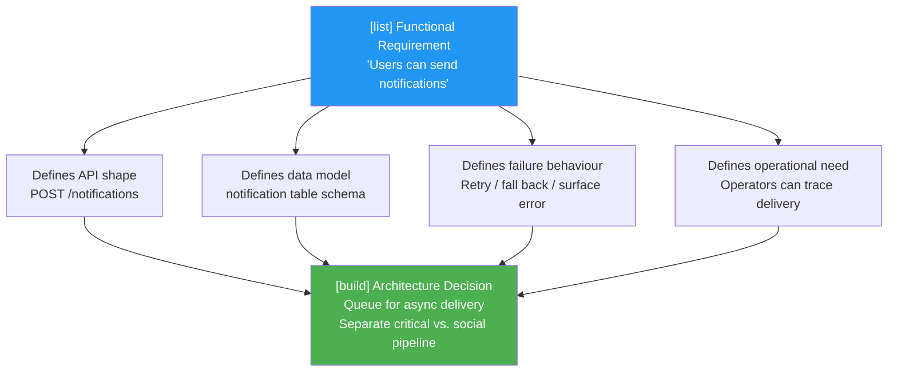
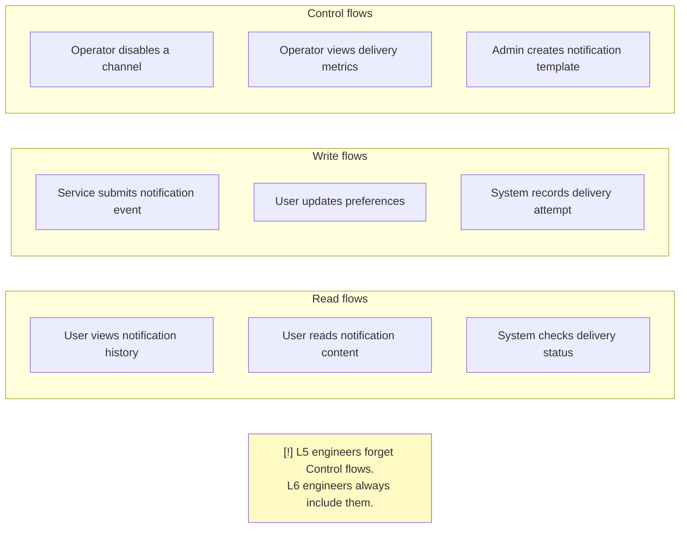
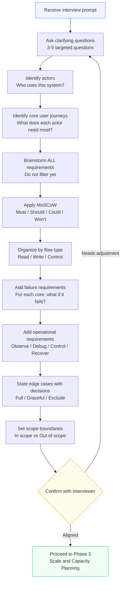
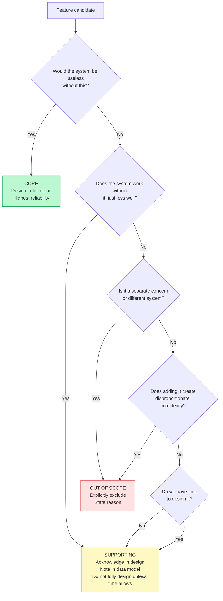
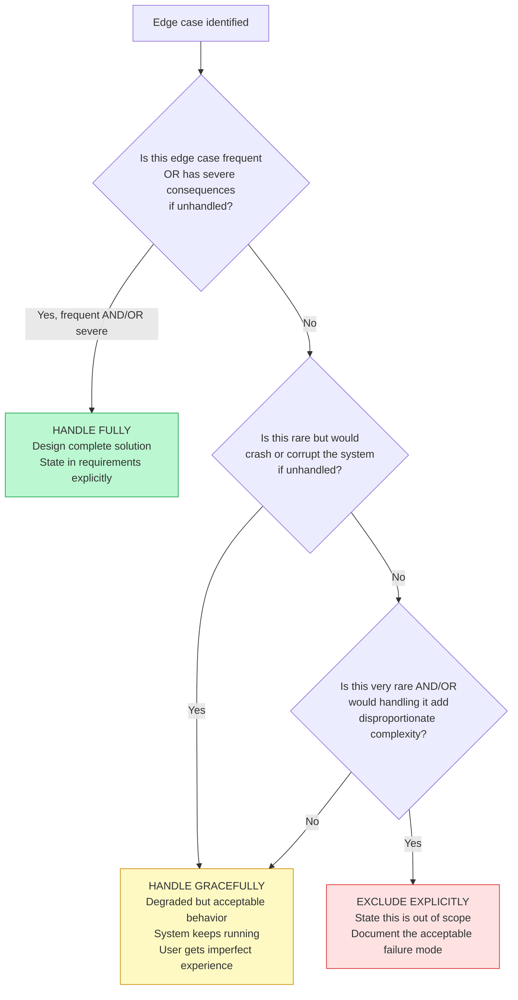
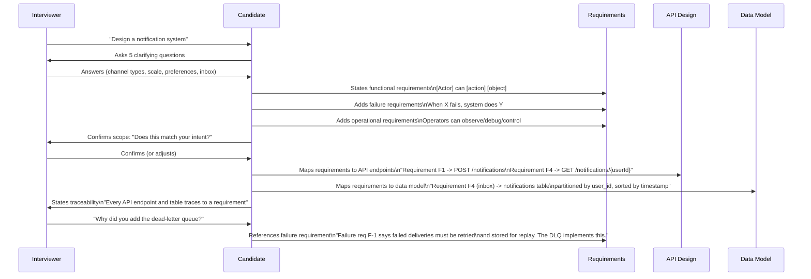
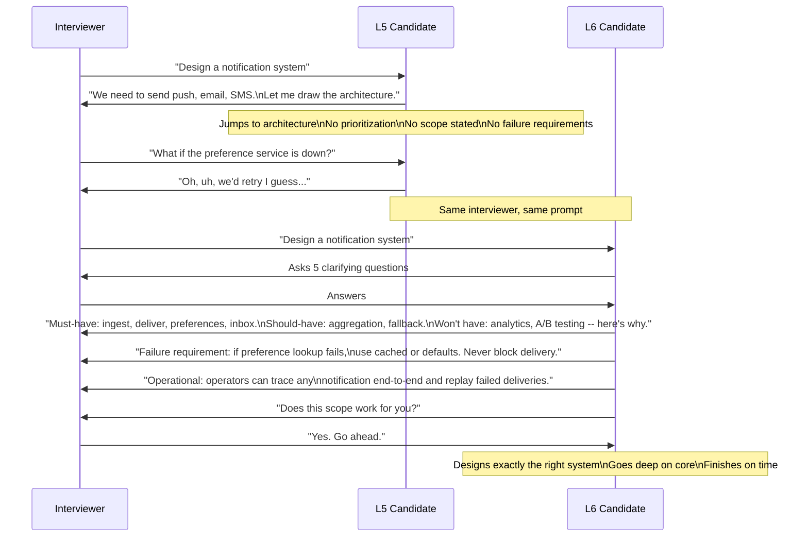
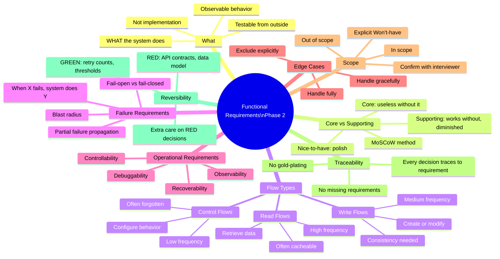
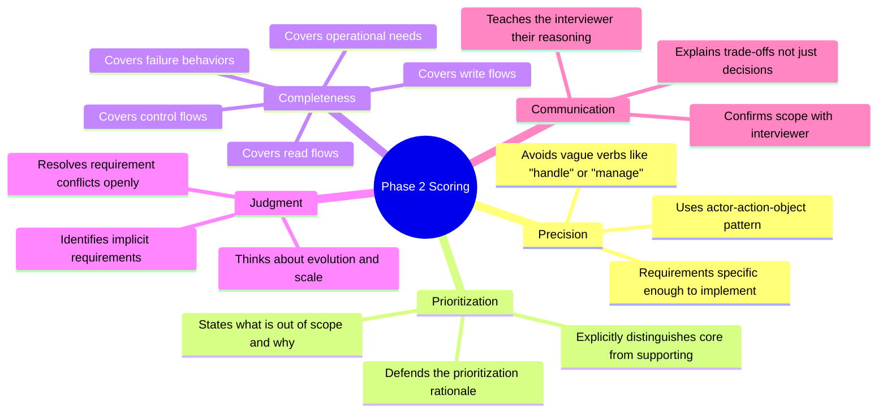

# Chapter 15: Phase 2 -- Functional Requirements (Simplified for L6 Preparation)

> **Who this is for:** A recent college graduate preparing for Google Staff Engineer (L6) system design interviews. Every term is defined on first use. Short sentences. First principles always.

---

## Chapter at a Glance

```
+===============================================================================+
|        CHAPTER 15 -- PHASE 2: FUNCTIONAL REQUIREMENTS AT A GLANCE              |
+===============================================================================+
|                                                                               |
|  CORE IDEA: Functional requirements define WHAT the system does -- not HOW.   |
|  Every requirement must be testable, traceable, and specific enough to drive  |
|  a real architectural decision.                                               |
|                                                                               |
|  THE REQUIREMENT PATTERN:                                                     |
|  "[Actor] can [action] [object] [constraints]"                                |
|  "Users can send a text message to any non-blocked user,                      |
|   delivered within 5 seconds, up to 4,096 characters."                       |
|                                                                               |
|  MoSCoW PRIORITY:                                                             |
|  Must   -> System is broken without it     -> Design fully in this session     |
|  Should -> Significantly improves product  -> Note it, defer for time          |
|  Could  -> Nice to have                    -> Out of scope today               |
|  Won't  -> Explicitly excluded             -> State WHY -- this shows judgment  |
|                                                                               |
|  THREE FLOWS to always cover: Read | Write | Control (admin/config)           |
|  FAILURE REQUIREMENT FORMAT: "When X fails, the system does Y."               |
|                                                                               |
|  L5 vs L6 IN ONE LINE:                                                        |
|  L5: Lists features. L6: Specifies behaviors with constraints + failure modes.|
|                                                                               |
+===============================================================================+
```

---

## Quick Visual: L5 vs L6 -- Phase 2 Thinking

| Dimension | L5 (Senior) | L6 (Staff) |
|-----------|-------------|------------|
| **Requirement format** | "The system handles messages" | "Users can send a text message to any non-blocked user, delivered within 5 seconds" |
| **Prioritisation** | All requirements treated as equal | Explicitly: Must / Should / Could / Won't -- defends each category |
| **Failure requirements** | Not mentioned | "When delivery fails: retry 3x, fall back to email, surface error to sender" |
| **Operational requirements** | Only end-user features | Includes: "Operators can view delivery success rate; trace any notification end-to-end" |
| **Scope discipline** | Keeps adding features mid-design | "Analytics is out of scope. I'll make the data model support it -- but won't design it." |
| **Flow coverage** | Only read and write flows | Includes control flows: "Operators can disable a channel without a deploy" |
| **Edge cases** | Handled vaguely ("we'll handle errors") | Explicitly triaged: handle fully / graceful degradation / exclude with reason |
| **Confirmation** | Moves to design without checking | "Does this requirement set match what you had in mind?" |

---

## Visual Overview: How Requirements Flow to Architecture



---

## Visual Overview: The Three Flow Types



---

## 1. Learning Goal

By the end of this chapter you will be able to:

- Explain what a functional requirement is, in plain English
- Separate functional requirements from non-functional requirements without confusion
- Elicit requirements from a vague interview prompt using a structured process
- Distinguish between stated requirements (what the interviewer says) and implicit requirements (what they mean but did not say)
- Prioritize requirements using the MoSCoW method (Must / Should / Could / Won't)
- Identify core features vs. nice-to-have features and defend your choice
- Show how functional requirements drive API design and data model design
- Understand requirements traceability -- every design decision must link back to a requirement
- Avoid the three most common mistakes: designing features nobody needs, missing critical workflows, gold-plating
- Work through four full examples: notification system, URL shortener, ride-sharing, social feed
- Demonstrate the full L6 "Design Twitter" brainstorming process step by step
- Negotiate requirements with your interviewer like a Staff Engineer
- Know the difference between reversible and irreversible requirements

This is a long chapter. That is intentional. Functional requirements are the foundation. If you get this phase wrong, every later decision is built on sand.

---

## 2. Why This Matters

### The problem with skipping requirements

Many candidates hear "Design Twitter" and immediately start drawing boxes. They say "we need a database, we need a cache, we need a load balancer" without first agreeing on what the system actually does.

This is like a builder who starts pouring concrete before reading the architectural plans. You might pour it in the right place. You might not.

In a 45-minute interview, a candidate who skips requirements usually spends 30 minutes designing a system the interviewer did not want. When the interviewer says "actually I care more about the search feature," the candidate has to backtrack. They look unfocused. They run out of time.

A candidate who spends 8 to 10 minutes nailing requirements will spend the remaining 35 minutes designing exactly the right system, going deep on the interesting parts, and impressing the interviewer with focused judgment.

### What L6 looks like in this phase

An L5 engineer lists features. They say "the system should send messages, store messages, show history, support reactions, support read receipts, support search, support groups..."

An L6 engineer prioritizes, traces requirements to user needs, and explicitly says what they are NOT building in V1 and why. They sound like this:

> "The core of this system is sending a message and the recipient receiving it. Everything else -- reactions, read receipts, search -- works without it or enhances it. I will design the core deeply. I will note that reactions and search can be added later without breaking the core architecture. I will not design them unless we have time. Agreed?"

That is L6 thinking. This chapter will teach you to think that way.

### Why requirements drive everything downstream

Every major design decision in your interview traces back to a requirement:

- **API design** -- shaped by what operations users need to perform
- **Data model** -- shaped by what data you need to store and how you need to query it
- **System components** -- shaped by which operations are read-heavy vs write-heavy
- **Consistency choices** -- shaped by how wrong is it if two users see different data
- **Failure handling** -- shaped by what happens if a component goes down

If you design the API before defining requirements, you may create endpoints for operations nobody needs. If you design the data model first, you may structure data for queries you will never run.

Requirements come first. Everything else follows.

---

## 3. Core Concepts

### 3.1 What Is a Functional Requirement?

**Definition:** A functional requirement describes what a system does. It describes observable behaviors and capabilities. It answers the question: "What must this system do?"

The key word is *observable*. A functional requirement is something you can see from the outside. You can test whether it is true or false.

**Examples of functional requirements:**
- "Users can send text messages to other users"
- "Users can retrieve their message history"
- "The system delivers messages to recipients in near-real-time"
- "Operators can configure rate limits per client"

Each of these describes something you can observe and test. Did the message arrive? Yes or no. Can the user see their history? Yes or no.

**What a functional requirement is NOT:**
- "Messages are stored in Cassandra" -- this is an implementation detail (the *how*, not the *what*)
- "Messages are delivered within 100ms" -- this is a non-functional requirement (the *how well*, not the *what*)
- "The system uses Kafka for async delivery" -- again, implementation

### 3.2 Functional vs. Non-Functional Requirements

This distinction trips up many candidates. Here is a clean way to think about it.

**Functional requirement = WHAT the system does**
**Non-functional requirement = HOW WELL the system does it**

| Functional (WHAT) | Non-Functional (HOW WELL) |
|---|---|
| Users can send messages | Messages are delivered within 1 second |
| Users can search their history | Search returns results in under 200ms |
| Users can set notification preferences | Preferences take effect within 5 seconds |
| The system logs all API calls | Logs are retained for 90 days |
| The system delivers notifications | Notification delivery is 99.9% reliable |

**Why does the distinction matter?**

Functional and non-functional requirements drive different design decisions.

If you learn that the system must let users search their history (functional), you know you need a search capability. You design it.

If you learn that search must return results in 200ms (non-functional), you know you need an index. You choose an appropriate storage system.

These are different decisions. Mixing them up causes confusion. Define the *what* first. Add the *how well* later in Phase 4.

**Mental model:** Think of functional requirements as the menu at a restaurant. They tell you what dishes are available. Non-functional requirements are the quality standards -- how fast the food arrives, how fresh the ingredients are, how consistent the preparation is.

### 3.3 Stated vs. Implicit Requirements

This is a concept that separates L6 from L5 thinking.

**Stated requirements** are what the interviewer explicitly says. "Design a URL shortener." They want: take a long URL, return a short URL, redirect when someone visits the short URL.

**Implicit requirements** are what the interviewer expects but did not say out loud, because any reasonable engineer would know they are needed.

For a URL shortener, implicit requirements include:
- Short URLs must not collide (two different long URLs cannot produce the same short URL)
- Short URLs must not be guessable (a malicious user should not be able to enumerate all short URLs)
- The system must handle the case where a short URL does not exist (return a 404, not crash)
- The system must handle the case where the original URL is dead (redirect anyway, or check?)
- Created URLs must persist reliably (not disappear after a server restart)

If you only address stated requirements, you will miss critical edge cases. Your design will look shallow.

An L6 engineer actively hunts for implicit requirements. They ask: "What must be true for this system to be trustworthy, even though nobody said it out loud?"

**How to find implicit requirements:**

Ask yourself these questions for any system:

1. What happens when a user does something wrong? (invalid input, unauthorized action)
2. What happens when a component fails? (database is down, network times out)
3. What happens at the boundaries? (first user, millionth user, exactly at limit)
4. What do operators need to manage this system?
5. What security properties do users assume, even if they never asked?

### 3.4 The WHAT vs. HOW Separation

This is the most important rule in Phase 2.

**Functional requirements describe WHAT. They never describe HOW.**

Wrong: "The system publishes messages to a Kafka topic for async delivery to recipients."

Right: "The system delivers messages to recipients asynchronously with at-least-once guarantee."

The second version describes the same behavior (async delivery, at-least-once) without committing to Kafka. Maybe you will use Kafka. Maybe you will use RabbitMQ. Maybe you will use a database-backed queue. The requirement does not care. The design phase will choose.

This matters for interviews because if you bake implementation into requirements, you have made technology choices before doing any analysis. You cannot reason about trade-offs. You just assumed.

**The test:** Read your requirement out loud. Does it contain the name of a database, a queue, a framework, or a protocol? If yes, strip it out. Replace with the behavior.

- "Store messages in MySQL" -> "Store messages durably so they can be retrieved later"
- "Publish to Kafka" -> "Deliver events asynchronously to consumers"
- "Cache in Redis" -> "Return results quickly for repeated queries"

### 3.5 The Requirement Statement Pattern

Use this pattern for every functional requirement you write:

**[Actor] can [action] [object] [optional: constraints]**

- Actor = who or what does the action (user, operator, service, external system)
- Action = verb describing the operation (send, retrieve, configure, delete)
- Object = what the action operates on (message, notification, rate limit, URL)
- Constraints = optional conditions that bound the behavior (within 10 seconds, for the last 7 days, up to 10MB)

**Examples:**

| Actor | Action | Object | Constraints |
|---|---|---|---|
| Users | can send | text messages to other users | up to 10,000 characters |
| Users | can retrieve | their conversation history | for the last 30 days |
| Services | can submit | notification requests | with recipient, content, and channel |
| Operators | can configure | rate limits per client | effective within 1 minute |
| The system | delivers | notifications to users | in near-real-time |
| The system | retries | failed deliveries | up to 3 times with backoff |

This pattern forces you to be specific. You cannot write "system handles messages" using this pattern. "Handles" is not a verb. "Messages" without a sender or receiver is incomplete.

### 3.6 Core vs. Nice-to-Have Features

Not all requirements are equally important. Knowing which ones are core vs. which are nice-to-have is a key L6 skill.

**Core functionality** = the system is useless without this. If it fails, the system is broken. Users would not use it.

**Supporting functionality** = the system works without this, but in a diminished way. Users notice it is missing but they can still accomplish their main goal.

**Nice-to-have functionality** = adds polish or convenience. Most users may not even notice if it is absent.

**How to classify:**

Ask yourself: "If I remove this feature from V1, would users refuse to use the system?"

- If yes -> Core
- If they would use it but complain -> Supporting
- If most would not notice -> Nice-to-have

**Example: Messaging system**

| Feature | Classification | Reason |
|---|---|---|
| Send a message | Core | System is useless without this |
| Receive a message | Core | System is useless without this |
| View conversation history | Core | Users need to read past messages |
| Message reactions (emoji) | Supporting | Works without it; WhatsApp launched without it |
| Read receipts | Supporting | Useful but not essential |
| Typing indicators | Nice-to-have | Nice polish; not critical |
| Message search | Supporting | Users can scroll; painful but possible |
| Message threads | Nice-to-have | Adds structure but not essential for V1 |
| Voice messages | Nice-to-have | Different use case; add later |

**Why this matters in an interview:**

In a 45-minute interview, you cannot design everything. If you classify correctly, you spend your time on the 3 core features that matter and mention the rest without designing them. Your design is deep and focused.

If you do not classify, you spread your time across 10 features, none of which are designed well. Your design is shallow and unfocused.

**The L6 statement:**

"Core features for this design are sending, delivery, and history retrieval. These three are essential. I will design these in detail. Features like reactions, read receipts, and search are supporting -- I will note that the data model accommodates them, but I will not design them unless we have time. Voice and video are out of scope. Agreed?"

### 3.7 The MoSCoW Method

**MoSCoW** stands for: Must have / Should have / Could have / Won't have.

This is a prioritization framework from product management. It applies perfectly to system design interviews.

**Must have (M):** System cannot function without this. Non-negotiable.

**Should have (S):** Important but not critical. If excluded from V1, the system still works. High priority for V2.

**Could have (C):** Nice improvement. Low priority. Include only if time allows.

**Won't have (W):** Explicitly excluded. You are making a conscious decision not to build this. Not because it is unimportant -- because it is out of scope for this design.

**Example: Applying MoSCoW to a notification system**

| Requirement | MoSCoW | Reason |
|---|---|---|
| Accept notification requests from services | M | Core purpose |
| Deliver notifications via push and email | M | Core purpose |
| Respect user preferences (opt-out) | M | Legal/trust requirement |
| Store notification history (inbox) | S | Users expect it; can add in V2 |
| Aggregate similar notifications | S | Prevents spam; important but not day-1 |
| Channel fallback (push fails -> email) | S | Reliability feature; add in V2 |
| Delivery analytics (open rates) | C | Nice for product team; not user-facing |
| A/B testing notification content | W | Separate experimentation platform |
| Admin UI for managing templates | W | Use API/CLI for now |

**Using MoSCoW in your interview:**

After listing requirements, say:

"Let me apply MoSCoW prioritization. Must-haves are [list]. Should-haves are [list] -- I will note them but not design them today. Could-haves I will acknowledge. Won't-haves I am explicitly excluding: [list and reason for each]."

The "Won't have" column is especially powerful. It shows you have thought about these things and made a deliberate choice, rather than simply forgetting them.

### 3.8 How to Elicit Requirements From an Ambiguous Prompt

An interview prompt is usually ambiguous on purpose. "Design Twitter" tells you almost nothing about what the interviewer cares about.

Your job is to ask the right clarifying questions to narrow the scope. Here is a structured process.

**Step 1: Identify the actors**

Who uses this system? There are usually multiple types of users.

For Twitter:
- Regular users (read and write tweets)
- Celebrities / high-profile accounts (much more followers, write infrequently)
- Consumers (mostly read, rarely write)
- Advertisers (write ads, care about targeting)
- API developers (third-party apps)
- Operators / admins (manage the platform)

Not all actors are equally important. Ask: "Who is the primary user I should optimize for?"

**Step 2: Identify the core user journey**

For each primary actor, what is the single most important thing they want to do?

For Twitter:
- Regular user: Post a tweet and see it appear in followers' feeds
- Consumer: Open the app and see relevant content
- These two journeys define the core.

**Step 3: Ask explicit scope-narrowing questions**

These are questions you ask the interviewer before diving into requirements:

- "Are we designing for read-heavy or write-heavy usage?" (Twitter is ~10:1 read to write)
- "Are we focusing on the feed generation, the tweet storage, or both?"
- "Are we handling media (images, videos) or just text?"
- "Are we designing for global scale or a single region?"
- "Do we need to handle trends and search, or just the feed?"

Each answer eliminates a huge swath of design space and lets you focus.

**Step 4: Confirm your understanding**

Once you have asked 3-5 questions, state your understanding and ask for confirmation:

"Based on what you told me, here is what I understand we are building: [summary]. The primary actors are [X, Y]. The core use cases are [A, B, C]. I am explicitly not designing [D, E] because [reason]. Does that match your intent?"

This confirmation step is critical. It prevents you from spending 30 minutes on the wrong system.

**Step 5: List and prioritize requirements**

Now that you have scope clarity, list requirements using the MoSCoW method. State core requirements first, supporting next, exclusions last.

### 3.9 Read Flows, Write Flows, and Control Flows

Most systems have three types of operations. Organizing your requirements by flow type helps ensure you do not miss anything.

**Read flows** -- operations that retrieve data without changing it:
- Load the home feed
- View conversation history
- Check current rate limit usage
- Fetch a user profile
- Resolve a short URL

**Write flows** -- operations that create or modify data:
- Post a tweet
- Send a message
- Create a short URL
- Record a click event
- Update notification preferences

**Control flows** -- operations that change how the system behaves or is configured:
- Set rate limits per client
- Enable or disable a feature flag
- Configure notification routing rules
- Set URL expiration policy
- Manage blocklists

**Why this taxonomy matters:**

Each flow type has different technical properties:

| Property | Read Flows | Write Flows | Control Flows |
|---|---|---|---|
| Frequency | Highest | Medium | Lowest |
| Latency sensitivity | Usually high | Variable | Usually low |
| Consistency needs | Can tolerate eventual | Often needs strong | Needs strong |
| Cacheable? | Yes | No | Rarely |
| Failure tolerance | Can serve stale data | Must not lose data | Must not corrupt state |

If you know a system is 95% reads, you design for reads. You cache aggressively. You use read replicas. You optimize the read path.

If you forget control flows, you may build a system that has no way to change its behavior without a code deploy. This is a real problem in production and it is a signal interviewers look for.

**The completeness check:**

After listing requirements, use this mental checklist:

- Have I covered all read flows? Who reads what, when?
- Have I covered all write flows? Who writes what, when?
- Have I covered all control flows? What needs to be configurable? Who configures it?

If you can answer all three questions confidently, your requirements are complete.

### 3.10 Behavior Specification Pattern

For complex behaviors -- especially ones involving conditions -- use this pattern:

**When [trigger condition], the system [action] for [affected entities] according to [rules or constraints].**

This pattern is useful for requirements that have conditional logic baked in.

**Examples:**

"When a message is sent, the system delivers it to the recipient in real-time and stores it for later retrieval."

"When a rate limit is exceeded, the system rejects the request with HTTP 429 and includes a Retry-After header."

"When a notification event occurs, the system delivers a notification to the affected user through their preferred channels, respecting their current preference settings."

"When a user creates a short URL, the system generates a unique key and stores the mapping for the configured retention period."

"When a delivery fails, the system retries up to 3 times with exponential backoff, then marks the notification as undelivered and emits a metric."

Notice that each of these specifies the trigger (when), the action (what the system does), who is affected, and any relevant rules. None of them mention a database, a queue, or a specific technology.

### 3.11 Requirements Traceability

**Requirements traceability** means every design decision you make can be traced back to a specific requirement.

This is a concept from software engineering, but it is deeply relevant to interviews.

The idea is simple: you should not be designing anything that is not required. If you are about to add a component, an API endpoint, a table, or a cache layer, you should be able to say: "I am adding this because requirement F3 says [X]."

If you cannot trace a design decision to a requirement, either:
- You are over-engineering (gold-plating) -- designing things nobody asked for
- You have a missing requirement -- there is a real need that you forgot to state explicitly

**How to use traceability in interviews:**

As you design, state your rationale:

"I am adding a separate notification inbox table because requirement F4 says users can view their notification history. This table is optimized for reads by user ID."

"I am adding a preference cache because requirement F3 says we respect user preferences, and F-2 (the failure requirement) says preference lookup failure must not block delivery. The cache provides fast reads and enables fallback."

When an interviewer asks "why did you add X?" you have a crisp answer: "Requirement Y required it."

This also protects you from scope creep. If someone says "you should also add full-text search," you can say: "That is a good feature but we did not identify it as a core requirement. Adding it now would change the data model significantly. Should we add it to scope?"

### 3.12 The Reversible vs. Irreversible Requirement Distinction

Not all requirements are equally costly to change later. This is a crucial L6 insight.

**Reversible requirements** -- if you get these wrong, they are cheap to fix later:
- UI behavior (change a button label, reorder a list)
- Business logic rules (change the retry count from 3 to 5)
- Feature flags (turn a feature on or off)
- Alert thresholds (change from 90% CPU to 85%)

**Irreversible requirements** -- if you get these wrong, they are expensive or impossible to fix later:
- **API contracts** -- once external clients use an API, changing it breaks them. You are stuck.
- **Data model** -- once you store data in a particular schema, migrating it is expensive and risky.
- **Consistency model** -- if you build on eventual consistency and later need strong consistency, you have to redesign.
- **Public URL structure** -- once short URLs are distributed, you cannot change their format.
- **Encryption** -- once you store data unencrypted, adding encryption requires migrating all existing data.

**Why this matters:**

When you are defining requirements, you should spend extra time and care on requirements that drive irreversible decisions. Get those right. Be precise. Confirm them explicitly with the interviewer.

For requirements that drive reversible decisions, you can be more flexible. Make a reasonable choice and move on.

**L6 framing in interviews:**

"I want to be precise about the API contract here because once we publish this API, external services will depend on it. Changing it later is expensive. Let me confirm: does the response need to include the original URL, or just the redirect? This affects whether we store it in the response payload or only at resolution time."

Contrast this with: "The retry count is probably fine at 3. We can tune it later based on empirical data."

The first decision is irreversible (API contract). You reason carefully. The second is reversible (retry count). You make a reasonable default and move on.

### 3.13 Common Mistakes in Phase 2

These are the three most common mistakes candidates make in functional requirements.

**Mistake 1: Designing features nobody needs (Gold-plating)**

Gold-plating means adding features or complexity that are not required. It comes from wanting to show off. "I will add full-text search, real-time analytics, ML-based recommendations, and a GraphQL API."

Why it is bad: You spend time designing things the interviewer does not care about. Your core design is rushed and shallow.

How to avoid it: Before adding any feature, ask: "Is this in my stated requirements?" If no, either it is implicit (and you should state it explicitly) or it is gold-plating (and you should cut it).

**Mistake 2: Missing critical workflows**

This is the opposite of gold-plating. You design the happy path perfectly but forget about critical workflows that happen less often.

Common examples of forgotten workflows:
- What happens when a user is offline? (message delivery)
- What happens when you hit a rate limit? (rate limiter)
- What happens when a URL expires? (URL shortener)
- What happens when a new user has no history? (feed generation)

These are not edge cases in the sense of being rare. They are predictable, important scenarios that affect a large number of users.

How to avoid it: After listing requirements, explicitly ask yourself: "What is the user experience when something goes wrong or is unusual?"

**Mistake 3: Forgetting that requirements have failure modes**

Every functional requirement has a corresponding failure requirement. If the requirement is "the system delivers notifications," the failure requirement is "when delivery fails, the system [does what?]."

An L5 engineer defines the happy path requirement. An L6 engineer defines both the happy path requirement and the failure requirement.

This matters because failure behavior is often what determines whether users trust your system. A system that silently drops notifications is much worse than a system that queues them and delivers them later.

### 3.14 The Edge Case Triage Framework

For every important edge case you identify, you need to make a decision about how to handle it. There are exactly three options:

**Option 1: Handle fully** -- design a complete solution for this edge case.
Use this when: the edge case is frequent OR the consequences of not handling it are severe.

**Option 2: Handle gracefully** -- provide degraded but acceptable behavior.
Use this when: the edge case is rare but should not crash the system. Users get a worse experience but the system keeps running.

**Option 3: Exclude explicitly** -- state that this case is out of scope.
Use this when: the edge case is very rare OR handling it would add disproportionate complexity.

The important word in option 3 is *explicitly*. You are not ignoring the edge case. You are consciously deciding not to handle it and saying so out loud. This is very different from not having thought about it.

**Example edge case triage for a messaging system:**

| Edge Case | Decision | Reason |
|---|---|---|
| Message to offline user | Handle fully | Very common; user must receive message when they come back online |
| Empty message body | Handle fully | Simple to check; bad user experience if allowed |
| Message over character limit | Handle fully | Enforce limit at client and server; return clear error |
| Message to non-existent user | Handle fully | Return clear error; do not silently discard |
| Recipient blocks sender after message sent | Handle gracefully | Message is delivered (it was in transit); future messages blocked |
| Message contains spam/malware | Handle gracefully | Flag for review; do not block delivery (complex to get right) |
| Sender deletes account after sending | Exclude explicitly | Message remains; sender shows as "deleted user"; acceptable behavior |
| Clock skew between sender and receiver devices | Exclude explicitly | Client-side UX problem; server timestamps are authoritative |

Notice the explicit reasoning in each row. You are not guessing. You are making a deliberate choice.

### 3.15 In-Scope vs. Out-of-Scope

Scope boundaries define what you are responsible for and what you are not. Clear scope boundaries are a Staff Engineer skill.

There are four types of scope boundaries:

**Functional boundaries** -- which features are in vs. out:
"I am designing message delivery. I am not designing message search or message translation."

**User boundaries** -- which users you are designing for:
"I am designing for end consumers. I am not designing the admin portal."

**Scale boundaries** -- what scale range you are addressing:
"I am designing for 1-10 million users at launch. I am not designing for a billion users on day one."

**Integration boundaries** -- what you assume exists vs. what you are building:
"I am assuming authentication exists. I am not designing the auth system."

**How to state scope clearly:**

Use concrete lists, not vague statements.

Vague: "I am not going to cover everything."

Concrete:
"In scope: notification ingestion, delivery via push and email, user preference management, basic delivery tracking.
Out of scope: notification content creation (done by calling services), push infrastructure (we use FCM/APNs), rich analytics, A/B testing.
Assumptions: auth is handled; user service provides device tokens."

Then confirm: "Does this scope work for what you had in mind?"

---

## 4. Mental Models

Mental models are simplified ways of thinking about something. When you are in a stressful interview, these help you reason quickly.

### Mental Model 1: The Menu vs. The Quality Standards

**Requirements = the menu at a restaurant.**

The menu tells you what dishes are available. That is the functional requirement -- what you can order.

The quality standards tell you how fast food arrives, how fresh the ingredients are, how consistently it is prepared. Those are non-functional requirements.

In an interview: define the menu first. Agree on what dishes exist. Then worry about quality.

### Mental Model 2: The Blueprint vs. The Building Materials

**Functional requirements = the blueprint of a building.**

The blueprint shows you what rooms exist, where the doors are, where the plumbing goes. It describes the space and its purpose.

The building materials (concrete, steel, glass) are implementation. You choose those after you know what you are building.

In an interview: agree on the blueprint before arguing about materials.

### Mental Model 3: The Contract

**Functional requirements = a contract between you and the interviewer (and between you and the users).**

A contract says: "If you use this system, here is what it will do." It does not say how it does it. It says what it promises.

Once a contract is signed, it is expensive to change. This is why you should be precise about API contracts and data model requirements. They are the binding clauses.

Other requirements are more like expectations -- important but renegotiable.

### Mental Model 4: The "Why Would a User Notice?" Test

For every potential requirement, ask: "If this capability was missing, would a user notice?"

If yes -> it is probably a requirement.
If no -> it is probably an implementation detail.

"The system uses Cassandra" -- would a user notice? No. Not a requirement.
"The system stores messages" -- would a user notice if messages disappeared? Yes. It is a requirement.
"The system partitions data by user ID" -- would a user notice? No. Implementation detail.
"The system retrieves messages by conversation" -- would a user notice if this was slow? Yes. It is a requirement.

### Mental Model 5: The "What Does Done Look Like?" Test

For each requirement, ask: "How would I know if the system satisfies this requirement?"

If you cannot describe a test, the requirement is too vague.

"System handles messages" -- how would you test this? You cannot. Too vague.

"Users can send a text message to another user and the recipient receives it within 5 seconds" -- you can absolutely test this. Send a message, measure delivery time. This is a good requirement.

### Mental Model 6: Reversible vs. Irreversible Traffic Light

When you encounter a requirement decision, mentally assign a color:

- **Green** (reversible) -- decide quickly, move on, tune later
- **Yellow** (somewhat irreversible) -- spend a bit more time, make sure your choice is reasonable
- **Red** (irreversible) -- stop, think carefully, confirm with interviewer

API contracts and data model schema: RED.
Retry counts and timeout values: GREEN.
Consistency model (eventual vs. strong): RED.
Cache TTL: GREEN.
URL format: RED.
Error message wording: GREEN.

### Mental Model 7: The Core Circle

Draw a mental circle around your system. Inside the circle are core requirements -- essential to the system's purpose. Outside the circle are supporting features and nice-to-haves.

The design of the inside of the circle is your primary job. The design of the outside should not interfere with the inside.

When you are tempted to add something, ask: "Is this inside the circle or outside?"

If outside, it gets mentioned but not designed in detail.

---

---

## Quick Reference Card -- Phase 2 Functional Requirements

### Requirement Writing Checklist

| Check | The test | [ ] |
|-------|---------|---|
| **Actor specified** | Does the requirement name who performs the action? | [ ] |
| **Action is concrete** | Can you implement and test this action? | [ ] |
| **Constraints present** | Are there limits (size, time, count, format)? | [ ] |
| **Failure covered** | Does it say what happens when it fails? | [ ] |
| **Not implementation** | Does it say WHAT, not HOW? (no technology names) | [ ] |
| **Traceable to user** | Can you link this requirement to a user need from Phase 1? | [ ] |
| **Testable** | Could a QA engineer write a test for this? | [ ] |

---

### Requirement Pattern Reference

**Format:** `[Actor] can [action] [object] [constraints]`

| System | Core requirement example | What makes it L6 |
|--------|--------------------------|-----------------|
| Notification | "Notification services can submit an event with recipient ID, channel, and content. Delivered within 5 seconds for standard; within 30 seconds for bulk." | Actor named, constraints specific, different SLAs by type |
| URL shortener | "Users can create a short URL from any valid HTTP/HTTPS URL. Short key generated within 200ms. Long URL up to 2,048 characters." | Timeout specified, input constraints explicit |
| Messaging | "Authenticated users can send a text message to any non-blocked user. Message delivered within 3 seconds. Up to 4,096 characters. Message persisted for 1 year." | Auth requirement, block check, size limit, retention |
| Rate limiter | "System rejects requests from a client that exceeds the configured rate. Returns 429 with Retry-After header. Accuracy within +/-5% of configured limit." | What rejection looks like, accuracy tolerance |

---

### MoSCoW Decision Guide

| Priority | When to assign | Language to use in interview |
|----------|---------------|------------------------------|
| **Must (Core)** | Without this, the product has no value | "This is core -- the product is useless without it. I'll design it fully." |
| **Should (Important)** | Significantly improves but product still works without | "This is important. I'll make sure the data model supports it. I won't design the full flow today." |
| **Could (Nice-to-have)** | Would be pleasant, rarely affects core value | "This is nice-to-have. I'm setting it aside. It shouldn't affect the architecture." |
| **Won't (Out of scope)** | Not in this design session, with a reason | "I'm explicitly excluding analytics. Here's why: it requires a separate data pipeline with different consistency requirements. Agreed?" |

---

### Three Flows Quick Reference

| Flow type | What it covers | Common examples | Often forgotten? |
|-----------|---------------|-----------------|-----------------|
| **Read flows** | How users retrieve data | View feed, get notification history, check delivery status | Rarely forgotten |
| **Write flows** | How data is created or changed | Send message, update preferences, submit notification event | Rarely forgotten |
| **Control flows** | How operators configure and manage | Disable a channel, view delivery metrics, bulk retry failed notifications | **Frequently forgotten -- L6 always includes** |

---

### Failure Requirement Template

For every core requirement, add a failure requirement using this format:

```
When [requirement] fails because [failure condition]:
- The system [immediate behaviour]
- The user sees [experience]
- Recovery: [how it recovers]
```

**Example -- notification delivery:**
```
When notification delivery fails because the push service is unavailable:
- The system retries 3 times with exponential backoff (1s, 3s, 9s)
- The user sees no error for social notifications (best-effort)
- The user sees a clear error for 2FA notifications (must not silently fail)
- Recovery: once the push service recovers, any queued notifications are delivered
```

---

### Common Mistakes -- Weak vs Strong

| Signal | [X] Weak (L5 pattern) | [Y] Strong (L6 pattern) | [ ] |
|--------|---------------------|----------------------|---|
| **Vague requirements** | "System handles notifications" | "Services can submit a notification; system delivers within 5s" | [ ] |
| **No prioritisation** | Treats all 12 features equally | "Must: submit, deliver. Should: preferences. Out of scope: analytics." | [ ] |
| **No failure requirements** | Only the happy path designed | "When delivery fails: retry 3x, fall back, surface error to sender" | [ ] |
| **Missing control flows** | Only user-facing features | "Operators can disable a channel without a code deploy" | [ ] |
| **Implementation in requirements** | "Store in Cassandra" | "Message delivered within 3 seconds" (the how is a design decision) | [ ] |
| **No scope confirmation** | Moves to design without checking | "Does this requirement set match what you had in mind?" | [ ] |
| **Edge cases vague** | "We'll handle errors" | "Empty recipient list: return 400 immediately. Duplicate idempotency key: return original response, no re-delivery." | [ ] |

---

## 5. Real-World Examples

In this section we work through four complete examples. For each, we start from an ambiguous prompt and derive a full set of functional requirements.

### Example 1: Notification System

**Prompt:** "Design a notification system."

**Step 1: Ask clarifying questions**

- "What types of notifications? Push, email, SMS, or all?"
- "Who sends notifications -- users to each other, or internal services to users?"
- "What triggers a notification? User actions? System events?"
- "Do users need to manage their preferences?"
- "Do we need a notification history/inbox?"

**Assumed answers from interviewer:**
- All channels: push, email, SMS
- Internal services send to users (not user-to-user)
- Triggered by system events (new message, new follower, like, payment confirmation)
- Yes, users manage preferences
- Yes, notification inbox needed

**Step 2: Identify actors**

- **Services** -- submit notification requests
- **Users** -- receive notifications, manage preferences, view history
- **Operators** -- configure routing, view metrics, handle incidents

**Step 3: Apply MoSCoW**

**Must have:**
- Services can submit a notification request with recipient ID, content, and channel preference
- System delivers notifications to users via push, email, and SMS
- System respects user preferences when delivering (e.g., user has disabled email)
- Users can view their notification history (inbox)
- Users can manage their notification preferences by type and channel

**Should have:**
- System aggregates similar notifications ("5 people liked your post" instead of 5 separate notifications)
- System tracks delivery status (sent, delivered, read)
- System falls back to alternative channel if primary delivery fails

**Could have:**
- Delivery analytics (open rate, click-through rate)
- Scheduled notifications (deliver at a specific time)

**Won't have:**
- Notification content creation (done by the calling service)
- Push/email infrastructure (we use FCM, APNs, SendGrid)
- A/B testing notification content (separate experimentation platform)
- Admin UI (use API/CLI for now)

**Step 4: List by flow type**

Read flows:
- Users can retrieve their notification history, paginated, most recent first
- Users can retrieve their current notification preferences
- Operators can view delivery success rate per channel in real-time

Write flows:
- Services can submit a notification request to the system
- Users can mark a notification as read
- Users can update their notification preferences
- System records delivery confirmation when a channel confirms delivery

Control flows:
- Operators can enable or disable a specific notification channel without deployment
- Operators can configure routing rules (e.g., fall back to email if push fails)
- Operators can pause delivery for a specific service or user

**Step 5: State edge cases with decisions**

| Edge Case | Decision |
|---|---|
| Recipient is offline when push is sent | Handle fully -- FCM/APNs queue for up to 28 days |
| User has disabled all channels | Handle fully -- accept notification, store in inbox, do not deliver via any channel |
| Preference lookup fails | Handle gracefully -- use cached preferences; if no cache, use defaults (all channels on) |
| Duplicate notification submitted | Handle fully -- deduplicate by idempotency key; return success |
| Invalid recipient ID | Handle fully -- reject with error; log for debugging |
| Very high volume from one service (viral event) | Handle gracefully -- rate limit fan-out per service; queue overflow |

**Step 6: State requirements with the pattern**

Core requirements:
- Services can submit a notification request with recipient ID, content, and priority
- The system delivers notifications to recipients through their preferred channels in near-real-time
- The system respects user preferences; if a user has disabled a channel, delivery to that channel is skipped
- Users can view their notification history, ordered by recency, with pagination
- Users can update their notification preferences by type and channel

Failure requirements:
- When push delivery fails, the system retries 3 times with exponential backoff, then falls back to email if enabled
- When preference lookup fails, the system uses cached preferences (up to 1 hour stale) or defaults
- When the inbox storage write fails, delivery continues; the notification may not appear in history temporarily

Out of scope:
- Notification content creation
- Push and email infrastructure
- Rich analytics and A/B testing

---

### Example 2: URL Shortener

**Prompt:** "Design a URL shortener."

**Step 1: Ask clarifying questions**

- "Do we support custom short keys or only auto-generated ones?"
- "Do URLs expire?"
- "Do we need click analytics?"
- "Do we support custom domains (e.g., bit.ly vs. mycompany.com/s)?"
- "Is there authentication? Can anyone create a URL or only registered users?"

**Assumed answers:**
- Both auto-generated and custom short keys
- Yes, URLs can expire (configurable TTL)
- Yes, basic click analytics (count, location, referrer)
- No custom domains for V1 (single domain)
- Both anonymous and authenticated users can create URLs; authenticated users get management features

**Step 2: Identify actors**

- **Anonymous users** -- create short URLs, follow redirects
- **Registered users** -- create, manage, and view analytics for their URLs
- **Operators** -- manage blocklists, view platform metrics

**Step 3: Apply MoSCoW**

**Must have:**
- Create a short URL from a long URL
- Redirect: given a short URL, redirect to the long URL
- Handle non-existent or expired short URLs gracefully (404)

**Should have:**
- Custom short keys
- URL expiration with configurable TTL
- Registered users can list, view, and delete their URLs
- Click counting per URL

**Could have:**
- Click analytics with time, location, and referrer
- QR code generation

**Won't have:**
- Custom domains (V1)
- Deep linking for mobile apps
- Link-in-bio pages
- Marketing campaign management

**Step 4: List by flow type**

Read flows:
- Given a short key, resolve it to a long URL and redirect
- Registered users can list all URLs they have created
- Registered users can view click count and basic analytics for a URL

Write flows:
- Users can create a short URL from a long URL, with optional custom key and TTL
- Registered users can delete (deactivate) one of their URLs
- System records a click event when a short URL is resolved

Control flows:
- Operators can add a URL pattern to the blocklist (e.g., known malware domains)
- Operators can manually expire or delete a specific URL
- Operators can set platform-wide default TTL

**Step 5: State edge cases**

| Edge Case | Decision |
|---|---|
| Short key collision (auto-generated key already exists) | Handle fully -- retry with a new key (up to N times) |
| Custom key already taken | Handle fully -- return error with suggestion |
| Long URL is malicious (known malware) | Handle fully -- check against blocklist at creation; reject |
| Very long URL (over 2048 characters) | Handle fully -- enforce limit; return clear error |
| Short URL does not exist | Handle fully -- return 404 with helpful message |
| Short URL is expired | Handle fully -- return 410 Gone with message |
| Same long URL submitted twice | Handle gracefully -- return existing short URL (deduplication optional, document behavior) |
| Click recorded but storage temporarily down | Handle gracefully -- deliver redirect; queue click event for retry |

**Step 6: Key irreversible requirement -- URL format**

The format of short URLs is irreversible. Once you publish URLs to users, they are embedded in emails, tweets, printed on business cards. You cannot change the format.

State this explicitly: "The short URL format is irreversible. I will define it clearly: [domain]/[key] where key is 7-10 alphanumeric characters. I will confirm this before proceeding."

---

### Example 3: Ride-Sharing System

**Prompt:** "Design a ride-sharing app like Uber."

This is a broad prompt. The interviewer probably wants to focus on one part of it.

**Step 1: Ask clarifying questions**

- "What part of the system are you most interested in? Matching, pricing, GPS tracking, payments?"
- "Are we designing for the rider side, the driver side, or both?"
- "Do we need surge pricing?"
- "Do we need to handle multiple vehicle types (UberX, UberXL, Black)?"
- "Are we designing for one city or globally?"

**Assumed answers:**
- Focus on matching and ride lifecycle
- Both rider and driver
- Yes, surge pricing (but simplified)
- One vehicle type for V1
- Single region for V1

**Step 2: Identify actors and their core journeys**

- **Rider** -- request a ride, get matched with a driver, track the driver, complete the ride
- **Driver** -- go online, get matched with a rider, navigate to pickup, complete the ride
- **Operator** -- monitor active rides, handle disputes

**Step 3: Apply MoSCoW**

**Must have:**
- Rider can request a ride from a location
- System matches the rider with the nearest available driver
- Driver can accept or decline a match
- Rider can track driver in real-time
- Driver can navigate to pickup and dropoff
- System marks ride as complete and initiates payment
- Driver can go online/offline

**Should have:**
- Rider can cancel a ride (before pickup)
- Driver can cancel a ride
- Rider can rate the driver after the ride
- Driver can rate the rider after the ride
- Surge pricing based on local demand

**Could have:**
- Scheduled rides (book in advance)
- Multiple vehicle types
- Ride splitting

**Won't have:**
- Payments processing (use existing payment service)
- Maps and navigation (use existing mapping API)
- Customer support workflows

**Step 4: Key flows**

Read flows:
- Rider can see estimated arrival time and price before confirming
- Rider can see driver's real-time location during the ride
- Driver can see the pickup location on the map
- Operator can see all active rides and their status

Write flows:
- Rider can submit a ride request with pickup and dropoff location
- Driver can set their status to online/offline
- System records GPS location updates from drivers every N seconds
- Driver can accept or decline a ride request
- System records ride completion and triggers payment
- Rider and driver can submit ratings after ride completion

Control flows:
- Operator can set surge pricing multiplier per zone
- Operator can manually end a ride in dispute
- Operator can block a driver or rider

**Step 5: Edge cases for ride-sharing**

| Edge Case | Decision |
|---|---|
| No drivers available | Handle fully -- inform rider; show estimated wait time |
| Driver goes offline mid-ride | Handle fully -- attempt to re-match; rider is informed |
| Rider cancels after driver is en route | Handle gracefully -- cancellation fee; notify driver |
| Driver cancels before pickup | Handle fully -- re-match with different driver |
| GPS location stale (driver's phone offline) | Handle gracefully -- use last known position; mark as stale |
| Rider and driver disagree on pickup location | Exclude explicitly -- handled by support; not designed here |

---

### Example 4: Social Feed (Design Twitter)

This is the big one. Let us work through the full structured thinking process for "Design Twitter."

**Prompt:** "Design Twitter."

**Why this requires extra care:**

Twitter is enormous. It has tweet creation, feeds, search, trends, DMs, notifications, media (images, video), ads, analytics, verified accounts, rate limiting, and more. You cannot design all of this in 45 minutes.

Your job is to narrow the scope aggressively and focus on the most interesting part.

**Step 1: Ask clarifying questions**

- "Are we focusing on the timeline/feed, tweet creation, or both?"
- "Do we need search and trends?"
- "Do we need DMs (Direct Messages)?"
- "Do we need media support (images, videos) or just text?"
- "Are we designing for the global scale Twitter operates at, or a smaller system?"
- "Is the primary challenge on the read side (generating feeds) or the write side (ingesting tweets)?"

**Assumed answers:**
- Focus on tweet creation and feed generation (the core loop)
- No search, no DMs for V1
- Text only for V1 (can extend to media later)
- Global scale (millions of users, some accounts with millions of followers)
- Primary challenge is read-side: generating feeds for millions of users efficiently

**Step 2: Enumerate ALL functional requirements before prioritizing**

This is the brainstorming phase. You list everything you can think of. You do not filter yet.

**Tweet creation:**
- Post a tweet (text, up to 280 characters)
- Post a tweet with a link
- Reply to a tweet
- Quote-tweet (tweet with embedded original)
- Delete a tweet
- Edit a tweet (controversial, but it exists now)
- Pin a tweet to profile

**Interactions:**
- Like a tweet
- Retweet
- Bookmark a tweet
- Report a tweet
- Hide a reply

**Follow system:**
- Follow a user
- Unfollow a user
- Block a user
- Mute a user
- See follower/following counts

**Feed:**
- Home timeline (tweets from followed accounts)
- For You page (algorithmic recommendations)
- Profile page (all tweets by a user)
- Thread view (a tweet and all its replies)

**Notifications:**
- Notify when someone likes your tweet
- Notify when someone retweets your tweet
- Notify when someone replies to your tweet
- Notify when someone follows you
- Notify when someone mentions you

**Search and discovery:**
- Search tweets by keyword
- Search users by name/handle
- Trending topics
- Hashtags

**Account management:**
- Create account
- Login/logout
- Update profile (bio, photo, header)
- Change username

**Media:**
- Upload image to tweet
- Upload video to tweet
- Alt text for images

**Ads:**
- Show promoted tweets in feed
- Ad targeting

**Analytics:**
- View tweet impressions
- View follower growth

**Step 3: Prioritize using MoSCoW**

Now you have a full list. Apply MoSCoW.

**Must have (V1 core):**
- Post a tweet (text, 280 chars)
- Follow/unfollow a user
- Home timeline: see tweets from followed accounts in reverse-chronological order
- Profile page: see all tweets by a user

**Should have:**
- Reply to a tweet
- Like a tweet
- Retweet
- Delete a tweet
- Notifications for likes, replies, follows, mentions

**Could have:**
- Quote-tweet
- Edit tweet
- Bookmark
- Search tweets
- Trending hashtags

**Won't have (explicit exclusions):**
- DMs (separate system entirely)
- Ads (separate ad platform)
- Advanced analytics
- Media (images, video) -- text only for V1
- Twitter Blue / verification tiers
- For You page / algorithmic recommendations (V1 is reverse-chronological)

**Why exclude these?**

- DMs are a messaging system, not a feed system. They have completely different read/write patterns and consistency requirements.
- Ads require a separate auction, targeting, and billing system. Out of scope.
- Algorithmic recommendations require ML infrastructure. Reverse-chronological is simpler for V1.

**Step 4: Define core functional requirements using the pattern**

After prioritization, write requirements using the pattern:

1. Registered users can post a tweet containing text up to 280 characters
2. Registered users can follow another registered user
3. Registered users can unfollow a user they follow
4. Registered users can view their home timeline: tweets from accounts they follow, in reverse-chronological order, with pagination
5. Any user (anonymous or registered) can view the profile page of any public account: all tweets by that user, in reverse-chronological order, with pagination
6. Registered users can delete one of their tweets
7. The system delivers new tweets to followers' home timelines within a reasonable time (near-real-time for most users)

**Step 5: Identify the key technical challenge**

Once you have stated requirements, identify the challenge that will drive your design.

For Twitter, the key challenge is: **fan-out on write vs. fan-out on read.**

Some users (celebrities) have 10M+ followers. When they post a tweet, delivering it to 10M home timelines is expensive.

This is driven by the requirement: "The system delivers new tweets to followers' home timelines within a reasonable time."

That requirement, combined with the scale (millions of followers), creates the interesting design challenge. This is what you will spend the bulk of your interview on.

**Step 6: State what you are not building and why (L6 behavior)**

"I am explicitly not designing DMs because they are a separate messaging system with different requirements. I am not designing ads because they require a separate platform. For V1, I am using reverse-chronological feed, not algorithmic recommendations, to keep the scope manageable. I am not designing media support -- text only. These exclusions let me focus on the interesting problem: at-scale feed delivery for accounts with millions of followers."

This is L6 behavior. You know what you are cutting. You have reasons. You say it out loud.

---

## 6. Design Trade-offs

Functional requirements sometimes conflict with each other. When they do, you need to work through the trade-off explicitly. This section covers the most common conflicts.

### Trade-off 1: Real-time delivery vs. Durability

**Conflict:**
- Requirement A: "The system delivers notifications in near-real-time"
- Requirement B: "The system never loses a notification"

These conflict at scale because:
- To deliver fast, you might acknowledge the request before writing to durable storage
- If the server crashes between receiving and writing, you have lost the notification
- To guarantee no loss, you write to durable storage before acknowledging
- But writing to durable storage adds latency

**Resolution (L6 approach):**

"I will prioritize perceived speed while accepting a very small probability of loss. The system acknowledges after a primary write to the first replica. Replication to additional replicas is async. The probability of losing a notification is approximately [calculation]. This is acceptable because: (1) the user experience of a fast notification is better than a slow one, (2) for transactional notifications (password reset, payment confirmation) I can add synchronous replication as an optional flag, (3) the loss rate is below the threshold the business has accepted."

**Key L6 insight:** You do not just pick one or the other. You analyze the probability and severity of loss, distinguish between notification types (transactional vs. marketing), and make a calibrated decision.

### Trade-off 2: Consistency vs. Availability in Rate Limiting

**Conflict:**
- Requirement A: "Rate limits are accurate to within +/-1%"
- Requirement B: "The rate limiter is always available (never blocks requests due to its own failure)"

These conflict because:
- To be accurate, you need a distributed counter that all instances agree on
- Distributed consensus adds latency and is a failure point
- To be always available, you can use local counters (no coordination needed)
- But local counters can disagree across instances, allowing more than the limit

**Resolution:**

"For most APIs, +/-5% accuracy is acceptable. I will use local sliding window counters that sync periodically. If the sync fails, I fail-open (allow the request) because availability is more important than precision. For high-stakes APIs (payments, authentication), I will add a flag that uses synchronous coordination accepting the availability trade-off."

### Trade-off 3: Feed Freshness vs. Compute Cost

**Conflict:**
- Requirement A: "Users see the most recent tweets in their feed"
- Requirement B: "Feed generation is fast and cheap"

These conflict because:
- The freshest possible feed requires computing it on every request (expensive)
- A cached feed is fast and cheap but may be stale by seconds or minutes

**Resolution:**

"I will cache pre-computed feeds for most users. The feed is recomputed when a new tweet is posted to their timeline (fan-out on write). For users who follow accounts with millions of followers (celebrities), I will use fan-out on read at query time to avoid the prohibitive write fan-out. The staleness is bounded -- users see new tweets within 30 seconds of publication. This is acceptable for V1."

### Trade-off 4: Simplicity vs. Flexibility in Requirements

**Conflict:**
- Requirement A: "Configuration is simple and easy to understand"
- Requirement B: "Supports complex rate limiting rules (per user, per endpoint, time-of-day, etc.)"

These conflict because:
- Simple configuration covers 90% of cases but may miss edge cases
- Complex configuration covers 100% of cases but is hard to reason about and debug

**Resolution:**

"I will design two tiers. Tier 1: simple defaults (X requests per minute per client). This covers 90% of use cases with minimal config. Tier 2: advanced rules for power users who need more control. The system tries Tier 2 rules first; if none match, falls back to Tier 1 defaults. This keeps the common case simple while supporting complex cases."

### Trade-off 5: Feature Completeness vs. Interview Time

This is a trade-off that is unique to interviews.

**Conflict:**
- You want to demonstrate breadth (show you know what a complete system looks like)
- You want to demonstrate depth (show you can design something well)

**Resolution:**

"I will explicitly name the features that exist but are out of scope, and state why. This demonstrates breadth. Then I will go deep on the core. This demonstrates depth. The combination shows both breadth of knowledge and focused execution -- which is exactly what a Staff Engineer does."

---

## 7. Common Interview Questions (15+ with Full L6 Answers)

### Question 1: "What are functional requirements and how are they different from non-functional requirements?"

**L5 Answer:** "Functional requirements are what the system does. Non-functional requirements are how well it does it, like performance and availability."

**L6 Answer:**
"Functional requirements describe observable behaviors of the system. They are testable -- you can verify whether the system satisfies them by observing the system from the outside. For example: 'Users can send messages to other users' is a functional requirement. You can test it: open the app, send a message, verify it arrives.

Non-functional requirements describe qualities of those behaviors -- speed, reliability, security, scalability. 'Messages are delivered within 1 second' is non-functional. It is not about what the system does; it is about how well it does it.

The distinction matters because they drive different design decisions. Functional requirements drive what components you build. Non-functional requirements drive how you build them -- what technologies you choose, how you scale, where you put caches.

In Phase 2 of the interview I focus purely on functional requirements. I defer non-functional requirements to Phase 4. This keeps the conversation focused."

---

### Question 2: "How do you elicit requirements from a vague prompt like 'Design Uber'?"

**L5 Answer:** "I would ask a few questions to understand the scope and then list the features."

**L6 Answer:**
"I follow a structured five-step process.

Step one: identify actors. For Uber: riders, drivers, operators, and support agents. Not all are equally important. I ask: 'Which actor should I optimize for?'

Step two: identify the core user journey for each primary actor. For Uber: rider requests a ride and gets picked up. Driver goes online and earns money. These two journeys define the essential behaviors.

Step three: ask scope-narrowing questions. For Uber: 'Are we designing matching, pricing, GPS tracking, or all three?' 'One region or global?' 'One vehicle type or multiple?' Each answer eliminates large design decisions.

Step four: confirm understanding. After three to five questions, I summarize: 'Here is what I understand we are building...' and ask for confirmation. This prevents 30 minutes of designing the wrong thing.

Step five: list and prioritize requirements. Now that I have clarity, I apply MoSCoW: Must, Should, Could, Won't. I state the Wont-have list explicitly with reasons.

This process takes 5 to 8 minutes. It saves 20 minutes of misdirected design."

---

### Question 3: "What is the MoSCoW method and how do you use it in a system design interview?"

**L5 Answer:** "MoSCoW stands for Must, Should, Could, Won't. You prioritize features into these four buckets."

**L6 Answer:**
"MoSCoW is a prioritization framework from product management that maps perfectly onto system design scope decisions.

Must have -- the system cannot function without these. They are non-negotiable for V1. If any of these fail, the system is broken.

Should have -- important but not critical. The system works without them in a diminished way. High priority for V2 but can be deferred.

Could have -- nice-to-have improvements. Low priority. Include only if time allows and core is solid.

Won't have -- explicitly excluded. This is the most powerful column. I am not forgetting these; I am making a conscious decision to exclude them. I state reasons: 'A/B testing is out of scope because it requires a separate experimentation platform,' or 'DMs are out of scope because they are a different system with different requirements.'

The Won't-have column shows L6 judgment. Any engineer can add features. It takes a Staff Engineer to say 'we are not building X because Y, and this is the right call for V1.'

In a 45-minute interview, the Must-haves are what I design. The Shoulds get mentioned and acknowledged. The Wonts are stated with justification at the start."

---

### Question 4: "How do you handle edge cases during requirements definition?"

**L5 Answer:** "I try to think about what could go wrong and add requirements to handle those cases."

**L6 Answer:**
"I use a three-option triage framework for each edge case.

Option one: handle fully. I design a complete solution. I use this when the edge case is either frequent or has severe consequences. Example: 'Message to an offline user' in a messaging system. This happens constantly. I handle it fully: queue and deliver on reconnect.

Option two: handle gracefully. I provide degraded but acceptable behavior without crashing the system. I use this when the edge case is rare but unhandled would be harmful. Example: 'Recipient blocks sender mid-delivery.' The message was already in transit; I deliver it. Future messages are blocked. Trying to recall an in-flight message is complex and not worth the effort.

Option three: exclude explicitly. I state this case is out of scope and document why. Example: 'Sender deletes their account after sending a message.' Messages remain. Sender shows as deleted user. This is acceptable and explicitly documented.

The critical word in option three is 'explicitly.' I am not ignoring the case. I am making a deliberate, defensible choice.

I also categorize edge cases systematically so I do not miss classes of them: extreme inputs, failure conditions, boundary conditions, concurrency issues, unusual users."

---

### Question 5: "What is requirements traceability and why does it matter?"

**L5 Answer:** "Traceability means you can see where a requirement came from."

**L6 Answer:**
"Requirements traceability is the principle that every design decision should trace back to a specific requirement. If I cannot explain why I made a design decision in terms of a requirement, one of two things is true: either I am over-engineering (designing things nobody asked for), or I am missing a requirement.

It matters for two reasons.

First, it keeps you from wasting design time. In a 45-minute interview, if you are designing a component that does not serve any requirement, you are using time you need for the core.

Second, it creates a defensible design. When the interviewer asks 'why did you add a separate notification inbox service?' I can say: 'Requirement F4 says users can view their notification history. The access pattern for history -- paginated reads by user, reverse-chronological -- is very different from the access pattern for delivery -- high-throughput sequential processing. Separating them lets each be optimized independently.' That is a requirement-traced answer.

In an interview, I make this explicit: 'I am adding X because requirement Y requires it.' When I find myself adding something I cannot trace to a requirement, I stop and ask: is this implicit and I should state it? Or is it gold-plating I should cut?"

---

### Question 6: "What is the difference between core and supporting functionality? Give an example."

**L5 Answer:** "Core functionality is the main features. Supporting functionality is additional features that improve the experience."

**L6 Answer:**
"Core functionality is functionality without which the system has no value. If core functionality is absent, users do not use the system. It is the primary reason the system exists.

Supporting functionality enhances the system but is not essential to its basic operation. The system works without it -- just in a diminished way. Users notice its absence but can still accomplish their primary goal.

Example: messaging system.

Core: sending a message and the recipient receiving it. History retrieval. Without these three, the system is useless. Nobody texts if texts do not arrive.

Supporting: message reactions, read receipts, typing indicators. WhatsApp launched without reactions. Users noticed their absence over time but the product worked. When WhatsApp added them years later, users were delighted but nobody had refused to use the app in the meantime.

Why this distinction matters: it drives design priority, quality investment, and scope management under pressure.

For design priority: I design core in full detail. Supporting features fit around the core. The core architecture must not be constrained by supporting features.

For quality investment: core needs the highest reliability. If core fails, it is an emergency. If read receipts fail, it is a degradation.

For scope: when I am running short on time in an interview, I cut supporting features. I never cut core. The result is a deep, focused design rather than a shallow, spread-thin one."

---

### Question 7: "How do you avoid feature creep during requirements gathering?"

**L5 Answer:** "I try to stay focused and not add too many features."

**L6 Answer:**
"Feature creep is insidious because each addition seems small. Here are five concrete techniques I use.

First: set scope explicitly at the start. I state what I am designing and what I am not, with reasons. Once stated, any addition to scope is a conscious decision, not a drift.

Second: use the 'Not Now' list. When I think of something good during requirements, I write it down as 'not now' rather than adding it to scope. At the end of requirements, I review the list and confirm: 'These are good ideas for V2 but not for this design.'

Third: use the MoSCoW Won't-have column. Anything in Won't-have is officially excluded. Requires a deliberate decision to move something into Won't-have.

Fourth: periodic scope check. Every 10 to 15 minutes I pause and ask: 'Am I still designing the core? Have I drifted into supporting features?' If yes to drift, I redirect.

Fifth: resist the 'while we're at it' trap. 'While we're building notifications, we could also add...' The answer is almost always: 'We could, but we won't. Scope is bounded.'

The key mental shift: focus is a feature. A design that deeply covers 3 core requirements is more impressive than a design that shallowly covers 10 features."

---

### Question 8: "How do functional requirements drive API design?"

**L5 Answer:** "The API exposes the operations that users need to do."

**L6 Answer:**
"Functional requirements directly shape every API decision.

Each requirement that involves a user action or a query maps to one or more API endpoints.

Take this requirement: 'Services can submit a notification request with recipient ID, content, and channel preference.' This requirement tells me:

- There is a POST endpoint for submitting notifications
- The request body contains recipient ID, content, and channel preference (I know the fields)
- The actor is a service (so this is a server-to-server API, needs service authentication, not user auth)

Take this requirement: 'Users can retrieve their notification history, paginated, most recent first.' This tells me:

- There is a GET endpoint for notification history
- The actor is a user (user authentication required)
- The response is paginated (I need cursor-based or offset-based pagination)
- The sort order is reverse-chronological (I need the data model to support this efficiently)

The API structure falls out naturally from the requirements. Without requirements, you are guessing.

Reversibility is key here. An API contract is irreversible once external clients depend on it. So I am careful: I define the API based on requirements, I confirm the requirements before committing to the API, and I note any API decisions that are hard to change later."

---

### Question 9: "How do functional requirements drive data model design?"

**L5 Answer:** "The data model stores the data that the system needs to work."

**L6 Answer:**
"Functional requirements tell you what data you need to store, how you need to access it, and what queries must be efficient.

Take a messaging system. From requirements:

Requirement: 'Users can send messages to other users.' This tells me I need to store messages with at minimum: sender ID, recipient ID, content, timestamp.

Requirement: 'Users can retrieve their conversation history between them and another user.' This tells me the most common query is: 'Give me all messages between user A and user B, ordered by time, paginated.' This query drives the partition key choice. If I use a relational DB, I need an index on (user_A, user_B, timestamp). If I use Cassandra, my partition key should be something like conversation_id so all messages in a conversation are co-located.

Requirement: 'System delivers messages in real-time.' This tells me I need the data model to support rapid writes (high throughput) and fast reads for inbox display.

The irreversibility point: the data model is a RED decision. Once I commit to storing messages with a particular schema and partition strategy, migrating is painful and risky. I spend extra time here. I confirm the access patterns explicitly before committing."

---

### Question 10: "What are implicit requirements and how do you find them?"

**L5 Answer:** "Implicit requirements are things that are expected even if not explicitly stated."

**L6 Answer:**
"Implicit requirements are behaviors that any reasonable user or engineer would expect, even if the interviewer never said them out loud. Failing to address them makes your design look naive.

I find implicit requirements by asking five questions for every system.

One: what happens when a user does something wrong? If a user submits an invalid URL to a shortener, what happens? They expect a clear error. That is implicit. Crashing is not acceptable.

Two: what happens when a component fails? If the URL shortener's database is down, does the redirect service also fail? Users expect the read path to work even if writes are failing. That requires a cache or replica. The implicit requirement is: 'Read operations (redirects) must degrade gracefully when write operations are unavailable.'

Three: what happens at the boundary? If a user creates the first URL on the platform, does anything break? If a user's short key exactly matches an existing one, what happens? These boundary conditions reveal implicit requirements about collision handling, initialization, and idempotency.

Four: what do operators assume they can do? Any production system has operators who manage it. They assume they can see error rates, trace a specific request, restart a service, and roll back a change. None of these were in the prompt. All are implicit requirements.

Five: what security properties do users assume? Users assume their notifications are private. They assume their short URLs cannot be guessed by a third party. They assume a shared link does not reveal their identity. These trust properties are implicit.

For each implicit requirement I find, I state it explicitly: 'An implicit requirement I am adding: short URL keys must not be predictable or sequential, because users expect that knowing one short URL does not reveal others.'"

---

### Question 11: "Walk me through how you would define functional requirements for a rate limiter."

**L5 Answer:** "The rate limiter should check if a request is allowed, allow it if under limit, and reject it if over limit."

**L6 Answer:**
"Let me walk through this systematically.

First, actors: clients (services making API calls), operators (configure limits), and the system itself.

Core requirements using the pattern:

F1: The system can determine, given a client identifier and request, whether the request is within the configured limit and return an allow/deny decision with remaining quota.

F2: When a request is allowed, the system records it against the client's quota atomically.

F3: When a request is denied, the system returns HTTP 429 with a Retry-After header indicating when the client can next attempt.

F4: Operators can configure rate limits per client, per endpoint, or per client-endpoint combination, with different time windows (per second, per minute, per hour).

Supporting requirements:

F5: Clients can check their current usage without making a request.

F6: Operators can temporarily override limits for specific clients (emergency bypass or increase).

F7: Usage counters automatically reset at window boundaries.

Control flows:

F8: Operators can enable or disable rate limiting for specific endpoints without deployment.

F9: Operators can set alert thresholds for when a client is approaching their limit.

Edge cases:

- Unknown client: apply configurable default limits or reject (operator's choice)
- Limit changed mid-window: new limit applies to new window; current window uses old limit
- Distributed counter inconsistency: allow slight over-limit (documented tolerance of +/-5%) in exchange for availability
- Limit set to zero: reject all requests with clear error

Failure requirements:

- If the rate limiter itself is unavailable: fail-open for low-risk endpoints, fail-closed for high-risk (operator-configured per endpoint)
- If counter storage fails: use last known count; may allow slightly over limit; never crash the calling service

Out of scope:

- Quota billing based on usage
- Abuse detection beyond rate limiting
- Historical usage analytics"

---

### Question 12: "How do you negotiate requirements with an interviewer?"

**L5 Answer:** "I ask questions and clarify what they want."

**L6 Answer:**
"Requirement negotiation in an interview is a collaboration, not a guessing game. I use three techniques.

First: propose and confirm. Rather than asking open-ended questions ('What do you want?'), I propose a specific scope and ask for agreement. 'I propose we design the tweet creation and home feed generation. I would exclude DMs and search. Does that scope work?' This is faster and shows initiative.

Second: explain my reasoning. When I exclude something, I say why. 'I am excluding algorithmic recommendations because that requires ML infrastructure -- a separate system. V1 uses reverse-chronological. This is what Twitter actually launched with. Agreed?' The interviewer may push back, which is fine -- that is valuable signal about what they actually care about.

Third: confirm before irreversible decisions. When I am about to make a decision that is hard to change -- API contract, data model, consistency model -- I state it explicitly and ask: 'Before I commit to this data model, does the requirement to support retrieval by conversation (not by user) sound right to you?' This prevents designing the wrong thing for 20 minutes.

The goal of negotiation is alignment. I want to spend my 35 minutes of design time on exactly what the interviewer finds interesting. The 5 minutes spent negotiating upfront is the best investment in the interview."

---

### Question 13: "Why is it important to explicitly state what is OUT of scope?"

**L5 Answer:** "So the interviewer knows I am not forgetting things, just choosing not to design them."

**L6 Answer:**
"Explicit out-of-scope statements serve four purposes.

First: they demonstrate judgment. Any engineer can add features. A Staff Engineer makes deliberate choices about what not to build and states reasons. 'I am excluding A/B testing because it requires a separate experimentation platform, and building it here would double the scope without adding to the interesting design challenge' shows more judgment than just omitting it.

Second: they prevent scope creep. Once something is explicitly excluded, adding it requires a deliberate decision. Without explicit exclusions, scope expands naturally as you design. New features seem obvious once you are in the middle of things.

Third: they signal awareness. Stating 'DMs are out of scope' tells the interviewer: 'I know DMs exist, I have thought about them, and I have made a considered decision.' This is very different from simply not mentioning DMs.

Fourth: they open negotiation. When I state 'DMs are out of scope,' the interviewer may say 'actually I am most interested in the DM system.' This redirects us before I spend 30 minutes on the wrong thing.

The format I use: 'I am explicitly not designing [X] because [reason]. If we have time, we could discuss [X] briefly, but it is not the primary focus.' This is clean, confident, and invites the right kind of follow-up."

---

### Question 14: "What is the difference between a requirement and an architecture decision?"

**L5 Answer:** "Requirements are what the system needs to do. Architecture decisions are how you build it."

**L6 Answer:**
"A requirement describes observable behavior from the outside. An architecture decision describes internal structure.

Requirement: 'Notifications are delivered in near-real-time.'
Architecture decision: 'Use a push-based WebSocket connection for real-time delivery.'

Requirement: 'The system never loses a notification once accepted.'
Architecture decision: 'Write to a durable message queue before acknowledging the request.'

Requirement: 'Operators can trace any notification through the system.'
Architecture decision: 'Use OpenTelemetry for distributed tracing with correlation IDs.'

Why keeping them separate matters:

If I mix requirements and architecture decisions, I make implementation choices before I have finished understanding what needs to be built. This leads to:
- Solutions that solve the wrong problem
- Premature commitment to technologies that may not be optimal
- Harder conversations when the interviewer wants to go a different direction

The sequence should be: finish requirements -> then make architecture decisions that satisfy those requirements. Every architecture decision should be traceable to a requirement."

---

### Question 15: "What does a Staff Engineer (L6) do differently in Phase 2 compared to a Senior Engineer (L5)?"

**L5 Answer:** "A Staff Engineer goes deeper and considers more edge cases."

**L6 Answer:**
"The difference is not just depth -- it is the quality of judgment and the things that get explicit attention.

L5 typically:
- Lists features without prioritization
- Covers the happy path; edge cases come up only when asked
- Does not explicitly state what is excluded
- Treats all requirements as equally important
- Does not mention failure behavior in requirements
- Does not mention operational requirements (observability, debuggability, controllability)
- Moves to architecture before requirements are fully agreed on

L6 explicitly:
- Applies MoSCoW; core vs. supporting is stated and reasoned
- Lists the Won't-have column and defends it
- States failure requirements for each core requirement ('When X fails, the system does Y')
- Includes operational requirements as first-class requirements ('Operators can trace any notification end-to-end')
- Identifies reversible vs. irreversible requirements and spends extra care on the irreversible ones
- Traces every design decision back to a requirement
- Confirms scope with the interviewer before designing
- Notes when requirements conflict and resolves explicitly ('These requirements create tension; here is my resolution and the trade-off I am accepting')

The mental model: L5 is a feature list. L6 is a contract with priorities, exclusions, failure modes, operational needs, and a defensible rationale for each decision."

---

### Question 16: "How do you handle conflicting functional requirements?"

**L5 Answer:** "I try to find a balance between them."

**L6 Answer:**
"I use a five-step framework.

Step one: identify the conflict precisely. Not 'there is tension' but: 'Requirement A says real-time delivery. Requirement B says never lose a notification. These conflict at the acknowledgment step: if I acknowledge before writing to durable storage (fast), I risk loss on failure. If I acknowledge after writing (safe), I add latency.'

Step two: understand the stakes. 'If delivery is slow by 200ms, users notice but the app is usable. If a transactional notification is lost (password reset, payment confirmation), the user is blocked. Latency matters; loss of transactional notifications matters more.'

Step three: find the dominant requirement. 'Losing a transactional notification is a trust failure. Slow delivery is a quality issue. Transactional is dominant.'

Step four: look for creative solutions. 'Can I serve both? Yes: I can tag notifications by priority. Transactional notifications get synchronous write before acknowledgment. Marketing notifications get async write for speed. Different behavior for different priority tiers. Both requirements are satisfied in their appropriate context.'

Step five: document the decision. 'For transactional notifications: synchronous write before acknowledgment. Latency cost: ~10ms. For marketing notifications: async write after acknowledgment. Occasional loss is acceptable. I will call this out explicitly in my design.'

This is L6 thinking: not just accepting the conflict but finding a creative resolution that satisfies both requirements in context."

---

### Question 17: "What are operational requirements and why do they matter?"

**L5 Answer:** "Operational requirements are about monitoring and keeping the system running."

**L6 Answer:**
"Operational requirements define what operators -- SREs, on-call engineers, platform teams -- need to do with the system. They are first-class functional requirements, not afterthoughts.

They cover four areas:

Observability: what can operators see? 'Operators can view delivery success rate per channel in real-time.' Without this requirement, the system may have no metrics. You cannot debug what you cannot see.

Debuggability: what can operators investigate? 'Operators can trace any notification from submission to delivery.' Without this, debugging a single missed notification requires checking every component manually.

Controllability: what can operators change without a deployment? 'Operators can disable a delivery channel without code change.' Without this, responding to a broken channel requires a deploy, which takes minutes to hours.

Recoverability: what can operators fix after something goes wrong? 'Operators can replay failed notifications from the last 24 hours.' Without this, a 2-hour outage means all notifications from that window are permanently lost.

Why this matters: operational requirements shape your architecture. If 'operators can trace any notification end-to-end' is a requirement, you need distributed tracing with correlation IDs from day one. If you add tracing later, you have to retrofit it into every component.

An L6 engineer states these upfront: 'Beyond user-facing requirements, I have operational requirements that will shape my architecture. Let me state them now so they inform the design.'"

---

## 8. Key Takeaways -- L5 vs. L6

### The Contrast in One Table

| Aspect | L5 (Senior) Behavior | L6 (Staff) Behavior |
|---|---|---|
| **Specificity** | "System handles notifications" | "[Actor] can [action] [object] [constraints]" -- precise and testable |
| **Prioritization** | Lists all features without priority | Applies MoSCoW; core vs. supporting stated explicitly |
| **Exclusions** | Implicitly omits things | Explicitly states Won't-have column with reasons |
| **Edge cases** | Happy path + maybe a few if asked | Systematic edge case triage: full/graceful/exclude |
| **Failure behavior** | Does not mention failure behavior in requirements | Explicit failure requirement for each core requirement |
| **Operational needs** | Not mentioned | First-class requirements: observe, debug, control, recover |
| **Irreversibility** | Does not distinguish | Red/green model: extra care on API contracts and data model |
| **Traceability** | Requirements and design feel disconnected | Every design decision is traced to a named requirement |
| **Conflict resolution** | Does not acknowledge conflicts | Identifies conflicts, states trade-off, defends resolution |
| **Confirmation** | Moves to design without asking | "Does this scope match what you had in mind?" |

### The L6 Dialogue (Full Example)

The following is a complete dialogue showing L6 behavior during Phase 2. Read this carefully.

**System:** Notification system

**Interviewer:** "Design a notification system."

---

**L6 Candidate:** "Before I start listing requirements, let me ask a few clarifying questions to make sure I am designing the right system.

First -- who sends notifications? Is this user-to-user (one user notifying another) or services-to-user (internal services generating system notifications based on events)?

Second -- what channels do we need? Push only, or also email and SMS?

Third -- do users need to manage their preferences? For example, opt out of certain notification types or certain channels?

Fourth -- do we need a notification inbox, where users can see their notification history?

Fifth -- roughly what scale? How many notifications per day?"

**Interviewer:** "Services to users. Push, email, and SMS. Yes, users manage preferences. Yes, we need an inbox. About 500 million notifications per day."

**L6 Candidate:** "Got it. Let me state my understanding and then list requirements.

We are designing a notification service where internal product services can submit notification events, and the service delivers them to users via push, email, and SMS based on user preferences. Users have an inbox to view history.

Let me apply MoSCoW prioritization.

**Must have:**
- Services can submit a notification request with recipient ID, notification type, content, and priority
- The system delivers notifications to users via their configured channels, respecting preferences
- Users can manage preferences: opt in/out of notification types and channels
- Users can view their notification history (inbox), paginated, most recent first

**Should have:**
- The system aggregates similar notifications to prevent spam
- The system tracks delivery status and makes it available to sending services
- The system falls back to an alternative channel if primary delivery fails

**Could have:**
- Delivery analytics (open rates, click-throughs)
- Scheduled delivery (deliver at a specific time)

**Won't have** -- and here is my reasoning for each:
- Notification content creation: this is the responsibility of the calling service. We accept structured data; we do not author messages.
- Push and email infrastructure: we use FCM, APNs, and SendGrid. We are not building those.
- A/B testing notification content: requires a separate experimentation platform; out of scope.
- Admin UI: we will expose an API; a UI can be built separately.

Now let me add the failure requirements, because I think this is important:

For the core delivery requirement -- when push delivery fails, the system retries three times with exponential backoff, then falls back to email if the user has it enabled. If all channels fail, the notification is stored in the inbox and marked as delivered: inbox-only.

For preference lookup -- if the preference service is unavailable, the system uses cached preferences up to one hour stale, or uses defaults (all channels on) if no cache exists. Preference lookup failure must never block delivery.

For inbox writes -- delivery continues even if inbox storage fails. The user may not see the notification in history temporarily, but they receive the push or email.

Operational requirements -- I want to state these explicitly because they shape the architecture:
- Operators can view delivery success rate per channel in real-time
- Operators can trace any notification from submission to delivery
- Operators can disable a specific channel without deployment
- Operators can replay failed notifications from a time range

Out of scope: notification content creation, push/email infrastructure, rich analytics, A/B testing, admin UI.

Does this scope match what you had in mind? Should I adjust anything before I move to the architecture?"

---

**What makes this L6:**

1. The candidate asked five precise clarifying questions before listing a single requirement
2. Applied MoSCoW explicitly, not just a flat list
3. Stated Won't-have with reasons, not just omissions
4. Added failure requirements proactively, not waiting to be asked
5. Included operational requirements as first-class, noting they shape architecture
6. Confirmed scope explicitly before proceeding
7. Every requirement uses the "[Actor] can [action] [object]" pattern

### The Key Phrases

Print these phrases and practice them until they come naturally:

- "Let me apply MoSCoW prioritization..."
- "Core requirements -- without these the system is useless..."
- "Supporting requirements -- the system works without these but in a diminished way..."
- "Won't have -- I am explicitly excluding these because..."
- "For each core requirement, here is the failure behavior..."
- "Operational requirements -- these shape my architecture..."
- "This is an irreversible decision. Let me be precise before I commit to it."
- "I am adding this because requirement [X] requires it."
- "Does this scope match what you had in mind?"

### What to Remember from This Chapter

Five things to remember above all else:

**1. Functional requirements are the WHAT, never the HOW.**
Strip out all implementation details. "Store messages durably" not "store in Cassandra."

**2. Use the pattern.** "[Actor] can [action] [object] [optional constraints]." If you cannot fill in the blanks, you are not specific enough.

**3. MoSCoW separates judgment from lists.** Any engineer can list features. An L6 engineer prioritizes them and defends the Won't-have column.

**4. Failure requirements are requirements, not afterthoughts.** Every core requirement has a corresponding failure requirement. State it in Phase 2, not when the interviewer asks "what happens when X fails?"

**5. Confirm before designing.** "Does this scope match what you had in mind?" This one question prevents 30 minutes of designing the wrong system.

---

## Diagrams

### Diagram 1: The Full Phase 2 Process (Flowchart)



---

### Diagram 2: Core vs. Supporting vs. Out-of-Scope (Flowchart)



---

### Diagram 3: Edge Case Triage Decision Tree (Flowchart)



---

### Diagram 4: Requirement Flows Through Design (Sequence Diagram)

This shows how a functional requirement traces through into API and data model decisions.



---

### Diagram 5: L5 vs. L6 Behavior in Phase 2 (Sequence Diagram)



---

### Diagram 6: Requirement Types Mind Map



---

## Appendix: Checklists and Quick Reference

### Phase 2 Checklist (Use in Every Interview)

Before moving to architecture, verify:

- [ ] Asked 3-5 clarifying questions to narrow scope
- [ ] Identified all actors (users, services, operators)
- [ ] Listed requirements using "[Actor] can [action] [object]" pattern
- [ ] Applied MoSCoW: Must / Should / Could / Won't
- [ ] Stated Won't-have column with reasons
- [ ] Covered all three flow types: Read, Write, Control
- [ ] Added failure requirement for each core requirement
- [ ] Added operational requirements (observe, debug, control, recover)
- [ ] Triaged 3-5 important edge cases (full/graceful/exclude)
- [ ] Stated scope boundaries explicitly
- [ ] Confirmed scope with interviewer: "Does this match what you had in mind?"

### Common Requirement Patterns by System

**Messaging System:**
- Users can send messages to other users (core)
- Users can retrieve conversation history (core)
- System delivers messages in near-real-time (core)
- Users can delete a message they sent (supporting)
- Users can react to a message (nice-to-have)
- Operators can view delivery latency percentiles (operational)

**Rate Limiter:**
- System checks request against configured limit (core)
- System records request against quota (core)
- Operators can configure limits per client/endpoint (core)
- Clients can check usage without consuming quota (supporting)
- Operators can override limits for specific clients (supporting)
- Operators can disable rate limiting per endpoint (operational)

**URL Shortener:**
- Users can create a short URL from a long URL (core)
- System redirects short URL to long URL (core)
- System handles expired/missing short URLs gracefully (core)
- Users can set custom short keys (supporting)
- Users can view click count (supporting)
- Operators can add URL patterns to blocklist (operational)

**Social Feed:**
- Users can post a tweet (core)
- Users can follow/unfollow accounts (core)
- Users can view home timeline from followed accounts (core)
- Users can like and retweet (supporting)
- Users can view trending topics (nice-to-have)
- Operators can view feed delivery latency (operational)

### The Five Must-Remember Rules

1. Functional requirements = WHAT. Never HOW.
2. Use the pattern: [Actor] can [action] [object] [constraints].
3. Apply MoSCoW and defend the Won't-have column.
4. Add failure requirements for each core requirement.
5. Confirm scope before designing: "Does this match what you had in mind?"

---

*End of Chapter 15.*

---

## Section 9: Interview Calibration -- Phase 2 in Practice

This section is about what separates L5 from L6 behavior in the functional requirements phase during a real interview. These are not abstract principles -- they are concrete patterns of speech and thought that interviewers recognize immediately.

### 9.1 L6 Phrase Table for Phase 2

Different situations in Phase 2 require different L6 language. Study these patterns:

#### When Stating a Requirement

| L5 says | L6 says |
|---------|---------|
| "The system handles notifications." | "Notification services can submit a notification event with recipient ID, channel preference, and content. The system delivers to the specified channel within the user's preference constraints." |
| "Users can send messages." | "Authenticated users can send a text message (up to 4,096 characters) to any user they are not blocked by. Delivery is confirmed or retried within 60 seconds." |
| "We need search." | "Users can search products by keyword and receive a ranked list of matching results within 500ms, filtered by availability status." |

The difference: L6 uses the "[Actor] can [action] [object] [constraints]" pattern. Every word carries information that drives architecture.

#### When Prioritizing Requirements

| L5 says | L6 says |
|---------|---------|
| "We need all of these features." | "Core requirements -- the system is useless without these: [list]. Supporting requirements -- improve the experience but the core works without them: [list]. For this session, I'll design core in full depth." |
| "That's important too." | "Let me put that in the supporting bucket. I want to make sure my data model can accommodate it later, but I won't design it fully today. Does that scope work?" |
| "We'll add that later." | "I'm explicitly excluding that from scope. Here's my reasoning: [reason]. If that's wrong, please tell me now because it changes the architecture." |

#### When Handling Failure Requirements

| L5 does | L6 does |
|---------|---------|
| Doesn't mention failure | "For each core requirement, let me define the failure behavior: If delivery fails, retry 3 times with exponential backoff, then fall back to the next available channel. If preferences are unavailable, use cached value or system default. These aren't implementation details -- they're requirements that define user experience during failure." |
| "We'll handle errors" | "There are two failure modes I want to call out explicitly: silent failure (user thinks it worked, it didn't) and noisy failure (user gets an error). For this system, I prefer noisy failure -- I'd rather show an error than pretend success when nothing happened." |

#### When Covering Operational Requirements

| L5 does | L6 does |
|---------|---------|
| Only thinks of end users | "Beyond user-facing requirements, I have three operational requirements: operators can view delivery success rate per channel in real-time; operators can trace any notification from creation to delivery; operators can disable a channel without a code deploy. These requirements shape my architecture -- I need metrics endpoints, distributed tracing, and an admin API." |

#### When Handling Edge Cases

| L5 does | L6 does |
|---------|---------|
| "We need to handle invalid inputs" | "Let me triage the edge cases. Empty recipient list: return error immediately, no processing. Duplicate notification submission with same idempotency key: return the original response, no re-delivery. Recipient has disabled all channels: acknowledge the submission, record it as undeliverable, surface to the sender as a status." |
| Handles everything fully | "For the edge case of a recipient having 10,000+ pending unread notifications -- I'm choosing graceful degradation. The system will deliver the new notification but paginate the unread count display. I won't try to solve the full inbox-zero problem here." |

### 9.2 What Interviewers Are Scoring

When an interviewer watches your Phase 2, they are mentally scoring you on these dimensions:



The interviewer is not primarily looking for the "right" requirements. They are looking for a systematic, thorough process. A candidate who asks the wrong question but explains their reasoning clearly often scores higher than a candidate who happens to write the right requirement without explaining why.

### 9.3 The Most Common L5 Mistakes in Phase 2 (and how L6 fixes them)

**Mistake 1: Requirements as a feature list**

L5 behavior: writes down a list of nouns -- "notifications, preferences, history, analytics" -- and calls it requirements.

Why it's a problem: this is a list of concepts, not behaviors. "Preferences" doesn't tell you what the system must do. "Users can set their notification preferences to specify which channels and categories they want to receive, which are applied to all future notifications" -- that's a requirement.

L6 fix: rewrite every requirement as a sentence starting with an actor. If you can't say "who can do what," it's not a requirement yet.

---

**Mistake 2: Treating all requirements as equal priority**

L5 behavior: lists 12 requirements and starts designing all 12 in parallel.

Why it's a problem: in 45 minutes, you cannot design 12 requirements in depth. You will either stay shallow across all 12 or run out of time before reaching the most important ones.

L6 fix: explicitly say which requirements you will design in depth. "I'm treating requirements 1, 2, 3 as core -- I'll design these thoroughly. Requirements 4 and 5 are supporting -- I'll make sure my data model can support them but I won't design the flows. Requirements 6-12 are out of scope. Does that prioritization match what you expected?"

---

**Mistake 3: Only designing the success path**

L5 behavior: designs the flow where everything goes right and never asks what happens when things go wrong.

Why it's a problem: production systems spend significant time in degraded states. If you've only designed for success, your degradation behavior is undefined -- meaning it will be ugly and potentially catastrophic.

L6 fix: for each core requirement, add the failure requirement immediately. "Users can submit a notification -- on failure, the system retries 3 times and returns an error status to the caller. Users can view notification history -- if the history store is unavailable, return an empty list rather than an error, with a banner indicating 'history temporarily unavailable.'"

---

**Mistake 4: Forgetting operational users**

L5 behavior: writes requirements only for the end users of the product.

Why it's a problem: someone has to run this system. If operators can't observe it, debug it, or control it, it will become a black box that causes incidents that no one can diagnose.

L6 fix: explicitly add operational requirements. "Operators must be able to: view real-time delivery metrics per channel, trace any individual notification end-to-end, disable a specific channel or notification type without a code deploy, and trigger a manual retry for failed notifications in bulk."

---

**Mistake 5: Scope creep without acknowledgment**

L5 behavior: starts with a scoped design, then keeps adding features as they come to mind, ending up with a system that's too large to design in the time available.

Why it's a problem: the interviewer loses track of what you committed to. You lose track too. The design becomes incoherent.

L6 fix: when a new requirement comes to mind after you've set scope, say it out loud and make a deliberate decision. "I just thought of the scenario where a user sends a notification to a group. I'm going to put that in the supporting bucket and not design it today. I want to make sure my data model can accommodate it -- recipient ID should probably be a list, not a scalar -- but I won't design the group fan-out logic."

---

### 9.4 The Checklist Interviewers Mentally Run

As you work through Phase 2, your interviewer is asking themselves:

1. **Are requirements specific enough to implement?** Or are they vague concepts like "handle messages"?
2. **Did they distinguish core from supporting?** Or is everything equal priority?
3. **Did they cover all three flow types?** Read flows, write flows, and control/admin flows.
4. **Did they think about failure behavior?** Or only the happy path?
5. **Did they include operational requirements?** Or only end-user requirements?
6. **Did they handle edge cases explicitly?** With a clear decision for each (handle fully / gracefully / exclude)?
7. **Did they set scope boundaries?** With an explicit out-of-scope list?
8. **Did they confirm alignment with the interviewer?** "Does this scope match what you had in mind?"

If you hit all 8, you've demonstrated Staff-level Phase 2 execution. If you miss 3 or more, you are likely being evaluated at L4/L5 level.

---

## Section 10: Brainstorming Questions

These questions build depth of understanding. Don't just read them -- think them through with a real system in mind.

### On What Requirements Actually Are

1. For a system you've built, can you rewrite three of its features as proper requirements using the "[Actor] can [action] [object] [constraints]" pattern? What changes when you add the constraints?

2. Think of a time when you built something that technically did what was specified but wasn't what the user actually needed. What requirement was missing? How would you have found it?

3. What is the difference between "the system must allow users to search" and "users can search the product catalog by keyword and receive ranked results within 500ms, filtered by their market's available inventory"? Which one can be tested? Which one can drive architecture?

4. When a PM says "we need notifications," what are the 10 clarifying questions you would ask before writing a single requirement? Practice listing them from memory.

5. What are implicit requirements? Name three implicit requirements that almost every user-facing system has, even if no one wrote them down.

### On Core vs. Supporting vs. Out-of-Scope

6. Take a product you use every day. List 10 of its features. Classify each as core, supporting, or nice-to-have. Now imagine you're building the V1 with a team of 3 engineers and 6 months. Which 3 features would you build?

7. When have you experienced feature creep? What was the trigger? Was it a PM request, a well-intentioned engineer who added something, or something discovered during implementation? How could it have been prevented with better scope setting?

8. "We should build this because it's easy" -- why is this a dangerous phrase during requirements gathering? When is it valid?

9. How do you defend a Won't-have decision to stakeholders who want the feature? What's the right framing?

10. For the notification system, what are 5 things you would explicitly put in the out-of-scope list and why?

### On Flow Types and Operational Thinking

11. For a system you know well, list all the control flows -- the admin and configuration operations. Were they designed as carefully as the user-facing flows? If not, what problems did that cause?

12. What is the ratio of reads to writes in a messaging system? In a social feed? In an analytics system? How does this ratio affect the architecture?

13. What operational requirement do engineers most often forget to write? Why do you think it gets forgotten?

14. When you are on-call for a production incident, what are the three things you most wish you had designed into the system? Those are probably missing operational requirements.

15. If the only people allowed to call your system's admin API are SREs during incidents, what does that mean for its design? What constraints can you relax? What constraints become more critical?

---

## Section 11: Reflection Prompts

Set aside 20 minutes for each reflection exercise. Write your answers.

### Reflection 1: Your Requirements Precision

Look back at a design document or requirements list you wrote in the last 6 months.

Reread each requirement with these questions:
- Is this specific enough to implement? Could two engineers build different things and both claim this requirement is satisfied?
- Does it use the "[Actor] can [action] [object] [constraints]" pattern? Or is it a vague concept?
- Does it define behavior, or does it describe implementation? (Requirements should say what, not how.)
- Is there a testable acceptance criterion -- a way to know with certainty whether the requirement is met?

Rewrite three of the requirements to be more precise. Notice how the precision changes what you would build.

### Reflection 2: The Core You Would Bet On

Think about a product you are currently working on or planning.

Ask yourself: if I had to cut 50% of the features and still ship something valuable, what would I keep?

That's your core.

Now ask: what are the features that make the core experience better but aren't strictly necessary for the core to work?

That's your supporting set.

Now ask: what is in the current plan that, honestly, could be cut without significant user impact?

That's your nice-to-have list.

Write this down. Then compare it to what is actually being built. If the three categories don't align with the current roadmap, you've identified a prioritization conversation worth having.

### Reflection 3: The Failure Requirements You Never Wrote

For a system you maintain, list three core features.

For each one, write the failure requirement: "When [feature] is unavailable or degraded, the system must [behavior]."

Then ask: is this requirement actually implemented? Or is the failure behavior undefined -- meaning it depends on whatever the framework does by default?

Undefined failure behavior is one of the most common causes of bad production incidents. A system that returns a useful error message during failure is much easier to debug than one that times out silently. A system that degrades gracefully is much better for users than one that returns 500 errors across the board.

If any of your core features don't have explicit failure requirements, write them now. Then check whether the implementation matches.

---

## Section 12: Homework Exercises

### Exercise 1: Requirements Specification Practice

Take these three system prompts:
1. "Design a rate limiter"
2. "Design a notification system"
3. "Design a URL shortener"

For each, write exactly:
- 5 core functional requirements (using "[Actor] can [action] [object] [constraints]" format)
- 3 supporting functional requirements
- 3 explicit exclusions from scope with a one-sentence reason for each
- 3 edge cases and a clear decision for each: handle fully, handle gracefully, or exclude

Time yourself: each system should take no more than 15 minutes. If it takes longer, you need more practice with the pattern.

### Exercise 2: Core vs. Supporting Classification

Take a product you use daily -- Slack, Spotify, Uber, or any app you know well.

List 15 features. For each, classify as core, supporting, or nice-to-have.

Then imagine: the team needs to cut to a 6-month MVP. Which 5 features do you build? Write a one-sentence justification for each inclusion and each exclusion.

This exercise builds the real-time prioritization judgment that L6 interviews test.

### Exercise 3: Flow Enumeration

Pick one of these systems: Stripe, Dropbox, or WhatsApp.

Without researching, enumerate all the flows you can identify:
- At least 6 read flows
- At least 6 write flows
- At least 4 control/admin flows

For each flow, note:
- Who initiates it (which actor)
- What data is involved
- What the success outcome is
- What the failure outcome should be (not implementation -- behavior)

### Exercise 4: Failure Requirements Drill

Take the notification system requirements you wrote in Exercise 1.

For each of your 5 core requirements, write a failure requirement:
- What is the worst-case failure mode for this requirement?
- What is the acceptable user experience during that failure?
- What behavior is NOT acceptable?
- If the failure lasts 5 minutes? 1 hour? 1 day?

After this exercise, ask yourself: would the Cascading Notification Storm have happened if these failure requirements had been in place?

### Exercise 5: Scope Negotiation Roleplay

With a partner, practice scope negotiation:

Your partner gives you this prompt: "Design a complete social media platform like Instagram."

Your task in 10 minutes:
- Ask clarifying questions to understand the most important use case
- Propose a scope boundary
- Get explicit agreement on what's in and out
- Write a 3-sentence scope statement: "For this design, I will cover [X]. I will acknowledge but not design in detail [Y]. I explicitly exclude [Z] because [reason]. Does this match your expectations?"

Practice until scope confirmation feels natural and takes under 2 minutes.

### Exercise 6: Requirements-to-Use-Case Tracing

Take the requirements you wrote in Exercise 1 for the notification system.

For each use case you identified (sender submits notification, recipient receives notification, user views history, operator monitors delivery), trace:
- Which of your requirements enable this use case?
- Is every use case covered by at least one core requirement?
- Are there any requirements that don't connect to any use case? If so, why are they there?

A well-formed requirements set has perfect traceability: every use case has at least one requirement, and every requirement supports at least one use case.

---

## More Real-Life Incidents -- The Cost of Wrong Requirements

### Incident 1: The "Simple" Deduplication That Took 8 Months

A team designed a data ingestion pipeline. The functional requirements were: "Ingest events from producers, store them, make them queryable." No failure requirements. No idempotency requirements.

Six months after launch, they discovered that under certain network conditions, producers were retrying failed requests. The pipeline was storing duplicates. 15% of records were duplicates. This had been happening since day 1 -- 6 months of duplicate data.

Deduplication was not in the functional requirements. It was never designed. Adding it retroactively required:
- Identifying a deduplication key (which required product decisions about what constitutes a duplicate)
- A backfill job to clean 6 months of data
- A coordination mechanism to deduplicate at ingestion time
- 8 months of engineering work

Staff lesson: "At-least-once delivery" sounds fine until you realize it means "duplicates must be handled." Idempotency and deduplication are functional requirements. They do not appear unless you ask: "What happens when a producer sends the same event twice?"

---

### Incident 2: The Delete Feature That Didn't Delete

A social media team's functional requirements for a post system included: create post, read post, update post, delete post. "Delete post" was implemented as a soft delete -- the post was marked as deleted in the database but the data was never purged.

Two years later, a user filed a GDPR deletion request. The team discovered that "deleted" posts from 2 years ago were still in the database, still in backups, still in search indexes, still in the CDN cache, still in third-party analytics systems. The deletion had been cosmetic.

A proper "right to be forgotten" implementation required: database purge, backup invalidation, search index update, CDN cache invalidation, third-party data processor notification, proof-of-deletion audit trail.

It took 4 months and 3 teams.

Staff lesson: "Delete" is not one requirement -- it is a cascade of requirements. Before writing "delete post" in your functional requirements, ask: "What does delete actually mean? What systems hold a copy of this data? What is the retention policy? What if a user invokes their right to be forgotten?"

---

### Incident 3: The Real-Time Feature That Nobody Could Turn Off

A team added real-time event streaming to a dashboard. Functional requirement: "Users see live updates as events happen." No feature flag. No rate control. No circuit breaker requirement.

When downstream event volume spiked 100x during a major incident, the real-time websocket connections each received 100x the normal message rate. Client browsers started freezing. The live dashboard became unusable exactly when it was most needed.

There was no way to switch users to 5-second polling (a degraded but usable mode) because that capability had never been designed. The only fix was to kill the real-time feature entirely -- which required a code deploy during an active incident.

Staff lesson: Every real-time feature needs a degradation path in its functional requirements. "Stream events in real-time OR fall back to polling every N seconds if event rate exceeds threshold" is one requirement, not two.

---

## Brainstorming Questions -- For Subconscious Internalization

**Question 7:** "Design a payment processing API." What is the difference between a core requirement and an extended requirement for this system? Name 3 requirements that belong in core and 3 that belong in extended. How did you decide?

**Question 8:** You have finished writing the functional requirements for a messaging system. A colleague asks: "What happens if a user sends a message and the delivery fails?" Do you have an answer? If not, which requirement is missing?

**Question 9:** "Design a notification system." List the top 5 core requirements. Now add: "The system must handle 100x the normal event volume without dropping notifications." Is this a functional requirement or an NFR? How does your answer change the architecture?

**Question 10:** A PM gives you requirements for a social feed and says: "Users should be able to delete posts." Before you accept this requirement, what 5 questions do you ask to understand what "delete" means in this context?

**Question 11:** Think about a feature you built in the last year. Was there a hidden idempotency requirement that you only discovered after launch? What triggered the discovery? What would it have cost to design idempotency in from the beginning?

**Question 12:** You are writing functional requirements for a ride-sharing dispatch system. Write the failure requirement for: "The system assigns a driver to a rider." What happens if no driver is available? What happens if the driver accepts but goes offline before pickup? What happens if the trip starts but GPS stops updating?

**Question 13:** "Design an email newsletter service." A user subscribes. Later they unsubscribe. Then they re-subscribe. Then they want their data deleted. Trace through what functional requirements must exist to handle each state transition correctly. Which requirements are typically missing in a naive first design?

**Question 14:** You are 5 minutes into Phase 2. You have 3 core requirements. Your interviewer says "what else?" How do you think through what's missing? What checklist do you use?

**Question 15:** You just wrote "the system must support search." An L6 interviewer says: "That's very broad. Tell me more." What follow-up requirements decompose "search" into something architecturally meaningful?

**Question 16:** "Design a real-time collaborative editor." What is the hardest functional requirement to define precisely? (Hint: "two users edit the same character simultaneously.") Write that requirement with enough precision that an engineer could implement it.

**Question 17:** Think of a requirement that seems simple but has significant architectural consequences. Example: "a user can follow another user." What does following CAUSE to happen in terms of data models, feed generation, notification delivery? How does this one requirement drive 5 architectural decisions?

**Question 18:** Your team has been building a product for 3 months. A new engineer joins and reads the requirements doc. They say: "I don't see a requirement for what happens when a user's session expires mid-transaction." Everyone looks at each other. Which Phase should have caught this? What was the exact question that was never asked?

---

## More Homework Exercises (7-12)

### Exercise 7: The Failure Requirement Audit

Take any system you know well. Read the current requirements doc (or reconstruct it from memory).

For each core requirement, write the corresponding failure requirement:
- "Users can submit orders" -> What happens if the order fails to submit?
- "The system processes payments" -> What happens if the payment processor is unavailable?
- "Notifications are delivered" -> What happens if delivery fails after 3 retries?

Count: for every core requirement, is there a corresponding failure requirement? If the ratio is less than 1:1, you are under-specified. The missing failure requirements are where your production incidents will come from.

---

### Exercise 8: CRUD Is Not Enough -- The Hidden Requirements

"CRUD" (Create, Read, Update, Delete) seems complete. It is not.

Take this system: "A product inventory management system for an e-commerce warehouse."

Beyond CRUD, write:
- 3 search/filter requirements that a warehouse operator needs
- 2 bulk operation requirements (e.g., update price for all items in a category)
- 2 notification requirements (what triggers alerts)
- 2 audit/history requirements (who changed what and when)
- 1 integration requirement (what external system must be connected)

Now count: your "simple" CRUD system has how many additional requirements? What does this tell you about the danger of saying "it's just CRUD"?

---

### Exercise 9: Scope Escalation Roleplay

This is a two-person exercise.

You are designing a messaging system. Your core requirements are: send message, receive message, message history.

Your partner is the PM. They have a list of 10 additional requirements they want to add one at a time:
1. Read receipts
2. Message reactions
3. File attachments
4. Message threading
5. End-to-end encryption
6. Scheduled messages
7. Message translation
8. Group video calls
9. Message search
10. Integration with Slack

For each requirement, you must decide: core (now), extended (later), or out of scope (never, with reason).

Criteria: after your decisions, the core requirements should be achievable in a 45-minute interview. Extended requirements should be doable in 3 months. Out-of-scope should have a clear reason.

Practice until scope decisions feel instant and confident.

---

### Exercise 10: The Idempotency Design Challenge

You are designing a payment processing API. A client sends a payment request. The network fails before they receive a response. The client retries.

Write the functional requirements that handle this scenario correctly. Your requirements must address:
1. How does the system know if the first request succeeded before the retry?
2. What is the idempotency key? Who generates it?
3. What is the response to the client for the retry?
4. What happens if two identical requests arrive simultaneously (race condition)?
5. How long is the idempotency guarantee valid for?

Now: implement this as a functional requirement statement. One sentence per point. An engineer reading only your requirements should be able to implement the correct behavior.

---

### Exercise 11: Non-Functional Requirements Hidden in "Simple" Features

"The system allows users to upload profile photos."

This sounds simple. But it hides multiple implicit NFRs that are actually functional requirements:

- What file formats are accepted?
- What is the maximum file size?
- What happens to the old photo when a new one is uploaded?
- How long until the new photo is visible to others?
- Is the photo stored indefinitely?
- What happens if image processing fails (corrupted file)?
- Can a photo be moderated/removed by admins?

Take this list and write each as a formal functional requirement. Then identify: which of these requirements, if missing, would cause a production incident within 6 months of launch?

---

### Exercise 12: The Requirements Review

Find a requirements doc for any real system (your team's, open source, or a system design you've done before).

Play adversarial reviewer. Spend 20 minutes finding requirements that are:
- Ambiguous (could be interpreted two different ways)
- Missing failure handling
- Missing idempotency
- Too broad to implement directly
- In conflict with another requirement
- Assuming a capability that isn't guaranteed

For each issue you find: write the improved requirement -- precise, unambiguous, implementable.

Count: how many issues did you find in 20 minutes? This is a direct measure of requirements quality. For a Staff-level engineer, finding 5+ issues in 20 minutes on any non-trivial requirements doc is expected.

---

*End of Chapter 15 (original content).*

---

## Production Incidents: Functional Requirements Failures in the Field

The four incidents below are real-world cases where the Phase 2 step -- defining WHAT the system does -- was done incompletely. Each one caused a production outage or a serious user-trust failure. Each one was preventable at the requirements stage.

---

## Production Incident 2: Uber's Surge Pricing API Ambiguity (2015)

**Company:** Uber | **Year:** 2015

### What Happened (analogy first)

Imagine you book a taxi during rush hour. The meter reads 2.5x surge. But by the time you arrive, rush hour is over and the driver is charged the normal rate. You expected the surge; the driver expected the surge. Nobody told the billing system WHEN to take the snapshot.

That is exactly what happened at Uber in 2015. The functional requirement read: "calculate fare." It did not say: calculate fare at the moment the ride is requested, or at the moment the ride ends.

### The Functional Requirement Failure

The spec was: "The system calculates a fare for each completed trip."

What was missing:
- No specification of WHEN the surge multiplier is captured (at request time vs. at completion time)
- No specification of what happens when the surge rate changes mid-trip
- No specification of which price the driver sees vs. which price is billed

During a major surge event, drivers saw the 2.5x multiplier when they accepted the ride. The system captured the surge multiplier at trip completion -- but the surge had ended by then. Drivers received 1x rates for 2.5x trips. Mass driver walkout followed in several cities.

### ASCII Diagram

```
WHAT DRIVERS SAW:

  Time T=0 (ride request)             Time T=45min (ride end)
  |                                   |
  | Surge multiplier = 2.5x           | Surge multiplier = 1.0x
  |                                   |
  | Driver accepts ride               | System bills at this rate
  | Driver expects: $45 fare          | Driver receives: $18 fare
  +-----------------------------------+

THE MISSING SPEC:

  +---------------------+          +----------------------+
  | Functional Req:     |          | Missing:             |
  | "Calculate fare"    |          | "Capture surge AT    |
  |                     |  ------> |  request time, lock  |
  | (no time anchor)    |          |  it for trip duration"|
  +---------------------+          +----------------------+

  Result: Two valid interpretations -> two different systems ->
          one of them angers every driver in the fleet
```

### Root Cause

The requirements team assumed "calculate fare" meant the same thing to both the product team (capture rate at request) and the engineering team (calculate when data is complete = at trip end). This is a classic ambiguity: a term everyone thinks they understand, but no two people understand the same way.

### Fix Applied

Uber updated the functional requirement to: "The surge multiplier is captured and locked at trip-request acceptance time. The locked multiplier is stored on the trip record and used for final fare calculation regardless of surge state at trip completion."

They also added a new requirement: "The system surfaces the locked multiplier to the driver throughout the trip."

### Staff Lessons

- Every time calculation requires a time anchor: specify WHEN the value is captured, not just WHAT is calculated.
- "Calculate X" is not a functional requirement. "Calculate X using the Y value captured at event Z" is a functional requirement.
- If two engineers on the same team interpret a requirement differently without realizing it, the requirement is underspecified. Build a habit of reading requirements out loud and asking: "Is there a word here that could mean two different things?"

---

## Production Incident 3: Facebook's Notification API Double-Send Bug (2019)

**Company:** Facebook (Meta) | **Year:** 2019

### What Happened (analogy first)

Imagine your assistant is supposed to remind you of a meeting. You set up two reminder systems: a sticky note on your desk, and a calendar pop-up. Neither system knows the other exists. You get two identical reminders, both saying "your meeting starts now." Annoying, but manageable at home. At Facebook's scale -- 2.7 billion users -- this becomes 2.7 billion double notifications in six hours.

### The Functional Requirement Failure

The requirement was: "Send a push notification when a user receives a like on their post."

What was missing:
- No idempotency key specified for notification delivery
- No specification of which code path is the authoritative sender
- No specification of behavior when two code paths both satisfy the trigger condition

The notification system had two separate pipelines:
1. A real-time path: WebSocket push for users who are currently online
2. A catch-up path: Polling for users who were offline and came back online

Both paths independently evaluated the same trigger condition. Both sent a notification. For six hours, every user who received a like while online got two notifications. The duplicate notifications persisted in notification history as well.

### ASCII Diagram

```
THE DOUBLE-SEND ARCHITECTURE (unintentional):

  User A likes User B's post
         |
         v
  +-------------------+
  | Event Bus         |
  +-------------------+
         |
    +----+----+
    |         |
    v         v
+--------+ +--------+
|Real-   | |Catch-up|
|time    | |Poller  |
|path    | |(runs   |
|(always | |every   |
|running)| |30 sec) |
+--------+ +--------+
    |         |
    v         v
+--------+ +--------+
|PUSH 1  | |PUSH 2  |
|"New    | |"New    |
|like!"  | |like!"  |
+--------+ +--------+
    |         |
    +----+----+
         |
         v
  User B's phone buzzes TWICE
  (and notification badge shows 2)

THE FIX (idempotency gate added):

  Event Bus -> Dedup Layer (notification_id as key) -> Single sender
```

### Root Cause

Idempotency was not a functional requirement. The spec said "send notification when X happens." It did not say "send notification at most once per event per user" or "use notification_id to deduplicate across delivery paths."

The two code paths were built by two separate teams at different times. Neither team knew the other path also handled the same trigger. Without an idempotency specification in the requirements, there was no design constraint that would have caught this.

### Fix Applied

Facebook added an idempotency gate before all notification delivery paths. Every notification is assigned a notification_id at creation. The delivery layer checks a Redis-backed dedup store before sending. If the notification_id has been sent in the last 24 hours, the send is skipped.

The updated functional requirement now reads: "Each notification event produces exactly one user-visible notification, identified by a globally unique notification_id."

### Staff Lessons

- "Send notification when X happens" is not complete. "Send at most one notification per event per user, deduplicated by event_id" is complete.
- Idempotency is a functional requirement, not an implementation detail. It belongs in the spec, not the code review.
- Any system with multiple code paths that can trigger the same output must specify idempotency semantics at the requirements level, or the duplicate will eventually happen at scale.

---

## Production Incident 4: Stripe's Webhook Delivery Ambiguity (2020)

**Company:** Stripe | **Year:** 2020

### What Happened (analogy first)

Imagine a courier service. Their policy says: "We will deliver your package." What they do not say: "We will deliver it only once." In practice, the courier attempts delivery, fails (nobody home), comes back tomorrow, and tries again. You receive the package twice. That is fine for packages. It is not fine when the package is a "charge the customer" instruction.

### The Functional Requirement Failure

Stripe's functional requirement was: "Deliver a webhook notification to the merchant's server for each payment event."

What was missing:
- No specification of delivery semantics: at-least-once, at-most-once, or exactly-once
- No specification of required merchant behavior on duplicate receipt
- No specification of retry policy or retry window

Stripe's implementation was at-least-once delivery -- a reasonable choice for their infrastructure (it is extremely hard to guarantee exactly-once delivery at scale). Stripe did document this in their developer docs. But the functional requirement itself did not state it.

A merchant integrated Stripe webhooks to trigger fulfillment: when a `payment.succeeded` event arrives, charge the card and fulfill the order. They did not implement idempotency on their side. When Stripe's retry mechanism re-delivered a webhook (because the merchant server returned a 500 on the first attempt), the merchant charged the customer twice.

### ASCII Diagram

```
STRIPE WEBHOOK RETRY FLOW:

  Payment succeeds
       |
       v
  Stripe sends webhook #1 to merchant server
       |
       v
  Merchant server returns HTTP 500 (temporary outage)
       |
       v
  Stripe retry policy: retry in 30 min, 1hr, 2hr, 4hr...
       |
       v
  Merchant server recovers
  Webhook #1 already processed: card charged, order fulfilled
       |
       v
  Stripe sends webhook #1 AGAIN (retry #1)
       |
       v
  Merchant server processes again: card charged AGAIN
       |
       v
  Customer calls support: "I was charged twice"

THE MISSING REQUIREMENT:

  +---------------------------------+    +----------------------------------+
  | Written requirement:            |    | Should have said:                |
  | "Deliver webhook for each       |    | "Webhooks are at-least-once.     |
  |  payment event"                 | -> | Merchants MUST implement         |
  |                                 |    | idempotency using event_id.      |
  | (delivery semantics unspecified)|    | Duplicate delivery is guaranteed |
  +---------------------------------+    | to occur."                       |
                                         +----------------------------------+
```

### Root Cause

Delivery semantics were treated as an implementation detail, not a functional requirement. When they live in the implementation, they never make it into the contract with external consumers. Merchants built integrations based on an assumed (but unspecified) exactly-once semantic.

### Fix Applied

Stripe updated their functional specification for webhooks to explicitly state: "Stripe guarantees at-least-once delivery. The same event may be delivered more than once. Merchants must use the event.id field to implement idempotency on their side." This was added to both the developer docs and the API reference, with code examples.

Stripe also added an idempotency_key field to their API for payment creation, making it easier for merchants to make their own systems idempotent.

### Staff Lessons

- Delivery semantics (at-least-once, at-most-once, exactly-once) are a functional requirement for any async or webhook-based system. Put them in the spec, not the footnotes.
- "Works in practice" is not the same as "specified in the contract." If a merchant has to read your implementation source code to understand the delivery guarantee, the requirement is missing.
- When you specify at-least-once delivery, you must also specify the required consumer behavior: idempotency is the consumer's responsibility. Make this explicit.

---

## Production Incident 5: Airbnb's Search API Scope Creep (2018)

**Company:** Airbnb | **Year:** 2018

### What Happened (analogy first)

Imagine you design a filing cabinet to hold 100 folders. It works perfectly. Then, over 18 months, people keep adding dividers, tabs, sub-folders, color-coded labels, sticky notes, and laminated inserts. Nobody redesigns the cabinet. Eventually, the drawers stick, it takes 10 seconds to find anything, and the whole thing is held together with rubber bands. That is what happened to Airbnb's search system.

### The Functional Requirement Failure

Phase 2 defined the search API as: "Search for available listings by location and dates."

Over 18 months, the product team added 23 filters without revisiting the data model:
- Price range
- Property type (entire home, private room, shared room)
- Amenities (wifi, kitchen, washer, pool, etc.)
- Instant book eligibility
- Superhost status
- Guest ratings
- Accessibility features
- Pet-friendly
- Long-term stay discount
- ... and 14 more

Each filter was added as a patch to the existing search index. The index was rebuilt 5 times in 18 months. Each rebuild took the team 3-6 weeks. Query latency grew from 80ms at launch to 1,200ms by the end of 2018.

No scope freeze mechanism existed in the original requirements. New filters were added by product managers filing tickets. Engineering was never given the authority to say "this filter requires a requirements review before we build it."

### ASCII Diagram

```
SCOPE CREEP OVER 18 MONTHS:

  Month 0:   [location] [dates]
             Query: 80ms   Index rebuilds: 0

  Month 3:   [location] [dates] [price] [property_type]
             Query: 110ms  Index rebuilds: 1

  Month 6:   [location] [dates] [price] [property_type] [amenities x6]
             Query: 220ms  Index rebuilds: 2

  Month 9:   [location] [dates] [price] [property_type] [amenities x10]
             [instant_book] [superhost] [ratings]
             Query: 480ms  Index rebuilds: 3

  Month 12:  [+3 more filters]
             Query: 750ms  Index rebuilds: 4

  Month 18:  [+5 more filters = 23 total]
             Query: 1,200ms Index rebuilds: 5

  COST OF SCOPE CREEP:
  +------------------+---------------------+---------------------+
  | Filter added at  | Engineering cost    | Index rebuild time  |
  +------------------+---------------------+---------------------+
  | Design time      | 1x                  | 0 extra             |
  | Month 3          | 3x (re-architecture)| 3 weeks             |
  | Month 9          | 7x                  | 5 weeks             |
  | Month 18         | 12x                 | 6 weeks             |
  +------------------+---------------------+---------------------+

  Every post-design "must have" has a MULTIPLIER cost, not an additive cost.
```

### Root Cause

The original requirements had no scope freeze mechanism. There was no process that required a new filter to trigger a data model review. The functional requirement "search for available listings" was open-ended -- "available" and "listings" were never bounded, so any new attribute of a listing was implicitly in scope.

### Fix Applied

Airbnb rebuilt the search infrastructure on top of Elasticsearch with a schema designed to support arbitrary facets, reducing the cost of adding new filters from "rebuild index" to "add a field." More importantly, they added a requirements process: any new search filter requires a data model review before engineering begins. This review asks: does this filter require a schema change, an index rebuild, or a new data pipeline?

### Staff Lessons

- "Scope freeze" is a functional requirement for the requirements process itself. If nothing in your design says "we will stop adding requirements after this point," the requirements will never stop growing.
- Every requirement added post-design has a multiplier cost, not an additive cost. A filter added at design time costs 1x. The same filter added 9 months later, after the index is in production, costs 7x to 12x.
- At the Staff level, your job is to make the cost of scope creep visible before it happens. Build the multiplier table. Show it to the product team. Make the decision conscious.

---

## Brainstorming Questions: Phase 2 Functional Requirements

Use these as interview prep, study prompts, or team discussion starters. Each one has a correct answer range, but the goal is to practice thinking, not to memorize answers.

**API Design Trade-offs**

1. You are designing the API for a ride-hailing app. The product team asks for a REST endpoint: `POST /rides`. What five things must you specify beyond the endpoint name before this is a complete functional requirement?

2. A team is debating REST vs. GraphQL for a social feed API. The feed has 12 different object types (posts, photos, videos, stories, polls, events, etc.). Each client (iOS, Android, web) needs different fields. Which protocol is more appropriate for this use case, and what functional requirement drives that choice?

3. gRPC is proposed for an internal service that does real-time price calculation. The service is called 50,000 times per second. REST is proposed instead by a new engineer. What functional requirement information would make one choice clearly better than the other?

4. You are designing an API for Shopify merchants to query their order history. REST pagination (cursor-based) vs. offset-based pagination: which is correct for this use case? What is the functional requirement that makes one choice wrong?

5. A financial services company (like Stripe) exposes a `POST /charges` endpoint. What is the minimum set of functional requirements this endpoint must satisfy before it is safe to ship to production?

**Idempotency in Functional Requirements**

6. A payments team says: "Our `POST /payments` endpoint is idempotent." What does that mean in practice? What does the caller need to do for idempotency to actually work? Write this as a complete functional requirement, not a statement.

7. You are designing a bulk email send API for a marketing platform (like Mailchimp). A user uploads 100,000 email addresses and triggers a campaign. The job runs for 4 hours and then the server crashes at 97%. The user re-triggers the job. What functional requirement prevents 97,000 duplicate emails?

8. A notification system at Meta sends push notifications to mobile devices. The same notification is sometimes delivered twice due to network retries. Is this an idempotency failure, a deduplication failure, or a delivery semantics failure? What is the functional requirement that would have prevented it?

9. A fintech startup says: "We don't need idempotency because our database transactions are atomic." Is this a valid argument? What scenario would break it?

**Data Models Before APIs vs. After**

10. You are designing a search API. Should you design the API contract first, or the data model first? What is the argument for each approach, and what type of system should use which order?

11. Netflix is adding a "content rating" field to their video metadata model. The API already has 200 external callers. Should the data model change be designed before or after the API change? What functional requirement governs this sequencing?

12. A team at Google is designing the Pub/Sub message format. They design the API first, then the message schema. Six months later, they need to add a new required field to the message schema. What is the problem? What functional requirement should have been in place from the start?

**Handling Ambiguity in an Interview**

13. An interviewer says: "Design Twitter's timeline." You ask three clarifying questions. What are the three most important questions, and what architectural decision does each one unlock?

14. You are 20 minutes into a system design interview when you realize the requirement "the system handles high traffic" is ambiguous. How do you resolve this without restarting the design? What do you say?

15. An interviewer gives you a requirement: "Users can search for products." What four follow-up questions must you ask before you can design any data model or API?

**Scope Management**

16. At Airbnb's search system, 23 filters were added post-launch without a scope review. What is the one sentence you would add to the functional requirements document to prevent this from happening? (Hint: it is about process, not technology.)

17. A product manager adds a new requirement 45 minutes into your system design interview: "Oh, and it should also support real-time collaboration." How do you handle this without losing control of the session?

**Read vs. Write API Separation**

18. You are designing the API for a bank account balance system. Should the "read balance" API and the "update balance" API be separate endpoints or combined? What functional requirement drives this decision?

19. Twitter uses separate read and write paths for their feed system. What functional requirement -- not a performance requirement -- justifies this separation?

**Functional vs. Non-Functional Boundary**

20. A requirement says: "The system must respond within 200ms at P99." Is this a functional requirement or a non-functional requirement? What is the test to distinguish them? Give two examples of requirements that look like one but are actually the other.

---

## L5 vs. L6 Calibration Table: Phase 2 Functional Requirements

This table is a direct measure of readiness for the Staff Engineer level. Go through each row and honestly assess which column describes your current behavior. For any row where you are in the L5 column, that is a specific gap to close.

| Dimension | L5 (Senior Engineer) | L6 (Staff Engineer) |
|---|---|---|
| **API design breadth** | Defines the happy-path endpoint. Names the method and the resource. | Defines the endpoint, the request/response schema, error codes, pagination strategy, rate limit behavior, and the versioning plan. Raises backward compatibility as a constraint before writing a line of code. |
| **Data model depth** | Draws an ER diagram with the main entities and their relationships. | Draws the ER diagram AND specifies: normalization level chosen and why, which fields are indexed and why, what the write amplification is for each index, how the schema supports the stated query patterns, and what changes would require a migration. |
| **Idempotency consideration** | Does not mention idempotency unless asked. Treats it as an implementation concern. | Identifies every API endpoint or event handler where idempotency is required. Writes the idempotency contract as part of the functional requirement: "Callers must supply an idempotency_key. The system will return the same response for the same key within 24 hours." |
| **Scope discipline** | Lists requirements by adding features. Does not explicitly exclude anything. | Explicitly states what is in scope, what is out of scope, and why. Defends exclusions: "Analytics is out of scope today. The data model will support it, but designing the analytics pipeline is a separate project." Uses MoSCoW. |
| **Requirement ambiguity handling** | Proceeds with the first reasonable interpretation of an ambiguous requirement. | Surfaces the ambiguity. States two or more valid interpretations. Identifies which interpretation leads to a different architecture. Makes a reasoned choice and records it. "I'm interpreting this as X because it leads to a simpler design and matches the stated priority of write performance." |
| **Read/write separation** | Designs a single API for both reads and writes. Treats them as symmetric operations. | Distinguishes read and write paths in the functional requirements. Notes the read/write ratio. If reads are 100:1 to writes, states that the read API has different caching, consistency, and latency requirements than the write API. |
| **Pagination design** | Adds pagination as an afterthought. Uses offset-based pagination by default. | Specifies pagination strategy in the functional requirement. Knows that offset pagination breaks under concurrent writes (items shift). Chooses cursor-based for streaming feeds, keyset for sorted lists, and offset only for admin tools with bounded datasets. |
| **Versioning strategy** | Does not address API versioning until asked. Assumes the first version will be the only version. | States the versioning strategy as part of the functional requirement: "API is versioned via URL path (/v1/). Breaking changes require a new version. Non-breaking changes (new optional fields) are backward compatible within a version." |
| **Consistency in API contracts** | Mixes naming conventions (camelCase, snake_case). Mixes ID formats (integer, UUID). Different endpoints return errors in different formats. | Defines a consistent API contract before designing individual endpoints. Specifies: naming convention, ID format, error response schema, timestamp format (ISO 8601 with timezone), pagination envelope shape. All endpoints conform to this contract. |
| **Error response design** | Returns HTTP 500 for unexpected errors. Does not specify error codes beyond 200/404/500. | Defines the error taxonomy in the functional requirements: which errors are client errors (4xx) vs. server errors (5xx), which errors are retryable vs. not, what the error response body contains (error_code, message, request_id, retry_after). |
| **Backward compatibility** | Makes breaking API changes when needed. Assumes clients will update. | Treats backward compatibility as a hard functional requirement: "No breaking changes to v1 without 90 days deprecation notice. A breaking change is: removing a field, changing a field type, changing a required field to required that was optional, changing error codes." Designs additive-only changes. |
| **Production instinct** | Requirements are clean and complete in theory. Misses operational requirements: admin overrides, circuit breakers, observability hooks, rate limit overrides for internal callers. | Includes operational requirements alongside user-facing ones: "Operators can disable a specific merchant's webhook delivery without a code deploy. The system exposes a per-endpoint error rate metric. Engineers can replay any failed webhook for the last 72 hours." These requirements come from having seen production failures. |

---

## How Your Thinking Evolves: Intern to Staff Engineer

*Same problem at four levels: Phase 2 for a payment processing system like Stripe.*

### Intern Level: "The API is POST /charge"

"You send the amount, card details, and merchant ID. The system charges the card. Returns success or failure."

One endpoint. No thought about idempotency, no thought about what "failure" means (card declined vs network timeout vs fraud block -- these are all different failures), no thought about webhooks for async events, no thought about refunds.

### Mid-Level (L4): "Let me design all the endpoints"

L4 lists: POST /charge, GET /charge/:id, POST /refund, GET /transactions. They add pagination to GET /transactions. They think about authentication (API key). They add error codes.

What's missing: They haven't thought about idempotency. What if the client calls POST /charge twice with the same data (due to retry after timeout)? The card gets charged twice. This is a correctness failure, not a scale failure. L4 misses it because they're thinking about happy-path flows.

### Senior (L5): "Let me design for every failure mode"

L5 thinks through the failure taxonomy for payments:
- Client sends request -> times out -> retries -> duplicate charge
- Server processes charge -> crashes before responding -> did it charge or not?
- Card network is down -> how long do we wait?
- Fraud engine says maybe fraud -> charge, or decline?

L5 adds idempotency keys: "Every POST /charge must include an Idempotency-Key header. If we've seen this key before, return the cached result instead of re-processing."

L5 adds async webhooks: "The charge is synchronous, but the settlement, refund completion, and dispute events are async. We need POST /webhooks/endpoint to register a callback URL."

```
L5 API DESIGN (explicit state machine):

  POST /charges (with Idempotency-Key header)
    -> PENDING: charge submitted to card network
    -> PROCESSING: card network is working on it
    -> SUCCEEDED: funds captured
    -> FAILED: declined / fraud / network error
    -> REFUNDED: after POST /charges/:id/refund

  L5 asks: what triggers each transition? Who can see each state?
  L5 documents: every field, every error code, every constraint.
```

### Staff (L6): "Let me design the contract that will last 5 years"

L6 thinks about the API as a product: "Who uses this API? External merchants, internal services, partner integrations. The external contract cannot break -- versioning matters from day one."

L6 asks about data model implications upfront: "The charge object has a customer_id. What is the lifecycle of a customer object? If a customer deletes their account, what happens to their charge history? GDPR says we must delete their data, but financial regulations say we must retain transaction records for 7 years. These are conflicting requirements. Which wins? That's a legal question, but the data model must support the answer."

L6 separates read and write models: "The POST /charges path is write-heavy, latency-critical, must be ACID-compliant. The GET /transactions path is read-heavy, can tolerate eventual consistency, should come from a read replica or a separate analytics store. These should not share a data model."

```
L6 PHASE 2 CHECKLIST:
  [ ] All CRUD operations AND state transitions
  [ ] Idempotency semantics for every write
  [ ] Async events and webhook contracts
  [ ] API versioning strategy
  [ ] Read/write model separation
  [ ] Data lifecycle and deletion semantics
  [ ] Error codes with specific meaning (not just 400/500)
  [ ] Rate limiting per endpoint
  [ ] Audit trail requirements
```

---

*End of Chapter 15.*
