# Chapter 16: Phase 3 -- Scale and Capacity Planning

---

## Chapter at a Glance

```
+===============================================================================+
|           CHAPTER 16 -- PHASE 3: SCALE & CAPACITY PLANNING AT A GLANCE         |
+===============================================================================+
|                                                                               |
|  CORE RULE: Scale determines architecture. Derive, don't guess. Show work.    |
|  Systems fail at PEAK -- not average. 1K posts x 1K followers = 1M ops.       |
|                                                                               |
|  THE 5-STEP SCALE PIPELINE:                                                   |
|  +------------+  +------------+  +------------+  +------------+  +--------+  |
|  | 1. ANCHOR  |->| 2. DERIVE  |->| 3. RATES   |->| 4. PEAK    |->| 5. ACT |  |
|  |   USERS    |  |  ACTIVITY  |  |  /86,400   |  |  x2-10x    |  | ON IT  |  |
|  | "200M DAU" |  | "20 acts"  |  | "46K QPS"  |  | "140K QPS" |  | DESIGN |  |
|  +------------+  +------------+  +------------+  +------------+  +--------+  |
|                                                                               |
|  KEY FORMULAS:                                                                |
|  - QPS = (DAU x actions/user/day) / 86,400                                    |
|  - Peak QPS = average QPS x 3-5 (primetime) or x 10-50 (events)              |
|  - Storage = item_count x item_size x retention_days                          |
|  - Fan-out load = posts/sec x avg_followers  <- the hidden multiplier          |
|                                                                               |
|  THE 4 HIDDEN MULTIPLIERS:                                                    |
|  Fan-out | Microservice amplification | Peak spikes | Retry storms            |
|                                                                               |
|  REMEMBER: "I estimate X-Y QPS. I'll design for Z with degradation above."   |
|                                                                               |
+===============================================================================+
```

---

## Quick Visual: L5 vs L6 Scale Thinking

| Dimension | L5 (Senior) | L6 (Staff) |
|-----------|-------------|------------|
| **Opening** | "We need to handle a lot of traffic." | "200M DAU x 20 actions / 86,400 = 46K QPS." |
| **Peak handling** | Designs for average load | "Average 46K, peak 3x = 140K, events 10x = 460K." |
| **Read/write ratio** | Not mentioned | "100:1 read-heavy -> caching is the core strategy." |
| **Fan-out** | "1,000 posts/second is fine." | "1K posts x 1K followers = 1M feed updates/sec." |
| **Hot keys** | Assumes uniform traffic | "Top 1% = 50% traffic. Celebrity = dedicated handling." |
| **Growth** | Designs for today only | "10x in 2 years. Schema supports sharding from day one." |
| **Uncertainty** | "We'll have 50K QPS." | "Estimate 30-80K. Designing for 100K with degradation above." |
| **Trade-offs** | "We need strong consistency." | "At 100K writes/sec, strong consistency adds 150ms. I choose eventual for feed data, strong for payments." |

---

## Visual Overview: The Scale Pipeline

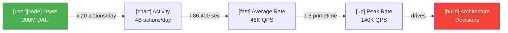

## Visual Overview: The Hidden Multipliers

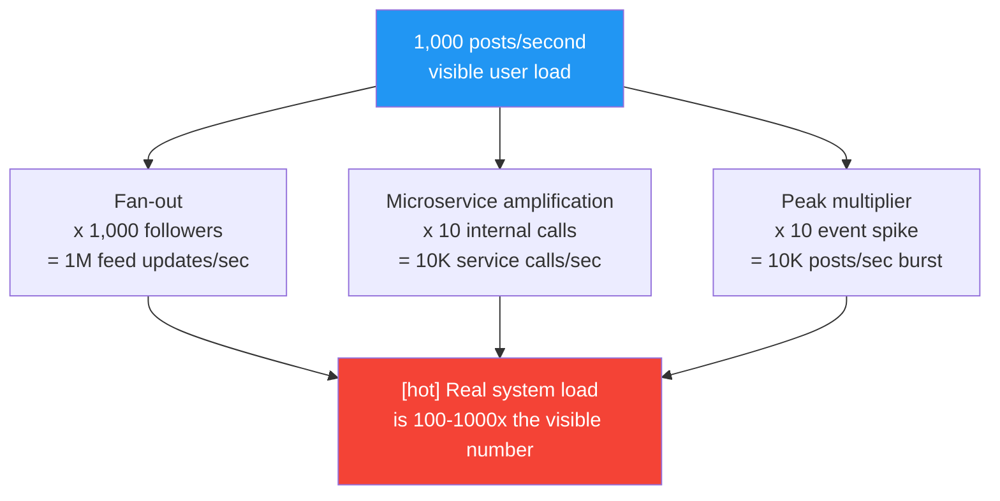

---

> **Learning goal:** By the end of this chapter, you can take any vague scale hint like "design for a large social network" and convert it into concrete numbers -- QPS, storage, peak rates, fan-out -- that drive every architectural decision. You understand why scale determines architecture, not the other way around. You know the hidden multipliers that most engineers miss. And you can communicate all of this fluently in 10 minutes of an interview.

---

## Section 1: What You Will Learn

After studying this chapter carefully, you will be able to:

- Convert a vague scale hint ("large platform") into specific numbers using a 5-step pipeline
- Derive QPS, storage requirements, throughput, and peak load from first principles
- Understand why peak matters and average does not when sizing infrastructure
- Identify the read/write ratio for any system and explain what it means for architecture
- Explain fan-out -- why one user action can trigger millions of system operations
- Identify hot keys (the celebrity problem) and describe at least 4 strategies to handle them
- Plan for growth without over-engineering or under-engineering
- Explain how failure modes change as scale increases
- Handle scale uncertainty with range estimates rather than false precision
- Articulate scale-driven trade-offs: consistency vs. performance, cost vs. capability
- Explain the real Hot Key + Cache Stampede incident and what should have been designed differently
- Answer 15+ common interview questions about scale at Staff level

---

## Section 2: Why Scale Is the Foundation of System Design

### 2.1 The Core Rule: Scale Determines Architecture

Here is the most important sentence in this chapter:

**Scale determines architecture. Architecture does not determine scale.**

What does this mean? It means you cannot choose a good architecture without first knowing the scale. The right architecture for 1,000 users is completely wrong for 100 million users. The right architecture for 100 million users is absurdly expensive and complex for 1,000 users.

Let's make this concrete with a simple example.

You need to store user profile data. Should you use a single PostgreSQL database or a distributed NoSQL system?

**The correct answer: it depends entirely on scale.**

- At 10,000 users: One PostgreSQL server. Simple, fast, cheap. You can fit all profiles in memory. Total storage: 10,000 x 10 KB = 100 MB. Easily handled.
- At 10 million users: One PostgreSQL server can still work with read replicas. Storage: 100 GB. Gets interesting.
- At 1 billion users: 10 TB of profile data. Millions of reads per second. One PostgreSQL server is physically impossible. You need distributed storage, sharding, and caching at multiple levels.

Same feature. Same requirement ("store user profiles"). Completely different architectures -- driven entirely by scale.

If you design before asking about scale, you are guessing. And in a 45-minute interview, guessing means your design might be completely inappropriate for the problem.

### 2.2 What Happens at Scale That Doesn't Happen at Small Scale

Scale does not just mean "more of the same." It changes the nature of problems.

**Problem 1: The things you ignore become the things that kill you.**

At small scale, a slightly inefficient database query works fine. At large scale, that same query runs 100,000 times per second and becomes your biggest bottleneck.

At small scale, a hot-key (one user ID getting all the traffic) barely shows up in metrics. At large scale, a celebrity account post crashes an entire database shard.

At small scale, network latency between services is 1ms and irrelevant. At large scale, 1ms x 50 internal service calls = 50ms added to every request, and your P99 latency blows up.

**Problem 2: Failure modes change.**

At small scale: one server crashes -> everyone is affected -> restart the server -> everyone recovers.

At large scale: one database shard crashes -> 10% of users are affected -> the other 90% keep working -> the affected 10% gradually recover shard by shard.

At small scale, failures are binary -- everything works or nothing works. At large scale, partial failure is the normal state. Staff engineers design for partial failure, not just full availability.

**Problem 3: Costs that were irrelevant become existential.**

At 1,000 users, a 20% storage inefficiency costs you $0.10/month. Nobody cares.

At 100 million users, a 20% storage inefficiency costs you $200,000/month. Engineers work full-time to fix it.

At Google and Amazon scale, a 1% CPU efficiency improvement saves millions of dollars per year.

### 2.3 The L5 vs L6 Scale Conversation

This is what L5 and L6 look like when scale comes up in a design interview:

**Prompt:** "Design a notification system for a social media platform."

L5: "Okay, so we have lots of users. I'll design this to scale. Let me start with the API layer..."

L6: "Before I start designing, let me establish the scale we're working with. Can you tell me the user base, or should I estimate? [Interviewer: estimate.] Okay. For a major social platform, I'll assume 200 million daily active users. Each user receives about 20 notifications per day -- likes, comments, follows, mentions. That gives us 200M x 20 = 4 billion notifications per day. Dividing by 86,400 seconds: roughly 46,000 notifications per second on average. Peak during primetime will be 3x that -- about 140,000 per second. And I need to think about fan-out: one celebrity post to 10 million followers is not 1 notification, it's 10 million. That's the real scaling challenge. Let me use those numbers to drive the architecture..."

**The difference is stark.** L5 acknowledges scale vaguely. L6 derives specific numbers and immediately identifies the fan-out problem before touching architecture. Every architectural decision that comes after is now justified by specific numbers.

### 2.4 The Hidden Multipliers Most Engineers Miss

When engineers think about scale, they often think only about the "direct" load. They count the requests that come in from users and design for that number.

But there are hidden multipliers that turn manageable numbers into enormous ones:

**Multiplier 1: Fan-out.** One user posts -> their 1,000 followers each need a feed update. 1,000 posts/second becomes 1,000,000 feed operations/second.

**Multiplier 2: Microservice amplification.** One user API request -> 10 internal service calls -> 3 database queries each -> 30 database queries for 1 user request. At 10,000 user requests/second, your database handles 300,000 queries/second.

**Multiplier 3: Peak multipliers.** Average is 50,000 QPS. During a product launch or a celebrity moment: 500,000 QPS. The system experiences 10x the average in a burst lasting minutes.

**Multiplier 4: Read amplification.** One write creates a new post. That post is read by 1,000 followers 5 times each over the next day. One write -> 5,000 reads.

**Multiplier 5: Retry amplification.** A slow database causes 5% of requests to time out. Clients retry. Retry rate: 5% x 3 retries = 15% additional load. The extra load makes the database slower. More timeouts. More retries. Cascading failure from a feedback loop.

Missing any of these multipliers means your system will surprise you in production. Staff engineers find them before design, not after.

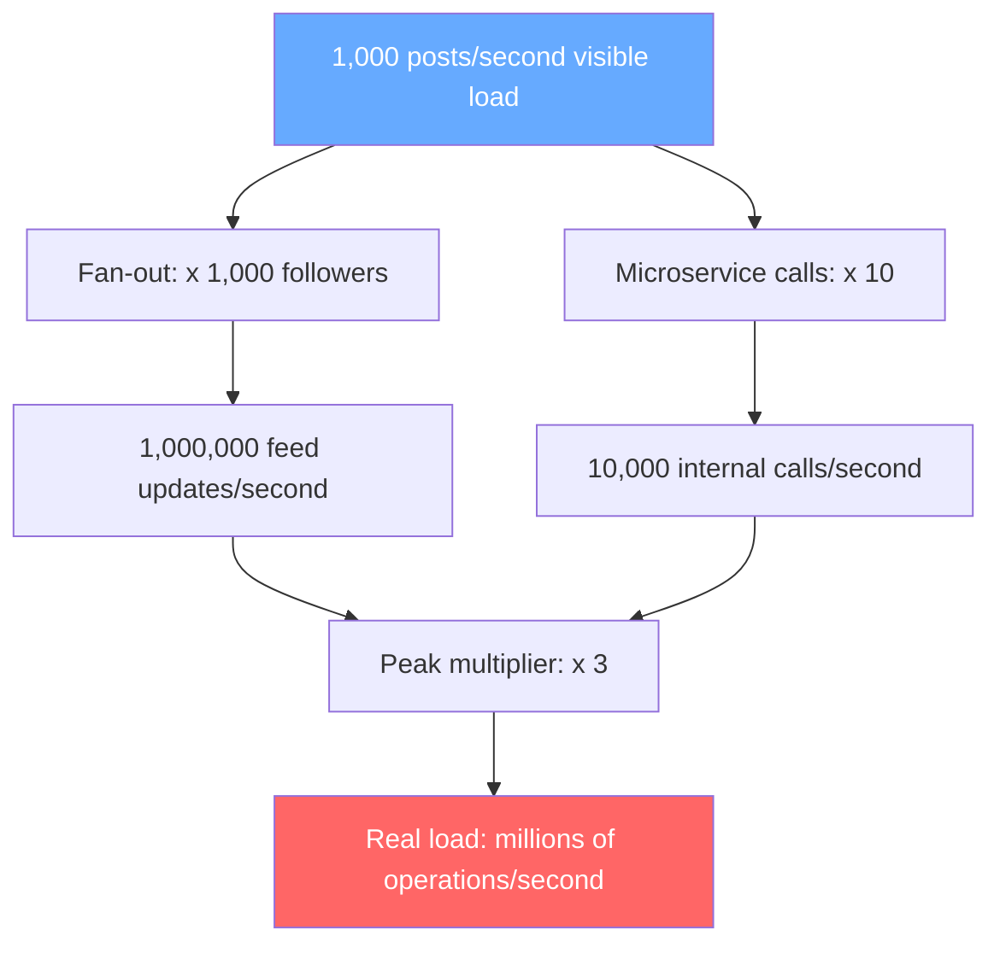

---

## Section 3: Core Concepts

### 3.1 The 5-Step Scale Pipeline

Every scale estimation follows the same 5 steps. Memorize this pipeline. Use it in every interview.

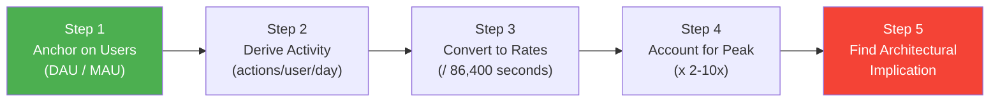

**Step 1 -- Anchor on Users**

Start with the user count. This is your anchor. Everything else derives from it.

Ask: "How many daily active users (DAU) are we designing for?"

If the interviewer gives you a number, use it. If not, propose one based on the scale hint:
- "Large social platform" -> 200M DAU, 500M MAU
- "Major e-commerce site" -> 50M DAU, 200M MAU
- "Enterprise internal tool" -> 10,000-100,000 DAU
- "Startup MVP" -> 10,000-100,000 DAU

Always say it out loud and confirm: "I'll assume 200 million DAU -- does that match the scale you had in mind?"

**Step 2 -- Derive Activity**

From users, estimate how many times per day the typical user performs the core action.

For a notification system: Each user receives approximately 20 notifications per day.
- 200M DAU x 20 notifications/user/day = 4 billion notifications per day

How do you know the "20 per day" number? You reason from product behavior:
- A user follows 200 accounts
- Each account posts roughly once per week -> 200/7 ~= 30 posts per week ~= 4 posts per day appearing in their feed
- But their posts attract likes, comments -> roughly 3-5 engagement notifications per day
- System notifications (password resets, promotions) -> 2-3 per day
- Total: roughly 10-20 notifications per day. Call it 20 -- reasonable and slightly conservative.

This is first-principles reasoning. You don't need to know the exact number. You need a reasonable estimate, and you need to show that you derived it rather than guessed.

**Step 3 -- Convert to Rates**

Divide by 86,400 seconds in a day to get per-second rates.

4 billion notifications per day / 86,400 = 46,296 per second ~= **46,000 notifications/second**

The shortcut: **daily_count / 100,000 ~= per-second rate.** (86,400 rounds to 100,000 for quick mental math.)

For storage calculations, convert differently:
- Per day: 4B notifications x 500 bytes each = 2 TB/day
- Per month: 60 TB
- Per year: 730 TB ~= **750 TB/year**

**Step 4 -- Account for Peak**

Average is not peak. Always apply a peak multiplier.

For notifications on a social platform:
- Average: 46,000/second
- Primetime peak (evening, prime content hours): 3x -> **140,000/second**
- Event spike (celebrity post, breaking news): 10x -> **460,000/second**

**Your system must handle the peak, not the average.** Systems do not fail at 46,000/second. They fail at 460,000/second when you haven't designed for it.

**Step 5 -- Find Architectural Implications**

This is the step most engineers skip. They do the math and stop. L6 engineers use the numbers to drive architecture.

At 46,000 notifications/second:
- Can a single database handle 46K writes/second? A well-tuned PostgreSQL instance handles ~5,000-10,000 writes/second. Answer: No. -> Need message queue + multiple database nodes or sharded writes.
- At 140,000/second peak: need even more capacity. -> Message queue is not optional, it absorbs spikes.

With 750 TB/year of notification data:
- Can fit this on a single server? No (physical limit ~100 TB per server). -> Need distributed storage.
- Should we store all 750 TB in hot storage? Expensive. -> Need tiered storage: recent 30 days hot, older cold.

The math tells you the architecture. Not the other way around.

---

### 3.2 The Key Scale Metrics

You need to understand four scale metrics deeply: DAU/MAU, QPS, Throughput, and Storage.

#### DAU and MAU

**DAU** (Daily Active Users): How many unique users use the product on a given day.

**MAU** (Monthly Active Users): How many unique users use it at least once in 30 days.

**DAU/MAU ratio**: This tells you how "sticky" the product is.

| DAU/MAU Ratio | What it means | Example products |
|----------------|---------------|------------------|
| Less than 10% | Low engagement -- people use it occasionally | Travel booking, tax software |
| 20-30% | Moderate engagement | News sites, e-commerce |
| 30-50% | High engagement | Social media, email |
| 50%+ | Very high engagement | Messaging apps, essential tools |

**Why this ratio matters for design:**

If DAU/MAU is 50%, half your monthly users are active every day. This means your cache hit rates are high -- the same users make the same requests repeatedly. You can cache aggressively.

If DAU/MAU is 5%, most of your monthly users haven't been active in weeks. Cache hit rates are lower. Storage for inactive users is significant.

**Mental model:** DAU drives your **daily load**. MAU drives your **total data footprint**.

#### QPS (Queries Per Second)

QPS is how many requests your system handles per second.

**The formula:**
```
QPS = (DAU x actions_per_user_per_day) / 86,400
```

Or using the approximation shortcut:
```
QPS ~= daily_request_count / 100,000
```

**Examples:**

| System | DAU | Actions/User/Day | QPS (average) |
|--------|-----|-----------------|---------------|
| Notification system | 200M | 20 received | 46,000 |
| Social feed | 200M | 50 views | 116,000 |
| URL shortener | 10M | 10 clicks | 1,160 |
| Messaging app | 100M | 100 messages | 116,000 |
| Google Search | 1B | 5 searches | 57,870 |

Important: always separate **read QPS** and **write QPS**. They are different.

For a social feed:
- Read QPS: 200M DAU x 30 feed loads/day / 86,400 = 70,000 reads/second
- Write QPS: 200M DAU x 0.1 posts/day / 86,400 = 230 writes/second
- Read:Write ratio = 70,000:230 ~= **300:1**

This ratio is critical. A 300:1 read-heavy system needs caching everywhere. Write optimization matters much less.

#### Throughput and Bandwidth

**Throughput** is how much data moves per second -- measured in MB/s or GB/s.

**The formula:**
```
Throughput = QPS x average_payload_size
```

**Example:**

Notification system:
- 46,000 deliveries/second
- Average notification size: 500 bytes (message + metadata)
- Throughput = 46,000 x 500 bytes = 23 MB/second outbound

This 23 MB/second needs to fit within your network bandwidth. A 10 Gbps network link = 1,250 MB/second, so 23 MB/second is easily manageable. But at peak 140,000/second = 70 MB/second. Still fine. If you had a 1 Gbps link (125 MB/second), you'd be using 56% at peak. That's worth planning for.

For video streaming:
- 1 million concurrent viewers
- Each stream at 5 Mbps (HD)
- Total bandwidth = 1M x 5 Mbps = 5 Tbps

5 Tbps of bandwidth requires a global CDN -- no single datacenter can serve this.

#### Storage

**The formula:**
```
Total storage = number_of_items x average_item_size x retention_period_factor
```

**Example: Messages in a messaging app**

- 100 million DAU
- 50 messages sent per user per day
- 5 billion messages per day
- Average message: 200 bytes text + 100 bytes metadata = 300 bytes
- Daily storage: 5B x 300 bytes = 1.5 TB/day
- With 1-year retention: 1.5 TB x 365 = **550 TB/year**

Key insight: at 550 TB/year, you are not using a single server. You need distributed storage. The math forces this decision.

**Storage tiers:**

| Tier | What it is | Cost | Access speed | Use case |
|------|------------|------|--------------|----------|
| Memory (RAM) | In-memory cache | Very high | <1ms | Hot data, session state |
| NVMe SSD | Local fast disk | High | 1-5ms | Active databases, indices |
| SATA SSD | Regular SSD | Medium | 5-10ms | General databases |
| HDD | Spinning disk | Low | 10-50ms | Bulk storage |
| Object storage | S3-type | Very low | 50-200ms | Blobs, cold storage |

A well-designed system puts the right data in the right tier. Hot user profiles in memory. Recent messages on SSD. Old messages in object storage.

---

### 3.3 The Back-of-Envelope Toolkit

Memorize these numbers. They come up in every scale estimation.

| Fact | Value | Use case |
|------|-------|----------|
| Seconds in a day | 86,400 (~= 10^5) | QPS = daily_count / 86,400 |
| Seconds in a month | 2.6 million (~= 2.5 x 10^6) | Monthly rate calculations |
| Seconds in a year | 31.5 million (~= 3 x 10^7) | Annual storage/throughput |
| Single server write capacity | ~5,000-10,000 QPS | Know when to shard |
| Single Redis write capacity | ~100,000 QPS | Know when to cluster |
| Single server memory | 128-512 GB typical | In-memory dataset limits |
| HTTP request size (typical) | 1-10 KB | Bandwidth estimates |
| Disk read speed (SSD) | 500 MB/s | I/O bottleneck detection |
| Network link (typical datacenter) | 1-10 Gbps | 125 MB/s to 1,250 MB/s |
| Round-trip latency (same datacenter) | 0.5ms | Latency budget planning |
| Round-trip latency (cross-region) | 50-150ms | Sync replication cost |

**Quick calculation shortcuts:**

- Daily count to QPS: divide by 100,000 (approximate)
- Minutes to seconds: multiply by 60
- If your QPS x item_size > 100 MB/s, you need CDN or distributed serving
- If your total storage > 1 TB, you need distributed storage planning

---

### 3.4 Peak vs. Average Load -- Why Systems Fail at Peak

This is one of the most important concepts in this chapter. Read it slowly.

**Systems are sized at design time but fail at runtime. And runtime is peak, not average.**

Here's why this matters. Imagine a news website. Average traffic during the day is 10,000 QPS. Engineers design for 12,000 QPS (20% buffer). They provision servers and databases for 12,000 QPS.

Then a major news event breaks. Millions of people simultaneously go to check the news. Traffic spikes to 80,000 QPS for 30 minutes.

The system fails. Not because the engineers did bad work. Because they designed for average and forgot about peak.

**Peak patterns you must know:**

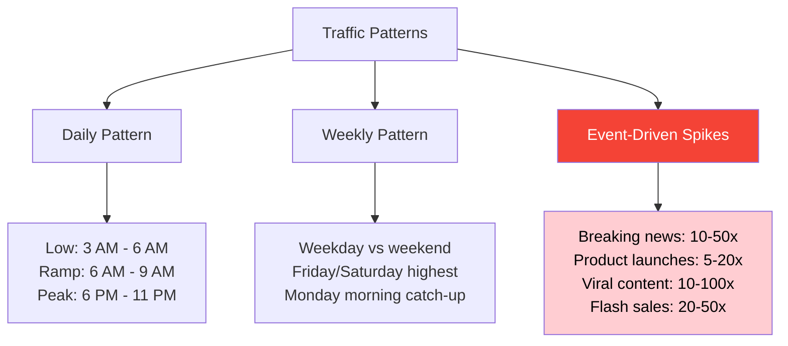

**Peak multipliers by system type:**

| System | Normal peak | Major event peak |
|--------|-------------|-----------------|
| Social media feed | 3-5x average | 10-20x (celebrity news) |
| Messaging app | 2-3x | 5-10x (New Year's Eve) |
| E-commerce | 5-10x (evenings) | 20-50x (Black Friday) |
| News/media | 3-5x | 100x (breaking news) |
| Video streaming | 3-4x (primetime) | 10x (major release) |
| Sports platform | 5-10x | 100x (World Cup final) |

**How to design for peak:**

There are three strategies. In practice, you use all three together.

**Strategy 1 -- Provision for normal peak:** Size your steady-state capacity for 3-5x your average load. This handles daily and weekly patterns automatically.

**Strategy 2 -- Auto-scale for moderate spikes:** Use auto-scaling to handle 5-10x average automatically. This handles most event spikes without manual intervention.

**Strategy 3 -- Graceful degradation for extreme events:** For events beyond 10x, some non-critical features degrade gracefully. The core path (reading, posting) stays up. Analytics, recommendations, and trending topics may be disabled. Users notice slightly degraded experience but the core product works.

**The hybrid approach most large systems use:**

- Provision baseline: enough servers for 3x average (handles normal peaks)
- Auto-scale: configured to scale up to 8x average within 5 minutes
- Graceful degradation: beyond 8x, non-critical features shed load
- Rate limiting: at 15x, start shedding low-priority requests

L5: "We'll auto-scale for traffic spikes."

L6: "Average load is 46K/second. I'll provision for 3x (140K) as baseline -- that handles primetime. Auto-scaling adds capacity up to 10x (460K) for event spikes. Beyond that, I'll shed non-critical features: recommendations off, trending topics off, analytics delayed. Core delivery stays up. I need to define which features degrade and in what order before we finalize the design."

---

### 3.5 Read vs. Write Ratios

The ratio of reads to writes is one of the most important numbers in system design. It determines where to invest your optimization effort.

**Why it matters:**

If your system has 100 reads for every 1 write (100:1), then:
- Caching works extremely well. Each item is read 100 times after being written once.
- A cache hit avoids 100 database reads. Cache misses only happen once.
- Read replicas make sense -- spread the read load across multiple servers.
- You can tolerate slightly stale cache data -- the cost of being slightly wrong is low.

If your system has 1 read for every 100 writes (1:100), then:
- Caching barely helps. Items are written constantly and read rarely.
- Write throughput is the constraint, not read speed.
- You need write-optimized databases (like Cassandra or time-series stores).
- Append-only designs, log-structured storage, and batching help a lot.

**Typical ratios:**

| System | Read:Write | What this drives |
|--------|------------|-----------------|
| Social feed | 300:1 | Aggressive caching at every layer |
| E-commerce product page | 1000:1 | CDN + edge caching |
| URL shortener | 100:1 | Cache redirect at edge |
| Messaging | 5:1 | Balance both paths |
| Analytics ingestion | 1:50 | Write-optimized, append-only |
| Ride-sharing location updates | 1:10 | Specialized write stores (Redis) |

**How to derive the ratio:**

Think about user behavior. For a social feed:

A user opens the app 5 times per day. Each time they scroll through 20 posts. That's 5 x 20 = 100 reads per day.

They post once per week on average. That's 1/7 ~= 0.14 writes per day.

Read:Write ratio per user = 100 : 0.14 ~= **700:1**

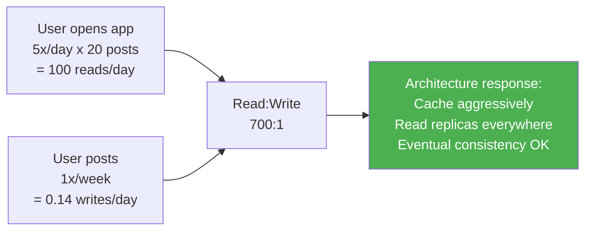

**Architecture decision tree based on ratio:**

- Above 50:1 -> Caching is essential. Build a multi-layer cache strategy.
- 10:1 to 50:1 -> Caching helps significantly. Invest in read replicas.
- 1:1 to 10:1 -> Both paths matter. Cannot sacrifice either.
- Below 1:1 -> Write optimization is critical. Use write-optimized data stores.

L5: "I'll add a cache for better read performance."

L6: "With a 300:1 read-to-write ratio, caching is not optional -- it's the core architecture decision. Without caching, every one of those 300 reads hits the database. With a 99% cache hit rate, only 3 out of 300 reach the database. That's 100x reduction in database load. My cache tier is as important as my database tier."

---

### 3.6 Fan-Out and Amplification -- The Hidden Multiplier

Fan-out is when one action triggers many downstream operations. It's the most commonly underestimated scaling challenge.

**The classic example: the social feed**

One user posts something. Who needs to see it? Everyone who follows that user.

If the user has 1,000 followers, one post = 1,000 feed update operations.

At 1,000 posts/second across the platform:
- What you think: 1,000 operations/second
- What actually happens: 1,000 posts x 1,000 followers = **1,000,000 feed update operations/second**

You just underestimated your system load by 1,000x.

**The celebrity problem makes it worse:**

Most users have a few hundred followers. But 1% of users (celebrities, brands, news accounts) have millions.

Let's do the math:

- 1,000 posts/second total
- 99% of posts: 990 posts x 500 followers average = 495,000 fan-out operations
- 1% of posts (celebrities): 10 posts x 5,000,000 followers = 50,000,000 fan-out operations

**1% of posts cause 99% of fan-out load.**

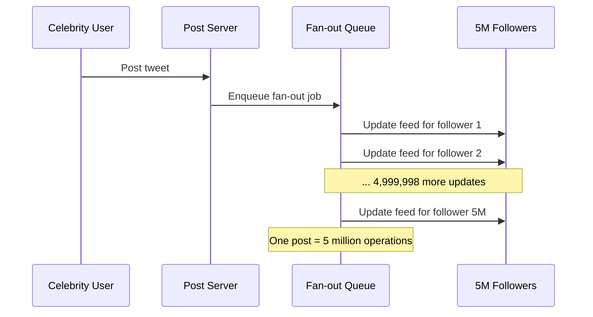

**Two fan-out models:**

**Fan-out on write (Push model)**

When content is created, immediately push it to all followers' feeds.

How it works: when a user posts, the system finds all their followers and writes the post to each follower's feed table.

- Read is fast: user's feed is precomputed, just load it
- Write is slow and expensive: one post = N writes (N = follower count)
- Storage is high: content is duplicated in every follower's feed
- For celebrities: pushing to 10M followers synchronously is impossible (10M writes in < 1 second?)

**Fan-out on read (Pull model)**

When a user requests their feed, pull recent posts from everyone they follow.

How it works: when a user opens the app, the system looks up everyone they follow, fetches recent posts from each, merges and ranks them.

- Write is fast: post once, no fan-out
- Read is slow: for each feed load, query every account you follow
- Storage is efficient: content stored once
- For heavy followers (users who follow 2,000 accounts): feed load is expensive -- need to check 2,000 accounts

**The hybrid solution (what Twitter, Instagram, and most large platforms use):**

- Regular users (< 10K followers): Fan-out on write (push). Fast reads, manageable write cost.
- Celebrities (> 10K followers): Fan-out on read (pull). Written once, pulled at read time.
- At feed read time: merge precomputed feed (from pushed posts) with celebrity posts (pulled on-demand).

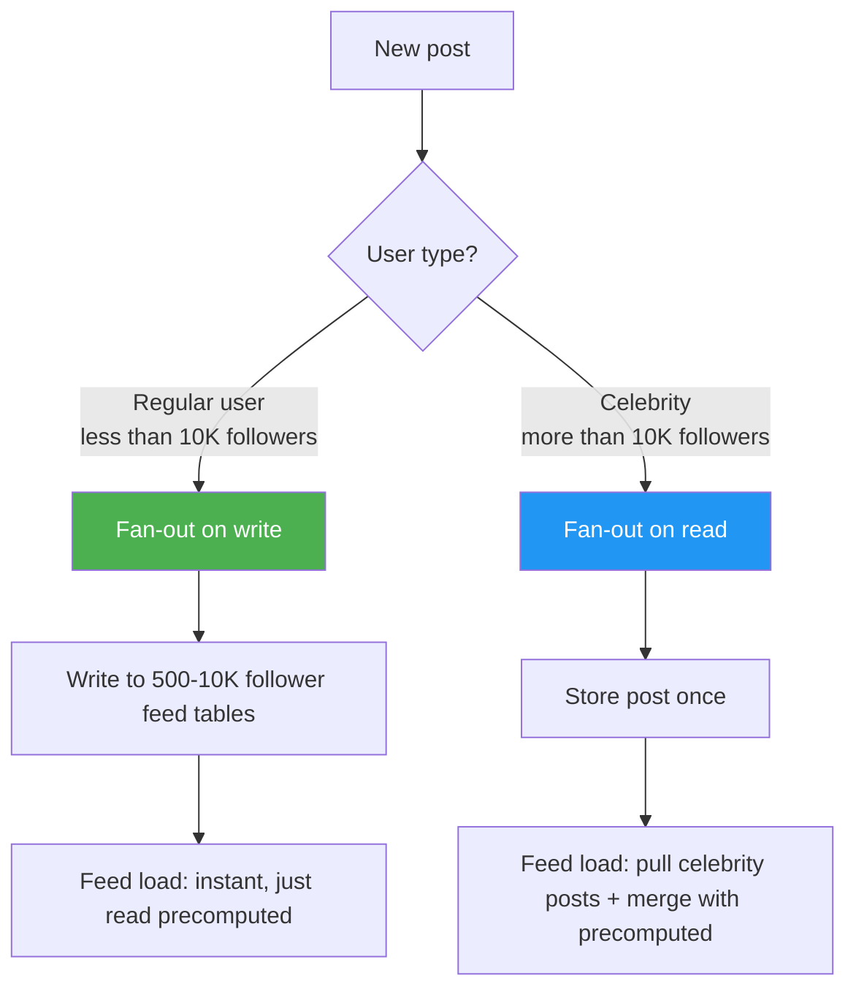

**Other types of fan-out:**

**Microservice amplification:** One API request triggers multiple internal service calls.

Example: A product page request -> product service (1) -> inventory service (1) -> pricing service (1) -> recommendation service (5 calls for 5 recommended products) -> user history service (1) = 9 internal calls.

External QPS: 10,000. Internal QPS: 90,000. Your internal services need to handle 9x the external load.

**Notification amplification:** One event -> notification to multiple channels. User comments on a post -> notify post author + notify other commenters + push notification + email digest. One event = 4-8 notifications.

---

### 3.7 Hot Keys and Skew -- When Load Is Not Uniform

In most systems, load is not evenly distributed. Some keys (user IDs, product IDs, URLs) get much more traffic than others. This is called **skew** or the **hot key problem**.

**Where hot keys come from:**

The real world follows a "power law" distribution: a small number of things account for most of the activity.

- In social media: 1% of accounts (celebrities) generate 50%+ of content consumption
- In e-commerce: 1% of products (bestsellers) generate 50%+ of purchases
- In messaging: 1% of group chats are extremely active, generating the majority of messages
- In URL shorteners: 1% of URLs are viral and account for 90%+ of clicks

**Why hot keys are dangerous:**

If you distribute data by sharding (splitting data across multiple servers), you assume each shard handles a similar amount of traffic.

But if one user ID (a celebrity) gets 1,000x more traffic than the average user, the shard holding that celebrity's data gets 1,000x the traffic of every other shard.

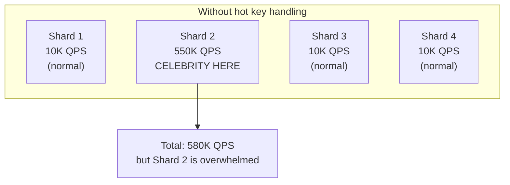

Shard 2 crashes or slows to a crawl. All users whose data is on shard 2 experience errors -- even if they have nothing to do with the celebrity. One hot key takes down an entire shard and everyone on it.

**5 strategies to handle hot keys:**

**Strategy 1: Caching**

Cache hot content at multiple layers. If the celebrity's profile is in an in-memory cache, reads never reach the database shard.

Steps:
1. Add an application-level cache (Redis)
2. Add a CDN cache for static content (profile picture, public posts)
3. Use short TTL (30-60 seconds) to keep cache fresh
4. Result: 99%+ of reads serve from cache, 1% reach the database

Best for: read-heavy hot keys (celebrity profiles, viral content).

**Strategy 2: Read Replicas**

Add multiple read-only copies of the hot shard's data. Route read traffic across them.

If shard 2 gets 10x normal traffic for reads, add 10 read replicas of shard 2. Each replica handles 1x normal traffic.

Best for: hot shards that serve mostly reads.

**Strategy 3: Key Splitting**

Split one logical hot key into multiple physical keys distributed across shards.

Instead of storing user_123's follower list in one row, split it into:
- user_123_followers_0 -> shard 3
- user_123_followers_1 -> shard 7
- user_123_followers_2 -> shard 1

Read requests distribute across 3 shards. Each shard handles 1/3 the load.

Best for: large data structures owned by one key (massive follower lists, huge group conversations).

**Strategy 4: Rate Limiting Hot Keys**

For extreme hot keys (a viral post), accept that you can only serve the request so fast. Rate limit aggressively and serve cached/slightly stale data beyond the limit.

"This celebrity post is getting 100,000 reads/second. My cache handles 50,000. For the other 50,000, I serve a 30-second-old cached version."

Best for: bursty hot keys where slightly stale data is acceptable.

**Strategy 5: Dedicated Infrastructure**

For known hot keys (verified celebrity accounts, featured products), route them to a dedicated infrastructure pool that is sized and optimized for high traffic.

"VIP accounts get their own database cluster that's sized for celebrity-level traffic. Regular accounts go to the standard cluster."

Best for: known, persistent hot keys where you want complete isolation.

---

### 3.8 Short-Term vs Long-Term Growth Planning

**The planning dilemma:**

You can't design only for today and ignore growth -- you'll spend all your time rebuilding. But you can't design for 100x growth on day one -- you'll waste months building complexity you don't need yet.

The Staff engineer's balance: **design for today + reasonable growth, with a known migration path to the next scale tier.**

**The 10x rule of thumb:**

Design your current architecture to handle 10x your current load. Know what breaks at 10x. Know the migration path to handle it. But don't build the 10x solution until you need it.

"We're at 100K users today. My architecture handles 1M users without major changes. At 1M users, we'll need to shard the messages table. I'll choose the partition key now so the schema is ready -- but I won't actually shard until we need to."

**Growth time horizons:**

| Horizon | Design for | Approach |
|---------|------------|----------|
| Launch to 6 months | Current scale + 2x buffer | Keep it simple, optimize later |
| 6 months to 2 years | 5-10x growth | Architecture should handle it with capacity additions |
| 2-5 years | 10-50x growth | Major architectural decisions must support this |
| 5+ years | 100x+ | Design for extensibility, not specific solutions |

**Migration paths -- know them before you need them:**

For each component, you should know what you'll do at the next scale tier:

| Current scale | Database approach | What you do when it breaks |
|---------------|------------------|---------------------------|
| 10K users | Single PostgreSQL | Add read replicas for read load |
| 100K users | PostgreSQL + read replicas | Shard hot tables, add connection pooling |
| 1M users | Sharded PostgreSQL | Add specialized stores for hot data (Redis for cache) |
| 10M users | Distributed database | Consider Spanner/CockroachDB for global consistency |
| 100M users | Custom distributed infra | You're now building database technology |

**The "schema supports it" principle:**

Even if you don't implement sharding today, choose your primary keys and partition keys now so that sharding is possible without a data migration.

Bad: Use `auto_increment` integer as user ID -> Cannot shard by user ID range without reassigning all IDs.

Good: Use UUID or a hash-based ID -> Can shard by ID range at any time without data changes.

"I'm choosing a UUID-based user ID even though we don't need sharding today. This decision costs nothing now and avoids a major migration later."

---

### 3.9 How Failure Modes Change With Scale

This is a crucial L6 insight that many engineers miss: **the way systems fail is completely different at large scale vs. small scale.**

At small scale:
- A failure is usually total -- everything breaks
- The fix is simple -- restart, redeploy, replace the one thing
- Everyone is affected equally
- Recovery is fast

At large scale:
- Failures are usually partial -- some users affected, others not
- The fix is complex -- contains, isolate, roll back, traffic-shift
- Users are affected based on which shard or region they're on
- Recovery is gradual

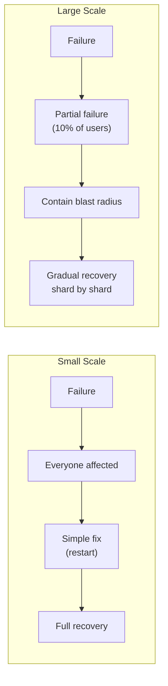

**Scale thresholds that force architectural decisions:**

| Traffic threshold | What breaks | What you must do |
|-------------------|-------------|------------------|
| > 10K concurrent connections | Single server socket limits | Load balancer + connection pooling |
| > 5K writes/second | Single database saturates | Message queue + multiple write nodes |
| > 50K reads/second | Single database read capacity | Read replicas + caching |
| > 1M rows in hot table | Query performance degrades | Partitioning + indexing strategy review |
| > 10 TB storage | Single disk/node capacity | Distributed storage system |
| > 100ms inter-service latency | User experience degrades | Regional deployment + edge caching |
| > 100 microservices | Coordination overhead | Service mesh + platform team |

**The blast radius concept:**

"Blast radius" means: if this component fails, how many users are affected?

Good design minimizes blast radius at every layer. A database shard holding 10% of users -- when it fails, 10% are affected, not 100%. A regional deployment -- when one region degrades, users in that region degrade, not users globally.

"I'm sharding user data across 10 shards. Each shard holds 10% of users. If a shard fails, 10% of users see degraded service. The other 90% are unaffected. This is better than the 100% blast radius of a single database."

---

### 3.10 Scale Under Uncertainty -- Range Estimates

In real interviews, you often don't have precise data. The scale is unknown or uncertain. L6 engineers handle this differently than L5 engineers.

L5: "We'll have 50,000 QPS." (states a single number with false precision)

L6: "I estimate 30,000-80,000 QPS average based on comparable platforms at this scale. Given that uncertainty, I'll design for 100,000 QPS sustained, with graceful degradation above that. This gives us buffer for estimation error and the growth we expect in year one."

**The three levels of estimation confidence:**

| Confidence | Basis | How to design |
|------------|-------|---------------|
| High (80%+) | Real data or very close analogies | Design to spec + 20% buffer |
| Medium (50-80%) | Reasonable assumptions, some unknowns | Design for 2-3x estimate |
| Low (<50%) | Many unknowns, novel domain | Design for 5-10x, build flexibility |

**When you truly don't know:**

Approach 1 -- Bound the problem:
"I don't know exact numbers, but I can bound it. Minimum: 1,000 users (we have that many beta signups). Maximum: 10M users (total addressable market). My architecture should work at 1,000 and have a clear path to 10M with evolution -- not a rewrite."

Approach 2 -- Make the decision explicit:
"The interviewer hasn't specified scale, and this could be a startup MVP or platform-scale. I'll design for 1M users -- moderate scale that forces real engineering decisions without overcomplicating things. If you want, I can discuss what changes at 100M users after I complete the design."

Approach 3 -- Two-path design:
"I'll describe the V1 architecture for early stage and the V2 evolution for scale. The core data model and APIs are the same. The infra differs."

---

### 3.11 Scale-Driven Trade-offs

Scale forces trade-offs. Things that were free at small scale become expensive at large scale. L6 engineers state these trade-offs explicitly rather than making silent choices.

**Trade-off 1: Consistency vs. Performance**

At small scale: strong consistency is free. One database, all reads and writes go to the same place. Every read sees the latest write.

At large scale: strong consistency across distributed nodes requires synchronous replication. Every write must wait for acknowledgment from replicas. At cross-region, that's 100-200ms per write.

At 100K writes/second, adding 150ms per write is catastrophic for latency.

So you choose: **eventual consistency** for most data (users see updates within seconds, not instantly), with strong consistency reserved only for data where correctness is non-negotiable (payments, security settings, account changes).

"I'm choosing eventual consistency for social posts and feed updates. The failure mode of inconsistency is 'user sees a slightly stale feed for 2 seconds' -- acceptable. For payment records and security settings, I choose strong consistency despite the latency cost -- the failure mode of inconsistency there is financial harm or security risk."

**Trade-off 2: Cost vs. Capability**

| Users | Monthly infrastructure cost | 10% inefficiency costs |
|-------|----------------------------|------------------------|
| 1,000 | $100 | $10/month -- irrelevant |
| 100,000 | $10,000 | $1,000/month -- minor |
| 10M | $1,000,000 | $100,000/month -- significant |
| 100M | $10,000,000 | $1,000,000/month -- existential |

At 10M users, a 10% efficiency improvement saves $100,000/month. That justifies a full engineer's time. At 100M users, a 1% improvement saves $100,000/month.

This is why Google engineers spend significant time on tiny efficiency improvements that seem irrelevant at any normal company's scale.

**Trade-off 3: Latency vs. Throughput**

Batching increases throughput but adds latency. Sometimes this is the right trade-off, sometimes it's not.

Example: instead of writing each notification to the database immediately (1 write per notification), batch 100 notifications and write them together (1 write per 100 notifications).

- Throughput improvement: 100x (same I/O, 100x more notifications)
- Latency penalty: 100ms delay (waiting to accumulate 100 notifications)

For social notifications: 100ms delay is acceptable. Batching is good.
For 2FA notifications: 100ms matters less than reliability. But batching 2FA codes introduces risk. Do not batch 2FA.

**Trade-off 4: Simplicity vs. Scalability**

A monolith is simpler to build, debug, deploy, and test. A microservices architecture scales better but adds enormous operational complexity.

The right answer: start with the simpler design (monolith or modular monolith) and evolve toward distributed when the scale actually demands it. Do not add microservice complexity for scale you don't have yet.

"My V1 design is a modular monolith -- separate modules for notifications, user preferences, and delivery, but deployed as one service. This is simpler to build and debug. At 10M users, I'll extract the notification delivery module into its own service because its scaling needs differ from the others. But I don't need that complexity today."

---

## Section 4: Mental Models for Scale

These mental models help you reason quickly about scale without doing full calculations every time.

### 4.1 The Multiplier Chain

Every system has a chain of multipliers from "user action" to "system operations."

Think of it as: User action -> Multiplier 1 -> Multiplier 2 -> ... -> Total system load.

Social feed example:
- 1,000 posts/second (user action)
- x 500 followers average (fan-out multiplier)
- = 500,000 feed updates/second
- x 3 peak multiplier (time-of-day)
- = 1,500,000 operations/second (total system load)

The mental model: **always trace the full chain before naming a number.**

### 4.2 The Scale Ladder

Different scales require fundamentally different architectures. Know where each rung of the ladder sits:

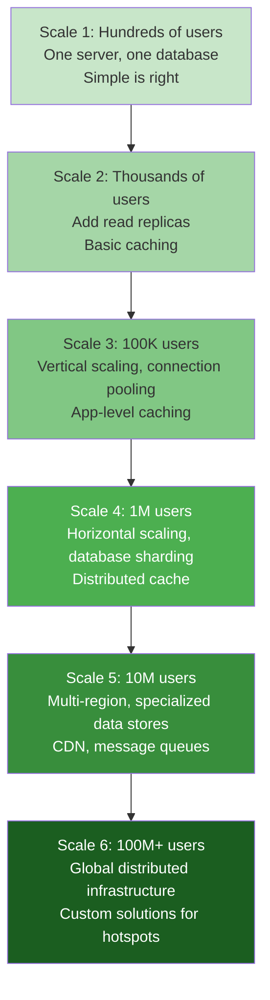

The key: know which rung you're on and which rung you're designing for.

### 4.3 The Power Law Rule

In most systems, load follows a power law: a small percentage of keys account for a large percentage of traffic.

Rule of thumb: **top 1% of keys generate 50% of traffic.**

When you hear a scale number, immediately ask: "what does the top 1% look like?" That top 1% is where your system will break.

### 4.4 The Peak-or-Fail Mental Model

**Design for peak, not average. Systems fail at peak.**

Quick mental check: "My system handles X QPS average. Peak is 3-5x that. Does my design handle 5X QPS? If not, what breaks first?"

The answer to "what breaks first" tells you where to invest in capacity or design.

### 4.5 The First Bottleneck Pattern

As scale increases, different components become the bottleneck at different stages. Know the typical sequence:

| Stage | Typical first bottleneck | Solution |
|-------|--------------------------|----------|
| 1K-10K users | Single server CPU | Upgrade server, optimize code |
| 10K-100K users | Database connection count | Connection pooling |
| 100K-1M users | Database read capacity | Read replicas, caching |
| 1M-10M users | Database write capacity | Sharding, write-behind queues |
| 10M-100M users | Network bandwidth | CDN, regional distribution |
| 100M+ users | Everything at once | Dedicated teams per component |

Knowing this sequence means you can anticipate the next bottleneck before it hits.

---

## Quick Reference Card -- Everything You Need in One Place

Use this card for last-minute review before an interview or to check your scale reasoning mid-design.

### Scale Estimation Checklist (8 Steps)

| Step | The question to ask | What a good answer sounds like |
|------|--------------------|---------------------------------|
| **1. Anchor users** | "How many DAU / MAU?" | "200M DAU, 500M MAU" |
| **2. Derive activity** | "Actions per user per day?" | "20 notifications/user = 4B/day" |
| **3. Calculate rate** | "Divide by 86,400" | "4B / 86,400 = 46K QPS" |
| **4. Account for peak** | "What's the peak multiplier?" | "3x primetime = 140K, 10x events = 460K" |
| **5. Split read/write** | "What's the ratio?" | "100:1 read-heavy -> caching is core" |
| **6. Trace fan-out** | "What multiplies one action?" | "1K posts x 1K followers = 1M ops/sec" |
| **7. Find hot keys** | "What's skewed?" | "Top 1% accounts = 50% traffic. Celebrity = pull model." |
| **8. Plan growth** | "What breaks at 10x?" | "Partition keys chosen for future sharding from day one." |

---

### Read/Write Ratio Quick Reference

| System | Typical Ratio | What this drives |
|--------|---------------|-----------------|
| Social feed | 300:1 to 1000:1 | Caching at every layer is non-optional |
| E-commerce product page | 1000:1 to 10,000:1 | CDN + edge cache; database barely needed |
| URL shortener | 100:1 | Cache the redirect at the edge |
| Messaging | 5:1 to 10:1 | Balance both read and write paths |
| Metrics / logging | 1:10 to 1:100 (write-heavy) | Write-optimized storage, append-only design |
| Ride-sharing location | 1:10 (write-heavy) | In-memory store (Redis), not relational DB |
| User profiles | 50:1 to 500:1 | Cache hot profiles aggressively |

---

### Peak Multipliers Quick Reference

| System type | Normal peak (daily pattern) | Event peak (one-off spike) |
|-------------|----------------------------|---------------------------|
| Messaging app | 2-3x average | 5-10x (New Year's Eve, major event) |
| Social feed | 3-5x | 10-20x (celebrity scandal, breaking news) |
| E-commerce | 5-10x (evenings) | 20-50x (Black Friday, flash sales) |
| Video streaming | 3-4x (primetime) | 10x (major release, sports final) |
| News / media | 3-5x | 50-100x (breaking news) |
| Sports platform | 5-10x | 100x (World Cup final) |

---

### Hot Key Mitigation -- Choose the Right Strategy

| Strategy | How it works | Best for |
|----------|-------------|----------|
| **Caching** | Multi-layer cache (CDN + Redis), short TTL | Read-heavy hot keys (celebrity profiles) |
| **Read replicas** | Multiple read-only copies of the hot shard | Read-heavy hot shards |
| **Key splitting** | `user_123` -> `user_123_0, user_123_1...` across N shards | Large follower lists, huge group chats |
| **Pull model** | Store content once, pull into feeds at read time | Celebrity fan-out (> 1M followers) |
| **Dedicated infra** | Separate cluster routed by account tier | Known, persistent VIP hot keys |
| **Rate limiting** | Serve cached/stale data beyond the rate limit | Bursty hot keys where staleness is acceptable |

---

### Common Scale Mistakes -- Weak vs Strong

| Signal | [X] Weak (L5 pattern) | [Y] Strong (L6 pattern) | [ ] |
|--------|---------------------|----------------------|---|
| **User scale** | "Lots of users" | "200M DAU, 500M MAU" | [ ] |
| **Request rate** | "High traffic" | "46K QPS avg, 140K peak (3x)" | [ ] |
| **Derivation** | Round number with no work shown | "DAU x actions / 86,400 = X" | [ ] |
| **Peak handling** | Designed for average | "3x normal peak, 10x event peak, graceful degradation beyond" | [ ] |
| **Read/write ratio** | Not mentioned | "100:1 -> caching is the architecture" | [ ] |
| **Fan-out** | Ignored | "1K posts x 1K followers = 1M updates/sec" | [ ] |
| **Hot keys** | Assumed uniform distribution | "Celebrity accounts = dedicated pull model + caching" | [ ] |
| **Growth** | Current scale only | "10x in 18 months. Partition keys support sharding now." | [ ] |
| **Uncertainty** | "We'll have 50K QPS." | "Estimate 30-80K. Designing for 100K, degradation above." | [ ] |

---

### Scale Thresholds That Force Architecture Changes

| When you cross this threshold | What breaks | What you must do |
|-------------------------------|-------------|------------------|
| > 10K concurrent connections | Single server socket limit | Load balancer + connection pooling |
| > 5K writes/second | Single database saturates | Message queue + multiple write nodes |
| > 50K reads/second | Single DB read capacity | Read replicas + caching layer |
| > 1M rows in hot table | Query time degrades | Partitioning + indexing review |
| > 10 TB storage | Single disk/node | Distributed object storage |
| > 100ms inter-service latency | User-facing P99 blows up | Regional deployment + edge caching |
| > 100 microservices | Coordination overhead | Service mesh + platform team |

---

## Section 5: Real-World Scale Derivations

### 5.1 URL Shortener -- Full Scale Derivation

**System:** A URL shortener (like bit.ly) for a major tech company.

**Step 1 -- Users:**
- 100 million monthly active users
- 10 million daily active users (10% DAU/MAU -- utility service, used occasionally)
- Most users create URLs rarely but click frequently

**Step 2 -- Activity:**
- URL creation (write): average user creates 1 URL per month -> 100M/30 days = 3.3M per day
- URL resolution (read): each shortened URL gets clicked ~100 times over its lifetime. 3.3M URLs created per day x 100 clicks lifetime = 330M clicks per day

**Step 3 -- Convert to rates:**
- Write QPS: 3.3M / 86,400 = **38 writes/second** (very low)
- Read QPS: 330M / 86,400 = **3,820 reads/second**
- Read:Write ratio: 3,820 : 38 = **100:1**

**Step 4 -- Peak:**
- Write peak: 38 x 3 = **115 creates/second**
- Read peak: 3,820 x 5 = **19,000 clicks/second** (viral URLs drive higher peak)

**Step 5 -- Storage:**
- 3.3M new URLs per day
- Average URL record: 200 bytes (long URL) + 7 bytes (short key) + 100 bytes (metadata) = ~300 bytes
- Daily storage: 3.3M x 300 bytes = 1 GB/day
- 5-year storage: 1 GB x 365 x 5 = **1.8 TB** (modest -- fits in a single database server with room)

**Architectural implications:**
- Write load is trivially low (38/second) -- no need to over-engineer the write path
- Read load at 19K/second with 100:1 ratio -- caching is the primary optimization
- Target: cache the redirect at CDN edge. Most reads hit CDN, never reaching origin servers
- Storage: single database server is sufficient for years. Distribute only when needed.
- Simplicity wins here: this is a read-heavy, low-write system where a simple architecture works

**L6 summary statement:**
"For this URL shortener: 38 creates/second and 19,000 clicks/second at peak, 100:1 read-write ratio. Storage: 1.8 TB over 5 years. The primary optimization is caching -- with 99% CDN cache hit rate on clicks, origin server handles only 190 requests/second. This is actually a simple system at this scale. I don't need Kafka or distributed databases -- I need a well-cached read path."

---

### 5.2 Notification System -- Full Derivation with Fan-Out

**System:** Notification system for a social platform with 200M DAU.

**Step 1 -- Users:**
- 200M DAU
- 500M MAU (40% DAU/MAU ratio -- high engagement social platform)

**Step 2 -- Activity:**
- Average user receives 20 notifications per day
- Total: 200M x 20 = 4 billion notifications per day

**Step 3 -- Convert to rates:**
- Notification generation: 4B / 86,400 = **46,000/second** average

**Step 4 -- Fan-out analysis (critical!):**

Not all notifications are equal. Some come from direct interactions (someone likes your post -> 1 notification). Some from content creation (celebrity posts -> millions of notifications).

Consider the celebrity multiplier:
- 1% of users are high-follower accounts (celebrities, brands) with average 500K followers
- These users post twice per day on average
- Celebrity notification generation: 2M celebrities x 2 posts x 500K followers = 2 trillion notifications/day

Wait -- that's far more than our 4 billion estimate. What's happening?

The resolution: **celebrities use pull model (fan-out on read), not push.** When a regular user loads their feed, the app pulls celebrity posts at that moment. This doesn't generate 500K notification events for one post -- it's merged at read time.

True push notifications (badges, sounds, banners) only go out for direct interactions (not "celebrity posted" updates). So:
- Push notification volume: 200M users x 5 direct interactions per day = 1 billion push notifications/day
- Push notification QPS: 1B / 86,400 = **11,600/second**

**Step 5 -- Storage:**
- 1 billion push notifications per day
- 30-day retention
- 500 bytes per notification
- Storage: 1B x 30 x 500 bytes = **15 TB** for 30 days

**Step 6 -- Delivery operations:**
- Each notification -> 1 push delivery attempt (some fail and retry)
- With 3 retry attempts maximum: 11,600/second x 1.2 (retry overhead) ~= **14,000 delivery operations/second**

**Architectural implications:**
- 14,000 delivery operations/second is manageable with multiple worker processes
- 15 TB in 30 days requires distributed storage
- Fan-out for regular users (push) vs. celebrities (pull) is the key architectural decision
- Separate pipeline for 2FA/security notifications (must not be delayed by marketing volume)

---

### 5.3 Ride-Sharing Platform -- Location Updates are the Bottleneck

**System:** Ride-sharing app (Uber-scale): 20 million rides per day globally.

**Step 1 -- Users:**
- 20M rides per day
- Average ride duration: 20 minutes = 1/3 hour
- Average concurrent active rides: 20M x (20/1440) = 277,000 concurrent rides
- Active drivers on platform: maybe 3x active rides = ~1 million active drivers at any time

**Step 2 -- Activity:**

Location updates are the key scale driver:
- Each driver sends GPS update every 4-5 seconds
- 1 million active drivers x (1 update / 4 seconds) = **250,000 location updates per second**

This is the primary architectural challenge. 250K writes/second is beyond any single database.

**Matching requests** (how riders get matched to drivers):
- 20M rides/day / 86,400 = 230 match requests/second average
- Peak (Friday evening): 5x -> 1,150/second

**Step 3 -- Storage:**
- Location data: 250K updates/second x 100 bytes = 25 MB/second -> 2.2 TB/day (don't store all of these -- keep last known position only)
- Ride records: 20M rides/day x 1 KB = 20 GB/day

**Architectural implications:**
- **250K location writes/second cannot go to a SQL database.** Must use in-memory store (Redis with geospatial support) for current driver positions. Durability via periodic snapshots.
- Matching engine uses the in-memory location store, not a disk-based database.
- Ride records go to a durable database (20 GB/day is easily managed).
- The location store and the ride records store are architecturally separate -- different requirements, different technologies.

L6 insight: "The scale calculation reveals the key architectural decision before I draw a single box. 250K writes/second for location data means the location store must be in-memory. If I had started drawing boxes without this calculation, I might have started with PostgreSQL and discovered the constraint 30 minutes into the design."

---

### 5.4 Video Streaming -- Bandwidth Dominates

**System:** Video streaming platform (Netflix-scale): 250 million subscribers.

**Step 1 -- Users:**
- 250M subscribers
- 70M daily active streamers (28% DAU/MAU)

**Step 2 -- Activity:**
- Average viewing: 2 hours per day per active user
- Concurrent viewers during peak (evenings, 15% of daily active at once): 70M x 15% = **10.5 million concurrent streams**

**Step 3 -- Bandwidth (the dominant constraint):**
- Average stream quality: HD = 5 Mbps, 4K = 15 Mbps. Mix: ~8 Mbps average
- Total bandwidth: 10.5M x 8 Mbps = **84 Tbps peak bandwidth**

84 Tbps is a staggering number. Netflix delivers this via a massive CDN with servers in thousands of ISPs worldwide. No central datacenter can serve 84 Tbps.

**Storage:**
- Library: ~15,000 titles
- Each title in multiple resolutions: 4 resolutions x average 2 hours x 2 GB/hour/resolution = 16 GB per title
- Total library storage: 15,000 x 16 GB = **240 TB** (the library itself is tiny)
- But replicated globally in thousands of CDN locations: 15,000 titles x 1,000 CDN nodes x 16 GB = **240 PB**

**Architectural implications:**
- CDN is the primary architecture. Content must be at the edge, near users.
- The bottleneck is bandwidth, not compute or storage.
- Recommendation system is important (keeps users watching, reduces churn) but secondary to the delivery infrastructure.
- Encoding is a significant compute task (convert each title to multiple formats/qualities) but done offline.

---

### 5.5 Social Feed (Twitter-scale) -- Fanout at Extreme Scale

**System:** Social feed with 300 million DAU, global.

**Step 1 -- Users:**
- 300M DAU globally
- 700M MAU

**Step 2 -- Activity:**
- Writes (tweets): 300M x 0.1 posts/day = 30M posts/day / 86,400 = **347 writes/second**
- Reads (timeline views): 300M x 15 timeline views/day = 4.5B / 86,400 = **52,083 reads/second**

347 writes/second. Very low. The write path is trivial.

**Step 3 -- Fan-out is the real challenge:**

The 347 writes/second each fan out to followers. Average user has ~200 followers. Some users have 100M+ followers.

Regular user fan-out: 300 posts/second (regular users with < 10K followers) x 500 average followers = 150,000 feed write operations/second

Celebrity fan-out (push model would be): 47 celebrity posts/second x 50M average followers = 2.35 billion feed write operations/second -- **impossible**

Solution: hybrid model
- Regular users: push model. 150,000 feed writes/second. Manageable.
- Celebrities: pull model. Store post once. Pull at read time.
- At read time: merge personal feed (precomputed) + celebrity posts (pulled fresh).

**Step 4 -- Timeline read complexity:**

52,083 timeline reads/second. Each timeline read for a user following 500 accounts (mix of regular + celebrities):
- Load precomputed feed for regular followees: 1 database read
- For each celebrity followee (say 20 celebrities): 20 reads to check for new posts
- Total: ~21 reads per timeline load

52,083 x 21 = **1.09 million database reads/second** for timeline display

This is why aggressive caching is essential for Twitter-scale systems.

---

## Section 6: Design Trade-offs at Scale

### 6.1 Push vs. Pull Fan-out -- The Social Feed Trade-off

| | Push (Fan-out on write) | Pull (Fan-out on read) |
|-|------------------------|----------------------|
| **Write cost** | High -- N writes per post | Low -- 1 write per post |
| **Read cost** | Low -- precomputed feed | High -- aggregate at read time |
| **Storage** | High -- data duplicated in feeds | Low -- stored once |
| **Read latency** | Fast (data ready) | Slow (compute at read time) |
| **Good for** | Regular users with few followers | Celebrities with many followers |
| **Failure mode** | Backlog builds up during slow processing | Slow reads during high follow count |

**When to choose:**
- Push: when the user has 10,000 or fewer followers and reads are much more frequent than writes
- Pull: when the user has more than 10,000 followers or when reads are rare relative to writes
- Hybrid: almost always the right answer for large social platforms

### 6.2 Vertical vs. Horizontal Scaling

| | Vertical scaling | Horizontal scaling |
|-|-----------------|-------------------|
| **What it means** | Bigger server (more CPU, more RAM) | More servers (same size) |
| **Limit** | Physical hardware limits (~192 core, ~12 TB RAM) | Essentially unlimited |
| **Cost** | Expensive, diminishing returns | More predictable linear cost |
| **Complexity** | Simple (one server) | Complex (distributed coordination) |
| **When to use** | Early stages, when simplicity matters | When vertical limit is reached |

**L6 principle:** prefer horizontal scaling in your design, because it has no ceiling. But start with vertical to keep early complexity low.

"My initial design uses a single powerful database server (vertical). I choose schema and partition keys that support horizontal sharding later. When we hit vertical limits, we shard -- with minimal schema changes because we planned for it."

### 6.3 Strong Consistency vs. Eventual Consistency at Scale

The bigger the system gets, the more expensive strong consistency becomes. Not because it's harder to implement -- but because it requires synchronous coordination between distributed nodes, which adds latency.

**At what point does this become a problem?**

For a single datacenter system: strong consistency is cheap. Replication within one datacenter adds ~1ms.

For a multi-region system: strong consistency across regions costs 50-150ms per write (round-trip time). At 100K writes/second, this latency is unacceptable for user-facing writes.

**The Staff engineer's framework:**

For each type of data, ask: "What is the worst case if two users see temporarily different values?"

- Social feed freshness: user A sees a post that user B doesn't see yet for 5 seconds. Impact: **negligible**. -> Eventual consistency OK.
- Payment balance: user A sees $0 balance, user B (same person, different device) sees $100. Impact: **user might overspend**. -> Strong consistency required.
- User block: user blocks abusive person. Block must take effect immediately. Impact: **safety risk if delayed**. -> Strong consistency required.
- Notification read status: phone shows unread, laptop shows read. Impact: **minor annoyance**. -> Eventual consistency OK.

Don't apply one consistency model to the entire system. Apply the right model to each type of data.

---

## Section 7: Common Interview Questions About Scale

### Q1: "How do you approach scale estimation when you don't have data?"

**L6 model answer:**

"I use a 5-step pipeline. I start by anchoring on users -- either using numbers the interviewer gives me or reasoning from what I know about similar systems. For a 'major social platform,' I'd assume 100-300 million daily active users, which is consistent with Facebook, Instagram, and Twitter at their current sizes.

From users, I derive activity. How many times per day does a typical user perform the core action? I reason from product behavior rather than guessing: if it's a feed, maybe 5-10 times per day opening the app, viewing 20 posts each time.

Then I convert to rates by dividing by 86,400. This gives me the average QPS.

Then I apply peak multipliers. Average rarely breaks things. 3-5x average during peak hours is what I design for. 10x for special events is what I plan degradation strategies for.

Finally, I find the architectural implication: at this QPS and storage, what breaks first? That's where I focus my design.

I communicate uncertainty explicitly: 'I estimate 30,000-80,000 QPS based on these assumptions. I'll design for 100,000 QPS with graceful degradation above that. If the real number is very different, some choices would change -- I'll call those out as I go.'"

---

### Q2: "What is fan-out and why does it matter?"

**L6 model answer:**

"Fan-out is when one action triggers many downstream operations. It's one of the most commonly underestimated scaling problems.

The classic case: a user posts something on a social network. The post needs to appear in the feeds of all their followers. If the user has 1,000 followers, one write by the user becomes 1,000 write operations by the system.

At 1,000 posts per second platform-wide, the naive design would need to do 1,000 x 1,000 = 1 million feed update operations per second. That's very different from 1,000 operations.

The problem gets extreme with celebrity accounts. If 1% of posts come from users with 5 million followers, those 10 posts/second at peak generate 50 million fan-out operations per second -- completely disproportionate to the visible write load.

The solution for most large social platforms is a hybrid model. Regular users (small follower counts) use fan-out on write -- we precompute their followers' feeds at post time. Celebrity accounts use fan-out on read -- we store the post once and pull it into feeds when requested. This bounds the per-post write load to a manageable number while still serving feeds quickly.

Fan-out also appears in microservice architectures. One user-facing API request can trigger 10 internal service calls, each triggering 3 database queries -- 30x amplification. Your internal services need to handle that amplification, not just the external load."

---

### Q3: "How do you handle hot keys in a sharded system?"

**L6 model answer:**

"Hot keys are specific keys -- a user ID, product ID, or URL -- that attract far more traffic than the average. In a sharded system, hot keys concentrate load on one shard and can bring it down while other shards sit idle.

The first step is anticipating where hot keys come from. In a social system, celebrity accounts are predictable hot keys. In e-commerce, bestseller products and flash sales create hot keys. In a news platform, breaking news stories do.

For read-heavy hot keys, the most effective solution is aggressive caching. If 99% of requests for a celebrity's profile serve from a CDN or in-memory cache, the database shard barely feels the load. Short TTLs (30-60 seconds) keep it reasonably fresh.

For write-heavy hot keys, caching doesn't help. Here I consider key splitting: instead of storing 'celebrity_123' as one row, I split the follower list into 'celebrity_123_0' through 'celebrity_123_99', distributed across 100 shards. Writes distribute. Reads aggregate at read time.

For extreme cases -- a viral post that suddenly gets 100,000 reads per second -- I consider dedicated infrastructure. I route requests for 'VIP accounts' to a separate cluster sized for this traffic.

I also design with the assumption that hot keys will appear unpredictably. Even non-celebrity accounts can go viral. My system should handle 1,000x unexpected traffic on any individual key through caching and circuit breakers, not just for predicted hot spots."

---

### Q4: "At what point does a single database become insufficient?"

**L6 model answer:**

"This depends on the workload, but I have some rough thresholds.

For reads: a single well-tuned PostgreSQL instance on modern hardware handles about 50,000-100,000 reads per second with proper indexing. Beyond that, read replicas help -- they add read capacity horizontally. Most systems can use multiple read replicas and stay on a single write primary for quite a while.

For writes: a single database handles about 5,000-10,000 writes per second sustainably. Beyond that, writes start queuing and latency degrades. At this point, you either shard (horizontal) or use a write-behind queue to absorb bursts.

For storage: a single server can hold maybe 50-100 TB depending on the hardware. Beyond that, you need distributed storage.

The thresholds are approximate -- the actual limits depend on query complexity, record size, and how much you're willing to optimize. The key is: know the thresholds, monitor your metrics, and have the migration plan ready before you hit the limit, not after.

In practice, I think of it as: add read replicas first (cheap, reversible, handles the most common scaling issue), then add caching in front of the database (reduces database load dramatically for read-heavy systems), then shard writes only when necessary (expensive, harder to reverse). This sequence delays the need for sharding, which is complex and has long-term implications for query patterns."

---

### Q5: "How do you design a system that can scale from 10,000 users to 10 million?"

**L6 model answer:**

"The key insight is that I don't design for 10 million on day one -- I design for 10,000 with a migration path to 10 million.

For 10,000 users, simple is right: one application server, one database with a replica, basic caching. Total infrastructure: maybe $500/month. Keep it this way as long as possible.

But I make specific design decisions today that make the 10 million path possible without a rewrite:

First, I choose partition keys carefully. My user IDs are UUIDs, not auto-increment integers. My primary database tables are designed to be shardable by user ID if needed. Making this choice now costs nothing; changing it later requires migrating all data.

Second, I make my application servers stateless. All session state goes in Redis, not in-process memory. This means I can add application servers horizontally at any time -- just launch more servers and put them behind a load balancer.

Third, I instrument heavily from day one. I want to know when database CPU crosses 70%, when read latency P99 exceeds 50ms, when write queue depth grows. These are the signals that tell me it's time to evolve the architecture.

The evolution path from 10K to 10M looks like:
- At 100K users: add read replicas and application-level caching
- At 500K users: shard the hot database tables using the partition keys I designed from the start
- At 2M users: add a CDN for static content and a distributed cache
- At 10M users: regional deployment, dedicated data stores for specific workloads

None of these steps requires a full rewrite because the foundation was designed for evolution."

---

### Q6: "What is a cache stampede and how do you prevent it?"

**L6 model answer:**

"A cache stampede -- also called a thundering herd -- happens when a cached item expires and many concurrent requests all try to regenerate it at the same time.

Here's the scenario: a popular product page is cached. The cache entry expires. At that exact moment, 1,000 requests come in for that page. All 1,000 requests see an empty cache and all 1,000 start a database query to regenerate it. Your database suddenly gets 1,000 queries for the same item simultaneously. It slows down. Other queries queue behind it. Latency spikes.

There are three main solutions:

**Locking / single-flight**: when a cache miss is detected, one request acquires a distributed lock and regenerates the cache entry. All other concurrent requests wait for the lock to be released, then read the freshly generated value. Only one database query happens instead of 1,000.

**Probabilistic early expiration**: instead of waiting for exact TTL expiration, start regenerating the cache entry slightly before it expires using a small random probability that increases as expiration approaches. By the time the entry actually expires, there's a high probability a background job has already refreshed it. No stampede because the entry is never actually empty.

**Stale-while-revalidate**: serve the stale (expired) cache entry immediately while asynchronously regenerating it in the background. Zero latency for users. The regenerated entry replaces the stale one when ready. Downside: users see briefly stale data.

In practice, I combine stale-while-revalidate for most cached content (slightly stale is fine for social content) and locking for content that must be fresh (pricing, inventory)."

---

### Q7: "How do you think about peak load when designing a system?"

**L6 model answer:**

"I treat average load as the planning baseline and peak load as the actual capacity requirement.

My process: first I calculate average load using the 5-step pipeline (users -> actions -> rates -> per-second). Then I apply realistic peak multipliers based on the system type.

For most consumer applications I design for 3-5x average as the sustained capacity -- this covers daily primetime peaks without needing auto-scaling. Then I configure auto-scaling to handle up to 10x average -- this covers most event spikes within a few minutes of startup time.

For loads beyond 10x -- genuinely extreme events like a Super Bowl moment or a viral celebrity post -- I design explicit graceful degradation: which features disable, in what priority order, and what the user experience is during degradation. 'Recommendations off, trending topics off, but posting and reading work' is a reasonable degradation plan for a social platform.

The thing I don't want to do is over-provision for 100x peak when it happens 0.01% of the time. The cost of provisioning for 100x would be enormous. Graceful degradation at extreme loads is often the correct engineering trade-off.

But I'm explicit about the degradation plan during requirements gathering, not during the incident. 'When load exceeds 8x average, we disable feature X and Y, and the user sees a banner explaining the service is under high load' -- that's a requirement, not an ad-hoc decision."

---

### Q8: "How does read/write ratio affect your database choice?"

**L6 model answer:**

"The read/write ratio is one of the most important numbers in database selection.

For heavily read-biased systems (100:1 or more), the priority is read throughput and caching. I want:
- A database with fast reads: PostgreSQL, MySQL, or even a key-value store depending on query patterns
- Read replicas to scale reads horizontally
- An aggressive caching layer in front: Redis or Memcached
- A CDN for content that can be cached at the edge

For balanced systems (1:1 to 10:1), both read and write paths matter. I need:
- A database that handles both reasonably well
- Careful cache invalidation -- writes must keep reads accurate
- Probably some event streaming so writes can be processed asynchronously

For write-heavy systems (1:10 or more), write throughput is the constraint. I want:
- Append-only designs: writes never update in place, only append new records (faster, avoids locking)
- Log-structured storage: Cassandra, HBase, or time-series databases like InfluxDB
- Write batching: group small writes into large atomic writes
- Async processing: accept writes immediately, process durably in the background

The mistake I try to avoid: choosing a database for the features you want (SQL queries, joins, constraints) without considering whether it can handle your actual write rate. A beautiful relational schema at 100K writes/second is useless if it collapses under load."

---

### Q9: "Walk me through how you would estimate storage requirements for a messaging app."

**L6 model answer:**

"Let me derive this from first principles.

Start with users. Messaging app with 100 million DAU. High engagement -- people message constantly. DAU/MAU ratio maybe 60%.

Message volume: heavy users send 100 messages per day, light users send 10. Let's say average 50 messages per user per day. Total: 100M x 50 = 5 billion messages per day.

Message size: text message is variable. Simple text: 100-500 bytes. With media metadata: 1-2 KB. Let's estimate 500 bytes average for a mixed workload.

Daily raw storage: 5B x 500 bytes = 2.5 TB per day.

Now retention. WhatsApp keeps messages on device, not server (mostly). iMessage has optional backup. Let's say this app keeps 1 year of message history on servers. Annual storage: 2.5 TB x 365 = **912 TB ~= 1 PB per year**.

Media is separate and bigger. If 20% of messages have attached media (photos, videos), and average media is 500 KB: 1B media messages x 500 KB = 500 TB per day of media. Scaled back by compression, deduplication (same image shared in multiple chats stored once): maybe 100 TB per day.

So total including media: 2.5 TB text + 100 TB media = ~100 TB per day. Annual: **36 PB**.

Architectural implications: at 100 TB/day, you definitely cannot use a traditional relational database for message storage. You need object storage (like S3) for media and a distributed database for message metadata. Message retrieval by conversation requires efficient indexing by (user_id, timestamp). Tiered storage makes sense: last 30 days in hot storage, 30-365 days in warm storage, older in cold/archive.

I'd summarize for the interview: '100 TB/day of new messages and media, ~36 PB total after one year. This requires distributed object storage for media, a distributed database like Cassandra for message metadata (optimized for time-range queries by conversation), and tiered storage to manage cost.'"

---

### Q10: "What does 'designing for operational scale' mean?"

**L6 model answer:**

"Operational scale means the system is runnable by real humans at 3 AM during an incident. As user scale increases, operational complexity also increases, and this needs to be a design requirement, not an afterthought.

At 10,000 users, a developer can SSH into the one server, read logs, and fix things by hand. That's fine.

At 10 million users, you have hundreds of servers, thousands of metrics, and complex distributed interactions. A developer can't SSH into the right server because there are 200 possible servers and the failure is on 3 of them. They can't read logs because there are 10 TB of logs per day. They can't restart the whole thing because restarting 200 servers in the wrong order might make things worse.

So operational scale requirements look like:
- Distributed tracing with correlation IDs: I can take one request ID and see every service it touched, every database query it made, every millisecond it spent where. Without this, debugging a distributed system is guessing.
- Structured logs: every log line is JSON with standard fields (timestamp, request_id, service, severity). This lets log aggregation systems search and filter across millions of log lines in seconds.
- Feature flags and kill switches: I can disable a feature without deploying code. This is essential for containing a live incident -- 'turn off recommendations' without a deploy that takes 30 minutes.
- Runbooks for common failures: the person on call at 3 AM may not be the person who designed the system. A runbook for 'database shard X is slow -- here are the steps to diagnose and mitigate' saves the business from depending on one expert who might be unavailable.
- Self-healing mechanisms: if a node fails, the system detects it and reroutes automatically. The on-call person is paged for things humans need to decide, not for things the system can fix itself.

I include these as explicit requirements in my design, not as implementation details I'll figure out later."

---

### Q11: "Why is 'design for average load' a mistake?"

**L6 model answer:**

"Because systems fail at peak, not at average.

If I design a system that handles 50,000 QPS -- precisely the average -- and the real world throws 200,000 QPS at it during a product launch or a viral moment, my system falls over. Not because my design was technically wrong, but because I sized it for the wrong number.

Average load is a statistical abstraction over time. It hides the peaks that happen daily, weekly, and during events. A system experiencing 10,000 QPS at 3 AM and 300,000 QPS at 8 PM on a Friday has an average of maybe 50,000 QPS -- but the 3 AM baseline and the Friday peak are the numbers that actually matter for design.

The deeper point: systems fail during peak, and peak is when failures matter most. A news website going down during a breaking news story, a payment system failing during Black Friday -- these are the moments that damage a company's reputation. Those moments are exactly when load is highest. Designing for average means your system fails at the worst possible time.

The fix is simple but requires discipline: always calculate average, then apply the appropriate peak multiplier for the system type, and design for the peak. The cost of over-provisioning slightly is much less than the cost of failing during the moments that matter."

---

### Q12: "How do you decide between auto-scaling and provisioning for peak?"

**L6 model answer:**

"The decision depends on how fast the spike grows and how expensive idle capacity is.

Auto-scaling works well when: the spike grows gradually (15-30 minutes to develop), the new capacity can be ready within the spike window, and idle capacity is expensive (you're paying for cloud compute).

Auto-scaling doesn't work when: the spike is instantaneous (a celebrity posts and millions of users respond within seconds -- auto-scaling can't add capacity in seconds), or when startup time for new capacity is slow (new servers take 5 minutes to warm up, but your spike is 3 minutes long).

My typical approach combines both:

**Baseline provisioning**: enough servers to handle 3-5x average load. This covers normal daily and weekly peaks without needing to auto-scale. It's always available, no startup delay.

**Auto-scaling zone**: configured to add capacity between 5x and 10x average. This covers most event spikes. Auto-scaling has a few minutes of lag -- acceptable for spikes that build over 15+ minutes.

**Graceful degradation**: beyond 10x average, the system sheds non-critical load. Recommendations disabled. Non-essential APIs return cached results. Core functionality preserved.

The baseline provisioning means I'm paying for some idle capacity at low-traffic times. But this cost is worthwhile because it gives me instant capacity for sudden spikes that auto-scaling can't handle.

The exact thresholds depend on cost tolerance and criticality. For a 2FA system, I might provision at 10x average because a delay in 2FA has security implications. For a recommendation system, I might auto-scale more aggressively because occasional slowness is acceptable."

---

### Q13: "What is 'blast radius' in the context of scale?"

**L6 model answer:**

"Blast radius is the answer to: 'If this component fails, how many users are affected?'

At small scale, blast radius is typically 100% -- if your one database goes down, everyone is affected. This is acceptable when you have thousands of users. It's catastrophic at millions.

At large scale, good system design minimizes blast radius by partitioning both data and functionality.

Data partitioning reduces blast radius: if I shard user data across 10 shards, and one shard fails, only 10% of users are affected. The other 90% continue normally. The failure is contained.

Functional isolation reduces blast radius: if my recommendation system and my core feed system are separate services with separate databases, a failure in recommendations affects the recommendation feature only. The feed still works. Users see a feed without recommendations -- degraded experience, but not a complete outage.

The trade-off of partitioning and isolation: more complexity. 10 shards means 10x the operational complexity. Separate services means distributed system challenges (network failures, timeouts, partial availability).

Staff engineers make blast radius explicit in their design. 'I'm sharding user data across 100 shards. Each shard serves 1% of users. When a shard is degraded, the blast radius is 1% -- about 2 million users on our 200M DAU platform. These users see errors, but 198 million users are unaffected. I'll invest in health checks and automatic failover for each shard to minimize how long that 1% is affected.'"

---

### Q14: "How does the microservice amplification effect affect scale design?"

**L6 model answer:**

"Microservice amplification -- also called the fan-in/fan-out problem in microservices -- happens because one external request triggers multiple internal service calls.

For a product page on an e-commerce site, one user request might trigger:
- Product service: 1 call to get product details
- Inventory service: 1 call to check stock
- Pricing service: 1 call to get current price
- Reviews service: 1 call to get star rating
- Recommendation service: 5 calls to get recommended products
- User service: 1 call to personalize the page
Total: 10 internal calls per 1 external call

If the site handles 100,000 external requests per second, the internal services collectively handle 1,000,000 calls per second. Every internal service must be sized for 10x the external load.

This has several implications:

Internal latency compounds. If each service call adds 5ms, 10 calls add 50ms to the user's response time. P99 latency for the composed response is worse than the P99 of any individual service.

Failures cascade. If any one of those 10 services fails or slows, the entire product page request fails. In a system with 10 dependent services each with 99.9% availability, the combined availability is 99.9%^10 = 99%.

Circuit breakers and timeouts become critical. Every service-to-service call needs a timeout (so a slow service doesn't hold everyone else) and a circuit breaker (so a down service fails fast rather than causing cascading slowness).

When sizing internal services, I always multiply external QPS by the average amplification factor. And I design each internal service to degrade gracefully -- the product page should still load even if the recommendation service is down (just without recommendations)."

---

### Q15: "What is the difference between a hot key and a hot shard?"

**L6 model answer:**

"A hot key is a single data key that receives far more traffic than average. A hot shard is a database partition that receives far more traffic than other partitions -- often because it contains one or more hot keys.

Hot keys become hot shards through the mechanism of sharding. When you partition data by key (for example, all user IDs with prefix 'A' go to shard 1, 'B' to shard 2, etc.), and one key gets enormous traffic, the shard holding that key gets enormous traffic too.

The distinction matters because the solutions are different:

To fix a hot key: add caching in front of that specific key, or replicate that key's data across multiple nodes. You can solve it without re-sharding.

To fix a hot shard (caused by a concentration of many moderately-hot keys on one shard): you might need to re-shard -- split the hot shard into multiple smaller shards. This is more disruptive than fixing a single hot key.

Prevention is better than cure. When choosing a shard key, prefer keys that distribute load evenly by design:
- User ID hashed (not ranged) -- random hash spreads users evenly regardless of signup date or popularity
- Avoid partition keys that are correlated with activity (like geographic region, which would concentrate all users from a timezone into the same shard during their peak hours)

And always design for the possibility that even with good partition key choice, hot spots will emerge unpredictably. Caching and circuit breakers should be default components, not added after the first incident."

---

## Section 8: The Real Incident -- Hot Key and Cache Stampede

This incident illustrates how scale-specific failure modes look in production. The pattern: a hot key + a missing design pattern (single-flight for cache misses) = a cascading failure that affected millions of users.

### The Context

A large social feed service, 200 million daily active users. The feed system used a hybrid push/pull model: regular users had precomputed feeds (feed table, one row per user); celebrity accounts (> 500K followers) used pull-at-read -- their posts were not pushed to individual feeds.

A single Redis cache layer sat in front of the feed store. Cache TTL: 60 seconds. Cache hit rate under normal conditions: 99%.

### The Trigger

A celebrity with 50 million followers made an announcement during peak evening traffic. The platform was at 150,000 QPS overall. The announcement drove unusually high engagement.

The celebrity's feed data had been cached for their profile shard. But as the cache TTL expired on this peak-traffic item, multiple things happened simultaneously:

At 8:47 PM: the celebrity's shard data expires from cache.

At 8:47:00.001 PM: 10,000 requests come in for feeds that include this celebrity. All 10,000 miss the cache.

### The Propagation

Here's what the system's designers didn't anticipate:

The system had no "single-flight" mechanism for cache misses. When 10,000 requests simultaneously miss the cache for the same celebrity data, all 10,000 independently query the database. The database shard holding the celebrity's data receives 10,000 simultaneous read queries.

This is the stampede.

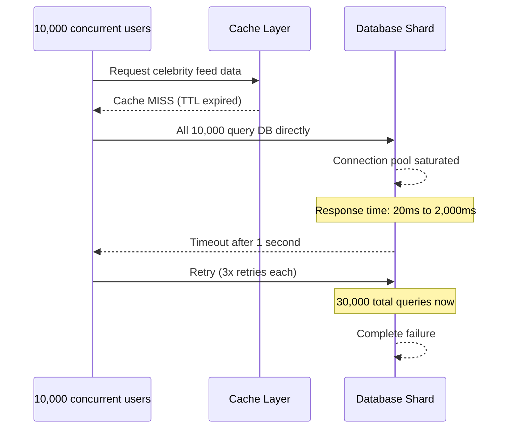

The database connection pool saturated at 500 connections. The remaining 9,500 queries queued. Database response time went from 20ms to 2,000ms as connections waited.

Queries timing out triggered automatic retries -- 3 retries each, multiplying the load by 3. 30,000 simultaneous queries against a shard designed for 5,000.

The shard's latency spiked from 20ms to 2 seconds. Timeouts cascaded. Other queries to the same shard (for regular users on that shard) also slowed. Users who had nothing to do with the celebrity experienced feed load failures.

Within 4 minutes, approximately 5% of users -- 10 million people -- experienced failed feed loads.

### The Response

On-call engineering was paged at 8:51 PM. They identified the root cause through distributed traces: every failing request had the same database shard in the hot path, and that shard was saturated.

Emergency actions:
1. Manually warmed the celebrity's data in the cache (one-time fix, took 5 minutes to execute)
2. Temporarily reduced the connection pool timeout to clear the backlog faster
3. Disabled retries for non-critical feed requests to stop the retry amplification

By 9:08 PM -- 21 minutes after the incident started -- traffic normalized. The cache was warm. The database shard returned to normal latency.

### Root Causes (Three Design Gaps)

**Gap 1: No single-flight for cache misses.**

The fix: when a cache miss occurs, use a distributed lock so only one request regenerates the data. All other concurrent requests for the same key wait for the one result and read it. One database query instead of 10,000.

Modern caching libraries (Redis with Lua scripts, or application-level mutex) make this pattern straightforward to implement.

**Gap 2: No circuit breaker on the database client.**

The fix: after N consecutive slow responses (> 500ms) from the database shard, stop sending new requests for 30 seconds. Return a "service degraded" response. Let the shard recover. After 30 seconds, gradually resume traffic.

Without a circuit breaker, slow responses caused more retries, which caused more slow responses -- a feedback loop driving the system into complete failure.

**Gap 3: No proactive cache warming for predictable hot keys.**

The fix: when a high-follower celebrity posts, proactively trigger a cache warm for their data before the TTL expires. Monitor celebrity post activity and pre-warm the cache 10 seconds before expiry using probabilistic early refresh.

### The Design Pattern That Prevents This

These three patterns -- single-flight for cache misses, circuit breakers on database clients, and proactive cache warming for known hot keys -- should be default components in any system that serves hot keys.

They are not reactive fixes to add after the first incident. They are requirements to state before the first line of code:

"When multiple concurrent requests miss the cache for the same key, only one request should hit the database. Others should wait and reuse the result."

"When the database response time exceeds X ms consistently, requests should fail fast rather than queue and retry."

"For keys known to be hot (celebrity accounts), proactive cache warming should prevent cold cache scenarios."

None of these requirements would have been obvious without thinking through failure modes during Phase 3. This is the value of the L6 framework: you find these requirements at design time, not during a production incident.

---

## Section 9: Interview Calibration

### 9.1 What Interviewers Score in Phase 3

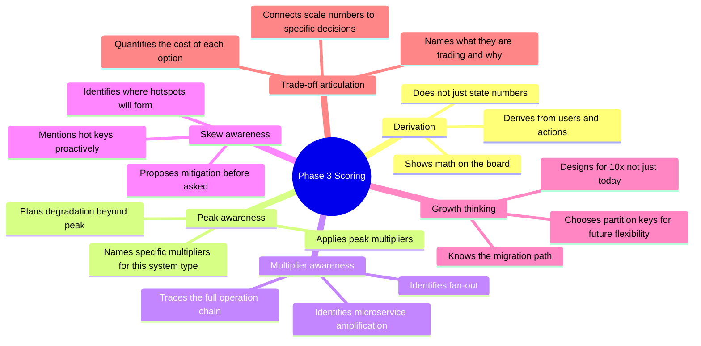

### 9.2 Phrases That Signal L6 Scale Thinking

#### Opening the scale discussion:

L5: "We need to handle a lot of traffic. Let me start designing."

L6: "Before I touch the design, let me establish scale. [asks for numbers or proposes] I'll assume 200 million DAU. Average user receives 20 notifications per day -- that's 4 billion per day, 46,000 per second. Peak at 3x is 140,000 per second. Now let me look at fan-out..."

#### Identifying fan-out:

L5: "We process 1,000 posts per second."

L6: "I need to trace the fan-out. 1,000 posts per second is the visible load. But each post fans out to followers. Average user has 500 followers: 500,000 feed writes per second. And we have celebrity accounts with millions of followers -- a single celebrity post can't be pushed synchronously. I need a hybrid push/pull model here."

#### On hot keys:

L5: "I'll partition by user ID."

L6: "Partitioning by user ID distributes data evenly -- but not load. Celebrity accounts are hot keys. One partition gets 1,000x the traffic of others. I need to handle this explicitly: aggressive caching for celebrity profile reads, read replicas for the hot partition, and pull model for their feed updates. I'll design the detection and isolation into the system rather than adding it reactively."

#### On peak:

L5: "We'll handle 50,000 QPS."

L6: "Average is 46,000 QPS. Primetime peak is 3x -- 140,000 QPS. During a major product launch or celebrity event, we might see 10x -- 460,000 QPS. I'll provision baseline for 3x, configure auto-scaling to cover 10x, and define explicit graceful degradation beyond that. The degradation plan is: recommendations and trending topics off, core delivery maintained. I want to agree on this degradation plan now, not during the incident."

#### On uncertainty:

L5: "We'll have 100,000 QPS."

L6: "Based on these assumptions, I estimate 30,000-80,000 QPS. Given that uncertainty, I'll design for 100,000 QPS with graceful degradation above. If the real number is significantly different, I'll flag which decisions would change -- specifically, the sharding strategy and the caching tier size depend most heavily on the write QPS."

### 9.3 The 8-Point Scale Checklist

Before moving from scale to architecture, verify all 8:

- Users established: "I'm assuming X DAU / Y MAU. Does that match your expectations?"
- Activity derived: "Average user performs Z actions/day"
- QPS calculated: "That gives us X QPS average from the formula: users x actions / 86,400"
- Peak accounted for: "Peak at 3-5x = Y QPS. Events at 10x = Z QPS."
- Read/write split: "Read:write ratio is approximately A:1. This makes caching [essential/helpful/irrelevant]."
- Fan-out identified: "One post fans out to N followers = M operations. Celebrity accounts need special handling."
- Hot keys considered: "Top 1% of [users/products/URLs] generate disproportionate load. I'll handle with [caching/replication/split]."
- Growth path stated: "At 10x current scale, [X component] breaks first. Migration: [approach]."

Hit all 8, and you've shown Staff-level Phase 3 execution.

---

## Section 10: Key Takeaways -- L5 vs L6

### The Dimension-by-Dimension Comparison

**Dimension 1: Opening the scale conversation**

L5: "We need to handle scale. Let me start designing."

L6: "Before I design anything, let me establish scale. I want to know: how many users, what's the average daily usage pattern, and what's the growth expectation?"

**Why it matters:** L6 treats scale as a prerequisite to design. L5 treats it as an afterthought. In a 45-minute interview, starting without scale means designing for an unknown problem.

---

**Dimension 2: The calculation**

L5: "Let's say 100,000 QPS."

L6: "200 million DAU x 20 actions per user per day / 86,400 seconds = 46,000 QPS average. Peak at 3x = 140,000 QPS."

**Why it matters:** L5 states a number. L6 derives one. The derivation shows reasoning, reveals assumptions, and makes the number adjustable if assumptions are wrong.

---

**Dimension 3: Peak vs. average**

L5: Designs for average load.

L6: "Average is 46,000 QPS. Peak during primetime is 140,000. During events, 460,000. I'll design baseline capacity for 140,000, auto-scale to 460,000, and define graceful degradation beyond that."

**Why it matters:** Systems fail at peak. Designing for average is designing to fail during the most important moments.

---

**Dimension 4: Fan-out**

L5: "We process 1,000 posts per second." (Done.)

L6: "1,000 posts per second is the source. Fan-out to followers: x 500 average = 500,000 feed writes per second. Celebrity accounts: x 5M followers = 5 billion writes per second if pushed -- impossible. I need pull model for celebrities."

**Why it matters:** Fan-out is a hidden multiplier. Missing it means underestimating load by orders of magnitude.

---

**Dimension 5: Hot keys**

L5: Assumes uniform distribution. Designs for average traffic per partition.

L6: "Top 1% of accounts generate 50%+ of traffic. These are my hot keys. I'll handle with: CDN caching for reads, read replicas for hot partitions, pull model for celebrity fan-out, and single-flight for cache misses to prevent stampedes."

**Why it matters:** Hot keys are the number one cause of unexpected production incidents in distributed systems. Designing for uniform distribution means the first viral event breaks your system.

---

**Dimension 6: Growth**

L5: Designs for current scale.

L6: "Current: 1M users. Expected 18-month target: 10M. I'll design for 10M with a migration path beyond. Specifically: schema partition keys chosen for future sharding, application servers stateless, monitoring for scale limits."

**Why it matters:** Building a system that works today but requires a complete rewrite in 6 months is not successful engineering. L6 engineers design with a horizon.

---

## Section 11: Brainstorming Questions

Think through each of these questions with a specific system in mind. Don't just read them -- reason through them.

### On Scale Numbers

1. For a system you've built or worked on, do you know the actual QPS? The peak QPS? The read:write ratio? If you don't know these numbers for a system you operate, that's a gap worth closing.

2. Pick any product you use daily -- Slack, Spotify, Instagram. Estimate the QPS without looking anything up. Start from: how many users do they likely have? What's the primary action? How often per day does a user do it? Now derive the QPS. How confident are you?

3. What is the largest scale system you have personally touched? At what scale did it break? What was the first component to fail?

4. What is the highest read:write ratio system you've designed? How did that ratio influence the architecture?

5. What assumptions in a scale estimate are most likely to be wrong? (Think about: user behavior estimates, peak multipliers, data growth rates.)

### On Fan-Out and Hot Keys

6. Think of a system you know well. Where does fan-out occur? Did anyone explicitly model the fan-out when designing it?

7. Have you personally experienced a hot key incident? What caused it -- a celebrity, a viral piece of content, a popular product, something unexpected? How was it resolved?

8. What are the potential hot keys in a food delivery app? (Think about: popular restaurants, surge pricing events, extreme weather days.)

9. If you were starting a new social platform today, what three design decisions would you make specifically to prevent hot key problems?

10. Why is the power law (top 1% = 50% traffic) important for system design? What would be different if traffic were distributed uniformly?

### On Growth and Failure

11. For a system you currently maintain, what breaks first at 10x current load? Do you have a migration plan for it?

12. When is it correct to design for 100x scale on day one? When is it wrong? What are the costs in each case?

13. How do you explain the concept of blast radius to a non-technical stakeholder? What analogy would you use?

14. What monitoring metrics would tell you, three months in advance, that you're about to hit a scale wall?

15. Why does "eventually consistent" become more attractive as scale increases? At what scale does strong consistency become impractical for user-facing writes?

---

## Section 12: Reflection Prompts

Spend 20 minutes on each reflection. Write your answers -- don't just think them.

### Reflection 1: Your Scale Estimation Intuition

Think about your personal track record with scale estimates.

When you've estimated scale in the past -- for a project, in a design review, in an interview -- how accurate were you? Were your estimates consistently too high (over-engineering) or too low (scrambling to scale later)?

Most engineers have a bias. Some always over-engineer -- they build for Google scale from day one and deliver late while solving problems they don't have. Others always under-engineer -- they ship fast and spend the next year in scaling emergencies.

Which bias do you have? What causes it?

Now think about the 5-step pipeline (anchor on users -> derive activity -> convert to rates -> account for peaks -> find architectural implication). Do you naturally go through these steps? Or do you skip to the end and name a number based on gut feel?

Write down: the last scale estimate you made. What was your process? What was the result?

### Reflection 2: The Fan-Out You Missed

Pick a system you have designed or significantly contributed to.

Draw the complete operation chain: starting from one user action, trace every downstream operation it triggers. Include fan-out to other users, microservice calls, database writes, cache invalidations, and notifications.

Now count the total number of operations triggered by one user action.

Was there a point in the design process where this multiplier was explicitly discussed and sized for? Or was it discovered later, in production?

If it was discovered in production: what was the symptom? A slow database? A queue backing up? A notification storm?

If you had used the framework's fan-out analysis at design time, would you have found it earlier?

### Reflection 3: Designing for the On-Call Engineer

Think about a system you own. Imagine it's 3 AM and something is wrong. You get paged.

You open your laptop. What do you wish you had designed into the system that you currently don't have?

Common answers:
- A single place to see which component is slow
- A correlation ID to trace a single failed request
- A kill switch to disable the broken feature without deploying code
- A runbook for common failure modes
- An alert that told you the problem was coming before users noticed

For each thing on your list: why wasn't it designed from the start? Was it a time constraint? A "we'll add it later" decision? Or did it simply not come up during requirements?

Now: for your next design, how will you make sure these operational requirements are stated at design time, not added after the first 3 AM incident?

---

## Section 13: Homework Exercises

### Exercise 1: Scale Estimation Drill

Estimate the scale for each of these systems. For each one, show your derivation (don't just state a number):

1. Uber -- ride requests, driver location updates, trip records
2. Slack for a 5,000-person company -- messages per day, search QPS, active connections
3. A large online bank -- transaction QPS, account reads, fraud check latency requirements
4. A news website like BBC or CNN -- article reads, breaking news spikes

For each, produce: average QPS (read and write separately), peak QPS with multiplier, storage per year, and one architectural implication that falls directly from the numbers.

The goal: get comfortable deriving numbers from first principles, not looking them up.

---

### Exercise 2: Fan-Out Analysis

Take a social media platform (use Twitter/X as your model).

Map out all fan-out paths:
- One user tweet -> what does the system do? All the steps, all the writes?
- One user signs up -> who needs to know?
- One user blocks another -> what must change?

For each fan-out path:
- What is the worst-case multiplier? (What if this is a celebrity?)
- Would you use push (write-time fan-out) or pull (read-time) for each?
- At what threshold would you switch strategies?

Write up the hybrid model that handles both regular users and celebrities.

---

### Exercise 3: Hot Key Stress Test

Pick a system you know well. It could be a personal project or a system at work.

Identify at least 5 potential hot keys. For each one:
- What causes it to be hot? (popularity, seasonal patterns, viral moments?)
- What happens if it gets 1,000x normal traffic?
- What is your current mitigation? (If none, that's fine -- just note it)
- What would you add as a mitigation?

Now rank the 5 hot keys by probability x impact. Which one should you address first?

---

### Exercise 4: Growth Modeling

Take a startup scenario:
- Launch: 50,000 users, 20,000 DAU
- Month 3: 200,000 users, 80,000 DAU
- Month 6: 1,000,000 users, 400,000 DAU
- Month 12: 5,000,000 users, 2,000,000 DAU

For each milestone, answer:
- What is the QPS for the primary action?
- What is the primary bottleneck at this scale?
- What architectural change is needed?
- What is the approximate infrastructure cost?

The goal: build intuition for which scale thresholds require which architectural changes.

---

### Exercise 5: Peak Load Planning

Choose a system where peak load matters significantly (e-commerce, news, sports results, social media).

Document a complete peak load plan:
- What is the average load?
- What is the normal peak (daily/weekly pattern)?
- What is the event peak (one-in-a-year scenario)?
- What are the peak multipliers for each?
- What is your baseline provisioning level?
- At what multiplier does auto-scaling kick in?
- What features gracefully degrade and in what order?
- What is the user experience during each degradation tier?

Present this as a one-page document you'd share with the engineering team and product management.

---

### Exercise 6: Full Scale Analysis Presentation

Pick any system design prompt (notification system, chat app, URL shortener, ride-sharing).

Prepare a complete 8-10 minute scale presentation:
1. User scale (DAU/MAU, with assumption statement)
2. Activity derivation (how you got from users to actions)
3. QPS calculation (showing the formula and work)
4. Peak multipliers (named and justified)
5. Read:write ratio (derived from user behavior)
6. Fan-out analysis (traced end-to-end)
7. Hot key identification (where and mitigation)
8. Growth path (current to 10x to 100x)
9. Top 3 architectural implications

Deliver it to a partner or record yourself. Time it -- it should take 8-10 minutes. If it takes longer, practice until it's smooth. This is the Phase 3 presentation you will give in your L6 interview.

---

## Diagrams Reference

### The Scale Pipeline

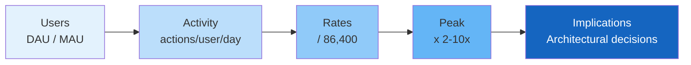

### Fan-Out Decision Tree

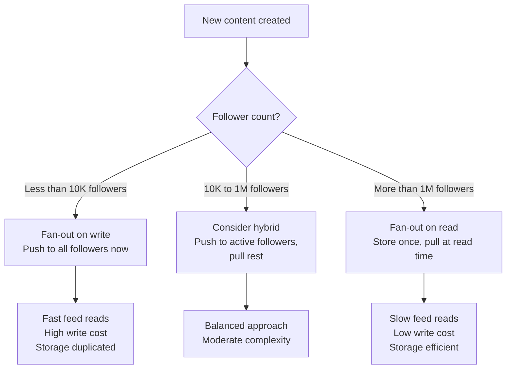

### Hot Key Mitigation Decision

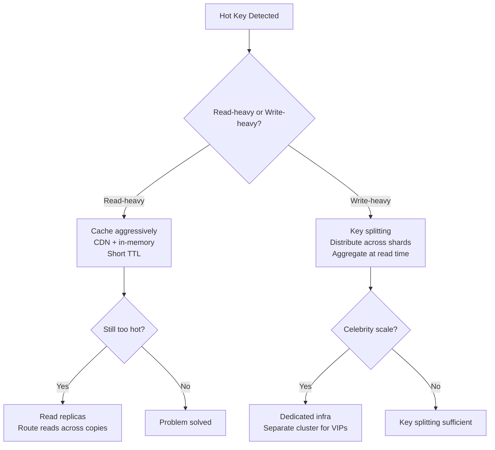

### Scale Threshold Decisions

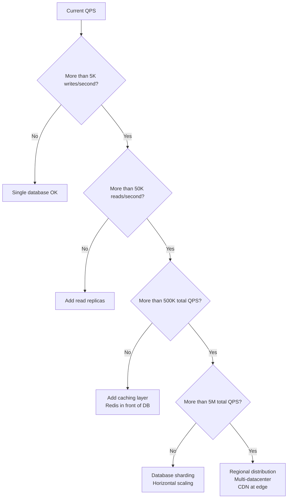

---

## Real-Life Scale Incidents -- What Goes Wrong When You Don't Calculate First

### Incident 1: The Fan-Out That Brought Down the Queue

A team built a notification system. Phase 3 was skipped. The assumption: "It's just a queue, it scales automatically."

The calculation they didn't do: 50M users x 5 notifications/day = 250M notifications/day = 2,900/second average. But one event type -- "your team won the match" in a sports app -- went to ALL fans of a team simultaneously. A popular team had 8 million fans. One event = 8M notifications in < 1 second.

The queue workers were sized for 3,000 notifications/second. 8 million messages hit in under 1 second. Queue depth went from 0 to 8M in seconds. Workers processed at 3K/second. Time to drain: 44 minutes. During those 44 minutes, all other notifications were delayed by 44 minutes.

The fix: detect high-fan-out events, use a separate high-volume lane, time-slice delivery over 60 seconds instead of instant. This architectural decision required knowing the fan-out number.

Staff lesson: Fan-out is not edge case thinking -- it is the calculation that determines your architecture. Do the math: (users per group) x (events per day) x (spike factor). The result changes your queue design.

---

### Incident 2: The Read Replica That Made Things Worse

A team was getting hammered on their primary database. They added read replicas. Latency improved briefly, then returned to baseline. They added more replicas. Latency got worse.

What happened: they had 80% read traffic and 20% write traffic. Every write was replicated to all replicas. Adding more replicas increased replication lag and put more write pressure on the primary. At 10 replicas, the replication queue was so large that read replicas were serving data 45 seconds stale.

The actual bottleneck was never reads -- it was writes. The 20% write traffic was doing table scans on every write. Adding read replicas solved the wrong problem.

The Phase 3 calculation they should have done: (write QPS) x (average write cost in CPU-ms) vs (read QPS) x (average read cost). The write cost per operation was 10x the read cost. The bottleneck was compute on the write path, not read capacity.

Staff lesson: Always characterize the read/write ratio AND the per-operation cost. High write-to-read ratio with expensive writes -> sharding or write optimisation. High read-to-write ratio with cheap reads -> read replicas. Solving the wrong bottleneck wastes months.

---

### Incident 3: The Storage That Grew Faster Than Revenue

A user-generated content platform estimated: "10K uploads/day x 1MB average = 10GB/day = 300GB/month. That's cheap."

What they didn't calculate: users accumulate content. After 12 months: 300GB/month x 12 months = 3.6TB total. After 24 months: 3.6 + (12 x 400GB growth) = 8.4TB (traffic grew). After 36 months: 18TB. Each TB in hot storage: ~$23/month.

At month 36: 18TB x $23 = $414/month just for storage. Plus: the search index of all that content was also growing. At 100 bytes of index data per asset, 18TB of assets = 1.8TB of search index = another $41/month.

The deeper problem: no lifecycle policy was ever designed. By month 36, most of that content (90%) was never accessed after the first 30 days. All of it sat in hot storage.

Staff lesson: Storage growth compounds. The phase 3 calculation isn't just "how much storage on day 1" -- it's the growth rate over 12, 24, 36 months. And: "what percentage of data is accessed after day 30, day 90, day 365?" This determines whether you need a lifecycle policy -- and whether you design hot/warm/cold tiers from the start.

---

## Brainstorming Questions -- For Subconscious Internalization

Work through these by writing answers, not just reading. These questions are designed to build the instinct to derive numbers from first principles.

**Question 1:** "Design a ride-sharing system." Before you calculate QPS, what 3 questions do you ask to establish the baseline numbers? (Hint: DAU, sessions per day, events per session.) Work through the math to QPS.

**Question 2:** You are designing a social feed system. Calculate: if 5% of users post once a day and each post goes to the average of 200 followers, what is the fan-out write rate? At 200M DAU, how many writes per second does this generate at peak?

**Question 3:** Your service runs at 10,000 requests/second. A database query takes 10ms on average. How many database connections do you need at minimum? What happens if the query time spikes to 100ms? What does this tell you about connection pool sizing?

**Question 4:** A team says "we'll scale horizontally -- just add more servers." What questions do you ask to probe whether horizontal scaling will actually work? What conditions make horizontal scaling ineffective?

**Question 5:** Your API returns a response in P99=150ms. You add a new synchronous call to a downstream service with P99=80ms. What is the new P99 of your API? Why is the answer not simply 150+80=230ms? (Think about what P99 means for correlated calls.)

**Question 6:** "Design a URL shortener." Estimate: how many bytes of storage do you need for 1 billion URLs if each URL entry has: 7-char short code (7 bytes), 200-char original URL (200 bytes), timestamp (8 bytes), click count (4 bytes), user ID (8 bytes)? Calculate the total and compare to your intuition.

**Question 7:** You are designing a video streaming service. Users watch an average of 2 hours of video per day at 720p (2Mbps). At 5M DAU, what is your CDN egress requirement in Gbps? What does that cost at ~$0.02/GB? Is this the dominant cost in your system?

**Question 8:** A new feature requires storing every user's activity event (click, scroll, view) for 30 days for analytics. Average: 500 events/user/day. At 10M DAU, how many events/day? How many bytes/day at 100 bytes/event? How many bytes/month? At what point does this become a cost concern?

**Question 9:** You estimate your system needs 50,000 QPS at peak. An m5.xlarge handles 1,000 QPS. How many servers do you need at peak? At 70% average utilization, how many at average load? What is the utilization efficiency? Is this acceptable?

**Question 10:** "Design a real-time leaderboard for a mobile game." The game has 1M concurrent players. Each player submits a score update every 10 seconds. What is the write QPS? The top 100 leaderboard is fetched by every player every 30 seconds. What is the read QPS? Which is higher? What does this tell you about your cache strategy?

**Question 11:** You are building a chat system. Average message: 500 bytes. 10M DAU each send 50 messages/day. How much storage per day? Per year? Now add: you want to provide full-text search over the last 12 months of messages. The search index is typically 3x the raw data size. What is the search index size?

**Question 12:** A team says "our database handles 5,000 writes/second easily in testing." Why might this number be misleading for production capacity planning? List 4 reasons the production number might be significantly lower.

**Question 13:** Your service serves 12,000 requests/second average. Historical data shows peak is always 4x average during the first hour after a viral tweet. You have auto-scaling with a 3-minute warm-up time. How many "minimum ready" instances do you need to handle the first 3 minutes of peak before auto-scaling kicks in? What happens if you set minimum too low?

**Question 14:** You are calculating storage for a notification system. Each notification record is 300 bytes. You keep 30 days of history. At 10M DAU receiving 5 notifications/day: how much storage? Now add: the notifications table has a secondary index on user_id and timestamp. What is the index overhead (typically 20-30% of table size)? What is the total storage?

**Question 15:** Design a metrics pipeline that processes 1M data points per second. Each data point is 50 bytes. You want to store raw data for 24 hours and downsampled (1-minute aggregates) for 90 days. Calculate: raw storage required (24 hours), downsampled storage required (90 days, assume 100x compression from aggregation). What is the ratio of raw:downsampled storage?

---

## More Homework Exercises (7-10)

### Exercise 7: The Full Phase 3 Walkthrough Under Time Pressure

Set a 5-minute timer. Pick this prompt: "Design a social photo sharing app (like Instagram)."

In 5 minutes, derive:
1. DAU estimate (justify it)
2. Writes/second (posts, comments, likes -- separately)
3. Reads/second (feed loads, profile views -- separately)
4. Storage per day (photos, metadata -- separately)
5. The dominant bottleneck (which of the above is hardest to scale?)

After: compare to Instagram's real numbers (100M+ photos uploaded/day, ~1.5 billion MAU). Were your estimates in the right order of magnitude?

---

### Exercise 8: The Fan-Out Calculation for Any System

For each system below, calculate the fan-out:

1. **Twitter**: 300M active users, average 100 followers, 500M tweets/day
   - Fan-out writes/day if using push-to-feed?
   - What percentage of users have > 10,000 followers?
   - At what follower threshold does push become more expensive than pull?

2. **WhatsApp Group Messages**: 2B users, average 5 group chats, average 30 members per group, average 50 messages/day/group
   - Total messages delivered per day?
   - Average delivery fan-out per message?

3. **Email Newsletter**: 500K subscribers, 3 emails per week
   - Delivery operations per week?
   - If your delivery throughput is 100K/hour, how long does one send take?

Show your math. Identify which number surprised you most.

---

### Exercise 9: Bottleneck Identification Game

Here is a system description: 
"An e-commerce search service. Users search for products. Each search query: looks up in Elasticsearch (20ms), calls a ranking model (ML inference, 50ms), fetches product metadata from a DB (15ms), applies personalisation (calls user preference service, 30ms), all in sequence. Total: 115ms."

Questions:
1. What is the P99 latency if each service has its own P99 variance? (Assume each can spike to 3x its stated time at P99.)
2. Which single service, if optimised, gives the most latency improvement?
3. Which calls could be made parallel instead of sequential? What would the latency be?
4. If you had to cut 40ms from this path, what would you change?
5. Draw the call graph with parallel vs sequential paths and recalculate total latency.

---

### Exercise 10: Cost-at-Scale Estimation

You are presenting a new feature to your VP of Engineering. The feature adds real-time sync of a 5KB "user profile" object across 3 regions. Whenever a user updates their profile, all 3 regions must be synchronized.

Calculate:
1. How many profile updates/day at 50M DAU with 1% of users updating per day?
2. Cross-region transfer per day (each update crosses 2 region boundaries)?
3. Monthly data transfer cost at $0.02/GB?
4. At what user scale does this cross $10,000/month? $100,000/month?
5. What architectural change reduces this cost by 80%?

Present your numbers in the format: "At our current scale, this feature costs $X/month. At 2x scale, it costs $Y/month. If we use [approach], we can reduce to $Z/month."

This is exactly how a Staff engineer presents infrastructure cost to leadership.

---

*End of Chapter 16 (original content).*

> **The core lesson:** Scale is not a number -- it's a lens. Before you draw a single box, establish the scale. Derive your numbers from first principles. Find the fan-out. Find the hot keys. Account for peak. Plan for 10x growth. Then design. Every architectural decision after that point will be justified, defensible, and appropriate for the actual scale of the problem.

---

## Production Incidents: Capacity Planning Failures in the Field

The three incidents below are real cases where Phase 3 -- estimating traffic, storage, compute, and network -- was done incorrectly. Each one caused a production failure. Each one was preventable with better capacity modeling.

---

## Production Incident 3: Reddit's New Year Traffic Spike -- Capacity Estimate Off by 3x (2021)

**Company:** Reddit | **Year:** 2021

### What Happened (analogy first)

Imagine you own a restaurant. You prepare for your busiest night of the year -- New Year's Eve -- by ordering 2x your average Friday night supplies. That sounds reasonable. But then a celebrity tweets a photo at your restaurant, and suddenly 3.2x the usual crowd shows up. You run out of everything. The kitchen shuts down. Customers leave angry.

Reddit's capacity team did the same thing. They modeled peak load as "2x average daily traffic." New Year's Eve 2021 brought 3.2x average due to a correlated external event: the GameStop/WallStreetBets viral moment broke simultaneously with the New Year celebration traffic. Two unrelated traffic spikes collided.

### The Capacity Planning Failure

Reddit's estimate: peak = 2x average. Reality: peak = 3.2x average.

What the model missed:
- It modeled peak based on historical single-event spikes (primetime TV, major news)
- It did not model correlated spikes: two independent high-traffic events occurring simultaneously
- The 2x multiplier was derived from normal seasonal variation, not from viral moments
- Database connection pools were sized for 2x peak. At 3.2x peak they exhausted completely
- Connection pool exhaustion caused a cascading failure: requests queued, queues filled, timeouts cascaded

### ASCII Diagram

```
CAPACITY MODEL VS. REALITY:

  Reddit's model:
  +----------------------------+
  | Average traffic: 100K QPS  |
  | Peak multiplier: 2x        |
  | Planned capacity: 200K QPS |
  | DB connection pool: 5,000  |
  +----------------------------+

  What actually happened (NYE 2021):

  New Year's traffic (1.8x)
       +
  GameStop viral moment (1.4x)        <-- correlated, not additive in model
       |
       v
  Combined: 3.2x average = 320K QPS

  At 250K QPS: DB connection pool fills (5,000 / 5 conns per req = 1,000 req/sec max)
  At 280K QPS: Connection timeout errors begin
  At 320K QPS: Full connection pool exhaustion

  +------------------+  +-----------------+  +-------------------+
  | Requests queue   |->| Queue fills      |->| Requests time out |
  | waiting for DB   |  | (30 sec timeout) |  | Users see errors  |
  | connections      |  |                 |  | Reddit is "down"  |
  +------------------+  +-----------------+  +-------------------+

  THE FIX:
  Model peak = max(seasonal_peak, viral_spike_historical_max, correlated_spike_scenario)
  Viral spike historical max from Reddit data: 4.1x (Boston Marathon bombing, 2013)
  New target: design for 5x with graceful degradation above 3x
```

### Root Cause

The 2x peak multiplier was derived from normal seasonal traffic variation. It was a reasonable model for planned events (New Year's countdown, Super Bowl, major product launches). It was not a valid model for viral moments, which do not follow the same distribution. Viral moments are fat-tail events: rare, but when they occur they are 3x-5x average, not 2x.

The model used the wrong baseline. For a site like Reddit -- built specifically for viral community moments -- the capacity model should use the fat-tail distribution of historical viral events, not the normal distribution of seasonal traffic.

### Fix Applied

Reddit rebuilt the capacity model using the 95th percentile of historical peak spikes (including viral moments), not the seasonal 2x multiplier. The new target is: design for 5x average, with graceful degradation (read-only mode, reduced feature set) above 3x. They also increased database connection pool headroom and added connection pool monitoring with automatic alerts at 60% utilization.

### Staff Lessons

- The right question is not "what is our peak?" but "what is our fat-tail peak?" -- the spike that happens once a year due to events outside your control.
- At a platform that hosts viral content (Reddit, Twitter/X, YouTube, TikTok), the capacity model must use historical viral spike data, not seasonal averages. The two distributions are different.
- Correlated spikes are the hardest case: two independent high-traffic events that happen to coincide. Your model must have a scenario for "two things go viral at once." Historical data will show you this has happened before.

---

## Production Incident 4: WhatsApp's Storage Estimate Failure at Scale

**Company:** WhatsApp | **Year:** 2013 (video launch)

### What Happened (analogy first)

Imagine you run a post office. You estimate your storage needs based on the average number of letters per day. It works perfectly for years. Then the post office starts accepting packages. The volume of packages is much lower than letters, but each package is 500x larger. Your storage fills up in three months instead of three years. You estimated by count; you should have estimated by total size.

WhatsApp made this exact mistake when they launched video sharing. The storage model was built on message count, not message size. Text messages average around 1KB. Videos average around 40MB -- a 40,000x size difference. Even at a fraction of video message volume, the storage consumed was orders of magnitude larger than the model predicted.

### The Capacity Planning Failure

WhatsApp's storage model: total_storage = message_count x average_message_size

The problem: "average message size" was calculated from the existing message distribution (almost entirely text + small images). When video launched:
- Video messages were 1% of message count
- Video messages were 99% of storage consumed
- Average message size jumped from 2KB to 80KB overnight (because even 1% videos at 40MB each dominates the average)
- Storage grew 40x faster than the forecast
- Servers ran out of disk within 3 months of the video launch

### ASCII Diagram

```
THE STORAGE MODEL BEFORE VIDEO LAUNCH:

  Message type    | Volume/day  | Avg size | Storage/day
  ----------------+-------------+----------+-------------
  Text            | 80M         | 1KB      | 80 GB
  Image           | 15M         | 100KB    | 1.5 TB
  Audio           | 5M          | 500KB    | 2.5 TB
  ----------------+-------------+----------+-------------
  TOTAL                                      4.08 TB/day

  Forecast: linear growth. 30-day retention. ~120 TB total.

THE STORAGE MODEL AFTER VIDEO LAUNCH (actual):

  Message type    | Volume/day  | Avg size | Storage/day
  ----------------+-------------+----------+-------------
  Text            | 80M         | 1KB      | 80 GB
  Image           | 15M         | 100KB    | 1.5 TB
  Audio           | 5M          | 500KB    | 2.5 TB
  Video           | 800K (1%)   | 40MB     | 32 TB      <-- dominates
  ----------------+-------------+----------+-------------
  TOTAL                                      36.08 TB/day

  Actual storage: 8.8x higher than forecast.
  Disk exhaustion: 3 months post-launch instead of 2+ years.

THE RIGHT MODEL:
  storage = SUM over all content types of (volume_per_type x P99_size_per_type)

  Use P99 size per type, not average. The large messages set the growth curve.
  Model each content type separately. Never aggregate across size classes.
```

### Root Cause

The storage estimate aggregated all message types into a single average size. This works when all message types are within the same order of magnitude in size. It breaks catastrophically when a new message type is introduced that is 4 to 5 orders of magnitude larger than the existing average.

The correct model disaggregates by content type and uses P99 size per type (not average), because the large items -- even at low volume -- dominate total storage.

### Fix Applied

WhatsApp rebuilt the storage capacity model to track each content type (text, image, audio, video, document, sticker) separately. Each type has its own volume forecast, its own P99 size estimate, and its own storage growth curve. New content type launches now require a storage impact analysis as a launch gate: "What is the P99 size of this content type, at what volume, and what does storage look like at 30/90/180 days?"

### Staff Lessons

- Never aggregate storage estimates across content types that differ by more than one order of magnitude in size. A 1% volume item that is 40,000x larger dominates your total.
- Model storage using P99 size per type, not average size. The average is pulled down by the small items. The P99 is where your disks live.
- Any new content type is a separate capacity planning exercise. "Video" is not a footnote to "messages." It is a new system that happens to use the same delivery infrastructure.

---

## Production Incident 5: Discord's Write Throughput Underestimate for Gaming Servers (2020)

**Company:** Discord | **Year:** 2020

### What Happened (analogy first)

Imagine you run a stadium concession stand. You plan staffing based on how often fans leave their seats to buy food -- say, once per hour. That model works fine for a baseball game. Then you host a soccer match. Soccer fans never leave their seats, but they spend the entire game cheering (writing to the system). Your food sales model was wrong, but your noise model was also wrong: you didn't model cheering. In Discord's case, "reactions" are cheering -- and reactions are 10x more frequent than messages.

### The Capacity Planning Failure

Discord's write load model was: write_QPS = DAU x messages_per_user_per_day / 86,400

What the model missed: message reactions. Reactions (a user clicks an emoji on a message) are a separate write operation, stored separately from messages. The model assumed reactions were negligible. On gaming servers during peak gaming moments (a major Fortnite update, a live Twitch stream, a new game launch), reaction rates were 10x message rates.

Discord has gaming community servers with up to 500,000 members. During a major gaming event:
- Messages: 500 per minute (moderated, structured)
- Reactions: 5,000 per minute (unmoderated, spontaneous)
- Presence updates (user online/offline/away status): 8,000 per minute

None of the latter two were in the write throughput model. At peak gaming events, actual write throughput was 8x planned capacity.

### ASCII Diagram

```
DISCORD'S WRITE LOAD MODEL (original):

  Operation       | Modeled rate  | Actual peak rate | Ratio
  ----------------+---------------+------------------+-------
  Messages        | 500/min       | 500/min          | 1.0x   (correct)
  Reactions       | ~50/min       | 5,000/min        | 100x   (missed!)
  Presence updates| ~100/min      | 8,000/min        | 80x    (missed!)
  ----------------+---------------+------------------+-------
  TOTAL writes    | 650/min       | 13,500/min       | 20.8x  (disaster)

  Database write throughput designed for: 650 writes/min
  Actual peak during Fortnite S4 launch: ~13,500 writes/min

  What happened:
  +------------------+  +------------------+  +------------------+
  | Write queue      |->| Queue depth      |->| Writes fall       |
  | backs up         |  | exceeds limit    |  | behind real-time  |
  +------------------+  +------------------+  | by 45 seconds    |
                                              +------------------+
  User sees: "Reaction count stuck at 3" when it should be 847
  User sees: Presence shows friend as offline when they are online

THE FIX -- model EACH operation type:

  Total write QPS = SUM of:
  - message writes (low volume, high size)
  - reaction writes (high volume, low size)
  - presence writes (very high volume, very low size, TTL-based)
  - read-receipt writes
  - typing indicator writes

  Each operation type has a DIFFERENT rate, DIFFERENT size, DIFFERENT retention.
  Aggregate models hide the dominant term.
```

### Root Cause

The capacity model treated "writes" as a single category. In reality, a chat platform has five or more distinct write operation types, each with different rates, sizes, and retention requirements. The model was built when Discord was primarily a text chat platform. Reactions were a minor feature then. By 2020, gaming servers had turned reactions into the dominant write operation.

### Fix Applied

Discord decomposed the write load model into separate operation types. Each type now has its own write QPS estimate, its own database table (or Cassandra column family), and its own capacity headroom target. For high-frequency low-importance writes (reactions, presence, typing indicators), Discord moved to a separate storage tier with lower durability guarantees and higher throughput limits.

They also added real-time write throughput monitoring per operation type, with automated alerts at 50% of planned capacity -- giving time to provision more resources before hitting limits.

### Staff Lessons

- Model each operation type separately. "Total writes" is not a useful number. Separate messages, reactions, presence updates, read receipts, and any other write type your system has.
- High-frequency low-importance writes are a distinct architectural concern from low-frequency high-importance writes. They need different storage, different throughput capacity, and different consistency guarantees.
- New feature launches that introduce a new write operation type are capacity planning events, not just product events. "We're launching reactions" should trigger: "What is the write rate model for reactions at gaming server scale?"

---

## Brainstorming Questions: Phase 3 Scale and Capacity Planning

Use these as interview prep, study prompts, or team discussion starters. Work through each one. The goal is to practice deriving numbers from first principles, not memorizing formulas.

**Back-of-Envelope Math Techniques**

1. A photo-sharing app (similar to Instagram) has 500M DAU. Each user uploads an average of 0.3 photos per day. Each photo is 3MB before compression and 800KB after. Estimate: daily upload volume in TB, monthly storage growth in PB, and required write throughput in photos/second.

2. You are estimating QPS for a new feature: "Users can react to posts with emoji." The platform has 200M DAU. You estimate 10% of users will use reactions daily, averaging 5 reactions per session. Derive: reactions per day, reactions per second (average), and reactions per second at 3x peak. What database write throughput does this require?

3. A food delivery app (like DoorDash) has 10M orders per day. Each order goes through 8 state transitions (placed, accepted, preparing, ready, picked up, in transit, delivered, rated). Each transition writes to the orders table. Estimate: total writes per second at average load and at dinner peak (assume 3x average). How does this compare to a naive estimate of "10M orders per day = 115 orders per second"?

**Storage Estimation: SQL vs. Object Storage**

4. A video platform stores user-uploaded videos. Average video: 500MB. Videos are kept for 5 years. The platform has 50M registered users, 5% of whom upload one video per month. Estimate: total storage after 1 year, 3 years, 5 years. At what year does this cross 1 exabyte?

5. A SaaS company (like Salesforce) stores CRM records in a relational database. Each record: 2KB. They have 100,000 enterprise customers, each with an average of 10,000 records. Estimate: total storage in TB. Now add: the company keeps 5 years of audit logs for each record change (10 changes per record per year, each 500 bytes). How does audit log storage compare to the primary record storage?

6. Twitter stores every tweet ever posted. 500M tweets per day. Each tweet: 500 bytes of text + 200 bytes of metadata. Tweets are stored indefinitely. Estimate: storage per day, per year, and total since 2006 (assume the platform started at 10% of current volume and grew linearly). At what year does total tweet storage cross 1 PB?

**Bandwidth Estimation**

7. A CDN serves images for an e-commerce site. The site has 5M daily visitors, each viewing 20 images per session. Average image: 150KB. What is average bandwidth in Gbps? What is peak bandwidth at 3x average? What does this cost at $0.01/GB egress?

8. Netflix streams video to 250M subscribers. On a typical evening, 20% of subscribers are streaming simultaneously. Average stream: 5 Mbps (HD). What is total streaming bandwidth in Tbps at peak? How does this compare to the estimated total internet traffic in 2024 (roughly 600 Exabytes per month)?

**Caching Ratio Calculation**

9. A news website serves 10M page views per day. Each page view requires 5 database reads. Without caching: 50M DB reads per day. With a cache hit rate of 90%: how many DB reads per day? At what cache hit rate does the database become unnecessary for reads in practice? (Hint: there is a point where the marginal gain from improving cache hit rate becomes negligible.)

10. A cache has a 95% hit rate. Average DB read: 10ms. Average cache read: 0.5ms. What is the blended average read latency? If you improve the cache hit rate to 99%, what is the new blended latency? At 99.9%? What does this tell you about the diminishing returns of cache optimization beyond a certain hit rate?

**Read/Write Ratio Impact on Architecture**

11. System A: 1,000 writes per second, 100,000 reads per second (100:1 read-heavy). System B: 50,000 writes per second, 50,000 reads per second (1:1). For each system, name the dominant architectural concern and the primary scaling strategy. Why does a 100:1 read-heavy system almost always use caching as its primary scale lever?

12. An analytics dashboard (like Grafana over a time-series database) has a read/write ratio of 1:1,000 (write-heavy). Each metric write: 50 bytes. 1,000 writes per second from 500 monitored services. What is daily write volume? What is the database write throughput requirement? Why does a write-heavy system's architecture look fundamentally different from a read-heavy system's architecture?

**Peak vs. Average Traffic**

13. A streaming service (like Twitch) runs a major esports tournament. Normal peak: 3x average. During the tournament, concurrent viewers hit 20x average for a 6-hour window. The CDN is sized for 5x average. Walk through what happens minute by minute when the tournament starts. What three architectural choices would have prevented the failure?

14. An airline booking system (like United's or Delta's) handles 1M bookings per day normally. On a day when a competitor cancels flights, demand spikes to 8x in 2 hours. The system was designed for 3x peak. What are the three places in the architecture that fail first, and in what order?

**Geographic Distribution in Capacity Planning**

15. A global payment system (like Visa) processes 100M transactions per day. Traffic distribution: 40% US, 30% Europe, 20% Asia, 10% rest of world. Peak US traffic: 9am-6pm EST. Peak European traffic: 9am-6pm CET (3 hours ahead of US). During the 3-hour overlap (12pm-3pm EST / 12pm-3pm CET), US and EU peaks coincide. What is the capacity requirement for the global load balancer at that window?

16. Amazon runs its holiday sale simultaneously across 12 countries. Each country has a different timezone, so the "midnight sale start" hits each country's infrastructure at different times. From a capacity planning perspective, is this better or worse than a single global simultaneous launch? What is the worst-case scenario?

**Cost Implications of Capacity Estimates**

17. Your engineering team proposes adding 3x capacity headroom to handle unexpected spikes. The current infrastructure costs $2M per month. What is the monthly cost of 3x headroom? Present an alternative: auto-scaling with a 30-second warm-up time and graceful degradation above 2x. What are the trade-offs?

18. A startup is designing a messaging system. Two options: (A) provision for 10x current load, $500K/month; (B) provision for 3x current load with auto-scaling, $150K/month base + $50K/month average scale-out cost. The startup has 18 months of runway. What is the total infrastructure cost of each option over 18 months? Which do you recommend, and why?

**When to Scale Up vs. Scale Out**

19. A database is hitting 80% CPU utilization at current load. Two options: (A) scale up -- move to a server with 4x CPU and 4x RAM; (B) scale out -- add read replicas. The primary bottleneck is 90% reads, 10% writes. Which option is correct, and what would need to be true for the other option to be correct?

20. A web server handles 10,000 requests per second on a single machine with 80% CPU. Option A: add a second identical machine (scale out, 2x cost). Option B: move to a machine with 2x CPU (scale up, 2.2x cost). At 10x current load, which strategy fails first? What does this tell you about the long-term economics of scale-up vs. scale-out for stateless services?

---

## L5 vs. L6 Calibration Table: Phase 3 Scale and Capacity Planning

Go through each row. Be honest about which column describes your current behavior. Each L5 entry is a specific, actionable gap.

| Dimension | L5 (Senior Engineer) | L6 (Staff Engineer) |
|---|---|---|
| **Estimation accuracy** | States a single number: "We need about 50K QPS." Does not show the derivation. | Derives the number from first principles: "200M DAU x 20 actions / 86,400 = 46K QPS. I'll design for 50K." Shows the math. Identifies the two biggest sources of uncertainty in the estimate. |
| **Peak modeling** | Designs for average load. Mentions peak as "we'll add more servers." | Distinguishes three peak scenarios: primetime (3x), planned events (10x), viral/unplanned spikes (5-20x, fat-tail). Designs for the appropriate peak for the system type. States: "Above 3x I degrade gracefully; above 10x I enter read-only mode." |
| **Storage breakdown** | Estimates total storage as a single number. Does not break down by content type. | Breaks storage into content types. Uses P99 size per type, not average. Estimates separately: hot storage (recent, fast access), warm storage (90 days, slightly slower), cold storage (archive, cheap). Identifies the content type that will dominate growth. |
| **Bandwidth calculation** | Does not calculate bandwidth unless asked. Treats it as an infrastructure concern, not a design input. | Calculates read bandwidth (data served to users), write bandwidth (data ingested from users), and internal bandwidth (service-to-service calls). Flags when read bandwidth exceeds a threshold where a CDN changes from optional to required. |
| **Caching ratio** | Adds a cache. Does not specify the expected hit rate or the DB load reduction. | States the target cache hit rate and the DB QPS at that hit rate: "At 95% hit rate, DB sees 2,500 QPS instead of 50,000. I'll size the cache for a 200GB working set." Knows that below 80% hit rate, caching does not save the database -- it just adds complexity. |
| **Read/write ratio** | Notes the ratio but does not connect it to architectural decisions. | Derives the ratio and names the primary architectural implication: "100:1 read-heavy means caching is the central scale lever, not write throughput. I'll spend 80% of the design on the read path and 20% on the write path." |
| **Geographic distribution** | Designs a single-region system. Mentions "we can add regions later." | States whether the load is geographically concentrated or distributed. If distributed, identifies whether each region has a separate database or shares one. Calculates cross-region bandwidth cost for the synchronization traffic. Identifies the overlap windows when multiple regional peaks coincide. |
| **Cost modeling** | Does not mention cost during the design. Treats it as a post-design concern. | Estimates infrastructure cost as part of the design: "At this QPS, with this storage, the system costs approximately $X/month. The dominant cost is Y (CDN egress / storage / compute). To cut cost by 50%, the highest-leverage change is Z." |
| **Scale headroom** | Designs for current load. Adds a general "we'll scale horizontally" note. | States explicitly: "I'm designing for 10x current load. The components that require architectural changes (not just adding servers) above 10x are: [lists them]." Knows the difference between work that is operationally scalable (add servers) and work that requires re-architecture (shard the database). |
| **Operational margin** | Sizes resources to 100% utilization at expected peak. Adds "we'll monitor it." | Never designs to more than 60-70% utilization at expected peak. The remaining 30-40% is operational margin for: burst traffic, background jobs, noisy neighbors, rolling deploys, and the gap between the estimate and reality. States the margin explicitly: "I'm provisioning for 140K QPS, designing for 100K, using 40K as margin." |
| **Viral spike modeling** | Uses a single peak multiplier (2x or 3x) for all scenarios. Does not distinguish between planned and unplanned spikes. | Distinguishes the tail distribution of spikes: normal seasonal peaks (2-3x), planned events (5-10x), and viral moments (10-50x, unpredictable timing). For platforms where viral moments are a core use case (Reddit, Twitter/X, TikTok, YouTube), designs for the viral case, not the seasonal case. Knows the system's historical maximum spike. |
| **Capacity communication to stakeholders** | Presents numbers as facts: "We need 50K QPS capacity." | Presents numbers with confidence intervals and decision points: "My estimate is 30K-80K QPS at launch. I'm designing for 100K. If we hit 100K within 6 months, the next architectural gate is sharding the database -- that is a 3-month project. I recommend we start that design now if we see 60K QPS sustained." Connects capacity numbers to business decisions and lead times. |

---

## How Your Thinking Evolves: Intern to Staff Engineer

*Same problem at four levels: Phase 3 scale estimation for Instagram.*

### Intern Level: "It needs to handle lots of traffic"

"Instagram has billions of users so we need a lot of servers. We'll scale horizontally."

No numbers. No model. "A lot" is not a design input. You cannot size a cache, choose a database, or plan for traffic spikes with "a lot."

### Mid-Level (L4): "Let me estimate the numbers"

L4 estimates: 1 billion MAU, 500M DAU, 100M photos uploaded per day, 10 billion photo views per day.

Storage: 100M photos/day x 5MB average = 500GB/day = 180TB/year. Bandwidth for views: 10B views/day x 100KB thumbnail = 1PB/day of egress. That is 11GB/second. Needs a CDN.

Better. But L4 used average photo size (5MB). In practice, the distribution is: 30% phone photos at 2MB, 60% at 5-8MB, 10% high-res at 15MB+. Using the average underestimates storage by 30%. And L4 didn't model writes separately from reads.

### Senior (L5): "Let me model the distribution, not the average"

L5 separates: uploads (write-heavy, bursty -- people upload after events), views (read-heavy, continuous). Upload peak: after New Year's Eve, Super Bowl, major events. 10x average upload rate for 30 minutes. Design for 10x, not average.

L5 models cache effectiveness: 80% of views go to 20% of photos (Zipf's Law -- popular content is very popular). Cache 20% of photos -> serve 80% of views from cache -> CDN handles the rest. Actual DB reads: 10B views/day x 20% cache miss x 20% not in CDN = 400M DB reads/day = 4,600 reads/second. Manageable.

```
L5 CAPACITY MODEL:
  Uploads: 100M/day = 1,157/second average, 11,570/second peak (10x)
  Photo storage: p50=5MB, p99=15MB -> use p90 (8MB) for storage estimate
  Storage: 100M x 8MB x 365 days = 292PB/year (not 180TB!)
  Views: 10B/day = 115K/second, but 80% served by CDN
  DB reads: 4,600/second (manageable with read replicas)
```

### Staff (L6): "Let me model cost, failure modes, and 3-year trajectory"

L6 does everything L5 does, then adds:

Cost model: 292PB/year at $23/TB/month (S3 Standard) = $6.7M/month just for raw storage. S3 Intelligent-Tiering moves cold photos to cheaper storage automatically -- photos not accessed in 30 days (80% of all photos) move to IA tier ($12.50/TB/month). Total storage cost with tiering: ~$2.1M/month. The tiering decision saves $4.6M/month. That is a staff-level insight.

Failure mode in capacity model: "What happens when our capacity estimate is wrong? If we underestimate by 2x, we need to double our infrastructure in 6 months. What's the lead time for doubling? AWS can provision capacity in hours for most services, but dedicated hardware (if we run our own infra) needs 6-month lead times. The capacity model should include confidence intervals and a provisioning lead time buffer."

```
L6 CAPACITY MODEL ADDS:
  - Cost per unit (not just volume)
  - Storage tiering impact on cost
  - 1-year, 3-year projection with growth rate assumption
  - Confidence interval: "This estimate is accurate to +/-50% due to..."
  - Provisioning lead time: "To handle 2x traffic, we need X weeks lead time"
  - Failure mode: "If we're wrong about growth rate, here's the trigger to revisit"
```

---

## Exercises

**Exercise 1 — Back-of-envelope for 3 systems.** Estimate peak RPS, storage growth/year, and bandwidth for: (a) Instagram (1B users, 100M posts/day, 500KB average media), (b) Slack (10M DAU, 50 messages/day each, 1KB per message), (c) Uber (10M rides/day, driver location update every 4 seconds).

**Exercise 2 — Scaling strategy selection.** Your service currently handles 1,000 RPS. You need to handle 100,000 RPS. For each scaling option (vertical, horizontal, read replicas, caching, CDN, sharding), estimate: cost, complexity added, time to implement, and how much headroom it buys. Which combination would you choose?

**Exercise 3 — Database read replica sizing.** Your PostgreSQL primary handles 500 queries/second at 60% CPU. Adding a feature will add 300 read queries/second. Design the read replica configuration: how many replicas, what replication lag is acceptable, how do you route reads vs. writes?

**Exercise 4 — Peak traffic planning.** Black Friday is in 6 weeks. Your e-commerce site normally handles 10,000 RPS. Historical data shows 5x spike on Black Friday. Design the capacity plan: what to pre-provision, what to auto-scale, what to gracefully degrade, and what the runbook looks like if you exceed 50,000 RPS.

**Exercise 5 — Storage growth model.** Design a retention policy for a logging system that ingests 10GB/day. Requirements: full resolution for 7 days, 5-minute aggregates for 30 days, hourly aggregates for 1 year. Calculate storage cost before and after the retention policy at $0.023/GB/month.

**Exercise 6 — Capacity interview drill.** Practice Phase 3 for "design YouTube" in 5 minutes. Cover: DAU, videos watched per day, average video size and duration, bandwidth, storage growth, and CDN vs. origin split. Present your estimates as ranges (conservative, expected, peak) not exact numbers.

---

## Homework

**Assignment 1 — Capacity model for your service.** Build a spreadsheet that models your service's capacity: current RPS, CPU per request, memory per connection, DB queries per request, storage growth rate. Extend it to 3x, 10x, 100x traffic. Where does each resource hit its limit first?

**Assignment 2 — Load test your assumptions.** Run a load test on a staging environment. Compare actual resource utilization to your capacity model. Where were you wrong? Update the model with real measurements.

**Assignment 3 — Interview practice: Phase 3.** For "design a distributed message queue," spend 5 minutes on capacity only: estimate message volume, message size, retention period, storage, throughput. Present three scenarios (small business, mid-scale, Twitter-scale).

**Assignment 4 — Review a public post-mortem involving capacity.** Find a public incident (AWS EC2 capacity, Heroku, Cloudflare) where a capacity planning failure caused an outage. Write a one-paragraph analysis: what was under-estimated, what would better capacity planning have caught, and what monitoring would have provided earlier warning?

*End of Chapter 16 -- Phase 3: Scale and Capacity Planning*
