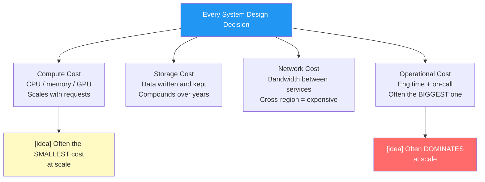
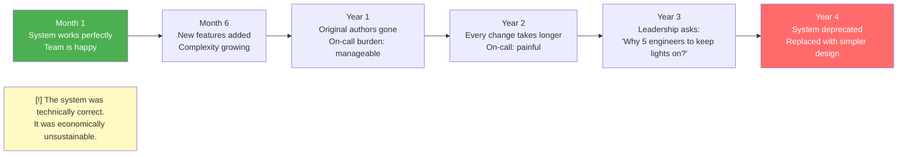
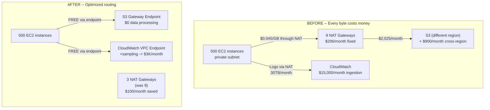
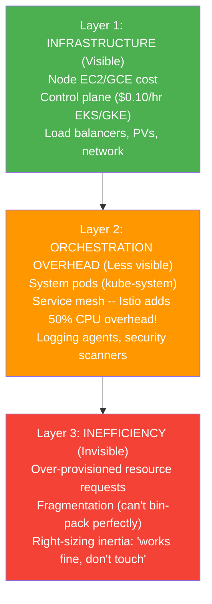
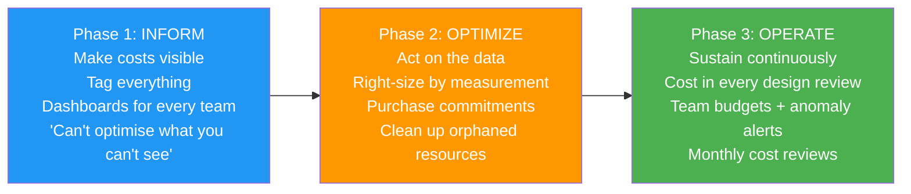

# Chapter 17: Cost, Efficiency, and Sustainable System Design

> **Who this is for:** A recent college graduate who can design a working system and wants to understand why working systems still get shut down -- and how Staff engineers think about cost as a first-class design constraint, not a finance team problem.

---

## Chapter at a Glance

```
+===============================================================================+
|          CHAPTER 17 -- COST, EFFICIENCY & SUSTAINABLE SYSTEM DESIGN            |
+===============================================================================+
|                                                                               |
|  CORE IDEA: Systems fail not just because they break, but because they are   |
|  too expensive or too hard to run. A system that works but nobody can afford  |
|  to operate is not a successful system.                                       |
|                                                                               |
|  THE SUSTAINABILITY EQUATION:                                                 |
|  Sustainable System = Correct + Scalable + Affordable + Operable             |
|  Missing any one -> system eventually gets replaced or shut down              |
|                                                                               |
|  THE 4 COST DIMENSIONS:                                                       |
|  1. Compute     -> CPU, memory, GPU per request                               |
|  2. Storage     -> Data written and retained (compounds over time)            |
|  3. Network     -> Cross-region transfer is the sneaky expensive one          |
|  4. Operational -> Engineering time, on-call burden, complexity tax           |
|                                                                               |
|  COST OF RELIABILITY -- WHAT EACH NINE ACTUALLY COSTS:                        |
|  99%   = 3.6 days downtime/yr  -> 1x cost (internal tools)                   |
|  99.9% = 8.7 hours/yr          -> 2-3x cost (most user-facing)               |
|  99.99% = 52 min/yr            -> 5-10x cost (critical services)             |
|  99.999% = 5 min/yr            -> 20-50x cost (payments, auth)               |
|                                                                               |
|  L5 vs L6 IN ONE LINE:                                                        |
|  L5: "Make it work, make it scale."                                           |
|  L6: "Make it work, scale, stay affordable, and remain operable for years."  |
|                                                                               |
|  THE QUESTION TO ASK BEFORE EVERY DESIGN CHOICE:                             |
|  "What problem does this complexity solve? Is it worth the cost?"            |
|                                                                               |
+===============================================================================+
```

---

## Quick Visual: L5 vs L6 -- Cost Thinking

| Dimension | L5 (Senior) | L6 (Staff) |
|-----------|-------------|------------|
| **Primary goal** | "Make it work, make it scale" | "Make it work, scale, and remain affordable as it grows" |
| **When cost enters the conversation** | After the design is done | In the first 5 minutes, as a design input |
| **Resource sizing** | "Provision for peak load to be safe" | "Provision for expected + headroom, auto-scale for peaks, degrade beyond" |
| **Redundancy** | "Three replicas everywhere, safety first" | "Three replicas on critical paths, two elsewhere, one for internal tools" |
| **Technology choices** | "Use the best tool for each job" | "Use what we can operate efficiently -- consistency reduces operational cost" |
| **Complexity** | Adds components to solve problems | "What problem does this complexity solve? What does it cost to maintain?" |
| **Multi-region** | "Deploy everywhere for lowest latency" | "Which regions justify the cost? Start with two where 80% of users are" |
| **Over-engineering** | Often a signal of thoroughness | "Over-engineering is a Staff-level failure mode" |
| **Operational cost** | Not mentioned | "Engineering time, on-call burden, and ramp-up time are real costs" |
| **Long view** | Designs for launch day | Designs for 3-5 year sustainability |

---

## Visual Overview: The 4 Cost Dimensions



---

## Visual Overview: Sustainability Lifecycle



---

## 1. Learning Goal

By the end of this chapter you will be able to:

- Explain the four dimensions of system cost and why operational cost is often the largest one
- Recognise over-engineering as a Staff-level failure mode, not a sign of thoroughness
- Apply the right-sizing framework: provision for expected load plus headroom, not peak-everything
- Make cost trade-offs explicit, with quantified reasoning, the way L6 engineers do
- Use two real incident case studies to understand how cost decisions cause failures in production
- Speak about cost to interviewers in the natural, confident language of a Staff engineer -- not as an afterthought

---

## 2. The Motivating Story

### The System That Worked But Failed

A team at a mid-size tech company built a notification delivery system. It was architecturally excellent -- robust, scalable, correctly designed. It handled every edge case. The code was clean. The tests were thorough.

Eighteen months after launch, it was deprecated.

Why?

- It required three senior engineers to operate. Turnover meant constant re-ramping.
- On-call burden was two pages per week, each taking two hours to diagnose. That is 200 engineer-hours per year just in incident response.
- Every new feature took four times as long as expected because the system had 11 moving parts, each with its own failure modes.
- Infrastructure cost had tripled in 18 months as data accumulated without a retention policy.

Nobody had done anything wrong technically. The system just cost too much to run.

This is the lesson of Chapter 17: **correctness is necessary, but not sufficient**. A system that works but is unsustainable will eventually be replaced. Staff engineers design for the 5-year view, not just launch day.

### The Question That Changes Everything

L5 engineers ask: *"Does this work?"*

L6 engineers ask: *"Does this work -- and can we afford to run it, for years, with the team we actually have?"*

---

## 3. Core Concepts

### Section 3.1: The Sustainability Equation

Staff engineers use a simple mental model:

> **Sustainable System = Correct + Scalable + Affordable + Operable**

Miss any one of the four properties and the system will eventually fail -- not necessarily by crashing, but by being replaced, rewritten, or simply abandoned.

| Property | What it means | Signs it is missing |
|----------|--------------|---------------------|
| **Correct** | Does what it is supposed to do | Bugs, data loss, incorrect output |
| **Scalable** | Handles growth without redesign | Breaks at 5x or 10x load |
| **Affordable** | Cost does not outgrow value delivered | Budget overruns, infrastructure costs > revenue |
| **Operable** | Can be run by the team you have | Constant firefighting, engineer burnout, nobody understands it |

The most commonly overlooked property is **operable**. Most design interviews focus on correct and scalable. Staff engineers make affordability and operability first-class design constraints, established before architecture begins.

---

### Section 3.2: The Four Dimensions of Cost

#### Dimension 1: Compute Cost

CPU cycles, memory, and specialised hardware (GPUs) that run your code.

This is what most engineers think of first. It scales roughly with traffic -- more requests means more compute. The good news: compute is elastic (scales up and down) and visible (easy to measure).

**The trap**: Compute is often NOT the biggest cost. At large scale, other dimensions dominate.

**What it sounds like at L6:**
L5: "We need servers."
L6: "At 7K QPS with an average 5ms processing time, we need roughly 35 CPU cores at steady state. Peak at 3x = 21K QPS = 105 cores. I'll provision 120 with auto-scaling."

#### Dimension 2: Storage Cost

Every byte you write has a cost -- not just at write time, but forever, because data rarely gets deleted.

Storage compounds over time. A system that writes 100 GB/day looks manageable on day 1. After a year it has written 36 TB. After 5 years, 182 TB. If nobody set a retention policy, all of it is still there.

**Key principle**: Retention policies are cost decisions. "Keep data forever" is a choice with a price.

**Storage tiers matter enormously:**

| Tier | Access pattern | Relative cost | Example |
|------|---------------|---------------|---------|
| In-memory (Redis) | Milliseconds | 100x | Hot session data, rate limit counters |
| SSD (hot storage) | 1-10ms | 10x | Recent feeds, recent events |
| HDD (warm storage) | 10-100ms | 1x | Last 90 days of history |
| Cold storage (archive) | Minutes | 0.01x | Audit logs, compliance data |

**What it sounds like at L6:**
L5: "We'll store everything in the database."
L6: "We need a tiered retention strategy. Data from the last 24 hours stays in hot SSD storage for fast queries. After 7 days it moves to warm storage. After 90 days we downsample to hourly aggregates and archive. This reduces storage cost by 80% while preserving all the use cases that actually matter."

#### Dimension 3: Network Cost

Data movement costs money. Every byte transferred between services, regions, and to users has a price.

**The rule of thumb:**
- Intra-region transfer: Usually cheap or free
- Cross-region transfer: 10-100x intra-region
- Egress to internet: Often the most expensive

Network cost is the dimension engineers most frequently underestimate, because it is invisible until the bill arrives.

**Example**: A globally distributed database replicating every write to five regions synchronously. Technically elegant. Potentially $200K/month in cross-region bandwidth alone at moderate scale.

**What it sounds like at L6:**
L5: "We'll replicate to all regions for consistency."
L6: "Synchronous replication to 5 regions means every write pays 4 cross-region round trips. At our write rate that is approximately $180K/month in network cost. I'm proposing async replication with <5 second lag instead. That's 1/10th the cost. The 5 second staleness is acceptable for feed data."

#### Dimension 4: Operational Cost

The cost that matters most and is measured least: the human effort required to build, run, and evolve the system.

Operational cost includes:
- **Engineering time** to maintain and evolve the system
- **On-call burden**: pages, incident response, post-mortems
- **Complexity tax**: every additional moving part makes future changes slower
- **Ramp-up time**: how long until a new team member can be productive?

**Why operational cost dominates at scale**: A senior engineer in a mature tech company costs $300K-$500K fully loaded per year. If your system requires 5 engineers to operate, that is $1.5M-$2.5M/year in operational cost. That often exceeds the infrastructure spend.

**The most expensive design mistake**: Building a system that only 2 people on the team understand. When they leave, you pay again -- in incidents, in wrong changes, in time spent reverse-engineering.

**What it sounds like at L6:**
L5: "We'll add monitoring later."
L6: "This design has 7 services that can all fail independently. Each one adds to on-call surface. Before we accept this complexity, let me ask: can we collapse services 3 and 5? They have nearly identical failure modes and combining them removes one possible page type."

---

### Section 3.3: Over-Engineering Is a Staff-Level Failure Mode

This is counterintuitive. More experienced engineers are *more* likely to over-engineer, not less.

Why? Because experienced engineers have seen complex systems solve complex problems. They reach for those solutions even when the problem does not warrant them.

#### Signs of Over-Engineering

- A distributed system for a problem that fits on a single server
- Multi-region deployment for a single-region user base
- Microservices for a system that should be a monolith
- Real-time ML processing for a batch-appropriate workload
- Redundancy on non-critical paths that do not need it

#### Why Over-Engineering Happens

- Anticipating scale that may never come ("what if we get 100x traffic next year?")
- Resume-driven development: using the most interesting technology, not the most appropriate
- Cargo-culting: copying patterns from Netflix or Google that were designed for very different scale
- Fear: "If I under-provision and we have an outage, that's my fault"

#### The Staff-Level Response

Before adding complexity, ask four questions:

1. **"What problem does this solve?"** If you cannot answer in one sentence, rethink it.
2. **"What is the probability we actually need this?"** If it is "maybe, in two years," defer it.
3. **"What does it cost to add this later versus now?"** Often less than you think.
4. **"What is the simplest design that meets our stated requirements?"** Start there.

**The L6 one-liner on complexity:**
> "Simplicity is a feature. Complexity is a cost. Every component you add must earn its place."

---

### Section 3.4: Right-Sizing vs Over-Provisioning

Over-provisioning means allocating more resources than needed, "just in case." It feels safe. It is expensive.

**The over-provisioning trap:**

A team provisions 100 servers expecting high traffic. Actual peak: 15 servers used. The other 85% sit idle, paid for every month. Because "we've always had this capacity," nobody questions it until a cost review forces the conversation.

**The right-sizing framework:**

```
Step 1: Measure actual usage
        What is the current load? Average and peak?
        What is the peak-to-average ratio?

Step 2: Apply reasonable headroom
        Baseline: average load + 30-50% headroom
        This handles normal variation without auto-scaling every day

Step 3: Add elasticity for peaks
        Auto-scale from baseline up to 3-5x for predicted peaks
        Use graceful degradation for anything beyond

Step 4: Plan revisit triggers
        "If traffic grows past X, we revisit this"
        "Quarterly capacity review -- are we still right-sized?"
```

**What it sounds like at L6:**
L5: "I'll provision for 10x traffic to be safe."
L6: "Our peak-to-average ratio is 5x. I'll provision for 2x average -- that covers most days. I'll auto-scale up to 5x for predictable peaks like evening primetime. For unexpected spikes beyond that, the system degrades gracefully: we disable analytics, serve cached content, and alert on-call. That saves 60% on compute versus provisioning for 10x permanently."

---

### Section 3.5: Cost as a Design Constraint -- Not a Finance Problem

The key shift in L6 thinking is treating cost as a **design input** alongside availability, latency, and correctness -- not something to consider after the design is done.

This means:

**In Phase 3 (Scale):** When you calculate QPS and storage, you are also estimating cost. Name the top 3 cost drivers before moving on.

**In Phase 4 (NFRs):** "We need 99.99% availability" has a cost implication. "Do we actually need the fourth nine, or does 99.9% meet our use case?" is a Staff-level question. Each additional nine of availability roughly doubles infrastructure cost.

**In architecture:** Every component you add has an operational cost. Justify the complexity before drawing the box.

**The cost of nines -- memorise this:**

| Availability | Annual downtime | Typical cost multiplier | Right for... |
|-------------|----------------|------------------------|-------------|
| **99%** | 3.65 days | 1x | Internal tools, dev environments |
| **99.9%** | 8.76 hours | 2-3x | Most user-facing applications |
| **99.99%** | 52.6 minutes | 5-10x | Critical user-facing services |
| **99.999%** | 5.26 minutes | 20-50x | Payments, authentication, core infrastructure |

**The Staff question:** "This is an internal analytics dashboard. 99.9% availability means 8 hours of downtime per year. Engineers can tolerate that. Do we need 99.99% -- the infrastructure complexity and cost of 52 minutes of downtime per year? Probably not."

---

### Section 3.6: When "Good Enough" Is the Right Answer

Staff engineers often choose "good enough" over "optimal." This is not laziness. It is judgment.

**Good enough criteria:**
- Meets the functional requirements
- Meets the NFRs (latency, reliability targets)
- Is within cost budget
- Is maintainable by the team you have
- Leaves room for evolution when requirements change

**Why good enough beats optimal:**

> *"This design uses 20% more storage than the optimal version, but it is dramatically simpler to implement and operate. At our scale, the extra storage costs $5K per year. The engineering time to implement the optimal version costs $50K. Good enough wins."*

The implicit principle: **engineering time has opportunity cost**. Every hour spent over-optimising is an hour not spent building features users actually want.

---

### Section 3.7: Applied Examples -- Seeing Cost Thinking in Practice

#### Example 1: The News Feed System

**The over-engineered version:**
- Real-time fan-out for all users, regardless of follower count
- Infinite feed retention at full fidelity
- Multi-region active-active with synchronous replication
- Pre-computed feeds for all users, including inactive ones
- ML-based ranking on every single feed read

**What a Staff engineer sees:**

| Choice | Problem |
|--------|---------|
| Real-time fan-out for celebrities | 1 post from a 10M-follower account = 10M writes |
| Infinite retention | Storage compounds exponentially |
| Sync multi-region replication | 200ms latency penalty + 3x storage cost |
| Pre-compute for inactive users | 80% of MAU check monthly -- wasted computation |
| ML on every read, no cache | 10-100x compute multiplier |

**The cost-conscious version:**

| Choice | Why | Saves |
|--------|-----|-------|
| Hybrid fan-out: push for <10K followers, pull for celebrities | Celebrities would make push cost prohibitive | 90%+ write operations |
| 7-day feed retention, archive older | Nobody views their feed from last month | 90% storage |
| Async multi-region replication | <5s staleness acceptable for feeds | 70% cross-region cost |
| Pre-compute only for users active in last 24h | 80% of compute wasted on inactive users | 80% computation |
| Cache ML ranking results (5-min TTL) | Ranking barely changes minute to minute | 95% of ranking compute |

**L6 summary:**
> "Each of these optimisations individually sounds like a compromise. Together they are the difference between a system that costs $200K/month and one that costs $20K/month at 100M DAU. That is the difference between viable and not."

---

#### Example 2: The Rate Limiter

**The over-engineered version:**
- Exactly-once rate limiting with distributed consensus
- Globally synchronised counters using Raft/Paxos
- Audit log of every single rate limit decision

**What a Staff engineer sees:**

The rate limiter is on the critical path of *every request*. The constraints are brutal:

| Requirement | Implication |
|-------------|-------------|
| Must add <1ms latency | No network calls to external state on the hot path |
| Must handle 1M requests/sec | Cannot afford distributed coordination per request |
| Must not be a single point of failure | Local in-memory state preferred |

**The cost-conscious version:**

- **In-memory counters** on each API gateway node -- zero network cost, zero latency
- **Async sync** every 5 seconds -- accept that limits are approximate (+/-10%)
- **Fail open** if the sync service is unavailable -- rate limiting should never block all traffic
- **Sample audit logs** -- log 1% of rate limit decisions, not 100%

**L6 reasoning:**
> "Rate limiting exists to protect infrastructure, not to charge customers to the penny. If someone sends 105 requests when their limit is 100, the business impact is zero. I am choosing approximately-correct local limiting because it is 10x cheaper and adds no latency. Exactly-once distributed consensus would add 10-50ms per request -- that is unacceptable on the critical path of every API call."

---

#### Example 3: The Metrics Pipeline

**The design problem:** 50,000 servers, each emitting 500 metrics at per-second granularity.

**The raw math:**
50,000 servers x 500 metrics x 86,400 seconds = 2.16 trillion data points per day.

At a typical time-series storage cost, that is millions of dollars per month.

**The cost-conscious version:**

**Progressive downsampling by age:**

| Data age | Granularity | Storage multiplier | Use case |
|----------|-------------|-------------------|----------|
| 0-5 min | Per-second, on-host only | 1x | Live debugging during incidents |
| 5 min-24 hr | Per-minute | 1x (60x compression) | Dashboard queries, recent alerts |
| 1-7 days | Per-5-minute | 0.2x | Week-over-week trends |
| 7-90 days | Per-hour | 0.017x | Monthly analysis |
| >90 days | Per-day | 0.0003x | Long-term trend archiving |

**Total storage reduction**: 100x compared to "store everything forever at per-second."

**L6 reasoning:**
> "Nobody opens a dashboard and queries per-second data from last month. The use cases drive the granularity. Per-second is for 'what is happening right now?' -- we keep that on-host for 5 minutes. Per-minute is for 'what happened today?' -- we keep that centrally for 24 hours. After that, we downsample because the precision is never used anyway."

---

### Section 3.8: Cost vs Reliability vs Performance -- The Trade-off Frontier

Three things are always true in system design:

1. **Higher reliability always costs more.** Redundancy, faster failover, and automated recovery all require resources.
2. **Lower latency often costs more.** Edge caching, more read replicas, faster hardware -- all add expense.
3. **You cannot have everything.** Every system lives on a trade-off frontier. Improving on one dimension usually sacrifices another.

**Staff engineers make these trade-offs explicit, with numbers, before committing.**

#### The 20% Latency Reduction Scenario

A proposal: "We can reduce P99 latency from 250ms to 200ms by adding edge caching and an extra database replica per region. Cost doubles."

**How a Staff engineer works through this:**

```
Step 1: Quantify the benefit
        "Is 250ms causing user complaints? Abandonment? Revenue loss?
         For an analytics dashboard, users don't notice 50ms.
         For ad bidding, 50ms = 10% more auctions won."

Step 2: Quantify the cost
        "Doubling infrastructure = $200K/year for this system."

Step 3: Assess the use case
        "Analytics dashboard: 50ms improvement is imperceptible.
         Reject -- no user value for $200K/year."
        "Ad bidding: 50ms = $1M/year in additional revenue.
         Accept -- obvious ROI."

Step 4: Explore alternatives
        "Can we get 80% of the benefit for 20% of the cost?
         Optimise the hot query path instead of adding replicas."

Step 5: Make an explicit decision with reasoning
        "I am not adding the replica for the analytics dashboard.
         The current 250ms P99 is acceptable for this use case."
```

**The decision formula:**
> If benefit > cost -> proceed.
> If benefit < cost -> reject or find a cheaper alternative.
> If uncertain -> prototype and measure before committing.

---

### Section 3.9: Failure Modes Related to Cost

#### Failure Mode 1: Over-Provisioning

**Pattern:** Allocate for maximum imaginable load. Nobody re-evaluates. Resources sit idle.

**Real scenario:** A team provisions 100 servers expecting high traffic. Actual peak: 15. 85% of spend is waste. Because "we've always had this capacity," it persists for 3 years.

**Staff-level fix:** Quarterly capacity reviews. Treat provisioning as a reversible decision. Measure utilisation.

---

#### Failure Mode 2: Under-Provisioning to Save Money

**Pattern:** Optimise for average load, forget peaks. Outage during a traffic spike.

**The maths that matters:**
- Saved: $50K/year in infrastructure
- Lost: $2M in a single Black Friday outage + 3 engineers working through the night

**Staff-level fix:** Calculate the expected cost of outages, not just infrastructure. Make the trade-off explicit: "We are saving $X/year and accepting an outage probability of Y% with an expected cost of Z per outage."

---

#### Failure Mode 3: Premature Optimisation

**Pattern:** Optimise before measuring. Spend engineering time on improvements that do not matter.

**Real scenario:** A team spends 3 months building a sophisticated caching layer. The database is not the bottleneck -- the API is CPU-bound on JSON serialisation. The cache is useless. The real problem remains.

**Staff-level fix:** Measure first. Optimise the actual bottleneck. Ask "Is this worth the engineering time?" before starting.

---

#### Failure Mode 4: Expensive Hot Paths

**Pattern:** 1% of requests consume 90% of resources.

**Real scenario:** 1% of API requests are complex analytics queries. Each takes 10 seconds and consumes 100x the resources of a normal request. This 1% drives 60% of infrastructure cost.

**Staff-level fix:**
- Identify and measure hot paths before optimising
- Rate limit or tier expensive operations
- Offer different SLOs for different request types (premium tier gets real-time, standard tier gets eventual)

---

### Section 3.10: How Cost Reasoning Evolves with System Maturity

Cost thinking is not static. What makes sense at launch differs from what makes sense at year 3.

#### Early-Stage (0-6 months): Optimise for speed, not cost

**The reasoning:**
> "We do not know if this product will succeed. Spending 3 months optimising infrastructure for something that might be deprecated in 6 months is not a good investment. Ship it, learn, iterate."

- Simplicity over efficiency
- Modest over-provisioning is fine -- it is insurance against surprises
- Technical debt is acceptable if it enables speed
- Do not optimise what might be thrown away

---

#### Growing System (6-24 months): Identify and fix the top 3 inefficiencies

**The reasoning:**
> "We have real traffic data now. We know what the hot paths are. The top 3 bottlenecks will give us 80% of the benefit for 20% of the effort."

- Start measuring and attributing costs
- Right-size based on actual usage data (not launch-day estimates)
- Implement auto-scaling
- Set retention policies before storage gets out of control

---

#### Mature System (2+ years): Invest in structural efficiency

**The reasoning:**
> "This system will run for years. A 10% efficiency improvement saves $500K/year. It is worth 2 months of engineering time."

- Regular cost reviews (quarterly)
- Invest in automation to reduce operational cost
- Consider architectural changes for efficiency gains
- Make cost a metric in team OKRs

---

### Section 3.11: Cost Decisions and Human Error

Staff engineers anticipate that cost decisions will be made under pressure, by tired humans, with incomplete information.

**Common human error patterns in cost:**

**"Optimisation without measurement":**
An engineer cuts replicas to save money without measuring the failure risk. The fix: require a cost-review gate that assesses blast radius before approving reductions on critical paths.

**"Siloed cost ownership":**
The platform team cuts observability spend to hit their budget target. Application teams lose visibility. The next incident takes 4x as long to diagnose. The "savings" cost more in engineer-hours than they saved in infrastructure spend.

**"Incentive misalignment":**
"Ship features" is rewarded. "Reduce toil" is not. Teams over-provision to avoid blame for outages. The fix: normalise cost efficiency as a success metric alongside feature delivery.

**Staff principle:**
> "Design so that the natural human tendency to cut costs does not create single points of failure. Put guardrails where cost pressure meets reliability -- for example, require approval for reducing replica count on critical paths."

---

## 4. Mental Models

### Mental Model 1: Cost is the Fourth Constraint

You already know the triangle: correctness, performance, reliability. Add cost as the fourth constraint. Every design lives in this four-dimensional space. When you adjust one dimension, the others shift.

*"Can we afford 99.99% availability for this feature? What would we sacrifice for it?"*

### Mental Model 2: The Compound Interest of Storage

Storage cost does not grow linearly -- it compounds. A retention policy set at launch saves exponentially more than one set at year 2.

*"Set the retention policy before writing the first byte. Revisiting it later means you are paying to store data you will then have to pay to clean up."*

### Mental Model 3: Operational Cost Is the Invisible Tax

Every additional service, every added layer of redundancy, every new database type -- each one is a line item in the operational cost ledger. On-call burden, ramp-up time for new engineers, cognitive load during incidents. These costs are real but invisible in infrastructure dashboards.

*"Count the moving parts. Ask: if this breaks at 3 AM, how long does it take to diagnose? That time is a cost."*

### Mental Model 4: The Simplest Design That Meets Requirements

Before reaching for a distributed system, ask: does this problem actually require distribution? Many problems that are solved with microservices were perfectly fine as a monolith. Many real-time pipelines work better as batch jobs.

*"What is the simplest design that meets the stated requirements? Start there. Add complexity only when a specific requirement demands it."*

### Mental Model 5: Right-Size, Not Over-Provide

Provision for expected load plus reasonable headroom. Use auto-scaling for peaks. Use graceful degradation for extreme events. Pay for what you use.

*"A 5x peak-to-average ratio does not mean you provision for 5x. It means you provision for 2x, auto-scale to 5x, and degrade beyond that."*

---

## Quick Reference Card -- Cost and Efficiency

### The Cost Driver Checklist

For every design, identify the top 3 cost drivers before finishing the architecture.

| Cost category | Questions to ask | Common culprits |
|---------------|-----------------|-----------------|
| **Compute** | How does compute scale with traffic? Where is the hot path? | ML inference on every request, synchronous fan-out |
| **Storage** | What is the write rate? What is the retention policy? Where does it compound? | No retention policy, per-second metrics stored forever |
| **Network** | Is there cross-region traffic? How much egress to users? | Synchronous cross-region replication, large response payloads without compression |
| **Operational** | How many services can fail? How long to diagnose each? Who understands this? | Too many microservices, no runbooks, poor observability |

---

### Cost of Nines -- Quick Reference

| Availability | Annual downtime | Monthly downtime | Cost multiplier | Use it for |
|-------------|----------------|-----------------|----------------|------------|
| **99%** | 3.65 days | 7.3 hours | 1x | Internal tools, dev environments |
| **99.9%** | 8.76 hours | 43.8 min | 2-3x | Most user-facing applications |
| **99.99%** | 52.6 min | 4.4 min | 5-10x | Critical consumer services |
| **99.999%** | 5.26 min | 26 sec | 20-50x | Payments, authentication |

**The Staff question at design time:** "What availability does this use case actually require? Are we paying for nines we do not need?"

---

### Over-Engineering Detection: Ask Yourself These Questions

| Question | If "no" -- think before proceeding |
|----------|----------------------------------|
| Can you explain in one sentence what problem this component solves? | If not, you may not need it |
| Is there a stated requirement that demands this complexity? | Complexity without a requirement is waste |
| What is the probability you will actually need this at scale? | If low, defer it |
| What does it cost to add this later versus now? | Often less than you think |
| Can the team that maintains this diagnose it at 3 AM? | If no one understands it, operational cost is high |

---

### Right-Sizing Formula

| Scenario | Provision at | Auto-scale to | Beyond that |
|----------|-------------|--------------|-------------|
| Steady load | Average + 30% headroom | 2x average | Alert + manual scale |
| Variable (5x peak/avg) | 2x average | 5x for predicted peaks | Graceful degradation |
| Event-driven spikes | 2x average | 10x for known events (pre-scale) | Shed non-critical load |

---

### Trade-off Decision Framework

| Step | Action | Example |
|------|--------|---------|
| **1. Quantify the benefit** | User impact? Revenue? Operational improvement? | "20% latency reduction" |
| **2. Quantify the cost** | Infra + engineering + complexity + ongoing operations | "$200K/year + 2 engineers to maintain" |
| **3. Assess the use case** | Does the benefit justify the cost for THIS system? | "Analytics dashboard -- users don't notice 50ms" |
| **4. Explore alternatives** | 80% of the benefit for 20% of the cost? | "Optimise the hot query instead of adding replicas" |
| **5. Make an explicit decision** | State the choice and the reasoning | "Rejecting the replica -- benefit does not justify cost for this use case" |

---

### Common Mistakes -- Weak vs Strong

| Signal | [X] Weak (L5 pattern) | [Y] Strong (L6 pattern) | [ ] |
|--------|---------------------|----------------------|---|
| **When cost enters design** | After the architecture is done | In the first 5 minutes as a design input | [ ] |
| **Reliability targets** | "Highly available everywhere" | "99.9% for consumer features, 99.99% for payments -- different costs" | [ ] |
| **Provisioning** | "Provision for peak to be safe" | "2x average + auto-scale + graceful degradation beyond" | [ ] |
| **Complexity** | Adds components for robustness | "What problem does this solve? What does it cost to maintain?" | [ ] |
| **Storage** | No retention policy | "7-day hot, 90-day warm, archive after that -- cost bounded" | [ ] |
| **Over-engineering** | More complexity = more thorough | "Simplicity is a feature. What's the simplest design that meets requirements?" | [ ] |
| **Operational cost** | Never mentioned | "This adds 3 components, each with its own failure mode and on-call surface" | [ ] |

---

## 5. Real-World Examples

### The Black Friday Failure: How Cost-Cutting Caused a $2M Incident

An e-commerce platform made three cost-saving decisions before Black Friday:

1. Reduced database replicas from 3 to 2 to save $10K/month
2. Disabled cross-region replication to save $20K/month
3. Set aggressive instance sizing with minimal headroom

**Total savings: $30K/month -- $360K/year.**

**What happened on Black Friday:**

Traffic hit 10x normal load. The database could not serve all reads with only 2 replicas. One replica fell behind; the other saturated. The application started timing out.

With no cross-region fallback, there was nowhere to redirect traffic. Provisioning new replicas took 20 minutes. During those 20 minutes, the site was effectively down -- on the single highest-revenue day of the year.

**The damage:**
- 45 minutes of severe degradation during peak shopping
- Estimated $2M in lost sales
- 3 engineers working through the night
- Reputation damage with the press

**Staff-level post-mortem:**
> "The cost-saving decisions were each individually defensible. Together they created three overlapping risks with no mitigation for any of them. The correct approach: keep cross-region replication for the *checkout path* only (critical, worth the cost), reduce it for *catalog browsing* (degraded experience acceptable). Selective reliability based on business impact -- not uniform cuts across the board."

**The lesson:**
> Saving $360K/year does not make sense if it creates a scenario where you can lose $2M in 45 minutes. Cost decisions need blast-radius analysis before approval.

---

### The Observability Blindness Incident

A mid-sized platform ran a metrics pipeline. Cost reviews identified observability as the second-largest infrastructure spend. A 50% reduction was approved.

**The changes made:**
- Reduced retention from 90 days to 30 days for per-minute data
- Sampled high-cardinality metrics at 10% (was 100%)
- Disabled per-second ingestion for "non-critical" services

**What happened:**

A latent bug in a downstream service began causing gradual memory growth. The service had been classified "non-critical" and its per-second metrics were disabled. The P99 memory alert -- which would have fired at 85% utilisation -- was based on sampled data. With 90% sampling, the alert never fired.

Memory exhaustion caused the service to crash. Its load shifted to sibling services. The database connection pool saturated. Checkout and account flows degraded.

**The user impact:** 2.5 hours of partial outage, 12,000 orders failed.

**On-call diagnosis:** No metrics for the failing service. Engineers had to manually correlate logs across services. Root cause was not understood until a post-incident review.

**Root cause:**
> The cost decisions were made without mapping metrics to failure modes. "Non-critical" was based on *team ownership*, not *blast radius on the critical path*. Sampling eliminated the signal needed to detect a gradual memory leak. The incident cost more in engineer-hours and user impact than the observability savings.

**Design change:**
- Reclassified metrics by blast radius, not team ownership. Services on the critical path for checkout kept full resolution regardless of cost.
- Sampling applied only to non-alerting metrics. Any metric driving an alert retained full resolution.
- Cost reviews required blast-radius analysis before reducing observability.

**The lesson:**
> "Right-size metrics" means right-size for the failure modes you care about. Cost cuts that make incidents harder to diagnose are false economy. The next incident will cost more in engineering time and user impact than the savings.

---

### The On-Call Burnout Incident

A platform team consolidated three regional on-call rotations into one global rotation to reduce operational headcount cost. Auto-remediation was deferred ("we'll build it next quarter").

**What happened:**

A database failover bug -- previously observed in one region -- occurred during a regional outage. The single on-call engineer was paged at 3 AM local time. No runbook existed for the new multi-region failover scenario.

While the engineer was diagnosing, client retries increased load on the remaining healthy region. The database connection pool saturated. A second engineer was paged. Both were exhausted from prior weeks of frequent pages.

During the hotfix, a misconfiguration (wrong region parameter) extended the outage. 78 minutes of payment routing failures.

**After the incident:** One of the two on-call engineers resigned, citing unsustainable on-call burden. The team spent 4 months backfilling during a hiring freeze. The total cost of the "savings" -- in lost talent, recruitment, and incident impact -- exceeded 10x the annual reduction.

**The lesson:**
> "Operational cost is not just headcount. Burnout, attrition, and human error under pressure are costs. A Staff engineer asks: what is the total cost of running this system, including the people who operate it?"

---

## 6. Interview Calibration

### What Interviewers Are Really Probing

Interviewers rarely ask directly about cost. They probe indirectly:

| What they ask | What they are assessing |
|--------------|------------------------|
| "How would you handle 10x growth?" | Do you think about cost scaling, or just technical scaling? |
| "Why did you choose this architecture?" | Is cost one of your design considerations? |
| "What would you simplify if you had less time?" | Do you understand what is essential vs. nice-to-have? |
| "What if this needs to work for a startup?" | Can you adjust cost profile for different contexts? |
| "How would you operate this system?" | Do you think about operational cost, not just infrastructure? |
| "This seems complex -- why did you choose it?" | Can you justify complexity against simpler alternatives? |

---

### L6 Phrases for Discussing Cost

**When introducing cost considerations naturally:**
- "Let me think about the major cost drivers in this design before we continue..."
- "Before I add this component, let me check whether the benefit justifies the operational complexity..."
- "This design is correct, but I want to make sure it is cost-effective at this scale..."

**When making trade-offs:**
- "I am choosing X over Y because the cost of Y scales poorly with traffic..."
- "This adds 3 new failure modes, so let me justify whether that is worth the benefit..."
- "The simpler solution costs 20% more in compute but saves significantly in operational overhead..."

**When right-sizing:**
- "Our peak-to-average ratio is 5x. I will provision for 2x with auto-scale to 5x. Beyond that, graceful degradation."
- "I am not provisioning for 10x because the probability of hitting 10x is low and the cost is permanent."

**When questioning a design choice:**
- "Before we gold-plate this, what is the minimum viable reliability we actually need?"
- "This would work, but at 100M users this component alone would cost $500K/month. Let me see if there is a cheaper path."

---

### Signals of Strong Staff Cost Thinking

| Signal | What it looks like | Why it matters |
|--------|-------------------|----------------|
| **Cost as design input** | Mentions cost in the first 5 minutes, not when prompted | Shows cost is habitual, not an afterthought |
| **Quantified trade-offs** | "This saves $X but costs Y in reliability; for our use case Y is acceptable" | Demonstrates judgment, not hand-waving |
| **Operational cost included** | "This adds 3 components; each increases on-call surface" | Thinks beyond infrastructure to human cost |
| **Right-sizing with reasoning** | "2x average + auto-scale + graceful degradation" | Shows calibration to actual load patterns |
| **Selective optimisation** | "Optimise the hot path; leave the cold path simple" | Prioritises by impact |
| **Sustainability lens** | "At 10x scale this becomes economically unsustainable; we would need to rethink" | Thinks in years, not quarters |
| **Explicit rejection of over-engineering** | "I am not adding the extra service -- no requirement justifies that complexity" | Discipline, not laziness |

---

### Common L5 Mistakes on Cost

**Mistake 1: Ignoring cost entirely**
The candidate designs a technically excellent system without ever mentioning cost implications.

*Interviewer perception:* "This person builds like money is infinite."

*Fix:* Explicitly mention cost as a design consideration. Name the top 3 cost drivers. Say what you would change if cost were tighter.

**Mistake 2: Over-engineering for scale that may never exist**
Designs for Google-scale when the problem is clearly modest scale.

*Interviewer perception:* "This person cannot calibrate complexity to context."

*Fix:* Ask about expected scale. Design appropriately. Acknowledge: "At 10x this scale, I would need to reconsider -- but for now, this simpler design meets the stated requirements."

**Mistake 3: Treating all requirements as equally important**
Never discusses what could be simplified or deferred.

*Interviewer perception:* "This person will build everything at maximum complexity."

*Fix:* Explicitly prioritise. Say: "If we need to reduce scope, I would start with X because it saves the most cost for the least feature impact."

**Mistake 4: Confusing complex with sophisticated**
Adds complexity (more services, more layers, more redundancy) to demonstrate knowledge.

*Interviewer perception:* "This person will create operational nightmares."

*Fix:* Justify every component you add. Ask yourself "What would I remove if I had to cut 20% of the design?" -- then discuss it.

---

### How to Explain Cost Thinking to Leadership

Staff engineers translate technical cost reasoning into business terms.

**Framework:**
1. **Anchor to business impact**: "This design costs $X/month. At our scale, that is $Y per user. Our target is $Z per user -- we are within budget."
2. **Present the trade-off frontier**: "We have two options: 99.9% availability costs $100K/month; 99.99% costs $500K/month. For this product, 99.9% is sufficient."
3. **Quantify the risk of cost cuts**: "Reducing replicas saves $20K/month but increases outage risk. The expected value of an outage is $500K. The savings do not justify the risk."
4. **Connect to sustainability**: "This system requires 5 engineers to operate -- $1.5M/year in operational cost. Simplifying it reduces that."
5. **One-liner**: "Cost is a design constraint, not a post-launch problem. We are building systems the organisation can afford to run for years."

---

## 7. Brainstorming Questions

Think through these before reading the answers. Good practice for interview prep.

1. The metrics pipeline example downsamples data over time. What use case does that prevent? Is that acceptable?

2. A startup with 10K users has the same codebase as its enterprise version with 10M users. What cost optimisations would make sense at 10K that would be wrong at 10M?

3. You are told to cut infrastructure cost by 30%. What is the first thing you do? What is the last?

4. A team says "we need 99.99% availability for everything." What questions do you ask? How do you help them right-size?

5. The fan-out problem: push to all followers vs pull at read time. What is the cost break-even point? Where would you set the threshold?

6. What is an example of technical debt that actually reduces cost? What is an example that increases cost?

7. Your system uses 15 microservices. A new engineer joins and needs 3 months to become productive. What is the dollar cost of that ramp-up time? Is the microservice architecture justified?

8. "We should use ML-based ranking because the simple heuristic is not personalised enough." How do you evaluate whether the improvement is worth the cost?

9. Cross-region replication adds 2x network cost and 200ms to write latency. For which systems is it clearly worth it? For which is it clearly not?

10. A team stores audit logs indefinitely "for compliance." How do you evaluate whether that is actually required? What are the alternatives?

---

## 8. Reflection Prompts

Spend 10-15 minutes with each of these.

### Reflection 1: Your Current System

Think about a system you have worked on or designed.

- What are its top 3 cost drivers?
- Is there a retention policy for the data it produces?
- Is it over-provisioned? How do you know?
- What is the operational cost in engineering time per month?

If you cannot answer these questions, that is itself useful information -- it means cost was not a first-class consideration in the design.

### Reflection 2: An Over-Engineering Decision

Think of a design decision -- yours or someone else's -- that in retrospect was over-engineered.

- What was the original justification?
- What was the actual cost (infrastructure + operational)?
- What simpler design would have worked?
- What would have needed to change in requirements before the complex version was justified?

### Reflection 3: A Cost-Cutting Decision Gone Wrong

Think of a time when a cost-cutting decision created problems -- either one you experienced or one from this chapter.

- What was cut?
- What was the assumption that turned out to be wrong?
- What safeguard would have caught it?
- What is the rule you would establish for future decisions?

---

## 9. Homework Exercises

### Exercise 1: Analyse a System You Know

Pick a production system you have worked on or know well.

For each of the 4 cost dimensions, answer:
- What is the primary driver of cost in this dimension?
- Is it right-sized, over-provisioned, or under-provisioned?
- What one change would reduce cost without reducing reliability?
- What would break if you cut this cost by 50%?

Write up your findings in one page. Share with a colleague and compare conclusions.

---

### Exercise 2: Design the Metrics Pipeline

You are asked to design a metrics collection system for 10,000 servers, each emitting 100 metrics per second.

Apply the cost thinking from this chapter:

1. What is the raw data volume? Calculate it.
2. What progressive downsampling strategy would you use?
3. What is the storage reduction from your strategy vs "store everything forever"?
4. What use case does your downsampling sacrifice? Is it a real use case?
5. Where would you set the threshold for "full resolution" vs "sampled"?

Sketch the storage tier design. Estimate the annual storage cost before and after.

---

### Exercise 3: The Cost Review

You are told that infrastructure costs have grown 3x in 18 months despite traffic growing only 2x. The CEO wants to know why and what to do.

Walk through a structured investigation:

1. What data do you gather first?
2. How do you attribute cost to features or teams?
3. What are the likely culprits? (Think: storage without retention policy, over-provisioned compute, ML running on every request, cross-region replication creep)
4. For each finding: what is the saving? What is the reliability risk?
5. What is the remediation plan, in priority order?

Write a one-page "cost review" memo that you could present to the CEO.

---

### Exercise 4: The Reliability Right-Sizing Conversation

A product team tells you they need 99.99% availability for their feature.

Run through the following:

1. What questions do you ask to understand whether 99.99% is actually needed?
2. What is the cost difference between 99.9% and 99.99% for a typical mid-scale service?
3. What architecture changes does the jump from 99.9% to 99.99% require?
4. Under what circumstances would you accept 99.9% instead?
5. Draft a 3-sentence explanation for the product team about why you are recommending 99.9% instead of 99.99%.

---

## Appendix A: Back-of-Envelope Cost Estimation

Staff engineers estimate costs quickly during design discussions. Here are the key numbers to keep in mind.

### Quick Cost Reference

| Resource | Rough unit cost | Key insight |
|----------|----------------|-------------|
| Compute (CPU core, cloud) | ~$50-100/month | Scales with traffic |
| Memory (RAM, cloud) | ~$5-10/GB/month | Redis memory is expensive at scale |
| SSD storage | ~$0.10-0.20/GB/month | 10x more than HDD |
| HDD storage | ~$0.02-0.04/GB/month | Good for warm tier |
| Cold storage (archive) | ~$0.001-0.004/GB/month | 50x cheaper than SSD |
| Cross-region data transfer | ~$0.01-0.09/GB | Varies by provider and region pair |
| Egress to internet | ~$0.08-0.15/GB | Most expensive data movement |

### How to Estimate Storage Cost for a System

```
Daily write rate x item size = daily storage added
Daily storage x 365 = annual storage growth
Annual storage x tier cost/GB = annual storage cost

Example (notification system):
  10M notifications/day x 500 bytes = 5 GB/day
  5 GB/day x 365 = 1.8 TB/year at full resolution
  With 30-day retention: ~150 GB average
  At $0.10/GB/month SSD: $15/month
  -> Not a cost problem at this scale
```

### How to Estimate Network Cost

```
QPS x average payload size x seconds/day = daily bandwidth
Daily bandwidth x cross-region multiplier = cross-region cost

Example (cross-region replication):
  1,000 writes/sec x 2KB x 86,400 sec = 172 GB/day
  172 GB x 30 days = 5.2 TB/month
  At $0.09/GB cross-region = $470/month per region pair
  -> For 5 regions: $9,400/month -- worth quantifying
```

---

## Appendix B: Glossary of Cost Terms

| Term | Definition |
|------|-----------|
| **Over-provisioning** | Allocating more resources than needed, usually "to be safe" |
| **Right-sizing** | Matching resource allocation to actual expected usage |
| **Operational cost** | The human cost of maintaining and operating a system |
| **Retention policy** | A rule for how long data is kept before being archived or deleted |
| **Storage tiering** | Storing data on different storage media based on access frequency and age |
| **Downsampling** | Reducing the granularity of time-series data over time (e.g., per-second -> per-hour) |
| **Cost of nines** | The infrastructure cost associated with each level of availability (99%, 99.9%, 99.99%) |
| **Graceful degradation** | Reducing system functionality intentionally when resources are constrained, rather than failing completely |
| **Technical debt (cost dimension)** | Shortcuts taken during development that increase operational cost or slow future changes |
| **On-call burden** | The operational cost of engineers responding to alerts and incidents |

---

---

## 10. Partial Failure Under Cost Constraints

When you right-size a system, you are making a deliberate choice: you are not provisioning for every possible spike. That is the right call. But it means the system *will* reach its limits under some conditions. Staff engineers design what happens at those limits -- not just what happens in the normal case.

### The Capacity Curve: Where Have You Designed to Fail?

Every system has a capacity curve. Traffic rises, and at some point things start to degrade. The question is not *whether* this curve exists -- it always does -- but *where on the curve* you have designed each failure to occur.

| Load Level | Typical behaviour | What this means |
|------------|------------------|-----------------|
| **0-10K QPS** | Fully normal -- all features, full fidelity | System is healthy |
| **10-15K QPS** | Elevated latency -- P99 starts climbing | Approaching limits |
| **15-18K QPS** | Timeouts begin -- some requests fail | Partial degradation starts |
| **18-20K QPS** | Graceful degradation active -- non-critical features disabled | System protecting itself |
| **>20K QPS** | Cascading failure risk -- without circuit breakers, full outage | Needs explicit protection |

The key Staff-level question is: **"Where on this curve have I designed to fail?"**

An L5 engineer often leaves this implicit -- the system will fail at some point, but nobody has thought about what that failure looks like. An L6 engineer makes each threshold explicit: "At 18K QPS we shed analytics. At 20K QPS we serve cached content for non-authenticated users. At 22K QPS the load shedder begins dropping the lowest-priority requests. At no point does the checkout path fail until compute is truly exhausted."

---

### Feature Degradation Priority

When the system hits its capacity limits, not everything should fail equally. Staff engineers define a degradation order before incidents happen -- not during them.

| Priority | Feature category | What gets disabled first | Impact on users |
|----------|-----------------|-------------------------|-----------------|
| **1 (shed first)** | Analytics and tracking | Disable all analytics event sends, stop A/B experiment logging | Users notice nothing |
| **2** | Personalisation | Serve default content instead of ML-ranked recommendations | Users see generic feed |
| **3** | Secondary features | Disable suggestions, related items, social proof widgets | Users lose convenience features |
| **4** | Primary features | Read-only mode for writes, simplified views | Users can browse but not create |
| **5 (last to shed)** | Critical paths | Checkout, login, payment, account access | Users cannot complete core tasks |

The principle: **the cheapest features in normal operation are the cheapest to disable during degradation**. Analytics traffic has no user impact when dropped. Checkout traffic going down means real revenue loss.

This degradation order should be documented, tested, and rehearsed before a spike hits.

---

### Blast Radius Containment

Without deliberate blast radius containment, a small spike can impact all users. With containment, you protect the majority by sacrificing service quality for a minority.

```
WITHOUT containment:
+-----------------------------------------------------+
|  10% traffic spike from one noisy tenant            |
|                                                     |
|  All users experience:                              |
|  -> Elevated latency (100%)                          |
|  -> Potential timeout cascade (100%)                 |
|  -> Full system degradation (100%)                   |
|                                                     |
|  RESULT: 100% of users impacted by a 10% spike      |
+-----------------------------------------------------+

WITH containment:
+-----------------------------------------------------+
|  10% traffic spike from one noisy tenant            |
|                                                     |
|  Affected users (10%):                              |
|  -> Throttled, queued, or served degraded response   |
|                                                     |
|  Protected users (90%):                             |
|  -> Normal latency, full features, unaffected        |
|                                                     |
|  RESULT: 10% impacted, 90% fully protected          |
+-----------------------------------------------------+
```

Containment mechanisms include: per-tenant rate limiting, request queues with priority lanes, bulkheads that isolate resource pools per customer tier, and circuit breakers that stop cascades between services.

---

### Cost-Aware Circuit Breaker

A standard circuit breaker stops calls to a failing service. A cost-aware circuit breaker adds a second check: before making an expensive downstream call, verify that the cost budget allows it.

```
# Cost-aware circuit breaker (simplified pseudocode)

state = CLOSED   # states: CLOSED, OPEN, HALF_OPEN
failure_count = 0
cost_budget_remaining = get_daily_budget_remaining()

def call_downstream(request):
    # First check: circuit breaker state
    if state == OPEN:
        return fallback_response(request)

    # Second check: cost budget
    estimated_cost = estimate_cost(request)
    if cost_budget_remaining < estimated_cost:
        log_budget_exceeded(request)
        return degraded_response(request)   # serve cheaper path

    # Make the call
    try:
        response = downstream_service.call(request)
        on_success()
        cost_budget_remaining -= actual_cost(response)
        return response

    except TimeoutError:
        failure_count += 1
        if failure_count > THRESHOLD:
            state = OPEN
            schedule_retry_after(30_seconds)
        return fallback_response(request)

def on_success():
    failure_count = 0
    if state == HALF_OPEN:
        state = CLOSED
```

The key addition is the cost budget check before the call. When the expensive service (ML ranking, real-time personalisation, third-party API) becomes too costly under load, the system automatically falls back to a cheaper path rather than continuing to burn budget.

---

## 11. Cost Monitoring and Proactive Management

You cannot optimise what you cannot measure. Cost monitoring is not a finance team responsibility -- it belongs in the same observability stack as latency and error rate.

### Cost Observability Architecture

```
+===============================================================+
|              COST OBSERVABILITY STACK                         |
+===============================================================+
|                                                               |
|  [Application Layer]                                          |
|  Services emit cost-tagged metrics with every request:        |
|  -> request cost estimate, feature flag, user tier, region    |
|                                                               |
|       v                                                       |
|  [Cost Metrics Collector]                                     |
|  Aggregates per-service, per-feature, per-team               |
|  Joins with actual cloud billing data hourly                  |
|                                                               |
|       v                                                       |
|  [Cost Attribution Engine]                                    |
|  Splits cost by: team / feature / environment / region        |
|  Computes unit economics: cost per request, per user          |
|                                                               |
|       v                                                       |
|  +--------------+  +--------------+  +------------------+   |
|  |  Dashboards  |  |    Alerts    |  |  Budget Controls |   |
|  |  (daily/wk)  |  |  (real-time) |  |  (hard caps)     |   |
|  +--------------+  +--------------+  +------------------+   |
+===============================================================+
```

Each layer serves a different purpose. The application layer makes cost visible at the level of code decisions. The attribution engine connects infrastructure spend to product features. The dashboard and alert layer makes anomalies visible before the monthly bill arrives.

---

### Key Cost Metrics to Track

| Metric | What it measures | Alert threshold |
|--------|-----------------|-----------------|
| **Cost per request** | Infrastructure cost of serving one API call | Alert if 50% above baseline |
| **Cost per active user** | Total spend divided by DAU/MAU | Alert if 20% above trend |
| **Daily burn rate** | Total spend per day | Alert if exceeds daily budget |
| **Storage growth rate** | GB added per day | Alert if growing faster than user growth |
| **Cross-region traffic** | GB transferred between regions | Alert if 30% above previous week |
| **Unutilised capacity** | Provisioned vs actually used | Alert if utilisation below 30% for 7 days |

The most important of these is **cost per request** -- it tells you whether the system is getting more or less efficient as traffic grows. In a well-designed system, cost per request should decrease or stay flat as traffic increases (fixed costs are amortised). If cost per request is growing, something is scaling poorly.

---

### Cost Alerting Logic

```
# Cost health check (runs hourly)

def check_cost_health():
    today_spend = get_spend_today()
    daily_budget = get_daily_budget()
    yesterday_spend = get_spend_yesterday()
    baseline_cost_per_request = get_30day_baseline()
    current_cost_per_request = get_current_cost_per_request()

    # Alert 1: Daily budget exceeded
    if today_spend > daily_budget:
        alert(
            severity="HIGH",
            message=f"Daily budget exceeded: ${today_spend} vs budget ${daily_budget}"
        )

    # Alert 2: Projected to exceed budget
    hours_elapsed = current_hour()
    projected_spend = today_spend * (24 / hours_elapsed)
    if projected_spend > daily_budget * 1.10:
        alert(
            severity="MEDIUM",
            message=f"Projected to exceed budget by 10%: ${projected_spend} projected"
        )

    # Alert 3: Unusual day-over-day spike
    if today_spend > yesterday_spend * 1.20:
        alert(
            severity="MEDIUM",
            message=f"Spend up 20% vs yesterday: ${today_spend} vs ${yesterday_spend}"
        )

    # Alert 4: Cost per request above baseline
    if current_cost_per_request > baseline_cost_per_request * 1.50:
        alert(
            severity="HIGH",
            message=f"Cost per request 50% above baseline -- investigate hot path"
        )
```

These alerts catch different failure modes. Alert 1 catches runaway processes. Alert 2 gives early warning before end of day. Alert 3 catches the impact of a bad deployment. Alert 4 catches efficiency regressions -- when a code change accidentally makes expensive operations more frequent.

---

## 12. Capacity Planning for Cost at Scale

Capacity planning is not just "how many servers do I need?" It is "how do the cost characteristics of this system change at each order of magnitude of growth -- and what architectural decisions does that force?"

### Capacity-Cost Planning Matrix

| Stage | Scale | Capacity need | Cost approach | Staff action needed |
|-------|-------|--------------|---------------|---------------------|
| **v1 (launch)** | 1x baseline | Modest over-provision | Accept some waste -- speed matters more | Launch, measure, learn |
| **2-5x growth** | 5x baseline | Right-size based on measured data | Eliminate obvious waste from v1 | Implement auto-scaling, set retention policies |
| **10x growth** | 10x baseline | Efficiency is now a product requirement | Per-unit economics must be sustainable | Rethink hot paths, introduce caching, shard data |
| **100x growth** | 100x baseline | Every inefficiency is amplified 100x | Architecture must change, not just scale | Full cost redesign -- what worked at 10x breaks at 100x |

The key insight: **what is acceptable at 1x is wasteful at 10x and unsustainable at 100x**.

A 30% compute over-provision at launch costs almost nothing. The same 30% over-provision at 100x scale costs 30x more than it should. Staff engineers anticipate these inflection points and plan architectural evolution before they become crises.

---

### Scale Thresholds That Trigger Cost Redesign

Each order-of-magnitude jump tends to introduce a specific cost challenge:

```
10K -> 100K QPS
+-- Problem: Single servers can no longer handle load
+-- Solution needed: Horizontal scaling, read replicas
+-- Cost trigger: Replicas add 2-3x compute cost -- justify by traffic

100K -> 1M QPS
+-- Problem: Single database becomes bottleneck
+-- Solution needed: Sharding, caching layer
+-- Cost trigger: Cross-shard queries are expensive -- design shard keys carefully

1M -> 10M QPS
+-- Problem: Cache miss rate drives database cost
+-- Solution needed: Purpose-built cache infrastructure (Redis clusters)
+-- Cost trigger: Cache infrastructure cost competes with DB cost

10M -> 100M QPS
+-- Problem: Single-region latency is unacceptable for global users
+-- Solution needed: Multi-region deployment
+-- Cost trigger: Cross-region replication, data residency, multi-region ops burden

100M+ QPS
+-- Problem: Every percentage of inefficiency = millions of dollars
+-- Solution needed: Custom hardware, purpose-built data stores, extreme sharding
+-- Cost trigger: Generic cloud solutions no longer competitive -- consider hybrid
```

---

### The First Bottleneck Sequence

Systems typically encounter bottlenecks in a predictable sequence. Knowing the sequence lets you plan ahead:

| User range | Primary bottleneck | Typical symptom | What changes |
|------------|-------------------|-----------------|--------------|
| **1K-10K users** | Latency (single DB) | Queries slow down under load | Add read replicas, optimise hot queries |
| **10K-100K users** | Reliability (SPOF) | One server failure = full outage | Redundancy, auto-failover, health checks |
| **100K-1M users** | Cost (linear scaling) | Infrastructure costs grow with traffic | Caching, compression, efficient data structures |
| **1M-10M users** | Cost (superlinear scaling) | Cost grows *faster* than traffic | Architecture redesign -- fan-out, sharding |
| **10M+ users** | Operational burden | Team cannot keep up with incidents | Automation, runbooks, on-call tooling |

Each bottleneck requires a different type of solution. Trying to solve an operational bottleneck with more hardware, or a reliability bottleneck with cost cuts, will fail. Match the solution to the stage you are in.

---

## 13. Additional Real-World Applications

### Example 4: Notification System Cost Optimisation

**The scenario:** 100M users, 5 notifications per day each = 500M push notifications per day.

**The cost problem:** Push gateway providers charge per notification sent. At scale, this dominates the infrastructure bill.

```
Naive approach:
500M notifications/day x $0.00003/notification = $15,000/month

That is $180,000/year just in push gateway fees.
```

**The optimisation: Batching**

Instead of sending each notification immediately as it is generated, hold notifications per user for up to 5 minutes and batch them into a single push payload.

```
Batching impact:
-> Average notifications grouped per user: 2.5 per batch window
-> Push calls reduced from 500M to ~200M per day
-> 60% reduction in push gateway cost

New cost: $6,000/month -- saves $108,000/year
```

**The trade-off:** Non-urgent notifications may be delayed up to 5 minutes. This is acceptable for "someone liked your post." It is not acceptable for "your flight is boarding now."

**Staff-level design decision:**
> "I would classify notifications at write time: urgent (send immediately) and non-urgent (batch in 5-minute windows). Roughly 5% of notifications are urgent -- time-sensitive alerts, direct messages, security events. The other 95% are social signals that users do not need in real-time. Batching the 95% cuts our push cost by roughly 57% overall. The implementation is a simple priority queue with a flush interval."

---

### Example 5: API Gateway Auth Optimisation

**The scenario:** 100K RPS through an API gateway. Every request calls an auth service to validate the token.

**The cost problem:**

```
Auth service cost:
100,000 requests/sec x $0.00001/call = $1.00/second
$1.00/sec x 86,400 sec/day = $86,400/day
$86,400/day x 30 days = $2,592,000/month

$2.6M per month for auth validation alone.
```

**The optimisation: Auth token caching**

Cache the result of token validation at the API gateway layer with a 5-minute TTL.

```
Cache impact:
-> Auth token lifetime: typically 1-24 hours
-> Most tokens are used by repeat requests within 5 minutes
-> Expected cache hit rate: ~98%

New cost:
2% cache misses x 100K RPS = 2,000 auth calls/sec
2,000/sec x $0.00001 = $0.02/sec
$0.02/sec x 86,400 x 30 = $51,840/month

Saves: $2,540,000/month
```

**The trade-off:** A revoked token can remain valid for up to 5 minutes after revocation. The API gateway will continue accepting it until the cache entry expires.

**Staff-level risk assessment:**
> "5-minute revocation delay is acceptable for most use cases. The user whose account was compromised might have 5 minutes of continued access -- but our security team considers this acceptable because we also have rate limiting, anomaly detection, and session invalidation as additional layers. If we needed instant revocation -- for example, for high-value financial accounts -- I would add an explicit revocation list that the cache checks before serving a cached result. That list would be small (revoked tokens are rare) and cheap to check."

---

## 14. L6 Interview Scoring -- What Interviewers Actually Evaluate

### The Scoring Rubric

Interviewers at L6 level are looking for cost reasoning that is automatic, specific, and tied to the actual system being designed -- not generic platitudes.

| Signal | Not Demonstrated | Demonstrated | Strongly Demonstrated |
|--------|-----------------|-------------|----------------------|
| **Cost awareness** | Never mentions cost; treats infrastructure as free | Mentions cost when prompted; knows rough cost drivers | Raises cost in the first 5 minutes without prompting; names specific cost drivers for the system being discussed |
| **Trade-off articulation** | Makes choices without explaining reasoning | Describes pros and cons verbally | Quantifies both sides: "This saves $X but adds Y% reliability risk; for this use case that is acceptable because..." |
| **Right-sizing** | Provisions for worst case everywhere | Uses reasonable multipliers with auto-scaling | Explicitly reasons about peak/average ratio, auto-scale limits, and what happens beyond those limits |
| **Efficiency focus** | Adds components to be safe | Questions whether components are needed | Actively simplifies; asks "what is the minimum that meets requirements?" and justifies each component |
| **Operational cost** | Never mentioned | Mentions engineer time abstractly | Counts on-call surface area; estimates ramp-up cost for new engineers; flags high-complexity areas |
| **Sustainability** | Designs for launch day | Acknowledges that requirements change | Discusses how the design evolves through 5x and 10x growth; identifies which architectural choices will need revisiting |

---

### Interview Red Flags

These are statements that signal cost blindness to an L6 interviewer:

| What the candidate says | What the interviewer hears | Why it is a problem |
|------------------------|---------------------------|---------------------|
| "Let's just use the biggest instance type to be safe" | Cannot right-size | Will over-provision by default; no habit of measuring actual utilisation |
| "We'll optimise later when it becomes a problem" | Defers all hard decisions | Optimisation after launch is 10x harder; data accumulates, technical debt compounds |
| "Just add caching everywhere" | Cargo-culting | Cache coherence, invalidation, and memory cost are real problems; caching needs a specific justification |
| "Let's do active-active in all regions" | Over-engineers without reasoning | Multi-region active-active is appropriate for a small set of truly global services; applying it everywhere costs 3-5x more without proportional benefit |
| "Store everything forever, we might need it later" | Ignores data economics | Storage compounds; "might need it later" is not a retention policy; compliance requirements should be the driver, not vague future needs |

---

### L6 Cost Calibration Checklist

Before finishing an interview answer, mentally check these boxes:

```
[ ]  1. Identified the top 3 cost drivers for this specific system
       (not generic "compute, storage, network" -- the specific ones)

[ ]  2. Made at least one explicit trade-off with quantified reasoning
       ("X costs $Y more but gives us Z benefit; it is worth it because...")

[ ]  3. Right-sized resources rather than defaulting to maximum
       (named a specific approach: peak/average ratio, auto-scale limits)

[ ]  4. Considered operational cost
       (mentioned team size, on-call burden, or complexity tax)

[ ]  5. Planned for cost evolution
       (said something like "at 10x this would need to change because...")

[ ]  6. Discussed degradation
       (described what happens when the system hits its limits, not just normal operation)

[ ]  7. Challenged at least one piece of potential over-engineering
       ("I am not adding X because no stated requirement justifies it -- if Y becomes true, we can add it then")
```

If you can check all 7, your cost reasoning is at L6 level.

---

## 15. Failure Propagation in Cost-Constrained Systems

Cost optimisation and reliability are deeply connected. Right-sizing without corresponding protection mechanisms creates the conditions for cascading failures.

### The Cascade Scenario

This is a real pattern that has caused production outages at multiple companies. The specific numbers are illustrative.

```
T+0 min:   Normal operation
           -> API servers at 60% capacity
           -> Database connections: 400/500 used

T+1 min:   Traffic spike (marketing campaign goes viral)
           -> API servers reach 100% capacity
           -> Some requests begin queuing

T+3 min:   Clients begin retrying queued requests
           -> Effective load: 2.5x original (original + retries)
           -> API servers cannot keep up

T+7 min:   Request queue grows unbounded
           -> Response times climb to 30 seconds
           -> Clients retry more aggressively

T+12 min:  Database connections exhausted
           -> New requests cannot get a connection
           -> 500 errors begin propagating to users

T+15 min:  Health checks fail (servers cannot respond in time)
           -> Load balancer removes "unhealthy" servers from pool
           -> Remaining servers absorb even more traffic

T+18 min:  Thundering herd begins
           -> Removed servers recover briefly -> load balancer adds them back
           -> They immediately get flooded -> fail again
           -> Oscillation begins

T+20 min:  Full outage
           -> All API servers cycling between healthy and unhealthy
           -> Database connection pool saturated
           -> 100% of requests failing

Root cause: Right-sized API servers (good) without circuit breakers (missing).
The retry storm is what turned a capacity limit into a full outage.
```

**Lesson:** Cost optimisation (right-sizing) without corresponding protection mechanisms (circuit breakers, retry budgets, admission control) creates fragile systems. The failure mode is not "ran out of capacity" -- it is "ran out of capacity AND clients made it worse."

---

### Breaking the Cascade: Cost-Aware Load Manager

The fix is to add protection at the entry point -- before requests reach the system.

```
# Cost-aware load manager (simplified pattern)

class LoadManager:
    def __init__(self):
        self.admission_controller = AdmissionController(
            max_concurrent=MAX_CONCURRENT_REQUESTS,
            queue_timeout=5_seconds
        )
        self.timeout_budget = TimeoutBudget(
            total_budget=10_seconds,
            downstream_share=7_seconds
        )
        self.circuit_breaker = CircuitBreaker(
            failure_threshold=5,
            recovery_timeout=30_seconds
        )

    def handle(self, request):
        # Step 1: Admission control -- shed load before it enters the system
        if not self.admission_controller.admit(request):
            return Response(503, "Server at capacity -- please retry")

        # Step 2: Timeout budget -- stop waiting for slow downstreams
        with self.timeout_budget.allocate(request) as budget:
            # Step 3: Circuit breaker -- stop cascading to failing services
            if self.circuit_breaker.is_open(request.downstream):
                return self.fallback(request)

            # Step 4: Make the call with remaining budget
            try:
                return downstream.call(request, timeout=budget.remaining)
            except TimeoutError:
                self.circuit_breaker.record_failure(request.downstream)
                return self.fallback(request)

    def fallback(self, request):
        # Serve a degraded but valid response
        # -> cached result, simplified version, or explicit "degraded" response
        return degraded_response_for(request)
```

The key patterns here:
- **Admission control** stops the retry storm before it starts -- once the system is at capacity, new requests get an immediate 503 rather than queuing and retrying
- **Timeout budget** prevents slow downstreams from holding connections open indefinitely
- **Circuit breaker** prevents cascading to a downstream that is already struggling
- **Fallback response** means users get something, not nothing

This is what "cost optimisation with corresponding protection" looks like.

---

## 16. Security, Compliance, and Cost

Security and cost are often framed as competing priorities. Staff engineers push back on this framing. The correct frame is: **right-size security to the data classification, the same way you right-size compute to the load**.

### Data Sensitivity vs Cost

| Data sensitivity | Example data | Security cost profile | Staff reasoning |
|-----------------|-------------|----------------------|-----------------|
| **Public** | Product catalog, marketing pages | Minimal -- CDN, rate limiting | No PII risk; cost optimise freely |
| **Internal** | Internal dashboards, employee data | Low -- basic auth, audit logs | Risk is internal; proportionate controls |
| **Customer PII** | Names, emails, addresses | Medium -- encryption at rest and transit, access controls, retention limits | Regulatory exposure if breached; justify every retention day |
| **Payment / Health data** | Credit cards, medical records | High -- PCI/HIPAA requirements, field-level encryption, strict access logging | Non-negotiable compliance floor; optimise within constraints |
| **Regulated / state** | Government contracts, financial records | Very high -- certified environments, audit trails, immutable logs | Compliance cost is fixed; do not trade cost for compliance |

**The Staff principle:**
> "We do not cut security to save cost. We right-size security to the data classification. Customer PII needs encryption at rest -- that is non-negotiable. The internal analytics dashboard does not need the same controls as the payment database."

---

### Trust Boundaries and Cost

Moving data or workloads across a trust boundary changes both the compliance requirements and the blast radius of a failure.

**Same trust boundary:** Straightforward cost optimisation. If two services are in the same compliance zone, you can move data between them freely.

**Cross trust boundary:** Requires compliance review and blast-radius analysis.

**Example:**

A team wants to move application logs from a compliance-certified storage tier to generic object storage to save money.

```
Savings: $50,000/year (generic storage is cheaper)
Problem: The compliance-certified storage is required for the annual SOC2 audit.
         The audit trail needs to show that logs were stored in an auditable, 
         tamper-evident system for 12 months.
         Generic object storage does not satisfy this requirement.
Result:  Saving $50K/year breaks a $500K annual audit certification.
```

The Staff question before any cost reduction touching data storage: "Does this data have compliance retention requirements? Which storage tier qualifies? Can we achieve the savings within the compliant tier?"

---

### Compliance Cost as Non-Negotiable (But Optimisable Within Constraints)

There are two types of cost:

1. **Efficiency cost**: Optional spending that can be reduced without compliance impact -- over-provisioned compute, redundant copies beyond what is required, data stored longer than needed.

2. **Compliance cost**: Spending required by regulation, contract, or certification -- audit log retention, encryption, access controls on regulated data.

Staff engineers distinguish these clearly. Compliance costs are the floor; efficiency costs are the target for optimisation.

**Example: 7-year audit log retention requirement**

```
Naive approach:
Store 7 years of logs in hot SSD storage
Cost: 7 years x 5 TB/year x $0.10/GB/month x 12 = $420,000

Staff approach:
-> 0-90 days: hot storage (needed for active investigations) = $18,000/year
-> 90 days - 7 years: cold archive storage (meets retention, rarely accessed) = $17,000/year
Total: $35,000/year

Savings: $385,000/year (92% reduction)
Compliance: Fully preserved -- the data is retained for 7 years
```

The framing: "We need 7-year retention. We CAN tier to cold storage after 90 days -- that cuts cost 92% while fully preserving compliance. The audit requirement is about retention duration, not storage tier."

---

## 17. Cloud-Native Cost Optimisation

These patterns apply to any cloud provider. The specific numbers vary, but the structure is the same everywhere.

### The Hidden Cost Model

Engineers often see only the headline cost. The real cost includes several components that are easy to miss.

```
"We need more compute"

What engineers think of:   Instance hours
What actually gets billed: Instance hours
                         + Persistent disk storage
                         + Disk IOPS charges
                         + Data transfer between instances
                         + Load balancer processing hours
                         + Monitoring and logging ingestion
                         + Backup storage

"We need more database"

What engineers think of:   Database instance cost
What actually gets billed: Instance cost
                         + Storage (often billed separately)
                         + IOPS (billed per million on some providers)
                         + Automated backup storage
                         + Multi-AZ standby instance
                         + Cross-region read replica transfer
```

The hidden costs often add 30-100% to the headline number. Staff engineers budget for the full stack, not just the instance.

---

### Compute Pricing Tiers

Most cloud providers offer multiple pricing models for the same compute:

| Pricing tier | Discount vs on-demand | Commitment required | Best for |
|-------------|----------------------|--------------------|---------| 
| **On-Demand** | 0% | None | Unpredictable critical traffic; incident response scaling |
| **Reserved / Committed** | 30-60% | 1-3 year contract | Baseline load that you know will exist |
| **Spot / Preemptible** | 60-90% | None (interruptible) | Batch processing, CI/CD, non-critical background work |
| **Autoscaling (variable)** | Variable | None | Handles fluctuation between baseline and peak |

**Optimal fleet composition:**
```
Cost-optimised compute fleet:
+-- Reserved/Committed: 60% of baseline capacity
|   -> Pay 1-year rate for the servers you always need
+-- Spot/Preemptible: 30% of variable batch workloads
|   -> CI/CD, ML training, async processing -- tolerate interruption
+-- On-Demand: remaining for critical peak overflow
|   -> Checkout spikes, incident response, unpredictable load
+-- Autoscaling: span all tiers dynamically
    -> Scale spot and on-demand based on queue depth or CPU
```

---

### Storage Tier Decision Matrix

| Tier | Access pattern | Relative cost | Retrieval time | Use for |
|------|---------------|--------------|----------------|---------|
| **Hot / Frequent access** | Daily or more | Highest (1x) | Milliseconds | Active user data, current session state, recent feed items |
| **Infrequent access** | Weekly or less | ~0.4x | Milliseconds | Last 90 days of history, audit logs for active investigations |
| **Archive** | Monthly or less | ~0.05x | Minutes | Old logs, historical data, quarterly reports |
| **Deep archive** | Rarely / compliance only | ~0.01x | Hours | Regulatory retention, 7-year audit trails, cold backups |

**Lifecycle policy example (application logs):**

```
Day 0-30:      Hot storage       ($0.10/GB/month)
Day 30-90:     Infrequent access ($0.04/GB/month)
Day 90-365:    Archive           ($0.005/GB/month)
Day 365-2555   Deep archive      ($0.001/GB/month)
Day 2555+:     Delete            ($0/GB/month)

For 1 TB/month of new logs:
Without lifecycle: 7 years x 12 months x 1 TB x $0.10/GB = $840,000
With lifecycle:    Blended cost over 7 years ~= $200,000

Savings: 76%
```

Set lifecycle policies before writing the first byte. Changing them later means paying to store data you then have to pay to migrate or delete.

---

### Database Selection -- Cost Perspective

The best database for your use case is also often the cheapest for your access pattern.

| Use case | Access pattern | Cost-optimal choice | Why |
|----------|---------------|--------------------|----|
| **Small, predictable OLTP** | Simple reads and writes, predictable load | Cheapest managed relational DB (smallest instance + reserved) | Predictable load -> can right-size tightly |
| **Large, read-heavy** | 90% reads, heavy traffic | Primary + read replicas, reserved pricing | Replicas scale reads cheaply; primary stays small |
| **Unpredictable / spiky** | Low or zero traffic most of the time, spikes during events | Serverless database (scales to zero, pay per request) | No charge when idle; handles spikes automatically |
| **High-volume key-value, predictable** | Constant high read/write of simple data, predictable patterns | Provisioned capacity + reserved pricing | Predictability -> 1-year reserved = 77% cheaper than serverless at scale |

The trap: choosing serverless for a high-volume, consistent workload. At steady, predictable high traffic, provisioned capacity is dramatically cheaper than pay-per-request. The math changes at lower or spikier load.

---

### Network Cost Map

Network costs are one of the most commonly underestimated line items. The pattern:

```
Cost increases with distance and boundary-crossing:

Same datacenter / AZ:
-> Usually free or negligible
-> Design services to colocate where possible

Different AZs, same region:
-> ~$0.01/GB in each direction
-> 3-AZ deployment: every cross-AZ call costs money
-> Colocate hot-path services in same AZ, replicate cold data across AZs

Cross-region:
-> ~$0.02-0.08/GB depending on region pair
-> Synchronous cross-region replication is expensive at write scale
-> Prefer async replication where eventual consistency is acceptable

Internet egress (to users):
-> ~$0.08-0.15/GB -- the most expensive
-> CDN reduces this: cache at edge, charge CDN rates instead
-> Compress payloads: gzip/brotli reduces egress by 60-80%
-> VPC endpoints to managed services: routes traffic internally, avoids egress charge

Cost optimisation hierarchy:
1. Eliminate unnecessary cross-AZ / cross-region calls
2. Use VPC endpoints to avoid internet egress for internal services
3. Add CDN for user-facing content
4. Compress all large payloads before transfer
```

---

### Serverless Cost Optimisation

Serverless functions (Lambda-style) have a different cost structure than always-on instances.

**Key levers:**

1. **Memory allocation drives price AND speed.** More memory = more CPU = faster execution = potentially lower cost. A function that runs in 200ms with 512MB may cost the same as one that runs in 800ms with 128MB -- but it frees the slot for other requests faster. Benchmark different memory sizes.

2. **ARM / Graviton instances cost 20% less.** Most serverless workloads are CPU-bound on standard tasks where ARM is equally fast. This is often a one-line config change.

3. **Batch size for queue-triggered functions.** If your function is triggered by messages on a queue, increase the batch size. You pay per invocation, so processing 100 messages per invocation is 100x cheaper than 1 message per invocation. The per-message processing cost is the same; the invocation cost is amortised.

```
Example: SQS-triggered Lambda processing order events

Single-message batching:
-> 10M events/day x $0.20/million invocations = $2.00/day in invocation cost

Batch size = 100:
-> 100K invocations/day x $0.20/million = $0.02/day

Savings: 99% on invocation cost
Trade-off: Message delay up to batch fill time (configurable, typically 5-20 seconds)
```

---

## 17a. AWS-Specific Deep Dive -- Cost Optimisation Patterns

This section covers the AWS cost levers that appear most often in real-world cost reviews. These are the patterns that turn a general-purpose cloud infrastructure into a cost-optimised one.

### The AWS Cost Model -- What Engineers Say vs What They're Actually Paying

```
WHAT ENGINEERS SAY          WHAT ACTUALLY DRIVES COST
-------------------------------------------------------------
"We need more EC2"       -> EC2 instance hours
                           + EBS storage (provisioned, not used)
                           + EBS IOPS (if provisioned io1/io2)
                           + Data transfer OUT
                           + NAT Gateway: $0.045/hr + $0.045/GB processed
                           + Load balancer hours + per-LCU charges
                           + CloudWatch metrics and logs

"We need more database"  -> RDS instance hours (always-on)
                           + Storage (GP3 or io1)
                           + Provisioned IOPS (often 5x storage cost)
                           + Backup storage beyond 1x DB size
                           + Multi-AZ standby = 2x instance cost
                           + Cross-region replication = data transfer + instance
                           + CloudWatch enhanced monitoring

SURPRISE COSTS:
- NAT Gateway: $0.045/hr fixed + $0.045/GB processed
- Cross-region: $0.02/GB minimum (can be 10-100x intra-region)
- CloudWatch Logs: $0.50/GB ingested + $0.03/GB stored
- API Gateway: $3.50/million requests (adds up fast)
- Lambda in VPC: Cold starts + ENI creation delays
```

### EC2 Fleet Strategy -- Layered Approach

The right EC2 fleet is not a single purchase decision. It is a layered strategy:

```
# EC2 fleet composition (pseudocode)

FUNCTION design_fleet(workload_profile):
    baseline_load = workload_profile.p50_load
    peak_load = workload_profile.p99_load

    # Layer 1: Reserved/Savings Plans for baseline
    # Cover load you ALWAYS have -- commit to 80% of p50
    reserved_capacity = baseline_load * 0.8
    # 1-year Savings Plan: ~40% off on-demand
    reserved_savings = reserved_capacity * ON_DEMAND_RATE * 0.4

    # Layer 2: Spot for fault-tolerant variable work
    # Background jobs, batch processing, stateless workers
    spot_capacity = (peak_load - baseline_load) * 0.5
    # Spot: 60-90% off on-demand
    spot_savings = spot_capacity * ON_DEMAND_RATE * 0.7

    # Layer 3: On-Demand for the remainder
    on_demand_capacity = peak_load - reserved_capacity - spot_capacity

    # Layer 4: Auto-scaling hard limit
    auto_scale_max = peak_load * 1.5  # 50% headroom for spikes

    RETURN {
        reserved: reserved_capacity,   # ~40% savings on this portion
        spot: spot_capacity,           # ~70% savings on this portion
        on_demand: on_demand_capacity, # no savings, full flexibility
        auto_scale_max: auto_scale_max,
        estimated_monthly_savings: reserved_savings + spot_savings
    }
```

**Spot instances in production -- three requirements:**
1. The workload must tolerate 2-minute termination notice (Lambda-style draining)
2. Job state must be checkpointed so interrupted work can resume
3. Use multiple instance types (m5.xlarge, m5a.xlarge, c5.xlarge) -- diversification reduces interruption probability

### Graviton (ARM) Migration ROI

Graviton instances cost 20% less than equivalent x86 for the same memory. For many workloads they run faster, improving price-performance by 40%.

```
# Graviton migration ROI analysis

FUNCTION analyze_graviton_migration(current_fleet):
    graviton_compatible = []
    total_savings = 0

    FOR instance IN current_fleet:
        workload = get_workload_type(instance)

        IF workload.requires_x86_binary:
            SKIP  # Some legacy binaries only run on x86

        IF workload.requires_gpu:
            SKIP  # Graviton has no GPU support

        # Graviton equivalent: e.g. c5.xlarge -> c6g.xlarge (~20% cheaper)
        graviton_equivalent = map_to_graviton(instance.type)
        IF NOT graviton_equivalent:
            SKIP

        current_monthly = instance.count * instance.hourly_rate * 730
        graviton_monthly = instance.count * graviton_equivalent.hourly_rate * 730
        monthly_savings = current_monthly - graviton_monthly
        total_savings += monthly_savings

        graviton_compatible.append({
            current_type: instance.type,
            graviton_type: graviton_equivalent.type,
            monthly_savings: monthly_savings,
            migration_effort: estimate_migration(workload),
            roi: monthly_savings / migration_effort  # Savings per day of work
        })

    # Sort by ROI -- highest first
    graviton_compatible.sort_by(roi, descending=True)

    RETURN {
        compatible: graviton_compatible,
        total_monthly_savings: total_savings,
        recommended_order: graviton_compatible[:10]  # Top 10 by ROI
    }

# Typical results by language:
# Java/Python/Node.js: Easy migration, test and redeploy -- 20-40% savings
# Go: Recompile for arm64, run tests -- 20-40% savings
# .NET Core 5+: Supported natively -- 20% savings
# Legacy .NET Framework, custom binaries: May not be compatible
```

**Practical rule:** Before migrating, run a 1-week test on 5-10% of instances. If no errors, progressively shift the fleet. Do NOT migrate all at once.

### S3 Lifecycle -- Full Tier Strategy

AWS S3 has 6 storage classes. Most teams use only one.

```
S3 STORAGE TIER DECISION TREE

Access Pattern                 Recommended Tier         Cost/GB/month
--------------------------------------------------------------------
Accessed multiple times/day    S3 Standard              $0.023
Accessed weekly                S3 Infrequent Access     $0.0125
Accessed monthly               S3 Glacier Instant       $0.004
Accessed 1-2x per year         S3 Glacier Flexible      $0.0036
Regulatory/archive only        S3 Glacier Deep Archive  $0.00099
Unknown access pattern         S3 Intelligent-Tiering   $0.023 + $0.0025/1K obj (monitoring)

RETRIEVAL COSTS (the trap):
- Glacier Instant:       $0.03/GB on retrieval
- Glacier Flexible:      $0.03/GB (expedited, 1-5 min)  or $0.01/GB (standard, 3-5 hr)
- Glacier Deep Archive:  $0.02/GB (standard, 12 hr)

RULE: Never put data in Glacier unless you've modelled the retrieval cost.
      1TB retrieved from Glacier = $20-$30. Read patterns matter.
```

Lifecycle policy pseudocode for common bucket types:

```
# S3 lifecycle policy design

FUNCTION design_s3_lifecycle(bucket_type):

    IF bucket_type == "application_logs":
        # Day 0-30:   Standard ($0.023) -- debugging last 30 days
        # Day 30-90:  Intelligent-Tiering -- access unpredictable
        # Day 90-365: Glacier Instant ($0.004) -- rare investigative access
        # Day 365+:   Glacier Deep Archive ($0.001) -- compliance only
        # Day 2555+:  Delete -- 7-year retention complete

        # Cost impact for 100TB of logs:
        # Without lifecycle: 100TB x $0.023 x 12 = $27,600/year
        # With lifecycle (80% >30 days old): blended ~$6,500/year
        # Savings: 76%

    IF bucket_type == "user_uploads":
        # Access completely unpredictable -- viral content or never accessed
        # Use Intelligent-Tiering from day 0
        # $0.0025/1,000 objects monitoring fee
        # Automatically moves to frequent/infrequent/archive tiers
        # No retrieval fees within frequent/infrequent tier

    IF bucket_type == "database_backups":
        # Day 0-1:    Standard ($0.023) -- immediate restore window
        # Day 1-30:   Glacier Instant ($0.004) -- restore within minutes if needed
        # Day 30-90:  Glacier Deep Archive ($0.001) -- long-term audit
        # Day 90+:    Delete -- beyond restore window

        # Cost impact for 50TB of backups:
        # Without lifecycle: 50TB x $0.023 = $1,150/month
        # With lifecycle:    50TB x $0.001 = $50/month
        # Savings: 96%
```

**The lifecycle mistake that costs the most:** Forgetting to set lifecycle policies before launch. Three years later you have 50TB of Standard-tier logs you are paying $1,150/month for. Migration to Glacier requires reading every object (GET charges) then writing it (PUT charges) then deleting the original.

### EBS Optimization -- Four Levers

Most teams run EBS volumes that are oversized, on the wrong type, or orphaned.

```
# EBS cost optimization (runs on a schedule, e.g., weekly)

FUNCTION optimize_ebs_fleet(all_volumes):
    recommendations = []

    FOR volume IN all_volumes:
        metrics = get_cloudwatch_metrics(volume, days=30)

        # Lever 1: Resize oversized volumes
        used_percent = metrics.disk_used_percent.average
        IF used_percent < 50:
            recommended_size = ceil(volume.size * used_percent / 65)  # target 65% full
            monthly_savings = (volume.size - recommended_size) * volume.price_per_gb
            recommendations.append({
                type: "RESIZE_VOLUME",
                volume: volume.id,
                current: volume.size,
                recommended: recommended_size,
                savings: monthly_savings
            })

        # Lever 2: Reduce provisioned IOPS if over-provisioned
        IF volume.type IN ["io1", "io2"]:
            actual_iops_p99 = metrics.volume_read_ops.p99 + metrics.volume_write_ops.p99
            provisioned_iops = volume.iops
            IF actual_iops_p99 < provisioned_iops * 0.5:
                recommended_iops = max(actual_iops_p99 * 1.3, 3000)  # min 3000 for io1
                # io1 costs $0.065/IOPS/month
                monthly_savings = (provisioned_iops - recommended_iops) * 0.065
                recommendations.append({
                    type: "REDUCE_IOPS",
                    current_iops: provisioned_iops,
                    recommended_iops: recommended_iops,
                    savings: monthly_savings
                })

        # Lever 3: Migrate GP2 -> GP3 (free performance upgrade + 20% cheaper)
        IF volume.type == "gp2":
            # GP3 costs $0.08/GB vs GP2 $0.10/GB
            # GP3 includes 3,000 IOPS and 125 MB/s free (GP2 was 3 IOPS/GB)
            monthly_savings = volume.size * 0.02
            recommendations.append({
                type: "MIGRATE_GP2_TO_GP3",
                savings: monthly_savings,
                note: "Same performance, 20% cheaper -- no downtime required"
            })

        # Lever 4: Delete unattached volumes
        IF volume.state == "available":  # Not attached to any instance
            monthly_cost = volume.size * volume.price_per_gb
            recommendations.append({
                type: "DELETE_UNATTACHED",
                volume: volume.id,
                monthly_waste: monthly_cost,
                note: "Snapshot first if uncertain"
            })

    RETURN sort_by_savings(recommendations)
```

**The GP2 -> GP3 migration is the easiest win in any AWS account.** It requires no downtime, no performance testing (GP3 baseline is strictly better than GP2 at same size), and saves 20% across all general-purpose volumes. For a fleet with 500TB of GP2 EBS, that's $10,000/month in instant savings.

### DynamoDB Capacity Mode -- Choosing On-Demand vs Provisioned

The most common DynamoDB cost mistake: using On-Demand for a steady, predictable workload.

```
# DynamoDB capacity mode selection

FUNCTION choose_dynamodb_capacity_mode(table_name, days=30):
    metrics = get_table_metrics(table_name, days)

    avg_wcu = metrics.consumed_wcu.average
    avg_rcu = metrics.consumed_rcu.average
    peak_wcu = metrics.consumed_wcu.p99
    peak_rcu = metrics.consumed_rcu.p99

    peak_to_avg_ratio = max(peak_wcu / avg_wcu, peak_rcu / avg_rcu)

    # Calculate costs under each mode
    on_demand_monthly = calculate_on_demand_cost(metrics)
    # On-Demand: $1.25/M WCU, $0.25/M RCU

    provisioned_monthly = calculate_provisioned_cost(
        wcu = peak_wcu * 1.2,   # 20% headroom
        rcu = peak_rcu * 1.2
    )

    IF peak_to_avg_ratio > 4:
        # Traffic is spiky -- On-Demand avoids over-provisioning
        RETURN {
            mode: "ON_DEMAND",
            reason: "Peak/avg ratio > 4x -- provisioned would waste > 75% capacity",
            monthly_cost: on_demand_monthly
        }

    ELSE IF on_demand_monthly * 0.3 < provisioned_monthly:
        # On-Demand is cheaper even at 3x premium
        RETURN {
            mode: "ON_DEMAND",
            reason: "Low absolute volume -- On-Demand simplicity worth the premium",
            monthly_cost: on_demand_monthly
        }

    ELSE:
        # Steady traffic -- Provisioned with auto-scaling is cheaper
        # Add DynamoDB Reserved Capacity for up to 77% discount
        RETURN {
            mode: "PROVISIONED_WITH_AUTOSCALING",
            reason: "Steady traffic -- provisioned 30-50% cheaper than On-Demand",
            wcu: peak_wcu * 1.2,
            rcu: peak_rcu * 1.2,
            monthly_cost: provisioned_monthly,
            note: "Add Reserved Capacity after 2 weeks of stable provisioned use"
        }

# DynamoDB Reserved Capacity: Up to 77% discount for 1-year commitment
# Applies to provisioned throughput, NOT On-Demand
# Calculate reserved units = your minimum provisioned level (p10 of daily usage)
```

**DynamoDB hidden cost checklist:**
- **Scans are expensive.** A full table scan reads every item. At 1 WCU per 1KB, a 100GB table scan = 100M RCU = $25. Never scan a DynamoDB table in production without a filter.
- **Global Tables multiply write cost.** 1 write in 3 regions = 3x WCU. Factor this into your capacity model.
- **DynamoDB Streams + Lambda.** Every write triggers a stream shard read ($0.02/100K reads). A Lambda processes each batch. For 50M writes/day: $10/day in Streams reads alone.
- **TTL is free.** Always set TTL on short-lived data. DynamoDB deletes TTL-expired items for free. Without TTL, you pay storage forever.

### Lambda Optimization -- Memory Is the Cost Dial

Lambda cost = (invocations x $0.20/million) + (duration-seconds x memory-GB x $0.0000166667)

The second term is where almost all cost comes from.

```
# Lambda memory optimization

FUNCTION optimize_lambda_memory(function_name):
    # Current cost
    current = get_lambda_config(function_name)
    metrics = get_lambda_metrics(function_name, days=30)

    current_gb_seconds = (
        metrics.invocations *
        (metrics.avg_duration_ms / 1000) *
        (current.memory_mb / 1024)
    )
    current_cost = (
        (metrics.invocations / 1_000_000) * 0.20 +
        current_gb_seconds * 0.0000166667
    )

    # Test different memory sizes (AWS Lambda Power Tuning tool does this automatically)
    memory_configs = [128, 256, 512, 1024, 1769, 3008]  # MB

    best_cost = current_cost
    best_memory = current.memory_mb

    FOR memory_mb IN memory_configs:
        # More memory = more CPU = typically faster execution
        # Estimated duration change (empirical, varies by workload)
        estimated_duration = estimate_duration_at_memory(
            current.memory_mb, current.avg_duration_ms, memory_mb
        )
        gb_seconds = metrics.invocations * (estimated_duration / 1000) * (memory_mb / 1024)
        cost = (metrics.invocations / 1_000_000) * 0.20 + gb_seconds * 0.0000166667

        IF cost < best_cost:
            best_cost = cost
            best_memory = memory_mb

    # Graviton (ARM) is 20% cheaper per GB-second
    IF function.architecture == "x86_64" AND is_arm_compatible(function_name):
        arm_cost = best_cost * 0.80
        RETURN {
            recommended_memory: best_memory,
            recommended_architecture: "arm64",
            current_monthly_cost: current_cost,
            optimized_monthly_cost: arm_cost,
            savings_percent: round((1 - arm_cost / current_cost) * 100)
        }

    RETURN {
        recommended_memory: best_memory,
        current_monthly_cost: current_cost,
        optimized_monthly_cost: best_cost,
        savings_percent: round((1 - best_cost / current_cost) * 100)
    }

# Common result: doubling memory from 512MB to 1024MB
# cuts duration in half -> same GB-seconds, same compute cost
# but faster = better user experience at same price
# Or: cutting from 1024MB to 512MB where function is I/O-bound
# (CPU idle during DB call anyway) -> halves memory cost per invocation
```

**Lambda cold start cost:** Lambda VPC cold starts take 1-10 seconds. For latency-sensitive workloads, provisioned concurrency eliminates cold starts -- at the cost of always paying for those instances. Model the trade-off: (% of requests that are cold starts) x (cold start latency cost to user) vs (monthly cost of provisioned concurrency).

---

## 17b. Original Brainstorming Questions -- Full Set

The following questions complete the brainstorming set from the original source chapter. Work through one section per study session. Do not just read them -- write your answer for each one.

### Section C: Sustainability and Evolution

**Question 15.** Which of your current systems would you describe as "sustainable"? What specific properties make it so? Which systems are at risk of becoming unsustainable?

**Question 16.** What is the longest-lived system you have worked on? How has its cost evolved over time? What caused costs to grow faster or slower than user growth?

**Question 17.** If your engineering team halved in size tomorrow, which of your systems would suffer most? What does that tell you about operational cost concentration?

**Question 18.** What is the simplest architecture that would meet your current production requirements? What did you add beyond "simplest" and was it worth it?

**Question 19.** At what traffic level does your current primary system become unsustainable? What would you change when you hit that level, and have you planned for it?

**Question 20.** Name one system you know of that grew too fast to sustain. What broke -- the architecture, the team, the cost, or all three?

### Section D: Failure and Degradation

**Question 21.** If your system hits its cost-based capacity limit (not technical limit -- cost limit), what happens? Does it fail hard or degrade gracefully? Have you tested this?

**Question 22.** What is the blast radius when a cost-optimised component fails? For example: if your smallest, cheapest tier goes down, what does the traffic do? Where does it go?

**Question 23.** How would your system behave under 3x normal load if you deliberately did NOT scale up? Walk through what breaks first, second, third.

**Question 24.** Which features would you disable first if you needed to reduce compute by 50% immediately with zero engineering time? Do you have a kill switch for each?

**Question 25.** Have you ever experienced a cascading failure caused by cost optimisation? (Thin retry budget, removed redundancy, aggressive timeouts, etc.) What happened?

### Section E: Estimation and Planning

**Question 26.** How accurately can you estimate the monthly infrastructure cost of a system from its architecture diagram alone? Practice on a diagram you did not build.

**Question 27.** What cost multipliers do you apply for: adding a second region, going from 99.9% to 99.99% availability, adding ML inference? Name specific numbers.

**Question 28.** How do you project infrastructure costs 6 months, 1 year, and 2 years out? What inputs do you need, and how do you account for uncertainty?

**Question 29.** At what point does it make sense to invest engineering time optimising vs. just paying more? How do you calculate the break-even point for a cost-reduction project?

**Question 30.** How do you budget for unexpected traffic spikes? What is your "surprise cost" allocation in a system budget?

### Section F: Interview Preparation

**Question 31.** How would you explain the cost trade-offs in your design if an interviewer asked: "Walk me through what this design costs at scale"?

**Question 32.** If an interviewer asked "How would you reduce the cost of this design by 50%?", what would you say? Name 3 things to cut first, in priority order.

**Question 33.** What phrases signal Staff-level cost thinking to a Google L6 interviewer? (Hint: quantified trade-offs, naming specific cost drivers, discussing sustainability)

**Question 34.** How do you discuss cost without sounding like you are cutting corners on reliability? What framing makes cost-consciousness sound like engineering maturity rather than frugality?

**Question 35.** Tell the story of a cost decision you made that had unexpected consequences -- either a surprise bill, a reliability impact from cost-cutting, or an over-engineering that wasted budget.

### Section G: AWS-Specific Cost Audit

**Question 36.** What percentage of your EC2 fleet could run on Spot today? What is stopping you from moving those workloads?

**Question 37.** How much of your S3 storage is in Standard tier that should be in Infrequent Access or Glacier? Have you run a lifecycle cost analysis in the last 6 months?

**Question 38.** What is your current NAT Gateway processing bill? Could VPC Gateway Endpoints for S3 and DynamoDB eliminate a meaningful portion of it?

**Question 39.** Are you still running any GP2 EBS volumes? Have you migrated to GP3? (20% savings, no performance trade-off, no downtime.)

**Question 40.** What is your Reserved Instance or Savings Plans coverage as a percentage of your on-demand compute spend? Is that coverage ratio correct for your traffic pattern?

**Question 41.** How much are you spending on cross-region data transfer? Is every byte necessary, or is some of it architectural waste (e.g., syncing full datasets across regions when diffs would suffice)?

**Question 42.** What is your CloudWatch Logs ingestion bill? Have you sampled logs for high-volume services, set retention policies, and moved to metric filters for operational alerting?

**Question 43.** Have you evaluated Graviton (ARM) instances for your primary workloads? What is the migration effort vs. monthly savings calculation?

**Question 44.** Are your Lambda functions right-sized for memory? Have you run power tuning to find the cost-optimal memory configuration?

**Question 45.** Is your primary DynamoDB table on On-Demand or Provisioned capacity? Given your actual traffic pattern, which is cheaper? Have you run the numbers?

---

## 18. Advanced Cost Optimisation Patterns

These are structural patterns that Staff engineers apply when straightforward right-sizing is not enough.

### Pattern 1: Tiered Architecture -- Push Work to the Cheapest Tier

Every request does not need to reach your most expensive infrastructure. Design so that requests are resolved as early as possible in the stack:

```
Cheapest ------------------------------------ Most expensive

[Edge / CDN]        -> Static content, cached API responses
Cost: ~$0.01/GB     -> Resolves here: 50-80% of all traffic in well-designed systems

[API Layer]         -> Stateless processing, validation, routing
Cost: low           -> Resolves here: authenticated requests, personalised responses

[Data Layer]        -> Database reads and writes
Cost: medium        -> Resolves here: queries that need current state

[Processing Layer]  -> ML inference, complex aggregation, async jobs
Cost: high          -> Resolves here: only requests that genuinely need it
```

**The principle:** Push work to the cheapest tier that can handle it. A cached API response at the CDN costs 1/100th of the same response generated by hitting the database.

**Practical test:** For every request type in your system, ask: "What is the earliest point in this stack that can serve this request correctly?" That is where it should be served.

---

### Pattern 2: Cost-Aware Request Routing

Not all requests have equal value to the business, so not all requests should get equal resources.

**Cost estimation per processing path:**

```
Request arrives -> estimate processing cost:

Cache hit:              ~$0.000001  (nearly free)
Simple database lookup: ~$0.00001
Lambda invocation:      ~$0.00002
Dedicated compute:      ~$0.0001
On-demand instance:     ~$0.001+
```

**Routing by request priority:**

| Request type | Priority | Route to | Why |
|-------------|----------|---------|-----|
| Payment, checkout | Critical | Lowest latency path, regardless of cost | Revenue impact of delay is high |
| Background batch processing | Batch | Lowest cost path -- spot instances, off-peak scheduling | Can tolerate delay; cost sensitive |
| Standard user requests | Normal | Best cost-performance balance -- reserved instances | Most of your traffic |
| Analytics queries | Low | Cheapest available -- schedule off-peak | Users tolerate delay on reports |

---

### Pattern 3: Spot / Preemptible Instances for Production Workloads

Spot instances are 60-90% cheaper than on-demand. The catch: the cloud provider can reclaim them with 30-120 seconds notice.

**Making spot safe for production:**

The two keys are diversity and graceful handling of interruption.

```
Diversity (reduces simultaneous interruption risk):
+-- Mix 3-5 instance types (not just the cheapest one)
|   -> If one type gets reclaimed, others remain available
+-- Spread across 2-3 availability zones
|   -> AZ-level reclamation events do not drain all capacity
+-- Keep 20-30% on-demand as a buffer
    -> If spot capacity drops, buffer handles the load while replacement starts

Handling interruption gracefully:
Step 1: Receive interruption notice (30-120 seconds ahead)
Step 2: Stop accepting new connections
Step 3: Complete in-flight requests (set a deadline: 90 seconds)
Step 4: Checkpoint any stateful work to durable storage
Step 5: Request replacement instance from fleet manager
Step 6: Instance terminates cleanly
```

**Critical constraint:** Spot instances are for **stateless workloads only**. If the instance dies with state that was not checkpointed, that state is lost. Suitable: web servers, worker nodes, CI/CD runners. Not suitable: database primaries, stateful coordinators.

---

### Pattern 4: Cost-Aware Caching

Caching costs money too -- cache servers, cache storage, cache invalidation complexity. Before adding a cache layer, calculate whether it is economically justified.

**The caching ROI formula:**

```
Cache justified when:
  (origin_cost_per_request x requests_per_day x cache_hit_rate)
  >
  (cache_infrastructure_cost_per_day + cache_miss_cost_per_day)

Example:
  Origin cost: $0.001/request
  Daily requests: 1,000,000
  Expected cache hit rate: 80%

  Savings from caching: $0.001 x 1,000,000 x 0.80 = $800/day
  Cache infrastructure cost: $50/day

  ROI: $800 savings vs $50 cost -> clearly justified

  Break-even hit rate: $50 / ($0.001 x 1,000,000) = 5%
  Any hit rate above 5% makes the cache worthwhile.
```

**Multi-tier caching -- cost per layer:**

| Cache tier | Cost | Latency | Capacity | Best for |
|-----------|------|---------|----------|----------|
| **L1: Application memory** | Free (uses existing RAM) | <1ms | Small (MB) | Per-instance hot data: rate limit counters, session tokens |
| **L2: Distributed cache (Redis)** | Low ($) | 1-5ms | Medium (GB) | Shared hot data across instances: user sessions, config |
| **L3: Managed cache cluster** | Medium ($$) | 1-5ms | Large (10s GB) | Expensive query results: complex aggregations, ML outputs |
| **L4: CDN cache** | Low per GB ($) | <50ms globally | Huge (TB) | Public content: static assets, API responses for unauthenticated users |

Design from the cheapest tier outward. Only go to a more expensive tier when the cheaper one cannot meet the requirement.

---

## 19. Cost Governance and FinOps Practices

Technical optimisation gets you maybe 60% of the way to cost efficiency. The other 40% comes from organisational practices -- how teams make decisions, how cost visibility is created, and how accountability works.

### FinOps Maturity Model

Most engineering organisations evolve through four levels:

```
Level 1: REACTIVE
+-- Monthly billing surprise: "Why is our AWS bill $200K?!"
+-- No cost visibility by team or feature
+-- No budget alerts
+-- Engineers don't know what their services cost

Level 2: INFORMED
+-- Cloud cost explorer in use
+-- Basic resource tagging by team
+-- Monthly budget alerts set
+-- Someone on the team owns "cost reviews"

Level 3: OPTIMISED
+-- Real-time cost dashboards per team
+-- Reserved capacity planning and committed use discounts
+-- Cost is reviewed in architecture review meetings
+-- Right-sizing recommendations acted on quarterly
+-- Engineers can see the cost of their changes

Level 4: OPERATIONALISED
+-- Cost impact estimated in pull request reviews (automated tooling)
+-- Automated rightsizing for idle resources
+-- Unit economics (cost per user, cost per request) tracked as product metrics
+-- Engineers are accountable for cost as part of their delivery goals
+-- Cost anomalies auto-investigated and routed to owning team
```

Most companies are at Level 1 or 2. Staff engineers push toward Level 3. Level 4 exists at companies that have made FinOps a core discipline.

---

### Tagging Strategy for Cost Attribution

The foundation of cost governance is knowing which team and feature owns each dollar of spend. That requires consistent resource tagging.

**Required tags (block resource creation if missing):**

| Tag key | Example value | Purpose |
|---------|--------------|---------|
| `Environment` | `production`, `staging`, `dev` | Separate prod cost from waste in lower environments |
| `Team` | `payments`, `growth`, `platform` | Bill back to owning team |
| `Service` | `checkout-api`, `notification-worker` | Cost by service |
| `CostCenter` | `CC-1234` | Finance integration |
| `Owner` | `alice@company.com` | Who to contact for anomalies |

**Enforcement:** Block resource creation via infrastructure-as-code policy if required tags are missing. Generate team cost reports monthly and share with engineering managers. Require tag compliance in infrastructure code review.

---

### Cost Anomaly Detection

Unexpected cost spikes usually indicate one of three things: a bug (tight loop creating resources), a traffic event (viral spike), or a misconfiguration (log verbosity accidentally set to DEBUG in production).

**Statistical anomaly detection:**

```
Baseline: 90-day rolling average + standard deviation per service

Alert when:
  current_cost > mean + (3 x std_deviation)   # spike
  OR
  current_cost < mean - (3 x std_deviation)   # unexpected drop
  (drops may indicate a broken service that stopped processing)

Automatic investigation on alert:
  -> Check recent deployments in last 4 hours
  -> Check traffic volume change
  -> Check resource count change (new instances spun up?)
  -> Route to owning team with context
```

**Why alert on drops too:** A service that stops emitting metrics costs zero. A service that stops processing jobs costs zero. Both look like "savings" until you realise no work is being done.

---

### Staff Practices: Cost Hygiene

These are habits that Staff engineers maintain consistently, not just during cost reviews:

- **Tag every resource at creation.** Untagged resources are invisible in cost attribution. Make it a deployment checklist item.
- **Set budget alerts at 80% and 100%.** The 80% alert gives time to investigate before overage. The 100% alert confirms overage and forces action.
- **Weekly cost review for growing services.** New services often have unexpected cost characteristics. Review weekly for the first 3 months.
- **Cost as a metric in architecture reviews.** No architecture review should end without a back-of-envelope cost estimate and an answer to "what are the top 3 cost drivers?"
- **"One week, one insight" rule.** Every engineer on the team identifies one cost improvement per quarter. Small improvements compound.

---

## 20. Expanded Brainstorming Questions

Work through these before reading chapter summaries. Treat them as interview warm-ups.

### Section A: Cost Identification

1. You are designing a system for the first time. What is the first question you ask to understand the primary cost driver? What information changes your answer most?

2. A team tells you their infrastructure cost tripled in 18 months while traffic only doubled. What are the top 5 hypotheses you would investigate? In what order?

3. What are three sources of "invisible" cost that do not appear obviously in a cloud bill? How do you surface them?

4. For a system with 1M DAU, roughly what fraction of total system cost is likely compute vs storage vs network vs operational? What factors would shift this balance?

5. You are given a system with no cost visibility -- no tags, no attribution, no dashboards. What is the minimum viable cost monitoring setup you would implement in one week?

6. A service does not appear in the cost attribution dashboard because it was created without tags. How do you find and attribute it? What process change prevents recurrence?

7. How does cost scaling differ for a read-heavy system vs a write-heavy system? What specific cost levers exist for each that do not apply to the other?

---

### Section B: Trade-off Reasoning

8. A product manager wants ML-powered personalisation on the homepage. The simple heuristic-based version costs $2K/month; the ML version costs $40K/month. What questions do you ask before making a recommendation?

9. You can reduce P99 latency from 300ms to 150ms by adding a read replica in a new region. Cost doubles. Walk through the full trade-off analysis. What additional information would change your recommendation?

10. Your system has three tiers of redundancy on a non-critical reporting dashboard. A cost review suggests removing two tiers. What analysis do you do before approving this? What would make you say no?

11. "Active-active multi-region" sounds more reliable than "active-passive." Is it always worth the cost? What are the conditions under which active-passive is the right choice?

12. A team proposes microservices for a new feature because "it is easier to scale independently." What is the full cost of that choice, including operational cost? Under what conditions does it pay off?

13. You are told to cut infrastructure cost by 20% in 30 days. Walk through your approach. What cuts do you make first? What do you refuse to cut and why?

14. Two engineers disagree: one wants to optimise an expensive query, the other wants to cache its results. How do you decide which is the right approach? What data do you need?

---

### Section C: Sustainability and Evolution

15. A system is designed today for 10K users. At what user count do you expect the first architectural revision to be required? What will drive it? How do you design today to make that revision easier?

16. What is the difference between a system that is "technically excellent" and one that is "operationally sustainable"? Give a concrete example where these diverge.

17. A team has 5 engineers and manages 12 microservices. What is the approximate on-call burden per engineer? At what point does the team become unsustainable? What is the fix?

18. Retention policies are often set at "keep forever" at launch. What are the organisational and technical reasons this happens? How would you change the default?

19. A two-year-old system has accumulated $150K/month of technical debt in infrastructure spend -- costs that exist because shortcuts were taken at launch. How do you make the case to pay down that debt now rather than continuing to carry it?

20. How does the optimal team structure for operating a system change as the system grows from 1K to 10M users? What specific operational costs change at each order of magnitude?

---

### Section D: Failure and Degradation

21. Your system is right-sized for 15K QPS average and 25K QPS peak. What happens at 30K QPS? Walk through the failure sequence. What mechanisms would change the outcome?

22. A cost optimisation removes one of three database read replicas. Under what specific conditions does this cause a user-facing incident? What is the blast radius? How do you quantify the risk before approving the change?

23. You are designing a graceful degradation plan. How do you decide which features get shed at 80% capacity vs 95% capacity vs 100% capacity? What is the process for validating the plan before you need it?

24. Circuit breakers prevent cascade failures but add latency and operational complexity. In which situations would you not use a circuit breaker? What replaces it?

25. A service has been running for two years. The original engineers have all left. How do you assess whether the current provisioning is still appropriate? What is your method?

---

## 21. Expanded Homework Exercises

### Exercise 1: Full Cost Analysis of an Existing System

Pick a production system you know -- or a system you have designed on paper.

For each of the four cost dimensions (compute, storage, network, operational):
- Identify the primary cost driver
- Estimate the monthly cost, even if rough
- Decide: over-provisioned, right-sized, or under-provisioned?

Then propose three ways to reduce total cost by 30% without reducing the service level agreement. For each proposal:
- What does it save?
- What does it risk?
- What is the implementation effort in engineer-weeks?
- What is the payback period (months of savings to cover implementation cost)?

Pick the one proposal with the best ROI and write one paragraph explaining your reasoning to an engineering manager.

---

### Exercise 2: Back-of-Envelope Cost Estimation

For each system below, estimate monthly infrastructure cost. Show your work.

**System A: URL Shortener**
- 100M stored URLs (average 200 bytes each)
- 10B redirects per month
- 99.9% availability required

Estimate: storage cost + compute cost (redirects are fast -- how fast?) + network cost.

**System B: Chat Application**
- 10M daily active users
- Average 20 messages per user per day
- Messages retained for 30 days
- 99.9% availability

Estimate: storage cost + compute cost + WebSocket connection overhead.

**System C: Video Streaming Platform**
- 5M daily active users
- Average 45 minutes of video per user per day
- Average video bitrate: 4 Mbps (720p)
- Videos retained indefinitely
- CDN serves 80% of traffic

Estimate: storage cost + CDN egress + compute cost. Note where CDN changes the economics.

After estimating each, answer: which is most storage-dominated? Which is most network-dominated? Which would benefit most from caching?

---

### Exercise 3: Redesign for Cost Reduction

Start with a "gold-plated" system design:

- 5 microservices, each with 3 replicas across 3 availability zones
- Real-time ML ranking on every read
- Synchronous active-active replication across 3 regions
- Full per-second metrics stored for 1 year
- Every API call logs to a centralised audit service

First: identify the cost drivers and estimate the rough monthly cost.

Then: redesign to cut total cost by 50% while preserving the core user experience. Write down every trade-off you make.

Then: redesign again for a startup with 1/10 the budget. What changes? What would you sacrifice first? What would you absolutely refuse to cut?

Compare your two redesigns. What does the difference tell you about which costs are fundamental to the use case and which are optional?

---

### Exercise 4: Redundancy Justification Analysis

For a system of your choice, identify 5 redundant components -- things that exist to handle failure of something else.

For each redundant component, answer:
- What failure mode does this protect against?
- What is the approximate probability of that failure per year?
- What is the monthly cost of the redundancy?
- What is the estimated cost of the failure it prevents (downtime cost + engineering time + user impact)?
- Is the redundancy justified by the expected value calculation?

For any redundancy that is NOT justified by this analysis: what alternative protection would you consider?

---

### Exercise 5: Capacity Planning Simulation

You are the Staff engineer for a service currently handling 50K QPS. Your CEO announces:
- **Scenario A**: 5x growth (250K QPS) expected in 12 months
- **Scenario B**: 10x growth (500K QPS) expected in 18 months
- **Scenario C**: Traffic is flat, but the board has mandated a 30% cost reduction in 12 months

For each scenario, produce a capacity plan with:
- What architectural changes are needed?
- What is the timeline for each change?
- What does it cost to execute the plan?
- What are the risks if the plan is delayed by 3 months?

Which scenario requires the most fundamental architectural rethinking? Which can be handled by scaling the existing design?

---

### Exercise 6: Cost-Aware Interview Practice

Record yourself answering this interview question (voice memo or video, 15 minutes):

*"Design a notification system for 100M users. Each user receives up to 10 notifications per day from various sources."*

After recording, evaluate yourself on the L6 Cost Calibration Checklist from Section 14. Did you:
- Name the specific cost drivers for a notification system?
- Quantify at least one trade-off?
- Right-size rather than over-provision?
- Mention operational cost?
- Discuss what happens under load?

Re-record the answer after reviewing the checklist. Compare the two versions. What changed?

---

### Exercise 7: Sustainability Audit

Apply the sustainability audit to a real or hypothetical system.

Measure (or estimate) the current state across these dimensions:

| Dimension | Current state | Healthy target | Gap |
|-----------|--------------|---------------|-----|
| Number of services owned per engineer | ? | <=3 | ? |
| Average time to diagnose an incident | ? | <30 minutes | ? |
| Percentage of capacity that is utilised | ? | 50-70% | ? |
| Storage growth vs user growth ratio | ? | <=1:1 | ? |
| Months until a new engineer is productive | ? | <=2 months | ? |
| Number of manual steps in the deploy process | ? | 0 | ? |

For each gap larger than 20%:
- What is the root cause?
- What is the one change that would close it most?
- What would it cost (engineering time) to close it?
- What would it save (operational cost) per year?

Prioritise by ROI.

---

### Exercise 8: Graceful Degradation Design

Choose a user-facing system (your own, or a well-known one like a social feed or e-commerce checkout).

Design a four-tier degradation plan:

| Load level | Features active | Features disabled | User experience |
|------------|----------------|------------------|-----------------|
| **Normal (<70%)** | All features | None | Full experience |
| **Elevated (70-85%)** | Core + secondary | Analytics, A/B experiments | Slightly limited, not noticeable |
| **High (85-95%)** | Core features only | Personalisation, suggestions | Noticeably simplified |
| **Critical (95-100%+)** | Critical path only | Most features | Minimal viable experience |

For each degradation tier, write the code pattern or configuration change that activates it. How does the system decide which tier it is in? How does it recover automatically when load drops?

Test your plan by asking: if a load test hit 120% of capacity right now, what would a user experience at each tier?

---

## Section 22: The $100K NAT Gateway -- A Migration Surprise

### The Story

A startup migrated from on-premise to AWS. 500 EC2 instances in private subnets, NAT Gateways for internet access, heavy S3 use for data lake operations.

**First AWS bill: $150,000. Expected: $50,000.**

The team stared at the bill in disbelief. Three engineers spent 8 hours in Cost Explorer tracing every dollar.



### Root Cause Breakdown

| Surprise | Expected | Actual | Root Cause |
|----------|----------|--------|------------|
| NAT Gateway data | $3,000/month | $45,000/month | CloudWatch Logs routed through NAT (30TB logs x $0.045/GB) |
| S3 Data Transfer | $5,000/month | $35,000/month | S3 buckets in different region; no VPC Gateway Endpoint |
| Cross-region transfer | $10,000/month | $25,000/month | Three regions syncing full dataset every night |
| Total | $50,000 | $150,000 | 3x over expected |

### The Fix and the Savings

| Fix Applied | Monthly Savings |
|-------------|----------------|
| Add S3 VPC Gateway Endpoint (free) | $2,025/month NAT processing |
| Reduce log verbosity + sampling | $12,000/month CloudWatch |
| Move S3 buckets to same region | $900/month cross-region transfer |
| Consolidate 9 NAT Gateways -> 3 | $200/month |
| Add Savings Plans for compute baseline | $15,000/month |
| **Total saved** | **$30,000/month** |

### L5 vs L6 Thinking

**L5:** "AWS is expensive. We migrated and the bill was 3x expected. That's just cloud costs."

**L6:** "Before any cloud migration, I run a cost model with these 5 questions: Where does data flow across region boundaries? What traffic goes through NAT that could use a free VPC Endpoint? What is the logging volume and verbosity? What is the CloudWatch ingestion cost at production scale? What is our baseline compute and when should we buy Savings Plans?"

### Staff-Level Lesson

> "Every byte through NAT costs money. AWS charges for everything. The default is expensive -- VPC Gateway Endpoints are free, but you must explicitly create them. CloudWatch Logs is one of the most surprising cost centres at scale. Validate all cost assumptions before migration, not after the first bill."

---

## Section 23: AWS vs GCP vs Universal -- Cost Philosophy Comparison

### The Two Philosophies

| Dimension | AWS | GCP |
|-----------|-----|-----|
| **Core model** | Pay for what you provision | Pay for what you use |
| **Discounts** | Must opt-in (Reserved, Savings Plans) | Automatic sustained use discounts |
| **Sustained use discount** | None without commitment | 20% at 50% monthly use, 30% at 75% -- no commitment needed |
| **Committed discounts** | 1yr: ~40% off, 3yr: ~60% off (Reserved) | 1yr: 37% off (CUD), 3yr: 57% off |
| **Spot / Preemptible** | Spot: 60-90% off, interruption < 2 min notice | Preemptible: 60-91% off, max 24hr, interrupt anytime |
| **Custom machine types** | No (fixed instance families) | Yes -- pay exactly for vCPU + RAM you need |
| **BigQuery** | No equivalent | Pay-per-scan: $5/TB -- easy to generate surprise bills |
| **Kubernetes control plane** | EKS: $0.10/hr per cluster | GKE: $0.10/hr per cluster (Standard mode) |

### Universal Rules That Apply Everywhere

These rules hold on AWS, GCP, Azure, and every other cloud:

1. **Egress to internet costs money** (~$0.08-0.12/GB everywhere)
2. **Cross-region transfer costs money** ($0.01-0.08/GB depending on provider and regions)
3. **Same-zone / same-region traffic is usually free or very cheap**
4. **Object storage GET requests cost money** (not just storage -- S3/GCS charge per million requests)
5. **Logging and monitoring cost more than people expect** -- especially at high request volumes
6. **Managed database services charge for instance time, not just queries** -- an idle RDS instance still costs ~$200/month
7. **Load balancers are charged hourly + per-LCU** -- one per service adds up

### GCP-Specific Surprises to Know

- **BigQuery SELECT \*** on a 10TB table = $50 per query. Always select only needed columns.
- **CloudSQL has no serverless option** (unlike Aurora Serverless) -- it runs 24/7
- **GKE Autopilot** charges per pod CPU/memory, not per node -- good for variable workloads
- **Preemptible VMs** have a 24-hour hard limit -- design checkpointing from day 1

---

## Section 24: Kubernetes and Container Cost Patterns

### The Three Hidden Layers of K8s Cost



**Key fact: 30-50% of typical Kubernetes spend is wasted on unused resources.**

### Right-Sizing Pod Requests -- The Formula

```
Correct CPU request = P99 actual usage x 1.3
Correct memory request = P99 actual usage x 1.3
Set limit = 2x request

NOT: P50 (too low, pods get throttled under load)
NOT: Peak (too high, nodes run at 20% utilisation)
NOT: "What feels safe" (always 3-5x over-provisioned)
```

### Real Incident: 200 Pods x 5x Over-Provisioned = $50K/Month Wasted

A platform team inherited a Kubernetes cluster. All 200 pods used default resource requests: 2 CPU, 2GB RAM. No one had changed them since the service launched.

Actual usage from 14 days of metrics:
- CPU P99: 0.4 CPU (was requesting 2.0 -- 5x over)
- Memory P99: 380MB (was requesting 2GB -- 5x over)

Monthly cost of cluster: $62,000.

After right-sizing to 0.6 CPU / 600MB RAM (P99 x 1.5 for safety):
- Same 200 pods fit on 40% fewer nodes
- Monthly cost: $37,000
- **Savings: $25,000/month, $300,000/year**

The change took one engineer two days to measure, validate, and deploy.

**Staff lesson:** "Right-sizing is the highest-ROI Kubernetes optimization. Two days of work, $300K/year saved. The reason teams don't do it: no one owns the task. Make it someone's job."

### Node Pool Strategy

| Pool | Instance type | When used | Spot? |
|------|--------------|-----------|-------|
| **General purpose** | m5.xlarge, m5.2xlarge | Core API services | No -- reliability matters |
| **Spot workers** | m5.xlarge, c5.xlarge (diversified) | Batch jobs, async processing | Yes -- 60-80% savings |
| **Memory-optimised** | r5.xlarge | Caches, stateful services | No |

Cluster autoscaler settings that matter for cost:
- `scale-down-unneeded-time: 10m` -- don't keep idle nodes around
- `scale-down-utilization-threshold: 0.5` -- scale down when node is <50% utilised
- `expander: least-waste` -- choose the node type that wastes the least capacity

### The Istio Tax

Istio's Envoy sidecar proxy runs in every pod. At scale:
- CPU overhead: ~0.5 CPU per pod
- Memory overhead: ~150MB per pod
- 400 pods x 0.5 CPU = 200 extra CPU cores just for the service mesh

**Before adding a service mesh:** Ask whether you need it for security (mTLS) or observability. If it's just for observability, eBPF-based tools (Cilium, Pixie) add near-zero overhead and cost 70-90% less.

---

## Section 25: FinOps -- Building a Cost-Aware Engineering Organisation

### The Three-Phase Model



**Phase 1 -- Inform:** Required tags on every resource: `team`, `service`, `environment` (prod/staging/dev), `cost_center`. Without tags, you cannot attribute cost, and you cannot hold teams accountable.

**Phase 2 -- Optimize:** Never purchase Reserved Instances or Savings Plans before measuring baseline for 90 days. Buying commitments based on guesswork locks in the wrong capacity.

**Phase 3 -- Operate:** The "One Week, One Insight" practice -- each team finds one cost insight per sprint. It compounds. One insight per week x 10 teams = 500 insights per year.

### FinOps Maturity Model

| Level | Name | What it looks like | What the Staff Engineer does |
|-------|------|--------------------|------------------------------|
| **Level 0** | Hope | "I think our bill is around $X." No attribution. No alerts. | Introduce tagging + Cost Explorer |
| **Level 1** | Reactive | See the bill, panic, fix, forget. No systematic visibility. | Build dashboards, establish cadence |
| **Level 2** | Informed | Attribution working. Teams see their costs. Monthly reviews. | Set team budgets, define alert thresholds |
| **Level 3** | Optimized | Automated alerts, right-sizing by data, commitments purchased scientifically. | Automate anomaly detection, run quarterly commitment reviews |
| **Level 4** | Operationalized | Cost is a first-class metric in every design and deploy. Engineers think about cost before they ship. | Embed cost estimates in CI/CD, mentor teams on cost thinking |

### L5 vs L6 FinOps Thinking

**L5:** "We should set up a Cost Explorer dashboard and have a monthly review."

**L6:** "Visibility is Phase 1. The goal is Phase 4: cost as a first-class design constraint. Here's the sequence: First, get attribution working -- tag every resource, build team dashboards (2 weeks). Then set team budgets with 50/75/90/100% alert thresholds (1 week). Then automate anomaly detection at 3 standard deviations from 90-day baseline (2 weeks). Then embed cost estimation into the architecture review checklist (ongoing). You don't go from Level 0 to Level 4 in one sprint, but you can reach Level 2 in 6 weeks."

### Team Cost Accountability Model

Every team should have:
1. **Attribution** -- all resources tagged, costs visible per service
2. **Budget** -- monthly target based on 6-month P75 + growth rate
3. **Alerts** -- Slack notification at 50%, 75%, 90%, 100% of monthly budget
4. **Anomaly detection** -- alert if 3sigma above 90-day baseline on any single day
5. **Governance** -- changes adding >$10K/month require architecture review; >$100K/month require VP approval

---

## Section 26: Cloud Cost Quick Reference

### Order-of-Magnitude Cost Table (AWS, approximate)

| Resource | On-Demand/Month | Optimised/Month | Notes |
|----------|----------------|----------------|-------|
| EC2 m5.xlarge (4 vCPU, 16GB) | ~$140 | ~$85 (1yr Reserved) | Graviton equivalent: ~$110 on-demand |
| RDS db.m5.xlarge Multi-AZ | ~$500 | ~$300 (1yr Reserved) | Multi-AZ doubles instance cost |
| S3 storage (1TB) | ~$23 | ~$4 (Glacier) | Requests cost extra |
| NAT Gateway | $33 fixed + $45/TB | $33 + use VPC endpoints | Every byte costs money |
| Cross-region transfer (1TB) | ~$20 | Avoid if possible | Design to minimise |
| Internet egress (1TB) | ~$90 | ~$9 via CloudFront | CDN = 10x cheaper egress |
| Lambda (1M requests, 512MB, 200ms) | ~$1.00 | -- | Very cheap at low scale |
| EKS control plane | ~$73 | -- | Per cluster, always-on |
| CloudWatch Logs (1TB ingestion) | ~$500 | ~$50 (sampling + filter) | Easy to over-log |

### Cost Multiplier Reference

| Change | Cost Impact |
|--------|------------|
| Single region -> Multi-region (active-active) | 2-3x |
| 99% -> 99.9% availability | 2-3x |
| 99.9% -> 99.99% availability | 5-10x |
| 99.99% -> 99.999% availability | 20-50x |
| On-demand compute -> 1yr Reserved | 0.6x |
| On-demand compute -> 3yr Reserved | 0.4x |
| On-demand compute -> Spot/Preemptible | 0.1-0.4x |
| Adding a service mesh (Istio) | 1.3-1.5x compute |
| Same-region -> Cross-region sync | +$20-80/TB transferred |

### Top 10 Cloud Cost Surprises

1. **NAT Gateway data processing** -- $0.045/GB adds up fast; VPC Gateway Endpoints for S3/DynamoDB are free
2. **CloudWatch Logs ingestion** -- $0.50/GB. 1TB/month of logs = $500/month. Easy to reach at high request volumes.
3. **Cross-region data transfer** -- syncing data "just for redundancy" between regions can be your 3rd biggest cost
4. **RDS Multi-AZ doubles instance cost** -- the standby instance costs the same as the primary
5. **S3 GET requests at high volume** -- storage is cheap; 1 billion GETs/month = $400 in request costs
6. **DynamoDB Streams + Lambda** -- every write triggers a stream read; Lambda processes each one; costs compound
7. **Kubernetes service mesh CPU overhead** -- Istio adds 30-50% to your node count
8. **EBS snapshot accumulation** -- no lifecycle policy = snapshots multiply forever; each is billed independently
9. **Unused Elastic IPs** -- charged $3.65/month when unattached; accumulate after teardowns
10. **VPC Flow Logs at high traffic** -- 1TB of flow logs/month = $500 CloudWatch ingestion

---

## Section 27: Three Real-Life Cost Incidents

### Incident A: The Database That Ate $200K/Year

A B2B SaaS company had 3TB in RDS. 90% was never accessed after 30 days -- historical records, audit logs, old reports. No lifecycle policy. No archival pipeline. The data just grew.

A new SRE ran a query access analysis and found: 85% of RDS storage was data more than 6 months old. No production query ever touched it. But it sat in the most expensive tier.

RDS storage cost: ~$230/TB/month x 2.55TB old data = ~$587/month on old data alone.

Fix: archive pipeline to S3 Glacier ($4/TB/month). Move old data on access pattern (not accessed in 90 days -> archive).

**Savings: $583/month = ~$7,000/year on storage alone. Full cost including IOPS and backup savings: ~$15,000/year.**

**Staff lesson:** "Storage costs compound at 3% monthly growth rate, storage doubles in 2.5 years. Set lifecycle policies before launch. Every database should have a retention policy written in the architecture doc."

### Incident B: The Service Mesh That Doubled the Compute Bill

A platform team adopted Istio across 400 pods for observability. Within 60 days, the cluster compute bill went from $45,000/month to $87,000/month.

The root cause: Istio's Envoy sidecar added to every pod was consuming:
- 0.5 CPU per pod x 400 pods = 200 extra CPU cores
- 150MB RAM per pod x 400 pods = 60GB extra RAM

That capacity required 15 additional m5.2xlarge nodes at ~$280/month each = $4,200/month in extra nodes alone. Plus the existing nodes were now more expensive because the sidecar resource overhead forced right-sizing upward.

Fix: Replaced Istio with Cilium (eBPF-based) for observability. Near-zero overhead. mTLS preserved via Cilium network policies.

**Monthly savings: $42,000/month.**

**Staff lesson:** "Observability infrastructure has infrastructure cost. Budget for it explicitly. For 400+ pods, an Istio service mesh is a meaningful cost centre. Evaluate eBPF-based alternatives first."

### Incident C: The Notification Fanout DynamoDB Trap

A mobile app sent push notifications: 10M DAU x 5 notifications/day = 50M notifications/day.

The team stored every notification in DynamoDB with TTL never set. Costs:
- 50M writes/day x $1.25/M = $62.50/day writes
- Users loading notification history: 200M reads/day x $0.25/M = $50/day reads
- DynamoDB Streams enabled for analytics: 50M stream reads/day x $0.02/100K = $10/day
- Storage: 50M x 200 bytes x no TTL x 365 days = ~3.65TB x $0.25/GB = ~$937/year (growing)

**Year 1 total: ~$45,000. Year 3 with growth: ~$180,000+**

Fix: 30-day TTL on all notifications (90% storage reduction), S3 for historical archive, daily batch analytics replacing Streams-triggered Lambda.

**Savings: $35,000/year, with trajectory improvement.**

**Staff lesson:** "DynamoDB TTL is not optional for notification/event stores. Streams trigger Lambda on every write -- for high-volume systems this is a cost multiplier people don't model upfront. Every write-heavy DynamoDB table needs an explicit TTL and access pattern model before launch."

---

## Section 28: Additional Brainstorming Questions (26-40)

**Question 26:** Your team just received a cloud bill 3x higher than last month. Walk through exactly how you would investigate it in the next 2 hours. What tools do you open first? What data do you look for? When do you escalate?

**Question 27:** You are designing a system that will process 1TB of user-uploaded video per day. Before you write a single line of code, list the 5 most expensive operations in the pipeline and for each one, name a design decision that could reduce its cost by half.

**Question 28:** Your on-call gets paged: "Kubernetes cluster CPU is at 98%." You SSH in and find that actual application CPU is 45%. The rest is kube-system and monitoring pods. What happened? How do you fix it? How do you prevent it?

**Question 29:** A PM asks for a feature that requires real-time sync across 3 geographic regions. You estimate the cross-region data transfer cost at $40,000/month. The feature has estimated revenue of $20,000/month. What do you do? How do you have the conversation with the PM?

**Question 30:** You are reviewing an architecture where the team uses synchronous HTTP calls for every inter-service communication -- including non-user-facing background jobs. What specific cost and reliability problems does this create? What would you change and why?

**Question 31:** A new service is being designed. The team wants to use DynamoDB. Before you approve, what 6 questions do you ask about the access patterns, capacity model, and retention policy?

**Question 32:** Your company spends $2M/month on cloud. You are tasked with reducing it by 20% ($400K/month) in 6 months without reducing product capabilities. Where do you start? Name the highest-ROI levers in order.

**Question 33:** You have a service running 100% on-demand EC2. Usage pattern: 80 instances weekdays, 20 instances weekends. How do you design the Reserved Instances / Savings Plans strategy? What is the annual savings vs pure on-demand?

**Question 34:** A team argues "we should replicate all data to all 3 regions for resilience." You argue "selective replication." How do you decide which data to replicate? What criteria do you use? Draw the decision matrix on the whiteboard.

**Question 35:** Your monitoring stack (Prometheus, Grafana, Loki, Jaeger) is costing $25,000/month -- more than some of the services it monitors. How do you right-size observability infrastructure without losing visibility during incidents?

**Question 36:** You are doing a cost review of a 3-year-old system. The original engineers are gone. No one knows why certain decisions were made. How do you reverse-engineer the cost architecture from the AWS bill and the running system?

**Question 37:** A startup wants to launch a feature for 1M users with a $10K/month infrastructure budget. You estimate the naive implementation costs $35K/month. What architectural changes bring it to $10K? What do you give up?

**Question 38:** Compare the cost model of a monolith vs 20 microservices for the same workload. Account for: compute, network (inter-service calls), observability, deployment, and on-call burden. When does the microservice model become more expensive overall?

**Question 39:** Your team is considering whether to run a stateful database on Kubernetes (via StatefulSet) or use a managed service (RDS/CloudSQL). Map out the full cost comparison including operational burden. When is self-managed cheaper? When is it more expensive?

**Question 40:** You have 3 engineers and 6 months to reduce your cloud bill by $1M/year. Build the 6-month plan. Month by month: what do you work on, what do you measure, and how do you know you're on track?

---

## Section 29: Additional Exercises (9-12)

### Exercise 9: Reserved Capacity Planning

Your service has run on-demand for 6 months. Measured data:
- Weekdays: 80 x m5.xlarge instances (8AM-8PM), 30 instances (8PM-8AM)
- Weekends: 25 instances flat
- On-demand price: $0.192/hr
- 1-year Reserved: $0.12/hr
- 3-year Reserved: $0.076/hr
- Savings Plans: $0.11/hr (flexible, applies to any EC2)

Work through this:
1. Calculate your average hourly instance count across the whole month
2. How many instances should you commit to in a 1-year Reserved plan? (Hint: commit to the floor, not the average)
3. How many in a 3-year Reserved plan? (More conservative -- what if load drops?)
4. What is the annual savings under your recommendation vs pure on-demand?
5. What is the break-even period -- when does the upfront commitment pay off?
6. What happens to your model if load drops 30% in month 8? How exposed are you?

Target: write a one-page financial model with your recommendation and risk analysis.

---

### Exercise 10: Kubernetes Resource Audit

You inherit a Kubernetes cluster with 60 services, 300 pods total. Monthly bill: $95,000. You suspect significant waste. All pods use default resource requests: 1 CPU, 1GB RAM. No limits set.

Prometheus metrics for the last 14 days show:
- Average CPU P99 across all pods: 0.18 CPU
- Average memory P99 across all pods: 280MB
- 5 pods have CPU P99 > 0.8 (they need their current requests)
- 8 pods have memory P99 > 800MB (memory-heavy services)

Work through this:
1. For the average pod, what should the right-sized CPU request be? Memory request?
2. How many nodes does the cluster currently need? (Assume m5.xlarge: 4 vCPU, 16GB RAM, ~$140/month each)
3. After right-sizing, how many nodes does the cluster need?
4. What is the monthly savings?
5. What monitoring do you put in place to keep pods right-sized as the system evolves?
6. What is the risk of setting requests too low? How do you guard against it?

---

### Exercise 11: Database Cost Optimisation

Your startup has one PostgreSQL database: RDS db.r5.2xlarge (8 vCPU, 64GB RAM). Cost: $800/month. You add a read replica: another $800/month.

Usage profile:
- 3,000 reads/sec, 300 writes/sec
- 700GB data, growing at 50GB/month
- 80% of read traffic is for the same 50,000 records (product catalogue)
- P99 read latency: 55ms. Target: <15ms.
- One slow query runs daily batch analytics, causes P99 to spike to 400ms for 10 minutes

Work through this:
1. Would adding a second read replica bring P99 to <15ms? Why or why not?
2. Would ElastiCache (Redis) bring P99 to <15ms? Estimate the hit rate and cost ($0.034/hr for cache.m6g.large = $25/month)
3. How do you handle the daily analytics query without spiking P99? (Think: read replica, separate analytics DB, time-shifting)
4. At 50GB/month growth, when does this instance need to be upgraded? What is the 2-year cost trajectory?
5. Draw the target architecture with estimated monthly cost for each component

---

### Exercise 12: Architecture Review for Cost

A colleague sends you this architecture for review:

> "We sync our entire 8TB data warehouse to all 3 regions every night. Each region has its own RDS instance with full replication. We log every API request to CloudWatch at DEBUG level, full request/response bodies. Our Kubernetes cluster has 250 pods, each with 4GB RAM requests, average actual usage 350MB. We use a NAT Gateway per subnet (8 subnets, 8 NAT Gateways). We take hourly RDS snapshots that are never deleted."

For each problem:
1. Identify the problem and classify it (compute waste / storage waste / network waste / operational waste)
2. Estimate the monthly cost of the problem (use the quick reference table above)
3. Propose a fix
4. Estimate monthly savings after the fix
5. Rank the fixes by ROI -- which one would you do first?

Expected: you should identify at least 6 distinct cost problems in this architecture.

---

## Section 30: GCP Deep Dive -- Cost Optimization for Google Cloud

*Most staff engineers work across clouds. This section covers GCP-specific patterns with the same depth as the AWS sections above.*

### The GCP vs AWS Philosophy Gap

```
+-----------------------------------------------------------------------------+
|                    GCP COST MODEL: KEY DIFFERENCES FROM AWS                 |
|                                                                             |
|   PRICING PHILOSOPHY:                                                       |
|   +---------------------------------------------------------------------+   |
|   |  AWS: Pay for what you provision                                    |   |
|   |  GCP: Pay for what you use (sustained use discounts automatic)      |   |
|   |                                                                     |   |
|   |  GCP automatically applies discounts -- no action required:         |   |
|   |  - 20% discount when VM runs 50% of the month                      |   |
|   |  - 30% discount when VM runs 75%+ of the month                     |   |
|   |  - No commitment required (unlike AWS Reserved Instances)          |   |
|   +---------------------------------------------------------------------+   |
|                                                                             |
|   KEY GCP COST LEVERS:                                                      |
|   +---------------------------------------------------------------------+   |
|   |  Committed Use Discounts (CUDs): 1-3 year, up to 57% off           |   |
|   |  Preemptible VMs: 60-91% off, max 24hr, preemptible anytime        |   |
|   |  Spot VMs: Similar to Preemptible, newer pricing model             |   |
|   |  Custom machine types: pay exactly for vCPU + RAM you need         |   |
|   |  Sustained use: automatic -- just keep VMs running                  |   |
|   +---------------------------------------------------------------------+   |
|                                                                             |
|   GCP-SPECIFIC COST SURPRISES:                                              |
|   +---------------------------------------------------------------------+   |
|   |  - BigQuery: pay-per-scan at $5/TB -- SELECT * on 10TB = $50        |   |
|   |  - Cloud SQL: always-on, no serverless option -- idle still costs   |   |
|   |  - GKE Autopilot: per-pod CPU/memory, not per-node                 |   |
|   |  - Egress to internet: ~$0.12/GB (similar to AWS)                  |   |
|   |  - Cross-region: $0.01-0.08/GB (often cheaper than AWS)            |   |
|   +---------------------------------------------------------------------+   |
|                                                                             |
+-----------------------------------------------------------------------------+
```

**The key insight:** On AWS, you must opt-in to discounts (Reserved Instances, Savings Plans). On GCP, sustained use discounts are automatic -- you just keep VMs running. This means an AWS engineer who just "lifts and shifts" to GCP without changing their reserved-instance strategy will overpay because they might over-commit on CUDs when sustained use already covers much of the gap.

---

### GCP Compute Optimization -- Pseudocode

```
// GCP Compute optimization strategy

CLASS GCPComputeOptimizer:

    FUNCTION optimize_vm_fleet(current_fleet):
        recommendations = []

        FOR vm IN current_fleet:
            avg_cpu    = get_avg_cpu_utilization(vm, days=30)
            avg_memory = get_avg_memory_utilization(vm, days=30)

            // Step 1: Right-size to custom machine type
            IF avg_cpu < 30 AND avg_memory < 30:
                optimal = calculate_custom_machine_type(
                    vcpus      = ceil(vm.vcpus * avg_cpu / 50),    // Target 50% util
                    memory_gb  = ceil(vm.memory_gb * avg_memory / 50)
                )
                recommendations.append({
                    action:       "Downsize to custom machine type",
                    current_cost: vm.monthly_cost,
                    new_cost:     optimal.monthly_cost,
                    savings:      vm.monthly_cost - optimal.monthly_cost
                })

            // Step 2: Flag VMs not getting sustained-use discount
            uptime_percent = get_uptime_percent(vm, days=30)
            IF uptime_percent < 50:
                recommendations.append({
                    action: "Turn off when idle -- missing sustained-use discount",
                    note:   "Sustained discount only kicks in at 50%+ monthly uptime"
                })

            // Step 3: Convert fault-tolerant workloads to Preemptible/Spot
            IF vm.can_tolerate_preemption:
                preemptible_cost = vm.monthly_cost * 0.20   // ~80% savings
                recommendations.append({
                    action:  "Convert to Preemptible/Spot VM",
                    savings: vm.monthly_cost - preemptible_cost,
                    caveat:  "Max 24-hour lifetime; design checkpointing"
                })

        RETURN recommendations

    FUNCTION design_cud_strategy(fleet, planning_horizon_years):
        // Committed Use Discounts cover predictable baseline on top of sustained-use

        baseline = calculate_p10_usage(fleet)  // Minimum over rolling 30 days

        cud_1yr_discount = 0.37   // 37% off on-demand
        cud_3yr_discount = 0.57   // 57% off on-demand

        // Note: CUD applies to on-demand price, not sustained-use price.
        // If your VM already gets a 30% sustained-use discount, the incremental
        // savings from a 1-year CUD is smaller than it looks on paper.

        IF planning_horizon_years >= 3 AND usage_stable:
            cud_amount = baseline * 0.80      // Cover 80% of stable baseline
            term       = 3
            discount   = cud_3yr_discount
        ELSE IF planning_horizon_years >= 1:
            cud_amount = baseline * 0.60      // More conservative for 1-year
            term       = 1
            discount   = cud_1yr_discount
        ELSE:
            RETURN "Rely on sustained-use discounts only -- no commitment needed"

        monthly_savings = cud_amount * on_demand_rate * discount
        break_even_months = term * 12 * (1 - discount)   // Simplified approximation

        RETURN {
            recommended_cud:  cud_amount,
            term_years:       term,
            monthly_savings:  monthly_savings,
            break_even:       break_even_months
        }
```

**L5 vs L6 on GCP compute cost:**

- **L5:** "I'll buy Committed Use Discounts for our baseline."
- **L6:** "Before committing, I check what sustained-use discount we're already getting for free. If our VMs run 80%+ of the month, GCP is already giving us ~27% off automatically. A 1-year CUD adds ~13% incremental on top. That may not justify the lock-in unless the workload is very stable. I cover 60-80% of P10 baseline with CUDs and let sustained-use handle the variable top."

---

### BigQuery Cost Optimization -- Pseudocode

BigQuery charges $5 per TB scanned. A single careless `SELECT *` on a 10TB table costs $50. Staff engineers design query cost controls from the start.

```
// BigQuery query cost analysis and controls

CLASS BigQueryCostOptimizer:

    FUNCTION analyze_query_patterns(project_id, days=30):
        queries = get_query_history(project_id, days)

        cost_analysis = {
            total_bytes_processed:    0,
            total_cost:               0,
            expensive_queries:        [],
            optimization_opportunities: []
        }

        FOR query IN queries:
            query_cost = query.bytes_processed / (1024^4) * 5   // $5/TB

            cost_analysis.total_bytes_processed += query.bytes_processed
            cost_analysis.total_cost            += query_cost

            // Flag expensive individual queries
            IF query_cost > 10:    // $10+ per single query
                cost_analysis.expensive_queries.append({
                    sql:   query.sql,
                    user:  query.user,
                    cost:  query_cost,
                    bytes: query.bytes_processed
                })

            // Identify fixable patterns

            IF query.uses_select_star:
                cost_analysis.optimization_opportunities.append({
                    query: query.sql,
                    issue: "SELECT * scans all columns -- most are unused",
                    fix:   "List only the columns needed",
                    savings_estimate: "50-80% scan reduction"
                })

            IF NOT query.uses_partition_filter:
                cost_analysis.optimization_opportunities.append({
                    query: query.sql,
                    issue: "No filter on partition column -- full table scan",
                    fix:   "Add WHERE event_date = '...' or similar partition key",
                    savings_estimate: "90%+ scan reduction if data is partitioned by date"
                })

            IF query.joins_unpartitioned_large_tables:
                cost_analysis.optimization_opportunities.append({
                    query: query.sql,
                    issue: "Joining large unpartitioned tables -- O(n^2) scan",
                    fix:   "Partition both tables or use clustering on join key"
                })

        RETURN cost_analysis

    FUNCTION design_cost_controls(project_id):
        controls = []

        // Per-user daily byte quota
        controls.append({
            type:      "Per-user daily quota",
            limit:     "1 TB/day per user",
            action:    "Block queries that would exceed limit",
            rationale: "Stops exploratory analysts from running $50 accidental queries"
        })

        // Per-query byte limit
        controls.append({
            type:      "Per-query byte limit",
            limit:     "500 GB per query",
            action:    "Require manager approval to raise -- async review",
            rationale: "Forces partition filtering before anyone runs large ad-hoc scans"
        })

        // Flat-rate vs on-demand pricing decision
        monthly_tb = estimate_monthly_bytes_scanned(project_id) / (1024^4)
        on_demand_cost  = monthly_tb * 5
        flat_rate_cost  = 2000     // $2,000/month for 500 dedicated slots (rough)

        IF on_demand_cost > flat_rate_cost * 1.5:
            controls.append({
                type:               "Pricing model",
                recommendation:     "Switch to flat-rate (slot reservations)",
                current_monthly:    on_demand_cost,
                flat_rate_monthly:  flat_rate_cost,
                savings:            on_demand_cost - flat_rate_cost,
                caveat:             "Flat-rate saves money only above ~$3,000/month on-demand"
            })

        RETURN controls
```

**Interview-ready insight:** "BigQuery is a query-cost landmine for teams used to always-on databases. In RDS, a slow query wastes time but costs nothing extra. In BigQuery, a slow query scanning 10TB costs $50 -- same whether it runs 10 seconds or 10 hours. I design cost controls into the data platform from day 1: partition all large tables by date, enforce partition filter in production query templates, set per-user daily byte quotas, and put a query cost estimator in the CI pipeline for any new scheduled jobs."

---

### Cloud Storage (GCS) Lifecycle Optimization -- Pseudocode

GCS has 4 storage classes: Standard ($0.020/GB), Nearline ($0.010/GB, 30-day min), Coldline ($0.004/GB, 90-day min), Archive ($0.0012/GB, 365-day min). The **Autoclass** feature automatically moves objects to cheaper tiers based on actual access -- ideal for unpredictable access patterns.

```
// GCS lifecycle policy designer

FUNCTION design_gcs_lifecycle(bucket_purpose, access_patterns):
    rules = []

    SWITCH bucket_purpose:

        CASE "application_logs":
            // Logs: hot first 7 days, cold after 90, compliance hold 7 years
            rules.append({ age: 7,    action: "SetStorageClass", target: "NEARLINE" })
            rules.append({ age: 90,   action: "SetStorageClass", target: "COLDLINE" })
            rules.append({ age: 365,  action: "SetStorageClass", target: "ARCHIVE" })
            rules.append({ age: 2555, action: "Delete" })    // 7-year compliance

            // Cost model (1TB/month new logs):
            // Month 0-1:   1TB Standard  = $20
            // Month 1-3:   1TB Nearline  = $10
            // Month 3-12:  1TB Coldline  = $4
            // Month 12+:   1TB Archive   = $1.20
            // vs. All-Standard: $20/month per TB -- Archive is 16x cheaper

        CASE "user_content":
            // Unpredictable access -- let GCP's Autoclass decide automatically
            RETURN {
                use_autoclass:  true,
                rationale:      "Viral posts get accessed millions of times; most get 3 views. "
                              + "Autoclass moves cold objects to cheaper classes without manual rules. "
                              + "Better than any hand-tuned lifecycle for power-law access patterns."
            }

        CASE "database_backups":
            // Daily full backups: need quick restore for 30 days, archive after 1 year
            rules.append({ age: 7,   action: "SetStorageClass", target: "NEARLINE" })
            rules.append({ age: 30,  action: "SetStorageClass", target: "COLDLINE" })
            rules.append({ age: 365, action: "Delete",
                           condition: "Keep last 12 monthly snapshots indefinitely" })

            // Retrieval cost note: Coldline charges $0.05/GB retrieval.
            // Restoring a 100GB DB backup from Coldline = $5 extra.
            // Worth it -- at $0.004/GB vs $0.020/GB, 90 days saves $1.44/GB, break-even < 1 restore.

    RETURN rules
```

**Key decision: Autoclass vs manual lifecycle rules**

| Situation | Use Autoclass | Use Manual Rules |
|-----------|--------------|-----------------|
| Access patterns unknown | [Y] | |
| Power-law distribution (some objects viral, most cold) | [Y] | |
| Compliance requires specific retention windows | | [Y] |
| Access pattern predictable (daily logs -> cold after 30d) | | [Y] |
| Cost predictability important for budgeting | | [Y] |

---

## Exercises 13-18: Advanced Cost Design Challenges

These exercises are longer-form design challenges. Target 30-45 minutes per exercise, as each mirrors the depth of a real staff-level cost review.

---

### Exercise 13: Spot Instance Architecture Design

You are designing a batch processing system for a media company:

- **Workload:** Process 1TB of video transcoding jobs daily
- **Window:** Jobs must complete within 4 hours
- **Tolerance:** Individual job failures acceptable -- output must be 100% complete
- **Current state:** All on-demand EC2 c5.4xlarge instances, $1.22/hour each

**Part A: Design the Spot strategy**

1. Which instance types would you diversify across? (Name 3-4 specific families and why diversification matters)
2. What percentage Spot vs On-Demand vs Reserved? What drives each allocation?
3. How does your system handle a Spot interruption notice (2-minute warning)? Write the pseudocode for the interruption handler.
4. What is the checkpointing strategy? How often do workers checkpoint and to where?

**Part B: Fault-tolerant queue design**

Design the job queue so that:
- Jobs lost on interrupted instances are automatically re-queued
- A job is only marked complete after verifying its output
- Progress is tracked at fine-enough granularity that re-work is bounded (<5 minutes of lost work)

Write pseudocode for: `handle_spot_interruption()`, `checkpoint_job_progress()`, `requeue_incomplete_jobs()`.

**Part C: Cost comparison**

- Full on-demand monthly cost: (calculate for 4 hours/day, 30 days)
- Spot + on-demand fallback monthly cost: (estimate at 60-70% savings on Spot portion)
- Annual savings: $?
- Complexity cost: name 3 operational complexities this architecture adds vs pure on-demand

**Deliverable:** Architecture diagram + interruption-handling pseudocode + cost model showing break-even on the added engineering investment.

---

### Exercise 14: S3 Lifecycle Policy Design

For each bucket below, design the lifecycle policy and calculate the cost savings.

**Bucket A: Application Logs**
- Ingestion: 5TB/month
- Access pattern: Frequent queries first 7 days, ad-hoc debugging days 7-90, compliance access only after 90 days
- Compliance: 7-year retention required

Design the lifecycle rules. Calculate monthly storage cost before (all Standard) and after your policy. Use these prices: Standard $0.023/GB, Infrequent Access $0.0125/GB, Glacier Instant $0.004/GB, Glacier Deep Archive $0.00099/GB.

**Bucket B: User Uploads (Photos and Videos)**
- Ingestion: 10TB/month
- Access pattern: Unpredictable -- some content goes viral, most is viewed 1-3 times then never again
- No expiration (user data must be retained)

Should you use S3 Intelligent-Tiering (Autoclass equivalent) or manual lifecycle rules? State your recommendation and the financial trade-off. S3 Intelligent-Tiering charges $0.0025/1000 objects/month for monitoring. At 10TB/month ingestion and average 1MB file size, how many objects per month, and what is the monthly monitoring cost?

**Bucket C: Database Backups**
- Daily full backup: 500GB
- Hourly incremental: 10GB
- Requirement: 30-day point-in-time recovery window
- Archive: 1-year retention for the daily full backup

Design the policy. Calculate: storage cost at 30 days, 90 days, 1 year. What is the retrieval cost if you need to restore the full database from Glacier? Is the savings worth the retrieval cost?

---

### Exercise 15: Database Cost Optimization

**Scenario:** Your system has these requirements:
- 50,000 reads/second (80% single-key lookups by user_id)
- 5,000 writes/second
- 500GB data
- 99.9% availability
- Users in US, EU, and APAC -- latency must be acceptable globally

**Compare these four options. For each: calculate monthly infrastructure cost, latency profile, and failure modes.**

1. **RDS MySQL Multi-AZ + 3 Read Replicas** (one per region)
   - db.r5.2xlarge Multi-AZ: ~$580/month. Read replica db.r5.xlarge per region: ~$190/month each.
   - What is the read latency for APAC users hitting a US replica?
   - What happens if the primary fails?

2. **Aurora MySQL + Global Database** (3 regions)
   - db.r5.2xlarge Aurora: ~$430/month (Aurora is ~25% cheaper than RDS for same class).
   - Aurora Global DB replication: ~$0.20/million replicated writes.
   - What is the APAC read latency from a secondary Aurora cluster?

3. **DynamoDB + Global Tables** (3 regions)
   - On-demand: $1.25/million read request units, $1.25/million write request units.
   - At 50K reads/sec and 5K writes/sec -- what is the monthly on-demand cost?
   - What is the latency for single-key lookups vs. RDS?

4. **DynamoDB + ElastiCache (Redis) in each region**
   - DynamoDB provisioned at P10 load + ElastiCache cache.r6g.large ($100/month each region).
   - At 95% cache hit rate, what is the DynamoDB read cost?
   - What is the cold-start problem and how do you mitigate it?

**Make your recommendation with one paragraph of justification. What is the staff-level reasoning?**

---

### Exercise 16: Data Transfer Cost Reduction

**Scenario:** Current monthly AWS data transfer bill: $45,000. Your VP asks you to cut it in half. Here is the current architecture:

- 3 regions (us-east-1, eu-west-1, ap-southeast-1)
- Each region syncs a full copy of the 1TB dataset daily (cross-region sync)
- All EC2 instances route traffic through NAT Gateways to reach S3
- CloudWatch Logs shipped from every region to us-east-1 for central analysis
- Application fetches frequent configuration from S3 (1M fetches/day per region)

For each item, calculate the current monthly cost and the savings after your fix:

1. **Cross-region full-dataset sync:**
   - Current: 3 regions x 1TB/day x 30 days x $0.02/GB cross-region = ?
   - Fix: Sync only deltas (assume 1% changes daily). What is the new cost?

2. **NAT Gateway to S3:**
   - Current: NAT Gateway processes 500TB/month across all regions x $0.045/GB = ?
   - Fix: Enable S3 VPC Gateway Endpoints (free). What does this save?

3. **CloudWatch Logs cross-region shipping:**
   - Current: 1TB/month of logs x $0.09/GB cross-region egress = ?
   - Fix: Keep logs regional. Use Athena on regional S3 buckets instead of centralised CloudWatch Logs Insights.

4. **S3 configuration fetches:**
   - Current: 3M GET requests/day x 30 days = 90M GETs x $0.0004/1000 GETs = ?
   - Fix: Cache config in application memory (TTL 5 minutes). Fetches go from 90M/month to 900K/month.

Calculate your total savings. Does it hit the VP's target?

---

### Exercise 17: Serverless Cost Analysis

Your team is deciding how to host a web API. Requirements:
- 10 million requests/month
- Average request duration: 200ms
- Memory requirement: 512MB
- 10% of requests need database access (the other 90% are served from cache)
- Traffic is highly variable: peak is 10x the average (holiday spikes)

Compare these three options. Calculate monthly cost for each and identify the traffic breakpoints where each becomes cheaper or more expensive.

**Option 1: AWS Lambda + API Gateway**
- Lambda: 10M requests x 200ms x 512MB = ? GB-seconds. First 400K GB-seconds/month free. After that: $0.0000166667/GB-second.
- Lambda per-request: $0.20/million requests (after 1M free).
- API Gateway: $3.50/million API calls.
- Cold start impact: ~1% of requests hit cold starts adding ~500ms. Is this within P99 budget?

**Option 2: AWS Fargate (always-on, auto-scaling)**
- 2 tasks always running: 0.5 vCPU, 1GB each = $0.04048/hour/task x 2 tasks x 730 hours = ?
- Auto-scale to 10 tasks at peak: additional 8 tasks running 5% of the time.
- No cold starts.
- Break-even: at what request volume does Lambda become cheaper than Fargate?

**Option 3: EC2 t3.medium (with auto-scaling)**
- 2 instances always-on: $0.0416/hour x 2 x 730 = ?
- Reserved 1-year: $0.026/hour each x 2 x 730 = ?
- Auto-scale group: min 2, max 10 instances.
- Operational overhead: patching, AMI updates, security groups. Estimate in engineer-hours/month.

**Questions:**
1. At 10M requests/month, which is cheapest? By how much?
2. At 100M requests/month, which is cheapest?
3. At 1M requests/month (early stage), which is cheapest?
4. What non-cost factors should influence the decision?
5. If cold start latency is a hard constraint (must be < 100ms P99), which options survive?

---

### Exercise 18: Cost-Aware CI/CD Pipeline

You are designing a CI/CD pipeline that includes cost awareness as a first-class concern. The goal: no deployment should increase infrastructure cost by more than 20% without explicit approval.

**Design the pipeline stages and automation for:**

1. **Pre-deploy cost estimation:**
   - Parse Terraform plan output to identify resource changes (new instances, larger instances, more storage)
   - Look up current pricing via AWS Pricing API
   - Calculate cost delta: `new_monthly_cost - current_monthly_cost`
   - Express as both absolute ($) and percentage change

   Write pseudocode for `estimate_infrastructure_cost_change(terraform_plan)`.

2. **Approval gate logic:**
   - Cost increase < 5%: auto-approve
   - Cost increase 5-20%: Slack notification to engineering lead (auto-approve after 2h if no response)
   - Cost increase > 20%: Block deployment, require async approval from Staff Engineer
   - Cost decrease: always auto-approve (no gate needed)

   Write pseudocode for `apply_cost_gate(cost_delta_percent, approvers)`.

3. **Post-deploy cost tracking:**
   - Every deploy is tagged with the commit SHA, deployer, and timestamp
   - Daily cost trend is broken down by deploy tag
   - If actual cost diverges from estimate by >30%, file a Jira ticket automatically

4. **Rollback cost impact:**
   - Before rollback, estimate cost impact of rolling back
   - Some rollbacks (removing nodes) reduce cost -- good
   - Some rollbacks (re-adding services) may increase cost unexpectedly

**Interview question this prepares you for:** "How do you prevent cost regressions in a fast-moving engineering organisation without slowing down delivery?" This is a Staff-level systems thinking question -- the answer is cost as a first-class CI/CD concern, not a monthly finance review.

---

*Chapter 17 complete. Next: Chapter 18 -- Phase 4 & Phase 5: Non-Functional Requirements, Assumptions, and Constraints.*

---

## Production Incident 2: Netflix's S3 Storage Cost Explosion

**Company:** Netflix | **Year:** 2019

### What Happened (analogy first)

Imagine you rent a storage unit and never throw anything away -- old furniture, broken appliances, boxes you have not opened since 2015. You keep paying rent on all of it even though 60% of it will never be touched again. That is exactly what Netflix was doing with S3. Every time a video was transcoded into a new resolution (1080p, 720p, 480p, mobile, HDR), every intermediate file was saved and kept forever. No one was deleting anything. S3 costs climbed to $100M per year.

### The Cost Failure Pattern

Netflix's content library is massive. Transcoding one movie can produce 50+ files for different devices and bitrates. Engineers focused on feature delivery -- the encoding pipeline worked perfectly. But no one owned the question: "what do we do with those files after they age?" The default answer, by inaction, was: keep everything forever. S3 does not charge you to store more. It just keeps billing.

### ASCII Diagram

```
Netflix S3 Cost Growth (2017-2019)
-----------------------------------
2017 | $40M  |########
2018 | $70M  |##############
2019 | $100M |####################  <-- trigger point
                                      engineers run access audit
2020 | $60M  |############  (after lifecycle fix)
2021 | $42M  |########      (full savings realized)

Storage breakdown BEFORE fix:
+------------------------+----------+-----------+
| File Category          | % of S3  | Access %  |
+------------------------+----------+-----------+
| Active (< 30 days)     |   10%    |   95%     |
| Recent (30-90 days)    |   15%    |   30%     |
| Old (90d - 2 years)    |   35%    |    8%     |
| Dead (> 2 years)       |   40%    |    2%     |
+------------------------+----------+-----------+
  ^-- 60% of storage had < 10% access rate
```

### Root Cause

No lifecycle policy was applied to S3 buckets. There was no ownership of storage cost as a product concern. The encoding team owned correctness; no team owned cost of retention.

### Fix Applied (with specific numbers)

Netflix engineers ran an access audit using S3 server access logs. They discovered 60% of stored objects had zero access in 24 months. They applied S3 lifecycle rules:

- S3 Standard (hot) -> S3 Standard-IA after 30 days of no access (41% cheaper per GB)
- S3 IA -> Glacier after 90 days (68% cheaper than Standard)
- Glacier -> deleted after 2 years

Annual savings: $40M. The fix took 6 weeks to implement safely (validating no active content got deleted). The remaining $60M/year was considered acceptable for content that was actually active or contractually required to keep.

### Staff Lessons

- Access pattern data, not gut feel, must drive storage tiering decisions. Run the audit before designing the policy.
- Storage cost is a silent killer: S3 does not slow down, degrade, or alert when costs grow. You will not know until you look at the bill.
- Lifecycle policies are a "set and forget" fix with asymmetric payoff -- one week of engineering work, $40M/year of savings. These are among the highest ROI engineering investments in FinOps.

---

## Production Incident 3: Airbnb's Compute Waste from Over-Provisioned EC2

**Company:** Airbnb | **Year:** 2021

### What Happened (analogy first)

Imagine a restaurant that seats 500 people for New Year's Eve dinner. That event requires 50 waitstaff, 20 cooks, and 10 managers. Now imagine running that same staffing level every single Tuesday in February. The restaurant is paying for 500-seat capacity while serving 30 customers. That was Airbnb's EC2 fleet: provisioned for peak vacation season, running year-round at 10% CPU utilization.

### The Cost Failure Pattern

Airbnb's traffic peaks sharply during summer and major holidays. Engineers provisioned EC2 instances to handle that peak. Because re-provisioning is slow and risky (you could under-provision and cause an outage), teams left those instances running year-round. Over time, "provisioned for peak" became the default baseline. AWS Compute Optimizer flagged 40% of Airbnb's EC2 fleet as over-provisioned based on actual CPU and memory data.

### ASCII Diagram

```
Airbnb EC2 Utilization by Season
----------------------------------
Season     | Actual CPU | Provisioned | Waste
-----------+------------+-------------+------
Jan-Feb    |    8%      |   100%      |  92%
Mar-May    |   22%      |   100%      |  78%
Jun-Aug    |   75%      |   100%      |  25%  <-- peak, appropriate
Sep-Nov    |   30%      |   100%      |  70%
Dec        |   65%      |   100%      |  35%

Compute strategy AFTER fix:
+-------------------------+-----------------+---------------------+
| Workload Type           | Strategy        | Cost Reduction      |
+-------------------------+-----------------+---------------------+
| Always-on services      | Reserved (1yr)  | 40% vs On-Demand    |
| Batch jobs (ML, ETL)    | Spot Instances  | 70% vs On-Demand    |
| Burst traffic handling  | On-Demand       | Baseline (no change)|
+-------------------------+-----------------+---------------------+
Annual savings from right-sizing + spot: $15M
```

### Root Cause

Two failure modes compounded. First, there was no process for right-sizing after initial provisioning -- instances were sized for launch-day peak and never re-evaluated. Second, teams feared under-provisioning more than over-spending. Without a cost owner or a quarterly review process, waste accumulated silently.

### Fix Applied (with specific numbers)

Airbnb ran CloudWatch metrics + AWS Compute Optimizer reports across the fleet. For each instance type, they looked at p95 CPU and memory over 90 days. Instances running below 20% p95 CPU were candidates for downsizing. The fix had three parts:

1. Right-sizing: moved over-provisioned instances to smaller types (e.g., m5.4xlarge -> m5.xlarge). Immediate 55% cost reduction on those instances.
2. Reserved Instances: purchased 1-year reserved capacity for baseline services (steady 24/7 load). 40% discount versus on-demand.
3. Spot Instances: migrated batch ML training jobs and offline ETL pipelines to spot. 70% cost reduction. When spot is interrupted, jobs checkpoint and restart.

Annual savings: $15M.

### Staff Lessons

- Provisioning for peak is correct. Running at peak capacity year-round is waste. The two must be decoupled.
- Right-sizing requires real utilization data, not estimates. Pull p95 CPU, memory, and network from your monitoring system before every capacity review.
- Spot instances require checkpoint architecture (jobs must be restartable). This is engineering investment upfront, but the 70% compute savings make it worthwhile for any workload that tolerates interruption.

---

## Production Incident 4: Dropbox's CDN Egress Cost Surprise

**Company:** Dropbox | **Year:** 2016

### What Happened (analogy first)

Imagine you move out of a hotel (where your meals, utilities, and laundry were bundled into one bill) into your own apartment. You knew rent would be cheaper. What you did not model was the electricity bill, internet bill, parking fee, and HOA separately. Your apartment is cheaper on rent, but the total cost surprised you because you only modeled the main line item. Dropbox's infrastructure migration off AWS saved $75M on compute and storage. But it did not model egress -- the cost of moving data from Dropbox's servers to users.

### The Cost Failure Pattern

Egress costs are notoriously invisible during planning. When engineers model build-vs-buy, they compare compute costs (servers) and storage costs (disks). They rarely model bandwidth costs as a separate line item because inside a cloud provider, intra-region transfer is cheap or free. But serving files to users at Dropbox's scale -- hundreds of millions of syncs per day -- generates enormous egress. CDN egress costs hit $30M per year post-migration, unbudgeted.

### ASCII Diagram

```
Dropbox Infrastructure Migration Cost Model
-------------------------------------------
                   | AWS (before) | Own DC (after, estimated) | Actual
-------------------+--------------+---------------------------+-------
Compute            |   $X         |    0.35 * X               | 0.35X
Storage            |   $Y         |    0.20 * Y               | 0.20Y
Networking/CDN     |   BUNDLED    |    not modeled            | $30M/yr
-------------------+--------------+---------------------------+-------
Total              |   $X+Y       |    << $X+Y (projected)    | surprise

CDN traffic flow:
  Dropbox DC
  +----------+       CDN Edge      User
  | File     | -----------------> +------+
  | Servers  |   egress charged   | sync |
  +----------+   per GB           +------+
                      ^
                      |
              THIS was not in the model.
              At 100s of millions of daily syncs,
              GB adds up to $30M/year.
```

### Root Cause

The migration planning team modeled compute and storage as the primary cost drivers -- which they were. Bandwidth was bundled inside AWS pricing and therefore invisible as a separate cost center. When building owned infrastructure, CDN egress becomes an explicit line item from providers like Akamai, Fastly, or Cloudflare. No one modeled this separately during the business case.

### Fix Applied (with specific numbers)

Post-migration, Dropbox negotiated volume CDN contracts (bulk pricing per GB at scale is significantly cheaper than list price). They also implemented aggressive client-side delta sync -- instead of downloading the full file, the Dropbox client downloads only changed blocks. This reduced total egress volume by ~35%, cutting $10M from the annual CDN bill. The remaining $20M was accepted as cost of doing business on owned infrastructure, still below the AWS equivalent.

### Staff Lessons

- Egress costs are invisible inside cloud pricing. They become explicit the moment you move off a cloud provider or add a CDN layer. Always model bandwidth as a separate cost category.
- Build-vs-buy analyses must include a complete cost model: compute + storage + networking + operational labor + engineering time. Missing any category invalidates the comparison.
- Client-side optimization (delta sync, compression, deduplication) is a force multiplier: it reduces CDN costs, reduces server load, and improves user experience simultaneously. These are the most leveraged infrastructure investments.

---

## Production Incident 5: Lyft's Data Warehouse Query Cost Explosion

**Company:** Lyft | **Year:** 2022

### What Happened (analogy first)

Imagine a copy machine that charges per page printed. Most people print 10-page documents. One day someone accidentally hits "print entire archive" and prints 200,000 pages. The bill is enormous. That is ad-hoc BigQuery: you pay per byte scanned, not per query or per minute. One analyst at Lyft accidentally ran a full table scan on a 200TB analytics table. BigQuery charges approximately $5 per TB scanned. 200TB * $5 = $1,000 query. The analyst had no idea.

### The Cost Failure Pattern

BigQuery (and Snowflake, Redshift Spectrum, Athena) price by data scanned, not by time or number of queries. Engineers and analysts used to SQL databases assume cost is roughly proportional to query runtime. In column-oriented cloud warehouses, cost is proportional to data touched. Without cost guardrails, a single runaway query can cost more than a month of regular usage.

### ASCII Diagram

```
BigQuery Cost Model vs Traditional SQL Assumption
--------------------------------------------------
Traditional DB assumption:
  Cost ~ Query Duration
  [1s query] -> $0.001
  [1h query] -> $3.60

BigQuery reality:
  Cost ~ Data Scanned
  SELECT * FROM small_table   -> scans 1GB   -> $0.005
  SELECT * FROM big_table     -> scans 200TB -> $1,000  <-- THIS happened

Lyft's fix: query cost guardrails
  +-------------------------+
  | Query submitted         |
  +----------+--------------+
             |
             v
  +----------+--------------+
  | Cost estimator          |  (BigQuery dry-run API)
  | Estimate bytes scanned  |
  +----------+--------------+
             |
       +-----+------+
       |            |
       v            v
  [< $10]      [> $10]
  Auto-run    Show warning
             "This query will scan 200TB
              and cost ~$1,000. Proceed?"
                     |
                +----+----+
                |         |
               Yes        No
           (audit log)  (cancel)
```

### Root Cause

BigQuery was deployed as a self-service analytics tool with no cost governance. Analysts were given full access without cost visibility. The pay-per-scan pricing model was not explained during onboarding. No query cost limit or dry-run check was enforced before execution.

### Fix Applied (with specific numbers)

Lyft implemented three changes within 30 days of the incident:

1. Pre-execution cost estimation: every query runs a BigQuery "dry run" (estimates bytes scanned without actually running). If the estimate exceeds $10, the user sees a warning and must confirm.
2. Per-team monthly budgets: each analytics team has a BigQuery budget. When 80% is consumed, a Slack alert fires. At 100%, queries are blocked until the next billing period.
3. Materialized views for common aggregations: the top 20 most-run queries (identified from query logs) were materialized as precomputed tables. This reduced the data scanned per query by 90% for those patterns.

Annual savings from materialized views alone: $800K. The cost guardrail prevented a recurrence of the $1,000 query.

### Staff Lessons

- Cloud data warehouse cost is a function of data scanned, not time run. This surprises engineers who come from traditional databases. Document this explicitly in onboarding.
- Self-service analytics must include cost visibility. Showing estimated query cost before execution changes behavior immediately -- users self-regulate when they can see the meter.
- Materialized views are the highest-ROI optimization for analytics workloads: precompute once, serve many times, pay for storage instead of repeated full scans.

---

## 20 Brainstorming Questions: Cost Efficiency and Sustainable System Design

These questions appear in L5 and L6 interviews when the interviewer probes whether you treat cost as a first-class engineering concern or an afterthought.

**1. Reserved vs Spot Instance Decision**
You are designing the compute layer for a batch ML training pipeline. The pipeline runs 8-12 hours per day, always during business hours, and can tolerate a 30-minute restart if interrupted. How do you choose between Reserved Instances, On-Demand, and Spot? Walk through the decision criteria.

**2. When Spot Is Wrong**
Your team wants to move all services to Spot Instances to cut the compute bill by 70%. Walk through 3 workload characteristics that make Spot a bad choice. What happens to user experience if a Spot instance running a live payment transaction gets interrupted?

**3. Storage Tiering Strategy**
You are the Staff Engineer at a media company. You have 5PB of video content in S3. How do you build a tiering strategy? What signals tell you which tier a file belongs in? How do you handle the case where a 3-year-old file suddenly goes viral?

**4. CDN Cost Optimization**
Your CDN bill is $2M/month. Your CTO asks what to do. Walk through 5 specific levers you would pull -- not generic advice, but specific configuration changes with estimated impact.

**5. Data Transfer Costs in Microservices**
Your architecture has 40 microservices, all in the same AWS region, all communicating over REST. You are told inter-AZ data transfer costs $0.01/GB and your services transfer 50TB/day between AZs. What is the monthly cost? What architectural changes could reduce it?

**6. Right-Sizing Methodology**
An engineer comes to you and says: "I think our database instance is too big, but I don't want to downsize and cause an outage." Walk them through a right-sizing methodology that is safe, data-driven, and produces a go/no-go recommendation.

**7. FinOps Culture**
Your engineering organization has no cost culture. Engineers deploy freely and no one looks at bills until month-end. You are asked to introduce FinOps practices without slowing down delivery. What are the first 3 things you implement, and in what order?

**8. Cost Per Request Metric**
Why is "cost per request" a better metric than "total infrastructure cost" for comparing two architectural options? Give an example where total cost favors Option A but cost per request favors Option B, and explain which you would choose.

**9. Cost Cliff Recognition**
A "cost cliff" is a sudden jump in infrastructure cost when you cross a scale threshold (e.g., adding a second region, crossing a free tier, adding a second database replica). Walk through 3 examples of cost cliffs you would model during Phase 3 (Scale) of a system design. How do you communicate a cost cliff to a non-technical stakeholder?

**10. Build vs Buy Cost Analysis**
Your team is evaluating building an in-house search engine versus using Elasticsearch Service on AWS. Walk through the complete cost model for both options. What categories of cost are typically underestimated in the "build" option?

**11. Cost Allocation by Team**
Your company has 20 engineering teams sharing one AWS account. The monthly bill is $3M. Leadership wants to know which teams are responsible for which costs. Design a cost allocation system. What tagging strategy do you use? How do you handle shared infrastructure like VPC, load balancers, and monitoring?

**12. The 3AM Cost Alert**
You receive a PagerDuty alert at 3AM: "AWS bill is tracking 400% above forecast for this month." Walk through your investigation playbook. What do you check first? What could cause a 4x cost spike that does not correlate with user traffic growth?

**13. Egress Cost Modeling**
A team is proposing a new feature that streams live video to users. Estimated traffic: 1 million concurrent viewers, 2 Mbps per stream. Calculate the monthly CDN egress cost at $0.08/GB. Is this acceptable? What would you change to reduce it?

**14. Database Cost Optimization**
Your RDS PostgreSQL bill is $50K/month. Walk through 5 specific optimizations you would investigate, from cheapest/fastest to most expensive/complex.

**15. Cost vs Reliability Trade-off**
Your team wants to add a second read replica to reduce p99 latency. The replica costs $8K/month. The expected latency improvement is 50ms at p99. How do you make this decision? What is the framework for evaluating cost vs performance trade-offs?

**16. Scheduled vs Always-On Services**
You have a data enrichment service that processes incoming records. Currently it runs 24/7 on 10 EC2 instances. You observe that 80% of records arrive between 8AM and 6PM. How would you redesign the compute layer to cut costs by 60% without breaking SLA?

**17. Multi-Region Cost Implications**
You are asked to add a second AWS region for disaster recovery. Your CTO says "just replicate everything." Walk through the cost implications: what doubles, what triples, and what stays fixed? What is the minimum viable DR setup that gives you 99.9% availability at 30% of the cost of full replication?

**18. Observability Cost**
Your Datadog bill just hit $200K/month. The engineering team is logging every SQL query, every API call, and every variable in every function. How do you reduce observability costs by 50% without losing the ability to debug production incidents?

**19. Cost Regression in CI/CD**
A new feature causes a 35% increase in Lambda invocations due to an N+1 query in an event-driven pipeline. The cost increase was not noticed for 3 weeks. Design a system that catches cost regressions within 24 hours of deployment.

**20. The Sunset Problem**
You have a service that was used by 10,000 users in 2021. Today it has 200 users but still costs $30K/month because no one has decommissioned it. As a Staff Engineer, walk through the process of safely sunsetting a production service. What are the technical, organizational, and communication steps?

---

## L5 vs L6 Calibration Table: Cost Efficiency and Sustainable System Design

| Dimension | L5 Response | L6 Response |
|---|---|---|
| **Cost Awareness** | Mentions cost as important; knows basic levers (instance type, reserved vs on-demand) | Treats cost as a first-class constraint in every design phase; calculates order-of-magnitude estimates mid-conversation |
| **Right-Sizing** | Knows over-provisioning is bad; suggests "use Compute Optimizer" | Defines a right-sizing review cadence; specifies p95 CPU/memory as the signal; distinguishes baseline from burst workloads |
| **Storage Tiering** | Knows S3 has different storage classes; can name Standard, IA, Glacier | Designs access-pattern-driven lifecycle policies with specific day thresholds; considers retrieval latency implications per tier |
| **Reserved Instance Strategy** | Recommends Reserved Instances for cost savings | Sizes reserved capacity to steady-state baseline; uses on-demand or spot for burst; models break-even payback period for 1-yr vs 3-yr commitment |
| **Spot Instance Usage** | Knows Spot is cheaper; suggests using it | Identifies which workloads tolerate interruption (batch, ML training, CI/CD); designs checkpoint/restart architecture; calculates actual savings vs operational complexity |
| **CDN Optimization** | Knows CDN reduces origin load and improves latency | Identifies specific CDN cost levers: cache-hit ratio, TTL tuning, origin shield, compression, delta sync; estimates dollar impact of each |
| **Data Transfer Cost Modeling** | Aware that data transfer costs money | Explicitly models egress costs in every cross-region and cross-AZ design; includes bandwidth as a separate line item in build-vs-buy analyses |
| **FinOps Culture** | Agrees FinOps is important | Describes specific mechanisms: cost allocation tags, per-team budgets, cost in CI/CD, monthly review cadence; has language for introducing cost culture without slowing delivery |
| **Cost Per Feature** | Measures total infrastructure cost | Defines cost per request / cost per user / cost per transaction as the right unit; uses these to compare architectural options; tracks cost efficiency alongside feature velocity |
| **Build vs Buy** | Compares license cost vs engineering cost at surface level | Includes hidden costs in build: operational burden, on-call, security patching, upgrade cycles, opportunity cost; includes hidden costs in buy: vendor lock-in, egress, seat-based scaling |
| **Cost Cliff Recognition** | Does not proactively raise cost cliffs | Flags cost cliffs during Phase 3: "at 10M users we cross the free tier," "adding a second region doubles data transfer costs" -- raises these before the interviewer asks |
| **Cost Communication to Leadership** | Reports costs in engineering units (GB, instances, requests) | Translates to business units: cost per paying user, cost as % of revenue, cost per feature shipped; uses these to make investment cases and get sign-off |

---

## How Your Thinking Evolves: Intern to Staff Engineer

*Same problem at four levels: your team's AWS bill just doubled. What do you do?*

### Intern Level: "Ask the senior engineer"

The intern sees the AWS bill and escalates. They don't know where to start. They might run a few manual checks ("is anything obviously broken?") but have no framework for cost investigation.

### Mid-Level (L4): "Look at the biggest line item"

L4 opens the AWS Cost Explorer. Finds EC2 is 60% of the bill. Looks for obviously overprovisioned instances. Finds two r5.8xlarge instances running at 5% CPU. Recommends downsizing to r5.2xlarge. Saves 20% of EC2 cost = 12% of total bill.

What L4 misses: the doubled cost might not be from EC2. It might be from S3 egress (traffic routing changed), from a new CloudWatch Logs retention policy (all logs now retained 7 years instead of 30 days), from a Lambda function running in an infinite retry loop. L4 fixes the visible problem, misses the root cause.

### Senior (L5): "Identify the cost driver systematically"

L5 runs a structured cost investigation:
1. Which service changed? (Compare last month vs this month by service)
2. Which team changed? (Cost allocation tags by team)
3. Which date did the change happen? (Daily cost trend in Cost Explorer)
4. What was deployed on that date? (Correlate with deployment log)

L5 finds: costs spiked on Nov 15. On Nov 15, the data team deployed a new ETL job. The job runs every hour, spins up 50 Spark workers on demand, and doesn't turn them off on failure. 50 workers x $0.48/hour x 24 hours/day x 15 days = $8,640 in wasted compute.

```
L5 COST INVESTIGATION FRAMEWORK:
  1. Service breakdown (which AWS service)
  2. Team breakdown (which team's resources)
  3. Time breakdown (which date did it change)
  4. Deployment correlation (what shipped on that date)
  5. Root cause (what specifically is consuming cost)
  6. Fix (stop the bleed, then optimize)
```

### Staff (L6): "Build the system so this doesn't happen again"

L6 fixes the immediate issue AND builds prevention:

"The ETL job failed silently and leaked compute. Prevention: add a max-runtime budget to every job. If a job runs more than 2x its expected duration, auto-terminate and alert. Cost: 1 day of engineering. Expected savings: prevents the next instance of this class of problem."

"The real issue is we don't have cost visibility by feature. I can see which team spent what, but not which feature caused the spend. I want to tag every resource with the feature it serves. Then when product asks 'what does the recommendation feature cost?', we can answer in 5 minutes, not 5 days."

"At $X/month AWS spend, we should negotiate a Savings Plan. Committed 1-year spend at 72% of on-demand price. Our baseline compute is predictable -- we can commit 60% of it. That saves $X x 60% x 28% = significant annual savings."

```
L6 COST THINKING:
  Immediate:    fix the specific problem
  Short-term:   build guardrails (budget alerts, max runtimes)
  Medium-term:  build visibility (cost by feature, not just by team)
  Long-term:    negotiate pricing (Savings Plans, Enterprise Discount)
  Culture:      make cost a first-class engineering metric
```

### The Pattern

- Intern: escalates
- L4: fixes the visible symptom
- L5: diagnoses systematically and fixes the root cause
- L6: fixes the root cause AND builds the system that prevents the next one

---

## Section 31: The True Cost of Systems — Structural Depth

### The Four Dimensions of Cost (ASCII)

```
┌─────────────────────────────────────────────────────────────────────────────┐
│                    THE FOUR DIMENSIONS OF SYSTEM COST                       │
│                                                                             │
│   ┌─────────────────────────────────────────────────────────────────────┐   │
│   │  1. COMPUTE COST                                                    │   │
│   │     • CPU cycles, memory, GPU time                                  │   │
│   │     • Scales with request volume                                    │   │
│   │     • Often the first cost people think of                          │   │
│   └─────────────────────────────────────────────────────────────────────┘   │
│   ┌─────────────────────────────────────────────────────────────────────┐   │
│   │  2. STORAGE COST                                                    │   │
│   │     • Bytes stored (databases, object stores, caches)               │   │
│   │     • Compounds over time (data rarely deleted)                     │   │
│   │     • Varies hugely by tier (hot/warm/cold)                         │   │
│   └─────────────────────────────────────────────────────────────────────┘   │
│   ┌─────────────────────────────────────────────────────────────────────┐   │
│   │  3. NETWORK COST                                                    │   │
│   │     • Bandwidth between services, regions, users                    │   │
│   │     • Cross-region transfer often most expensive                    │   │
│   │     • Often underestimated in design                                │   │
│   └─────────────────────────────────────────────────────────────────────┘   │
│   ┌─────────────────────────────────────────────────────────────────────┐   │
│   │  4. OPERATIONAL COST                                                │   │
│   │     • Engineering time to maintain                                  │   │
│   │     • On-call burden and incident response                          │   │
│   │     • Complexity tax on every future change                         │   │
│   └─────────────────────────────────────────────────────────────────────┘   │
│                                                                             │
│   INSIGHT: Compute is often the smallest cost. Operational cost,            │
│   especially at scale, frequently dominates.                                │
│                                                                             │
└─────────────────────────────────────────────────────────────────────────────┘
```

### Why Cost Is Not Just About Money

Cost in system design maps to something deeper: **sustainability**. An unsustainable system will eventually be replaced, rewritten, or abandoned — regardless of how well it works technically.

**Engineering time:** Every hour spent maintaining System A is an hour not spent building System B. Systems that are expensive to operate create opportunity costs across the organization.

**Operational complexity:** Complexity is a tax on every future action. Complex systems are harder to debug, slower to modify, and more likely to fail in unexpected ways.

**On-call burden:** On-call burden directly impacts team sustainability. Burned-out engineers leave. Constant firefighting prevents proactive improvement.

**Human error in cost decisions:** Staff engineers anticipate that cost decisions will be made under pressure, with incomplete information, and by humans who make mistakes:
- *Optimization without measurement:* "Let's cut replicas to save money" without quantifying the failure risk.
- *Siloed cost ownership:* Platform cuts observability spend; application teams lose visibility.
- *Incentive misalignment:* "Ship features" is rewarded; "reduce toil" is not. Teams over-provision to avoid blame.

> "Design so that the natural human tendency to optimize cost doesn't create single points of failure. Put guardrails where cost pressure meets reliability."

### How Cost Influences Specific Design Decisions

**Data model choices:**

| Decision | Cost Implication | Staff Reasoning |
|---|---|---|
| Normalized vs denormalized | Denormalized = more storage, faster reads | "For read-heavy with stable schema, denormalize. Storage is cheap; joins are expensive at scale." |
| Retention period | Longer = more storage, more indexes | "What's the business value of old data? Archive to cold storage after 90 days." |
| Granularity | Finer = more data points | "Per-second metrics for real-time dashboards; per-minute for historical analysis." |

**Durability and consistency:** Staff engineers treat durability as an invariant that constrains cost optimization — not something to trade away for savings. Weaker consistency (eventual vs strong) can reduce cost, but the choice is driven by *correctness* for the use case, not cost alone. "We use eventual consistency for feeds because it's correct *and* cheaper. We use strong consistency for balances because correctness requires it — cost is secondary."

**Caching decisions:**

| Decision | Cost Implication | Staff Reasoning |
|---|---|---|
| Cache size | More cache = memory cost | "Cache the hot 20% that serves 80% of requests. Diminishing returns beyond." |
| TTL strategy | Shorter = more origin hits | "Balance freshness requirements against origin load. 1-minute TTL is often enough." |

**Replication and redundancy:**

| Decision | Cost Implication | Staff Reasoning |
|---|---|---|
| Number of replicas | More = higher cost, better durability | "Three replicas for production data. One for dev environments." |
| Cross-region replication | Network cost, complexity | "Replicate to DR region async. Full multi-region only for global products." |

**Multi-region decisions:**

| Decision | Cost Implication | Staff Reasoning |
|---|---|---|
| Active-active vs active-passive | Active-active = 2x cost + sync complexity | "Active-passive for DR. Active-active only when latency requires it." |
| Number of regions | Each region = full infra + operational cost | "Start with 2 regions. Add only where user base justifies it." |

### Why Systems Fail Because They're Unsustainable

This plays out repeatedly in real engineering organizations:

- **Month 1:** Team builds a system. Works perfectly. Everyone happy.
- **Month 6:** Usage grows. Features added. More complex. Still working.
- **Year 1:** Original architects moved on. New members struggle to understand the system. On-call burden significant but manageable.
- **Year 2:** Technical debt accumulated. Every change takes longer. On-call is painful.
- **Year 3:** Leadership asks: "Why do we have 5 engineers just keeping the lights on?"
- **Year 4:** System deprecated. Replaced with something simpler.

The original system wasn't wrong — it was unsustainable. **Correctness is necessary but not sufficient.**

### Explicit Cost Reasoning Is Expected at L5/L6

At Google Staff level, you're expected to reason about cost explicitly — as a design input, not an afterthought:
- Identify what drives cost in your design
- Make trade-offs that balance cost against other constraints
- Articulate why your design is cost-effective for the use case
- Avoid obvious waste

Interviewers notice when candidates design without cost awareness. Over-provisioned systems, unnecessary redundancy, and "gold-plated" features are signals of L4 thinking, not L5/L6 thinking.

**How cost decisions affect system outcomes:**

*Scale feasibility:* A design that works at 1M users but costs $10M/year at 100M users may not be feasible to scale. Staff engineers think ahead: "If this grows 10x, what happens to cost? Does it scale linearly, or worse?"

*Long-term velocity:* Systems that are expensive to operate are expensive to evolve. Teams spend their time keeping things running, not making them better. Cost efficiency enables velocity; inefficiency creates drag.

---

## Section 32: Three Architecture Diagrams

### Diagram 1 — Cost Hotspots in System Architecture

```
┌─────────────────────────────────────────────────────────────────────────────┐
│               COST HOTSPOTS IN A TYPICAL SYSTEM ARCHITECTURE                │
│                                                                             │
│   ┌─────────────────────────────────────────────────────────────────────┐   │
│   │                         EXTERNAL TRAFFIC                            │   │
│   │                              │                                      │   │
│   │                              ▼                                      │   │
│   │   ┌─────────────────────────────────────────────────────────────┐   │   │
│   │   │  CDN / EDGE CACHE        [MEDIUM COST]                      │   │   │
│   │   │  • Bandwidth to users (egress)                              │   │   │
│   │   │  • Storage of cached assets                                 │   │   │
│   │   └─────────────────────────────────────────────────────────────┘   │   │
│   │                              │                                      │   │
│   │                              ▼                                      │   │
│   │   ┌─────────────────────────────────────────────────────────────┐   │   │
│   │   │  LOAD BALANCER           [LOW COST]                         │   │   │
│   │   └─────────────────────────────────────────────────────────────┘   │   │
│   │                              │                                      │   │
│   │                              ▼                                      │   │
│   │   ┌─────────────────────────────────────────────────────────────┐   │   │
│   │   │  APPLICATION SERVERS     [MEDIUM-HIGH COST]                 │   │   │
│   │   │  • Compute for request processing      ◄── HOT PATH         │   │   │
│   │   │  • Scales with traffic                                      │   │   │
│   │   │  • ML inference if applicable          ◄── VERY EXPENSIVE   │   │   │
│   │   └─────────────────────────────────────────────────────────────┘   │   │
│   │                     │                  │                            │   │
│   │                     ▼                  ▼                            │   │
│   │   ┌──────────────────────┐  ┌──────────────────────────────────┐    │   │
│   │   │  CACHE (Redis)       │  │  MESSAGE QUEUE                   │    │   │
│   │   │  [MEDIUM COST]       │  │  [LOW-MEDIUM COST]               │    │   │
│   │   │  • Memory expensive  │  │  • Often over-retained           │    │   │
│   │   │  • Often oversized   │  │                                  │    │   │
│   │   └──────────────────────┘  └──────────────────────────────────┘    │   │
│   │                     │                  │                            │   │
│   │                     └────────┬─────────┘                           │   │
│   │                              ▼                                      │   │
│   │   ┌─────────────────────────────────────────────────────────────┐   │   │
│   │   │  DATABASE CLUSTER        [HIGH COST]    ◄── #1 COST DRIVER  │   │   │
│   │   │  • High-performance storage                                 │   │   │
│   │   │  • Replication overhead                                     │   │   │
│   │   │  • Grows with data retention                                │   │   │
│   │   └─────────────────────────────────────────────────────────────┘   │   │
│   │                              │                                      │   │
│   │                              ▼                                      │   │
│   │   ┌─────────────────────────────────────────────────────────────┐   │   │
│   │   │  OBJECT STORAGE          [LOW UNIT COST, HIGH TOTAL]        │   │   │
│   │   │  • Cheap per GB, but volume is massive                      │   │   │
│   │   │  • Media/attachments compound over time                     │   │   │
│   │   │  • Often no retention policy                                │   │   │
│   │   └─────────────────────────────────────────────────────────────┘   │   │
│   │                                                                     │   │
│   │   ┌─────────────────────────────────────────────────────────────┐   │   │
│   │   │  CROSS-REGION REPLICATION [HIGH COST]  ◄── OFTEN OVERLOOKED │   │   │
│   │   │  • Network transfer between regions                         │   │   │
│   │   │  • Duplicate storage in each region                         │   │   │
│   │   │  • Duplicate compute for active-active                      │   │   │
│   │   └─────────────────────────────────────────────────────────────┘   │   │
│   │                                                                     │   │
│   └─────────────────────────────────────────────────────────────────────┘   │
│                                                                             │
│   TOP COST DRIVERS (typical order):                                         │
│   1. Database (especially with high replication)                            │
│   2. Cross-region traffic and replication                                   │
│   3. Object storage at scale                                                │
│   4. Compute for hot paths and ML                                           │
│   5. Cache memory                                                           │
│                                                                             │
└─────────────────────────────────────────────────────────────────────────────┘
```

### Diagram 2 — Over-Provisioned vs Right-Sized Design

```
┌─────────────────────────────────────────────────────────────────────────────┐
│           OVER-PROVISIONED vs RIGHT-SIZED DESIGN                            │
│                                                                             │
│   OVER-PROVISIONED (Anti-Pattern)                                           │
│   ─────────────────────────────────────────────────────────                 │
│                                                                             │
│   Provisioned Capacity                                                      │
│   ▲                                                                         │
│   │  ┌──────────────────────────────────────────────────────────────────    │
│   │  │                                                                      │
│   │  │        WASTED CAPACITY (80%)                                         │
│   │  │                                                                      │
│   │  │  ╭────────╮                   ╭────────╮                             │
│   │  │  │  Peak  │                   │  Peak  │                             │
│   │  │~~│~~~~~~~~│~~~~~~~~~~~~~~~~~~~│~~~~~~~~│~~~ Actual Usage             │
│   │  │  ╰────────╯    Average        ╰────────╯                             │
│   │  │                                                                      │
│   └──┴──────────────────────────────────────────────────────────▶ Time      │
│                                                                             │
│   Problems:                                                                 │
│   • Paying for 5x what you use                                              │
│   • Resources sit idle 90% of the time                                      │
│   • Never tested at real limits — false sense of security                   │
│                                                                             │
│   ─────────────────────────────────────────────────────────────────────     │
│                                                                             │
│   RIGHT-SIZED (Staff Pattern)                                               │
│   ─────────────────────────────────────────────────────────                 │
│                                                                             │
│   Capacity                                                                  │
│   ▲                                                                         │
│   │           ╭──╮         Auto-scale for peaks   ╭──╮                      │
│   │           │░░│ ←── Max auto-scale capacity    │░░│                      │
│   │        ┌──┴──┴──┐                          ┌──┴──┴──┐                   │
│   │        │ Peak   │                          │ Peak   │                   │
│   │  ══════╪════════╪══════════════════════════╪════════╪══ Baseline        │
│   │  ~~~~~~│~~~~~~~~│~~ Actual ~~~~~~~~~~~~~~~│~~~~~~~~│~~ (30% headroom)  │
│   │        ╰────────╯   Usage                  ╰────────╯                   │
│   │                                                                         │
│   └──────────────────────────────────────────────────────────────▶ Time     │
│                                                                             │
│   Benefits:                                                                 │
│   • Pay for what you use + reasonable buffer                                │
│   • Auto-scale handles peaks without permanent cost                         │
│   • Graceful degradation for extreme events                                 │
│   • 60-80% cost savings vs over-provisioned                                 │
│                                                                             │
│   Implementation:                                                           │
│   • Baseline: Average load + 30-50% headroom                                │
│   • Auto-scale: Up to 3-5x for predicted peaks                              │
│   • Circuit breakers: Graceful degradation beyond                           │
│   • Monitoring: Alert before hitting limits                                 │
│                                                                             │
└─────────────────────────────────────────────────────────────────────────────┘
```

### Diagram 3 — Cost vs Reliability Trade-off Curve

```
┌─────────────────────────────────────────────────────────────────────────────┐
│              COST vs RELIABILITY TRADE-OFF CURVE                            │
│                                                                             │
│   Annual Cost                                                               │
│       ▲                                                                     │
│       │                                                        ╭───╮        │
│       │                                                       ╱│5  │        │
│  $10M ┤                                                      ╱ │9s │        │
│       │                                                     ╱  ╰───╯        │
│       │                                               ╭────╯                │
│   $5M ┤                                        ╭─────╯                      │
│       │                                   ╭───╯                             │
│       │                              ╭───╯   ╭───╮                          │
│   $1M ┤                    ╭────────╯        │4  │                          │
│       │               ╭───╯                  │9s │                          │
│       │          ╭───╯                       ╰───╯                          │
│       │     ╭───╯     ╭───╮                                                 │
│ $200K ┤╭───╯          │3  │                                                 │
│       │               │9s │                                                 │
│  $50K ┤    ╭───╮      ╰───╯                                                 │
│       │    │2  │                                                            │
│       │    │9s │                                                            │
│       └────┴───┬─────────┬────────────┬────────────┬────────────▶           │
│             99%       99.9%       99.99%       99.999%                      │
│                                                                             │
│   KEY INSIGHT: Each additional "9" roughly doubles cost.                    │
│                                                                             │
│   STAFF QUESTION: "What availability do we actually need?"                  │
│   • Internal tools: 99% (3.6 days downtime/year)    → LOW COST             │
│   • Most user-facing: 99.9% (8.7 hours/year)        → MODERATE COST        │
│   • Critical services: 99.99% (52 min/year)         → HIGH COST            │
│   • Payment/auth: 99.999% (5 min/year)              → VERY HIGH COST       │
│                                                                             │
│   THE DIMINISHING RETURNS:                                                  │
│   • 99% → 99.9%:   Fix obvious single points of failure                     │
│   • 99.9% → 99.99%: Multi-region, automated failover                        │
│   • 99.99% → 99.999%: Active-active, near-zero RPO, extensive automation    │
│                                                                             │
└─────────────────────────────────────────────────────────────────────────────┘
```

---

## Section 33: Cost-Benefit Decision Framework (ASCII)

```
┌─────────────────────────────────────────────────────────────────────────────┐
│              COST-BENEFIT DECISION FRAMEWORK                                │
│                                                                             │
│   STEP 1: QUANTIFY THE BENEFIT                                              │
│   ────────────────────────────────────────────────────                      │
│   • What user experience improvement?                                       │
│   • What revenue/engagement impact?                                         │
│   • What operational improvement?                                           │
│   • Is this benefit real or theoretical?                                    │
│                                                                             │
│   STEP 2: QUANTIFY THE COST                                                 │
│   ────────────────────────────────────────────────────────                  │
│   • Infrastructure cost (compute, storage, network)                         │
│   • Engineering cost (build, maintain, operate)                             │
│   • Opportunity cost (what else could we build?)                            │
│   • Complexity cost (ongoing tax on every change)                           │
│                                                                             │
│   STEP 3: COMPARE                                                           │
│   ────────────────────────────────────────────────────────                  │
│   • Benefit > Cost? Proceed.                                                │
│   • Benefit < Cost? Reject or find cheaper alternative.                     │
│   • Uncertain? Prototype/experiment before committing.                      │
│                                                                             │
│   STEP 4: COMMUNICATE                                                       │
│   ────────────────────────────────────────────────────────                  │
│   • Explain the trade-off clearly                                           │
│   • Document the decision for future reference                              │
│   • Set metrics to validate the decision                                    │
│                                                                             │
└─────────────────────────────────────────────────────────────────────────────┘
```

### Expensive Hot Paths: The 1% That Costs 90%

**The pattern:** A small fraction of requests consumes the vast majority of resources.

**How it happens:** Expensive operations not identified or measured; all requests treated equally; no tiering of response quality by cost.

**Real example:** 1% of API requests are complex analytics queries. Each takes 10 seconds and consumes 100x the resources of a normal request. This 1% drives 60% of infrastructure cost.

**Staff-level response:**
- Identify and measure hot paths before optimizing
- Rate limit or tier expensive operations
- Offer different SLOs for different request types (premium tier gets real-time, standard gets eventual)
- Make cost visible to the requester

### Elasticity vs Fixed Capacity

| Approach | When to use | Cost profile |
|---|---|---|
| Fixed provisioning | Stable, predictable load | Pay for peak constantly; simple ops |
| Auto-scaling | Variable load (5x+ peak:avg) | Pay for actual usage; requires good health checks |
| Serverless | Spiky or near-zero baseline | Zero when idle; expensive at high sustained load |
| Reserved + burst | Predictable baseline + occasional spikes | Best cost at scale; requires upfront commitment |

**Staff heuristic:** "If peak:average ratio > 3x, auto-scaling saves significant money. If peak:average < 1.5x, fixed provisioning with 30% headroom is simpler and only slightly more expensive."

---

## Section 34: Three Design Examples with Cost Trade-offs

### Example 1 — News Feed System

**System:** A social news feed (like Twitter/LinkedIn) serving 10M active users, each fetching their feed 5x/day.

**Traffic:** 50M feed requests/day ~= 580 RPS average, ~3,000 RPS peak.

**Naive design (over-engineered):**
- Every feed request runs a JOIN across followers, posts, likes, and re-shares tables
- MySQL with 16 replicas for availability
- No caching
- Real-time fan-out to all followers on every post

**What this costs:**
- 3,000 RPS x 50ms database time = 150 concurrent DB connections continuously
- 16 MySQL replicas at $500/mo each = $8,000/mo storage + compute
- Fan-out: 1M followers x every post = thundering herd on writes
- Estimated total: ~$40,000/month

**What over-engineering looks like:**
- Team adds read replicas before measuring where the bottleneck is
- Team replicates to 3 regions before global traffic requires it
- Team builds microservices for each feed component before proving monolith is the constraint

**Staff redesign:**
- Pre-computed feed: write-time fan-out for users with <10K followers; read-time for celebrities
- Redis cache: store pre-computed feeds; TTL 5 minutes
- Single-region to start; add DR passive region for compliance

**Cost comparison:**

| Approach | Infra Cost | Complexity | Estimated Monthly |
|---|---|---|---|
| Naive (no cache, 16 replicas) | High | Medium | ~$40K |
| Staff (cache + right-sized replicas) | Medium | Low-medium | ~$8K |
| Cache hit rate at 90% | Eliminates 90% of DB reads | — | — |

**The trade-off:** 5-minute stale feed acceptable for most social apps. Real-time feed at scale requires 5x+ cost.

---

### Example 2 — Rate Limiter Service

**System:** Global rate limiter preventing API abuse, used by all backend services.

**Traffic:** 500K API calls/second at peak; each call checks rate limit.

**Naive design:**
- Centralized Redis cluster checked on every request
- 500K Redis operations/second
- If Redis is down, requests fail (Redis is a hard dependency)

**What over-engineering looks like:**
- Team builds distributed rate limiter with Raft consensus
- Team adds 6 Redis shards before measuring if 1 is sufficient
- Team writes custom Redis module for "precision accounting"

**Staff redesign:**
- Token bucket per user, stored in Redis with Lua scripts (atomic check-and-decrement)
- Local in-process rate limiting first (handles 99% of cases without Redis hit)
- Redis only for cross-instance coordination when local bucket is near empty
- Fallback: if Redis unavailable, use local bucket only (slight precision loss, no user impact)

**Cost comparison:**

| Approach | Redis Cost | Reliability | Latency Added |
|---|---|---|---|
| Every request to Redis | $2,000/mo | Single point of failure | 2-5ms |
| Local bucket + Redis sync | $200/mo | Redis failure transparent | <0.1ms |

**Key insight:** The cost difference is 10x. The reliable approach is also cheaper. Local first, distributed sync only when needed.

---

### Example 3 — Metrics and Observability Pipeline

**System:** Collecting and storing metrics from 500 microservices, each emitting 100 metrics/second.

**Traffic:** 50,000 metrics/second = 4.3B metrics/day.

**Naive design:**
- Every metric stored at full precision forever
- Prometheus with infinite retention
- No downsampling
- All metrics queryable at per-second resolution

**What over-engineering looks like:**
- High-cardinality metrics on every request (user_id in labels = millions of time series)
- Keeping raw data for 2 years "just in case"
- Alerting on every possible metric with no threshold tuning

**Storage growth (naive):**
- 4.3B metrics/day x 365 = 1.57 trillion metrics/year
- At 16 bytes each = 25TB/year of raw metric data
- Cost: $600K/year just for storage

**Staff redesign:**
- Raw data: 24-hour retention at per-second resolution
- 5-minute averages: 30-day retention
- Hourly averages: 1-year retention
- High-cardinality metrics: aggregated at ingestion, not stored raw

**Cost comparison:**

| Retention Strategy | Storage/year | Cost/year | Query capability |
|---|---|---|---|
| Raw forever | 25TB | $600K | Any historical query |
| Staff (tiered) | 1.2TB | $29K | Recent exact; old aggregated |
| Savings | 20x | $571K | Adequate for all real use cases |

**Key insight:** Nobody queries per-second metrics from 3 months ago. Design storage around actual access patterns.

---

## Section 35: Common Failure Modes in Cost Reasoning

### Failure Mode 1 — Over-Provisioning

**What it looks like:** Every service runs at 15% average utilization. Infrastructure reviews show 3x more capacity than peak ever needs.

**How it happens:**
- Engineers size for "worst case worst case" — imagining 10x peak traffic during a once-a-decade event
- No feedback loop between actual utilization and provisioning decisions
- "We can always scale down later" is said but never done
- New engineers over-provision because under-provisioning gets blamed; over-provisioning doesn't

**The cost:** Over-provisioned systems are expensive and give false confidence. Engineers think "we have lots of headroom" but have never actually tested what happens when the system hits capacity.

**Staff response:**
1. Measure actual utilization before any capacity decision
2. Set utilization targets (e.g., 60-70% average, 85% peak)
3. Auto-scale to enforce targets rather than manually right-sizing
4. Run load tests to validate actual capacity limits

---

### Failure Mode 2 — Under-Provisioning

**What it looks like:** Service falls over during traffic spikes. On-call gets paged every week when DB hits 95% CPU.

**How it happens:**
- Cost optimization without load testing
- "We'll add capacity when we need it" without monitoring to know when that is
- Surprise events (viral content, marketing campaigns) not coordinated with infra team

**The cost:** Incidents, user impact, on-call burnout.

**Staff response:**
1. Always load test after any scaling change
2. Monitor leading indicators (CPU trend, queue depth growth) not just current utilization
3. Build auto-scaling before you need it, not after
4. For known events (product launches, marketing), pre-provision

---

### Failure Mode 3 — Premature Optimization

**What it looks like:** Team spends 3 months building a custom caching layer before validating that the database is actually the bottleneck.

**How it happens:**
- Engineers assume they know where the bottleneck is without measuring
- "Everyone knows databases are slow" leads to cache-first design without profiling
- Optimization work feels productive and technical; measurement feels boring

**The cost:** Engineering time wasted on the wrong problem. Real bottleneck remains unfixed.

**Staff response:**
1. Measure first, always. "Where is latency actually coming from?" before any optimization.
2. Profile with production traffic, not synthetic benchmarks.
3. Optimize the 1% that matters, not the 80% that feels like it matters.
4. Knuth's rule: "Premature optimization is the root of all evil." For cost: measure, optimize, measure again.

---

### Failure Mode 4 — Expensive Hot Paths in Practice

**Real example — Slack's fanout problem:**
Slack's status updates (e.g., "user is typing") needed to be delivered to all members of large workspaces. At a workspace with 50,000 members, a single keypress triggered 50,000 WebSocket pushes. This was the hot path — frequent, expensive, and underestimated at design time.

**What they did:** Added debouncing (typing indicator sent at most once per 2 seconds), batching (multiple updates bundled), and tiering (large workspaces get typing indicators only for direct channels, not shared channels).

**The lesson:** When a hot path is discovered, don't just throw more compute at it. First understand *why* it's expensive, then find ways to reduce the fundamental cost of the operation.

---

## Section 36: Exercises 9–18

### Exercise 9 — Cost Monitoring Design

**Scenario:** You're a new Staff engineer at a company where nobody tracks infrastructure cost by service. Bills just go to a shared account. Build the cost monitoring system.

**What to design:**
1. Tag strategy: How do you attribute cost to teams and services?
2. Alerting: What thresholds trigger review?
3. Dashboard: What does the weekly cost review show?
4. Escalation: When does a cost anomaly page someone?

**Expected deliverable:** A tagging taxonomy, 3 key cost KPIs, and a description of the anomaly detection approach.

**Discussion questions:**
- How do you handle shared infrastructure (load balancers, VPNs) that serves multiple teams?
- What's the difference between cost monitoring and cost attribution?

---

### Exercise 10 — Multi-Scenario Design

**Scenario:** Design a job queue system (like SQS) for three different use cases with different cost profiles:
1. High-volume, low-priority background jobs (100K jobs/hour; can take minutes)
2. Medium-volume, must-complete-within-30s jobs (10K jobs/hour)
3. Low-volume, critical financial transactions (100 jobs/hour; must not be lost)

**What to design:**
- Queue implementation for each (separate queues vs single queue with priorities?)
- Storage approach (in-memory vs durable disk vs hybrid?)
- Cost estimate for each

**Expected deliverable:** Three queue designs with trade-off table and monthly cost estimate.

---

### Exercise 11 — AWS Cost Audit

**Scenario:** Your team's AWS bill is $150K/month. Engineering leadership asks you to reduce it by 30% within 90 days without degrading availability. Where do you start?

**Steps:**
1. What do you look at first in AWS Cost Explorer?
2. What are the top 5 categories to investigate?
3. For each category, what's your hypothesis for the waste and how do you test it?
4. What can you cut immediately vs. what requires a design change?

**Expected deliverable:** A prioritized 90-day cost reduction plan with estimated savings per action.

---

### Exercise 12 — Reserved Capacity Planning

**Scenario:** Your production database fleet costs $40K/month on-demand. Usage is stable (not spiky). Leadership asks about Reserved Instances.

**What to calculate:**
- 1-year RI vs 3-year RI break-even analysis
- What happens to cost model if you need to scale up mid-term?
- What's the risk if the business pivots to a different database technology?

**Expected deliverable:** A recommendation with financial analysis and risk assessment.

---

### Exercise 13 — Spot Instance Architecture

**Scenario:** Your batch data processing pipeline runs 1,000 workers 8 hours/day, costing $80K/month on on-demand instances. Explore spot instances.

**What to design:**
- Which parts of your pipeline are safe on spot (interruptible) vs. must be on-demand?
- How do you handle a spot instance being reclaimed mid-job?
- What's the checkpoint strategy?

**Expected deliverable:** Architecture diagram showing spot vs. on-demand split, checkpoint design, and expected cost savings.

---

### Exercise 14 — S3 Lifecycle Policy Design

**Scenario:** Your S3 bucket has grown to 500TB over 3 years, costing $15K/month. Design a lifecycle policy.

**Data access patterns (from your access logs):**
- 80% of data is never accessed after 30 days
- 15% is accessed occasionally (monthly) for 1 year
- 5% is accessed regularly for 3 years, then never

**What to design:**
- Transition rules (Standard to Standard-IA to Glacier to Glacier Deep Archive)
- Cost model before and after
- Implications for restore time if the "cold" data is needed urgently

**Expected deliverable:** Lifecycle policy configuration and cost comparison table.

---

### Exercise 15 — Database Query Cost Optimization

**Scenario:** You have a PostgreSQL table with 500M rows. A critical dashboard query takes 45 seconds and accounts for 80% of your RDS cost during business hours.

**What to investigate:**
- Query execution plan (EXPLAIN ANALYZE output given)
- Missing indexes? Wrong join order? Full table scan?
- Does the query need to run on live data, or can you precompute?

**Given (simulated EXPLAIN output):**
```
Seq Scan on events (cost=0.00..2800000 rows=50000000)
  Filter: (created_at > now() - interval '30 days' AND event_type = 'purchase')
```

**What to fix:**
- Add index on (event_type, created_at)?
- Partition the table by created_at?
- Precompute daily aggregates?

**Expected deliverable:** Three optimization options with expected speedup, cost impact, and complexity.

---

### Exercise 16 — Data Transfer Cost Modeling

**Scenario:** You're designing a multi-region CDN-backed media platform. Users upload video; it's processed and served globally.

**Traffic:**
- 100K video uploads/day, average 500MB = 50TB/day inbound (free on AWS)
- 2M video views/day, average 100MB = 200TB/day outbound

**Design the data flow to minimize transfer costs:**
- Where do you process? (Same region as upload? Closest to viewer?)
- Where do you store originals vs. transcoded versions?
- How does CDN reduce origin egress?

**Expected deliverable:** Data flow diagram with cost estimate, showing where CDN absorbs vs. where origin egress occurs.

---

### Exercise 17 — Serverless vs Container Cost Comparison

**Scenario:** Your team is building a new API that will receive 1M requests/day at launch, growing to 50M requests/day in year 2.

**Compare:**
- AWS Lambda: $0.0000002 per request + $0.0000166667 per GB-second
- ECS Fargate: $0.04048/vCPU/hour + $0.004445/GB/hour
- EC2 (right-sized): $0.096/hour for c5.large

**Calculate:**
- Cost at 1M req/day, 50M req/day, 500M req/day
- At what scale does the cost crossover occur?
- What operational complexity difference justifies the cost?

**Expected deliverable:** Cost comparison table across 3 scales, with crossover point analysis.

---

### Exercise 18 — CI/CD Infrastructure Optimization

**Scenario:** Your CI/CD pipeline runs 2,000 builds/day, average 10 minutes each on a 4-core/16GB machine. Cost is $25K/month.

**Investigate:**
- Are builds parallelizable? (Can you split 10-minute builds into 3 parallel 3-minute runs?)
- Can you use spot/preemptible instances? (What % of builds are test runs vs. production releases?)
- What's your cache hit rate? (Are you rebuilding dependencies from scratch?)
- Can you right-size? (4-core/16GB for a build that uses 1 core?)

**Expected deliverable:** Optimization plan with estimated savings. Target: 50% cost reduction without increasing build time.

---

## Section 37: Cloud Provider Cost Cheat Sheets

### AWS Service Cost Cheat Sheet

| Service | Pricing Model | Typical Cost Signal | Optimization Lever |
|---|---|---|---|
| EC2 On-Demand | Per hour | Utilization < 30% | Reserved Instances or Spot |
| RDS | Per hour + storage | Storage growth + IOPS | Right-size, archive old data |
| S3 Standard | Per GB + requests | Storage growth + GET costs | Lifecycle policies to IA/Glacier |
| S3 Glacier | Per GB | Slow growth | Archive rarely accessed data |
| CloudFront | Per GB transferred | Egress from origin | Cache hit rate; tune TTLs |
| Lambda | Per invocation + duration | Invocation count | Batch, right-size memory |
| ElastiCache | Per node/hour | Cluster size | Right-size, eviction analysis |
| Data Transfer | Per GB cross-region | Cross-region calls | Co-locate services; use VPC endpoints |

---

### AWS Cost Optimization Checklist

**Compute:**
- [ ] Are EC2 instances right-sized? (Target 60-70% CPU avg)
- [ ] Are Reserved Instances purchased for baseline stable workloads?
- [ ] Are Spot Instances used for interruptible batch workloads?
- [ ] Is auto-scaling configured with correct min/max/desired?
- [ ] Are development/staging instances stopped nights and weekends?

**Storage:**
- [ ] Are S3 Lifecycle policies configured for old objects?
- [ ] Are old EBS snapshots deleted?
- [ ] Is S3 Intelligent-Tiering enabled for unknown access patterns?
- [ ] Are S3 Glacier Instant Retrieval tiers used for infrequent-access data?

**Database:**
- [ ] Are RDS instances right-sized for actual CPU/memory usage?
- [ ] Are read replicas actually being used? (Check connections)
- [ ] Are automated backups configured with appropriate retention?
- [ ] Is Aurora Serverless v2 appropriate vs. provisioned?
- [ ] Are old RDS snapshots cleaned up?

**Network:**
- [ ] Is cross-region traffic minimized? (Services co-located where possible)
- [ ] Are VPC Endpoints used to avoid NAT Gateway costs for S3/DynamoDB?
- [ ] Is CloudFront caching configured to reduce origin egress?
- [ ] Are NAT Gateway costs reviewed? (Often surprisingly high)

**Observability:**
- [ ] Are CloudWatch logs exported to S3 before 90 days? (Much cheaper)
- [ ] Are custom metrics limited to necessary granularity?
- [ ] Are unused dashboards and alarms cleaned up?

---

### GCP Service Cost Cheat Sheet

| Service | Pricing Model | Typical Cost Signal | Optimization Lever |
|---|---|---|---|
| Compute Engine | Per second (after 1 min) | Idle instances | Committed Use Discounts or Preemptible |
| Cloud SQL | Per hour + storage | Over-provisioned tier | Right-size, automatic storage growth |
| Cloud Storage Standard | Per GB + operations | Storage growth | Lifecycle rules to Nearline/Coldline |
| Cloud Storage Nearline | Per GB + retrieval | Low access frequency | Lifecycle to Coldline |
| Cloud CDN | Per GB transferred | Origin egress | Cache fill rate; TTL tuning |
| Cloud Functions | Per invocation + duration | Invocation frequency | Batch, optimize cold starts |
| GKE | Node pool compute | Cluster utilization | Cluster autoscaler, node auto-provisioning |
| BigQuery | Per TB scanned | Query volume | Partition pruning, column projections |

---

### GCP Cost Optimization Checklist

**Compute:**
- [ ] Are Committed Use Discounts (CUDs) purchased for stable compute?
- [ ] Are Preemptible VMs used for batch/fault-tolerant workloads?
- [ ] Are Sole-tenant nodes justified vs. shared-tenant?
- [ ] Are instances scheduled to stop during off-hours for non-production?
- [ ] Is Autopilot GKE considered vs. Standard (Autopilot manages node sizing)?

**Storage:**
- [ ] Are Cloud Storage Lifecycle Management rules configured?
- [ ] Is Nearline/Coldline used for archival data?
- [ ] Are unused persistent disks cleaned up? (Detached disks still cost money)
- [ ] Are Cloud Storage bucket access logs reviewed for unexpected access patterns?

**Database:**
- [ ] Is Cloud SQL right-sized for actual CPU/memory usage?
- [ ] Are high-availability replicas needed for all environments?
- [ ] Are Cloud Spanner processing units minimized for actual workload?
- [ ] Is Firestore TTL configured for ephemeral documents?

**BigQuery:**
- [ ] Are tables partitioned by date/time for query pruning?
- [ ] Are queries using SELECT * (scanning all columns)?
- [ ] Are table expiration dates set for temporary/staging tables?
- [ ] Are on-demand vs. flat-rate pricing models compared for query volume?
- [ ] Are Authorized Views used to avoid duplicating data for different teams?

**GKE:**
- [ ] Is Cluster Autoscaler enabled and configured?
- [ ] Are resource requests/limits set accurately? (Prevents over-provisioned nodes)
- [ ] Are Spot/Preemptible node pools used for non-critical workloads?
- [ ] Are Vertical Pod Autoscaler recommendations reviewed?

**Network:**
- [ ] Is cross-region traffic profiled? (Use VPC flow logs)
- [ ] Are Cloud CDN cache hit rates reviewed?
- [ ] Is Private Google Access enabled? (Reduces NAT charges for GCP service calls)

---

## Section 38: Quick Reference Card

### Cost Consideration Checklist for System Design Interviews

When designing a system, run through these questions before finalizing:

| Question | Why It Matters |
|---|---|
| What drives cost in this design? | Shows cost awareness |
| What's the peak:average traffic ratio? | Determines auto-scale vs. fixed capacity |
| What data access patterns exist? | Determines storage tier choices |
| What's the retention requirement? | Determines data lifecycle |
| Is cross-region required? | Identifies expensive replication |
| What's the caching strategy? | Reduces origin load significantly |
| Is this ML/GPU workload? | GPU is 10-20x compute cost |
| Are there expensive hot paths? | Identifies where optimization pays off |
| What's the read:write ratio? | Determines replica vs. write scaling |
| Is eventual consistency acceptable? | May enable cheaper architecture |

---

### Cost-Efficiency Patterns

| Pattern | Use When | Cost Benefit |
|---|---|---|
| Cache-aside (Redis/Memcached) | Read-heavy with acceptable staleness | Reduce DB reads 80-95% |
| Write-through cache | Write-heavy with read requirements | Reduce read replicas |
| Event sourcing + projections | High read:write ratio | Precompute expensive aggregates |
| CQRS | Different read/write scaling needs | Right-size read vs. write infrastructure |
| CDN for static assets | Global user base, large assets | Eliminate origin egress for static content |
| S3 + CloudFront for media | Media-heavy app | 10x cheaper than serving from app servers |
| Asynchronous jobs | Operations that don't need instant response | Smooth load, enable batch discounts |
| Spot/Preemptible for batch | Fault-tolerant batch processing | 60-80% compute savings |
| Tiered storage | Varied access frequency data | 80% storage cost reduction |
| Data aggregation/downsampling | Metrics/logs at scale | 10-20x storage reduction |

---

### Anti-Patterns to Avoid

| Anti-Pattern | What Happens | Cost Impact |
|---|---|---|
| No retention policy | Data grows forever | Storage unbounded |
| All data in "hot" tier | Paying premium for cold access | 5-10x unnecessary storage cost |
| Full replicas for all envs | Dev/staging same scale as prod | 2-3x unnecessary compute |
| Cross-region for no reason | Network costs balloon | Unexpected $$ on bill |
| Over-provisioned batch cluster | Idle compute nights and weekends | 50-70% wasted |
| Synchronous fan-out | Latency + cost compound per subscriber | 100x cost at scale |
| SELECT * on large tables | Full column scans in columnar DBs | 10x query cost in BigQuery |
| No index on time-range queries | Full table scan per query | High DB CPU constantly |
| Custom-built what you can buy | Engineering + operational cost | Underestimated 3x |
| Multiple microservices for simple ops | Chatty cross-service calls | Network cost + latency |

---

### Staff One-Liners for Cost Discussions

These phrases signal cost sophistication in design reviews:

- "Let's profile before we optimize — we don't know where the bottleneck actually is."
- "What's our access pattern for this data? That determines the storage tier."
- "The retention requirement drives storage cost more than anything else. What do we actually need?"
- "Is this an N+1 query? At 1M requests/day, that's 1M extra DB round trips."
- "Active-active multi-region doubles our infra cost. Do our users actually need that latency improvement?"
- "What's the peak:average ratio? If it's under 2x, auto-scaling doesn't save much."
- "We can always add replicas. Let's start with the minimum and add as we need."
- "Eventual consistency is acceptable here — and it's 30% cheaper than strong consistency at scale."
- "Cache hit rate at 90% means 10x reduction in database load. That's the leverage point."
- "The operational cost of maintaining this is higher than the infra cost. Simplify first."

---

## Section 39: The Trade-off Frontier

```
┌─────────────────────────────────────────────────────────────────────────────┐
│              THE RELIABILITY vs PERFORMANCE vs COST FRONTIER                │
│                                                                             │
│                           OPTIMAL FRONTIER                                  │
│                        (Pareto-efficient designs)                           │
│                                                                             │
│   Cost                                                                      │
│   ^                                                                         │
│   |                                               X Unachievable            │
│   |                                          X   (want high perf +          │
│   |                                     X         low cost +               │
│   |                                X               high reliability)        │
│   |                   /--------------------------------------               │
│   |                  /                                                      │
│   |   SUBOPTIMAL    /      OPTIMAL FRONTIER                                 │
│   |   (wasted cost)/      (every point is a trade-off)                      │
│   |               /                                                         │
│   |             /                                                           │
│   |           /                                                             │
│   |         /                                                               │
│   +--------+------------------------------------------------------------->  │
│                      Performance / Reliability                              │
│                                                                             │
│   INSIGHT: You cannot minimize cost AND maximize reliability AND maximize   │
│   performance simultaneously. You choose a point on the frontier.           │
│                                                                             │
│   STAFF QUESTION: "Given our business constraints, which point on the       │
│   frontier is right for this system?"                                       │
│                                                                             │
└─────────────────────────────────────────────────────────────────────────────┘
```

### Choosing Your Position on the Frontier

Different systems belong at different points:

| System Type | Cost Priority | Performance Priority | Reliability Priority |
|---|---|---|---|
| Developer tools (internal) | High (cost matters most) | Medium | Low (downtime is annoying, not critical) |
| Consumer product (non-critical) | Medium | High (UX drives engagement) | Medium |
| Payment processing | Low (reliability is paramount) | Medium | High (data loss = legal liability) |
| ML model training | High (GPU is expensive) | Medium | Low (retries are acceptable) |
| Real-time analytics | Medium | High | Medium |
| Disaster recovery systems | Medium | Low | High (must work when everything else fails) |

---

## Conclusion: Cost Efficiency Is Engineering Discipline

Cost efficiency isn't a feature. It's not something you add at the end, and it's not the job of a "FinOps team" to think about. It's an engineering discipline — the same kind of discipline that produces correct, reliable, maintainable systems.

The engineers who build sustainable systems do several things consistently:

**They measure.** Not "this feels expensive" — they know the actual numbers. They can tell you within 20% what any significant component costs and why.

**They think in time horizons.** Not just "what does this cost today" but "if usage grows 10x, does this design stay viable?" They build systems that age well.

**They choose the right tier.** Hot data in hot storage, cold data in cold storage, batch work on batch compute. Not everything gets the same treatment.

**They say no to over-engineering.** When a simpler design achieves the same goal, they advocate for the simpler design — even if the complex design is more technically interesting.

**They make trade-offs explicit.** Not "this is cheap" or "this is expensive" — they articulate what you get for what you pay and let stakeholders make informed decisions.

**They revisit.** Systems that were cost-efficient at 1M users may be wasteful at 100M users. Staff engineers schedule cost reviews the way they schedule reliability reviews — proactively, not reactively.

The final thing to internalize: **cost efficiency and reliability are not opposites.** The most reliable systems tend to be the simplest ones, and simple systems tend to be cost-efficient. Gold-plating adds cost and complexity without adding reliability. The pursuit of cost efficiency, done well, is the pursuit of the simplest system that meets the requirements.

That's the L5/L6 mindset on cost: not penny-pinching, not gold-plating — right-sizing.

---

## Homework

**Assignment 1 — Monthly cloud bill analysis.** Pull your team's last 3 monthly cloud bills. Identify the top 5 cost drivers. For each: is this justified by the traffic it serves? What's the cost per request or cost per user? Write a one-page cost efficiency report.

**Assignment 2 — Retention policy design.** Identify the top 3 data stores in your systems by storage cost. For each: what is the current retention period? What is the business reason for keeping data that long? What would be the cost savings of reducing retention by 50%? Write a retention policy proposal.

**Assignment 3 — Interview practice: cost-aware design.** Practice answering "design a metrics collection system for 1,000 microservices" with explicit cost reasoning: ingestion cost, storage cost (raw vs. downsampled), query cost, and the trade-off between cost and observability fidelity.

**Assignment 4 — FinOps review meeting.** Organize a 30-minute cost review with your team. Agenda: (1) current spend vs. last quarter, (2) top 3 cost anomalies, (3) one optimization to implement this sprint. Write up the outcome and track the optimization's impact over the next month.

*Pairs with Chapter 18 (Capacity Planning), Chapter 20 (Distributed System Trade-offs)*

`Chapter 19 | Section 2 | SysDesign L6 Notes`
