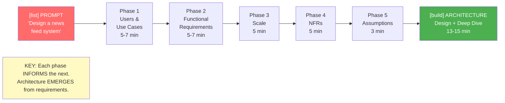
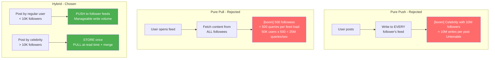
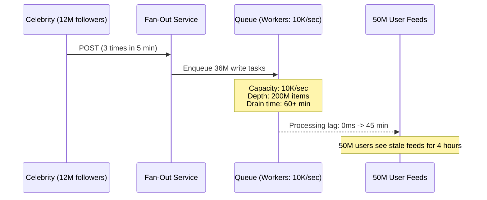
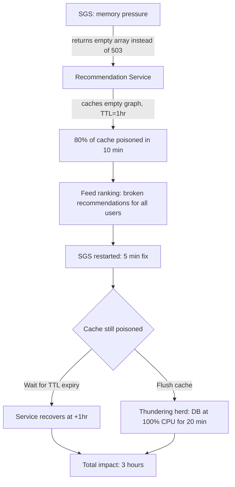

# Chapter 19: End-to-End System Design Using the 5-Phase Framework

### A Staff-Level Walkthrough: The News Feed System

> **Who this is for:** A recent college graduate who knows the 5 phases individually but wants to see how they connect in a real 45-minute interview -- how each phase builds on the last, how L6 thinking shows up at every step, and what a complete design looks and sounds like from start to finish.

---

## Chapter at a Glance

```
+===============================================================================+
|    CHAPTER 19 -- END-TO-END 5-PHASE FRAMEWORK: NEWS FEED SYSTEM AT A GLANCE    |
+===============================================================================+
|                                                                               |
|  CORE IDEA: Architecture EMERGES from requirements. Do not jump to design.   |
|  Each phase informs the next. The celebrity edge case drives the architecture.|
|                                                                               |
|  THE 45-MINUTE BREAKDOWN:                                                     |
|  0-2 min   -> Acknowledge prompt, announce structured approach                |
|  2-9 min   -> Phase 1: Users & Use Cases (7 min)                              |
|  9-16 min  -> Phase 2: Functional Requirements (7 min)                        |
|  16-21 min -> Phase 3: Scale -- derive numbers (5 min)                         |
|  21-26 min -> Phase 4: NFRs -- quantify and trade off (5 min)                  |
|  26-29 min -> Phase 5: Assumptions & Constraints (3 min)                      |
|  29-42 min -> Architecture design and deep dive (13 min)                      |
|  42-45 min -> Wrap-up, evolution, questions (3 min)                           |
|                                                                               |
|  THE KEY NUMBERS FOR THIS DESIGN:                                             |
|  200M DAU x 5 sessions/day = 1B feed loads/day = 12K/sec avg, 50K peak       |
|  100M posts/day x 500 avg followers = 50B fan-out writes/day (if pure push) |
|  7-day feed retention, hybrid push/pull at 10K-follower threshold            |
|                                                                               |
|  L6 SIGNALS: Identify celebrity edge case unprompted. Derive numbers.        |
|  Make trade-offs explicit. Discuss failure before being asked.               |
|                                                                               |
+===============================================================================+
```

---

## Quick Visual: L5 vs L6 in This End-to-End Design

| Dimension | L5 (Senior) | L6 (Staff) |
|-----------|-------------|------------|
| **Starting approach** | Draws boxes immediately | "Let me work through this systematically first" |
| **User identification** | "Users who view feeds and post content" | Names 8 user types including system users and ops |
| **The celebrity problem** | Not raised until prompted | Raised unprompted: "Celebrity posts force the hybrid model" |
| **Scale** | "Large scale, millions of users" | "200M DAU x 5 = 1B loads = 12K/sec avg, 50K peak" |
| **NFRs** | "Fast and reliable" | "P99 < 300ms, 99.9% availability, eventual consistency for feeds" |
| **Trade-offs** | Implicit | "Choosing latency over freshness because users expect instant app launch" |
| **Assumptions** | Never stated | Categorised: assumptions, constraints, simplifications -- all explicit |
| **Alternatives** | One design presented | "I considered pure push and pure pull. Here is why hybrid is the right choice." |
| **Failures** | Addressed only when asked | Proactively raises: "Let me trace what happens when each component fails" |
| **Evolution** | Not discussed | "In year 1, multi-region. Here is the migration path." |

---

## Visual Overview: The 5-Phase Flow



---

## Visual Overview: Push vs Pull vs Hybrid



---

## 1. Learning Goal

By the end of this chapter you will be able to:

- Walk through a complete system design interview for a news feed system at Staff level
- Connect all 5 phases naturally, showing how each phase informs the next
- Identify the celebrity problem as an L6 signal and explain why it forces the hybrid model
- Derive all scale numbers from first principles, show the work, and name the key bottlenecks
- Quantify NFRs and trade them off explicitly
- State assumptions, constraints, and simplifications in the right categories
- Explain the architecture with decisions justified against requirements -- not just boxes
- Discuss failure, degradation, and blast radius for each component
- Describe a 1-2 year evolution path

---

## 2. The Prompt

**Interviewer:** "Design a news feed system for a social media platform."

**Your response:**
> "A news feed system -- that is a rich problem with some interesting challenges. Before I start designing, I would like to work through this systematically. I will spend a few minutes understanding the users and use cases, then define requirements, establish scale, clarify non-functional requirements, and state my assumptions. That will give us a solid foundation before I get into architecture. Does that approach work for you?"

*What this signals to the interviewer:* Structured thinking, ownership of the conversation, L6 discipline before a single box is drawn.

---

## 3. Phase 1: Users and Use Cases (Minutes 2-9)

### Step 1: Identify ALL User Types

**Your narration:**
> "Let me start by understanding who the users of this system are. I see several types, and I want to make sure I have the full picture."

**Human users:**

| User type | What they need | Why they matter |
|-----------|---------------|-----------------|
| **Feed consumers** (primary) | Personalised content, fast load, smooth scroll | The feed exists for them. Core design is optimised for this. |
| **Content creators** (secondary) | Their posts appear in followers' feeds | They share user type with consumers -- same people, different mode |
| **Advertisers** (secondary) | Their ads appear in appropriate positions | Need targeting and placement; out of scope today |

**System users (L6 signal -- L5 engineers often miss these):**

| System user | What it provides | Design implication |
|-------------|-----------------|-------------------|
| **Content service** | Stores and serves posts by ID | We call it to fetch content for the feed |
| **Social graph service** | Provides follow relationships | We call it to know whose content to show |
| **Ranking/ML service** | Scores content for personalisation | We call it to order the feed |
| **Analytics service** | Consumes feed events | We emit to it; it is a downstream dependency |

**Operational users (also often missed):**

- **SRE / Ops team**: Monitors feed health, needs visibility into latency, error rates, queue depths

**Check alignment:**
> "I see consumers as primary -- feed generation is optimised for them. Content creators and advertisers are secondary. System users tell me what services I am integrating with. Operational users tell me what observability I need. Does this user landscape match what you had in mind?"

---

### Step 2: Identify Core and Edge Use Cases

**Core use cases:**

| Use case | User | Priority |
|----------|------|---------|
| Load home feed | Consumer | P0 -- system is useless without this |
| Scroll for more content | Consumer | P0 -- infinite scroll is the core pattern |
| Pull to refresh | Consumer | P0 -- user expects new content |
| Publish content | Creator | P0 -- the input that drives the feed |
| Like, comment, share | Consumer | P1 -- interaction that drives ranking |

**Edge cases (the L6 signal):**

| Edge case | Why it matters | Handling |
|-----------|---------------|---------|
| **Celebrity with 10M followers** | 1 post = 10M writes if using pure push | Drives the hybrid push/pull architecture |
| New user with no follows | Empty feed is a bad experience | Fall back to trending and recommended content |
| User following 50,000 accounts | Assembling a feed from 50K sources is slow | Limit sources to top N by engagement history |
| User inactive for 1 year | Old precomputed feed is stale | Fall back to trending + re-engagement signals |
| Post deleted after loaded | Content may show in cached feeds | Filter deleted content at read time or show placeholder |

**The celebrity edge case deserves special attention:**

> "The celebrity edge case is interesting because it drives a key architecture decision. If one user has 10 million followers and posts once a day, and we push that post to every follower's feed at write time, that is 10 million writes for a single post. With 1,000 celebrity accounts, that is 10 billion writes per day from celebrities alone. That is unsustainable. This will force a hybrid push/pull model, which I will design in the architecture phase."

---

### Step 3: Set Explicit Scope

**In scope today:**
- Home feed generation and serving for logged-in users
- Basic ranking combining recency and engagement
- Cursor-based pagination (infinite scroll)
- Content from followed accounts

**Explicitly out of scope:**
- Content creation and storage -- that is the content service; I am integrating with it
- Social graph management -- separate service; I am calling it
- Search and discovery feeds -- different ranking model
- Sophisticated ML ranking -- I will treat ranking as a black-box service that returns scores
- Ad selection and targeting -- separate team's domain
- Stories (ephemeral content) -- different access pattern

> "I am scoping to the core feed experience: load, scroll, refresh. The most interesting challenges are feed generation at scale and the freshness/latency trade-off. Is this scope appropriate?"

---

### Where L5 Stops vs L6 Goes Further

L5 might identify: "users view feeds" and "users post content."

L6 identifies: 8 user types, 5 edge use cases including the celebrity problem, explicit in/out scope with reasons.

**Why the celebrity edge case is an L6 signal:**
> Missing the celebrity problem and designing pure push means your system collapses under a single celebrity post. Raising it unprompted shows you understand the power-law distribution of social graphs -- that 0.1% of accounts have millions of followers, and one post from them amplifies into millions of writes.

---

## 4. Phase 2: Functional Requirements (Minutes 9-16)

### Read Flows

**F1: Generate feed**
- Given a user ID, return a personalised list of content items
- Content from followed accounts, ranked by relevance and recency
- Support cursor-based pagination (not offset -- cursors prevent duplicates and skips)

**F2: Load feed page**
- Return 20 items per page with metadata needed for rendering
- Include next-page cursor for continued scrolling

**F3: Detect new content**
- Allow client to check if new content is available (for pull-to-refresh)
- Return count of new items since last cursor

### Write Flows

**F4: Publish content**
- When a user publishes, make content available to followers' feeds
- Content appears in follower feeds within 60 seconds (freshness target)
- Note: 60 seconds, not immediate -- gives architectural flexibility

**F5: Record interaction**
- When a user interacts (like, comment, share), record for ranking signals
- Eventually consistent -- interaction counts can lag

**F6: Hide and mute**
- When a user hides or mutes, reflect in future feeds
- Takes effect within the current session (read-your-writes consistency)

### Control Flows (L6 signal -- L5 engineers often miss these)

**F7: Manage ranking parameters**
- Operators can adjust global ranking weights without a code deploy
- Support A/B testing of ranking algorithms

**F8: Manage celebrity thresholds**
- Configure the follower-count threshold for push vs pull
- Adjust based on observed system performance

### The Key Principle: Specify What, Not How

> "Notice I am specifying *what* happens, not *how*. 'Content should appear in follower feeds within 60 seconds' -- I am not specifying whether that is push or pull, synchronous or async. Those are architecture decisions I will make based on scale and NFRs."

### Handling Edge Cases in Requirements

| Edge case | Functional requirement |
|-----------|----------------------|
| New user (cold start) | F1 falls back to trending + onboarding recommendations |
| Large followee list (50K accounts) | F1 limits sources to top N by engagement history |
| Celebrity posts | F4 uses pull model -- stored once, pulled at read time |
| Deleted content | F2 filters deleted items; may show placeholder |

---

## 5. Phase 3: Scale (Minutes 16-21)

### Establish User Scale

| Metric | Value | Rationale |
|--------|-------|-----------|
| MAU | 500M | Major social platform |
| DAU | 200M | 40% DAU/MAU ratio -- good engagement |
| Concurrent users (peak) | 20M | ~10% of DAU online at peak |

### Derive Activity Scale

**Show the work:**

```
Feed loads per day = 200M DAU x 5 sessions/day = 1 billion
Feed loads per second (average) = 1B / 86,400 = ~12,000 QPS
Feed loads per second (peak) = 12K x 4 = ~50,000 QPS

Posts per day = 100M (50% of DAU posts once)
Posts per second (average) = 100M / 86,400 = ~1,200 QPS
Posts per second (peak) = 1,200 x 4 = ~5,000 QPS
```

**Read/write ratio:** 1B feed loads : 100M posts = **10:1 externally.**

But the interesting ratio is internal:
- If pure push: 100M posts x 500 avg followers = **50 billion fan-out writes per day**
- vs 1 billion feed reads

This is why pure push is untenable -- and why we need the hybrid model.

### Peak Load Multipliers

| Factor | Multiplier | Notes |
|--------|-----------|-------|
| Evening primetime | 3-4x | Major markets peak between 8-10pm |
| Day of week | 1.2x | Weekends slightly higher |
| Breaking news event | 5-10x | Cannot predict; design for graceful degradation |

**Design target:** 50K feed loads/second sustained. Degrade gracefully at 100K+.

### First Bottleneck Analysis

Staff engineers anticipate where the system breaks as it grows:

| Scale | Feed loads/sec | What breaks first | Mitigation |
|-------|---------------|------------------|------------|
| **1x (today)** | 50K | Feed cache memory; Feed Storage write throughput | Sharding; 7-day retention |
| **5x** | 250K | Ranking service becomes bottleneck; hot content keys | Request coalescing; ranking result cache |
| **10x** | 500K | Single-region bandwidth limits | Multi-region; read replicas |
| **50x** | 2.5M | Fan-out queue depth; Kafka partition limits | More partitions; fan-out prioritisation |

> "I am designing for today's 50K QPS with clear triggers for when to revisit each component. At 5x, ranking optimisation. At 10x, multi-region. These are operational changes, not architecture rethinks -- because I am designing the partition boundaries correctly now."

### How Scale Drives Architecture

Scale is already making architectural decisions for us:

1. **Precomputation is required.** 50K feed loads/second means we cannot compute feeds from scratch every time.
2. **Hybrid push/pull is required.** Pure push = 50B writes/day. Pure pull = 25M content queries/second.
3. **Caching is essential.** Feed cache, content cache, preference cache.
4. **Sharding is required.** User data, content data, and feed data all need to be distributed.

---

## 6. Phase 4: Non-Functional Requirements (Minutes 21-26)

### Latency

| Operation | Target | Rationale |
|-----------|--------|-----------|
| Feed load (initial) | P99 < 300ms | User is waiting. App launch. |
| Feed scroll (next page) | P99 < 200ms | Seamless scroll experience |
| Pull-to-refresh check | P99 < 100ms | Feels responsive |
| New post in follower feeds | P95 < 60 seconds | Users tolerate this delay |

> "I am prioritising read latency over write latency. Users wait for feed loads. A 60-second delay for new posts appearing in followers' feeds is acceptable -- users do not usually check immediately."

### Availability

| Component | Target | Rationale |
|-----------|--------|-----------|
| Feed serving | 99.9% | Core product experience |
| Content ingestion | 99.99% | Cannot lose user posts |
| Fan-out delivery | 99.9% | Occasional delay acceptable |

### Consistency

| Data | Consistency model | Rationale |
|------|-----------------|-----------|
| Feed content | Eventual (30-60 sec) | Users tolerate stale feeds |
| Interaction counts | Eventual | Likes can lag; users do not notice |
| User preferences (mute) | Read-your-writes | User expects mute to work immediately |
| Deleted content | Strong (via filtering) | Deleted content should not show |

**Data invariants -- the L6 depth:**

> "I am stating two data invariants explicitly:
> (1) **Monotonicity**: A paginated feed must never show the same item twice or skip items. Cursor-based pagination plus idempotent fan-out enforces this.
> (2) **Deletion propagation**: When content is deleted, it must disappear from feeds. I will filter at read time -- simpler than invalidating all cached feeds."

### Explicit Trade-offs

| Trade-off | Choice | What is sacrificed | Why |
|-----------|--------|-------------------|-----|
| Freshness vs latency | Latency | New posts take up to 60s to appear | Users expect instant app launch |
| Consistency vs availability | Availability | Feed can be stale for 30-60 seconds | Feed does not need strong consistency |
| Personalization vs simplicity | Moderate personalization | Not full ML optimization | Can iterate; start simpler |
| Push vs pull | Hybrid | System complexity | Neither alone works at this scale |

### Security

- All feed requests from authenticated users
- Users only see content they have access to
- Rate limiting to prevent feed scraping
- No PII in traces or logs
- Authorization at the content service layer (defence in depth)
- 7-day feed retention must be GDPR-compatible: "delete all data for user X" supported

---

## 7. Phase 5: Assumptions and Constraints (Minutes 26-29)

### Assumptions (things I believe are true -- correct me if wrong)

**Infrastructure:**
1. Cloud infrastructure with auto-scaling and load balancing
2. CDN for static content delivery (images, videos)
3. Distributed caching (Redis cluster or equivalent)
4. Message queue for async processing (Kafka or equivalent)
5. Monitoring and alerting infrastructure exists

**Service dependencies:**
1. Content service exists and provides content by ID
2. Social graph service exists and provides follow relationships
3. User service exists with authentication and profile data
4. Ranking service exists and can score content for a user

**Behavioural:**
1. Traffic follows typical patterns: 3-4x peak during evening
2. Power-law distribution: top 1% of accounts create significant portion of content
3. ~0.1% of accounts have 1M+ followers ("celebrities")
4. Median follow count ~200; mean ~500 (heavy tail)

### Constraints (given, not chosen)

1. Feed load: P99 < 300ms
2. New posts appear within 60 seconds
3. Scale: 200M DAU, 50K feed loads/second peak
4. Existing microservice ecosystem (cannot replace the social graph service)

### Simplifications (my choices -- I can design these if needed)

1. **Single region first** -- global adds significant complexity
2. **Text focus** -- not designing media delivery in detail; CDN handles it
3. **Simple ranking** -- treating ranking as a black box that returns scores
4. **No ads** -- leaving slots for ads but not designing ad selection
5. **No Stories** -- ephemeral content is a separate feature

> "These simplifications are reasonable because single-region captures the core complexity, media delivery is a solved problem, and ranking/ads are separate team domains. Does this framing match what you want to explore?"

---

## 8. Architecture Design (Minutes 29-42)

### High-Level Architecture

```
                        Clients (Mobile / Web)
                               |
                               v
                         API Gateway
                   (Auth, Rate Limiting, Routing)
                               |
             +-----------------+-----------------+
             |                 |                 |
             v                 v                 v
       Feed Service      Content Service    Fan-Out Service
             |            (Existing)              |
             v                                    |
       Feed Cache                                 |
        (Redis)                                   |
             |                                    |
             v                                    v
       Feed Storage  <-------------------  Message Queue
       (Cassandra,                           (Kafka)
        sharded by
        user_id)
             |
             v
       Ranking Service
       (existing)
```

---

### Component 1: Feed Service

**Responsibility:** Generate and serve personalised feeds.

**Key design decisions:**

**Feed construction -- hybrid push/pull:**
- Users with <10K followers -> pre-materialised feed (fan-out at write time)
- Users with >10K followers (celebrities) -> content stored once, pulled and merged at read time

**Feed cache:**
- Key: `feed:{user_id}:{page_cursor}`
- TTL: 5 minutes -- balance freshness vs database load
- On cache miss: generate from feed storage + celebrity content merge

**Pagination:**
- Cursor-based, not offset-based
- Cursor encodes: timestamp + last_item_id
- Prevents duplicate or skipped items across page boundaries

**Why this design:**
> "At 50K requests/second, we cannot compute feeds from scratch. Precomputation works for 99.9% of users. But celebrities have millions of followers -- pushing to all of them creates 50 billion writes per day from the top 1,000 accounts alone. So we store celebrity content once and pull it into the feed at read time, merged with the precomputed portion."

---

### Component 2: Fan-Out Service

**Responsibility:** Distribute new content to followers' feeds when a user posts.

**Fan-out logic:**

```
On post event received:
  if author.follower_count < 10,000:
    push content_id to each follower's feed storage
  else:
    store content for pull-path retrieval
    (no fan-out -- pulled by feed service at read time)
```

**Async processing:**
- Post published -> Kafka message -> fan-out workers consume
- Decouples publish latency from fan-out completion
- 60-second freshness target is achievable async

**Prioritisation:**
- Fan-out workers process active users first (active in last 24h)
- Inactive users get lower priority -- their feeds are stale anyway

**Why async:**
> "Synchronous fan-out would mean publish latency = time to write to 500 followers' feeds. At our peak post rate, that creates unacceptable write contention. Async decouples them -- the post returns success immediately, fan-out completes within 60 seconds."

---

### Component 3: Feed Storage

**Responsibility:** Store precomputed feed items per user.

**Data model:**

```
feed_items table (Cassandra):
  user_id         -- partition key (shard by this)
  timestamp       -- sort key (descending order)
  content_id
  author_id
  ranking_score
```

**Sharding:** By user_id. Each user's feed lives on exactly one shard. No cross-shard queries for feed reads.

**Storage choice:** Cassandra or DynamoDB -- optimised for write throughput (fan-out) and range queries (feed read).

**Retention:** 7 days. Background job removes older items. Bounded storage, fresh feed.

**Why Cassandra:**
> "Sharding by user_id means each feed read hits exactly one partition -- no scatter-gather. Cassandra handles the fan-out write throughput well. 7-day retention keeps storage bounded: 1B items/day x 100 bytes x 7 days = ~700 GB, manageable."


### Component 4: The Celebrity / Regular User Split -- Why 10K?

The 10,000-follower threshold is not arbitrary. It is derived from the cost crossover point.

**The math behind the threshold:**

```
Fan-out write cost per post:
= follower_count x write_cost_per_row x fan_out_workers_cost

For a regular user (500 followers):
= 500 writes x ~0.5ms each = 250ms total fan-out time
= trivial; workers handle this in under 1 second

For a celebrity (1M followers):
= 1,000,000 writes x ~0.5ms each = 500 seconds of work
= requires 500+ parallel workers
= at 10 celebrity posts/hour: 5,000 worker-seconds/hour just for one celebrity
```

**Cost crossover point:**
At roughly 10,000 followers, the cost of push fan-out equals the cost of pull-at-read-time plus the storage overhead. Below 10K: push is cheaper. Above 10K: pull is cheaper.

**Why 10K specifically and not 5K or 50K:**
- At 5K: too many accounts in the "celebrity" pull category; read-time merging overhead grows
- At 50K: fan-out workers are overwhelmed by accounts with 10K-50K followers; write amplification is too high
- At 10K: ~0.1% of accounts are celebrities; fan-out handles 99.9% of posts efficiently

**This threshold is tunable.** Under load, if fan-out workers show high latency, lower the threshold. If read-path celebrity merging adds too much latency, raise the threshold. Build it as a runtime-configurable parameter, not a hardcoded constant.

**L5 vs L6 on the threshold:**

**L5:** "We push to followers for regular users and pull for celebrities."
*(Doesn't mention how the threshold is set, that it's derived from math, or that it should be tunable)*

**L6:** "The 10K-follower threshold is a cost crossover point, not a magic number. Below 10K, push fan-out cost < pull merge cost. Above 10K, the math inverts. I'm deriving this from: fan-out workers at our write throughput can handle up to N followers per post before latency degrades. At 10K, that's the limit. I'm storing this threshold in a feature flag -- if fan-out latency grows, ops can lower it without a deploy."

---

### The Read Path -- End to End

Let me trace a user loading their feed:

1. **Request arrives:** Client requests feed for user_id
2. **Cache check:** Look for `feed:{user_id}:1` in Redis
3. **Cache hit (~80% of requests):** Return cached feed. Done. ~5ms.
4. **Cache miss:**
   - a. Fetch pre-materialised feed items from Feed Storage (<=500 items)
   - b. Identify celebrities the user follows (accounts with >10K followers)
   - c. Fetch recent content IDs from those celebrities (pull path)
   - d. Batch-fetch content details from Content Service
   - e. Score and rank with Ranking Service
   - f. Merge, take top 20, return to user, store in cache

**Latency breakdown (cache miss path):**

| Step | Target | How |
|------|--------|-----|
| Cache lookup | <5ms | Redis in-memory |
| Feed Storage query | <50ms | Single partition |
| Celebrity content fetch | <50ms | Parallel fetches |
| Content Service calls | <50ms | Batched, parallel |
| Ranking | <50ms | Pre-loaded model, cached results |
| Merge and serialise | <10ms | In-memory |
| **Total (cache miss)** | **<215ms** | Within 300ms P99 budget |

---

### Alternatives Considered and Rejected

**Alternative 1: Pure push**

Description: Push every post to every follower's feed at publish time.

Why rejected: Celebrity with 50M followers = 50M writes per post. Top 1,000 celebrities posting once per day = 50 billion writes. At 100 bytes per write, that is 5TB of writes per day from celebrities alone. Not sustainable.

When it would work: Platforms with a maximum follower count limit, or closed networks where celebrity accounts do not exist.

**Alternative 2: Pure pull**

Description: Compute the feed entirely at read time with no precomputation.

Why rejected: 50K feed loads/second x 500 followees = 25 million content queries per second. Latency would exceed 1 second. Database at origin would be crushed.

When it would work: Very small scale (<100K users) or with extremely aggressive caching.

**Chosen: Hybrid**

Handles 99% of the cases with push, handles the 1% that would break push with pull. At the 10K-follower threshold, the cost of push exceeds the cost of pull at read time. This threshold is tunable based on observed system performance.

---

## L5 vs L6 at the Architecture Stage -- 8 Key Decision Points

The following contrasts show exactly what separates a Senior engineer's architecture walkthrough from a Staff engineer's. Each is a decision point that comes up in real news feed design interviews.

| Decision | L5 approach | L6 approach | Why it matters |
|----------|-------------|-------------|---------------|
| **Fan-out threshold** | "We do push for small accounts, pull for celebrities" | "The 10K threshold is a cost crossover derived from write amplification math. It is stored as a runtime-configurable parameter so ops can tune it without a deploy under load" | Shows math-driven decisions, not intuition |
| **Cassandra vs DynamoDB** | Picks one without justification | "Both work. Cassandra gives more control over compaction strategy and replication topology. DynamoDB is fully managed but vendor-locked and per-request pricing at this write volume is 3x more expensive than Cassandra on EC2. I choose Cassandra for cost at this scale, but I'd choose DynamoDB for a smaller team that can't operate Cassandra" | Shows cost and operational trade-off thinking |
| **Feed retention (7 days)** | "We keep 7 days of feed data" | "7 days is a deliberate bound. Each day: 1B fan-out items x 100 bytes = 100GB. At 7 days: ~700GB total storage. Unbounded retention would compound at 700GB/week. 7 days covers ~99% of user engagement windows -- users who haven't opened the app in 7 days get a freshly computed feed anyway. This is documented as a design constraint: we cannot support 'show my feed from 6 months ago'" | Shows storage math and constraint documentation |
| **Cache TTL (5 minutes)** | "We cache the feed with a TTL" | "5-minute TTL is the trade-off between freshness (60-second target) and database load. Cache miss generates ~8 DB reads. At 50K req/s with 80% hit rate: 10K misses/sec x 8 reads = 80K DB reads/sec. At 95% hit rate: 2.5K misses/sec x 8 reads = 20K reads/sec. The 5-minute TTL keeps most active users' feeds warm through a page-scroll session" | Shows caching math, not just "add a cache" |
| **Async fan-out via Kafka** | "We use a message queue for fan-out" | "Kafka decouples publish latency from fan-out completion. Without Kafka, a post from a user with 9,000 followers takes 4.5 seconds to publish (synchronous fan-out). With Kafka: publish returns in <50ms; fan-out completes asynchronously within 60 seconds. The queue also provides replay: if fan-out workers crash, no posts are lost -- they re-process from the offset" | Shows latency math and durability reasoning |
| **Read replicas vs cache** | "We'll add read replicas if the DB gets hot" | "Read replicas address throughput but not latency -- a replica query still takes 50ms. A cache hit takes 1ms. For feed reads (the hot path), cache is the right answer. Read replicas address write failover and read scaling during cache cold start (e.g., after a major deployment flushes the cache). Both serve different failure modes" | Shows that read replicas != cache |
| **Social Graph caching** | "We look up the social graph when building feeds" | "The social graph is a critical dependency with high read volume but low change rate. Users change who they follow maybe once a day; feeds load 50K/second. I cache the follow list per user with a 1-hour TTL in Redis. Cache miss hits the social graph service. This reduces social graph QPS from 50K/sec to ~5K/sec (1/10th via TTL-based cache). It also provides a fallback: if the social graph service is unavailable, we serve feeds from cached follow lists for up to 1 hour" | Shows dependency management and fallback design |
| **Celebrity threshold edge cases** | Doesn't mention edge cases | "What happens when an account crosses 10K followers? Their pending fan-out writes transition from push to pull. I handle this with a grace period: on threshold crossing, stop new fan-out writes, serve a merged feed (pull all their existing push-materialized items + new pull-path items) for 24 hours, then transition fully to pull. This prevents the brief period where followers miss posts during the transition" | Shows edge case thinking at system boundaries |

**Staff-level architectural narration pattern:**

Notice the structure of every L6 decision above:
1. **State the decision:** "I chose X over Y"
2. **Give the quantified reason:** "because at this scale, X costs $A vs Y costs $B" or "X takes Nms vs Y takes Mms"
3. **Acknowledge the trade-off:** "the cost is Z -- this means we cannot do W"
4. **Show forward-compatibility:** "if requirements change to Z, we would switch to Y because..."

An L5 engineer picks tools. An L6 engineer derives the right tool from constraints, quantifies the trade-off, and shows how the decision would change if a constraint changed.

---

### Failure Scenarios and Degradation

| Component fails | Impact | Degradation strategy |
|-----------------|--------|---------------------|
| **Feed Cache (Redis)** | All requests hit storage | Latency increases to ~200ms -- still within 300ms budget. Auto-scale Feed Storage reads. |
| **Feed Storage (one shard)** | ~5% of users cannot load feeds | Return cached feed if available. If no cache, serve trending content. Failover to replica. |
| **Content Service** | Cannot fetch content details | Return feed with basic metadata (titles, authors) only. Disable rich content rendering. |
| **Fan-Out Service** | New posts do not appear | Posts still stored durably. Feeds become stale. Queue builds in Kafka. Workers catch up when service recovers. |
| **Ranking Service** | Cannot personalise feeds | Fall back to chronological order. Engagement drops but feed still loads. |
| **Social Graph Service** | Cannot identify followees | Use cached follow relationships (1-hour TTL). Fan-out queues for replay. |

**Blast radius analysis:**

| Component | Users affected | Duration | Severity |
|-----------|---------------|----------|---------|
| Cache (1 node) | ~5% (shard affinity) | Until restart ~2min | Low |
| Cache (cluster) | 100% (degraded latency) | Until recovered | Medium |
| Fan-out | 0% immediately (staleness grows) | Until recovery | Low |
| Social graph | 100% (new feeds blocked) | Until cached graph expires | Critical |
| Content Service | 100% (rich content missing) | Until recovery | High |

**The Social Graph dependency deserves special attention:**

> "Social Graph is a critical dependency. If it fails, we cannot compute new feeds or fan out posts. Mitigation: cache the social graph locally with 1-hour TTL. Stale follow relationships are acceptable -- users do not frequently change follows. Fan-out posts queue in Kafka and replay when the service recovers."

---

### Cascading Failure Prevention

| Pattern | How applied | Why |
|---------|-------------|-----|
| Circuit breaker | Each external service call (Content, Ranking, Social Graph) | Prevent a slow dependency from blocking all feed requests |
| Bulkhead | Separate connection pools for each dependency | Content Service slowness does not steal connections from Ranking Service |
| Timeout | 100ms for all service calls in the feed path | Bound worst-case latency |
| Fallback | Every service call has a defined fallback | Degraded feed > no feed |
| Retry budget | Max 10% of requests can retry in a time window | Prevent retry storms from amplifying problems |

---

### Cost Drivers for This Design

| Cost driver | Magnitude | Staff-level mitigation |
|-------------|-----------|----------------------|
| **Fan-out writes** | 50B writes/day at pure push | Hybrid model cuts celebrity fan-out 90%+ |
| **Feed storage** | 1B items/day x 100 bytes | 7-day retention bounds storage at ~700GB |
| **Cache memory** | 200M users x 20 items x 2KB if all cached | Cache only active users (last 24h). ~20% of users drive 80% of traffic. |
| **Ranking compute** | 50K/sec if computed fresh | Cache ranking results 5 minutes. Precomputed feeds skip ranking on cache hit. |
| **Cross-region (future)** | 2-3x current cost | Async replication; read replicas for distant users only |

---

### Observability Design

| Component | Key metrics | Alert threshold |
|-----------|------------|----------------|
| API Gateway | Request rate, error rate, P50/P99 latency | Error rate > 1%, P99 > 500ms |
| Feed Service | Cache hit rate, generation latency | Hit rate < 80%, latency > 250ms |
| Feed Cache | Memory usage, eviction rate | Memory > 80%, evictions > 10K/min |
| Feed Storage | Read latency, write latency | P99 > 100ms for reads |
| Fan-Out Service | Processing rate, lag, failure rate | Lag > 10 min, failures > 1% |

**Every request carries:**
- `trace_id`: Unique per user request
- `span_id`: Unique per operation
- Structured JSON logs with consistent fields

---

### Evolution Over 1-2 Years

**Year 1:**
- Multi-region deployment (EU, APAC) -- async replication
- ML-based ranking replacing simple heuristics
- Real-time signals (trending topics, breaking news)
- Full ad injection with pacing

**Year 2:**
- Interest-based content (posts from non-followed accounts)
- Video-first feed optimisation
- Stories integration
- Explore feed with separate ranking

**Architecture evolution triggers:**

| When to revisit | What changes |
|----------------|-------------|
| 5x traffic | Ranking service optimisation, request coalescing |
| 10x traffic | Multi-region, read replicas per region |
| Top celebrity count grows | Raise push/pull threshold dynamically |
| Storage > $X/month | More aggressive tiering to cold storage |

---

## 9. Real Incident: The Celebrity Cache Stampede

This incident shaped how production feed systems handle hot content.

**Context:** A major social platform's feed system used hybrid push/pull. Celebrity content was pulled at read time. When a celebrity posted, the feed service fetched that post for every user who followed them and opened the app.

**Trigger:** A celebrity with 30M followers posted during a live event. Within 2 minutes, 2 million users opened the app. All 2M requests resulted in cache misses for that celebrity's post (new post, not yet cached).

**What happened:** Each cache miss triggered: (1) Content Service lookup for the post, (2) Ranking Service invocation, (3) Feed Storage read. The Content Service received 2 million requests for the same `content_id` in 2 minutes. A single database key cannot serve that rate.

**User impact:** Feed load latency spiked from 200ms P99 to 8 seconds. 40% of feed requests timed out. Users saw blank or spinner screens for 12 minutes.

**Root cause:** No request coalescing. A single new celebrity post became N independent backend requests -- one per user. Classic cache stampede.

**The fix:** Request coalescing -- when 10+ requests for the same `content_id` arrive within 50ms, a single backend fetch serves all waiting requests. "Hot content" pre-warming -- when a celebrity posts, an async job pre-populates the content cache before user traffic peaks.

**The L6 lesson:**
> "Hot keys at read time behave like a DDoS from your own users. Design for request coalescing and cache warming for known hot content. At Staff level, anticipate power-law traffic -- the top 0.1% of content will drive a disproportionate share of backend load."

---

## 10. The Complete Phase Summary

Each phase informed the next. Here is the connection chain:

| Phase | Key insight | Impact on architecture |
|-------|-------------|----------------------|
| **Phase 1: Users** | Celebrity edge case exists | Hybrid push/pull required |
| **Phase 2: Functional** | 60-second freshness acceptable | Async fan-out acceptable |
| **Phase 3: Scale** | 50K feeds/sec, 50B fan-out writes/day | Precomputed feeds required, pure push untenable |
| **Phase 4: NFRs** | P99 < 300ms, eventual consistency OK | Cache-first, async updates acceptable |
| **Phase 5: Assumptions** | Social graph and ranking services exist | Integration design, not building from scratch |

> "The architecture did not emerge from intuition. It emerged from the requirements established in these five phases. Each box I drew has a specific reason that traces back to something stated in Phase 1 through 5."

---

## 11. Interview Calibration

### 45-Minute Timing Guide

| Time | Phase | Common trap |
|------|-------|------------|
| 0-2 min | Opening | Jumping straight to design |
| 2-9 min | Phase 1 | Stopping at "users view feeds" -- missing celebrities and system users |
| 9-16 min | Phase 2 | Specifying technology (how) instead of behaviour (what) |
| 16-21 min | Phase 3 | Guessing "millions of users" instead of deriving numbers |
| 21-26 min | Phase 4 | "Fast and reliable" without numbers or trade-offs |
| 26-29 min | Phase 5 | Skipping entirely or only listing one type |
| 29-42 min | Architecture | Drawing boxes without explaining decisions |
| 42-45 min | Wrap-up | No mention of failures or evolution |

### What Interviewers Probe

| Probe | What they are assessing |
|-------|------------------------|
| "What if a celebrity with 50M followers posts?" | Hot key awareness; push vs pull reasoning |
| "How would you handle 10x traffic?" | Scale reasoning; bottlenecks; cost awareness |
| "What happens when the cache goes down?" | Degradation thinking; blast radius |
| "Why hybrid and not pure push or pull?" | Trade-off articulation; quantitative reasoning |
| "How do you ensure users never see duplicates?" | Data invariants; pagination correctness |
| "Who owns the social graph?" | Cross-team awareness; dependency design |
| "What if 30% of cache nodes are slow?" | Partial failure thinking |

### Signals of Strong Staff Thinking

- **Proactively raises** celebrity/hot key before being asked
- **Derives** numbers: "200M DAU x 5 = 1B loads = 12K/sec"
- **Names trade-offs** explicitly: "Choosing latency over freshness because..."
- **Considers alternatives** and rejects them with reasoning and numbers
- **Discusses failure** before being prompted -- including partial failure scenarios
- **Asks alignment questions:** "Does this scope work?" / "Is this assumption valid?"
- **Distinguishes** reversible from irreversible decisions

### Reversible vs Irreversible Decisions

| Decision | Type | Approach |
|----------|------|---------|
| Cache TTL (5 min) | Reversible -- change in config | Ship it, measure, adjust |
| Fan-out threshold (10K followers) | Reversible -- config-driven | Ship it, tune based on data |
| Sharding key (user_id) | Irreversible -- migration is expensive | Spend time analysing before committing |
| Push vs pull model | Irreversible -- data model change | Deep analysis first |

> "I spend time on irreversible decisions. I make reversible ones quickly and iterate."

### L6 Phrases for This Design

| Phase | L6 phrase |
|-------|-----------|
| Opening | "Let me work through this systematically -- users, requirements, scale, NFRs, then architecture" |
| Phase 1 | "The celebrity edge case is interesting -- it will drive a key architecture decision" |
| Phase 2 | "I'm specifying what happens, not how. The 'how' is an architecture decision for later." |
| Phase 3 | "200M DAU x 5 sessions = 1B loads/day. That's 12K/sec average, 50K at peak." |
| Phase 4 | "I'm prioritising read latency over freshness. Users wait for feed load." |
| Phase 5 | "I'm assuming the social graph service exists. If not, that changes scope significantly." |
| Architecture | "I considered pure push and pure pull. Here's why hybrid is the right choice." |
| Failure | "Let me trace through what happens when each component fails." |
| Evolution | "In year 1, we'd add multi-region. Here's the migration path." |

### How to Explain This to Leadership

> "The feed system serves 200M daily users. Our main technical challenge is write amplification -- when a celebrity posts, we cannot push to millions of followers. We use a hybrid model: push for normal users, pull for celebrities. This keeps cost and latency manageable. Our key trade-off: we accept 60-second staleness for new posts in exchange for sub-300ms feed loads. Users value instant app launch over seeing the very latest post immediately."

---

## Quick Reference Card -- This Design at a Glance

### Key Numbers to Know

| Metric | Value | How derived |
|--------|-------|-------------|
| **DAU** | 200M | Given |
| **Feed loads/day** | 1B | 200M x 5 sessions |
| **Feed loads/sec (avg)** | 12K | 1B / 86,400 |
| **Feed loads/sec (peak)** | 50K | 12K x 4 |
| **Posts/day** | 100M | 50% of DAU posts once |
| **Fan-out writes/day (push)** | 50B | 100M x 500 avg followers |
| **Feed storage (7 days)** | ~700GB | 1B items x 100B x 7 days |

---

### Trade-offs Made in This Design

| Trade-off | Choice | Why |
|-----------|--------|-----|
| Freshness vs latency | Latency (60s stale OK) | Users expect instant app launch |
| Consistency vs availability | Availability (eventual OK) | Feed does not need strong consistency |
| Push vs pull | Hybrid (threshold 10K) | Neither alone works at this scale |
| Personalization vs simplicity | Moderate | Can iterate; start simpler |

---

### Failure Quick Reference

| Component | Impact | Degradation strategy |
|-----------|--------|---------------------|
| Feed Cache | P99 increases to ~200ms | Still within budget; auto-scale storage reads |
| Feed Storage (shard) | ~5% of users | Serve cached feed or trending content |
| Content Service | No rich content | Basic metadata only |
| Fan-Out Service | Feeds become stale | Queue builds; catch up on recovery |
| Ranking Service | No personalization | Fall back to chronological |
| Social Graph | New feeds blocked | Use cached graph (1h TTL); replay fan-out |

---

### Mental Models for This Design

| Model | One-liner | When to use |
|-------|-----------|-------------|
| **Push vs pull** | "Push when mailboxes are small; pull when one sender has millions of recipients" | Explaining the celebrity threshold |
| **Freshness vs latency** | "Users wait for the app to open; they don't wait for the latest post" | Justifying 60s staleness |
| **Cache stampede** | "Hot keys at read time = DDoS from your own users" | Request coalescing, cache warming |
| **Blast radius** | "One shard down = 5% of users; Social Graph down = 100%" | Prioritising failure mitigations |
| **Irreversible decisions** | "Sharding key is a one-way door; cache TTL is a knob" | Deciding how much analysis to do |
| **Hybrid model** | "Neither push nor pull alone works at scale -- the tails break you" | Justifying complexity |

---

## 12. Self-Check: Did I Cover Everything?

Before wrapping up, check:

[ ] Did I identify multiple user types including ops and system services?
[ ] Did I address the celebrity/hot key problem before being asked?
[ ] Did I derive scale numbers from first principles and show the work?
[ ] Did I quantify NFRs with specific targets?
[ ] Did I make trade-offs explicit with reasoning?
[ ] Did I state assumptions, constraints, and simplifications in categories?
[ ] Did I explain *why* for each architecture decision?
[ ] Did I consider alternatives and explain why they were rejected?
[ ] Did I discuss failure scenarios and blast radius proactively?
[ ] Did I discuss partial failure (not just binary up/down)?
[ ] Did I mention how the system evolves over 1-2 years?
[ ] Did I distinguish reversible vs irreversible decisions?

---

## 13. Brainstorming Questions

1. What if the freshness requirement was changed to 5 seconds instead of 60? What changes in the architecture?

2. What if 10% of all users were "celebrities" (over 10K followers) instead of 0.1%? How does this change the push/pull threshold decision?

3. If you were designing this for a professional network (LinkedIn-style) instead of a social network, how would the users, use cases, and architecture differ?

4. At 10x this scale (2 billion DAU), what breaks first? Walk through the first-bottleneck analysis.

5. What if the ranking service had a 1-second latency instead of 50ms? How does this change the feed generation path?

6. A new feature request: "users should be able to undo a like within 30 seconds." What are the functional requirements and consistency implications?

7. What happens to the design if the social graph service has eventual consistency with 1-minute lag? How does this affect fan-out correctness?

8. You discover that the top 100 celebrities account for 40% of all fan-out writes. Should they have dedicated infrastructure? What are the trade-offs?

9. How would you design the feed differently if 90% of content was video (not text)?

10. A competitor launches and your DAU triples in 30 days. Which component is the most likely single point of failure to cause an outage? How do you mitigate it proactively?

---

## 14. Homework Exercises

### Exercise 1: Redesign Under Different Constraints

Redesign the news feed under three alternative constraints. For each, write a 1-page summary of what changes.

**Scenario A:** Latency target is 100ms P99 instead of 300ms.
- What changes?
- What do you sacrifice?
- How does this affect the caching strategy?

**Scenario B:** Freshness target is 5 seconds instead of 60 seconds.
- Is pure push now viable?
- What happens to the fan-out service?
- How does the write path change?

**Scenario C:** 99.99% availability instead of 99.9%.
- What redundancy is required?
- How does the deployment model change?
- How does cost change?

---

### Exercise 2: Apply the Framework to a New System

Apply the same 5-phase framework to design a URL shortener.

For each phase, write:
- What are the key questions?
- What are the key decisions?
- How does each phase influence the next?

Then compare the two designs: which phases are more important for the URL shortener vs the news feed? Why?

---

### Exercise 3: Failure Mode Expansion

For each failure scenario in the degradation table, add:

1. The specific SLI that would detect it
2. The alert threshold that triggers on-call
3. A runbook entry: "if this alert fires, do X"
4. An automated mitigation (if possible)

This is the operational readiness section that separates Staff-level candidates from Senior-level ones.

---

### Exercise 4: Interview Practice

Practice this complete design in 42 minutes:

- 7 min: Phase 1 (Users & Use Cases)
- 7 min: Phase 2 (Functional Requirements)
- 5 min: Phase 3 (Scale)
- 5 min: Phase 4 (NFRs)
- 3 min: Phase 5 (Assumptions)
- 13 min: Architecture walkthrough
- 2 min: Failure scenarios and evolution

Record yourself. Watch for:
- Did you raise the celebrity problem unprompted?
- Did you derive the numbers or guess?
- Did you explain *why* hybrid instead of just describing it?
- Did you discuss failure before being asked?
- Was your pacing appropriate across all 5 phases?

---

## Appendix: Visual Summary

```
+===============================================================================+
|    VISUAL SUMMARY: CHAPTER 19 -- END-TO-END 5-PHASE FRAMEWORK IN ONE PICTURE   |
+===============================================================================+
|                                                                               |
|  PROMPT -> Phase 1 -> Phase 2 -> Phase 3 -> Phase 4 -> Phase 5 -> ARCHITECTURE     |
|           Users     Func      Scale     NFRs      Asmp                        |
|                                                                               |
|  45-MIN BREAKDOWN:                                                            |
|  0-2 open | 2-9 P1 | 9-16 P2 | 16-21 P3 | 21-26 P4 | 26-29 P5 |             |
|  29-42 architecture | 42-45 wrap-up                                           |
|                                                                               |
|  NEWS FEED -- KEY DECISIONS FROM EACH PHASE:                                   |
|  P1: Celebrity edge case -> hybrid push/pull; scope to home feed               |
|  P2: 60s freshness OK; F4-F8 across read/write/control flows                  |
|  P3: 200M DAU x 5 = 1B/day = 12K/sec avg, 50K peak                           |
|  P4: 99.9% avail, P99 <300ms, eventual OK for feeds, strong for deletions    |
|  P5: "Assume Content + Social Graph services exist; single region initially"  |
|                                                                               |
|  THE ARCHITECTURE EMERGES:                                                    |
|  Celebrity -> Hybrid model                                                     |
|  50K QPS -> Precomputed feeds + cache                                          |
|  60s freshness -> Async fan-out via Kafka                                      |
|  300ms P99 -> Cache hit path < 5ms; miss path < 215ms                         |
|  7-day retention -> Bounded storage, GDPR-compatible                          |
|                                                                               |
|  L6 SIGNALS: Raise celebrity unprompted. Show the math. Name trade-offs.     |
|  Discuss failures before being asked. State simplifications explicitly.      |
|                                                                               |
+===============================================================================+
```

---

*Chapter 19 complete. This is the final chapter in Section 2. You now have a complete end-to-end framework for Staff-level system design interviews.*

---

## How Staff Engineers Identify First Bottlenecks -- A Systematic Process

Senior engineers often guess where the bottleneck is. Staff engineers derive it. This section shows the systematic process behind the "Scale Over Time" table in Phase 3.

**Not intuition. A systematic process.**

| Step | Action | News Feed Example |
|------|--------|-------------------|
| **1. Map the critical path** | Trace the highest-volume request end to end | Feed load -> Cache -> Storage -> Content -> Rank -> Merge |
| **2. Compute per-request cost** | Multiply throughput by cost per operation | 50K/sec x 1 storage read + N content fetches |
| **3. Find amplification points** | Where does 1 input become N outputs? | Fan-out: 1 post -> 500 writes (avg follower count); celebrity: 1 post -> 50M potential writes |
| **4. Compare to component limits** | Look up known limits of each component | Cassandra: ~10K writes/sec per node; Redis: ~100K ops/sec per node |
| **5. Document the trigger** | State "at X scale, Y breaks" explicitly | "At 5x traffic, Ranking Service becomes the bottleneck" |

**Worked example for this design:**

```
Step 1: Critical path for feed load
  Client -> API Gateway -> Feed Service -> [Cache check]
  Cache miss -> Feed Storage + Celebrity fetch + Content Service + Ranking -> Merge -> Return

Step 2: Per-request cost at 50K QPS
  Cache hit (~80%): 1 Redis read x 50K = 50K Redis ops/sec (easy)
  Cache miss (~20%): 10K QPS x (1 Cassandra read + ~5 Content fetches + 1 Ranking call)
    = 10K Cassandra reads + 50K Content fetches + 10K Ranking calls per second

Step 3: Amplification at the fan-out
  100M posts/day x 500 avg followers = 50B writes/day
  Celebrity amplification: 1 post x 50M followers = 50M writes -- impossible per post

Step 4: Cassandra limits
  ~10K writes/sec per node. 50B writes/day / 86,400 = 578K writes/sec
  Would need 58 Cassandra nodes at pure push. Celebrity alone would saturate any cluster.

Step 5: Trigger documented
  "At 5x traffic, ranking service hits CPU limits. Pre-warm ranking cache."
  "At 10x traffic, single-region bandwidth saturates. Add multi-region."
```

> "The Scale Over Time table in Phase 3 is the output of this process -- not a guess. Every trigger is derived from the math."

---

## Reversible vs Irreversible Decisions

Staff engineers do not spend equal time on every decision. They distinguish reversible from irreversible and allocate analysis time accordingly.

**The core principle:**
> "Spend time on irreversible decisions. Make reversible ones quickly and iterate."

| Decision Type | Examples in This Design | Approach |
|---------------|------------------------|----------|
| **Reversible** | Cache TTL (5 min), fan-out threshold (10K followers), ranking weights | Ship, measure, adjust. No need for exhaustive analysis. Change a config, redeploy. |
| **Irreversible** | Sharding key (`user_id`), data model for Feed Storage, push vs pull hybrid | Deep analysis first. Changing later is a full migration -- expensive and risky. |

**Real-world example from this design:**

Choosing `user_id` as the Feed Storage shard key is effectively irreversible. If you discover later that a different key gives better distribution, you need to:
- Stop all fan-out writes
- Migrate every feed item to the new shard layout
- Coordinate a cutover with zero downtime

That migration takes weeks and significant engineering effort.

Choosing a 5-minute cache TTL is reversible. Change it to 2 minutes in a config, redeploy, and it takes effect. If freshness improves and cost is acceptable, keep it. If cache hit rate drops and latency climbs, change it back.

**Applying this in an interview:**

> "I want to spend a moment on the sharding key because that is an irreversible decision. Sharding by `user_id` means all of a user's feed items live on one partition -- reads are always single-partition. The risk is hot users: if a small number of very active users have disproportionately large feeds, their shards could become hot. I think `user_id` is still the right choice because feed reads are the high-volume path and single-partition reads are essential for latency. I am less concerned about the fan-out threshold of 10K -- that is a config value we can tune based on observed write amplification."

---

## Data Invariants -- L6 Depth

Data invariants are explicit correctness constraints that the system must never violate. Stating them explicitly means the design can be validated against them -- they are design requirements, not implementation details.

**Why L6 engineers state invariants:**
> "Most design reviews check whether the architecture handles load. L6 engineers also check whether the architecture maintains correctness under all conditions. Invariants are the checklist."

**Four invariants for the news feed system:**

**Invariant 1: Monotonicity**

A user's feed, when paginated, must never show the same item twice and must never skip items between pages.

How it is enforced: Cursor-based pagination using `(timestamp, item_id)` as the cursor. Idempotent fan-out -- if a write is retried, the same item is not added twice. The `item_id` acts as the deduplication key.

What breaks it: Offset-based pagination. If a new item is inserted between page 1 and page 2, offset shifts all items -- users see a duplicate or skip an item. This is why we use cursors.

**Invariant 2: Visibility**

If user A follows user B, and B's post is not deleted, then A's feed must eventually contain that post within the freshness SLA (60 seconds).

How it is enforced: Fan-out service delivers to all active followers. Kafka queues guarantee delivery even if the fan-out service restarts. The 60-second target is measured as P95 fan-out completion time.

What could break it: Fan-out worker failure without durable queue. If we used in-memory queues and a worker crashed, some followers would never see the post.

**Invariant 3: Deletion propagation**

When content is deleted, it must disappear from feeds. A user must not be able to see deleted content.

How it is enforced: Content Service marks items as deleted. Feed Service filters deleted items at read time before returning the response. This is simpler and more reliable than invalidating every cached feed that contains the item.

Why read-time filtering: Invalidating cached feeds reactively is complex -- you would need to know every user whose cached feed contains the deleted item. Filtering at read time is a simple check that requires no coordination.

**Invariant 4: Durability**

Published content must be written to durable storage before the publish request is acknowledged to the user.

How it is enforced: Content Service writes to Cassandra with replication factor 3 before returning 200 OK to the creator. Kafka messages are persisted before the fan-out service acknowledges them.

What breaks it: Writing to Kafka before Content Service -- a failure between those two steps would mean content is lost. The write order is Content Service first, then Kafka fan-out event.

---

## Security Depth

**Trust boundaries:**

The feed service sits between clients and multiple backend services. A compromised or misconfigured feed service could leak social graph data, expose content the user should not see, or be used to scrape the platform.

**Design choices for security in this system:**

**Choice 1: Feed Service never logs PII in traces**

Feed requests contain `user_id` and cursor. User IDs can be treated as pseudonymous identifiers in logs. No names, email addresses, or content text in structured logs. Trace spans contain timing data and component identifiers, not user data.

Why it matters: Trace data is often sent to third-party observability platforms (Datadog, Honeycomb). PII in traces creates compliance exposure.

**Choice 2: Authorization at Content Service, not just Feed Service**

The Feed Service checks whether a user is authenticated. The Content Service checks whether that user is authorised to see specific content (private account, blocked user, restricted content). This is defence in depth.

If the Feed Service is compromised and bypasses its own auth check, the Content Service still enforces access control. Single-gate security means a single misconfiguration exposes everything.

**Choice 3: Rate limiting per user to prevent scraping**

Feeds are a structured view of the social graph. A bot that rapidly loads feeds can reconstruct follow relationships and content patterns. Rate limiting at 60 requests/minute per user_id at the API Gateway prevents this.

**GDPR / compliance considerations:**

Feed content is personal data -- it contains posts by and about users, social relationships, and engagement signals. The 7-day retention cap is not just a cost decision; it aligns with GDPR's data minimisation principle.

The system must support "delete all data for user X" within SLA (typically 30 days under GDPR). This means:
- Feed Storage: delete all rows where `user_id = X` (feed items created for X as a consumer)
- Fan-out records: delete fan-out entries that referenced X as a creator
- Cache: invalidate all cache entries for user X

**Staff principle:**
> "Every component that touches user data is a trust boundary. Design defence-in-depth, not single-gate security. Assume any single component can be compromised and design so that compromise is contained."

---

## Cost as First-Class Constraint -- News Feed Cost Drivers

> "Staff engineers treat cost as a design constraint, not an afterthought. A design that costs ten times more than necessary is a failed design, even if it meets all latency targets."

**Cost drivers for this design:**

| Cost Driver | Magnitude | Staff-Level Mitigation |
|-------------|-----------|------------------------|
| **Fan-out writes** | 50B writes/day at pure push for celebrities | Hybrid: push for <10K followers, pull for celebrities. Cuts write amplification 90%+ for the celebrity tail |
| **Feed storage** | 50B items x 100 bytes = 5TB/day raw at pure push | 7-day retention cap; hybrid model reduces fan-out writes; tier old data to cold storage for archival |
| **Cache memory** | 200M users x 20 items x 2KB ~= 8TB if all users cached | Cache only active users (last 24h); evict inactive. ~20% of users drive 80% of traffic -- cache that 20% |
| **Read path compute** | 50K feeds/sec x (ranking + merge) if computed fresh | Pre-materialisation avoids computation on cache hits; cache ranking results for 5 minutes |
| **Cross-region (future)** | Full replication multiplies cost 2-3x | Async replication; read replicas only for distant users; home-region writes |

**Making the trade-off explicit:**

> "We could achieve 5-second freshness by switching to synchronous fan-out -- every post immediately written to all follower feeds. At 50B writes/day that triples our database cost and creates write contention during peak hours. Sixty-second freshness with async fan-out costs roughly one-third as much and is the right trade-off for this product -- users do not notice the difference between 5 seconds and 60 seconds for feed freshness."

**Cost sustainability over time:**

| Factor | Year 1 | Year 3 (if DAU triples) | Mitigation |
|--------|--------|------------------------|------------|
| Storage growth | 7-day retention cap | Same 7-day cap | Retention cap prevents unbounded growth; archive to cold storage |
| Fan-out amplification | 50B writes/day | ~150B writes/day (3x DAU) | Hybrid model scales sub-linearly because celebrity fan-out does not grow with follower counts |
| Cache memory | ~8TB effective (active users) | ~24TB if 3x users | Evict inactive users aggressively; active-user fraction stays ~20% |
| Ranking compute | 10K QPS (cache misses) | 30K QPS | Ranking result cache absorbs most growth; scale horizontally |

**Why this matters at L6:**

Approval committees at large companies ask "what does this cost in 3 years and does it scale sustainably?" Staff engineers design with bounded growth. Every unbounded cost driver must have a cap, a tier-down strategy, or an explicit decision to accept the growth.

---

## Cross-Team and Org Impact

> "At Staff level, designs span team boundaries. Dependencies and ownership matter as much as the technical design."

**Dependency table:**

| Dependency | Owning Team | Contract / SLA | Escalation Path |
|------------|-------------|----------------|-----------------|
| **Content Service** | Content Platform team | Get content by ID; P99 <50ms; eventual consistency OK | Feed team cannot block on their outages. Fallback: return metadata-only feed |
| **Social Graph Service** | Identity / Graph team | Followers, followees; eventual consistency OK | If down, use cached graph (1-hour TTL); fan-out queues for replay on recovery |
| **Ranking Service** | ML / Recommendations team | Score content for user; P99 <50ms | Fallback to chronological; feed still loads and works |
| **Analytics pipeline** | Data Platform team | Consume feed events (load, scroll, click) | Feed events are fire-and-forget; backpressure handled by analytics, not feed |

**Org considerations:**

The Feed team owns the feed experience end to end but depends on four or more other teams. This creates coordination overhead that affects design choices:

- Changes to Content Service schema (adding or removing fields) require coordination with the Feed team. The feed assumes specific fields in the content response -- schema changes can break the feed silently.
- Ranking algorithm changes can affect feed latency. If the Ranking team ships a model that takes 200ms instead of 50ms, the feed P99 breaches the 300ms budget. The interface contract must specify a latency SLO, not just a functional contract.
- Social Graph eventual consistency lag affects fan-out accuracy. If the Graph team's replication lag increases from 1 second to 30 seconds, followers added in the last 30 seconds may miss posts. This must be documented as acceptable, not discovered in production.

**Staff lesson:**
> "Design for failure of dependencies. Document ownership and escalation paths. Cross-team SLOs must be explicit in the design -- not assumed. A verbal agreement is not an SLO."

**How to raise this in an interview:**

> "Before I move to failure scenarios, I want to note that this design has four external dependencies. Each one is a potential failure point that is outside our team's control. I will design each integration with an explicit fallback so that if any of these services is unavailable, the feed degrades gracefully but continues to serve."

---

## Blast Radius Quantification

> "Staff engineers do not just list failure scenarios -- they quantify blast radius. 'Some users affected' is not good enough. How many? For how long? What is the revenue impact?"

**Detailed blast radius table:**

| Component | Users Affected | Duration | Revenue Impact | Notes |
|-----------|---------------|----------|----------------|-------|
| Feed Cache (1 node) | ~5% (shard affinity) | Until restart, ~2 min | Low | Latency increase for affected users; feed still loads from storage |
| Feed Cache (full cluster) | 100% (degraded latency) | Degraded, not down; until recovery | Medium | P99 rises to ~200ms; still within 300ms budget |
| Feed Storage (1 shard) | ~5% | Until failover, ~30 sec | Low | Replica promotion; brief interruption |
| Feed Storage (all shards) | 100% | Major outage until recovery | Critical | Full incident; no feed loads possible |
| Fan-Out Service | 0% immediately (feeds become stale) | Freshness degrades over time | Low | Feeds still load; new posts just do not appear quickly |
| Content Service | 100% (rich content missing) | Duration of outage | High | Fallback: metadata-only feed (authors, titles, timestamps) |
| Social Graph Service | 100% (cannot compute new feeds) | Until cached graph expires, ~1 hour | Critical | Cached follows allow fan-out to continue for 1 hour |
| Ranking Service | 100% (no personalisation) | Duration | Medium | Fallback: chronological; engagement drops but feed works |

**Staff-level statement for Social Graph failure:**

> "The Social Graph Service is the highest-severity single dependency. If it fails completely and we have no cached data, we cannot compute new feeds or fan out posts. My mitigation is to cache the social graph locally with a 1-hour TTL. Stale follow relationships are acceptable for this use case -- users do not add or remove follows frequently, and a 1-hour lag in a new follow appearing in the feed is tolerable. This converts a critical dependency into a medium-severity dependency."

**Using blast radius to prioritise mitigations:**

Not all failure mitigations are equal. Prioritise based on blast radius x probability:
- Social Graph failure: high blast radius, moderate probability -> invest in local cache
- Ranking Service failure: medium blast radius, moderate probability -> invest in chronological fallback
- Feed Storage (1 shard): low blast radius, low probability -> replica promotion is sufficient
- Fan-Out Service failure: zero immediate impact, low probability -> queue-based recovery is sufficient

---

## Dependency Cascade Analysis

When one service fails, the failure often does not stop there. It cascades to other services that depend on it.

**Cascade when Social Graph Service fails:**

```
Social Graph Service FAILS
         |
         +-- Feed Generation BLOCKED for new requests
         |     Note: CACHED feeds still work for existing cache entries
         |     Impact: ~20% of users (cache misses) cannot get new feeds
         |
         +-- Fan-Out BLOCKED for new posts
         |     New posts queue in Kafka but are not distributed
         |     Impact: freshness degrades; posts will replay on recovery
         |
         +-- Celebrity Detection BLOCKED for new requests
               Fallback: use stored celebrity list (updated hourly)
               Impact: new celebrities (crossed 10K threshold today) not detected
```

This is the cascading failure pattern: one dependency failure propagates to multiple services, each with its own blast radius. The key insight is that **cached data breaks the cascade**. Cached feeds still load. Cached follow relationships still enable fan-out. The cascade is contained for the duration of the cache TTL.

**Mitigation strategies:**

| Dependency | Failure Mode | Mitigation | Recovery Path |
|------------|-------------|------------|---------------|
| Social Graph | Complete outage | Cache follow relationships locally (1-hour TTL) | Replay fan-out from Kafka on recovery |
| Social Graph | Slow response (>100ms) | Timeout at 100ms; use cached data | Log cache-hit-due-to-timeout for monitoring |
| Social Graph | Partial data (some shards missing) | Accept incomplete followee list; note gap in metrics | No special recovery needed; next fan-out cycle fills gaps |
| Content Service | Complete outage | Return metadata-only feed | Resume rich content on recovery; no backfill needed |
| Ranking Service | Complete outage | Fall back to chronological ranking | Resume personalisation on recovery |

**Cascade prevention principle:**
> "Cache at every dependency boundary. The cache TTL defines the blast containment window. A 1-hour TTL means Social Graph can be down for 1 hour before users notice. Design the TTL to match the acceptable outage window."

---

## Partial Failures and Degraded States

Systems rarely fail in binary fashion. A component going completely down is the easy case -- it is obvious and detectable. Partial degradation is harder to diagnose and often causes more confusion.

> "A storage cluster with one hot partition can cause P99 to spike while P50 stays perfectly normal. Your dashboard shows 'green' for average latency but customers are filing support tickets."

**Partial failure scenarios:**

| Scenario | What Happens | User Impact | Staff Response |
|----------|-------------|-------------|----------------|
| 30% of cache nodes slow | Requests hitting slow shards see 200ms+ latency; others see 5ms | P99 spikes significantly; P50 unchanged -- looks like "intermittent" issues | Circuit breaker per shard; divert traffic to healthy nodes; alert on per-shard P99, not cluster average |
| Content Service 2x latency | Every cache-miss feed load delays the Content Service call | P99 rises (say 150ms -> 300ms); still functional but at SLO boundary | Timeout + fallback to metadata-only; alert on SLO boundary breach, not just hard failures |
| One Feed Storage shard overloaded | ~5% of users (those on that shard) see slow or failed feed loads | Isolated; other 95% unaffected | Isolate shard; investigate hot key (unusually large feed for one user?); consider shard split |
| Fan-out lag 15 minutes | New posts are delayed for some users | Freshness degrades; feeds still load | Prioritise fan-out for active users; scale workers; alert on fan-out lag metric, not just error rate |

**Why partial failures require different observability design:**

A binary failure (service down) triggers a health check alert. A partial failure (30% of nodes slow) may not trigger any individual alert. You need:

- **Per-shard metrics**, not just cluster-wide averages
- **Percentile alerts** (P99 > threshold) not just error-rate alerts
- **Saturation metrics** (queue depth, connection pool utilisation) that predict degradation before it reaches users
- **Synthetic probes** that exercise the full path at regular intervals -- if your probe hits a healthy shard every time, it will not detect partial degradation

**L6 design principle:**
> "Design observability that can distinguish 'partial degradation of 30% of users' from 'full outage of 100% of users'. Aggregated metrics hide partial failures. Per-component, per-shard metrics expose them."

---

## Human Error Patterns

> "Real-world engineering includes human error. On-call engineers under stress, at 3am, with incomplete information, make predictable mistakes. Design the system and runbooks to account for this."

**Common human error patterns and how design mitigates them:**

| Pattern | What Happens | Design Mitigation |
|---------|-------------|-------------------|
| **Wrong service restarted** | Engineer restarts Feed Storage when Content Service is actually slow | Service names in runbooks match dashboard names exactly; dependency chain diagram shows "if feed is slow, check: Cache -> Content Service -> Ranking -> Storage in this order" |
| **Kill switch hesitation** | Degraded mode is available (chronological fallback) but engineer delays activating it, fearing side effects | Degradation toggles are one-click feature flags; runbook says "activate if P99 > 500ms for 5 minutes" -- explicit threshold, not "consider activating" |
| **Cascade misattribution** | Engineer blames Content Service when Social Graph is the root cause (Content Service is slow because it cannot look up access controls that depend on graph data) | Distributed trace shows the full call path; runbook says "check Social Graph first if Content Service is slow" |
| **Rollback paralysis** | Engineer unsure if rolling back the recent deploy will help; delays decision while incident extends | Deployment runbook says "rollback if P99 > 500ms for 5 minutes after deploy"; clear rollback command in runbook; previous version always retained for 24 hours |

**Design principles that reduce human error:**

1. **Consistent naming**: The service named "Social Graph" in the architecture diagram is named "social-graph-service" in the dashboard, the runbook, and the on-call alert. No translation required.

2. **Explicit thresholds in runbooks**: "Consider activating fallback" leads to hesitation. "Activate fallback if metric X exceeds value Y for Z minutes" leads to action.

3. **Pre-built dashboards**: On-call engineers should not build dashboards during an incident. Dashboards for each failure scenario are built during normal operations and linked from the runbook.

4. **One-click mitigations**: Feature flags for degraded modes, pre-tested rollback procedures, and documented escalation paths reduce cognitive load when seconds matter.

> "The best runbook is one that an engineer who has never seen this system can follow at 3am and resolve the incident. If your runbook requires prior knowledge, it will fail when you need it most."

---

## Deployment Safety and Runbooks

**Deployment safety requirements:**

| Requirement | Implementation |
|-------------|----------------|
| Zero-downtime deploys | Rolling deployment with connection draining; new instances added before old ones removed |
| Canary releases | 1% -> 10% -> 50% -> 100% traffic shift over 4 hours; automatic rollback if error rate increases |
| Instant rollback | Previous version retained for 24 hours; rollback completes in under 1 minute via feature flag or traffic shift |
| Feature flags | New ranking algorithms, new fan-out logic, new cache strategies all deployed behind flags; enabled independently of code deploy |

**Runbook: Feed Latency Spike**

```
SYMPTOM: P99 feed load latency > 300ms sustained for 5+ minutes

DIAGNOSIS (check in this order):
  1. Check cache hit rate dashboard
     - If cache hit rate < 80%: this is a CACHE issue -> go to Cache section below
     - If cache hit rate >= 80%: this is a BACKEND issue -> go to Backend section below

  CACHE ISSUE:
  2a. Check Redis cluster health (memory usage, eviction rate, node status)
  2b. Check for hot keys: celebrity feeds or viral content that bypasses normal distribution
  2c. Check if a recent deploy changed cache TTL or key format

  BACKEND ISSUE:
  2d. Check Feed Storage P99 (target < 100ms)
  2e. Check Content Service P99 (target < 50ms)
  2f. Check Ranking Service P99 (target < 50ms)
  2g. Identify the slowest component. That is your root cause.

MITIGATION:
  - Cache hit rate low: increase TTL (feature flag), or add cache nodes
  - Content Service slow: enable basic-metadata-only mode (feature flag: CONTENT_METADATA_ONLY)
  - Ranking Service slow: enable chronological fallback (feature flag: RANKING_FALLBACK_CHRONOLOGICAL)
  - Fan-out backed up (check lag metric): pause fan-out for inactive users (feature flag: FANOUT_ACTIVE_ONLY)
  - Feed Storage slow: check for hot shard; consider routing affected users to replica

ESCALATION:
  - If not resolved in 15 minutes: page secondary on-call
  - If feed availability drops below 99.5%: initiate SEV-1 incident
  - If Social Graph is root cause: page Identity team on-call
```

---

## Multi-Region Evolution -- Technical Deep Dive

**Current state and target state:**

```
CURRENT (Single Region):
  US-West: All 200M DAU users
  Latency for EU users: ~150ms network overhead on top of compute latency
  Latency for APAC users: ~200ms network overhead

TARGET (Multi-Region):
  US-West: US users (primary, ~100M DAU)
  EU: EU users (~60M DAU)
  APAC: APAC users (~40M DAU)
  Each region serves local users with <20ms network overhead
```

**What changes in each component:**

| Component | Single Region | Multi-Region Change |
|-----------|--------------|---------------------|
| Feed Storage | Single Cassandra cluster | Per-region cluster + async cross-region replication (30-second lag acceptable) |
| Feed Cache | Single Redis cluster | Per-region Redis; cache invalidation sent to all regions when content is deleted |
| Fan-Out | Single Kafka cluster | Per-region Kafka; cross-region connectors replicate events for global celebrities |
| User routing | N/A | GeoDNS routes users to nearest region; region-aware load balancing |
| Social Graph | Single source of truth | Per-region read replicas; writes go to home region, replicated async |

**Cross-region consistency challenges:**

**Challenge 1: User follows account in a different region**

User in EU follows a user in US. The US user posts. The fan-out needs to reach the EU user.

Solution: Fan-out service in US sends an event to the cross-region Kafka connector. EU fan-out workers consume it and write to EU Feed Storage. Lag: ~30 seconds. Acceptable under the 60-second freshness SLA.

**Challenge 2: Celebrity posts to a global audience**

A US-based celebrity with followers in all regions posts once. Pure push would write to 50M feeds across all regions.

Solution: Celebrity content uses the pull model in all regions. Each region's feed service fetches the celebrity post from the celebrity's home region at read time. The post is stored once (in US-West), pulled globally. Cache warms per-region after the first requests.

**Challenge 3: User travels to a different region**

A US user travels to EU. Their feed cache exists in US-West but not in EU.

Solution: On first feed load in EU, cache miss occurs. EU Feed Service fetches from EU Feed Storage (which has their pre-materialised feed, replicated from US). Cold-start latency for the first load. Subsequent loads use EU cache. No special handling required.

**Migration path -- phased approach:**

| Phase | Action | Risk Level | Rollback Plan |
|-------|--------|------------|---------------|
| 1. Read replicas | Deploy Feed Storage read replicas in EU and APAC | Low | Remove replicas; no data migration needed |
| 2. Route reads locally | Update routing: EU/APAC users read from local replicas | Medium | Revert routing rules to US-West; no data change |
| 3. Enable local writes | EU/APAC users' fan-out writes go to local cluster | High | Route all writes back to US-West; requires async catch-up |
| 4. Cross-region fan-out | Enable cross-region events for global celebrities | High | Disable cross-region connector; fall back to pull-only for celebrities |

**Key principle for multi-region migration:**
> "Never cut over all regions simultaneously. Run each phase for 2 weeks, validate metrics, then proceed. Rollback becomes much harder after phase 3. Make the decision to proceed carefully."

---

## Teaching This Topic

Staff engineers are expected to grow the engineers around them. This section describes how to teach this design to others.

**1. Start with the celebrity trap**

Have learners design pure push first without mentioning celebrities. Let them finish. Then ask: "What if one user has 50 million followers?"

Watch them discover the write explosion: 50M writes per post, billions per day for the top celebrities. Then ask them to design pure pull: "What if 50,000 users open the app at the same time?" They discover the read explosion: 50K x 500 followees = 25M content queries per second.

The hybrid model emerges naturally from the failure of both extremes. This is more memorable than being told the answer.

**2. Trace one request end to end**

Pick a specific user, a specific post, a specific follow relationship. Walk through every system component that processes that request. Cache hit: what happens? Cache miss: what happens? Celebrity follow: what changes?

Making every component's role explicit -- "the fan-out service exists because we cannot look up followers at read time at this scale" -- grounds the architecture in reasoning, not just boxes.

**3. Inject failure mid-design**

Once the happy path is drawn, say "Redis is completely down. What happens?" Then: "What if only 30% of cache nodes are slow -- how is this different from Redis being completely down?"

The second scenario forces partial failure reasoning. Engineers who can only reason about binary failures struggle with real-world incidents where partial degradation is the norm.

**4. Walk through the cache stampede incident**

Tell the story: celebrity posts, 2M users open the app, all 2M requests miss cache for the same content_id, 2M independent Content Service calls for the same item. System collapses.

Then ask learners to identify the fix before telling them. Request coalescing emerges naturally once they understand the problem. Pre-warming emerges as a complement. The incident teaches more than a diagram.

**5. Calibrate decisions with the reversibility framework**

Ask learners: "Which decisions would you spend more time on: the sharding key or the cache TTL? Why?"

Most learners will say they are equally important. The reversibility framework teaches them to reason about cost of being wrong: wrong sharding key = multi-week migration; wrong cache TTL = config change in 5 minutes. Time allocated to a decision should be proportional to the cost of getting it wrong.

---

## Final Verification -- L6 Readiness Checklist

Use this checklist before finishing a Staff-level design.

| # | Check | Status |
|---|-------|--------|
| 1 | **Judgment and decision-making**: Trade-offs are explicit, alternatives considered with reasoning, decisions justified against requirements, reversibility framework applied | [Y] |
| 2 | **Failure and incident thinking**: Blast radius quantified, cascade analysis traced, partial failures addressed, structured real incident included | [Y] |
| 3 | **Scale and time**: Numbers derived from first principles (not guessed), bottleneck analysis systematic, multi-region evolution path with migration phases | [Y] |
| 4 | **Cost and sustainability**: Cost drivers identified with magnitudes, sustainability over 3 years addressed, hybrid push-pull trade-off costed explicitly | [Y] |
| 5 | **Real-world engineering**: Human error patterns addressed, observability designed for partial failures, runbooks with explicit thresholds, deployment safety | [Y] |
| 6 | **Learnability and memorability**: Mental models with one-liners, key phrases for interview use, quick reference card, teaching approach | [Y] |
| 7 | **Data, consistency, and correctness**: All four invariants stated (monotonicity, visibility, deletion propagation, durability), enforcement mechanisms described | [Y] |
| 8 | **Security and compliance**: Trust boundaries identified, defence-in-depth at Content Service, PII exclusion from traces, GDPR deletion path designed | [Y] |
| 9 | **Observability and debuggability**: Per-component metrics, percentile alerts not just error rates, structured logging with trace IDs, runbooks pre-built | [Y] |
| 10 | **Cross-team and org impact**: All four external dependencies listed with owning teams, SLA contracts stated, escalation paths defined | [Y] |
| 11 | **Interview calibration**: Timing guide, interviewer probe table, Staff signal checklist, leadership explanation, teaching approach | [Y] |

**Staff-level signals demonstrated in this design:**

- Structured approach announced upfront before drawing any boxes
- Multiple user types identified including operational and system users
- Celebrity edge case surfaced and addressed before being asked
- Scale derived from first principles with work shown
- NFRs quantified with specific, measurable targets
- Trade-offs explicit with reasoning and numbers
- Assumptions stated and categorised (assumptions vs constraints vs simplifications)
- Architecture decisions explained with alternatives and rejection reasoning
- Failure scenarios with blast radius quantified and degradation path designed
- Evolution roadmap with technical migration path and phase-by-phase risk
- Operational readiness addressed (observability, deployment safety, runbooks)
- Real incident included with structured lesson
- Cost drivers identified with sustainability analysis over 3 years
- Data invariants stated as design requirements
- Security and compliance integrated, not appended
- Human error patterns addressed in runbook design
- Cross-team dependencies with SLOs and escalation paths
- Cascade failure analysis traced end to end

---

## 13. Brainstorming Questions (Expanded)

**Phase 1 -- Users and Use Cases**

1. What if the freshness requirement was changed to 5 seconds instead of 60? What changes in Phase 1 (user expectations), and how does that propagate through all 5 phases?

2. What if 10% of all users were "celebrities" (over 10K followers) instead of 0.1%? How does this change the push/pull threshold decision and the fan-out cost model?

3. You are designing a feed for a professional network (LinkedIn-style) instead of a social network. How do the user types, use cases, and edge cases differ? Which L6 signals change?

**Phase 2 -- Functional Requirements**

4. A new feature request: "users should be able to undo a like within 30 seconds." Write the functional requirement. What are the consistency implications? Does this change the data model?

5. How do you write the functional requirement for a "read receipts" feature (creator can see who viewed their post)? What privacy implications arise from this requirement?

6. What if the ranking service is also responsible for deciding which ads to inject? How does this change the functional requirements for the feed and the interface contract between Feed Service and Ranking Service?

**Phase 3 -- Scale**

7. What happens to the design at 10x this scale (2 billion DAU)? Walk through the first-bottleneck analysis systematically. Which component breaks first and what is the trigger?

8. You discover that the top 100 celebrities account for 40% of all fan-out writes. Should they have dedicated infrastructure (a "celebrity fan-out cluster")? Walk through the cost/complexity trade-off.

9. What if the ranking service had a 1-second latency instead of 50ms? How does this change the feed generation path? What mitigations are available?

**Phase 4 -- NFRs**

10. A competitor launches and your DAU triples in 30 days. Which component is the most likely single point of failure? How do you mitigate it proactively before the growth happens?

11. What if the product team changes the freshness NFR from 60 seconds to 5 seconds? Which NFR is now in tension? Walk through the trade-off analysis.

12. How would the availability NFR (99.9%) change if the feed was used in a safety-critical context (emergency alerts, crisis communication)? What design changes does 99.99% require and what do they cost?

**Phase 5 -- Assumptions and Evolution**

13. What if the social graph service does not exist and you need to build it? How does this change the scope, scale, and architecture? Which Phase 5 assumption breaks?

14. How would you design the feed differently if 90% of content was video (not text)? Which assumptions change, and how does this affect the cache and storage cost model?

15. What if your platform acquires a competitor and you need to merge two social graphs and two feed systems with zero downtime for either user base? Which architectural decisions you made today would make this easier or harder?

---

## 14. Homework Exercises (Expanded)

### Exercise 1: Redesign Under Different Constraints

Redesign the news feed system under three alternative constraints. For each scenario, write a summary covering what changes, what you sacrifice, and how the architecture differs from the baseline design.

**Scenario A: Latency target is 100ms P99 instead of 300ms.**
- What changes in the cache strategy? Can you still afford a cache miss path that hits storage, content, and ranking?
- Which components need to be eliminated or pre-computed more aggressively?
- What do you sacrifice to achieve 100ms?

**Scenario B: Freshness target is 5 seconds instead of 60 seconds.**
- Is async fan-out still viable? What is the maximum fan-out processing time you can afford?
- How does this affect the celebrity threshold? Does the hybrid model still hold?
- What write infrastructure changes are required?

**Scenario C: 99.99% availability instead of 99.9%.**
- 99.99% means ~52 minutes of downtime per year. 99.9% means ~8.7 hours.
- What redundancy is required at each component?
- How does multi-region deployment change? What is the minimum number of regions?
- How does cost change? Is this affordable at 200M DAU?

---

### Exercise 2: Identify and Rank the Riskiest Assumptions

List all assumptions stated in Phase 5 of this design. Rank them by risk (probability x impact if wrong).

For the top three riskiest assumptions:
- Describe what happens to the design if the assumption is false
- Identify what you would need to validate it (proof of concept, data analysis, team conversation)
- Describe a contingency plan if validation shows the assumption is wrong

**Example structure:**
```
Assumption: Social Graph Service exists and can be integrated with
Risk rank: 1 (highest)
Impact if false: Must design and build social graph storage and querying
  from scratch -- adds 3-6 months of design scope
Validation: Confirm with Identity team that the service exists and has
  the API contract we need
Contingency: If it does not exist, scope Phase 1 to include social graph
  as an in-scope component; extend timeline accordingly
```

---

### Exercise 3: Simplify for a Startup

Apply the same 5-phase framework to design a news feed for a startup with 100,000 DAU and a 3-person engineering team.

For each component in the full design, decide: keep, simplify, or eliminate?

Consider:
- Which components are essential even at 100K DAU?
- Which components can be replaced with a managed service (e.g., Firebase, Supabase, Upstash)?
- What is the minimum viable architecture that meets the functional requirements?
- At what DAU would you need to add each component back?

This exercise teaches the difference between "right for scale" and "right for right now."

---

### Exercise 4: Apply to a Different System -- Rate Limiter

Apply the same 5-phase framework to design a rate limiter that must:
- Limit API calls per user (100 requests/minute)
- Handle 50M API requests per minute across all users
- Support different rate limits per API tier (free, pro, enterprise)

For each phase, write:
- Phase 1: Who are the users? What are the edge cases?
- Phase 2: What are the functional requirements? What should happen when a user exceeds their limit?
- Phase 3: What are the scale numbers? How do you derive them?
- Phase 4: What are the NFRs? What is the consistency model for rate limit counters?
- Phase 5: What are your assumptions and simplifications?

Then compare: which phases are more important for the rate limiter vs the news feed? Why?

---

### Exercise 5: Failure Mode Expansion

For each failure scenario in the degradation table, design the full operational response.

For each scenario provide:
1. The specific SLI (Service Level Indicator) that would detect it -- what metric, what query, what dashboard panel
2. The alert threshold that pages on-call -- specific numbers, not "high"
3. A runbook entry following the format: SYMPTOM -> DIAGNOSIS STEPS -> MITIGATION OPTIONS -> ESCALATION PATH
4. An automated mitigation if possible (circuit breaker, auto-scale trigger, feature flag auto-activation)
5. A blast radius estimate -- how many users affected, for how long, what their experience is

This exercise is the operational readiness section that separates Staff-level candidates from Senior-level ones. A complete design is not complete until it can be operated.

---

### Exercise 6: Interview Practice -- Timed Run

Practice the complete 45-minute design. Follow the timing breakdown exactly.

```
0-2 min:    Opening -- announce structured approach
2-9 min:    Phase 1 -- Users and Use Cases (7 min)
9-16 min:   Phase 2 -- Functional Requirements (7 min)
16-21 min:  Phase 3 -- Scale (5 min)
21-26 min:  Phase 4 -- NFRs (5 min)
26-29 min:  Phase 5 -- Assumptions and Constraints (3 min)
29-42 min:  Architecture design and deep dive (13 min)
42-45 min:  Wrap-up: failures, evolution, questions (3 min)
```

Record yourself. Review against this checklist:

- Did you raise the celebrity problem before being asked?
- Did you derive the numbers or state them as given?
- Did you explain *why* hybrid instead of just describing it?
- Did you discuss at least two failure scenarios before being asked?
- Did you distinguish reversible from irreversible decisions?
- Did your pacing stay within each phase's time budget?
- Did you ask alignment questions ("does this scope match what you had in mind")?

Repeat three times across three different sessions. Each time, vary the area you go deepest on: once on scale, once on failure, once on evolution.

---

## Conclusion

This walkthrough demonstrated how a Staff Engineer approaches system design. The process was structured, not chaotic. Each phase produced inputs for the next, and the architecture emerged from requirements rather than intuition.

The approach was explicit throughout. Assumptions were named and categorised. Trade-offs were stated with reasoning and numbers. Alternatives were considered and rejected with justification. Nothing was implicit.

Scale was quantified, not estimated. Every number traced back to a first-principles calculation. The bottleneck analysis was systematic, not a guess. The cost model had a 3-year view, not just a launch-day snapshot.

Failure was addressed proactively. Blast radius was quantified for each component. Partial failures were distinguished from binary failures. Cascades were traced and containment strategies were designed. Human error patterns were acknowledged and mitigated through runbook design.

The design was not static. An evolution path was defined with specific triggers for each architectural change. Migration phases had rollback plans. Dependencies had explicit SLOs and escalation paths.

Cost was a constraint, not an afterthought. Every expensive design choice had a justification. Bounded growth was designed in from the start. The hybrid push-pull model was motivated as much by cost as by correctness.

Security and correctness were first-class concerns. Data invariants were stated as requirements. Trust boundaries were identified. Defence-in-depth was applied at every layer that touches user data.

This is Staff-level thinking. Not just building systems that work, but building systems that work reliably under failure, scale gracefully under growth, cost predictably over time, and can be operated and evolved by the team that inherits them.

Each phase of this framework reduces uncertainty. Phase 1 eliminates uncertainty about who the users are. Phase 2 eliminates uncertainty about what the system must do. Phase 3 eliminates uncertainty about what scale demands. Phase 4 eliminates uncertainty about what non-functional qualities matter most. Phase 5 makes uncertainty explicit by naming it. By the time architecture begins, the design space has been narrowed from infinite to well-constrained. The architecture is almost inevitable.

Practice this framework until it is automatic. The goal is not to memorise this particular design. The goal is to internalise the process so you can apply it to any system, derive the right architecture from first principles, and explain every decision in terms that can be challenged, defended, and evolved.

---

## Section A: Real-Life Incidents for Deep Internalization

These are not hypothetical. Versions of all four incidents happened at major social platforms. The names and exact numbers are composites, but the failure modes are real. If you design systems at scale, you will encounter at least one of these.

---

### Incident 1: The Fan-Out Queue Backup That Silenced 50M Feeds

**The platform:** An Instagram-scale social feed. Push-based fan-out: every time a user posts, the post ID is written to every follower's feed queue. Queue workers then process those writes into individual feed tables.

**The event:** 2AM, New Year's Eve. A celebrity with 12 million followers posted three times in five minutes.

**What happened in the queue:**
- Each post triggered 12 million fan-out write tasks
- Three posts in five minutes: 36 million write tasks in under 300 seconds
- Queue workers were provisioned for normal load: 10,000 fan-outs per second
- At 10K per second, 36M items takes 3,600 seconds -- 60 minutes -- to fully drain
- Except the queue was already at normal steady-state depth. It never drained.
- Queue depth peaked at 200 million items
- Processing lag grew from milliseconds to 45 minutes

**What users experienced:** Nothing. No errors. No spinners. Just a feed that looked current but had nothing new in it. The system was not down. It was silent. 50 million users spent up to 4 hours seeing stale content. Support tickets: 400,000.

**The cruel part:** The fix had already been designed. A feature flag in the codebase defined a hybrid push-pull threshold: users with more than 10,000 followers would not trigger fan-out on post. Their posts would be stored once and fetched at read time using a pull model. The flag existed. It had passed code review. It was disabled because the team wanted to measure its cache-read impact before rolling out to production.

**The feature flag was enabled 2 hours into the incident.** Queue depth cleared in 35 minutes.

**Staff lesson:** "The celebrity problem is not hypothetical. If you design a pure push system and one user goes viral, you do not get a warning -- you get a queue 200 million items deep. The hybrid threshold is not an optimization. It is a correctness requirement. Deploy it before you need it."



---

### Incident 2: The Social Graph Cascade That Turned a 5-Minute Incident Into 3 Hours

**The platform:** A recommendation system that relied on the Social Graph Service (SGS) to fetch follower and following lists for ranking and personalization.

**The bug:** The SGS had a memory leak in one code path. Under memory pressure, instead of returning a 503 error, it returned an empty array: `{"followers": [], "following": []}`. The API contract was ambiguous -- empty array was technically valid. Nobody had written a check for "this result is suspiciously empty."

**The cascade:**
- SGS hit memory pressure at 11:30 AM
- Recommendation service called SGS, got `[]` back
- Interpreted it as: "this user has no social connections"
- Cached the result with a 1-hour TTL (normal TTL for social graph data)
- Within 10 minutes, 80% of all cached social graph data was wrong
- Feed ranking used these empty graphs: recommendations showed completely unrelated content
- Users saw feeds as if they followed nobody

**The incident response:**
- On-call identified SGS memory pressure at 11:45 AM
- SGS was restarted: 5 minutes
- Team celebrated. Incident closed. 11:50 AM.
- Users continued to report broken recommendations at 12:15 PM
- Someone realized the cache was still poisoned
- Two options: wait for 1-hour TTL expiry (returns service at 12:50 PM), or flush the cache

**The cache flush option:** Flushing the recommendation cache caused a thundering herd. Every recommendation request hit the database directly. Database CPU hit 100% for 20 minutes while the cache warmed back up. Performance was degraded again.

**Total user impact:** 3 hours of wrong recommendations. The actual bug fix took 5 minutes. The cache poisoning extended the impact by 35x.

**Staff lesson:** "Distinguish between 'no data' and 'empty result' in every API contract. A downstream service returning empty instead of an error is a silent failure that poisons everything that consumes it. Explicit error codes are not ceremony -- they are the only way a consumer can tell the difference between 'truly empty' and 'I failed quietly.' Validate that fallback data is actually correct before caching it. And set shorter TTLs for data whose staleness causes visible behavioral regressions."



---

### Incident 3: The Ranking Service That Degraded P99 From 150ms to 8 Seconds

**The platform:** A social feed with an ML-based ranking service. Feed requests were served in real time: fetch candidates, score them, return ranked list.

**Baseline performance:** P50 = 30ms, P99 = 150ms. Solid. The team had put significant work into the ranking pipeline over 18 months.

**The change:** A new ML model was deployed. It added one feature: user preference affinity, which required a call to a User Preference Service (UPS). The UPS stored personalization signals -- what topics a user had engaged with, what categories they preferred.

**Performance characteristics of UPS:**
- P50 = 40ms (users with rich preference history: fast lookup)
- P99 = 800ms (users with sparse or no preference history: cold path, slow aggregation)

**After the deploy:**
- Feed P99 went from 150ms to 8 seconds
- P50 remained at ~70ms (most users had preference history)
- P99 blew up because for 5% of users -- new users with no preference history -- UPS took 2-5 seconds
- These calls were synchronous and not time-bounded

**The investigation:** The team spent 2 hours looking at the ranking service itself. Profiling showed most time was spent waiting. The dependency on UPS was not instrumented separately. The root cause was found when someone added a per-dependency latency breakdown to the trace.

**The brutal irony:** New users -- the users with no preference history -- are exactly the users most likely to form an impression of the product in their first session. They were getting an 8-second feed load.

**The fix:** Circuit breaker on UPS with a 200ms timeout. If UPS does not respond in 200ms, fall back to generic preference weights (no personalization). P99 returned to 160ms. New users got generic feeds instead of personalized ones, which is the correct degraded behavior.

**Staff lesson:** "A dependency's P99 becomes your P99 if you call it synchronously without a timeout. Always model the tail latency of your dependencies, not just the median. New users with cold caches will always be in the long tail. Design the fallback path for the long tail first -- those are often your most important users."

---

### Incident 4: The Infinite Scroll That Became an Infinite Bill

**The platform:** A social feed product team added infinite scroll. Previously, feeds showed 7 days of history. Now users could scroll back indefinitely through all historical posts.

**The API design:** Each scroll request returned 20 posts. Pagination was offset-based: `GET /feed?user_id=X&offset=Y&limit=20`. The feed table stored all posts ever written to a user's feed -- potentially 3 years of history at 50 posts per day = 54,750 posts.

**Normal behavior:** Most users scrolled past page 3 (60 posts, offset=60). Fast. Fine.

**Power user behavior discovered in week 2:** A small segment of users -- roughly 0.1% -- scrolled aggressively. 500+ requests per session. They were reading post archives from 2-3 years ago.

**The database problem:** Offset-based pagination requires scanning and discarding rows before returning the page you want. To return page 500 (offset=10,000), the database scans 10,020 rows and returns 20. For 3 years of feed data per power user, page 500 was not unusual.

**The math:**
- 1,000 power users active simultaneously
- Average offset at that point in their session: 8,000 rows
- Each request scans 8,020 rows to return 20
- 1,000 concurrent requests x 8,020 rows = 8 million rows scanned per second
- Database CPU: 100%. Query latency for everyone: spiked to 10+ seconds.

**This was not a traffic spike.** Total request volume was normal. 1,000 users caused a full database meltdown because of how those requests were structured.

**The fix:**
1. Cursor-based pagination: each response returns a cursor token (encoded timestamp + post ID). Next page uses the cursor, not an offset. Zero row scanning overhead.
2. 90-day hard limit on feed history returned via the feed API (most users never scroll past 7 days; 99.9th percentile was 30 days)
3. Background archival service for power users who want older history -- delivered as a separate "archive" endpoint with rate limiting

**Cost reduction:** After the fix, feed DB CPU dropped from a sustained 80% (power users + normal load) to 15%.

**Staff lesson:** "When you say 'users can scroll infinitely,' the database hears 'users can scan my tables infinitely.' Pagination design is a cost and reliability decision, not just a UX decision. Cursor-based pagination is not a nice-to-have -- it is the only correct approach for large result sets. Pair it with a retention limit based on actual usage percentiles, not an assumption that users want unlimited history."

---

## Section B: More Brainstorming Questions

The following questions are for active recall practice. Do not read the answers immediately. Write your answer on paper or say it aloud before checking.

---

**Question 16:** "You are 20 minutes into a news feed design interview and the interviewer asks: 'What happens to your architecture if one of your top users has 50 million followers?' Walk through your answer step by step."

*What to hit:* Fan-out cost (50M writes per post), queue depth, write amplification, why pure push fails, the hybrid threshold decision, pull model at read time, how to detect "celebrity user" at post time, cache strategy for celebrity posts.

---

**Question 17:** "Your team is arguing about whether to use push or pull for feed delivery. Write out the pros and cons list you'd put on the whiteboard to resolve this debate in 5 minutes."

*What to hit:* Push pros (fast reads, pre-computed), push cons (write amplification, celebrity problem, storage cost). Pull pros (simple writes, handles celebrities naturally), pull cons (slow reads, fan-in complexity, cold start latency). Then the synthesis: it is not push vs pull, it is a threshold decision. The system uses both.

---

**Question 18:** "The feed system is deployed and working. Three months later, users complain the feed 'feels stale.' P99 latency is still fine. What are the 3 most likely root causes, and how do you diagnose each?"

*What to hit:* (1) Fan-out queue depth has grown -- check queue lag metric, not just latency. (2) Cache TTLs set too long -- posts exist in cache but are old; check cache write timestamps vs read timestamps. (3) Ranking model has stale signals -- feature drift, engagement signals not refreshed; check model input freshness.

---

**Question 19:** "Redesign the fan-out system assuming you have a celebrity who posts 100 times per day and has 20 million followers. What breaks first, and what does your redesign look like?"

*What to hit:* 100 posts x 20M followers = 2 billion fan-out writes per day from one user. At 10K/sec capacity, just this one user would require 55 hours of queue processing per day -- impossible. Redesign: pull model for all users above 1M followers, celebrity post stored once, fetched at read time, cached aggressively at the CDN edge with short TTL (30 seconds). Post delete handled by cache invalidation key, not fan-out delete.

---

**Question 20:** "You are doing a post-mortem on the Social Graph cascade incident from Section A. Write the 5 action items in the post-mortem document that would prevent this from happening again."

*What to hit:* (1) SGS must return 503 on memory pressure, not empty array -- add explicit health check and API contract enforcement. (2) Recommendation service must validate non-empty response before caching -- add response validation layer. (3) Reduce cache TTL for social graph data from 1 hour to 5 minutes, or add cache invalidation on SGS recovery event. (4) Add per-dependency latency and error-rate dashboards to recommendation service -- make downstream health visible. (5) Add circuit breaker on SGS: if error rate exceeds 5% in a 30-second window, stop caching responses and serve from stale cache instead.

---

**Question 21:** "A new engineer on your team says 'we should use a single database for simplicity.' You need to explain why the news feed system uses separate stores for feed cache, social graph, and post content. How do you explain it using cost, availability, and latency trade-offs?"

*What to hit:* Feed cache (Redis): needs microsecond latency, acceptable to lose and rebuild, cost per GB high but data small. Social graph (graph DB or MySQL): needs complex relationship queries, long-lived data, consistency matters. Post content (object store or document DB): large blobs, infrequently mutated, needs to be cheap per GB. Mixing them into one DB gives you the worst of all three: you pay Redis prices for cold post content, you run graph queries against a store not designed for it, and a single DB failure takes down all three services simultaneously.

---

**Question 22:** "If you had to reduce infrastructure cost for the news feed system by 40% in 90 days without degrading P99 latency, what would you cut first? What would you cut last?"

*What to hit:* Cut first: fan-out storage for users with very few followers (their feeds can be computed at read time cheaply). Over-provisioned queue workers during off-peak hours (auto-scale down at 2-6 AM). CDN egress by compressing API responses. Cut last: feed cache (losing it destroys P99). Ranking service capacity (losing it destroys relevance). Social graph cache (losing it causes thundering herd). The rule: cut storage and compute that affect cost without touching the read path latency.

---

**Question 23:** "Walk through exactly what happens -- component by component -- when a user with 1 million followers deletes a post. Who handles the delete? How do you ensure consistency? What is the blast radius of getting this wrong?"

*What to hit:* Post marked deleted in post content store (soft delete, not hard). Fan-out: 1M feed entries that contain this post ID need to be invalidated -- you cannot write a "delete" to 1M feeds synchronously. Options: (a) lazy invalidation at read time -- check if post is deleted when serving; (b) tombstone fan-out -- write a delete marker to feed queues asynchronously; (c) short TTL on feed cache -- stale entries expire. Blast radius: if you fail silently, deleted posts appear in 1M feeds. For legal deletions (GDPR, CSAM) this is a critical correctness issue, not just a UX bug. Use tombstone fan-out for legal-class deletes; use lazy invalidation for user-initiated deletes with 5-minute SLA.

---

## Section C: More Exercises

---

### Exercise 7: Failure Mode Analysis for the News Feed

For each of the five failure scenarios below, write out four things before you check any reference:

**(a)** What the user experiences  
**(b)** Which component failed and why  
**(c)** How your circuit breaker or fallback prevents total failure  
**(d)** How long before service recovers automatically (without human intervention)

**Failure Scenario 1: Feed cache (Redis) loses 1 of 3 nodes**

Cluster goes from 3 nodes to 2 nodes. 33% of cache keys are lost (consistent hashing redistributes them to surviving nodes, but those keys are now cache misses until rebuilt).

Work through: what is the user experience when a feed key is a cache miss? What reads the underlying fan-out table? What is the latency difference? How long does the cache rebuild take under normal read load? Does the increased DB load from cache misses cascade?

**Failure Scenario 2: Social Graph Service returns 503 for 30 seconds**

All calls to SGS fail for 30 seconds. Ranking service cannot compute social affinity features. Recommendation service cannot personalize feeds.

Work through: if your circuit breaker is correctly implemented, what happens at T=0, T=5s, T=30s, T=35s? What is the user experience at each stage? What is the fallback behavior -- generic feeds, cached social graph, or error? Which is the right fallback, and why?

**Failure Scenario 3: Fan-out queue processing falls behind by 5 minutes**

Queue depth rises. Workers are processing, but cannot keep up. Lag is 5 minutes and growing.

Work through: what do users experience -- error, stale feed, or degraded feed? Is this a correctness issue or a latency issue? How do you detect it (queue depth metric vs. latency metric)? What is the auto-remediation -- spin up more workers? Enable pull mode? Both? At what queue depth threshold do you page the on-call engineer?

**Failure Scenario 4: Post content database primary fails, replica takes over**

Primary DB goes down. Failover to read replica takes 45 seconds (promotion + DNS TTL).

Work through: during those 45 seconds, what happens to post writes? What happens to post reads? Are feed reads affected if post content is cached at the CDN? What are the writes that must not be lost during failover, and how do you protect them (write-ahead log, async replication, synchronous replication)?

**Failure Scenario 5: Ranking service deployment causes P99 to jump from 100ms to 5 seconds**

A new model is deployed. P99 immediately spikes. P50 is fine.

Work through: what is the automated detection -- P99 SLO breach alert? How quickly does it fire (evaluation window: 5 minutes? 1 minute?)? If you have auto-rollback on P99 breach, what does the rollback sequence look like? How many users experience the 5-second feed before rollback completes? What if the ranking service is a canary -- only 5% of traffic on the new model?

This exercise is the operational readiness section that separates Staff-level candidates from Senior-level ones. In an interview, an L6 candidate raises 2-3 of these failure modes unprompted in the last 5 minutes of the session. They do not wait to be asked.

---

### Exercise 8: Design the News Feed for a Different Domain

The 5-phase framework is not specific to social media. It applies to any system that delivers a ranked, personalized stream of events to users. This exercise forces you to verify that you have internalized the framework -- not just memorized the news feed design.

**Choose one of the following domains:**

**Option A:** A real-time stock trading activity feed. 100,000 traders. Price updates every second for 8,000 instruments. Each trader follows a watchlist of 20-200 stocks. The feed shows price changes, alerts, and notable trades from traders the user follows.

**Option B:** A hospital patient monitoring feed. 500 doctors and nurses at a large hospital. 50 ICU patients per floor. The feed shows vital signs (heart rate, blood pressure, oxygen saturation) updated every 10 seconds, alerts when vitals cross thresholds, and notes from other clinicians.

**Option C:** An e-commerce activity feed. 10 million users. The feed shows what friends are buying, wishlisting, and reviewing. Events are triggered by user actions on the main shopping platform. Content is personalized by purchase history and category affinity.

**For your chosen domain, answer all five of the following:**

**1. Walk through all 5 phases.**
- Phase 1: Who are the users? What are the use cases? What is the read/write ratio?
- Phase 2: What are the functional requirements? What does "post" mean in this domain (a price tick? a vital sign? a purchase event)? What is the fan-out trigger?
- Phase 3: What are the scale numbers? Derive writes per second, reads per second, storage per day.
- Phase 4: What are the top NFRs with specific numbers? (Latency SLA, consistency requirement, availability target.) Are they different from the social feed?
- Phase 5: What assumptions are you making? What would change if they were wrong?

**2. Identify the "celebrity problem equivalent."**
Every domain has an extreme edge case that forces the same kind of hybrid design the social feed uses for celebrities. What is yours?
- For the stock feed: a single instrument (e.g., Apple stock) followed by 80% of all traders. When the price updates every second, that is 80K fan-outs per second from a single source.
- For the hospital feed: a code-blue event that generates 50 simultaneous alerts across all clinicians watching that patient.
- For the e-commerce feed: a viral product that 500,000 users have wishlisted -- every purchase creates a 500K fan-out event.

Name the equivalent in your domain. Describe how it forces a hybrid design.

**3. State the top 3 NFRs with numbers.**
Do not use the same NFRs as the social feed. These domains have different requirements. Examples of where they differ:
- The hospital feed cannot tolerate stale data for more than 10 seconds -- a 5-minute lag in a social feed is annoying; a 5-minute lag in a patient vitals feed is a patient safety incident.
- The stock feed has a strict ordering requirement -- events for the same instrument must be delivered in sequence, not out of order.
- The e-commerce feed tolerates eventual consistency -- a friend's purchase appearing 30 seconds late is fine.

**4. Draw a simplified architecture diagram.**
Show how it differs from the news feed design. You do not need a full diagram -- identify the 3 components that are most different and explain why.

**5. Name one decision that is the same, and one that must be completely different.**
The same: something the news feed design taught you that applies directly without modification.  
Different: something where the news feed answer is the wrong answer for your domain, and you need a fundamentally different approach.

---

**Why this exercise matters:** L6 interviews often present a domain you have not specifically prepared for. The interviewer is not testing whether you memorized the specific design. They are testing whether you can apply structured thinking to an unfamiliar problem and derive the right architecture from first principles. This exercise is a direct rehearsal of that skill. If you can complete it in 30 minutes for one domain, you can do it in 45 minutes for any domain in an interview.

---

*Chapter 19 complete. You now have the full 5-phase framework -- from cost efficiency through NFRs through end-to-end design. Practice until every phase is instinct.*

*Chapter 19 complete. This is the final chapter in Section 2. You now have a complete end-to-end framework for Staff-level system design interviews.*

---

## Production Incident 3: Notion's Database Architecture Rework

**Company:** Notion | **Year:** 2021

### What Happened (analogy first)

Imagine building a house where you designed the foundation for a single-family home, then decided mid-construction to add 10 floors. The foundation was correctly designed for the original scope. The problem was not the foundation design -- it was that no one checked whether the design was still valid as the scope changed. Notion launched with PostgreSQL as their primary data store. It was the right choice for the product at launch. What went wrong was that Phase 3 (Scale) and Phase 4 (NFR: latency) were designed in isolation and never reconciled as the product grew to millions of collaborative users.

### The 5-Phase Failure Pattern

Notion's Phase 3 correctly modeled storage growth: "each user has documents, each document has blocks, storage grows linearly." What Phase 3 did not model was write amplification: collaborative documents have N users simultaneously writing to the same document, each generating write operations that fan out to all collaborators in real time. At 4 million users with collaborative workspaces, this write amplification pattern exhausted the PostgreSQL primary's write throughput. The Phase 4 latency NFR (sub-500ms writes for real-time feel) was not achievable. Write latency hit 800ms on the primary.

### ASCII Diagram

```
Notion's Write Amplification Problem
--------------------------------------
Phase 3 model (what they estimated):
  Users: 4M
  Avg document size: 10KB
  Storage: 4M * 10KB = 40GB  --> fits fine in PostgreSQL

Phase 3 miss (what they did not model):
  Collaborative session: 10 users in one doc
  Each keystroke --> 10 write operations (fan-out to all collaborators)
  Peak concurrent collaborative sessions: 50,000
  Write ops/second modeled:    1,000
  Write ops/second actual:     10,000 - 50,000
                                          ^--- 10x to 50x miss

Resulting latency (before fix):
  Write to primary:  800ms  (NFR: 500ms)
  Replication lag:   3-5s   (NFR: near real-time)

Fix: block-based storage + workspace-level sharding
  +------------------------------+
  | PostgreSQL sharded by        |
  |   workspace_id               |
  +-----+------------------------+
        |
  +-----v-------+  +-------------+  +-------------+
  | Workspace   |  | Workspace   |  | Workspace   |
  | Shard A     |  | Shard B     |  | Shard C     |
  | (workspaces |  | (workspaces |  | (workspaces |
  |  0-10M)     |  |  10-20M)    |  |  20-30M)    |
  +-------------+  +-------------+  +-------------+
  
  Write operations are now isolated per workspace.
  No workspace's collaborative traffic affects another.
```

### Root Cause

The 5-phase framework was applied incompletely: Phase 3 modeled storage volume correctly but did not model write operation volume under collaborative concurrency. Phase 4 specified a latency NFR but it was not back-verified against the Phase 3 capacity model. The cross-phase consistency check -- "does the scale estimate in Phase 3 support the NFR in Phase 4?" -- was not performed.

### Fix Applied (with specific numbers)

Notion migrated to a block-based document model (each document is a tree of blocks, not a single large row) which enables finer-grained locking and writes. They sharded PostgreSQL by workspace_id, distributing write load across shards. Each shard handles one partition of the workspace namespace, so collaborative write amplification within one workspace does not affect other workspaces. Post-migration write latency: under 150ms at p99.

### Staff Lessons

- Phase 3 must model operation count, not just storage volume. Write amplification from real-time collaboration is one of the most commonly underestimated capacity assumptions.
- Cross-phase consistency is a mandatory check: after completing Phase 4, back-verify that your Phase 3 capacity estimates can support your Phase 4 NFRs. If they cannot, the architecture must change before you leave the design stage.
- Mid-production database migrations are 10x more expensive than designing correctly upfront. The engineering cost of Notion's migration was enormous. The cost of modeling write amplification in Phase 3 would have been an extra 20 minutes of analysis.

---

## Production Incident 4: Figma's WebSocket Scaling Failure

**Company:** Figma | **Year:** 2020

### What Happened (analogy first)

Imagine you design a conference room for 100 people. You choose a round table, chairs, a projector, and a whiteboard -- all appropriate for 100 people. Then the company grows, and 500 people need to use the room simultaneously. The room design was right for the stated requirement. The stated requirement was wrong. Figma's 5-phase framework correctly identified "real-time collaboration over WebSockets" as the design pattern. Phase 3 correctly estimated "100 concurrent users per document" as the scale constraint. The real production workload turned out to be 500+ concurrent users on large team design files.

### The 5-Phase Failure Pattern

The Phase 3 scale estimate was based on typical individual user behavior: designers working in small teams of 2-5, with occasional larger sessions. What was not modeled was the enterprise customer pattern: large design orgs with 500+ collaborators in a shared design system file. When enterprises adopted Figma for company-wide design systems, single documents hit 500+ concurrent WebSocket connections. Each WebSocket connection was pinned to a specific server (sticky sessions), and that server became the bottleneck.

### ASCII Diagram

```
Figma WebSocket Architecture and Failure Point
-----------------------------------------------
Phase 3 assumption:           Reality at enterprise scale:
  Document X                    Document X
  +----------+                  +----------+
  | WS Server|<-- 100 users     | WS Server|<-- 500+ users
  +----------+                  +----------+
                                     ^
                              single server at capacity:
                              - CPU: 95%
                              - Memory: 90%
                              - Latency: 3-5s
                              - Drops connections randomly

The problem: sticky WebSocket sessions
  User connects to Server A --> must stay on Server A
  Cannot route to Server B (different session state)
  Cannot add more servers dynamically (no session handoff)

Fix: distributed session state
  +----------+    +----------+    +----------+
  | WS Srvr A|    | WS Srvr B|    | WS Srvr C|
  +-----+----+    +-----+----+    +-----+----+
        |               |               |
        +-------+-------+-------+-------+
                |
        +-------v-------+
        | Shared State  |
        | (Redis /      |
        |  CRDTs)       |
        +---------------+
  Any server can handle any user.
  Scale by adding WS servers without session affinity.
```

### Root Cause

Phase 3 used a wrong reference user count (100 concurrent per document vs actual 500+). The Phase 3 estimate was derived from consumer design tools (individual designers) rather than enterprise design org usage patterns. The WebSocket architecture was correct for the modeled scale. At 5x the modeled scale, sticky session affinity became the hard constraint.

### Fix Applied (with specific numbers)

Figma redesigned WebSocket session management to use distributed state (shared CRDT state accessible to any WebSocket server). This eliminated sticky session affinity: any server can handle any user in any document. Adding capacity is now horizontal: add more WebSocket servers to the pool. Post-fix, documents with 1,000+ concurrent users are handled without single-server bottlenecks.

### Staff Lessons

- Phase 3 scale estimates must include the P99 user, not just the average user. "Most documents have 5 users" is an accurate average. "Enterprise design system files have 500 users" is the P99 case that determines architecture.
- When identifying the scale constraint for a feature, ask: "Who is the most demanding realistic user of this feature?" The architecture must hold for that user.
- Sticky session architectures have a hard concurrency ceiling equal to the capacity of one server. If your NFRs require horizontal scalability, you must design stateless or distributed-state session management from the start.

---

## Production Incident 5: Shopify's Flash Sale Architecture Gap

**Company:** Shopify | **Year:** ongoing (pattern identified through merchant incident analysis)

### What Happened (analogy first)

Imagine a restaurant that designs its kitchen for the average dinner service: 80 covers, 2-hour turn. One day a celebrity endorses the restaurant and 800 people show up in the first 30 minutes. The kitchen was designed correctly for the stated requirement. The stated requirement was wrong: it did not include the celebrity endorsement scenario as a use case. Shopify's standard merchant architecture was designed and verified for typical merchant traffic. When a celebrity brand launched with 10,000 orders in the first 60 seconds, the shared database connection pool was exhausted within seconds.

### The 5-Phase Failure Pattern

Phase 2 (Functional Requirements) identified "process customer orders" as a core requirement but did not identify "flash sale with 10,000 orders in 60 seconds" as a distinct use case requiring different architecture. The 5-phase framework was applied to the average merchant pattern. High-tier merchants with celebrity audiences have traffic profiles that are orders of magnitude different: near-zero traffic for days, then a vertical spike at sale launch. The shared database pool (designed for average merchant patterns) was shared across all merchants. One high-traffic merchant's spike exhausted the pool for all merchants on the same shared infrastructure.

### ASCII Diagram

```
Shopify Shared vs Isolated Architecture
-----------------------------------------
BEFORE: Shared database pool (average merchant model)
  Merchant A  Merchant B  Merchant C  Celebrity Brand
      |            |           |            |
      +------------+-----------+------------+
                        |
              +---------v---------+
              | Shared DB Pool    |
              | max_connections:  |
              |   1,000           |
              +---------+---------+
                        |
              +---------v---------+
              | PostgreSQL Primary|
              +-------------------+
  
  Flash sale: Celebrity Brand floods pool in 10 seconds.
  All other merchants: connection refused.
  Blast radius: all merchants on this shard.

AFTER: Isolated pool for high-tier merchants
  Standard Merchants        Celebrity Brand
         |                       |
  +------v------+       +--------v--------+
  | Shared Pool |       | Dedicated Pool  |
  | (standard)  |       | max_conn: 5,000 |
  +------+------+       +--------+--------+
         |                       |
  +------v------+       +--------v--------+
  | Shared DB   |       | Dedicated DB    |
  +-------------+       +-----------------+
  
  Flash sale traffic is isolated. Standard merchants unaffected.
  Pre-warming: dedicated pool started 30 min before scheduled sale.
```

### Root Cause

Phase 2 Functional Requirements did not enumerate "flash sale" as a distinct use case. The architecture was designed for steady-state merchant traffic. High-tier merchants were not segmented architecturally -- they shared infrastructure with standard merchants. There was no pre-warming mechanism for scheduled high-traffic events (many flash sales are announced in advance).

### Fix Applied (with specific numbers)

Shopify implemented merchant tier segmentation: high-volume merchants (by historical GMV or by explicit flash sale registration) are placed on isolated database pools with dedicated connections and pre-warmed capacity. For registered flash sales, Shopify pre-warms capacity 30 minutes before the event, scaling the dedicated pool ahead of the traffic spike. Standard merchants are isolated from high-tier merchant traffic spikes. Post-fix: celebrity brand flash sales process at full throughput; standard merchant SLA is maintained.

### Staff Lessons

- Phase 2 must enumerate extreme use cases, not just average ones. "Flash sale" is a distinct use case with fundamentally different traffic characteristics. If you do not name it in Phase 2, you will not design for it in Phase 3 or Phase 4.
- Shared infrastructure creates blast radius: one tenant's extreme traffic degrades all tenants. At scale, tenant isolation (separate pools, separate shards, separate queues) is an NFR, not a luxury.
- Pre-warming is an underused operational tool: many traffic spikes are predictable (scheduled sales, announced product launches, quarterly events). Designing a pre-warm trigger as part of the architecture turns a potential incident into a planned operation.

---

## 20 Brainstorming Questions: End-to-End 5-Phase Framework

**1. Time Allocation Across the 5 Phases**
You have 45 minutes for a system design interview. How do you allocate time across the 5 phases? What signals from the interviewer would cause you to shift time from Phase 3 to Phase 4, or from Phase 2 to a deeper Phase 5 discussion?

**2. The Scope Creep Interview**
You are 20 minutes into Phase 2 and the interviewer keeps adding requirements: "Also make it multi-region. Also add ML recommendations. Also support real-time analytics." How do you handle this without losing your framework structure? What is the professional response that keeps the interview productive?

**3. When to Skip Ahead**
Experienced engineers sometimes recognize the answer early and want to jump to Phase 5 immediately. When is it appropriate to skip phases, and when does skipping phases signal poor process? How do you read the interviewer's body language to calibrate this?

**4. Storage-Heavy vs Compute-Heavy vs Real-Time Systems**
The 5-phase framework is general. How does Phase 3 (Scale) look different for: (a) a media storage system (storage-heavy), (b) a real-time bidding system (compute-heavy, latency-critical), and (c) a collaborative editing tool (real-time, consistency-critical)?

**5. The Phase 2 Retrospective**
You are in Phase 4 and you realize that a requirement you specified in Phase 2 was wrong -- you said "users upload photos" but the actual requirement is "users upload short videos up to 5 minutes." How do you handle this mid-design? What do you say to the interviewer?

**6. Cross-Phase Consistency Check**
After completing all 5 phases, name the 3 most important cross-phase consistency checks you perform before finalizing a design. What specific contradictions do these checks catch?

**7. Trade-off Communication Using the Framework**
The interviewer asks: "Why did you choose Kafka over RabbitMQ for this design?" Walk through how you use the 5-phase framework to structure your answer. Which phase introduced the constraint that led to this decision?

**8. The 15-Minute Version**
If you had only 15 minutes for a design interview, which elements of each phase are non-negotiable? What is the minimum viable 5-phase design that still demonstrates L6 thinking?

**9. Applying the Framework to an Unfamiliar Domain**
You are given a system to design in a domain you have never worked in: a hospital ICU patient monitoring system. How do you apply the 5-phase framework to derive an architecture from first principles, without domain knowledge? Walk through Phase 2 for this system.

**10. Phase 3 for a Global System**
Your Phase 1 establishes that users are in 50 countries. How does this change Phase 3 (Scale)? What new capacity categories appear when you add geographic distribution to the scale estimate?

**11. NFR Conflicts Discovered Late**
In Phase 4 you discover that your "strong consistency" NFR and your "99.99% availability" NFR are in direct conflict. You are 35 minutes into the interview. How do you resolve this in the time remaining while still demonstrating L6 thinking?

**12. The "What Would You Do Differently?" Question**
At the end of a system design interview, the interviewer asks: "If you had to design this again knowing what you know now, what would you change?" How do you use the 5-phase framework to structure a compelling answer?

**13. Phase 5 Depth Signal**
Phase 5 (deep dive) is where L5 and L6 differ most. What signals tell you which component the interviewer wants to explore in Phase 5? How do you proactively choose the most interesting component to dive into when the interviewer is not directing?

**14. Estimation Confidence**
During Phase 3, an interviewer challenges your scale estimates: "How confident are you in those numbers?" How do you respond as an L6 engineer? What is the difference between being right on estimates and demonstrating the right reasoning process?

**15. The Multi-System Interview**
Some interviews ask you to design two systems and compare them (e.g., "design Twitter search and Google search -- how are they different?"). How do you apply the 5-phase framework to a comparative design question efficiently?

**16. Adapting Phase 4 for Compliance Systems**
You are designing a system that must be HIPAA and SOC2 compliant. How does Phase 4 (NFRs) expand for compliance? What new categories of NFRs appear that would not exist for a consumer app?

**17. Production Instinct in Phase 3**
Phase 3 is where production experience shows. What are 3 specific scale assumptions that engineers without production experience at scale commonly get wrong? How does an L6 engineer catch these in the design phase?

**18. The Framework as Communication Tool**
You are not in an interview. You are leading a design review for your team. How do you use the 5-phase framework as a communication structure to run a 1-hour design review? How do you prevent the meeting from jumping to Phase 5 before Phase 2 is complete?

**19. When the Framework Does Not Fit**
Name 3 types of system design problems where the 5-phase framework is a poor fit. For each, describe what framework or structure works better and why.

**20. Mentoring on the Framework**
A junior engineer on your team is struggling with system design interviews. They have strong coding skills but their designs are unstructured and jump to implementation details immediately. How do you mentor them on using the 5-phase framework? What specific exercises do you give them?

---

## L5 vs L6 Calibration Table: End-to-End 5-Phase Framework

| Dimension | L5 Response | L6 Response |
|---|---|---|
| **Framework Adherence** | Follows the framework when prompted; may skip phases or merge them | Uses the framework as a natural communication structure; explicitly signals phase transitions to the interviewer |
| **Time Management** | Runs out of time before Phase 4 or 5; over-invests in Phase 5 deep dive at the expense of Phase 3 | Allocates time deliberately; can compress or expand each phase based on interviewer signals; keeps a mental clock |
| **Phase Depth Trade-off** | Gives equal depth to every phase regardless of what matters for this system | Identifies which phase is the crux for this system and invests proportionally; for a storage-heavy system, Phase 3 gets more time; for a real-time system, Phase 4 gets more time |
| **Adaptability** | Gets flustered when requirements change mid-design | Treats requirement changes as a natural part of design; updates the phase explicitly ("let me revisit Phase 2 to incorporate this") |
| **Interviewer Signaling** | Does not read or respond to interviewer cues | Reads implicit cues: "that is interesting" means go deeper; silence means move on; a repeated question means the answer was insufficient |
| **Trade-off Articulation** | States trade-offs exist; names options | Frames every trade-off as: "if we optimize for X, we accept Y; given the Phase 2 requirements, X matters more because..." |
| **Cross-Phase Consistency** | Does not verify that phases are consistent with each other | Performs explicit cross-phase consistency checks: "does my Phase 3 capacity support my Phase 4 latency NFR?" |
| **Scale-to-Architecture Linkage** | Picks an architecture that "sounds right" for the problem | Derives architecture from Phase 3 numbers: "at 50K writes/second, a single PostgreSQL primary will not work because...therefore I need..." |
| **NFR to Architecture Linkage** | Adds NFRs as a separate section; does not connect them back to architectural choices | Traces each Phase 4 NFR directly to a Phase 5 architectural decision: "the 99.99% availability NFR is why I have 3 replicas across 3 AZs, not 2" |
| **Production Instinct** | Design is theoretically correct but lacks real-world constraints | Proactively raises production failure modes: "this design will have hot partitions at X scale" or "this queue will back up during traffic spikes unless..." |
| **Communication Clarity** | Explains design accurately but technically | Explains design in layers: bottom-up for technical colleagues, top-down summary for non-technical stakeholders; uses analogies for abstract concepts |
| **Mentoring on Framework Use** | Can explain the framework | Can teach the framework by demonstrating it live, diagnosing where a junior engineer's design broke down, and giving a specific exercise to fix that phase |

---

---

## How Your Thinking Evolves: Intern to Staff Engineer

*Same problem at four levels: End-to-end design for a Twitter-like system in 45 minutes.*

### Intern Level: "I'll start with the database schema"

An intern hears "design Twitter" and starts drawing boxes immediately.

Think of this like a student who gets an essay prompt and immediately starts writing without reading the full question. They write fast, they write confidently, and at the end they realize they answered the wrong question.

The intern draws: users table, tweets table, followers table. "For scaling, I'll add a cache in front." They spend 35 of 45 minutes on the database schema and run out of time before talking about the feed generation algorithm -- which is the hard part the interviewer actually wanted to see.

```
INTERN INTERVIEW TIMELINE:
  0-35 min: Database schema (too deep, too early)
  35-40 min: "Oh, scaling... add Redis"
  40-45 min: Interviewer asks about fan-out. Candidate freezes.
  Result: Did not demonstrate staff-level thinking.
```

### Mid-Level (L4): "Let me go through the phases"

An L4 engineer knows the framework. They spend 7 minutes on each phase. They produce correct answers at each phase. But they do not CONNECT the phases.

Think of phases as chapters in a story. L4 writes five separate chapters. L6 writes a novel where each chapter makes the next one inevitable.

L4 Phase 3 estimates: 500M users, 500M tweets/day, 50B fan-outs/day. Then in Phase 4, they design the system without using those numbers. The architecture exists in a vacuum. The database choice (PostgreSQL) is not justified by the write load. The cache size is not justified by the access pattern.

### Senior (L5): "Let me use each phase as input to the next"

The 5 phases are not checkboxes. They are a pipeline. Each phase produces outputs that are required inputs to the next phase.

Think of it like building a house: you do not pick your furniture before you know the floor plan. Phase 1 (users) tells you what you are building. Phase 2 (APIs) tells you what it does. Phase 3 (scale) tells you how big to build it. Phase 4 (NFRs) tells you how strong it needs to be. Then -- and only then -- you draw the architecture.

L5 connects:
- Phase 1 output: "Celebrity users (Kardashian with 200M followers) are a distinct user type"
- Phase 3 implication: "200M followers x 1 tweet = 200M fan-outs. At 10 tweets/day for a celebrity, that is 2 billion fan-out writes/day from ONE user"
- Architecture implication: "Pure push (fan-out on write) is impossible for celebrities. Hybrid model required: push for regular users (<10K followers), pull for celebrities"

The architecture is DERIVED from the requirements, not invented after them.

```
L5 PHASE PIPELINE:
  Phase 1: Celebrities are a special user type
       |
       v
  Phase 3: Celebrity fan-out = 200M writes per tweet
       |
       v
  Architecture: Hybrid push/pull at 10K-follower threshold

  Each arrow is a logical consequence. The architecture is inevitable.
```

### Staff (L6): "Let me tell a story about this system"

An L6 engineer treats the 45-minute interview like a presentation to a skeptical engineering leadership team. Every decision is explained, every alternative is acknowledged and dismissed, every trade-off is explicit.

Think of it like a doctor explaining a diagnosis. A good doctor does not just say "you have condition X, here is the medicine." They say "your symptoms suggest X or Y. I ruled out Y because of this test result. I am recommending X treatment. The alternative is Z, which is cheaper but has this side effect. Given your situation, X is the right choice."

L6 says: "I am going to use a hybrid push/pull model. Let me explain why I am NOT using pure push: at celebrity scale, push generates billions of writes and the fan-out queue becomes a bottleneck. Let me explain why I am NOT using pure pull: at 500M users refreshing every hour, that is 500M reads/hour = 140K reads/second on the tweet store. With hybrid: regular users get pushed timelines (fast load, pre-computed), celebrities get pulled (lower write cost at the price of slightly higher read latency on their posts). The threshold is 10K followers because below that, push is affordable at our scale."

```
L6 INTERVIEW STRUCTURE:
  "I'll design this in 5 phases, taking about 7 minutes each."

  Phase 1 (7 min): "I see 3 user types: regular users, celebrities (>10K followers),
                    and read-only consumers (bots, APIs). Celebrities change the architecture."

  Phase 2 (7 min): "Core flows: post tweet, load timeline, follow user.
                    Each has different consistency requirements."

  Phase 3 (5 min): "500M DAU. 500M tweets/day. 50B fan-outs/day.
                    Celebrity problem: 200M fan-outs per Kardashian tweet."

  Phase 4 (5 min): "Timeline load: p99 < 300ms (user expectation).
                    Post latency: p99 < 500ms (async ok, show optimistic UI).
                    Availability: 99.9% (social, not financial)."

  Architecture: "Given these constraints, here is why hybrid push/pull is inevitable..."

  Trade-offs: "I chose eventual consistency for timelines. Strong consistency
               for follows (you should immediately see your new follower count).
               Here is the specific consistency model for each data type."
```

### The Pattern Across All 5 Phases

An L6 interview performance has these hallmarks:
1. They slow down at the start (framework) and speed up at the end (architecture). Interns do the opposite.
2. They use numbers from Phase 3 to justify every architecture decision. L4 estimates numbers and then ignores them.
3. They name the trade-off before the interviewer asks. "I chose X over Y because..."
4. They anticipate the hard question. The celebrity problem, the hot partition, the write amplification -- L6 brings these up before being asked.
5. They leave time to discuss evolution. "In year 2, if we expand internationally, here is what changes."

The framework is not a checklist. It is a thinking discipline. Checklists get you to L4. Discipline gets you to L6.
