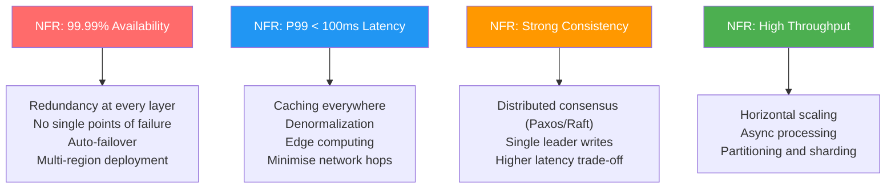
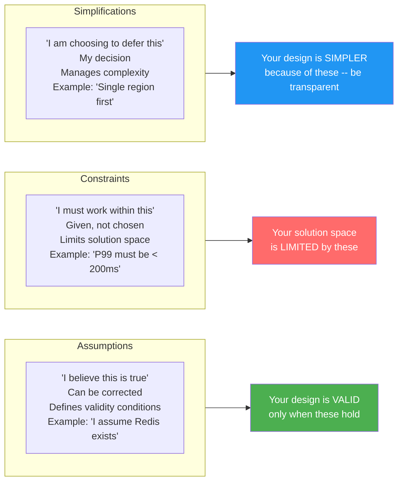
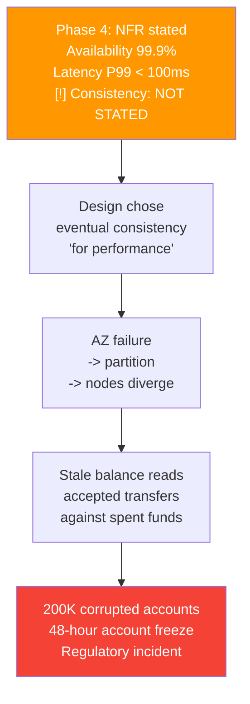

# Chapter 18: Phase 4 & Phase 5 -- Non-Functional Requirements, Assumptions, and Constraints

> **Who this is for:** A recent college graduate who can name NFRs like "availability" and "latency" but wants to understand how to quantify them, trade them off against each other, state assumptions clearly, and connect all of it to actual architecture decisions the way a Staff engineer does.

---

## Chapter at a Glance

```
+===============================================================================+
|      CHAPTER 18 -- PHASE 4 & 5: NFRs, ASSUMPTIONS & CONSTRAINTS AT A GLANCE    |
+===============================================================================+
|                                                                               |
|  CORE IDEA: NFRs determine architecture MORE than functional requirements.   |
|  Same features + different NFRs = completely different systems.              |
|                                                                               |
|  THE 6 CORE NFRs (Phase 4):                                                  |
|  1. Reliability    -> Does it work correctly? Can we lose data?               |
|  2. Availability   -> Is it there when needed? (99.9% = 8.7h downtime/yr)    |
|  3. Latency        -> How fast? Measure P50/P95/P99 -- never just average      |
|  4. Scalability    -> Can it handle 10x without redesign?                     |
|  5. Consistency    -> Do all users see the same data? When is stale OK?       |
|  6. Security       -> Auth, encryption, compliance -- define trust boundaries  |
|                                                                               |
|  PHASE 5: ASSUMPTIONS vs CONSTRAINTS vs SIMPLIFICATIONS                      |
|  Assumption  -> "I believe this is true" (can be corrected)                   |
|  Constraint  -> "I must work within this" (given, not chosen)                 |
|  Simplification -> "I am choosing to defer this" (my decision)               |
|                                                                               |
|  NFR TRADE-OFF RULE: You cannot maximise all NFRs. Name what you sacrifice.  |
|  CAP THEOREM: During a partition, choose consistency OR availability.        |
|                                                                               |
|  L5 vs L6 IN ONE LINE:                                                        |
|  L5: "It should be fast and reliable."                                       |
|  L6: "P99 < 200ms, 99.9% availability, eventual consistency for feeds --      |
|       and here is the trade-off I made between each one."                    |
|                                                                               |
+===============================================================================+
```

---

## Quick Visual: L5 vs L6 -- Phase 4 & 5 Thinking

| Dimension | L5 (Senior) | L6 (Staff) |
|-----------|-------------|------------|
| **Asking about NFRs** | Doesn't ask, assumes | "What availability? What latency budget? Strong or eventual?" |
| **Quantification** | "It should be fast" | "P99 latency under 200ms for API responses" |
| **Trade-offs** | "Highly available AND consistent AND fast" | "Prioritising availability over consistency because reads can be stale by 5 seconds" |
| **Failure behaviour** | Designs for the happy path | "When availability drops, we disable personalization first, preserve core functionality" |
| **Assumptions** | Implicit and unstated | "I'm assuming Redis exists. If not, I'd adjust the caching layer." |
| **Constraints** | Accepts all as fixed | "Is 99.99% firm, or could we discuss 99.9%? The difference is 5-10x in infrastructure cost." |
| **Simplifications** | Doesn't acknowledge them | "I'm simplifying to single region. Multi-region is an extension I can design if needed." |
| **NFRs -> Architecture** | Lists NFRs, then designs without connecting them | "Because we need 99.99% availability, here are the specific design elements that achieve it" |

---

## Visual Overview: How NFRs Force Architecture Choices



---

## Visual Overview: Assumptions vs Constraints vs Simplifications



---

## 1. Learning Goal

By the end of this chapter you will be able to:

- Name and quantify the 6 core NFRs with specific numbers, not vague adjectives
- Explain how each NFR forces specific architecture choices
- Make trade-offs explicit between conflicting NFRs, with reasoning
- Distinguish assumptions from constraints from simplifications -- and why the difference matters
- Connect every NFR to a design element that achieves it (NFR -> SLI -> SLO)
- Define acceptable failure behaviour for every NFR you state
- Recognise the 8 most common NFR mistakes L5 engineers make

---

## 2. The Motivating Idea

### The Same Features, Two Different Systems

Consider two notification systems. Same features: send, receive, manage preferences.

**System A:**
- 99% availability
- 5-second delivery latency
- Eventual consistency

**System B:**
- 99.99% availability
- 100ms delivery latency
- Strong consistency

These are completely different architectures:

| Aspect | System A | System B |
|--------|----------|----------|
| Redundancy | Basic backup | Multi-region active-active |
| Processing | Async, best-effort | Sync, guaranteed delivery |
| Data stores | Single, eventually consistent | Replicated, strongly consistent |
| Infrastructure cost | $ | $$$$ |
| Engineering complexity | Moderate | Very high |

**The lesson:** Non-functional requirements determine architecture more than functional requirements do. The *what* (send and receive notifications) was identical. The *how well* (NFRs) made the systems completely different.

If you do not establish NFRs before designing, you may build System A when you needed System B -- or worse, build System B when System A was perfectly fine, paying 4x the cost for no user benefit.

---

## 3. Core Concepts

### Section 3.1: Reliability -- "Does It Work Correctly?"

Reliability means the system produces correct results and does not lose data.

**Key questions:**
- Can the system lose data? Under what circumstances?
- Can it produce incorrect results? How is this prevented?
- What is the impact of data loss or corruption?

**Three sub-dimensions:**
- **Durability**: Data written is not lost
- **Correctness**: Operations produce expected results
- **Data integrity**: Data remains consistent and uncorrupted

**Design implications:**
- Write-ahead logging
- Replication before acknowledging writes
- Checksums and validation
- Transaction support for operations that must be atomic

**What it sounds like at L6:**
L5: "The system should be reliable."
L6: "For this payment system, reliability is non-negotiable. We cannot lose a transaction or record an incorrect amount. I will use synchronous replication to at least two nodes before acknowledging any write. Every operation is logged for audit and recovery. The invariant is: sum of debits equals sum of credits. Strong consistency for the ledger is not optional."

---

### Section 3.2: Availability -- "Is It There When Needed?"

Availability is the percentage of time the system is accessible and operational.

**The numbers you must know:**

| Level | Annual downtime | Monthly downtime | Typical use |
|-------|----------------|-----------------|-------------|
| **99%** | 3.65 days | 7.3 hours | Internal tools, dev environments |
| **99.9%** | 8.76 hours | 43.8 minutes | Most user-facing applications |
| **99.99%** | 52.6 minutes | 4.4 minutes | Critical user-facing services |
| **99.999%** | 5.26 minutes | 26 seconds | Core infrastructure, payments |

**The Staff question:** "What availability does this use case actually need? Are we paying for nines we do not need?"

**Design implications for each level:**

| Target | Requires |
|--------|---------|
| 99% | One redundant server, basic health checks |
| 99.9% | Redundancy in each availability zone, automated failover |
| 99.99% | Multi-region, no single points of failure at any layer, rapid recovery (<30s) |
| 99.999% | Active-active multi-region, extensive automation, near-zero RPO |

**Partial availability -- the L6 concept:**

Staff engineers design for partial availability, not just binary up/down. When the personalization service fails, the feed still loads -- just with chronological content. When the payment history service is slow, checkout still works. Partial availability means specifying which features degrade, in what order, before designing the degradation paths.

**What it sounds like at L6:**
L5: "The system should be highly available."
L6: "I'm targeting 99.9% availability -- about 43 minutes of downtime per month. If availability drops below that target, I want non-critical features (analytics, personalization) to degrade first, while core functionality (send/receive) stays up. For the ingestion endpoint specifically, I need 99.99% -- we should never reject incoming notifications."

---

### Section 3.3: Latency -- "How Fast Does It Respond?"

Latency is how quickly the system responds to requests.

**The critical rule: never use average latency.** Average hides the long tail. A system with 50ms average latency might have P99 of 2 seconds -- 5% of users experience 40x worse performance.

**Measure by percentile:**

| Metric | Meaning |
|--------|---------|
| P50 | Median: half of requests are faster than this |
| P95 | 95% of requests are faster than this |
| P99 | 99% of requests are faster than this |
| P99.9 | 99.9% of requests are faster -- the "long tail" |

**Typical targets by operation type:**

| Operation type | Typical P99 target |
|----------------|-------------------|
| Real-time API (user is waiting) | 100-500ms |
| Interactive response (tolerable delay) | 500ms-2s |
| Background processing | Seconds to minutes |
| Batch processing | Minutes to hours |

**Different operations have different requirements:**

L5 mistake: one latency target for the whole system.

L6 approach: "Feed load: P99 < 300ms. Scroll next page: P99 < 200ms. New post appearing in followers' feeds: P95 < 60 seconds. Analytics export: P99 < 5 minutes."

**Design implications:**

| Latency target | Architecture response |
|----------------|----------------------|
| <50ms | CDN + in-memory cache, minimal computation |
| 50-200ms | Caching, denormalization, precomputed results |
| 200-500ms | Caching + async for non-critical paths |
| 500ms-2s | Accept some computation, show loading state |

**What it sounds like at L6:**
L5: "The system should be low latency."
L6: "I'm targeting P99 under 200ms for feed loads -- users wait for this. For notification delivery, P95 under 5 seconds is acceptable -- users don't check immediately if their notification arrived. For analytics, latency is a lesser concern -- minutes is fine. Different SLOs for different operations."

---

### Section 3.4: Scalability -- "Can It Handle More?"

Scalability means the system can handle increased load by adding resources.

**Two types:**
- **Vertical scaling**: Bigger machines (more CPU, more RAM). Simpler, limited ceiling.
- **Horizontal scaling**: More machines. More complex (need stateless services, partitioned storage), unlimited ceiling.

**The key scalability question:** At what point does the current design break? What breaks first?

**Design implications:**

| For horizontal scalability you need... |
|---------------------------------------|
| Stateless application services (any instance can serve any request) |
| Partitioned data stores (split the data across nodes by a key) |
| Auto-scaling infrastructure |
| No global bottlenecks (no single lock, no single queue, no single coordinator) |

**First bottleneck analysis -- the L6 habit:**

Staff engineers anticipate where the system breaks as it grows:

| Scale level | What breaks first? | Mitigation |
|-------------|------------------|------------|
| 10K QPS | Single database node | Read replicas |
| 50K QPS | Database connection pool | Connection pooling, caching |
| 100K QPS | Cache memory | Cache eviction policy, sharding |
| 500K QPS | Network bandwidth | CDN, compression |
| 1M QPS | Single-region limits | Multi-region |

**What it sounds like at L6:**
L5: "We'll scale horizontally."
L6: "At current load, the database handles it. At 5x load, the database becomes the first bottleneck -- I'm sharding by user_id. At 10x load, the ranking service saturates -- I'll add a result cache with 5-minute TTL. I'm designing partition boundaries so each scale inflection point is an operational change, not an architecture rethink."

---

### Section 3.5: Consistency -- "Do All Users See the Same Data?"

Consistency means different users and components see the same data at the same time.

**Consistency levels:**

| Level | Description | Trade-off |
|-------|-------------|-----------|
| **Strong consistency** | All readers see the latest write immediately | Higher latency, lower availability |
| **Eventual consistency** | Readers will eventually see the write, with some delay | Lower latency, higher availability |
| **Causal consistency** | Causally related operations seen in order | Middle ground |
| **Read-your-writes** | You always see your own writes, even if others see stale data | Good compromise for many use cases |

**The CAP theorem reminder:**

In a distributed system experiencing a network partition (nodes cannot communicate), you must choose between:
- **Consistency**: Every read sees the latest write (but some requests fail during partition)
- **Availability**: Every request receives a response (but it might be stale)

You cannot have both during a partition. Staff engineers name which they choose and why.

**Data invariants -- the L6 depth:**

Staff engineers define *data invariants* -- properties that must always hold -- as explicit NFRs.

Examples:
- "Balance never negative" -> forces strong consistency for the account balance
- "Every notification has at most one delivery, or is in retry" -> forces idempotency
- "User preferences are eventually consistent but never lost" -> drives durability + eventual consistency

When you state an invariant, the consistency model and durability requirements follow naturally. Staff engineers say: "I'm designing for the invariant 'debits = credits'; everything else follows from that."

**What it sounds like at L6:**
L5: "The system should be consistent."
L6: "I'm using eventual consistency for the notification read status -- if it takes 5 seconds to propagate, users won't notice. But for user preferences (muting notifications), I need read-your-writes -- if a user mutes something, they should stop seeing notifications from it immediately. Two different consistency models for two different data types."

---

### Section 3.6: Security -- "Is It Protected?"

Security means protecting against unauthorised access and malicious actions.

**Five dimensions:**
- **Authentication**: Who are you? Verify identity.
- **Authorization**: What can you do? Verify permissions.
- **Confidentiality**: Data is protected from unauthorised access.
- **Integrity**: Data is protected from unauthorised modification.
- **Audit**: Record who did what and when.

**Trust boundaries -- the L6 concept:**

Staff engineers map trust boundaries -- places where data crosses from trusted to untrusted domains. Every boundary needs explicit security design:

- User input -> API: Validate and sanitise
- External client -> Internal service: Authenticate every request
- Internal service -> third-party: Rate limit and verify responses
- Service -> database: Principle of least privilege

**Compliance as NFR:**

Compliance requirements (GDPR, HIPAA, PCI-DSS, SOC2) are explicit NFRs, not afterthoughts. Each regulation imposes hard constraints:

| Regulation | Key constraints |
|-----------|----------------|
| **GDPR** | Right to deletion, data portability, retention limits |
| **PCI-DSS** | Encryption at rest, no card data in logs, annual audit |
| **HIPAA** | Audit logs for all PHI access, encryption in transit |
| **SOC2** | Access controls, monitoring, incident response procedures |

**What it sounds like at L6:**
L5: "We'll secure the API with authentication."
L6: "This system handles user notification preferences, which is PII. All data encrypted at rest. All endpoints require authentication. User data accessible only to the owning user -- no cross-user access. Every data access logged for audit. Data must be deletable within 30 days for GDPR compliance. The trust boundary is between the API gateway and the internal services -- I validate all input at that boundary, never inside."

---

### Section 3.7: NFR Trade-offs -- The Systematic Process

You cannot maximise all NFRs simultaneously. Staff engineers trade them off explicitly, with reasoning.

**Common trade-off pairs:**

| Optimising for... | Often sacrifices... |
|---------------------|---------------------|
| Consistency | Availability, latency |
| Availability | Consistency |
| Latency | Consistency, cost |
| Durability | Latency (write acknowledgment is slower) |
| Security | Performance, usability |
| Cost | All of the above |

**The 4-step trade-off process:**

```
Step 1: Identify what is non-negotiable
        "We CANNOT lose transactions" -> durability is fixed
        "Users are waiting at checkout" -> latency must be low

Step 2: Identify what is flexible
        "We'd like 99.99%, but 99.9% might be acceptable"
        "Real-time would be great, but 30 seconds is probably fine"

Step 3: Understand the trade-off cost
        "If we choose eventual consistency, reads can be stale for up to 5 seconds"
        "If we choose strong consistency, write latency increases from 10ms to 100ms"
        "If we target 99.99% instead of 99.9%, infrastructure costs 5-10x"

Step 4: Make an explicit choice with stated reasoning
        "I'm choosing eventual consistency because:
         (1) the use case tolerates 5 seconds of staleness,
         (2) it lets us achieve 99.9% availability,
         (3) it reduces write latency from 100ms to 10ms."
```

**Three worked examples:**

**Example: Notification system**

The conflict: "Deliver immediately" (latency) vs "never lose a notification" (durability) vs "always accept" (availability).

L6 reasoning:
> "Durability is most important -- lost notifications mean missed information. I'll store durably before acknowledging. Availability is second -- I should always accept new notifications. I'll accept a slight latency increase to ensure durability. Latency is third -- I'll target 'within 5 seconds' not 'instant.' This lets me queue and process asynchronously. Specifically: I accept 2-5 second delivery latency in exchange for zero message loss and 99.99% ingestion availability."

**Example: Rate limiter**

The conflict: "Rate limit check must be instant" (latency) vs "limits must be accurate" (consistency) vs "must never block all traffic" (availability).

L6 reasoning:
> "Latency is most critical -- I have <1ms budget. I'll use in-memory counters. Availability is second -- if the rate limiter fails, I fail open (allow requests) rather than block everything. Accuracy is third -- I'll accept eventual consistency. In a distributed setup, I might allow 105 requests when the limit is 100. That is acceptable for protection, not billing. Specifically: approximately correct limits with low latency over perfectly accurate limits with high latency."

**Example: Feed system**

The conflict: "Feed loads instantly" (latency) vs "feed shows latest content" (freshness) vs "feed handles 100M users" (scalability).

L6 reasoning:
> "Latency is most critical -- users expect instant app launch. I'll precompute and cache feeds. Scalability is second -- the architecture must handle the user count. I'll shard and denormalize. Freshness is third -- I'll accept that the feed may be 30-60 seconds stale. Users tolerate this. Specifically: cached, slightly stale feeds that load instantly over always-fresh feeds that require real-time aggregation."

---

### Section 3.8: NFRs Define Acceptable Failure

Every NFR has a failure mode embedded in it. Staff engineers do not just state NFRs -- they define what happens when each one is violated. This is the most common gap between L5 and L6 in Phase 4: L5 engineers define the target; L6 engineers define the *failure path*.

| NFR | What it says | What it implies about failure |
|-----|--------------|-------------------------------|
| 99.9% availability | System up 99.9% of the time | ~43 min/month downtime is acceptable |
| P99 latency < 200ms | 99% of requests under 200ms | 1% of requests *can* be slower |
| Eventual consistency | Data converges eventually | Stale reads *are* acceptable |
| At-least-once delivery | All messages delivered | Duplicates *are* acceptable |

#### The NFR Violation Response Framework

For every NFR, staff engineers define four things at design time -- not during the incident:

```
+-----------------------------------------------------------------------------+
|              NFR VIOLATION RESPONSE FRAMEWORK                               |
|                                                                             |
|   For each NFR, define BEFORE the incident:                                 |
|                                                                             |
|   +---------------------------------------------------------------------+   |
|   |  1. DETECTION                                                       |   |
|   |     "How do we know the NFR is being violated?"                     |   |
|   |     -> SLI metric, alert threshold, time window                     |   |
|   +---------------------------------------------------------------------+   |
|   +---------------------------------------------------------------------+   |
|   |  2. GRACEFUL DEGRADATION                                            |   |
|   |     "What is the degraded behaviour?"                               |   |
|   |     -> Reduced functionality, cached data, shed load                 |   |
|   +---------------------------------------------------------------------+   |
|   +---------------------------------------------------------------------+   |
|   |  3. RECOVERY                                                        |   |
|   |     "How do we return to normal?"                                   |   |
|   |     -> Auto-recovery, manual intervention, gradual ramp-up          |   |
|   +---------------------------------------------------------------------+   |
|   +---------------------------------------------------------------------+   |
|   |  4. COMMUNICATION                                                   |   |
|   |     "Who needs to know and when?"                                   |   |
|   |     -> On-call alerts, status page, user messaging                  |   |
|   +---------------------------------------------------------------------+   |
|                                                                             |
+-----------------------------------------------------------------------------+
```

**Why design this at design time, not during the incident?**

During an incident, engineers are under pressure, tired, and working with incomplete information. The 4-step response must be decided *before* the pressure hits. If you haven't answered "what degrades first?" at design time, you answer it at 3am in an incident channel -- and you answer it inconsistently every time.

#### Example: Latency NFR Violation Response

**NFR:** P99 latency < 200ms

| Step | Response | Specific action |
|------|----------|----------------|
| **Detection** | Latency metrics breach threshold for 5+ consecutive minutes | Alert fires when P99 > 300ms sustained; not a spike |
| **Degradation** | Disable personalisation, serve cached generic content | Feature flag: `PERSONALISATION_ENABLED = false` |
| **Recovery** | Monitor latency; re-enable personalisation when P99 < 150ms for 10 minutes | Gradual re-enable -- watch for re-spike |
| **Communication** | Page on-call at alert; update status page if >15 minutes; consider proactive user message if >30 minutes | Status page entry: "Personalised feed temporarily unavailable" |

#### Degradation as a First-Class NFR

Staff engineers write degradation behaviour as an explicit requirement, not an afterthought.

**Format:** *"When [NFR] is violated, the system [degraded behaviour] until [recovery condition]."*

| NFR violated | Degradation requirement | What is preserved |
|--------------|------------------------|-------------------|
| Availability < 99.9% | Non-critical features (recommendations, analytics) disabled | Core functionality (read/write, auth) preserved |
| Latency P99 > 500ms | Personalisation disabled; return cached results | Feed still loads, just not personalised |
| Consistency delayed > 30s | Show "data may be delayed" indicator | Data still served; staleness visible to user |
| Storage > 90% capacity | Oldest data archived; new writes throttled for free-tier users | Paid users unaffected |
| Queue backlog > 10K | Shed lowest-priority notifications (marketing); preserve transactional | Transactional messages (password reset, order confirm) always delivered |

**L5 vs L6 failure-aware NFR articulation:**

> **L5:** "We need 99.9% availability."
> *(Defines the target only. Does not address what happens when it is violated.)*
>
> **L6:** "We're targeting 99.9% availability -- that is 43 minutes of allowed downtime per month. When availability drops below 99.9%:
>
> - **Detection:** Availability SLI alert fires when error rate > 0.5% for 5 minutes (SLO burn rate alert, not just a spike)
> - **Degradation:** Recommendations and analytics features are disabled first. Core message send/receive is the last thing to degrade. Users see 'some features temporarily unavailable' rather than an error page.
> - **Recovery:** Automatic if the cause was traffic spike (auto-scale kicks in). Manual on-call if a service is down. Re-enable features gradually once error rate is back below 0.1% for 10 minutes.
> - **Communication:** On-call paged at first detection. Status page updated if impact lasts > 15 minutes. Support team notified if external-facing.
>
> I've designed the degradation order deliberately: personalisation is the highest-cost, least-critical component -- it's the right first shed. Message delivery is core product value -- it's the last to go."

#### Blast Radius and Partial Failure -- Staff-Level Depth

Staff engineers define not just *what* fails -- but *how far* failure propagates. Most production incidents are partial failures, not total outages. Blast radius thinking shapes NFR boundaries and degradation design.

**Blast radius** = the set of users, services, or data affected when a component fails.

```
+-----------------------------------------------------------------------------+
|                         BLAST RADIUS VISUALISATION                          |
|                                                                             |
|   Component fails -> Who and what is affected?                               |
|                                                                             |
|   +---------------------------------------------------------------------+   |
|   | NARROW blast radius (good):                                         |   |
|   |   Cache shard fails -> ~5% of users affected (hash-ring shard)      |   |
|   |   Ranking service fails -> 100% users affected but degraded,        |   |
|   |                           not down (fallback: chronological feed)  |   |
|   +---------------------------------------------------------------------+   |
|                                                                             |
|   +---------------------------------------------------------------------+   |
|   | WIDE blast radius (avoid):                                          |   |
|   |   Shared auth service fails -> 100% of users cannot log in         |   |
|   |   Single-region DB fails -> entire product is down                 |   |
|   |   Shared rate limiter with no fail-open -> all users blocked       |   |
|   +---------------------------------------------------------------------+   |
|                                                                             |
|   STAFF QUESTION: "When X fails, what is the acceptable blast radius?"     |
|                                                                             |
+-----------------------------------------------------------------------------+
```

| Design choice | Blast radius if it fails | NFR implication |
|---------------|--------------------------|----------------|
| Single-region deployment | 100% of users during region outage | Availability NFR must account for planned maintenance windows |
| Sharded by user_id | ~1/N of users (one shard) | Isolation; one user group affected, not all |
| Multi-region active-active | Single region; other regions absorb traffic | Latency may increase for some users; availability preserved |
| Shared rate limiter (no fallback) | All users blocked if limiter crashes | Must fail-open: if rate limiter unavailable, allow traffic through |
| Ranking service (with fallback) | 0% total outage; 100% degraded quality | Degradation NFR: chronological feed is the fallback |

**Partial failure as an explicit NFR statement:**

> "If the personalisation service is unavailable, we serve cached feeds for active users and chronological feeds for others. Core feed load succeeds for 100% of users. Quality degrades, not availability."

> "If one database shard is unavailable, ~5% of users cannot load their data. We return a 503 with retry-after for affected users; unaffected users are not impacted. This is acceptable under our NFR: per-user isolation with <10% blast radius for single-shard failure."

**Trade-off:** Designing for partial failure adds complexity -- fallback paths, circuit breakers, per-feature feature flags. The alternative (all-or-nothing failure mode) routinely violates availability NFRs because total failures happen more often than zero failures. Staff engineers accept the complexity for critical paths and document it in Phase 5.

#### Real Incident: NFR Without Violation Response -- A 3-Hour Outage

A notification delivery team had a clear NFR: delivery P95 < 5 seconds, 99.9% availability. What they did not define: what happens when those NFRs are violated.

A scheduled config change set the queue consumer count to 100 instead of 1,000 -- a typo that passed numeric validation. Within 30 minutes, queue depth grew from 10K to 2 million messages. Delivery P95 breached 5 seconds, then 30 seconds, then 5 minutes. 15% of users got delayed notifications. 2% got no delivery for hours.

**The engineers had no pre-designed degradation response.** During the incident:
- They spent 45 minutes finding the root cause (queue depth was not an SLI -- they found the problem by reading logs)
- They debated whether to roll back the config or just add more consumers
- Recovery took 3 hours because queue drain required careful rate management

**What a staff-level response would have looked like:**

| Step | Should have existed | What they had |
|------|--------------------|-----------| 
| **Detection** | Queue depth SLI + alert at 50K backlog | Only latency alert -- triggered 45 minutes late |
| **Degradation** | Shed marketing notifications; preserve transactional | No priority classification -- all messages treated equally |
| **Recovery** | Config rollback procedure + automated queue drain logic | Manual, ad-hoc -- engineers improvised for 3 hours |
| **Communication** | Auto-alert support + status page update on P95 breach | Support team found out from user complaints |

**After the incident**, the team defined: queue depth as a primary SLI, notification priority tiers (transactional vs marketing), config change dry-run and canary, and automatic latency-based circuit breaker: if delivery P95 > 30 seconds for 5 minutes -> trigger rollback and page on-call.

**Staff lesson:** The NFR "P95 < 5 seconds" was correct. The failure was having no designed response for when that NFR was violated. The 3-hour outage was not a technical failure -- it was a design omission. Define your NFR violation response in Phase 4, not in the post-mortem.

---

### Section 3.9: Operational NFRs -- The Layer L5 Engineers Miss

Operational NFRs define how the system is *run*, not just how it performs. Staff engineers treat these as first-class. An L5 engineer who lists Availability, Latency, and Consistency but skips operational NFRs is describing a system that works in theory but breaks down in practice. At 99.9% availability, you will have a production incident every 43 minutes per month. The question is how fast you detect and fix it -- and that is entirely determined by your operational NFRs.

| Category | What it covers | Key question | Failure if missing |
|----------|----------------|-------------|-------------------|
| **Observability** | Ability to understand system state | Can we see what is happening? | Incident lasts 4 hours instead of 15 minutes because nobody knows which service is failing |
| **Debuggability** | Ability to diagnose issues quickly | Can we find root cause within 30 minutes? | Engineers spend hours reading logs with no correlation ID, cannot reproduce |
| **Deployability** | Ability to ship changes safely | Can we deploy with confidence and rollback in <5 minutes? | Bad deploy takes 45 minutes to roll back; brief degradation becomes a full outage |
| **Operability** | Ability to adjust behaviour without code changes | Can we tune rate limits, flip feature flags, disable components? | Traffic spike requires a code deploy to raise rate limits -- adds 20 minutes in the middle of an incident |
| **Human-error resilience** | Surviving misconfiguration and bad deploys | Can we recover from operator mistakes quickly? | Ops engineer deletes wrong config key; no dry-run mode; service down for 90 minutes |

#### Human Error as an Operational NFR

Most production incidents are triggered by human action -- config mistakes, bad deploys, incorrect runbook execution. Staff engineers treat "survive operator error" as a first-class NFR.

**Design implications:**
- **Safeguards:** Require confirmation for destructive operations; dry-run mode for config changes
- **Blast radius control:** Feature flags, canary deploys, and gradual rollout limit the impact of a bad change
- **Recoverability:** Fast rollback, immutable config history, documented rollback procedures
- **On-call burden reduction:** Simple runbooks reduce fatigue-induced errors; automation reduces manual steps

> "We assume operators will occasionally misconfigure rate limits or deploy bad code. Our NFR: any config change can be rolled back in under 5 minutes. All deploys use canary with automatic rollback on error spike. This keeps the operational burden sustainable even when humans make mistakes."

#### Observability Requirements -- Full Detail

| Requirement | Why It Matters | Concrete Design Implication |
|-------------|----------------|----------------------------|
| Real-time latency metrics at every service boundary | SLO tracking and breach detection | Emit P50/P95/P99 histograms at every HTTP/RPC hop, not just at the API gateway |
| Error rates by type and endpoint | Separate client bugs from server bugs from dependency failures | Structured error classification: 4xx (client), 5xx (server), timeout (dependency) |
| Queue depths and processing rates | Detect backlog before it causes SLO breach | Instrument every queue: depth + lag + consumer throughput |
| Infrastructure health metrics | Correlate performance with infra events | CPU, memory, disk I/O, network -- linked to service metrics timeline |
| Distributed tracing | Cross-service debugging without manual log correlation | Every request has a trace ID propagated via HTTP header; stored in Jaeger/Zipkin/X-Ray |

**What "observability done right" feels like in an incident:**

> Engineer gets paged at 2am. Within 90 seconds they open a dashboard showing: error rate spiked at 2:14am on the checkout service, specifically 503s from the payments dependency. Distributed trace for a failing request shows: checkout service called payments service, payments service called the bank API, bank API returned a timeout after 15 seconds. The queue depth metric shows 42,000 messages backed up starting at 2:13am. Root cause identified: bank API rate limit. Fix: circuit breaker. Time to root cause: 4 minutes.

Without observability, that same incident would have taken 90 minutes.

#### Debuggability Requirements -- Full Detail

| Requirement | Why It Matters | Concrete Design Implication |
|-------------|----------------|----------------------------|
| Distributed tracing | Trace a single user request across 8 microservices | Propagate trace-ID and span-ID as HTTP headers; store in tracing system for 7 days |
| Correlation IDs on all log entries | Aggregate all logs for one request | Generate request-ID at API gateway; attach to every log entry downstream |
| Structured, searchable logs | Investigation speed -- grep is not enough | JSON format with consistent schema: timestamp, service, level, request_id, user_id, message |
| Request and response logging (sanitised) | Reproduce bugs without asking users | Log request body for error responses (strip PII: mask card numbers, email addresses) |
| Ability to replay specific events | Reproduce intermittent bugs | Persistent event log (Kafka) with replay capability -- reproduce exact sequence in staging |

#### Deployability Requirements -- Full Detail

| Requirement | Why It Matters | Concrete Design Implication |
|-------------|----------------|----------------------------|
| Zero-downtime deployments | Do not violate availability SLO on every deploy | Rolling deploy with health check gate: new instance must pass health check before old is terminated |
| Canary deployment support | Catch bad deploys before they affect all traffic | Traffic splitting: 5% -> new version -> watch error rate -> promote to 100% or rollback |
| Fast rollback (<5 minutes) | Limit blast radius of bad deploy | Stateless services + backward-compatible database changes enable instant version rollback |
| Feature flags for new functionality | Decouple deploy from release | Flag infrastructure (LaunchDarkly or internal): deploy code dark, enable flag gradually |
| Deployment health verification | Know if the deploy succeeded | Automated smoke test after each deploy: call critical endpoints, verify correct response |

**The 5-minute rollback rule:**

> "Every service must be rollback-able in under 5 minutes. That means: stateless application tier (no local state to migrate), database migrations are backward-compatible (old code must work with new schema), and the deployment pipeline has a one-command rollback. If rollback takes 30 minutes, a bad deploy turns a 5-minute discovery into a 35-minute incident."

#### Operability Requirements -- Full Detail

| Requirement | Why It Matters | Concrete Design Implication |
|-------------|----------------|----------------------------|
| Runtime configuration changes without redeployment | Adjust rate limits, toggle features during incidents | Config service (e.g., AWS Parameter Store) + hot-reload in application every 60 seconds |
| Circuit breakers per downstream service | Fail fast when dependency is slow; prevent cascading failure | Per-service circuit breaker with: failure threshold 50%, probe interval 10s, half-open test |
| Dynamic rate limit adjustment | Shed load during traffic spikes without downtime | Rate limit config stored in Redis; application reads every request; ops can update in real time |
| Graceful shutdown with connection draining | Do not drop in-flight requests on scale-in | SIGTERM handler: stop accepting new requests, drain existing connections, exit after 30s |
| Admin APIs for operational control | Take action during incidents without code changes | `/admin/circuit-breaker/{service}/open`, `/admin/rate-limit/{endpoint}/set/{rps}`, `/admin/feature/{flag}/disable` |

**What it sounds like at L6:**

> **L5:** "We'll add monitoring later."
>
> **L6:** "Beyond performance NFRs, I have five operational requirements.
>
> **Observability:** Latency metrics at P50/P95/P99 at every service boundary, error rates by type, queue depths. I need to see a system anomaly within 30 seconds, not 15 minutes.
>
> **Debuggability:** Distributed tracing with correlation IDs across all services. Any production request must be fully traceable within 2 minutes without SSH access to boxes.
>
> **Deployability:** Zero-downtime rolling deploys with canary support. Rollback in under 5 minutes. Feature flags for all new functionality so deploy and release are independent decisions.
>
> **Operability:** Circuit breakers between services, runtime-adjustable rate limits via config service, graceful shutdown with connection draining.
>
> **Human-error resilience:** Dry-run mode for config changes, automatic rollback on error spike in canary, immutable deployment history.
>
> These aren't nice-to-haves. At this scale, without observability we cannot diagnose incidents quickly enough to meet our availability SLO. Without deployability guardrails, every deploy is a potential availability event. These are NFRs, not aspirational features."

---

### Section 3.10: Phase 5 -- Assumptions, Constraints, and Simplifications

Phase 5 is where you protect your design from misunderstanding and make your thinking transparent.

#### Assumptions: "Things I believe are true"

Assumptions are conditions under which your design is valid. If an assumption is wrong, the design may need revision.

**Why state them explicitly:**
- The interviewer may have different assumptions. If you assume 100K users and they assume 100M, your design is wrong -- and you will not know until they say so.
- Explicit assumptions invite correction before you spend 30 minutes designing for the wrong context.

**Four types of assumptions:**

| Type | Examples |
|------|---------|
| **Infrastructure** | "We have cloud infrastructure with auto-scaling" / "We have a message queue like Kafka" |
| **Organisational** | "We have a team that can operate distributed systems" / "Existing auth infrastructure" |
| **Behavioural** | "Traffic follows a typical daily pattern with 3x peak" / "Power-law content distribution" |
| **Environmental** | "Network latency within a region is <5ms" / "Third-party services have 99.9% availability" |

**How to state them:**
> "Let me state my key assumptions:
> 1. We're on standard cloud infrastructure
> 2. Authentication is handled by an existing system -- I'm not designing it
> 3. We have push notification infrastructure via existing mobile push providers
> 4. Traffic follows typical consumer patterns with 3x evening peak
>
> Do any of these need correction before I continue?"

#### Constraints: "Limits I must work within"

Constraints are given by context -- not chosen. They limit your solution space.

Examples:
- "Latency must be under 200ms P99" -- from product requirements
- "We must use the existing legacy database" -- from organisational reality
- "Budget limits us to $50K/month infrastructure" -- from finance
- "Must integrate with the existing user service" -- from technical context

**The Staff move on constraints:** Probe whether they are actually fixed.

> "You mentioned 99.99% availability. Is that firm, or could we discuss 99.9%? The difference is 5-10x in infrastructure complexity. For this product, I want to make sure the extra cost is justified."

Sometimes what appears to be a constraint is actually a preference -- and questioning it shows judgment.

#### Simplifications: "Things I am choosing to defer"

Simplifications are deliberate reductions in scope that you make to keep the design tractable.

The critical rule: **always name your simplifications**. If you simplify without saying so, the interviewer cannot tell whether you are making a deliberate choice or missing something.

**Without stating the simplification:**
> "I'll use a simple single-region database." (Interviewer wonders: do they know about sharding? Do they not realise multi-region exists?)

**With stating the simplification:**
> "I'm simplifying to single region for today's design. For this scale, it's sufficient. If scale increases 10x, we'd shard by user_id -- the schema I'm designing supports that transition without a migration." (Interviewer sees: they know, they chose, they can defend it.)

**Simplification examples:**

| Simplification | Why it's reasonable |
|----------------|---------------------|
| "Single region first" | Captures the core complexity; multi-region is an extension |
| "Simple ranking heuristic" | ML-based ranking is a separate, deep topic |
| "No ads" | Ad selection is a separate team's domain |
| "Text-only content" | Media delivery is a solved problem (CDN) |
| "No admin interface" | Not the interesting part for this design conversation |

---

### Section 3.11: Phase 5 as Protection for Your Design

Phase 5 does more than list assumptions. It actively protects your design.

**Protection 1: Prevents misalignment early**

Without Phase 5:
- You design for 30 minutes
- Interviewer: "But this needs to work globally, not just US"
- Your design is invalidated

With Phase 5:
- You say: "I'm assuming US-only initially"
- Interviewer: "Actually, this needs to be global"
- You adjust before designing -- 2 minutes instead of 30

**Protection 2: Enables valid simplification**

Phase 5 lets you simplify without appearing ignorant. Naming a simplification shows you know the complexity but chose not to design it today. This is L6 judgment.

**Protection 3: Opens trade-off conversations**

> "I'm assuming eventual consistency is acceptable. If we need strong consistency, the design changes significantly -- we'd need distributed consensus, which impacts latency. Is eventual consistency OK, or should I explore the strongly consistent path?"

---

### Section 3.12: How NFRs Connect to SLIs and SLOs

Staff engineers do not just state NFRs -- they connect each one to how the design achieves it, how it is measured, and what happens if it is not met.

| NFR | Design element that achieves it | SLI (what we measure) | SLO (the target) | Fallback if violated |
|-----|--------------------------------|----------------------|-----------------|---------------------|
| 99.9% availability | Redundant services in 2 AZs | Successful requests / total requests | > 99.9% over 30 days | Shed non-critical features |
| P99 delivery < 5s | Async queue + parallel workers | Time from submit to delivery | < 5s for 99% | Show in-app even if push fails |
| Zero notification loss | Persistent queue, ack after store | Notifications submitted - notifications delivered | > 99.9999% | Dead letter queue + manual replay |
| Eventual consistency (prefs) | Read-through cache, 5s TTL | Staleness at cache hits | < 5s for 99% | Use defaults if cache miss |

**What it sounds like at L6:**
L5: "The system will be highly available."
L6: "I'm targeting 99.9% availability. Here's how I achieve and verify it: stateless application tier behind a load balancer (no SPOF), database with synchronous replica (failover in < 30 seconds), health checks every 10 seconds. SLI: successful responses / total requests at the load balancer. SLO: > 99.9% over a 30-day rolling window. If we approach SLO breach -- say we hit 99.5% -- I shed non-critical features before the SLO is broken. On-call is alerted at 99.7% as early warning."

---

### Section 3.13: NFR Evolution at Scale

NFRs are not static. They tighten as systems grow -- and the biggest mistake is designing V1 NFRs as if they are permanent. Staff engineers anticipate which NFRs will tighten at 10x scale and design V1 to not block V2 upgrades.

```
+-----------------------------------------------------------------------------+
|                    NFR EVOLUTION ACROSS SCALE                               |
|                                                                             |
|   V1 (Launch)              V2 (Growth)              V3 (Scale)              |
|   -----------------------------------------------------------------------   |
|                                                                             |
|   AVAILABILITY                                                              |
|   "Best effort"      ->    "99.9%"           ->    "99.99%"                   |
|   Single server           Redundancy              Multi-region              |
|                                                                             |
|   LATENCY                                                                   |
|   "Acceptable"       ->    "P99 < 500ms"     ->    "P99 < 200ms"              |
|   Optimize later          Cache critical path     Edge deployment           |
|                                                                             |
|   CONSISTENCY                                                               |
|   "Strong OK"        ->    "Eventual OK"     ->    "Per-operation choice"     |
|   Single DB               Replicas               Hybrid per use case        |
|                                                                             |
|   OBSERVABILITY                                                             |
|   "Logs exist"       ->    "Metrics + Logs"  ->    "Full tracing"             |
|   Basic logging           Dashboards             Distributed tracing        |
|                                                                             |
|   KEY INSIGHT: Design V1 to not block V2/V3 NFR upgrades                    |
|                                                                             |
+-----------------------------------------------------------------------------+
```

#### NFRs That Intensify at Scale -- Concrete Numbers

| NFR | V1 (10K users) | V2 (1M users) | V3 (100M users) | What changes architecturally |
|-----|----------------|---------------|-----------------|------------------------------|
| **Availability** | 99% (3.65 days/year downtime acceptable) | 99.9% (8.7 hours/year) | 99.99% (52 min/year) | V1: single AZ. V2: multi-AZ. V3: multi-region active-passive |
| **Latency** | 1s acceptable (users patient in early stage) | P99 < 500ms | P99 < 200ms | V1: no cache. V2: cache hot path. V3: edge cache, CDN |
| **Durability** | Nightly backup acceptable | Continuous backup, 1-hour RPO | Zero data loss, near-zero RPO | V1: daily S3 snapshot. V2: WAL streaming. V3: synchronous multi-region replication |
| **Security** | Basic auth, HTTPS | SOC2 compliance audit, MFA | Full audit trail, encryption at rest+transit | V1: auth middleware. V2: audit logging. V3: key rotation, HSM |
| **Operability** | Manual ops acceptable | Automation for common tasks | Self-healing, auto-remediation | V1: runbooks. V2: CI/CD, IaC. V3: auto-scaling, circuit breakers |
| **Scalability** | Single instance | Horizontal scaling | Auto-scaling with 10x headroom | V1: vertical scale. V2: stateless + load balancer. V3: sharding, partitioning |

#### Designing for NFR Evolution -- The L6 Approach

**L5 approach:** "We'll improve NFRs as we grow."

This sounds reasonable but produces systems that require major rearchitecture at each scale jump. Common V1->V2 failure modes:
- Added database replicas but schema has no partition key -- V3 sharding requires a migration that takes 3 months
- V1 session state stored in application memory -- adding redundancy requires redesigning session management
- V1 metrics not emitted -- reaching 99.9% SLO without metrics is flying blind

**L6 approach:** "I'm targeting 99.9% availability for V1. But I'm designing V1 so that the V2 and V3 upgrades are operational changes, not architecture rethinks."

> "For V1, two availability zones give me 99.9% without multi-region complexity. But I'm making these forward-compatible choices today:
>
> **Stateless application tier** -- no local session state, so adding a third AZ or second region requires zero coordination changes. I just spin up more instances.
>
> **Partition key chosen for future sharding** -- I'm partitioning by user_id now, even though a single database handles V1 load. When V3 requires sharding, the query patterns don't change -- we just add shards.
>
> **Health check endpoints from day one** -- not just because the load balancer needs them now, but because multi-region failover automation depends on them in V3.
>
> **Metrics emitted at every service boundary** -- not because I have SLO dashboards today, but because reaching 99.9% SLO without metrics is guesswork, and reaching 99.99% without distributed tracing is impossible.
>
> V2 availability upgrade (add third AZ, add replicas): operational change, one week.
> V3 availability upgrade (multi-region active-passive): 2 months, not 12.
>
> That is the difference between forward-compatible design and V1 that becomes technical debt."

#### First Bottleneck Analysis -- Staff-Level Scale Thinking

Staff engineers ask: "At 10x scale, what breaks first?" before they finish designing. Anticipating the first bottleneck prevents emergency redesign in production.

**The three questions to ask at every scale jump:**
1. At 10x load, which component saturates first? (Database connections? Cache memory? Network bandwidth?)
2. What is the first resource to exhaust? (DB connections? Thread pool? Disk IOPS?)
3. Which NFR degrades first? (Latency spikes first? Or availability drops first? Or consistency weakens?)

**Real example -- News Feed system at progressive scale:**

| Scale | First Bottleneck | Why | Fix |
|-------|-----------------|-----|-----|
| 1M DAU | None -- single database handles it | Read QPS manageable | N/A |
| 10M DAU | Database becomes bottleneck | Read replicas lag, write IOPS saturated | Add read replicas, caching layer |
| 100M DAU | Cache layer becomes bottleneck | Cache hit rate drops as user population outgrows cache capacity | Shard cache by user_id, increase cache size |
| 500M DAU | Ranking service becomes bottleneck | ML inference can't keep up with feed load volume | Pre-compute ranking scores offline, serve stale-but-fast scores |
| 1B DAU | Fan-out write amplification | Celebrity posts create billions of writes | Hybrid push/pull -- pull celebrity content at read time |

**Staff engineer narration in an interview:**

> "At 50M DAU, my first bottleneck is the database at ~25K reads/second. I address that with read replicas and a cache layer. But I'm already thinking about the next bottleneck: at 500M DAU, my ranking service will saturate first because ML inference is expensive per request. I'm designing the ranking interface today so I can swap in pre-computed scores later -- the feed service calls `rank_service.score(user_id, content_ids)`, and the implementation can be either real-time inference or a pre-computed lookup without changing the caller. That is the difference between designing for today's scale and designing for the scale trajectory."

**Trade-off:** Designing for the first bottleneck adds some upfront complexity -- metrics, circuit breakers, interface abstractions. The alternative is discovering the bottleneck in production at 3am when 50M users are affected. The upfront cost is days; the reactive cost is months.

---

## 4. Mental Models

### Mental Model 1: NFRs Are Architecture Forcing Functions

Every NFR forces specific architecture decisions. The path from NFR to architecture is not opinion -- it is physics.

*"I need <100ms P99 latency. That means caching is not optional -- it is required. I need 99.99% availability. That means no single points of failure -- required, not optional."*

### Mental Model 2: The Trade-off Frontier

You cannot be in two places at once. Improving consistency reduces availability. Improving latency increases cost. Every design lives on a trade-off frontier. Moving outward on all dimensions simultaneously requires more resources.

*"State the trade-off before committing to the design. Name what you are sacrificing and why that sacrifice is acceptable for this use case."*

### Mental Model 3: Assumptions Define the Validity Envelope

Your design is correct -- but only when your assumptions hold. If a key assumption is wrong, the design may be wrong too.

*"State your assumptions explicitly. You want to be corrected before you design 30 minutes in the wrong direction."*

### Mental Model 4: The Cost of Each Nine

Each additional nine of availability roughly doubles infrastructure cost. The question is never "is more availability better?" -- it always is. The question is "does this use case justify the cost?"

*"Internal analytics dashboard: 99% is fine. Consumer-facing checkout: 99.9% minimum. Payment processing: 99.99%. Authentication: 99.999%. Each level has a price. Know the price and ask if it is worth it."*

### Mental Model 5: NFRs Define Failure Behaviour

Every NFR implies an acceptable failure mode. "99.9% availability" means "43 minutes of downtime per month is acceptable." Staff engineers define the failure mode explicitly, then design the degradation path.

*"It is not enough to say 'highly available.' Say: 'When availability drops, here is what degrades, in what order, and here is what is preserved.' That is a complete NFR."*

---

## Quick Reference Card -- Phase 4 & 5

### NFR Checklist -- What to Establish Before Designing

| NFR | Question to ask | How to quantify |
|-----|-----------------|-----------------|
| **Reliability** | Can we lose data? What is the impact? | "Zero data loss for transactions", "RPO < 1 minute" |
| **Availability** | What uptime is required? | "99.9%" (8.7h/yr), "99.99%" (52min/yr) |
| **Latency** | How fast must it respond? Per operation type? | "P99 < 200ms for API", "P95 < 5s for delivery" |
| **Scalability** | What growth is expected? When does the design break? | "Handle 10x in 2 years; first bottleneck is the DB at 50K QPS" |
| **Consistency** | Can users see stale data? For how long? | "Eventual (5s stale OK for feeds)", "Strong required for payments" |
| **Security** | What data is sensitive? Compliance? | "GDPR applies -- data deletable in 30 days", "PCI-DSS for card data" |

---

### Phase 5 Statement Template

Use this structure at the end of Phase 5:

> "Before I start designing, let me state my assumptions, constraints, and simplifications.
>
> **Assumptions** (things I believe are true -- correct me if wrong):
> 1. We have cloud infrastructure with auto-scaling
> 2. Authentication is handled by an existing service
> 3. Standard monitoring and alerting infrastructure exists
>
> **Constraints** (limits I must work within):
> 1. The system must handle X QPS
> 2. Latency must be under Y ms P99
> 3. We must integrate with the existing Z service
>
> **Simplifications** (things I am choosing to defer -- I can design them if needed):
> 1. Single region first; multi-region is an extension
> 2. Simple ranking heuristic; ML-based ranking is a separate system
> 3. Not designing the admin interface today
>
> Does this framing match what you had in mind?"

---

### NFR -> Architecture Quick Reference

| NFR | Architecture elements required |
|-----|-------------------------------|
| 99.99% availability | Multi-region, auto-failover, no SPOF at any layer, health checks, circuit breakers |
| P99 < 100ms | CDN, in-memory cache, denormalized reads, minimal network hops |
| Strong consistency | Distributed consensus (Paxos/Raft), single-writer, higher latency accepted |
| High throughput | Horizontal scaling, async processing, sharding by partition key |
| Zero data loss | Synchronous replication before ack, write-ahead log, checksums |
| Operational NFRs | Distributed tracing, metrics at every boundary, structured logs, feature flags, canary deploys |

---

### Common Mistakes -- Weak vs Strong

| Signal | [X] Weak (L5 pattern) | [Y] Strong (L6 pattern) | [ ] |
|--------|---------------------|----------------------|---|
| **NFRs asked** | Did not ask -- assumed | "What availability? What latency budget?" | [ ] |
| **Quantification** | "It should be fast" | "P99 < 200ms for API responses" | [ ] |
| **Trade-offs** | "Highly available AND consistent AND fast" | "Prioritising availability over consistency because..." | [ ] |
| **Failure behaviour** | Only designs the happy path | "When availability drops, X degrades first, Y is preserved" | [ ] |
| **Assumptions** | Implicit and never stated | "I'm assuming we have Redis. Correct me if not." | [ ] |
| **Constraints** | All accepted as fixed | "Is 99.99% firm, or could we discuss 99.9%?" | [ ] |
| **Simplifications** | Simplifies without saying so | "I'm simplifying to single region -- I can design multi-region if needed" | [ ] |
| **NFRs -> Architecture** | Lists NFRs, designs separately | "Because we need 99.99% availability, I'm using multi-region with these specific elements..." | [ ] |

---

### Self-Check: Did I Cover Phase 4 & 5?

| Signal | Weak | Strong | [ ] |
|--------|------|--------|---|
| NFRs asked before designing | Didn't ask | "What availability? What latency?" | [ ] |
| Quantified | "Should be fast" | "P99 < 200ms" | [ ] |
| Trade-offs named | All maximised | "Choosing X over Y because..." | [ ] |
| Failure behaviour defined | Not mentioned | "When NFR violated, we degrade by..." | [ ] |
| Assumptions stated | Implicit | "I assume X, Y, Z -- is that valid?" | [ ] |
| Constraints probed | All accepted | "Is X firm, or negotiable?" | [ ] |
| Simplifications explicit | Silent | "I'm simplifying by..." | [ ] |
| NFRs drive architecture | Disconnected | "Because NFR X, design choice Y" | [ ] |

---

## 5. Real-World Examples

### Example 1: Rate Limiter -- Complete Phase 4 & 5

**Phase 4: Non-Functional Requirements**

**Latency:** < 1ms P99 -- non-negotiable. Rate limit check is on the critical path of every request. Cannot meaningfully slow down the API.

**Availability:** 99.99%. The rate limiter cannot be a single point of failure. If it is unavailable, *fail open* (allow requests) not fail closed (block all traffic). A functioning API with occasional over-limit requests is better than a broken API.

**Consistency:** Eventual consistency is acceptable. We tolerate +/-10% inaccuracy in distributed scenarios. Strong consistency would add latency we cannot afford.

**Durability:** Counter state does *not* need to survive complete system restarts. If we lose counters, limits reset -- acceptable.

**Scalability:** Must handle 1M requests/second. Must scale horizontally with no coordination bottleneck.

---

**Phase 5: Assumptions, Constraints, Simplifications**

**Assumptions:**
1. We have distributed caching infrastructure (Redis or equivalent)
2. Every request includes a client ID we can use for limiting
3. Server clocks are synchronised within 100ms (NTP)
4. Load balancers distribute requests evenly across rate limiter instances

**Constraints:**
1. 1ms P99 latency -- fixed by the API SLA
2. Must integrate with the existing API gateway
3. Must support token bucket for burst handling

**Simplifications:**
1. Single rate limit per client -- not per-endpoint limits
2. Single region -- multi-region rate limiting adds significant complexity
3. Counter state is ephemeral -- designing for recovery, not durability

---

**Trade-off summary:**

| Trade-off | Choice | Rationale |
|-----------|--------|-----------|
| Accuracy vs latency | Latency | On critical path; approximately correct is acceptable |
| Durability vs simplicity | Simplicity | Rate limits are not valuable enough to persist |
| Strong vs eventual consistency | Eventual | Cannot afford distributed consensus latency |

---

### Example 2: Notification System -- Complete Phase 4 & 5

**Phase 4: Non-Functional Requirements**

**Latency:**
- Notification delivery: P95 < 5 seconds for push
- Email/SMS: Within 1 minute (external provider dependent)
- Notification history load: P99 < 200ms

**Availability:**
- Ingestion: 99.99% -- we should *always* accept notifications. Never block senders.
- Delivery: 99.9% -- occasional delivery delay is acceptable
- History: 99.9%

**Reliability:**
- No notification should be lost once accepted
- At-least-once delivery -- duplicates are possible and acceptable
- Deduplication is the receiver's responsibility

**Consistency:**
- Eventual consistency for read status -- fine if it takes 5 seconds to propagate
- Read-your-writes for preference changes -- muting should take effect immediately

**Scalability:**
- 100K notifications/second ingestion
- 500K delivery operations/second (including retries)
- 10TB notification storage (30-day history)

---

**Phase 5: Assumptions, Constraints, Simplifications**

**Assumptions:**
1. Mobile push provider integration exists via existing services
2. Email/SMS provider integrations exist
3. Device tokens and email addresses available from user service
4. Calling services are authenticated -- we trust them

**Constraints:**
1. P95 delivery latency: 5 seconds -- user experience requirement
2. 30-day notification history required by product
3. Must accept notifications from existing Kafka event system

**Simplifications:**
1. No aggregation logic -- noting it as a future capability, not designing today
2. Simple preference model: mute/unmute -- not complex rules
3. Single retry policy for all notification types

---

**Trade-off summary:**

| Trade-off | Choice | Rationale |
|-----------|--------|-----------|
| Exactly-once vs at-least-once | At-least-once | Exactly-once adds complexity; receivers can deduplicate |
| Strong vs eventual (read status) | Eventual | Not critical if read status takes seconds to propagate |
| Storage depth vs cost | 30 days | Product requirement; older history has minimal value |

---

## 5b. Complete NFR Write-Ups -- Three Systems (Staff Reference)

These are the full Phase 4 + Phase 5 write-ups for three canonical systems. Memorise the structure, not the specific numbers. In interviews, you adapt these to the problem at hand.

### Complete Write-Up: Rate Limiter

**Non-Functional Requirements**

*Latency:*
- Rate limit check: < 1ms P99 -- this is on the critical path of every request
- This is non-negotiable. A slow rate limiter slows every API call.

*Availability:*
- 99.99% availability (~=52 min/year downtime)
- The rate limiter cannot be a single point of failure
- Failure mode: fail-open (allow requests through) not fail-closed -- unavailability must not block legitimate traffic

*Consistency:*
- Eventual consistency is acceptable
- We tolerate 5-10% over-limit in distributed scenarios (brief window between nodes)
- Strong consistency would require distributed coordination -- adds 5-20ms, violates the 1ms budget

*Durability:*
- Counter state does NOT need to survive full restarts
- If we lose state, limits reset -- acceptable trade-off for simplicity
- We are not a financial system; an occasional burst is not catastrophic

*Scalability:*
- 1M requests/second throughput
- Must scale horizontally without coordination

**Assumptions**

1. Redis cluster or equivalent distributed cache is available as infrastructure
2. Every inbound request carries a client ID (or IP, or API key) for rate-limit keying
3. Server clocks are NTP-synchronized within 100ms -- acceptable for token bucket sliding windows
4. Load balancers distribute requests across rate-limiter instances

**Constraints**

1. 1ms latency budget -- this is fixed by the upstream API SLA, not negotiable
2. Must integrate with the existing API gateway (not a standalone service)
3. Algorithm must support token bucket semantics for burst handling (product requirement)

**Simplifications**

1. Single limit per client -- not designing per-endpoint limits in v1
2. Single region -- multi-region rate limiting adds coordination complexity; out of scope
3. Ephemeral counters -- counter state is not durable; designing for recovery not persistence

**Trade-Off Summary**

| Trade-Off | Our Choice | Why |
|-----------|-----------|-----|
| Accuracy vs. Latency | Latency | On critical path; approximate is acceptable |
| Durability vs. Simplicity | Simplicity | Rate limits are not valuable enough to persist through restarts |
| Strong vs. Eventual Consistency | Eventual | Distributed consensus latency violates 1ms budget |
| Fail-open vs. Fail-closed | Fail-open | Unavailability must not block legitimate traffic |

---

### Complete Write-Up: News Feed System

**Non-Functional Requirements**

*Latency:*
- Feed load (cold open): < 300ms P99 -- user is waiting with app open
- Feed scroll (next page): < 200ms P99 -- user is actively reading, tolerates slightly more
- Media content: CDN-served, separate SLA, not counted in feed latency
- P50 target: < 80ms (most users should see near-instant load)

*Availability:*
- 99.9% availability (~=43 min/month downtime budget)
- Graceful degradation: if personalisation service fails, show trending/recent content
- Feed must never show a blank page -- always fall back to something

*Freshness:*
- New posts appear in followers' feeds within 60 seconds (for non-celebrity users)
- Celebrity posts: available at read time via pull -- freshness is instant
- Acceptable staleness: up to 30 seconds during normal operation

*Consistency:*
- Eventual consistency for feed content
- Read-your-writes for the posting user (you see your own post immediately)
- Users do NOT need to see the same feed simultaneously -- no cross-user consistency required

*Scalability:*
- 200M DAU, 5 sessions/day = 1B feed loads/day = 12K/sec average, 50K/sec peak
- 100M posts/day fan-out writes
- 7-day feed retention

**Assumptions**

1. Social graph service exists and provides follow relationships (not designed here)
2. Post content is stored and served by a separate content service (not designed here)
3. ML ranking infrastructure exists for personalisation (out of scope)
4. CDN is available for media content delivery
5. Users are globally distributed; regional infrastructure exists

**Constraints**

1. 300ms P99 latency -- fixed by product user experience requirements
2. 200M DAU scale -- this is the design target
3. Must integrate with existing content and user services via standard APIs

**Simplifications**

1. Home feed only -- Explore and Search are separate systems with different requirements
2. Text and image focus -- video streaming optimisation is out of scope
3. No ads -- placeholder positions exist; ad selection is a separate system
4. Single feed algorithm -- A/B testing framework for ranking is deferred

**Trade-Off Summary**

| Trade-Off | Our Choice | Why |
|-----------|-----------|-----|
| Freshness vs. Latency | Latency | Users expect < 300ms load; 60s staleness is acceptable |
| Personalisation vs. Availability | Availability | Fall back to trending if ML ranking fails |
| Push vs. Pull for delivery | Hybrid | Pure push fails for celebrities; pure pull fails for high-follow-count users |
| 7-day vs. unlimited history | 7-day | Cost grows unboundedly with unlimited history; 7 days covers 99% of user scrolling |

---

### Complete Write-Up: Notification System

**Non-Functional Requirements**

*Latency:*
- Push notification delivery: < 5 seconds P95 -- user experience expectation
- Email/SMS: within 1 minute (external provider dependent -- not fully in our control)
- Notification history page load: < 200ms P99
- Ingestion API response: < 50ms (caller is waiting for acknowledgment, not delivery)

*Availability:*
- Ingestion API: 99.99% -- we must always accept notifications (no data loss acceptable)
- Delivery pipeline: 99.9% -- occasional delay acceptable, but no loss
- History read: 99.9%
- Asymmetric: ingestion SLA is higher than delivery SLA -- queuing absorbs the gap

*Reliability:*
- No notification lost once accepted by ingestion API
- At-least-once delivery semantics (duplicates possible, handled by receivers)
- Deduplication is the receiver's responsibility, not ours

*Consistency:*
- Eventual consistency for read status (read/unread)
- Read-your-writes for preference changes (mute/unmute takes effect immediately)

*Scalability:*
- 100K notifications/second ingestion
- 500K delivery operations/second (includes retries -- typically 5x ingestion)
- 10TB notification storage (30-day history x 200M users x avg notification size)

**Assumptions**

1. Mobile push infrastructure exists via APNs/FCM integration in existing platform
2. Email/SMS provider integrations exist (SendGrid, Twilio -- not designed here)
3. Device tokens, email addresses, phone numbers available from user service
4. Calling services are authenticated -- we trust their identity
5. Kafka is available as the event backbone for feeding the ingestion pipeline

**Constraints**

1. 5 seconds P95 for push -- user experience requirement from product
2. 30-day notification history -- product requirement (filtering, search)
3. Must integrate with existing Kafka event stream (cannot change upstream format)
4. Mobile push quota limits per app per device (APNs/FCM constraints)

**Simplifications**

1. Aggregation logic (e.g., "3 people liked your post") -- noting as capability, not designing rules
2. Simple preference model -- mute/unmute only; complex rule engine deferred
3. Single retry policy -- same policy for all notification types in v1
4. No notification scheduling -- all notifications are immediate in v1

**Trade-Off Summary**

| Trade-Off | Our Choice | Why |
|-----------|-----------|-----|
| Exactly-once vs. At-least-once | At-least-once | Exactly-once adds massive complexity; duplicate delivery is acceptable |
| Strong vs. Eventual (read status) | Eventual | Not critical if read-status propagation takes seconds |
| Storage depth vs. Cost | 30 days | Product requirement; history older than 30 days rarely accessed |
| Synchronous vs. Async delivery | Async | Ingestion decoupled from delivery via queue -- higher ingestion availability |

---

## 5c. The 8 Most Common L5 Mistakes in Phase 4 & 5

These are the specific patterns that signal "senior, not staff" to an L6 interviewer. Know them and consciously avoid each one.

**Mistake 1: Not Asking About NFRs**

*L5 pattern:* Jumps straight into design. Assumes "it should work well."

*Staff pattern:* "Before I start designing, let me establish the quality requirements. What availability level are we targeting? What is the latency budget? Do we need strong consistency or is eventual acceptable?"

*Why it matters:* NFRs drive architecture. A system designed without knowing whether it needs 99.9% or 99.99% availability will over-engineer or under-engineer reliability by a factor of 3-10x.

---

**Mistake 2: Using Vague NFR Language**

*L5 pattern:* "The system should be fast and highly available."

*Staff pattern:* "P99 latency under 200ms for the API tier, 99.9% availability (~=43 min/month downtime budget), eventual consistency for feed content with read-your-writes for the posting user."

*Why it matters:* Vague requirements cannot drive architecture decisions and cannot be verified. "Fast" could mean 50ms or 5 seconds. Without a number, you cannot design to it.

---

**Mistake 3: Implying All NFRs Can Be Maximised Simultaneously**

*L5 pattern:* "We want high availability, strong consistency, sub-10ms latency, and minimal cost."

*Staff pattern:* "CAP theorem means I need to choose between consistency and availability during partition. Given this is a social feed, I'm prioritising availability -- slight staleness is acceptable. For strong consistency, we'd need to sacrifice latency by 2-3x."

*Why it matters:* NFRs trade off against each other. Claiming you can maximise all of them signals you don't understand the constraints.

---

**Mistake 4: Making Assumptions Implicitly**

*L5 pattern:* Designs using Redis without mentioning it. Assumes CDN exists. Assumes social graph service is available.

*Staff pattern:* "I'm assuming we have a distributed caching layer available -- if we don't, I'd need to design one, which adds 3 weeks and $15K/month. I'm also assuming a social graph service exists. Is that correct?"

*Why it matters:* Implicit assumptions leave interviewers (and colleagues) uncertain whether you know you're assuming something or whether you simply missed it. Explicit assumptions invite correction before you invest 20 minutes designing the wrong thing.

---

**Mistake 5: Treating Constraints as Fixed When They're Negotiable**

*L5 pattern:* "The requirement says 99.99% availability, so that's what we'll build for."

*Staff pattern:* "Before I design for 99.99%, I want to probe this. 99.99% means roughly 52 minutes of downtime per year, and going from 99.9% to 99.99% typically costs 5-10x more infrastructure. Is this driven by a specific business or regulatory requirement, or is it a general aspiration? If it is negotiable, 99.9% delivers 99% of the user experience benefit at 20% of the cost."

*Why it matters:* Some constraints are genuinely fixed (regulatory, contractual). Many are aspirational targets that were set without cost awareness. Staff engineers probe before accepting.

---

**Mistake 6: Not Simplifying -- or Simplifying Without Acknowledging It**

*L5 pattern (no simplification):* Tries to design the entire system including all edge cases in 45 minutes, runs out of time.

*L5 pattern (silent simplification):* Designs a single-region system without saying so.

*Staff pattern:* "I'm simplifying to a single region for this design. Multi-region adds roughly 2x cost and significant distributed systems complexity. I'd add it in a phase 2 once we've validated product-market fit. Is that acceptable scope?"

*Why it matters:* Explicit simplifications read as deliberate judgment. Unstated simplifications read as gaps in thinking.

---

**Mistake 7: NFRs Disconnected from Architecture**

*L5 pattern:* States NFRs at the start, then designs a system that doesn't specifically address them. The NFRs are listed but don't actually drive the component choices.

*Staff pattern:* "I said P99 < 200ms. Here is specifically how each component achieves that: Redis cache for feed retrieval (< 5ms), async fan-out so writes don't block reads, circuit breaker on ranking service with 150ms timeout. Without the circuit breaker, a slow ranking service would directly violate the 200ms NFR."

*Why it matters:* NFRs must trace through to architecture decisions. If you can't point to a specific component that addresses each NFR, the NFR isn't driving your design.

---

**Mistake 8: Ignoring Operational NFRs**

*L5 pattern:* "The system should be available, fast, and durable." (Zero operational NFRs.)

*Staff pattern:* "Beyond the functional NFRs, I want to call out three operational NFRs that have cost me dearly in past systems: structured logging with correlation IDs (so we can trace a request across 8 services without SSH), distributed tracing at the entry point (so we can identify which service is slow in under 5 minutes), and a health check endpoint at /health/ready (so the load balancer can drain traffic gracefully before deploys)."

*Why it matters:* Systems without operational NFRs are undiagnosable in production. The incident is not whether something breaks -- it is whether you can fix it in 10 minutes or 4 hours.

---

## 6. Real Incident: NFR Violation in Production

**Context:** A notification delivery system served 50M daily active users. NFRs: 99.9% availability, P95 delivery within 5 seconds, zero notification loss.

**Trigger:** A config change to increase the number of queue consumer workers was applied with a typo. Consumer count was set to 100 instead of 1,000. The config validation passed (numeric range check), but the value was wrong.

**What happened:** Within 30 minutes, queue depth grew from 10K to 2 million messages. Delivery latency breached the P95 5-second target. Users reported delayed or missing notifications.

**Diagnosis:** The incident was detected via latency metrics -- not queue depth. Engineers did not have a queue depth alert. On-call engineers spent 45 minutes identifying the config error. Rollback took 10 minutes. Queue drain took 2 hours. Full recovery: 3 hours.

**Root cause:** The NFR was "P95 delivery within 5 seconds" but the design did not include:
1. Queue depth as an SLI (a leading indicator for latency breach)
2. Config change validation for consumer scaling values
3. Automatic rollback trigger on sustained latency breach

**What changed:**
- Added queue depth SLO: alert when depth exceeds 50K messages (early warning)
- Added canary + dry-run for consumer scaling config changes
- Added automatic latency-based circuit breaker: if P95 > 30 seconds for 5 minutes, trigger rollback and alert on-call

**The lesson for the interview:**
> "NFRs must be matched with operational safeguards. Stating 'P95 < 5 seconds' is necessary but not sufficient. The system also needs: detection of the failure mode (queue depth alert), graceful degradation (prioritise 2FA notifications over social), recovery mechanism (auto-rollback on sustained latency breach), and prevention (config validation). A complete NFR includes all four."

---

## 7. Interview Calibration

### What Interviewers Look For in Phase 4

**Proactive NFR identification** -- asks before being prompted:
- "What availability level are we targeting?"
- "What is the latency budget for this operation?"
- "Is strong consistency required, or is eventual acceptable?"

**Quantification** -- uses specific numbers:
- "I'm targeting 99.9% availability, which is about 8 hours of downtime per year"
- "P99 latency under 200ms"

**Trade-off awareness** -- acknowledges conflicts:
- "I'm choosing eventual consistency here, which sacrifices immediate consistency but gains us better availability and lower write latency"

**Connection to architecture** -- NFRs drive design:
- "Because we need 99.99% availability, I'm designing with no single points of failure and multi-region deployment"

### What Interviewers Look For in Phase 5

**Explicit assumptions** -- states them unprompted:
- "Let me state my assumptions: we have cloud infrastructure, authentication is handled externally, we have monitoring..."

**Probing constraints** -- checks what is actually fixed:
- "Is the 99.99% availability requirement firm, or could we discuss 99.9%?"

**Explicit simplifications** -- names them with reasons:
- "I'm simplifying by designing for single region first. Multi-region adds complexity I can address as an extension."

**Phase 5 as protection** -- uses it to prevent misalignment:
- "I'm assuming US-only users. Is that correct, or do we have a global user base that would change the latency requirements?"

---

### L6 Phrases for Each Sub-Section

| Phase | L6 Phrase |
|-------|-----------|
| **Opening Phase 4** | "Let me establish the quality requirements that will drive architecture decisions" |
| **Availability** | "I'm targeting 99.9% -- about 43 minutes of downtime per month. If we need 99.99%, the infrastructure cost is 5-10x and I would need to design multi-region." |
| **Latency** | "P99 under 200ms for the API. Different SLOs for different operations -- delivery can be 5 seconds." |
| **Consistency** | "Eventual consistency for feeds -- users tolerate 30 seconds of staleness. Strong for payments -- cannot show wrong balance." |
| **Trade-off** | "I see a trade-off between X and Y. I am prioritising X because [reason]. I accept [sacrifice] as a result." |
| **Opening Phase 5** | "Let me state my assumptions explicitly -- I want to be corrected if any are wrong" |
| **Assumptions** | "I'm assuming [X]. Is that valid for this problem?" |
| **Constraints** | "I understand [Y] is a constraint. Is that fixed, or is there flexibility?" |
| **Simplifications** | "I'm simplifying by [Z]. I can design the full version if that's where you want to go." |

---

---

## 10. Cost Drivers in NFR Decisions

Changing NFRs changes cost. Staff engineers know which levers drive cost so they can reason about trade-offs.

| NFR Change | What It Requires | Cost Magnitude |
|---|---|---|
| 99% -> 99.9% availability | Basic redundancy, failover | ~2-3x infrastructure |
| 99.9% -> 99.99% availability | Multi-AZ, better monitoring, faster recovery | ~5-10x infrastructure |
| 99.99% -> 99.999% availability | Multi-region active-active, extensive automation | ~20-50x infrastructure |
| Eventual -> strong consistency | Distributed consensus, synchronous replication | Higher latency + 2-5x write cost |
| 500ms -> 100ms P99 latency | Caching, edge deployment, query optimization | Often 2-5x infrastructure |
| No audit -> full audit trail | Logging infrastructure, long-term retention, compliance tooling | Storage + significant operational overhead |

**The staff one-liner:** Each nine costs more. Right-size for the use case.

The mistake is not picking a low availability target -- it is picking a high one without knowing what you are paying for. A 99.999% internal dashboard costs 20-50x more than a 99.9% one, for an audience of 50 engineers who are fine with a 10-minute maintenance window.

---

## 11. NFR Prioritization Framework

NFRs conflict. When they do, you need a method to decide which one wins -- not a gut feeling, a repeatable process.

### The 5-Step Process

**Step 1: Identify the conflict.**
Name the two NFRs that cannot both be fully met. Be specific: "NFR A: strong consistency. NFR B: P99 under 100ms. These conflict because synchronous replication adds 20-80ms per write."

**Step 2: Assess business impact of degrading each.**
For each NFR, ask: what is the cost of falling short? The cost may be revenue (checkout fails), user trust (wrong balance shown), regulatory (GDPR violation), or operational (engineers paged at 3 AM). Be concrete. "If consistency degrades, a user sees a balance that is wrong for up to 3 seconds. For a notification count, that is tolerable. For a bank balance, it is not."

**Step 3: Find the dominant NFR.**
Use these rules of thumb:
- User-facing NFRs dominate internal NFRs -- a slow user experience outranks a slow internal job
- Safety dominates performance -- for payments and healthcare, correctness comes before speed
- Correctness dominates availability for money and data -- it is worse to show a wrong number than to show nothing
- Availability dominates consistency for engagement and content -- a slightly stale feed is better than a blank screen

**Step 4: Define acceptable degradation for the subordinate NFR.**
Once you know which NFR wins, define the floor for the one that loses. "We're prioritising consistency. The minimum acceptable latency is P99 < 500ms -- we will not accept 5 seconds even for correctness."

**Step 5: Document and communicate.**
State the decision explicitly: "We are prioritising A over B because [business reason]. The trade-off is [specific impact]. This is acceptable because [reason the subordinate NFR floor is met]."

---

### Domain-Specific NFR Priority Order

Different domains have different dominant priorities. Know these cold.

| Domain | Priority Order | Why |
|---|---|---|
| Financial / Payments | Correctness > Durability > Availability > Latency | Money cannot be wrong -- a cent lost or a double-charge is a business and legal problem |
| Social / Content | Availability > Latency > Eventual Consistency > Durability | Users leave if the app is slow or down; a stale feed is fine |
| Healthcare | Security > Correctness > Availability > Latency | HIPAA compliance and patient safety are non-negotiable |
| Real-time Gaming | Latency > Availability > Consistency | Responsiveness is the product; a slightly stale leaderboard is fine |
| E-commerce | Availability > Latency > Consistency | A down checkout page loses money immediately |

---

### L5 vs L6 Articulation

**L5:** "We need all these NFRs -- high availability, low latency, strong consistency, full durability."

**L6:** "I see a conflict between latency and consistency for this notification system. Let me prioritize explicitly. Durability is at the top -- a lost notification is a broken contract. Next is availability -- the ingestion endpoint should always accept. Then latency -- P95 delivery under 5 seconds. Consistency is last -- eventual consistency for read status is acceptable; users do not need to see 'read' propagate in milliseconds. The trade-off: I am accepting 2-5 second propagation for read status in order to keep write latency low and ingestion highly available."

---

## 12. Cross-Team and Organizational Impact

NFR decisions do not exist in isolation. They affect dependent teams, escalate support burden, and create org-wide cost.

### NFR Decisions That Cross Team Boundaries

| NFR Decision | Impact on Other Teams | What to Communicate |
|---|---|---|
| Committing to 99.99% availability | Downstream teams build their SLOs on your uptime guarantee | "Teams that depend on us will expect this SLO. We need to clearly communicate downtime windows and maintenance policies." |
| Choosing eventual consistency | API consumers must handle stale data | "Our callers need retry logic and must not assume freshness. We should publish guidance on cache TTLs and retry strategies." |
| Defining graceful degradation behavior | Support teams must explain degraded states to users | "When we degrade, users see X. Support needs a runbook for what to tell users and what they can and cannot do during degradation." |
| On-call escalation paths through shared dependencies | Other teams are paged when your dependencies fail | "Our failure cascades to downstream services. We need joint runbooks and agreed escalation paths with those teams." |

---

### Real-World Example: The Mis-Sized SLO

A platform team provisioned 99.99% availability for an internal developer tooling service used by 50 engineers. The service ran in three regions, had 24/7 on-call rotation, complex runbooks, and extensive monitoring. The alternative -- 99.9% with planned maintenance windows -- would have required none of that.

The result: 5x infrastructure cost and two engineers spending 30% of their time on operational work for a service that engineers used 8 hours a day, five days a week, and could tolerate a one-hour maintenance window on Sunday mornings.

The org paid for an NFR that did not match the value of the tool.

---

### Staff Thinking on Cross-Team NFR Cost

Before committing to a high-availability SLO, a Staff engineer asks:

- Who pays for this NFR? Not just in dollars, but in engineering time, on-call burden, and operational complexity.
- Is the cost proportional to the value? A 99.999% payment processor is worth the investment. A 99.999% internal analytics dashboard probably is not.
- Should we negotiate? "Is 99.9% with a maintenance window acceptable here? That change would free two engineers to work on higher-impact projects."
- Who depends on this? If three downstream teams build SLOs on your availability target, the cost of changing it later is very high. Right-size it before those dependencies are established.

---

## 13. RTO and RPO as First-Class Requirements

At Staff level, disaster recovery is not an afterthought -- it is a requirement that shapes architecture. RTO and RPO are the two numbers that define your DR posture.

**One-liners to carry into interviews:**

- "RPO is how much you lose. RTO is how long you're down. Both cost money -- pick the pair you can afford."
- "Every system has an RTO. If you haven't defined it, it's 'however long it takes you to panic-fix at 3 AM.'"
- "RPO=0 costs 5x more than RPO=5 min. Ask the business if 5 minutes of data is worth $35K/month."

---

### Definitions

```
RPO -- Recovery Point Objective
How much data can you afford to lose?

Timeline:
|---- Last successful backup ---- FAILURE ---|
|<-------------- RPO gap ------------->|

Examples:
  RPO = 0       -> Synchronous replication (zero data loss, highest cost)
  RPO < 5 min   -> Asynchronous replication with frequent checkpoints
  RPO < 1 hour  -> Hourly backups to durable storage
  RPO < 24 hours -> Daily backups

---

RTO -- Recovery Time Objective
How long can the system be down?

Timeline:
|---- FAILURE ---- system restored ----|
|<------------ RTO gap ----------->|

Examples:
  RTO = 0          -> Active-active multi-region (no "failover" needed)
  RTO < 15 min     -> Automated failover to standby
  RTO < 4 hours    -> Manual restore from backup with runbook
```

---

### DR Cost Staircase

Each step up in DR quality costs significantly more. Know the ladder.

| RPO | RTO | Architecture Pattern | Approx. Monthly Cost | Typical Use Case |
|---|---|---|---|---|
| RPO = 0 | RTO < 1 min | Active-active multi-region, synchronous replication | $50K+ | Payment processing, stock trading |
| RPO < 5 min | RTO < 15 min | Active-passive + async replication, automated failover | ~$15K | E-commerce, SaaS products |
| RPO < 1 hour | RTO < 1 hour | Warm standby + periodic snapshots | ~$5K | Internal tools, non-critical services |
| RPO < 24 hours | RTO < 4 hours | Cold standby + daily backups | ~$1K | Analytics, batch systems |
| RPO < 7 days | RTO < 24 hours | Off-site backups, manual restore | ~$200 | Archives, compliance data |

---

### Cost Math: When DR Pays for Itself

An e-commerce platform does $10M/month in revenue. That is roughly $14K per hour of downtime.

RPO < 5 min + RTO < 15 min architecture costs approximately $15K/month in additional infrastructure.

The math: if you avoid just over one hour of downtime per month, the DR investment has paid for itself. For any platform where downtime events are possible (deployments, dependency failures, hardware), this is not a hard bar to clear.

The business question is not "can we afford DR?" -- it is "can we afford not to have DR?"

---

### L5 vs L6 DR Thinking

| Scenario | L5 | L6 |
|---|---|---|
| **Setting targets** | "We need high availability" | "RPO = 5 min, RTO = 15 min for user-facing. RPO = 1 hour for analytics. Different tiers, different costs." |
| **Testing DR** | "We have backups" | "We run quarterly DR drills. Backup integrity is verified monthly. An untested failover is a fiction." |
| **Cost justification** | "We need multi-region" | "RPO=0 requires synchronous replication: +$50K/month and +30ms write latency. RPO=5 min with async: +$15K/month, no latency impact. Async wins for this use case." |
| **DR scope** | "Back up the database" | "DR includes: database state, cache warm-up, DNS propagation, config store contents, secrets rotation, queue state, and in-flight requests. Missing any one makes your RTO fictional." |

---

### DR Maturity Model

Most companies live at Level 1. Staff engineers push teams to Level 2-3.

| Level | Name | Description | Recovery |
|---|---|---|---|
| 0 | HOPE | "We probably have backups somewhere." No defined RTO or RPO. No runbook. | Unknown |
| 1 | DOCUMENTED | RTO and RPO defined. Runbook exists. Never been tested. | Probably works |
| 2 | TESTED | Quarterly DR drills. Actual restore times measured and tracked. | Verified |
| 3 | AUTOMATED | Automated failover. Health checks trigger switchover without human intervention. | Minutes |
| 4 | CONTINUOUS | Active-active. No "failover" concept -- traffic is always distributed. | Near-zero |

---

### Production Incident: The Untested Failover

A SaaS platform had documented DR targets: RPO < 5 minutes (async replication), RTO < 15 minutes (runbook). The primary database failed at 2 AM.

The runbook was followed. Here is what actually happened:

- **Step 3: "Promote standby."** Failed. Replication lag was 3 hours -- the async replication job had silently fallen behind weeks earlier and no alert fired.
- **Step 5: "Update DNS."** The DNS TTL was 1 hour, not 5 minutes as the runbook said. Old value had been changed and never updated in the runbook.
- **Step 7: "Warm cache."** No procedure existed. The cold cache caused a thundering herd on the newly promoted primary, spiking CPU to 100% for 20 minutes.

**Actual RTO:** 4 hours 12 minutes (target: 15 minutes).
**Actual RPO:** 3 hours of data lost (target: 5 minutes).

**What changed afterward:**
- Monthly automated alerting on replication lag (>10 min lag triggers PagerDuty)
- Quarterly DR drills with measured RTO and RPO reported to engineering leadership
- DNS TTL permanently set to 60 seconds for all production services
- Cache warm-up script added to the failover runbook as a mandatory step

**The lesson:** A DR plan you have never executed is a DR plan you do not have.

---

### How to State RTO and RPO in Phase 4

> "For this system, I would propose RPO of 5 minutes and RTO of 15 minutes for user-facing services. This means we need asynchronous replication to a standby with automated failover. Analytics and reporting can tolerate RPO of 1 hour and RTO of 1 hour -- warm standby with periodic snapshots is sufficient there.
>
> If RPO=0 is required for the user-facing tier, we move to synchronous replication. That adds approximately 20-30ms write latency and roughly doubles infrastructure cost. My recommendation is async replication unless there is a specific business requirement for zero data loss."

---

### Quick Reference: RTO and RPO

```
+===========================================================+
|              RTO AND RPO -- QUICK REFERENCE                |
+===========================================================+
|                                                           |
|  RPO = How much data you lose                             |
|  RTO = How long you are down                              |
|                                                           |
|  The cost ladder:                                         |
|    RPO = 0           ->  $$$$$ (sync replication)          |
|    RPO < 5 min       ->  $$$$ (async + auto failover)      |
|    RPO < 1 hour      ->  $$$ (warm standby)                |
|    RPO < 24 hours    ->  $$ (cold standby + backups)       |
|    RPO < 7 days      ->  $ (off-site backups)              |
|                                                           |
|  Staff rules:                                             |
|    1. Define RTO and RPO per service tier                 |
|    2. Test DR quarterly -- measure ACTUAL RTO              |
|    3. DR covers: DB + cache + DNS + config +              |
|       secrets + queue state + in-flight requests          |
|    4. An untested failover is a fiction                   |
|                                                           |
|  One-liner: "Every system has an RTO.                     |
|  Define it, or discover it at 3 AM."                      |
|                                                           |
+===========================================================+
```

---

## 8. Brainstorming Questions (Expanded)

Use these to test your thinking before an interview. They are grouped by theme.

### Section A: Non-Functional Requirements

1. A system needs both "instant" read latency and "strong consistency." These conflict under CAP theorem. How do you resolve this? What questions do you ask the product team?

2. You have stated 99.9% availability as an NFR. The interviewer asks: "What if the whole region goes down?" How do you respond? Does your answer change if the system is for payments vs social feeds?

3. Two engineers disagree: one says "P99 latency under 200ms" is the most important NFR; the other says "zero data loss" is. The system is a real-time leaderboard for a mobile game. How do you adjudicate? What is your priority order and why?

4. You are designing a notification system. The product team wants "real-time" delivery. You need to translate that into an SLO. What questions do you ask? What is a reasonable P95 delivery latency, and what architecture does it imply?

5. A system claims 99.99% availability in its design document, but the team has never tested failover and has no multi-region deployment. What is the actual availability? How do you have this conversation with the team?

6. What is the difference between "the system is eventually consistent" and "the system is eventually correct"? Can you construct a system that is eventually consistent but not eventually correct?

---

### Section B: Assumptions and Constraints

7. Your assumption was "traffic follows a 3x peak pattern." The interviewer says: "Actually, during product launches, we see 50x traffic spikes." How does this change your architecture? Which components break first?

8. You assumed eventual consistency is acceptable. Halfway through the design, the interviewer reveals this is a banking system and users must always see their correct current balance. What parts of your architecture must change?

9. What makes a constraint actually fixed versus merely perceived as fixed? Give two examples where a constraint that "cannot be changed" should be challenged, and two examples where the constraint truly is non-negotiable.

10. A new constraint is added mid-design: "All data must be stored in the EU for GDPR compliance." Walk through how this single constraint propagates: which NFRs are affected, which components change, what trade-offs shift?

---

### Section C: Trade-Off Reasoning

11. You have designed a system targeting 99.99% availability. The interviewer asks what it would cost to reach 99.999%. Walk through: what additional architecture is required, what is the rough cost increase, and at what point would you push back and say "this is not worth it"?

12. You want to add full audit logging to a system for compliance. The team says it will add 15ms to every write operation and increase storage costs by 40%. How do you quantify whether this trade-off is worth it? What questions do you ask?

13. A stakeholder asks for "the best possible system." How do you explain that optimizing all NFRs simultaneously is impossible without a clear priority order? How do you guide the conversation toward an explicit priority?

14. Your team can either achieve P99 < 50ms latency OR strong consistency, but not both at the required cost. Walk through how you communicate this trade-off to a non-technical product manager. What do you ask them to help you decide?

15. You are designing a caching layer to improve latency. The cache introduces eventual consistency. Enumerate: which features in your system tolerate stale data, and which ones require fresh data? How does this split affect the design?

---

### Section D: Blast Radius and Cross-Team Impact

16. You are designing a shared platform service that 10 other teams will depend on. Your NFR is 99.9% availability. Each dependent team has its own 99.9% availability SLO. What is the effective availability of any end-to-end system that makes one call to your service? What does this mean for the NFR you should actually target?

17. Your team's decision to use eventual consistency requires every downstream API consumer to implement retry logic and cache validation. You discover three downstream teams have not implemented this. What is the organizational process for managing this dependency? Who owns the migration?

18. Your team has over-provisioned: you are running 99.999% availability for a service whose actual business value justifies 99.9%. You are spending 20x the necessary infrastructure cost and have two engineers maintaining complex multi-region runbooks. How do you make the case to leadership to right-size the service? What data do you need?

---

## 9. Homework Exercises (Expanded)

### Exercise 1: NFR Specification Across Domains

For each of the following four systems, specify: availability target, latency targets (by operation), consistency model, key security requirements, and the most important trade-off you are making.

- **Banking application:** A mobile app where users view balances, transfer money, and pay bills.
- **Social media feed:** A feed that shows posts from people you follow, updated in near real-time.
- **Real-time gaming leaderboard:** A leaderboard updated during active gameplay, showing top 100 players.
- **IoT sensor platform:** A system ingesting data from 1 million temperature sensors at 1-second intervals.

For each system, write the NFR section the way a Staff engineer would present it in an interview -- not as a list, but as a paragraph that includes the priority order and the key trade-off with its rationale.

---

### Exercise 2: Trade-Off Audit

Take any design decision you have made recently (or pick one from earlier chapters: sharded database, async message queue, CDN for static assets).

For that decision, write a structured trade-off record:

- What was optimized for? (name the NFR or outcome)
- What was sacrificed? (name the NFR or outcome and by how much)
- Quantitative impact: what is the measurable difference in the metric you sacrificed?
- Was it the right trade-off? If you had to reverse it, what would need to be true about the business context?

This exercise trains you to think about every design choice as a trade-off with explicit costs, not just a "good" or "bad" decision.

---

### Exercise 3: Assumptions Excavation

Take a system you know well -- a system you have worked on, or a well-known system like Twitter, Slack, or a URL shortener.

List 15 assumptions embedded in its design, across these four categories:

- **Infrastructure assumptions** (5): What cloud services, networking, hardware, or capacity is assumed to exist?
- **User behavior assumptions** (4): What read/write ratio, traffic pattern, session length, or content type is assumed?
- **Organizational capability assumptions** (3): What skills, tooling, or on-call maturity is assumed?
- **Environmental assumptions** (3): What about network reliability, clock synchronization, third-party SLAs?

For each assumption, write one sentence answering: "What if this assumption was wrong -- what breaks first, and how severely?"

This exercise is uncomfortable because it reveals how many design decisions rest on unexamined beliefs. That discomfort is the point.

---

### Exercise 4: Complete Phase 5 Write-Up

Write a full Phase 5 statement for a real-time chat application (think: Slack or WhatsApp Web).

Your write-up must include:

- All core NFRs with specific numbers (availability, latency per operation, consistency model, durability, security)
- At least 5 assumptions (one from each type: infrastructure, organizational, behavioral, environmental, plus one more)
- At least 3 constraints (one technical, one product, one organizational)
- At least 3 simplifications (with the reason why each is acceptable to defer)
- A trade-off summary table with 4 rows: NFR-A vs NFR-B, which wins, why, what the loser's acceptable floor is

This is the complete Phase 4 + Phase 5 output a Staff engineer would produce before writing a single line of architecture. Practice it until you can produce it in 10 minutes.

---

### Exercise 5: NFR-Driven Architecture -- Design Twice

Design the same system twice under different NFR regimes. The system: a read-heavy content feed that serves 100K QPS.

**Design A (strict NFRs):**
- Availability: 99.99%
- Latency: P99 < 50ms
- Consistency: strong
- Throughput: 100K QPS

**Design B (relaxed NFRs):**
- Availability: 99.9%
- Latency: P99 < 500ms
- Consistency: eventual (up to 30 seconds stale)
- Throughput: 100K QPS

For each design, produce:
- A component diagram
- A list of the 3-4 architecture decisions that are directly forced by the NFRs
- An estimated infrastructure cost comparison (order of magnitude)
- The single biggest engineering complexity difference between the two designs

Then answer: if your startup had $50K/month in infrastructure budget, which design could you afford, and what product trade-off does that imply?

---

### Exercise 6: Constraint Negotiation

Work with a partner (or simulate both roles). The partner gives you this brief:

> "Design a system that is strongly consistent, highly available, globally distributed, and has P99 latency under 50ms. We go live in six months."

Your task: probe which constraints are truly fixed, negotiate the ones that are not, and propose a design that is honest about what it achieves.

Specifically:
1. Identify which constraints conflict (CAP theorem applies here -- name it directly)
2. For each constraint, ask a question that probes whether it is truly fixed: "Is 50ms required because of a specific user experience, or is it a target we set without data?"
3. Propose two alternative designs: one that keeps strong consistency and pays the latency cost, and one that accepts eventual consistency and achieves the latency target
4. Write the one-sentence summary you would give a product manager explaining which design you recommend and why

This exercise simulates the most common Staff-level skill test: the ability to push back on a technically impossible brief and navigate toward a feasible design without losing stakeholder confidence.

---

## 14. Conclusion

Phase 4 and Phase 5 are where Staff engineers distinguish themselves from Senior engineers.

In Phase 4, the difference is not knowing the names of NFRs -- every engineer knows "availability" and "latency." The difference is quantification, trade-off reasoning, and the discipline to connect each NFR to a specific architecture element before drawing a single component diagram. A Staff engineer does not say "the system should be fast." They say "P99 under 200ms for the API tier, P95 under 5 seconds for asynchronous delivery, with eventual consistency for read status -- and here is why that priority order matches the business context."

In Phase 5, the difference is being explicit about the foundation your design stands on. Every design rests on assumptions. Every design is limited by constraints. Every design simplifies something. The L5 pattern is to let all of this remain implicit and discover misalignment when the interviewer challenges the design. The L6 pattern is to surface these explicitly before designing -- inviting correction, probing whether constraints are fixed, and naming simplifications so they read as deliberate judgment rather than ignorance.

Together, Phases 4 and 5 do four things: they prevent misalignment between you and your audience before you invest 30 minutes in the wrong direction; they enable valid simplification by making your scope decisions transparent; they make trade-offs explicit so your design choices appear reasoned rather than arbitrary; and they demonstrate that you design for reality -- with real costs, real constraints, and real organizational consequences -- rather than for an idealized vacuum.

The sections on cost drivers remind you that each additional nine of availability has a price tag, and right-sizing NFRs is as important as achieving them. The RTO and RPO section establishes that disaster recovery is a first-class requirement, not an operational afterthought, and that an untested DR plan is indistinguishable from no plan at all. The cross-team impact section reminds you that NFR decisions cascade -- a 99.99% SLO affects every team that depends on you, and the cost of that commitment is paid org-wide, not just by your team.

The Staff engineer's advantage in system design is not superior knowledge of distributed systems algorithms -- it is the discipline to surface NFRs, assumptions, constraints, and trade-offs explicitly before designing. This discipline makes designs defensible, scalable, and aligned with the business context they actually operate in.

This discipline takes practice. It feels slower at first -- spending 10 minutes on NFRs before drawing boxes feels like losing time. But those 10 minutes prevent 30 minutes of redesign, and they are the clearest signal to an interviewer that they are talking to someone who thinks at Staff level.

Once internalized, this approach transforms system design from a test of technical knowledge into a demonstration of engineering judgment.

---

## Section 14: Real-Life Incidents for Deep Internalization

### Incident 1: The Consistency Model Mismatch That Corrupted 200,000 Financial Accounts

A fintech company building a money transfer service chose eventual consistency for account balance reads "to improve latency." The NFR was documented as: "Availability: 99.9%, Latency: P99 < 100ms." Consistency was never stated -- it was left implicit.

During an AZ failure, two database nodes diverged. For 4 hours, some nodes showed stale balances. Users could initiate transfers against balances that had already been spent. The system accepted 200,000 transfer requests that should have been rejected.

Fixing it required freezing all affected accounts for 48 hours while the reconciliation job ran. Support team: overwhelmed. Regulatory team: notified. Engineering team: did not sleep.

The root cause was not a code bug. It was a missing NFR.



**The NFR that should have been written:**

> "Consistency: strong consistency for balance reads (read-after-write minimum). During network partition: reject transactions rather than risk double-spend. Latency implication: P99 will be 30-50ms higher than eventual consistency -- this is acceptable for financial operations."

**L5 vs L6:**

**L5:** "We should use eventual consistency for reads to keep latency below 100ms."

**L6:** "Stop -- is this a financial balance read or a social feed read? For money, 'read my own writes' is the minimum. For a transfer, we need strong consistency or explicit reject-on-partition semantics. I'd rather have P99 at 130ms and no double-spend than P99 at 80ms and a regulatory incident. Let me state the consistency NFR explicitly before we design."

**Staff lesson:** For financial systems, consistency is a safety requirement, not a performance knob. State it explicitly. If you do not write it down, someone will optimise it away.

---

### Incident 2: The Missing Operational NFRs That Made an Incident Undiagnosable

A platform team launched a new service with 4 NFRs: availability 99.9%, P99 latency < 100ms, throughput 10K req/sec, durability 99.999%. Zero operational NFRs. No structured logging. No distributed tracing. No health check endpoint. No SLO definition.

Six months after launch, P99 latency spiked from 90ms to 2,300ms. The on-call engineer had no way to understand why:
- Logs: unstructured text, no correlation IDs. Searching them was grep on 200GB.
- Traces: none. The request path crossed 8 microservices. No way to know which one was slow.
- Metrics: only "is the service up." No breakdown by endpoint, no latency histograms.

The incident lasted **6 hours**. The actual fix took 8 minutes (a misconfigured connection pool). The other 5 hours and 52 minutes was diagnosis by guesswork.

**The operational NFRs that should have been in Phase 4:**

| Operational NFR | Why it matters |
|-----------------|---------------|
| Structured logging with correlation IDs | Find a specific request across 8 services |
| Distributed tracing (OpenTelemetry) | See exactly which service is slow |
| Health check endpoints /health/live and /health/ready | Know the service state without SSH |
| SLO: P99 < 100ms over 5-minute windows | Know when you are violating vs normal variance |
| Latency histogram by endpoint | Know WHICH endpoint is slow |
| Error budget alerts at 50% and 80% consumed | Know before the SLO is fully burned |
| On-call runbook for top 5 failure modes | Diagnose in minutes, not hours |
| Dependency health dashboard | See which upstream service is degraded |

**Staff lesson:** Observability is an NFR, not an optional feature you add later. If you cannot diagnose an incident in production, you have failed an operational NFR you never wrote down. "We'll add tracing later" is the same as "we'll be blind during the next incident."

---

### Incident 3: The Unstated Assumption That Took Down a Product Line

A team building a recommendation engine assumed: "User Service is always available." They wrote this nowhere. They built no fallback.

The User Service developed a memory leak that caused 20-second response times under high load. The recommendation engine called User Service synchronously on every recommendation request with a 20-second timeout. At 10,000 recommendations/second, the thread pool exhausted in 90 seconds. The recommendation feature went completely dark for 4 hours.

The User Service team fixed their memory leak in 45 minutes. But the 4-hour outage happened because the recommendation service had no circuit breaker, no timeout under 20 seconds, no fallback to generic recommendations.

**The Phase 5 assumption that should have been stated:**

> "Dependency: User Service. Expected availability: 99.9%. Timeout: 200ms. Fallback: serve generic (non-personalised) recommendations if User Service latency > 200ms or circuit breaker open. Graceful degradation: personalisation degrades, not the entire recommendation feature."

Had this assumption been stated and reviewed in Phase 5, the circuit breaker would have been built on day 1. The 4-hour outage becomes a 4-minute degradation event.

**L5 vs L6:**

**L5:** "User Service is a dependency. We call it on every request." (implicit assumption: always available)

**L6:** "User Service is a dependency. I'm stating this in Phase 5: expected availability 99.9%, which means it will be unavailable ~8.7 hours/year. I'm designing the fallback now: circuit breaker at 200ms, fallback to generic recommendations. This goes in the Phase 5 assumptions section -- if the User Service team changes their SLA, I need to know."

**Staff lesson:** Unstated assumptions are time bombs. Every external dependency is an assumption about its availability. State it explicitly in Phase 5, design the fallback in Phase 6, and link the two.

---

### Incident 4: No SLO, No RTO -- The Incident That Lasted "Too Long"

An e-commerce checkout team had no formal SLOs. When checkout went down, the on-call resolved it in 47 minutes. The business team said this was unacceptably slow. The engineering team thought it was fine. Neither had a shared definition of "acceptable."

The actual timeline:
- 0-25 min: figuring out who to call and what the escalation path was
- 25-33 min: identifying the root cause (misconfigured deployment)
- 33-41 min: applying the fix
- 41-47 min: verifying recovery

The actual fix took 8 minutes. The other 39 minutes was coordination overhead from having no runbook, no escalation path, and no RTO target.

After the incident, the team defined:
- SLO: 99.95% availability (~=22 min/month downtime budget)
- RTO: 15 minutes
- Runbook: explicit steps for top 5 failure modes, with escalation contacts at each step
- On-call rotation: primary + secondary with paging rules

Next incident (3 months later): resolved in 12 minutes.

**Staff lesson:** SLOs exist so everyone knows what "good enough" means before the incident. RTOs exist so the runbook is built before the incident. Without them, "how long is too long" becomes a political argument during the crisis. Write them in Phase 4, not in the post-mortem.

---

## Section 15: More Brainstorming Questions (19-28)

**Question 19:** A PM asks for 99.999% availability for a consumer notification feature. What questions do you ask before accepting that NFR? What does it cost (infrastructure and operational)? What do you recommend instead?

**Question 20:** Your service has P99 latency of 75ms for US users and 480ms for users in Southeast Asia. Is this one latency NFR violation or two separate problems? How do you correctly write the latency NFR to account for global distribution?

**Question 21:** A colleague says "we'll add structured logging and tracing later." What specific operational NFRs would you insist on before launch? Write the exact list you would put in the Phase 4 section.

**Question 22:** You are inheriting a service with no documented NFRs. How do you reverse-engineer them from the running system? What 5 data sources do you use, and what questions does each answer?

**Question 23:** Your SLO is 99.9% availability. You have 10 days left in the month and your current error rate puts you at 99.91%. How do you decide whether to deploy the risky feature your team has been working on? Walk through the calculation.

**Question 24:** A new service calls 3 downstream services in sequence. Each has P99 latency of 40ms. What is the expected end-to-end P99? (Hint: it is not 120ms.) Is your latency NFR of P99 < 100ms achievable? What needs to change?

**Question 25:** Design the NFR set for a hospital's patient vital signs monitoring system. Name the top 3 NFRs with explicit numbers. For each one, state: what happens to a patient if you violate it?

**Question 26:** Your consistency NFR says "eventual consistency is acceptable." A user posts a comment and it disappears for 30 seconds, then reappears. Users are complaining. How do you reconcile the NFR with the user experience? Was the NFR wrong, or is this within spec?

**Question 27:** Your team is debating between RTO of 4 hours vs RTO of 15 minutes for your data pipeline. Walk through the cost difference for each. How do you present the trade-off to a CFO who asks "why does faster recovery cost so much more?"

**Question 28:** You have defined 6 NFRs for a system: Availability 99.9%, Latency P99 < 50ms, Consistency strong, Throughput 50K req/sec, Durability 99.999%, Cost < $30K/month. Rank these by priority for a global e-commerce checkout flow. Now rank them for an internal analytics dashboard. What changes and why?

---

## Section 16: Additional Exercises (7-8)

### Exercise 7: NFR Conflict Resolution

You are designing a distributed cache for a global social platform. You have proposed these NFRs:

- Availability: 99.99% (~=52 min/year downtime)
- Latency: P99 < 10ms globally
- Consistency: read-after-write for the user's own posts
- Durability: cache miss on failure is acceptable (it is a cache)
- Cost: <=$50K/month infrastructure

A colleague points out: "Read-after-write consistency with P99 < 10ms globally is very hard. And the cost constraint will limit how many cache nodes you can run for 99.99% availability."

Work through this:

1. Which of these NFRs are in tension with each other? List each conflict pair.
2. For each conflict, write the trade-off explicitly: "If we achieve X, we sacrifice Y because..."
3. Propose a resolution: which NFR wins in each conflict and why?
4. Write your final revised NFR set -- what changed from the original?
5. If you could drop one NFR entirely to make the others achievable, which would you drop and why?
6. What would the L6 response be if the interviewer asks "can't you just achieve all of these?"

---

### Exercise 8: RTO/RPO Planning for a Real Product

You are the Staff Engineer for a B2B invoicing platform:

- 500 enterprise customers, each paying $2,000/month = $1M/month revenue
- If the system is down, customers cannot generate invoices (direct revenue and legal impact)
- Current state: single-region RDS, no standby, manual restore from daily S3 backup
- Current RTO: ~8 hours. Current RPO: up to 24 hours (last backup).

Your leadership asks you to propose a DR improvement plan.

Work through this:

1. **Business cost of current RTO:** If the system is down for 8 hours during a business day, estimate the direct revenue impact. ($1M/month / 30 days / 8 business hours = ?)

2. **Three DR tiers -- design each with RTO, RPO, and monthly cost:**
   - Tier 1 -- Cheap improvement (~$500/month extra): What can you do with S3 backups, automated restore scripts, and better runbooks?
   - Tier 2 -- Meaningful improvement (~$2,000/month extra): RDS Multi-AZ, tested failover, automated alerts. What RTO/RPO does this achieve?
   - Tier 3 -- Best-in-class (~$8,000/month extra): Multi-region active-passive, Aurora Global Database, automated failover. What RTO/RPO does this achieve?

3. **Your recommendation:** Which tier do you recommend? Write 3 sentences explaining your reasoning in terms the CTO will understand.

4. **The conversation:** Write 6 lines of dialogue -- the CTO asks "why should we spend $8K/month on disaster recovery?" and you respond at Staff level.

5. **The DR maturity assessment:** Using the maturity model (Level 0 Hope -> Level 4 Continuous), where is the current system? Where will each tier bring you?

---

*Chapter 18 complete. Next: Chapter 19 -- End-to-End System Design: The 5-Phase Framework in Practice.*

---

## Production Incident 3: Google's Analysis -- The Cost of 9s

**Company:** Google | **Year:** 2012 (published in Site Reliability Engineering literature)

### What Happened (analogy first)

Think of reliability like a hotel star rating. Going from 3 stars to 4 stars might cost the hotel $1M in renovations -- new lobbies, better mattresses, more staff. Going from 4 stars to 5 stars costs $50M -- private butlers, concierge for every guest, 24/7 spa. Each additional star does not cost the same as the previous one. The cost curve is exponential, not linear. Nines of availability work the same way. Most teams treat 99.999% and 99.99% as similar goals. They are not. They differ by 10x in infrastructure investment.

### The NFR Failure Pattern

Teams write availability NFRs in design documents without a corresponding cost analysis. "The system shall be 99.999% available" reads the same on paper as "99.9% available." In a 45-minute interview, no one stops to ask: "What does that availability level actually cost?" Google's reliability research quantified this: moving from 99.9% to 99.99% requires approximately 10x the redundancy investment. Moving to 99.999% requires approximately 100x. Many systems specify 5-nines because it sounds good. Almost no consumer service actually needs it, and almost no team has modeled what it costs.

### ASCII Diagram

```
Availability NFR vs Infrastructure Cost (approximate)
------------------------------------------------------
Availability | Downtime/Year | Relative Cost | Example Systems
-------------+---------------+---------------+----------------
99%          |   87.6 hours  |   1x          | internal tools
99.9%        |   8.76 hours  |   3x          | most web apps
99.99%       |   52 minutes  |   30x         | payment systems
99.999%      |   5 minutes   |   300x        | telecom, hospital
99.9999%     |   31 seconds  |   3000x+      | air traffic control

Each "9" added:
  +---> doubles or triples infrastructure (redundancy, failover, testing)
  +---> requires exponentially more operational maturity
  +---> requires 24/7 on-call with automated response

NFR specification without cost sign-off:
  Engineer writes: "System shall be 99.999% available"
  Stakeholder signs: without knowing this means 300x base cost
  Reality: system is built to 99.9% because budget runs out
  Actual SLA: 99.9% (never updated in design doc)
         ^-- the NFR was an aspiration, not a commitment
```

### Root Cause

Availability NFRs are written by engineers who understand what 9s mean technically but do not translate them to cost before getting sign-off. Stakeholders approve NFRs that sound ambitious without knowing the cost. The result: the NFR says 99.999%, the infrastructure budget supports 99.9%, and the gap is never resolved -- it is just quietly ignored.

### Fix Applied (with specific numbers)

Google's SRE practice introduced the concept of error budgets: if you specify 99.99% availability, you have a budget of 52 minutes of downtime per year. This makes the NFR concrete and measurable. It also forces a conversation: "If we have 52 minutes of error budget for the year, and each deploy has a 5% chance of causing a 10-minute incident, we can do approximately 100 deploys." This turns an abstract NFR into an operational constraint that engineering teams can work with. Critically, it forces cost sign-off: "To achieve 99.99%, we need automated failover, which costs $X. Do you want to fund that or adjust the SLA?"

### Staff Lessons

- Every additional nine in an availability SLA must come with a cost estimate and explicit stakeholder sign-off. "We want five nines" without a budget conversation is not a valid NFR.
- Error budgets make availability NFRs operational: they connect the abstract percentage to concrete engineering decisions (release frequency, testing rigor, redundancy).
- The correct question when writing availability NFRs is not "how available do we want to be?" but "what is the cost of downtime per hour, and what is the cost of preventing that downtime?" The answer tells you the right number of nines.

---

## Production Incident 4: Amazon Prime Day DynamoDB Latency Breach

**Company:** Amazon | **Year:** 2019

### What Happened (analogy first)

Imagine your NFR says "all customer orders must be processed in under 10 seconds." You have that written in a document. But you have no alarm that fires when processing time hits 8 seconds, no automated throttle that kicks in at 9 seconds, and no runbook for what to do at 10 seconds. The NFR exists on paper but has no operational machinery behind it. That is what happened to Amazon's DynamoDB latency NFR during Prime Day 2019. The NFR said p99 < 10ms. In production during peak load, p99 hit 47ms. The NFR was not wired to a monitoring alert or an automated response. The breach ran for hours before anyone noticed.

### The NFR Failure Pattern

NFRs are written during design and then treated as done. The gap is between specification and operationalization. A latency NFR that is not connected to: (a) a real-time monitoring metric, (b) an alert threshold with a page, and (c) an automated or documented response -- is an aspiration. When it is breached in production, the system has no way to recover on its own, and humans often notice too late.

### ASCII Diagram

```
NFR Lifecycle: Written vs Operationalized
------------------------------------------
WRITTEN ONLY (wrong):
  Design Doc: "p99 latency < 10ms"
  |
  |---> Implemented
  |---> Deployed
  |---> [no monitoring wired to this NFR]
  |---> Prime Day: p99 = 47ms for 6 hours
                    ^--- discovered in post-mortem

OPERATIONALIZED (correct):
  Design Doc: "p99 latency < 10ms"
  |
  +---> Metric: p99_read_latency_ms (Cloudwatch)
  |
  +---> Alert: p99 > 8ms for 5 min --> PagerDuty (warning)
  |           p99 > 10ms for 2 min --> PagerDuty (critical)
  |
  +---> Automated response:
  |       - if hot partition detected: adaptive capacity enabled
  |       - if global secondary index overloaded: traffic shed
  |
  +---> Runbook: "DynamoDB latency breach response"
                  Step 1: check partition metrics
                  Step 2: identify hot key pattern
                  Step 3: ...

Root cause of the Prime Day breach:
  Hot partitions in DynamoDB -- certain product IDs (viral items)
  received disproportionate read traffic, exhausting partition
  throughput capacity. The fix was pre-warming capacity
  and enabling DynamoDB Adaptive Capacity.
```

### Root Cause

The DynamoDB table had uneven access patterns during Prime Day. Certain high-demand product IDs (viral items featured in the sale) concentrated reads on specific partitions. DynamoDB partitions have throughput limits. When a partition is overloaded, latency degrades. The NFR of p99 < 10ms was specified but no alert existed for when it was being approached or breached.

### Fix Applied (with specific numbers)

Amazon enabled DynamoDB Adaptive Capacity, which automatically redistributes throughput to hot partitions. They also pre-warmed capacity before the next Prime Day by specifying provisioned capacity based on prior year traffic patterns. Monitoring was updated: a CloudWatch alarm now fires when p99 exceeds 7ms (warning) and 9ms (critical), giving the on-call team time to respond before the NFR is breached. Post-incident p99 on subsequent Prime Day events: 4ms.

### Staff Lessons

- An NFR without a monitoring metric is not operational. Every NFR must be paired with a real-time metric, an alert threshold, and a response procedure at design time.
- Hot partition problems in key-value stores are a predictable failure mode for any event-driven peak load. If your system design includes DynamoDB (or Cassandra, or Redis), model the access key distribution, not just the average throughput.
- The correct time to wire NFR monitoring is during Phase 4 of design, not after a production incident. The design review question should be: "Show me the metric, the alert, and the runbook for every NFR you have specified."

---

## Production Incident 5: Equifax's 2017 Breach -- Security NFR Omission

**Company:** Equifax | **Year:** 2017

### What Happened (analogy first)

Imagine designing a bank vault and specifying everything in the design document: the size of the vault, how many safety deposit boxes, the thickness of the walls, the type of locks on each box. But you never write down: "the vault must be locked." You assume that is obvious. During an audit, the designer says: "of course we assumed it would be locked." But "assumed" is not a specification, and when the contractor builds the vault, they follow the document. The door has no lock because no lock was specified. That is what happened with Equifax: encryption at rest was never written as an NFR. It was assumed. And PII for 147 million Americans was stored unencrypted.

### The NFR Failure Pattern

Security NFRs are the most commonly omitted class of NFRs because engineers assume security is implicit. "Of course we encrypt data" is said in every design review. But "encrypt data at rest using AES-256" is not in the design document, not in the implementation spec, and not in the acceptance criteria. When it is not written, it is not tested, not audited, and not enforced. At Equifax, an Apache Struts vulnerability (CVE-2017-5638) allowed remote code execution. The exploit gave attackers access to the database. Because PII was not encrypted at rest, 147 million records were read in plaintext.

### ASCII Diagram

```
Equifax Breach: Security NFR Gap
----------------------------------
What the design document said:
  - Store consumer credit data
  - Provide web portal for data access
  - Handle 100M+ records
  [no security NFRs specified]

What was assumed (never written):
  - Encrypt PII at rest           <-- NOT in the doc
  - Patch dependencies regularly  <-- NOT in the doc
  - Limit network access to DB    <-- NOT in the doc

Attack path (simplified):
  Internet
     |
     v
  Apache Struts web app  <-- CVE-2017-5638 exploited
     |
     v
  Application Server
     |
     v
  Database (unencrypted PII) --> attacker reads 147M records
                                  in plaintext

What an explicit security NFR would have specified:
  "All PII fields (SSN, DOB, name, address) must be
   encrypted at rest using AES-256 with HSM-managed keys.
   Encryption must be verified in quarterly audits."
   
   --> If that NFR existed, unencrypted storage would
       fail acceptance testing before going to production.
```

### Root Cause

Three compounding failures: First, security NFRs were not written in the system design -- encryption at rest was assumed, not specified. Second, the Apache Struts library had an unpatched critical vulnerability (patched 2 months before the breach; Equifax had not applied it). Third, the application server had network access to the database with no micro-segmentation -- once the web layer was compromised, the database was reachable.

### Fix Applied (with specific numbers)

Post-breach, Equifax implemented: encryption at rest for all PII fields (AES-256, HSM key management), automated dependency scanning with a 30-day patching SLA for critical CVEs, and network micro-segmentation (the application tier can only reach the database on specific ports, not the full network). The breach cost Equifax $1.38 billion in settlements, remediation, and legal fees -- far exceeding what the security NFR implementation would have cost.

### Staff Lessons

- Security NFRs must be explicit, not assumed. Every system design that handles PII, payment data, or health data must specify: encryption at rest, encryption in transit, access controls, audit logging, and dependency patching policy -- as written, testable requirements.
- "We assumed it was secure" has never held up in a postmortem. If it is not written, it is not tested. If it is not tested, it is not enforced. The axiom for L6 engineers: security assumptions are security vulnerabilities.
- The cost of a security NFR breach is always larger than the cost of specifying and implementing the NFR correctly. The $1.38B Equifax settlement was entirely avoidable with explicit NFR specification and enforcement.

---

## 20 Brainstorming Questions: Non-Functional Requirements

**1. Choosing the Right Availability SLA**
A team building an internal analytics dashboard proposes 99.99% availability. A team building a payment gateway proposes 99.9%. Are these correct? How do you determine the right availability SLA for a given system? What inputs do you need?

**2. Latency Budget Allocation**
Your end-to-end p99 latency target is 200ms. Your system has 4 layers: CDN, API gateway, application server, and database. How do you allocate the 200ms budget across these 4 layers? What happens when one layer is consistently consuming 80% of the budget?

**3. Consistency vs Availability in NFR Specification**
You are designing an NFR document for a shopping cart service. The team argues about whether to specify "strong consistency" or "eventual consistency." Walk through how you frame this as an NFR trade-off. What questions do you ask the product team to resolve it?

**4. Making Durability NFRs Measurable**
"Data must not be lost" is an NFR written in half the design documents in the industry. How do you make this measurable? What specific RPO (Recovery Point Objective) would you specify for: (a) a user's profile photo, (b) a financial transaction, (c) a real-time sensor reading?

**5. Security as an NFR**
Walk through the complete set of security NFRs you would specify for a system that stores user health records (HIPAA-covered). For each NFR, write the specific, testable requirement -- not the general principle.

**6. Compliance NFRs**
You are designing a payment system for a European market. What compliance NFRs does GDPR impose? What does PCI-DSS add? Are any of these NFRs in conflict with each other?

**7. NFR Conflicts**
High availability and strong consistency are in direct tension (CAP theorem). You have both as NFRs: "99.99% available" and "reads always reflect the latest write." How do you resolve this conflict in the design document? Who makes the decision?

**8. NFR Verification in Testing**
Name 5 specific tests you would add to a CI/CD pipeline to verify NFRs are being met before deployment. How do you test for availability, latency, security, and durability in automated tests?

**9. Latency Percentiles**
Why do L6 engineers specify p99 latency rather than average latency? What is wrong with using p50 as the primary latency NFR? Give a concrete example where p50 looks good but p99 reveals a serious problem.

**10. The "Soft" NFR**
Maintainability, testability, and observability are sometimes called "soft NFRs." Should they appear in a design document? How do you make "the system must be observable" into a testable requirement?

**11. NFR Creep**
During a design review, stakeholders keep adding NFRs: 99.999% availability, sub-millisecond latency, zero data loss, full encryption, GDPR compliance, multi-region active-active. Each NFR individually is reasonable. Together they are contradictory and prohibitively expensive. How do you manage NFR creep?

**12. Durability vs Availability Trade-off**
A distributed database can either: (a) guarantee that every write is durable before acknowledging, or (b) acknowledge writes immediately and replicate asynchronously. Describe the trade-off in terms of availability NFR vs durability NFR. When is each correct?

**13. The 4 Hours RTO Problem**
Your business continuity team says the RTO (Recovery Time Objective) must be 4 hours. Your current system, if the primary region fails, takes 18 hours to recover manually. Walk through what infrastructure and process changes are needed to hit 4-hour RTO. Estimate cost.

**14. Throughput NFR**
You specify "the system must handle 10,000 requests per second." Is this a sufficient throughput NFR? What additional constraints should accompany it (hint: think about concurrency, response size, read/write ratio)?

**15. NFR Regression**
You deploy a new feature. Three days later, the p99 latency NFR (200ms) is being breached at 340ms. How do you determine if this is caused by the new feature or by traffic growth? What tooling and process catches this within hours of deployment, not days?

**16. Encryption NFR Trade-offs**
Encryption at rest adds CPU overhead. For a high-throughput database handling 50,000 writes/second, this overhead may be significant. How do you specify the encryption NFR while also protecting the latency NFR? What are the specific trade-offs?

**17. Geographic NFRs**
A European customer requires: "all user data must be stored in the EU and must not leave EU boundaries." How does this NFR affect your architecture? Name 3 specific design choices that are forced by this requirement.

**18. NFR for Third-Party Dependencies**
Your system depends on a third-party payment processor (Stripe) and an email provider (SendGrid). How do you specify NFRs for dependencies you do not control? What SLA mechanisms protect you when a vendor misses their SLA?

**19. Graceful Degradation as an NFR**
Write a specific NFR for graceful degradation: what the system must do when one component fails, rather than failing completely. Use a concrete system (e.g., an e-commerce checkout flow) to make the NFR specific.

**20. NFR Documentation**
You are joining a team where NFRs were never documented. The system is 3 years old and in production. How do you reverse-engineer the current NFRs from the running system? What would you measure and observe to determine what the system is actually achieving today?

---

## L5 vs L6 Calibration Table: Non-Functional Requirements

| Dimension | L5 Response | L6 Response |
|---|---|---|
| **Availability SLA Selection** | Picks a number (99.9% or 99.99%) without justification | Derives availability from cost-of-downtime analysis; can explain why 99.99% vs 99.9% changes the architecture and cost by 10x |
| **Latency Budget Design** | States a single end-to-end latency target | Allocates latency budget across service layers; identifies which layer is the dominant contributor; specifies p99 not average |
| **Durability Specification** | Says "data must not be lost" or mentions backups | Specifies RPO in seconds; distinguishes durability requirements by data type; designs for RPO with synchronous vs asynchronous replication trade-off |
| **Consistency NFR** | Knows strong vs eventual consistency | Specifies consistency per data type; can articulate the user-visible impact of eventual consistency for specific features; resolves conflicts with availability NFR |
| **Security NFR** | Mentions encryption and authentication as general requirements | Writes specific, testable security NFRs: field-level encryption, TLS 1.2+ in transit, key rotation policy, audit log retention; references applicable compliance framework |
| **Compliance Awareness** | Knows GDPR and PCI-DSS exist | Can specify NFRs that satisfy GDPR data residency, PCI-DSS scope reduction, HIPAA minimum necessary; identifies when compliance NFRs conflict with other NFRs |
| **NFR Measurability** | States NFRs in qualitative terms ("fast," "secure," "reliable") | Every NFR is measurable: "p99 < 200ms," "RPO < 60 seconds," "AES-256 encryption at rest, verified quarterly" |
| **NFR Trade-off Resolution** | Identifies trade-offs exist | Facilitates the trade-off decision with specific data: cost of each option, user impact, implementation timeline; gets explicit stakeholder sign-off |
| **Monitoring for NFRs** | Assumes NFRs will be monitored | Specifies the exact metric, alert threshold, and response action for every NFR at design time; treats unmonitored NFRs as not implemented |
| **NFR Cost Awareness** | Does not raise cost implications of NFRs | Calculates cost implications of each additional "9"; flags when NFR combination is contradictory or prohibitively expensive before design is finalized |
| **NFR Documentation** | Documents NFRs in the design doc and moves on | Treats NFRs as living requirements: version-controlled, linked to monitoring dashboards, reviewed quarterly against actual system performance |
| **NFR Communication to Non-Technical Stakeholders** | Explains NFRs using technical terms | Translates NFRs to business impact: "99.99% means 52 minutes of downtime per year, which at our revenue rate costs $X per incident; here is what it costs to prevent that" |

---

---

## How Your Thinking Evolves: Intern to Staff Engineer

*Same problem at four levels: Phase 4 NFRs for a banking app.*

### Intern Level: "It should be fast and reliable"

"The system should be fast. It should not go down. Data should not be lost."

These are feelings, not requirements. "Fast" could mean 100ms or 10 seconds. "Not go down" could mean 99% or 99.999%. "Data not lost" could mean losing 1 second of writes or 0 writes. You cannot build a system to a feeling.

### Mid-Level (L4): "Let me specify numbers"

L4 writes:
- Latency: p99 < 500ms
- Availability: 99.9%
- Durability: 99.999%

Better -- at least they're numbers. But: where did 500ms come from? (Human perception research says >200ms feels slow for interactive UI. 500ms is already too slow.) Why 99.9% and not 99.99%? (99.9% = 8.7 hours downtime/year. For a banking app, that might be unacceptable.) What does durability mean for this data? (Account balance vs transaction log vs audit record have different durability requirements.)

L4 picks numbers without justifying them.

### Senior (L5): "Let me justify every NFR from first principles"

L5 asks: "What is the user action? User taps 'Send Money'. They expect confirmation within 2 seconds (human patience threshold for a payment action). The payment processing itself takes 500ms (card network SLA). Budget remaining for our system: 2000ms - 500ms = 1500ms. Split: 200ms API response, 1300ms for async confirmation. So: API p99 < 200ms, end-to-end confirmation p99 < 2 seconds."

L5 asks: "What is the cost of downtime? If the payment system is down for 1 hour: average transaction value is $50, 10,000 transactions/hour lost = $500,000 in lost revenue + customer trust damage. That justifies 99.99% availability (52 minutes downtime/year) even though it costs more infrastructure."

```
L5 NFR DERIVATION:
  Start with: user expectation (2 seconds feels "instant" for payments)
  Subtract: external dependencies (card network: 500ms)
  Result: internal budget (1,500ms)
  Allocate: API (200ms) + queue processing (800ms) + DB write (200ms) + buffer (300ms)

  Start with: business cost of downtime ($500K/hour)
  Convert: to acceptable downtime/year (30 minutes)
  Convert: to availability SLA (99.994%)
  Round: to next standard SLA tier (99.99%)
```

### Staff (L6): "Let me specify NFRs as a trade-off document, not a wish list"

L6 does everything L5 does, then makes the trade-offs explicit and documents the cost of each:

"We want p99 < 200ms for the payment API. To achieve this with 99.99% availability, we need synchronous replication to a secondary region. That adds 80ms to every write (WAN round-trip). We have two options: (a) accept 280ms p99 with 99.99% availability, or (b) accept 200ms p99 with asynchronous replication and risk ~0.1% of writes being lost on catastrophic failure. For a banking app, I recommend (a). For a social like count, I'd recommend (b). This is a business decision, not a technical one -- let me present both options to the product team."

L6 also adds: "Security is an NFR. Specifically: TLS 1.3 in transit, AES-256 at rest, PCI-DSS compliance for all cardholder data, SOC 2 Type II audit. These are not optional -- they are legally required. Failing to specify them as NFRs in Phase 4 means they'll be retrofitted in Phase 5, which is 10x more expensive."

```
L6 NFR = NFR + justification + cost + trade-off

  Availability: 99.99%
    Justification: $500K/hour downtime cost
    Cost: $X/month for active-active multi-region
    Trade-off: 99.9% saves $Y/month but risks 8.7 hours downtime/year

  Latency: p99 < 200ms
    Justification: human perception threshold for interactive payment
    Cost: requires synchronous secondary region (adds 80ms)
    Trade-off: async saves 80ms latency but risks 0.01% data loss
```

### Principal / Distinguished (L7+): "NFRs as organizational alignment tools"

The jump from L6 to L7 is not about knowing more NFRs -- it is about understanding that NFRs operate at an organizational level, not just a system level. At L7, NFRs become the mechanism through which reliability posture is negotiated across engineering, product, legal, and finance. A Principal engineer rarely designs a single system in isolation. They set the NFR standards that ten teams will use, define the error budget policy that determines release velocity across an entire product area, and translate reliability commitments into contractual SLAs with enterprise customers.

The L7 pattern looks like this: "I'm not just setting the availability NFR for this service. I'm establishing the reliability taxonomy that the platform team will reference when onboarding new services. When I say 99.99%, I'm also setting an expectation that this service has automated failover tested quarterly, an error budget dashboard that feeds into engineering planning cycles, and a documented degradation playbook that legal and support have reviewed. The NFR is not a number in a document -- it is a commitment that has organizational weight."

At L7, an engineer will also challenge the NFR framework itself when it is insufficient. For example: "P99 latency as a primary SLI is the wrong model for a batch data platform. Latency for batch means time-to-completion, not request-response time. The right SLO is: 99.5% of batch jobs complete within their defined SLA window. Here is how I would instrument that and how the error budget would be calculated." L7 engineers do not just fill in NFR templates -- they redesign the template when it does not fit.

---

## Additional Brainstorming Q&A: Advanced NFR Reasoning

These questions go beyond surface-level NFR identification. Practice answering each as a two-to-three-paragraph response -- not bullet lists.

**Q: A service has a latency NFR of P99 < 100ms. In testing it achieves P99 = 85ms. In production it shows P99 = 340ms. What happened and how do you diagnose it?**

The most common cause of this gap is that load testing does not replicate real production conditions. Tests typically use a controlled number of concurrent users, clean cache state, and uniform request distributions -- none of which reflect production reality. In production you get cold cache hits from long-tail users, variable request payloads, concurrent writes competing for the same database rows, and noisy neighbors on shared infrastructure. When latency looks fine in testing but breaks in production, the first diagnostic question is: what is different between the test environment and production? Usually the answer is one of three things -- the access pattern (hot keys in production that tests did not model), the infrastructure configuration (shared database connection pool being exhausted at production QPS), or a dependency that was mocked in testing (a vendor API that is fast in us-east-1 and slow in ap-southeast-1).

To diagnose systematically: pull the distributed trace for a P99 request (not a P50 request -- they will look different). Identify which service and which operation is consuming the most time in that trace. Check whether the slow operation is a cache miss or cache hit -- cold cache paths look very different from warm paths. Then look at infrastructure metrics for that time window: are database connections exhausted? Is CPU near saturation? Is there garbage collection pausing the JVM? Most latency regressions have a single dominant cause that accounts for 80% of the latency increase. Find that cause first.

The longer-term fix is to instrument your latency percentiles broken down by cache hit/miss, by request type, by database shard, and by downstream dependency. A single P99 number at the API gateway tells you something is slow but not what or where. The diagnostic power comes from having latency histograms at every service boundary so you can compare the distribution in production against the distribution in load tests and identify exactly where the divergence begins.

---

**Q: Your company is launching in a new country. The legal team says "all data must stay in that country." How does this single constraint cascade through your NFR set?**

A data residency constraint is not just a storage requirement -- it is an architectural constraint that reshapes nearly every NFR you have already defined. Start with availability: your existing 99.9% availability is achieved via multi-AZ replication within a single region, but now you cannot replicate to your existing regions. If the new country only has one cloud availability zone from your provider, your availability ceiling is capped by single-AZ hardware failure rates -- probably 99.5% without significant additional investment. Your latency NFR will also change: if your global CDN caches data in edge nodes outside the country, you cannot use it for this data type, which may add 50-150ms for users who previously hit a nearby cache. You need a country-local CDN configuration or in-country edge nodes.

The consistency model is also affected. If you currently achieve strong consistency via synchronous replication between AZs, and now those AZs must be within a single country's boundaries, you need to verify that your cloud provider has at least two AZs within that country. Many smaller markets do not. If there is only one AZ, the only way to achieve redundancy is through a geographically distributed configuration within the country -- which some providers do not offer -- or by accepting a weaker availability guarantee.

Security NFRs change as well. Data residency laws typically come with audit requirements: you must be able to demonstrate that data never left the country's borders. This means your logging and monitoring pipelines, which likely ship logs to a centralized region, must be modified so that PII or regulated data fields are stripped before leaving the country. Your backup strategy must also change: backups cannot go to your standard S3 region if that region is outside the country. The cascade from one constraint to NFR changes in availability, latency, consistency, and security is the reason Staff engineers do Phase 5 before designing -- constraints of this type invalidate significant portions of a design if discovered mid-session.

---

## Common Interview Mistakes: Phase 4 and Phase 5 Specific Pitfalls

These are the five most reliable signals that a candidate has not internalized Phase 4 and Phase 5 thinking. Each is paired with the specific fix an L6 engineer uses.

**Mistake 1: Stating NFRs as a list and moving on without tracing them to architecture.**

The mistake is treating Phase 4 as a checkbox exercise. The candidate lists six NFRs, the interviewer nods, and the candidate starts drawing boxes -- with no explicit connection between the NFRs and the components chosen. The fix is to state each architecture decision by referencing the NFR it serves: "Because availability is 99.99% and we cannot have a single point of failure, I'm adding a load balancer with health checks here. Because P99 must be under 200ms and the database round-trip is 50ms, I need a cache in front of it -- without that cache, a single database call with serialization overhead is already at 80ms, leaving no margin."

**Mistake 2: Saying "we'll monitor it" without specifying what the monitor checks.**

Candidates often say "we'll add monitoring for latency" as if that closes the loop. It does not. The L6 fix is to name the metric, the threshold, and the alert condition at design time: "The SLI is the 99th percentile of API response time over a 5-minute rolling window. The alert fires when this exceeds 250ms -- that is 25% above our 200ms SLO -- sustained for two consecutive windows. We page off-hours only if it is above 400ms for 10 minutes, to avoid alert fatigue for brief spikes." Without this specificity, "we'll monitor it" is equivalent to "we'll notice when users complain."

**Mistake 3: Not probing whether the stated consistency model is actually tolerable for every feature.**

A candidate says "eventual consistency is fine for this system" and the interviewer accepts it -- until 20 minutes later when the candidate designs a feature where eventual consistency is actually catastrophic. The classic example is preferences. If a user mutes a notification type and the mute takes 30 seconds to propagate (because you chose eventual consistency), they receive another notification during that 30-second window. For many users, receiving a notification after muting it destroys trust. The fix is to enumerate the features that touch each data type and ask "for each feature, what is the user-visible impact of seeing stale data for X seconds?" This forces you to identify the subset of features that need read-your-writes or stronger, even within a system that is otherwise eventually consistent.

**Mistake 4: Accepting 99.99% availability without modeling what it requires.**

Many candidates write "99.99%" without being able to describe what architecture achieves it. The L6 fix is to know the exact infrastructure requirements for each availability tier. 99.99% requires: no single point of failure at any layer (each component has at least one standby), automated failover that completes in under 30 seconds (because a 5-minute manual failover consumes the entire monthly error budget in one event), and health checks granular enough to detect partial failures, not just complete outages. If a candidate cannot name these requirements, they have written 99.99% as an aspiration rather than a commitment.

**Mistake 5: Treating Phase 5 as optional or rushing through it.**

Candidates sometimes skip Phase 5 entirely, or treat it as "let me quickly say I'm simplifying some things." The fix is to treat Phase 5 as a collaboration checkpoint -- a moment to explicitly surface the assumptions that, if wrong, would most significantly change the design. Ask the interviewer: "Before I start designing, I want to confirm two assumptions that would most affect my architecture. First, I'm assuming traffic is US-only with a single peak pattern -- is that correct? Second, I'm assuming authentication is handled externally. If either of those is wrong, the design changes substantially." This turns Phase 5 from a formality into a signal that you know which assumptions carry the most design weight.

---

```
+=============================================================================+
|                              KEY TAKEAWAYS                                  |
|                   Chapter 18: Phase 4 & 5 -- NFRs, Assumptions              |
+=============================================================================+
|                                                                             |
|  1. NFRs DRIVE ARCHITECTURE                                                 |
|     Same features + different NFRs = completely different systems.          |
|     State NFRs before drawing a single component.                           |
|                                                                             |
|  2. QUANTIFY EVERYTHING                                                     |
|     "Fast" is not an NFR. "P99 < 200ms" is.                                 |
|     Every NFR must be measurable or it cannot be designed to.               |
|                                                                             |
|  3. YOU CANNOT MAXIMISE ALL NFRs                                            |
|     Name the trade-off explicitly. State which NFR wins and why.            |
|     "Prioritising availability over consistency because reads can be         |
|      stale by 5 seconds -- users will not notice."                          |
|                                                                             |
|  4. DEFINE FAILURE PATHS, NOT JUST TARGETS                                  |
|     Every NFR has an acceptable failure mode. Define it at design time.     |
|     "When availability drops below 99.9%, personalisation degrades          |
|      first. Core read/write is the last thing to go."                       |
|                                                                             |
|  5. OPERATIONAL NFRs ARE FIRST-CLASS                                        |
|     Observability, deployability, debuggability, and operability are        |
|     NFRs -- not afterthoughts. Without them, every incident is a            |
|     guesswork exercise instead of a 4-minute root-cause find.               |
|                                                                             |
|  6. PHASE 5 PROTECTS YOUR DESIGN                                            |
|     State assumptions explicitly -- invite correction early.                |
|     Probe constraints -- some are negotiable.                               |
|     Name simplifications -- they signal deliberate judgment, not gaps.      |
|                                                                             |
|  7. NFRs EVOLVE -- DESIGN V1 TO NOT BLOCK V2                                |
|     Choose partition keys, stateless services, and metric emission          |
|     from day 1 so NFR upgrades are operational changes, not rewrites.       |
|                                                                             |
|  8. PAIR EVERY NFR WITH A METRIC, ALERT, AND RESPONSE                       |
|     An NFR without monitoring is an aspiration. Wire the SLI, alert         |
|     threshold, and degradation response at design time -- not in            |
|     the post-mortem.                                                        |
|                                                                             |
|  9. RIGHT-SIZE THE NINES                                                    |
|     99% -> 99.9% costs ~3x. 99.9% -> 99.99% costs ~10x.                    |
|     Match the availability target to the business cost of downtime.         |
|     An over-specified SLA wastes engineering capacity.                      |
|                                                                             |
|  10. THE L6 ONE-LINER FOR EVERY PHASE                                       |
|      Phase 4: "Because we need [NFR], I designed [component] to achieve it."| 
|      Phase 5: "I'm assuming [X]. Correct me if wrong. I'm simplifying [Y]." |
|                                                                             |
+=============================================================================+
```

---

## Exercises

**Exercise 1 — NFR derivation from business context.** Given: an e-commerce checkout service that processes $50M/day. Derive: required availability (what's 1 hour downtime worth?), latency target (what conversion drop does 1 second add?), durability requirement (can any payment be lost?), consistency requirement (can a user be charged twice?).

**Exercise 2 — SLO writing.** Write three SLOs for a search service: latency (P95), availability (monthly), and freshness (how stale can results be). For each: what's the measurement method, the error budget, and what happens when the budget is exhausted?

**Exercise 3 — NFR conflict resolution.** Strong consistency vs. high availability vs. low latency: pick any two that conflict for a specific system. Write a one-paragraph argument for each side, then write the resolution: which constraint wins, under what conditions, and what's the fallback when you can't meet both?

**Exercise 4 — Reliability pattern matching.** For each NFR (99.99% availability, <50ms P99, RPO 1 minute), identify the design pattern that achieves it: circuit breakers, rate limiting, multi-region, graceful degradation, idempotent retries. What's the cost of each pattern?

**Exercise 5 — Phase 4-5 interview drill.** Practice Phase 4 for "design a payment processing system" in 7 minutes. Hit: availability target (99.99%), latency target (P99 < 200ms), durability (no payment lost), idempotency (no double charge), and security (PCI compliance).

**Exercise 6 — Trade-off table.** Build a trade-off table for a distributed database: for each consistency model (strong, causal, eventual), fill in: max write throughput, read latency, split-brain behavior, use case fit. Use this to justify a consistency choice for a specific product.

---

## Homework

**Assignment 1 — NFR documentation sprint.** Write explicit NFRs for every service your team owns: availability (target + error budget), latency (P50, P95, P99), durability, and consistency. For each: how is it currently measured, and what's the current actual vs. target?

**Assignment 2 — SLO review with stakeholders.** Present your team's SLOs to a product manager or business stakeholder. Translate: "99.9% availability" → "8.7 hours downtime/year" → business impact. Get alignment on whether the targets match business requirements.

**Assignment 3 — Interview practice: full Phase 4-5.** Practice designing NFRs for "design a distributed cache" in 10 minutes. Specify: cache hit rate SLO, eviction policy, consistency model, failure behavior (what happens when a cache node dies), and client retry strategy.

**Assignment 4 — Read the Google SRE Workbook, Chapter 2: "Implementing SLOs."** Write a one-paragraph summary of the error budget concept and how it changes the conversation between product and engineering teams about reliability.
